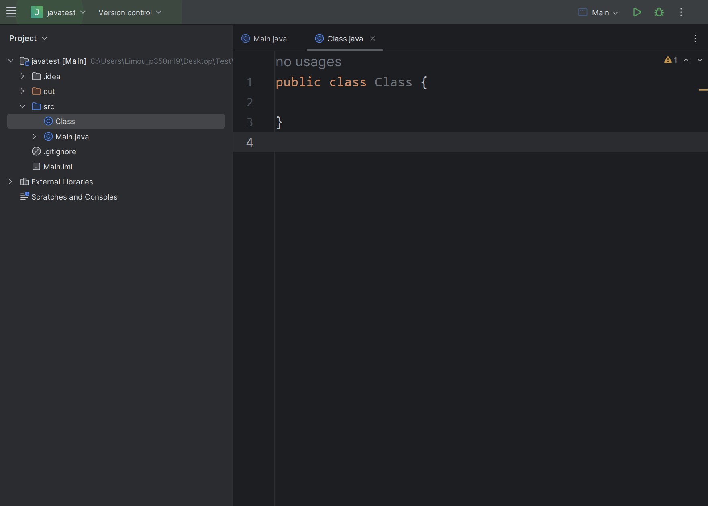

# 1.面向过程和面向对象

待补充...

# 2.类语法

## 2.1.类的描述

类描述一系列的对象，而一个类的声明如下：

```java
[类修饰符] class 类名 {
    //一些属性/成员变量...
    //一些方法/成员方法...
}
```

类和 `C` 语言的结构体很类似，但是又多了很多特性，最大的不同就是允许在类中加入方法（方法可以简单理解为函数）。

关于类，我们需要注意下面几点：

1.   一般一个 `Java` 文件内部只会存在一个类

2.   `main()` 方法所在的类一般要使用 `public` 修饰（`Eclipse` 默认会在 `public` 修饰的类中寻找 `main()` 方法）

3.   如果一个类有 `public` 修饰，那么请不要轻易修改这个类的类名（我们可以通过开发工具修改）

     

## 2.2.类的实例化

通过类描述这张“图纸”，可以实例化出多个对象。

虽然一个 `Java` 文件内部只会存在一个类，但我们可以尝试写到一起试试：

```cpp
//类描述和对象创建

//描述对象的 Person 类
class Person {
    //成员变量
    public String name; //名字
    public int age; //年龄

    //成员方法
    public String GetName() { //获取名字
        return name;
    }
    public int GetAge() { //获取年龄
        return age;
    }
}

//在主类内使用 Person 对象（主类的名字和 Java 文件命名必须一样，因此本代码所处的文件必须是 Main.java）
public class Main {
    public static void main(String[] args) {
        Person per = new Person(); //使用 new 语法创建
        per.name = "limou3434";
        per.age = 18;

        System.out.println("姓名:" + per.GetName());
        System.out.println("年龄:" + per.GetAge());
    }
}

/* 输出结果
姓名:limou3434
年龄:18
*/
```

再换成一个类一个文件的方式写，在同一个 `Java` 项目中有如下两份文件：

```java
//Person.java
//Person 类
class Person {
    //成员变量
    public String name; //名字
    public int age; //年龄

    //成员方法
    public String GetName() { //获取名字
        return name;
    }
    public int GetAge() { //获取年龄
        return age;
    }
}
```

```java
//Main.java
//Main 类
//主类内使用 Person 对象
public class Main {
    public static void main(String[] args) {
        Person per = new Person(); //使用 new 语法创建
        per.name = "limou3434";
        per.age = 18;

        System.out.println("姓名:" + per.GetName());
        System.out.println("年龄:" + per.GetAge());
    }
}
```

>   补充：对象内部是不存在方法的，只有在使用方法时才会在栈上开辟空间。而成员变量都存储在堆空间上，只有在。

# 3.this 引用


# 4.对象构造和初始化


# 5.封装

## 5.1.访问限定符

## 5.2.包

### 5.2.1.包的导入

>   补充：常见的包

### 5.2.2.自定义包

### 5.2.3.包的访问权限控制

# 6.static 成员

# 7.代码块

## 7.1.普通代码块

## 7.2.构造块

## 7.3.静态块

## 7.4.同步代码块

# 8.内部类

# 9.对象打印


