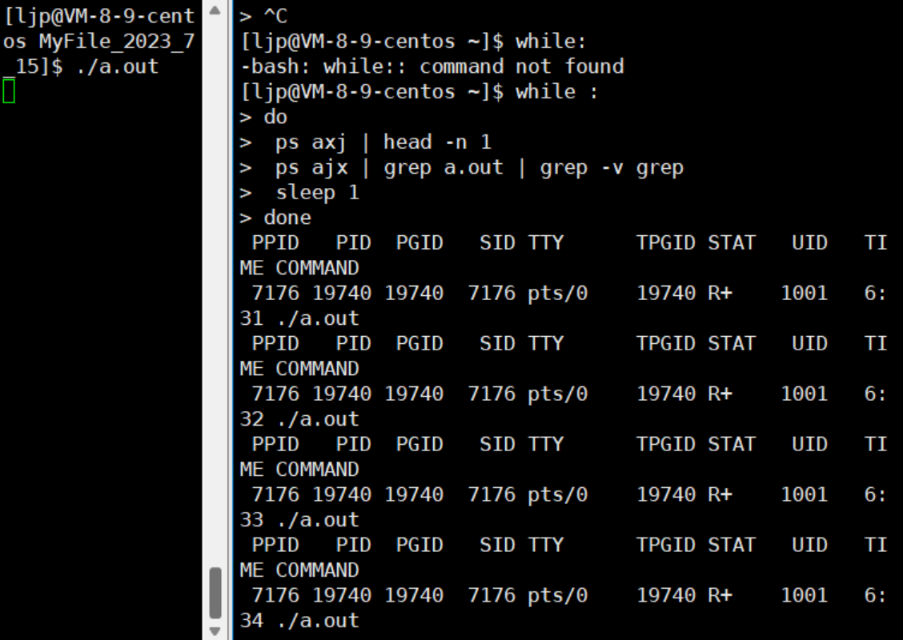
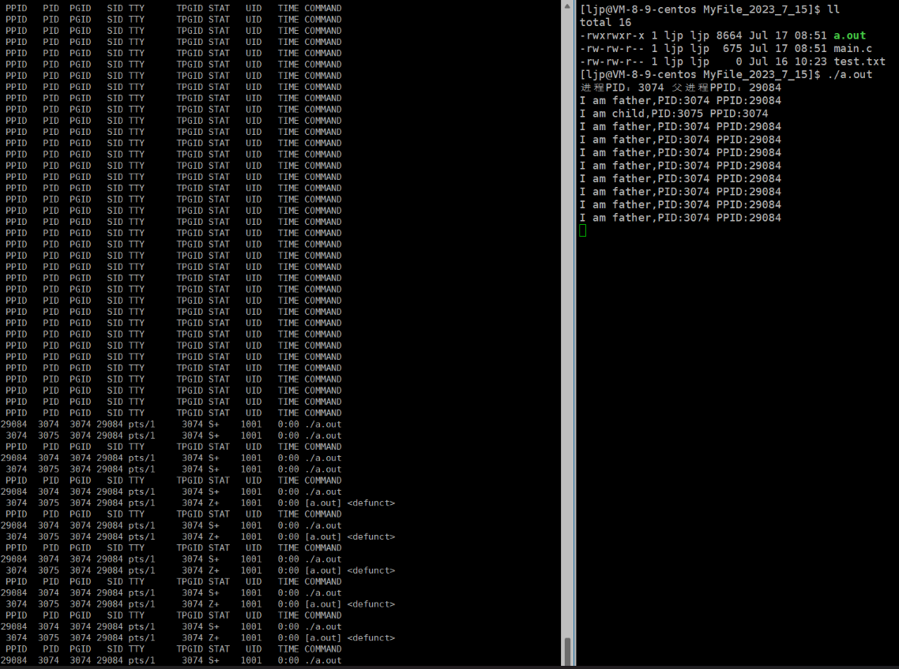
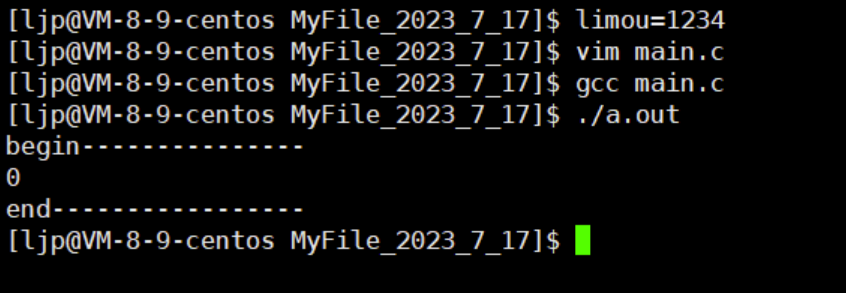

1.冯·诺依曼系统体系
=========

关于冯·诺伊曼系统，在这里我只是简单讲一讲，更加详细的内容可以看我的计算机硬件系列。

常见的笔记本、台式机，不常见的服务器、工作站，大部分都遵守“冯·诺依曼体系”，因此这个计算机体系就是现代计算机的哲学指导。 

## 1.1.早期冯·诺依曼体系


## 1.2.现代冯·诺依曼体系


> 注释1：实线为数据传输线，虚线为控制线。

> 注释2：这里的存储器指的是内存，因此个人觉得这个存储器我认为不太严谨，但是碍于很多教科书都是如此，只能续用，磁盘设备其实反倒是可以理解为输出设备，因为文件数据是会写到磁盘内部的……同理磁盘也可以作为输入设备使用。

> 注释3：控制器的作用是响应外部事件，比如：拷贝数据到内存，实际上控制器做的很多事情都是把一个数据移动到某个位置。

> 注释4：输入设备到内存的步骤为`input`，内存到输出设备的步骤为`output`，也就是`I/O`的过程，因此程序要运行，也就必须要加载到内存中。 

2.操作系统概念与定位
===========

2.1.OS的概念
---------

为了使计算机更好发挥每一个硬件的最大功能，现代的许多计算机内部都包含一个基本的程序集合，称为操作系统（即`OS`），最基本的操作系统至少应该包括：

1. 内核（进程管理、内存管理、文件管理、驱动管理）

2. xxxxxxxxxx58 1#include <stdio.h>2#include <string.h>3//#include <unistd.h>4#include <windows.h>5#define SIZE 1016#define MAX_RATE 1007#define STYLE '#'8#define STIME 100//1000 * 1000 = 1秒9const char* str = "-\\|/";10typedef void (*callback_t)(int);11void process_plus(int rate)//参数是传递了比例，根据比例来打一段进度条12{13    static char bar[SIZE];14    int num = strlen(str);//旋转光标字符的长度15    static int i = 0;16    if (rate <= MAX_RATE && rate >= 0)17    {18        printf("[%-100s][%3d%%][%c]\r", bar, rate, str[i % num]);//这里换成i是为了让旋转光标能够运作，不受进度条控制，可以让用户职别这个进度条究竟是卡住了还是仍在加载19        fflush(stdout);20        bar[rate] = STYLE;21        i++;22    }23    if (rate == MAX_RATE)//主要是用在下一次别的程序调用这个函数的时候，避免进度条数组中还有#24    {25        memset(bar, '\0', sizeof(bar));26    }//这样程序可以适用与不同的任务27}28void download_1(callback_t cb)//第一个下载任务，正常调用29{30    int rate = 0;31    while (rate <= 100)32    {33        (*cb)(rate++);//回调函数34        Sleep(STIME);//单位为毫秒35    }36    printf("\n");37}38void download_2(callback_t cb)//第二个加载任务，模拟还在加载的情况，不是进度条程序卡住39{40    int rate = 0;41    while (rate <= 100)42    {43        (*cb)(rate++);//回调函数44        if (rate == 50)45        {46            rate = 49;47        }48        Sleep(STIME);//单位为毫秒49    }50    printf("\n");51​52}53int main()54{55    download_1(process_plus);56    download_2(process_plus);57    return 0;58}c

2.2.OS的目的
---------

`OS`是一款“搞管理”的软件，主要目的是“管理”，和面向对象语言类似，操作系统必须“先描述被管理对象，再组织被管理对象”，进而实现：

1. 和硬件交互，协调管理所有的软硬件资源

2. 为用户程序（应用程序）提供一个良好的执行、开发环境

2.3.OS的管理
---------

那么`OS`的“管理”具体的结构是怎么样的呢？下面有一张图您可以简单看一下。


> 补充：系统调用和库函数的概念
> 
> 1. 在开发角度，操作系统对外会表现为一个整体，但是会暴露自己的部分接口，供上层开发使用，这部分由操作系统提供的接口，叫做系统调用。
> 
> 2. 系统调用在使用上功能比较基础，对用户的使用要求比较高，所以有的开发者可以对部分系统调用进行适度的封装，从而形成了库，有了库，就有利于上层用户或者开发者进行调用开发，也就是通过库来间接调用系统调用。

上面这张图您可能只知道表面，无法知道更加深层次的细节，但是在以后的学习中，您就可以逐渐体会到这张图的意义。

# 3.进程相关

3.1.进程和PCB
---------

### 3.1.1.进程概念

我们启动一个软件，本质就是启动了一个进程。在`Windows`下如果我们启动了某个应用程序，然后打开资源管理器（常见的快捷键是`[ctrl+alt+delete]`，或者直接打开系统的“搜索”输入“资源管理器”即可打开）就可以看到有一个对应的软件出现在进程列表中：


实际上运行程序的时候，程序中的数据和代码就会加载到内存中，然后创建出一个进程。

> 补充：这也就是为什么应用运行的多的时候，有些软件会变卡甚至崩溃的原因。因为内存上堆满了大量进程，而一条空间大小有限的内存条，一次性加载太多软件，会导致内存空间溢出，有的进程无法被获取所有的数据而正确运行，最后造成软件崩溃或者静止不动的状态。

而在`Linux`下运行一条命令`./某可执行文件`，也是在类似的。

实际上，程序被加载到内存中后，就不能叫作“程序”了，而应该叫“进程”才对（原因后面解释）！

`Linux`可以同时加载多个程序，也就是可以同时运行多个进程在系统中。而系统中存在大量的进程，那么操作系统就必须要管理好这些大量的进程。

那么`Linux`是怎么管理这些进程的呢？实际上也是“先描述再管理”。

### 3.1.2.PCB概念

操作系统会给每个加载进内存的程序申请一个结构体，也就是`PCB`数据结构（`Printed circuit board`进程控制块），这个结构体内部保存了所有代码和数据的属性。

有了这个结构体，将来就可以定义出相应的对象，而我们可以把这些对象使用链表的方式连接起来（这种链表就是一个进程队列，但是实际上不一定呈现出链表的形式，也可能使用其他数据结构混杂起来，而这里只是为了好理解一种粗略说法）也就是将进程组织起来了。

因此对进程的管理转化为了对`PCB`结构体的管理（增删查改）。

而什么是进程呢？进程=对应的“代码和数据”+形成的“`PCB`结构体”。

但是有很多人会误认为程序加载进内存就成为了进程，这种理解是错误的。

计算机管理的也不是直接管理程序的数据，而是这些对象，每一个`PCB`对象就代表一个进程。

接下来让我们来看看`PCB`是如果进行描述的，不同的操作系统`PCB`的具体实现不一样，`Linux`里的是`task_struct`，`task_struct`是`Linux`内核的一种数据结构，会被装载到`RAM`（内存）里并且包含这进程的信息。

`PCB`结构体的具体实现就是内核级别结构体`task_struct{//...};`，我们可以查看一下`Linux`的内核实现，关于`Linux`内核，您可以访问[`Linux`的官网](https://git.kernel.org/pub/scm/linux/kernel/git/stable/linux.git/?h=v6.5.4)来获取，不过文件可能有点大，下载起来可不容易。

```c
task_struct
{
    ;
}
```

1. 标识符：描述本进程的唯一标识符

2. 状态：任务状态、退出代码、退出信号等

3. 优先级：相对于其他进程的优先级，优先级高的进程会先被`CPU`调度

4. 程序计数器：程序中即将执行的下一条指令的地址

5. 内存指针：包含程序代码和进程相关数据的指针，还有和其他进程共享的内存块指针

6. 上下文数据：进程执行时处理器的寄存器中的数据

7. `I/O`状态信息：包含显示的`I/O`请求，分配给进程的`I/O`设备和被进程使用的文件列表

8. 记账信息：可能包括处理器时间总和、使用的时钟数总和、时间限制、记帐号等

9. 其他信息...

## 3.2.进程操作

### 3.2.1.使用ps命令查看运行进程

1. 查看正在运行的进程可以使用`ps`指令，默认查看当前终端下的进程

2. `ps -a`或者`ps a`：则列出所有正在运行的进程
   `ps axj`：指令则更加详细全面列出正在运行进程的信息（较常用）
   `ps -e`：则显示系统中所有进程的状态，包括其他用户的进程
   `ps -f`和`ps -l`：都可以显示详细的进程信息（后一条更详细），包括进程的父进程、`CPU`和内存占用等等
   `ps -p <PID>`：显示特定进程`<PID>`的信息，其中`<PID>`是进程的识别号
   只看自己此时运行的程序就可以使用管道`ps axj | grep '您的程序名'`，或者使用`head -1 && ps axj | grep '您的程序名'`命令也可以，其中`PID`是“进程`ID`”（是每一个进程的唯一标识）（较常用）

3. 也可以使用`top`指令（类似`Windows`下的资源管理器），不过这个显示的进程太多了因此用的比较少

4. 进程的信息可以通过`/proc`系统文件夹查看。
   例如：要查看`PID`为`1`的进程属性和信息，就可以查看`/proc/1`这个文件夹，查询其他`PID`的进程也是一样的。
   该文件内部有一个`exe`链接文件，链接的地方指向的是可执行程序的地址。
   还有一个`cmd`链接文件，`cmd`是指向进程的当前工作目录，这也可以解释一些`C`语言函数的现象：如果在`C`程序中使用`fopen()`，第一个参数只使用了文件名字，默认打开的就是当前工作路径下的这个文件，所谓“当前工作路径”也就是这个`cmd`指向的位置。而每当代码被编译运行后，每个进程都会有一个属性，来保存自己所在的工作目录，由`cmd`来链接。
   另外这也变相说明：对于`Linux`来说，进程是以文件的形式给出的，因此`proc`文件是动态存储文件的。
   
   

### 3.2.2.使用getpid()、getppid()查看进程ID

`C`代码内所有的函数都只有在程序转化为进程的时候才会被调用，因此系统接口`getpid()`也只有在程序转化为进程的时候才会获取到本进程`PID`。


运行代码后就会得到左侧的输出，这个时候我们验证一下进程的`PID`是否符合：


除了`gitpid()`还有一个`gitppid()`的调用，这个系统调用可以获取当前进程的父进程`PPID`，这里如果我们利用`ps`命令就会发现这个`PPID`实际上就是`bash`，也就是说无论是系统命令还是我们自己编写的程序，父进程永远都是`bash`。

我们把代码改`getpid()`为`getppid()`再运行代码就可以获取`bash`的`id`，也就是您代码转化为进程的父进程`id`。

### 3.2.3.使用kill命令杀死进程

这里只给出如何使用，不讲解原理。结合上述的进程`pid`，使用`kill -9 <PID>`来杀死进程`id`标识的进程。`-9`实际上是一个信号，即：给目标文件传递`9号`信号。关于信号的知识我们以后还会提及。


我们还可以尝试杀死父进程`bash`，执行后可以发现，`bash`已经没有办法正常工作了，有的时候甚至会直接退出`bash`界面...


### 3.2.4.使用fork()创建子进程

而在我们的代码内还可以使用`fork()`函数来创建子进程，但是这个`fork()`还比较奇怪，失败返回`-1`，成功的时候具有两个返回值：

1. 给父进程返回子进程的`pid`

2. 给子进程返回`0`

```c
#include <stdio.h> 
#include <unistd.h> 
#include <sys/types.h>
int main() 
{
    //fork之前是父进程     
    printf("进程PID：%d 父进程PPID：%d\n", getpid(), getppid());
    //fork之后就会执行两次     
    fork();
    printf("you can see me!\n");
    printf("进程PID：%d 父进程PPID：%d\n", getpid(), getppid());
    sleep(1); 
    return 0;
}
```

一般而言`fork()`之后代码是父子共享的（同时可以看到），同时运作的，但是实际上我们真正需要的不是让父子进程（任务）做一样的事情，而是父进程做一部分，子进程做一部分，以此来提高运行的效率，做法如下：

```c
#include <stdio.h> 
#include <unistd.h> 
#include <sys/types.h> 
int main()
{
    //fork之前是父进程
    printf("进程PID：%d 父进程PPID：%d\n", getpid(), getppid());
    pid_t id = fork();
    //从这里以后父子进程的代码都是共享的，会根据if来做调整，因此共享和执行是两回事   
    if (id < 0)
    {
        //进程创建失败    
        perror("fork");
        return 1;
    }
    else if (id == 0)
    {
        //子进程
        while (1)
        {
            printf("I am child,PID:%d PPID:%d\n", getpid(), getppid());
            sleep(1);
        }
    }
    else
    {
        //父进程
        while (1)
        {
            printf("I am father,PID:%d PPID:%d\n", getpid(), getppid());
            sleep(1);
        }
    }
    printf("you can see me!\n");
    sleep(1);
    return 0;
}
```

这个时候您的第一份多进程代码就出来了，两循环是同时进行的！如果我们使用`ps`不断测试就会发现的确存在两个进程，并且呈父子关系。


那么为什么`pdi_t`这个C语言变量会有两个值？这就事情我们在进程的地址空间中再来解答，现阶段只要知道怎么用就可以了，接下来我们先来了解一个问题：为什么设计为子进程返回`0`，父进程返回子进程的`PID`呢？因为父进程需要得到子进程的`PID`来进行管理，子进程只需要知道是否被建立成功就可以。

> 注意：操作系统和`CPU`运行某个进程，本质从`task_struct`形成的列中挑选一个`task_struct`来执行它的代码，也就是进程调度。

父子进程哪一个先运行呢？这是不一定的，这是由操作系统的调度器绝对的。

## 3.3.进程状态

在计算机系统理论上，一个进程有以下几种常见的状态（注意：下面的理论是一种计算机哲学，实际上`OS`的设计并不完全按照下面的状态分别设计，有可能进行一定的组合）：

1. 新建态：字面意思理解就行，进程刚刚创建好，还没有入队列之前都是新建状态，实际上最内核是没有所谓“新建”的状态的，这是更好的一种。

2. 运行态：进程已经在列中队列等待`CPU`处理，这就叫“运行状态”，而不是指正在运行的代码，许多的进程构成的进程队列一起等待`CPU`资源，该队列也被叫做“运行队列”。

3. 阻塞态：系统中不只存在`CPU`资源，还有网卡、磁盘、显卡等其他设备资源，而这些资源往往有限，进程又太多，而进程们需要这些资源。这个时候有的进程在被`CPU`计算之前需要先去访问其他资源，因此我们称这个进程处于“阻塞状态”。而整个过程由于`CPU`太快了，看起来好像多个运行队列都被`CPU`同时运 行着。而这一串正在访问别的非`CPU`资源而暂时无法被`CPU`执行的进程队列也被称为“阻塞队列”。比如：在C语言中使用`scanf()`函数的时候，不可能让`CPU`一直在等待它输入，`CPU`此时去调动其他进程了，而`scanf()`此时处于阻塞状态，等待输入设备资源的输入。有些时候下载会卡住就是为了等待网络资源，此时就是处于阻塞状态。

4. 就绪态：表示进程已经准备好执行，但由于`CPU`正在执行其他进程，该进程暂时无法获得`CPU`时间。

5. 挂起态：内核和操作系统需要维护的一种状态，如果表现出内存被占满时，此时操作系统会将长时间执行的进程代码和数据换出到磁盘中，这就是进程的“挂起状态”，这个磁盘空间就是`SWAP`磁盘分区，而且基本很难被填满，如果操作系统都扛不住就会造成奔溃，也就是“宕机”。

6. 挂起阻塞态：在进程正在等待某种非`CPU`资源，然后恰巧此时内存不够了，该进程被挂起，此时就是“挂起阻塞状态”。

### 3.2.7.Linux内核有关进程状态的具体描述

这一部分的东西可以看一下内核源代码（有的`Linux`环境可能不允许查询），即：`include目录->linux目录->sched.h文件`，但是`Linux`的源代码实在是太长啦，这里不方便列出来给您看，您可以了解一下自己使用的操作系统对应官网的内核源代码（如果有的话）。

但是在这里面我们可以简单了解一下源代码内部对进程状态的描述，下面是保存`Linux`进程状态的指针数组（注释内的数字是字符串对应的标识数字）：

```c
static const char* const task_struct_array[] =
{
    "R(running)", /*0：（运行态）运行中的进程，可能在等CPU资源，也有可能被CPU调度中*/
    "S(sleeping)", /*1：（阻塞态）睡眠中的进程*/
    "D(disk sleep)", /*2：磁盘睡眠中的进程*/
    "T(stopped)", /*4：暂停的进程*/
    "t(tracing stop)", /*8：追踪停止的进程*/
    "Z(zombie)", /*16：僵尸进程*/
    "X(dead)" /*32：已经终止的进程*/
};
```

接下来让我们写两份死循环代码对比一下：


可以使用以下shell命令来分别运行两个C程序：

```bash
while : do
     ps axj | head -n 1
     ps ajx | grep a.out | grep -v grep
     sleep 1 
done
```




为什么第二段代码有的时候是“运行状态`R`”，有的时候“睡眠状态`S`呢”？因为`CPU`实在是太快了，第二段代码在访问非`CPU`资源的时候，有时就处于睡眠状态。`+`说明这个进程属于“前台进程”，前台进程一旦启动，执行命令就没有任何效果了，而且可以被`ctrl`。如果希望自己的进程可以在后台运行，那么可以使用`&`符号，这个时候就会回显一个`PID`。


这个时候我们可以看到这个进程已经少了`+`标志了。而要想杀死这个进程有很多方法，这里我们依旧使用`kill`命令的`-9`信号来杀死这个进程（`-9`信号的权限很高，几乎所有进程都要响应）。


`S`为“睡眠/休眠状态”（这里的睡眠有的时候也可以叫做可“中断睡眠”）实际上就是在等待某种资源或者事件完成，由于我们没有学过事件没有概念，可以暂时理解成阻塞状态。可中断睡眠的意思就是：如果代码假设内有`sleep(100)`，这这个代码变为进程运行起来后就处于`S`状态，并且可以使用`-19`可以停止进程，使进程变成`T`状态，也就是说这个进程在睡眠阶段被中断了，也就是可中断睡眠。


而`D`状态被称为“磁盘休眠状态”，也是一种睡眠状态，又可叫“深度睡眠状态”，而且在目前的机器状态下很难模拟出来，和`S`状态的区别就是不可中断睡眠状态，不可被被动唤醒。当计算机压力过大，操作系统会通过一定手段杀掉一些睡眠的进程来起到节省空间的作用。之所以设置这个状态是因为操作系统在迫不得已的情况下会`kill`一些可中断睡眠的进程，为了避免某些重要的进程数据丢失，就可以设置深度睡眠，禁止被CPU杀掉，也就变得不可中断，保护了数据安全，只能等进程自动醒来。深度睡眠专门用来让进程访问磁盘设备时，防止进程被操作系统在极端情况误杀的一种保护状态，只有在进程读取完磁盘数据的时候才能自动醒来，甚至使用“-9”的kill信号都无法杀掉处于“D”状态的进程。

那么我们真的没有其他办法杀掉这个处于`D`状态的进程么？还是有的，软件不行，硬件来凑，关机大法好。但是有可能只能使用拔除电源的硬关机方式，因为使用内置的关机可能因为此时的磁盘还正在写入，导致软关机的方式关不了。

不过倒是可以使用`dd`状态来模拟演示`D`状态，这点可以当拓展来看即可，有时间再来研究即可。

另外有的时候如果磁盘的转速太低，而需要磁盘资源的进程有太多，有可能导致出现大量的`D`状态进程……如果这样的进程太多了，操作系统有可能会被挂掉，此时就是“宕机”或者“半昏迷”的状态，这个时候只能选择断电（降低转速的原因有可能时为了减少功率损耗，甚至有的磁盘不工作的时候就直接不转动了）。

在`Linux`中，`dd`命令被广泛用于数据的复制和转换操作。尽管`dd`命令本身并不会直接演示`D`状态，但它可能会导致进程进入`D`状态的情况。当使用`dd`命令进行磁盘复制或读写操作时，它会与磁盘进行大量的`I/O`交互。如果所涉及的数据量较大或`I/O`速度较慢，就可能导致进程在等待`I/O`完成时进入`D`状态。例如，当使用`dd`命令从一个设备（如硬盘）读取数据时，如果目标设备上的数据尚未准备好或读取速度较慢，`dd`命令所在的进程将会被阻塞，进入`D`状态，直到读取操作完成。类似地，当使用`dd`命令向设备写入数据时，如果目标设备无法及时处理写入请求或写入速度较慢，进程也会进入`D`状态，等待写入操作完成。在使用`dd`命令时，如果遇到进程长时间停留在`D`状态的情况，可能是由于磁盘操作的特性或环境造成的，可以适当调整命令参数或优化`I/O`性能来提高执行效率。

那么`T`和`t`状态有什么区别么？首先我们来模拟一下`T`或者`t`状态，使用`gdb`调试某个代码并且打入断点，`r`操作后调试停在断点出，在另外一个控制台就可以查看出这个进程正处于`T`或`t`状态，也就是“暂停状态”.其中`-19`号信号就可以做到终止进程的目的，而`-18`号信号就可以使得进程继续运行。


那么`T`状态的应用场景在哪里？典型的地方就在于调试，实际上在编写代码时所使用的断点调用就是利用的`T`状态来实现的。`T`和`t`的当一个进程被调试器（例如：`gdb`调试器）所追踪时，其状态通常会显示为`t`。这意味着该进程当前处于被调试状态，而我们手动使用`kill`停止的显示`T`状态。

而`X`状态叫做“终止状态”，如果需要销毁的进程实在太多，不可能一个进程被终止了就立刻被操作系统销毁了，因此这种状态是为操作系统做标记，好在操作系统处理好其他事情后根据`X`标记来销毁这些已经结束的进程（已经做好被操作系统回收的准备了）。因此这个`X`状态也很难看到和捕捉，瞬时性非常强。

而剩下的一个状态就是“`Z`状态”，也就是“僵尸状态”，这个比较难以理解，下面会重点单独讲解“僵尸状态”。

僵尸状态是指：一个进程已经退出，还不允许被操作系统回收，处于一个被检测的持续状态。那么是谁在进行检测呢？一般是父进程或者操作系统来进行检测，检测进程退出的结果是否异常，而只有等到检测完毕才可以被操作系统回收。

下面演示“僵尸状态”：




并且左侧有回显“`<defunct>`”，即“失效的”。一个进程如果是僵尸状态，现阶段可以简单理解成：僵尸进程里的代码和数据可以释放掉，但是创建出来的`PCB`并没有被释放掉，会被一直维护，占用资源。

僵死进程会以终止状态保持在进程表中，并且会一直在等待父进程读取退出状态代码。

僵尸状态是很特殊的一种状态，当进程退出并且父进程（使用`wait()`调用，以后会讲到这个函数的使用）。

这和僵尸电影里的僵尸不是很类似么，明明死去却依旧以“半死不活的状态（进程结束）”留停在“人间（计算机内）”，就需要“道士（父进程回收）”进行回收降伏。

那么是否可以创建一个恶意程序，让父进程不断创建出僵尸状态的进程来占取大量内存来“卡死”计算机呢？这件事情是有可能的，这种情况也是内存泄露的一种！我们在后续编写代码中必须要想办法回收僵尸进程。

而关于僵尸进程的解决办法，我将在下一篇博文写出。

下面总结一下状态之间的变化：


## 3.3.孤儿进程

孤儿进程不是一种进程状态，而是一种进程类别，注意和上面的进程状态概念区分。

父进程如果提前退出，那么子进程被称为“孤儿进程”，注意和“僵尸状态”做概念上的区分。

如果子进程退出了，而父进程没有退出并且也不理会这个子进程（回收），那么此时的子进程就处于“僵尸状态”。如果理会了子进程，就是子进程被成功回收。

如果父进程先挂掉了，无论子进程是否结束，都可以叫此时的子进程为“孤儿进程”，若是子进程结束，则子进程又陷入了“僵尸状态”。

因此上述的问题主要是出现在代码编写逻辑错误的时候，如果出现了孤儿进程就必须被“1号init进程”领养，下面我们来写一段代码来感受一下：

```c
#include <stdio.h> 
#include <unistd.h> 
int main() 
{ 
    pid_t id = fork();
    if(id == 0)
    {
        //child
        while(1)
        {
            printf("hello i am child\n");
            sleep(1);
        }
    } 
    else 
    {
        //fatcher
        int n = 6;
        while(n >= 0)
        {
            printf("hello i am fatcher\n %d", n);
            sleep(1);
            n--;
        }
    }
    return 0; 
}
```


可以看到父进程一结束，子进程的`PPID`瞬间切换为`1`，也就是被`1号init`进程所“领养”，这个进程可以简单理解为系统本身。

但是为什么父进程退出后，子进程要被“领养”呢？因为回收子进程的代码一般处于父进程中，如果子进程变成孤儿进程则没有人来回收该进程，那么就需要被其他进程领养进行回收。

而且从上面的结果图我们可以看到，如果子进程变成了孤儿进程，其状态变成后后台运行状态，这就意味着，我们无法使用`[ctrl+c]`快捷键方式终止这个进程（命令行显示该快捷键为`^C`）。

> 不过比较好玩的是，基本是在左侧不断输出后台进程的`bash`界面中依旧是可以正常输入命令的，只不过输入命令显得的有点乱……  

## 3.4.进程的优先级

### 3.4.1.优先级的概念

1. `CPU`资源分配的先后顺序就是指进程的优先权，之所以设计优先级的本质在于：`CPU`是有限的、稀缺的，但是进程太多。

2. 优先权高的进程有优先执行权利，配置进程优先级别对多环境的`Linux`很有用，可以改善系统性能。

3. 优先级在具体实现为`PCB`结构体内部的某个整数数据，交给调度器评判优先级来对进程队列进行“调度”。

### 3.4.2.为何有优先级

可以把进程运行到指定的`CPU`上，这样可以把不重要的进程安排到某个`CPU`，大大改善整体性能。

### 3.4.3.Linux优先级具体实现

`优先级=老的优先级+nice值`，`nice值`是什么呢？

下面我们来编写一个代码，并且使用命令`ps -la`的形式输出详细的进程列表，或者使用`ps -al | head -1 && ps -la | grep a.out`输出


我们梳理一下这里出现的几个重要的进程信息：

1. `UID`：代表执行者的身份

2. `PID`：代表该进程的代号

3. `PPID`：代表该进程的父进程代号

4. `PRI`：代表这个进程可被执行的优先级，其值越小越早被执行

5. `NI`：代表这个进程的`nice值`，表示进程可以被执行的优先级的修正数值，也就是说`Linux`中的进程优先级是可以被调整的，调整进程的`nice值`就是调整进程的优先级。如果`nice值`为负数，那么该程序的优先级会变小，反之变高。`PRI(new)=PRI(old)+nice`

### 3.4.4.查看/修改进程的优先级

可以使用`top`工具来查看进程的优先级，进入`top`后输入`r`然后再输入某进程的`PID`，接着输入想要的`nice值`即可修改进程的优先级。


为什么`PRI`只加了`19`呢？因为我们规定了`nice`的取值范围是`[-20,19]`，一共有`40`个级别。


如果需要高优先级，那么就必须使用管理员权限来调整`nice值`，否则大概率只能调低优先级，调高就会出现上面的错误提示，下面我们使用`sudo top`来修改优先级。


需要注意的是每次修改优先级是根据`默认PRI值，即：80`来结合`nice值`的，也就是说：每次设置`nice`值的时候，公式`PRI(new)=PRI(old)+nice`中的`PRI(old)`默认值为`80`。


一款优秀的操作系统在能提供优先级的同时还可以在调整优先级的时候尽量不打破调度平衡，因此`nice值`本身也不会特别大。

下面再普及一些有关进程调度的相关术语

1.竞争性：系统进程数量众多，而`CPU`资源只有少量，甚至只有一个，所以进程之间是有竞争关系的，为了高效完成任务，更加合理竞争资源，也就有了优先级

2.独立性：多进程运行，需要独享各种资源，多进程运行期间互不干扰，而 父子进程之间也是具有独立性的。只有一个`CPU`的情况下理应只有一个进程在运行，但是一个时间端内不一定。

3.并发：多个进程在一个`CPU`下采用进程切换的方式，在一端时间之内，让多个进程都得以推进，称之为“并发”

4.并行：多个进程在多个`CPU`先分别同时运行，这称之为并行。通常并行的多个`CPU`内部也是采用并发的设计。

5.时间片：一个进程不可能一直占用`CPU`，要不然其他进程都会表现出卡死的状态，因此我们给一个进程设置了时间片，让该进程只能运行一个时间片段的时间，能运行多少看进程数据和`CPU`的计数，过了这段时间后`CPU`切换另外一个进程进行处理，也是按照一定时间段来运行这个进程，这样不断切换切换，达到“雨露均沾”的效果。因此哪怕是写出一个关于死循环的进程，也不会导致“卡死”的状态。

6.抢占与出让：如果操作系统发现有优先级更高的进程，哪怕当前`CPU`处理的程序没有过完一个时间片，也会出让给优先级更高的进程来抢占。

7.切换与上下文：`CPU`内部存在大量的寄存器，进程加载到`CPU`实际上是将数据加载到寄存器。如果`进程A`正在被运行，那么`CPU`内部的寄存器里面此时是`进程A`的临时数据，也叫做`A`的“上下文”，“上下文”数据在短期内不可以被丢弃，否则这个正在运行的`A进程`就废掉了。可是这样就有问题了，因为`进程A`是不可能一直把上下文存放在`CPU`内部的寄存器的，因此经过一个时间片后后，进程A在被其他进程切换时必须保存好自己的上下文数据，等到下次`进程A`又被`CPU`执行的时候，`CPU`通过重新加载上下文才不会忘记这个进程的执行情况。有了上下文保存才能使进程有切换的可能。  

# 4.环境变量与相关命令

4.1.环境变量概念
----------

首先要知道一个事实：`Linux`里面使用的指令也是经过代码编写产生的可执行文件，在`Linux`下的任何文件路径都可以使用这些指令，那能不能让我们自己编写的代码也这样呢？答案是可以，不过需要使用环境变量。

在编写`C/C++`代码的链接的时候，我们是不知道链接的动态静态库在哪里的，都是照样可以链接成功，生成可执行程序，原因也是有相关环境变量帮助编译器进行查看。

环境变量是指在操作系统中用来指定操作系统运行环境的一些参数，环境变量通常具有某些特殊用途，还有在系统中通常具有全局特性。  

## 4.2.常见环境变量

1. `PATH`：指定命令的搜索路径

2. `HOME`：指定用户的主工作目录（指令`cd ~`就是根据`HOME`变量来进行确认的）

3. `SHELL`：当前`Shell`，其值通常为`/bin/bash`。

4. `HISTSIZE`：其值为设置shell历史记录大小的变量（使用`history`指令可以查看`HISTSIZE`条历史指令）

5. `LS_COLORS`：环境变量是用于设置`ls`命令在终端中显示不同文件类型和属性时的颜色的变量。通过指定不同文件类型和属性对应的颜色码，可以使文件在终端中以不同的颜色进行区分和显示

6. `LOGNAME`：记录登录的用户名

`Linux`中的环境变量有很多，基本都是独立工作的，各有各的功能。  

## 4.3.查看环境变量的方法

使用命令`echo $NAME`即可查看对应变量的情况，如果不带`$`符号就直接打印出来了。


在`Windows`操作系统里也是可以有相关的环境变量操作的。

还可以使用命令`env`来查看当前系统的所有环境变量（`set`命令则是显示本地定义的`shell`变量和环境变量）：


一般情况下，在`Linux`命令行中修改环境变量只适用于本次会话（本次登录），一旦退出登录就无效了，不过如果修改的是保存环境变量的文件就有可能造成较大的影响.

## 4.5.修改PATH环境变量

如果我们想要实现我们自己编写的可执行程序和`Linux`内置指令一样的使用效果，有两种方法，一是吧您自己写的可执行程序放进`PATH`环境变量中的文件路径下，这样就可以像使用`Linux`指令一样使用自己编写的可执行程序（一般放在`/usr/bin`下比较多，这种行为叫做“给系统安装程序”，但是这种做法不建议，有可能污染操作系统）。

还有一种方法是使用配置`PATH`环境变量，这样操作不会污染到系统的文件。


如果使用命令`unset 某环境变量`可以清除某个环境变量，使用后就会发现连其他的`Linux`指令都无法使用了，不过不用担心，下次登录还是会恢复默认的`PATH`值的。

# 4.6.环境变量的组织形式

每个程序都会收到一张环境表，环境表是一个字符指针数组，每个指针指向一个以`\0`结尾的环境字符串（下面是简化版），并且最后一个元素指向`NULL`。


## 4.7.通过代码获取环境变量

实际上`main`函数可以带上三个参数，第三参数实际上就是有关环境变量的参数：

```c
int mian(int argc, char * argv[], char * env[])
{}
```

这里的`env`数组也就对应上面的`char*`类型数组。

因此我们可以尝试使用这个这个参数来编写相关环境变量的代码。


除了这种方法还可以使用`unistd.h`内定义的`environ`全局变量来获取环境变量的值。


但是前两种方法我们都不怎么使用，最常用的是使用`stdlib.h`的`getenv()`函数，根据参数来获取对应的环境变量值（其参数是想获取环境变量的变量名字）。

> 一般`main`函数的环境变量参数是又父进程继承过来的，父进程也是从它自己的父进程获取的，最终在`bash`进程获取，而所有进程的父进程是当前`bash`。这也是环境变量之所以具有全局属性的本质原因，而`env[]`参数也是依靠父进程传参的。这一点您可以在`bash`下自己创建一个环境变量，然后使用C语言库内的`getenv()`函数读取环境变量。

实际上对应环境变量这样的“全局变量”，还有一个“局部变量”，即：`shell`变量，就是直接在`bash`定义一个变量，这个变量可以使用`set`命令查看，没有办法在C代码中使用`getenv()`获取。

shell变量实际上最常用的场景是在`shell`脚本里，这个`shell`脚本我们以后再提及。




上面没有办法获取`shell`变量的。

> 另外这里顺便科普一下命令行参数`argc`和`argv[]`，前者获取的是命令字符串的个数，后者是存储命令字符串的char*指针数组，由启动程序的命令字符来负责传递参数给这两个变量。这两个参数就给我们一种可能：制作带有选项的自定义Linux命令的可能性，再结合环境变量，完全可以做出“原滋原味”的Linux指令（这实际上也是Linux内置指令的实现方式）。 

# 5.进程地址空间和虚拟空间

## 5.1.进程地址空间布局

我们以`Linux2.6.32（32位平台）`为研究背景


> 注释1：未初始化数据全称为“未初始化全局数据区”、已初始化数据全称为“已初始化全局数据区”

> 注释2：栈的使用向下增长，堆的使用向上增长，不过这些现象仅限于`Linux`中，尤其是这几年的`Windows`操作系统在这方面改动比较多（为了系统安全考虑）。

> 注意3：进程地址空间是一个抽象的概念，不是内存！就连以前我们打印的指针地址也不是真正的内存地址（是一个虚拟内存地址），以前学习C语言的时候只是为了方便说明，没有深入探究。

关于这点我们可以通过C代码来证明：

```c
#include <stdio.h>
#include <stdlib.h>
int g_value_2;
int g_value_1 = 10;
int main(int argc, char* argv[], char* env[])
{
    printf("code addr<代码区/正文>: %p\n\n", main);
    const char* str = "hello word!";
    /*
        注意“hello word!”是存储在正文代码区域（说），实际上所有的字面常量都是硬编码进代码的
        而代码是只读的，不可以被修改的        
        而str变量的空间开辟在栈上，
        但是str这个指针变量保存的是处于静态数据区内的“hello word!”里'h'的地址，
        故打印str就是打印静态数据区的地址
    */

    printf("read only addr<静态区>: %p\n\n", str);

    printf("init g_value_1 global addr<已初始化全局变量区>: %p\n\n", &g_value_1);//static变量也会放在这里，您可以自己试一下在这里加上一个static变量（这也就是为什么static变量只会初始化一次的原因）

    printf("uninit g_value_2 global addr<未初始化全局变量区>: %p\n\n", &g_value_2);

    int* p1 = (int*)malloc(sizeof(int) * 10);
    int* p2 = (int*)malloc(sizeof(int) * 10);
    printf("heap addr<堆区>: %p\n", p1);
    printf("heap addr<堆区>: %p\n\n", p2);

    printf("stack addr<栈区>: %p\n", &str);
    printf("stack addr<栈区>: %p\n", &p1);
    printf("stack addr<栈区>: %p\n\n", &p2);

    for (int i = 0; i < argc; i++)
    {
        printf("command line paramete<命令行参数>r：argv[%d] = %p\n", i, argv[i]);
    }
    printf("\n");
    for (int j = 0; env[j]; j++)
    {
        printf("command line parameter<环境变量>：env[%] = %p\n", j, env[j]);
    }

    free(p1);
    free(p2);
    return 0;
}
```

```bash
$ ./a.out abde dasdas asdasd asdasd asdasdad #后面是随意输入的参数
code addr<代码区/正文>: 0x40060d

read only addr<静态区>: 0x400882

init g_value_1 global addr<已初始化全局变量区>: 0x60104c

uninit g_value_2 global addr<未初始化全局变量区>: 0x601054

heap addr<堆区>: 0x7d2010
heap addr<堆区>: 0x7d2040

stack addr<栈区>: 0x7ffc4c26aa10
stack addr<栈区>: 0x7ffc4c26aa08
stack addr<栈区>: 0x7ffc4c26aa00

command line paramete<命令行参数>r：argv[0] = 0x7ffc4c26b7bf
command line paramete<命令行参数>r：argv[1] = 0x7ffc4c26b7c7
command line paramete<命令行参数>r：argv[2] = 0x7ffc4c26b7cc
command line paramete<命令行参数>r：argv[3] = 0x7ffc4c26b7d3
command line paramete<命令行参数>r：argv[4] = 0x7ffc4c26b7da
command line paramete<命令行参数>r：argv[5] = 0x7ffc4c26b7e1

command line parameter<环境变量>：env[%] = (nil)
command line parameter<环境变量>：env[%] = 0x1
command line parameter<环境变量>：env[%] = 0x2
command line parameter<环境变量>：env[%] = 0x3
command line parameter<环境变量>：env[%] = 0x4
command line parameter<环境变量>：env[%] = 0x5
command line parameter<环境变量>：env[%] = 0x6
command line parameter<环境变量>：env[%] = 0x7
command line parameter<环境变量>：env[%] = 0x8
command line parameter<环境变量>：env[%] = 0x9
command line parameter<环境变量>：env[%] = 0xa
command line parameter<环境变量>：env[%] = 0xb
command line parameter<环境变量>：env[%] = 0xc
command line parameter<环境变量>：env[%] = 0xd
command line parameter<环境变量>：env[%] = 0xe
command line parameter<环境变量>：env[%] = 0xf
command line parameter<环境变量>：env[%] = 0x10
command line parameter<环境变量>：env[%] = 0x11
command line parameter<环境变量>：env[%] = 0x12
command line parameter<环境变量>：env[%] = 0x13
command line parameter<环境变量>：env[%] = 0x14
command line parameter<环境变量>：env[%] = 0x15
command line parameter<环境变量>：env[%] = 0x16
```

> 注意：我们这里将进程地址空间倒过来打印了，所以地址大小呈现出越来越大，也就是从低地址到高地址。您也可以通过一些文本指令倒过来打印。

```bash
$ ./a.out abde dasdas asdasd asdasd asdasdad | tac
command line parameter<环境变量>：env[%] = 0x16
command line parameter<环境变量>：env[%] = 0x15
command line parameter<环境变量>：env[%] = 0x14
command line parameter<环境变量>：env[%] = 0x13
command line parameter<环境变量>：env[%] = 0x12
command line parameter<环境变量>：env[%] = 0x11
command line parameter<环境变量>：env[%] = 0x10
command line parameter<环境变量>：env[%] = 0xf
command line parameter<环境变量>：env[%] = 0xe
command line parameter<环境变量>：env[%] = 0xd
command line parameter<环境变量>：env[%] = 0xc
command line parameter<环境变量>：env[%] = 0xb
command line parameter<环境变量>：env[%] = 0xa
command line parameter<环境变量>：env[%] = 0x9
command line parameter<环境变量>：env[%] = 0x8
command line parameter<环境变量>：env[%] = 0x7
command line parameter<环境变量>：env[%] = 0x6
command line parameter<环境变量>：env[%] = 0x5
command line parameter<环境变量>：env[%] = 0x4
command line parameter<环境变量>：env[%] = 0x3
command line parameter<环境变量>：env[%] = 0x2
command line parameter<环境变量>：env[%] = 0x1
command line parameter<环境变量>：env[%] = (nil)

command line paramete<命令行参数>r：argv[5] = 0x7ffe249247e1
command line paramete<命令行参数>r：argv[4] = 0x7ffe249247da
command line paramete<命令行参数>r：argv[3] = 0x7ffe249247d3
command line paramete<命令行参数>r：argv[2] = 0x7ffe249247cc
command line paramete<命令行参数>r：argv[1] = 0x7ffe249247c7
command line paramete<命令行参数>r：argv[0] = 0x7ffe249247bf

stack addr<栈区>: 0x7ffe24922fe0
stack addr<栈区>: 0x7ffe24922fe8
stack addr<栈区>: 0x7ffe24922ff0

heap addr<堆区>: 0x114d040
heap addr<堆区>: 0x114d010

uninit g_value_2 global addr<未初始化全局变量区>: 0x601054

init g_value_1 global addr<已初始化全局变量区>: 0x60104c

read only addr<静态区>: 0x400882

code addr<代码区/正文>: 0x40060d
```

通过上述代码的地址变化，我们可以验证进程地址空间是真实存在的。

> 注意：我们还能发现栈区和堆区中间有巨大的“镂空”。

> 注意：同时根据多个栈地址和多个堆地址，我们可以发现栈和堆相向而生。

> 注意：上述代码的地址都是程序运行后才打印出来的，也就是进程打印出来的。

在32位下一个进程的地址空间的取值范围是`0x0000 0000~0xFFFF FFFF`。其中`[0, 3GB]`为用户空间，`[3GB, 4GB]`为内核空间。往后我们理解地址空间，一定要想到这`4GB`的空间，而不仅仅是那`3GB`的空间。

## 5.2.虚拟空间的存在

为什么说我们以前在C语言提到的内存不是真实内存而是虚拟内存呢？我们首先可以通过一个C程序观察一下现象：

```c
#include <stdio.h>
#include <unistd.h>
int g_val = 100;
int main()
{
    pid_t id = fork();
    if(id == 0)
    {
        while(1)
        {
            printf("I am a child. pid = %d, ppid = %d, g_val = %d, &g_val = %p\n.", getpid(), getppid(), g_val, &g_val);
            sleep(1);
            int cnt = 0;
            cnt++;
            if(cnt == 5)
            {
                g_val = 200;
                printf("child chage g_val = 100 --> g_val = 200\n");
            }
            else
            {
                while(1)
                {
                     printf("I am a father. pid = %d, ppid = %d, g_val = %d, &g_val = %p\n.", getpid(), getppid(), g_val, &g_val);
                    sleep(1);
                }
            }
        }
    }        
    return 0;
}
```

```bash
$ vim main.c
$ gcc main.c
$ ./a.out
I am a father. pid = 21420, ppid = 29863, g_val = 100, &g_val = 0x60105c.
I am a child. pid = 21421, ppid = 21420, g_val = 100, &g_val = 0x60105c.
I am a father. pid = 21420, ppid = 29863, g_val = 100, &g_val = 0x60105c.
I am a child. pid = 21421, ppid = 21420, g_val = 100, &g_val = 0x60105c.
I am a father. pid = 21420, ppid = 29863, g_val = 100, &g_val = 0x60105c.
I am a child. pid = 21421, ppid = 21420, g_val = 100, &g_val = 0x60105c.
I am a father. pid = 21420, ppid = 29863, g_val = 100, &g_val = 0x60105c.
I am a child. pid = 21421, ppid = 21420, g_val = 100, &g_val = 0x60105c.
I am a father. pid = 21420, ppid = 29863, g_val = 100, &g_val = 0x60105c.
I am a child. pid = 21421, ppid = 21420, g_val = 100, &g_val = 0x60105c.
I am a father. pid = 21420, ppid = 29863, g_val = 100, &g_val = 0x60105c.
child change "g_val = 100 --> g_val = 200".
I am a child. pid = 21421, ppid = 21420, g_val = 200, &g_val = 0x60105c.
I am a father. pid = 21420, ppid = 29863, g_val = 100, &g_val = 0x60105c.
I am a child. pid = 21421, ppid = 21420, g_val = 200, &g_val = 0x60105c.
I am a father. pid = 21420, ppid = 29863, g_val = 100, &g_val = 0x60105c.
```

欸！我们发现了一个离谱的现象：子进程修改的全局变量不会影响父进程的输出该全局变量的值，也就是说”在同一个地址不同的两次访问的值出现了不同值“。

那么这就让我们怀疑一个事实，全局变量的分别打印出来的两个相同数值地址，真的是“相同”的么？

也就是说，我们通过`printf()`和`&`打印出来的地址绝对不是物理意义（或者叫”实际意义“）上的内存地址，因为如果是真实的地址，是不可能同时存储两个值的。

实际出来的地址是虚拟地址（在Linux里也叫”线性地址“）。每个进程都认为自己用的地址是真实地址，实际上它被操作系统”欺骗“了，它使用的是虚拟地址，这些虚拟地址整体构成虚拟空间。

> 注意：实际上几乎所有带有”地址“概念的语言使用的地址都是虚拟地址。 

> 注意：不止是CPU有寄存器，其他外设或者显卡也有寄存器，这些地址也应该被利用，所以我们给计算机一个虚拟地址空间，使得虚拟地址可以一一映射内存地址、显卡寄存器地址等等地址，而我们的程序在调用的时候也会误认为自己用的是内存地址，从而达到统一对待真实地址的目的。

## 5.3.进程地址空间、虚拟地址空间、物理地址空间的关系

在很久以前，多个进程的确是直接进入内存的，但是，一旦在运行某个进程的过程有可能出现：

1. 野指针问题：对野指针的访问有可能出现篡改其他进程数据的情况，这是极其危险的。而且对于黑客来说，如果某个进程是需要密钥等方式才可以进入，那么就会出现某些黑客软件在运行过程中窃取该进程数据的可能，导致数据不安全。

2. 内存碎片问题：如果直接加载进内物理存，就极有可能出现内存碎片问题，导致内存空间分配不合理。

因此直接写进物理空间的方式极其不安全、不合理。于是就出现了虚拟地址空间，每个进程通过虚拟地址空间，都认为自己占用了整个进程地址空间，实际上这是操作系统的一种“骗术”，操作系统在管理每一个进程的虚拟地址空间，再一一映射到物理内存，这样子就可以解决上面的两个问题。


因此我们可以知道进程地址空间是进程使用物理内存和虚拟内存的一个内存使用模板 。

另外，内核中的“进程地址空间”的本质是一种“数据结构”的描述，虚拟地址空间本质也是一种“数据结构”的定义，依靠这个数据结构来划分地址范围。

```c
struct addr_room
{
    int code_start;
    int code_end;

    int init_start;
    int init_end;

    int uninit_start;
    int uninit_end;

    int heep_start;
    int heep_end;  

    int stack_start;
    int stack_end;

    //...
};
```

在`task_struct`结构体中，有一个成员`mm_struct* mm`，指向进程所拥有的虚拟地址空间，而操作系统通过某种映射关系（或者叫“页表”）来映射到物理内存中。地址空间和页表（用户级）是每一个进程都私有一份的。

只要保证每一个进程的页表映射的是不同区域，就能做到进程之间相互独立、安全。

> 注意：有关于“页表”的知识，我们后面会再次提到。

## 5.4.解释现象

经过前几个小节的铺垫，我们现在终于可以解释前面父子进程代码的问题所在了。父子进程使用的同名的全局变量，根本就是两个变量！

子进程会继承很多父进程的数据，但是也不是全部照搬复制，也是有所修改的，其中就包括地址空间。可以看到虚拟内存都是一样的，一开始还没有修改的时候，由于分页一样，所以物理内存是一样的。但是如果子进程修改了`g_val`，操作系统会重新开辟一块物理内存，并且修改分页映射，但是虚拟地址没有被改变，因此此时父子进程能在同一个虚拟地址访问不同的两个物理内存的数据（这种策略也叫“写时拷贝”，后面还会继续详谈）。

> 此时我们还可以开始回答之前提到的一个问题：`fork()`为什么会有两个返回值？
> 
> 这是因为在代码`pid_t id = fork()`中，`fork()`返回的值实际上是给`id`变量做一种写入。而父子进程的代码一样的，都会只执行`if-else`的判断。而写入就需要从内存中获取，而父子进程在物理内存中`id`的地址是不同的，因此会有两个返回值，而在父子进程各自的虚拟空间中，`id`都是一样的地址值（发生了写时拷贝）。

## 5.5.小拓展

当我们的程序在编译的时候，在生成可执行程序且还没有加载到内存中的时候存在地址么？

答案是：可执行程序在编译的时候，内部实际上早就有地址了！

地址空间不要仅仅是`0S`内部要遵守的，其实编译器也要遵守，即：编详器编译代码的时候，就已经给我们形成了“各个区域”代码区、数据区。并且，采用和`Linux`内核中一样的编址方式，给每一个变量，每一行代码都进行了编址。

故：程序在编译的时候，每一个字段早已经具有了一个虚拟地址。

而虚拟地址也是数据，因此代码被加载到内存中的时候，不仅仅是加载了代码，实际上虚拟地址也被加载进去了。

程序内部地址使用的是地址，依旧是编译器编好的地址，当程序加载到内存，每行代码、每个变量就具有了一个物理地址。

并且`CPU`读取的是虚拟地址。

再来理顺一下：

1. 对于磁盘中的可执行程序，除了存储代码本身，还存储了每一句和变量对应的地址。这些地址是虚拟地址，由编译器编址，方便编译做跳转。

2. 将可执行程序加载进物理内存，转化为进程后，进程本身有需要物理地址，这样每一条代码都有两个地址。（实际上就是在填写页表，使得虚拟地址和物理地址一一对应）

3. 接下来创建出`task_struct`的`PCB`结构体，内部包含一个`mm_struct`的进程地址空间结构体，构建了一个页表映射关系（`key->value`）。

4. 然后根据编译器把代码的各区起始虚拟地址和结尾虚拟地址填充到进程地址空间对地址空间范围的划分（`start`和`end`），这样进程地址空间的各个区域范围就设置好了。

5. 这个时候`CPU`先根据程序的第一个虚拟地址，通过进程结构内的进程地址空间范围，再根据页表的映射关系，查找到物理内存内的代码和虚拟空间，又拿取到虚拟地址再循环上面的步骤进行处理。

# 6.O(1)调整算法架构


加载的本质是创建进程，但是不是要立马将代码和数据加载到内存并且创建数据结构映射表。在最极端的情况下（内存不够用），甚至只有内核结构（地址空间和页表还有进程结构体）被创建出来，而这个状态就是新建状态。理论上就可以实现堆程序的分批加载、分批换出（换出也就是挂起，短时间内不会执行该进程）。
