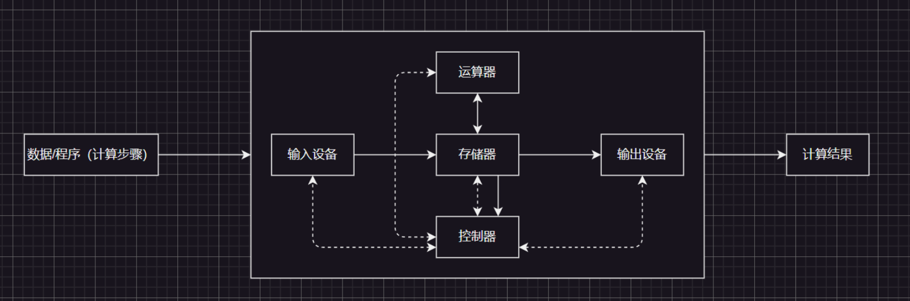
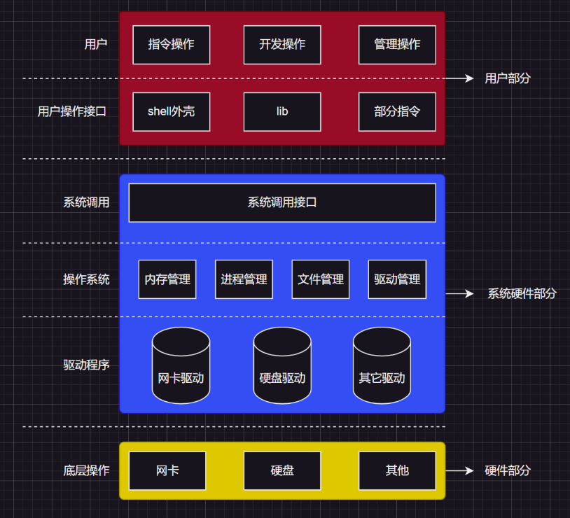

1.冯·诺依曼计算机体系
=========

关于冯·诺伊曼系统，在这里我只是简单讲一讲，更加详细的内容可以看我的计算机组成系列。

常见的笔记本、台式机，不常见的服务器、工作站，大部分都遵守“冯·诺依曼体系”，因此该计算机体系就是现代计算机的哲学指导。 

## 1.1.早期冯诺依曼体系

## 1.2.现代冯诺依曼体系

> 注释`1`：实线为数据传输线，虚线为控制线。
>
> 注释`2`：这里的存储器指的是内存，因此个人觉得这个存储器不太严谨，但是碍于很多教科书都是如此书写，只能得续用。
>
> 注释`3`：磁盘设备其实反倒是可以理解为输出设备，因为文件数据是会写到磁盘内部的……同理磁盘也可以作为输入设备使用。
>
> 注释`4`：控制器的作用是响应外部事件，比如：拷贝数据到内存，实际上控制器做的很多事情都是把一个数据移动到某个位置。
>
> 注释`5`：输入设备到内存的步骤为`input`，内存到输出设备的步骤为`output`，也就是`I/O`的过程，因此程序要运行，也就必须要加载到内存中。 
>
> 注释`6`：实际上很多的硬件设备都是具有存储数据能力的，只不过是存储量的大小不一罢了。而所谓的硬件之间进行交流，也就是利用各个硬件中的存储空间，来进行数据的拷贝/迁移。
>
> 注释`7`：`SSD`是固态硬盘，比磁盘的读写速度快，但是价格也比普通的磁盘要贵，因此有很多企业还会购买大量的磁盘来使用，减少成本（一般存储效率高的存储硬件要更贵）。
>
> 注释`8`：现代很多的`CPU`只能对内存进行读写，不能直接和外设（输入输出设备）进行数据交流。根据“木桶效应”，由于速度最慢的就是`CPU`和外设直接数据交互，导致整机效率降低（所以`CPU`一般为了高效，一般只和内存打交道）。
>
> 注释`9`：内存可以理解为大的缓存空间。

2.操作系统概念与定位
===========

2.1.OS的概念
---------

为了使计算机更好发挥每一个硬件的最大功能（更好符合冯诺依曼结构，提高硬件交互效率），现代的许多计算机内部都包含一个基本的程序集合，称为操作系统（即`OS`），最基本的操作系统至少应该包括：

1. 内核（进程管理、内存管理、文件管理、驱动管理）

2. 其他程序（函数库、`shell`外壳程序等）

2.2.OS的目的
---------

`OS`是一款“搞管理”的软件，主要目的是“管理硬件和软件”。和面向对象语言类似，操作系统必须“先描述被管理对象，再组织被管理对象”，进而实现：

1. 和硬件交互，协调管理所有的软硬件资源
2. 为用户程序（应用程序）提供一个良好的执行、开发环境

> 补充：在`C`语言中，实际体现管理和组织时：
>
> 1. 管理：使用`struct`结构体来描述硬件或者软件
> 2. 组织：使用链表等高效数据结构组织`struct`结构体的实例化

2.3.OS的管理
---------

那么`OS`的“管理”具体的结构是怎么样的呢？下面有一张图您可以简单看一下。

> 补充`1`：系统调用和库函数的概念
>
> 1. 在开发角度，操作系统对外会表现为一个整体，但是会暴露自己的部分接口，供上层开发使用，这部分由操作系统提供的接口，叫做系统调用。
>
> 2. 系统调用在使用上功能比较基础，对用户的使用要求比较高，开发者可以对部分系统调用进行适度的封装，从而形成了库（例如`C`库）。有了库，就有利于上层用户或者开发者进行调用开发，也就是通过库来间接调用系统调用。
>
> 3. 需要注意系统调用的运行过程是在内核态中完成的，操作系统不允许用户直接访问内核，也就是说用户运行态不满足访问内核的权限
>
>     >   用户态和内核态是指操作系统中的两种不同的运行模式，其中：
>     >
>     >   1.   用户态是指进程在执行自己的代码时所处的非特权模式
>     >   2.   内核态是指进程需要执行特权代码时所处的特权模式
>     >
>     >   在用户态下，进程只能访问自己的地址空间和所分配的资源，例如磁盘文件、网络端口等，无法直接访问系统资源或进行特权操作，例如修改内存映射表、修改硬件设备配置等。此外，在用户态下，进程只有一部分`CPU`指令集和系统调用可以使用，不能直接访问操作系统内核的数据结构和函数。
>     >
>     >   当进程需要进行特权操作或访问受保护的内核资源时，例如进行文件读写、网络通信、进程管理等，就需要通过系统调用（`System Call`）向操作系统提出请求。这时进程会从用户态切换到内核态，操作系统会为其执行相应的特权操作，并返回结果给进程。在内核态下，进程可以访问操作系统内核的所有资源和功能，包括修改内存、访问硬件资源等。
>     >
>     >   总之，用户态和内核态的主要区别在于进程所处的权限和可用指令集。在用户态下，进程只能访问自己的资源，不能直接访问系统资源或进行特权操作，而在内核态下，进程具有访问操作系统内核的所有权限和功能。操作系统通过切换进程的运行模式来限制或扩展进程的访问权限，以保证系统的安全性和稳定性。
>
> 补充`2`：`Linux`内核内部有很多驱动程序，基本都是用`C`语言写的，也有少部分使用汇编（这部分连偏向底层的`C`都没有办法书写）。

上面这张图您可能只知道表面，无法知道更加深层次的细节，但是在以后的学习中，您就会逐渐体到这张图的意义。                               
