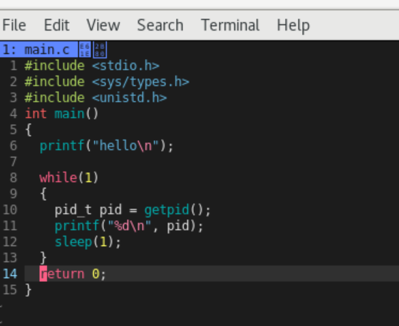
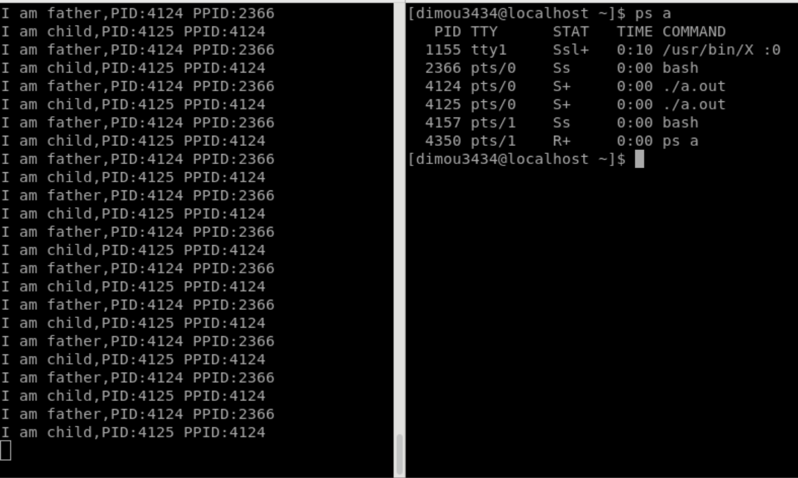
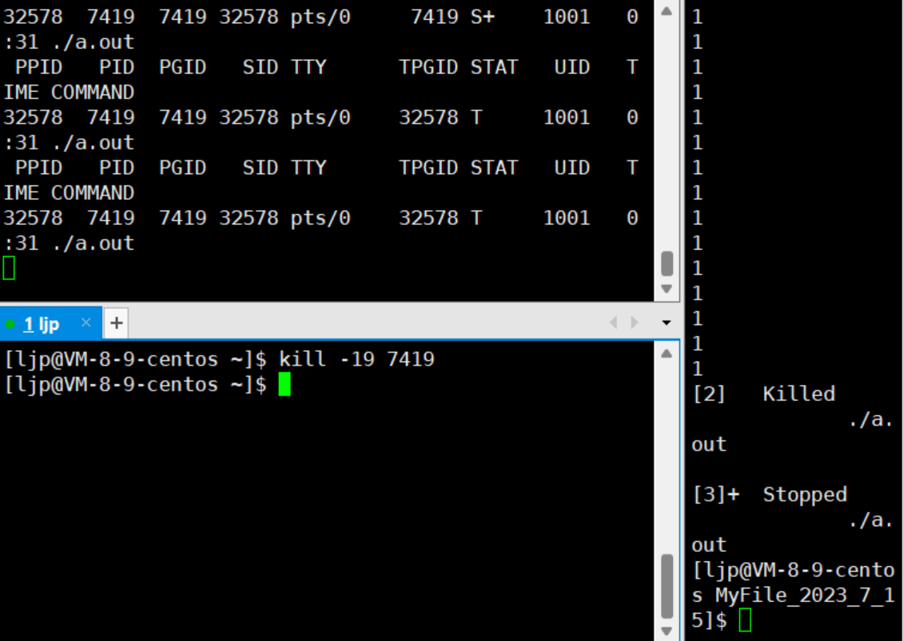
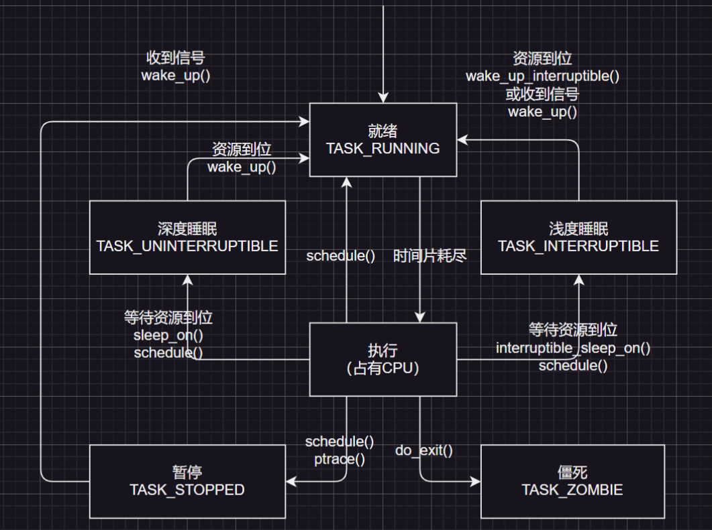
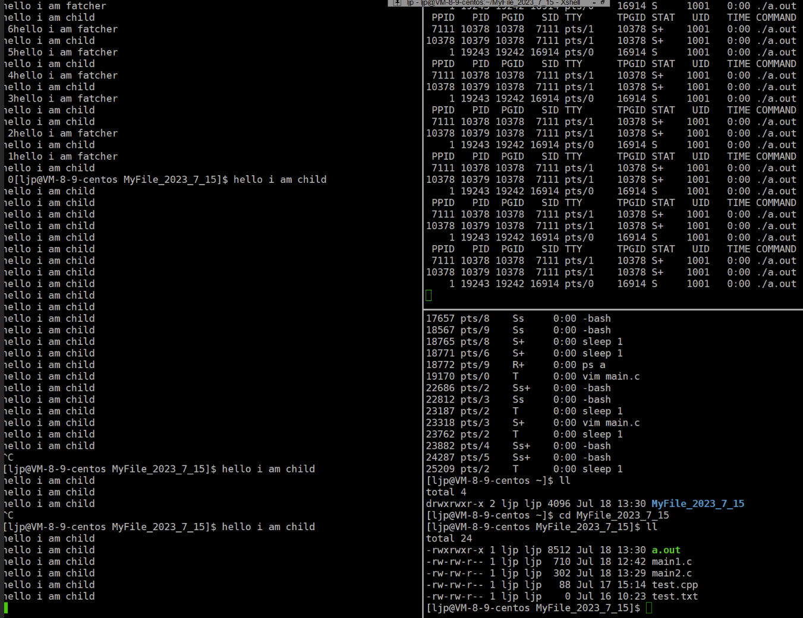
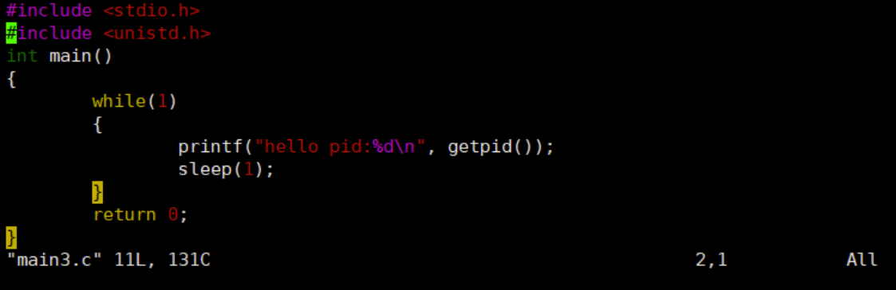
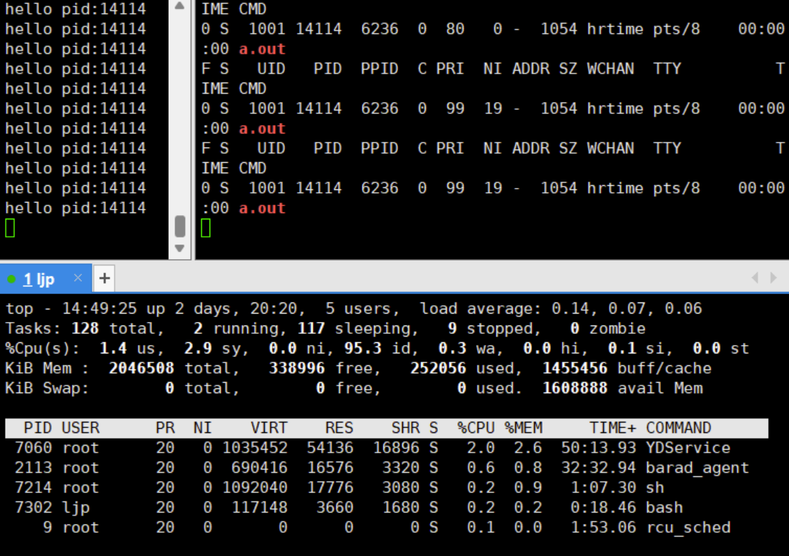
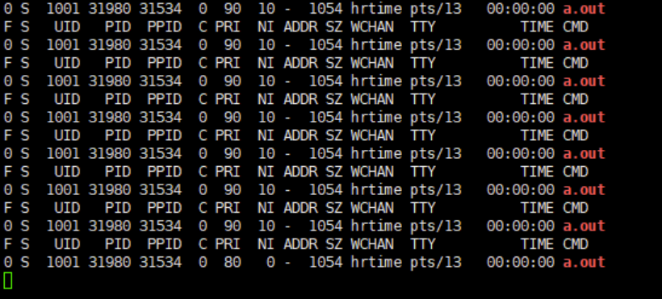
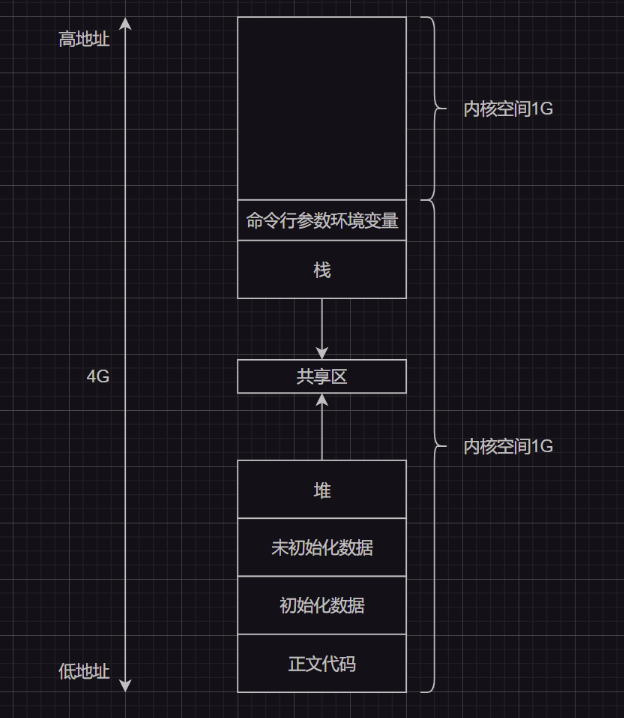

# 1.进程概念

我们启动一个软件，本质就是启动了一个进程。在`Windows`下如果我们启动了某个应用程序，然后打开资源管理器（常见的快捷键是`[ctrl+alt+delete]`，或者直接打开系统的“搜索”输入“资源管理器”点击即可打开）就可以看到有一个对应的软件出现在进程列表中：


实际上运行程序的时候，程序中的数据和代码就会加载到内存中，然后创建出一个进程。上述资源管理器里显示的就是进程列表。

> 补充：这也就是为什么应用运行的多的时候，有些软件会变卡甚至崩溃的原因。因为内存上堆满了大量进程，而一条空间大小有限的内存条，一次性加载太多软件，会导致内存空间溢出，有的进程无法被获取所有的数据而正确运行，最后造成软件崩溃或者静止不动的状态。

而在`Linux`下运行一条命令`./某可执行文件`，和`Windows`点击运行程序是类似的，也会将程序加载进内存中，最终转化成“进程”。

实际上，程序被加载到内存中后，就不能叫作“程序”了，而应该叫“进程”才对（这个原因后面解释）！

`Linux`也可以同时加载多个程序，也就是可以同时运行多个进程在系统中。而系统中存在大量的进程，那么操作系统就必须要管理好这些大量的进程。

那么`Linux`是怎么管理这些进程的呢？实际上也是“先描述再管理”。

# 2.进程描述

操作系统会给每个加载进内存的程序申请一个结构体，也就是`PCB`数据结构（`Printed circuit board`进程控制块），这个结构体内部保存了所有代码和数据的属性。

有了这个结构体来描述进程，将来就可以定义出相应的进程对象，而我们可以把这些对象使用链表的方式连接起来（这种链表就是一个进程队列，但是实际上不一定呈现出链表的形式，也可能使用其他数据结构混杂起来，而这里只是为了好理解一种粗略说法。不过，`Linux`内核采用的是双链表实现），也就将进程组织起来了。

因此对进程的管理转化为了对`PCB`结构体的管理（增删查改）。

因此什么是进程呢？进程=对应的“代码和数据”+形成的“`PCB`结构体”。

但是有很多人会误认为程序加载进内存就成为了进程，这种理解有些不太准确。

计算机管理的也不是直接管理程序的数据，而是这些对象，每一个`PCB`对象就代表一个进程。

接下来让我们来看看`PCB`具体是什么样的。不同的操作系统对`PCB`的具体实现不一样（也就是说`PCB`只是概念，具体实现要看系统），`Linux`里的是`task_struct`，`task_struct`是`Linux`内核级别的结构体。

因此我们可以查看一下`Linux`的内核实现，关于`Linux`内核源代码，您可以访问[`Linux`的官网](https://git.kernel.org/pub/scm/linux/kernel/git/stable/linux.git/?h=v6.5.4)来获取，不过文件可能有点大（您可以选择一些较低版本的）。

```c
task_struct{/*...*/};
```

1. 标识符`PID`：描述进程的唯一标识符，区分于别的进程

2. 状态：任务状态、退出代码、退出信号等

3. 优先级：相对于其他进程的优先级，优先级高的进程会先被`CPU`调度（调度就是进程能被`CPU`进行计算，进程们被计算的先后顺序被称为“调度顺序/进程调度”）

4. 程序计数器：程序中即将执行的下一条指令的地址（一个进程不可能长时间占用`CPU`，否则整个系统看起来就像“卡”住了一样。因此进程被`CPU`计算到一定程度时，就有可能被`CPU`暂时停止计算并且退出，而下一次进程又加载进来的时候，只需要查看程序计数器，直接到达还未被`CPU`计算的指令处，而不必从头开始执行指令。）

5. 内存指针：包含“程序==代码==指针”和“进程相关==数据==指针”，还有和其他进程共享的“内存块指针”

6. 上下文数据：进程执行时处理器的寄存器中的数据

7. `I/O`状态信息：包含显示的`I/O`请求，分配给进程的`I/O`设备和被进程使用的文件列表

8. 记账信息：可能包含处理器时间总和、使用的时钟数总和、时间限制、记帐号等

9. ...

# 3.进程操作（一）

本节主要是侧向进程的使用，而[进程操作（二）](# 7.进程操作（二）)更倾向于操作的原理，并且更加细化。

## 3.1.进程查看

1. 查看正在运行的进程可以使用`ps axj`，该指令详细全面列出正在运行进程的信息（较常用）

> * `ps -a`：显示所有用户的所有进程，包括其他终端（`tty`）和守护进程（`daemon`）
> * `ps -x`: 显示没有控制终端的进程（指那些没有与终端设备，如：键盘、鼠标、显示器等直接交互的进程）
> * `ps -j`: 使用类似`BSD`风格（`BSD`是一系列类`Unix`操作系统）的输出格式显示进程信息
> * `ps -p <PID>`：显示特定进程`<PID>`的信息，其中`<PID>`是进程的识别号（其中`PID`是“进程`ID`”（是每一个进程的唯一标识）
> * 只看自己此时运行的程序就可以使用管道`ps axj | grep <您的程序名>`，或者使用`head -1 && ps axj | grep <您的程序名>`命令也可以

3. 也可以使用`top`指令（类似`Windows`下的资源管理器），不过这个显示的进程太多了因此用的比较少

4. 进程的信息也可以直接通过`/proc`系统文件夹查看。例如：要查看`PID`为`1`的进程属性和信息，就可以查看`/proc/1`这个文件夹，查询其他`PID`的进程也是一样的。

> 
>
> * 该文件内部有一个`exe`链接文件，链接的地方指向的是可执行程序的地址（这意味着进程可以知道自己的源文件所在地）。这里有一个有趣的现象值得注意：当我们运行某个`C`程序后，如果把该程序`exe`指向的源文件和可执行程序删除，那么该进程有时依旧可以正常进行。这是因为代码和数据已经被加载进内存形成进程，已经和源文件和可执行程序无关了
> * 还有一个`cmd`链接文件，`cmd`是指向进程的当前工作目录，这也可以解释一些`C`语言函数的现象：如果在`C`程序中使用`fopen()`，第一个参数只使用了文件名字，默认打开的就是当前工作路径下的这个文件，所谓“当前工作路径”也就是这个`cmd`指向的位置。而每当代码被编译运行后，每个进程都会有一个属性，来保存自己所在的工作目录，由`cmd`来链接
> * 对于`Linux`来说，进程是以文件的形式给出的，因此`proc`目录也必然是一个动态存储目录，内部文件经常发生变动

## 3.2.进程获取

我们还可以在`C`代码中获取本进程的标识`ID`，这样就变相获得了一个进程。需要注意的是，`C`代码内所有的函数都只有在程序转化为进程的时候才会被调用，因此系统接口`getpid()`也只有在程序转化为进程的时候才会获取到本进程`PID`。



运行代码后就会得到左侧的输出，这个时候我们验证一下进程的`PID`是否符合：


除了`gitpid()`还有一个`gitppid()`的调用，这个系统调用可以获取当前进程的父进程`PPID`，这里如果我们利用`ps`命令就会发现这个`PPID`实际上就是`bash`。一般情况下，使用系统命令和运行我们自己编写的程序所产生的进程，其父进程永远都是`bash`。

我们把代码改`getpid()`为`getppid()`再运行代码就可以获取`bash`的`id`，也就是您代码转化为进程的父进程`id`。

## 3.3.进程终止

这里只给出如何使用信号来杀死进程，而不讲解信号的原理。

结合上述的进程`pid`，使用`kill -9 <PID>`可以杀死进程标识为`PID`的进程。`-9`实际上是一个信号，即：给目标文件传递`9`号信号，这里关于信号的知识我们以后还会再提及。

我们还可以尝试杀死父进程`bash`。执行后就可以发现，`bash`已经没有办法正常工作了，有的时候甚至会直接退出`bash`界面（奔溃）...

需要注意的是，父子进程是独立运行的。

## 3.4.进程创建

除了运行可执行程序来创建进程（`Linux`使用命令来创建进程，`Windows`使用鼠标点击快捷方式创建进程），我们还可以在代码中指使进程创建子进程。在`C`代码内可以使用`fork()`函数来创建子进程，但是这个`fork()`对比其他的普通函数会显得比较奇怪：失败返回`-1`，成功的时候具有两个返回值（你没看错，两个返回值）：

1. 给父进程返回子进程的`pid`

2. 给子进程返回`0`

```c
#include <stdio.h> 
#include <unistd.h> 
#include <sys/types.h>
int main() 
{
    //fork之前是父进程     
    printf("1.进程PID：%d 父进程PPID：%d\n", getpid(), getppid());
    printf("father-you can see me!\n");
    printf("father-you can see me!\n");
    printf("father-you can see me!\n");
    //fork之后就会创建一个子进程，具有和父进程同样的代码     
    fork();
    
    printf("father-child-you can see me!\n");
    printf("2.进程PID：%d 父进程PPID：%d\n", getpid(), getppid());
    sleep(1); 
    return 0;
}
```

一般而言，`fork()`之后的代码是父子共享的（两者都可以看到/使用），同时运作的，但是实际上我们真正需要的不是让父子进程（任务）做一样的事情，而是父进程做一部分，子进程做一部分，以此来提高运行的效率。因此根据`fork()`的返回值，我们可以这么做：

```c
#include <stdio.h> 
#include <unistd.h> 
#include <sys/types.h> 
int main()
{
    //fork之前是父进程
    printf("进程PID：%d 父进程PPID：%d\n", getpid(), getppid());
    pid_t id = fork();
    //从这里以后父子进程的代码都是共享的，会根据if来做调整
    if (id < 0)
    {
        //进程创建失败    
        perror("fork");
        return 1;
    }
    else if (id == 0)
    {
        //子进程做的事情
        while (1)
        {
            printf("I am child,PID:%d PPID:%d\n", getpid(), getppid());
            sleep(1);
        }
    }
    else
    {
        //父进程做的事情
        while (1)
        {
            printf("I am father,PID:%d PPID:%d\n", getpid(), getppid());
            sleep(1);
        }
    }
    printf("you can see me!\n");
    sleep(1);
    return 0;
}
```

这个时候您的第一份真正意义上的多进程代码就出来了（虽然并没有做什么事情...），两个父子循环是同时进行的！如果我们使用`ps`不断测试，就会发现的确存在两个进程，并且两者的`PID/PPID`呈现父子关系。



那么为什么`pid_t`这个`C`语言变量会有两个值？这“不符合”我们以前的学习逻辑（一个内存空间中存储了两个值？）。这个现象我们在进程的地址空间中再来解答，现阶段只要知道怎么使用就可以了。

不过我们可以先来理解一个问题：为什么设计为子进程返回`0`，父进程返回子进程的`PID`呢？因为父进程需要得到子进程的`PID`来进行管理，子进程只需要知道是否被建立成功就可以。

父子进程哪一个先运行呢？这是不一定的，这是由操作系统的调度器决定的。

关于杀死进程和创建进程的更多细节，我们在后面还会再重新理解，这里提前提及只是为了让您更快上手一些简单的进程操作。

计算机内有大大小小的进程，数量极多。为了方便管理交给`CPU`调度，会以某种数据结构形成调度队列，由操作系统查看`PCB`中的调度信息还有调度算法来决定先调度哪一个进程，因此父子进程谁先被调度，对于用户来说是不确定的。

# 4.进程状态

## 4.1.进程状态理论

### 4.1.1.粗略理解

所谓进程状态，可以使用类似下面的代码来理解：

```c++
#define NEW 1			//状态1
#define RENNING 2		//状态2
#define BLOCK 3			//状态3
//...
pcb->status = NEW;		//将进程PCB内的状态变量设置为状态1
//...
if(pcb->status == NEW)	//判断不同状态的进程，执行一些不同状态下的操作
{/*..*/}			
```

到此我帮您建立起对进程状态的一个粗略认知，接下来我会帮您建立更加详细的理论体系，需要注意的是不同地方在某些说法上有些许不同，这对您来说可能会造成一些阅读困难。

### 4.1.2.深入理解

在计算机系统理论上，对于单核`CPU`来说（这里不考虑多核），为了提高效率，会配备一个属于自己的调度队列/运行队列，这个队列也会被描述起来，假设描述为`struct runqueue{/*...*/};`，里面会包含锁、字段等信息（很多东西，但是我们先不理会），还有存储了进程的个数`count`，以及还有一个`pcb*`的指针，指向一个`PCB`结构体数据结构（有可能是链表，只需要将所有运行起来的进程串起来就可以）

1.   **运行状态**：`CPU`在调度进程的时候就是依靠这个`struct runqueue{/*...*/};`的，只需要调用`pcb`指针指向的数据结构（链表），就可以访问所有的进程。 ==因此只要在运行队列中的进程，就可以称进程处于”运行状态“==（在老的系统中，只有进程放在`CPU`中才算是”运行状态“，但是现代系统不是这样，而是进程放入运行队列即可。

     因此对于现代系统来说：”创建/新建“、”就绪“、”执行“这三种进程状态已经没有太大的区分了），而`pcb`指向的一串正在等待`CPU`资源的进程就是”运行队列“。

     再次强调，运行状态不是指该进程正在被`CPU`计算中，只有老系统才这么定义。另外，多核的情况下，就存在多个”运行队列“。

     这里普及一下就绪状态，该状态表示进程已经从非`CPU`设备那里获取到了资源，已经准备好摆`CPU`执行，但由于`CPU`正在执行其他进程，该进程暂时无法获得`CPU`时间或者说无法获取`CPU`资源，这种状态就是”就绪状态“，也就是说，在运行队列中除了正在`CPU`中的计算的进程，运行队列的其他进程都处于”就绪状态“。

2.   **阻塞状态**：系统中不只存在`CPU`资源，还有网卡、磁盘、显卡、键盘等其他设备资源。而这些资源往往有限，进程又太多，每一个进程需要这些资源。这个时候有的进程在被`CPU`计算之前，==需要先去访问其他非`CPU`资源，因此我们称这个进程处于“阻塞状态”==。

     而这一串正在访问某个非`CPU`资源而暂时无法被`CPU`执行的进程队列也被称为“阻塞/等待队列”，多个非`CPU`设备就有多个阻塞队列。比如：在C语言中使用`scanf()`函数的时候，不可能让`CPU`一直在等待它输入，`CPU`此时去调动其他进程了，而`scanf()`此时处于阻塞状态，一直在等待输入设备资源的输入。

     在有些时候下载会”卡住“就是为了等待网络资源，此时也是处于阻塞状态。而如果操作系统察觉到该进程已经访问好非`CPU`资源了，因此将其链接到”运行队列“中，这就是所谓的”将该进程唤醒“。

3.   **挂起状态**：如果==内存即将被占满，此时操作系统会将长时间处于”阻塞等待“的进程代码和数据换出到磁盘中，这就是进程的“挂起状态”==，而这个磁盘空间就是`SWAP`磁盘分区（即使写入磁盘效率比较慢，但也总比系统挂掉好）

     而且基本很难被填满（一般是和内存大小的差不多，不可以设置太大，否者就会导致系统过于依赖`SWAP`分区，频繁调用置换算法，造成系统变慢），如果操作系统还扛不住就会造成奔溃，也就是发生了“宕机”（挂起还可以分为”就绪挂起“和”阻塞挂起“）。

因此状态变化说白了就是：修改进程`PCB`对象所处的队列和`PCB`对象内某些表示进程状态的成员变量。 也许您会问，这样频繁的切换进程状态，使得进程在不同的队列中，会不会造成丢失和效率问题呢？不会，因为一个进程`PCB`不一定只在一个队列之中。

>   补充：由于而整个过程由于`CPU`太快了，看起来好像多个运行队列都被`CPU`同时运行着。

## 4.2.进程状态实现

上述的理论落实到`Linux`的系统中是怎么样的呢？让我们仔细研究一下内核里的状态。

这一部分的东西可以看一下内核源代码。源代码内部有对进程状态的描述，下面是保存`Linux`进程状态的指针数组（注释内的数字是字符串对应的标识数字）：

```c
static const char* const task_struct_array[] =
{
    "R(running)", /*0：运行中的进程，可能在等CPU资源，也有可能被CPU调度中*/
    "S(sleeping)", /*1：睡眠中的进程*/
    "D(disk sleep)", /*2：磁盘睡眠中的进程*/
    "T(stopped)", /*4：暂停的进程*/
    "t(tracing stop)", /*8：追踪停止的进程*/
    "Z(zombie)", /*16：僵尸进程*/
    "X(dead)" /*32：已经终止的进程*/
};
```

### 4.2.1.运行状态和浅度/深度睡眠

接下来让我们写两份死循环代码生成的进程对比一下：

```c++
#include <stdio.h>
int main()
{
    while(1);
    return 0;
}
```

```c++
#include <stdio.h>
int main()
{
    while(1)
        printf("%d\n", 1);
    return 0;
}
```

可以使用以下`shell`命令来分别查看两个进程：

```bash
while : do
     ps axj | head -n 1
     ps ajx | grep a.out | grep -v grep
     sleep 1 
done
```

下面是两份代码的运行结果，和脚本现象：


为什么第二段代码有的时候是“运行状态`R`”，有的时候“休眠状态`S`呢”？因为`CPU`实在是太快了，第二段代码一直在访问非`CPU`资源的时候，而`I/O`又太慢了，就处于经常处于睡眠状态。`+`说明这个进程属于“前台进程”，前台进程一旦启动，执行命令就没有任何效果了，而且可以被`[ctrl + z]`。如果希望自己的进程可以在后台运行，那么可以使用`&`符号运行程序，这个时候还会回显一个`PID`。


这个时候我们可以看到这个进程已经少了`+`标志了。而要想杀死这个进程有很多方法，这里我们依旧使用`kill`命令的`-9`信号来杀死这个进程（`-9`信号的权限很高，几乎所有进程都要响应），需要注意的是：无法使用`[ctrl + c]`杀死这个进程。

>   补充：在`Linux`一旦启动前台进程，`bash`就没有办法再接受您的指令了。而启动后台进程的状态下，`bash`依旧可以执行您的指令。这在有的时候下载某些资源的时候非常有用，不至于让我们原地干等着。


“休眠状态`S`”（这里的睡眠有的时候也可以叫做可“中断睡眠”）实际上就是在等待某种资源或者事件完成，由于我们没有学过事件没有概念，可以暂时理解成阻塞状态。

可中断睡眠的意思就是：如果代码假设内有`sleep(100)`，进程运行中处于“休眠状态`S`”状态，并且可以使用`-19`可以停止进程，使进程变成“暂停状态`T`”，也就是说这个进程在睡眠阶段被中断了。不仅可以使用`kill -9 <PID>`也可以使用`[ctrl + c]`杀死。

这种休眠状态也被叫“浅度休眠状态”。


而“磁盘休眠状态`D`”，也是一种睡眠状态，又可叫“深度休眠状态”，而且在目前的机器状态下很难模拟出来，和`S`状态的区别就是：不可中断睡眠状态，不可被被动唤醒。

由于当计算机压力过大，操作系统会通过一定手段杀掉一些睡眠的进程来起到节省空间的作用。而之所以设置这个状态是因为操作系统在迫不得已的情况下会`kill`一些可中断睡眠的进程，为了避免某些重要的进程数据丢失，就可以设置深度睡眠，禁止被`CPU`杀掉，也就变得不可中断，保护了数据安全，只能等进程自动醒来。

深度睡眠是专门用来让进程访问磁盘设备时，防止进程被操作系统在极端情况被误杀的一种保护状态，只有在进程读取完磁盘数据的时候才能自动醒来，甚至使用`-9`的`kill`信号都无法杀掉处于“磁盘休眠状态`D`”的进程。

那么我们真的没有其他办法杀掉这个处于“磁盘休眠状态`D`”的进程么？还是有的，软件不行，硬件来凑，关机大法好！甚至很可能出现：只能使用拔除电源的硬关机方式杀死，因为使用内置的关机命令，有可能因为此时的磁盘还正在写入，导致软关机的方式关不了。

>   补充：不过倒是可以使用`dd`状态来模拟演示“磁盘休眠状态`D`”，这点可以当拓展来看即可，有时间再来研究。
>
>   在`Linux`中，`dd`命令被广泛用于数据的复制和转换操作。尽管`dd`命令本身并不会直接演示`D`状态，但它可能会导致进程进入`D`状态的情况。
>
>   当使用`dd`命令进行磁盘复制或读写操作时，它会与磁盘进行大量的`I/O`交互。如果所涉及的数据量较大或`I/O`速度较慢，就可能导致进程在等待`I/O`完成时进入`D`状态。
>
>   1.   例如：当使用`dd`命令从一个设备（如硬盘）读取数据时，如果目标设备上的数据尚未准备好或读取速度较慢，`dd`命令所在的进程将会被阻塞，进入`D`状态，直到读取操作完成。
>
>   2.   例如：类似地，当使用`dd`命令向设备写入数据时，如果目标设备无法及时处理写入请求或写入速度较慢，进程也会进入`D`状态，等待写入操作完成。
>
>   在使用`dd`命令时，如果遇到进程长时间停留在`D`状态的情况，可能是由于磁盘操作的特性或环境造成的，可以适当调整命令参数或优化`I/O`性能来提高执行效率。

另外有的时候如果磁盘的转速太低，而需要磁盘资源的进程有太多，也有可能导致出现大量的`D`状态进程...如果这样的进程太多了，操作系统有可能会被挂掉，此时操作系统处于“宕机”或者“半昏迷”的状态，这个时候只能选择断电。

为什么磁盘的转速会降低呢？有两个原因：

1.   磁盘“挂”掉了，已经不能被正常运行了
2.   有时为了减少功率损耗，会降低磁盘的转速，甚至有的磁盘不工作的时候就直接不转动了

>   注意：有关磁盘的知识之后还会再详细提及。

### 4.2.2.暂停状态和停止并跟踪状态

那么“暂停状态`T`”和“停止并跟踪状态`t`”有什么区别么？

首先我们来模拟一下`T`或者`t`状态：`-19`号信号就可以做到终止进程的目的，而`-18`号信号就可以使得进程继续运行。使用`-19`信号就可以处于“暂停状态`T`”。

使用`gdb`调试某个代码并且打入断点，`r`操作后调试停在断点出，在另外一个控制台就可以查看出这个进程正处于`t`状态，也就是“停止并跟踪状态`t`”。也就是说：这个状态更多用在调试代码打断点上。

处于这两个状态时，进程暂时不会访问任何资源，处于一种“停滞”状态，这实际上也是一种“阻塞状态”，只不过是等待用户的指令罢了。。





那么`T`状态的应用场景在哪里？典型的地方就在于调试，实际上在编写代码时所使用的断点调用就是利用的`T`状态来实现的。`T`和`t`的当一个进程被调试器（例如：`gdb`调试器）所追踪时，其状态通常会显示为`t`。这意味着该进程当前处于被调试状态，而我们手动使用`kill`停止的显示`T`状态。

### 4.2.3.终止状态和僵尸状态

而“终止状态`X`”就是：如果需要销毁的进程实在太多，不可能一个进程被终止了就立刻被操作系统销毁了，因此这种状态是为操作系统做标记，好在操作系统处理好其他事情后根据`X`标记来销毁这些已经结束的进程（已经做好被操作系统回收的准备了）。因此这个`X`状态也很难看到和捕捉，瞬时性非常强。

>   补充：操作系统回收进程的核心工作实际上就是将占据空间的`PCB`对象、代码、数据全部释放掉。

而剩下的一个状态就是“僵尸状态`Z`”，“僵尸状态`Z`”是指：一个进程已经退出，但是还不允许被操作系统回收（最多回收数据和代码），`PCB`对象处于一个被检测返回结果的持续状态（需要检测退出的原因等，是任务成功了？还是任务失败了？并且该返回结果是通过`return`或者`exit()`写入到`PCB`对象里），只有检测完了才可以标记为“终止状态`X`”，等待操作系统回收。

那么是谁在进行检测呢？一般是“父进程”或者“操作系统”来进行检测读取（这个读取后续也会详细提及）子进程剩下的`PCB`对象，只有等到检测完毕，子进程才可以被操作系统回收（也就是改成“终止状态`X`”）。在此之前，子进程的`PCB`对象内的数据必须被`OS`维护（并且设置了“僵尸状态`Z`”）。

正常来说是不会出现僵尸进程的，但如果父进程一直在执行某项任务，没来得及检查子进程的`PCB`对象内写入的数据，就有可能出现僵尸进程。下面演示“僵尸状态”：


并且左侧有回显“`<defunct>`”，由于进程处于“僵尸状态`z`”，创建出来的`PCB`并没有被释放掉，会被`OS`一直维护，占用资源，因此这也是一种内存泄漏。

僵死进程会以终止状态保持在进程表中，并且会一直在等待父进程或者操作系统读取退出状态代码。

>   吐槽：和僵尸电影里的僵尸不是很类似么，明明死去却依旧以“半死不活的状态（进程结束）”留停在“人间（计算机内）”，就需要“道士（父进程或者操作系统回收）”进行回收。

那么是否可以创建一个恶意程序，让父进程不断创建出僵尸状态的进程来占取大量内存来“卡死”计算机呢？这种事情是有可能的，会发生严重的内存泄露！因此，我们在后续编写代码中必须要想办法回收僵尸进程。而关于僵尸进程的解决办法，我后续再提及。

下面总结一下状态之间的动态变化：



# 5.进程类别

进程也有类别，其中孤儿进程就是一种进程类别（注意不是进程状态，要和上面的进程状态概念做区分）。

父进程如果提前退出，那么子进程就会被称为“孤儿进程”，注意和“僵尸状态”做概念上的区分。

>   区分：孤儿进程和僵尸状态
>
>   1.   如果子进程退出了，而父进程没有退出并且也不理会这个子进程（回收），那么此时的子进程就处于“僵尸状态”。如果理会了子进程，就是子进程被成功回收。
>   2.   如果父进程先挂掉了，无论子进程是否结束，都可以叫此时的子进程为“孤儿进程”，若是子进程结束，则子进程又陷入了“僵尸状态”。

在代码编写逻辑错误的时候，如果出现了孤儿进程就会被“`1`号`init`进程”领养，下面我们来写一段代码来感受一下：

```c
#include <stdio.h> 
#include <unistd.h> 
int main() 
{ 
    pid_t id = fork();
    if(id == 0)
    {
        //child
        while(1)
        {
            printf("hello i am child\n");
            sleep(1);
        }
    } 
    else 
    {
        //fatcher
        int n = 6;
        while(n >= 0)
        {
            printf("hello i am fatcher\n %d", n);
            sleep(1);
            n--;
        }
    }
    return 0; 
}
```



可以看到父进程一结束，子进程的`PPID`瞬间切换为`1`，也就是被`1号init/systemd`进程所“领养”，这个进程可以简单理解为“系统本身”。

但是为什么父进程退出后，子进程要被“领养”呢？因为回收子进程的代码一般处于父进程中，如果子进程变成孤儿进程则没有人来回收该进程，那么就需要被其他进程领养进行回收。

而且从上面的结果图我们可以看到，如果子进程变成了孤儿进程，其状态变成后后台运行状态，这就意味着，我们无法使用`[ctrl+c]`快捷键方式终止这个进程（命令行显示该快捷键为`^C`）。

> 吐槽：不过比较好玩的是，基本是在左侧不断输出后台进程的`bash`界面中依旧是可以正常输入命令的，只不过输入命令显得的有点乱……  

# 6.进程优先

## 6.1.优先级概念

1. `CPU`资源分配的先后顺序就是指进程的优先权，之所以设计优先级是因为：`CPU`资源是有限的、稀缺的，但是进程太多。

2. 优先权高的进程有优先执行权利，配置进程优先级别对多环境的`Linux`很有用，可以改善系统性能。

3. 优先级在具体实现为`PCB`结构体内部的某个整数数据，交给调度器评判优先级来对进程队列进行“调度”。

>   区分：优先级和权限
>
>   优先级是“已经保证能够得到申请的某种资源，就是要等候（已经有权限了，不然连等待都不行）”，而权限是“能否得到某种资源”。

## 6.2.优先级范围

一般是`60~99`，默认进程的优先级是`80`.

## 6.3.优先级查看

在`Linux`中`优先级=老的优先级+nice值`，`nice值`是什么呢？

下面我们来编写一个代码，并且使用命令`ps -la`的形式输出详细的进程列表，或者使用`ps -al | head -1 && ps -la | grep a.out`输出。




我们梳理一下这里出现的几个重要的进程信息：

1. `UID`：代表执行者的身份

2. `PID`：代表该进程的代号

3. `PPID`：代表该进程的父进程代号

4. `PRI`：代表这个进程可被执行的优先级，其值越小越早被执行

5. `NI`：代表这个进程的`nice值`，表示进程可以被执行的优先级的修正数值，也就是说`Linux`中的进程优先级是可以被调整的，调整进程的`nice值`就是调整进程的优先级。如果`nice值`为负数，那么该程序的优先级会变小，反之变高。`PRI(new)=PRI(old)+nice`

## 6.4.优先级修改

另外还可以使用`top`工具来查看进程的优先级，进入`top`后输入`r`然后再输入某进程的`PID`，接着输入想要的`nice值`即可修改进程的优先级。



为什么`PRI`只加了`19`呢？因为我们规定了`nice`的取值范围是`[-20,19]`，一共有`40`个级别。


如果需要高优先级，那么就必须使用管理员权限来调整`nice值`，否则大概率只能调低优先级，调高就会出现上面的错误提示，下面我们使用`sudo top`来修改优先级。


需要注意的是每次修改优先级是根据`默认PRI值，即：80`来结合`nice值`的，也就是说：每次设置`nice`值的时候，公式`PRI(new)=PRI(old)+nice`中的`PRI(old)`默认值为`80`。



一款优秀的操作系统在能提供优先级的同时还可以在调整优先级的时候尽量不打破调度平衡，因此`nice值`本身也不会特别大。

另外，类似的指令还有`nice`和`renice`指令、`setpriority()`等也可以做到上述的优先级调整。

>   补充：下面再普及一些有关进程调度的相关术语。
>
>   1.   竞争性：系统进程数量众多，而`CPU`资源只有少量，甚至只有一个，所以进程之间是有竞争关系的，为了高效完成任务，更加合理竞争资源，也就有了优先级
>   2.   独立性：多进程运行，需要独享各种资源，多进程运行期间互不干扰，而父子进程之间也是具有独立性的。只有一个`CPU`的情况下理应只有一个进程在运行，但是一个时间端内不一定。
>   3.   并发：多个进程在一个`CPU`下采用进程切换的方式，在一端时间之内，让多个进程都得以推进，称之为“并发”（现在的个人电脑大多是单核的）。
>   4.   并行：多个进程在多个`CPU`先分别同时运行，这称之为“并行”。通常并行的多个`CPU`内部也是采用并发的设计。
>   5.   时间片：一个进程不可能一直占用`CPU`，要不然其他进程都会表现出卡死的状态，因此我们给一个进程设置了时间片，让该进程只能运行一个时间片段的时间，能运行多少看进程数据和`CPU`的计数，过了这段时间后`CPU`切换另外一个进程进行处理，也是按照一定时间段来运行这个进程，这样不断切换切换，达到“雨露均沾”的效果。因此哪怕是写出一个关于死循环的进程，也不会导致其他进程“卡死”的状态（但是实际上在`Linux`内）。
>   6.   抢占与出让：如果操作系统发现有优先级更高的进程，哪怕当前`CPU`处理的程序没有过完一个时间片，也会“出让”给优先级更高的进程来“抢占”，`Linux`就支持这种操作，也就是说`Linux`是基于时间片的轮转式抢占式内核。
>   7.   切换与上下文：`CPU`内部存在大量的寄存器，进程加载到`CPU`实际上是将数据加载到寄存器。如果进程`A`正在被运行，那么`CPU`内部的寄存器里面此时是进程`A`的临时数据，也叫做`A`的“上下文”，“上下文”数据在短期内不可以被丢弃，否则这个正在运行的`A进程`就废掉了。可是这样就有问题了，因为`进程A`是不可能一直把上下文存放在`CPU`内部的寄存器的，因此经过一个时间片后后，进程`A`在被其他进程切换时必须保存好自己的上下文数据，等到下次`进程A`又被`CPU`执行的时候，`CPU`通过重新加载上下文才不会忘记这个进程的执行情况。有了上下文保存才能使进程有切换的可能。  

---

# ==6.进程空间==

## 6.1.进程地址空间

我们以`Linux2.6.32（32位平台）`为研究背景



> 注释1：未初始化数据全称为“未初始化全局数据区”、已初始化数据全称为“已初始化全局数据区”

> 注释2：栈的使用向下增长，堆的使用向上增长，不过这些现象仅限于`Linux`中，尤其是这几年的`Windows`操作系统在这方面改动比较多（为了系统安全考虑）。

> 注意3：进程地址空间是一个抽象的概念，不是内存！就连以前我们打印的指针地址也不是真正的内存地址（是一个虚拟内存地址），以前学习C语言的时候只是为了方便说明，没有深入探究。

关于这点我们可以通过C代码来证明：

```c
#include <stdio.h>
#include <stdlib.h>
int g_value_2;
int g_value_1 = 10;
int main(int argc, char* argv[], char* env[])
{
    printf("code addr<代码区/正文>: %p\n\n", main);
    const char* str = "hello word!";
    /*
        注意“hello word!”是存储在正文代码区域（说），实际上所有的字面常量都是硬编码进代码的
        而代码是只读的，不可以被修改的        
        而str变量的空间开辟在栈上，
        但是str这个指针变量保存的是处于静态数据区内的“hello word!”里'h'的地址，
        故打印str就是打印静态数据区的地址
    */

    printf("read only addr<静态区>: %p\n\n", str);

    printf("init g_value_1 global addr<已初始化全局变量区>: %p\n\n", &g_value_1);//static变量也会放在这里，您可以自己试一下在这里加上一个static变量（这也就是为什么static变量只会初始化一次的原因）

    printf("uninit g_value_2 global addr<未初始化全局变量区>: %p\n\n", &g_value_2);

    int* p1 = (int*)malloc(sizeof(int) * 10);
    int* p2 = (int*)malloc(sizeof(int) * 10);
    printf("heap addr<堆区>: %p\n", p1);
    printf("heap addr<堆区>: %p\n\n", p2);

    printf("stack addr<栈区>: %p\n", &str);
    printf("stack addr<栈区>: %p\n", &p1);
    printf("stack addr<栈区>: %p\n\n", &p2);

    for (int i = 0; i < argc; i++)
    {
        printf("command line paramete<命令行参数>r：argv[%d] = %p\n", i, argv[i]);
    }
    printf("\n");
    for (int j = 0; env[j]; j++)
    {
        printf("command line parameter<环境变量>：env[%] = %p\n", j, env[j]);
    }

    free(p1);
    free(p2);
    return 0;
}
```

```bash
$ ./a.out abde dasdas asdasd asdasd asdasdad #后面是随意输入的参数
code addr<代码区/正文>: 0x40060d

read only addr<静态区>: 0x400882

init g_value_1 global addr<已初始化全局变量区>: 0x60104c

uninit g_value_2 global addr<未初始化全局变量区>: 0x601054

heap addr<堆区>: 0x7d2010
heap addr<堆区>: 0x7d2040

stack addr<栈区>: 0x7ffc4c26aa10
stack addr<栈区>: 0x7ffc4c26aa08
stack addr<栈区>: 0x7ffc4c26aa00

command line paramete<命令行参数>r：argv[0] = 0x7ffc4c26b7bf
command line paramete<命令行参数>r：argv[1] = 0x7ffc4c26b7c7
command line paramete<命令行参数>r：argv[2] = 0x7ffc4c26b7cc
command line paramete<命令行参数>r：argv[3] = 0x7ffc4c26b7d3
command line paramete<命令行参数>r：argv[4] = 0x7ffc4c26b7da
command line paramete<命令行参数>r：argv[5] = 0x7ffc4c26b7e1

command line parameter<环境变量>：env[%] = (nil)
command line parameter<环境变量>：env[%] = 0x1
command line parameter<环境变量>：env[%] = 0x2
command line parameter<环境变量>：env[%] = 0x3
command line parameter<环境变量>：env[%] = 0x4
command line parameter<环境变量>：env[%] = 0x5
command line parameter<环境变量>：env[%] = 0x6
command line parameter<环境变量>：env[%] = 0x7
command line parameter<环境变量>：env[%] = 0x8
command line parameter<环境变量>：env[%] = 0x9
command line parameter<环境变量>：env[%] = 0xa
command line parameter<环境变量>：env[%] = 0xb
command line parameter<环境变量>：env[%] = 0xc
command line parameter<环境变量>：env[%] = 0xd
command line parameter<环境变量>：env[%] = 0xe
command line parameter<环境变量>：env[%] = 0xf
command line parameter<环境变量>：env[%] = 0x10
command line parameter<环境变量>：env[%] = 0x11
command line parameter<环境变量>：env[%] = 0x12
command line parameter<环境变量>：env[%] = 0x13
command line parameter<环境变量>：env[%] = 0x14
command line parameter<环境变量>：env[%] = 0x15
command line parameter<环境变量>：env[%] = 0x16
```

> 注意：我们这里将进程地址空间倒过来打印了，所以地址大小呈现出越来越大，也就是从低地址到高地址。您也可以通过一些文本指令倒过来打印。

```bash
$ ./a.out abde dasdas asdasd asdasd asdasdad | tac
command line parameter<环境变量>：env[%] = 0x16
command line parameter<环境变量>：env[%] = 0x15
command line parameter<环境变量>：env[%] = 0x14
command line parameter<环境变量>：env[%] = 0x13
command line parameter<环境变量>：env[%] = 0x12
command line parameter<环境变量>：env[%] = 0x11
command line parameter<环境变量>：env[%] = 0x10
command line parameter<环境变量>：env[%] = 0xf
command line parameter<环境变量>：env[%] = 0xe
command line parameter<环境变量>：env[%] = 0xd
command line parameter<环境变量>：env[%] = 0xc
command line parameter<环境变量>：env[%] = 0xb
command line parameter<环境变量>：env[%] = 0xa
command line parameter<环境变量>：env[%] = 0x9
command line parameter<环境变量>：env[%] = 0x8
command line parameter<环境变量>：env[%] = 0x7
command line parameter<环境变量>：env[%] = 0x6
command line parameter<环境变量>：env[%] = 0x5
command line parameter<环境变量>：env[%] = 0x4
command line parameter<环境变量>：env[%] = 0x3
command line parameter<环境变量>：env[%] = 0x2
command line parameter<环境变量>：env[%] = 0x1
command line parameter<环境变量>：env[%] = (nil)

command line paramete<命令行参数>r：argv[5] = 0x7ffe249247e1
command line paramete<命令行参数>r：argv[4] = 0x7ffe249247da
command line paramete<命令行参数>r：argv[3] = 0x7ffe249247d3
command line paramete<命令行参数>r：argv[2] = 0x7ffe249247cc
command line paramete<命令行参数>r：argv[1] = 0x7ffe249247c7
command line paramete<命令行参数>r：argv[0] = 0x7ffe249247bf

stack addr<栈区>: 0x7ffe24922fe0
stack addr<栈区>: 0x7ffe24922fe8
stack addr<栈区>: 0x7ffe24922ff0

heap addr<堆区>: 0x114d040
heap addr<堆区>: 0x114d010

uninit g_value_2 global addr<未初始化全局变量区>: 0x601054

init g_value_1 global addr<已初始化全局变量区>: 0x60104c

read only addr<静态区>: 0x400882

code addr<代码区/正文>: 0x40060d
```

通过上述代码的地址变化，我们可以验证进程地址空间是真实存在的。

> 注意：我们还能发现栈区和堆区中间有巨大的“镂空”。

> 注意：同时根据多个栈地址和多个堆地址，我们可以发现栈和堆相向而生。

> 注意：上述代码的地址都是程序运行后才打印出来的，也就是进程打印出来的。

在32位下一个进程的地址空间的取值范围是`0x0000 0000~0xFFFF FFFF`。其中`[0, 3GB]`为用户空间，`[3GB, 4GB]`为内核空间。往后我们理解地址空间，一定要想到这`4GB`的空间，而不仅仅是那`3GB`的空间。

## 6.2.虚拟空间

为什么说我们以前在C语言提到的内存不是真实内存而是虚拟内存呢？我们首先可以通过一个C程序观察一下现象：

```c
#include <stdio.h>
#include <unistd.h>
int g_val = 100;
int main()
{
    pid_t id = fork();
    if(id == 0)
    {
        while(1)
        {
            printf("I am a child. pid = %d, ppid = %d, g_val = %d, &g_val = %p\n.", getpid(), getppid(), g_val, &g_val);
            sleep(1);
            int cnt = 0;
            cnt++;
            if(cnt == 5)
            {
                g_val = 200;
                printf("child chage g_val = 100 --> g_val = 200\n");
            }
            else
            {
                while(1)
                {
                     printf("I am a father. pid = %d, ppid = %d, g_val = %d, &g_val = %p\n.", getpid(), getppid(), g_val, &g_val);
                    sleep(1);
                }
            }
        }
    }        
    return 0;
}
```

```bash
$ vim main.c
$ gcc main.c
$ ./a.out
I am a father. pid = 21420, ppid = 29863, g_val = 100, &g_val = 0x60105c.
I am a child. pid = 21421, ppid = 21420, g_val = 100, &g_val = 0x60105c.
I am a father. pid = 21420, ppid = 29863, g_val = 100, &g_val = 0x60105c.
I am a child. pid = 21421, ppid = 21420, g_val = 100, &g_val = 0x60105c.
I am a father. pid = 21420, ppid = 29863, g_val = 100, &g_val = 0x60105c.
I am a child. pid = 21421, ppid = 21420, g_val = 100, &g_val = 0x60105c.
I am a father. pid = 21420, ppid = 29863, g_val = 100, &g_val = 0x60105c.
I am a child. pid = 21421, ppid = 21420, g_val = 100, &g_val = 0x60105c.
I am a father. pid = 21420, ppid = 29863, g_val = 100, &g_val = 0x60105c.
I am a child. pid = 21421, ppid = 21420, g_val = 100, &g_val = 0x60105c.
I am a father. pid = 21420, ppid = 29863, g_val = 100, &g_val = 0x60105c.
child change "g_val = 100 --> g_val = 200".
I am a child. pid = 21421, ppid = 21420, g_val = 200, &g_val = 0x60105c.
I am a father. pid = 21420, ppid = 29863, g_val = 100, &g_val = 0x60105c.
I am a child. pid = 21421, ppid = 21420, g_val = 200, &g_val = 0x60105c.
I am a father. pid = 21420, ppid = 29863, g_val = 100, &g_val = 0x60105c.
```

欸！我们发现了一个离谱的现象：子进程修改的全局变量不会影响父进程的输出该全局变量的值，也就是说”在同一个地址不同的两次访问的值出现了不同值“。

那么这就让我们怀疑一个事实，全局变量的分别打印出来的两个相同数值地址，真的是“相同”的么？

也就是说，我们通过`printf()`和`&`打印出来的地址绝对不是物理意义（或者叫”实际意义“）上的内存地址，因为如果是真实的地址，是不可能同时存储两个值的。

实际出来的地址是虚拟地址（在Linux里也叫”线性地址“）。每个进程都认为自己用的地址是真实地址，实际上它被操作系统”欺骗“了，它使用的是虚拟地址，这些虚拟地址整体构成虚拟空间。

> 注意：实际上几乎所有带有”地址“概念的语言使用的地址都是虚拟地址。 

> 注意：不止是CPU有寄存器，其他外设或者显卡也有寄存器，这些地址也应该被利用，所以我们给计算机一个虚拟地址空间，使得虚拟地址可以一一映射内存地址、显卡寄存器地址等等地址，而我们的程序在调用的时候也会误认为自己用的是内存地址，从而达到统一对待真实地址的目的。

## 6.3.进程地址空间、虚拟地址空间、物理地址空间的关系

在很久以前，多个进程的确是直接进入内存的，但是，一旦在运行某个进程的过程有可能出现：

1. 野指针问题：对野指针的访问有可能出现篡改其他进程数据的情况，这是极其危险的。而且对于黑客来说，如果某个进程是需要密钥等方式才可以进入，那么就会出现某些黑客软件在运行过程中窃取该进程数据的可能，导致数据不安全。

2. 内存碎片问题：如果直接加载进内物理存，就极有可能出现内存碎片问题，导致内存空间分配不合理。

因此直接写进物理空间的方式极其不安全、不合理。于是就出现了虚拟地址空间，每个进程通过虚拟地址空间，都认为自己占用了整个进程地址空间，实际上这是操作系统的一种“骗术”，操作系统在管理每一个进程的虚拟地址空间，再一一映射到物理内存，这样子就可以解决上面的两个问题。


因此我们可以知道进程地址空间是进程使用物理内存和虚拟内存的一个内存使用模板 。

另外，内核中的“进程地址空间”的本质是一种“数据结构”的描述，虚拟地址空间本质也是一种“数据结构”的定义，依靠这个数据结构来划分地址范围。

```c
struct addr_room
{
    int code_start;
    int code_end;

    int init_start;
    int init_end;

    int uninit_start;
    int uninit_end;

    int heep_start;
    int heep_end;  

    int stack_start;
    int stack_end;

    //...
};
```

在`task_struct`结构体中，有一个成员`mm_struct* mm`，指向进程所拥有的虚拟地址空间，而操作系统通过某种映射关系（或者叫“页表”）来映射到物理内存中。地址空间和页表（用户级）是每一个进程都私有一份的。

只要保证每一个进程的页表映射的是不同区域，就能做到进程之间相互独立、安全。

> 注意：有关于“页表”的知识，我们后面会再次提到。

## 6.4.解释现象

经过前几个小节的铺垫，我们现在终于可以解释前面父子进程代码的问题所在了。父子进程使用的同名的全局变量，根本就是两个变量！

子进程会继承很多父进程的数据，但是也不是全部照搬复制，也是有所修改的，其中就包括地址空间。可以看到虚拟内存都是一样的，一开始还没有修改的时候，由于分页一样，所以物理内存是一样的。但是如果子进程修改了`g_val`，操作系统会重新开辟一块物理内存，并且修改分页映射，但是虚拟地址没有被改变，因此此时父子进程能在同一个虚拟地址访问不同的两个物理内存的数据（这种策略也叫“写时拷贝”，后面还会继续详谈）。

> 此时我们还可以开始回答之前提到的一个问题：`fork()`为什么会有两个返回值？
>
> 这是因为在代码`pid_t id = fork()`中，`fork()`返回的值实际上是给`id`变量做一种写入。而父子进程的代码一样的，都会只执行`if-else`的判断。而写入就需要从内存中获取，而父子进程在物理内存中`id`的地址是不同的，因此会有两个返回值，而在父子进程各自的虚拟空间中，`id`都是一样的地址值（发生了写时拷贝）。

## 6.5.小拓展

当我们的程序在编译的时候，在生成可执行程序且还没有加载到内存中的时候存在地址么？

答案是：可执行程序在编译的时候，内部实际上早就有地址了！

地址空间不要仅仅是`0S`内部要遵守的，其实编译器也要遵守，即：编详器编译代码的时候，就已经给我们形成了“各个区域”代码区、数据区。并且，采用和`Linux`内核中一样的编址方式，给每一个变量，每一行代码都进行了编址。

故：程序在编译的时候，每一个字段早已经具有了一个虚拟地址。

而虚拟地址也是数据，因此代码被加载到内存中的时候，不仅仅是加载了代码，实际上虚拟地址也被加载进去了。

程序内部地址使用的是地址，依旧是编译器编好的地址，当程序加载到内存，每行代码、每个变量就具有了一个物理地址。

并且`CPU`读取的是虚拟地址。

再来理顺一下：

1. 对于磁盘中的可执行程序，除了存储代码本身，还存储了每一句和变量对应的地址。这些地址是虚拟地址，由编译器编址，方便编译做跳转。

2. 将可执行程序加载进物理内存，转化为进程后，进程本身有需要物理地址，这样每一条代码都有两个地址。（实际上就是在填写页表，使得虚拟地址和物理地址一一对应）

3. 接下来创建出`task_struct`的`PCB`结构体，内部包含一个`mm_struct`的进程地址空间结构体，构建了一个页表映射关系（`key->value`）。

4. 然后根据编译器把代码的各区起始虚拟地址和结尾虚拟地址填充到进程地址空间对地址空间范围的划分（`start`和`end`），这样进程地址空间的各个区域范围就设置好了。

5. 这个时候`CPU`先根据程序的第一个虚拟地址，通过进程结构内的进程地址空间范围，再根据页表的映射关系，查找到物理内存内的代码和虚拟空间，又拿取到虚拟地址再循环上面的步骤进行处理。

？？？？6.O(1)调整算法架构

加载的本质是创建进程，但是不是要立马将代码和数据加载到内存并且创建数据结构映射表。在最极端的情况下（内存不够用），甚至只有内核结构（地址空间和页表还有进程结构体）被创建出来，而这个状态就是新建状态。理论上就可以实现堆程序的分批加载、分批换出（换出也就是挂起，短时间内不会执行该进程）。

---

# ==7.进程操作（二）==

这里的进程操作相比[进程操作（一）](# 3.进程操作（一）)要更加详细，偏重原理和底层，并且有一些补充。

## 6.1.进程创建

在`Linux`中，`fork()`可以从已经存在的进程中创建一个新进程，新进程为子进程，原进程为父进程。

```c
#include <unistd.h>//需要包含的头文件
pid_t fork(void);
//返回值：
//1.子进程中返回0
//2.父进程返回子进程id，出错返回-1
```

具体的使用如下：

```c
#include <stdio.h>
#include <unistd.h>
int main()
{
    printf("我是父进程\n");
    pid_t id = fork();
    if (id < 0)
    {
        printf("创建子进程失败 n");
        return 1;
    }
    else if (id == 0)
    {
        // 子进程
        while(1)
        {
            printf("我是子进程: pid: %d，ppid: %d\n", getpid(), getppid());
            sleep(1);
        }
    }
    else 
    {
        //父进程
        while(1)
        {
            printf("我是父进程: pid: %d，ppid: %d\n", getpid(), getppid());
            sleep(1);
        }
    }
    return 0;
}
```

`fork()`使得系统多了一个进程，父进程在调用`fork()`时，内核做了以下事情：

1. 分配新的内存块和创建新的内核数据结构`task_struct`对象中

2. 以父进程为模板，将父进程大部分数据内容深拷贝到子进程的`task_struct`对象中（比如：进程`PID`就会不一样）

3. 添加子进程搭配系统进程列表中

4. `fork()`返回，开始调度器调度

由于子进程没有自己的代码和数据，所以子进程只能共享/使用父进程的代码和数据。

1. 而对于代码：都是不可写的，只可读，所以父子共享（共享所有的代码）没有问题

2. 而对于数据：不能直接共享，有可能需要隔离开，避免互相影响（隔离是通过页表来实现的）。对“不会访问”或者“只做读取”的数据不需要拷贝多一份副本出来。对于有可能会做修改的数据，操作系统虽然需要拷贝出一份副本给子进程使用，但是操作系统没有立刻进行拷贝（因为有可能就算给了子进程副本，子进程页暂时用不到），而是使用了“写时拷贝”技术实现父子间数据分离。也就是说：只有写入修改的时候才进行拷贝副本，这样做可以提高效率

>   注意：这也就是为什么之前说父子进程可以独立的原因。

另外，虽然子进程可以看到`fork()`之前的代码，但是依旧只会执行`fork()`后面的代码，这是为什么呢？

这是为了避免出现父进程创建子进程，子进程创建子子进程...这种死循环情况。

那为什么操作系统知道从哪里开始执行呢？我们之前在[进程描述](# 2.进程描述)里有提到过程序计数器的概念，由于进程有可能会被中断（可能没有执行完），因此下次继续执行该进程的时候就需要知道从哪行代码继续开始，这个时候就需要`PC`（`pointer code`）指针（也就是`EIP`寄存器）来记录当前进程的执行位置。

而子进程也会继承这个寄存器存储的数据，可以根据这个数据直接找到后续要执行的代码。

没错，操作系统就是根据这个寄存器来得知子进程应该从哪里开始运行代码，而不是在子进程中重复调用`fork()`造成循环调用。

而`fork()`系统调用之所以有两个返回值，是因为父进程代码会被子进程共享，就会有两次调用，导致有两个放回值（实际是通过寄存器做到的）。

而为什么同一个地址的变量可以存储两个返回值呢？

1. 首先，父子进程都会对`id`这个变量进行写入，所以就会发生写时拷贝，使得父子各有一个`id`变量，可以存储不同的值。因此这两个返回值一定是存储在不同地方的，但是为什么父子打印出来的地址是一样的呢？
2. 这就需要利用之前的[进程空间](# 5.进程空间)知==识...==，这里打印的地址不是物理地址，而是编译器分配的虚拟地址。

## 6.2.进程终止

### 6.2.1.进程终止的情况

在以下情况：

1. 代码运行完毕，结果正确

2. 代码运行完毕，结果错误

3. 代码异常终止，程序崩溃

需要强行让进程终止（释放进程申请的相关内核数据和对应的代码和数据），本质就是释放系统资源（主要是内存资源还有`CPU`资源）。

### 6.2.2.进程终止的信息

进程退出码我们是有了，但是只有一串数字，这是无法进行错误探究的，所以我们需要将错误码/退出码转化为包含错误信息字符串的方案（例如使用`strerror()`来转化错误码为信息字符串）。

并且我们也可以自己设计一套退出方案。

我们也可以去打印一下系统的退出码有哪些。

### 6.2.3.进程终止的方法

#### 6.2.3.1.正常终止

`main`函数的返回值叫做进程退出码，除了`0`还可以是其他值。

可以使用其他值（例如：`return 10`）试试，然后通过`echo $?`可以查看最近一次进程返回的退出码。

```bash
$ ll
total 0

$ vim test.c
$ cat test.c
#include <stdio.h>
int main()
{
    const char* s = "Hello, I am limou~\n";
    printf("%s", s);
    return 10;
}

$ gcc test.c
$ ./a.out
Hello, I am limou~

$ echo $?
10
```

因此实际上在代码中正常终止进程的方法有：

1. 从`main()`的`return`语句返回（这也是为什么`C`语言代码运行成功后返回`0`的原因）。而`return`对于`mian()`是进程终止，但是对于其他被`main()`调用的子函数来说只是函数的返回值。

2. 在代码中手动调用`exit()`，引起正常进程终止，头文件是`<stdlib.h>`，该函数在代码的任何地方语义都是一样的（都是终止进程，不同于`return`语句，因此一般推荐使用这个函数终止进程）

3. 使用`_exit()`，上面的`exit()`是`C`语言提供的，而实际上还有一个系统接口方案`_exit()/_Exit()`，头文件为`<unistd.h>`。虽然也是终止进程的，但是和`exit()`也还有一些差别

> 补充：`exit()`的会刷新缓冲区数据，但是`_exit()`不会刷新，也就是说`C`提供的`exit()`多了一些“动作”（执行用户的权力函数、冲刷缓冲、关闭流等），然后才终止进程。而在实际开发上，我们更加推荐使用`exit()`。
> 
> 而在这个缓冲区在哪里呢？但是我们可以肯定：缓冲区一定不在操作系统内部。如果由操作系统内部维护的话，那么`_exit()`也可以刷新，这个缓冲区是`C`标准库维护的。

#### 6.2.3.2.异常退出

使用快捷键`[ctrl+c]`来终止信号。

## 6.3.进程等待

### 6.3.1.进程等待的目的

如果子进程退出，父进程不再理会，就有可能造成僵尸进程，使用`kill -9`也无法去除（因为这个进程已经“死”了）。此时进程占用着资源，造成内存泄露。

因此父进程给子进程派遣任务后，需要知道子进程的运行结果，说否正确、是否退出。

这个时候父进程就通过进程等待的方式，回收子进程资源，获取子进程退出信息。

### 6.3.2.进程等待的方法

1. `wait()`

```c
#include<s ys/types.h>  
#include<sys/wait.h>  
pid_t wait(int*status);  
//返回值：  
    //返回被等待进程pid，失败返回-1

//参数：  
    //输出型参数，获取子进程退出状态，不关心则可以设置成为NULL
```

父进程调用`wait()`后，处于阻塞状态，等待子进程变成“僵尸”状态，回收子进程资源。

2. `waitpid()`

```c
pid_ t waitpid(pid_t pid, int *status, int options);  
//返回值：  
    //1.当正常返回的时候waitpid返回收集到的子进程的进程ID；
    //2.如果设置了选项WNOHANG，而调用中waitpid发现没有已退出的子进程可收集，则返回0（也就是调用该函数成功，但是子进程并未全部退出）；
    //3.如果调用中出错，则返回-1，这时errno会被设置成相应的值以指示错误所在； 

//参数：  
    //1.pid：
        //1.1.Pid=-1，表示等待任一个子进程，与wait等效（有可能存在多个子进程的情况）
        //1.2.Pid>0，等待其进程ID与pid相等的子进程
        //1.3.pid=0，TODO
    //2.status:  
        //2.1.WIFEXITED(status): 若为正常终止子进程返回的状态，则为真。（查看进程是否是正常退出）  
        //2.2.WEXITSTATUS(status): 若WIFEXITED非零，提取子进程退出码。（查看进程的退出码）  
    //3.options:
        //设置父进程处于阻塞状态等待回收子进程则设置为0，该参数默认为0
        //设置非阻塞等待则使用WNOHANG若pid指定的子进程没有结束，则waitpid()函数返回0，不予以等待。若正常结束，则返回该子进程的ID
```

> 注意：这两函数有相同的地方，`wait(NULL) <=> waitpid(-1, NULL, 0) `

需要注意的是`status`输出型参数是按照`32`比特位的方式整体使用的，我们只了解低的`16`位就可以。其中：

1. 次低`8`位表示退出状态（使用`(status>>8) & 0xFF`获取。通过返回码判断程序是否正确）

2. 低`7`位表示进程收到的信号（使用`status & 0x7F`获取。信号`0`表示程序正常运行，非`0`为奔溃。通过信号判断是否异常）

3. 还有`1`个比特位是`core dump`标志，这个我们之后再来谈

因此我们需要对输出做一定位操作，才能得到子进程使用`exit()`返回的退出码。

程序（更准确来说是进程）奔溃或异常退出的本质是：操作系统`kill`掉了您的进程（这和信号有关，操作通过信号来`kill`）。

另外，进程异常也不单单是内部代码的问题，也有可能受到外部影响（比如：子进程被我们自己使用`kill -9`信号杀掉了，此时退出码没有任何意义）。

`wait()/waitpid()`本质是读取了子进程的`task_struct`内部的进程退出结果信号，这点可以从内核的源代码中查看到存在字段`int exit_code, exit_signal`。

而这个两个函数是“系统调用”的一种，当然有权限访问`PCB`结构体内部的这一字段。

操作系统层面的内存泄露是不会自动释放的，这和用户使用`malloc()`有些不同。

只有子进程退出的时候，父进程才会使用上述的两个函数后面的代码，此时父进程还活着（处于阻塞状态）。因此这此时的子进程具有一定的顺序性。

但是父进程处于阻塞状态时（进程阻塞的本质是进程阻塞再系统函数的内部，后面的代码不再执行，条件满足的时候父进程才会唤醒，继续在`waitpid()`中向后执行）有些浪费资源，因此我们可以可以使用`options=WNOHANG`来使父进程和未结束的子进程一起运行。

## 6.4.进程替换

### 6.4.1.进程替换概念

之前我们是父进程创建子进程，子进程共享父进程的代码，那有没有办法做到子进程单独使用自己的程序呢？可以使用程序替换就可以做到。

程序替换是通过特定的接口，加载磁盘上的一个权限的程序（代码和数据），加载到调用进程的进程地址空间中。也就是说，子进程往往要调用一种`exec`函数来执行另一个程序。当进程调用该函数时，该进程的用户空间代码和数据完全被新程序替换，从新程序的启动例程开始执行。调用`exec()`并不创建新进程，所以调用`exec`前后的进程`id`没有改变。

### 6.4.2.进程替换函数

`exec`系列函数本质是加载程序的函数（加载器）。

```c++
#include <unistd.h>

int execl(const char *path, const char *arg, ...);

int execv(const char *path, char *const argv[]);

int execlp(const char *file, const char *arg, ...);

int execvp(const char *file, char *const argv[]);

int execle(const char *path, const char *arg, ..., char *const envp[]);
```

#### 6.4.2.1.execl()

`path`是程序的路径，`arg`和可变参数列表传入命令行参数，并且要以`NULL`结尾表示命令结束。

一旦`execl()`调用成功，后续的代码就会被替换（实际上前面的代码也会被替换，但是前面的代码先运行了）

如果调用`execl()`后失败，依旧会继续执行后面的代码，而不会进行替换。

`execl()`调用成功是不会有返回值的，因为被替换前的代码已经全部被替换了，也不需要返回值了。

因此不需要判断返回值类查看是否成功替换，失败就直接在`execl()`后使用`exit()`退出即可。

如果没有子进程，就必须替换父进程，此时就会影响父进程（子进程存在的意义就在此，父进程像包工头：揽活，子进程就像工人：干活）。

在加载新程序之前，父子进程的数据和代码关系：代码共享、数据写时拷贝。加载新程序后，实际上也是一种数据写入，那么代码需不需要写时拷贝，将父子的代码隔离？是的，必须要分离。因此在进程替换这一环节，数据和代码都是进行写时拷贝。

#### 6.4.2.2.execv()

可以把`execl()`中的`l`看作`list`理解，把`execv()`中的`v`看作`vector`理解。因此两个函数只是传参方式有些许不同，其他都一样。

#### 6.4.2.3.execlp()

这个`p`就是指`path`，会在环境变量中查找程序名字进行替换

#### 6.4.2.4.execvp()

这个函数就是`execv()`和`execlp()`的结合版本，但是会多出一些信息（`inode`）。

#### 6.4.2.5.execle()

可以向目标进程传递环境变量。

无论是什么变成语言最后都会变成进程，因此上述的函数可以做到调用其他语言的进程。

另外，上述函数都不是严格意义上的系统接口，真正的系统接口是`execve(const char* filename, char* const argv[], char* const envp[]);`，上述六个函数都是调用这个系统接口的派生函数。

