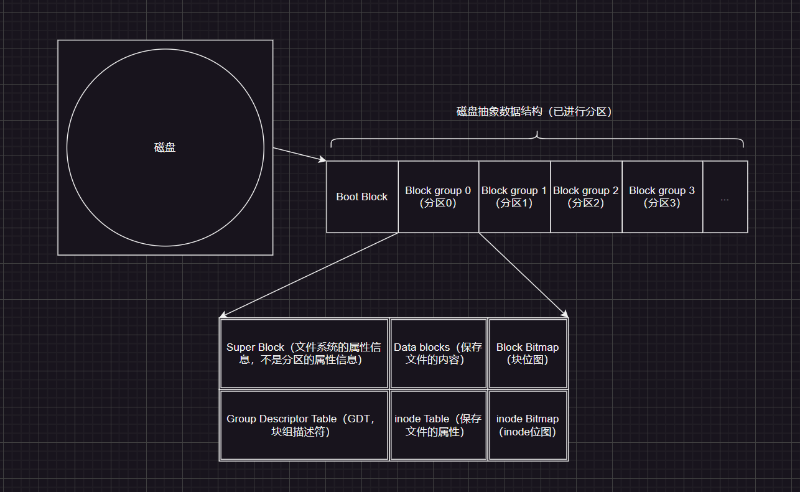

# 1.文件概念

## 1.1.文件IO

在谈及系统接口之前，我们先来从`C`语言的角度来谈及一些前要知识，以辅助我们后续来理解系统`IO`。

我们知道，在`C`语言中，有很多用于文件输入输出的接口。

> 补充：`C/C++`程序会默认打开三个文件流：标准输入、标准输出、标准错误，这也就是为什么在没有手动打开（`open`）键盘和显示器的情况下，却依旧可以使用`printf()`、`scanf()`、`cout`的原因...

但是这一操作很奇怪，中间省略了很多步骤，文件是谁在访问呢？操作系统吗？太宽泛了，让我们再思考一下：

1.   我们先写一个包含打开文件接口的`C`代码
2.   经过编译生成可执行程序、运行程序加载到内存中转化为进程
3.   这就相当于，进程在访问文件
4.   而文件又放在磁盘上（因此在本系列中，最后需要提及磁盘的相关概念）
5.   进程通过一些系统接口，在磁盘上访问文件

>   补充：而我们之前在代码中使用的接口都是语言级别的接口（对系统接口进行了封装，好用是好用了，但是每一种语言都会做不同的封装，但是如果直接使用文件接口，写出来的系统代码不具备跨平台性）。因此最后，我们需要学习一些系统调用。

在`C`语言中，使用`fopen()`打开文件，然后使用`fread()`读取文件，就是读到了进程内部，进程早就被加载到内存的内部，因此就是把文件读到内存里（`input`），然后通过`fwrite()`等接口将数据写入到磁盘文件中（`output`）。

而`input`和`output`统称为文件的`IO`操作。

## 1.2.文件分类

文件实际上也有狭义和广义之分，上述提及的文件是狭义上的文件。对于系统来说：

-   狭义文件：存储在磁盘上的资源、数据叫做文件
-   广义文件：上几乎所有的外设，只要具有`input`和`output`特点的都可被称为文件

还可以根据文件是否被打开（被读取到内存中）这一状态，分为：

-   内存文件，已经被加载到内存中，随时会被进程读取修改，是动态的
-   磁盘文件，存储在磁盘中，等待被进程加载到内存中成为内存文件，是静态的

而无论是哪一种概念的文件，都具备属性和内容，对文件的操作就是操作属性和操作内容。

# 2.文件接口

这里简单复习一下一些`C`语言文件接口，并且提及内部的底层系统调用。

## 2.1.C语言文件接口

-   `fopen()`
-   `fclose()`
-   `fread()`
-   `fwrite()`

## 2.2.Linux系统调用

不同语言需要封装在不同平台的系统文件接口，以便于自己的语言可以跨平台使用。但是为了理解一些概念，我们必须对一些接口有所概念。

### 2.2.1.open()

```c
#include <sys/types.h>
#include <sys/stat.h>
#include <fcntl.h>
int open(const char* pathname, int flags);//路径和选项，通常这个函数用来读取比较多
int open(const char* pathname, int flags, mode_t mode);//路径和选项以及模式，通常这个函数用来写入比较多

//pathname 是指要打开文件的文件路径
//flags 对应的选项主要有：
//1.O_APPEND 追加
//2.O_CREAT 文件不存在，则会根据给定文件名创建新文件。如文件已存在，则不起任何作用
//3.O_TRUNC 如果文件存在，并且是常规文件，且打开的目的是写入，那么这个文件会被清空
//4.O_RDONLY 表示只读、O_WRONLY 表示只写、O_RDWR 表示读和写，这三个选项必须使用一个，再配合其他关键字使用
//5.O_CLOEXEC 在打开文件时设置 close-on-exec 标记。以 O_CLOEXEC 标志打开文件时，在调用 exec 系列函数（如 execve、execvp 等）时，该文件将自动关闭。对于在子进程中执行新程序时避免文件描述符泄漏非常有用
//...

//其中 mode 就是文件的权限，和 linux 文件权限的二进制表示是一样的，也会受到 umask 权限掩码的影响，我们也可以调用系统接口 umask() 来设置 umask 掩码，该掩码是进程专有的。如果文件是在 open() 时创建的，则默认权限是“乱码”的权限，最好还是手动设置一下。、
```

可以看到光是头文件就需要包含三个，而且还有两个`open()`函数需要选择，还需要组合选择众多的`flag`，这样就会比`C`语言的`fopen()`难用一些。

那么上面的`flag`宏关键字怎么组合使用呢？想要传递多个选项怎么做呢？

一个`int`有`32`个比特位，那么每一个比特位都可以表示一种状态，只需要使用位操作来组合即可，这种传递状态的方式在编码中很常见，可以使一个参数有多种可能或者选择，比如下面的代码。

```c
#define ONE 0x1
#define TWO 0x2
#define THR 0x3
void show(int flags)
{
    if(flags & ONE) printf("one\n");
    if(flags & TWO) printf("two\n");
    if(flags & THR) printf("thr\n");
}
int main()
{
    show(ONE);
    show(ONE | TWO);
    show(ONE | TWO | THR);
    return 0;
}
```

因此使用`open()`也是使用类似的方式来组合调用不同的标志位。

那么`mode`参数又该怎么写呢？其实就是修改权限，配合`umask()`调用来使用即可，并且优先使用调用者的`umask()`，忽略系统的`umask`值（但是一般建议直接使用系统的，和系统保存一致）。

```c
#include <stdio.h>

#include <sys/types.h>
#include <sys/stat.h>
#include <fcntl.h>
int mian()
{
    umask(0);//设置进程专用的umask掩码
    int fd = open("limou.txt", O_WRONLY, 0666);
    if(fd < 0)
    {
        perror("open");
        return 1;
    }
    printf("open success, fd: %d\n", fd);//输出3
    return 0;
}
```

### 2.2.2.close()

```c
#include <unistd.h>
int close(int fd);
```

比较简单，就是关闭一个文件，将`open()`的返回值传入即可关闭文件。

### 2.2.3.read()

```cpp
#include <unistd.h>
ssize_t read(int fd, void* buf, size_t count);//将文件内容读取到 buf 中，ssize_t 是实际读取到的字符个数，只要有 fd 就可以读取，无需提前打开文件，后面的函数也是类似
```

### 2.2.4.write()

```cpp
#include <unistd.h>
ssize_t write(int fd, const void* buf, size_t conut);//fd 就是打开文件返回的 fd，buf 就是需要写入的数据，count 就是写入个数，并且无需包含 '\0'，因为这是 C 的字符串结尾，不是系统的字符串结尾，并且该函数在 open() 没有选择追加打开和清空文件的情况下，默认是从头开始覆盖式写入
```

我们直接来使用这些系统调用试试：

```c
#include <stdio.h>
#include <sys/types.h>
#include <sys/stat.h>
#include <fcntl.h>

int mian()
{
    umask(0);//设置进程专用的 umask 掩码
    int fd = open("limou.txt", O_WRONLY, 0666);//以只写目的打开文件
    if(fd < 0)
    {
        perror("open");
        return 1;
    }
    
    const char* s = "hello word!\n";
    write(fd, s, strlen(s));//最后一个参数不用加1
    printf("open success, fd: %d\n", fd);//输出3
    return 0;
}
```

但是上述函数的返回值是什么？这就需要提到文件描述符的概念了。

# 3.文件描述符

文件描述符的作用和进程`ID`类似，是一个文件的唯一标识符（进程是`ID`为唯一标识符）

```c
int main()
{
    int fd1 = open("limou1.txt", O_WRONLY|O_CREAT|O_APPEND, 0666);
    printf("open success, fd1: %d\n", fd1);
    int fd2 = open("limou1.txt", O_WRONLY|O_CREAT|O_APPEND, 0666);
    printf("open success, fd2: %d\n", fd2);
    int fd3 = open("limou1.txt", O_WRONLY|O_CREAT|O_APPEND, 0666);
    printf("open success, fd3: %d\n", fd3);
    int fd4 = open("limou1.txt", O_WRONLY|O_CREAT|O_APPEND, 0666);
    printf("open success, fd4: %d\n", fd4);

    close(fd1);
    close(fd2);
    close(fd3);
    close(fd4);
    return 0;
}
//输出了3、4、5、6
```

这个`fd`返回值究竟是什么？就是所谓文件描述符，其中`0`、`1`、`2`这三个文件去哪里了呢？实际上分配给三个标准输入输出文件了，也就是被`stdin(0)`、`stdout(1)`、`stderr(2)`所占用（依照顺序占用）！

```cpp
int main()
{
    fprintf(stdout, "hello\n");//使用 C 语言的文件指针 FILE 写入 stdout

    const char* s = "I am limou\n";
    write(1, s, strlen(s));//使用系统调用和文件描述符写入 1 号文件
    return 0;
}
```

文件描述符的分配规则非常简单：先分配最小的没有被占用的文件描述符给新打开的文件。如果我们把默认的三个标准输入输出文件使用`fclose()`关掉，那么新打开的文件就可以占用`0`、`1`、`2`中某个标识符。

>   补充：在`C`语言下，所有的文件都具有文件指针`FILE`。而`FILE`是`C`标准库设计的文件结构体，内部有多种成员。在系统角度只认识`fd`，不认识`FILE`，因此我们可以猜测：在`FILE`结构体内部一定封装了文件描述符`fd`。
>
>   而这一点可以查看`FILE`结构体的成员变量的`_fileno`（存储了文件描述符）来证明（也有可能不是这个名字，但是一定有一个文件描述符成员）。

# 4.文件结构体

一个进程可以打开多个文件，而一个文件要被访问也必须被一起加载到内存中才能被进程访问，那如果多个进程都在打开文件怎么办？内存根本不够用！因此操作系统不可能将如此多的文件全部一次性打开，必须经过描述和管理，因此就需要构建一个文件结构体。

在内核中，为了管理被打开的文件，就必须创建一个`struct file{struct file* next; struct file* prev;};`（不仅包含属性和数据还有更多的）结构体来描述文件，并且使用双链表链接起来组织（先描述再组织）。

每打开一个文件，就会实例化该结构体，插入到链表中，来代表一个文件。一条链表就是当前所有进程需要的被打开的文件，但是文件和进程之间怎么关联呢？靠的就是`fd`文件描述符，所有的`fd`值构成一个数组的下标，这个数组的类型就是`struct file* arrary[]`，也就是一个指针数组，每一个指针成员都指向一个文件结构体。

这样，系统就可以在进程对象中使用`fd`下标来访问一个指针数组，然后找到指向的文件结构对象，进而使用该对象描述的文件。

而再上述提到的结构体内部具有成员变量，而它又是描述文件的，因此文件有大部分属性来自这个结构体，关于属性的修改就是修改这些成员变量。

## 4.1.文件结构

真的存在描述文件用的结构体呢？下面是`Linux`内核对应的源代码：

```cpp
struct file
{
    union
    {
        struct list_head fu_list;
        struct rcu_head fu_rcuhead;
    } f_u;
    struct path f_path;
    //...
    const struct file_operations* f_op;//文件方法操作集
    //...
    fmode_t f_mode;//文件权限
    struct fown_struct f_owner;//文件的拥有者
    //...
    atomic_long_t f_count;//引用计数（统计有多少个进程在打开该文件）
    //...
    u64 f_version;//文件的版本
    //...
};
```

内部必然包含文件的各种属性和文件内容，每创建一个文件实例化，就是描述了一个文件。除此之外，还需要提供了一个文件缓存区（也就是一段内存空间）由操作系统申请给文件，在本文后面有关于缓冲区的详细描述。

这个结构实例化后的对象和进程结构的实例化一样，都只是在内存中存在，因此准确来说，该进程是描述一个被打开的文件。

-   所谓打开文件读数据，就是先发生缺页中断，然后将数据加载到内存（缓冲区）中，才允许进程读取文件的数据。
-   而写数据就是修改文件，改动内容和改动属性都是修改，也需要先将数据加载到内存（缓冲区），再进行修改。

因此文件读写操作都需要加载到内存中，都是来回拷贝。

除此之外，在文件结构体中还有对文件的操作方法集，可以根据每个文件自己的缓冲区进行文件操作（这点在`C`语言中可以使用函数回调来实现）。

## 4.2.指针数组

是否真的存在这么一个“数组”来指向结构体呢？我们也可以查看一下`Linux`内核的源码来证明：

```c
struct files_struct
{
    atomic_t count;
    struct fdtable *fdt;
    struct fdtable fdtab;

    spinlock_t file_lock ___cacheline_aligned_in_smp;
    int next_fd;
    struct embedded_fd_set close_on_exec_init;
    struct embedded_fd_set open_fds_init;
    struct file* fd_array[NR_OPEN_DEFAULT];//重点关注这个数组，如果是64位，NR_OPEN_DEFAULT=64，32位就是32。
};
```

上面的结构体内的`fd_array[]`数组就是指针数组，每一个指针成员指向一个描述文件的结构体。

但是为什么这个数组这么小呢？只能同时打开`64/32`个文件？实际上还有其他的拓展字段（其他成员变量）来帮助这个数组指向更多的文件，在现在的某些操作系统里，一个进程有时候可以打开的文件能达到`10 000`个。

>   补充：因此经过上面所有知识的铺垫，我们终于可以得到更深入的结论：
>
>   1. `C`语言调用`fopen()`，则调用了系统接口`open()`，系统实例化一份`struct file*`类型的文件对象，描述这个被打开的文件，并且插入到`fd_array[]`中，分配好文件标识符`fd`后，返回给`open()`
>
>   2. 因此`open()`得到一个文件描述符`fd`（数组下标），而文件描述符又被`C`语言的`FILE`结构体封装，最后以`FILE*`的方式返回给`fopen()`，也就是我们平时在`C`语言内使用的文件指针
>
>   3. 然后我们在使用`C`语言的`fwrite()`的时候，传进来了一个`FILE*`，指向的结构体变量内部具有一个`fd`文件描述符，就可以通过这个`fd`传给系统调用`write()`
>
>   4. 然后操作系统找到进程的`task_struct{};`，就找到了进程内部的数组`fd_array[]`，根据`fd`就找到了`struct file*`类型的文件对象，也就是一个内存文件被找到了，然后后续就可以进行某一些写入操作了
>

# 5.重定向

## 5.1.重定向模拟

如果`close()`关掉`fd=1`的文件，根据`fd`的分配原则，关闭`fd=1`意味着下次打开文件分配的`fd`为`1`，而`C`又默认往`fd=1`的`stdout`打印。

那么打印就会往新打开的文件内输出，而且不只是这一次打印，往后所有的打印输出函数都会输入的这个新打开的文件内部，这也就模拟了输出重定向。

```c
#include <stdio.h>
#include <sys/types.h>
#include <sys/stat.h>
#include <fcntl.h>
#include <unistd.h>

int main()
{
    close(1);
    int fd = open("limou.txt", O_WRONLY|O_TRUNC|O_CREAT);//会覆盖文件的内容
    if(fd < 0)
    {
        perror("open");
        return 1;
    }
    fprintf(stdout, "you can see me : %d, success\n", fd);
    fflush(stdout);
    //加上这个 fflush() 的原因是为了刷新用户级别的缓冲区，如果没有使用这个函数，后面执行了 close() 导致没有对应的 fd，C 语言提供的用户级缓冲区就无法通过 fd 让系统将数据刷新到对应文件
    close(stdout);
    return 0;
}
```

但是如果我们在代码的末尾去带`fflush()`就会发现，在文件内没有内容？！这又是为什么呢？这涉及到缓冲区，我们后面来讲解，这里先跳过。

类似的，关掉`fd=0`也可以模拟输入重定向。

```cpp
#include <stdio.h>
#include <sys/types.h>
#include <sys/stat.h>
#include <fcntl.h>
#include <unistd.h>

int main()
{
    close(0);
    int fd = open("limou.txt", O_RDONLY);//此时文件内是有内容的
    if(fd < 0)
    {
        perror("open");
        return 1;
    }
    char buffer[1024];
    fread(buffer, 1, sizeof(buffer), stdin);
    printf("%s", buffer);
    close(fd);
    return 0;
}//注意这里的输出缓冲区会自动刷新，无需我们手动刷新，这和输入缓冲区不一样
```

>   补充：在`C`代码结束后，输入缓冲区中的数据不会被自动刷新。这是因为输入缓冲区中的数据是由操作系统控制的，`C`程序并不能直接控制它。如果需要确保输入缓冲区中的数据被清空，可以使用如下代码：
>
>   ```cpp
>   while(getchar() != '\n');
>   ```
>
>   这个代码会读取并丢弃输入缓冲区中的所有剩余字符，直到遇到换行符为止。
>
>   而对于输出缓冲区，通常情况下都会在程序结束时被自动刷新。但是也有一些情况下，在使用`exit()`函数或者`abort()`函数非正常退出程序时，输出缓冲区可能不会被刷新。为了避免这种情况，可以在程序结束之前手动刷新输出缓冲区，例如使用`fflush(stdout)`函数。

## 5.2.重定向接口

上面代码还需要我们先关闭标准输入输出，有没有其他的办法呢？有的，接下来就让我们来学习一下重定向的底层调用：

```c
int dup(int oldfd);
int dup2(int oldfd, int newfd);//重点了解这一个
int dup3(int oldfd, int newfd, int flags);
```

我们了解`dup2()`就够了，`duq2()`就是把`oldfd`指向的内容拷贝给`newfd`，然后将`oldfd`指向的文件关闭（这里的关闭是指引用计数减减，而不是真的将指向的文件对象释放关闭）。也就是说：`newfd`的指向发生了改动。

```c
#include <stdio.h>
#include <sys/types.h>
#include <sys/stat.h>
#include <fcntl.h>
int mian(int argc, char* argv[])
{
    if(argc != 2)
    {
        return 2;
    }
    int fd = open("limou.txt", O_WRONLY|O_TRUNC|O_CREAT);//会覆盖文件的内容
    if(fd < 0)
    {
        perror("open");
        retrun 1;
    }
    close(1);
    dup2(fd, 1);//重定向输出
    close(fd);
    fprintf(stdout, "%s\n", argv[1]);//打印出携带的参数
    return 0;
}
```

因此上面的代码就是重定向的原理。

> 补充：“`Linux`下一切皆文件”，在进程控制和基础`IO`的知识背景下我们可以更加深入了解这句话。
> 
> 首先，`Linux`内核大部分都是使用`C`语言实现的，那么`C`有没有办法实现面向对象呢？是可以的！
> 
> 例如：对于一个文件结构体，首先`C`的结构体具备类的雏形，可以在内部定义文件的属性（结构体成员变量），那么方法怎么实现呢？使用函数指针（结构体成员变量），只需要函数指针实现恰当，就可以在结构体中包含方法。
> 
> 因此一个基础的类就实现了。
> 
> 因此“一切皆文件”就是指：可以使用`C`语言的结构体来描述所有的硬件的“属性”和“操作”，那么调用这些硬件就如同调用一个对象，设置对象属性，根据属性使用对象的操作方法...这就是“一切接文件”的本质！
> 
> 另外，`C`语言虽然是面向过程的语言，但是并不意味着`C`不可以实现面向对象思想，像上述的说明就实现了一个类的封装。在某些巧妙地设计下，实现`OOP`其他重要特性（比如：多态）也是完全可以的，当然，对比纯`OOP`语言来说会有些麻烦（比如`Java`）。
> 
> 实际上，语言从面向过程到面向对象也是经历了这些大量的实践（每次都要设计出这样带有属性和方法的结构体）才被人们设计出来的。

我们之前写过一个`MyShell`项目，还有一个重定向的功能，用的就是这里的重定向调用。

# 6.标准错误文件

标准输出文件和标准错误文件都是输出到显示器，那么两者有什么区别呢？让我们来先看一段代码。

```c++
#include <sys/types.h>
#include <sys/stat.h>
#include <fcntl.h>
#include <unistd.h>
#include <cstdio>
#include <cstring>
#include <iostream>
using namespace std;
int main()
{
    printf("hello printf 1\n");//->stdio
    fprintf(stdout, "hello fprintf 1\n");
    perror("hello perror 2");//->stder

    const char* s1 = "hello write 1\n";
    write(1, s1, strlen(s1));

    const char* s2 = "hello write 2\n";
    write(2, s2, strlen(s2));

    cout << "hello cout 1" << endl;
    cerr << "hello cerr 2" << endl; 
    return 0;
}
```

这份`C++`代码的运行结果和重定向结果如下：

```bash
$ g++ main.cpp
$ ./a.out
hello printf 1
hello fprintf 1
hello perror 2: Success
hello write 1
hello write 2
hello cout 1
hello cerr 2

$ ./a.out > limou.txt
hello perror 2: Success
hello write 2
hello cerr 2

$ cat limou.txt
hello write 1
hello printf 1
hello fprintf 1
hello cout 1
```

可以看出`1`和`2`对于的都是显示器文件，但是两个文件是些不同的，我们可以认为一个显示器文件被打开了两次。`1`和`2`描述符都指向显示器文件。因此做重定向的时候我们会发现，如果`1`被`dup2()`了，不代表`2`会被`dup2()`。

这就是两者的最大区别，这样我们就可以理解，为什么开发者不自己使用类似`printf()`和`if()`打印错误，而使用`preeor()`这样的函数来做一个错误检查的输出了。

如果程序在运行的过程中出现了问题，使用类似`preeor()`、`cerr()`等函数会更加方便，因为可以使错误信息和正常打印信息区分开。

## 6.1.分开输出标准输出和标准错误

如果希望直接使用重定向，来使一般的文本输出和错误输出分离开查看的话，可以使用类似`./a.out 1>text.txt 2>error.txt`的命令，这样就可以实现文本输出和错误输出分离到两个文件内，直接进行查看就可以。

## 6.2.合并输出标准输出和标准错误

如果想要文本输出和错误输出全部放进一个文件了，则可以使用命令`./a.out > all.txt 2>&1`（整个命令可以这么理解，`./a.out > all.txt`将文本输出从标准输出重定向为文件`all.txt`，此时该文件的`fd`就是`1`，而后面又将`2>&1`就把标准输出重定向为`1`，也就是说标准错误现在也指向`all.txt`了，这样两个输出就可以同时输入到一个文件了）。

>   补充：重定向也可以使用`cat < source.txt > copy.txt`来拷贝文件。

## 6.3.模拟实现perror()

而`perror()`实际上我们也可以设计一个。

```cpp
void MyPerror(const char* msg)
{
    fprintf(stderr, "%s: %s\n", msg, strerror(erron));//后面这个函数就是打印错误信息
}
```

# 7.缓冲区

我们之前提到过缓冲区，实际就是一段内存空间。

## 4.1.缓冲区作用

为什么需要缓冲区呢？原因很简单，为了效率的问题。

1. 如果一个一个输出/输入数据，直接写透输出到磁盘的另外一个文件中，那么这个实现就会频繁访问磁盘（写透模式`WT`，缓慢且效率低）。

2. 但是如果先拿内存空间存储起来表示写入完成（这里写了就回去了，在写入的文件看来自己已经完成对某文件的写入了（实际并没有，只是交给小段的内存空间了），也就是所谓的“写回”），再一起输出/输入到磁盘中的文件（刷新），这样效率就会很高，访问磁盘不会特别频繁（写回模式`WB`，快速且效率高）。

因此有了缓冲区就可以提高用户的响应速度，避免磁盘访问速度缓慢引起用户的输入输出请求响应缓慢。

> 补充：在某些情况下，我们也可以把内存当作一个大型的缓冲区来理解。

## 4.2.缓冲区刷新

1. 立刻刷新（即时缓冲）

2. 写一行用换行就刷新（行刷新）

3. 占满缓冲区就刷新（全刷新）

但是有一些特殊情况也会刷新缓冲区：用户强制刷新（`fflush()`）、进程退出等。

> 补充：一般显示器采用行刷新（符合阅读习惯），磁盘采用全缓冲（提高效率需求）。

## 4.3.缓冲区提供

但是缓冲区这段内存空间是谁提供的呢？

```c
//mian.c
int mian()
{
    //C语言接口
    printf("hello printf()\n");
    fprintf(stdout, "hello fprintf()\n");
    const char* s = "hello fputs()\n");
    fputs(s, stdout);
    //OS系统接口
    const char* str = "hello write()\n");
    write(1, ss, strlen(ss));   

    fork();
    return 0;
}
//保存通过gcc生成a.out
```

如果直接运行`./a.out`，那么输出`4`行字符串确实没毛病。

```bash
hello printf()
hello fprintf()
hello fputs()
hello write()
```

但是如果将内容重定向到同级的另外一份空的文本文件`/.a.out > text.txt`，就会发现会多出很多语句，并且顺序也很奇怪，这是为什么呢？

```bash
hello write()
hello printf()
hello fprintf()
hello fputs()
hello printf()
hello fprintf()
hello fputs()
```

这是因为我们之前提到的缓冲区是由语言来维护的（准确的说是`C`标准库）。

首先，我们可以选择在进程里使用`C`提供的函数来写入缓冲区，再由缓冲区自己调用`write()`写入系统。也可以直接调用`write()`那就会直接写入到系统。

我们之前是在显示器上刷新缓冲区的（行刷新）因此父进程运行一段代码，遇到`\n`就会刷新一次（这就是一种数据的改动），然后再创建子进程。对于子进程来说，父进程缓冲区内的数据已经被输出了，也就没有缓冲区的数据需要写时拷贝（继承父进程的数据）了，因此只有`4`行的输出，子进程没有任何的输出。

而当我们将输出重定向的时候，就是向磁盘中的文件写入，在`fork()`之前：

1. 前面的函数被执行完了，但是不代表缓冲区的数据已经被刷新了，这是因为现在是将缓冲区的数据刷新到到磁盘（全刷新），因此代码语句中的`\n`变得没有效果了，父进程在缓冲区中的数据会保存着不会立刻输出

2. 而缓冲区的数据也是父进程的数据，在`fork()`之后，由于父进程在结束进程的时候需要刷新缓冲区的文件（这就是一种数据的改动）。为了避免子进程被父进程影响，创建子进程的时候，父进程缓冲区内的数据会发生一次写时拷贝（让子进程继承）

3. 最后在父子进程都结束进程后，由于进程结束必须要刷新所有缓冲区的数据，因此就会出现两份相同的输出（但是谁先退出这是不清楚的）

因此我们可以在`fork()`代码的前面再加一条`fflush()`来避免创建子进程的时候发生写时拷贝，进而实现正常打印四条输出。

```c
//mian.c
int mian()
{
    //C语言接口
    printf("hello printf()\n");
    fprintf(stdout, "hello fprintf()\n");
    const char* s = "hello fputs()\n");
    fputs(s, stdout);
    //OS系统接口
    const char* str = "hello write()\n");
    write(1, ss, strlen(ss));   
    fflush(stdout);
    fork();
    return 0;
}
```

但是为什么`fflush()`只输进去了一个参数呢，缓冲区的所在地呢？实际上`struct FILE{//...};`结构体不仅仅保存了文件描述符`fd`，还封装了`fd`对应的大量的语言级缓冲区结构。在一些`stdio.h` 实现里`FILE`是由`IO_FILE`封装的。因此在`FILE{//...};`内部我们可以看到类似`_IO_read_ptr`、`_IO_read_end`等缓冲区相关的关键字。

而对于操作系统来说，每一个`file{//...};`内也有一个内核缓冲区，所以我们使用`write()`的时候，也是将数据放进了系统级别的缓冲区。但是从上述代码输出来看，为什么就没有发生写时拷贝呢？醒醒吧，是子进程要使用父进程中有可能会被修改的数据时才发生写时拷贝，而`write()`放入操作系统缓冲区，而不是在进程里操作写入，由操作系统来定义刷新。因此进程之间的写实拷贝和这里无关，写实拷贝是在进程里创建子进程的时候发生的（但是这里系统级别的缓冲区我们只能先说到这里，没有办法继续展开了...）。

那么其他语言，例如：`C++`语言又是怎么做到的呢？对`<<`进行重载，然后内部实现的时候将数据拷贝到`buffer`里就可以，后面再进行刷新即可（这里可以查看一下`cout`的实现，找找看里面是否存在`fd`）。

最终结论：在`C`语言中，读写用的语言级别缓冲区由`C`库来维护，并且就在`FILE{//...};`内部描述缓冲区的属性。

## 4.4.缓冲区模拟

这里我们只模拟缓冲区原理的一部分。

```c++
#include <sys/types.h>
#include <sys/stat.h>
#include <fcntl.h>
#include <assert.h>
#include <stdlib.h>
#include <stdio.h>
#include <string.h>
typedef struct MyFILE//模拟FILE
{
    int fd;//文件描述符
    char buffer[1024];//缓冲区
    int end;//结尾
}MyFILE;
//可以看到文件的数据都在MyFILE里，因此所有的接口都需要使用MyFILE
MyFILE* MyFopen(const char* pathname, const char* mode)
{
    //1.检查参数都不为空
    assert(pathname);
    assert(mode);
    //2.对不同模式做不同的操作
    MyFILE* fp = NULL;
    if (strcmp(mode, "r") == 0)
    {
    }
    else if (strcmp(mode, "r+") == 0)
    {

    }
    else if (strcmp(mode, "w") == 0)
    {
        int fd = open(pathname, O_WRONLY | O_TRUNC | O_CREAT, 0666);//调用系统接口，写入之前先清空文件，不存在时需要创建
        if (fd >= 0)
        {
            fp = (MyFILE*)malloc(sizeof(MyFILE));
            memset(fp, 0, sizeof(MyFILE));
            fp->fd = fd;
        }
    }
    else if (strcmp(mode, "w+") == 0)
    {

    }
    else if (strcmp(mode, "a") == 0)
    {

    }
    else if (strcmp(mode, "a+") == 0)
    {

    }
    return fp;

}
void MyFputs(const char* message, MyFILE* fp)
{
    assert(message);
    assert(fp);
    strcpy(fp->buffer + fp->end, message);//注意这个函数是会自动添加'\0'的
    fp->end += strlen(message);//防止多次写入缓冲区被覆盖

    if (fp->fd == 0)
    {
        //标准输入
    }
    else if (fp->fd == 1)
    {
        //标准输出
        if (fp->buffer[fp->end - 1] == '\n')
        {
            write(fp->fd, fp->buffer, fp->end);//默认显示器行刷新
            fp->end = 0;
        }
    }
    else if (fp->fd == 2)
    {
        //标准错误
    }
    else
    {

    }

}
void MyFflush(MyFILE* fp)
{
    assert(fp);
    if (fp->end != 0)
    {
        write(fp->fd, fp->buffer, fp->end);//实际上是写入到内核缓冲区里了，一般是内核会帮助我们刷新，但是我们也可以尝试使用syncfs()可以刷新数据到磁盘上
        syncfs(fp->fd);//刷新系统缓冲区到磁盘
        fp->end = 0;
    }
}
void MyFclose(MyFILE* fp)
{
    assert(fp);
    MyFflush(fp);//关掉文件之前先刷新一下缓冲区到文件里
    close(fp->fd);
    free(fp);
}
int main()
{
    MyFILE* fp = MyFopen("./limou.txt", "w");
    if (fp == NULL)
    {
        printf("open error\n");
        return 0;
    }
    MyFputs("hello!", fp);
    MyFputs("I am limou.", fp);
    MyFputs("This are words.", fp);
    MyFclose(fp); 
}
```

上面的代码不仅是实现了缓冲区的输入操作，还实现了一种缓冲区刷新策略（行刷新）。

您还可以在代码一开始的时候关闭`fd=1`的文件（也就是标准输出），这样系统就会给您的文件分配`fd=1`，再结合`usleep()`来观察行刷新的操作。

并且我们还可以尝试在代码结尾添加`fork()`来重现我们在`4.3.缓冲区提供`中出现重复打印的现象。

而效率提高的地方就在于`IO`执行的次数变少（访问磁盘次数减少），在内存的操作比较多（放入`buffer[]`中）。

# 10.模拟实现C文件接口

了解了`Linux`中文件的系统调用和缓冲区之后，就可以尝试使用系统调用，来模拟实现`C`的文件接口了。

---

# 9.文件系统

首先我要注意到我们之前学习的文件都是被打开的文件（被进程访问），那么哪些存储在磁盘中的没有被打开的文件呢？  这些文件又有哪些需要注意的地方呢？

首先我们先要理解磁盘的一些基本知识。

## 6.1.磁盘角度理解磁盘文件

### 6.1.1.磁盘硬件结构

1. 内存是一种失电易失存储介质

2. 磁盘就是永久性存储介质（还有一些存储介质，例如：`SSD`、`U`盘、`flash`卡、光盘、磁带...但是磁盘的性价比要高）

磁盘对比`CPU`的处理速度是比较慢的，因此操作系统也会有一些提速处理的方式（这里暂时不提及，您只需要知道有就是了）

而磁盘的具体结构大概为：磁盘盘片（存储数据，由很多密度非常大的磁性颗粒来构成，利用南北磁性表示`1/0`，磁盘和磁盘之间存在悬浮避免损坏）、磁头（用来寻址，每一个盘面都有一个，可以利用放电来改变磁性，因此可以存放数据，也可以拿来读取数据）、伺服系统、音圈马达...

磁盘盘片上的一圈称为“磁道”或者“柱面”，磁盘盘片由若干块扇区构成。

> 补充：磁盘的存储基本单位是扇区，而一般扇区的存储字节大小为`512`字节，也有`4KB`的（后者比较先进）。

### 6.1.2.磁盘查找结构

无论是读还是写，首先都需要查找地址，那么如何查找存储空间的地址呢？需要三要素：

1. 首先查找数据在哪一个盘面？

2. 数据存在哪一个轨道/柱面上？（磁道为`Cylinder`）

3. 在哪一个扇区里？（磁头为`Head`、扇区为`Sector`）

这种寻址方式就是`CHS`寻址，可以找到所有扇区的。

通过磁盘的旋转可以想象成线性结构，因此扇区可以抽象为数组，因此使用下标就可以寻找数据，也可以使用指针来标明不同的磁盘扇区，这就变成了`LBA`寻址，这就是磁盘的一种结构体抽象，由对磁盘的管理转化为对数组的管理。

但是磁盘很大，形成的抽象数组所占空间也很大，因此可以对这个抽象数组进行拆分，也就是所谓的“磁盘分区”，便于管理和查找。

但是即便是做了分区，也依旧很大怎么办呢？

### 6.1.3.磁盘抽象结构

“磁盘抽象结构”也就是“虚拟/逻辑结构”，上述已经成功将磁盘理解为线性结构了，那么对于每一块磁盘分区，内部还有指针维护划分块组区间：`Boot Block`、`Block group 0`、`Block group 1`、...`Block group n`。

而每一个`Block group`的内部包含了`Super Block`、`Group Descriptor Table`、`Block Bitmap`、`inode Bitmap`、`inode Table`、`Data blocks`（这里是我们学习的重点）。

1. `Super Block`：文件系统的属性信息，包含了一个磁盘分区的属性（分区内有多少块组、分区内的块组满了没、`inode`有多少个可用）。这个信息之所以被多份放进块组，而不是直接放一份进磁盘分区，是因为可以达到备份恢复的目的，不至于一份坏掉整个磁盘都无法运行。

> 补充`1`：虽然磁盘基本单位扇区是`512 byte`，但是操作系统的文件系统和磁盘进行`IO`动作的基本单位是`4 KB = 8 * 512 byte`。哪怕系统只写读写`1 bit`的数据也必须读写`4 KB`。为什么不以磁盘的基本单位扇区是因为：
> 
> 1. `512 byte`太小了，`IO`操作又是频繁操作，导致效率下降
> 
> 2. 万一未来的磁盘基本单位被修改了呢？源代码也需要跟着改变，这太麻烦了（解耦合）
> 
> 补充`2`：`4 KB`就是一个块大小，这也就是磁盘为什么被称为“块设备”的原因。

2. `Data blocks`：多个块（`扇区*8 = 1KB`）的集合。不过需要注意的是这里保存的都是特点文件的“内容”（`Linux`将文件的属性和内容分开存储）。

3. `inode Table`：每一个文件都一个`inode`编号，也就是`ls -al`之后每一个文件列表的第一列。`inode`空间的大小是`128 byte`的空间，保存的是对应文件的“属性”。在`inode Table`内是`inode`空间的集合，需要有一个`inode`编号来标识`inode`块。因此一个文件，对应一个`inode`值，对应一个`inode`块，多个`inode`块存于`inode Table`里。

4. `Block Bitmap`：那么磁盘怎么知道`Data blocks`里有哪些`block`被占用？哪些可以被使用呢？使用位图`Block Bitap`，只要有`x`歌块，就至少有`x`多个比特位，比特位对应一个块，`1`表示“块被占用”，`0`表示“块可用”。

5. `inode Bitmap`：那么磁盘又怎么知道`inode Table`里有哪些`inode`被占用？哪些可以被使用呢？同理和`Block Bitap`是类似的，也是使用位图。

6. `Group Descriptor Table`（`GDT`）：块组描述符，主要是描述块组的大小、块组使用程度；有多少`inode`、`inode`使用程度；有多少块、块的使用程度...

> 注意：但是这里有几个个问题：
> 
> 1. 一个文件不一定只占有一个块（`4 KB`）？文件大了怎么办？不用担心，不是所有的块都存储内容数据，也可以存储其他块的块号，有点类似多叉树，存在大量的叶子节点来索引。
> 
> 2. 找文件属性需要找到`inode`空间，怎么找到`inode`空间呢？只要找到`inode`编号即可，但是`inode`编号怎么找呢？并且文件内容怎么找呢？

基于上述的描述：系统可以完全掌握磁盘信息可追溯、可管理。也就是说：找到一个文件，就需要找到`inode`编号（依靠目录结构来找到），然后就可以找到分区特定的块组，然后找到`inode`，就可以得到属性，有了属性就可以得到内容。

> 补充：每个块组都这么做，整个分区就被写入了文件系统信息，也就是“格式化”。



## 6.2.重新理解目录三权限

另外我们还可以重新理解对目录的三个权限：

1. `w`权限：一个文件的文件名是存储在目录里的，`inode`编号不会存储文件名，而文件名和`inode`编号都是唯一的，因此是一一映射，互为`key`值的。这一映射关系和文件名被存储在目录的`Data blocks`里，文件名需要存储在目录的`Data blocks`里就必须写入数据，因此我们在目录底下创建文件就必须具有对目录的写权限，这也就是为什么需要给目录赋予`w`权限的缘故。

2. `r`权限：为了显示目录中文件的名字或者属性，但是`inode`中没有文件名数据，因此就需要对目录文件具有读权限，读取目录的`inode`才可以获得文件名和属性。

3. `x`权限：略

那么对于操作系统来说，创建一个文件的时候，系统做了什么呢？

## 6.3.系统创建删除查看文件

1. 首先确认在哪一个目录下创建，可以找到目录所在分区，然后确定保存文件的块，然后遍历找到第一个`inode`位图为`0`的地方，置为`1`，这样遍历累加得到计数就是一个`inode`编号，然后在`inode`编号指向的`inode`表里设置文件的权限，然后由于是新建立的文件没有内容，因此把对应的块清空数据，然后后面写的时候，再直接从块位图中找块，然后将内容填写进去。

2. 那么删除文件，系统做了什么呢？首先要确定目录的`Data blocks`，然后用户提供文件名，以文件名作为`key`值从目录的`Data blocks`中找到对应文件的`inode`编号，然后就去置`0`文件的`inode`位图和块位图，这个文件就被变相删掉了，然后再进一步从目录中删除映射关系即可（换句话来说，被删除的文件实际上依旧存在，只不过很难通过某些类似指针的东西找回，并且被删除文件占有的空间会被随时覆盖，所以的确有概率在删除文件之后可以恢复文件，事实上也确实存在类似这样的软件）

3. 那么查看文件，系统做了什么呢？`ls`、`cat`等指令的时候，`ls`首先找到目录以及目录的`inode`编号，找到所有的文件名和对应的文件`inode`编号，然后感觉对应的`inode`位图找到所有的属性然后和文件名字拼接输出即可，而`cat`也是类似的只不过是根据文件属性找到对应块的文件内容...

>   补充：虽然很少，但是由于`inode`和块的数量是固定的，因此有可能出现一方不够用的情况
>
>   1.   `inode`不够用了，创建不了文件
>   2.   块不够用了，创建得了文件但是无法写入内容

# 10.软硬链接

经过上述的铺垫，我们可以来理解软硬链接了，首先我们先来尝试创建链接：

1.   `ln -s <链接文件> <链接名词>`可以创建软链接
2.   `ln <链接文件> <链接名词>`可以创建硬链接

两者有什么差别呢？软链接有自己独立的`inode`，并且不会增加文件的硬链接数。而硬链接`inode`和对应的文件`inode`是一样的（这意味着硬链接不是一个独立的文件），并且会增加硬链接数。

```bash
$ ls -li
total 4
1840738 drwxrwxr-x 2 limou limou 4096 Oct  1 22:42 dir
1840740 -rw-rw-r-- 4 limou limou    0 Oct  1 22:42 hard-link-1
1840740 -rw-rw-r-- 4 limou limou    0 Oct  1 22:42 hard-link-2
1840740 -rw-rw-r-- 4 limou limou    0 Oct  1 22:42 hard-link-3
1840850 lrwxrwxrwx 1 limou limou    4 Oct  1 22:44 soft-link -> text
1840739 -rw-rw-r-- 1 limou limou    0 Oct  1 22:42 text
1840740 -rw-rw-r-- 4 limou limou    0 Oct  1 22:42 text_1
1840747 -rw-rw-r-- 1 limou limou    0 Oct  1 22:42 text_2
1840849 -rw-rw-r-- 1 limou limou    0 Oct  1 22:42 text_3
```

软链接类似于`Windows`下的快捷方式，可以更加快捷使用某些程序和工具（软链接内部文件内容实际上就是存储了指向目标的路径）。

硬链接只是在指定的目录下，建立了文件名和`inode`的映射而已，也就是给文件重命名。实际上硬链接数就是引用计数的应用。

当我们删除文件的时候，引用计数减`1`，只有引用计数为`0`的时候，该文件才会被彻底删除，而硬链接可以增加引用计数。

我们可以尝试使用`unlink <文件名>`指令来减少某个文件的引用计数，达到`rm`的效果（系统调用也有一个加`unlink()`的函数）。

并且文件自己就是自己的硬链接。对于刚刚被创建出来的目录，其硬链接数默认为`2`，一个是自己本身，另外一个是目录内部的`.`，这个`.`用于使用相对路径，其实际上是目录的一个硬链接。因此使用`.`就是使用目录。而`..`就是目录的父目录的硬链接。

# 11.动静态库

## 8.1.静态库制作和使用

### 8.1.1.静态库制作

实际上，我们可以把`function.h`文件和经过`gcc -c function.c -o function.o`的文件给别人，就可以给别人使用您编写的函数，如果将多个`.o`文件打包起来，就是“形成静态库”的过程，使用`ar`命令即可完成打包。

```bash
ar -rc <目标静态库名，lib开头的一个库名，后缀就是.a> <.o文件列表># r替换 c创建
```

```bash
$ cat function1.c function1.h function2.c function2.h test.c
#include "function1.h"
extern void Print(const char* str)
{
    printf("%s[%d]\n", str, (int)time(NULL));
}


#pragma once
#include <stdio.h>
#include <time.h>
extern void Print(const char* str);


#include "function2.h"
int Add(int i)
{
    printf("%d\n", i * i);
    return i * i;
}


#pragma once
#include <stdio.h>
extern int Add(int i);


#include "function1.h"
#include "function2.h"
int main()
{
    Print("I am limou.");
    printf("%d\n", Add(50));
    return 0;
}
$ gcc -c function1.c -o function1.o
$ gcc -c function2.c -o function2.o
$ ls
function1.c function1.h function1.o
function2.c function2.h function2.o
test.c

$ ar -rc libfunction.a function1.o function2.o
$ ls
function1.c function1.h function1.o
function2.c function2.h function2.o
test.c libfunction.a

$ rm function1.c function2.c function1.o function2.o
$ ll
total 16
function1.h function2.h
libfunction.a test.c

$ mkdir include
$ mv function1.h function2.h include
$ mkdir lib
$ mv libfunction.a lib
$ mkidr mylib
$ mv include lib mylib
$ ls
mylib  test.c
```

### 8.1.2.静态库使用

一般制作库后，有一个目录为`include`专门放头文件，还有一个目录为`lib`专门放静态库文件。打包好两个文件后就可以发布了，因此可以有三种使用方法：

1.   直接修改系统文件：`gcc`头文件的默认搜索路径是`/usr/include`，而`gcc`库文件的默认搜索路径是`/lib64`或者`/usr/lib64`，我们直接将我们做的头文件和库拷贝进去即可。在使用我们的库时，可以在`main()`所在文件使用`<>`引用头文件，也可以使用`""`，然后使用`gcc <使用静态库的源文件> -l <静态库去掉lib和.a>`即可（整个过程实际上就是安装库的过程，但是这个做法不推荐，容易污染别人的头文件和库文件）

2.   交给用户自己链接：将打包好的`include`和`lib`文件放在包含`main()`源文件的同级目录下，然后使用`gcc main.c -I <指定头文件的所在路径> -L <静态库文件的所在地>  -l <指明目标静态库文件，去掉lib和.a>`

     ```bash
     $ gcc test.c -I ./mylib/include -L ./mylib/lib -l function
     $ ls
     a.out  mylib  test.c
     ```

## 8.2.动态库的制作和使用

### 8.2.1.动态库制作

使用命令`gcc -fPIC -c <.c文件名> -o <.o文件名>`形成一个与目标位置无关的二进制文件，然后使用`gcc -shared <.o文件列表> -o <目标动态库名，前缀lib，后缀.so>`。发布动态库，也是分为`include`和`lib`，静态库和动态库可以放在一起。

### 8.2.2.动态库使用

动态库和可执行文件可以分批加载到内存，并且加载一次动态库就可以被系统内所有的进程使用（静态库有可能会出现多份相同的代码和数据）。

先配置环境变量`export LD_LIBRARY_PATH=$LD_LIBRARY_PATH:<动态库的所在路径>`。

然后使用命令`$ gcc <包含main.c的源代码> -I <头文件的所在路径> -L <库文件的所在路径> -l <使用的动态库名字，去掉lib和.so>`最后一个选项如果指定的动静态库同名，则默认使用动态库，如果只有静态库则会使用静态库。不过可以使用`-static`强制使用静态库。

然后直接运行生成的可执行程序就可以了。

但是这个环境变量是临时性的，如果关闭了终端就会清除，这是因为该环境变量是内存级别的环境变量。

也有一劳永逸的方法，在`Linux`的`/etc/ld.so.conf.d/`，在这里创建一个`.conf`文件，在内部写入动态库的路径保存即可。这样就可以永久保存动态库的搜索路径，以后关闭终端也不会丢失该路径信息。

>   补充：这里有一个有趣的现象，如果运行带有动态库的程序成功后，删除掉之前创建的`.conf`文件，还是可以运行程序，这是因为路径还在系统缓存中保存着。

那还有没有更简单的办法呢？有的，建立一个动态库的软链接，存放在`/lib64`下，然后直接运行程序即可。

最后推荐几个好玩的库`ncurses`字符界面库、`boost`准标准库

>   补充：源文件路径和工作路径
>
>   如果我们使用`C`语言打开一个文件后直接进入死循环，然后打开进程`ID`对应在`/proc/进程ID`对应的文件，就可以看到当前这个进程的进程信息。其中：
>
>   1. `exe`指向的是该进程对应源文件在磁盘上的路径
>
>   2. `cwd`指向当前的工作路径，这也就是为什么直接用追加读写模式的时候可以在源文件同级的目录下新建文件 
>
>   ```c
>   //写入文件
>   #include <stdio.h>
>   #include <string.h>
>   #include <unistd.h>
>   int main()
>   {
>       FILE* fp = fopen("limou.txt", "w");//最后一个参数是打开模式：r是只读，w是写入，a是追加。
>       if(!fp) 
>       {
>           preeor("fopen()");
>           return 1;
>       }
>   
>       const char* s1 = "hello fwrite.\n";
>       fwrite(s1, strlen(sl), 1, fp);//这里会发现这个字符串不需要结尾加上`\0`，因为这只是C语言的规定，已经写入到文件中的数据就已经和C语言无关了，不适合文件中的规则，文件只需要保存有效数据就可以
>   
>       const char* s2 = "hello fprintf.\n";
>       fprintf(fp, "%s", s2);
>   
>       const char* s3 = "hello fputs.\n";
>       fputs(s3, fp);
>   
>       fclose(fp);
>       return 0;
>   }
>   ```
