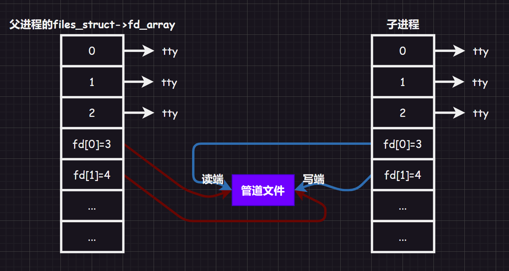
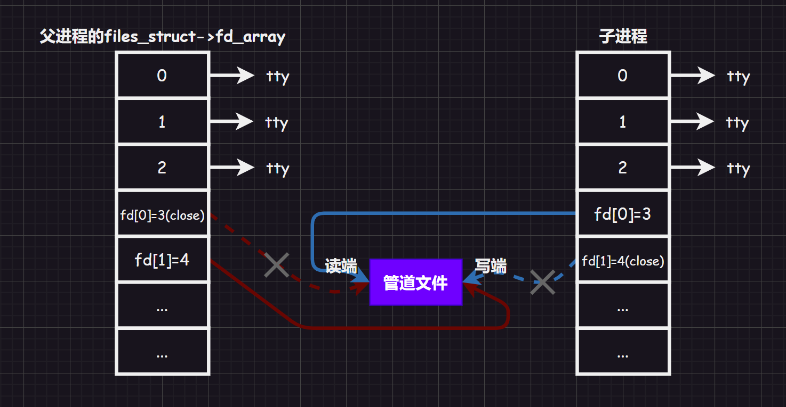

# 1.进程通信认知

## 1.1.进程通信目的

1.   **数据传输**：将进程的数据发送给另一个进程
2.   **资源共享**：多个进程之间共享某种资源
3.   **通知事件**：一个进程需要向另一个进程或者一组进程发送消息，通知发生了某种事件（如：进程终止时要通知父进程）
4.   **进程控制**：有些进程希望完全控制另一个进程的执行（如：`Debug`进程），此时控制进程希望能够拦截另一个进程的所有陷入和异常，并能够及时知道它的状态改变。

由于进程是具有独立性的，因此两者想要交互数据的难度比较大，需要有一个媒介（让不同的进程看到一个相同的资源），也就是内存空间。利用内存空间，进程之间就可以交互数据。

## 1.2.进程通信发展

进程之间的通信从古老的管道一直发展到`System V`进程通讯和`POSIX`进程间通信。

| 管道           | System V IPC       | POSIX IPC |
| -------------- | ------------------ | --------- |
| 匿名管道`pipe` | `System V`消息队列 | 消息队列  |
| 命名管道       | `System V`共享内存 | 共享内存  |
|                | `System V`信号量   | 信号量    |
|                |                    | 互斥量    |
|                |                    | 条件变量  |
|                |                    | 读写锁    |

# 2.管道

管道的来源很早（但是并没有被抛弃，相反使用得还挺多），源于`Unix`中的进程通信。把“一个进程”连接到“另一个进程”的”一个数据流“称为”一个管道“。这个管道的作用很类似现实生活中的管道，都是进行”传输“的作用。不过这个管道只可以单向通行，传送进程需要的资源。而为了保持进程之间的独立性，管道需要由操作系统（内核）来管理。

管道本质一个文件，可以被多个进程以文件的形式被进程们看到，但是管道是很特殊的文件，和普通的文件还是有很大的区别的。

管道是`Linux`中是原生提供的。

由于进程之间通过内存中的管道文件来通信是内存级别的通信，不会写入到磁盘（这样很低效），多进程产生的数据大部分是临时数据。

管道大部分用于本地进程通信。

## 2.1.匿名管道

创建匿名管道的接口描述：

```c++
#include <unistd.h>
int pipe(int fd[2]);
//fd是文件描述符数组，用来存储获得的文件描述符，f[0]表示管道读端，f[1]表示管道写端
//成功返回0，失败返回错误代码
```

父进程先使用`pipe()`创建一个管道文件设置好读端和写端。

### 2.1.1.匿名管道图解


然后父进程再创建子进程子进程同样也设置好了读写端（需要注意子进程是独立的，因此也有自己的文件描述符表`fd_array[]`，但是父进程内`fd_array[]`的数据会拷贝到子进程的`fd_array[]`）。



然后构建单向通信信道，父进程写入，子进程读取，关闭对于进程无用的读端/写端（但是其实不关闭也是可以的，只是为了严谨和防御编程）。



### 2.1.2.匿名管道应用

```c++
#include <iostream>
#include <string>
#include <unistd.h>
#include <sys/types.h>
#include <sys/wait.h>
#include <cassert>
#include <cstdio>
#include <cstring>
#include <cstdlib>
using namespace std;
int main()
{
    //1.创建管道
    int pipefd[2] = {0};//这里的数据被子进程拷贝了，所以也看得到
    int n = pipe(pipefd);
    assert(n != -1);//检查是否创建成功
    (void)n;//消除警告，因为这个返回值n只是检查是否成功，在release模式下assert()会失效，导致没人使用n从而报警
    //2.创建进程
    pid_t id = fork();
    assert(id != -1);
    //3.创建信道
    if(id == 0)//子进程入口
    {
        close(pipefd[1]);//保留子进程读端
        char buffer[1024];
        while (true)
        {
            ssize_t s = read(pipefd[0], buffer, sizeof(buffer) - 1);//读取管道数据
            if(s > 0)//读成功
            {
                buffer[s] = 0;//添加'\0'因为系统调用不靠该字符结尾
                cout << "child get a message[" << getpid() << "]" << "Father sad:" << buffer << endl;
            }
        }
        exit(0);
    }
    close(pipefd[0]);//保留父进程写端
    string message = "I am Fater";
    int count = 0;//统计消息条数
    char send_buffer[1024];
    while (true)
    {
        snprintf(send_buffer, sizeof(send_buffer), "%s:%d", message.c_str(), ++count);//写到缓冲区
        write(pipefd[1], send_buffer, strlen(send_buffer));
        sleep(1);
    }
    pid_t ret = waitpid(id, nullptr, 0);//等待子进程
    assert(ret < 0);
    (void)ret;//消除警告
    return 0;
}
```

>   注意：可能会有人对上述代码产生疑惑，为何不用一个全局的`buff[]`，这样父子进程直接做拷贝不就完成了通信么？这样做是不对的，因为有写时拷贝技术的存在，而进程通信传输的数据并不是固定不变的，有可能会发生变化。

并且使用管道，则提供了访问控制的·一种手段，管道内做了特殊处理，在管道文件内没有数据的时候，读端必须等待写入。管道文件写满时，必须等待读取后（只要管道内有数据就全部读取出来）有空间了才可以写入（阻塞状态）。

```c++
//管道是面向流式的服务（面向字节流）
#include <iostream>
#include <string>
#include <unistd.h>
#include <sys/types.h>
#include <sys/wait.h>
#include <cassert>
#include <cstdio>
#include <cstring>
#include <cstdlib>
using namespace std;
int main()
{
    //1.创建管道
    int pipefd[2] = {0};//这里的数据被子进程拷贝了，所以也看得到
    int n = pipe(pipefd);
    assert(n != -1);//检查是否创建成功
    (void)n;//消除警告，因为这个返回值n只是检查是否成功，在release模式下assert()会失效，导致没人使用n从而报警
    //2.创建进程
    pid_t id = fork();
    assert(id != -1);
    //3.创建信道
    if(id == 0)//子进程入口
    {
        close(pipefd[1]);//保留子进程读端
        char buffer[1024];
        while (true)
        {
            sleep(10);
            ssize_t s = read(pipefd[0], buffer, sizeof(buffer) - 1);//读取管道数据
            if(s > 0)//读成功
            {
                buffer[s] = 0;//添加'\0'因为系统调用不靠该字符结尾
                cout << "child get a message[" << getpid() << "]" << "Father sad:" << buffer << endl;
            }
        }
        exit(0);
    }
    close(pipefd[0]);//保留父进程写端
    string message = "I am Fater";
    int count = 0;//统计消息条数
    char send_buffer[1024];
    while (true)
    {
        snprintf(send_buffer, sizeof(send_buffer), "%s:%d", message.c_str(), ++count);//写到缓冲区
        write(pipefd[1], send_buffer, strlen(send_buffer));
        cout << count << endl;
    }
    pid_t ret = waitpid(id, nullptr, 0);//等待子进程
    assert(ret < 0);
    (void)ret;//消除警告
    return 0;
}
```

甚至，如果父进程将`pipdfd[1]`（也就是写入端）关闭了，子进程在读取的时候，`read()`会返回`0`，表示读到文件末尾。这意味着管道文件如果只有父子使用的情况下，父子进程都退出了，那么管道文件也会被自动释放，也就是生命周期随进程结束。

另外，管道是单向通信的，也就是半双工通信的一种特殊情况（还有一叫做全双工通行）。

如果父进程和多个子进程有管道的连接，这些子进程就叫“进程池”，我们可以写一个类似这样的代码。

```c++
 #include <iostream>
#include <string>
#include <vector>
#include <unordered_map>
#include <functional>
#include <unistd.h>
#include <sys/types.h>
#include <sys/wait.h>
#include <cassert>
#include <cstdio>
#include <cstring>
#include <cstdlib>
#include <ctime>
using namespace std;
#define PROCESS_NUM 5

int waitCommand(int waitFd, bool& quit);//等待读取函数

typedef std::function<void()> func;//这就定义了一个函数类型
//或者使用using func = std::function<void()>
void readSQL();
void execuleUrl();
void cal();
void mathCalculate();
vector<func> callbacks;//若干回调函数
void load();//填充若干函数/任务
unordered_map<int, string> desc;//创建哈希表
void show();//查看任务
int handlerSize();//查看任务数量
void sendAndWakeup(pid_t who, int fd, uint32_t command);//布置任务

int main()
{
    //0.装载任务
    load();
    vector<pair<pid_t, int>>slots;
    //1.构造进程池
    for(int i = 0; i < PROCESS_NUM; i++)
    {
        //1.1.创建管道
        int pipefd[2] = {0};
        int n = pipe(pipefd);
        assert(n <= 0);(void)n;
        //1.2.创建进程
        pid_t id = fork();
        assert(id != -1);
        if(id == 0)//子进程
        {
            close(pipefd[1]);
            while(true)
            {
                bool quit = false;
                int command = waitCommand(pipefd[0], quit);//如果父进程不写就进入阻塞
                if(quit) break;
                if(command >= 0 && command < handlerSize())
                {
                    callbacks[command]();//调用对应的方法
                }
                else
                {
                    cout << "非法command:" << command << endl;
                }
            }
            exit(1);
        }
        //父进程
        close(pipefd[0]);
        slots.push_back(pair<pid_t, int>(id, pipefd[1]));
    }
    //2.父进程派发任务（这就相当于单机版的负载均衡）
    srand(((unsigned long)time(nullptr)) ^ getpid() ^ 114514L);//让数据源更加随机
    while(true)
    {
        int n = 0;
        int command = 0;
        cout << "--------------------------------" << endl;
        cout << "1.show functions  2.send command" << endl;
        cout << "--------------------------------" << endl;
        cout << "<Please Select>:";
        cin >> n;
        if(n == 1) show();
        else if(n == 2)
        {
            cout << "<Enter Your Command>:";
            //选择任务
            cin >> command;
            //选择进程
            int choice = rand() % slots.size();
            //布置任务（给指定的进程）
            sendAndWakeup(slots[choice].first, slots[choice].second, command);
        }
        else
        {
            ;
        }
    }
    //3.关闭fd，结束所有进程
    for(const auto slot : slots)
    {
        close(slot.second);//父进程关闭掉所有的写端
    }
    for(const auto& solt : slots)//回收所有子进程信息
    {
        waitpid(solt.first, nullptr, 0);
    }
    return 0;
}

int waitCommand(int waitFd, bool& quit)
{
    uint32_t command = 0;//四字节缓冲区
    ssize_t s = read(waitFd, &command, sizeof(command));//从读端读给command
    if(s == 0)//已经关闭了文件描述符
    {
        quit = true;
        return -1;
    }
    assert(s == sizeof(uint32_t));//保证读取正确
    return command;
}

//任务表
void readSQL()
{
    sleep(1);
    cout << "process[" << getgid() << "] 执行了访问数据库的任务" << endl;
}
void execuleUrl()
{
    sleep(1);
    cout << "process[" << getgid() << "] 执行了解析URL地址的任务" << endl;
}
void cal()
{
    sleep(1);
    cout << "process[" << getgid() << "] 执行了加密的任务" << endl;
}
void mathCalculate()
{
    sleep(1);
    cout << "process[" << getgid() << "] 执行了数学计算的任务" << endl;
}
void load()
{
    desc.insert({callbacks.size(), "readSQL:读取数据库"});//插入键值对
    callbacks.push_back(readSQL);

    desc.insert({callbacks.size(), "execuleUrl:解析URL"});
    callbacks.push_back(execuleUrl);

    desc.insert({callbacks.size(), "cal:加密"});
    callbacks.push_back(cal);

    desc.insert({callbacks.size(), "mathCalculate:数学计算"});
    callbacks.push_back(mathCalculate);
}
void show()
{
    for(const auto &iter : desc)
    {
        cout << iter.first << "\t" << iter.second << endl;
    }
}
int handlerSize()
{
    return callbacks.size();
}

//布置任务
void sendAndWakeup(pid_t who, int fd, uint32_t command)
{
    write(fd, &command, sizeof(command));//向管道输入数据
    cout << "call process" << who << "execute" << desc[command] << "through" << fd << endl;
}
```

通过上述的代码，我们可以进一步理解`|`这个符号的原理。

## 2.2.有名管道

上面的管道时匿名的内存级文件，只能用于父子进程间通行，没有办法用在无血缘关系的进程之间。实际上即便是两个无血缘关系的进程，其通信原理也是让两个进程看到同一份资源，这种方式就是有名管道。

`Linux`内有一种文件很特殊，存储在磁盘上，有自己的路径和名字，可以被打开，但是永远不会把数据刷新到磁盘中，双方经常就可以通过该管道文件的路径查看到同一份资源。

创建有名管道文件的指令为`mkfifo <filename>`，创建出来后使用`ls`可以查看到该文件的标志为`p`即：管道文件，或者也可以使用系统接口。

```c++
#include <sys/types.h>
#include <sys/stat.h>
int mkfifo(const char* filename, mode_t mode);
```

我们可以尝试做有名管道的命令操作：

```bash
#第一个bash
$ pwd
/limou/file
$ mkfifo pipe
$ ll
total 0
prw-rw-r-- 1 limou limou 0 Oct  7 12:52 pipe
    
$ echo "hello" > pipe
```

```bash
#第二个bash
$ pwd
/limou

$ cat < ./file/pipe
hello
```

或者使用接口写代码：

```c++
//头文件
#ifndef _COMM_H_
#define _COMM_H_

#include <iostream>
#include <string>
#include <sys/types.h>
#include <sys/stat.h>
#include <fcntl.h>
#include <unistd.h>
#include <cstdio>
#include <cstring>
using namespace std;

string ipcPath = "./fifo.ipc";//管道文件路径
#define MOOD 0666//设置管道文件初始权限
#define SIZE 128//设置缓冲大小

#endif
```

```c++
//服务端
#include "comm.hpp"
int main()
{
    //1.创建管道文件
    if(mkfifo(ipcPath.c_str(), MOOD) < 0)
    {
        perror("mkfifo() wrong!");
        exit(1);
    }

    //2.正常文件操作
    int fd = open(ipcPath.c_str(), O_RDONLY);
    if(fd < 0)
    {
        perror("open() wrong!");
        exit(2);
    }
    //3.编写通信代码
    char buffer[SIZE];
    while(SIZE)
    {
        memset(buffer, '\0', sizeof(buffer));
        ssize_t s = read(fd, buffer, sizeof(buffer) - 1);
        if(s > 0)
        {
            cout << "client say: " << buffer << endl;
        }
        else if(s == 0)
        {
            cerr << "read end of file!" << endl;
        }
        else
        {
            perror("read() wrong!");
        }
    }
    //4.关闭管道文件
    close(fd);
    //5.删除管道文件
    unlink(ipcPath.c_str());

    return 0;
}
```

```c++
//客户端
#include "comm.hpp"
int main()
{
    //1.获取管道文件
    int fd = open(ipcPath.c_str(), O_WRONLY);
    if(fd < 0)
    {
        perror("open() wrong!");
        exit(1);
    }
    //2.通信过程
    string buffer;
    while(true)
    {
        cout << "please enter message line:" << endl;
        getline(cin, buffer);
        write(fd, buffer.c_str(), buffer.size());
    }

    return 0;
}
```

```c++
//makefile文件
.PHONY:all
all:client server

client:client.cc
	g++ -o $@ $^ -std=c++11

server:server.cc
    g++ -o $@ $^ -std=c++11

.PHONY:clean
clean:
    rm -f client server、
```

# 3.System V

`System V`偏向本地服务器通信，用得较少。

我们主要理解`System V`共享内存的原理，共享内存区是最快的`IPC`形式，一旦这样的内存映射到共享它的进程地址空间，这些进程间数据传递不再涉及到内核，不再通过执行进入内核的系统调用来传递彼此的数据。

那么这块共享库区域在那里呢？位于堆栈之间。由于该共享内存是操作系统提供的，不单独属于某一个进程，因此也不需要进程单独维护。并且操作系统应该对其进行管理，这块空间有一个结构描述，该描述包含了共享内存的属性：

```c++
/* Obsolete, used only for backwards compatibility and libc5 compiles */
struct shmid_ds {
	struct ipc_perm		shm_perm;	/* 操作权限 */
	int			shm_segsz;	/* 段的大小 (字节) */
	__kernel_old_time_t	shm_atime;	/* 最后一次附加时间 */
	__kernel_old_time_t	shm_dtime;	/* 最后一次分离时间 */
	__kernel_old_time_t	shm_ctime;	/* 最后一次变更时间 */
	__kernel_ipc_pid_t	shm_cpid;	/* 创建者的的进程ID */
	__kernel_ipc_pid_t	shm_lpid;	/* 最后一个操作者的进程ID */
	unsigned short		shm_nattch;	/* 当前附加的数量 */
	unsigned short 		shm_unused;	/* 兼容性 */
	void 			*shm_unused2;	/* 未使用的字段 - 由DIPC使用 */
	void			*shm_unused3;	/* 未使用的字段 */
};
```

也就是说“共享内存=共享内存块+对应共享内存的内核数据结构”。

而创建共享内存的接口是：

```c++
#include <sys/ipc.h>
#include <sys/shm.h>
int shmget(key_t key, size_t size, int shmflg);
//key是共享内存使用的键值，使用同一个key的进程就可以看到同一个共享内存
//size是共享内存的大小
//shmflg是操作标记为，主要有两个选项：IPC_CREAT(创建新的共享内存)、IPC_EXCL(创建新的共享内存时如果已存在则返回错误，一般不会单独使用，会和IPC_CREAT共用，保证共享内存全新)
//返回值是共享内存的用户层标识符，类似fd，但是有区别，用来操作共享内存
```

共享内存不会随进程结束销毁，可以使用`ipcs -m`查看，使用`ipcrm -m <shmid>`释放，其生命周期随内核（除非重启才可以自动释放），或者使用下面接口：

```cpp
#include <sys/ipc.h>
#include <sys/shm.h>
int shmctl(int shmid, int cmd, struct shmid_ds* buf);
//shmid是使用shmget()创建共享内存后返回的id值
//cmd是对共享内存做不同的操作方案，常用的有：IPC_STAT(获取共享内存的属性)、IPC_SET(设置共享内存的属性)、IPC_RMID(标志共享内存是被释放的)等
//buf是共享内存对应的数据结构，如果只需要释放共享内存设置为nullptr即可
//失败返回-1，成功返回0 
```

而申请成功后还需要建立共享内存和进程之间的映射关系，也就是使用接口`shmat()`，如果需要取消这个映射就使用`shmdt()`：

```c++
#include <sys/ipc.h>
#include <sys/shm.h>
void* shmat(int shmid, const void* shmaddr, int shmflg);//使用ipcs -m还可以看到共享内存的nattach映射个数（和进程的连接个数）
//shmid就是使用shmget()得到的shmid
//shmaddr将共享内存挂接到确定的虚拟地址，但是不推荐使用，除非有特殊用途，设为nullptr让操作系统去操作即可
//shmflg就是挂接的方式，例如：只读等，这里我们只使用0，即默认情况
//挂接成功返回挂接成功后共享内存的虚拟地址，失败则返回-1，该接口还挺像malloc()的，因此使用共享内存只需要使用返回的虚拟地址即可（注意返回的共享内存的起始虚拟地址，而其空间大小是我们一开始就设定好的，因此我们可以通过偏移量访问共享内存内每一块地址）

int shmdt(const void* shmaddr);
//除去挂载，成功则返回0，失败返回-1
```

`key`是内核级别的共享内存`ID`，`shmid`是用户层的共享内存`ID`，供用户结合接口来使用。

而共享内存是属于用户空间，而不是内核空间。双方进程如果需要通信，直接就可以进行内存级的读写即可。而我们之前学的`pipe`和`fifo`都需要通过系统接口`read()`和`write()`来进行通信，这是因为文件是内核级别结构。而共享内存是在用户空间堆栈之间的，可以是直接使用，无需使用任何接口。

`````cpp
//comm.hpp
#ifndef _COMM_H_
#define _COMM_H_

#include <iostream>
#include <string>
#include <cstdio>
#include <cassert>
#include <sys/types.h>
#include <sys/ipc.h>
#include <sys/shm.h>
#include <unistd.h>

#define PATH_NAME "/home/ljp"
#define PROJ_ID 0x666
#define SHM_SIZE 4096
//共享内存的大小最好是页(PAGE:4096)的整数倍，
//不过不是的话问题也不大，因为操作系统申请共享内存是按页的倍数申请的，
//如果不是整数倍的话，有可能造成共享内存空间浪费

using namespace std;
#endif
`````

```cpp
//shmServer.cpp
#include "comm.hpp"
string TransToHex(key_t k)
{
    char buffer[32];
    snprintf(buffer, sizeof(buffer), "0x%x", k);
    return buffer;
}
int main()
{
    //1.创建共同的key
    key_t k = ftok(PATH_NAME, PROJ_ID);
    cout << TransToHex(k) << endl;
    assert(k != -1);
    //2.创建共享内存
    int shmid = shmget(k, SHM_SIZE, IPC_CREAT | IPC_EXCL | 0666);
    //注意共享内存不会随进程结束销毁，
    //可以使用ipcs -m查看，使用ipcrm -m <shmid>释放
    //注意最后的0666是设置共享内存的权限，这和文件类似

    assert(shmid != -1);
    //3.挂接共享内存
    char* shmaddr = (char*)shmat(shmid, nullptr, 0);
    assert(shmaddr != nullptr);
    //4.撰写通信逻辑
    for(;;)   
    {
        printf("%s\n", shmaddr);
        sleep(1);
    }

    //5.断接共享内存（从自己的地址空间中，默认清为全0）
    int n = shmdt(shmaddr);
    assert(n != -1);(void)n;

    //6.释放共享内存
    n = shmctl(shmid, IPC_RMID, nullptr);//这里的IPC_RMID很霸道，无论有多少个进程和共享内存挂接都会释放共享内存
    assert(n != -1);(void)n;
    return 0;
}
```

```cpp
//shmClient.cpp
#include "comm.hpp"
int main()
{
    //1.创建共同的key
    key_t k = ftok(PATH_NAME, PROJ_ID);
    cout << k << endl;
    assert(k != -1);
    //2.获得共享内存
    int shmid = shmget(k, SHM_SIZE, 0);
    assert(shmid != -1);
    //3.挂接共享内存
    char* shmaddr = (char*)shmat(shmid, nullptr, 0);
    assert(shmaddr != nullptr);
    //4.撰写通信逻辑（将共享内存当作一个存储char的数组）
    char a = 'a';
    for(; a <= 'z'; a++)
    {
        snprintf(shmaddr, SHM_SIZE - 1, "Hello, I am server. My pid: %d, inc = %c\n", getpid(), a);
        sleep(2);
    }
    //5.断接共享内存
    int n = shmdt(shmaddr);
    assert(n != 1);
    return 0;
}
```

共享内存的通信是所有的`IPC`中速度最快的，因为不需要过多的将数据进行多次拷贝。

需要注意的是共享内存不提供访问控制（写入方无需理会对方是否已经读取，读取方无需理会对方是否已经写入），这点在以后学到多进程的时候就可以体会到（共享内存缺乏访问控制，就有可能会引发并发问题）。

但是我们可以进行手动访问控制，也就是使用管道来实现。

# 4.POSIX

`POSIX`偏向网络服务器通信，用得较多。

