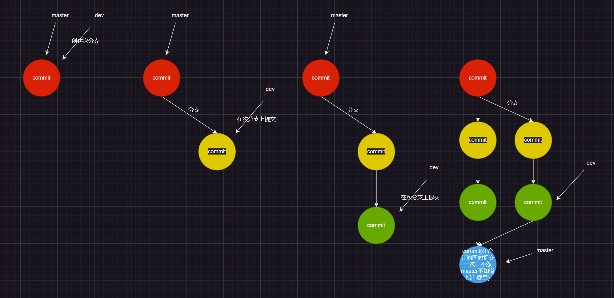
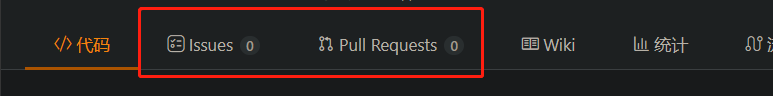

# 0.Git的下载

在这一节[`Git`下载帮助文档](https://git-scm.com/book/zh/v2/%E8%B5%B7%E6%AD%A5-%E5%AE%89%E8%A3%85-Git)里简单提及了不同平台下`Git`的下载。

> 注意：我们目前（在您还对`Git`一知半解的时候）不推荐使用任何图形化界面，这对您的学习作用不大，除非您已经熟练操作`Git命令`和`Git的相关概念`，这个时候才有使用图形化界面`Git`的意义。 

1.Git仓库获取
=========

1.1.本地获取
--------

打开`git bash`，通常对于`windows`来说，在桌面右击鼠标即可找到该功能选项（点进去就有一个“黑色框”出现，以后我们依靠这个命令框，输入和`Linux`类似的命令和`git`的专属命令）

想要`Git`管理本地的文件，只需要输入指令：

```bash
$ cd 某个目录 $ git init 
#进入某个目录后执行初始化命令
```

指令输入并且回车后`Git`将会创建一个`.git`子目录，该子目录包含`Git`仓库需要的必须文件，这些文件是`Git`仓库的骨干，有关`Git`所有的秘密基本都在这里面。

如果没有进行这个初始化，则没有办法在`bash`中对该目录使用`git`的其他命令（注意不可以把其他现有的`.git`直接复制到这个还未被`Git`跟踪的目录，这样做会使得`Git`仓库的状态出现问题）

> 补充1：如果不想要被Git进行版本控制，最简单的办法是将.git文件直接删除，当然在我们学过`git`后不建议这么做……
> 补充2：关于`.git`的内容可以简单了解一下，可以看看下面的示例：
> 
> ```bash
> $ ls -al
> total 329
> drwxr-xr-x 1 Limou 197121      0 Aug 17 21:58 ./
> drwxr-xr-x 1 Limou 197121      0 Aug 17 21:56 ../
> -rw-r--r-- 1 Limou 197121     47 Aug 17 21:58 COMMIT_EDITMSG
> -rw-r--r-- 1 Limou 197121    107 Jul 29 16:02 FETCH_HEAD
> -rw-r--r-- 1 Limou 197121     23 Jul 21 21:37 HEAD
> -rw-r--r-- 1 Limou 197121     41 Jul 29 16:02 ORIG_HEAD
> -rw-r--r-- 1 Limou 197121    373 Jul 27 11:24 config
> -rw-r--r-- 1 Limou 197121     73 Jul 21 21:37 description
> drwxr-xr-x 1 Limou 197121      0 Jul 21 21:37 hooks/
> -rw-r--r-- 1 Limou 197121 165766 Aug 17 21:58 index
> drwxr-xr-x 1 Limou 197121      0 Jul 21 21:37 info/
> drwxr-xr-x 1 Limou 197121      0 Jul 21 21:37 logs/
> drwxr-xr-x 1 Limou 197121      0 Aug 17 21:58 objects/
> -rw-r--r-- 1 Limou 197121    114 Jul 21 21:37 packed-refs
> drwxr-xr-x 1 Limou 197121      0 Jul 21 21:37 refs/
> ```

## 1.2.远程获取

比如在`Github`或者`Gitee`上克隆下来一个`Git`仓库（或者叫“项目”），执行以下指令：

```bash
$ git clone github该项目的传输协议[自定义文件名字]
```

如果你想在克隆远程仓库的时候，想要自定义本地仓库的名字，可以通过额外的参数指定新的目录名（若没有指定该参数，一般默认为该项目仓库在服务器上的名字）。

其中Git支持多种数据传输协议（我们可以先用`https`来学习，比较简单并且好理解）

1. 可使用`https://`协议

2. 可使用`git://`协议

3. 可使用`SSH`传输协议

# 2.Git仓库配置

`Git`用来配置的命令是`git config`。而`Git`的配置变量存储在三个不同的位置，它们的作用范围不同，分别是：系统级别、用户级别、仓库级别。

## 2.1.添加配置

### 2.1.1.系统级别

包含系统上每一个用户及他们仓库的通用配置。如果你在执行`git config`命令时带上了`--system`选项，`Git`就会在`/etc/gitconfig`中读写配置变量（`windows`应该在`C`盘下的管理员文件下）。而因为它是系统级别的配置文件，所以需要管理员或超级用户的权限才能修改它。

```bash
$ git config --system 变量="配置值"
```

### 2.1.2.用户级别

针对当前用户的配置文件（该配置文件位置在`~/.gitconfig`或`~/.config/git/config`），你可以传递`--global`选项让`Git`读写此文件，这样会对该用户在系统上所拥有的仓库生效（对于当前用户的工作目录来说，这个设置相当于全局设置）。

不过在初步使用`git`的过程中，最重要的配置是配置用户名字和邮箱地址（邮箱地址最好真实有效）

```bash
$ git config --global user.name "Your Name"
$ git config --global user.email "Your email"
```

> 可以通过`git config --global -l`来检查配置是否生效（这里配置完后就会增加`r.name=...`和`r.email=...`的字样）

### 2.1.3.仓库级别

针对当前仓库的配置文件（`.git/config`）。它只对当前用户拥有仓库有效。你可以传递`--local`选项让`Git`读写此文件（当然，你需要进入某个`Git`仓库中才能让该选项生效，并且生效于该仓库中）

```bash
$ git config --local 变量="配置值"
```

## 2.2.查看配置

在上面提到的`git config --global -l`实际上全写为：

```bash
$ git config --范围 --list/某个配置变量
```

> 补充：我们也可以直接打开不同范围级别对于的配置文件来查看。（理论上来说配置也可以直接在配置文件里面手动修改来达到配置的目的）。不过这些直接打开配置文件读写的操作我们目前并不推荐使用。

## 2.3.删除配置

```bash
$ git config --范围 某个配置变量 
```

# 3.Git仓库管理

## 3.1.提交文件

实际上`Git仓库`真正指的是`.git`目录，但是我们不能直接手动将文件手动写入`.git`，一旦误改，就会造成`Git仓库`失效。

因此只能将我们需要给`Git`管理的文件放在工作目录中（也就是`.git`的同级目录）。

然后使用`add`指令将文件从工作区转向版本库中的暂存区/索引（也就是`.git`目录）。

在版本库暂存区内部使用`commit`提交到分支（存储库）中。

`add`后，对工作目录的修改的内容（修改包括新增、修改、删除）会写入到对象库中，被其维护，每修改一次后维护就相当于一次版本的管理。而实际上`Git`追踪管理的是修改而不是文件。


为什么暂存区也叫“索引”呢？因为该区存储了修改对象的索引。

实际上，分支上存储的也不是对象，也是存储的是对象的索引。

还有一个指针`HEAD`指向分支，根据这个指针就可以拿到当前指向的分支。

> 补充：在`.git`目录下也可以找到`HEAD`、`objects`、`index`文件（最后一个文件需要进过`add`后才被创建出来）。

在实际使用中，上述的流程体现为：

```bash
$ git add [某文件]
$ git commit -m "推送信息记录" 
```

## 3.2.查看文件状态

使用`status`可以查看当前文件的状态。

## 3.3.查看提交历史

使用`log`指令可以查看`commit`历史。

```bash
$ git log 
# 可以加上参数“--pretty=oneline”试试，更加简洁明了
```

## 3.4.文件哈希值

文件被`commit`后就会根据文件内容计算出一串哈希值，前两位代表目录标识，后面所有数组串代表文件标识，`.git/objects`会根据目录标识整理文件的哈希值。

要想查看`git`对象（哈希值指向的内容），就要使用`git cat-file -p 哈希值`来查看。

## 3.5.显示暂存区和工作区差异

### 3.5.1.使用diff

`diff`是`Git`中一个重要的命令，用于比较文件或提交之间的差异。它可以帮助你了解文件内容的变化以及提交之间的变更情况。

以下是几个常见的使用方式：

1. 比较工作区和暂存区文件之间的差异：
   
   ```bash
   $ git diff [文件名]
   ```
   
   这将显示在工作区和暂存区之间所有已修改但尚未暂存的内容的差异。

2. 比较工作区和版本库文件之间的差异：
   
   ```bash
   $ git diff HEAD [文件名]
   ```
   
   这将显示在工作区和最新提交之间所有已修改但尚未提交的内容的差异。

3. 比较两个提交文件之间的差异：
   
   ```bash
   $ git diff [commit1] [commit2]
   ```
   
   用实际的提交哈希或分支名来替换`<commit1>`和`<commit2>`，这将显示两个提交之间的差异。

### 3.5.2.diff输出解读

这里给出一个使用`diff`的例子：

根据您提供的输出，可以看到在 `git diff` 命令的结果中，显示了代码文件 `test.c` 的变化。下面是 diff 输出的解释：

```bash
$ git diff
diff --git a/my_git_2023_8_19/test.c b/my_git_2023_8_19/test.c
index af2a3a6..38d9e38 100644
--- a/my_git_2023_8_19/test.c
+++ b/my_git_2023_8_19/test.c
@@ -1,5 +1,4 @@
 #include <stdio.h>
-#include <string.h>
 int main()
 {
        int i = 0;
```

其中：

- `a/my_git_2023_8_19/test.c` 表示原文件路径。
- `b/my_git_2023_8_19/test.c` 表示目标文件路径。
- `index af2a3a6..38d9e38 100644` 是文件索引信息。
- `--- a/my_git_2023_8_19/test.c` 表示原文件的起始位置。
- `+++ b/my_git_2023_8_19/test.c` 表示目标文件的起始位置。
- `@@ -1,5 +1,4 @@` 表示以下变更的范围，原文件从第 1 行开始，连续 5 行；目标文件从第 1 行开始，连续 4 行。

根据上述 diff 输出，可以看到在原文件中删除了 `#include <string.h>` 这一行，因此范围涵盖了第二行和第三行的变化。

在`git diff`的输出中，范围指示了变更的具体位置。范围的格式是`@@ -m,n +x,y @@`，其中 `m,n` 表示原文件中的范围，`x,y` 表示目标文件中的范围。

在输出中，范围是`@@ -1,5 +1,4 @@`，这里的`1,5`表示原文件中从第`1`行开始连续`5`行的范围，`1,4`表示目标文件中从第`1`行开始连续`4`行的范围。

为什么范围是`5`行而不是`2`行呢？这是因为`Git`使用上下文行来提供更多的变更上下文和可读性。当显示`diff`输出时，`Git`通常会包含上下文行（`context lines`），以便更好地理解变更的上下文，并在合并等操作中提供更好的决策。

## 3.6.版本回退

### 3.6.1.版本库回退指令

版本回退是`Git`最重要的功能，主要是执行`git reset`命令来回退版本，可以指定退回某一次提交的版本，而回退的本质是要将版本库中的内容进行回退，工作区和暂存区是否会退由命令参数来决定。

```bash
$ git reset [--soft/--mixed/--hard] [HEAD]
```

1. `--soft`参数只将`版本库`回退到某个指定版本，其他区域保持不变，即对于工作区和暂存区的内容都不变

2. `--mixed`参数（默认），该参数将`版本库`和`暂存区`的内容退回为指定提交版本内容，工作区文件保持不变（使用的时候可以省略这个参数）

3. `--hard`参数将`工作区`、`暂存区`、`版本库`都退回指定版本（工作区若还有未提交的代码时不要用这个命令，因为工作区会回滚，没有提交过的代码就再也找不回了，使用该参数需要谨慎，很难找回）

4. `HEAD`的使用有点类似绝对路径和相对路径的区别，这个参数可以直接写成某次`commit`的哈希值，表示回退到指定的版本。也可以使用`^`来回退，`HEAD`表示当前版本，`HEAD^`表示上一个版本，`HEAD^^`表示上上个版本……

### 3.6.2.撤回回退（后悔药的后悔药）

如果后悔了怎么办？如果您还拥有之前提交的`commit`对应的哈希值，继续使用上述命令也可以达到撤回的效果。那如果拿不到这个哈希值怎么办呢？

可以使用`git reflog`会记录本地的每一次提交命令。

> 补充：版本回退的操作是很快的，原因是版本回退使用类似指针挪动的操作，所以就会很快。

### 3.6.3.常见回退场景解法

#### 3.6.3.1.只在工作区回退

在进行`add`后，如果此时只有工作区内部修改了该文件，又觉得在工作区的修改不够满意，只想将工作区回退，此时有两个方式：

1. 拷贝原有文件后，手动删除文件

2. 使用`git checkout -- [文件名]`，回退到最近一次的`add`，也就是专门丢弃工作区修改的指令，该操作不可逆

3. 如果之前有`commit`过，还可以使用`git reset --hard`回退

#### 3.6.3.2.只在工作区和暂存区回退

在进行`add`后，突然发现在工作区和暂存区的同一份代码文本都不够满意，此时就必须回退两个区域。此时使用命令：

1. 使用`git reset --hard [HEAD]`

2. 使用`git reset --mixed [HEAD]`回到`6.3.1.`的情况

#### 3.6.3.3.三个区域都要回退

直接使用`git reset --hard HEAD`即可。

## 3.7.删除文件

1. 直接使用`rm`只是删除了工作目录中，因此还需要`add`和`commit`一遍，将暂存区和存储库里一起删除

2. 直接使用`git rm [文件名字]`，此时工作区和暂存区中也进行了删除，再加上一次`commit`将存储库中的也删除掉

# 4.Git分支管理

`Git`的分支也是最为强大的一部分。


每次`commit`最终都会形成一个提交时间线，默认叫做`master`主分支，由`master`指针维护。

`HEAD`指向当前的工作分支（切换工作分支后就切换指向为当前分支），默认指向`master`，而`master`指向该分支最新的一次`commit`提交。

在主分支上，有的时候需要开辟一个次分支，这样既能不影响主分支的重要开发，又可以在次分支上随意开发。等到该分支的代码内容足够稳定，就可以和主分支合并在一起。

## 4.1.分支创建

使用`git branch [分支名]`可以创建一个分支。此时在`./git/refs/heads`下除了`master`就会多一个分支的文件。次分支最开始指向的`commit`和主分支指向的`commit`是一样的。

## 4.2.分支查看

使用`git branch`就可以查看当前本地存在的分支，其中开头带有`*`的分支为当前的工作分支。

## 4.3.分支切换

使用`git checkout [分支名]`可以切换当前的工作分支，并且可以注意到`HEAD`指向的内容发生的改动，此时的`HEAD`指向当前切换的分支。

## 4.4.分支合并

首先先切换到想要被合并的分支上，然后使用`git merge [分支名]`，于是次分支就被合并到主分支上了，需要注意谁合并谁的问题，有可能造成结果不同。

> 补充：合并过程中，有可能会回显出`Fast-forward（快进模式）`的字样，这个模式就是指：合并分支是通过将`master`直接指向次要分支的最后一次`commit`，但是不是每次都可以使用这个模式的。只有类似下面这样的分支才可以使用快速模式进行合并，但是开头那样的分支就不适合使用快速模式。
> 
> 
> 
> 这种模式对于`Git`来说实际上是分辨不出到底是直接`commit`进主分支还是合并次分支进来的。

像开头那样的分支如果直接合并就有可能会产生`合并冲突`的问题。

因此我们可以指定分支为非快速模式，只要在合并的时候加上`--no-ff`选项即可。

如果是上图的分支，使用非快速模式合并还需要一次提交，因此完整的命令是`git merge --no-ff -m "commit内容" 分支名`。



如果是一开头的分支，如果我们直接使用合并，就会将分支下移（提交的是不同文件）：


如果是在不同分支里修改了相同的文件，就会发生冲突，这个时候两份文件就会直接合并在一起，需要我们手动修改并且重新`add`和`commit`一次。


## 4.5.分支删除

使用`git branch -d 分支名`即可，不过要删除某个分支，不可以切换到该分支上删除，需要切换到其他任意的分支才可以成功删除。

## 4.6.分支显示

使用`git log --graph --abbrev-commit`可以更加直观地在显示屏上显示出分支的状态。

> 补充：由于直接创建、合并、删除分支的速度很快，因此`Git`鼓励大家先使用分支完成某个任务，合并后再删除分支，这和直接在`master`上工作的效果一样，但是安全性和可维护性更好。

## 4.7.分支策略


`Git`的不同分支可能具有不同的功能，例如稳定推荐的`master`分支和多人协作开发的`div`分支。

## 4.8.分支bug

有的时候哪怕是稳定的`master`分支也会出现`bug`，这个时候不能直接修改`master`分支，否则有可能从小`bug`变成大`bug`。

因此我们需要通过分支合并，来进行`bug`修改。

1. 首先创建`dev`分支，修改好`master`分支里的`bug`

2. `bug`分支合并了`master`分支，解决了`dev`分支和`master`分支冲突的问题，`dev`分支内也包含了`bug`的解决方案

3. 测试完`dev`分支确保没有新的`bug`后，再将`dev`分支合并给`master`分支

4. 最好删除掉`dev`分支

## 4.8.分支强删

如果一个分支还未被合并过，是没有办法删除的，这种情况下只能使用强制删除，也就是命令`git branch -D`来强行删除。

# 5.Git远程仓库

## 5.0.理解分布式版本控制系统

我们上面所学的命令都只是再本地进行工作，也就是说每一个电脑都是一份版本库，因此我们工作的时候就不需要连接网络。

但是`Git`可是多人协作的工具，工作文件不能仅仅在每一个个人电脑上。

但是如何在个人和个人直接传递文件来协调呢？

1. 因此就出现了`中央服务器`，该`中央服务器`保持开机。

2. 其他人依靠`push`命令来和推送到`中央服务器`，而每一个个人都可以`clone`在`中央服务器`库中的文件。

3. 这样就实现了个人和个人直接的协调工作。

而我们可以把中央服务器的仓库称为`远程仓库`，一是可以自己搭建`中央服务器`、二是使用`github`或者`gitee`。

上面的过程实际上就是`分布式版本控制`的过程。

## 5.1.远程仓库创建

利用`gitee`和`github`可以创建远程仓库，创建过程比较简单，一般来说一个仓库代表一个项目系统。一般来说会自动创建一个`README.md`，这是项目的说明书。

在`.git`下还可能有`ISSUE_TEMPLATE.md`文件、`PULL_REQUEST_TEMPLATE.md`文件。

这就需要解释这两个模板文件了，实际上就对于下面其中两个选项卡。



1. `issues`是有问题的人与开发者沟通的文件集合，这里可以处理使用者发现的问题，进而修改`bug`

2. `pull request`则是合并分支的申请集合，这里可以请求开发者合并某些分支，也就是所谓的”提交`PR`“

> 补充1：`.md`后缀代表基于`Markdown`语法的文件。
> 
> 补充2：远程仓库是拥有权限成员的，例如：报告者、观察者、开发者、管理者

## 5.2.远程仓库克隆

### 5.2.1.http协议

远程仓库始终还是需要克隆到本地来开发的，因此就需要`clone`指令，完整指令为`git clone https等协议 目标文件`，即可完成克隆，但是不能在其他本地仓库目录下进行克隆。

此时克隆下来的本地仓库和远程仓库内容是完全一样的，以后我们就可以在本地机器上对项目进行修改而不影响远程仓库。

### 5.2.2.SSH协议

远程仓库除了使用`http`协议还可以使用`SSH`，配合公钥来`clone`。我们需要在远程仓库里配置公钥`SSH key`。

1. 先在用户主目录下查看有无`.ssh`目录，如果有就查看下面的`id_rsa(私钥)`和`id_rsa.pub(公钥)`文件，如果已经有了就跳过这一步，如果没有就需要创建`SSH key`

2. 使用`ssh-keygen -t rsa -C "你的邮箱号（必须和gitee或者github上的一致）"`然后一路回车即可，暂时不需要填写其他东西

3. 然后使用`cd .ssh/`就可以看到步骤`1`说的两个文件，我们就得到了私钥和公钥，复制公钥的内容（一个字符都不要漏）到`gitee`或者`github`的`SSH公钥`选项卡中，并且可以设计公钥的名称，然后输入当前账户的密码即可

4. 如果设置了`SSH`协作，那么就需要分配公钥，仓库允许多个公钥的存在

5. 回到本地机器上使用`SSH`协议克隆

> 补充：注意公钥和私钥可以通过上述命令生成，如果将公钥配置到远端仓库中后，只有拥有私钥的本地机器才可以进行`push`推送。

## 5.3.远程仓库推拉

在使用`clone`后，远程仓库和本地仓库就有了联系，这个时候就可以直接使用`push`（如果有权限）。

我们修改好自己的本地文件后就需要使用`git push 远程仓库名(默认origin) 本地分支:远程分支(如果相同只写一个也可以)`命令来推送代码到远端仓库（可以使用`git remote -v`查看当前`git`工作目录下的远程仓库名字列表，并且后面跟着权限，比如：`push`权限）。

另外，如果在我们推送之前就有别的开发者推送了文件，这个时候本地仓库和远程仓库是不同步的，因此我们需要使用命令`git pull 远程仓库名(默认origin) 本地分支:远程分支`拉取更新我们的本地仓库才能继续推送。

# 6.Git忽略文件

在日常开发中，有些文件不应该被推送上来（例如保存了数据库密码的配置文件），但是一个一个甄别又十分低效，因此就有了忽略文件的存在。

忽略文件的名字为`.gitignore`，内部写入一些特殊的代码，可以达到屏蔽某些文件的目的，内容可以自己自定义，也可以使用一些已有的模板。

在内部写入：

1. 直接写文件名

2. 使用通配符`*`

3. `!`文件名或通配符（反向屏蔽）

可以屏蔽对应的文件，不过也可以使用`-f`选项强制`add`，不过一般不建议。

另外还可以使用`git check-ignore -v 文件名`来查看该文件为什么被屏蔽的原因（也就是显示出在`.gitignore`中的相关语法行）

# 7.Git配置别名

可以使用一些配置简化命令`git config 范围(例如：--global) alisa.别名 原有命令`，不过配置别名对于新手来说暂时不建议使用。

# 8.Git标签管理

`Git`的标签有里程碑的感觉，实际上就是对某次重要的`commit`的一个标识（别名）例如：版本号。相对于记住难记的`SHA-1`值，使用标签来寻找`commit`是更好的选择。

1. 切换到需要打标签`commit`的分支上

2. 打上标签`git tag [标签名] [某次SHA-1值(如果该选项没写就默认给当前的commit打上标签)]`

3. 查看标签`git tag`或者`tree .git`的`refs/tags`中查看，内部保存的是`SHA-1`值，注意是根据标签字母排序的，而不是时间排序

4. 如果希望给创建标签添加更加详细的描述，可以使用`git tag -a [标签名] -m "标签详细信息" [SHA-1值]`。并且可以使用`git show [标签名]`来查看详细信息

5. 删除标签就是`git tag -d [标签名]`，不过需要注意再次使用`git push [远程仓库名] :[标签名字]`

本地`tag`也是可以推送到远程仓库里的，使用命令`git push origin [标签名]`单独推送，或者使用`git push origin --tags`把所有本地标签全部推送到远程仓库中。
