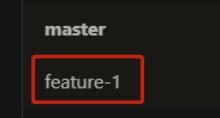
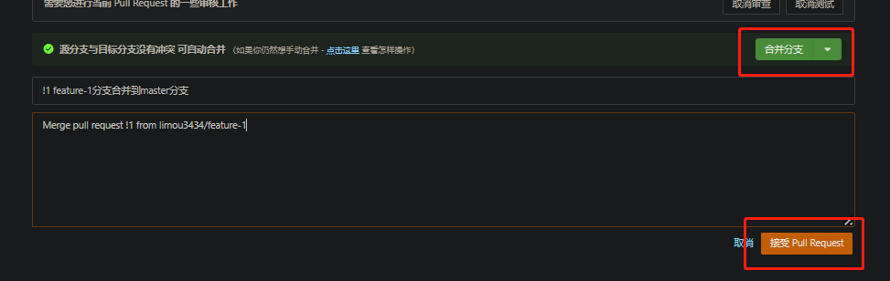
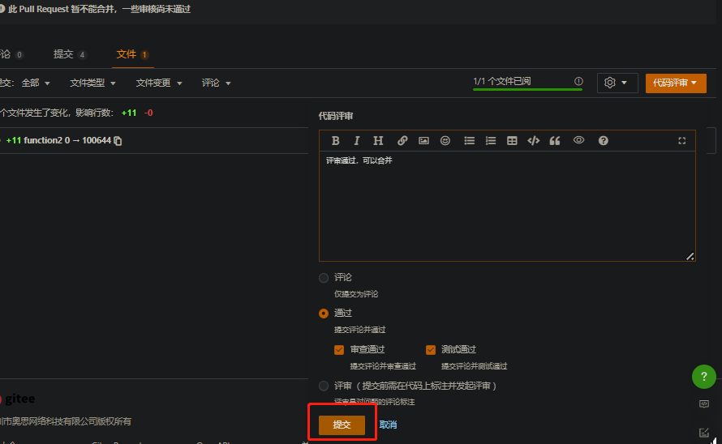
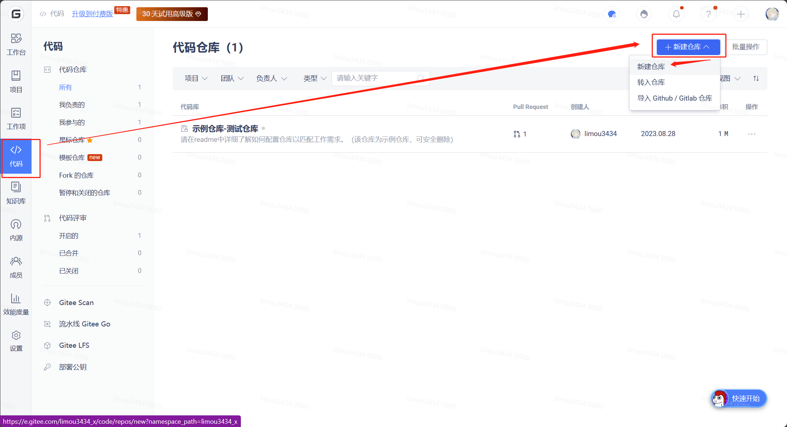
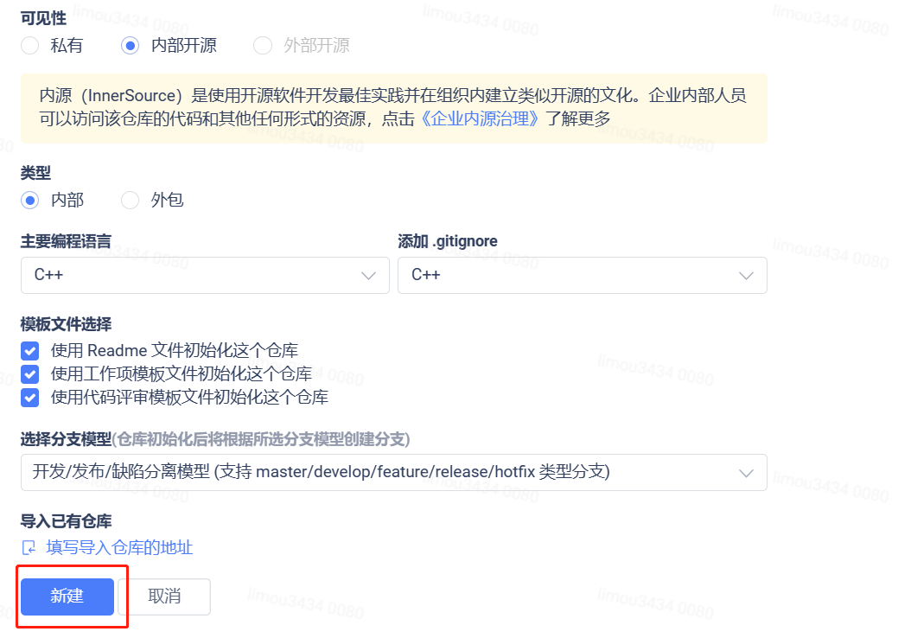
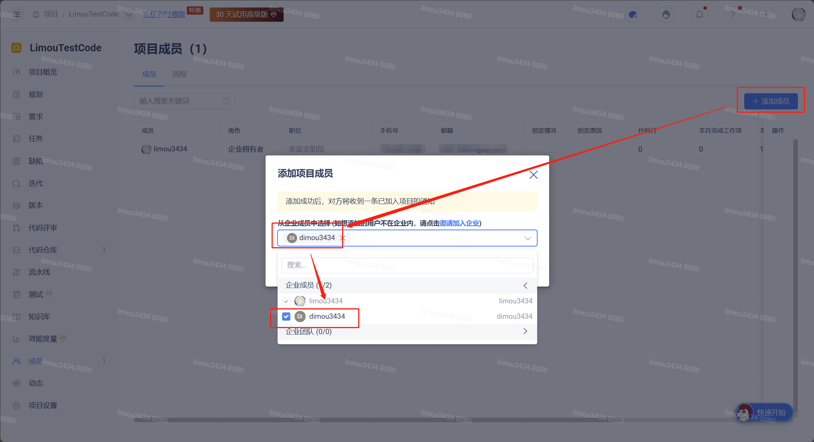
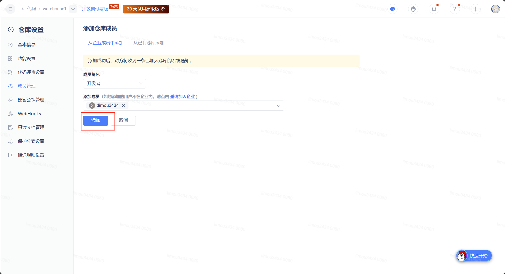
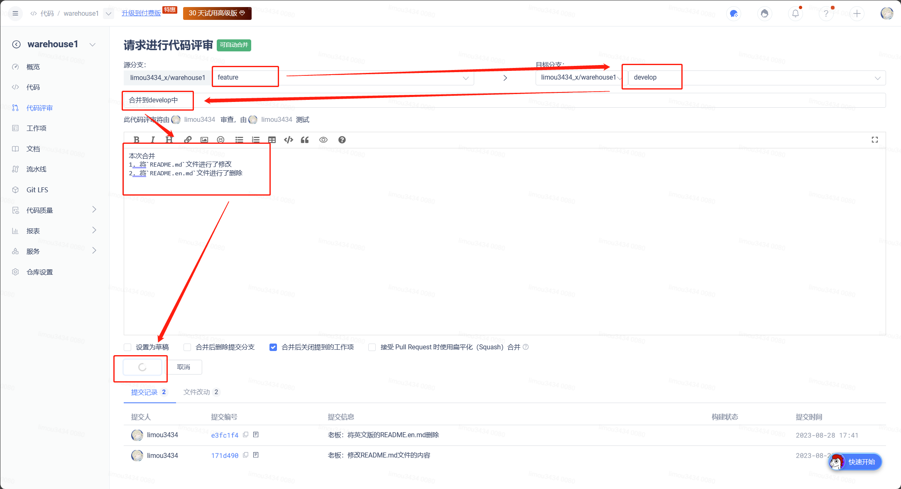
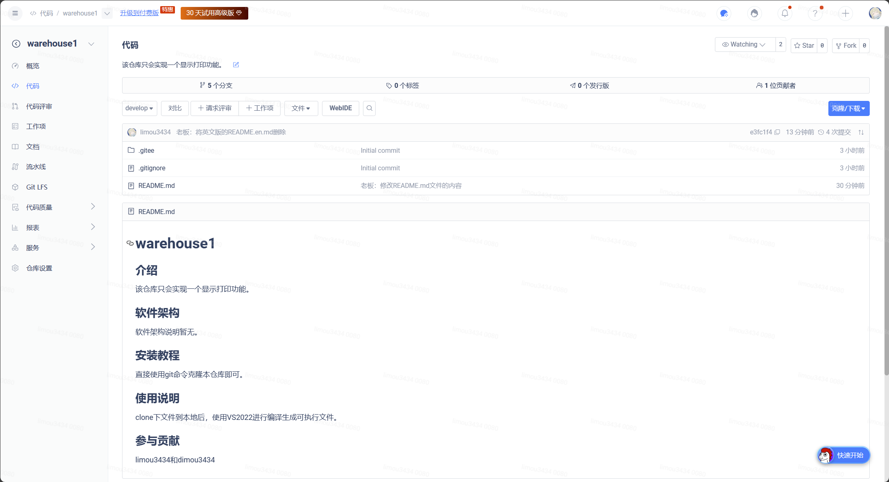
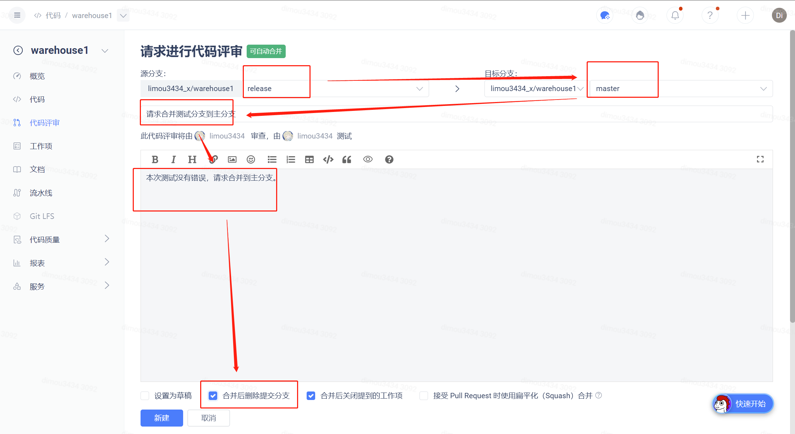

# 1.多人协作一（共享分支）

> 1. 目标：`master`分支下`file.txt`文件新增`text_1`、`text_2`文本。
>
> 2. 实现：由开发者`1`增加`text_1`，由开发者`2`增加`text_2`。这里我们可以使用两台电脑，或者使用云服务器来真实模拟两名开发者。
>
> 3. 条件：在一个分支下完成。


## 1.1.创建远端仓库

创建一个远端仓库，该仓库默认有主分支`master`。并且仓库内有文件`test_code`，内容如下：

```tex
I am a code.
```

## 1.2.创建远端分支

首先在自己的项目仓库中创建一个基于`master`远端分支的`debug`远端分支。

现在远端仓库有两个分支，一个为`master`远端分支，另外一个为`debug`远端分支。

此时对于还没有拉取的两个开发者来说，都各有一个`master`本地分支和一个`origin/master`远端分支（`git branch`是查看本地分支，而`git branch -r`是查看远端分支）。

```bash
$ git branch -r
  origin/HEAD -> origin/master
  origin/master
```

而我们所有的操作基本都是在本地操作的，此时两名开发者都需要使用`git pull`拉取远程的仓库。

此时再次运行就可以显示远端仓库的远端分支，但是我们可以注意到并没有增加本地分支。

```bash
$ git branch -r
  origin/HEAD -> origin/master
  origin/debug
  origin/master

$ git branch
* master
```

## 1.3.开发者1操作

此时肯定是不可能在本地直接切换到远端分支的，因此就需要自己创建一个`debug`分支，使用命令`git checkout -b debug origin/debug`。

此时本地就有`debug`本地分支了，并且也切换过去了。

```bash
$ git checkout -b debug origin/debug
Switched to a new branch 'debug'
branch 'debug' set up to track 'origin/debug'.
```

这实际上就是在创建分支的同时将本地分支和远端分支建立联系/关联，可以使用`git branch -vv`来查看是否有联系/关联。

```bash
$ git branch -vv
* debug  SHA-1值 [origin/debug] commit内容1
  master SHA-1值 [origin/master] commit内容2
```

> 补充：建立联系/关联的意义是可以直接使用短命令`git push`和`git pull`，而不是完整的长命令。

此时已经处于`debug`分支上，然后使用`vim`修改。


```bash
$ git branch
  debug
  master
$ vim test_code
$ git add --all
$ git commit -m "日志：我是开发者1，我来提交代码"
```

然后再进行`push`操作（由于有关联，因此可以直接使用）

回去查看远程仓库的内容，可以发现`debug`远端分支内已经发生了修改，并且领先`master`远端分支。


## 1.4.开发者2操作

也同样需要建立联系/关联，但是这里我们演示不使用联系/关联的情况。

首先直接创建本地分支：

```bash
$ git checkout -b debug
Switched to a new branch 'debug'
```

此时就没办法直接使用短命令`pull`：

```bash
$ git pull
There is no tracking information for the current branch.
Please specify which branch you want to merge with.
See git-pull(1) for details.

    git pull <remote> <branch>

If you wish to set tracking information for this branch you can do so with:

    git branch --set-upstream-to=origin/<branch> debug
```

可以按照提示来链接本地分支和远端分支：

```bash
$ git branch --set-upstream-to=origin/<branch> debug debug

$ git branch --set-upstream-to=origin/debug debug
branch 'debug' set up to track 'origin/debug'.
```

然后不要急着使用`pull`，我们打开`test_code`写入以下内容：

```tex
I am a code.
test_2
```

然后照旧使用`git add`和`git commit -m "日志：我是开发者2，我也来提交代码"`

再使用`git push`，这个时候发现`Git`拒绝了该请求，这是因为发生了分支冲突。

因此必须使用`pull`拉取，手动解决冲突，然后再进行`add`和`commit`和`push`。


`debug`的最后一次提交就已经是我们所要的完整代码了。


## 1.5.合并到master

此时`debug`远端分支已经准备完毕，但是`master`远端分支还没有修改成功。

此时有两种做法：

### 1.5.1.做法一

一种是直接在本地合并然后`push`到远端仓库。

1. 首先是将`master`分支合并到`debug`分支，避免`debug`分支和`master`分支发生冲突（因为还有其他分支的存在）

2. 切换到`master`，通过`pull`保持最新，然后在本地的`debug`上解决冲突

3. 将`debug`分支合并到`master`分支，此时`master`就有了修改

4. 然后进行`push`即可

5. 此时远端和本地`debug`分支就没有用了，可以在远端仓库中删除和在本地仓库使用`git branch -d debug`

6. 最后两名开发者同时使用`pull`命令

### 1.5.2.做法二

另外一种方法就是在`gitee`提交`PR`合并申请单，由管理员来做审核后来`merge`（可以直接在远端仓库上操作，这种方式更加安全）。


# 2.多人协作二（私有分支）

> 目标：远程`master`分支下新增`function1`和`function2`文件。
>
> 1. 实现：由开发者`1`新增`function1`文件，由开发者`2`新增`function2`文件。
>
> 2. 条件：在不同分支下协作完成（每个开发者有自己的分支，或者一个分支一个功能）。

首先要明白有两种方法：

1. 创建远端分支（正式工作时推荐，可以保证一定是基于远端`master`上最新的代码）

2. 创建本地分支然后`push`（基于本地`master`分支不一定是最新的代码）

但是我们在本次演示中使用第二种方法。

## 2.1.开发者1

1. `pull`后创建基于`master`本地分支的`feature-1`本地分支，此时就没有办法使用链接了，因为我们没有在远端仓库创建远端分支，没有办法链接，因此我们现在的状态是没有办法使用短命令的。

2. 然后创建一个`function1`文件，内部写入内容

3. 然后使用`add`和`commit`命令

4. 由于没有链接（也无法链接，远端仓库没有远端分支），所以要使用长命令，`git push origin feature-1`直接将本地分支推送到远端仓库，可以给远端仓库创建远端分支。

```bash
//开发者1
$ git pull

$ git checkout -b feature-1
Switched to a new branch 'feature-1'
$ git branch
* feature-1
  master

$ vim function1

$ git add --all
$ git commit -m "日志：开发者1的function1文件"
$ git push origin feature-1
```

此时就可以看到远端仓库多了一个远端分支。



## 2.2.开发者2

1. 此时开发者`2`也进行一样的工作，但是此时`master`本地分支不是最新的，因此就需要在`master`本地分支上`pull`。

2. 剩下的工作就和开发者`1`是一样的

```bash
//开发者2
$ git branch
* master
$ git branch -r
  origin/HEAD -> origin/master
  origin/master

$ git pull

$ git branch
* master
$ git branch -r
  origin/HEAD -> origin/master
  origin/feature-1
  origin/master

$ git checkout -b feature-2 
Switched to a new branch 'feature-2'

$ vim function2

$ git add --all
$ git commit -m "日志：开发者2的function2文件" 
$ git push origin feature-2
```

此时就可以看到远端仓库又多了一个远端分支。


## 2.3.合并到master

假设这个时候有一种情况，开发者`2`发生意外情况，没有办法现在合并到`master`远端分支。

1. 此时开发者`1`使用`git pull`把开发者`2`创建的远端分支`feature-2`拉取过来（这里之所以可以直接使用短命令，是因为：a.拉取分支内的内容才需要的建立链接 b.但是拉取远端仓库内容的时候就不需要建立链接）

2. 开发者`1`新使用命令`git checkout -b feature-2 origin/feature-2`创建、链接并且切换到一个`feature-2`的本地分支。

3. 这个时候开发者`1`就拥有了开发者`2`的文件，可以继续帮开发者`2`继续开发（比如加入某些代码或删除，然后再`add`和`commit`，并且直接使用短命令`push`即可）

4. 如果后续开发者`2`回来了，就需要再一次将`feature-2`和`origin/feature-2`进行链接，然后`pull`将开发者`1`帮忙的部分从远端分支拉取

```bash
//开发者1
$ git pull
$ git branch -a

* feature-1
  master
  remotes/origin/HEAD -> origin/master
  remotes/origin/feature-1
  remotes/origin/feature-2
  remotes/origin/master

$ git checkout -b feature-2 origin/feature-2
Branch feature-2 set up to track remote branch feature-2 from origin.
Switched to a new branch 'feature-2'
$ git branch -a
  feature-1

* feature-2
  master
  remotes/origin/HEAD -> origin/master
  remotes/origin/feature-1
  remotes/origin/feature-2
  remotes/origin/master

$ git vim function2

$ git add --all
$ git commit -m "日志：开发者1帮助开发者2的开发"
$ git push
```

此时远端仓库就有了推送


```bash
$ git branch --set-upstream-to=origin/feature-2 feature-2
$ git pull
```

此时开发者`2`就可以看到开发者`1`半自己开发的部分了。

5. 开发者`2`还可以继续进行自己的开发，照常使用`add`和`commit`和短命令`push`即可


6. 现在在远端仓库中，有两个新增加的分支，并且两名开发者都准备好各自的私有分支内的代码文件，最后只需要提交`PR`给管理者，管理员再远程仓库上做代码审核和冲突修改和分支合并即可


7. 此时由审查员和测试员通过审查和测试才可以正式合并进`master`，此时就完成了合并





8. 此时对于开发者`2`来说，理论上也是可以像开发者`1`一样操作的，但是有可能发生冲突，因此最好是在本地将远端分支最新的`master`合并进来，防止冲突在`master`上解决，然后使用长命令`push`（分支合并会自动`commit`），再提交`PR`上去。

```bash。
$ git checkout master

$ git pull
$ git branch
  debug
  feature-2
* master

$ git checkout feature-2

$ git merge master
//然后解决冲突

$ git push origin feature-2
```





# 3.远程分支删除后...

前面开发者`1`和开发者`2`开发完后，假设开发者`2`因为请假次数太多被辞了（悲痛\~），这个时候管理者也把他的远端工作分支删除了，但是这个时候我们会发现一个问题：在本地使用`git branch -a/-r`依旧可以看到这个远端分支。


```bash
$ git branch -a
  feature-1
  feature-2
* master
  remotes/origin/HEAD -> origin/master
  remotes/origin/feature-1
  remotes/origin/feature-2
  remotes/origin/master
```

那么这么办呢？可以使用`git remote show origin`，该命令用于显示远程仓库 `origin` 的详细信息，包括该远程仓库与本地仓库的分支关联、最新提交等。

```bash
$ git remote show origin
* remote origin
  Fetch URL: https://gitee.com/limou3434/limou-c-test-code.git
  Push  URL: https://gitee.com/limou3434/limou-c-test-code.git
  HEAD branch: master
  Remote branches:
    feature-1                     tracked
    master                        tracked
    refs/remotes/origin/feature-2 stale (use 'git remote prune' to remove)
  Local branches configured for 'git pull':
    feature-2 merges with remote feature-2
    master    merges with remote master
  Local refs configured for 'git push':
    feature-1 pushes to feature-1 (up to date)
    master    pushes to master    (up to date)
```

这里就有提示使用`git remote prune [远端仓库名]`去移除旧分支，即可裁剪掉显示在本地机器的旧的远端分支。

# 4.企业模型协作（真实模拟）

## 4.1.协作模式


在传统的`IT`组织下，开发团队（`Dev`）和运维团队（`Ops`）之间的诉求会矛盾：

1. 开发团队追求变化（尤其是追求敏捷编程思想的），可能需要持续交付作为目标

2. 运维团队追求稳定，可能强调稳定且变更控制

这就会导致一道无形的”墙“被堆积起来，不利于`IT`价值的最大化，为了解决这一鸿沟，就需要在企业文化、开发工具、和代码实践等方面做变革——`DevOps(重视“软件开发人员”和“运维技术人员”之间沟通的文化、运动、惯例)`出现了。通过自动化的“软件交付”和“架构变更”的流程，来使得构造、测试、发布软件可以快捷、频繁、可靠。

在`DevOps`开发过程中包含`计划、编码、构建、测试、预发布、发布、运维、监控`。

而做到`DevOps`就极其需要类似`Git`这样可以快速迭代版本和维护不同版本的。

## 4.2.开发环境

对于开发人员来说有几个常用的环境需要了解：

1. 开发环境：是程序员专门用于日常开发的服务器，为了开发调试方便，一般打开全部错误报告和测试工具，是最基础的环境。

2. 测试环境：一个程序在测试工作不正常，那么就不可以发布到生产机上。该环境是开发环境到生产环境的过度环境。

3. 预发布环境：该环境是为避免因测试环境和线上环境的差异带来的缺陷而设立的环境。其配置等基本和生产环境一致，目的就是让正式开发的时候更有把握。所以预发布环境是你的产品质量的最后一道防线，下一步项目就要上线了。要注意预发布环境的服务器不再线上集成服务器的范围之内，是单独的一些机器。

4. 生产环境：是指正式提供对外服务的线上环境，在`PC`端和手机端能访问到的`APP`基本都是生产环境。

5. 灰度环境：有的大公司还存在灰度环境或者叫仿真环境。

6. 其他环境：...

## 4.3.分支规范

环境有了概念之后，`Git`分支就会根据不同的环境进行规范设计。

一般来说：


> 注意：以上只是常用的`Git Flow`模型，真实环境由企业而定。

### 4.3.1.master分支

1. 给分支为只读分支，并且只有一个，用于部署到正式发布环境，由合并`release`分支得到

2. 主分支作为稳定的唯一代码，任何情况下不允许直接在`master`上修改代码

3. 产品功能全部实现后，最终在`master`分支对外发布，另外所有在`master`的推送都应该打上`tag`记录，方便追朔（也就是发布一次就要打上标签）

4. `master`分支不可删除

### 4.3.2.develop分支

1. `develop`分支作为开发分支，是基于`master`分支创建的只读唯一分支，始终保持最新完成的`bug`修复后的代码，可部署到开发环境对应集群

2. 可根据需求大小程度确定是由`feature`分支合并，还是直接在上面开发（后者不太推荐）

### 4.3.3.feature分支

1. `feature`分支通常都作为新功能和新特性开发分支，是以`develop`分支为基础创建的

2. 命名一般以`feature/`开头，建议的命名规范为：`feature/user_createtime_feature`

3. 新功能开发完成后，开发者需要将`feature`分支合并到`develop`分支

4. 一旦新需求发布上线后，便要将该分支删除

### 4.3.4.release分支

1. `release`分支为预发布分支，基于本次上线所有的`feature`分支合并到`develop`分支后，再基于`develop`分支创建，可以部署到测试或预发布集群

2. 命名也有规范，一般`release/`开头，建议命名规则为：`release/version_publishtime`

3. `release`分支主要用于提交给测试人员进行功能测试。发布提测阶段，会以`release`分支为基准进行提测

4. `release`分支测试出问题，则需要回归`develop`分支查看是否存在此问题

5. `release`分支属于临时分支，产品上线后可以选择删除

### 4.3.5.hotfix分支

1. `hotfix`分支是线上出现紧急`bug`问题时，提交补丁时使用，又叫”补丁分支“，需要基于`master`分支创建`hotfix`分支

2. 命名`hotfix/`开头，建议命名规范为：`hotfix/user_createtime_hotfix`

3. 当问题修复完成后，需要合并到`develop`分支并推送到远程。一旦修复测试通过，就通过`develop`远端合并到`master`远端分支，并且结束后需要将其删除

还有一些其他的大企业有不同的模型。

## 4.4.管理实战

### 4.4.1.创建账号

创建两个`Gitee`账号，一个为公司老板账号`limou3434`，一个为员工账号`Dimou3434`（绑定不同的邮箱）。

并且最好准备两个浏览器，一个登录老板账号，一登录员工账号。

最好准备一个本地机器和服务器（模拟老板和员工各自的本地环境，有其他方案替代也可以......）

### 4.4.2.创建企业空间

首先我们需要创建一个企业空间，并且创建好空间内的仓库。


一个企业会有多个项目，在一个项目中需要多个仓库，这里我们可以先建立一个仓库。







发送员工邀请链接，让一名员工进来企业空间。


另外一名员工在登录自己`gitee`账号后，需要打开该链接填写姓名后加入。


同意员工加入。


项目和仓库也需要设置成员，这样相关的成员才可以使用该仓库的部分权限。







### 4.4.3.分支管理

此时我们设置的库有默认有`5`个分支，然后拉取到本地，创建`featrue`本地分支后，在上面进行开发，然后关联远端分支`featrue`进行提交。

老板在自己的企业空间上，检查提交，检查完成后，在远端仓库，把远端分支`featrue`的提交合并到远端分支`develop`上，老板为了规范，也”装模做样“的做了一次代码审核。




好了，老板自己审核好自己的代码后，进行了合并。




此时测试人员（假设是员工`1`）需要测试老板的代码，那么就需要得到本地的`release`，因此他需要先请求远端分支`release`是基于远端分支`develop`分裂出来的，因此提交了代码评审。


此时如果测试人员测试通过了老板的代码，那么就可以请求把`release`远端分支的代码和合并到`master`远端分支上的，员工使用`PR`告知老板，然后老板直接通过了该审查。




并且测试分支也被删除了。


当然，如果`release`远端分支出现了问题，就需要回去检查`develop`远端分支是否存在这个问题，如果有问题，就从`feature`远端分支上进行`debug`然后合并到`develop`远端分支，然后将新的`develop`分支合并到`release`远端分支，在进行测试，知道没有`bug`。

剩下的几个分支和相关流程实际上和我们之前讲的大差不差，您可以自己试一试......

> 注意：最后再强调一遍，只有适合自己团队的分支模型，而没有最完美的分支模型。

## 4.5.代码部署

这个可以在`流水线`里研究（不过在`gitee`上是需要付费的），相关的操作请查看`gitee`的[文档](https://help.gitee.com/repository)。
