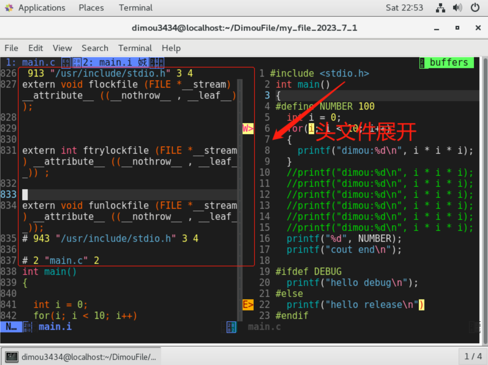
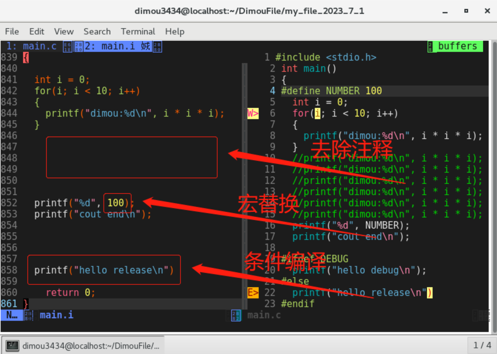
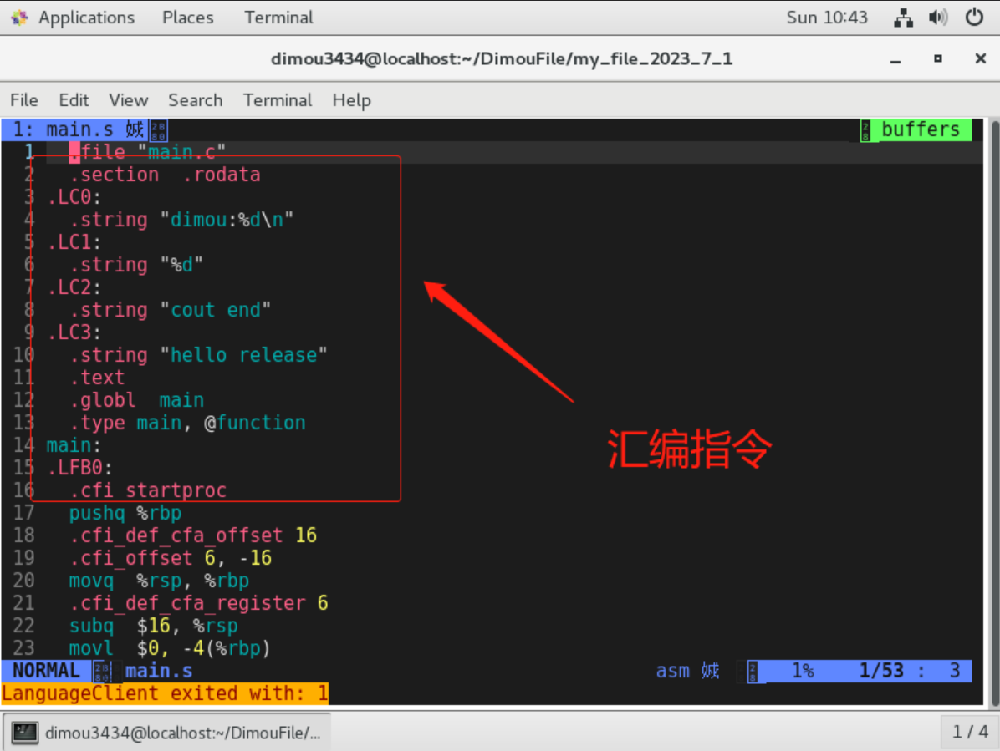
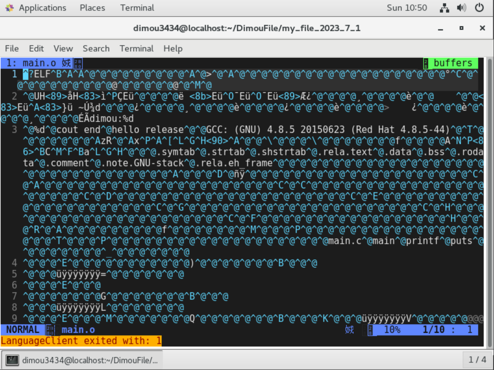
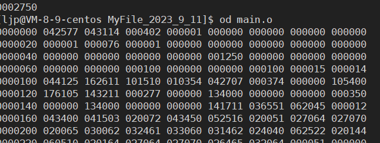
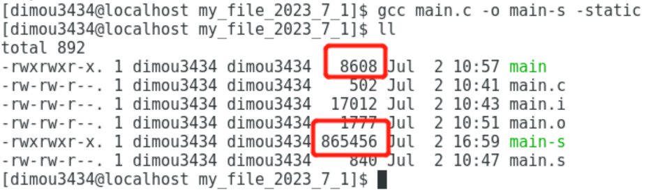

1.gcc/g++基础使用
=====================

`gcc`是专门用来编译`C`语言的编译器，而`g++`是编译`C++`的编译器（也可以编译`C`语言，毕竟`C++`语言兼容`C`）。

1. 下载安装：`gcc`的安装指令`sudo yum install gcc`（在`Linux`里大部分情况都是默认安装的，注意不同x系统环境的安装命令可能不一样），`g++`安装指令`sudo yum install -y gcc-c++`

2. 编译代码：`gcc/g++ 源文件名-o 预生成可执行文件名`即可编译生成二进制的可执行文件（如果没有给可执行文件命名和`-o`选项，则默认生成名字为`a.out`的可执行文件。其中`-o`选项是给生成的文件重命名的意思）

3. 运行代码：在生成的可执行文件中（默认生成`a.out`）使用`./可执行文件名`指令即可运行可执行程序

```bash
$ vim test.c
$ cat test.c
#include <stdio.h>
int main()
{
    int i = 0;
    printf("i=%d\n", i);
    return 0;
}

$ gcc test.c
$ ll
total 16
-rwxrwxr-x 1 limou limou 8360 Sep  9 09:09 a.out
-rw-rw-r-- 1 limou limou   88 Sep  9 09:09 test.c

$ ./a.out
i=0
```

# 2.gcc/g++的编译细化指令

程序翻译的过程如下：

1.预处理：`a.去注释 b.宏替换 c.头文件展开 d.条件编译`...

2.编译：`C`语言->汇编语言

3.汇编：汇编语言->可重定向二进制目标文件

4.链接：将多个`.o/.obj`文件合并->可执行文件`/.exe`

`gcc`和`g++`也是遵循上述的顺序的。对应每个过程，使用gcc会更加清晰明了。

> 注意：有些语言是解释型的，不需要遵循上述规律（比如`Java`、`php`、`python`），但是对于每个`C/C++`程序员都应该熟练掌握上述的流程。

> 补充：C语言由源代码生成的各阶段可以继续详细：C源代码-预处理-编译程序-优化程序-汇编程序-链接程序-生成可执行文件。

## 2.1.预处理|生成预处理文件

```bash
$ gcc -E 源文件名 -o 预处理文件名（.i后缀文件）
```

这个指令就是把源文件转化成预处理后的文件。

```bash
$ ll
total 16
-rwxrwxr-x 1 limou limou 8360 Sep 11 13:15 a.out
-rw-rw-r-- 1 limou limou   88 Sep 11 13:15 main.c

$ gcc -E test.c -o test.i
$ ll
total 36
-rwxrwxr-x 1 limou limou  8360 Sep 11 13:15 a.out
-rw-rw-r-- 1 limou limou    88 Sep 11 13:15 main.c
-rw-rw-r-- 1 limou limou 16886 Sep 11 13:19 main.i
```

利用`Vim`的`vs`命令同时打开两个文件我们可以发现，`main.i`文件对比`main.c`文件可以发现：注释被去掉、宏被替换、展开头文件的内容、进行了条件编译（裁剪代码）。





## 2.2.编译|生成汇编文件

```bash
$ gcc -S 预处理文件名 -o 汇编文件名（.s后缀文件）
```

这个指令把预处理后的文件转化为汇编文件。

```bash
$ gcc -S main.i -o main.s
$ ll
total 40
-rwxrwxr-x 1 limou limou  8360 Sep 11 13:15 a.out
-rw-rw-r-- 1 limou limou    88 Sep 11 13:15 main.c
-rw-rw-r-- 1 limou limou 16886 Sep 11 13:19 main.i
-rw-rw-r-- 1 limou limou   528 Sep 11 13:25 main.s
```



## 2.3.汇编|生成可重定位目标文件

```bash
$ gcc -c 汇编文件名 -o 可重定位目标文件名（.o后缀文件）
```

可重定向目标文件里面已经变成了二进制。

```bash
$ gcc -c main.s -o main.o
$ ll
total 44
-rwxrwxr-x 1 limou limou 8360 Sep 11 13:15 a.out
-rw-rw-r-- 1 limou limou 88 Sep 11 13:15 main.c
-rw-rw-r-- 1 limou limou 16886 Sep 11 13:19 main.i
-rw-rw-r-- 1 limou limou 1512 Sep 11 13:27 main.o
-rw-rw-r-- 1 limou limou 528 Sep 11 13:25 main.s
```



上述代码已经变成了二进制，我们可以利用`od`指令来查看文件的内容。



这个时候还不能完全运行这个文件，还需要经过链接，把库函数的文件链接过来。

## 2.4.链接|生成可执行文件

```bash
$ gcc 可重定位目标文件名 -o 可执行文件名
```

经过链接后的代码可以直接运行。

```bash
$ ll
total 44
-rwxrwxr-x 1 limou limou 8360 Sep 11 13:15 a.out
-rw-rw-r-- 1 limou limou 88 Sep 11 13:15 main.c
-rw-rw-r-- 1 limou limou 16886 Sep 11 13:19 main.i
-rw-rw-r-- 1 limou limou 1512 Sep 11 13:27 main.o
-rw-rw-r-- 1 limou limou 528 Sep 11 13:25 main.s
$ gcc main.s -o a.out
$ ./a.out
i=0
```

> 注意：上述补充的几乎都是`C`语言的`gcc`使用，实际上`C++`也是类似的命令，不过需要注意的是，在`Linux`下更加喜欢使用`.cc`后缀的`C++`文件。

# 3.gcc/g++和动、静态库

在我们写的程序当中，我们明明没有写`printf()`的实现，包含头文件也只有`<stdio.h>`，也就是只有`printf()`的声明。那么程序是在哪里找到该函数的定义呢？

在`user`下的`include`目录下有很多的库函数头文件，但是这些都是头文件，正常情况下`C`语言是需要把库函数头文件的具体实现（也就是源代码）给出来的，但是`C`语言采取了库的方式来给出。

其实这些库函数实现都在名为`libc.so.6`的库文件中去了，在没有特别指定时，`gcc`会到系统默认的搜索路径`/usr/lib`下进行查找，也就是链接到`libc.so.6`库函数中去，这样就能找到库函数的定义了，这个过程也就是链接。

## 3.1.动、静态库后缀

库函数的头文件在`Linux`的所在目录`/usr/include`中。


库函数的库文件在`Linux`的所在目录`/usr/lib64`中（`64`位）。


这里就包含了我们需要的各种动、静态库。而我们在写`C`语言的时候就会把这些库函数的实现也就是静态库和动态库和我们自己的代码链接为一个可执行程序。

1. 在`Linux`下：`.so`后缀的文件为动态库，`.a`后缀的文件为静态库。

2. 在`Window`下：`.dll`后缀的文件为动态库，`.lib`后缀的文件为静态库。

> 补充：
> 
> `Linux`可以使用一些命令来查看文件类型和依赖：
> 
> 1. `file`指令可用于确定给定文件的类型，它通过检查文件的内容和一些元数据来识别文件类型，并输出相应的描述。
> 
> 2. 如果使用`ldd`则可以查看该文件依赖的动态库（这里是`C`语言的动态库）。
> 
> ```bash
> $ ldd a.out
>     linux-vdso.so.1 =>  (0x00007ffeaf3b9000)
>     libc.so.6 => /lib64/libc.so.6 (0x00007ffa7d275000)
>     /lib64/ld-linux-x86-64.so.2 (0x00007ffa7d643000
> ```

## 3.2.动、静态库链接

链接有两种链接方法：”动态链接“和”静态链接“，分别使用了”动态库“和”静态库“。

1. 静态链接：指编译链接时，把库文件的代码全部加入到可执行文件中，因此生成的文件比较大，但在运行时也就不再需要库文件了。

2. 动态链接：与之相反，在编译链接时并没有把库文件的代码加入到可执行文件中，而是在程序执行时，由运行时链接文件加载库，这样可以节省系统的开销（`gcc`在编译时默认使用动态库，默认生成的二进制程序，是动态链接的，这点可以通过`file`命令验证）。

> 补充：静态库（`Static Library`）和动态库（`Dynamic Library`）是在软件开发中常用的两种库文件形式。它们有以下几个区别：
> 
> 1. 链接方式：静态库在编译时将库的代码和应用程序的代码合并成一个可执行文件，应用程序与静态库的代码一起被链接到最终的可执行文件中。动态库在运行时，应用程序通过动态链接加载库文件，应用程序和动态库是分开存储的，运行时动态加载。
> 
> 2. 内存占用：每个使用该静态库的可执行文件都包含了静态库的完整副本，这可能导致可执行文件的体积较大。多个应用程序可以共享同一个动态库的实例，因此，动态库不会使每个应用程序的体积增大，而是在内存中共享已加载的动态库。
> 
> 3. 更新与维护：静态库的代码发生变化时，需要重新编译和链接应用程序才能体现更新，每个使用静态库的应用程序需要手动更新。当动态库的代码更新时，所有使用该动态库的应用程序可以无需重新编译，直接加载新的动态库即可。
> 
> 4. 可移植性：静态库在编译时被链接到应用程序中，因此应用程序与特定平台和编译器绑定，不太容易移植到其他平台。动态库是在运行时加载的，因此可以提供更好的可移植性，同一动态库可以在不同平台上使用，只需确保动态库本身可用。
> 
> 5. 总体而言：静态库在可执行文件中包含了所有相关代码，适用于独立部署或者对特定版本的依赖较高的场景。而动态库可以在运行时共享，减少内存占用，适用于多个应用程序共享和灵活更新的情况。选择使用静态库还是动态库取决于项目的需求和考虑的因素。

## 3.3.动、静态库制作

这个可以使用`VS2022`制作，有的时候我们做好了接口，但是不希望别人看到具体的实现，就可以自己做一个用于链接的静、动态库。这一部分可以看我的博客[《C语言静态库的创建和使用》](https://blog.csdn.net/m0_73168361/article/details/128680698)。

## 3.4.使用静态链接

如果给`gcc/g++`加上选项`-static`即可生成静态链接的可执行程序，下图可以看出两者大小的区别。



如果你的机器没有办法生成静态库，则需要自己安装，其中`C`语言静态库安装指令为`sudo yum install -y glibc-static`，`C++`静态库安装指令为`sudo yum install -y libstdc++-static`，然后在保证语法没有问题的情况下使用`gcc/g++`源文件名`-o`可执行程序名`-static`即可。

# 4.gcc/g++其他选项

1. `-g`：生成调试信息，`GNU`调试器可利用该消息

2. `-shared`：尽量使用动态库

3. `-static`：对生成的文件采用静态链接

4. `-O0`、`-O1`、`-O2`、`-O3`：编译器的优化选项的`4`个级别，其中`-O0`表示没有优化、`-O1`表示缺省参数、`-O3`表示优化级别最高

5. `-w`：不生成二位任何警告信息

6. `-Wall`：生成所有的警告信息
