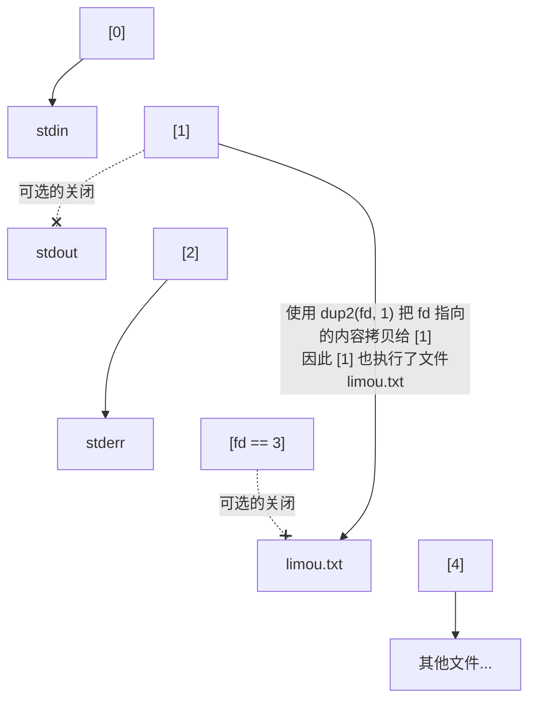
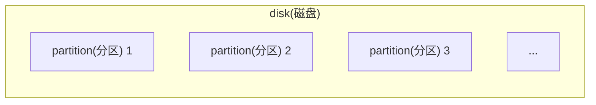
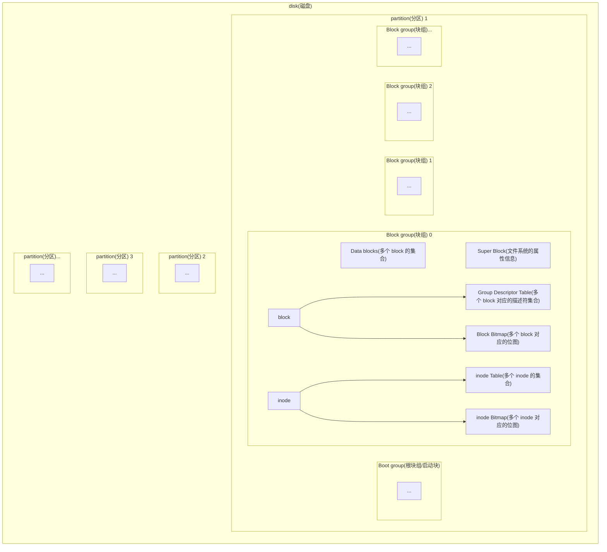
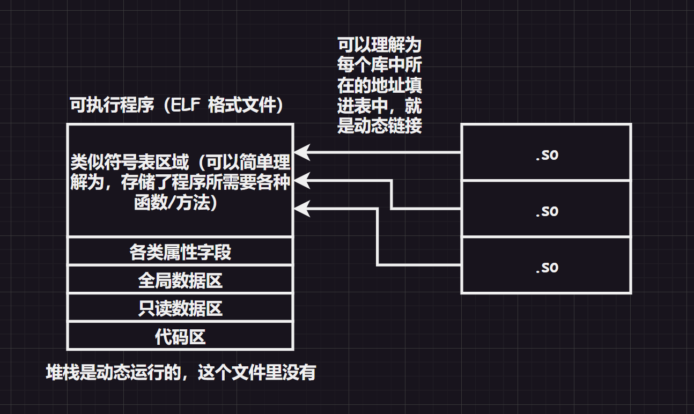

>   前要：本次我想给您带来关于 `IO` 和文件的知识，而文件在本系列中分为内存上的文件和磁盘上的文件。

# 1.文件概念

## 1.1.文件读写

在谈及系统接口之前，我们先来从 `C` 语言的角度来谈及一些前要知识，以辅助我们后续来理解系统 `IO`。

我们知道，在 `C` 语言中，有很多用于文件输入输出的接口。

> 补充：`C/C++` 程序会默认打开三个文件流：标准输入、标准输出、标准错误，这也就是为什么在没有手动打开（`open`）键盘和显示器的情况下，却依旧可以使用 `printf()`、`scanf()`、`cout` 的原因...

但是这一操作很奇怪，中间省略了很多步骤，文件是谁在访问呢？操作系统吗？太宽泛了，让我们再思考一下：

1.   我们先写一个包含打开文件接口的 `C` 代码
2.   经过编译生成可执行程序、运行程序加载到内存中转化为进程
3.   这就相当于，进程在访问文件
4.   而文件又放在磁盘上（因此在本系列中，最后需要提及磁盘的相关概念）
5.   进程通过一些系统接口，在磁盘上访问文件

>   补充：而我们之前在代码中使用的接口都是语言级别的接口（对系统接口进行了封装，好用是好用了，但是每一种语言都会做不同的封装，但是如果直接使用文件接口，写出来的系统代码不具备跨平台性）。因此最后，我们需要学习一些系统调用。

在 `C` 语言中，使用 `fopen()` 打开文件，然后使用 `fread()` 读取文件，就是读到了进程内部，进程早就被加载到内存的内部，因此就是把文件读到内存里（`input`），然后通过 `fwrite()` 等接口将数据写入到磁盘文件中（`output`）。

而 `input` 和 `output` 统称为文件的 `IO` 操作。

## 1.2.文件分类

文件实际上也有狭义和广义之分，上述提及的文件是狭义上的文件。对于系统来说：

-   狭义文件：存储在磁盘上的资源、数据叫做文件
-   广义文件：上几乎所有的外设，只要具有 `input` 和 `output` 特点的都可被称为文件

还可以根据文件是否被打开（被读取到内存中）这一状态，分为：

-   内存文件，已经被加载到内存中，随时会被进程读取修改，是动态的（我们先探讨内存文件，到文章后半段再谈及磁盘文件）
-   磁盘文件，存储在磁盘中，等待被进程加载到内存中成为内存文件，是静态的

而无论是哪一种概念的文件，都具备属性和内容，对文件的操作就是操作属性和操作内容。

# 2.文件接口

这里简单复习一下一些 `C` 语言文件接口，并且提及内部的底层系统调用。

## 2.1.C 语言文件接口

这里我给出文档链接，您可以前去复习一二...

-   [fopen()](https://legacy.cplusplus.com/reference/cstdio/fopen/?kw=fopen)
-   [fclose()](https://legacy.cplusplus.com/reference/cstdio/fclose/?kw=fclose)
-   [fread()](https://legacy.cplusplus.com/reference/cstdio/fread/?kw=fread)
-   [fwrite()](https://legacy.cplusplus.com/reference/cstdio/fwrite/?kw=fwrite)

## 2.2.Linux 系统调用

不同语言需要封装在不同平台的系统文件接口，以便于自己的语言可以跨平台使用。但是为了理解一些概念，我们必须对一些接口有所概念。

### 2.2.1.open()

```c
#include <sys/types.h>
#include <sys/stat.h>
#include <fcntl.h>
int open(const char* pathname, int flags);//路径和选项，通常这个函数用来读取比较多
int open(const char* pathname, int flags, mode_t mode);//路径和选项以及模式，通常这个函数用来写入比较多

//pathname 是指要打开文件的文件路径
//flags 对应的选项主要有：
//1.O_APPEND 追加
//2.O_CREAT 文件不存在，则会根据给定文件名创建新文件。如文件已存在，则不起任何作用
//3.O_TRUNC 如果文件存在，并且是常规文件，且打开的目的是写入，那么这个文件会被清空
//4.O_RDONLY 表示只读、O_WRONLY 表示只写、O_RDWR 表示读和写，这三个选项必须使用一个，再配合其他关键字使用
//5.O_CLOEXEC 在打开文件时设置 close-on-exec 标记。以 O_CLOEXEC 标志打开文件时，在调用 exec 系列函数（如 execve、execvp 等）时，该文件将自动关闭。对于在子进程中执行新程序时避免文件描述符泄漏非常有用
//...

//其中 mode 就是文件的权限，和 linux 文件权限的二进制表示是一样的，也会受到 umask 权限掩码的影响，我们也可以调用系统接口 umask() 来设置 umask 掩码，该掩码是进程专有的。如果文件是在 open() 时创建的，则默认权限是“乱码”的权限，最好还是手动设置一下。、
```

可以看到光是头文件就需要包含三个，而且还有两个 `open()` 函数需要选择，还需要组合选择众多的 `flag`，这样就会比 `C` 语言的 `fopen()` 难用一些。

那么上面的 `flag` 宏关键字怎么组合使用呢？想要传递多个选项怎么做呢？

一个 `int` 有 `32` 个比特位，那么每一个比特位都可以表示一种状态，只需要使用位操作来组合即可，这种传递状态的方式在编码中很常见，可以使一个参数有多种可能或者选择，比如下面的代码。

```c
#define ONE 0x1
#define TWO 0x2
#define THR 0x3
void show(int flags)
{
    if(flags & ONE) printf("one\n");
    if(flags & TWO) printf("two\n");
    if(flags & THR) printf("thr\n");
}
int main()
{
    show(ONE);
    show(ONE | TWO);
    show(ONE | TWO | THR);
    return 0;
}
```

因此使用 `open()` 也是使用类似的方式来组合调用不同的标志位。

那么 `mode` 参数又该怎么写呢？其实就是修改权限，配合 `umask()` 调用来使用即可，并且优先使用调用者的 `umask()`，忽略系统的 `umask` 值（但是一般建议直接使用系统的，和系统保存一致）。

```c
#include <stdio.h>

#include <sys/types.h>
#include <sys/stat.h>
#include <fcntl.h>
int mian()
{
    umask(0);//设置进程专用的 umask 掩码
    int fd = open("limou.txt", O_WRONLY, 0666);
    if(fd < 0)
    {
        perror("open");
        return 1;
    }
    printf("open success, fd: %d\n", fd);//输出 3
    return 0;
}
```

### 2.2.2.close()

```c
#include <unistd.h>
int close(int fd);
```

比较简单，就是关闭一个文件，将 `open()` 的返回值传入即可关闭文件。

### 2.2.3.read()

```cpp
#include <unistd.h>
ssize_t read(int fd, void* buf, size_t count);//将文件内容读取到 buf 中，ssize_t 是实际读取到的字符个数，只要有 fd 就可以读取，无需提前打开文件，后面的函数也是类似
```

### 2.2.4.write()

```cpp
#include <unistd.h>
ssize_t write(int fd, const void* buf, size_t conut);//fd 就是打开文件返回的 fd，buf 就是需要写入的数据，count 就是写入个数，并且无需包含 '\0'，因为这是 C 的字符串结尾，不是系统的字符串结尾，并且该函数在 open() 没有选择追加打开和清空文件的情况下，默认是从头开始覆盖式写入
```

我们直接来使用这些系统调用试试：

```c
#include <stdio.h>
#include <sys/types.h>
#include <sys/stat.h>
#include <fcntl.h>

int mian()
{
    umask(0);//设置进程专用的 umask 掩码
    int fd = open("limou.txt", O_WRONLY, 0666);//以只写目的打开文件
    if(fd < 0)
    {
        perror("open");
        return 1;
    }
    
    const char* s = "hello word!\n";
    write(fd, s, strlen(s));//最后一个参数不用加 1
    printf("open success, fd: %d\n", fd);//输出 3
    return 0;
}
```

但是上述函数的返回值是什么？这就需要提到文件描述符的概念了。

# 3.文件描述符

文件描述符的作用和进程 `ID` 类似，是一个文件的唯一标识符（进程是 `ID` 为唯一标识符）

```c
int main()
{
    int fd1 = open("limou1.txt", O_WRONLY|O_CREAT|O_APPEND, 0666);
    printf("open success, fd1: %d\n", fd1);
    int fd2 = open("limou1.txt", O_WRONLY|O_CREAT|O_APPEND, 0666);
    printf("open success, fd2: %d\n", fd2);
    int fd3 = open("limou1.txt", O_WRONLY|O_CREAT|O_APPEND, 0666);
    printf("open success, fd3: %d\n", fd3);
    int fd4 = open("limou1.txt", O_WRONLY|O_CREAT|O_APPEND, 0666);
    printf("open success, fd4: %d\n", fd4);

    close(fd1);
    close(fd2);
    close(fd3);
    close(fd4);
    return 0;
}
//输出了 3、4、5、6
```

这个 `fd` 返回值究竟是什么？就是所谓文件描述符，其中 `0`、`1`、`2` 这三个文件去哪里了呢？实际上分配给三个标准输入输出文件了，也就是被 `stdin(0)`、`stdout(1)`、`stderr(2)` 所占用（依照顺序占用）！

```cpp
int main()
{
    fprintf(stdout, "hello\n");//使用 C 语言的文件指针 FILE 写入 stdout

    const char* s = "I am limou\n";
    write(1, s, strlen(s));//使用系统调用和文件描述符写入 1 号文件
    return 0;
}
```

文件描述符的分配规则非常简单：先分配最小的没有被占用的文件描述符给新打开的文件。如果我们把默认的三个标准输入输出文件使用 `fclose()` 关掉，那么新打开的文件就可以占用 `0`、`1`、`2` 中某个标识符。

>   补充：在 `C` 语言下，所有的文件都具有文件指针 `FILE`。而 `FILE` 是 `C` 标准库设计的文件结构体，内部有多种成员。在系统角度只认识 `fd`，不认识 `FILE`，因此我们可以猜测：在 `FILE` 结构体内部一定封装了文件描述符 `fd`。这一点可以查看 `FILE` 结构体的成员变量的 `_fileno`（存储了文件描述符）来证明（也有可能不是这个名字，但是一定有一个文件描述符成员）。
>

# 4.文件结构体

一个进程可以打开多个文件，而一个文件要被访问也必须被一起加载到内存中才能被进程访问，那如果多个进程都在打开文件怎么办？内存根本不够用！因此操作系统不可能将如此多的文件全部一次性打开，必须经过描述和管理，因此就需要构建一个文件结构体。

在内核中，为了管理被打开的文件，就必须创建一个 `struct file{struct file* next; struct file* prev;};`（不仅包含属性和数据还有更多的）结构体来描述文件，并且使用双链表链接起来组织（先描述再组织）。

每打开一个文件，就会实例化该结构体，插入到链表中，来代表一个文件。一条链表就是当前所有进程需要的被打开的文件，但是文件和进程之间怎么关联呢？靠的就是 `fd` 文件描述符，所有的 `fd` 值构成一个数组的下标，这个数组的类型就是 `struct file* arrary[]`，也就是一个指针数组，每一个指针成员都指向一个文件结构体。

这样，系统就可以在进程对象中使用 `fd` 下标来访问一个指针数组，然后找到指向的文件结构对象，进而使用该对象描述的文件。

而再上述提到的结构体内部具有成员变量，而它又是描述文件的，因此文件有大部分属性来自这个结构体，关于属性的修改就是修改这些成员变量。

## 4.1.文件结构

真的存在描述文件用的结构体呢？下面是 `Linux` 内核对应的源代码：

```cpp
//文件结构
struct file
{
    union
    {
        struct list_head fu_list;
        struct rcu_head fu_rcuhead;
    } f_u;
    struct path f_path;
    //...
    const struct file_operations* f_op;//文件方法操作集
    //...
    fmode_t f_mode;//文件权限
    struct fown_struct f_owner;//文件的拥有者
    //...
    atomic_long_t f_count;//引用计数（统计有多少个进程在打开该文件）
    //...
    u64 f_version;//文件的版本
    //...
};
```

内部必然包含文件的各种属性和文件内容，每创建一个文件实例化，就是描述了一个文件。除此之外，还需要提供了一个文件缓存区（也就是一段内存空间）由操作系统申请给文件，在本文后面有关于缓冲区的详细描述。

这个结构实例化后的对象和进程结构的实例化一样，都只是在内存中存在，因此准确来说，该进程是描述一个被打开的文件。

-   所谓打开文件读数据，就是先发生缺页中断，然后将数据加载到内存（缓冲区）中，才允许进程读取文件的数据。
-   而写数据就是修改文件，改动内容和改动属性都是修改，也需要先将数据加载到内存（缓冲区），再进行修改。

因此文件读写操作都需要加载到内存中，都是来回拷贝。

除此之外，在文件结构体中还有对文件的操作方法集，可以根据每个文件自己的缓冲区进行文件操作（这点在 `C` 语言中可以使用函数回调来实现）。

## 4.2.指针数组

标识被我们理解为数组索引，那是否真的存在这么一个“数组”来指向结构体呢？我们也可以查看一下 `Linux` 内核的源码来证明：

```c
//指针数组
struct files_struct
{
    atomic_t count;
    struct fdtable *fdt;
    struct fdtable fdtab;

    spinlock_t file_lock ___cacheline_aligned_in_smp;
    int next_fd;
    struct embedded_fd_set close_on_exec_init;
    struct embedded_fd_set open_fds_init;
    struct file* fd_array[NR_OPEN_DEFAULT];//重点关注这个数组，如果是 64 位，NR_OPEN_DEFAULT = 64，32 位就是 32。
};
```

上面的结构体内的 `fd_array[]` 数组就是指针数组，每一个指针成员指向一个描述文件的结构体。

但是为什么这个数组这么小呢？只能同时打开 `64/32` 个文件？实际上还有其他的拓展字段（其他成员变量）来帮助这个数组指向更多的文件，在现在的某些操作系统里，一个进程有时候可以打开的文件能达到 `10 000` 个。

>   补充：因此经过上面所有知识的铺垫，我们终于可以得到更深入的结论：
>
>   1. `C` 语言调用 `fopen()`，则调用了系统接口 `open()`，系统实例化一份 `struct file*` 类型的文件对象，描述这个被打开的文件，并且插入到 `fd_array[]` 中，分配好文件标识符 `fd` 后，返回给 `open()`
>
>   2. 因此 `open()` 得到一个文件描述符 `fd`（数组下标），而文件描述符又被 `C` 语言的 `FILE` 结构体封装，最后以 `FILE*` 的方式返回给 `fopen()`，也就是我们平时在 `C` 语言内使用的文件指针
>
>   3. 然后我们在使用 `C` 语言的 `fwrite()` 的时候，传进来了一个 `FILE*`，指向的结构体变量内部具有一个 `fd` 文件描述符，就可以通过这个 `fd` 传给系统调用 `write()`
>
>   4. 然后操作系统找到进程的 `task_struct{};`，就找到了进程内部的数组 `fd_array[]`，根据 `fd` 就找到了 `struct file*` 类型的文件对象，也就是一个内存文件被找到了，然后后续就可以进行某一些写入操作了
>

# 5.重定向

## 5.1.重定向模拟

如果 `close()` 关掉 `fd=1` 的文件，根据 `fd` 的分配原则，关闭 `fd=1` 意味着下次打开文件分配的 `fd` 为 `1`，而 `C` 又默认往 `fd=1` 的 `stdout` 打印。

那么打印就会往新打开的文件内输出，而且不只是这一次打印，往后所有的打印输出函数都会输入的这个新打开的文件内部，这也就模拟了输出重定向。

```c
//模拟输出重定向
#include <stdio.h>
#include <sys/types.h>
#include <sys/stat.h>
#include <fcntl.h>
#include <unistd.h>

int main()
{
    //1.关闭标准输出
    close(1);

    //2.打开新的文件，自动赋予文件标识符为 1
    int fd = open("limou.txt", O_WRONLY | O_TRUNC | O_CREAT, 0666);//会覆盖文件的内容
    if(fd < 0)
    {
        perror("open");
        return 1;
    }

    //3.打印到输出，而输出标识符对于的文已经被改为了 limou.txt
    fprintf(stdout, "you can see me : %d, success\n", fd);

    //4.刷新输出
    fflush(stdout);
    //加上这个 fflush() 的原因是为了刷新用户级别的输出缓冲区，
    //如果没有使用这个函数，后面执行了 fclose() 将导致没有对应的 fd，
    //C 语言提供的用户级缓冲区，就无法通过 fd 让系统将数据刷新到对应文件
    
    close(fd);
    return 0;
}
```

但是如果我们在代码中去带 `fflush()` 就会发现，在文件内没有内容？！这又是为什么呢？这涉及到缓冲区，写入的数据还来不及从缓冲区刷新到文件，结果就关闭了文件标识符，就是有自动刷新缓冲区，也找不到对哪一个文件进行写入了。如果我们之前没有关闭标准输出，则会自动刷新缓冲区数据到标准输出上（我们后面来讲解，这里先简单理解一下）。

类似的，关掉 `fd=0` 也可以模拟输入重定向。

```cpp
//模拟输入重定向
#include <stdio.h>
#include <sys/types.h>
#include <sys/stat.h>
#include <fcntl.h>
#include <unistd.h>

int main()
{
    //1.关闭标准输入
    close(0);

    //2.打开新的文件，自动赋予文件标识符为 0
    int fd = open("limou.txt", O_RDONLY);//此时文件内是有内容的
    if(fd < 0)
    {
        perror("open");
        return 1;
    }

    //3.自定义一个缓冲区 buffer，用于存储读取到的数据
    char buffer[1024] = { 0 };
    fread(buffer, 1, sizeof(buffer), stdin);

    //4.输出读取结果到标准输出（相当于我们自己定义的缓冲区写入到了输出缓冲区中，最后 C 会帮助我们刷新的）
    printf("%s", buffer);

    //5.关闭被打开的文件
    close(fd);
    return 0;
}
```

## 5.2.重定向接口

上面代码还需要我们先关闭标准输入输出，有没有其他的办法呢？有的，接下来就让我们来学习一下重定向的底层调用：

```c
//dup 系列接口声明
int dup(int oldfd);
int dup2(int oldfd, int newfd);//重点了解这一个
int dup3(int oldfd, int newfd, int flags);
```

我们了解 `dup2()` 就够了，`duq2()` 就是把 `oldfd` 指向的内容拷贝给 `newfd`，然后将 `oldfd` 指向的文件关闭（这里的关闭是指引用计数的释放，不一定真的就释放被打开的文件资源了）。也就是说：`newfd` 的指向发生了改动。

```c
//演示使用接口 dup2()
#include <stdio.h>
#include <sys/types.h>
#include <sys/stat.h>
#include <fcntl.h>
int mian(int argc, char* argv[])
{
    if(argc != 2) //如果不是由“命令+参数”构成，就不执行代码
    {
        return 2;
    }
    int fd = open("limou.txt", O_WRONLY | O_TRUNC | O_CREAT);//会覆盖文件的内容
    if(fd < 0) //文件打开异常
    {
        perror("open");
        retrun 1;
    }
    
    close(1);
    
    dup2(fd, 1);//重定向输出
    close(fd);
    
    fprintf(stdout, "%s\n", argv[1]);//打印出携带的参数
    return 0;
}
```

上面的代码就是重定向的原理，图示如下：



> 补充：“`Linux` 下一切皆文件”，在进程控制和基础 `IO` 的知识背景下我们可以更加深入了解这句话。
> 
> 首先，`Linux` 内核大部分都是使用 `C` 语言实现的，那么 `C` 有没有办法实现面向对象呢？是可以的！
> 
> 例如：对于一个文件结构体，首先 `C` 的结构体具备类的雏形，可以在内部定义文件的属性（结构体成员变量），那么方法怎么实现呢？使用函数指针（结构体成员变量），只需要函数指针实现恰当，就可以在结构体中包含方法。
> 
> 因此一个基础的类就实现了。
> 
> 因此“一切皆文件”就是指：可以使用 `C` 语言的结构体来描述所有的硬件的“属性”和“操作”，那么调用这些硬件就如同调用一个对象，设置对象属性，根据属性使用对象的操作方法...这就是“一切接文件”的本质！
> 
> 另外，`C` 语言虽然是面向过程的语言，但是并不意味着 `C` 不可以实现面向对象思想，像上述的说明就实现了一个类的封装。在某些巧妙地设计下，实现 `OOP` 其他重要特性（比如：多态）也是完全可以的，当然，对比纯 `OOP` 语言来说会有些麻烦（比如 `Java`）。
> 
> 实际上，语言从面向过程到面向对象也是经历了这些大量的实践（每次都要设计出这样带有属性和方法的结构体）才被人们设计出来的。

我们之前写过一个 `MyShell` 项目，还有一个重定向的功能，用的就是这里的重定向调用。

# 6.标准错误文件

标准输出文件和标准错误文件都是输出到显示器，那么两者有什么区别呢？让我们来先看一段代码。

```c++
#include <sys/types.h>
#include <sys/stat.h>
#include <fcntl.h>
#include <unistd.h>
#include <cstdio>
#include <cstring>
#include <iostream>
using namespace std;
int main()
{
    printf("hello printf 1\n");//-> stdio
    fprintf(stdout, "hello fprintf 1\n");
    perror("hello perror 2");//-> stder

    const char* s1 = "hello write 1\n";
    write(1, s1, strlen(s1));

    const char* s2 = "hello write 2\n";
    write(2, s2, strlen(s2));

    cout << "hello cout 1" << endl;
    cerr << "hello cerr 2" << endl; 
    return 0;
}
```

这份 `C++` 代码的运行结果和重定向结果如下：

```bash
$ g++ main.cpp
$ ./a.out
hello printf 1
hello fprintf 1
hello perror 2: Success
hello write 1
hello write 2
hello cout 1
hello cerr 2

$ ./a.out > limou.txt
hello perror 2: Success
hello write 2
hello cerr 2

$ cat limou.txt
hello write 1
hello printf 1
hello fprintf 1
hello cout 1
```

可以看出 `1` 和 `2` 对于的都是显示器文件，但是两个文件是些不同的，我们可以认为一个显示器文件被打开了两次。`1` 和 `2` 描述符都指向显示器文件。因此做重定向的时候我们会发现，如果 `1` 被 `dup2()` 了，不代表 `2` 会被 `dup2()`。

这就是两者的最大区别，这样我们就可以理解，为什么开发者不自己使用类似 `printf()` 和 `if()` 打印错误，而使用 `preeor()` 这样的函数来做一个错误检查的输出了。

如果程序在运行的过程中出现了问题，使用类似 `preeor()`、`cerr()` 等函数会更加方便，因为可以使错误信息和正常打印信息区分开。

## 6.1.分开输出标准输出和标准错误

如果希望直接使用重定向，来使一般的文本输出和错误输出分离开查看的话，可以使用类似 `./a.out 1>text.txt 2>error.txt` 的命令，这样就可以实现文本输出和错误输出分离到两个文件内，直接进行查看就可以。

## 6.2.合并输出标准输出和标准错误

如果想要文本输出和错误输出全部放进一个文件了，则可以使用命令 `./a.out > all.txt 2>&1`（整个命令可以这么理解，`./a.out > all.txt` 将文本输出从标准输出重定向为文件 `all.txt`，此时该文件的 `fd` 就是 `1`，而后面又将 `2>&1` 就把标准输出重定向为 `1`，也就是说标准错误现在也指向 `all.txt` 了，这样两个输出就可以同时输入到一个文件了）。

>   补充：重定向也可以使用 `cat < source.txt > copy.txt` 来拷贝文件。

## 6.3.模拟实现 perror()

而 `perror()` 实际上我们也可以设计一个。

```cpp
//模拟实现 perror()
void MyPerror(const char* msg)
{
    fprintf(stderr, "%s: %s\n", msg, strerror(erron));//后面这个函数就是打印错误信息
}
```

# 7.缓冲区

我们之前提到过文件缓冲区，实际上文件缓冲区就是一段由操作系统分配的、供文件使用的内存空间。

## 4.1.缓冲区作用

为什么需要缓冲区呢？原因很简单，为了效率：

1. 写透模式 `WT`：数据一个一个输入，直接写透输出到磁盘的另外一个文件中，那么这个实现就会频繁访问磁盘（效率低）
2. 写回模式 `WB`：但是如果先拿内存空间存储起来表示写入完成（这里写完文件进程就回去继续执行代码，在写入的进程看来，自己已经完成对某文件的写入了（实际并没有，只是交给小段的内存空间了），也就是所谓的“写回”）。直到满足某一条件后，再一起将缓冲区数据输入到磁盘中的文件（刷新），这样效率就会很高，访问磁盘不会特别频繁（效率高）

>   补充：上面说的是“写操作的缓冲区”，同理读数据也类似有“读操作的缓冲区”的概念。

因此有了缓冲区就可以提高用户的响应速度（用户感觉自己的输入输出操作变快了，很有可能缓冲区内的数据还未刷新到磁盘中），以避免磁盘访问速度缓慢引起用户的输入输出请求响应缓慢（甚至影响其他设备的效率）。

> 补充：在某些情况下，我们也可以把内存当作一个“大型缓冲区”来理解。

总结来说：谁使用缓冲区谁受益（指 `IO` 效率上的受益）。

## 4.2.缓冲区刷新

我们知道，缓冲区需要根据一定的条件才可以进行刷新，也就是刷新策略：

1. 立刻刷新（即时缓冲）

2. 写出一行数据后，遇到换行就立刻刷新（行刷新）

3. 占满缓冲区就刷新（全刷新）

但是有一些特殊情况也会刷新缓冲区：用户强制刷新（`fflush()`）、进程退出时等等。

> 补充 `1`：一般显示器采用行刷新（符合阅读习惯），磁盘采用全缓冲（提高效率需求）。
>
> 补充 `2`：一般显示器时行刷新，因此使用 `printf()` 不断打印，但是不做换行，就只能等到缓冲区被填满才会输出，这个等待缓冲的过程可能比较久。
>
> ```cpp
> #include <stdio.h>
> #include <unistd.h>
> int main()
> {
>     while(1)
>     {
>         printf("%s", "abcdefghijklmnopqrstuvwxyz");
>         sleep(1);
>     }
>     return 0;
> }
> ```
>
> 这个代码运行起来后，可能还需要很久才能看到输出（也就是缓存区满的时候）。

## 4.3.缓冲区提供

但是缓冲区这段内存空间是谁提供的呢？是操作系统么？我们通过一份奇怪的代码来证明一下。

```c
//mian.c
#include <stdio.h>
#include <string.h>
#include <unistd.h>

int main()
{
    //C 语言接口
    printf("C:hello printf()\n");
    fprintf(stdout, "C:hello fprintf()\n");
    const char* s = "C:hello fputs()\n";
    fputs(s, stdout);
    
    //OS 系统接口
    const char* str = "Sys:hello write()\n";
    write(1, str, strlen(str));   

    fork();
    return 0;
}
//保存通过 gcc 生成 a.out
```

如果直接运行 `./a.out`，那么输出 `4` 行字符串确实没毛病。

```bash
hello printf()
hello fprintf()
hello fputs()
hello write()
```

但是如果将内容重定向到同级的另外一份空的文本文件 `/.a.out > text.txt`，就会发现文件内会多出很多语句，并且顺序也很奇怪，这是为什么呢？

```bash
hello write()
hello printf()
hello fprintf()
hello fputs()
hello printf()
hello fprintf()
hello fputs()
```

其实，我们目前提到的缓冲区都是是由语言来维护的语言级缓冲区（准确的说是 `C` 标准库）。

>   注意 `1`：我们之前提到过缓冲区的一个结论，“谁使用缓冲区谁受益（指 `IO` 效率上的受益）”，那么我们就可以认为，语言提供的缓冲区，让 `printf()` 的使用者受益（用户会感觉调用 `printf()` 变得快了，当然这是相对没有缓冲区而言）。
>
>   注意 `2`：`C` 语言的缓冲区是 `C` 语言的缓冲区，系统的缓冲区是系统的， `C` 语言并不是直接把系统的缓冲区进行封装，这样描述不准确...

在代码中，我们可以选择在进程里使用 `C` 提供的函数来写入 `C` 维护的缓冲区，再由该缓冲区自己调用 `write()` 写入系统。当然，也可以选择直接调用 `write()` 直接写入到系统。

我们之前是在显示器上刷新缓冲区的（行刷新）因此父进程运行一段代码，遇到 `\n` 就会刷新一次（这就是一种数据的改动），然后再创建子进程。对于子进程来说，父进程缓冲区内的数据已经被输出了，也就没有缓冲区的数据需要写时拷贝（继承父进程的数据）了，因此只有 `4` 行的输出，子进程则没有任何的输出。

而当我们将输出重定向的时候，就是向磁盘中的文件写入（这是一种修改）：

1. 在 `fork()` 之前，前面的函数被执行完了，但是不代表缓冲区的数据已经被刷新了。这是因为现在是将缓冲区的数据刷新到到磁盘（行刷新变成全刷新），因此代码语句中的 `\n` 变得没有效果了，父进程的打印在输出缓冲区中的数据会一直保存着，不会立刻输出

2. 而缓冲区的数据也是父进程的数据，在 `fork()` 之后，由于父进程在结束进程的时候需要刷新缓冲区的文件（这就是一种数据的改动）。为了避免子进程被父进程影响，创建子进程的时候，父进程缓冲区内的数据会被子进程发生一次写时拷贝（让子进程继承缓冲区的数据）

3. 最后在父子进程都结束进程后，由于进程结束必须要刷新所有缓冲区的数据，因此就会出现两份相同的输出（但是谁先退出这是不清楚的，因此我们无法确定两次相同的输出谁是父输出，谁是子输出）

我们可以在 `fork()` 代码的前面再加一条 `fflush()` 来避免创建子进程的时候发生写时拷贝，进而实现正常打印四条输出。

```c
//mian.c
#include <stdio.h>
#include <string.h>
#include <unistd.h>

int main()
{
    //C 语言接口
    printf("C:hello printf()\n");
    fprintf(stdout, "C:hello fprintf()\n");
    const char* s = "C:hello fputs()\n";
    fputs(s, stdout);
    
    //OS 系统接口
    const char* str = "Sys:hello write()\n";
    write(1, str, strlen(str));   
    fflush(stdout);
    fork();
    return 0;
}
```

```cpp
$ ./a.out > text
$ cat text
Sys:hello write()
C:hello printf()
C:hello fprintf()
C:hello fputs()
```

而为什么 `fflush()` 只输进去了一个参数呢，缓冲区的所在地呢？实际上 `stdout` 的数据类型是 `struct FILE{//...};`，该结构体不仅仅保存了文件描述符 `fd`，还封装了 `fd` 对应的大量的语言级缓冲区结构。

在一些 `stdio.h` 实现里 `FILE` 是由 `IO_FILE` 封装的。因此在 `FILE{//...};` 内部我们可以看到类似 `_IO_read_ptr`、`_IO_read_end` 等缓冲区相关的关键字，这些就是维护缓冲区的关键字。因此，我们只需要传递一个参数就足够 `fflush()` 刷新了。

而对于操作系统来说，每一个 `file{//...};` 内理应也有一个内核级缓冲区，我们使用 `write()` 的时候，也应该是将数据放进了系统级别的缓冲区。但是从上述代码输出来看，为什么就没有发生写时拷贝呢？

醒醒吧，是子进程要使用父进程中有可能会被父进程修改的数据时，才会发生子进程的写时拷贝，而使用 `write()`，就会将数据交给操作系统的内核缓冲区，而不是在进程里的语言级缓冲区，由操作系统来定义刷新，因此进程之间的写时拷贝和这里无关。

那么其他语言，是怎么维护缓冲区的呢？例如：`C++` 语言对 `<<` 进行重载，然后内部实现的时候将数据拷贝到 `buffer` 里就可以，后面再进行刷新即可（这里可以查看一下 `cout` 的实现，找找看里面是否存在 `fd`）。

最终我们可以得到两个结论：

1.   在 `C` 语言中，读写用的语言级别缓冲区由 `C` 库来维护，并且就在 `FILE{//...};` 内部描述缓冲区的属性，因此使用 `C` 的文件 `IO` 接口时需要时刻注意这方面的问题
2.   而语言级缓冲区会提高语言级调用的 `IO` 效率，系统级缓冲区就会提高系统调用的 `IO` 效率

## 4.4.缓冲区模拟

这里我们只模拟缓冲区原理的一部分。

```c++
#include <sys/types.h>
#include <sys/stat.h>
#include <fcntl.h>
#include <assert.h>
#include <stdlib.h>
#include <stdio.h>
#include <string.h>
typedef struct MyFILE//模拟 FILE
{
    int fd;//文件描述符
    char buffer[1024];//缓冲区
    int end;//结尾
}MyFILE;
//可以看到文件的数据都在 MyFILE 里，因此所有的接口都需要使用 MyFILE
MyFILE* MyFopen(const char* pathname, const char* mode)
{
    //1.检查参数都不为空
    assert(pathname);
    assert(mode);
    //2.对不同模式做不同的操作
    MyFILE* fp = NULL;
    if (strcmp(mode, "r") == 0)
    {
    }
    else if (strcmp(mode, "r+") == 0)
    {

    }
    else if (strcmp(mode, "w") == 0)
    {
        int fd = open(pathname, O_WRONLY | O_TRUNC | O_CREAT, 0666);//调用系统接口，写入之前先清空文件，不存在时需要创建
        if (fd >= 0)
        {
            fp = (MyFILE*)malloc(sizeof(MyFILE));
            memset(fp, 0, sizeof(MyFILE));
            fp->fd = fd;
        }
    }
    else if (strcmp(mode, "w+") == 0)
    {

    }
    else if (strcmp(mode, "a") == 0)
    {

    }
    else if (strcmp(mode, "a+") == 0)
    {

    }
    return fp;

}
void MyFputs(const char* message, MyFILE* fp)
{
    assert(message);
    assert(fp);
    strcpy(fp->buffer + fp->end, message);//注意这个函数是会自动添加'\0'的
    fp->end += strlen(message);//防止多次写入缓冲区被覆盖

    if (fp->fd == 0)
    {
        //标准输入
    }
    else if (fp->fd == 1)
    {
        //标准输出
        if (fp->buffer[fp->end - 1] == '\n')
        {
            write(fp->fd, fp->buffer, fp->end);//默认显示器行刷新
            fp->end = 0;
        }
    }
    else if (fp->fd == 2)
    {
        //标准错误
    }
    else
    {

    }

}
void MyFflush(MyFILE* fp)
{
    assert(fp);
    if (fp->end != 0)
    {
        write(fp->fd, fp->buffer, fp->end);//实际上是写入到内核缓冲区里了，一般是内核会帮助我们刷新，但是我们也可以尝试使用 syncfs()可以刷新数据到磁盘上
        syncfs(fp->fd);//刷新系统缓冲区到磁盘
        fp->end = 0;
    }
}
void MyFclose(MyFILE* fp)
{
    assert(fp);
    MyFflush(fp);//关掉文件之前先刷新一下缓冲区到文件里
    close(fp->fd);
    free(fp);
}
int main()
{
    MyFILE* fp = MyFopen("./limou.txt", "w");
    if (fp == NULL)
    {
        printf("open error\n");
        return 0;
    }
    MyFputs("hello!", fp);
    MyFputs("I am limou.", fp);
    MyFputs("This are words.", fp);
    MyFclose(fp); 
}
```

上面的代码不仅是实现了缓冲区的输入操作，还实现了一种缓冲区刷新策略（行刷新）。

您还可以在代码一开始的时候关闭 `fd=1` 的文件（也就是标准输出），这样系统就会给您的文件分配 `fd=1`，再结合 `usleep()` 来观察行刷新的操作。

并且我们还可以尝试在代码结尾添加 `fork()` 来重现我们在 `4.3.缓冲区提供` 中出现重复打印的现象。

而效率提高的地方就在于 `IO` 执行的次数变少（访问磁盘次数减少），在内存的操作比较多（放入 `buffer[]` 中）。

# 5.模拟实现 C 文件接口

了解了 `Linux` 中文件的系统调用和缓冲区之后，就可以尝试使用系统调用，来模拟实现 `C` 的文件接口了。

```cpp
//file.h
#pragma noce
#define BUFFER_SIZE 4096
#define FLUSH_NONE 1
#define FLUSH_LINE (1 << 1)
#define FLUSH_ALL (1 << 1)

typedef struct MyFILE
{
    int _fileno;                    //文件描述符
    int _flag;                      //刷新策略标记
    char _buffer[BUFFER_SIZE];      //缓冲区
    int _end;                       //end - 0 为缓冲区大小
} MyFILE;

MyFILE* Myfopen(const char* path, const char* mode);
int Mywrite(const char* s, int num, MyFILE* stream);
int Myfflush(MyFILE* stream); 
int Myfclose(MyFILE* stream);
```

```cpp
//file.c
#include "file.h"
#include <string.h>
#include <sys/types.h>
#include <sys/stat.h>
#include <fcntl.h>
#include <errno.h>
#include <stdlib.h>
#include <unistd.h>

#define DFL_MOOE 0666

MyFILE* Myfopen(const char* path, const char* mode)
{
    int fd = 0;
    int flag = 0;
    if (strcmp(mode, "r") == 0)
    {
        flag |= O_RDONLY;
    }
    else if (strcmp(mode, "w") == 0)
    {
        flag |= (O_CREAT | O_TRUNC | O_WRONLY);
    }
    else if (strcmp(mode, "a") == 0)
    {
        flag |= (O_CREAT | O_WRONLY | O_APPEND);
    }
    else
    {
        //Do nothing
    }

    if (flag & O_CREAT)//创建文件
    {
        fd = open(path, flag, DFL_MOOE);
    }
    else
    {
        fd = open(path, flag);
    }

    if (fd < 0)
    {
        errno = 2;//设置错误（代表文件打开失败）
        return NULL;
    }

    MyFILE* fp = (MyFILE*)malloc(sizeof(MyFILE));
    if (!fp)
    {
        errno = 3;//设置错误（代表空间申请失败）
        return NULL;
    }

    fp->_flag = FLUSH_LINE;//默认行刷新
    fp->_end = 0;//默认缓冲区没有数据
    fp->_fileno = fd;//设置文件标识符

    return fp;
}

int Mywrite(const char* s, int num, MyFILE* stream)//num 是写入的字符个数
{
    //写入数据
    memcpy(stream->_buffer + stream->_end, s, num);
    stream->_end += num;
    
    //判断刷新
    if ((stream->_flag & FLUSH_LINE) 
    &&  (stream->_end > 0)
    &&  (stream->_buffer[stream->_end - 1] == '\n')
    )
    {
        Myfflush(stream);
    }
    return num;
}

int Myfflush(MyFILE* stream)
{
    if (stream->_end > 0)
    {
        write(stream->_fileno, stream->_buffer, stream->_end - 0);
        stream->_end = 0;
    }
    //fsync(stream->_fileno);//可选，我们之前都是对自己设计的语言级缓冲区进行刷新，这个系统调用是刷新内核级缓冲区的

    return 0;
}

int Myfclose(MyFILE* stream)
{
    Myfflush(stream);//先刷新，防止缓冲区内还有数据
    return close(stream->_fileno);
}
```

```cpp
//mian.c
#include "file.h"
#include <stdio.h>

int main()
{
    MyFILE* fp = Myfopen("./limou.txt", "w");
    if(!fp)
    {
        perror("Myfopen()");
        return 1;
    }

    int cnt = 20;
    const char* msg = "Hello, I am limou3434.\n";
    while(cnt--)
    {
        Mywrite(msg, strlen(msg), fp);
        sleep(1);
    }

    Myfclose(fp);

    return 0;
}
```

# 6.文件系统

首先我们需要注意到，上述学习的文件都是被打开的文件（被进程访问、存储在内存中的文件），那么哪些存储在磁盘中的没有被打开的文件呢？这些文件又有哪些需要注意的地方呢？这很重要，因为有相当多的文件都是在磁盘中的（我们本节只讨论磁盘，其他类型的永久存储器也是类似的理解），这些文件都没有被打开（也就是没有加载到内存中）。

首先，我们先来理解关于磁盘的一些基本知识，这里只是简单的科普一下，这部分内容最好是参考一些关于“计算机组成原理”的资料。

## 6.1.磁盘角度理解磁盘文件

### 6.1.1.磁盘硬件结构

1. 内存是一种失电易失存储介质（断电了内部的数据就会消失，这和内部使用的电子元件有关）

2. 磁盘是一种永久性存储介质（还有一些别的永久性存储介质，例如：`SSD`、`U` 盘、`flash` 卡、光盘、磁带...但是在企业里 [2021]），使用磁盘的性价比要高）

磁盘的 `IO` 操作对比 `CPU` 的处理速度是比较慢的，因此操作系统也会有一些提速处理的方式（这里暂时不提及，您只需要知道有就是了）

而磁盘的具体结构大概为：


-   磁盘盘片：存储数据，一张盘片由很多密度非常大的磁性颗粒来构成，利用南北磁性表示 `1/0`，磁盘和磁盘之间存在悬浮避免损坏），一个磁盘存储器由多个盘片构成
-   磁头：用来寻址，每一个盘面都有一个磁头，磁头可以利用放电来改变盘片上颗粒的磁性，因此可以存放数据，也可以读取数据
-   伺服系统：待补充...
-   音圈马达：待补充...
-   ...

磁盘盘片上的一圈称为“磁道”或者“柱面”，磁盘盘片由若干块扇区构成（扇区指圆环的一部分，不是指圆的一部分）。

磁盘的存储基本单位是扇区，而一般扇区的存储字节大小规定为 `512` 字节，也有 `4KB` 的（后者的比较先进 [2021]），文件操作都是 `4KB` 操作，但由于缓冲区的存在，用户是察觉不到 `4KB` 的操作的。

>   补充 `1`：这里给一份 [磁盘结构 3D 图示视频链接](https://www.bilibili.com/video/BV1H24y1S7bJ/?share_source=copy_web&vd_source=4772b64d7a3cb1873f14bc0153c4de68)，值得一看。
>
>   补充 `2`：虽然磁盘基本单位扇区是 `512 byte`，但是操作系统的文件系统和磁盘进行 `IO` 动作的基本单位是 `4 KB = 8 * 512 byte`。哪怕系统只读写 `1 bit` 的数据也必须读写 `4 KB`。为什么不用磁盘的基本单位是因为：
>
>   1. `512 byte` 太小了，`IO` 操作又是频繁操作，导致效率下降
>
>   2. 万一未来的磁盘基本单位被修改了呢？源代码也需要跟着改变，这太麻烦了（这是一种解耦合）
>
>   补充 `3`：`4 KB` 就是一个块大小，这也就是磁盘为什么被称为“块设备”的原因。

### 6.1.2.磁盘查找结构

无论是读还是写，首先都需要查找地址，那么如何查找存储空间的地址呢？需要三要素：

1. 首先查找数据在哪一个盘面？

2. 数据存在哪一个轨道/柱面上？（磁道为 `Cylinder`）

3. 在哪一个扇区里？（磁头为 `Head`、扇区为 `Sector`）

这种寻址方式就是 `CHS` 寻址，可以找到所有扇区。

通过磁盘的旋转可以想象成线性结构，因此扇区可以抽象为数组，因此使用下标就可以寻找数据，也可以使用指针来标明不同的磁盘扇区，这就变成了 `LBA` 寻址，这是磁盘的一种结构体抽象，由对磁盘的管理转化为对数组的管理。

但是磁盘很大，形成的抽象数组所占空间也很大，因此可以对这个抽象数组进行拆分，也就是所谓的“磁盘分区”，便于操作系统管理和查找，而磁盘可以根据操作系统的 `LBA` 地址，转化为实际的 `CHS` 地址。



但是即便是做了分区，每一个区的空间依旧很大怎么办呢？我们还可以继续做磁盘抽象。

### 6.1.3.磁盘抽象结构

“磁盘抽象结构”也就是“虚拟/逻辑结构”，上述已经成功将磁盘理解为线性结构了，那么对于每一块磁盘分区，内部还有指针维护划分块组区间：`Boot Block`、`Block group 0`、`Block group 1`、...`Block group n`。



而每一个 `Block group` 的内部包含了 `Super Block`、`Group Descriptor Table`、`Block Bitmap`、`inode Bitmap`、`inode Table`、`Data blocks`（这里是我们学习的重点），这里面无非存储的就是文件的内容和属性。

1. **Group Descriptor Table(GDT)**：块组描述符，主要是描述块组的大小、块组使用程度

    -   `inode space` 的数量
    -   `inode space` 的使用程度
    -   `inode number` 的数量
    -   `inode number` 的使用程度
    -   ...

2. **Data Blocks**：多个块（`扇区空间*8 = 1KB`）的集合，块里保存的都是特定文件的“内容”（`Linux` 将文件的属性和内容分开存储），对于每一个块，也有标识块的“块号”，那如果一个文件比较大，占用的块比较多，我们该怎么组织这些块呢？下面会进行解释，还请您继续看下去...

3. **Block Bitmap**：那么磁盘怎么知道 `Data blocks` 里有哪些 `block` 被占用？哪些可以被使用呢？使用位图 `Block Bitap`，只要有 $x$ 个块，就至少有 $x$ 多个比特位，比特位对应一个块，可定 $1$ 为“块被占用”，$0$ 为“块可用”。

4. **inode Table**：`inode space(node 空间)` 的集合。一般情况下，每个文件都会对应一个 `inode space` ，`inode space` 空间的大小是 `128 byte`，内部保存的是对应文件的“属性”数据

    -   文件的属性
    -   文件的大小
    -   文件的所有者
    -   文件的所属组
    -   文件的最近修改时间
    -   ...

    而一个 `inode space` 使用 `inode number(inode 编号)` 来标识（）也就是 `ls -al` 之后每一个文件列表的第一列信息），在 `inode Table` 内的每一个 `inode space` 空间，需要有唯一一个 `inode number` 来标识该 `inode space` 。

    >   补充 `1`：由于“`file-inode spac-inode number`”之间是一一对应的，因此 `Linux` 使用 `inode/inode number` 来唯一标识一个文件，因此我们可以 `Linux` 中查找一个文件不需要用到文件名，而是需要文件对应的 `inode/inode number`。
    >
    >   补充 `2`：一个文件不一定只占有一个块（`4 KB`），那文件比较大怎么办？不用担心，首先 `inode space` 可以存储一个关于块的数组，读取文件时，只需要找到 `inode number` 对应的 `inode space`，找到其中块的数组即可读取文件。
    >
    >   而如果某个块存储其他块的块号，则可以使用该块来索引其他的块，文件能使用的块就会变得更多（甚至是使用其他分区中的块）。

5. **inode Bitmap**：那么磁盘又怎么知道 `inode Table` 里有哪些 `inode` 被占用？哪些可以被使用呢？和 `Block Bitap` 是类似的，也是使用位图。基于上述的描述：系统可以完全掌握磁盘信息可追溯、可管理。也就是说：

    (1)找到一个文件，就需要找到 `inode numeber` （依靠目录结构来找到）

    (2)然后找到 `inode space`，可以找到文件属性、可以找到分区特定的块组

    (3)每个块组都这么做，整个分区就被写入了文件系统信息被管理，也就是所谓的“格式化”

6. **Super Block**：超级块保存了文件系统的属性信息，包含了磁盘分区的属性，一个磁盘分区的部分块组内的 `Super Block` 都复制了下面的信息（对磁盘分区的管理转变为了对若干 `Super Block` 的管理）

-   分区内的块组是否为满

-   分区内的 `inode space` 是否为满

-   分区内有多少块组可用

-   分区内有多少 `inode space` 

-   ...

    而这些信息之所以被多份放进块组的 `Super Block`，是因为可以达到文件备份的目的（不至于一份坏掉导致整个磁盘都无法运行）。

>   补充：`Boot group` 和计算机启动有关，可能涉及到到 `BIOS` 等，因此这块地方通常不会被更换（否则操作系统有可能无法启动）。

>   注意：“格式化”指的是建立一个完整的磁盘文件管理结构系统
>
>   -   **低级格式化**：重写磁盘上的扇区和轨道信息，以确保磁盘的物理结构得到恢复（有些时候可以作为清理磁盘的手段）
>
>   -   **高级格式化**：一种更加细致和可定制的格式化方式，可以选择不同的文件系统、分区类型、簇大小等选项，高级格式化通常需要使用第三方工具实现

上述的文件管理系统就被称为 `Ext2` 文件系统，但是其还欠缺一些日志、数据恢复功能，因此后续也发展了 `Ext3`、`Ext4`，不过基本的框架是类似的...

## 6.2.重新理解目录三权限

另外我们还可以重新理解对目录的三个权限：

1. `w` 权限（写）：一个文件的文件名是存储在目录里的，而文件名和 `inode number` 编号都是唯一的、一一映射的（也就是键值对关系，文件名是 `key`，`inode number` 是 `value`）。

    这一映射关系和文件名被存储在目录的 `Data blocks` 里，文件名和 `inode number` 的键值对关系需要存储在目录的 `Data blocks` 里，就必须写入数据，因此我们在目录底下创建文件就必须具有对目录的写权限，这也就是为什么需要给目录赋予 `w` 权限的缘故。

    >   补充：目录这个“文件”存储了目录下面文件的文件名和 `inode number` 的键值对关系（映射关系），这点很重要，用户使用文件名的原理深处是使用了 `inode number`。
    >
    >   因此同一个目录下不能存在两个文件名相同的文件，这个文件名是要作为 `key` 值来使用的。
    >
    >   目录下如果需要存储子目录，那么目录的 `Data blocks` 里实际也存储了子目录名和子目录对应的 `inode number` 之间的映射关系。
    >
    >   并且值得注意的是，`Linux` 下文件名不是文件的属性（`inode space` 内没有存储文件名），文件名存储在目录文件中。
    >
    >   而找到一个文件，就需要从根目录的 `inode number` 和键值对关系一直找下去。

2. `r` 权限（读）：有了读权限才可以显示目录中文件的名字和属性，可是 `inode space` 中是没有存储文件名的，因此就需要读取目录的 `inode number` 才可以根据键值关系来获得文件名，而根据 `inode number` 又可以查找对应的 `number space`，进而得到文件的属性。总结来说，就需要有读取到 `inode number` 的读权限。

3. `x` 权限（执行）：控制用户是否可以通过该目录的 `inode number` 进入该目录

## 6.3.系统创建/删除/查看文件

1. 创建文件时系统做了什么呢？

    -   首先确认在哪一个目录下创建，找到目录所在分区，遍历 `inode Bitmap` 找到第一个 `inode space` 对应位图为 `0` 的地方，置为 `1` ，而这样遍历累加得到计数就得到一个 `inode number`，然后在 `inode number` 指向的 `inode space` 里设置文件的权限

    -   同理遍历 `Block Bitmap` 找到空闲的块，确定该块用来保存文件的内容，由于是新建立的文件，内部没有内容，因此需要把对应的块清空数据（后面写入文件时，再直接从块位图中找块，然后将内容填写进去）

    -   最后将 `inode number` 返回给用户

        >   补充：虽然概率很小，但是由于 `inode` 和块的数量是固定的，因此有可能出现一方不够用的情况
        >
        >   1.  `inode` 不够用了，创建不了文件
        >   2.  块不够用了，创建得了文件但是无法写入内容

2. 删除文件时系统做了什么呢？

    -   首先根据目录的 `inode Bitmap` 来确定目录的 `Data blocks`（因为目录实际也是一个文件），然后用户提供文件名，以文件名作为 `key` 值从目录的 `Data blocks` 中找到对应文件的 `inode number`

    -   将文件在 `inode` 位图和 `Block Bitmap` 中对应的比特位置 `0` ，这个文件就被变相删掉了

    -   再进一步从目录中删除“`file name-inode number`”映射关系即可

    -   换句话来说，被删除的文件的实际数据依旧存在，只不过用户此时很难通过某些类似指针的东西找回（有概率在删除文件之后可以恢复文件，事实上也确实存在类似这样的软件），并且被删除文件占有的空间会被随时覆盖，内部数据不再被系统刻意维护

    >   补充：如果实际情况中，我们不小心误删了一个文件，我们需要做的第一件事情是什么？答案是“什么都不做”，避免过多的操作导致原有文件数据被其他数据覆盖。第二件事情，就是根据文件的 `inode number` 找到对应的 `inode Bitmap` 置 `1`，再根据 `inode space` 将对应的块组 `Block Bitmap` 置为 `1`

3. 查看文件时系统做了什么呢？

    `ls`、`cat` 等指令的时候，`ls` 首先找到目录以及目录的 `inode` 编号，找到所有的文件名和对应的文件 `inode` 编号，然后感觉对应的 `inode` 位图找到所有的属性然后和文件名字拼接输出即可，而 `cat` 也是类似的只不过是根据文件属性找到对应块的文件内容...
    
    >   补充 `1`：如果不断访问一个目录，`Linux` 就会利用 `struct dentry{/*...*/};` 数据结构，将常用的文件名字和路径导入到内存中，加快访问速度，这个了解下就行...
    >
    >   补充 `2`：实际上 `inode number` 并不难找，问题是如何找到一开始的分区，不同分区的内的 `inode number` 有可能相同，这该如何确定 `inode number` 在哪个分区呢？
    >
    >   一般情况下，一旦格式化分区后，需要挂载分区，才能使用该分区，挂载语法类似 `sudo mount <分区> <指定目录>`，这样目录就可以和分区关联起来，因此访问目录就可以访问该分区，因此只要确定访问哪个目录，就可以确定访问哪个分区...
    >
    >   可以使用命令 `df -h` 来查看系统中分区的挂载情况：
    >
    >   ```bash
    >   # 查看系统中分区的挂载情况
    >   $ df -h
    >   Filesystem      Size  Used Avail Use% Mounted on
    >   devtmpfs        988M     0  988M   0% /dev
    >   tmpfs          1000M   24K 1000M   1% /dev/shm
    >   tmpfs          1000M  848K  999M   1% /run
    >   tmpfs          1000M     0 1000M   0% /sys/fs/cgroup
    >   /dev/vda1        50G   18G   30G  37% /
    >   tmpfs           200M     0  200M   0% /run/user/1001
    >   tmpfs           200M     0  200M   0% /run/user/1007
    >   tmpfs           200M     0  200M   0% /run/user/1005
    >   /dev/sr0         19M   19M     0 100% /iso
    >   ```
    >
    >   在我的云服务器下显示这一行 `/dev/vda1        50G   18G   30G  37% /` 就是表明把分区 `/dev/vda1 ` 挂载到 `/` 下，也就是说，整个系统都只使用了一个分区（买得是比较便宜的服务器）。
    >
    >   因此所谓的挂载就是把目录的数据结构和文件系统的数据结构拿指针关联起来，因此访问某一个分区，就访问对应挂载的目录即可。
    >
    >   而进程在打开某个文件的时候，内部 `PCB` 保存了工作目录（含有分区），就去根据这个地址逐步映射到最终文件的 `inode space`，找到文件的属性填充到内存中的 `struct file{/*...*/}` 中，把对应的块中的内容也预加载进缓冲区即可。

# 10.软硬链接

## 10.1.软硬链接的创建

经过上述的铺垫，我们可以来理解软硬链接了，首先我们先来尝试创建链接：

1.   `ln -s <目标文件> <链接名>` 可以创建软链接，`s` 就是 `soft` 的意思
2.   `ln <目标文件> <链接名>` 可以直接创建硬链接

## 10.2.软件链接的区别

两者有什么差别呢？软链接有自己独立的 `inode`，并且不会增加文件的硬链接数。而硬链接 `inode` 和对应的文件 `inode` 是一样的（这意味着硬链接不是一个独立的文件），并且会增加硬链接数（是对文件的一种引用计数）。

```bash
查看硬链接数
$ ls -li
total 4
1840738 drwxrwxr-x 2 limou limou 4096 Oct  1 22:42 dir
1840740 -rw-rw-r-- 4 limou limou    0 Oct  1 22:42 hard-link-1
1840740 -rw-rw-r-- 4 limou limou    0 Oct  1 22:42 hard-link-2
1840740 -rw-rw-r-- 4 limou limou    0 Oct  1 22:42 hard-link-3
1840850 lrwxrwxrwx 1 limou limou    4 Oct  1 22:44 soft-link -> text
1840739 -rw-rw-r-- 1 limou limou    0 Oct  1 22:42 text
1840740 -rw-rw-r-- 4 limou limou    0 Oct  1 22:42 text_1
1840747 -rw-rw-r-- 1 limou limou    0 Oct  1 22:42 text_2
1840849 -rw-rw-r-- 1 limou limou    0 Oct  1 22:42 text_3
```

软链接类似于 `Windows` 下的快捷方式，是一个独立的文件，可以更加快捷使用某些程序和工具，而软链接内部文件内容实际上就存储了指向目标文件的路径（`WIndows` 下打开快捷方式的属性就会看得更清楚）。

硬链接只是在指定的目录下，新建立了文件名和 `inode number` 的映射存入到当前目录里而已（因为硬链接的 `inode number` 和目标文件的 `inode number` 是一样的），也可以说是给文件重命名，实际上硬链接数就是文件在引用计数的应用。

当我们删除文件的时候，引用计数减 `1`，只有引用计数为 `0` 的时候（没有文件名和 `inode number` 映射时），该文件才会被彻底删除，而创建硬链接的时候，引用计数加 `1`。

我们甚至可以尝试使用 `unlink <文件名>` 指令来减少某个文件的引用计数，达到 `rm` 的效果（系统调用也有一个加 `unlink()` 的函数）并且我更推荐这种删除方法。

而对于刚刚被创建出来的目录，其硬链接数默认为 `2`：

1.   一个是自己本身（自己就是自己的硬链接）
2.   另一个是目录内部的 `.`，这个 `.` 用于使用相对路径，其实际上是目录的一个硬链接。因此使用 `.` 就是使用目录（而 `..` 就是目录的父目录的硬链接）

而如果我们在空目录内再新建一个子目录，那空目录的硬链接数可以达到 `3`。

下面我们利用一个简单的 `C++` 代码进行对软硬链接的模拟：

```cpp
//使用 C++ 代码来模拟软硬链接原理
int main()
{
    int file = 10; //文件本体
    int* pfile = &file; //pfile 就类似 file 的软连接
    int& File = file; //File 就类似 file 的硬链接
    return 0;
}
```

>   补充：实际上用户无法自己对目录建立硬链接（但是系统又给 `.` 和 `..` 开了后门，这是特殊规定），这是为什么呢？这是因为硬链接本质是指向同一个文件/目录，一旦允许对目录进行硬链接，就会导致循环查找，无法停止。
>
>   ```mermaid
>   flowchart TD
>   root --> dir1 & dir2 & dir3
>   dir1 --> dir4 & dir5
>   dir4 --> dir6["dir6[同时也是指向 root 的硬链接]"] & test.txt 
>   ```
>
>   上图中需要查找文件 `test.txt`，假设采用深度遍历，从 `root` 查询到 `dir6` 后，又回到了 `root`，因此就陷入了死循环（查找文件的第一件事情肯定是查询目录，如果遇到文件直接对比就行，而软链接是文件也就不会被打开，因此允许软链接而不允许硬链接）。

# 11.动静态库

## 11.1.静态库制作和使用

### 11.1.1.静态库制作

实际上，我们可以把 `function.h` 文件和经过 `gcc -c function.c -o function.o`  后的文件给别人，就可以给别人使用您编写的函数。如果将多个 `.o` 文件打包起来，就是“形成静态库”的过程，使用 ==`ar -rc <目标静态库名，前缀lib，后缀.a> <.o文件列表>`== 命令即可完成打包（`r` 指替换， `c` 指创建）。

>   补充：`Windows` 和 `Linux` 两个平台的动静态库后缀名不一样
>
>   1.   `Windows`：
>
>        (1)**静态库**：`.lib`
>
>        (2)**动态库**：`.dll`
>
>   2.   `CentOS(Linux)`：
>
>        (1)**静态库**：`.a`
>
>        (2)**动态库**：`.so`

下面让我们来试试制作一个静态库：

```cpp
//编写自定义静态库源代码（Print.h）
#pragma once
#include <stdio.h>
#include <time.h>
extern void Print(const char* str);
```

```cpp
//编写自定义静态库源代码（Print.c）
#include "function1.h"
extern void Print(const char* str)
{
    printf("%s\n", str);
}
```

```cpp
//编写自定义静态库源代码（Add.h）
#pragma once
#include <stdio.h>
extern int Add(int i);
```

```cpp
//编写自定义静态库源代码（Add.c）
#include "function2.h"
int Add(int i)
{
    printf("%d\n", i + i);
    return i + i;
}
```

然后根据这些源文件和静态库制作的指令生成静态库。

```shell
制作静态库
# (1)制作 .o 文件
$ gcc -c function1.c -o function1.o # 这里的 -o 可以不加，默认生成和 .c 文件同名的 .o 文件
$ gcc -c function2.c -o function2.o # 这里的 -o 可以不加，默认生成和 .c 文件同名的 .o 文件

$ ls
function1.c function1.h function1.o
function2.c function2.h function2.o

# (2)使用 ar 指令制作静态库（-rc 为 replace and create）
$ ar -rc -o libfunction.a function1.o function2.o

# (3)整理文件
$ rm function1.c function2.c function1.o function2.o

$ ls
function1.h function2.h libfunction.a

$ mkdir -p mylib/include
$ mkdir -p mylib/lib

$ mv function1.h ./mylib/include
$ mv function2.h ./mylib/include
$ mv libfunction.a ./mylib/lib
```

>   补充：上述过程中最好使用 `makefile` 来自动化生成。

然后编写一份将来要调用我们制作的库文件的 `mian()` 程序。

```cpp
//主程序（main.c）
#include "function1.h"
#include "function2.h"
int main()
{
    Print("I am limou.");
    printf("%d\n", Add(50));
    return 0;
}
```

此时由于我们写的静态属于第三方库（`gcc` 默认不识别），因此需要我们手动链接才可使用。

### 11.1.2.静态库使用

一般制作库后，有一个目录为 `include` 专门放头文件，还有一个目录为 `lib` 专门放静态库文件（上述代码中我就是这样做的）。打包好两个文件后就可以上线发布了，用户使用这两者即可使用内部的函数，有三种使用方法：

1.   直接修改系统文件：`gcc` 头文件的默认搜索路径是 `/usr/include`，而 `gcc` 库文件的默认搜索路径是 `/lib64` 或者 `/usr/lib64`，我们直接将我们做的头文件和库拷贝进去即可。在使用我们的库时，可以在 `main()` 所在文件使用 `<>` 引用头文件，也可以使用 `""`，然后使用 `gcc <使用静态库的源文件> -l <指定目标静态库文件，去掉lib和.a>` 即可通过使用（这个过程实际就是安装库的过程，但绝不推荐这么做，容易污染别的头文件和库文件）

2.   用户直接包含目标头文件然后使用 `gcc` 链接：由用户使用 `include` 语句，直接指向头文件的所在地，再链接的使用 `gcc` 链接已经准备好的库 `gcc 用户的源代码（含有main.c） -L <静态库文件的父路径> -l <指定目标静态库文件，去掉lib和.a>`

3.   直接使用 `gcc` 进行包含和链接：将打包好的 `include` 和 `lib` 文件放在包含 `main()` 源文件的同级目录下，然后直接使用 ==`gcc 用户的源代码（含有main.c） -I <头文件所在的父路径> -L <静态库文件的父路径> -l <指定目标静态库文件，去掉lib和.a>`==

     (1)`I`：是 `include` 的意思

     (2)`L`：是 `Library` 的意思

     ```bash
     # 在代码中使用静态库
     $ gcc test.c -I ./mylib/include -L ./mylib/lib -l function
     $ ls
     a.out mylib test.c
     
     $ ./a.out
     I am limou.
     100
     ```

>   补充：如果我们使用指令 `ldd <可执行文件>` 是不会指出依赖哪一个静态库的，因为该指令只会指出依赖了哪些动态库，而静态库早就把内部代码拷贝进可执行文件里了。

>   总结：实际上您可以认为静态库是程序员编译源文件中的一种“偷懒行为”，只是在输入指令的长度上变短了（因为实际项目很可能会有多个头文件和对应实现，一个一个写太麻烦了，还有写错的可能），效率并没有提升多少...

## 11.2.动态库的制作和使用

### 11.2.1.动态库制作

使用命令 ==`gcc -fPIC -c <.c文件名> -o <.o文件名>`== （`-fPIC` 参数的意思是用于生成与位置无关的代码，即“位置无关码”）形成一个与目标位置无关的二进制文件，然后使用 ==`gcc -shared <.o文件列表> -o <目标动态库名，前缀lib，后缀.so>`==（这的 `-shared` 实际上就是“共享”的意思）。

接着发布动态库，也是分为 `include` 和 `lib`，静态库和动态库可以放在一起。

### 11.2.2.动态库使用

-   静态库不需要自己加载到内存，因为程序在编译链接的时候就把库中的代码直接链接到可执行文件中，相当于方法直接拷贝给程序了，这些方法直接跟随进程一起加载到内存即可，进程运行起来后，静态库就没有用处了（整个程序的运行过程中都不会用到静态库了）。

-   而动态库和可执行文件可以分批加载到内存，并且加载一次动态库就可以被系统内所有的进程使用，而静态库就有可能会出现多份相同的代码和数据。

使用动态库也有四种常见的方法：

1.   直接修改系统文件：和静态库一样，直接将对应的头文件和库文件分别拷贝到 `/usr/include` 和 `/lib64`（或 `/usr/lib64`），然后使用命令 `gcc <包含main.c的源代码> -I <头文件的所在路径> -L <库文件的所在路径>` （最后一个选项如果指定的动静态库同名，则默认使用动态库，如果只有静态库则会使用静态库，不过可以使用 `-static` 强制使用静态库），最后就可以生成可执行程序了。

     但是此时还有一个问题，虽然程序可以通过编译了，但是运行和编译器没有关系（那是操作系统的事，编译器只是辅助编译和翻译指令而已），因此就算编译器找得到动态库的文件，但是操作系统不知道，导致动态库并没有跟随程序一起加载进内存，进而运行起来。

     因此我们必须添加多一个选项，也就是 ==`gcc <包含main.c的源代码> -I <头文件的所在路径> -L <库文件的所在路径> -l <使用的动态库名字，去掉lib和.so>`==，使用 `-l` 来指定动态库名称。

     >   补充：`gcc` 在默认情况下，都是有动态库就用动态库。若特定库只有静态库可用，就会允许动静态库同时混杂链接的情况。而如果只有动态库且没有静态库，却强制使用 `-static` 那么该库就不会被链接。

     接下来讲解在基于上述生成的可执行文件的情况下，帮助系统寻找指向动态库父路径的方式...

2.   设置对应的环境变量：如果我们不选择拷贝这种粗暴的方式，就必须配置相关的环境变量 ==`export LD_LIBRARY_PATH=$LD_LIBRARY_PATH:<动态库所在的父路径>`==，该环境变量翻译为“加载动态库路径”，用于告诉操作系统动态链接器在运行时查找共享库的位置，我们把自己的动态库文件路径添加进去就行（平时调试自定义的第三方库的时候可以用这种方式），注意不同环境对应的这个环境变量不太一样。

3.   设置对应的配置文件：而上述环境变量是具有临时性的，如果关闭了终端就会清除（或者说“只在当前会话有效”）。这是因为该环境变量是内存级别的环境变量。但也有一劳永逸的方法，在 `Linux` 的 `/etc/ld.so.conf.d/`，在这里创建一个 `.conf` 文件，在内部写入动态库的父路径直接保存即可。这样就可以永久保存动态库的搜索路径，以后关闭终端也不会丢失该路径信息。

     需要注意的是，配置完后有的时候需要执行一下 `sudo ldconfig`，这是一个用于更新动态链接器运行时共享库缓存的命令。当系统中的共享库发生变化时，例如添加、删除或更新了共享库，可以运行该指令来刷新系统的共享库缓存，以便动态链接器能够正确找到这些库。

     >   补充 `1`：这里有一个有趣的现象，如果运行带有动态库的程序成功后，删除掉之前创建的 `.conf` 文件，之后重新启动程序，程序还是可以正常运行，这是因为有关动态库路径和相关数据都还在系统缓存中保存着。
     >
     >   补充 `2`：`/etc/ld.so.conf.d/` 内通常包含一些配置文件，这些文件用于指定系统动态链接器在运行时查找共享库/动态库的父路径。这个目录中的配置文件允许用户或系统管理员添加额外的共享库/动态库路径，以便动态链接器能够找到程序所依赖的库。
     >
     >   每个配置文件中通常包含一行路径信息，指定了一个共享库路径。这样，系统就知道在运行程序时去哪里查找共享库。这些配置文件的命名通常以 `.conf` 为后缀，并且系统动态链接器会按照这些文件的顺序读取路径。

4.   创建对应的软链接：那还有没有更简单的办法呢？有的，使用命令 `gcc <包含main.c的源代码> -I <头文件的所在路径> -L <库文件的所在路径>` 后，建立一个指向自定义动态库的软链接，然后直接存在在和可执行程序相同的路径下，或这存放在 `/lib64` 下，这样就可以直接运行可执行程序（`gcc` 虽然不会自动寻找和可执行程序同目录下的静态库，但是会自动寻找动态库）。

>   补充：源文件路径和工作路径
>
>   如果我们使用 `C` 语言打开一个文件后直接进入死循环，然后打开进程 `ID` 对应在 `/proc/进程ID` 对应的文件，就可以看到当前这个进程的进程信息。其中：
>
>   1. `exe` 指向的是该进程对应源文件在磁盘上的路径
>
>   2. `cwd` 指向当前的工作路径，这也就是为什么直接用追加读写模式的时候可以在源文件同级的目录下新建文件（能直接使用某些动态库和静态库的原理也类似）
>
>   ```cpp
>   //写入文件
>   #include <stdio.h>
>   #include <string.h>
>   #include <unistd.h>
>   int main()
>   {
>       FILE* fp = fopen("limou.txt", "w");//最后一个参数是打开模式：r 是只读，w 是写入，a 是追加。
>       if(!fp) 
>       {
>           preeor("fopen()");
>           return 1;
>       }
>   
>       const char* s1 = "hello fwrite.\n";
>       fwrite(s1, strlen(sl), 1, fp);//这里会发现这个字符串不需要结尾加上 `\0`，因为这只是 C 语言的规定，已经写入到文件中的数据就已经和 C 语言无关了，不适合文件中的规则，文件只需要保存有效数据就可以
>   
>       const char* s2 = "hello fprintf.\n";
>       fprintf(fp, "%s", s2);
>   
>       const char* s3 = "hello fputs.\n";
>       fputs(s3, fp);
>   
>       fclose(fp);
>       return 0;
>   }
>   ```

>   总结：总结起来的话：使用动态库就不仅仅是手动输入指令上的“偷懒”了，还提高了程序运行的效率，更好利用了资源空间。下面总结我们自己常用的第三方库的制作和安装方法...
>
>   平时我们使用 `yum` 工具的时候也可以观察一下对应的系统头文件路径和系统库文件路径。

## 11.3.动态库原理

`gcc` 基本上是能使用动态库就使用动态库，系统中的库文件甚至默认安装动态库（静态库很有可能需要我们自己安装），为什么追求使用动态库？我们之前只是简单说动态库可以被共享，但是没有特别说到点上，接下来就来强调一下动态库的原理...

由于可执行文件内部只有地址，因此加载可执行程序进内存时，没有将动态库内的程序加载进内存。



因此，至少在代码运行到涉及到动态库的函数时，动态库必须也被加载进内存。

那么如果程序还没有被加载进内存，那么程序内部有地址么？一定是有的！为什么？您猜我们编译的时候在干什么？

`C` 语言程序在编译的时候，就没有所谓变量的概念了（变量通过编译器转化为地址），在程序编译时，会遵循虚拟地址来编译可执行程序，这样才能方便在加载时进行映射（也就是说：虚拟地址的概念不仅仅适用于操作系统中的进程，还适用于编译器的编址）。

而我们形成动态库时，使用 `-fPIC` 选项的位置无关码（指可在内存中的任何位置加载和执行的代码）生成动态库，内部的代码使用相对地址编址。

因此动态库填入上图中类似符号表区域中的地址，就是每一个动态库内代码在其所处动态库中的相对地址。

这对于动态库是非常重要的，因为动态库可能会加载到进程的内存的任意位置，而当链接到动态库时，可执行程序就可以根据相对地址作为偏移量，在动态库中查找所需的代码（也就是动态库内函数定义等代码），这样调用第三方动态库内的函数就不会受到地址的限制。
