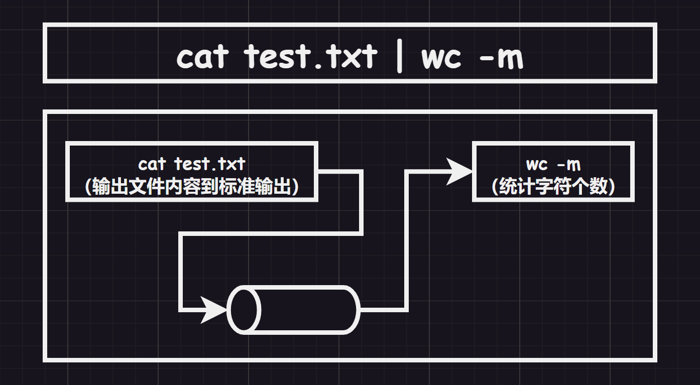
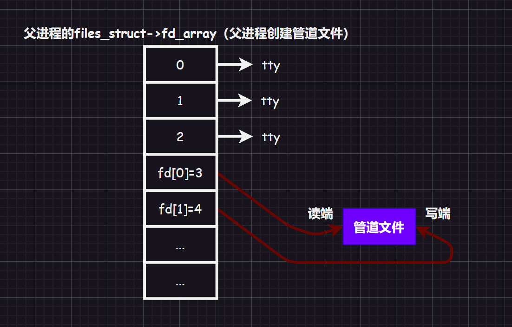
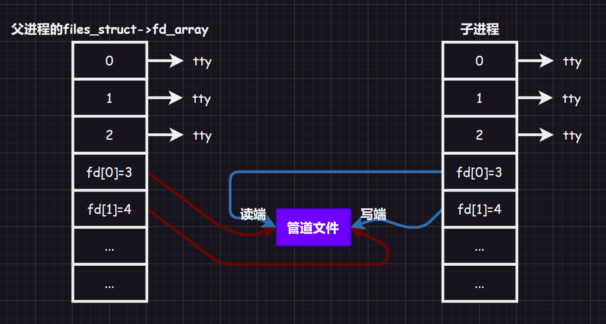
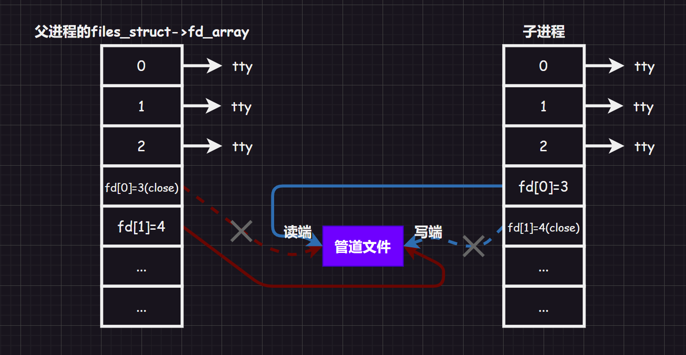
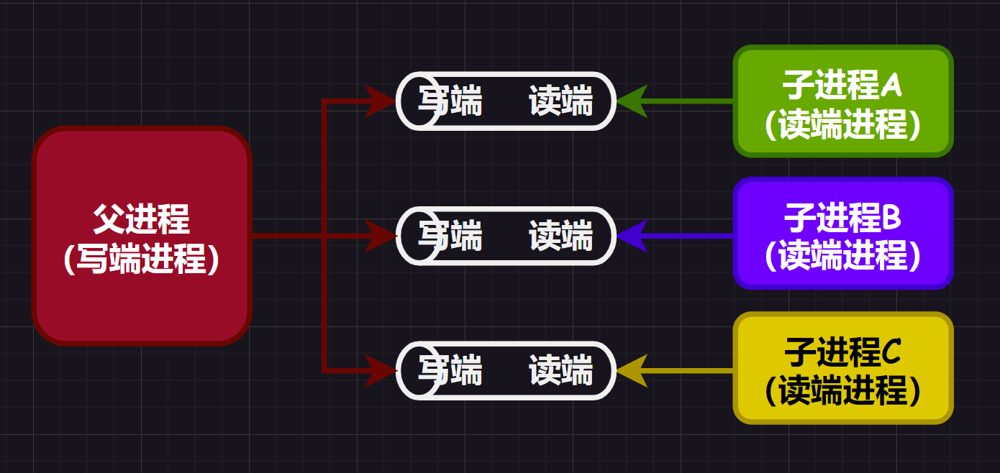

>   前要：本节内容主要是管道和共享内存块，而且我们需要明白我们所讲的进程通信本质是为了在内存中传递数据（看到同一份资源）。
>
>   而实际上，我们也可以通过磁盘传递数据，但是为什么不这么做呢？很简单，内存的 `IO` 速度比磁盘的 `IO` 速度快，能够在内存中读取，为什么还要把数据刷新到磁盘中再次读取呢？
>
>   这种数据的传递，我们更愿意称为流的传递。

# 1.进程通信

## 1.1.进程通信目的

进程间通信（`IPC`）的目的在于：

1.   **数据传输**：将进程的数据发送给另一个进程
2.   **资源共享**：多个进程之间共享某种资源
3.   **通知事件**：一个进程需要向另一个进程或者一组进程发送消息，通知发生了某种事件（如：进程终止时要通知父进程）
4.   **进程控制**：有些进程希望完全控制另一个进程的执行（如：`Debug` 进程），此时控制进程希望能够拦截另一个进程的所有陷入和异常，并能够及时知道它的状态改变。

由于进程是具有独立性的（具有各自的进程地址空间），因此两进程之间想要交互数据的难度比较大，需要有一个媒介（让不同的进程看到一个相同的资源），也就是看到同一份内存空间。利用同一份内存空间，进程间就可进行数据交互。

>   注意：进程间通信传输数据往往是比较容易理解的，但是进程间通信的意义不仅仅在于传输数据，更在于进程控制。

## 1.2.进程通信发展

进程之间的通信从古老的管道一直发展到 `System V` 进程通讯和 `POSIX` 进程间通信。


而如果根据标准，主要的 `IPC` 机制可以分为 `POSIX IPC` 和 `System V IPC` 两类。以下是基于标准的分类：

1.  **System V IPC：**
    *   `System V` 共享内存
    *   `System V` 消息队列
    *   `System V` 信号量
    *   `System V` 条件变量
2.  **POSIX IPC：**
    *   匿名管道、命名管道
    *   `POSIX IPC` 共享内存
    *   `POSIX IPC` 消息队列
    *   `POSIX IPC` 信号量
    *   `POSIX IPC` 条件变量
    *   互斥量、读写锁
    *   套接字

我们先来学习最为古老的管道，以此作为铺垫掌开其他的知识。

# 2.管道 IPC

管道的来源很早（但是并没有被 `Linux` 抛弃，相反使用得还挺多），源自于 `Unix` 中的进程通信。把“一个进程”连接到“另一个进程”的”一个数据流“称为”一个管道“。



管道是 `Linux` 中是原生提供的，作用很类似现实生活中的管道，都是进行“传输”的作用。不过这个管道 **只允许单向通行**（也叫“半双工”，这样设计比较简单，需要双向就创建两个管道文件即可，还有一叫通信方式叫做“全双工”通信），传送进程需要的资源。而为了保持进程之间的独立性，管道需要由操作系统（内核）来维护。

而管道本质是一个特殊文件，可以被多个进程以文件的形式被进程们看到，但是普通的文件有很大的区别。

由于多进程产生的数据大部分是临时数据，因此进程之间通过内存中的管道文件来通信是内存级别的通信，不会写入到磁盘（这样很低效）。

另外，管道一般用于本地主机中的进程间通信。

>   补充：该设计方案和现实中水管管道十分类似，就有了“管道”这一称呼。

## 2.1.匿名管道

### 2.1.1.匿名管道概念

创建匿名管道的接口描述：

```c++
//创建匿名管道接口的函数声明
#include <unistd.h>
int pipe(int fd[2]);
//fd 是用户传入的空数组，用来存储获得的文件描述符，f[0] 表示管道读端，f[1] 表示管道写端
//成功返回 0，失败返回错误代码
```

父进程先使用 `pipe()` 创建一个管道文件设置好读端和写端，这种管道文件是直接在父子进程之间创建的，具有匿名性（只局限在父子进程间通信），因此也被称为 **匿名管道**。



然后父进程再创建子进程子进程同样也设置好了读写端（需要注意子进程是独立的，因此也有自己的文件描述符表 `fd_array[]`，但是父进程内 `fd_array[]` 的数据会拷贝到子进程的 `fd_array[]`）。



然后构建单向通信信道，父进程写入，子进程读取，关闭对于进程无用的读端/写端（但是其实不关闭也是可以的，这里只是为了逻辑严谨和防御编程）。



这样两个进程就可以进行通信了。

也就是说，管道是通过：

1.   进程 `PCB` 在创建子进程的浅拷贝的操作
2.   对文件操作的复用

来达到看到同一份内存空间的目的...

>   补充：读取管道文件实际上就是拷贝文件的过程，但是被拷贝后的数据就被认定为无效，可以被后续的数据所覆盖，也就是变相被删除。

### 2.1.2.匿名管道应用

#### 2.1.2.1.父子进程读写交互

```cpp
//使用匿名管道（父进程读，子进程写）
#include <iostream>
#include <string>

#include <unistd.h>
#include <sys/types.h>
#include <sys/wait.h>

#include <cassert>
#include <cstdio>
#include <cstring>
#include <cstdlib>
#include <cerrno>

using namespace std;

int main()
{
    //1.创建管道
    int pipefd[2] = { 0 }; //这里的数组数据最后会被子进程拷贝了，所以子进程也看得到文件标识符
    int n = pipe(pipefd);
    assert(n != -1), (void)n; //检查管道是否创建成功，并且消除警告，由于这个返回值 n 只是检查是否成功，在 release 模式下 assert() 会失效，导致没人使用 n 从而引起报警，所以使用 void 强转一下
    
    //2.创建进程
    pid_t id = fork();
    assert(id != -1);
    
    //3.创建信道
    //3.1.子进程执行部分（子进程为写端）
    if (id == 0)
    {
        close(pipefd[0]); //关闭子进程读端
        char send_buffer[1024] = { 0 }; //自定义写缓冲区

        while (true)
        {
            //3.1.1.正常写入管道文件
            string message;
            cin >> message; //用户输入消息
            
            snprintf(send_buffer, sizeof(send_buffer), "%s", message.c_str()); //写到自定义的缓冲区中
            write(pipefd[1], send_buffer, strlen(send_buffer)); //写到管道文件中

            //3.1.2.关闭管道文件的写端
            if (message == "write_exit")
            {
                cout << "子进程关闭写端" << endl;
                close(pipefd[1]); //检测父进程提前关闭写端的现象
                break;
            }
        }
        
        exit(10);
    }

    //3.2.父进程执行部分（父进程为读段）
    close(pipefd[1]); //关闭父进程的写端
    char buffer[1024] = { 0 }; //自定义读缓冲区

    while (true)
    {
        //3.2.1.正常读取管道文件
        ssize_t s = read(pipefd[0], buffer, sizeof(buffer) - 1); //读取管道数据到自定义的缓冲区中
        if (s > 0)
        {
            sleep(3); //这个睡眠秒数在检验一些情况的时候可以稍微调整一下
            cout << "读取到的字符个数:" << s << endl;
            buffer[s] = 0; //添加 '\0' 因为系统调用不靠该字符结尾
            cout << "[" << getpid() << "]:Father get a message" << ", child sad:[" << buffer << "]" << endl;

            //3.1.2.关闭管道文件的读端
            if (strcmp(buffer, "read_exit") == 0)
            {
                cout << "父进程关闭读端" << endl;
                close(pipefd[0]);
                break;
            }
        }
        else if(s == 0)
        {
            cout << "子进程将写端关闭了，read() 直接返回:" << s << endl;
            break;
        }
        else
        {
            //todo...
        }
    }

    //4.等待和检测子进程信息
    int status = 0; //获取子进程信号
    pid_t ret = waitpid(id, &status, 0); //等待子进程
    assert(ret > 0), (void)ret; //检查和消除警告

    printf("I am father process, wait success, my pid: %d, sub pid: %d, exit code: %d, exit sig: %d\n"
        , getpid(), id, (status >> 8) & 0xFF, status & 0x7F);
    
    return 0;
}
```

>   注意：如果您对浅拷贝不够熟悉，您可能会对上述代码产生疑惑，附件进程传递数据时，为何不用一个全局的 `buffer[]` 呢？这样子进程直接拷贝父进程的数据，不就完成了通信么？
>
>   这样做肯定是不对的，因为有写时拷贝技术的存在，在进程中通信传输的数据并不是固定不变的（我们上述的代码就是不固定的，会根据用户不同的输入让父进程向匿名管道写入不同内容的数据，再让子进程进行读取），如果数据发生变化，就会导致发生写时拷贝，导致出现信息不一致性问题。

实际上，只要管道文件内有数据，读端进程就会一直读数据，只要管道文件内还有空间，写端进程就会一直写数据（注意匿名管道文件是有空间上限的）。

而使用匿名管道，其实就提供了访问控制的一种手段，操作系统在管道内做了关于互斥和同步的特殊处理，另外上述代码还可经过修改拿去检测其他的特殊情况：

-   **在匿名管道文件不为空也不为满时（用户正常输入）**，只要管道文件内有数据，读端进程就会一直读数据，只要管道文件内还有空间，写端进程就会一直写数据，输入长度和读写次数上没有严格的限制，靠用户自己设定

-   ###### **在匿名管道文件为空时（用户停止输入）**

    (1)`O_NONBLOCK` 禁用时，读端进程必须等待匿名管道文件被写入（阻塞状态），直到有数据可读为止

    (2)`O_NONBLOCK` 启用时，读端进程的 `read()` 调用将立即返回，返回值为 `-1`，同时设置 `errno` 为 `EAGAIN`，表示非阻塞且当前没有数据可读（等学了信号后可以试一试）

-   **而匿名管道文件写满时（用户输入过多）**

    (1)`O_NONBLOCK` 禁用时，写端进程必须等待匿名管道文件被读取（阻塞状态），直到有空间可写为止

    (2)`O_NONBLOCK` 启用时，写端进程的 `write()` 调用将立即返回，返回值为 `-1`，同时设置 `errno` 为 `EAGAIN`，表示非阻塞且当前没有空间可写（等学了信号后可以试一试）
    
-   **当写端被关闭时（用户输入 `write_exit`）**，读端进程读完剩余的数据后，还使用 `read()` 就会直接返回 `0`（除了使用 `close()` 关闭，写端进程退出后也会自动关闭对应的描述符）

-   **当读端被关闭时（用户输入 `read_exit`）**，如果写端进程依旧使用 `write()` 会产生信号 `SIGPIPE`，进而导致整个写端进程退出（除了使用 `close()` 关闭，读端进程退出后也会自动关闭对应的描述符）（对于操作系统来说，读端退出了写端的写入将不会有意义）

-   **当写端进程和读端进程同时结束时**，管道文件就被自动释放，无需用户管理，也就是匿名管道文件的生命周期随进程结束（匿名管道文件引用计数为 `0`）。

另外，这里还补充一个点，也没有一种可能，读取管道文件的速度太慢，而写入管道文件的速度太快，在使用 `write()` 调用时，会不会出现写入和不符合字节要求的数据呢（多余的字节写不进去）？这是有可能的，但是 `Linux` 保证只要写入的数据字节小于 `PIPE_BUF`（具体多大由实际的系统决定），就可以保证写入操作具有原子性（要么不写，要么写完，原子的概念后续还会提及）。

>   补充：这里的 `O_NONBLOCK` 其实是 `open()` 的 `flags` 参数的一个可选项，而匿名管道可以通过 `fcntl()` 对相应的文件描述符进行设置。
>
>   ```cpp
>   //fcntl() 接口声明
>   #include <fcntl.h>
>   int fcntl(int fd, int cmd, ... /* arg */);
>   
>   //int flags = fcntl(fd, F_GETFL, 0);
>   //flags |= O_NONBLOCK;
>   //fcntl(fd, F_SETFL, flags)
>   ```

您还可以去尝试一下设置了 `O_NONBLOCK` 的情况，待补充...

#### 2.1.2.2.多进程下的进程池



如果父进程和多个子进程有管道的连接，这些子进程也被称为“进程池 [^注释 1]:”（和内存池有些类似），我们可以写一个类似这样的代码。

>   注意：我们之前的代码例子中写端是子进程，读端是父进程。而下面写的进程池则反过来，写端是父进程，读端是子进程。

```cpp
//尝试编写一个简单的进程池
#include <iostream>
#include <string>
#include <vector>
#include <unordered_map>
#include <functional>

#include <unistd.h>
#include <sys/types.h>
#include <sys/wait.h>

#include <cassert>
#include <cstdio>
#include <cstring>
#include <cstdlib>
#include <ctime>

using namespace std;

const int PROCESS_NUM = 5; //进程池中子进程的数量

//等待读取函数
int waitCommand(int waitFd, bool& quit);

//使用包装类定义一个调用类型（可以使用函数指针），指向的调用对象是各个任务
//查询数据
void readSQL();
//解析地址
void execuleUrl();
//加密任务
void cal();
//数学计算
void mathCalculate();

//包装类对象
typedef function<void()> func_t;
vector<func_t> callbacks; //存储若干回调函数的顺序表

void load();              //填充若干调用
void show();              //查看任务名称
int handlerSize();        //查看任务数量
void sendAndWakeup(       //布置一个任务（父进程通过管道布置任务）
    pid_t who, //子进程 pid
    int fd, //管道文件标识符
    int command //命令字符串
); 

//处理主逻辑
unordered_map<int, string> desc; //创建哈希表
int main()
{
    //1.装载任务
    load();

    //2.构造进程池，让管道文件和子进程一一对应
    vector<pair<pid_t, int>> slots;
    
    for (int i = 0; i < PROCESS_NUM; i++)
    {
        //1.1.创建管道
        int pipefd[2] = {0};
        int n = pipe(pipefd); assert(n >= 0), (void)n;

        //1.2.创建进程
        pid_t id = fork(); assert(id != -1);

        //1.2.1.子进程部分
        if (id == 0)
        {
            close(pipefd[1]); //关闭子进程的管道文件写端，子进程读取父进程的命令
            while (true)
            {
                bool quit = false;
                int command = waitCommand(pipefd[0], quit); //如果父进程不写就进入阻塞，如果父进程关闭了写段就会设置 quit=false
                if (quit)
                {
                    break;
                }
                
                if (command >= 0 && command < handlerSize())
                {
                    callbacks[command](); //调用对应的方法
                }
                else
                {
                    cout << "error command:" << command << endl; //报错
                }
            }

            exit(10); //设置子进程退出码
        }

        //1.2.2.父进程部分
        close(pipefd[0]); //关闭父进程的读端，由父进程进行写入管道，通知其他进程
        slots.push_back(pair<pid_t, int>(id, pipefd[1])); //子进程 id 和各管道写标识符建立键值对，调用哪一个进程就可以找到其对应的管道文件
    }

    //3.父进程派发任务（这就相当于单机版的负载均衡）
    srand(((unsigned long)time(nullptr)) ^ getpid() ^ 114514L); //获取随机数（这里做了一些数据操作，让数据源更加随机）
    while (true)
    {
        //3.1.打印 UI 界面
        int n = 0;
        int command = 0;
        cout << "--------------------------------" << endl;
        cout << "1.show functions  2.send command" << endl;
        cout << "3.quit the program              " << endl;
        cout << "--------------------------------" << endl;
        cout << "<Please Select>:";

        //3.2.用户进行命令输入
        cin >> n;
        if (n == 1)
        {
            show();
        }
        else if (n == 2)
        {
            show();
            cout << "<Enter Your Command>:";
            //选择任务
            cin >> command;
            //随机选择进程
            int choice = rand() % slots.size();
            //布置任务
            sendAndWakeup(slots[choice].first, slots[choice].second, command); //传递子进程 id 和对应的管道文件 fd，还有参数 command 用来决定该进程执行哪一些任务
        }
        else if(n == 3)
        {
            cout << "This code has exited!" << endl;
            goto BREAK;
        }            
        else
        {
            assert(false); //断死其他的意外情况，供开发者调试使用
        }
    }

BREAK:
    //4.关闭管道 fd（其实可以不关），等待回收所有子进程，并且获取子进程的退出码和信号
    for (const auto slot : slots)
    {
        close(slot.second); //父进程关闭掉所有的写端
    }
    for (const auto& solt : slots)
    {
        int status = 0;
        waitpid(solt.first, &status, WUNTRACED); //父进程阻塞回收所有子进程信息
        cout << "sub exit code:" << WEXITSTATUS(status) << ", sub signal:" << WTERMSIG(status) << endl;
    }

    return 0;
}

void load()
{
    //注意 callbacks 会随着插入为变大
    desc.insert({ callbacks.size(), "readSQL-读取数据库" });
    callbacks.push_back(readSQL);

    desc.insert({callbacks.size(), "execuleUrl-解析URL"});
    callbacks.push_back(execuleUrl);

    desc.insert({callbacks.size(), "cal-加密"});
    callbacks.push_back(cal);

    desc.insert({callbacks.size(), "mathCalculate-数学计算"});
    callbacks.push_back(mathCalculate);
}

int handlerSize()
{
    /* 返回任务数量 */
    return callbacks.size();
}

void sendAndWakeup(pid_t who, int fd, int command)
{
    write(fd, &command, sizeof(command)); //向管道输入指定的任务

    cout << "call process:" << who //指定某子进程
        << ", execute:" << desc[command] //执行某任务
        << ", through:" << fd //直通某管道
        << endl;
}

void show()
{
    /* 查看可执行的任务列表 */
    for(const auto &iter : desc)
    {
        cout << iter.first << "\t" << iter.second << endl;
    }
}

int waitCommand(int waitFd, bool& quit) //注意 quit 是引用参数
{
    int command = 0; //四字节缓冲区
    ssize_t s = read(waitFd, &command, sizeof(command)); //从读端读给 command
    if(s == 0) //如果 s 为 0，则说明父进程已经关闭了写段，此时就应该停止后续的代码
    {
        quit = true;
        return -1;
    }
    return command;
}

void readSQL()
{
    sleep(3);
    cout << "process[" << getgid() << "] 执行了访问数据库的任务" << endl;
}
void execuleUrl()
{
    sleep(3);
    cout << "process[" << getgid() << "] 执行了解析URL地址的任务" << endl;
}
void cal()
{
    sleep(3);
    cout << "process[" << getgid() << "] 执行了加密的任务" << endl;
}
void mathCalculate()
{
    sleep(3);
    cout << "process[" << getgid() << "] 执行了数学计算的任务" << endl;
}
```

但是上述代码是有一个隐藏 `bug` 的，待补充...

也可以尝试修改为 `C++` 风格的代码：

```cpp
//待补充...
```

>   补充：管道文件设置还可以充当一个缓冲队列，在上述进程池中，如果子进程任务较忙，父进程可以像使用队列一样安排任务进管道文件中，等子进程忙完再来读取（整个过程都遵循先进先出的规则）。

#### 2.1.2.3.系统管道符号模拟

我们还可以进一步理解 `|` 这个符号的内部原理，您可以先在命令行中输入以指令 `sleep 10000 | sleep 20000 | sleep 30000`，然后打开另外一个会画，使用指令 `ps -axj | head -1 && ps axj | grep sleep` 查看这三个 `sleep` 进程的 `pid` 关系：

```shell
# 查看管道指令背后启动的进程及信息
$ ps -axj | head -1 && ps axj| grep sleep
 PPID   PID  PGID   SID TTY      TPGID STAT   UID   TIME COMMAND
14608 27551 27551 14608 pts/16   27551 S+    1001   0:00 sleep 10000
14608 27552 27551 14608 pts/16   27551 S+    1001   0:00 sleep 20000
14608 27553 27551 14608 pts/16   27551 S+    1001   0:00 sleep 30000
```

我们可以发现，三个进程的 `PPID` 都是同一个（实际上就是 `bash`），这意味着管道符号中运行的进程之间是具有血缘关系的兄弟进程。


我们可以大致推断出，管道命令是先通过父进程进行命令分割，解析出有多少管道符号就创建多少个匿名管道文件，并且创建相应的子进程，而每个进程都可以看到这些匿名管道文件。

然后再将多个子进程和多个匿名管道文件之间建立信道，而每一个子进程按照顺序执行自己的代码，执行结果被重定向到通向下一个兄弟进程的信道写端中，就可以达到通信的目的。

我们可以在之前实现的 `MyShell` 中添加这部分的代码，待补充...

>   补充：上述管道命令的操作意义如下
>
>   ```bash
>   ps -axj | head -1 && ps axj | grep sleep
>   ```
>
>   1. `ps -axj | head -1`：显示所有进程的详细信息，然后使用 `head -1` 只显示第一行，即显示表头信息
>
>   2. `&&`：逻辑运算符，表示前一个命令成功执行后才执行下一个命令
>
>   3. `ps axj | grep sleep`：再次显示所有进程的详细信息，然后使用 `grep sleep` 过滤出包含关键词 `"sleep"` 的行，显示这些符合条件的进程信息
>
>   整个命令的目的是先显示进程列表的表头，然后过滤并显示包含关键词 "sleep" 的进程信息。

### 2.1.3.匿名管道特点

而总结起来的话，匿名管道的特点如下：

1.   **匿名管道仅能近亲通信**：匿名管道只能用于具有共同祖先的进程（具有亲缘关系的进程）之间进行通信，通常一个匿名管道由一个父进程创建（兄弟进程之间也可以直接通过匿名管道直接通信）
2.   **匿名管道提供流式服务**：匿名管道可以用来在两个进程之间建立一个 **单向的、顺序的、字节流** 的通信通道（传递的是字节流，而不是消息边界，这使得匿名管道适用于传递连续的数据流，但不保证消息的完整性）
3.   **匿名管道可以自动释放**：匿名管道一般父子进程都退出时，管道就会被释放，所以管道的生命周期随进程
4.   **匿名管道支持同步互斥**：内核会自动对管道操作进行同步与互斥工作（无需我们加锁，加锁的问题我们以后再谈）
5.   **匿名管道具有半双工性**：匿名管道是半双工的，数据只能向一个方向流动，若是需要双向通信时（全双工），就需要建立起两个管道（也算是代码的一种复用）

>   补充：消息边界是指在进程间通信（`IPC`）中，消息的起始和结束位置。消息边界是用来区分不同消息的标志。在某些通信机制中，消息是以边界为单位进行传递的，即一个完整的消息从开始到结束是一个独立的单元。
>
>   有两种主要的通信模型：流模型和消息模型。
>
>   1.  **流模型**：流模型是一种基于字节流的通信方式，数据以连续的字节流形式传递，没有消息边界的概念。在流模型中，发送方不会将消息的边界明确传递给接收方，而是将数据连续地写入流，接收方需要自己解析数据以还原消息的边界，特别适用于需要实时传递数据的场景，并且实现相对简单。
>   2.  **消息模型**：消息模型是一种基于消息为单位的通信方式，消息在传递过程中是独立的单元，有明确的起始和结束。在消息模型中，发送方将消息作为一个整体发送，接收方可以按照消息边界来接收和处理消息。
>
>   而我们学的匿名管道就是基于流模型的，也就是一种流服务方案。

### 2.1.4.匿名管道大小

我们可以测试一下匿名管道的大小（我的机器下差不多是 `655356Byte` ，也就是 `64KB` ），当然，我们也可以使用 `ulimit -a` 指令来查看匿名管道的大小。

```shell
# 使用 ulimit 指令
$ ulimit -a
core file size          (blocks, -c) 0
data seg size           (kbytes, -d) unlimited
scheduling priority             (-e) 0
file size               (blocks, -f) unlimited
pending signals                 (-i) 7902
max locked memory       (kbytes, -l) unlimited
max memory size         (kbytes, -m) unlimited
open files                      (-n) 100002
pipe size            (512 bytes, -p) 8
POSIX message queues     (bytes, -q) 819200
real-time priority              (-r) 0
stack size              (kbytes, -s) 8192
cpu time               (seconds, -t) unlimited
max user processes              (-u) 7902
virtual memory          (kbytes, -v) unlimited
file locks                      (-x) unlimited
```

## 2.2.有名管道

### 2.2.1.有名管道概念

上面的匿名管道只是匿名的内存级文件，只能用于父子进程间通行，没有办法用在无血缘关系的进程之间通信。但实际上，即便是两个无血缘关系的进程，其通信原理也是让两个进程看到同一份内存空间，这种方式就是 **有名管道**。

`Linux` 内有一种文件很特殊，存储在磁盘上，有自己的路径和名字，可以被打开（载入内存中），但是永远不会把存储到内存中的数据刷新到磁盘中，双方进程就可以通过该管道文件的路径查看到同一份资源。

创建有名管道文件的命令行指令为 `mkfifo <filename>`，创建出来后使用 `ls` 可以查看到该文件的标志为 `p` （即：管道文件），或者也可以使用系统接口来创建有名管道。

```cpp
//创建有名管道接口的函数声明
#include <sys/types.h>
#include <sys/stat.h>
int mkfifo(const char* filename, mode_t mode);
```

我们可以尝试做有名管道的命令操作：

```bash
# 第一个 bash 窗口
$ pwd
/limou/file

$ mkfifo pipe # 创建有名管道，名字为 pipe

$ ll
total 0
prw-rw-r-- 1 limou limou 0 Oct  7 12:52 pipe
    
$ echo "hello" > pipe # 输入数据
```

```bash
# 第二个 bash 窗口
$ pwd
/limou

$ cat < ./file/pipe # 获取数据
hello
```

>   补充：有名管道除了有名，导致可以被其他进程看到，其他特性几乎和匿名管道几乎是一样的。并且使用 `open()` 如果没有同时打开写端和读端，就会进入阻塞状态...

### 2.2.2.有名管道应用

#### 2.2.2.1.服务端客户端通信

```cpp
//头文件 comm.hpp
#ifndef _COMM_H_
#define _COMM_H_

    #include <iostream>
    #include <string>

    #include <sys/types.h>
    #include <sys/stat.h>
    #include <fcntl.h>
    #include <unistd.h>

    #include <cstdio>
    #include <cstring>
    using namespace std;

    const string ipcPath = "./.fifo.ipc"; //管道文件路径（默认设置为隐藏文件）
    #define MOOD 0666 //设置管道文件初始权限
    #define SIZE 128 //设置缓冲大小

#endif
```

```cpp
//服务端 server.cc 负责读取
#include "comm.hpp"
int main()
{
    //1.创建管道文件
    if(mkfifo(ipcPath.c_str(), MOOD) < 0)
    {
        perror("mkfifo() wrong!");
        exit(1);
    }

    //2.通信读取过程
    int fd = open(ipcPath.c_str(), O_RDONLY);
    if(fd < 0)
    {
        perror("open() wrong!");
        exit(2);
    }
    
    char buffer[SIZE];
    while(SIZE)
    {
        memset(buffer, '\0', sizeof(buffer)); //初始化
        ssize_t s = read(fd, buffer, sizeof(buffer) - 1); //读取的时候注定得不到 '\0' 但是我们使用的是 C 代码，读取字符串后一定要保证最后一位是 '\0'，但是上面的初始化保证了这一操作
        if(s > 0) //读取成功
        {
            cout << "client say: " << buffer << endl;
            if (strcmp(buffer, "exit") == 0)
            {
                break;
            }
        }
        else if(s == 0) //子进程关闭了，没有写端
        {
            cerr << "read end of file!" << endl;
            break;
        }
        else //出现错误
        {
            perror("read() wrong!");
        }
    }

    //4.关闭管道文件
    close(fd);

    //5.删除管道文件
    unlink(ipcPath.c_str());

    return 0;
}
```

```cpp
//客户端 client.cc 负责写入
#include "comm.hpp"
int main()
{
    //1.获取管道文件
    int fd = open(ipcPath.c_str(), O_WRONLY);
    if(fd < 0)
    {
        perror("open() wrong!");
        exit(1);
    }

    //2.通信写入过程
    string buffer;
    while(true)
    {
        cout << "please enter message line:" << endl;
        getline(cin, buffer); //获取整行的字符串
        ssize_t s = write(fd, buffer.c_str(), buffer.size()); //写入有名管道文件中（没有写入 '\0'）
        if (s < 0)
        {
            perror("write() error!");
            break;
        }
        if (strcmp(buffer.c_str(), "exit") == 0)
        {
            break;
        }
    }

    //3.关闭管道文件
    close(fd);
    return 0;
}
```

```makefile
# makefile 文件
.PHONY: all
all: client server
client: client.cc
	g++ -o $@ $^ -std=c++11
server: server.cc
	g++ -o $@ $^ -std=c++11

.PHONY: clean
clean:
	rm -f client server
```

#### 2.2.2.2.命名管道文件拷贝

可以利用命名管道来实现文件拷贝...

# 3.System V IPC

`System V`（通常缩写为 `SysV`）是一个 `Unix` 操作系统的家族，以及相应的一系列标准和版本。`System V` 操作系统最初由 `AT&T`（美国电话电报公司）开发，后来成为 `UNIX` 操作系统的主要分支之一。`SysV` 在 `Unix` 的发展历史中发挥了重要作用，特别是在 `20` 世纪 `80` 年代和 `90` 年代。

以下是 `System V` 的主要特征和方面：

1. **标准和规范：** `System V` 引入了一系列标准和规范，以定义操作系统的行为和接口。其中最著名的是 `System V Interface Definition`（`SVID`），该定义在一定程度上规范了 `System V` 操作系统的 `API` 和用户界面

2. **进程管理：** `System V` 引入了一些新的进程管理概念，如 `init` 进程，以及使用 `init.d` 目录中的脚本启动和停止系统服务

3. **IPC（进程间通信）：** `System V` 提供了一套 `IPC` 机制，包括消息队列、信号量和共享内存，用于进程之间的通信

4. **文件系统布局：** `System V` 规定了一些文件系统的布局和目录结构，包括 `/etc` 和 `/var` 等

5. **系统初始化：** `System V` 引入了系统初始化过程的一些标准，如运行级别（`runlevels`）的概念，用于指定系统启动时运行的服务和进程。

6. **系统调用：** `System V` 操作系统有一套特定的系统调用，提供对底层系统功能的访问

值得注意的是，虽然 `System V` 是一个 `Unix` 操作系统家族，但在 `Unix` 历史上有其他分支和变种，如 `BSD（Berkeley Software Distribution）` 和其他商业版本。在某些情况下，不同的 `Unix` 版本可能采用了不同的设计和实现，导致了 `Unix` 家族的多样性。

## 3.1.共享内存原理

`System V` 共享内存是 `System V IPC` [^注释 2]（进程间通信）机制的一部分（我们也只提及这一部分的内容），用于在不同进程之间共享内存段。

`System V` 共享内存一般偏向于本地服务器通信，但是用得较少，最大的原因是接口风格不太统一，以及其他方案的优越性...

我们主要理解 `System V` 中共享内存的原理。不得不承认的是，共享内存通信是较快的 `IPC` 形式。在每个进程的进程地址空间的共享区中，都映射到同一份内存空间中，那么这些进程间的数据传递就不再涉及到内核（或者说：不再需要通过执行系统调用来传递彼此的数据），直接就可以在内存中进行数据交互。

在进程地址空间中，每一个进程的共享区在堆栈空间之间。

而共享区映射的共享内存块是操作系统提供的，不单独属于某一个进程，因此共享内存也不需要某一个进程单独维护，而是交给操作系统维护。此时操作系统就应该对共享区进行管理，要管理就要先对其进行描述，该描述就包含了共享内存的属性：

```cpp
//共享内存区 shmid_ds 的结构描述以及内部结构 ipc_perm 的描述
# include <sys/ipc.h>
# include <sys/shm.h>
/* Obsolete, used only for backwards compatibility and libc5 compiles */
struct shmid_ds {
	struct ipc_perm		shm_perm;	/* 操作权限 */
	int			shm_segsz;	/* 段大小，或者说共享内存的大小 (字节) */
	__kernel_old_time_t	shm_atime;	/* 最后一次附加时间 */
	__kernel_old_time_t	shm_dtime;	/* 最后一次分离时间 */
	__kernel_old_time_t	shm_ctime;	/* 最后一次变更时间 */
	__kernel_ipc_pid_t	shm_cpid;	/* 创建者的的进程ID */
	__kernel_ipc_pid_t	shm_lpid;	/* 最后一个操作者的进程ID */
	unsigned short		shm_nattch;	/* 当前共享内存的挂接数 */
	unsigned short 		shm_unused;	/* 兼容性 */
	void 			*shm_unused2;	/* 未使用的字段 - 由DIPC使用 */
	void			*shm_unused3;	/* 未使用的字段 */
};

struct ipc_perm
  {
    __key_t __key;			/* 在创建共享内存是提供的 key */
    __uid_t uid;			/* Owner's user ID.  */
    __gid_t gid;			/* Owner's group ID.  */
    __uid_t cuid;			/* Creator's user ID.  */
    __gid_t cgid;			/* Creator's group ID.  */
    unsigned short int mode;		/* Read/write permission.  */
    unsigned short int __pad1;
    unsigned short int __seq;		/* Sequence number.  */
    unsigned short int __pad2;
    __syscall_ulong_t __unused1;
    __syscall_ulong_t __unused2;
  };
```

>   注意：在本文中，我使用共享区描述进程地址空间内的共享区，使用共享内存块描述内存内部被多个进程共用的内存空间。

也就是说： **共享区 = 共享内存块 + 对应共享内存的内核数据结构** ，一旦需要使用共享内存时，操作系统先根据上述数据结构申请共享内存块，然后将共享内存交给每个进程中的进程地址空间的共享区映射。

而进程和内存之间的页表就负责将共享块和共享内存块关联起来，这个原理和我们之前在“文件 `IO`”中提到的动态库原理是类似的（甚至可以说是一样的）。

## 3.2.共享内存接口

### 3.2.1.共享内存创建

而创建共享内存的接口是：

```cpp
//共享内存创建接口
#include <sys/ipc.h>
#include <sys/shm.h>
int shmget(key_t key, size_t size, int shmflg);

//1.key 是共享内存使用的键值，使用同一个 key 的进程就可以看到同一个共享内存，key 可以使用 ftok() 来创建，只有系统才可以直接知道其具体值，用户只需要给使用同一个参数交给 ftok() 即可
//2.size 是需要用用到的共享内存的大小
//3.shmflg 是操作标记为，主要使用两个选项：
	//(1)IPC_CREAT(创建新的共享内存)
	//(2)IPC_EXCL(创建新的共享内存时若已存在则返回错误，一般不会单独使用，单独使用没有太大意义，会和 IPC_CREAT 共用，保证共享内存是全新的)

//返回值是共享内存的用户层标识符 shmid，类似 fd，虽然有区别，但也是提供给用户操作的（操作共享内存的标识符）
```

>   补充：`key` 和 `shmid` 的区别
>
>   -   `shmget()` 中设置的 `key` 是内核级别的共享内存 `ID`，供系统使用（不会在编码应用中出现）
>   -   `shmget()` 返回的 `shmid` 是用户层的共享内存 `ID`，供用户结合接口来使用
>
>   这也就是为什么需要使用 `ftok()` 来获取 `key` 的原因，用户自己随机写的 `kye` 有可能和现有的、已创建好的共享内存冲突。
>
>   `ftok()` 实际上只是一个算法函数，会根据任意给出的“路径字符串”和“一串数字”制作出一个唯一的 `key`，避免和其他的 `key` 出现冲突，其返回值通常以十六进制表示。
>
>   ```cpp
>   key_t ftok(const char *pathname, int proj_id);
>   ```
>
>   使用路径可以标定和其他路径的项目的区别，使用数字可以标定同路径下其他项目的区别。

共享内存的大小最好是页 `(PAGE:4096)` 的整数倍，若不是的话问题也不大，因为操作系统申请共享内存是按页的倍数申请的，非整数倍有可能造成共享内存空间的浪费（多一些总比少一些好），系统申请的是页的倍数，但是允许用户用的空间是用户指定的大小。

共享内存创建完后可以在命令行中使用 `ipcs -m` 查看其属性（`key` 值、`shmid` 值、`owner` 所有者、`perms` 权限、`bytes` 空间大小、`nattch` 挂接进程个数、`status` 共享内存状态）。

该接口也可以作为获取共享内存来使用，即使用 `shmget(key, shm_size, IPC_CREAT)` 可以获取一个已经存在的共享内存。

>   补充：操作系统在本系统的全局范围内生成一个随机数作为内存块的唯一标识不也可以么？为什么 `key` 需要由用户来创建呢？这是因为，如果 `key` 是系统生成了，那么就只有获取 `key` 的进程和系统可以看到，如果想要共享 `key` 给其他进程就会变得不可能。让用户确定 `key` 的目的就是为了让多个进程看到系统中同一份共享内存，进而完成通信...

### 3.2.2.共享内存销毁

共享内存不会随进程结束销毁，在命令行中可以对所有共享内存快使用 `ipcrm -m <shmid>` 进行释放。也就是说，共享内存块的生命周期随内核（除非重启才会自动释放），我们也可使用接口 `shmctl()` 来提前释放共享内存，注意两者都是使用 `shmid` 来销毁，而不是 `key`。

```cpp
//共享内存销毁接口
#include <sys/ipc.h>
#include <sys/shm.h>
int shmctl(int shmid, int cmd, struct shmid_ds* buf);

//1.shmid 是使用 shmget() 创建共享内存后返回的 id 值
//2.cmd 是对共享内存做不同的操作方案，常用的有：
	//(1)IPC_STAT：获取共享内存的属性
	//(2)IPC_SET：设置共享内存的属性
	//(3)IPC_RMID：标志共享内存是要被释放的
//3.buf 是共享内存对应的数据结构，如果只需要释放共享内存设置为 nullptr 即可，本身是用来交给用户查看或者自定义共享内存属性的，用户如果想要查看已申请的共享内存属性，只需要设置字段 int 为 IPC_STAT，然后将一个空的 shmid_ds 结构体变量的指针传入，然后就可以通过该变量得到共享内存的属性...

//失败返回 -1，成功返回 0 
```

>   补充：实际上该调用更为准确来说是用来控制共享内存的，销毁只不过是控制共享内存中的其中一个控制方法罢了，因此该接口本身就可以实现很多命令行下关于共享内存的指令（下面代码请您在熟悉后续关于共享内存的接口后再来理解）...
>
>   ```cpp
>   //获取共享内存属性
>   #include <iostream>
>   #include <string>
>   
>   #include <cstdlib>
>   
>   #include <sys/types.h>
>   #include <sys/stat.h>
>   #include <sys/ipc.h>
>   #include <sys/shm.h>
>   #include <unistd.h>
>   #include <fcntl.h>
>   
>   #define PATH_NAME "/home/ljp" //路径名
>   #define PROJ_ID 0x666 //项目 ID（用于创建 key）
>   #define SHM_SIZE 4096 //共享内存大小
>   
>   const string ipcPath = "./.fifo.ipc"; //管道文件路径（默认设置为隐藏文件）
>   
>   using namespace std;
>   
>   key_t GetKey()
>   {
>       return ftok(PATH_NAME, PROJ_ID);
>   }
>   
>   class ShmInit
>   {
>   public:
>       ShmInit()
>       {
>           //1.创建共同的 key
>           key_t k = GetKey();
>           cout << "申请 key 值:" << hex << k << dec << endl;
>           //2.创建共享内存
>           _shmid = shmget(k, SHM_SIZE, IPC_CREAT | IPC_EXCL | 0666); //最后的 0666 是设置共享内存的权限，这和文件权限类似
>           cout << "申请大小:" << SHM_SIZE << endl;
>           //3.服务端挂接共享内存
>           _shmaddr = (char*)shmat(_shmid, nullptr, 0);
>       }
>   
>       ~ShmInit()
>       {
>           //4.断接共享内存（从自己的地址空间中移除）
>           shmdt(_shmaddr);
>           //5.释放共享内存
>           shmctl(_shmid, IPC_RMID, nullptr); //这里的 IPC_RMID 很霸道，无论有多少个进程和共享内存挂接都会释放共享内存
>       }
>       
>   public:
>       int _shmid;
>       char* _shmaddr;
>   };
>   
>   
>   int main()
>   {
>       ShmInit shm;
>       struct shmid_ds ds { 0 };
>       if (shmctl(shm._shmid, IPC_STAT, &ds) == -1)
>       {
>           cerr << "获取共享内存段信息时出错。" << endl;
>           // 处理错误，可能抛出异常或退出
>       }
>   
>       cout << "共享内存 key 值:" << hex << ds.shm_perm.__key << dec << endl;
>       cout << "共享内存挂接数:" << ds.shm_nattch << endl;
>       cout << "共享内存大小:" << ds.shm_segsz << endl;
>   
>       sleep(6);
>           
>       return 0;
>   }
>   ```

### 3.2.3.共享内存挂接

而申请成功后还需要建立共享内存和进程之间的映射关系，也就是使用接口 `shmat()`，如果需要取消这个映射就使用 `shmdt()`，其中 `at` 是指 `attach` 即“贴上”的意思。

```cpp
//共享内存挂接接口
#include <sys/ipc.h>
#include <sys/shm.h>

void* shmat(int shmid, const void* shmaddr, int shmflg);

//1.shmid 就是使用 shmget() 得到的 shmid
//2.shmaddr 将共享内存挂接到确定的虚拟地址，但是不推荐使用，除非有特殊用途，设为 nullptr 让操作系统自己去操作即可
//3.shmflg 就是挂接的方式，例如：只读等，这里我们只使用 0，即默认情况

//挂接成功返回挂接成功后共享内存的虚拟地址，失败则返回 -1，该接口还挺像 malloc() 的，因此使用共享内存只需要像使用堆空间一样，使用返回的虚拟地址即可（返回的共享内存地址是起始的虚拟地址，而其空间大小是我们一开始就设定好的，因此我们可以通过偏移量访问共享内存内每一块地址）
```

而使用 `ipcs -m` 还可以看到共享内存的 `nattach` 映射个数（和进程的连接个数）。

### 3.2.4.共享内存断接

```cpp
//共享内存断接接口
#include <sys/ipc.h>
#include <sys/shm.h>
int shmdt(const void* shmaddr);
//除去挂载，成功则返回 0，失败返回 -1
```

## 3.3.共享内存应用

共享内存是属于用户空间，而不是内核空间。双方进程如果需要通信，直接就可以进行内存级的读写即可。而我们之前学的 `pipe` 和 `fifo` 都需要通过系统接口 `read()` 和 `write()` 来进行通信，这是因为文件是内核级别结构。

而共享内存是在用户空间堆栈之间的，可以直接使用，无需使用任何接口。因此共享内存的通信是所有的 `IPC` 中速度最快的，所能提供系统空间较大的。

```cpp
//comm.hpp
#pragma once

#include <iostream>
#include <string>

#include <cstdio>
#include <cassert>
#include <cstring>

#include <sys/types.h>
#include <sys/ipc.h>
#include <sys/shm.h>
#include <unistd.h>

#define PATH_NAME "/home/ljp" //路径名
#define PROJ_ID 0x666 //项目 ID（用于创建 key）
#define SHM_SIZE 4096 //共享内存大小

using namespace std;
```

```cpp
//shmServer.cpp
#include "comm.hpp"

int main()
{
    //1.创建共同的 key
    key_t k = ftok(PATH_NAME, PROJ_ID); assert(k != -1);
    cout
        << hex << k << " " //使用 16 进制输出
        << dec << k //使用 10 进制输出
        << endl;

    //2.创建共享内存
    int shmid = shmget(k, SHM_SIZE, IPC_CREAT | IPC_EXCL | 0666); assert(shmid != -1); //最后的 0666 是设置共享内存的权限，这和文件权限类似
    
    //3.挂接共享内存
    char* shmaddr = (char*)shmat(shmid, nullptr, 0); assert(shmaddr != nullptr);

    //4.撰写通信逻辑
    while(true)   
    {
        cout << shmaddr << endl; //不断从共享内存中获取数据
        if (strcmp(shmaddr, "exit") == 0)
            break;
        sleep(1);
    }

    //5.断接共享内存（从自己的地址空间中移除）
    int n = shmdt(shmaddr); assert(n != -1); (void)n;

    //6.释放共享内存
    n = shmctl(shmid, IPC_RMID, nullptr); assert(n != -1); (void)n; //这里的IPC_RMID很霸道，无论有多少个进程和共享内存挂接都会释放共享内存
    
    return 0;
}
```

```cpp
//shmClient.cpp
#include "comm.hpp"
int main()
{
    //1.创建共同的key
    key_t k = ftok(PATH_NAME, PROJ_ID); assert(k != -1);
    cout
        << hex << k << " "//使用 16 进制输出
        << dec << k //使用 10 进制输出
        << endl;

    //2.获得共享内存
    int shmid = shmget(k, SHM_SIZE, IPC_CREAT); assert(shmid != -1);

    //3.挂接共享内存
    char* shmaddr = (char*)shmat(shmid, nullptr, 0); assert(shmaddr != nullptr); //很类似 malloc() 的使用

    //4.撰写通信逻辑（将共享内存当作一个存储 char 的数组）
    for(char a = 'a'; a <= 'z'; a++)
    {
        cin >> shmaddr;
        //或者使用 snprintf(shmaddr, SHM_SIZE - 1, "Hello, I am shmClient. My pid: %d, inc = %c\n", getpid(), a);
        if (strcmp(shmaddr, "exit") == 0)
            break;
        sleep(2);
    }

    //5.断接共享内存
    int n = shmdt(shmaddr); assert(n != 1);

    return 0;
}
```

```makefile
# makefile
.PHONY:all
all:shmClient shmServer

shmClient:shmClient.cpp
	g++ $^ -o $@ -std=c++11

shmServer:shmServer.cpp
	g++ $^ -o $@ -std=c++11

.PHONY:clean
clean:
	rm -f shmClient shmServer
```

>   补充：使用共享内存通信过程中，可以减少过多的数据拷贝（凡数据迁移基本就是数据拷贝，您可以大概数一数编写管道文件通信和共享内存通信发生的数据迁移，来大概得到数据拷贝的次数）。

## 3.4.共享内存缺点

需要注意的是，共享内存并不提供访问控制。也就是说：

1.   写入方无需理会对方是否已经读取，不会进入阻塞
2.   读取方无需理会对方是否已经写入，不会进入阻塞

这点在以后学习多进程、多线程和网络通信时，就可以深刻体会到。

共享内存本身缺乏访问控制，把所有数据直接裸露给所有共享的进程，导致只能程序员自己实现访问控制，进而可能引发多执行流访问公共资源的并发问题（数据不一致问题），使用共享内存时一定需要注意安全问题。

而我们可以利用匿名管道和父进程控制来达到访问控制的目的：

`````cpp
//comm.hpp(添加管道通信)
#pragma once

#include <iostream>
#include <string>

#include <cstdio>
#include <cstdlib>
#include <cassert>
#include <cstring>

#include <sys/types.h>
#include <sys/stat.h>
#include <sys/ipc.h>
#include <sys/shm.h>
#include <unistd.h>
#include <fcntl.h>

#define PATH_NAME "/home/ljp" //路径名
#define MOOD 0666 //设置管道文件初始权限
#define PROJ_ID 0x666 //项目 ID（用于创建 key）
#define SHM_SIZE 4096 //共享内存大小

const std::string ipcPath = "./.fifo.ipc"; //管道文件路径（默认设置为隐藏文件）

using namespace std;

bool MakeFifo()
{
    if(mkfifo(ipcPath.c_str(), MOOD) < 0)
    {
        perror("mkfifo() wrong!");
        return false;
    }

    return true;
}
`````

```cpp
//shmServer.cpp(添加管道通信)
#include "comm.hpp"

int main()
{
    //[创建管道文件]
    bool r = MakeFifo();
    if (!r)
        return -1;

    //1.创建共同的 key
    key_t k = ftok(PATH_NAME, PROJ_ID); assert(k != -1);
    cout
        << hex << k << " " //使用 16 进制输出
        << dec << k //使用 10 进制输出
        << endl;

    //2.创建共享内存
    int shmid = shmget(k, SHM_SIZE, IPC_CREAT | IPC_EXCL | 0666); assert(shmid != -1); //最后的 0666 是设置共享内存的权限，这和文件权限类似
    
    //3.服务端挂接共享内存
    char* shmaddr = (char*)shmat(shmid, nullptr, 0); assert(shmaddr != nullptr);

    //4.撰写通信逻辑
    int fd = open(ipcPath.c_str(), O_RDONLY); //[只读打开管道文件]
    while(true)   
    {
        //[等待管道文件内部有数据时，才会往共享内存的代码走，否则循环代码陷入阻塞]
        int code = 0;
        read(fd, &code, sizeof(code)); //[读取管道文件中，相当于读取到代表可以读取的信号]

        //不断从共享内存中获取数据
        cout << shmaddr << endl;
        if (strcmp(shmaddr, "exit") == 0)
            break;
    }

    //5.断接共享内存（从自己的地址空间中移除）
    int n = shmdt(shmaddr); assert(n != -1); (void)n;

    //6.释放共享内存
    n = shmctl(shmid, IPC_RMID, nullptr); assert(n != -1); (void)n; //这里的IPC_RMID很霸道，无论有多少个进程和共享内存挂接都会释放共享内存
    
    return 0;
}
```

```cpp
//shmClient.cpp(添加管道通信)
#include "comm.hpp"

int main()
{
    //1.创建共同的 key
    key_t k = ftok(PATH_NAME, PROJ_ID); assert(k != -1);
    cout
        << hex << k << " "//使用 16 进制输出
        << dec << k //使用 10 进制输出
        << endl;

    //2.获得共享内存（注意是获得，在 shmServer 中已经获取了）
    int shmid = shmget(k, SHM_SIZE, IPC_CREAT); assert(shmid != -1);

    //3.用户端挂接共享内存
    char* shmaddr = (char*)shmat(shmid, nullptr, 0); assert(shmaddr != nullptr); //很类似 malloc() 的使用
    
    //4.撰写通信逻辑（将共享内存当作一个存储 char 的数组）
    int fd = open(ipcPath.c_str(), O_WRONLY); //[只写打开管道文件]
    for(char a = 'a'; a <= 'z'; a++)
    {
        //向共享内存中写入数据
        cin >> shmaddr; //或者使用 snprintf(shmaddr, SHM_SIZE - 1, "Hello, I am shmClient. My pid: %d, inc = %c\n", getpid(), a);
        if (strcmp(shmaddr, "exit") == 0)
            break;

        //[每隔 6s 将 code 写入管道，用户端只有读取到管道文件的数据时才能读取共享内存，这可以达到访问控制的目的]
        sleep(6);
        int code = 1;
        write(fd, &code, sizeof(int));
    }

    //5.断接共享内存
    int n = shmdt(shmaddr); assert(n != 1);

    //6.关闭管道文件
    close(fd);

    return 0;
}
```

```makefile
# makefile(添加管道通信)
.PHONY:all
all:shmClient shmServer

shmClient:shmClient.cpp
	g++ $^ -o $@ -std=c++11

shmServer:shmServer.cpp
	g++ $^ -o $@ -std=c++11

.PHONY:clean
clean:
	rm -f shmClient shmServer .fifo.ipc
```

或者写得更加优雅一些，对一些代码进行封装：

```cpp
//comm.hpp(封装代码)
#pragma once

#include <iostream>
#include <string>

#include <cstdio>
#include <cstdlib>
#include <cassert>
#include <cstring>
#include <cstdlib>

#include <sys/types.h>
#include <sys/stat.h>
#include <sys/ipc.h>
#include <sys/shm.h>
#include <unistd.h>
#include <fcntl.h>

#define PATH_NAME "/home/ljp" //路径名
#define MOOD 0666 //设置管道文件初始权限
#define PROJ_ID 0x666 //项目 ID（用于创建 key）
#define SHM_SIZE 4096 //共享内存大小

const std::string ipcPath = "./.fifo.ipc"; //管道文件路径（默认设置为隐藏文件）

using namespace std;

void MakeFifo()
{
    mkfifo(ipcPath.c_str(), MOOD);
}

key_t GetKey()
{
    return ftok(PATH_NAME, PROJ_ID);
}
```

```cpp
//shmServer.cpp(封装代码)
#include "comm.hpp"

class ShmInit
{
public:
    ShmInit()
    {
        //1.创建共同的 key
        key_t k = GetKey();
        //2.创建共享内存
        _shmid = shmget(k, SHM_SIZE, IPC_CREAT | IPC_EXCL | 0666); //最后的 0666 是设置共享内存的权限，这和文件权限类似
        //3.服务端挂接共享内存
        _shmaddr = (char*)shmat(_shmid, nullptr, 0);
        //4.创建管道文件
        MakeFifo();
        //5.只读打开管道文件
        _fd = open(ipcPath.c_str(), O_RDONLY);
    }
    ~ShmInit()
    {
        //6.断接共享内存（从自己的地址空间中移除）
        int n = shmdt(_shmaddr);
        //7.释放共享内存
        n = shmctl(_shmid, IPC_RMID, nullptr); //这里的 IPC_RMID 很霸道，无论有多少个进程和共享内存挂接都会释放共享内存

        //8.关闭管道文件
        close(_fd);
        //9.删除管道文件
        unlink(ipcPath.c_str());
    }
    
public:
    int _shmid;
    int _fd;
    char* _shmaddr;
};


int main()
{
    ShmInit shm;
    
    //10.撰写通信逻辑
    while(true)   
    {
        //11.（读管道文件通知）等待管道文件内部有数据时，才会往共享内存的代码走，否则循环代码陷入阻塞
        int code = 0;
        int n = read(shm._fd, &code, sizeof(code));

        //12.（读共享内存数据）读取共享内存中的数据
        if (n > 0)
        {
            cout << shm._shmaddr << endl;
            if (strcmp(shm._shmaddr, "exit") == 0)
                break;
        }
        else
        {
            break;
        }
    }
  
    return 0;
}
```

```cpp
//shmClient.cpp(封装代码)
#include "comm.hpp"

int main()
{
    //1.创建共同的 key
    key_t k = GetKey();

    //2.获得共享内存（注意是获得，在 shmServer 中已经获取了）
    int shmid = shmget(k, SHM_SIZE, IPC_CREAT); assert(shmid != -1);

    //3.用户端挂接共享内存
    char* shmaddr = (char*)shmat(shmid, nullptr, 0); assert(shmaddr != nullptr); //很类似 malloc() 的使用
    
    //4.撰写通信逻辑（将共享内存当作一个存储 char 的数组）
    int fd = open(ipcPath.c_str(), O_WRONLY); //[只写打开管道文件]
    for(char a = 'a'; a <= 'z'; a++)
    {
        //向共享内存中写入数据
        cin >> shmaddr; //或者使用 snprintf(shmaddr, SHM_SIZE - 1, "Hello, I am shmClient. My pid: %d, inc = %c\n", getpid(), a);
        if (strcmp(shmaddr, "exit") == 0)
            break;

        //每隔 6s 将 code 写入管道，用户端只有读取到管道文件的数据时才能读取共享内存，这可以达到访问控制的目的
        sleep(6);
        int code = 1;
        write(fd, &code, sizeof(int));
    }

    //5.断接共享内存
    int n = shmdt(shmaddr); assert(n != 1);

    //6.关闭管道文件
    close(fd);

    return 0;
}
```

```makefile
# makefile(封装代码)
.PHONY:all
all:shmClient shmServer

shmClient:shmClient.cpp
	g++ $^ -o $@ -std=c++11

shmServer:shmServer.cpp
	g++ $^ -o $@ -std=c++11

.PHONY:clean
clean:
	rm -f shmClient shmServer
```

## 3.5.共享内存消息队列

共享内存消息队列可以稍微理解一下，该队列是系统级别的，消息队列提供一个进程给另外一个进程发送数据块的能力。

使用接口 `msgget()` 即可获得消息队列，这个接口和申请共享内存的接口十分类似，也需要借助 `key` 和 `flag` 来创建（可以使用 `ipcs -q` 来查看是否成功创建消息队列，生命周期也时随内核），创建失败返回 `-1`。

我们之前发送的数据没有强调“块”的概念，进程 `A` 和进程 `B` 在系统创建的消息队列 `msg_queue` 中，`A` 通过接口把数据块放入到队列中，底层进行先入先出的操作，而 `B` 如何看到和 `A` 一样的消息队列呢？

而 `B` 也可以通过接口往队列中推送数据块，而此时 `A` 可以获取 `B` 的数据块，`B` 可以获取 `A` 的数据块，这个队列看上去有些“不正经”，数据块是由类型的。

 `msgsnd()` 接口就是用来发送数据块的，需要用户规定数据块后传递数据块的指针和对应的大小，数据块类型为 `struct msgbuf{/*...*/};` 内含成员：

-   `mtype`：需要程序员自己填入数据类型，数据类型可以用来区分是 `A` 还是 `B` 的数据块
-   `char mtext[]` 数组：需要程序员自己填入数组大小

而 `A` 和 `B` 都可以使用接口 `msgsnd()` 来获取对应的数据块，该接口需要程序员设定：

-   `msgid`：从哪一个消息队列中接受数据块
-   `msgp`、`msgsz`：接受数据块的缓冲区和缓冲区大小
-   `msgtyp`：接受数据块的类型，填入另外一个进程 `msgsnd()` 时规定的 `mtype` 类型
-   `msgflag`：接受数据块的方式

消息队列可以使用接口 `msgctl()` 进行销毁（或者使用命令行指令 `ipcrm -q <msgid>`），也同样非常类似。

另外，消息队列也可能在系统中存在多份，因此也需要被描述进而组织，因此也有对应的结构体 `msqid_ds{/*...*/};` 存在，转化为对结构体对象的增删查改。

```cpp
//msgServer.cpp
#include <iostream>
#include <string>

#include <cstdio>
#include <cstdlib>
#include <cassert>
#include <cstring>
#include <cstdlib>

#include <sys/types.h>
#include <sys/stat.h>
#include <sys/ipc.h>
#include <sys/shm.h>
#include <unistd.h>
#include <fcntl.h>
#include <sys/msg.h>

#define PATH_NAME "/home/ljp" //路径名
#define PROJ_ID 0x666 //项目 ID（用于创建 key）
#define SHM_SIZE 4096 //共享内存大小

using namespace std;

key_t GetKey()
{
    return ftok(PATH_NAME, PROJ_ID);
}

class MsgInit
{
public:
    MsgInit()
    {
        //创建共同的 key
        key_t k = GetKey();
        cout << "申请 key 值:" << hex << k << dec << endl;
        //创建消息队列
        _msgid = msgget(k, IPC_CREAT | IPC_EXCL | 0666);
    }
    
    ~MsgInit()
    {
        //释放消息队列
        msgctl(_msgid, IPC_RMID, nullptr);
    }
    
public:
    int _msgid;
};

int main()
{
    MsgInit msg;
    struct msqid_ds ds { 0 };
    msgctl(msg._msgid, IPC_STAT, &ds);
    cout << "消息队列 key:" << hex << ds.msg_perm.__key << dec << endl;

    return 0;
}
```

## 3.6.共享内存信号量

关于共享内存信号量（`semaphore`，简写 `sem`）我们必须先了解一个事实：无论是管道还是共享内存，都是使用同一份资源进行编程。

但是，在复杂的代码环境下，访问同一份资源容易出现数据不一致的问题，这就关系到同步和互斥以及信号量的知识，我们以后在多线程进行深刻的补充...

但是我们可以先提前讲一下 `System V` 的信号量。

首先，您可以粗略把信号量理解为一个计数器。

而 `System V` 的信号量接口和共享内存、消息队列的接口也十分类似。

使用 `semget()` 获取信号量，其生命周期随内核，使用 `ipcs -s` 查看获取到的信号量。

使用 `semctl()` 或 `ipcrm -s <key>` 对信号量进行销毁。

使用 `semop()` 对信号量进行操作，但是这个操作暂时不提。

同理多个信号量需要被管理，也有对应的 `struct semid_ds{/*...*/};` 结构。

```cpp
//semServer.cpp
#include <iostream>
#include <string>

#include <sys/types.h>
#include <sys/stat.h>
#include <sys/ipc.h>
#include <unistd.h>
#include <fcntl.h>
#include <sys/sem.h>

#define PATH_NAME "/home/ljp" //路径名
#define PROJ_ID 0x666 //项目 ID（用于创建 key）
#define SHM_SIZE 4096 //共享内存大小

using namespace std;

key_t GetKey()
{
    return ftok(PATH_NAME, PROJ_ID);
}

class SemInit
{
public:
    SemInit()
    {
        //创建共同的 key
        key_t k = GetKey();
        cout << "申请 key 值:" << hex << k << dec << endl;
        //创建信号量
        _semid = semget(k, //key 值
            1, //信号量集大小
            IPC_CREAT | IPC_EXCL | 0666 //flag 设定
        );
    }
    
    ~SemInit()
    {
        //释放信号量
        semctl(_semid, //id 值
            0, //对应信号量编号
            IPC_RMID //对指定信号量的操作
        );
    }
    
public:
    int _semid;
};

int main()
{
    SemInit msg;
    struct semid_ds ds { 0 };

    semctl(msg._semid, //id 值
        0, //对应信号量编号
        IPC_STAT, //对指定信号量的操作
        &ds
    );

    cout << "信号量 key:" << hex << ds.sem_perm.__key << dec << endl;

    return 0;
}
```

# 4.POSIX IPC

`POSIX`（`Portable Operating System Interface`）是一组操作系统接口标准，旨在提高不同操作系统之间的可移植性。

`POSIX` 定义了一套 `API` 和服务，以便在各种类 `Unix` 系统上编写可移植的应用程序（`POSIX` 偏向网络服务器通信，用得较多）。

对比起来，由于 `System V IPC` 在不同平台的实现都有可能不同，这也就导致实际编码中使用 `POSIX IPC` 的接口会较多。

值得注意的是，管道的相关接口实际也是 `POSIX IPC` 的部分。

# 5.系统如何看待 IPC


---

补充：这上面写得有点乱，还可以再看一遍，包括后面的内核图，待补充...

---

[^注释 1]:进程池和内存池本质都是一种池化技术，池内的资源都是提前创建好的，可以提高在运行中的效率，在我们以前的代码中，使用 `new` 来申请数组其实也是一种池化技术，“一次申请 `10` 个 `int` 元素的数组”比“申请 `10` 次一个 `int` 大小的堆空间”在效率上会高一些。
[^注释 2]:`System V IPC` 是 `System V` 操作系统引入的一套进程间通信机制，包括消息队列、信号量和共享内存。
