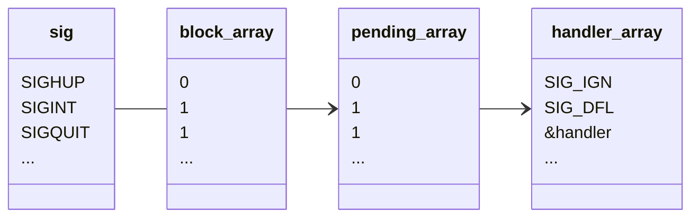
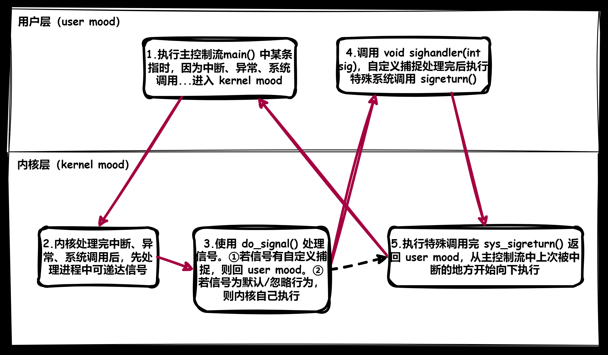
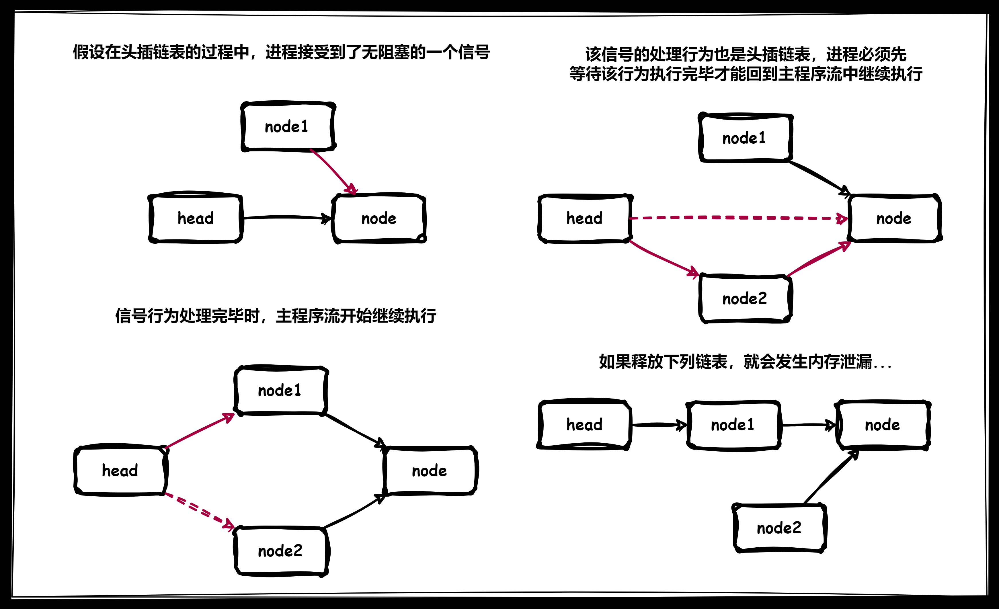

>   注意：首先需要提醒一个事情，本节提及的进程信号和下节的信号量没有任何关系，请您区分对待。

# 1.信号概念

## 1.1.生活中的信号

我们在生活中通过体验现实，记忆了一些信号和对应的处理动作，这意味着信号有以下相关的特点：

-   我们可以识别出信号，知道后续对应的执行动作。
-   即使没有收到特定的信号，我们也知道当下应该继续做什么。
-   收到信号后，不一定就要立刻执行，需要先被临时记忆/临时存储起来。

## 1.2.进程中的信号

那什么是 `Linux` 信号呢？信号的本质是一种异步通知机制，由“程序员/操作系统”发送信号给进程。

>   补充：异步和同步
>
>   异步通常和同步一起作比较理解，在之前我们讲的管道通信就具有同步机制，管道必须等待写端写入数据后才能让读端读走所有数据，也就是说读端必须等待写端（反过来也一样），否则进行阻塞。但是信号是异步机制的，进程没有办法预料到何时会接受到信号，信号的产生是是随机的、缺乏规律的，进程不能一直因为一个可能连发送都不会发送的信号一直进入阻塞状态，因此信号的产生对于进程而言是异步的。
>
>   总结来说，**双方并没有在互相等待就是异步，若有一方会进行等待就是同步**。

-   而进程是接受信号的载体，因此要谈信号，就离不开进程的基础，而进程要处理信号：

    (1)就必须要有识别信号的能力

    (2)以及有接受到信号对应的处理方式

-   进程接受到的信号是随机/异步的，在信号没有产生之前，进程依旧在做自己的任务。

-   进程忙碌的任务可能非常重要，此时进程无法根据信号做出改变（除非信号非常重要，因此信号也就有优先级的区分），信号会被暂时存储起来。

>   补充：信号在某些角度来看，也可以理解为进程通信的一种方式，但是为了我们知识的模块化，信号我单独独立出来作为一个小模块。

# 2.信号分类

得到信号后，在信号处理逻辑上，可以将信号分为：

1.   **默认处理**：进程默认自带的处理信号的方式，由程序写好的逻辑
2.   **忽略处理**：有些信号对进程有害或者进程没有对应处理逻辑的，就需要忽略该信号
3.   **自定义处理**：自定义捕捉某些信号，也就是程序员自己定义某些处理方法

在操作系统中可以使用 `kill -l` 看到关于信号的列表，并且有对应的解释说明：

```cmd
# 查看系统的信号
$ kill -l
 1) SIGHUP       2) SIGINT       3) SIGQUIT      4) SIGILL       5) SIGTRAP
 6) SIGABRT      7) SIGBUS       8) SIGFPE       9) SIGKILL     10) SIGUSR1
11) SIGSEGV     12) SIGUSR2     13) SIGPIPE     14) SIGALRM     15) SIGTERM
16) SIGSTKFLT   17) SIGCHLD     18) SIGCONT     19) SIGSTOP     20) SIGTSTP
21) SIGTTIN     22) SIGTTOU     23) SIGURG      24) SIGXCPU     25) SIGXFSZ
26) SIGVTALRM   27) SIGPROF     28) SIGWINCH    29) SIGIO       30) SIGPWR
31) SIGSYS      34) SIGRTMIN    35) SIGRTMIN+1  36) SIGRTMIN+2  37) SIGRTMIN+3
38) SIGRTMIN+4  39) SIGRTMIN+5  40) SIGRTMIN+6  41) SIGRTMIN+7  42) SIGRTMIN+8
43) SIGRTMIN+9  44) SIGRTMIN+10 45) SIGRTMIN+11 46) SIGRTMIN+12 47) SIGRTMIN+13
48) SIGRTMIN+14 49) SIGRTMIN+15 50) SIGRTMAX-14 51) SIGRTMAX-13 52) SIGRTMAX-12
53) SIGRTMAX-11 54) SIGRTMAX-10 55) SIGRTMAX-9  56) SIGRTMAX-8  57) SIGRTMAX-7
58) SIGRTMAX-6  59) SIGRTMAX-5  60) SIGRTMAX-4  61) SIGRTMAX-3  62) SIGRTMAX-2     
```

>   补充：以下是信号的附加注释
>
>   1. **SIGHUP (信号编号 1)**：挂起信号。通常由终端关闭或控制进程退出时发送。常用于通知进程重新加载配置或者执行清理操作。
>
>   2. **SIGINT (信号编号 2)**：中断信号。当用户在终端按下 `Ctrl + C` 时发送，用于中止正在运行的程序。
>
>   3. **SIGQUIT (信号编号 3)**：退出信号。当用户在终端按下 `Ctrl + \` 时发送，用于终止程序，并生成 core dump 以进行调试。
>
>   4. **SIGILL (信号编号 4)**：非法指令信号。当进程尝试执行非法的指令时发送。
>
>   5. **SIGTRAP (信号编号 5)**：陷阱信号。通常由调试器在断点处发送，用于调试程序。
>
>   6. **SIGABRT (信号编号 6)**：异常终止信号。通常由 abort()函数调用发送，用于表示程序发现了严重错误并选择终止。
>
>   7. **SIGBUS (信号编号 7)**：总线错误信号。当进程访问未对齐的内存地址或者访问无效的内存地址范围时发送。
>
>   8. **SIGFPE (信号编号 8)**：浮点异常信号。当进程执行浮点运算错误时发送，如除以零或者浮点溢出。
>
>   9. **SIGKILL (信号编号 9)**：终止信号。用于强制终止进程，不能被阻塞或者捕获。
>
>   10. **SIGUSR1 (信号编号 10)**：用户自定义信号 1。
>
>   11. **SIGSEGV (信号编号 11)**：段错误信号。当进程访问无效的内存地址时发送。
>
>   12. **SIGUSR2 (信号编号 12)**：用户自定义信号 2。
>
>   13. **SIGPIPE (信号编号 13)**：管道破裂信号。当向没有读取端的管道写入数据时发送。
>
>   14. **SIGALRM (信号编号 14)**：定时器信号。通常由 alarm()函数设置的定时器超时时发送。
>
>   15. **SIGTERM (信号编号 15)**：终止信号。用于请求进程正常终止。
>
>   16. **SIGSTKFLT (信号编号 16)**：协处理器栈错误信号。
>
>   17. **SIGCHLD (信号编号 17)**：子进程状态改变信号。当子进程停止或者终止时发送。
>
>   18. **SIGCONT (信号编号 18)**：继续信号。用于继续被停止的进程。
>
>   19. **SIGSTOP (信号编号 19)**：停止信号。用于停止进程，不能被阻塞或者捕获。
>
>   20. **SIGTSTP (信号编号 20)**：终端停止信号。当用户在终端按下 `Ctrl + Z` 时发送，用于暂停进程。
>
>   21. **SIGTTIN (信号编号 21)**：后台进程读终端信号。
>
>   22. **SIGTTOU (信号编号 22)**：后台进程写终端信号。
>
>   23. **SIGURG (信号编号 23)**：紧急情况信号。
>
>   24. **SIGXCPU (信号编号 24)**：CPU 时间限制信号。
>
>   25. **SIGXFSZ (信号编号 25)**：文件大小限制信号。
>
>   26. **SIGVTALRM (信号编号 26)**：虚拟定时器信号。
>
>   27. **SIGPROF (信号编号 27)**：性能分析定时器信号。
>
>   28. **SIGWINCH (信号编号 28)**：窗口大小改变信号。
>
>   29. **SIGIO (信号编号 29)**：异步 I/O 信号。
>
>   30. **SIGPWR (信号编号 30)**：电源故障信号。
>
>   31. **SIGSYS (信号编号 31)**：系统调用错误信号。
>

其中 `[1, 31]` 为普通信号（注意没有 `0` 号信号），最为常用，后面 `[34, 64]` 为实时信号（注意没有 `32` 和 `33` 信号），比较少用，除非是某些特殊的行业（比如车载操作系统）。特定信号的详细描述则可以使用指令 `man 7 signal` 来查看（注意，不是所有信号都会被操作系统所支持）：

```cmd
# 查看特定信号的详细描述
Signal     Value     Action   Comment
信号        值         行为      注释
──────────────────────────────────────────────────────────────────────
SIGHUP        1       Term    Hangup detected on controlling terminal or death of controlling process
SIGINT        2       Term    Interrupt from keyboard
SIGQUIT       3       Core    Quit from keyboard
SIGILL        4       Core    Illegal Instruction
SIGABRT       6       Core    Abort signal from abort(3)
SIGFPE        8       Core    Floating point exception
SIGKILL       9       Term    Kill signal
SIGSEGV      11       Core    Invalid memory reference
SIGPIPE      13       Term    Broken pipe: write to pipe with no readers
SIGALRM      14       Term    Timer signal from alarm(2)
SIGTERM      15       Term    Termination signal
SIGUSR1   30,10,16    Term    User-defined signal 1
SIGUSR2   31,12,17    Term    User-defined signal 2
SIGCHLD   20,17,18    Ign     Child stopped or terminated
SIGCONT   19,18,25    Cont    Continue if stopped
SIGSTOP   17,19,23    Stop    Stop process
SIGTSTP   18,20,24    Stop    Stop typed at terminal
SIGTTIN   21,21,26    Stop    Terminal input for background process
SIGTTOU   22,22,27    Stop    Terminal output for background process

The signals SIGKILL and SIGSTOP cannot be caught, blocked, or ignored.
```

`Action` 就是接收到信号后的行为，有以下的默认行为和忽略行为（默认的大部分都行为是终止进程）：

1.   **Term（Termination）**：表示终止或终结，在 `Linux` 或类 `Unix` 系统中，`TERM` 信号用于请求进程正常终止
2.   **Core（core dump）**：表示生成核心转储，核心转储是操作系统在程序异常终止（比如由于内存越界、除零等错误）时生成的一个包含程序内存映像的文件，这个文件可以帮助开发者诊断程序异常终止的原因（说白了就是把进程在内存中运行的数据作拷贝，后面有补充解释）
3.   **Stop（Stop）**：表示表示停止，用于暂停一个进程的执行，使其进入停止状态，此时进程会被挂起
4.   **Cont（Continue）** ：在进程信号中通常表示继续执行，这个信号用于恢复一个之前被停止的进程的执行，当一个进程收到停止信号（如 `SIGSTOP`）而被暂停后，可以通过发送 `SIGCONT` 信号使其继续执行
5.   **Ign（Ignored）**：表示信号被忽略，系统不会采取任何处理动作

>   补充：“进程基础”的“进程等待”中，我们曾经在返回型参数 `status` 中提到“...还有 `1` 个比特位是 `core dump` 标志，这个我们之后讲信号再来谈及（是否具备 `core dump`）...”，也就是这里提到的“核心转储”，那么这个标志位有什么用呢？
>
>   一般而言，云服务器的核心转储功能是被关闭的（我们可以使用命令 `ulimit -a` 来确认，该命令显示当前 `shell` 进程的所有资源限制，这其中包括硬件资源、用户资源以及各种其他限制，其中就包括核心转储资源的限制）。
>
>   您也可以选择使用 `ulimit -c 10240` 手动打开，`10240` 是核心转储的设定大小，该设定只在本会话有效（其他设定方法待补充...）, 同一个用户打开不同会话时，不会同步核心转储的设置。
>
>   此时我们再发送给进程一些带有 `Core` 行为的信号，就会发现一些不同，对同一份代码做不同的信号发送：
>
>   ```cpp
>   //核心转储的验证代码
>   #include <iostream>
>   #include <signal.h>
>   #include <unistd.h>
>   using namespace std;
>   
>   void CatchSig(int sigNum) //该回调函数被调用的时候，会将编号传递给该函数的 sig
>   {
>      cout << "进程捕捉到信号  " << sigNum << " [pid]为:" << getpid() << "  正在处理..." << '\n';
>   }
>   
>   int main()
>   {
>      //signal(2, CatchSig); //当 SIGINT 被触发时，就会调用后面的函数
>      signal(SIGINT, CatchSig); //当 SIGINT 被触发时，就会调用后面的函数，特定信号的处理动作一般只有一个
>   
>      //而在循环开始前，signal() 即使被调用了，在没有接受到信号之前，不会调用 CatchSig()
>      //因此 signal() 仅仅是修改进程对特定信号的后续处理动作，而不是直接调用对应的处理动作
>      while(true)
>      {
>          cout << "我是进程，run..." << "pid:" << getpid() << '\n';
>          sleep(1);
>      }
>      return 0;
>   }
>   ```
>
>   1.   没有核心转储之前（同目录下的两个会话/`bash`）
>
>        ```cmd
>        # bash1
>        $ g++ main.cpp
>        $ ./a.out
>        我是进程，run...pid:13517
>        我是进程，run...pid:13517
>        我是进程，run...pid:13517
>        ...
>        # -----------------
>        # bash2
>        $ kill -8 13517
>        # -----------------
>        # bash1
>        ...
>        我是进程，run...pid:13517
>        Floating point exception
>        ```
>
>   2.   开启核心转储之后（同目录下的两个会话/bash）
>
>        ```cmd
>        # bash1
>        $ ulimit -c 10240
>        $ ulimit -a
>        core file size          (blocks, -c) 10240
>        data seg size           (kbytes, -d) unlimited
>        scheduling priority             (-e) 0
>        file size               (blocks, -f) unlimited
>        pending signals                 (-i) 7902
>        max locked memory       (kbytes, -l) unlimited
>        max memory size         (kbytes, -m) unlimited
>        open files                      (-n) 100002
>        pipe size            (512 bytes, -p) 8
>        POSIX message queues     (bytes, -q) 819200
>        real-time priority              (-r) 0
>        stack size              (kbytes, -s) 8192
>        cpu time               (seconds, -t) unlimited
>        max user processes              (-u) 7902
>        virtual memory          (kbytes, -v) unlimited
>        file locks                      (-x) unlimited
>        $ ./a.out
>        我是进程，run...pid:15752
>        我是进程，run...pid:15752
>        ...
>        # -----------------
>        # bash2
>        $ kill -8 15752
>        $ ls
>        a.out core.15752 main.cpp
>        # -----------------
>        # bash1
>        ...
>        我是进程，run...pid:15752
>        Floating point exception (core dumped)
>        ```
>
>   可以看到 `kill` 后多了一个 `core.15752` 文件，这个文件的大小比较大，进程出异常后，由 `OS` 将该进程在内存中存储的核心数据转存到该文件中，因此该文件的主要意义是为了调试（里面全都是二进制，文本编辑器打开后就是乱码）。
>
>   而我使用的是云服务下的 `Centos7` ，在实际生产中，云服务器一般就是生产环境，当代码项目写完并且进行合并后在发布环境中编译运行，然后交给测试团队在测试环境中测试，因此一般默认关闭核心转储功能（以提高空间利用效率，防止存储过多的 `core dump`）。
>
>   如果我们使用 `-g` 选项编源代码（意思是在编译过程中包含调试信息，可以使用 `gdb` 打开包含调试信息的可执行文件），运行二进制文件后，假设出现除零错误，导致生成 `core` 文件，则使用 `gdb` 后，使用命令 `core-file <core文件名>` 就可以直接定位到出异常的地方。
>
>   ```cmd
>   # 使用 core 文件来事后调试（core 文件的作用）
>   $ cat main.cpp
>   #include <iostream>
>   #include <signal.h>
>   #include <unistd.h>
>   using namespace std;
>   
>   int main()
>   {
>   while(true)
>   {
>       cout << "我是进程，run..." << "pid:" << getpid() << '\n';
>       sleep(1);
>   
>       int a = 100;
>       a /= 0; //除零错误，会引发 OS 发出 8 号 SIGFPE 信号
>   
>       cout << "run here..." << '\n';
>   }
>   return 0;
>   }
>   
>   $ g++ main.cpp -g
>   main.cpp: In function ‘int main()’:
>   main.cpp:14:11: warning: division by zero [-Wdiv-by-zero]
>        a /= 0; //除零错误，会引发 OS 发出 8 号 SIGFPE 信号
>          ^
>   
>   $ ./a.out
>   我是进程，run...pid:21167
>   Floating point exception (core dumped)
>   
>   $ ls
>   a.out  core.21167  main.cpp
>   
>   $ gdb a.out
>   GNU gdb (GDB) Red Hat Enterprise Linux 7.6.1-120.el7
>   Copyright (C) 2013 Free Software Foundation, Inc.
>   License GPLv3+: GNU GPL version 3 or later <http://gnu.org/licenses/gpl.html>
>   This is free software: you are free to change and redistribute it.
>   There is NO WARRANTY, to the extent permitted by law.  Type "show copying"
>   and "show warranty" for details.
>   This GDB was configured as "x86_64-redhat-linux-gnu".
>   For bug reporting instructions, please see:
>   <http://www.gnu.org/software/gdb/bugs/>...
>   Reading symbols from /home/ljp/LimouGitFile/limou-c-test-code/my_code_2023_12_20/a.out...done.
>   (gdb) core-file core.21167
>   [New LWP 21167]
>   Core was generated by `./a.out'.
>   Program terminated with signal 8, Arithmetic exception.
>   #0  0x00000000004008aa in main () at main.cpp:14
>   14              a /= 0; //除零错误，会引发 OS 发出 8 号 SIGFPE 信号
>   Missing separate debuginfos, use: debuginfo-install glibc-2.17-326.el7_9.x86_64 libgcc-4.8.5-44.el7.x86_64
>   ```
>
>   因此，我们遗漏的那一个标志位的作用，就是判断是否有 `core` 动作（是否发生了核心转储），用来区分 `Trem` 的终止和 `Core` 的终止。
>
>   ```cmd
>   # 检验核心转储标志位
>   $ ls
>   main.cpp
>   
>   $ cat main.cpp
>   #include <iostream>
>   #include <stdlib.h>
>   #include <unistd.h>
>   #include <wait.h>
>   using namespace std;
>   
>   int main()
>   {
>     pid_t id = fork();
>     if(id == 0)
>     {
>         //子进程
>         sleep(1);
>         int a = 100;
>         a /= 0;
>         exit(0);
>     }
>   
>     int status = 0;
>     waitpid(id, &status, 0);
>     cout << "父进程pid:" << getpid() << '\n'
>     << "子进程pid" << id << '\n'
>     << "exit sig:" << (status & 0x7F) << '\n'
>     << "is core?:" << ((status >> 7) & 1) << '\n';
>     return 0;
>   }
>   
>   $ g++ main.cpp
>   main.cpp: In function ‘int main()’:
>   main.cpp:16:11: warning: division by zero [-Wdiv-by-zero]
>          a /= 0;
>            ^
>   
>   $ ./a.out
>   父进程pid:28256
>   子进程pid28257
>   exit sig:8
>   is core?:1
>   ```
>
>   开启了核心转储功能后，若有发生核心转储，则该标记为设置为 `1`，其他具有核心转储行为的信号也有类似的输出结果（而若关闭了核心转储功能，就绝不会将该标记设为 `1` ）。
>
>   注意，不同系统对核心转储的实现可能不一样，生成的文件名也可能不一样...

# 3.信号捕捉

## 3.1.信号捕捉接口

``` cpp
//系统调用 signal() 声明
#include <signal.h>
typedef void (*sighandler_t)(int);
sighandler_t signal(int signum, sighandler_t handler);
//1.signum：信号编号
//2.handler：注册信号处理方式
//这里是使用回调的方式，修改对应的信号处理方法，而该函数返回值返回的是一个旧的函数指针，也就是注册失败之前老的处理方法，这个返回值很少使用（要么返回旧处理方法的函数指针，要么返回强转后的 SIG_ERR(错误)、SIG_DFL(默认)、SIG_IGN(忽略)），另外，该回调函数也被称为“捕捉方法”
```

在 `Linux` 中，`signal()` 用于设置信号处理程序，允许程序对接收到的信号做出响应。信号本身是一种用于通知进程发生某些事件的软件中断机制，其主要用途包括：

1.  **捕获和处理信号**：通过 `signal()` ，您可以为特定的信号（如 `SIGINT`、`SIGTERM` 等）注册自定义的信号处理程序。这样，当进程接收到注册的信号时，相应的处理函数将被调用，允许程序执行特定的操作
2.  **改变信号的行为**：有些信号具有默认、忽略的处理行为，例如 `SIGTERM` 通常用于请求进程正常终止，通过使用 `signal()`，你可以改变默认的信号处理行为，使其执行自定义的操作。

>   补充：这也就是为什么 `shell` 进程不会被 `[ctrl+c]` 简单的杀死。

怎么使用这个函数呢？我们来尝试一下：

``` cpp
//使用 signal() 调用
#include <iostream>
#include <signal.h>
#include <unistd.h>
using namespace std;

void CatchSig(int sigNum) //该回调函数被调用的时候，会自动将编号传递给该函数的 sig
{
    cout << " 进程捕捉到信号  " << sigNum << " [pid]为:" << getpid() << "  正在处理..." << '\n';
}

int main()
{
    //signal(2, CatchSig); //当 SIGINT 被触发时，就会调用后面的函数
    signal(SIGINT, CatchSig); //当 SIGINT 被触发时，就会调用后面的函数，特定信号的处理动作一般只有一个

    //而在循环开始前，signal() 即使被调用了，在没有接受到信号之前，不会调用 CatchSig()
    //因此 signal() 仅仅是修改进程对特定信号的后续处理动作，而不是直接调用对应的处理动作
    //这也就是为什么称为“注册”，而不是“调用”或者“设置”的原因，前者使用起来更加准确，注册不代表被立刻调用，如果进程没有接受到该信号，那么这个方法也就永远不会被调用
    while(true)
    {
        cout << " 我是进程，run..." << '\n';
        sleep(1);
    }
    return 0;
}
```

`[ctrl+c]` 可以终止前台进程，实际发送的是信号 `2)SIGINT`，而这个进程运行起来后就不能使用 `[ctrl+c]` 强行终止了，包括使用 `kill -2 <进程ID>` 或者 `kill SIGINT <进程ID>` 也都不能使用了，但是我们可以使用 `[ctrl+/]` 发送 `3)SIGQUIT` 信号进行退出。

## 3.2.信号捕捉细节

这里有几个问题需要我们思考：

1.   **如何理解信号被进程保存起来呢？**

     信号不就是一些值么，进程要保存一个数据那还不简单，只要内部要可以保存进程信号的相关数据结构就可以。而使用位图来保存，就再合适不过了（可以去 `task_struct{/*...*/};` 里去找找）。

2.   **如何理解信号被发送呢？**

     由于发送信号的过程涉及到修改内核级别的数据结构，因此只有操作系统自己才有资格进行改动。我们自己手动发送信号亦或者是其他来源的信号，最后都是由操作系统向目标进程发/写信号（修改 `task_struct{/*...*/};` 指定的位图结构），也只有操作系统有这个权力，我们只不过是借助操作系统的“手”罢。

3.   **如何理解组合键 [ctrl+z] 变成信号呢？**

     键盘工作原理是中断机制，操作系统识别到组合键后，根据进程列表，找到前台运行的进程，然后写入（发送）对应信号到进程内部的位图结构中，而至于信号什么时候被进程处理，就交给进程自己衡量。

     >   >   补充 `1`：中断机制
     >   >
     >   >   中断的概念实际是计算机组成原理中常见的知识，硬件或者软件进行 `IO` 操作时，几乎都会触发中断机制。
     >   >
     >   >   当一个中断事件发生时，`CPU` 会立即停止执行当前的指令序列，保存当前执行上下文的状态，然后转向处理中断的代码。处理中断的代码通常由操作系统内核中的中断服务例程（`ISR`，`Interrupt Service Routine`）来处理。
     >   >
     >   >   在 `x86` 架构的计算机系统中，中断的触发可以由硬件设备（如时钟中断、键盘中断、硬盘中断等）或软件（通过软中断指令）引起（当然，并不是所有的硬件设备或者软件都会有中断信号）。
     >   >
     >   >   一旦中断被触发，`CPU` 会暂停当前任务的执行，跳转到中断服务例程的地址，执行与中断相关的代码，处理中断事件。处理完成后，`CPU` 恢复之前的执行上下文，继续执行原来的程序。
     >   >
     >   >   总体而言，中断允许系统对异步事件进行响应，而不需要轮询或等待，提高了系统的实时性和效率，也可防止一些危险行为。
     >   >
     >   >   而键盘输入就是通过不同键盘的中断机制，调用键盘的中断代码，处理得到了键盘发送的数据。这个过程很像信号，或者说：**中断是软硬件层次的实现机制，信号是纯软件层次的实现机制**。甚至可以说信号是对中断的软件模拟。
     >   >
     >   >   另外，操作系统的执行本身也是基于中断的，硬件发出的中断，用于向 `CPU` 发出请求，要求 `CPU` 暂停当前正在执行的任务并转而执行特定的处理程序而加载操作系统的相关代码（本质上是某些硬件不断触发中断信号，迫使操作系统运行起来）。
     >
     >   >   补充 `2`：`8259` 集成电路
     >   >
     >   >   该电路是一个可编程中断控制器（`PIC`，`Programmable Interrupt Controller`）。`Intel 8259` 芯片是早期个人计算机和其他计算机系统中常见的中断控制器之一。
     >   >
     >   >   该芯片通常被用于处理外部设备的中断请求，例如：键盘、鼠标、计时器等。通过中断控制器，计算机系统能够有效地管理和响应多个中断源，确保正确地分发中断请求，并允许程序员对中断的处理进行编程。
     >   >
     >   >   `8259` 芯片的主要特点和功能包括：
     >   >
     >   >   1.  **多级中断优先级**：具有多个中断请求（IRQ）线，每个中断线都有一个优先级。8259 可以配置为级联连接，允许处理多个级别的中断请求。
     >   >   2.  **中断屏蔽**：允许通过设置中断屏蔽位来禁用或启用特定的中断源，从而控制中断的响应。
     >   >   3.  **中断请求（IRQ）处理**：负责接收和处理外部设备发送的中断请求，并将其传递给 CPU。
     >   >   4.  **级联连接**：可以连接多个 `8259` 芯片，形成级联的中断控制体系，从而支持更多的中断源。

>   疑惑：使用过 `signal()` 后，对所有信号进行自定义捕捉会怎么样？我们可不可以让一个进程对所有的信号都实施同一种捕捉方法？

# 4.信号发送

信号最终都是由操作系统发送的，但这不代表信号是由操作系统产生的，操作系统应该是一个第三号令者，负责解析和将某些数据、特征、操作转化为信号发送进程。因此，我们必须了解信号的产生条件。

## 4.1.通过按键中断产生信号

通过键盘的按键输入，让 `OS` 解析按键组合和解析（本质是中断机制），转化为信号，然后发送信号给进程，这我们已经用过很多次了，不再过多介绍。

>   补充：在 `Linux` 终端中，您可以使用一些键盘快捷键来发送信号给运行中的程序。以下是一些常用的快捷键及其对应的信号：
>
>   1. **Ctrl+C**：发送 `SIGINT` 信号，通常用于中断运行中的程序。
>   2. **Ctrl+Z**：发送 `SIGTSTP` 信号，将运行中的程序挂起到后台，并停止它的执行。
>   3. **Ctrl+\\**：发送 `SIGQUIT` 信号，通常用于退出运行中的程序，并生成 `core dump` 文件。
>   4. **Ctrl+D**：发送 `EOF`（`End-of-File`）信号，通常用于表示输入结束，如果在终端中输入，则可用于退出终端。
>
>   这些快捷键可以在终端中使用，用于与正在运行的程序进行交互。在上述快捷键中，`Ctrl+C` 和 `Ctrl+Z` 是最常用的，分别用于中断程序和挂起程序。这些快捷键的行为可能会受到终端设置和运行的 `shell` 的影响，不同的 `shell` 和终端模拟器可能有不同的表现。这些快捷键实际就是调用了下文将要提到的 `kill()` 系统调用。

## 4.2.通过系统调用产生信号

### 4.2.1.发送信号给所有进程

我们之前在使用 `kill` 的时候，实际上就是在命令行中发生信号，而系统中也存在一个 `kill()` 的系统调用。

```cpp
//系统调用 kill() 声明
#include <signal.h>
int kill(pid_t pid, int sig); //向目标进程发送 sig 信号
```

实际上，命令行里的 `kill` 指令底层就是 `kill()` 的调用，我们可以自己模拟一个：

```cpp
//模拟实现 kill 命令
#include <iostream>
#include <string>
#include <stdlib.h>
#include <signal.h>
using namespace std;

static void Usage(string proc)
{
    cout << "Usage:\r\n\t" << proc << " signumber processid ";
}
int main(int argc, char* argv[])
{
    if(argc != 3)
    {
        Usage(argv[0]);
        exit(1);
    }

    int signumber = atoi(argv[1]);
    int procid = atoi(argv[2]);

    kill(procid, signumber);
    return 0;
}
```

### 4.2.2.发送信号给当前进程

还有一个系统调用是 `raise()`，可以向调用该函数的进程发送信号（也就是进程自己发送信号给自己）。

```cpp
//系统调用 raise() 声明
#include <signal.h>
int raise(int sig);
//向当前调用该函数的进程发送 sig 信号，等同于 kill(getpid(), sig)
```

### 4.2.3.发送中断信号给进程

另外还有一个让我们眼熟的系统调用 `abort()` 调用，我们经常能在断言的时候看到它：


```cpp
//库函数 abort() 声明
#include <stdlib.h>
void abort(void);
//给进程自己发送确定的 abort 信号（也就是 6)SIGABRT 信号），自己终止自己
```


那使用 `abort()` 终止进程和使用 `exit()/_exit()` 终止进程有什么区别呢？有很大的一点在于：`6)SIGABRT` 会进行 `core` 行为，更加方便我们调试。

## 4.3.通过软件条件产生信号

### 4.3.1.管道软件条件

在我们后面要学习学习的管道中，如果一直让写端写入管道，而读端不仅不读，甚至还把读端关闭了，这样 `OS` 会通过发送信号 `13)SIGPIPE` 的方式终止写端进程，我们可以自己尝试验证一下：
```cpp
//演示例子，待补充...
```

而操作系统因为管道这个软件（之所以叫软件，是因为管道是通过文件在内存的实现），而由于管道的读端被关闭，而写端依旧在写入，因此软件条件不满足，系统就发送了可以终止的信号。

>   注意：管道是属于后面进程间通信的知识，您可以等后续学习了管道再回来这里详细查看（在管道章节也会提及这一细节）。

### 4.3.2.闹钟软件条件

还有一种软件条件就是使用闹钟，该闹钟由 `alarm()` 设定：

```cpp
//闹钟接口声明
#include <unistd.h>
unsigned int alarm(unsigned int seconds);
//seconds 秒后给当前进程发送 14)SIGALRM 信号（默认是终止当前进程），该函数如果 seconds 为零，则表示取消当前运行的闹钟，返回值剩下的秒数。
//如果再次调用了 alarm 函数设置了新的闹钟，则后面定时器的设置将覆盖前面的设置，即之前设置的秒数被新的闹钟时间取代，因此只有最后一次调用 alarm() 所设置的时间参数会生效。
```

```cpp
//使用闹钟接口
#include <iostream>
#include <unistd.h>
#include <signal.h>

unsigned int Seconds = 100;
int n = 0;

void alarmHandler(int signum)
{
    n = alarm(0);
    std::cout << n << std::endl;
    alarm(n); //重新设置闹钟，并且 n 为上一个闹钟运行剩下的秒数
}

int main()
{
    signal(SIGALRM, alarmHandler);
    alarm(Seconds);
    std::cout << "Alarm set for " << Seconds << " seconds" << std::endl;
    
    while (true)
    {
        sleep(1);
    }

    return 0;
}

```

我们还可以通过这个调用来粗略计算 `CPU` 的性能：

```cpp
//计算 CPU 的性能
#include <iostream>
#include <stdio.h>
#include <unistd.h>
#include <signal.h>
using namespace std;

unsigned long long count = 0;

void CatchSig(int sigNum) //该回调函数被调用的时候，会将编号传递给该函数的 sig
{
    cout << " 捕捉到信号为: " << sigNum
    << " 本进程pid为:" << getpid()
    << " 结果为:" << count
    << '\n';
}

int main(int argc, char* argv[])
{
    alarm(1);

    signal(SIGALRM, CatchSig);
    while(true) ++count;
    return 0;
}
```

需要注意的是，该闹钟被触发后就会被自动移除，那如果需要定期完成怎么办呢？重新设置一个就好：
```cpp
//计算 CPU 的性能
#include <iostream>
#include <stdio.h>
#include <unistd.h>
#include <signal.h>
using namespace std;

unsigned long long count = 0;

void CatchSig(int sigNum) //该回调函数被调用的时候，会将编号传递给该函数的 sig
{
    cout << " 捕捉到信号为: " << sigNum
    << " 本进程pid为:" << getpid()
    << " 结果为:" << count
    << '\n';
    alarm(1);
}

int main(int argc, char* argv[])
{
    alarm(1);

    signal(SIGALRM, CatchSig);
    while(true) ++count;
    return 0;
}
```

>   补充：我们可以根据这个闹钟来实现一些定时的自动化操作，比如自动提交和更新 `git` 仓库，而 `nohup` 命令可以让程序忽略 `SIGHUP` 信号，这样即使终端关闭，程序也可以继续在后台运行，
>
>   `SIGHUP` 是指 `Hangup` 信号，它是 `POSIX` 系统中的一个标准信号。这个信号通常与终端相关联，当用户从终端退出时，终端会向正在其上运行的进程发送 `SIGHUP` 信号。在传统的 `Unix` 系统中，当用户从终端注销或终端会话意外中断时，会发送 `SIGHUP` 信号。
>
>   对于守护进程（`daemon`）或在后台运行的进程来说，`SIGHUP` 信号意味着终端的断开，通常会被解释为程序应该重新初始化自身或者重读配置文件等。因此，它常常用于重新启动或重新加载进程。

## 4.4.通过硬件异常产生信号

操作系统是怎么发现除零错误的呢？进行计算的是 `CPU` 硬件，内部的加法器有很多寄存器，其中就有一个除零状态寄存器，记录本次的计算状态。

如果对应的除零错误的状态寄存器被设置为 `1`，则证明出现除零错误，由于在进行计算的是 `CPU` 这个硬件而不是操作系统，则说明该异常是由硬件产生，再被操作系统接受，转化成信号，发送给进程。

因此除零错误本质是硬件异常，而非软件问题。

```cpp
//篡改除零错误的处理行为
#include <iostream>
#include <signal.h>
#include <unistd.h>
using namespace std;

void CatchSig(int signum)
{
    cout << "拦截成功，获得 sig:" << signum << '\n'; //尽管发送了 3 号信号，但是该进程没有被杀死，再次调度恢复上下文时，又会重复发送 3 号信号，因为除零异常不会被自动解决
}

int main()
{
    signal(8, CatchSig);

    int a = 10;
    a /= 0; //硬件设置了除零标志，但是发送信号后，该上下文数据依旧被进程带走

    return 0;
}
```

对于 `C/C++` 程序员来说，最为常见的硬件异常就是段错误，导致 `OS` 转化该异常，发出了 `SIGSEGV` 信号，例如“野指针解引用再进行写入”，这种行为可以在软硬件上有不同但本质一样的理解：

-   硬件理解就是：虚拟地址通过页表和内存管理单元硬件（`MMU`）转化为物理地址时，发现物理地址的映射是错误的（或者说没有权限），因此设置好 `MMU` 寄存器/硬件电路，由操作系统转化为异常信号来发送。
-   软件理解就是：内存通常被划分为不同的段，例如代码段、数据段、栈段等。每个段都有其特定的权限，例如读、写、执行等。如果程序试图执行不允许的内存访问操作，操作系统会向程序发送一个 "段错误" 信号，导致程序终止运行。

>   补充：大部分异常都是为了让进程可以正常结束，最多打印一些日志信息，很少是可以在抛出异常后可以被解决的...

# 5.信号阻塞

在学习信号阻塞之前，我们先来根据前面的内容得到几个关于进程信号状态的术语：

-   **信号递达（Delivery）**：实际执行信号的处理动作被称为“信号递达”
-   **信号未决（Pending）**：信号从产生到发生信号递达之间的状态被称为“信号未决”
-   **信号阻塞/信号屏蔽/信号存储（Block）**：进程可选择阻塞某个信号，也就是“信号阻塞”，被阻塞的信号在产生时，将会保持在信号未决状态，直到进程解除对该进程的阻塞，才可以开始执行信号递达的动作，这种操作相当于暂时屏蔽了一个信号，也相当于暂时存储了一个信号

>   注意：需要区分好“阻塞”和“忽略”，只要信号被阻塞就不会被递达，而忽略是在递达之后的一种可选的信号处理动作（换句话说，忽略也是对信号的处理动作）。

## 5.1.内核表示

递达、未决、阻塞实际上可以表现在内核中，每个进程 `PCB` 的 `task_struct{/*...*/};` 对象中，都包含三个表：



-   `block_array{}` 位图中的每一位代表对应的信号是否被阻塞（为 `1` 代表该信号被阻塞），代表信号阻塞
-   `pending_array{}` 位图中的每一位代表有没有接受到对应的信号（为 `1` 代表接收到某信号），代表信号未决
-   `handler_array{}` 表就是信号对应的处理行为/回调函数，也就是信号抵达

实际上系统调用 `signal()` 的原理就是根据信号 `sig`，以复杂度 $O(1)$ 的速度找到对应的 `handler_array{}` 位图，然后将对应的处理方法的函数指针填入该数组中，这就完成了信号的自定义捕捉动作。

而在没有填充自定义的捕捉动作之前，内部早就填写好了默认处理行为（`SIG_DFL`）和忽略处理行为（`SIG_IGN`），这两个宏实际上就是：

```cpp
//宏 SIG_DFL 和 SIG_IGN 的定义
#define SIG_DFL ((__sighandler_t) 0)
#define SIG_IGN ((__sighandler_t) 1)
//注意，使用 signal(signum, SIG_DFL) 和 signal(signum, SIG_IGN) 并不是调用 0 或 1 处的方法（您也不应该有权限动用这两个位置），而是用于 signal() 内部实现中的判断，判断是否执行用户自定义行为，还是执行默认和忽略行为
//上述宏通常用于把曾经自定义过的信号行为修改为原来的默认行为或者忽略行为

//还有一个 SIG_ERR 就是 -1 的强转，您可以查阅一下内核的代码，通常用于表示信号处理函数设置失败的情况。当使用 signal() 函数尝试为信号设置处理函数时，如果设置失败，signal() 函数将返回 SIG_ERR。这通常意味着无法为该信号安装自定义的处理函数，可能是由于权限不足或其他系统限制导致的。
```

因此检测进程的步骤就是：

1.   先检测是否接受到信号（遍历 `pending_array` 是否有被设置）
2.   若步骤 `1` 检测出有未决信号，则检查该信号是否被阻塞（检查 `block_array{}` 数组是否有被设置）
3.   若步骤 `2` 检查到信号没被阻塞，则执行信号的处理行为（根据索引执行存储在 `handler_array{}` 中的回调函数）

上述的三个表就可以对信号的接受进行检测（只需要看到未决标志被设置即可，这意味着发信号实际是对进程结构体对象的数据成员进行写入），也可以做到进行存储来延后运行（只需要设置阻塞标志即可，这意味着所谓阻塞就是对进程结构体对象的数据成员进行写入）。

>   补充：上述描述只是针对普通信号，将实时信号对应的编号和行为设置整体作为队列元素理论上也是可行的...

## 5.2.接口调用

### 5.2.1.sigset_t 类型

在了解接口之前，您首先需要知道 `sigset_t` 类型，该类型是操作系统提供的，可以理解为一个位图类型，操作系统不允许程序员直接使用这个类型对位图进行修改，但是可以使用接口，让操作系统自己修改。

该位图的作用就是用来标识每个信号，一个比特位标识一个信号，对于该位图有如下接口。

```cpp
//信号集接口调用
#include <signal.h>
int sigemptyset(sigset_t* set); //清空置为零
int sigfillset(sigset_t* set); //全设置为一
int sigaddset(sigset_t* set, int signo); //将特定信号添加到信号集中
int sigdelset(sigset_t* set, int signo); //将特定信号从信号集中删除
int sigismember(sigset_t* set, int signo); //判定信号是否在信号集中
```

从我们先前的理解来看，每个信号只有一个 `bit` 表示未决标志、阻塞标志，并不记录该信号产生、阻塞了多少次。

而这两种标志位都可以分别用相同的数据类型 `sigset_t` 存储为一个“信号集”：

-   在未决信号集（`pending set`）中，有效和无效代表该信号是否处于未决状态
-   在阻塞信号集（`block set`）中，有效和无效代表该信号是否处于阻塞状态（阻塞信号集也叫作当前进程的信号屏蔽字 `signal mask`，这里的屏蔽最好理解为阻塞的意思），默认情况下进程不会对任何信号进行阻塞

### 5.2.2.信号集调用声明

根据位图类型和位图接口，配合系统接口就可以完成一些特定的功能。

```cpp
//配合信号集来使用的接口
#include <signal.h>

int sigpending(sigset_t* set); 
//获取当前进程的 pending 信号集，存储在 set 执行的位图里，然后交给用户

int sigprocmask(int how, const sigset_t* set, sigset_t* oldset); 
//检查并更改阻塞信号集
//这里的 how 表示如何做：
//(1)SIG_BLOCK：把 set 中设置好的阻塞信号集添加到 oldset 中
//(2)SIG_UNBLOCK：把 set 中设置好的阻塞信号集从 oldset 中删去
//(3)SIG_SETMASK：把 oldset 替换为 set
//oldset 是输出型参数，返回修改前的阻塞信号集，可以利用这个做阻塞信号集来恢复原本的阻塞信号集（不使用的话可以填入 NULL）
```

我们能通过信号集以及一些特殊的接口，来修改信号为阻塞，而无法直接设置信号是否未决，我们只需要负责发送信号即可，因为发送信号就是在间接修改信号未决对应的位图，系统会自动帮我们写入。

>   补充：虽然我还没有看过这里位图底层实现，但我大概猜测和我在 `C++` 位图中的实现是类似的。

### 5.2.3.信号集接口测试

除了熟悉接口，我们要解决一些问题：

1.   对所有信号进行自定义捕捉会怎么样？如果对所有信号进行自定义捕捉，那是不是就可以写出一个恶意程序，也就是运行起来不被异常和指令杀掉的进程呢？ 
2.   `pending` 位图是怎么变化的？如果将 `2)SIGINT` 号信息进行阻塞，并且不断获取当前进程的 `pending` 信号集，如果我们突然发送 `2)SIGINT` 信号，就应该可以看到 `pending` 信号集将对应的比特位置为 `1`
3.   对所有信号进行阻塞会怎么样？如果我们将所有的信号都进行阻塞，这样运行起来的进程哪怕是接受到信号也无法处理，那这样是不是也写出了一个恶意程序呢？

#### 5.2.3.1.对所有信号进行自定义捕捉会怎么样？

```cpp
//篡改所有信号的处理行为
#include <iostream>
#include <signal.h>
#include <unistd.h>
using namespace std;

void CatchSig(int signum)
{
    cout << "拦截成功，获得 sig:" << signum << '\n'; 
}

int main()
{
    //更改所有的 handler 方法表
    for(int i = 1; i <= 31; i++)
        signal(i, CatchSig);
    
    //死循环运行
    while(true)
    {
        cout << "当前进程 pid:" << getpid() << " 运行 ing..." << '\n';
        sleep(1);
    }

    return 0;
}
```

我们可以看到除了 `9)SIGKILL` 信号，其他的信号都能被修改处理行为，为什么 `9)SIGKILL` 不可以修改呢？因为该信号属于管理员级别的信号，无法使用系统调用做修改，因此这种恶意程序是不被操作系统允许的（这也很合理）。

#### 5.2.3.2.pending 位图是怎么变化的？

```cpp
//观察 pending 的变化
#include <iostream>
#include <signal.h>
#include <unistd.h>
#include <stdlib.h>
#include <stdio.h>
#include <cassert>
using namespace std;

void ShowPending(sigset_t& pending)
{
    cout << "进程 " << getpid() << " 打印一次 pending 集合" << '\n';
    for(int sig = 1; sig <= 31; sig++)
    {
        if(sigismember(&pending, sig))
            cout << " 1 ";
        else
            cout << " 0 ";

        if(sig % 10 == 0)
            cout << '\n';

        fflush(stdout);
    }
    cout << '\n';
}

int main()
{
    //1.定义两个新旧信号集
    sigset_t bset, obset;

    //2.初始化两个信号集
    sigemptyset(&bset);
    sigemptyset(&obset);

    //3.添加要阻塞/屏蔽的信号
    sigaddset(&bset, 2); //2)SIGINT

    //4.设置屏蔽字
    int n = sigprocmask(SIG_BLOCK, &bset, &obset); assert(n == 0), (void)n;
    cout << "block 2)SIGINT 信号成功" << '\n';

    //5.重复打印 pending 信号集
    while(true)
    {
        //5.1.获取 pending 信号集
        sigset_t pending;
        sigemptyset(&pending);
        sigpending(&pending);

        //5.2.打印 pending 信号集，并且观察 2)SIGINT 信号是否被阻塞
        ShowPending(pending);
        sleep(3);
    }
    return 0;
}
```

当我们发送 `2)SIGINT` 信号时就会修改位图。

```bash
# 观察 pending 信号集的打印结果
# bash1
$ ls
main.cpp
$ g++ main.cpp
$ ./a.out
block 2 号信号成功
进程 1916 打印一次 pending 集合
 0  0  0  0  0  0  0  0  0  0 
 0  0  0  0  0  0  0  0  0  0 
 0  0  0  0  0  0  0  0  0  0 
 0 
进程 1916 打印一次 pending 集合
 0  0  0  0  0  0  0  0  0  0 
 0  0  0  0  0  0  0  0  0  0 
 0  0  0  0  0  0  0  0  0  0 
 0 
进程 1916 打印一次 pending 集合
 0  0  0  0  0  0  0  0  0  0 
 0  0  0  0  0  0  0  0  0  0 
 0  0  0  0  0  0  0  0  0  0 
 0 
进程 1916 打印一次 pending 集合
 0  0  0  0  0  0  0  0  0  0 
 0  0  0  0  0  0  0  0  0  0 
 0  0  0  0  0  0  0  0  0  0 
 0 

# bash2
$ kill -2 1916

# bash1
# ...
进程 1916 打印一次 pending 集合
 0  1  0  0  0  0  0  0  0  0 
 0  0  0  0  0  0  0  0  0  0 
 0  0  0  0  0  0  0  0  0  0
# ...
```

而我们还可以利用 `obset` 来恢复对 `2)SIGINT` 信号的阻塞。

```cpp
//观察取消阻塞（屏蔽）后现象的代码1
#include <iostream>
#include <signal.h>
#include <unistd.h>
#include <stdlib.h>
#include <stdio.h>
#include <cassert>
using namespace std;

void ShowPending(sigset_t& pending)
{
    cout << "进程 " << getpid() << " 打印一次 pending 集合" << '\n';
    for(int sig = 1; sig <= 31; sig++)
    {
        if(sigismember(&pending, sig))
            cout << "1";
        else
            cout << "0";
    }
    cout << '\n';
}

int main()
{
    //1.定义信号集
    sigset_t bset, obset;

    //2.初始化
    sigemptyset(&bset);
    sigemptyset(&obset);

    //3.添加要阻塞（屏蔽）的信号
    sigaddset(&bset, 2); //SIGINT

    //4.设置内核中关于信号的结构
    int n = sigprocmask(SIG_BLOCK, &bset, &obset);
    assert(n == 0), (void)n;
    cout << "block 2)SIGINT 信号成功" << '\n';

    //5.重复打印 pending 信号集
    int count = 0;
    while(true)
    {
        //5.1.获取 pending 信号集
        sigset_t pending;
        sigemptyset(&pending);
        sigpending(&pending);

        //5.2.打印 pending 信号集
        ShowPending(pending);
        sleep(1);
        count++;
        
        //5.3.恢复 pending 信号集（解除 2)SIGINT 信号的屏蔽）
        if(count == 20)
        {
            int n = sigprocmask(SIG_UNBLOCK, &bset, &obset);
            assert(n == 0), (void)n;
            cout << "ublock 2)SIGINT 信号成功" << '\n';
        }
    }
    return 0;
}
```

但是为什么需要阻塞后进程就会被终止呢？很简单，`2)SIGINT` 信号是一个可以让进程终止的信号，如果取消了阻塞，进程检测到该信号未决后，发生了信号递达，因此就有直接终止了进程，要想观察到打印出来的 `pending` 位图重新置为 `0`，可以修改 `2) SIGINT` 信号的捕捉方法：

```cpp
//观察取消阻塞（屏蔽）后现象的代码2
#include <iostream>
#include <signal.h>
#include <unistd.h>
#include <stdlib.h>
#include <stdio.h>
#include <cassert>
using namespace std;

void ShowPending(sigset_t& pending)
{
    cout << "进程 " << getpid() << " 打印一次 pending 集合" << '\n';
    for(int sig = 1; sig <= 31; sig++)
    {
        if(sigismember(&pending, sig))
            cout << "1";
        else
            cout << "0";
    }
    cout << '\n';
}

void handler(int sig)
{
    cout << "捕捉信号:" << sig << '\n';
}

int main()
{
    //0.修改 2 号信号的捕捉方法
    signal(2, handler);

    //1.定义信号集
    sigset_t bset, obset;

    //2.初始化
    sigemptyset(&bset);
    sigemptyset(&obset);

    //3.添加要阻塞（屏蔽）的信号
    sigaddset(&bset, 2); //SIGINT

    //4.设置内核中关于信号的结构
    int n = sigprocmask(SIG_BLOCK, &bset, &obset);
    assert(n == 0), (void)n;
    cout << "block 2 号信号成功" << '\n';

    //5.重复打印 pending 信号集
    int count = 0;
    while(true)
    {
        //5.1.获取 pending 信号集
        sigset_t pending;
        sigemptyset(&pending);
        sigpending(&pending);

        //5.2.打印 pending 信号集
        ShowPending(pending);
        sleep(1);
        count++;
        //5.3.恢复 pending 信号集（解除 2 号信号的屏蔽）
        if(count == 20)
        {
            int n = sigprocmask(SIG_UNBLOCK, &bset, &obset);
            assert(n == 0), (void)n;
            cout << "ublock 2 号信号成功" << '\n';
        }
    }
    return 0;
}

```

再次发送 `2)SIGINT` 信号，就可以观察到 `1` 置为 `0` 的现象了。

>   补充：这里有一个小问题，直觉上，应该是先解除对 `2)SIGINT` 信号的阻塞，然后进行捕捉
>
>   ```bash
>   # 关于打印顺序的疑惑
>   进程 5465 打印一次 pending 集合
>   0100000000000000000000000000000
>   捕捉信号:2
>   ublock 2 号信号成功
>   进程 5465 打印一次 pending 集合
>   0000000000000000000000000000000
>   ```
>
>   但是我们的代码输出是反着来的，变成了先捕捉，然后解除 `2)SIGINT` 信号的阻塞。原因是什么呢？只是我们代码书写顺序问题罢了，只有调用完 `sigprocmask()` 后才能打印后面的提示信息。
>

#### 5.2.3.3.对所有信号进行阻塞会怎么样？

```cpp
//对所有信号进行阻塞
#include <iostream>
#include <signal.h>
#include <unistd.h>
#include <stdlib.h>
#include <stdio.h>
#include <cassert>
using namespace std;

void ShowPending(sigset_t& pending)
{
    cout << "进程 " << getpid() << " 打印一次 pending 集合" << '\n';
    for(int sig = 1; sig <= 31; sig++)
    {
        if(sigismember(&pending, sig))
            cout << "1";
        else
            cout << "0";
    }
    cout << '\n';
}

int main()
{
    //屏蔽所有信号
    sigset_t best;

    for(int sig = 0; sig <= 31; sig++)
    {
        sigemptyset(&best);
        sigaddset(&best, sig);
        int n = sigprocmask(SIG_BLOCK, &best, nullptr);
        assert(n == 0), (void) n;
    }

    //不断获取 pending 信号集并且打印
    sigset_t pending;
    while(true)
    {
        sigpending(&pending);
        ShowPending(pending);
        sleep(1);
    }
    return 0;
}
```

可以使用一个简单的 `shell` 脚本来测试信号阻塞后，向对应进程发送信号时，`pending` 位图的变化结果。

```shell
# 尝试遍历发送所有的信号给进程
name=a.out
i=1;
id=$(pidof name)
while [ $i -le 31 ]
do
	kill -$i $id
    echo "send signal $i"
    let i++
    sleep 1
done
```

我们发现 `9)SIGKILL` 信号依旧是比较特殊的，我们无法对其进行阻塞/屏蔽，那我们就重新设计一个 `shell` 脚本来跳过 `9) SIGKILL` 信号（实际上 `19)SIGSTOP ` 信号也一样是特殊的，我们也将其屏蔽）

```bash
# 不发送 9)SIGKILL 号和 19)SIGSTOP 信号给进程
name=a.out
i=1
id=$(pidof $name)
while [ $i -le 31 ]
do 
    if [ $i -eq 9 ];then
        let i++
        continue
    fi
    if [ $i -eq 19 ];then
        let i++
        continue
    fi

    kill -$i $id
    echo "send signal $i:kill -$i $id"
    let i++
    sleep 1
done
```

最终结论：`9)SIGKILL` 信号和 `10)SIGSTOP` 信号极度特殊，我们无法使用接口将其阻塞和屏蔽。

>   补充：进程停止运行时，绝大部分信号也不会被处理（当然，某些管理级的信号除外）。

# 6.信号原理

通过前面的学习，我们还需要深入了解一些问题：信号产生后，可能无法被立刻处理，此时该信号就会被存储起来，那么这个时间点是什么时候？又是怎么判定的？信号处理的整个流程应该是怎么样的？我先给出一张简要的流程图，然后再逐步讲解。



## 6.1.内核态和用户态

我们先从三个角度来认识什么是内核态、什么是用户态...

### 6.1.1.代码理解

-   **用户态**：代码在运行的过程中，涉及到内核操作、进程调度、系统调用...操作时，就处于内核状态
-   **内核态**：代码再执行用户代码，涉及到打印、循环等操作时，就处于用户状态

用户态是被 `OS` 管控的状态（“管控”是指资源限制、权限限制），而内核态具备非常高的优先级。

### 6.1.2.地址空间理解

上面解释还是有些抽象，我们应该怎么细致区分这两态呢？还记得进程空间分为内核空间和用户空间不？

-   **用户级页表**：我们之前提到的页表就是用户级页表，地址空间会通过用户级页表映射到物理空间中。

-   **内核级页表**：还有一张内核级页表，可以简单认为是被所有的进程共享的（因为有关系统调用的代码只有一份，只需要被内存加载一次，然后使用一张页表映射一次就够了）。使用内核级页表，就可以将操作系统需要的代码和数据映射到物理空间中。

因此任何一个进程想要使用系统调用，就需要用到系统调用的代码，而系统调用的代码一定在内核空间通过页表映射的空间里，一旦有了系统级的页表，就可以映射到系统调用的实现代码（因为进程内部就可以直接跳转到内核空间，通过系统级页表找到加载进内存的系统调用的代码）。

每个进程想要调用系统调用就可以直接根据自己的进程地址空间和系统级页表来找到系统调用的实现代码。

可以说，一般情况下：

-   **用户态**：用户执行自己的代码时，只会处于 `0~3GB` 的地址空间中，也就是用户态
-   **内核态**：使用类似系统调用的代码时，就会跳转到 `3~4G` 的内核空间中，通过页表映射到物理空间的系统代码，也就是内核态。

而在 `CPU` 进行切换的时候，无论进程如何切换，`CPU` 遇到系统调用的代码时，始终都可以看到内核区映射到的物理地址中存储的操作系统代码，也就是说，操作系统对于 `CPU` 来说是一直可见的。

### 6.1.3.寄存器理解

另外，`CPU` 内部留有寄存器来区分用户态和内核态，每个进程都可以被 `CPU` 识别出是处于内核态还是用户态。

>   补充：陷阱、中断、异常的区别
>
>   -   **陷阱**：计算机有两种运行模式，用户态和内核态。其中操作系统运行在内核态，在内核态中，操作系统具有对所有硬件的完全访问权限，可以使机器运行任何指令；用户程序运行在用户态，在用户态下，软件只能使用少数指令，它们并不具备直接访问硬件的权限。假如软件需要访问硬件或者需要调用内核中的函数就需要使用陷阱。
>
>       陷阱指令可以使执行流程从用户态陷入内核，并把控制权转移给操作系统，使得用户程序可以调用内核函数和使用硬件从而获得操作系统所提供的服务，比如用视频软件放一个电影，视频软件就发出陷阱使用显示器和声卡从而访问硬件。
>
>       操作系统有很多系统调用接口供用程序调用。陷阱的发生时间是固定的，比如第一次用视频软件时，在加载视频时软件会向操作系统发送陷阱指令，第二次播放时，软件仍然会在同样的时刻发送陷阱指令。
>
>   -   **中断**：中断是由外部事件导致并且它发生的时间是不可预测的，这一点和陷阱不同。外部事件主要是指时钟中断，硬件中断等。由于 `CPU` 一次只能运行一条指令，所以在一个时刻只能有一个程序运行。如果某一个程序运行了足够长用完了分配给它的时间片，`CPU` 决定切换到另一个进程运行，就会产生一个时钟中断，切换到下一个进程运行。
>
>       硬件中断就是由硬件引起的中断，比如一个程序需要用户输入一个数据，但用户一直没有输入，操作系统决定是一直等待用户输入还是转而运行别的进程，一般情况是转而运行别的进程，如果用户的输入到来了，那么键盘驱动器会产生一个中断通知操作系统，操作系统保存正在运行的程序的状态（保存上下文），从而切换到原来的进程处理到来的数据。
>
>       所以中断发生是随机的且主要作用是完成进程间切换，从而支持 `CPU` 和设备之间的并行运行。
>
>       中断和异常的另一个重要差别是，`CPU` 处理中断的过程中会屏蔽中断，不接受新的中断直到此次中断处理结束。
>
>       而陷阱的发生并不屏蔽中断，可以接受新的中断。
>
>   -   **异常**：异常就是程序执行过程中的异常行为。比如除零异常，缓冲区溢出异常等。不同的操作系统定义了不同种类和数量的异常并且每个异常都有一个唯一的异常号，异常会扰乱程序的正常执行流程，所以异常是在 `CPU` 执行指令时本身出现的问题，比如除数为零而出现的除零异常。异常的产生表示程序设计不合理，所以在编程的时候要尽量避免异常的产生。

## 6.2.信号处理的时机

首先我们要知道，一个进程还在用户态中运行时，假设突然接受到一个信号，进程在流中停滞下来。

而信号的相关数据字段一定在进程 `PCB` 内部，也就是在内存里，属于内核范畴的操作。因此处理信号的时候，就一定要在处于内核态的时候进行处理（在用户态的时候一定不能处理信号），因此进程可以通过中断、异常、系统调用等机制从用户态跳转到内核态。

而在内核态的时候就会把接受到的无法立即处理的信号存储起来，再进行信号检测、信号处理。

## 6.3.执行自定义捕捉

进行信号检测后，就进入信号处理，信号处理最好理解的是默认和忽略，这两者都在内核态，交给操作系统自己去调度即可，只需要在内核层中调度，然后使用 `sys_sigerturn()` 返回用户态中流停滞的下一步代码中。

而最重要的就是自定义的捕捉动作，操作系统检测到该信号有自定义的捕捉方法，就会返回用户态去执行用户自定义的捕捉方法。

>   补充：那当前的状态能不能直接执行 `user handler` 方法呢？能，只要操作系统愿意，访问用户的代码是完全可以的，但是也没有必要呢？没必要，为什么呢？如果用户自定义的处理行为有一些盗取数据、删除数据等极端操作，那么操作系统就不能直接以内核态执行用户的代码，操作系统无法相信用户的代码，因此执行用户方法需要从内核态转为用户态来调用用户的自定义捕捉动作。

调用往用户自定义的信号行为后，进程无法知道下一步该跳转回停滞流中的哪一个位置，因此必须调用 `sigerturn()` 返回用户态，让操作系统去跳转回停滞流的下一个运行位置。

只有处于用户态将用户的代码执行完了，才可以通过特殊的系统调用 `sigreturn()` 来重新跳转到对应的内核态，再使用 `sys_sigerturn()` 返回用户态中流停滞的下一步代码中。

>总结：信号捕捉到回到主程序流过程中，总共发生了 `4` 次“内核态-用户态”切换。

# 7.信号深入

利用前面的学习，我们可以深入到其他的知识。

## 7.1.信号自动阻塞和多信号处理

```cpp
//系统调用 sigaction() 声明
#include <signal.h>
int sigaction(int signum, const struct sigaction* act, struct sigaction* oldact);
//(1)signum：需要捕捉的对应信号
//(2)act：类型名字和函数名字可以一样，这是一个输入型参数，内部有回调函数，会直接修改信号的信号行为
//(3)oldact：输出型函数，曾经对该信号的旧的处理方法
```

我们来粗略研究一下 `struct sigaction{/*...*/};`。

```cpp
//内核中关于 struct sigaction 的定义（有部分删减和修改）
struct sigaction
{
    void (*sa_handler)(int); //信号捕捉的回调函数指针类型，也就是信号行为
    sigset_t sa_mask; //重点，是一个信号集，我们之前讲解过对信号集的操作
    int sa_flags; //暂时不深入，设置为 0 即可
    
    void (*sa_sigaction)(int, siginfo_t*, void*); //暂时不深入，是实时信号的处理函数
    void (*sa_restorer)(void); //暂时不深入
};
```

我们可以使用 `sigaction()` 实现和 `signal()` 一样类似的调用。

```cpp
//使用 sigaction() 做类似 signal() 的行为
#include <iostream>
#include <signal.h>
#include <unistd.h>
using namespace std;

void handler(int signum)
{
    cout << "获取信号:" << signum << '\n';
    sleep(10); //尝试在 10s 内不断发送 2 号信号
}
int main()
{
    signal(2, SIG_IGN); //捕捉到 2 号信号，对于的信号行为是 SIG_IGN，即忽略

    struct sigaction act, oact; //设置新旧信号捕捉结构体
    
    act.sa_flags = 0;
    sigemptyset(&act.sa_mask); //清空信号集
    act.sa_handler = handler;

    sigaction(2, &act, &oact);

    while (true)
    {
        cout << "pid:" << getpid() << endl
        << " 新捕捉方法:" << (void*)(oact.sa_handler) << endl
        << " 旧捕捉方法:" << (void*)(act.sa_handler) << endl;
        sleep(1);
    }

    return 0;
}
```

那如果执行 `handler` 方法中，又来了一个同类型的信号怎么办？多个呢？实际上在 `Linux` 里有个设计，在任何时刻只能处理一层信号。当某个信号的处理函数被调用后，内核自动将当前信号加入进程的信号屏蔽字，当信号处理函数返回时自动恢复原来的信号屏蔽字，这样就保证在处理某个信号的时候，如果该种信号再次产生，那么就会被阻塞到当前处理结束为止（这也意味着信号处理不是嵌套处理，而是依次处理的）。

若在调用信号处理函数时，除了当前信号被屏蔽，还希望自动屏蔽别的信号，则使用上述的 `sm_mask` 信号集字段，说明这些需要额外屏蔽的信号，当当前信号处理结束时才会自动恢复原理的信号屏蔽字，因此 `sigaction()` 和 `signal()` 就产生了区别。

我们还可以写其他的代码来验证一下：

```cpp
//多次发送 2 号信号，观察 pending 表的变化
#include <iostream>
#include <signal.h>
#include <unistd.h>
using namespace std;

//打印 pending 表
void ShowPending(sigset_t& pending)
{
    cout << "进程 " << getpid() << " 打印一次 pending 集合" << '\n';
    for(int sig = 1; sig <= 31; sig++)
    {
        if(sigismember(&pending, sig))
            cout << "1";
        else
            cout << "0";
    }
    cout << '\n';
}

//信号行为
void handler(int signum)
{
    cout << "获取信号:" << signum << '\n';

    sigset_t pending;
    int count = 5;
    
    while (count) //打印 5 次 pending 表
    {
        //期间连续发生 2 号信号，会发现只处理了两次信号
        //(1)一次是第一次发送的 2 号信号
        //(2)一次是在执行第一次信号行为过程中，被阻塞的一个 2 号信号

        sigpending(&pending);
        ShowPending(pending);
        sleep(1);
        count--;
    }
}

int main()
{
    signal(2, SIG_IGN); //设置 2 号的信号处理为忽略

    struct sigaction act, oact; //设置新旧信号处理结构体
    act.sa_flags = 0; //设置标志位
    sigemptyset(&act.sa_mask); //清空信号集，此时没有任何由我们自己设置的自动阻塞信号
    act.sa_handler = handler; //设置处理方法

    sigaction(2, &act, &oact);

    while (true)
    {
        cout << "pid:" << getpid() << '\n'
        << " 新捕捉方法:" << (void*)(oact.sa_handler) << '\n'
        << " 旧捕捉方法:" << (void*)(act.sa_handler) << '\n';
        sleep(1);
    }

    return 0;
}
```

还可以添加更多在调用完捕捉动作前被屏蔽的信号：

```cpp
//多次发送 2 号信号和其他信号，观察 pending 表的变化
#include <iostream>
#include <signal.h>
#include <unistd.h>
using namespace std;

//打印 pending 表
void ShowPending(sigset_t& pending)
{
    cout << "进程 " << getpid() << " 打印一次 pending 集合" << '\n';
    for(int sig = 1; sig <= 31; sig++)
    {
        if(sigismember(&pending, sig))
            cout << "1";
        else
            cout << "0";
    }
    cout << '\n';
}

//信号行为
void handler(int signum)
{
    cout << "获取信号:" << signum << '\n';

    sigset_t pending;
    int count = 30;
    
    while (count) //打印 30 次 pending 表
    {
        //期间不仅连续发生 2 号信号，还发送设置好的其他被自动阻塞的信号（3、4、5、6、7）
        sigpending(&pending);
        ShowPending(pending);
        sleep(1);
        count--;
    }
}

int main()
{
    signal(2, SIG_IGN); //设置 2 号的信号处理为忽略

    struct sigaction act, oact; //设置新旧信号处理结构体

    act.sa_flags = 0; //设置标志位
    sigemptyset(&act.sa_mask); //清空信号集，此时没有任何由我们自己设置的自动阻塞信号

    //设置其他在信号处理期间被阻塞的信号，注意，只会在处理 2 号信号行为期间阻塞，不是则不会
    sigaddset(&act.sa_mask, 3);
    sigaddset(&act.sa_mask, 4);
    sigaddset(&act.sa_mask, 5);
    sigaddset(&act.sa_mask, 6);
    sigaddset(&act.sa_mask, 7);

    act.sa_handler = handler; //设置处理方法

    sigaction(2, &act, &oact);

    while (true)
    {
        cout << "pid:" << getpid() << '\n'
        << " 新捕捉方法:" << (void*)(oact.sa_handler) << '\n'
        << " 旧捕捉方法:" << (void*)(act.sa_handler) << '\n';
        sleep(1);
    }

    return 0;
}
```

这里可以注意到，如果我们在处理 `2` 号信号的时候，发送了多个被设置自动阻塞的信号，其他信号就会自动被阻塞，随后等待 `2` 号信号的信号处理结束后，重新检测其他信号，等所有信号检测结束后，才回到主程序流继续执行接下来的代码（这是一种串行处理方式）。

```shell
0011111000000000000000000000000
1:进程 3383 打印一次 pending 集合
0011111000000000000000000000000
get 6
get 3
get 7
get 5
get 4
pid:3383
 新捕捉方法:0x1
 旧捕捉方法:0x400be7
```

但这里多信号处理的优先顺序是操作系统决定的，只有优先级高的信号先被处理，才会处理其他低优先级的信号（而不是按照信号的先后发送顺序来处理）。

## 7.2.可重入函数和信号缺陷

这个概念在多线程讲会更好，这里我们先简单了解一下即可。

信号的处理只在一个进程内执行（可以在回调函数的来回中打印 `getpid()` 结果对比一下），而接受到信号，调用完捕捉方法后才会返回主调程序流，这就会导致一些数据不一致的问题：



上图的链表插入就会导致释放时发生内存泄漏，这种由于时序问题导致的 `bug` 是具有概率性的（在没有信号接受的时候代码是完全正确的），如果不小心忽略，就是颗不定时炸弹，非常不好排查，类似这种 `insert()` 被两个执行流同时进入内部调用的现象，称为“函数被重入”。

1.   有些函数即使被重入也没关系，不会影响到代码，也被称为“可重入函数”
2.   有的函数（类似上面的 `insert()`）一旦被重入就会出现严重的、不定时的 `bug`，也被称为“不可重入函数”

>   补充：可否重入时函数的一种特征，正常来讲我们更倾向于没有好坏之分，要看具体的使用场景导致的后果，我们以前写的大部分函数基本都是不可重入的，但是这不意味着我们的代码有问题（要不然实际上 `STL` 库也是具有很大问题的库），可重入函数的书写成本极高，健壮性更强。

不可重入函数一般具有以下特征：

-   调用了 `malloc()` 或 `free()`，因为内部用全局链表来管理堆空间（这就使得大部分 `STL` 容器都是不可重入的容器）
-   调用了标准 `I/O` 库函数，因为标准 `I/O` 库的很多实现都以不可重入的方式来使用全局数据结构，不可重入函数对全局数据的读写操作是不受控制的，如果这些函数对全局数据进行读写操作而没有适当的同步措施，就会导致竞态条件（`Race Condition`）的发生

重入函数我们以前也遇到过，多线程经常会调用同一个函数，而之后章节提到的多线程也有更多重入的情况。

## 7.3.volatile 关键字

我们复习一个这个关键字的使用场景：

```cpp
//不修改不优化的死循环代码
#include <iostream>
#include <signal.h>
#include <unistd.h>
using namespace std;

int flag = 0;

void ChangFlag(int signum)
{
    cout << "捕捉到信号:" << signum << '\n';
    cout << "修改 flag=1" << '\n';
    flag = 1;
}

int main()
{
    signal(2, ChangFlag);
    while(!flag)
    {
        cout << "flag..." << '\n';
        sleep(1);
    }
    return 0;
}
```

由于捕捉方法的修改，我们发送信号后，循环就会停止下来。

但如果我们注释掉部分代码，使用 `g++ main.cpp -O3` 最高等级优化代码，再次编译运行然后发送信号：

```cpp
//修改且优化的死循环代码
#include <iostream>
#include <signal.h>
#include <unistd.h>
using namespace std;

int flag = 0;

void ChangFlag(int signum)
{
    cout << "捕捉到信号:" << signum << '\n';
    cout << "修改 flag=1" << '\n';
    flag = 1;
}

int main()
{
    signal(2, ChangFlag);
    while(!flag)
    {
        //cout << "flag..." << '\n';
        //sleep(1);
    }
    return 0;
}
```

我们会发现循环停止不下来了！因为编译器的过分优化，将变量 `flag` 加载到 `cache` 中提高访问速度，导致不再需要访问内存（引起内存数据被遮盖，内存中的 `flag` 对 `CPU` 是不可见的）。信号行为引发内存中 `flag` 的修改，而不影响寄存器内 `flag` 的修改。

因此就有了 `volatile` 关键字，让 `CPU` 每次都从内存访问数据，而不是加载到寄存器中，避免内存不可见。

```cpp
//修改且优化的死循环代码，并且加上关键字 volatile
#include <iostream>
#include <signal.h>
#include <unistd.h>
using namespace std;

volatile int flag = 0;

void ChangFlag(int signum)
{
    cout << "捕捉到信号:" << signum << '\n';
    cout << "修改 flag=1" << '\n';
    flag = 1;
}

int main()
{
    signal(2, ChangFlag);
    while(!flag)
    {
        //cout << "flag..." << '\n';
        //sleep(1);
    }
    return 0;
}
```

另外，之所以注释循环内代码的原因是，如果循环内存在使用 `flag` 的代码，则 `gcc` 即使使用优化选项，也不会把 `falg` 保存在 `cache` 中持续读取，而是继续读取内存中的 `flag`，也就看不到我们想要看的现象了。

## 7.4.SIGCHLD 信号

### 7.4.1.SIGCHLD 信号概念

之前提及父进程等待子进程的时候，父进程只能通过轮询的方式检测每一个子进程是否已经返回，但这样效率很低。

实际上可以让子进程向父进程发送 `SIGCHLD` 信号，父进程接受到该信号后再继续回收处理。

该信号的默认处理方法是忽略，因此实际上子进程都会向父进程自动发送这个信号，而由于父进程对该信号的处理方法是忽略，所以我们察觉不到。

我们可以在父进程中定义 `SIGCHLD` 信号的捕获方法，在捕获方法中调用 `wait()` 来清理子进程。而父进程专心自己的工作，只需要在子进程发送信号后再捕获方法中清理子进程即可，而不必进行低效的轮询。

另外，这种“子进程发送 `SIGCHLD` 父进程默认处理为忽略”的机制只有 `linux` 会这么做，其他操作系统的内核不一定会这么做。

因此，我们完全可以写出基于信号版本的子进程回收机制，以此提高效率，但是这种写法需要注意一些坑点。

### 7.4.2.检验 SIGCHLD 信号的发送

```cpp
//验证子进程是否会发送 SIGCHLD
#include <iostream>
#include <cstdlib>
#include <signal.h>
#include <unistd.h>
using namespace std;

void handler(int signum)
{
    cout << "子进程已退出，父进程接受到信号为: " << signum << '\n';
}

int main()
{
    cout << "父进程: " << getpid() << " 启动" << '\n';

    signal(SIGCHLD, handler);

    if(fork() == 0)
    {
        sleep(1); //子进程先睡眠 1s 再退出
        exit(0);
    }

    while(true) 
        sleep(1);

    return 0;
}
```

运行结果如下：

```bash
# 两个 bash 中的结果
# bash1
$ ./a.out
父进程: 29250 启动
子进程已退出，父进程接受到信号为: 17

# bash2
$ ps -a
  PID TTY          TIME CMD
29250 pts/19   00:00:00 a.out
29251 pts/19   00:00:00 a.out <defunct>
29292 pts/20   00:00:00 ps
```

证明成功，接下来我们运用这种特性来实现信号版本的子进程回收机制。

### 7.4.3.基于信号的子进程回收机制

```cpp
//基于信号版本的子进程回收机制（父进程无需轮询子进程，只需要检测到子进程信号就可以立即释放）
#include <iostream>
#include <cstdlib>
#include <signal.h>
#include <unistd.h>
#include <sys/wait.h>
using namespace std;

void handler(int signum)
{
    cout << "子进程已退出，父进程接受到信号为: " << signum << '\n';
    waitpid(-1, nullptr, 0); //回收任意一个子进程
}

int main()
{
    signal(SIGCHLD, handler);
    
    if (fork() == 0)
    {
        cout << "子进程: " << getpid() << " 启动" << '\n';
        sleep(5);
        exit(10);
    }

    while(true) 
    {
        cout << "父进程: " << getpid() << " 执行自己的代码" << '\n';
        sleep(1);
    }

    return 0;
}
```

但是这种行为对于多进程来说是很危险的，由于子进程发出的信号在处理期间会自动设置为阻塞状态，在极端情况下，可能只有少数进程会被信号行为回收掉，而剩下的信号可能因为阻塞被忽略，导致出现大量僵尸进程，进而造成内存泄漏。

因此最好是在接受到一个信号后就循环调用 `waitpid(-1, nullptr, 0)` 接口，避免出现僵尸进程。

```cpp
//基于信号版本的子进程回收机制（父进程无需轮询子进程，只需要检测到子进程信号就可以立即释放，并且防范僵尸进程的出现）
#include <iostream>
#include <cstdlib>
#include <signal.h>
#include <unistd.h>
#include <sys/wait.h>
using namespace std;

void handler(int signum)
{
    cout << "子进程已退出，父进程接受到信号为: " << signum << '\n';
    pid_t pid = 0;
    while (pid = waitpid(-1, nullptr, 0)) //循环回收任意一个子进程
    {
        if (pid < 0) //无子进程可以回收
            break;
        cout << "回收子进程：" << pid << endl;
    }
}

int main()
{
    signal(SIGCHLD, handler);
    
    for (int i = 0; i < 10; i++)
    {
        if (fork() == 0)
        {
            cout << "子进程: " << getpid() << " 启动" << '\n';
            sleep(5);
            exit(10);   
        }
    }

    while(true) 
    {
        cout << "父进程: " << getpid() << " 执行自己的代码" << '\n';
        sleep(1);
    }

    return 0;
}
```

但是还是有些问题，假设有 `10` 个子进程，结果只有 `6` 个进行了退出，剩下 `4` 个还在运行，此时父进程接受到子进程退出的信号后，开始调用对应的信号行为，进而调用 `waitpid()`，结果在第 `6` 次等待结束后，我们设计的循环代码是无法确定有多少个子进程等待回收，因此必须调用第 `7` 次 `waitpid()` 才可以确定。

此时就会发生一个问题，`waitpid()` 检测到还有子进程没有退出，就会陷入阻塞状态，此时就会停滞在信号行为的调用中，导致主进程阻塞，因此我们必须将 `waitpid()` 设置为非阻塞等待。

```cpp
//基于信号版本的子进程回收机制（父进程无需轮询子进程，只需要检测到子进程信号就可以立即释放，并且非阻塞等待）
#include <iostream>
#include <cstdlib>
#include <signal.h>
#include <unistd.h>
#include <sys/wait.h>
using namespace std;

void handler(int signum)
{
    cout << "子进程已退出，父进程接受到信号为: " << signum << '\n';
    pid_t pid = 0;
    while (pid = waitpid(-1, nullptr, WNOHANG)) //[非阻塞]循环回收任意一个子进程
    {
        if (pid < 0) //无子进程可以回收
            break;
        cout << "回收子进程：" << pid << endl;
    }
}

int main()
{
    signal(SIGCHLD, handler);
    
    for (int i = 0; i < 10; i++)
    {
        if (fork() == 0)
        {
            cout << "子进程: " << getpid() << " 启动" << '\n';
            sleep(5);
            exit(10);   
        }
    }

    while(true) 
    {
        cout << "父进程: " << getpid() << " 执行自己的代码" << '\n';
        sleep(1);
    }

    return 0;
}
```

### 7.4.4.基于信号的智能子进程回收机制

下面我们来书写一个无需等待子进程并且自动释放的方案，这种行为很类似 `C++` 的智能指针。

```cpp
//基于信号版本的子进程回收机制（父进程无需等待子进程，自己清理自己）
#include <iostream>
#include <cstdlib>
#include <signal.h>
#include <unistd.h>
using namespace std;

void handler(int signum)
{
    cout << "子进程已退出，父进程接受到信号为: " << signum << '\n';
}

int main()
{
    signal(SIGCHLD, SIG_IGN); //手动设置忽略

    if(fork() == 0)
    {
        cout << "子进程: " << getpid() << " 启动" << '\n';
        sleep(5);
        exit(10);
    }

    while(true) 
    {
        cout << "父进程: " << getpid() << " 执行自己的代码" << '\n';
        sleep(5);
    }

    return 0;
}
```

但是这里有个问题，`SIGCHLD` 的信号行为不是本来就是被系统设置为忽略吗？为什么我们自己再设置一次手动忽略, 就会导致子进程不会通知父进程回收，且不产生僵尸进程呢？

通常来说系统默认的忽略和用户自定义的忽略通常是没有区别的，但是这里的忽略是一种特殊情况，您可以简₃理解为：“忽略”实际上分为“用户级忽略”和“系统级忽略”，系统级别的忽略拿捏不准您是否要释放僵尸进程，但是作为用户的您既然提出忽略的请求，系统就会将该子进程进行释放（系统可以肯定您不需要父进程回收子进程的退出信息）。

>   注意：该特性基本只对 `Linux` 相关系统有效，其他系统不保证有这种操作。

