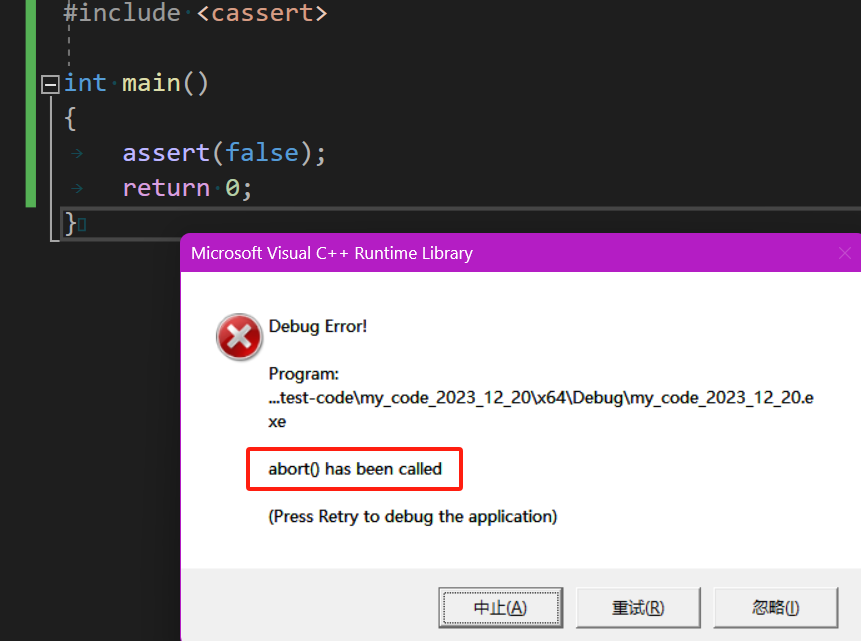
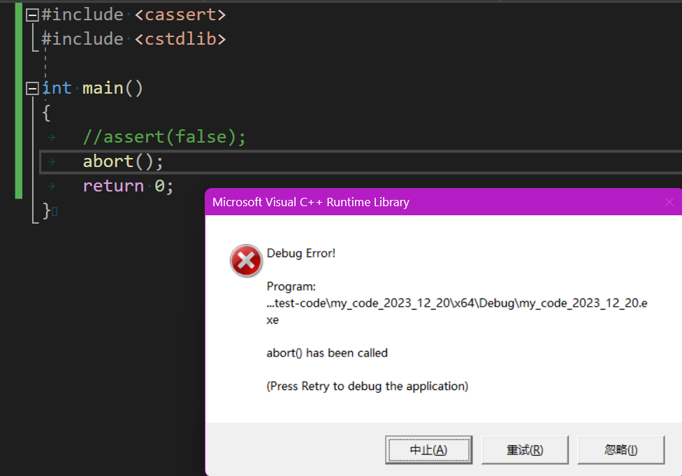
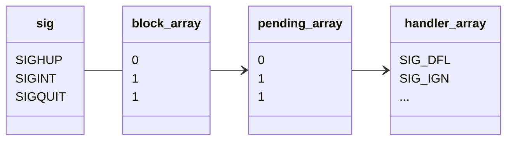

>   注意：首先需要提醒一个事情，信号量和本节提及的进程信号没有任何关系，请区分对待。

# 1.信号概念

## 1.1.生活中的信号

我们在生活中通过体验现实，记忆了一些信号，并且知道根据信号来做出对应的动作。

-   我们的大脑可以识别出信号，知道后执行对应的动作
-   如果没有特定信号，我们也知道该继续做什么
-   收到信号后，不一定就要立刻执行，需要先被临时记住

## 1.2.进程中的信号

那什么是 `Linux` 信号呢？其本质是一种通知机制，由用户或者操作系统发送给进程，因此进程是接受信号的载体，因此要谈信号，就离不开进程的基础。进程要处理信号，就必须要由识别信号的能力，然后进行处理，这套识别机制由程序员编写。

而进程接受到的信号是随机的，在信号没有产生之前，进程依旧在做自己的任务。而进程忙碌的任务很可能很重要，进程此时无法根据信号做出改变，除非信号更加重要，因此信号也就有优先级的区分，也可以被存储起来。

信号的产生对于进程而言是异步的，关于异步的概念，双方并没有在互相等待（若有一方会进行等待就是同步）。

有了这些铺垫，我们再来细细学习信号的内容。


# 2.信号分类

得到信号后，对信号处理有几个常见的处理逻辑分类：

1.   默认处理：进程默认自带的处理信号的方式，由程序写好的逻辑
2.   忽略处理：有些信号对进程有害或者进程没有对应处理逻辑的，就需要忽略该信号
3.   自定义处理：自定义捕捉某些信号，也就是程序员自己定义某些处理方法

在操作系统中可以使用 `kill -l` 看到关于信号的列表，并且有对应的解释说明：

```cmd
# 查看系统的信号
$ kill -l
 1) SIGHUP       2) SIGINT       3) SIGQUIT      4) SIGILL       5) SIGTRAP
 6) SIGABRT      7) SIGBUS       8) SIGFPE       9) SIGKILL     10) SIGUSR1
11) SIGSEGV     12) SIGUSR2     13) SIGPIPE     14) SIGALRM     15) SIGTERM
16) SIGSTKFLT   17) SIGCHLD     18) SIGCONT     19) SIGSTOP     20) SIGTSTP
21) SIGTTIN     22) SIGTTOU     23) SIGURG      24) SIGXCPU     25) SIGXFSZ
26) SIGVTALRM   27) SIGPROF     28) SIGWINCH    29) SIGIO       30) SIGPWR
31) SIGSYS      34) SIGRTMIN    35) SIGRTMIN+1  36) SIGRTMIN+2  37) SIGRTMIN+3
38) SIGRTMIN+4  39) SIGRTMIN+5  40) SIGRTMIN+6  41) SIGRTMIN+7  42) SIGRTMIN+8
43) SIGRTMIN+9  44) SIGRTMIN+10 45) SIGRTMIN+11 46) SIGRTMIN+12 47) SIGRTMIN+13
48) SIGRTMIN+14 49) SIGRTMIN+15 50) SIGRTMAX-14 51) SIGRTMAX-13 52) SIGRTMAX-12
53) SIGRTMAX-11 54) SIGRTMAX-10 55) SIGRTMAX-9  56) SIGRTMAX-8  57) SIGRTMAX-7
58) SIGRTMAX-6  59) SIGRTMAX-5  60) SIGRTMAX-4  61) SIGRTMAX-3  62) SIGRTMAX-2     
```

其中 `[1, 31]` 为普通信号，最为常用，后面 `[34, 64]` 为实时信号，比较少用，除非是某些特殊的行业。

而查看特定信号的详细描述则可以使用指令 `man 7 signal` 来查看

```cmd
# 查看特定信号的详细描述
Signal     Value     Action   Comment
──────────────────────────────────────────────────────────────────────
SIGHUP        1       Term    Hangup detected on controlling terminal
                             or death of controlling process
SIGINT        2       Term    Interrupt from keyboard
SIGQUIT       3       Core    Quit from keyboard
SIGILL        4       Core    Illegal Instruction
SIGABRT       6       Core    Abort signal from abort(3)
SIGFPE        8       Core    Floating point exception
SIGKILL       9       Term    Kill signal
SIGSEGV      11       Core    Invalid memory reference
SIGPIPE      13       Term    Broken pipe: write to pipe with no
                             readers
SIGALRM      14       Term    Timer signal from alarm(2)
SIGTERM      15       Term    Termination signal
SIGUSR1   30,10,16    Term    User-defined signal 1
SIGUSR2   31,12,17    Term    User-defined signal 2
SIGCHLD   20,17,18    Ign     Child stopped or terminated
SIGCONT   19,18,25    Cont    Continue if stopped
SIGSTOP   17,19,23    Stop    Stop process
SIGTSTP   18,20,24    Stop    Stop typed at terminal
SIGTTIN   21,21,26    Stop    Terminal input for background process
SIGTTOU   22,22,27    Stop    Terminal output for background process

The signals SIGKILL and SIGSTOP cannot be caught, blocked, or ignored.
```

`Action` 就是接收到信号后的行为，有以下的默认行为和忽略行为：

1.   `Term`：表示终止或终结（`Termination`），在 `Linux` 或类 `Unix` 系统中，`TERM` 信号用于请求进程正常终止
2.   `Core`：表示生成核心转储（`core dump`），核心转储是操作系统在程序异常终止（比如由于内存越界、除零等错误）时生成的一个包含程序内存映像的文件，这个文件可以帮助开发者诊断程序异常终止的原因（这么说有点复杂，后面有补充解释）
3.   `Ign`：表示信号被忽略（`Ignored`），系统不会采取默认的处理动作
4.   `Stop`：表示表示停止，用于暂停一个进程的执行，使其进入停止状态，此时进程会被挂起
5.   `Cont` ：在进程信号中通常表示继续执行（`Continue`），这个信号用于恢复一个之前被停止的进程的执行，当一个进程收到停止信号（如 SIGSTOP）而被暂停后，可以通过发送 "SIGCONT" 信号使其继续执行

# 3.信号捕捉

``` cpp
//系统调用 signal() 声明
#include <signal.h>
typedef void (*sighandler_t)(int);
sighandler_t signal(int signum, sighandler_t handler); //这里事使用回调的方式，修改对应的信号处理方法，而该函数返回值返回的是一个旧的函数指针，也就是注册失败之前老的处理方法，这个返回值很少使用（要么返回旧处理方法的函数指针，要么返回强转后的 SIG_ERR(错误)、SIG_DFL(默认)、SIG_IGN(忽略)），另外，该回调函数也被称为“捕捉方法”
```

在 `Linux` 中，`signal()` 用于设置信号处理程序，允许程序对接收到的信号做出响应。信号本身是一种用于通知进程发生某些事件的软件中断机制，其主要用途包括：

1.  **捕获和处理信号：** 通过 `signal()` ，你可以为特定的信号（如 `SIGINT`、`SIGTERM` 等）注册自定义的信号处理程序。这样，当进程接收到注册的信号时，相应的处理函数将被调用，允许程序执行特定的操作
2.  **改变信号的行为：** 有些信号具有默认、忽略的处理行为，例如 `SIGTERM` 通常用于请求进程正常终止，通过使用 `signal()`，你可以改变默认的信号处理行为，使其执行自定义的操作。

怎么使用这个函数呢？我们来尝试一下：

``` cpp
//使用 Signal() 调用
#include <iostream>
#include <signal.h>
#include <unistd.h>
using namespace std;

void CatchSig(int sigNum) //该回调函数被调用的时候，会将编号传递给该函数的 sig
{
    cout << " 进程捕捉到信号  " << sigNum << " [pid]为:" << getpid() << "  正在处理..." << '\n';
}

int main()
{
    //signal(2, CatchSig); //当 SIGINT 被触发时，就会调用后面的函数
    signal(SIGINT, CatchSig); //当 SIGINT 被触发时，就会调用后面的函数，特定信号的处理动作一般只有一个

    //而在循环开始前，signal() 即使被调用了，在没有接受到信号之前，不会调用 CatchSig()
    //因此 signal() 仅仅是修改进程对特定信号的后续处理动作，而不是直接调用对应的处理动作
    //这也就是为什么称为“注册”，而不是“调用”或者“设置”的原因，前者使用起来更加准确，注册不代表被立刻调用，如果进程没有接受到该信号，那么这个方法也就永远不会被调用
    while(true)
    {
        cout << " 我是进程，run..." << '\n';
        sleep(1);
    }
    return 0;
}
```

这个进程运行起来后就不能使用 `[ctrl+c]` 强行终止了，包括使用 `kill -2 <进程ID>` 或者 `kill SIGINT <进程ID>` 也都不能使用了，我们可以使用 `[ctrl+/]` 发送 `3` 号信号退出。

>   思考：这里有几个问题
>
>   1.   我们可不可以把所有的信号的捕捉方法全部修改，让一个进程无法退出只能运行？
>   2.   我们可不可以让一个进程对所有的信号都实施同一种捕捉方法？

>   填坑：“进程基础/进程操作（二）/进程等待/进程等待的方法/waitpid()”中，我们曾经提及到“...还有 `1` 个比特位是 `core dump` 标志，这个我们之后讲信号再来谈及（是否具备 `core dump`）...”，也就是这里提到的“核心转储”，那么这个标志位有什么用呢？别着急，我们先来谈及什么是“核心转储”。
>
>   一般而言，云服务器的核心转储功能是被关闭的（我们可以使用命令 `ulimit -a` 来确认，该命令显示当前 `shell` 进程的所有资源限制，这其中包括硬件资源、用户资源以及各种其他限制，其中就包括核心转储资源的限制）。
>
>   您也可以选择使用 `ulimit -c 10240` 手动打开，`10240` 是核心转储的设定大小，该设定只在本次会话有效。
>
>   此时我们再发送给进程一些带有 `Core` 行为的信号，就会发现一些不同：
>
>   ``` cmd
>   # 没有开启核心转储之前（同级目录下的两个会话/bash）
>   # -----------------
>   # bash1
>   $ cat main.cpp
>   #include <iostream>
>   #include <signal.h>
>   #include <unistd.h>
>   using namespace std;
>   
>   void CatchSig(int sigNum) //该回调函数被调用的时候，会将编号传递给该函数的 sig
>   {
>    cout << "进程捕捉到信号  " << sigNum << " [pid]为:" << getpid() << "  正在处理..." << '\n';
>   }
>   
>   int main()
>   {
>    //signal(2, CatchSig); //当 SIGINT 被触发时，就会调用后面的函数
>    signal(SIGINT, CatchSig); //当 SIGINT 被触发时，就会调用后面的函数，特定信号的处理动作一般只有一个
>   
>    //而在循环开始前，signal() 即使被调用了，在没有接受到信号之前，不会调用 CatchSig()
>    //因此 signal() 仅仅是修改进程对特定信号的后续处理动作，而不是直接调用对应的处理动作
>    while(true)
>    {
>        cout << "我是进程，run..." << "pid:" << getpid() << '\n';
>        sleep(1);
>    }
>    return 0;
>   }
>   $ vim main.cpp
>   $ g++ main.cpp
>   $ ./a.out
>   我是进程，run...pid:13517
>   我是进程，run...pid:13517
>   我是进程，run...pid:13517
>   ...
>   # -----------------
>   # bash2
>   $ kill -8 13517
>   # -----------------
>   # bash1
>   ...
>   我是进程，run...pid:13517
>   Floating point exception
>   ```
>
>   ```cmd
>   # 开启核心转储之后（统计目录下的两个会话/bash）
>   # -----------------
>   # bash1
>   $ ulimit -c 10240
>   $ ulimit -a
>   core file size          (blocks, -c) 10240
>   data seg size           (kbytes, -d) unlimited
>   scheduling priority             (-e) 0
>   file size               (blocks, -f) unlimited
>   pending signals                 (-i) 7902
>   max locked memory       (kbytes, -l) unlimited
>   max memory size         (kbytes, -m) unlimited
>   open files                      (-n) 100002
>   pipe size            (512 bytes, -p) 8
>   POSIX message queues     (bytes, -q) 819200
>   real-time priority              (-r) 0
>   stack size              (kbytes, -s) 8192
>   cpu time               (seconds, -t) unlimited
>   max user processes              (-u) 7902
>   virtual memory          (kbytes, -v) unlimited
>   file locks                      (-x) unlimited
>   $ ./a.out
>   我是进程，run...pid:15752
>   我是进程，run...pid:15752
>   ...
>   # -----------------
>   # bash2
>   $ kill -8 15752
>   $ ls
>   a.out core.15752 main.cpp
>   # -----------------
>   # bash1
>   ...
>   我是进程，run...pid:15752
>   Floating point exception (core dumped)
>   ```
>
>   可以看到 `kill` 后多了一个 `core.15752` 文件，这个文件的大小比较大，进程出异常后，由 `OS` 将该进程在内存中存储的核心数据转存到该文件中，因此该文件的主要意义是为了调试（但里面全都是二进制，文本编辑器打开就是乱码）。
>
>   二我使用的是云服务下的 `Centos7` ，在实际生产中，云服务器一般就是生产环境，当代码项目写完并且进行合并后在发布环境中编译运行，然后交给测试团队在测试环境中测试，因此一般默认关闭核心转储功能。
>
>   而如果我们使用 `-g` 选项编源代码，然后运行二进制文件后，假设出现除零错误，导致生成 `core` 文件，则使用 `gdb` 后，使用命令 `core-file <core文件名>` 就可以直接定位到出异常的地方。
>
>   ```cmd
>   # 使用 core 文件来事后调试（core 文件的作用）
>   $ cat main.cpp
>   #include <iostream>
>   #include <signal.h>
>   #include <unistd.h>
>   using namespace std;
>   
>   int main()
>   {
>     while(true)
>     {
>         cout << "我是进程，run..." << "pid:" << getpid() << '\n';
>         sleep(1);
>   
>         int a = 100;
>         a /= 0; //除零错误，会引发 OS 发出 8 号 SIGFPE 信号
>   
>         cout << "run here..." << '\n';
>     }
>     return 0;
>   }
>   
>   $ g++ main.cpp -g
>   main.cpp: In function ‘int main()’:
>   main.cpp:14:11: warning: division by zero [-Wdiv-by-zero]
>          a /= 0; //除零错误，会引发 OS 发出 8 号 SIGFPE 信号
>            ^
>   
>   $ ./a.out
>   我是进程，run...pid:21167
>   Floating point exception (core dumped)
>   
>   $ ls
>   a.out  core.21167  main.cpp
>   
>   $ gdb a.out
>   GNU gdb (GDB) Red Hat Enterprise Linux 7.6.1-120.el7
>   Copyright (C) 2013 Free Software Foundation, Inc.
>   License GPLv3+: GNU GPL version 3 or later <http://gnu.org/licenses/gpl.html>
>   This is free software: you are free to change and redistribute it.
>   There is NO WARRANTY, to the extent permitted by law.  Type "show copying"
>   and "show warranty" for details.
>   This GDB was configured as "x86_64-redhat-linux-gnu".
>   For bug reporting instructions, please see:
>   <http://www.gnu.org/software/gdb/bugs/>...
>   Reading symbols from /home/ljp/LimouGitFile/limou-c-test-code/my_code_2023_12_20/a.out...done.
>   (gdb) core-file core.21167
>   [New LWP 21167]
>   Core was generated by `./a.out'.
>   Program terminated with signal 8, Arithmetic exception.
>   #0  0x00000000004008aa in main () at main.cpp:14
>   14              a /= 0; //除零错误，会引发 OS 发出 8 号 SIGFPE 信号
>   Missing separate debuginfos, use: debuginfo-install glibc-2.17-326.el7_9.x86_64 libgcc-4.8.5-44.el7.x86_64
>   ```
>
>   因此，我们遗漏的那一个标志位的作用，就是判断是否有 `core` 动作（是否发生了核心转储），用来区分 `Trem` 的终止和 `Core` 的终止。
>
>   ```cmd
>   # 检验核心转储标志位
>   $ ls
>   main.cpp
>   
>   $ cat main.cpp
>   #include <iostream>
>   #include <stdlib.h>
>   #include <unistd.h>
>   #include <wait.h>
>   using namespace std;
>   
>   int main()
>   {
>       pid_t id = fork();
>       if(id == 0)
>       {
>           //子进程
>           sleep(1);
>           int a = 100;
>           a /= 0;
>           exit(0);
>       }
>   
>       int status = 0;
>       waitpid(id, &status, 0);
>       cout << "父进程pid:" << getpid() << '\n'
>       << "子进程pid" << id << '\n'
>       << "exit sig:" << (status & 0x7F) << '\n'
>       << "is core?:" << ((status >> 7) & 1) << '\n';
>       return 0;
>   }
>   
>   $ g++ main.cpp
>   main.cpp: In function ‘int main()’:
>   main.cpp:16:11: warning: division by zero [-Wdiv-by-zero]
>            a /= 0;
>              ^
>   
>   $ ./a.out
>   父进程pid:28256
>   子进程pid28257
>   exit sig:8
>   is core?:1
>   ```
>
>   开启了核心转储功能后，若有发生核心转储，则该标记为设置为 `1`，其他具有核心转储行为的信号也有类似的输出结果（而若关闭了核心转储功能，就绝不会将该标记设为 `1` ）。

有些时候多个值可以表示同一个信号，`Action` 是信号对应的处理动作（也就是默认行为、忽略行为，默认的大部分都行为是终止进程），`[ctrl+z]` 实际就是向进程发送了 `2` 号信号。

这里有几个问题需要我们思考：

1.   如何理解信号被进程保存起来呢？信号不就是一些值么，进程要保存一个数据那还不简单，只要内部要可以保存进程信号的相关数据结构就可以。而使用位图来保存，就再合适不过了（可以去 `task_struct{/*...*/};` 里去找找）。

2.   如何理解信号被发送呢？而由于这是修改内存级别的数据结构，只有操作系统自己才有资格进行改动，因此我们自己发送信号亦或者是其他的信号，最后都是由操作系统向目标进程发/写信号（修改 `task_struct{/*...*/};` 指定的位图结构），也只有操作系统有这个权力，我们只不过是借助操作系统的“手”罢。

3.   如何理解组合键 `[ctrl+z]` 变成信号呢？键盘工作原理是中断机制，操作系统识别到组合键后，根据进程列表，找到前台运行的进程，然后写入（发送）对应信号到进程内部的位图结构中，而至于信号什么时候被进程处理，就交给进程衡量。

     >   补充：关于中断的概念有机会我再补充...

# 4.信号产生

需要注意的是，信号是操作系统发出的，但不代表信号是操作系统产生的，操作系统应该是一个第三号令者，负责解析和将某些数据、特征、操作转化为信号发送进程。

## 4.1.通过终端按键产生信号

通过按键输入，让 `OS` 解析按键组合和解析，转化为信号，然后发送信号给进程，这我们已经用过很多次了，这里不再过多介绍。

## 4.2.通过系统调用产生信号

我们之前在使用 `kill` 的时候，实际上就是在发生信号，而系统中也的确是有一个 `kill()` 的系统调用。

```cpp
//系统调用 kill() 声明
#include <signal.h>
int kill(pid_t pid, int sig);//向目标进程发送 sig 信号
```

实际上，命令行里的 `kill` 指令底层就是 `kill()` 的调用，我们可以自己模拟一个：

```cpp
//模拟实现 kill 命令
#include <iostream>
#include <string>
#include <stdlib.h>
#include <signal.h>
using namespace std;

static void Usage(string proc)
{
    cout << "Usage:\r\n\t" << proc << " signumber processid ";
}
int main(int argc, char* argv[])
{
    if(argc != 3)
    {
        Usage(argv[0]);
        exit(1);
    }

    int signumber = atoi(argv[1]);
    int procid = atoi(argv[2]);

    kill(procid, signumber);
    return 0;
}
```

还有一个系统调用是 `raise()`，可以向调用该函数的进程发送信号（也就是进程自己发送给自己）。

```cpp
//系统调用 raise() 声明
#include <signal.h>
int raise(int sig);//向当前调用该函数的进程发送 sig 信号，等同于 kill(getpid(), sig)
```

另外还有一个让我们眼熟的系统调用 `abort()` 调用，我们经常能在断言的时候看到它：



```cpp
//库函数 raise() 声明
#include <stdlib.h>
void abort(void); //给进程自己发送确定的 abort 信号（也就是 6 号信号”SIGABRT“），自己终止自己
```



那使用 `abort()` 终止进程和使用 `exit()/_exit()` 终止进程有什么区别呢？有很大的一点在于，`6` 号信号 `SIGABRT` 会进行 `core` 行为，更加方便我们调试。

## 4.3.通过软件条件产生信号

在我们之前学习的管道中，如果一直让写端写入管道，而读端不仅不读，甚至还把读端关闭了，这样 `OS` 会通过发送信号 `13)SIGPIPE` 的方式终止写端进程，我们可以自己尝试验证一下：
```
//演示例子，待补充...
```

而操作系统因为管道这个软件（因为管道是通过文件在内存的实现），而由于管道的读端被关闭，而写端依旧在写入，因此软件条件不满足，系统就发送了可以终止的信号。

还有一种软件条件就是使用闹钟，该闹钟由 `alarm()` 设定：

```cpp
#include <unistd.h>
unsigned int alarm(unsigned int seconds); //seconds 秒后给当前进程发送 13)SIGALRM 信号（默认是终止当前进程），该函数的返回值为 0 或剩下的秒数
```

我们还可以通过这个调用来粗略计算 `CPU` 的性能：
```cpp
//计算 CPU 的性能
#include <iostream>
#include <stdio.h>
#include <unistd.h>
#include <signal.h>
using namespace std;

unsigned long long count = 0;

void CatchSig(int sigNum) //该回调函数被调用的时候，会将编号传递给该函数的 sig
{
    cout << " 捕捉到信号为: " << sigNum
    << " 本进程pid为:" << getpid()
    << " 结果为:" << count
    << '\n';
}

int main(int argc, char* argv[])
{
    alarm(1);

    signal(SIGALRM, CatchSig);
    while(true) ++count;
    return 0;
}
```

需要注意的是，该闹钟被触发后就会被自动移除，那如果需要定期完成怎么办呢？重新设置一个就好：
```cpp
//计算 CPU 的性能
#include <iostream>
#include <stdio.h>
#include <unistd.h>
#include <signal.h>
using namespace std;

unsigned long long count = 0;

void CatchSig(int sigNum) //该回调函数被调用的时候，会将编号传递给该函数的 sig
{
    cout << " 捕捉到信号为: " << sigNum
    << " 本进程pid为:" << getpid()
    << " 结果为:" << count
    << '\n';
    alarm(1);
}

int main(int argc, char* argv[])
{
    alarm(1);

    signal(SIGALRM, CatchSig);
    while(true) ++count;
    return 0;
}
```

## 4.4.通过硬件异常产生信号

操作系统是怎么发现除零错误的呢？进行计算的是 `CPU` 这个硬件，内部有寄存器，其中就有一个状态寄存器，记录本次的计算状态（检查是否溢出），可以单作记录状态的位图来理解。如果对应的除零错误的位被设置为 `1`，则证明出现除零错误，由于在进行计算的是 `CPU` 这个硬件而不是操作系统，则说明该异常是由硬件产生，再被操作系统接受，转化成信号，发送给进程。因此除零错误本质是硬件异常，而非软件问题。

常见的段错误也是硬件异常，导致 `OS` 转化该异常，发出了 `SIGSEGV` 信号，例如野指针解引用再写入，其原因在于：虚拟地址通过页表和内存管理单元硬件（`MMU`）转化为物理地址时，发现物理地址的映射是错误的，因此设置好 `MMU` 寄存器/硬件电路，由操作系统转化为信号来发送，这也是硬件异常的一种。

# 5.信号阻塞

在学习信号阻塞之前，我们先来根据前面的内容得到几个关于进程信号的术语：

1.   实际执行信号的处理动作被称为“信号递达（`Delivery`）”
2.   信号从产生到发生信号递达之间的状态被称为“信号未决（`Pending`）”
3.   进程可以选择阻塞（`Block`）某个信号，也就是“信号阻塞/信号屏蔽”，被阻塞的信号产生时将会保持在信号未决状态，知道进程解除对该进程的阻塞，才可以执行信号递达的动作
4.   需要区分好阻塞和忽略，只要信号被阻塞就不会被递达，而忽略是在递达之后的一种可选信息处理动作

## 5.1.内核表示

递达、未决、阻塞实际上表现在内核中，就是进程 `PCB` 的 `task_struct{/*...*/};` 内包含三个表，表内每一个比特位对应一个信号。



实际上系统调用 `signal()` 的原理就是根据信号 `sig`，$O(1)$ 找到对应的 `handler_array{}` 位图，然后将对应的处理方法的函数指针填入该数组中，这就完成了信号的自定义捕捉动作。

而在没有填充自定义的捕捉动作之前，内部早就填写好了默认处理行为（`SIG_DFL`）和忽略处理行为（`SIG_IGN`），这两个宏实际上就是：

```cpp
//宏 SIG_DFL 和 SIG_IGN 的定义
#define SIG_DFL ((__sighandler_t) 0)
#define SIG_IGN ((__sighandler_t) 1)
//还有一个 SIG_ERR 就是 -1 的强转，您可以查阅以下内核的代码
```

那这里的 `block_array{}` 位图代表对应的信号是否被阻塞（为 `1` 代表该信号被阻塞）。

而 `pending_array{}` 位图代表有没有接受到对应的信号（为 `1` 代表接收到某信号）

因此检测进程的步骤就是：

1.   先检测是否接受到信号（遍历 `pending_array` 是否有被设置）
2.   若步骤 `1` 检测出有信号，则检查该信号是否被阻塞（检查 `block_array{}` 数组是否有被设置）
3.   若步骤 `2` 检查到信号没被阻塞，然后执行信号的处理行为（根据索引执行存储在 `handler_array{}` 中的回调函数）

## 5.2.接口调用

### 5.2.1.sigset_t 类型

在了解其他接口之前，首先需要知道 `sigset_t` 类型，该类型是操作系统提供的，可以理解为位图类型，操作系统不允许直接使用这个类型对位图进行修改，但是可以使用接口，让操作系统自己修改，而我们接下来就会使用与之相关的两种接口：

-   直接对位图本身进行操作的接口
-   根据系统接口来完成特定的功能

从我们先前的理解来看，每个信号只有一个 `bit` 表示未决标志、阻塞标志，并不记录该信号产生、阻塞了多少次。

而这两个标志都可以分别用相同的数据类型 `sigset_t` 存储为一个“信号集”：

-   在未决信号集（`pending set`）中，有效和无效代表该信号是否处于未决状态
-   在阻塞信号集（`block set`）中，有效和无效代表该信号是否处于阻塞状态（阻塞信号集也叫作当前进程的信号屏蔽字 `signal mask`，这里的屏蔽一定要理解为阻塞的意思），默认请款下进程不会对任何信号进行阻塞

### 5.2.2.接口调用声明和解释

```cpp
//信号集接口调用
#include <signal.h>
int sigemptyset(sigset_t* set); //清空置为零
int sigfillset(sigset_t* set); //全设置为一
int sigaddset(sigset_t* set, int signo); //将特定信号添加到信号集中
int sigdelset(sigset_t* set, int signo); //将特定信号从信号集中删除
int sigismember(sigset_t* set, int signo); //判定信号是否在信号集中

int sigpending(sigset_t* set); //获取当前调用进程的 pending 信号集合交给用户
int sigprocmask(int how, const sigset_t* set, sigset_t* oldset); //检查并且更改阻塞信号集
//这里的 how 表示如何做:
//(1)SIG_BLOCK:把 set 中设置好的阻塞信号集添加到 oldset 中
//(2)SIG_UNBLOCK:把 set 中设置好的阻塞信号集从 oldset 中删去
//(3)SIG_SETMASK:把 oldset 替换为 set
//oldset 是输出型参数，返回修改前的阻塞信号集，可以利用这个做阻塞信号集恢复（不使用的话可以填入 NULL）
```

直接说明肯定会有疑惑的地方，让我们来编写几个样例试试。

### 5.2.3.信号相关接口测试

除了熟悉接口，我们要解决一些问题：

1.   对所有信号进行自定义捕捉会怎么样？如果对所有信号进行自定义捕捉，那是不是就可以写出一个恶意程序，也就是运行起来不被异常和指令杀掉的进程呢？
2.   `pending` 位图是怎么变化的？如果将 `2` 号信息进行阻塞，并且不断获取当前进程的 `pending` 信号集，如果我们突然发送 `2` 号信号，就应该可以看到 `pending` 信号集将对应的比特位置为 `1`
3.   对所有信号进行阻塞会怎么样？如果我们将所有的信号都进行阻塞，这样运行起来的进程哪怕是接受到信号也无法处理，那这样是不是也写出了一个恶意程序呢？

先解决第一个问题：对所有信号进行自定义捕捉会怎么样？

```cpp
//篡改所有信号的处理行为
#include <iostream>
#include <signal.h>
#include <unistd.h>
using namespace std;

void catchSig(int signum)
{
    cout << "获得sig:" << signum << '\n'; 
}

int main()
{
    //更改 handler 方法表
    for(int i = 1; i <= 31; i++)
        signal(i, catchSig);
    
    //死循环运行
    while(true)
    {
        cout << "当前进程pid:" << getpid() << " 运行ing" << '\n';
        sleep(1);
    }

    return 0;
}
```

我们可以看到除了 `9` 号信号，其他的信号都能被修改处理行为，为什么 `9` 号不可以修改呢？因为该信号属于管理员级别的信号，无法使用系统调用做修改，因此这种恶意程序是不被操作系统允许的。

接下来我们解决第二个问题：`pending` 位图是怎么变化的？

```cpp
//观察 pending 的变化
#include <iostream>
#include <signal.h>
#include <unistd.h>
#include <stdlib.h>
#include <stdio.h>
#include <cassert>
using namespace std;

void ShowPending(sigset_t& pending)
{
    cout << "进程 " << getpid() << " 打印一次 pending 集合" << '\n';
    for(int sig = 1; sig <= 31; sig++)
    {
        if(sigismember(&pending, sig))
            cout << " 1 ";
        else
            cout << " 0 ";

        if(sig % 10 == 0)
            cout << '\n';

        fflush(stdout);
    }
    cout << '\n';
}

int main()
{
    //1.定义信号集
    sigset_t bset, obset;

    //2.初始化
    sigemptyset(&bset);
    sigemptyset(&obset);

    //3.添加要阻塞（屏蔽）的信号
    sigaddset(&bset, 2); //SIGINT

    //4.设置内核中关于信号的结构
    int n = sigprocmask(SIG_BLOCK, &bset, &obset);
    assert(n == 0), (void)n;
    cout << "block 2 号信号成功" << '\n';

    //5.重复打印 pending 信号集
    while(true)
    {
        //5.1.获取 pending 信号集
        sigset_t pending;
        sigemptyset(&pending);
        sigpending(&pending);

        //5.2.打印 pending 信号集
        ShowPending(pending);
        sleep(3);
    }
    return 0;
}
```

当我们发送 `2` 信号时就会修改位图。

```bash
# 观察 pending 信号集的打印结果
# bash1
$ ls
main.cpp
$ g++ main.cpp
$ ./a.out
block 2 号信号成功
进程 1916 打印一次 pending 集合
 0  0  0  0  0  0  0  0  0  0 
 0  0  0  0  0  0  0  0  0  0 
 0  0  0  0  0  0  0  0  0  0 
 0 
进程 1916 打印一次 pending 集合
 0  0  0  0  0  0  0  0  0  0 
 0  0  0  0  0  0  0  0  0  0 
 0  0  0  0  0  0  0  0  0  0 
 0 
进程 1916 打印一次 pending 集合
 0  0  0  0  0  0  0  0  0  0 
 0  0  0  0  0  0  0  0  0  0 
 0  0  0  0  0  0  0  0  0  0 
 0 
进程 1916 打印一次 pending 集合
 0  0  0  0  0  0  0  0  0  0 
 0  0  0  0  0  0  0  0  0  0 
 0  0  0  0  0  0  0  0  0  0 
 0 

# bash2
$ kill -2 1916

# bash1
# ...
进程 1916 打印一次 pending 集合
 0  1  0  0  0  0  0  0  0  0 
 0  0  0  0  0  0  0  0  0  0 
 0  0  0  0  0  0  0  0  0  0
# ...
```

而我们还可以利用 `obset` 来恢复对 `2` 号信号的阻塞。

```cpp
//观察取消阻塞（屏蔽）后现象的代码1
#include <iostream>
#include <signal.h>
#include <unistd.h>
#include <stdlib.h>
#include <stdio.h>
#include <cassert>
using namespace std;

void ShowPending(sigset_t& pending)
{
    cout << "进程 " << getpid() << " 打印一次 pending 集合" << '\n';
    for(int sig = 1; sig <= 31; sig++)
    {
        if(sigismember(&pending, sig))
            cout << "1";
        else
            cout << "0";
    }
    cout << '\n';
}

int main()
{
    //1.定义信号集
    sigset_t bset, obset;

    //2.初始化
    sigemptyset(&bset);
    sigemptyset(&obset);

    //3.添加要阻塞（屏蔽）的信号
    sigaddset(&bset, 2); //SIGINT

    //4.设置内核中关于信号的结构
    int n = sigprocmask(SIG_BLOCK, &bset, &obset);
    assert(n == 0), (void)n;
    cout << "block 2 号信号成功" << '\n';

    //5.重复打印 pending 信号集
    int count = 0;
    while(true)
    {
        //5.1.获取 pending 信号集
        sigset_t pending;
        sigemptyset(&pending);
        sigpending(&pending);

        //5.2.打印 pending 信号集
        ShowPending(pending);
        sleep(1);
        count++;
        //5.3.恢复 pending 信号集（解除 2 号信号的屏蔽）
        if(count == 20)
        {
            int n = sigprocmask(SIG_UNBLOCK, &bset, &obset);
            assert(n == 0), (void)n;
            cout << "ublock 2 号信号成功" << '\n';
        }
    }
    return 0;
}
```

但是为什么需要阻塞后进程就会被终止呢？很简单，`2` 号信号是一个可以让进程终止的信号，如果取消了阻塞，进程检测到该信号未决后，发生了信号递达，因此就有直接终止了进程，要想观察到打印出来的 `pending` 位图重新置为 `0`，可以修改 `2` 号信号的捕捉方法：

```cpp
//观察取消阻塞（屏蔽）后现象的代码2
#include <iostream>
#include <signal.h>
#include <unistd.h>
#include <stdlib.h>
#include <stdio.h>
#include <cassert>
using namespace std;

void ShowPending(sigset_t& pending)
{
    cout << "进程 " << getpid() << " 打印一次 pending 集合" << '\n';
    for(int sig = 1; sig <= 31; sig++)
    {
        if(sigismember(&pending, sig))
            cout << "1";
        else
            cout << "0";
    }
    cout << '\n';
}

void handler(int sig)
{
    cout << "捕捉信号:" << sig << '\n';
}

int main()
{
    //0.修改 2 号信号的捕捉方法
    signal(2, handler);

    //1.定义信号集
    sigset_t bset, obset;

    //2.初始化
    sigemptyset(&bset);
    sigemptyset(&obset);

    //3.添加要阻塞（屏蔽）的信号
    sigaddset(&bset, 2); //SIGINT

    //4.设置内核中关于信号的结构
    int n = sigprocmask(SIG_BLOCK, &bset, &obset);
    assert(n == 0), (void)n;
    cout << "block 2 号信号成功" << '\n';

    //5.重复打印 pending 信号集
    int count = 0;
    while(true)
    {
        //5.1.获取 pending 信号集
        sigset_t pending;
        sigemptyset(&pending);
        sigpending(&pending);

        //5.2.打印 pending 信号集
        ShowPending(pending);
        sleep(1);
        count++;
        //5.3.恢复 pending 信号集（解除 2 号信号的屏蔽）
        if(count == 20)
        {
            int n = sigprocmask(SIG_UNBLOCK, &bset, &obset);
            assert(n == 0), (void)n;
            cout << "ublock 2 号信号成功" << '\n';
        }
    }
    return 0;
}

```

再次发送 `2` 号信号，就可以观察到 `1` 置为 `0` 的现象了。

>   补充 `1`：这里有一个小问题，直觉上，应该是先解除对 `2` 号信号的阻塞，然后进行捕捉
>
>   ```bash
>   # 关于打印顺序的异或
>   进程 5465 打印一次 pending 集合
>   0100000000000000000000000000000
>   捕捉信号:2
>   ublock 2 号信号成功
>   进程 5465 打印一次 pending 集合
>   0000000000000000000000000000000
>   ```
>
>   但是我们的代码输出是反着来的，变成了先捕捉，然后解除 `2` 号信号的阻塞。这个的原因是什么呢？只是我们代码书写顺序问题罢了，只有调用完 `sigprocmask()` 后才能打印后面的提示信息，因此可以将打印提示的代码调整到系统调用前面。
>
>   补充 `2`：观察系统调用，我们会发现没有对 `pending` 位图进行直接修改的接口，只有对 `block` 位图进行直接修改的接口，因为没有必要，我们在发送信号的时候，操作系统会帮助我们设置好 `pending` 位图。

接下来我们来解决第三个问题：对所有信号进行阻塞会怎么样？

```cpp
//对所有信号进行阻塞
#include <iostream>
#include <signal.h>
#include <unistd.h>
#include <stdlib.h>
#include <stdio.h>
#include <cassert>
using namespace std;

void ShowPending(sigset_t& pending)
{
    cout << "进程 " << getpid() << " 打印一次 pending 集合" << '\n';
    for(int sig = 1; sig <= 31; sig++)
    {
        if(sigismember(&pending, sig))
            cout << "1";
        else
            cout << "0";
    }
    cout << '\n';
}

int main()
{
    //屏蔽所有信号
    sigset_t best;

    for(int sig = 0; sig <= 31; sig++)
    {
        sigemptyset(&best);
        sigaddset(&best, sig);
        int n = sigprocmask(SIG_BLOCK, &best, nullptr);
        assert(n == 0), (void) n;
    }

    //不断获取 pending 信号集并且打印
    sigset_t pending;
    while(true)
    {
        sigpending(&pending);
        ShowPending(pending);
        sleep(1);
    }
    return 0;
}
```

可以使用一个简单的 `shell` 脚本来测试信号阻塞后 `pending` 位图的输出结果。

```shell
i=1; id=$(pidof a.out); while [ $i -le 31 ]; do  kill -$i $id; echo "send signal $i"; let i++; sleep 1; done
```

我们发现 `9` 号信号依旧是比较特殊的，我们无法对其进行屏蔽，那我们就重新设计一个 `shell` 脚本来跳过 `9` 号信号（实际上 `19` 信号也一样是特殊的，我们也将其屏蔽）

```cpp
# 不发送 9 号和 19 号信号给进程
name=a.out
i=1
id=$(pidof $name)
while [ $i -le 31 ]
do 
    if [ $i -eq 9 ];then
        let i++
        continue
    fi
    if [ $i -eq 19 ];then
        let i++
        continue
    fi

    kill -$i $id
    echo "send signal $i:kill -$i $id"
    let i++
    sleep 1
done
```

最终结论：`9` 号信号极度特殊，无法使用接口阻塞和屏蔽。

# 6.信号原理

通过前面的学习，我们还需要解答几个问题：

1.   信号产生后，可能无法被立刻处理，此时该信号就会被存储起来，那么这个时候是什么时候？又是怎么判定的？
2.   信号处理的整个流程是怎么样的？

首先我们要知道，信号的相关数据字段一定在进程`PCB`内部，也就是在内存里，属于内核范畴的操作，因此处理信号的时候，就一定要在内核态的时候进行处理。而在内核态的时候就会把接受到的无法立即处理的信号存储起来，返回用户态的时候，再进行信号检测和信号处理。

其中，如果一份代码在运行的过程中，涉及到内核操作、进程调度、系统调用等操作时就处于内核状态，而执行用户代码打印、循环等操作时就处于用户状态。

用户态是被 `OS` 管控的状态（“管控”是指资源限制、权限限制），内核态具备非常高的优先级。

那我们怎么细致区分两者呢？还记得进程空间分为内核空间和用户空间不？而我们之前提到的页表就是用户页表，用户地址空间会通过用户页表映射到物理空间中。而还有一张内核级页表，可以简单认为是被所有的进程共享的（因为操作系统只有一份），就可以将操作系统需要的代码和数据映射到物理空间中。

因此任何一个进程想要使用系统调用，就需要用到系统调用的代码，而系统调用的代一定再内核里，一旦有了系统级的页表，就可以映射到系统调用的实现代码（因为进程内部就可以直接跳转到内核空间，通过页表找到加载进内存的系统调用的代码）。

因此每个进程想要调用系统调用就可以直接根据自己的进程地址空间和系统级页表来找到系统调用的实现代码。

`CPU` 内部就有寄存器区分用户态和内核态。

