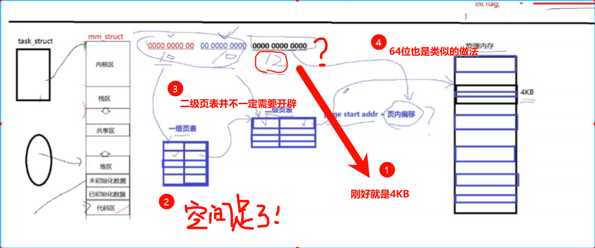

>   补充：这里补充一些关于页表和内存细粒度划分的知识...
>
>   

# 1.线程概念

## 1.1.线程和进程的区别

线程在进程内部执行，是 `OS` 调度的基本单位，这是一种常见的说法，虽然每个字您都认识，但是您有可能无法直接理解，我们慢慢来阐述。

假设一个场景：每个进程都有自己的进程地址空间和进程 `PCB`，如果我们有一种方法，创建多个进程的时候只创建多个进程 `PCB` 对象，但是都指向父进程的进程地址空间，通过一定的技术手段，将父进程的进程地址空间以一定的方式划分给不同子进程的 `task_struct{/*...*/};` 内，达到共享资源的目的，例如“多个执行流各自执行在同一个代码区内的不同函数”。而对于 `CPU` 来讲，运行每一个进程就像是运行每一个独立的进程，在 `CPU` 的视角下，每个进程都有自己的进程地址空间。

在这里的每一个进程都可以被称为“线程”，再回到一开始提及的线程概念：

-   “线程在进程内部执行”：就是指在进程的地址空间内运行
-   “是 `OS` 调度的基本单位”：就是指 `CPU` 不关心执行流是进程还是线程，只关心 `PCB` 结构（`CPU` 不关心线程和进程概念的区分）

线在不同的操作系统中，实现方案也有可能会不同，只要满足前面的特征就都是“线程”。其中，`Linux` 没有为线程专门设计数据结构（`Windows` 有真正的线程，有设计专门的数据结构），在 `Linux` 下，进程和线程的概念高度重合（最大的区别在于有无独立属于自己的进程地址空间），因此 `Linux` 用巧妙地方式实现了“软件复用”（当然还是有很大的区别，但是核心代码是很类似的）。

而有了线程，就可以通过特定的划分，从以前单个执行流的串行运行转化到在多个执行流中并发运行，程序效率将会大大提高。

而进程的概念我们还需要细化一下，进程就是：

-   用户视角：是一种内核数据结构，有该进程所需要的代码和数据，并且拥有自己的进程地址空间，有可能包含多个 `PCB` 结构的线程（以前我们认为进程只需要一个进程 `PCB` 结构，把进程 `PCB` 结构代表一个进程，实际上进程 `PCB` 结构只是进程的一个执行流，是描述执行流的数据结构，`CPU` 调度的不是进程，而是执行流！）
-   内核视角：是承担系统资源分配的基本实体（也就是一整个进程的资源请求）

而以前我们是使用单个单个的进程，最多就是使用多进程的代码，都是单执行流的。但是有了线程的概念，就可以使用一个进程写出多线程的代码，内部具有多个执行流。

>   注意 `1`：以前我们对 `PCB` 结构的理解比较狭隘，从学习线程开始就必须要暗暗注意，理解好 `PCB` 的本质。
>
>   注意 `2`：`Linux` 的 `PCB` 结构体量级会比其他操作系统更轻，是轻量级进程，轻量级进程代表别的操作系统的单进程
>
>   注意 `3`：由于 `Linux` 没有提供线程的结构，因此没有直接提供线程的接口，只能提供轻量级进程的

但是这对于其他操作系统的开发者来说有点不友好，因此 `Linux` 为了生态问题还是提供了线程接口，在用户层实现了多线程方案，以动或静态库的方式提供接口，这个库就是 `pthread`，任何一款发行版的 `Linux` 系统都有这个原生线程库，作为用户的我们调用接口即可（但是内部实现还是用的轻量级进程的实现）

## 1.2.线程的优点和缺点

线程的优点很多：

1.   占用资源低：创建一个新线程的代价要比创建一个新进程小得多，线程占用的资源也比进程少很多  

2.   调度成本低：与进程之间的切换相比，线程之间的切换需要操作系统做的工作要少很多

3.   运行效率高：能充分利用多处理器的可并行数量

     (1)计算密集型应用提效，为了能在多处理器系统上运行，可以将计算分解到多个线程中实现提高 `CPU` 密集型程序的执行效率

     (2)`IO` 密集型应用提效，为了提高性能，将 `IO` 操作重叠。线程可以同时等待不同的 `IO` 操作，在等待慢速 `IO` 操作结束的同时，程序可执行其他的计算任务

而线程概念的出现，又会导致更多的问题：

1.   性能有损失：看似和上面的结论很矛盾，实际上只是一个适量的问题，一个很少被外部事件阻塞的计算密集型线程往往无法与它的线程共享同一个处理器。如果计算密集型线程的数量比可用的处理器多，那么可能会有较大的性能损失，这里的性能损失指的是增加了额外的同步和调度开销，而可用的资源不变（一定要适度使用多线程，而不是盲目使用）
2.   健壮性降低：编写多线程代码需要全面、深入的考虑，在一个多线程程序里，因时间分配上的细微偏差或因共享了不该共享的变量而造成不良影响的可能性很大，线程之间缺乏保护的
3.   缺乏访问控制：进程是访问控制的基本粒度，在一个线程中调用某些系统调用时会对整个进程造成影响
4.   编程难度提高：编写与调试一个多线程程序比单线程程序困难得多
5.   线程异常问题：单个线程如果出现除零，野指针问题导致线程崩溃，进程也会随着崩溃。而线程是进程的执行分支，线程出异常，就类似进程出异常，进而触发信号机制，终止进程，该进程内的所有线程也就全部开始退出

有了这一概念的铺垫，接下来就可以深入学习其他的知识了。

>   补充：一般而言，线程的总数不会超过 `CPU` 内核的个数。

## 1.3.线程共享进程资源

进程地址空间共享，包含：

-   代码区共享：也就是代码
-   栈区共享：严格来说也是共享，但是一般认为私有，很少将局部变量给多个线程共享
-   堆区共享：虽然可以共享，但是一般一个线程自己申请自己的堆空间，一般也认为是私有
-   共享区共享：典型的就是 `C` 库文件被共享使用
-   未初始化/已初始化数据区共享：典型的就是全局变量
-   内核区共享：略

除了进程地址空间共享，实际上线程还共享了进程的文件描述符表、对每种信号的处理方法、当前的工作目录、用户 `id` 和用户组 `id`。

而为什么线程的切换成本更低呢？

1.   进程地址空间无需切换，用户级页表无需切换，但是这只是无需更新 `CPU` 内的寄存器，不是成本低的主要原因，仅仅是次要原因
1.   `CPU` 内部还有一个硬件叫做 `cache`，也就是“高速缓存”，操作系统会提前将内存内部分代码和数据加载进 `cache` 进行预读操作（因为这些数据有可能需要反复读写，先加载到 `cache` 会更快一些）。切换线程后，`CPU` 寻址的时候无需将内存中的数据刷新到 `cache`，依旧可以使用原来的 `cache`。而切换进程后，`cache` 内的数据就失效了，只能重新从内存中加载，这才是切换成本更低、更轻量化的主要原因

上述两个原因，在多个线程和多个进程切换的时候会比较明显。

## 1.4.线程内部独特资源

线程虽然共享进程的内存地址空间资源，但是也有独属于自己的一部分数据：

-   线程 `id`（`LWP`）
-   `errno`
-   信号屏蔽字
-   调度优先级
-   一组寄存器（上下文数据）
-   栈（一般认为是私有的、独立的栈结构，但这比较奇怪，栈区只有一个，这要怎么私有？后面提及...）

>   补充：最后两点体现了线程的动态属性，是最为重要的。

# 2.线程控制

接下来学习的有关线程控制的线程接口，都在声明在头文件 `pthread.h` 中，严格来说这个库属于系统，不属于 `C/C++` 库内，因此在使用 `gcc` 编译的时候需要添加选项 `-lpthread`。

## 2.1.线程创建

```cpp
//线程创建 pthread_create() 声明
#include <pthread.h>
int pthread_create(
    pthread_t* thread, //线程 id
	const pthread_attr_t* attr, //线程属性
    void* (*start_routinue) (void*), //使用回调函数的方式让线程执行一部分的代码
    void* arg); //传递给函数指针的参数
```

这个接口还挺有趣，让我们来用一下试试：

```cpp
//尝试创建新线程（注意使用 g++ 编译的时候加上参数 -lpthread）
#include <iostream>
#include <string>
#include <pthread.h>
#include <unistd.h>
using namespace std;

void* ThreadRun(void* args) //args 获取参数，也就是 pthread_create() 的最后一个参数
{
    const string name = (char*)args;
    cout
    << "新线程的 name:" << name << '\n' //显示线程名
    << "新线程所处进程的 pid:" << getpid() << '\n'; //检验线程是否真的在进程内（若是则获得和进程一样的 pid）
    sleep(100);
    cout << "新进程任务结束" << '\n';

    return nullptr;
}

int main()
{
    //打印本进程的 pid
    cout << "本进程的 pid:" << getpid() << '\n';

    //创建 5 个新线程
    pthread_t tids[5] = { 0 };
    for(int i = 0; i < 5; ++i)
    {
        string name = "thread ";
        name += to_string(i + 1);
        pthread_create(
            tids + i, //线程 id
            nullptr, //线程属性
            ThreadRun, //使用回调函数的方式让线程执行一部分的代码
            (void*)name.c_str() //传递给函数指针的参数
        );
        sleep(1);
    }

    //主线程持续运行
    cout << "-------" << '\n';
    while(true)
    {
        cout << "主线程所处进程的 pid:" << getpid() << '\n';
        sleep(1);
    }

    return 0;
}

```

使用 `ps -a` 只能查看到一个进程的存在，但是使用 `ps -aL` 可以看到所有轻量级进程的存在，并且还有轻量级进程的标识符 `LWP`：

```bash
# 查看进程和轻量级进程的标识符
$ ps -a
  PID TTY          TIME CMD
 6867 pts/13   00:00:00 a.out
 6897 pts/14   00:00:00 ps
$ ps -aL
  PID   LWP TTY          TIME CMD
 6867  6867 pts/13   00:00:00 a.out
 6867  6868 pts/13   00:00:00 a.out
 6867  6877 pts/13   00:00:00 a.out
 6867  6884 pts/13   00:00:00 a.out
 6867  6890 pts/13   00:00:00 a.out
 6867  6898 pts/13   00:00:00 a.out
 6925  6925 pts/14   00:00:00 ps
```

可以看到还有一个 `pid` 和 `lwp` 一样的线程，该线程就是主线程，如果进程只有一个线程，那么看哪一个都没有差别（反正标识都一样）。

并且终止任意一个线程的 `pid` 都会导致整个进程终止，因为 `pid` 是一样的。

## 2.2.线程终止


## 2.3.线程等待


## 2.4.线程分离

## 2.5.线程互斥

### 2.5.1.互斥量概念


### 2.5.2.互斥量接口

### 3.2.1.互斥量初始化

### 3.2.2.互斥量销毁

### 3.2.3.互斥量加锁和解锁


## 3.3.互斥量原理


# 4.可重入和线程安全


# 5.常见锁现象


# 6.线程同步


# 7.生产者消费者模型


# 8.POSIX 信号量


# 9.线程池


# 10.线程安全单例模式


# 11.读者写者问题

