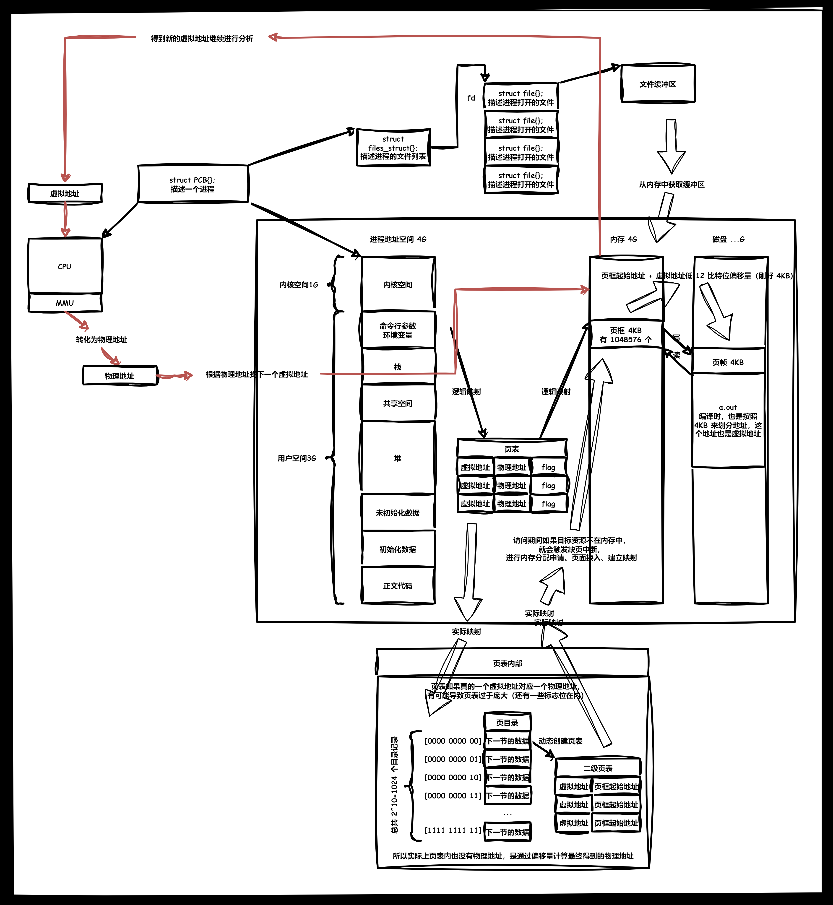
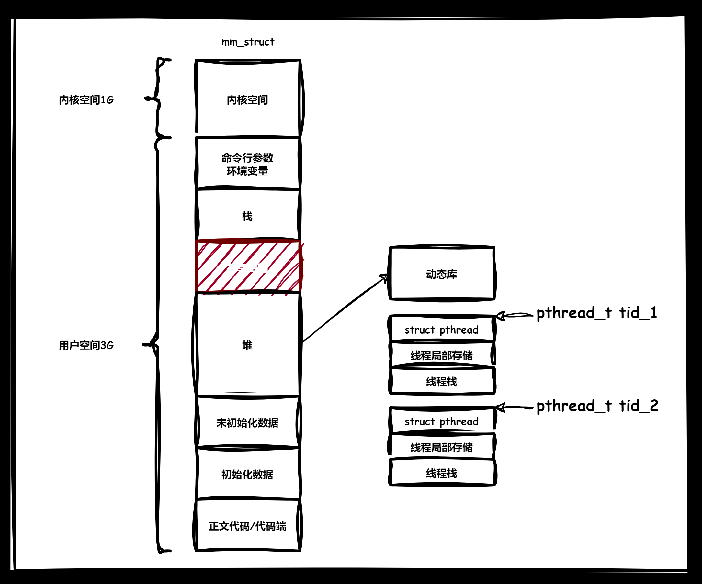
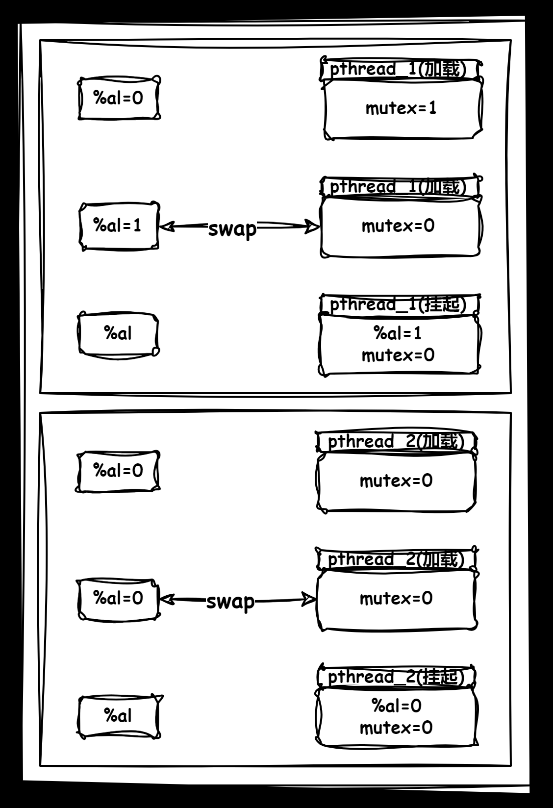
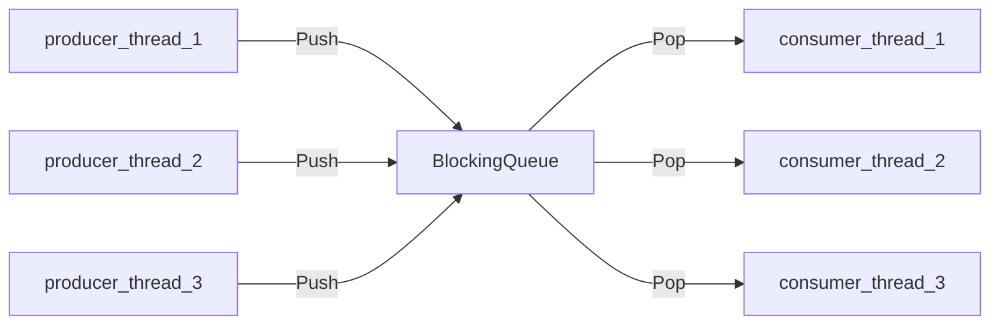
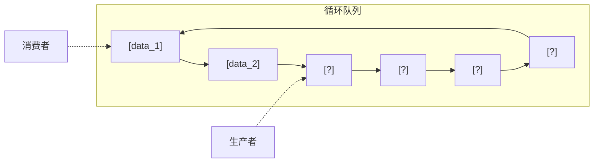
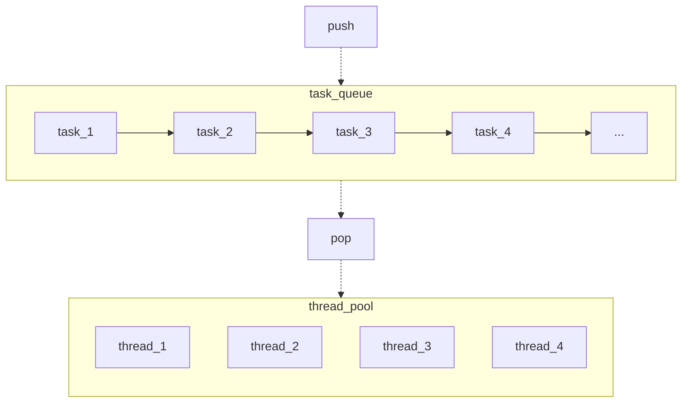

>   前要：本章节的主要线程的基本操作，以及针对线程的问题出现的两个解决方案，即互斥量、条件变量。这两者解决的问题，有些类似 `C++` 解决多继承的二义性和性能低效（空间低效）的问题，互斥量、条件变量主要解决有关线程的二义性和性能低效（时间低效）的问题。

# 1.线程概念

## 1.1.线程和进程的区别

### 1.1.1.线程

**线程是在进程内部的执行流，是 OS 调度的基本单位**。这是一种常见的说法，虽然每个字您都认识，但是您有可能无法理解，我们慢慢来阐述。

假设一个场景：

1.   每个进程都有自己的进程地址空间和进程 `PCB`，如果我们有一种方法，创建多个子进程的时候只创建多个进程 `PCB` 对象，但是都指向同一个父进程的进程地址空间（就是两个指针指向同一个数据结构对象嘛）。即通过一定的技术手段，将父进程的进程地址空间以一定的方式划分给不同子进程的 `task_struct{/*...*/};` 内，达到共享资源的目的，例如“多个执行流各自执行在同一个代码区内的不同函数”。

2.   而对于 `CPU` 来讲，运行上述的每一个“子进程”就像是运行每一个独立的进程，在 `CPU` 的视角下，每个子进程都有自己的进程地址空间（这是一种狡诈的欺骗技术）。

3.   在这里的每一个子进程都可以被称为 **线程**，再回到一开始提及的线程概念：

     (1)“线程在进程内部执行”：指在进程的地址空间内运行

     (2)“是 `OS` 调度的基本单位”：指 `CPU` 不关心执行流是进程还是线程，只关心 `PCB` 结构

**线程在不同的操作系统中，实现方案也有可能会不同，只要满足上述的特征就都是线程。**

某些意义上来说 `Linux` 没有为线程这个概念来设计专门的数据结构（但是 `Windows` 有真正的线程，有设计专门的数据结构）。

在 `Linux` 下，进程和线程的概念高度重合（最大的区别点在于有无独立属于自己的进程地址空间），因此 `Linux` 用巧妙地方式实现了“软件复用”，把一种轻量级进程当作线程（当然还是有很大的区别，但是核心代码是很类似的）。

而有了线程，就可以通过系统调用进行特定的划分，进而 (1)从以前单个执行流的串行运行转化到在多个执行流中并发运行 (2)减少了创建进程的准备工作 让整个程序的执行效率大大提高。

### 1.1.2.进程

而进程的概念我们还需要细化一下，进程就是：

-   用户视角：是一种内核数据结构，有该进程所需要的代码和数据，并且拥有自己的进程地址空间（而进程地址空间是资源的窗口，对应的资源存储在内存上），有可能包含多个 `PCB` 结构的线程。

    以前我们认为进程只需要一个进程 `PCB` 结构，把进程 `PCB` 结构代表一个进程，实际上进程 `PCB` 结构只是进程的一个执行流，是描述执行流的数据结构，`CPU` 调度的不是进程，而是一个执行流！

-   内核视角：是承担系统资源分配的基本实体（也就是说资源请求一般是申请到一个进程的资源）。

因此 **线程是调度的基本单位**，而 **进程是承担分配系统资源的基本单位**。

以前我们使用单个进程，最多就是使用多进程的代码，每个进程都是单执行流的。但是有了线程的概念，就可以使用一个进程写出多线程的代码，内部具有多个执行流（也就是说，以前学习的就是：==“单线程进程”和“多个单线程进程”==，扩充了线程的概念后，就多了 ==“多线程进程”和“多个多线程进程”==）。

>   注意 `1`：以前我们对 `PCB` 结构的理解比较狭隘，从学习线程开始就必须要暗暗注意，理解好 `PCB` 的本质。
>
>   注意 `2`：`Linux` 的 `PCB` 结构体量级会比其他操作系统更轻，是轻量级进程，轻量级进程代表别的操作系统的单进程。

关于进程的调度过程，下面这张图可以进行一定的阐述。



## 1.2.线程的优点和缺点

线程的优点很多： 

1.   **占用资源低**：创建一个新线程的代价要比创建一个新进程小得多，线程占用的资源也比进程少很多  

2.   **调度成本低**：与进程之间的切换相比，线程之间的切换需要操作系统做的工作要少很多

     (1)**次要原因**：进程地址空间无需切换，用户级页表无需切换，但是这只是无需更新 `CPU` 内的寄存器，不是成本低的主要原因

     (2)**主要原因**：`CPU` 内部还有一个硬件叫做 `cache`，也就是“高速缓存”，操作系统会提前将内存内部分代码和数据加载进 `cache` 进行预读操作（因为这些数据有可能需要反复读写，先加载到 `cache` 会更快一些）。切换线程后，`CPU` 寻址的时候无需将内存中的数据刷新到 `cache`，依旧可以使用原来的 `cache`。而切换进程后，`cache` 内的数据就失效了，只能重新从内存中加载，这才是切换成本更低、更轻量化的主要原因

     上述两个原因在多个线程和多个进程切换的时候，现象会比较明显。

3.   **运行效率高**：能充分利用多处理器的可并行数量

     (1)计算密集型应用提效，为了能在多处理器系统上运行，可以将计算分解到多个线程中实现提高 `CPU` 密集型程序的执行效率

     (2)`IO` 密集型应用提效，为了提高性能，将 `IO` 操作重叠。线程可以同时等待不同的 `IO` 操作，在等待慢速 `IO` 操作结束的同时，程序可执行其他的计算任务，避免阻塞导致程序停滞

4.   **通信速度快**：线程之间的通信方式更加简单且快，但是有可能更加复杂

而线程概念的出现，又会导致更多的问题：

1.   **性能可能损失**：看似和上面的结论很矛盾，实际上只是一个适量的问题，一个很少被外部事件阻塞的计算密集型线程往往无法与它的线程共享同一个处理器。如果计算密集型线程的数量比可用的处理器多，那么可能会有较大的性能损失，这里的性能损失指的是增加了额外的数据同步和线程调度开销，而可用的资源却不变（一定要适度使用多线程，而不是盲目使用）
2.   **健壮性会降低**：编写多线程代码需要全面、深入的考虑，在一个多线程程序里，因时间分配上的细微偏差或因共享了不该共享的变量而造成不良影响的可能性很大，也就是说线程之间缺乏保护，一个线程出错就会影响到别的线程
3.   **缺乏访问控制**：进程是访问控制的基本粒度，在一个线程中调用某些系统调用时会对整个进程造成影响
4.   **编程难度提高**：编写与调试一个多线程程序比单线程程序困难得多
5.   **线程异常问题**：单个线程如果出现除零、野指针访问等问题导致线程崩溃，那么进程也会随着崩溃。而线程是进程的执行分支，线程出异常，就类似进程出异常，进而触发信号机制，终止进程，该进程内的所有线程也就全部开始退出。因此，无论是奔溃还是退出都是以进程为基本单位的

有了这一概念的铺垫，接下来就可以深入学习其他的知识了。

>   补充：一般而言，线程的总数不会超过 `CPU` 内核的个数，理论上刚好等于时最好。

## 1.3.线程共享进程资源

**共享进程地址空间**，包含：

-   代码区共享：也就是代码部分
-   栈区共享：严格来说也是共享，但是一般认为私有，很少将局部变量给多个线程共享
-   堆区共享：虽然可以共享，但是一般一个线程自己申请自己的堆空间，也认为是私有
-   共享区共享：典型的就是 `C` 的库文件被共享使用
-   未初始化/已初始化数据区共享：典型的就是全局变量被共享使用
-   内核区共享：略

除了进程地址空间共享，实际上线程还共享 **进程的文件描述符表（共享打开的文件）**、**对每种信号的处理方法**、**当前的工作目录**、**用户 `id` 和用户组 `id`** 等。

## 1.4.线程内部独特资源

线程虽然共享进程的内存地址空间资源，但是也有独属于自己的一部分数据：

-   线程 `id`（字段 `LWP(Light Weight Process，轻量级进程)`）
-   `errno` 的设置
-   信号屏蔽字
-   调度优先级
-   一组寄存器数据/切换时的上下文数据（这点很 ==重要==，意味着线程是动态切换）
-   栈（一般认为是私有的、独立的栈结构，但这比较奇怪，栈区只有一个，直接压栈和出栈很容易出现问题，这要怎么私有？后面提及...这点也很 ==重要==）

从资源所属这里可以看到，**线程以共享资源为主（独立资源为辅），进程以独立资源为主（共享资源为辅）**。另外，所谓进程进行资源共享就是进程通信的部分。

>   补充：最后两点体现了线程的动态属性，是最为重要的。

# 2.线程控制

由于 `Linux` 没有直接提供线程的结构，因此没有直接提供线程的接口，只会提供轻量级进程的接口（侧面说明没有线程）。

但是这对于其他操作系统的开发者来说有点不友好（大家用的操作系统都有进程和线程），因此 `Linux` 为了生态问题还后在用户层实现了多线程方案，以动或静态库的方式提供接口，这个库就是 `<pthread.c>`，是一个十分接近系统调用的线程库。

基本上任何一款发行版的 `Linux` 系统都有这个原生线程库，作为用户的我们调用接口即可（但是内部实现还是用的轻量级进程的实现）。

>   补充：如果细心的话，您可以查看一下关于进程接口的实现，创建进程的 `fork()` 底层调用的是 `clone()`，该接口可以创建出一个独立的轻量级进程。而 `vfork()` 是创建轻量级子进程，但是可以共享的是父进程的资源（这些都侧面说明， `Linux` 的确是只提供了轻量级别进程的结构和设置）。
>
>   *   `clone()` 是 `Linux` 提供的一个非常灵活的系统调用，用于创建进程。它允许调用者精细控制子进程的行为，包括共享与父进程的哪些资源（如文件描述符、内存等）。通过传递不同的标志参数，`clone()` 可以用来实现线程（轻量级进程）、协程等。
>   *   `vfork()` 是一种特殊的 `fork()` 使用方式，设计初衷是为了解决 `fork()` 在创建新进程时复制父进程地址空间的性能问题。`vfork()` 创建的子进程与父进程共享地址空间，并且子进程会在 `exec()` 系列函数调用或者通过 `_exit()` 退出之前阻塞父进程。

接下来学习的有关线程控制的线程接口，都在声明在头文件 `pthread.h` 中，严格来说这个库属于系统，不属于 `C/C++` 库内，因此在使用 `gcc` 编译的时候需要添加选项 `-lpthread`。

而库函数就需要对线程进行管理，就需要先描述，而用于描述的结构体对象 `struct tcb{/.../};` 实现在线程库的源代码中不在系统中，并且还读取系统中轻量级进程的属性，整合了一些和线程概念相符的属性，还有划分各种共享资源和独享资源，最终把一个“线程”提供给用户。

>   注意：至于哪一个线程先被启动，对于用户来说是未知的，根据调度器的判断而定。

## 2.1.线程创建

```cpp
//线程创建 pthread_create() 声明
#include <pthread.h>
int pthread_create(
    pthread_t* thread, //线程 id，注意是在这里获取的，不是直接返回的，和进程有些区别
	const pthread_attr_t* attr, //线程属性
    void* (*start_routinue) (void*), //使用回调函数的方式让线程执行一部分的代码
    void* arg //传递给函数指针的参数
);
```

这个接口还挺有趣，让我们来用一下试试：

```cpp
//尝试创建新线程（注意使用 g++ 编译的时候加上参数 -lpthread）
#include <iostream>
#include <string>
#include <pthread.h>
#include <unistd.h>
using namespace std;

void* ThreadRun(void* args) //args 获取参数，也就是 pthread_create() 的最后一个参数
{
    const string name = (char*)args;
    cout
    << "新线程的 name:" << name << '\n' //显示线程名
    << "新线程所处进程的 pid:" << getpid() << '\n'; //检验线程是否真的在进程内（若是则获得和进程一样的 pid）
    sleep(100);
    cout << "新进程任务结束" << '\n';

    return nullptr;
}

int main()
{
    //打印本进程的 pid
    cout << "本进程的 pid:" << getpid() << '\n';

    //创建 5 个新线程
    pthread_t tids[5] = { 0 };
    for(int i = 0; i < 5; ++i)
    {
        string name = "thread ";
        name += to_string(i + 1);
        pthread_create(
            tids + i, //线程 id
            nullptr, //线程属性
            ThreadRun, //使用回调函数的方式让线程执行一部分的代码
            (void*)name.c_str() //传递给函数指针的参数
        );
        sleep(1);
    }

    //主线程持续运行
    cout << "-------" << '\n';
    while(true)
    {
        cout << "主线程所处进程的 pid:" << getpid() << '\n';
        sleep(1);
    }

    return 0;
}

```

使用 `ps -a` 只能查看到一个进程的存在，但是使用 `ps -aL` 可以看到所有轻量级进程/线程的存在，并且还有轻量级进程/线程的标识符 `LWP(Light Weight Processes)`：

```bash
# 查看进程和轻量级进程的标识符
$ ps -a
  PID TTY          TIME CMD
 6867 pts/13   00:00:00 a.out
 6897 pts/14   00:00:00 ps
$ ps -aL
  PID   LWP TTY          TIME CMD
 6867  6867 pts/13   00:00:00 a.out
 6867  6868 pts/13   00:00:00 a.out
 6867  6877 pts/13   00:00:00 a.out
 6867  6884 pts/13   00:00:00 a.out
 6867  6890 pts/13   00:00:00 a.out
 6867  6898 pts/13   00:00:00 a.out
 6925  6925 pts/14   00:00:00 ps
```

可以看到还有一个 `pid` 和 `lwp` 一样的线程，该线程就是主线程，是第一个被执行的执行流，如果进程只有一个线程，那么看哪一个都没有差别。

终止任意一个线程都会导致整个进程终止，因为大家的 `pid` 是一样的。

```cpp
//观察一个新线程奔溃导致的现象（注意使用 g++ 编译的时候加上参数 -lpthread）
#include <iostream>
#include <string>
#include <pthread.h>
#include <unistd.h>
using namespace std;

void* ThreadRun(void* args) //args 获取参数，也就是 pthread_create() 的最后一个参数
{
    const string name = (char*)args;
    cout
    << "新线程的 name:" << name << '\n' //显示线程名
    << "新线程所处进程的 pid:" << getpid() << '\n'; //检验线程是否真的在进程内（若是则获得和进程一样的 pid）
    sleep(10);
    cout << "新进程任务结束" << '\n';

    int number = 1;
    number = number / 0;
    
    return nullptr;
}

int main()
{
    //打印本进程的 pid
    cout << "本进程的 pid:" << getpid() << '\n';

    //创建 5 个新线程
    pthread_t tids[5] = { 0 };
    for(int i = 0; i < 5; ++i)
    {
        string name = "thread ";
        name += to_string(i + 1);
        pthread_create(
            tids + i, //线程 id
            nullptr, //线程属性
            ThreadRun, //使用回调函数的方式让线程执行一部分的代码
            (void*)name.c_str() //传递给函数指针的参数
        );
        sleep(1);
    }

    //主线程持续运行
    cout << "-------" << '\n';
    while(true)
    {
        cout << "主线程所处进程的 pid:" << getpid() << '\n';
        sleep(1);
    }

    return 0;
}
```

>   补充：而多个线程都调用同一个函数，就会导致该函数被多次重入，这没有好坏之分，要看具体场景。

## 2.2.线程终止

线程因为异常终止会导致整个进程结束：

```cpp
//线程因异常而终止（注意使用 g++ 编译的时候加上参数 -lpthread）
#include <iostream>
#include <string>
#include <pthread.h>
#include <unistd.h>
using namespace std;

void* ThreadRun(void* args) //args 获取参数，也就是 pthread_create() 的最后一个参数
{
    while(true)
    {
        const string name = (char*)args;
        cout << "新线程的 name:" << name << '\n'; //显示线程名
        sleep(1);
        int a = 100;
        a /= 0; //除零硬件异常
    }
    
    return nullptr;
}

int main()
{
    //创建 1 个新线程
    pthread_t tid = 0; //线程名
    string name = "thread ";
    pthread_create(
        &tid, //线程 id
        nullptr, //线程属性
        ThreadRun, //使用回调函数的方式让线程执行一部分的代码
        (void*)name.c_str() //传递给函数指针的参数
    );

    //主线程持续运行
    cout << "-------" << '\n';
    while(true)
    {
        cout << "主线程所处进程的 pid:" << getpid() << '\n';
        sleep(1);
    } 

    return 0;
}
```

因此线程异常了，无需返回一个错误码，返回了主线程也处理不了，一起崩溃了，那为什么会一起奔溃呢？原因是所有的线程共用一个标记来标记异常。

信号和异常都是以进程为单元或载体出发的，因此以前理解的异常和信号，都是进程异常和进程信号。

在多线程场景的子线程中，应该避免使用 `exit()`，因为该函数终止的是进程，无论在线程的哪里调用都会终止进程（这是比以前“在任意代码处调用 `exit()` 将会导致整个进程退出”的更为深刻的理解）。

我们需要使用 `return`（这又是一个 `return` 和 `exit()` 的区别）或者 `pthread_exit()` 让线程正常终止：

```cpp
//线程终止 pthread_exit() 声明
#include <pthread.h>
void pthread_exit(void *retval); //arg 是子线程的返回给主线程结果
```

我们来试试通过 `pthread_exit()` 正常终止线程，并且得到线程的返回值：

```cpp
//尝试终止新线程，并且获取返回值（注意使用 g++ 编译的时候加上参数 -lpthread）
#include <iostream>
#include <string>
#include <pthread.h>
#include <unistd.h>
using namespace std;

void* ThreadRun(void* args) //args 获取参数，也就是 pthread_create() 的最后一个参数
{
    long long* ret = new long long;
    *ret = 0;

    int i = 0;

    while(true)
    {
        const string name = (char*)args;
        cout << "新线程的 name:" << name << '\n'; //显示线程名
        *ret += i;
        sleep(1);
        if(i++ == 5)
            break;
    }

    pthread_exit((void*)ret);
    //return (void*)ret;
}

int main()
{
    //创建 1 个新线程
    pthread_t tid = 0; //线程名
    string name = "new thread ";
    pthread_create(
        &tid, //线程 id
        nullptr, //线程属性
        ThreadRun, //使用回调函数的方式让线程执行一部分的代码
        (void*)name.c_str() //传递给函数指针的参数
    );

    //线程等待，并且获取线程的结果
    void* ret = nullptr; //void* 大小就是 4/8，ret 作为变量为指针（我用的是 8 字节空间）
    pthread_join(tid, &ret); //阻塞等待新线程退出
    cout << "main thread wait done ... main quit, return value = " << *((long long*)ret) << '\n'; //long long 是为了避免截断问题，因为这里的平台是 64 位，指针大小为 8
    
    //释放资源
    delete (long long*)ret;
    return 0;
}
```

## 2.3.线程等待

线程也会有类似僵尸进程的问题，需要主线程要对新进程进行等待回收。

```cpp
//线程等待 pthread_join() 声明
#include <pthread.h>
int pthread_join(
    pthread_t thread, //线程 id
    void** retval //不用则可以设为 NULL
);
```

那么参数 `retval` 有什么用呢？别着急，慢慢来，我们先把等待用起来。

```cpp
//尝试等待新线程（注意使用 g++ 编译的时候加上参数 -lpthread）
#include <iostream>
#include <string>
#include <pthread.h>
#include <unistd.h>
using namespace std;

void* ThreadRun(void* args) //args 获取参数，也就是 pthread_create() 的最后一个参数
{
    int i = 0;

    while(true)
    {
        const string name = (char*)args;
        cout << "新线程的 name:" << name << '\n'; //显示线程名
        sleep(1);
        if(i++ == 10)
            break;
    }
    
    return nullptr;
}

int main()
{
    //创建 1 个新线程
    pthread_t tid = 0; //线程名
    string name = "new thread ";
    pthread_create(
        &tid, //线程 id
        nullptr, //线程属性
        ThreadRun, //使用回调函数的方式让线程执行一部分的代码
        (void*)name.c_str() //传递给函数指针的参数
    );

    pthread_join(tid, nullptr); //阻塞等待新线程退出
    cout << "main thread wait done ... main quit" << '\n';
    return 0;
}

```

我们之前在将“线程创建”的时候，调用完回调函数后有一个返回值类型为 `void*`，那这个返回值有什么用呢？该返回给给谁呢？一般是返回给在等待的主线程，那主线程如何获取到呢？使用 `retval` 参数接受，因此 `retval` 的类型是 `void**`。

```cpp
//尝试等待新线程，并且获取返回值（注意使用 g++ 编译的时候加上参数 -lpthread）
#include <iostream>
#include <string>
#include <pthread.h>
#include <unistd.h>
using namespace std;

void* ThreadRun(void* args) //args 获取参数，也就是 pthread_create() 的最后一个参数
{
    int i = 0;

    while(true)
    {
        const string name = (char*)args;
        cout << "新线程的 name:" << name << '\n'; //显示线程名
        sleep(1);
        if(i++ == 5)
            break;
    }
    
    return (void*)10;
}

int main()
{
    //创建 1 个新线程
    pthread_t tid = 0; //线程名
    string name = "new thread ";
    pthread_create(
        &tid, //线程 id
        nullptr, //线程属性
        ThreadRun, //使用回调函数的方式让线程执行一部分的代码
        (void*)name.c_str() //传递给函数指针的参数
    );

    //线程等待，并且获取线程的结果
    void* ret = nullptr; //void* 大小就是 4/8，ret 作为变量为指针（我用的是 8 字节空间）
    pthread_join(tid, &ret); //阻塞等待新线程退出
    cout << "main thread wait done ... main quit, return value = " << (long long)ret << '\n'; //long long 是为了避免截断问题，因为这里的平台是 64 位，指针大小为 8
    
    return 0;
}
```

不过，为什么线程等待没有和进程等待一样的状态返回型参数呢？答案是：线程崩溃会引起整个进程崩溃，也没有进程来读取情况了。

另外，线程等待这里没有非阻塞的设置，因此需要使用别的接口（线程分离）避免类似僵尸进程的工作。

>   补充：不过这个“僵尸线程”貌似没办法查看，我检验了一些代码和指令，都无法看到有线程资源没有被释放的痕迹。

## 2.4.线程取消

新线程也可以被主线程取消，使用接口如下。

```cpp
//线程取消 pthread_cancel() 声明
#include <pthread.h>
int pthread_cancel(pthread_t thread); //需要被取消的线程对应的 tid
//成功调用会返回0，而出现错误则会返回一个非0的错误码
```

下面的代码还有很多细节：

```cpp
//尝试取消新线程（注意使用 g++ 编译的时候加上参数 -lpthread）
#include <iostream>
#include <string>
#include <pthread.h>
#include <unistd.h>
using namespace std;

//新线程运行逻辑
void* ThreadRun(void* args) //args 获取参数，也就是 pthread_create() 的最后一个参数
{
    while(true)
    {
        cout << "new thred:" << (char*)args << ", runing..." << '\n';
        sleep(1);
    }
    return nullptr;
}

int main()
{
    //创建新线程并且运行
    pthread_t tid = 0; //新线程 id
    string name = "new thread "; //新线程名
    pthread_create(
        &tid, //设置新线程 id
        nullptr, //设置新线程属性
        ThreadRun, //设置新线程的回调函数
        (void*)name.c_str() //设置传递给回调函数的参数
    );

    //主线程运行逻辑
    int count = 0;
    while(true)
    {
        cout << "main thred, runing..." << '\n';
        sleep(1), count++;
        if(count >= 5) break;
    }

    //取消新线程
    pthread_cancel(tid);
    cout << "pthread_cancel:" << tid << '\n';
    
    //留一定的时间查看 ps -aL
    while(count--)
    {
        cout << "use \"ps -aL\"" << '\n';
        sleep(1);
    }

    //阻塞等待新线程推出
    void* ret = nullptr;
    pthread_join(tid, (void**)&ret);
    cout << (long long)ret << '\n';
    return 0;
}

```

其中线程被取消的时候，退出码为 `#define PTHREAD_CANCELED -1`，等价于 `return -1;`，可以使用 `pthread_join()` 来接受。

但是我们有可能会写出一个有问题的代码：

```cpp
//尝试终止新线程，但是有点问题（注意使用 g++ 编译的时候加上参数 -lpthread）
#include <iostream>
#include <string>
#include <pthread.h>
#include <unistd.h>
using namespace std;

//新线程运行逻辑
void* ThreadRun(void* args) //args 获取参数，也就是 pthread_create() 的最后一个参数
{
    while(true)
    {
        cout << "new thred:" << (char*)args << ", runing..." << '\n';
        sleep(1);
    }
    return nullptr;
}

int main()
{
    //创建新线程并且运行
    pthread_t tid = 0; //新线程 id
    string name = "new thread "; //新线程名
    pthread_create(
        &tid, //设置新线程 id
        nullptr, //设置新线程属性
        ThreadRun, //设置新线程的回调函数
        (void*)name.c_str() //设置传递给回调函数的参数
    );

    //立刻取消新线程
    pthread_cancel(tid);

    //主线程运行逻辑
    int count = 0;
    while(true)
    {
        cout << "main thred, runing..." << '\n';
        sleep(1), count++;
        if(count >= 5) break;
    }

    cout << "pthread_cancel:" << tid << '\n';

    //留一定的时间查看 ps -aL
    while(count--)
    {
        cout << "use \"ps -aL\"" << '\n';
        sleep(1);
    }

    //阻塞等待新线程推出
    void* ret = nullptr;
    pthread_join(tid, (void**)&ret);
    cout << (long long)ret << '\n';
    return 0;
}
```

我发现我们的程序卡住了，这告诉我们，这个线程取消的接口不是这么使用，要使用之前应该满足以下条件：

1.   该新线程是存在的
2.   该新线程已经运行起来了，并且运行了一段时间

如果创建新线程后立刻进行线程取消，则有可能会出现未定义的行为，新线程被取消时可能都还没跑起来。

另外，主线程可以取消新线程，那能不能反过来呢？最好不要，即便您有可能有这样的程序，主线程除了运行自己的代码，还会处理新线程的返回释放，有可能造成整个进程取消。

其中我们注意到线程 `id` 实际上不是我们使用 `ps -aL` 看到的 `LWP` 值，这是为什么呢？线程 `id` 本质是一个地址，直接打印 `id` 只会打印出一个地址值（这点后面补充）。

并且，由于我们用的不是直接的系统调用，而是 `pthread` 库中的调用（中间软件层），操作系统根本不关心线程的 `id` 是整数值还是地址值，只是用户会关注而已。

>   补充：线程终止和线程取消的区别
>   
>   **线程终止的概念**
>   
>   在 `Linux` 中，线程终止通常指的是线程完成了其执行的任务或函数，并自然退出。线程可以通过以下方式终止：
>   
>   1. **正常返回**：线程函数执行完成并返回。对于 `POSIX` 线程，这意味着线程的启动函数执行到末尾并返回。
>   2. **调用 `pthread_exit()`**：线程可以在任何时候调用 `pthread_exit()` 来退出，无论是从线程函数内部还是外部，这个调用结束线程的执行，并可以提供一个退出状态给其他线程查询。
>   3. **被其他线程取消**：这实际上是线程取消的一种形式，但从被终止线程的角度看，它的执行被外部操作提前结束。
>   4. **非正常退出**：如果线程因为未处理的异常或信号（如段错误）而退出，也被视为终止，尽管这通常是意外的。
>   
>   **线程取消的概念**
>   
>   线程取消是指请求一个线程提前终止其执行。在 `Linux` 的 `POSIX` 线程库（`pthread`）中，线程取消涉及以下几个方面：
>   
>   1. **发送取消请求**：通过调用 `pthread_cancel()`，一个线程可以请求取消另一个线程，这个请求本身不会立即终止目标线程，它设置了一个取消请求，目标线程的行为取决于它的取消状态和类型。
>   2. **取消状态和类型**：线程可以通过 `pthread_setcancelstate()` 和 `pthread_setcanceltype()` 来调整其对取消请求的响应方式。线程可以是不可取消的（忽略取消请求），也可以设置为接收取消请求但延迟处理，直到达到某个取消点（如等待 `I/O` 操作）。
>   3. **清理处理程序**：线程可以注册一个或多个清理处理程序（`pthread_cleanup_push()`），在线程取消时执行, 这些处理程序用于释放资源，如解锁互斥锁，关闭文件描述符等。
>   
>   **两者的区别**
>   
>   - **控制方式**：线程终止可以是线程自身的自然结束，也可以是因为外部请求而提前结束，线程取消特指一个线程接收到外部的取消请求，并根据其取消策略可能提前结束执行。
>   - **处理复杂性**：线程取消通常需要更细致的处理逻辑，包括设置取消点、处理取消状态和类型，以及注册清理处理程序等，线程终止则是线程生命周期的自然部分，可能不需要特殊处理。
>   - **用途**：线程终止用于管理线程的正常结束，而线程取消提供了一种机制，允许外部控制线程的提前结束，这对于管理长时间运行或需要被提前中断的线程尤其重要。

## 2.5.线程标识

可以使用 `pthread_self()` 获取线程 `id`，有了线程 `id`，也可以自己取消自己（但是不推荐这么做，容易出现未定义行为，最好还是正常使用 `pthread_exit()`）。

```cpp
//尝试获取线程 tid
#include <iostream>
#include <string>
#include <pthread.h>
#include <unistd.h>
using namespace std;

//新线程运行逻辑
void* ThreadRun(void* args) //args 获取参数，也就是 pthread_create() 的最后一个参数
{
    while(true)
    {
        cout << (char*)args 
        << " tid:"
        << pthread_self() //获取新线程 id
        << '\n';

        sleep(1);
    }
    return nullptr;
}

int main()
{
    //创建新线程并且运行
    pthread_t tid = 0; //新线程 id
    string name = "new thred"; //新线程名
    pthread_create(
        &tid, //设置新线程 id
        nullptr, //设置新线程属性
        ThreadRun, //设置新线程的回调函数
        (void*)name.c_str() //设置传递给回调函数的参数
    );

    //主线程运行逻辑
    while(true)
    {
        cout << "main thred"
        << " tid:"
        << pthread_self() //获取主线程 id
        << '\n';

        sleep(1);
    }

    return 0;
}
```

可以注意到，这里打印出来的 `id` 值也是地址值。

>   补充：但是也不是没有办法可以获取到线程的 `lwp` 或者说 `tid`，需要配合使用 `__thread` 和 `syscall(SYS_gettid)`，自己封装一个 `gettid()`。

## 2.6.线程分离

新线程默认是 `joinable ` 的，退出后需要进行 `pthread_jion()`。但接口 `pthread_detach()` 可以让新线程自己释放自己，不必让主线程使用 `pthread_join()` 等待，该函数只需要传入线程 `id` 作为参数即可。

```cpp
//线程分离的接口声明
#include <pthread.h>
pthread_detach(pthread_t thread);
```

```cpp
//尝试线程分离
#include <iostream>
#include <string>
#include <cerrno>
#include <cstring>
#include <pthread.h>
#include <unistd.h>
using namespace std;

int g_val = 0; //由于是全局变量并且进程地址空间共享，因此每个线程都可以访问

//新线程运行逻辑
void* ThreadRoutine(void* args) //args 获取参数，也就是 pthread_create() 的最后一个参数
{
    pthread_detach(pthread_self()); //线程分离
    cout
        << (char*)args
        << " g_val:" << g_val
        << " and &g_val:" << &g_val
        << '\n';
    
    g_val++, sleep(1);

    pthread_exit((void*)11);
}

int main()
{
    //创建新线程并且运行
    pthread_t tid = 0; //新线程 id
    string name = "new thred"; //新线程名
    pthread_create(
        &tid, //设置新线程 id
        nullptr, //设置新线程属性
        ThreadRoutine, //设置新线程的回调函数
        (void*)name.c_str() //设置传递给回调函数的参数
    );

    //主线程运行逻辑
    cout
        << "main thread"
        << " g_val:" << g_val
        << " and &g_val:" << &g_val
        << '\n';
    sleep(12;

    //强行等待
    int n = pthread_join(tid, nullptr);
    cout
        << "n:" << n << '\n'
        << "errstrong:" << strerror(n) << '\n'; //提示参数错误，jion 失败

    return 0;
}
```

那究竟什么时候线程分离呢？最好是一个永远不退出的主线程（如果主线程比新线程还早退出的话，新线程也会跟着退出），就需要将新线程做线程分离。但是分离状态下的线程如果出现异常，整个进程也仍旧会出现异常导致进程终止，这点需要高度注意。

另外分离线程也可以是父进程来主动分离线程，处于线程分离状态的线程也可以进行线程取消。

# 3.线程原理

栈区如何保证每一个线程独占呢（直接分割栈空间？那那样 `CPU` 就会感知到线程的存在，这是不可取的）？

实际上线程创建的底层调用了 `clone(int(*fn)(void*), void* stack, void* arg, ...)`，不仅仅只是创建轻量级进程，内部含有 `stack` 参数，可以指定栈空间的起始地址。

而对线程的描述被库所承担，内部就含有线程的私有数据（线程 `id`、线程局部存储、线程栈结构），也就是说栈结构是由库来分配/维护的，然后再传递给 `stack` 参数（类似 `stack=malloc()`）。

而库一般被加载到哪里呢？共享区，因此新线程使用的是共享区内部 `stack` 指向的的私有栈区。那原本的栈区是谁来用？就主线程一个线程，这样就达成了各栈区分离的目的。

进一步理解，在多个进程格子创建多个线程时，都需要在各自的进程地址空间中的共享区中，通过页表映射到内存中被加载的线程库代码，此时就可以说，从全局上来看，线程库管理系统中所有的线程。

而线程 `id` 又可以按照下面这张图来理解。



为什么使用 `pthread_create()` 创建线程的 `id` 值很像地址，就一目了然了。多个线程就会在共享区中创建多个关于线程的属性集合，而多个线程块就可以类似数组来理解，也就是把线程组织起来。

线程一旦退出，就可以通过使用 `pthread_join()` 在一个线程块集合中拿到退回结果（退回结果保存在 `struct_pthread{/*...*/};` 中），因此返回值是从库中拿到的（而不是从系统调用中）。

而对多线程的管理，就转化为对块集合数组的增删查改，这样打印返回值就是进程地址空间内的地址（这就类似数组的索引指针）。

所有的接口需要用到线程 `id` 时，实际上就是需要借用线程的地址来做操作。

>   补充 `1`：我们使用的是原生态的线程库，实际上 `C++` 有提供更加方便的线程库，这在 `C++` 进阶语法中会提及。
>
>   ```cpp
>   //C++ 的线程库
>   #include <iostream>
>   #include <thread>
>   #include <windows.h>
>   using namespace std;
>   
>   void func()
>   {
>     cout << "I am a new thread!" << '\n';
>     Sleep(1000);
>   }
>   
>   int main()
>   {
>     cout << "I am a main thread!" << '\n';
>   
>     thread t(func); //创建线程
>     Sleep(2000);
>   
>     t.join(); //销毁线程
>   
>     return 0;
>   }
>   ```
>
>   并且 `C++` 线程库的内部在 `Linux` 下是使用 `pthread.h` 来实现的，实际一点也不神秘，而如果在编译的时候不加上参数 `-lpthread` 就会发生链接错误，这表明 `C++` 内部的所谓线程库，也是在原生线程库之上的封装。
>
>   一般在实际开发中，较上层的应用一般会使用封装后的线程库，而不是直接使用原生线程库，因为这样才能尽可能让代码具有可移植性。

>   补充 `2`：关键字 `__thread` 的使用（线程局部存储）
>
>   ```cpp
>   //证明数据共享
>   #include <iostream>
>   #include <string>
>   #include <pthread.h>
>   #include <unistd.h>
>   using namespace std;
>   int g_val = 0; //由于是全局变量并且进程地址空间共享，因此每个线程都可以访问
>   //新线程运行逻辑
>   void* ThreadRoutine(void* args) //args 获取参数，也就是 pthread_create() 的最后一个参数
>   {
>      while(true)
>      {
>          cout
>              << (char*)args
>              << " g_val:" << g_val
>              << " and &g_val:" << &g_val
>              << '\n';
>          g_val++, sleep(1); //每隔 1s 修改一次
>      }
>   }
>   int main()
>   {
>      //创建新线程并且运行
>      pthread_t tid = 0; //新线程 id
>      string name = "new thred"; //新线程名
>      pthread_create(
>          &tid, //设置新线程 id
>          nullptr, //设置新线程属性
>          ThreadRoutine, //设置新线程的回调函数
>          (void*)name.c_str() //设置传递给回调函数的参数
>      );
>      //主线程运行逻辑
>      while(true)
>      {
>          cout
>              << "main thread"
>              << " g_val:" << g_val
>              << " and &g_val:" << &g_val
>              << '\n';
>          sleep(1);
>      }
>      return 0;
>   }
>   ```
>
>   线程可以共享进程地址空间的数据，并且有修改的权力，那么如何让线程可以修改，但是不改动主线程的数据呢？使用关键字 `__thread`。
>
>   ```cpp
>   //使用关键字 __thread
>   #include <iostream>
>   #include <string>
>   #include <pthread.h>
>   #include <unistd.h>
>   using namespace std;
>   //int g_val = 0; //由于是全局变量并且进程地址空间共享，因此每个线程都可以访问
>   __thread int g_val = 0; //如果加上关键字 __thread 只能线程自己独占（线程局部存储），是库提供的，编译的时候给每一个线程拷贝这个全局变量，线程不能修改该全局变量，但是可以修改自己拷贝的
>   //新线程运行逻辑
>   void* ThreadRoutine(void* args) //args 获取参数，也就是 pthread_create() 的最后一个参数
>   {
>      while(true)
>      {
>          cout
>              << (char*)args
>              << " g_val:" << g_val
>              << " and &g_val:" << &g_val
>              << '\n';
>          g_val++, sleep(1); //每隔 1s 修改一次
>      }
>   }
>   int main()
>   {
>      //创建新线程并且运行
>      pthread_t tid = 0; //新线程 id
>      string name = "new thred"; //新线程名
>      pthread_create(
>          &tid, //设置新线程 id
>          nullptr, //设置新线程属性
>          ThreadRoutine, //设置新线程的回调函数
>          (void*)name.c_str() //设置传递给回调函数的参数
>      );
>      //主线程运行逻辑
>      while(true)
>      {
>          cout
>              << "main thread"
>              << " g_val:" << g_val
>              << " and &g_val:" << &g_val
>              << '\n';
>          sleep(1);
>      }
>      return 0;
>   }
>   ```
>
>   那 `__thread` 有什么用呢？首先，它是 `C++11` 中引入的关键字，用于声明线程局部存储（`thread-local storage`）。线程局部存储意味着每个线程都拥有自己的一份变量副本，这样的变量对于不同的线程是相互独立的。这在多线程编程中非常有用，常见的使用场景包括但不限于：
>
>   1.  **线程特定数据（Thread-Specific Data）**：有些情况下，你希望在不同的线程中使用相同的变量名，但是每个线程却拥有它们自己的独立变量副本，这时可用 `__thread` 来声明变量，使其成为线程局部存储。
>
>       ```cpp
>       __thread int thread_local_var;
>       ```
>
>   2.  **线程安全性（Thread Safety）**：在多线程环境中，如果某些数据需要被多个线程同时访问，为了保证线程安全性，可以将这些数据声明为线程局部存储，从而避免了线程间的竞争条件。
>
>   3.  **线程私有的全局变量**：有时候需要在不同线程中共享一个全局变量，但希望每个线程都有自己的副本，而不会相互干扰。这时可以使用 `__thread` 来声明一个全局变量，使其在不同线程中拥有各自的副本。
>
>   4.  **线程池（Thread Pool）**：在线程池的实现中，每个线程通常都需要拥有自己的任务队列、线程状态等信息，这时可以使用 `__thread` 来声明这些变量，使每个线程都能够独立地管理自己的状态。

>   补充 `3`：线程中也可以使用 `fork()` 来为整个进程创建子进程，那如果使用 `execl()` 将整个进程替换了，那么先运行的线程会有影响么？
>
>   会的，实际进程地址空间里的代码和数据会全部替换为其他代码和数据，其他的线程运行到一半就不会运行了，也不可能报错（因为不存在报错代码了），因此替换就是进程替换，以进程为单位的替换。最好还是先 `fork()` 一个子进程，然后再使用 `execl()` 来替换（但是有可能出现 `fork()` 后不能及时调用 `execl()` 的问题）。

# 4.线程轮子

我们可以先自己简单封装一个单线程的接口，让调用变得更加方便快捷（也方便以后的代码复用）：

```cpp
//thread.hpp(单线程封装接口)
/* 使用方式
Thread<回调参数类型> t("thread_name", 回调方法, 回调参数包);
t.Start(); //启动线程
t.Join(); //释放线程
t.IsRunning(); //线程运行状态
st.ThreadName(); //线程名
*/
#pragma once

#include <iostream>
#include <string>
#include <functional>
#include <pthread.h>

template<class T>
using func_t = std::function<void(T)>;

template<class T>
class Thread
{
private: 
    //处理事务
    static void *ThreadRoutine(void *args) //去除方法的 this 参数
    {
        Thread *ts = static_cast<Thread *>(args);
        ts->_func(ts->_data);
        return nullptr;
    }
    
    //初始对象
public:
    Thread(const std::string& threadname, func_t<T> func, T data)
        :_tid(0), _threadname(threadname), _isrunning(false), _func(func), _data(data)
    {}

    //启动线程
    bool Start()
    {
        int n = pthread_create(
            &_tid, //存储线程 id
            nullptr, //获取线程属性（但是置空，我们暂时不需要）
            ThreadRoutine, //线程方法
            this //线程方法参数，就是获得一个 Thread 对象的指针
        );
        if(n == 0) 
        {
            _isrunning = true;
            return true;
        }
        else
        {
            return false;
        }
    }
    
    //释放线程
    bool Join()
    {
        if(!_isrunning)
            return true;
        
        int n = pthread_join(_tid, nullptr);
        if(n == 0)
        {
            _isrunning = false;
            return true;
        }
        
        return false;
    }
    
    //取得线程名字
	std::string ThreadName()
    {
        return _threadname;
    }
    
    //取得线程状态
	bool IsRunning()
    {
        return _isrunning;
    }
    
private:
    pthread_t _tid; //线程 id
    std::string _threadname; //线程名字
    bool _isrunning; //线程状态
    func_t<T> _func; //线程方法
    T _data; //线程数据
};
```

```cpp
//main.cpp(单线程封装接口)
#include <iostream>
#include <unistd.h>
#include "thread.hpp"

void Print(int num)
{
    sleep(1);
    while (num)
    {
        std::cout << "hello world: " << num-- << std::endl;
        sleep(1);
    }
}

int main()
{
    Thread<int> t("My new thread", Print, 10);
    t.Start();
    std::cout << t.IsRunning() << std::endl;
    std::cout << t.ThreadName() << std::endl;
    t.Join();
    return 0;
}
```

# 5.线程互斥

## 5.1.锁概念

我们来复习一些之前提到的一些概念：

1.   **临界资源**：多个进程/多线程（多执行流）看到的公共的资源，而访问临界资源就是执行流执行了自己的临界区代码。
2.   **临界区**：使用临界资源的代码部分就是执行流的临界区。
3.   **数据不一致问题**：多个执行流的临界区同时访问同样的、不加保护的临界资源，就会互相干扰，造成数据不一致的问题，而在多个执行流的非临界区之间是互不干扰的（因此产生不一致的原因是临界区的少部分代码）。
4.   **原子性**：一个操作要么不做，要么做完，没有中间状态（不会被任何调度机制影响），就称为“原子性”。
5.   **互斥、互斥量/锁**：在任何一个时刻只允许一个进程进入临界区，这就叫做“互斥”，本质是“串行化”，而所谓的“互斥量”其实就是“锁”。锁可以让代码串行化执行，让代码具有原子性。

并且在线程的知识基础上，我们来考虑一份代码：

```cpp
//多线程抢票
#include <iostream>
#include <pthread.h>
#include <unistd.h>
using namespace std;

int ticket = 10000; //票数，模拟临界资源，没有被保护的情况下被并发访问

void* GetTickets(void* args) //模拟临界区代码
{
    (void)args;
    while(true)
    {
        if(ticket > 0)
        {
            usleep(1000);
            printf("%p sells ticket:%d\n", pthread_self(), ticket--);
            //(1)实际上 -- 操作有三个执行步骤，先从内存中读取数据到 CPU 的上下文寄存器中
            //(2)CPU 进行自减操作
            //(3)自减操作做完后，写回进程中
            //在线程频繁切换中，有可能会触发上下文保护
            //被切出的线程记录了没有被 -- 操作的上下文
            //但是下一个线程切入的时候就把 -- 操作做完了
            //而原先的进程再次切入时，会把上一个线程的结果覆盖，数据就出现了错乱
        }
    }
}

int main()
{
    //创建 5 个新线程
    pthread_t t1, t2, t3;
    pthread_create(&t1, nullptr, GetTickets, nullptr); //这里的多个执行流同时调用 GetTickets() ，也就是对该函数进行重入
    pthread_create(&t2, nullptr, GetTickets, nullptr);
    pthread_create(&t3, nullptr, GetTickets, nullptr);

    //等待释放 5 个新线程
    pthread_join(t1, nullptr);
    pthread_join(t2, nullptr);
    pthread_join(t3, nullptr);

    return 0;
}
```

这份代码能清晰让您意识到临界资源和临界区的概念，并且深刻理解为何需要对临界资源进行保护的原因，如果临界资源没有被保护，则会导致危险情况。

`++` 本身，就连 `if (){}` 本身也是多个汇编语句构成的，随时有可能被 `CPU` 切走，会出现原子问题。因此，我们必须通过某种方案提高我们代码的安全性，互斥锁就是一种常见的方案。

>   补充：这里补充一些锁的种类，您可以看完锁的应用后再来跳转到这里重新进行查看（这样会更加深刻）。
>
>   **根据锁的实现角度**
>
>   -   **悲观锁**：每次取数据总悲观认为数据会被其他线程做修改，在取数据前强制要求加锁（读锁、写锁、行锁、表锁），是力度较大的锁。
>
>   -   **乐观锁**：每次取数据总乐观认为数据不会被其他线程修改，不上锁，直到提交修改操作时才检查是否有冲突，并进行相应的处理。
>
>   -   **自旋锁**：基于忙等待（`Busy Waiting`）的锁机制，与传统的互斥锁不同，自旋锁在获取锁失败时不会立即进入睡眠状态，而是以循环的方式反复检查锁的状态，直到获取到锁为止（在 `<pthread.h>` 中，可以了解一下关于 `pthread_spin_init()` 等自旋锁的操作），这种锁适合临界资源需要被持有很久的情况，可以避免其他线程过度的等待。
>
>   -   **CAS 操作(Compare and Swap，比较并交换)**：
>
>       **(1)比较**：首先，`CPU` 将内存中的值与期望的旧值进行比较。如果这两个值相等，则说明内存中的值没有被其他线程修改过，可以继续执行后续操作；如果不相等，则说明内存中的值已经被其他线程修改过，`CAS` 操作失败，需要重新尝试（`CAS` 操作实际上也是一种自旋的过程）。
>
>       **(2)交换**：如果比较成功（即内存中的值与期望的旧值相等），则将新值写入内存位置，完成对内存的更新操作。
>       
>   -   **读者锁**：在后面读者-写者模型会详细介绍
>
>   -   **递归循环锁**：主要是针对递归函数的一种锁，可以避免函数在递归中加锁时出现死锁的问题，在我的 `C++` 章节中有所提及，您可以前去一看

## 5.2.锁接口

### 5.2.1.锁初始

初始化可以分为静态分配和动态分配。

```cpp
//静态分配
pthread_mutex_t mutex = PTHREAD_MUTEX_INITIALIZER
```

```cpp
//动态分配
int pthread_mutex_init(pthread_mutex_t *restrict mutex, const pthread_mutexattr_t *restrictattr);
//参数：
//mutex:要初始化的互斥量
//attr:NULL
```

### 5.2.2.锁销毁

销毁的时候需要注意几点：

1.   使用 `PTHREAD_MUTEX_INITIALIZER(线程锁初始化器)` 初始化的“互斥锁”不需要做销毁
2.   不要销毁一个已经加锁的“互斥锁”
3.   已经销毁的互斥量，要确保后面不会有线程再尝试加锁
4.   加锁的颗粒度要尽可能缩小（人话就是加锁和解锁之间的代码距离要小，否则本来无需加锁的代码也变成了串行执行的代码，效率大大降低）

```cpp
//锁销毁
int pthread_mutex_destroy(pthread_mutex_t *mutex)；
```

### 5.2.3.锁加解

```cpp
//加锁和解锁
int pthread_mutex_lock(pthread_mutex_t *mutex); //加锁，其他对已占有锁的线程会陷入阻塞状态
int pthread_mutex_unlock(pthread_mutex_t *mutex); //解锁，解锁后其他阻塞的线程会被自动唤醒
```

一般谁加锁，就谁解锁，下面演示两个例子：

```cpp
//多线程抢票（全局锁）
#include <iostream>
#include <pthread.h>
#include <unistd.h>
#include <cassert>
using namespace std;

pthread_mutex_t mtx = PTHREAD_MUTEX_INITIALIZER; //定义锁（如果是全局的、静态的，就可以直接使用 PTHREAD_MUTEX_INITIALIZER 宏来初始化，也可以使用函数）

int ticket = 10000; //票数，模拟临界资源，没有被保护的情况下被并发访问

void* GetTickets(void* args) //模拟临界区代码
{
    //在临界区内，使用锁来保护临界资源
    (void)args;
    while(true)
    {
        int n = pthread_mutex_lock(&mtx); //每一个线程都会执行获得锁的动作，但是任何一个时刻只允许一个线程获得，其他线程此时处于阻塞状态，直到锁被解开（并且不一定所有每一个线程都可以平均获得锁）
        assert(n == 0); //检查是否加锁，没有则断死

        if(ticket > 0)
        {
            printf("%p sells ticket:%d\n", pthread_self(), ticket--);
            pthread_mutex_unlock(&mtx); //解锁，不要放太后，减少加锁的颗粒度，否则打印的效率更低，导致代码整体效率低
        }
        else
        {
            n = pthread_mutex_unlock(&mtx); //解锁
            assert(n == 0); //检查是否解锁，没有则断死

            break;
        }
        usleep(1000); //让线程停一下，保证可以让别的新线程也获得锁
    }
}

int main()
{
    //创建 5 个新线程
    pthread_t t1, t2, t3, t4, t5;
    pthread_create(&t1, nullptr, GetTickets, nullptr); //这里的多个执行流同时调用 GetTickets() ，也就是对该函数进行重入
    pthread_create(&t2, nullptr, GetTickets, nullptr);
    pthread_create(&t3, nullptr, GetTickets, nullptr);
    pthread_create(&t4, nullptr, GetTickets, nullptr);
    pthread_create(&t5, nullptr, GetTickets, nullptr);

    //等待释放 5 个新线程
    pthread_join(t1, nullptr);
    pthread_join(t2, nullptr);
    pthread_join(t3, nullptr);
    pthread_join(t4, nullptr);
    pthread_join(t5, nullptr);
    
    return 0;
}
```

```cpp
//多线程抢票（局部锁）
#include <iostream>
#include <string>
#include <pthread.h>
#include <unistd.h>
#include <cassert>
using namespace std;

int ticket = 10000; //票数，模拟临界资源

class ThreadDatas
{
public:
    ThreadDatas(const string &n, pthread_mutex_t* pm)
        : _tname(n), _pmtx(pm)
    {}

    string _tname;
    pthread_mutex_t* _pmtx; //对象内的局部锁
};

void* GetTickets(void* args) //模拟临界区代码
{
    //在临界区内，使用锁来保护临界资源
    ThreadDatas* td = (ThreadDatas*)args;

    while(true)
    {
        int n = pthread_mutex_lock(td->_pmtx); //上锁
        assert(n == 0); //检查是否加锁，没有则断死

        if(ticket > 0)
        {
            printf("%s sells ticket:%d\n", td->_tname.c_str(), ticket--);
            pthread_mutex_unlock(td->_pmtx);
        }
        else
        {
            n = pthread_mutex_unlock(td->_pmtx); //解锁
            assert(n == 0); //检查是否解锁，没有则断死

            break;
        }
        usleep(1000); //让线程停一下，保证可以让别的新线程也获得锁
    }
}

#define NUM 5
int main()
{
    //创建锁
    pthread_mutex_t mtx;
    pthread_mutex_init(&mtx, nullptr);

    //创建 5 个新线程
    pthread_t ts[NUM] = { 0 };
    for(int i = 0; i < NUM; i++)
    {
        string name = "thread ";
        name += to_string(i + 1);
        ThreadDatas* td = new ThreadDatas(name, &mtx);
        pthread_create(ts + i, nullptr, GetTickets, (void*)td); //这里的多个执行流同时调用 GetTickets() ，也就是对该函数进行重入，最后一个参数就是锁参数
    }

    //等待释放 5 个新线程
    for(int i = 0; i < NUM; i++)
    {
        pthread_join(ts[i], nullptr); //这里的多个执行流同时调用 GetTickets() ，也就是对该函数进行重入
    }
    
    //释放锁
    pthread_mutex_destroy(&mtx);

    return 0;
}

```

>   补充：如果希望一个线程申请锁失败时，不是直接进入阻塞状态而是执行其他行为，那就可以尝试使用 `pthread_mutex_trylock(pthread_mutex_t* mutex)`。线程调用该函数时，若申请锁失败，则返回假，交给用户自定义失败的行为（您完全可以先让这个线程做点别的任务再重新进行锁）。

## 5.3.锁原理

加锁后，线程在临界区中就不会切换了么？答案是依旧会切换，并且不会有问题。这是为什么呢？我们可以先简单理解一下，当原线程加锁时，如果进入了临界区执行了代码，一定加了锁，如果被其他线程切换，原线程依旧持有锁，其他线程即使切换进来也需要先申请锁，但是该锁正在被原线程持有中，导致其他线程无法执行临界区的代码。对一个线程来说：

1.   线程本身没有加锁，就什么都还没做
2.   线程释放锁，任务就都做完了

此时就体现了原子性，要么不做，要么做完。那要是有特立独行的线程，没有执行申请锁的过程，直接申请临界资源的读写怎么办？很抱歉，这是一种错误的编码方式，我们必须避免这种写法。因此，加锁可以达到串行执行的目的。

要访问临界资源，每一个线程就都必须访问锁，因此每个线程都必须看到同一锁，并且访问锁，那锁本身实际也是临界资源，那如何保证锁本身的数据一致性呢（临界资源用临界资源保护？），谁来保证锁的安全呢？

为了保证锁的安全，申请锁和释放锁就必须是原子的！但是怎么保证的呢？这就必须了解锁的底层原理了。

`CPU` 的寄存器被所有线程共享使用，但是寄存器内部的数据是执行流私有的，是每个线程的上下文。

我们可以简单看一下两份伪代码：

```assembly
# 加锁伪代码
mutex == 1 # 该变量可以被每个线程看到，也就是锁本身，锁在内存中被申请创建，把锁理解为存储 1 值的锁
lock:
	movb $0, %al # 首先，将立即数 0 加载到 %al 寄存器中
	xchgb %al, mutex # 然后执行 xchgb 指令，这是一个交换指令，用于交换 %al 寄存器中的值与 mutex 变量的值。
	if (al 寄存器内容 > 0) # 接下来是条件判断，检查%al寄存器中的值是否大于0。如果大于0，则表示锁已被其他线程占用，返回0
		return 0
	else # 否则，挂起当前线程等待。
		挂起等待;
	goto lock # 最后，通过无条件跳转goto lock来重新尝试获取锁
```

```assembly
# 解锁伪代码
unlock:
	movb $1, mutex
	唤醒等待 mutex 的线程
	return 0
```

假设内存中锁的值为 `1`，第一次加锁的线程用通过交换和上下文，把锁值带走，其他线程切入后，无论怎么交换都只能拿到数据 `0`，相当于第一个加锁的线程把锁（锁值）通上下文的数据给拿（保存/独占）走了。而且您会发现，无论是从那条汇编指令被换出 `CPU`，都能达到互斥锁的结果（有点类似把 `1` 当作花，然后进行击鼓传花）！

>   注意：这里我们假设一条汇编指令是原子的，实际要看具体实现。



因此，千万不要把加锁理解为“加了锁，线程就不会退出 `CPU`，直到运行到解锁结束再挂起，其他线程才能加载进 `CPU`”，而是应该理解为“所有的线程依旧会被时刻切换，无论是否加锁，都会进行线程切换，但是依靠寄存器和内存中锁值的交换来达到线程加锁的目的”。

因此前者的理解只是现象，后最的理解更加深层次。

>   补充 `1`：可重入和线程安全
>
>   因此设计到线程的代码，需要注意函数重入所带来的线程安全问题，需要编写可重入的函数。
>
>   ==常见的线程不安全情况==：
>
>   1.   **函数使用共享变量**：不保护共享变量的函数，比如上述全局的 `ticket` 票数，容易引发二义性（有些线程如果只是复制一份全局变量的局部变量（相当于只读），但是只会局部变量可能会被修改，修改完后使用该局部变量（可能只是打日志），在最后再把局部变量恢复回来即可）。
>
>   2.   **调用函数就改状态**：函数状态随着被调用，状态发送变化的函数，比如统计函数的调用次数 `static int count`，每调用一次，函数内部的状态就会变化。
>
>   3.   **函数返回静态指针**：返回指向指向静态变量指针的函数，比如对堆空间的申请，会导致竞态条件、资源泄露...问题。
>
>        (1)竞态条件：多个线程同时访问共享的内存区域，导致不确定的行为。例如，两个线程同时试图在相同的内存地址上分配内存，这可能导致内存泄漏或者数据破坏。
>
>        (2)资源泄漏：如果多个线程同时分配内存，但是其中一个线程释放了另一个线程分配的内存，可能会导致内存泄漏，因为分配的内存没有得到释放。
>
>   4.   **涉及 IO 类的调用**：调用了线程不安全的函数，比如使用 `IO` 类的函数，会导致共享资源访问、缓冲区竞争...问题。
>
>        (1)共享资源访问：在多线程环境中，多个线程可能同时尝试读取或写入相同的文件或流。如果没有适当的同步机制，这种并发访问可能会导致数据损坏、不一致或其他未定义的行为。
>
>        (2)缓冲区竞争：许多 `IO` 操作使用缓冲区来提高性能。当多个线程同时尝试写入或读取相同的缓冲区时，没有同步机制会导致竞态条件，从而可能导致数据混乱或丢失。
>
>   ==常见的不可重入的情况==：
>
>   1.   **静态结构**：可重入函数体内使用静态的数据结构。
>   2.   **堆申请**：调用了 `malloc()/free()` 函数，因为有可能是使用全局链表的形式来管理堆的。
>   3.   **调用 IO**：调用了 `IO` 库函数，标志 `IO` 库函数很多都是以不可重入的方式使用全局数据结构的。
>
>   不可重入只是函数得一种特征，有些函数被重入时会导致未定义结果，但是有些不会，没有好坏之分。
>
>   >   注意：线程安全和可重入的区别
>   >
>   >   1.   如果代码是线程安全的，函数不一定是可重入的
>   >   2.   如果一个函数是可重入的，那么代码就是具有线程安全的
>   >   3.   是否可重入只是函数的一种特征，可重入函数只是线程安全函数的一种

>   补充 `2`：死锁现象
>
>   **死锁是一组执行流的各个流均占有不会释放的资源，但因为互相申请对方所占有的资源而处于一种永久等待状态**。实际在使用锁的时候，有可能使用多把锁导致死锁现象，考虑存在场景：
>
>   ```mermaid
>   graph TD
>      subgraph 两个线程
>          thread_A
>          thread_B
>      end
>      subgraph 申请第一个锁
>          lock_A_1
>          lock_B_2
>      end
>      subgraph 申请第二个锁
>          lock_A_2
>          lock_B_1
>      end
>   
>   thread_A["thread A"] --> lock_A_1["申请锁1"] --x lock_A_2["申请锁2"]
>   thread_B["thread B"] --> lock_B_2["申请锁2"] --x lock_B_1["申请锁1"]
>   ```
>
>   1.   线程 `A` 申请了锁 `1`、锁 `2`
>   2.   线程 `B` 也申请了锁 `2`、锁 `1`，顺序和上面不一样
>   3.   假设两个线程申请第一个锁成功，`A` 得到锁 `1`，`B` 得到锁 `2`
>   4.   而当 `A` 需要申请锁 `2`，`B` 需要申请锁 `1` 的时候，出现了互相等待的死锁现象
>
>   极端的场景下，甚至一把锁可以跟自己死锁，也就是重复申请一把锁。
>
>   ```mermaid
>   graph TD
>       thread["thread"] -->|申请lock| lock["lock"] -->|"执行code"| code["code"] -.->|阻塞等待重复申请lock...| lock["lock"]
>   ```
>
>   ==产生死锁的条件==：
>
>   1.   **存在互斥锁条件**：一个临界资源每次只能被一个执行流使用（也就是使用了锁）
>   2.   **请求并保持条件**：一个执行流因为请求资源而阻塞时，对已获得的资源保持不放
>   3.   **不剥夺条件**：一个执行流已获得的资源，在使用完之前不能强行剥夺
>   4.   **循环等待条件**：若干执行流之间形成一种头尾相接的循环等待资源关系
>
>   ==避免死锁的产生==：
>
>   1.   破坏产生死锁的四个必要条件
>
>        (1)简单除暴不加锁，就没有死锁的问题，因为有些代码实际上不需要加锁
>
>        (2)保证资源一定会被释放（如果在获取其他锁失败时，释放之前拥有过的锁，也就是 **释放自己的持有锁**）
>
>        (3)使用锁的时候允许因为等级原因进行剥脱（如果一个优先级别高的线程急需使用锁，可以把持有锁的其他线程的锁强训释放掉，但是这个是强制执行的，操作不得当很容易出现问题，也就是 **释放他人的持有锁**）
>
>        (4)没有循环等待资源关系，规范使用锁。资源一次性分配，不要遇到一个地方就加个锁，尽量一次性加锁获取资源
>
>   2.   避免锁未释放的场景，加一个锁就尽快释放
>
>   ==避免死锁的算法==：
>
>   1.   死锁检测算法
>   2.   银行家算法
>
>   另外，在实践中基本能不加锁就不加锁，在无需求的情况下加锁会导致代码复杂性提高，导致未来无法偿还的技术债务。
>
>   关于死锁，未来我可能还会出专门的专题来解答，待补充...

## 5.4.锁轮子

我们可以封装一个 `RAII` 智能锁，智能锁的原理和智能指针的原理类似

```cpp
//lock_guard.hpp
#pragma once
#include <iostream>
#include <pthread.h>

//封装锁
class Mutex
{
public:
   Mutex(pthread_mutex_t* mtx)
       : _pmtx(mtx)
   {}
   void Lock()
   {
       //std::cout << "智能加锁" << '\n';
       pthread_mutex_lock(_pmtx);
   }
   void UnLock()
   {
       //std::cout << "智能解锁" << '\n';
       pthread_mutex_unlock(_pmtx);
   }

private:
   pthread_mutex_t* _pmtx;
};

//智能锁（有点类似智能指针）
class LockGuard
{
public:
   LockGuard(pthread_mutex_t* mtx)
       : _mtx(mtx)
   {
       _mtx.Lock();
   }
   ~LockGuard()
   {
       _mtx.UnLock();
   }

private:
   Mutex _mtx;
};
```

# 6.线程同步

## 6.1.条件变量概念

### 6.1.1.理解角度一：线程饥饿

一个线程有可能在加锁和解锁的情况下，一直申请一个临界资源，而其他线程加锁的速度没有该线程快，导致一直只有一个线程访问临界资源，虽然这种情况有点极端，但也不是不可能出现，并且这种情况是不太合理的：

-   该线程频繁申请到临界资源（影响别的线程使用，造成线程饥饿问题）
-   其他线程太过于频繁访问（长时间没办法使用被占用的临界资源），比较低效（其他进程不断竞争、内耗，`CPU` 承当了这些无意义的切换）

只设置线程互斥的情况下，只能听取调度器的指令，因此就会导致线程饥饿、无效竞争的问题。

**所谓线程同步要解决的就是多线程调度的合理性问题，使用条件变量，就可以让线程调度均匀分配，达到线程同步的目的**。

>   补充：所谓“同步”就是指，让多个线程按照一定的顺序对临界资源进行依次合理访问。“同步”这个词在线程编程中被用来描述线程之间的协调行为，保证它们在访问共享资源时按照一定的顺序进行操作，从而确保程序的正确性。与之相反的词时“异步”，您可以对比来理解。

锁像是解决了二义性，同步提高了执行效率（这和 `C++` 的多继承的解决方案很是类似）。

>   补充：如果因为时序问题导致程序异常，我们就称为“竞态条件”。

简单来说，条件变量就是让获得临界资源的线程 `T` 运行，但是其他没有获得临界资源的线程陷入等待挂起的状态，只有等 `T` 不再需要使用临界资源时，才通知特定或者全部的线程过来争夺临界资源。

因此我们必须让子线程做到：

1.   子线程按照一定的顺序进行等待
2.   由主线程一个一个或一次性唤醒子线程

### 6.1.2.理解角度二：线程检测

还有一种情况，如果对于的临界资源尚未准备好，准备数据的主线程还在制作数据中，暂时不需要申请锁得到临界资源，然后把数据放入。

因此其他子线程就可以抢到这个临界资源对于的锁，而由于制作数据的主线程制作好数据后，也没有对其他线程进行通知，因此子线程 **必须抢到这个锁，才能检测出数据是否准备完毕**，没有其他办法。

可子线程中的其中一个线程即便抢到了锁也没有用任何用处，因为经过子线程内部的判断后，根本没有有效的数据可以被处理，无奈这些子线程抢到了锁耶只能立刻释放锁。

而假设主线程制作数据的时间真的太久了，其他线程依旧在互相竞争的同时，进行无意义的加锁和解锁，这就是对锁资源的一种小号。

因此我们必须让子线程做到：

1.  资源不就绪的情况下，不要让线程自己检测，而是直接进行等待
2.  等到条件就绪的时候，通知对应的线程，让其进行资源申请和访问

总结起来，条件变量可以让线程依先后顺序进行提前等待，等待一个线程（一般是主线程）来检测是否准备好资源，进一步唤醒所有的线程（也由此可见条件变量大概率是在加锁后解锁前使用的）。

>   补充：上述两个理解在下述内容中有对应的代码解说，还请您注意仔细查看，对比两份代码的区别。

## 6.2.条件变量接口

### 6.2.1.条件变量初始

```cpp
//静态分配
pthread_cond_t cond = PTHREAD_COND_INITIALIZER
```

```cpp
//动态分配
int pthread_cond_init(
    pthread_cond_t *restrict cond, //要初始化的条件变量
    const pthread_condattr_t* restrictattr //NULL
);
```

### 6.2.2.条件变量销毁

```cpp
//条件变量销毁
int pthread_cond_destroy(pthread_cond_t *cond)
```

### 6.2.3.条件变量等待

```cpp
//条件变量等待
int pthread_cond_wait(
    pthread_cond_t *restrict cond, //要在这个已经被初始化的“条件变量”上进行等待
    pthread_mutex_t* restrict mutex //传递互斥锁，防止其他线程无法获取锁，这里会暂时解开传递过来的互斥锁，再使线程陷入阻塞状态，后面详细解释这么使用
);
```

### 6.2.4.条件变量唤醒

哪个线程先调用条件变量等待接口，哪个线程就优先被唤醒，简单理解为遵循队列先入先出的原则（但是实际上这个顺序通常是由调度器来决定的，这里我们只是简单这么说，好让您理解而已）。

```cpp
//条件变量唤醒
int pthread_cond_signal(pthread_cond_t *cond); //唤醒线程队列中单个线程，条件变量很像线程版本的信号，接口名都带上了 signal
int pthread_cond_broadcast(pthread_cond_t *cond); //唤醒线程队列中所有线程，但是后续哪一个线程先申请锁时，就会被先放入执行队列里，导致后续的队列顺序都会随时进行更新，现象看起来和没有条件变量很是类似
```

用来发送通知，提醒线程可以使用临界资源了，并且都是返回真假的 `1/0`。

>   **从线程饥饿这个角度来看看条件变量的好处**：
>
>   ```cpp
>   //尝试使用线程同步的接口
>   #include <iostream>
>   #include <string>
>   #include <unistd.h>
>   #include <pthread.h>
>   using namespace std;
>   
>   volatile bool quit = false;
>   
>   //函数方法
>   typedef void (*func_t)(const string& name, pthread_mutex_t*pmutex, pthread_cond_t* pcond);
>   class ThreadData
>   {
>   public:
>       ThreadData(const string& name, func_t func, pthread_mutex_t*pmutex, pthread_cond_t* pcond)
>           : _name(name), _func(func), _pmutex(pmutex), _pcond(pcond)
>       {}
>       string _name;
>       func_t _func;
>       pthread_mutex_t* _pmutex;
>       pthread_cond_t* _pcond;
>   };
>   
>   void func1(const string& name, pthread_mutex_t*pmutex, pthread_cond_t* pcond)
>   {
>       while (!quit)
>       {
>           pthread_mutex_lock(pmutex);
>           pthread_cond_wait(pcond, pmutex); //等待，默认执行到这里时，当前线程会被立即挂起
>           cout << name << " running..." << '\n';
>           pthread_mutex_unlock(pmutex);
>       }
>   }
>   void func2(const string& name, pthread_mutex_t*pmutex, pthread_cond_t* pcond)
>   {
>       while (!quit)
>       {
>           pthread_mutex_lock(pmutex);
>           pthread_cond_wait(pcond, pmutex); //等待，默认执行到这里时，当前线程会被立即挂起
>           cout << name << " running..." << '\n';
>           pthread_mutex_unlock(pmutex);
>       }
>   }
>   void func3(const string& name, pthread_mutex_t*pmutex, pthread_cond_t* pcond)
>   {
>       while (!quit)
>       {
>           pthread_mutex_lock(pmutex);
>           pthread_cond_wait(pcond, pmutex); //等待，默认执行到这里时，当前线程会被立即挂起
>           cout << name << " running..." << '\n';
>           pthread_mutex_unlock(pmutex);
>       }
>   }
>   void func4(const string& name, pthread_mutex_t*pmutex, pthread_cond_t* pcond)
>   {
>       while (!quit)
>       {
>           pthread_mutex_lock(pmutex);
>           pthread_cond_wait(pcond, pmutex); //等待，默认执行到这里时，当前线程会被立即挂起
>           cout << name << " running..." << '\n';
>           pthread_mutex_unlock(pmutex);
>       }
>   }
>   
>   //中间软件层
>   void* Entry(void* args)
>   {
>       ThreadData* td = (ThreadData*)args; //解包参数，td 在每个线程自己私有栈中保存
>       td->_func(td->_name, td->_pmutex, td->_pcond); //函数调用完就会返回这里
>       delete td; //继续释放堆资源
>       return nullptr;
>   }
>   
>   #define T_NUM 4 //线程数量
>   
>   int main()
>   {
>       //初始互斥锁
>       pthread_mutex_t mutex;
>       pthread_mutex_init(&mutex, nullptr);
>   
>       //初始条件变量
>       pthread_cond_t cond;
>       pthread_cond_init(&cond, nullptr);
>   
>       //创建多线程
>       pthread_t tids[T_NUM];
>       func_t funcs[T_NUM]= { func1, func2, func3, func4 };
>       for (int i = 0; i < T_NUM; i++)
>       {
>           string name = "Thread";
>           name += to_string(i + 1);
>           ThreadData* td = new ThreadData(name, funcs[i], &mutex, &cond); //打包参数，让每个线程拿到同样的锁和条件变量
>           pthread_create(tids + i, nullptr, Entry, (void*)td);
>       }
>   
>       //由于主线程没有开始控制，因此导致所有新线程和主线程都处于阻塞状态
>       sleep(5);
>   
>       //主线程使用线程同步的思路赖控制新线程
>       int count = 10;
>       while (count)
>       {
>           cout << "resume thread run code ..." << count-- << '\n';
>           pthread_cond_signal(&cond); //依次唤醒单个线程
>           sleep(1);
>       }
>   
>       cout << "ctrl done!" << '\n';
>       quit = true;
>       pthread_cond_broadcast(&cond); //唤醒所有线程
>   
>       //等待释放线程
>       for (int i = 0; i < T_NUM; i++)
>       {
>           pthread_join(tids[i], nullptr);
>           cout << "thread: " << tids[i] << "quit" << '\n';
>       }
>       
>       //销毁锁、条件变量
>       pthread_mutex_destroy(&mutex);
>       pthread_cond_destroy(&cond);
>   
>       return 0;
>   }
>   ```
>

>   **从线程检测这个角度来看看条件变量的好处**：
>
>   ```cpp
>   //尝试使用线程同步的接口（另一个角度来理解）
>   #include <iostream>
>   #include <string>
>   #include <unistd.h>
>   #include <pthread.h>
>   using namespace std;
>   volatile bool quit = false;
>   typedef void (*func_t)(const string& name, pthread_mutex_t*pmutex, pthread_cond_t* pcond);
>   int tickets = 100;
>   
>   //相关函数集
>   void func(const string& name, pthread_mutex_t* pmutex, pthread_cond_t* pcond)
>   {
>       while(!quit)
>       {
>           pthread_mutex_lock(pmutex); //加锁
>   
>           //在加锁和解锁之间，往往会进行判断，并且有可能导致效率低下，但是我们可以通过条件变量，把这一判断职责从子线程转移到父进程（降低频繁的判断）
>           if (tickets > 0) //假设还有票，不考虑同步问题，让线程们争夺锁即可
>           {
>               cout << name << " func() running...[" << --tickets << "]" << '\n'; //一旦接受到主线程唤醒信号，就以一定顺序来执行具体的任务，这里只是用打印来模拟而已
>               usleep(1000); //抢票对应的响应时间
>           }
>           else //假设票抢完了，就让子线程直接陷入等待，而不是继续抢夺资源
>           {
>               cout << "没票了" << name << endl; //如果票真的被抢完了，如果不进行等待，这里背后就会发生大量无意义的加解锁，导致锁资源的浪费，甚至有可能主线程想要放入新的票都无法申请到锁资源
>               pthread_cond_wait(pcond, pmutex); //该线程执行到这里时，把锁暂时解开，并且立即被挂起，等待主线程使用 pthread_cond_signal() 唤醒（并且是根据先后顺序来唤醒的），再把锁加上，就只需要检测一次状态，不需要一直检测
>           }
>   
>           pthread_mutex_unlock(pmutex); //解锁
>       }
>   }
>   
>   //线程数据包
>   #define T_NUM 4 //线程数量
>   class ThreadData
>   {
>   public:ThreadData(const string& name, func_t func, pthread_mutex_t*pmutex, pthread_cond_t* pcond)
>           : _name(name), _func(func), _pmutex(pmutex), _pcond(pcond)
>       {}
>       string _name;
>       func_t _func;
>       pthread_mutex_t* _pmutex;
>       pthread_cond_t* _pcond;
>   };
>   
>   //中间软件层
>   void* Entry(void* args)
>   {
>       ThreadData* td = (ThreadData*)args; //解包参数，td 在每个线程自己私有栈中保存
>       td->_func(td->_name, td->_pmutex, td->_pcond); //函数调用完就会返回这里
>       delete td; //继续释放堆资源
>       return nullptr;
>   }
>   
>   //管理多线程
>   int main()
>   {
>       //初始互斥锁
>       pthread_mutex_t mutex;
>       pthread_mutex_init(&mutex, nullptr);
>   
>       //初始条件变量
>       pthread_cond_t cond;
>       pthread_cond_init(&cond, nullptr);
>   
>       //创建多线程
>       pthread_t tids[T_NUM];
>       for (int i = 0; i < T_NUM; i++)
>       {
>           string name = "Thread";
>           name += to_string(i + 1);
>           ThreadData* td = new ThreadData(name, func, &mutex, &cond); //打包参数，让每个线程拿到同样的互斥锁和条件变量，以及对应的线程名字和调用方法
>           pthread_create(tids + i, nullptr, Entry, (void*)td);
>       }
>   
>       //观察多线程现象
>       sleep(10); //此时所有子线程都在疯狂抢票，抢完都陷入了等待中...
>   
>       //主线程使用线程同步的思路来控制新线程
>       pthread_mutex_lock(&mutex); //加锁
>       tickets = 1000; //主线程重新加票
>       pthread_mutex_unlock(&mutex); //解锁
>   
>       int count = 10;
>       while(count)
>       {
>           cout << "resume thread run code ..." << count-- << '\n';
>           pthread_cond_signal(&cond); //依次唤醒单个线程
>       }
>   
>       sleep(10); //此时所有子线程都在疯狂抢票，如果抢完就陷入了等待中，没抢完则抢到一半就会停止
>   
>       cout << "ctrl done!" << '\n';
>       quit = true;
>       pthread_cond_broadcast(&cond); //唤醒所有线程
>   
>       //等待释放线程
>       for(int i = 0; i < T_NUM; i++)
>       {
>           pthread_join(tids[i], nullptr);
>           cout << "thread: " << tids[i] << "quit" << '\n';
>       }
>       
>       //销毁锁、条件变量
>       pthread_mutex_destroy(&mutex);
>       pthread_cond_destroy(&cond);
>   
>       return 0;
>   }
>   ```
>

单纯的加锁可以保证数据安全，但是代码不一定合理，甚至还会低效，条件变量解决了这个问题。

那这个 `pthread_cond_wait()` 接口需要传入锁又是怎么回事呢？

1.   假设没有传递锁参数：

     该函数在调用的时候会释放用户传递的锁，等待该线程被唤醒时才重新进行锁的竞争。否则持有锁的线程会带着锁一起挂起，其他线程需要这个锁时就会在还没有条件变量等待前就因为锁而陷入阻塞。而等到主线程唤醒子线程时，就只能运行一个子线程（就是那个抱着锁跑的那个...），然后该子线程再释放锁。

     极端情况下，假设这个子线程本身的速度很快，它又被 `CPU` 所调度，这个时候就会发现，线程同步就是一个笑话，依旧会引起线程饥饿的问题。

2.   假设需要传递锁参数：

     其中第一个获得锁资源的子线程，又调用了 `pthread_cond_wait()` 接口，将锁交给该接口内部释放，然后进入阻塞状态，让步锁资源给其他子线程进行抢夺，其他子线程也会做和第一个子线程类似的事情，并且不会因为锁的问题导致长期的阻塞（锁资源迟早会给到每一个子线程），此时所有的子线程就会按照调度器给与的顺序形成固定的调度队列。

     等到主线程终于准备好唤醒其他线程时，就会按照调度队列来调度子线程，子线程就会被唤醒，重新加上锁资源（此时加上锁资源有可能是为了和主线程抢夺锁资源，因为主线程很可能对临界资源做处理，也会用到该资源并且走加锁和解锁的流程。总之，就是为了保证该子线程获取到的临界资源是处于保护的状态。因此这个临界资源内会有两个阶段的抢锁）。

     该子进程运行结束后，释放锁，循环再次调用 `pthread_cond_wait()` 继续入队，其他线程也是类似，这样就保证了线程同步。

>   补充：关于条件变量的理解，我个人认为第一种理解体现了“线程同步”的概念，第二种理解体现了条件变量的“条件”两字。

## 6.3.条件变量原理

待补充...

## 6.4.条件变量轮子

待补充...

# 7.PC 模型

有了线程、互斥量、条件变量的基础，我们可以来尝试写一个经典的模型，也就是生产者-消费者模型（`PC` 模型）。

## 7.1.PC 模型的概念

生产者在超市内集合所有的产品，消费者在超市内购买对应的产品，消费者无法直接从供应商直接获得产品，生产者无法直接从消费者直接获得利润。这样通过解耦的方式，效率较高。并且如果供应商提供的消费品时一样的，就会造成竞争问题（因为超市为了提高空间利用率，导致无需进口过多的同类产品，除非该商品卖完需要重新进货）。这里存在：一个场所、两个角色、三种关系（这只是我从他人那借鉴的一种说法，不是标准的术语概念）。

1.   一个场所：超市，超市在没有货物时让消费者等待（关门不卖），生产者准备好货物后超市再通知消费者（开门卖货）

2.   两个角色：消费者 `consumer`、生产者 `producer`，而对于两个角色来说，超市都是公共资源。

3.   三种关系：

     (1)生产者和生产者之间是互斥关系（相互竞争，都想让自己商品上架）

     (2)消费者和消费者之间是互斥关系（相互竞争，都想取得同类的商品）

     (3)生产者和消费者之间是同步关系（这种同步通过超市来实现，超市在无货物时让消费者等待，生产者准备好货物后超市再通知消费者消费；超市在满货物时让生产者等待，消费者消费过货物后超市再通知生产者生产）

而我们只需要把“一个场所、两个角色、三和关系”对应到相应的线程上，就是经典的“生产者-消费者模型”。消费场所实际是一个数据结构，因此会有多种实现，而消费者和生产者就是线程。

可我们为什么需要 `PC` 模型呢？主要是为了效率，在网络执行中，获取数据，尤其是有 `IO` 操作的数据，如果先行把数据放入一个缓冲区，等到未来使用时（不是获得数据后就需要立刻处理的），就可以从缓冲区中快速拿到数据进行处理。

并且获取数据和处理数据两个逻辑通过一个中间层进行了解耦，维护性更强，想要替换那一层做迭代更新都很方便。

我下面将会用代码带您了解阻塞队列（`BlockingQueue`）下的生产者-消费者模型，`BlockingQueue` 是一种常见的实现生产者和消费者模型的数据结构，其与普通的队列区别点为：



1.   队列为空的时候，从队列中出队元素的行为会被阻塞，直到队列中新入队了元素
2.   队列为满的时候，从队列外入队元素的行为会被阻塞，直到队列中新出队了元素

>   补充：这很像使用管道，进程通信的前期就是看到同一份资源，这本身就是个生产者-消费者模型，只不过管道内部自动做了相应的互斥和同步机制。而该阻塞队列对于生产者线程和消费者线程来说，也是共享资源，因此本身也需要做保护处理（不仅仅是只有锁的保护方式），这个我们后续在谈。

接下来我们尝试编写一下代码，并且逐步进行完善（还请注意认真编写和查看，后续网络部分会复用这个模型）。

## 7.2.PC 模型的编写

### 7.2.1.“单角色”的“生产者-消费者模型”

#### 7.2.1.1.基本供需代码

```makefile
# makefile(单角色的生产者-消费者模型)
blocking_queue:blocking_queue.cpp
	g++ -o $@ $^ -std=c++11 -lpthread

.PHONY:clean
clean:
	rm -f blocking_queue
```

```cpp
//blocking_queue.hpp(单角色的生产者-消费者模型)
#pragma once
#include <iostream>
#include <queue>
#include <unistd.h>
#include <pthread.h>

const int gDefaultCap = 5;

template<typename T>
class BlockingQueue
{
    //初始化锁和条件变量
    public:BlockingQueue(int capacity = gDefaultCap) //默认为上限为 5
        : _capacity(capacity)
    {
        pthread_mutex_init(&_mutex, nullptr);
        pthread_cond_init(&_p_cond, nullptr);
        pthread_cond_init(&_c_cond, nullptr);
    }

    //生产者产数据
    private:bool _isQueueFull()
    {
        return _bq.size() == _capacity;
    }
    public:void Push(const T& in)
    {
        //加锁
        pthread_mutex_lock(&_mutex);

        //检测临界资源是否满足访问条件（队列是否为满）
        if (_isQueueFull())
            pthread_cond_wait(&_p_cond, &_mutex);

        //访问临界资源，生产数据
        _bq.push(in);

        //解锁
        pthread_mutex_unlock(&_mutex);

        //唤醒消费者
        pthread_cond_signal(&_c_cond);
    }

    //消费者取数据
    private:bool _isQueueEmpty()
    {
        return _bq.size() == 0;
    }
    public:void Pop(T* out)
    {
        //加锁
        pthread_mutex_lock(&_mutex);

        //检测临界资源是否满足访问条件（队列是否为空）
        if (_isQueueEmpty())
            pthread_cond_wait(&_c_cond, &_mutex);

        //访问临界资源，取得数据
        *out = _bq.front();
        _bq.pop();

        //解锁
        pthread_mutex_unlock(&_mutex);

        //唤醒生产者
        pthread_cond_signal(&_p_cond);
    }

    //销毁锁和条件变量
    public:~BlockingQueue()
    {
        pthread_mutex_destroy(&_mutex);
        pthread_cond_destroy(&_p_cond);
        pthread_cond_destroy(&_c_cond);
    }

private:
    std::queue<T> _bq; //阻塞队列，存储数据
    int _capacity; //容量上限

    pthread_mutex_t _mutex; //通过互斥锁保护队列安全（对队列的 Push 和 Pop 操作都需要依靠这个锁来达到原子）
    pthread_cond_t _p_cond; //通过条件变量阻塞队列（该条件变量表示 _bq 为满，可以让生产者停止生产）
    pthread_cond_t _c_cond; //通过条件变量阻塞队列（该条件变量表示 _bq 为空，可以让消费者停止消费）
    /* 如果不用条件变量，那么线程每一次都会去申请锁来检查队列的情况。而谁来唤醒生产者和消费者呢？实际上双方互相提醒是最合适的! */
};
```

```cpp
//blocking_queue.cpp(单角色的生产者-消费者模型)
#include "blocking_queue.hpp"

int productionSpeed = 1; //生产速率
int consumptionSpeed = 5; //消费/速率

//生产者方法：生产任务
void* Producer(void* args)
{
    //强制参数得到队列
    BlockingQueue<int>* bq = static_cast<BlockingQueue<int>*>(args);
    int a = 1; //起始数据
    while(true)
    {
        bq->Push(a); //生产者生产数据
        std::cout << "Produce data: " << a++ << '\n';
        sleep(productionSpeed);
    }
    return nullptr;
}

//消费者方法：消费任务
void* Consumer(void* args)
{
    //强制参数得到队列
    BlockingQueue<int>* bq = static_cast<BlockingQueue<int>*>(args);
    int a = 0; //临时变量
    while(true)
    {
        bq->Pop(&a); //消费者消费数据
        std::cout << "Consumption data:" << a << '\n';
        sleep(consumptionSpeed);
    }
    return nullptr;
}

int main()
{
    //创建阻塞队列（也就是市场）
    BlockingQueue<int>* bq = new BlockingQueue<int>(); //不直接使用 STL 队列的原因是原生队列不是线程安全的

    //创建生产者和消费者进程
    pthread_t p; //单个生产者线程
    pthread_t c; //单个消费者线程
    pthread_create(&p, nullptr, Consumer, bq);
    pthread_create(&c, nullptr, Producer, bq);

    //等待释放两种线程
    pthread_join(p, nullptr);
    pthread_join(c, nullptr);
    return 0;
}
```

上述代码还可以通过调整 `blocking_queue.cpp` 中的 `productionSpeed` 和 `consumptionSpeed` 的数值来调整生产速度和消费速度，进而观察生产过多和消费过多的阻塞现象（上述代码设置的是生产过多的情况）。

需要注意的是，这里我们的策略是生产者一旦生产就通知消费者消费，消费者一旦消费就通知生产者生产。但是我们可以设置一些策略（设置字段 `_producer_water_line`、`_consumer_water_line` 来调整通知策略），等生产到一定程度，或者消费到一定程度，再互相进行通知。

另外，在这里解锁和唤醒的步骤可以互换，没有影响（哪怕先唤醒，对方也没有办法操作，依旧会等待锁）。

#### 7.2.1.2.提高封装和修改 bug

我们的代码在单生产者、单消费者下是没有问题的，但是在多生产者、多消费者下，可能还有一定的问题，这个问题在代码：

```cpp
//有 bug 的两个代码片段
if (_isQueueFull())
    pthread_cond_wait(&_p_cond, &_mutex);

if (_isQueueEmpty())
    pthread_cond_wait(&_c_cond, &_mutex);
```

假设只有一个生产者，它只制作了一个数据放入空队列中，但是它不是像我们代码一样立刻唤醒其他线程，而是达到一定策略时进行唤醒。而其他消费者在生产者没有持有锁时，都曾争夺过锁，经过怕判断进入条件变量等待中，此时它们都在调用队列中。

突然生产者的策略被触发，依次唤醒/全部唤醒了所有消费者，就会导致消费者唤醒后直接进行消费。如果消费者的数量足够多，它们完全不需要判断队列内是否有数据，就可以直接进行消费。

这种情况也叫 **伪唤醒**，对应的条件不满足，可线程却被唤醒了。因此，最好修改为循环判队列中是否有数据，让消费者醒来后，除了和其他消费者抢夺锁资源，也需要再进行一次判断，而不是直接消费数据。

我们需要把 `if` 改为 `while`，加强代码的健壮性（这个细节很重要）。

```cpp
//修改两个代码片段中的 bug
while (_isQueueFull())
    pthread_cond_wait(&_p_cond, &_mutex);

while (_isQueueEmpty())
    pthread_cond_wait(&_c_cond, &_mutex);
```

>   补充：另外，还有一种 `pthread_cond_wait()` 调用出错的情况，它也是一个函数，函数出错在 `C` 的常见做法是返回错误值，如果直接使用 `if`，返回了也会往下继续执行，这就很有可能出错，也是一种伪唤醒。同样，改用 `while` 就可以减少这种问题的风险，可以让这个函数反复被调用，即便是唤醒调用出错，也不会影响到数据。

然后我们引入智能锁，增强代码的封装，最后的代码如下。

```makefile
# makefile(健壮性更强的版本)
blocking_queue:blocking_queue.cpp
	g++ -o $@ $^ -std=c++11 -lpthread

.PHONY:clean
clean:
	rm -f blocking_queue
```

```cpp
//lock_guard.hpp(健壮性更强的版本)
#pragma once
#include <iostream>
#include <pthread.h>

//封装锁
class Mutex
{
public:
   Mutex(pthread_mutex_t* mtx)
       : _pmtx(mtx)
   {}
   void Lock()
   {
       //std::cout << "智能加锁" << '\n';
       pthread_mutex_lock(_pmtx);
   }
   void UnLock()
   {
       //std::cout << "智能解锁" << '\n';
       pthread_mutex_unlock(_pmtx);
   }

private:
   pthread_mutex_t* _pmtx;
};

//智能锁（有点类似智能指针）
class LockGuard
{
public:
   LockGuard(pthread_mutex_t* mtx)
       : _mtx(mtx)
   {
       _mtx.Lock();
   }
   ~LockGuard()
   {
       _mtx.UnLock();
   }

private:
   Mutex _mtx;
};
```

```cpp
//blocking_queue.hpp(健壮性更强的版本)
#pragma once
#include <iostream>
#include <queue>
#include <unistd.h>
#include <pthread.h>
#include "lock_guard.hpp"

const int gDefaultCap = 5;

template<typename T>
class BlockingQueue
{
    //初始化锁和条件变量
    public:BlockingQueue(int capacity = gDefaultCap) //默认为上限为 5
        : _capacity(capacity)
    {
        pthread_mutex_init(&_mutex, nullptr);
        pthread_cond_init(&_p_cond, nullptr);
        pthread_cond_init(&_c_cond, nullptr);
    }

    //生产者产数据
    private:bool _isQueueFull()
    {
        return _bq.size() == _capacity;
    }
    public:void Push(const T& in)
    {
        {
            //智能锁
            LockGuard lockguard(&_mutex);

            //检测临界资源是否满足访问条件（队列是否为满）
            while (_isQueueFull())
                pthread_cond_wait(&_p_cond, &_mutex);

            //访问临界资源，生产数据
            _bq.push(in);
        }

        //唤醒消费者
        pthread_cond_signal(&_c_cond);
    }

    //消费者取数据
    private:bool _isQueueEmpty()
    {
        return _bq.size() == 0;
    }
    public:void Pop(T* out)
    {
        {
            //智能锁
            LockGuard lockguard(&_mutex);

            //检测临界资源是否满足访问条件（队列是否为空）
            while (_isQueueEmpty())
                pthread_cond_wait(&_c_cond, &_mutex);

            //访问临界资源，取得数据
            *out = _bq.front();
            _bq.pop();
        }

        //唤醒生产者
        pthread_cond_signal(&_p_cond);
    }

    //销毁锁和条件变量
    public:~BlockingQueue()
    {
        pthread_mutex_destroy(&_mutex);
        pthread_cond_destroy(&_p_cond);
        pthread_cond_destroy(&_c_cond);
    }

private:
    std::queue<T> _bq; //阻塞队列，存储数据
    int _capacity; //容量上限

    pthread_mutex_t _mutex; //通过互斥锁保护队列安全（对队列的 Push 和 Pop 操作都需要依靠这个锁来达到原子）
    pthread_cond_t _p_cond; //通过条件变量阻塞队列（该条件变量表示 _bq 为满，可以让生产者停止生产）
    pthread_cond_t _c_cond; //通过条件变量阻塞队列（该条件变量表示 _bq 为空，可以让消费者停止消费）
    /* 如果不用条件变量，那么线程每一次都会去申请锁来检查队列的情况。而谁来唤醒生产者和消费者呢？实际上双方互相提醒是最合适的! */
};
```

```cpp
//blocking_queue.cpp(健壮性更强的版本)
#include "blocking_queue.hpp"

int productionSpeed = 1; //生产速率
int consumptionSpeed = 5; //消费/速率

//生产者方法：生产任务
void* Producer(void* args)
{
    //强制参数得到队列
    BlockingQueue<int>* bq = static_cast<BlockingQueue<int>*>(args);
    int a = 1; //起始数据
    while(true)
    {
        bq->Push(a); //生产者生产数据
        std::cout << "Produce data: " << a++ << '\n';
        sleep(productionSpeed);
    }
    return nullptr;
}

//消费者方法：消费任务
void* Consumer(void* args)
{
    //强制参数得到队列
    BlockingQueue<int>* bq = static_cast<BlockingQueue<int>*>(args);
    int a = 0; //临时变量
    while(true)
    {
        bq->Pop(&a); //消费者消费数据
        std::cout << "Consumption data:" << a << '\n';
        sleep(consumptionSpeed);
    }
    return nullptr;
}

int main()
{
    //创建阻塞队列（也就是市场）
    BlockingQueue<int>* bq = new BlockingQueue<int>(); //不直接使用 STL 队列的原因是原生队列不是线程安全的

    //创建生产者和消费者进程
    pthread_t p; //单个生产者线程
    pthread_t c; //单个消费者线程
    pthread_create(&p, nullptr, Consumer, bq);
    pthread_create(&c, nullptr, Producer, bq);

    //等待释放两种线程
    pthread_join(p, nullptr);
    pthread_join(c, nullptr);
    return 0;
}
```

#### 7.2.1.3.加载实际的任务

是生产数据这太挫了，我们应该让这个模型执行一些较为实际的任务/方法。

```makefile
# makefile(加载实际的任务)
blocking_queue:blocking_queue.cpp
	g++ -o $@ $^ -std=c++11 -lpthread

.PHONY:clean
clean:
	rm -f blocking_queue
```

```cpp
//lock_guard.hpp(加载实际的任务)
#pragma once
#include <iostream>
#include <pthread.h>

//封装锁
class Mutex
{
    public:Mutex(pthread_mutex_t* mtx)
       : _pmtx(mtx)
    {}
    public:void Lock()
    {
        //std::cout << "智能加锁" << '\n';
        pthread_mutex_lock(_pmtx);
    }
    public:void UnLock()
    {
        //std::cout << "智能解锁" << '\n';
        pthread_mutex_unlock(_pmtx);
    }

private:
   pthread_mutex_t* _pmtx;
};

//智能锁（有点类似智能指针）
class LockGuard
{
    public:LockGuard(pthread_mutex_t* mtx)
        : _mtx(mtx)
    {
        _mtx.Lock();
    }
    public:~LockGuard()
    {
        _mtx.UnLock();
    }

private:
    Mutex _mtx;
};
```

```cpp
//task.hpp(加载实际的任务)
#pragma once

const int gDefaultResult = 0;
enum
{
    OK = 0, //正常执行
    DIVISION_ZERO = 1, //除零错误
    MODULO_ZERO = 2, //模零错误
    UNKONW = 3, //未知错误
};

class Task
{
    public:Task()
    {}

    public:Task(const int& x, const int& y, const char& op)
        : _data_x(x), _data_y(y), _oper(op), _result(gDefaultResult), _code(OK)
    {}

    public:int Run()
    {
        switch (_oper)
        {
        case '+':
            _result = _data_x + _data_y;
            break;

        case '-':
            _result = _data_x - _data_y;
            break;

        case '*':
            _result = _data_x * _data_y;
            break;

        case '/':
            if (_data_y == 0)
            {
                _code = UNKONW;
            }
            else
            {
                _result = _data_x / _data_y;
            }
            break;

        case '%':
            if (_data_y == 0)
            {
                _code = UNKONW;
            }
            else
            {
                _result = _data_x % _data_y;
            }
            break;

        default:
            _code = UNKONW;
            break;
        }
        return _result;
    }

    public:int operator()()
    {
        return Run();
    }

    public:std::string Show()
    {
        std::string ret;
        ret += std::to_string(_data_x);
        ret += _oper;
        ret += std::to_string(_data_y);
        return ret;
    }

    public:void Status()
    {
        std::cout << "status code:" << _code << std::endl;
    }

private:
    int _data_x;
    int _data_y;
    char _oper;
    int _result; //返回值
    int _code; //为 0 则为结果可信任，非 0 表示结果不可信
};
```

```cpp
//blocking_queue.hpp(加载实际的任务)
#pragma once
#include <iostream>
#include <queue>
#include <unistd.h>
#include <pthread.h>
#include "lock_guard.hpp"

const int gDefaultCap = 5;

template<typename T>
class BlockingQueue
{
    //初始化锁和条件变量
    public:BlockingQueue(int capacity = gDefaultCap) //默认为上限为 5
        : _capacity(capacity)
    {
        pthread_mutex_init(&_mutex, nullptr);
        pthread_cond_init(&_p_cond, nullptr);
        pthread_cond_init(&_c_cond, nullptr);
    }

    //生产者产数据
    private:bool _isQueueFull()
    {
        return _bq.size() == _capacity;
    }
    public:void Push(const T& in)
    {
        {
            //智能锁
            LockGuard lockguard(&_mutex);

            //检测临界资源是否满足访问条件（队列是否为满）
            while (_isQueueFull())
                pthread_cond_wait(&_p_cond, &_mutex);

            //访问临界资源，生产数据
            _bq.push(in);
        }

        //唤醒消费者
        pthread_cond_signal(&_c_cond);
    }

    //消费者取数据
    private:bool _isQueueEmpty()
    {
        return _bq.size() == 0;
    }
    public:void Pop(T* out)
    {
        {
            //智能锁
            LockGuard lockguard(&_mutex);

            //检测临界资源是否满足访问条件（队列是否为空）
            while (_isQueueEmpty())
                pthread_cond_wait(&_c_cond, &_mutex);

            //访问临界资源，取得数据
            *out = _bq.front();
            _bq.pop();
        }

        //唤醒生产者
        pthread_cond_signal(&_p_cond);
    }

    //销毁锁和条件变量
    public:~BlockingQueue()
    {
        pthread_mutex_destroy(&_mutex);
        pthread_cond_destroy(&_p_cond);
        pthread_cond_destroy(&_c_cond);
    }

private:
    std::queue<T> _bq; //阻塞队列，存储数据
    int _capacity; //容量上限

    pthread_mutex_t _mutex; //通过互斥锁保护队列安全（对队列的 Push 和 Pop 操作都需要依靠这个锁来达到原子）
    pthread_cond_t _p_cond; //通过条件变量阻塞队列（该条件变量表示 _bq 为满，可以让生产者停止生产）
    pthread_cond_t _c_cond; //通过条件变量阻塞队列（该条件变量表示 _bq 为空，可以让消费者停止消费）
    /* 如果不用条件变量，那么线程每一次都会去申请锁来检查队列的情况。而谁来唤醒生产者和消费者呢？实际上双方互相提醒是最合适的! */
};
```

```cpp
//blocking_queue.cpp(加载实际的任务)
#include <stdlib.h>
#include <unistd.h>
#include "blocking_queue.hpp"
#include "task.hpp"

int productionSpeed = 1; //生产速率
int consumptionSpeed = 5; //消费/速率

std::string opers = "+-*/%";

//生产者方法：生产任务
void* Producer(void* args)
{
    //强制参数得到队列
    BlockingQueue<Task>* bq = static_cast<BlockingQueue<Task>*>(args);
    while (true)
    {
        //生成两个随机数
        int data_1 = rand() % 10;
        usleep(rand() % 100); //避免两个随机值一样
        int data_2 = rand() % 10;
        char oper = opers[rand() % opers.size()];

        Task t(data_1, data_2, oper);
        bq->Push(t); //生产者生产数据
        std::cout << "Produce data: " << t.Show() << std::endl;
        sleep(productionSpeed);
    }
    return nullptr;
}

//消费者方法：消费任务
void* Consumer(void* args)
{
    //强制参数得到队列
    BlockingQueue<Task>* bq = static_cast<BlockingQueue<Task>*>(args);
    while(true)
    { 
        Task t; //临时变量
        bq->Pop(&t); //消费者消费数据
        std::cout << "Consumption data: " << t.Show() << "=" << t() << std::endl;
        sleep(consumptionSpeed);
    }
    return nullptr;
}

int main()
{
    //初始随机种子
    srand((uint16_t)time(nullptr) ^ getpid() ^ pthread_self());

    //创建阻塞队列（也就是市场）
    BlockingQueue<Task>* bq = new BlockingQueue<Task>(); //不直接使用 STL 队列的原因是原生队列不是线程安全的

    //创建生产者和消费者进程
    pthread_t p; //单个生产者线程
    pthread_t c; //单个消费者线程
    pthread_create(&p, nullptr, Consumer, bq);
    pthread_create(&c, nullptr, Producer, bq);

    //等待释放两种线程
    pthread_join(p, nullptr);
    pthread_join(c, nullptr);
    return 0;
}
```

>   注意：到这里，上述代码就可以诠释一个经典的生产者-消费者模型，接下来就是一些优化的问题。

### 7.2.2.“多角色”的“生产者-消费者模型”

上述模型还可以进一步改为多线程的生产者-消费者模型，当然，在处理任务的时候并发，并不是线程越多越好，还是要看具体的场景。

而由于我们加锁和条件变量结合得很严密，因此代码算是比较安全的，可以直接改成多线程的版本。

```makefile
# makefile(多线程版本)
blocking_queue:blocking_queue.cpp
	g++ -o $@ $^ -std=c++11 -lpthread

.PHONY:clean
clean:
	rm -f blocking_queue
```

```cpp
//lock_guard.hpp(多线程版本)
#pragma once
#include <iostream>
#include <pthread.h>

//封装锁
class Mutex
{
    public:Mutex(pthread_mutex_t* mtx)
       : _pmtx(mtx)
    {}
    public:void Lock()
    {
        //std::cout << "智能加锁" << '\n';
        pthread_mutex_lock(_pmtx);
    }
    public:void UnLock()
    {
        //std::cout << "智能解锁" << '\n';
        pthread_mutex_unlock(_pmtx);
    }

private:
   pthread_mutex_t* _pmtx;
};

//智能锁（有点类似智能指针）
class LockGuard
{
    public:LockGuard(pthread_mutex_t* mtx)
        : _mtx(mtx)
    {
        _mtx.Lock();
    }
    public:~LockGuard()
    {
        _mtx.UnLock();
    }

private:
    Mutex _mtx;
};
```

```cpp
//task.hpp(多线程版本)
#pragma once

const int gDefaultResult = 0;
enum
{
    OK = 0, //正常执行
    DIVISION_ZERO = 1, //除零错误
    MODULO_ZERO = 2, //模零错误
    UNKONW = 3, //未知错误
};

class Task
{
    public:Task()
    {}

    public:Task(const int& x, const int& y, const char& op)
        : _data_x(x), _data_y(y), _oper(op), _result(gDefaultResult), _code(OK)
    {}

    public:int Run()
    {
        switch (_oper)
        {
        case '+':
            _result = _data_x + _data_y;
            break;

        case '-':
            _result = _data_x - _data_y;
            break;

        case '*':
            _result = _data_x * _data_y;
            break;

        case '/':
            if (_data_y == 0)
            {
                _code = UNKONW;
            }
            else
            {
                _result = _data_x / _data_y;
            }
            break;

        case '%':
            if (_data_y == 0)
            {
                _code = UNKONW;
            }
            else
            {
                _result = _data_x % _data_y;
            }
            break;

        default:
            _code = UNKONW;
            break;
        }
        return _result;
    }

    public:int operator()()
    {
        return Run();
    }

    public:std::string Show()
    {
        std::string ret;
        ret += std::to_string(_data_x);
        ret += _oper;
        ret += std::to_string(_data_y);
        return ret;
    }

    public:void Status()
    {
        std::cout << "status code:" << _code << std::endl;
    }

private:
    int _data_x;
    int _data_y;
    char _oper;
    int _result; //返回值
    int _code; //为 0 则为结果可信任，非 0 表示结果不可信
};
```

```cpp
//blocking_queue.hpp(多线程版本)
#pragma once
#include <iostream>
#include <queue>
#include <unistd.h>
#include <pthread.h>
#include "lock_guard.hpp"

const int gDefaultCap = 5;

template<typename T>
class BlockingQueue
{
    //初始化锁和条件变量
    public:BlockingQueue(int capacity = gDefaultCap) //默认为上限为 5
        : _capacity(capacity)
    {
        pthread_mutex_init(&_mutex, nullptr);
        pthread_cond_init(&_p_cond, nullptr);
        pthread_cond_init(&_c_cond, nullptr);
    }

    //生产者产数据
    private:bool _isQueueFull()
    {
        return _bq.size() == _capacity;
    }
    public:void Push(const T& in)
    {
        {
            //智能锁
            LockGuard lockguard(&_mutex);

            //检测临界资源是否满足访问条件（队列是否为满）
            while (_isQueueFull())
                pthread_cond_wait(&_p_cond, &_mutex);

            //访问临界资源，生产数据
            _bq.push(in);
        }

        //唤醒消费者
        pthread_cond_signal(&_c_cond);
    }

    //消费者取数据
    private:bool _isQueueEmpty()
    {
        return _bq.size() == 0;
    }
    public:void Pop(T* out)
    {
        {
            //智能锁
            LockGuard lockguard(&_mutex);

            //检测临界资源是否满足访问条件（队列是否为空）
            while (_isQueueEmpty())
                pthread_cond_wait(&_c_cond, &_mutex);

            //访问临界资源，取得数据
            *out = _bq.front();
            _bq.pop();
        }

        //唤醒生产者
        pthread_cond_signal(&_p_cond);
    }

    //销毁锁和条件变量
    public:~BlockingQueue()
    {
        pthread_mutex_destroy(&_mutex);
        pthread_cond_destroy(&_p_cond);
        pthread_cond_destroy(&_c_cond);
    }

private:
    std::queue<T> _bq; //阻塞队列，存储数据
    int _capacity; //容量上限

    pthread_mutex_t _mutex; //通过互斥锁保护队列安全（对队列的 Push 和 Pop 操作都需要依靠这个锁来达到原子）
    pthread_cond_t _p_cond; //通过条件变量阻塞队列（该条件变量表示 _bq 为满，可以让生产者停止生产）
    pthread_cond_t _c_cond; //通过条件变量阻塞队列（该条件变量表示 _bq 为空，可以让消费者停止消费）
    /* 如果不用条件变量，那么线程每一次都会去申请锁来检查队列的情况。而谁来唤醒生产者和消费者呢？实际上双方互相提醒是最合适的! */
};
```

```cpp
//blocking_queue.cpp(多线程版本)
#include <stdlib.h>
#include <unistd.h>
#include "blocking_queue.hpp"
#include "task.hpp"

int productionSpeed = 1; //生产速率
int consumptionSpeed = 5; //消费/速率

const int num_of_producer = 3; //生产者个数
const int num_of_consumer = 2; //消费者个数

std::string opers = "+-*/%";

//生产者方法：生产任务
void* Producer(void* args)
{
    //强制参数得到队列
    BlockingQueue<Task>* bq = static_cast<BlockingQueue<Task>*>(args);
    while (true)
    {
        //生成两个随机数
        int data_1 = rand() % 10;
        usleep(rand() % 100); //避免两个随机值一样
        int data_2 = rand() % 10;
        char oper = opers[rand() % opers.size()];

        Task t(data_1, data_2, oper);
        bq->Push(t); //生产者生产数据
        std::cout << "Produce data: " << t.Show() << std::endl;
        sleep(productionSpeed);
    }
    return nullptr;
}

//消费者方法：消费任务
void* Consumer(void* args)
{
    //强制参数得到队列
    BlockingQueue<Task>* bq = static_cast<BlockingQueue<Task>*>(args);
    while(true)
    { 
        Task t; //临时变量
        bq->Pop(&t); //消费者消费数据
        std::cout << "Consumption data: " << t.Show() << "=" << t() << std::endl;
        sleep(consumptionSpeed);
    }
    return nullptr;
}

int main()
{
    //初始随机种子
    srand((uint16_t)time(nullptr) ^ getpid() ^ pthread_self());

    //创建阻塞队列（也就是市场）
    BlockingQueue<Task>* bq = new BlockingQueue<Task>(); //不直接使用 STL 队列的原因是原生队列不是线程安全的

    //创建生产者和消费者进程
    pthread_t ps[num_of_producer]; //多个生产者线程
    pthread_t cs[num_of_consumer]; //多个消费者线程
    
    for (int i = 0; i < num_of_producer; i++)
        pthread_create(&ps[i], nullptr, Consumer, bq);
    
    for (int j = 0; j < num_of_consumer; j++)
        pthread_create(&cs[j], nullptr, Producer, bq);

    //等待释放两种线程
    for (int i = 0; i < num_of_producer; i++)
        pthread_join(ps[i], nullptr);
    
    for (int j = 0; j < num_of_consumer; j++)
        pthread_join(cs[j], nullptr);
    return 0;
}
```

不过现象有点难以观察，您可以使用 `sleep()` 等函数对速率做一些调整和观察...

### 7.2.3.“多阻塞队列”的“生产者-消费者模型”

如果我们拥有多个队列，是不是理论上也可以实现出一个更高效的生产者-消费者队列呢？可以，但这里我就不再演示了，一方面本文已经很长了，另外一方面，这其实就是多维护几个队列的问题，感兴趣的话，您可以一试...

## 7.2.PC 模型的细节

但是有一个很重要的一点：提高效率这点在哪里可以体现？

生产者的数据不一定是完全由自己制作出来的，也有可能是从网路中来（实际上这种情况反倒比较多），会花费很多请求和处理的时间，而消费者拿到数据也不是立马就可以用到的，也有可能需要花时间处理数据。因此效率是体现在：

1.   假设消费者线程正在处理数据时，此时不会占用 `BlockingQueue` 资源，而生产者可以安心使用 `BlockingQueue` 资源存放生产的数据，而不用担心一致性问题
2.   假设生产者线程无法生产数据时，此时无法放入 `BlockingQueue`，这时消费者可以不必等候生产者，而是寻求之前存到 `BlockingQueue` 里的数据进行消费，也不用担心一致性的问题

生产者消费者的高效并发体现在两种角色之间，而不是生产者和生产者、消费者和消费者之间，这种提效在多线程版本中更能体现。

# 8.信号量

**信号量**：有些时候进程们虽然会访问同一份资源，但只是访问资源内不同的部分，如果真的让进程一个一个串行访问，就会慢很多，因此就可以先申请“信号量”，也就是对应资源内部某一个部分的访问权力

信号量可以先简单理解为计数器 `count`，申请信号量就会 `--`，执行流申请信号量成功后，临界资源内部一定会预留该执行流想要的资源（也就是预定机制）。

而只有该执行流执行完了，释放了信号量（也就是 `++`），才可以被别的执行流申请同样临界资源内部资源对应的的信号量。

并且不能使用一个全局变量来充当信号量，原因很简单，哪怕是父子进程也会因为写实拷贝而无法同步信号量。

就算真的可以看见一个变量，也会因为进程切换和时序的问题导致数据不同步。

另外，信号量也需要被所有进程看到，因此它天然就是临界资源，因此需要先保护自己的 `++` 或 `--` 是安全的、原子的。

必须保证信号量的 `++` 或 `--` 操作是原子的（不被 `CPU` 切换），否则很难做到保护临界资源。

## 8.1.信号量概念

>   复习：信号量的概念
>
>   1.   **信号量/信号灯**：有些时候，执行流们虽然会访问同一份共享资源，但只是访问共享资源内不同的部分，如果真的让执行流一个一个串行访问，就会慢很多，因此就可以先申请对共享资源的“信号量”，也就是先申请对应资源内部某个部分的访问权力（这类似于电影院订票预约的机制）。
>
>        -   而信号量可以简单理解为计数器 `count`（也就是说，信号量表示公共资源内的子资源份数），申请信号量就会 `--`，执行流申请信号量成功后，临界资源内部一定会预留该执行流想要的资源（也就是预定）。
>
>        -   而只有该执行流执行完了，释放了信号量（也就是信号量 `++`），才可以被别的执行流申请同样临界资源内部资源对应的的信号量。
>        -   而如果信号量申请失败，执行流就会进入阻塞状态，直到其他执行流释放出更多的信号量。
>
>        >   注意：再次强调，本节提及的信号量和之前的进程信号没有任何关系，请您区分对待。
>
>        注意，我们无法使用一个全局变量来充当信号量！原因很简单，`count` 本身就是临界资源（信号量也需要被所有执行流看到），本身就必须被保护，否则也会因为多个执行流的同时改动造成数据不一致问题...
>
>        进一步说的话，信号量也必须保证自己的 `++` 或 `--` 的操作过程是原子的，不能在过程中被 `CPU` 切换，否则很难做到保护临界资源。
>
>        而如果信号量若只对应了一份资源，则可以变为一把轻量级的锁（二元信号量）。
>
>        >   补充：在我们之前学习的 `IPC` 模块知识中，`IPC` 都需要看到同一份资源才能进行通信，而信号量本身也需要作为公共资源访问，因此也被加入了 `IPC` 模块中（这意味着 `IPC` 并不一定是以数据传输为目的）。
>
>   2.   **PV 操作**：`PV` 操作是用于控制信号量的一种操作，通常用于实现进程间的同步和互斥。`PV` 操作包括两个基本操作：
>
>        (1)**P 操作（Wait 操作）：** `P` 操作用于获取（申请）信号量。如果信号量的值大于零，则 `P` 操作将信号量的值减一，并继续执行。如果信号量的值为零，`P` 操作将使调用的进程或线程等待，直到信号量的值变为大于零。`P` 操作通常用于进程或线程希望进入临界区时，先尝试获取信号量，如果获取失败则等待。
>
>        (2)**V 操作（Signal 操作）：** `V` 操作用于释放（发信号）信号量。它将信号量的值加一。通常在离开临界区时使用 `V` 操作，以便允许其他等待的进程或线程获取信号量。

我们之前有简单提及过信号量（`semaphore`，简写 `sem`） 的概念，这里摆在上面供给您复习，并且我们这次来深刻理解信号量的概念和使用。

如果一个共享资源不被当作整体看待，而是让不同的执行流访问同一个共享资源内不同的区域的话，那就可以再次提高并发效率，只有在访问共享资源内同一小部分资源时，才会进行同步或者互斥（这就相对于一个）。

而信号量是一种资源预定机制，只要能申请到信号量，就一定有资源给到该线程，因此不需要判断资源是否就绪（或者说判断的职责被转移到申请信号量时），就可以直接使用。

但是这就涉及到几个问题：

1.   如何知道共享资源内有多少个子资源？
2.   如何保证这个子资源就是给程序员的？程序员如何知道他一定可以拥有某个子资源呢？

申请信号量类似去电影院买票，是一种资源预定机制，只要把票买好了，哪怕没有真的去坐电影院的座位，您心里也十分清楚：这个座位在没有任何意外的情况下，在看电影的期间一定属于您的。而与之类似的，信号量也是这样，本质是一个计数器，访问共享资源前先申请信号量资源 `--sem`（`P` 操作），使用完共享资源后释放信号量资源 `--sem`（`V` 操作）。

那如果申请了信号量后没有进行访问会怎么样？没有任何关系，操作系统一定会为您的线程预留一个子资源（在电影院买票的时候，买完是不会询问是否还有座位，因为您认为只要抢到票就一定有对应的座位资源预留给您）。

>   补充：既然是一把“计数器”的话，那信号量和 `C++` 的 `atomic` 原子库岂不是很类似？实际上您可以简单理解为信号量是 `atomic` 的一种特殊处理，信号量本身和原子库定义出来的变量一样，都保证 `++/--` 是原子操作，但是信号量在变为 `0` 或满时，就会让 `++/--` 的对象进入阻塞状态，除非释放出了信号量才会被唤醒。因此可以简单理解为，把原子库的代码改一改就有可能变成信号量接口了。
>

## 8.2.信号量接口

提醒一下，我们这里介绍的是 `POSIX` 规范下的信号量接口，和我们之前提及的 `System V` 规范下的信号量接口都是对信号量的具体实现，不过前者规范使用的更多，我们重点学习 `POSIX` 版本的。

### 8.2.1.信号量初始

```cpp
//信号量初始
#include <semaphore.h>
int sem_init(sem_t *sem, int pshared, unsigned int value);
//sem：指向要初始化的信号量的指针，就是一个需要被初始化的信号量
//pshared：指定信号量是线程共享（为零）还是进程共享（非零）
//value：信号量的初始值（这也暗示您可以把信号量理解为计数器）
```

### 8.2.2.信号量销毁

```cpp
//信号量销毁
#include <semaphore.h>
int sem_destroy(sem_t *sem); //销毁一个信号量
```

### 8.2.3.信号量等待

```cpp
//信号量等待
#include <semaphore.h>
int sem_wait(sem_t *sem); //P()，会将信号量的值减 1
//您可以查看一下其他的信号量等待的版本
```

### 8.2.4.信号量发布

```cpp
//发布信号量
#include <semaphore.h>
int sem_post(sem_t *sem); //V()，表示资源使用完毕，可归还资源，将信号量值加 1
```

## 8.3.信号量原理

信号量的原理前面已经讲解的差不多了，您看看前面的复习下就行...

## 8.4.信号量轮子

下面，我们来直接使用信号量来写一个 `基于循环阻塞队列` 和 `信号量` 的生产者-消费者模型，顺便把关于信号量的 `PV` 操作给封装为一个轮子。

使用信号量则可以写出更为高效的不加互斥锁的生产者-消费者模型，我以循环队列为例子书写代码，关于循环队列的基础知识您可以看我之前的文章，也可以在这里应急复习一下。

>   复习：如果您不放心，可以看一下下面这份关于循环队列的例子，但是我们其实也用不到这份代码，只是让您简单回忆一下循环队列的大概逻辑。
>
>   ```cpp
>   //circular_queue.hpp
>   /* 原理解释
>   本阻塞队列头指针指向第一个元素，尾指针指向插入元素的后一个位置，
>   并且队列留出一个空间区分空和满，并且本阻塞队列没有设置扩容机制，避免复杂度提高。
>   a. 写环形队列时，可以先从 IsFull()、Empty() 开始书写，这一步基本可以定义好您对头尾指针的定位，并且两者的实现有利于后续的复用
>   b. 然后写 push_back()、pop_front() 逻辑，您一定会注意到，插入和删除逻辑在修正指针的时候是一样的逻辑
>   c. 最后写一个简单的取队头元素的 Top() 同时写一些测试样例，调试检查元素
>   */
>   #include <iostream>
>   
>   const int gDefaultCapacity = 4;
>   
>   template<typename T>
>   class CircularQueue
>   {
>   public:
>   	CircularQueue(int capacity = gDefaultCapacity)
>   		: _arr(nullptr), _front(0), _rear(0), _capacity(capacity)
>   	{
>   		_arr = new T[_capacity + 1]; //多一个空间用来区分“满”和“空”两种状态
>   	}
>   
>   	~CircularQueue()
>   	{
>   		delete[] _arr;
>   	}
>   
>   	bool IsFull()
>   	{
>   		//原理就是 “尾指针+1 == 头指针” 为满，但是需要特殊判断头指针在左，尾指针在右的情况
>   		return _front == (_rear + 1) % (_capacity + 1);
>   	}
>   
>   	bool Empty()
>   	{
>   		//原理就是队列里留有一个空间，和满区分开来，只要 “_front == _rear” 即为空
>   		return _front == _rear;
>   	}
>   
>   	void push_back(const T& val)
>   	{
>   		if (!IsFull()) //非满
>   		{
>   			_arr[_rear++] = val; //插入值后尾指针向后移动
>   			_rear = _rear % (_capacity + 1); //在 _rear 向右越界后进行修正
>   		}
>   		else
>   		{
>   			std::cout << "full!" << std::endl;
>   		}
>   	}
>   
>   	void pop_front()
>   	{
>   		if (!Empty())//非空
>   		{
>   			_front++; //直接移动头指针，让用户无法访问也是一种删除
>   			_front = _front % (_capacity + 1); //在 _front 向右越界后进行修正
>   		}
>   		else
>   		{
>   			std::cout << "empty!" << std::endl;
>   		}
>   	}
>   
>   	T& Top()
>   	{
>   		return _arr[_front];
>   	}
>   
>   	size_t Size()
>   	{
>   		//这个原理可以用以前我提及的方法来理解，原本是 size == rear-front，但是需要避免头尾指针交换的情况做出的妥协
>   		return ((_rear + _capacity + 1) - _front) % (_capacity + 1);
>   	}
>   
>   	void Print()
>   	{
>   		for(int i = 0; i < _capacity + 1; i++)
>   			std::cout << _arr[i] << ", ";
>   		std::cout << std::endl;
>   	}
>   
>   private:
>   	T* _arr; //存储 T 元素的数组
>   	int _front; //头指针
>   	int _rear; //尾指针
>   	int _capacity; //循环队列所能存储的容量
>   };
>   ```
>
>   在信号量的接口下，我们无需进行判空和判满，具体怎么做到请您接着往下看...

首先，我需要先理解循环队列的两个状态，理清楚生产者和消费者对应的行为：

-   如果队列为满，我们不希望生产者运行，让其阻塞

-   如果队列为空，我们不希望消费者运行，让其阻塞

但是，在我们之前的实现里，生产者和消费者指向同一份资源（也即是阻塞队列）就需要互斥或同步。但实际上，只要没有指向同一份子数据（或者说队列数组里一个数组元素），就不需要这么做，假设循环队列存放的元素较多，则大部分情况下，生产者和消费者这两者是很难指向同一个子资源空间的（只要两者碰不到一起），因此如果我们在写入和读出的时候，只对队列整体加锁，效率会比较低：

-   某个时间点，消费者明明可以消费多余的数据，却因为生产者需要新增加数据，导致队列被整体加锁，进而消费者被阻塞
-   某个时间点，生产者明明可以生产多余的数据，却因为消费者需要新读取数据没导致队列被整体加速，进而生产者被阻塞

所以，在其他不指向同一资源空间的大部分情况下，可以让两者并发执行。我们之前写的生产者-消费者模型在这方面是有一点效率问题的：线程抢占资源过于霸道，直接将所有资源都占有了。

并且，值得注意的是，两者对资源的关心点不同：

-   生产者关心空间大小（空间才是资源，有空间就生产），就可以使用一个计数器 `spaceSem` 空间信号量，起始大小应该是 `n`（队列的大小）
-   消费者关心数据多少（数据才是资源，有数据就消费），就可以使用一个计数器 `dataSem` 数据信号量，起始大小应该是 `0`（消费的多少）



我们来捋一下，先假设循环队列为空，可存放 `n` 个数据：

1.   从消费者开始，消费者做操作 `P(dataSem)` 后，此时生产者因为各种客观条件，还没来得及生产任何数据，更加没有释放数据信号量，因此消费者申请数据信号量失败，只能被迫阻塞等待，等待生产者生产完后进行 `V(dataSem)`
2.   生产者没理会消费者，它开始做操作 `P(spaceSem)` 申请空间信号量成功（本来就有 `n` 个空间可以给生产者消费），可能没有真的在生产资源，只不过循环队列一定有一个空间等待生产者生产。生产出数据后，生产者不应该自己做 `V(spaceSem)`，应该等消费者消费完后来执行。在这之前，数据空间依旧是被生产者占用的。在生产好数据后，增加消费者的空间信号量 `V(dataSem)`，消费者被唤醒
3.   假设这次轮到消费者消费数据的速度变慢了，虽然成功申请了数据信号量，但是仍在处理数据中，而生产者速度突然快起来了，不断 `P(spaceSem)` 和 `V(dataSem)`，直到空间信号量为 `spaceSem==0`，此时循环队列为满，生产者申请不到空间信号量，就被系统挂起，等待消费者释放空间信号量
4.   如果消费者处理好数据后完成消费后，就会进行 `V(spaceSem)` 让生产者退出阻塞状态继续进行生产
5.   ...

这个过程很像电影院放票和购买者购票的过程。那如何让线程处理不同位置的数据呢？这就需要程序员自己把控了，我们会在后面代码中体现出来。

>   补充：`PV` 操作在系统中保证为原子操作。

我们先来尝试使用信号量来控制一个生产者对接一个消费者的情况。

```makefile
# makefile(基于循环队列 和 信号量 的生产者-消费者模型)
rq:main.cpp
	g++ -o $@ $^ -std=c++11 -lpthread

.PHONY:clean
clean:
	rm -f rq
```

```cpp
//sem.hpp(基于循环队列 和 信号量 的生产者-消费者模型)(封装过的 PV 操作)
#pragma once
#include <semaphore.h>

class Sem
{
public:
    Sem(int value) { sem_init(&_sem, 0, value); }

    void P() { sem_wait(&_sem); } //申请信号量资源

    void V() { sem_post(&_sem); } //释放信号量资源

    ~Sem() { sem_destroy(&_sem); }
              
private:
    sem_t _sem;
};
```

```cpp
//ring_queue.hpp(基于循环队列 和 信号量 的生产者-消费者模型)
#pragma once
#include <vector>
#include "sem.hpp"

const int gDefaultNum = 5;

template <typename T>
class RingQueue
{
public:
	RingQueue(const int& num = gDefaultNum)
		: _ringQueue(num), _num(num)
		, p_step(0), c_step(0)
		, _space_sem(num), _data_sem(0)
	{}

	~RingQueue()
	{}

	void Push(const T& in)
	{
		/*生产者生产数据*/
		//申请空间资源
		_space_sem.P();

		//生产数据放入队列
		_ringQueue[p_step++] = in;
		p_step %= _num;

		//释放数据资源
		_data_sem.V();
	}

	void Pop(T* out)
	{
		/*消费者消费数据*/
		//申请数据资源
		_data_sem.P();

		//消费数据取出队列
		*out = _ringQueue[c_step++];
		c_step %= _num;

		//释放空间资源
		_space_sem.V();
	}

	void Debug()
	{
		std::cerr << "[debug]"
		<< "size:" << _ringQueue.size()
		<< " num:" << _num
		<< std::endl;
	}

private:
	std::vector<T> _ringQueue; //用顺序表来实现循环队列
	int _num; //循环队列的大小
	int p_step; //生产者下标
	int c_step; //消费者下标
	Sem _space_sem; //空间资源
	Sem _data_sem; //数据资源
};
```

```cpp
//main.hpp(基于循环队列 和 信号量 的生产者-消费者模型)
#include <iostream>
#include <pthread.h>
#include <unistd.h>
#include <sys/types.h>
#include <ctime>
#include <cstdlib>
#include "ring_queue.hpp"

//生产者方法
void* Producer(void* args)
{
    RingQueue<int>* rq = (RingQueue<int>*)args;
    while(true)
    {
        //1.生产数据
        int x = rand() % 100 + 1;
        std::cout << "生产数据" << x << '\n';

        //2.推送数据
        rq->Push(x);
        
        //3.控制循环速度，便于观察数据生产和消费
        //sleep(1);
    }
    return nullptr;
}

//消费者方法
void* Consumer(void* args)
{
    RingQueue<int>* rq = (RingQueue<int>*)args;
    while(true)
    {
        //1.获取数据
        int x = 0;
        rq->Pop(&x);

        //2.数据处理
        std::cout << "消费数据" << x << '\n';
        
        //3.控制循环速度，便于观察数据生产和消费
        sleep(3);
    }
    return nullptr;
}

int main()
{
    //设置随机数 种子
    srand((uint64_t)time(nullptr) ^ getpid());

    //构建循环队列
    RingQueue<int>* rq = new RingQueue<int>(10);
    rq->Debug();


    //创建和初始化生产者和消费者线程
    pthread_t p, c;
    pthread_create(&p, nullptr, Producer, (void*)rq);
    pthread_create(&c, nullptr, Consumer, (void*)rq);

    //释放线程
    pthread_join(p, nullptr);
    pthread_join(c, nullptr);

    return 0;
}
```

而如果我们需要多个角色怎么办？生产者和生产者之间、消费者和消费者之间必然是互斥关系（否则会导致多个线程同时 `Push()` 和 `Pop()` 时出现二义性），因此我们肯定是需要为两种角色各自进行加锁的。

那么生产者和生产者的临界资源是哪一个呢？不是循环队列整体，而是内部的每一个元素。

下面我们来写写看，并且使用智能锁来保证同类者竞争选出一个生产者或者消费者。

```makefile
# makefile(基于循环队列 和 信号量 的多生产者-消费者模型)
rq:main.cpp
	g++ -o $@ $^ -std=c++11 -lpthread

.PHONY:clean
clean:
	rm -f rq
```

```cpp
//sem.hpp(基于循环队列 和 信号量 的多生产者-消费者模型)
#pragma once
#include <semaphore.h>

class Sem
{
public:
    Sem(int value) { sem_init(&_sem, 0, value); }

    void P() { sem_wait(&_sem); } //申请信号量资源

    void V() { sem_post(&_sem); } //释放信号量资源

    ~Sem() { sem_destroy(&_sem); }
              
private:
    sem_t _sem;
};
```

```cpp
//lock_guard.hpp(基于循环队列 和 信号量 的多生产者-消费者模型)
#pragma once
#include <iostream>
#include <pthread.h>

//封装锁
class Mutex
{
public:
   Mutex(pthread_mutex_t* mtx)
       : _pmtx(mtx)
   {}
   void Lock()
   {
       //std::cout << "智能加锁" << '\n';
       pthread_mutex_lock(_pmtx);
   }
   void UnLock()
   {
       //std::cout << "智能解锁" << '\n';
       pthread_mutex_unlock(_pmtx);
   }

private:
   pthread_mutex_t* _pmtx;
};

//智能锁（有点类似智能指针）
class LockGuard
{
public:
   LockGuard(pthread_mutex_t* mtx)
       : _mtx(mtx)
   {
       _mtx.Lock();
   }
   ~LockGuard()
   {
       _mtx.UnLock();
   }

private:
   Mutex _mtx;
};
```

```cpp
//ring_queue.hpp(基于循环队列 和 信号量 的多生产者-消费者模型)
#pragma once
#include <vector>
#include <pthread.h>
#include "sem.hpp"
#include "lock_guard.hpp"

const int gDefaultNum = 5;

template <typename T>
class RingQueue
{
public:
	RingQueue(const int& num = gDefaultNum)
		: _ringQueue(num), _num(num)
		, p_step(0), c_step(0)
		, _space_sem(num), _data_sem(0)
	{}

	~RingQueue()
	{}

	void Push(const T& in)
	{
		/*生产者生产数据*/
		//申请空间资源（一般先申请信号量，先分配好空间资源，相当于“先买票再来排队进入电影院”，各个生产者都对空间信号量进行了申请，空间信号量迅速减少，相当于预定了资源）
		_space_sem.P();

		//对所有生产者加锁，保证只有一个生产者做生产操作，也就是多个生产者全体只有一次 Push()，避免数据不一致（如果先加锁在申请空间信号量，就只有一个进程会进行 P() 操作，无法尽快分配资源）
		LockGuard psLock(&_plock);

		//生产数据放入队列
		_ringQueue[p_step++] = in;
		p_step %= _num;

		//释放数据资源
		_data_sem.V();
	}

	void Pop(T* out)
	{
		/*消费者消费数据*/
		//申请数据资源
		_data_sem.P();

		//对所有消费者加锁，和上面类似
		LockGuard csLock(&_clock);

		//消费数据取出队列
		*out = _ringQueue[c_step++];
		c_step %= _num;

		//释放空间资源
		_space_sem.V();
	}

	void Debug()
	{
		std::cerr << "[debug]"
		<< "size:" << _ringQueue.size()
		<< " num:" << _num
		<< '\n';
	}

private:
	std::vector<T> _ringQueue; //循环队列
	int _num; //循环队列的大小
	int p_step; //生产者下标
	int c_step; //消费者下标
	Sem _space_sem; //空间资源
	Sem _data_sem; //数据资源
	pthread_mutex_t _plock; //生产者之间的锁
	pthread_mutex_t _clock; //消费者之间的锁
};
```

```cpp
//main.cpp(基于循环队列 和 信号量 的多生产者-消费者模型)
#include <iostream>
#include <pthread.h>
#include <unistd.h>
#include <sys/types.h>
#include <ctime>
#include <cstdlib>
#include "ring_queue.hpp"

//生产者方法
void* Producer(void* args)
{
    RingQueue<int>* rq = (RingQueue<int>*)args;
    while(true)
    {
        //1.生产数据
        int x = rand() % 100 + 1;
        std::cout << pthread_self() << ":生产数据" << x << '\n';

        //2.推送数据
        rq->Push(x);
        
        //3.控制循环速度，便于观察数据生产和消费
        sleep(1);
    }
    return nullptr;
}

//消费者方法
void* Consumer(void* args)
{
    RingQueue<int>* rq = (RingQueue<int>*)args;
    while(true)
    {
        //1.获取数据
        int x = 0;
        rq->Pop(&x);

        //2.数据处理
        std::cout << pthread_self() << ":消费数据" << x << '\n';
        
        //3.控制循环速度，便于观察数据生产和消费
        sleep(6);
    }
    return nullptr;
}

const int size = 3;

int main()
{
    //设置随机数种子
    srand((uint64_t)time(nullptr) ^ getpid());

    //构建循环队列
    RingQueue<int>* rq = new RingQueue<int>(10);
    rq->Debug();


    //创建和初始化生产者和消费者线程
    pthread_t ps[size];
    for(int i = 0; i < size; i++)
        pthread_create(ps + i, nullptr, Producer, (void*)rq);
    
    pthread_t cs[size];
    for(int i = 0; i < size; i++)
        pthread_create(cs + i, nullptr, Consumer, (void*)rq);

    //释放线程
    for(int i = 0; i < size; i++)
        pthread_join(ps[i], nullptr);
    
    for(int i = 0; i < size; i++)
        pthread_join(cs[i], nullptr);

    return 0;
}
```

在代码中我们会发现，生产者在生产数据的时候，可能处理时间较久，而此时多生产者的多线程代码可以将已经生产好的数据放入队列中，这就大大提高了生产效率。同理，消费者也是类似的原理。信号量可以表征临界资源中的子资源，让共享资源更加颗粒化。

原本我们加锁过程如下：


而有了信号量，就可以提前假设出临界资源的使用情况，不需要显式的进入临界区，然后判断临界区内部临界资源的情况：


另外这个队列内也可以存入任务，而不是单纯的 `int` 数据。

```makefile
# makefile(基于循环队列 和 信号量 的多生产者-消费者模型，但是装载实际的任务)
rq:main.cpp
	g++ -o $@ $^ -std=c++11 -lpthread

.PHONY:clean
clean:
	rm -f rq
```

```cpp
//task.hpp(基于循环队列 和 信号量 的生产者-消费者模型，但是装载实际的任务)
#pragma once

const int gDefaultResult = 0;
enum
{
    OK = 0, //正常执行
    DIVISION_ZERO = 1, //除零错误
    MODULO_ZERO = 2, //模零错误
    UNKONW = 3, //未知错误
};

class Task
{
    public:Task()
    {}

    public:Task(const int& x, const int& y, const char& op)
        : _data_x(x), _data_y(y), _oper(op), _result(gDefaultResult), _code(OK)
    {}

    public:int Run()
    {
        switch (_oper)
        {
        case '+':
            _result = _data_x + _data_y;
            break;

        case '-':
            _result = _data_x - _data_y;
            break;

        case '*':
            _result = _data_x * _data_y;
            break;

        case '/':
            if (_data_y == 0)
            {
                _code = UNKONW;
            }
            else
            {
                _result = _data_x / _data_y;
            }
            break;

        case '%':
            if (_data_y == 0)
            {
                _code = UNKONW;
            }
            else
            {
                _result = _data_x % _data_y;
            }
            break;

        default:
            _code = UNKONW;
            break;
        }
        return _result;
    }

    public:int operator()()
    {
        return Run();
    }

    public:std::string Show()
    {
        std::string ret;
        ret += std::to_string(_data_x);
        ret += _oper;
        ret += std::to_string(_data_y);
        return ret;
    }

    public:void Status()
    {
        std::cout << "status code:" << _code << std::endl;
    }

private:
    int _data_x;
    int _data_y;
    char _oper;
    int _result; //返回值
    int _code; //为 0 则为结果可信任，非 0 表示结果不可信
};
```

```cpp
//sem.hpp(基于循环队列 和 信号量 的多生产者-消费者模型，但是装载实际的任务)
#pragma once
#include <semaphore.h>

class Sem
{
public:
    Sem(int value) { sem_init(&_sem, 0, value); }

    void P() { sem_wait(&_sem); } //申请信号量资源

    void V() { sem_post(&_sem); } //释放信号量资源

    ~Sem() { sem_destroy(&_sem); }
              
private:
    sem_t _sem;
};
```

```cpp
//lock_guard.hpp(基于循环队列 和 信号量 的多生产者-消费者模型，但是装载实际的任务)
#pragma once
#include <iostream>
#include <pthread.h>

//封装锁
class Mutex
{
public:
   Mutex(pthread_mutex_t* mtx)
       : _pmtx(mtx)
   {}
   void Lock()
   {
       //std::cout << "智能加锁" << '\n';
       pthread_mutex_lock(_pmtx);
   }
   void UnLock()
   {
       //std::cout << "智能解锁" << '\n';
       pthread_mutex_unlock(_pmtx);
   }

private:
   pthread_mutex_t* _pmtx;
};

//智能锁（有点类似智能指针）
class LockGuard
{
public:
   LockGuard(pthread_mutex_t* mtx)
       : _mtx(mtx)
   {
       _mtx.Lock();
   }
   ~LockGuard()
   {
       _mtx.UnLock();
   }

private:
   Mutex _mtx;
};
```

```cpp
//ring_queue.hpp(基于循环队列 和 信号量 的多生产者-消费者模型，但是装载实际的任务)
#pragma once
#include <vector>
#include <pthread.h>
#include "sem.hpp"
#include "lock_guard.hpp"

const int gDefaultNum = 5;

template <typename T>
class RingQueue
{
public:
	RingQueue(const int& num = gDefaultNum)
		: _ringQueue(num), _num(num)
		, p_step(0), c_step(0)
		, _space_sem(num), _data_sem(0)
	{}

	~RingQueue()
	{}

	void Push(const T& in)
	{
		/*生产者生产数据*/
		//申请空间资源（一般先申请信号量，先分配好空间资源，相当于“先买票再来排队进入电影院”，各个生产者都对空间信号量进行了申请，空间信号量迅速减少，相当于预定了资源）
		_space_sem.P();
        
        {
            //对所有生产者加锁，保证只有一个生产者做生产操作，也就是多个生产者全体只有一次 Push()，避免数据不一致（如果先加锁在申请空间信号量，就只有一个进程会进行 P() 操作，无法尽快分配资源）
            LockGuard psLock(&_plock);

            //生产数据放入队列
            _ringQueue[p_step++] = in;
            p_step %= _num;
        }

		//释放数据资源
		_data_sem.V();
	}

	void Pop(T* out)
	{
		/*消费者消费数据*/
		//申请数据资源
		_data_sem.P();

        {
            //对所有消费者加锁，和上面类似
            LockGuard csLock(&_clock);

            //消费数据取出队列
            *out = _ringQueue[c_step++];
            c_step %= _num; 
        }

		//释放空间资源
		_space_sem.V();
	}

	void Debug()
	{
		std::cerr << "[debug]"
		<< "size:" << _ringQueue.size()
		<< " num:" << _num
		<< '\n';
	}

private:
	std::vector<T> _ringQueue; //循环队列
	int _num; //循环队列的大小
	int p_step; //生产者下标
	int c_step; //消费者下标
	Sem _space_sem; //空间资源
	Sem _data_sem; //数据资源
	pthread_mutex_t _plock; //生产者之间的锁
	pthread_mutex_t _clock; //消费者之间的锁
};
```

```cpp
//main.cpp(基于循环队列 和 信号量 的多生产者-消费者模型，但是装载实际的任务)
#include <iostream>
#include <pthread.h>
#include <unistd.h>
#include <sys/types.h>
#include <ctime>
#include <cstdlib>
#include "ring_queue.hpp"
#include "task.hpp"

std::string opers = "+-*/%";

//生产者方法
void* Producer(void* args)
{
    RingQueue<Task>* rq = (RingQueue<Task>*)args;
    while(true)
    {
        //1.生产任务
        //生成两个随机数
        int data_1 = rand() % 10;
        usleep(rand() % 100); //避免两个随机值一样
        int data_2 = rand() % 10;
        char oper = opers[rand() % opers.size()];
        Task t(data_1, data_2, oper);

        //2.推送任务
        rq->Push(t); //生产者生产数据
        std::cout << pthread_self() << "--Produce data: " << t.Show() << std::endl;

        //3.控制循环速度，便于观察数据生产和消费
        sleep(1);
    }
    return nullptr;
}

//消费者方法
void* Consumer(void* args)
{
    RingQueue<Task>* rq = (RingQueue<Task>*)args;
    while(true)
    {
        //1.获取数据
        Task t; //临时变量
        rq->Pop(&t); 
        
        //2.消费数据
        std::cout << pthread_self() << "--Consumption data: " << t.Show() << "=" << t() << std::endl;
        
        //3.控制循环速度，便于观察数据生产和消费
        sleep(6);
    }
    return nullptr;
}

const int size = 3; //生产者和消费者的数量

int main()
{
    //设置随机数种子
    srand((uint64_t)time(nullptr) ^ getpid());

    //构建循环队列
    RingQueue<Task>* rq = new RingQueue<Task>(10);
    rq->Debug();


    //创建和初始化生产者和消费者线程
    pthread_t ps[size];
    for(int i = 0; i < size; i++)
        pthread_create(ps + i, nullptr, Producer, (void*)rq);
    
    pthread_t cs[size];
    for(int i = 0; i < size; i++)
        pthread_create(cs + i, nullptr, Consumer, (void*)rq);

    //释放线程
    for(int i = 0; i < size; i++)
        pthread_join(ps[i], nullptr);
    
    for(int i = 0; i < size; i++)
        pthread_join(cs[i], nullptr);

    return 0;
}
```

# 9.线程池

要提线程池就不得不提到池化技术了，池化技术也是一种预定机制，如果在代码中大量反复申请资源可能会降低效率（例如不断使用 `new` 申请内存，会导致内存碎片、底层反复的系统调用），因此很有必要提前给“资源池存蓄好资源”。

而线程池也是一种池化技术，无论是创建线程过多还是销毁线程过多，都会带来调度开销，影响缓存局部性和整体性，而线程池内维护多个已经提前申请好的线程，等待管理者分配可以并发的任务，避免处理短时间任务时多次创建线程和多次销毁线程的代价，保证内核的充分利用，防止过度无效调度。

可以将线程池视为一种生产者-消费者模型的实现，即任务作为生产者，工作线程作为消费者，但线程池本身并不局限于生产者-消费者模型。线程池更多地用于管理并发执行的任务，而生产者-消费者模型则更侧重于解决生产者和消费者之间的协作和同步问题。




有了上述的基础，实际上写一份线程池代码并不困难，相关的注意事项我直接在代码中点出，并且为了拓展性，我将会加入更多的编码规范，使用封装的日志库、使用封装的线程库、使用封装的智能锁库...

```makefile
# makefile(线程池)

# 使用方法
# make 会自动编译线程池文件
# make clean 会删除可执行程序和运行期间产生的日志文件

thread_pool:main.cpp
	g++ -o $@ $^ -std=c++11 -lpthread

.PHONY:
clean:
	rm -f thread_pool 
	rm -rf log_dir

```

```cpp
//thread.hpp(线程池)

/* 使用方法
Thread<回调参数类型> t("thread_name", 回调方法, 回调参数包);
t.Start(); //启动线程
t.Join(); //释放线程
t.IsRunning(); //线程运行状态
st.ThreadName(); //线程名
*/

#pragma once

#include <iostream>
#include <string>
#include <functional>
#include <pthread.h>

template<class T>
//using func_t = std::function<void(T)>;
using func_t = std::function<void(T&)>;

template<class T>
class Thread
{
private: 
    //处理事务
    static void *ThreadRoutine(void *args) //去除方法的 this 参数
    {
        Thread *ts = static_cast<Thread *>(args);
        ts->_func(ts->_data);
        return nullptr;
    }
    
    //初始对象
public:
    Thread(const std::string& threadname, func_t<T> func, T& data)
        :_tid(0), _threadname(threadname), _isrunning(false), _func(func), _data(data)
    {}

    //启动线程
    bool Start()
    {
        int n = pthread_create(
            &_tid, //存储线程 id
            nullptr, //获取线程属性（但是置空，我们暂时不需要）
            ThreadRoutine, //线程方法
            this //线程方法参数，就是获得一个 Thread 对象的指针
        );
        if(n == 0) 
        {
            _isrunning = true;
            return true;
        }
        else
        {
            return false;
        }
    }
    
    //释放线程
    bool Join()
    {
        if(!_isrunning)
            return true;
        
        int n = pthread_join(_tid, nullptr);
        if(n == 0)
        {
            _isrunning = false;
            return true;
        }
        
        return false;
    }
    
    //取得线程名字
	std::string ThreadName()
    {
        return _threadname;
    }
    
    //取得线程状态
	bool IsRunning()
    {
        return _isrunning;
    }
    
private:
    pthread_t _tid; //线程 id
    std::string _threadname; //线程名字
    bool _isrunning; //线程状态
    func_t<T> _func; //线程方法
    T _data; //线程数据
};

```

```cpp
//lock_guard.hpp(线程池)

/* 使用方法
LockGuard l = LockGuard(mutex); //创建智能锁
在 l 的作用域内，该锁会自动进行加锁和解锁，并且自动释放锁资源
*/

#pragma once
#include <iostream>
#include <pthread.h>

//封装锁
class Mutex
{
public:
   Mutex(pthread_mutex_t* mtx)
       : _pmtx(mtx)
   {}
   void Lock()
   {
       //std::cout << "智能加锁" << '\n';
       pthread_mutex_lock(_pmtx);
   }
   void UnLock()
   {
       //std::cout << "智能解锁" << '\n';
       pthread_mutex_unlock(_pmtx);
   }

private:
   pthread_mutex_t* _pmtx;
};

//智能锁（有点类似智能指针）
class LockGuard
{
public:
   LockGuard(pthread_mutex_t* mtx)
       : _mtx(mtx)
   {
       _mtx.Lock();
   }
   ~LockGuard()
   {
       _mtx.UnLock();
   }

private:
   Mutex _mtx;
};

```

```cpp
//log.hpp(线程池)

/* 使用方法
Log log = Log(bool debugShow = true,    //选择是否显示 DEBUG 等级的日志消息
    std::string writeMode = "SCREEN",   //选择日志的打印方式
    std::string logFileName = "log"     //选择日志的文件名称
);
log.WriteModeEnable();      //中途可以修改日志的打印方式
log.LogMessage(DEBUG | NORMAL | WARNING | ERROR | FATAL, "%s %d", __FILE__, __LINE__));     //打印日志
*/

#pragma once

#include <iostream>
#include <string>
#include <fstream>

#include <cstdio>
#include <cstdarg>
#include <ctime>
#include <pthread.h>
#include <unistd.h>
#include <sys/stat.h>
#include <sys/types.h>

//日志级别
#define DEBUG 0 //调试
#define NORMAL 1 //正常（或者叫 INFO）
#define WARNING 2 //警告
#define ERROR 3 //错误
#define FATAL 4 //致命

enum WriteMode
{
    SCREEN = 5,
    ONE_FILE,
    CLASS_FILE
};

const char* gLevelMap[] = {
    "DEBUG", //debug 模式
    "NORMAL", //正常（或者叫 INFO）
    "WARNING", //警告
    "ERROR", //非致命错误
    "FATAL" //严重错误
};

const std::string logdir = "log_dir";

//日志功能主要有：日志等级、发送时间、日志内容、代码行数、运行用户
class Log
{
private:
    void __WriteLogToOneFile(std::string logFileName, const std::string& message)
    {
        std::ofstream out(logFileName, std::ios::app);
        if (!out.is_open())
            return;
        out << message;
        out.close();
    }
    void __WriteLogToClassFile(const int& level, const std::string& message)
    {
        std::string logFileName = "./";
        logFileName += logdir;
        logFileName += "/";
        logFileName += _logFileName;
        logFileName += "_";
        logFileName += gLevelMap[level];

        __WriteLogToOneFile(logFileName, message);
    }
    void _WriteLog(const int& level, const std::string& message)
    {
        switch (_writeMode)
        {
        case SCREEN: //向屏幕输出
            std::cout << message;
            break;
        case ONE_FILE: //向单个日志文件输出
            __WriteLogToOneFile("./" + logdir + "/" + _logFileName, message);
            break;
        case CLASS_FILE: //向多个日志文件输出
            __WriteLogToClassFile(level, message);
            break;
        default:
            std::cout << "write mode error!!!" << std::endl;
            break;
        }
    }

public:
    //构造函数，debugShow 为是否显示 debug 消息，writeMode 为日志打印模式，logFileName 为日志文件名
    Log(bool debugShow = true, const WriteMode& writeMode = SCREEN, std::string logFileName = "log")
        : _debugShow(debugShow), _writeMode(writeMode), _logFileName(logFileName)
    {
        mkdir(logdir.c_str(), 0775); //创建目录
    }

    //调整日志打印方式
    void WriteModeEnable(const WriteMode& mode)
    {
        _writeMode = mode;
    }

    //拼接日志消息并且输出
    void LogMessage(const int& level, const char* format, ...)
    {
        //1.若不是 debug 模式，且 level == DEBUG 则不做任何事情
        if (_debugShow == false && level == DEBUG)
            return;

        //2.收集日志标准部分信息
        char stdBuffer[1024];
        time_t timestamp = time(nullptr); //获得时间戳
        struct tm* local_time = localtime(&timestamp); //将时间戳转换为本地时间

        snprintf(stdBuffer, sizeof stdBuffer, "[%s][pid:%s][%d-%d-%d %d:%d:%d]",
            gLevelMap[level],
            std::to_string(getpid()).c_str(),
            local_time->tm_year + 1900, local_time->tm_mon + 1, local_time->tm_mday,
            local_time->tm_hour, local_time->tm_min, local_time->tm_sec
        );

        //3.收集日志自定义部分信息
        char logBuffer[1024];
        va_list args; //声明可变参数列表，实际时一个 char* 类型
        va_start(args, format); //初始化可变参数列表
        vsnprintf(logBuffer, sizeof logBuffer, format, args); //int vsnprintf(char *str, size_t size, const char *format, va_list ap); 是一个可变参数函数，将格式化后的字符串输出到缓冲区中。类似带 v 开头的可变参数函数有很多
        va_end(args); //清理可变参数列表，类似 close() 和 delete

        //4.拼接为一个完整的消息
        std::string message;
        message += "--> 标准日志:"; message += stdBuffer;
        message += "\t 用户日志:"; message += logBuffer;
        message += "\n";

        //5.打印日志消息
        _WriteLog(level, message);
    }
    
private:
    bool _debugShow;
    WriteMode _writeMode;
    std::string _logFileName;
};

```

```cpp
//task.hpp(线程池)

/* 使用方法
Task t = Task(操作数1, 操作数2, 操作符);
t.Run(); 或 仿函数 t(); 来调用执行任务，并且返回结果
t.Show(); 查看任务的具体内容
PS：该模块的可替换度很高，可以直接拓展为其他任务，而非简单的加减乘除...
*/

#pragma once

const int gDefaultResult = 0;
enum
{
    OK = 0, //正常执行
    DIVISION_ZERO = 1, //除零错误
    MODULO_ZERO = 2, //模零错误
    UNKONW = 3, //未知错误
};

class Task
{
public:
    Task() {}

    Task(const int& x, const int& y, const char& op)
        : _data_x(x), _data_y(y), _oper(op), _result(gDefaultResult), _code(OK)
    {}

    int Run()
    {
        switch (_oper)
        {
        case '+':
            _result = _data_x + _data_y;
            break;

        case '-':
            _result = _data_x - _data_y;
            break;

        case '*':
            _result = _data_x * _data_y;
            break;

        case '/':
            if (_data_y == 0)
            {
                _code = UNKONW;
            }
            else
            {
                _result = _data_x / _data_y;
            }
            break;

        case '%':
            if (_data_y == 0)
            {
                _code = UNKONW;
            }
            else
            {
                _result = _data_x % _data_y;
            }
            break;

        default:
            _code = UNKONW;
            break;
        }
        return _result;
    }

    int operator()()
    {
        return Run();
    }

    std::string Show()
    {
        std::string ret;
        ret += std::to_string(_data_x);
        ret += _oper;
        ret += std::to_string(_data_y);
        return ret;
    }

    void Status()
    {
        std::cout << "status code:" << _code << std::endl;
    }

private:
    int _data_x;
    int _data_y;
    char _oper;
    int _result; //返回值
    int _code; //为 0 则为结果可信任，非 0 表示结果不可信
};

```

```cpp
//thread_pool.hpp(线程池)

/* 使用方法
ThreadPool<任务类型> tp = ThreadPool<任务类型>();
tp->Start();        //启动线程池，内部会创建多个线程等待处理任务
tp->Push(任务);     //推送任务
tp->Wait();         //手动释放线程池内的多线程
*/

#pragma once
#include <iostream>
#include <queue>
#include <vector>
#include <string>
#include <functional>
#include <unistd.h>
#include "log.hpp"
#include "thread.hpp"
#include "lock_guard.hpp"
#include "task.hpp"

static Log log = Log(); //用于打印日志的日志对象（默认向屏幕输出日志，捕获 debug 级别的消息）

static const int gDefaultNum = 5;

class ThreadData
{
public:
    ThreadData(std::string name)
        : _threadName(name)
    {}
public:
    std::string _threadName;
};

template<class T>
class ThreadPool
{
private:
    //条件变量等待
    void ThreadWait()
    {
        pthread_cond_wait(&_cond, &_mutex);
    }

    //条件变量唤醒
    void ThreadWaitUp()
    {
        pthread_cond_signal(&_cond);
    }

    //检查是否需要调整线程池设置
    void CheckSelf()
    {
        //如果任务数量超过了任务最高水位线，并且线程数量小于线程最高水位线
        //_num_of_task > _task_high_water && _num_of_thread < _thread_high_water;
        //那就创建出更多的线程进行负载，并且更新线程数量
        
        //如果任务数量少过于任务最低水位线，并且线程数量大于或等于线程最高水位线
        //_num_of_task == _task_low_water && _num_of_thread >= _thread_high_water;
        //那就销毁掉部分的线程进行减负，并且更新线程数量
        
        ; //TODO：这一拓展也是留着，以后有机会实习
    }

    //线程回调方法
    void ThreadRun(ThreadData &td)
    {
        //在调用之前完全可以检查一下线程的负载，进而做出调整，这里我们暂时不做，留着以后有机会再进行拓展
        CheckSelf();

        while(true)
        {
            //取得任务（锁内）
            T t;
            {
                LockGuard lockguard(&_mutex);
                while(_q.empty()) //防止伪唤醒
                {
                    ThreadWait(); //任务队列为空则陷入等待
                }
                t = _q.front();
                _q.pop();
            }
            
            //执行任务（锁外）
            log.LogMessage(DEBUG, "%s->ThreadRun()->%d succeed in %s %d", td._threadName.c_str(), t(), __FILE__, __LINE__);
        }
    }


public:
    //构造函数，创建多个线程
    ThreadPool(int num_of_thread = gDefaultNum)
        : _num_of_thread(num_of_thread)
    {
        //初始化锁和条件变量
        pthread_mutex_init(&_mutex, nullptr);
        pthread_cond_init(&_cond, nullptr);
    
        //创建多个线程
        for (int i = 0; i < _num_of_thread; i++)
        {
            //线程名
            std::string tName = "thread_";
            tName += std::to_string(i);
            //调用参数包
            ThreadData td(tName);
            //依次创建多个线程
            //Thread<ThreadData> t(tName, std::bind(&ThreadPool<T>::ThreadRun, this, std::placeholders::_1), td); //bind() 可以把方法和参数绑定，调用的时候只需要传入占位符处的参数即可，对应的包装类类型也需要根据占位符改动
            //_threads.push_back(t);
            _threads.emplace_back(tName,
                std::bind(&ThreadPool<T>::ThreadRun, this, std::placeholders::_1),
                td
            ); //emplace_back() 采用了参数包（parameter pack）的方式，允许直接在容器末尾构造新元素，而无需提前创建临时对象或者拷贝对象，更加高效
            log.LogMessage(DEBUG, "Thread()->emplace_back()->%s succeed in %s %d", tName.c_str(), __FILE__, __LINE__);
        }
    }

    //启动多个线程
    bool Start()
    {
        for (auto& thread : _threads)
        {
            thread.Start();
            log.LogMessage(DEBUG, "Start()->%s succeed in %s %d", thread.ThreadName().c_str(), __FILE__, __LINE__);
        }
    }

    //插入任务到任务队列中
    void Push(const T& in)
    {
        //加锁向任务队列中插入任务，并且依次唤醒其他线程前来执行
        LockGuard lockguard(&_mutex);
        _q.push(in);
        ThreadWaitUp();
        log.LogMessage(DEBUG, "Push() succeed in %s %d", __FILE__, __LINE__);
    }

    //线程池回收
    void Wait()
    {
        for(auto& thread : _threads)
        {
            thread.Join();
        }
    }

    //释放锁和条件变量
    ~ThreadPool()
    {
        pthread_mutex_destroy(&_mutex);
        pthread_cond_destroy(&_cond);
    }

private:
    std::queue<T> _q; //任务队列
    std::vector<Thread<ThreadData>> _threads; //线程列表
    
    int _num_of_thread; //线程数量
    int _num_of_task; //任务数量
    
    pthread_mutex_t _mutex; //互斥锁
    pthread_cond_t _cond; //条件变量

    int _thread_low_water; //最少的线程数，读取配置文件即可[拓展]
    int _thread_high_water; //最多的线程数，读取配置文件即可[拓展]
    
    int _task_low_water; //最少的任务数，读取配置文件即可[拓展]
    int _task_high_water; //最多的任务数，读取配置文件即可[拓展]
};

//TODO：这里再做一个拓展思路，假设让一个主进程管理多个子进程，每个子进程内部就可以管理各自的线程池，这将是个庞大线程池集群

```

```cpp
//main.cpp(线程池)
#include <iostream>
#include <memory>
#include <ctime>
#include <stdlib.h>
#include <unistd.h>
#include "thread_pool.hpp"
#include "task.hpp"

std::string opers = "+-*/%";

const int gProductionSpeed = 1; //生产速度

int main()
{
    std::unique_ptr<ThreadPool<Task>> tp(new ThreadPool<Task>());    
    tp->Start();

    while(true)
    {
        //制作任务
        int data_1 = rand() % 10;
        usleep(rand() % 100); //避免两个随机值一样
        int data_2 = rand() % 10;
        char oper = opers[rand() % opers.size()];
        Task t(data_1, data_2, oper);
        std::cout << t.Show() << std::endl;

        //插入任务
        tp->Push(t);
        sleep(gProductionSpeed);
    }

    tp->Wait();
    return 0;
}

```

>   注意：上述代码有些许是之前代码的复用（有些细小的地方可能会发生修改），为了完整性我全部给了出来，这个线程池很重要，本身负载的逻辑您要学会，并且在后续网络的学习中，我们也会尝试复用这个线程池代码。

这里我们把线程池再进行改造，改为单例模式的线程池，修改一下 `thread_pool.hpp` 和 `main.cpp` 文件即可，其他文件不需要改动。

```cpp
//thread_pool.hpp(懒汉-单例模式的线程池)

/* 使用方法
ThreadPool<任务类型> tp = ThreadPool<任务类型>();
tp->Start();        //启动线程池，内部会创建多个线程等待处理任务
tp->Push(任务);     //推送任务
tp->Wait();         //手动释放线程池内的多线程
*/

#pragma once
#include <iostream>
#include <queue>
#include <vector>
#include <string>
#include <functional>
#include <unistd.h>
#include "log.hpp"
#include "thread.hpp"
#include "lock_guard.hpp"
#include "task.hpp"

static Log log = Log(); //用于打印日志的日志对象（默认向屏幕输出日志，捕获 debug 级别的消息）

static const int gDefaultNum = 5;

class ThreadData
{
public:
    ThreadData(std::string name)
        : _threadName(name)
    {}
public:
    std::string _threadName;
};

template<class T>
class ThreadPool
{
private:
    //条件变量等待
    void ThreadWait()
    {
        pthread_cond_wait(&_cond, &_mutex);
    }

    //条件变量唤醒
    void ThreadWaitUp()
    {
        pthread_cond_signal(&_cond);
    }

    //检查是否需要调整线程池设置
    void CheckSelf()
    {
        //如果任务数量超过了任务最高水位线，并且线程数量小于线程最高水位线
        //_num_of_task > _task_high_water && _num_of_thread < _thread_high_water;
        //那就创建出更多的线程进行负载，并且更新线程数量
        
        //如果任务数量少过于任务最低水位线，并且线程数量大于或等于线程最高水位线
        //_num_of_task == _task_low_water && _num_of_thread >= _thread_high_water;
        //那就销毁掉部分的线程进行减负，并且更新线程数量
        
        ; //TODO：这一拓展也是留着，以后有机会实习
    }

    //线程回调方法
    void ThreadRun(ThreadData &td)
    {
        //在调用之前完全可以检查一下线程的负载，进而做出调整，这里我们暂时不做，留着以后有机会再进行拓展
        CheckSelf();

        while(true)
        {
            //取得任务（锁内）
            T t;
            {
                LockGuard lockguard(&_mutex);
                while(_q.empty()) //防止伪唤醒
                {
                    ThreadWait(); //任务队列为空则陷入等待
                }
                t = _q.front();
                _q.pop();
            }
            
            //执行任务（锁外）
            log.LogMessage(DEBUG, "%s->ThreadRun()->%d succeed in %s %d", td._threadName.c_str(), t(), __FILE__, __LINE__);
        }
    }

    //构造函数，创建多个线程
    ThreadPool(int num_of_thread = gDefaultNum)
        : _num_of_thread(num_of_thread)
    {
        //初始化锁和条件变量
        pthread_mutex_init(&_mutex, nullptr);
        pthread_cond_init(&_cond, nullptr);
    
        //创建多个线程
        for (int i = 0; i < _num_of_thread; i++)
        {
            //线程名
            std::string tName = "thread_";
            tName += std::to_string(i);
            //调用参数包
            ThreadData td(tName);
            //依次创建多个线程
            //Thread<ThreadData> t(tName, std::bind(&ThreadPool<T>::ThreadRun, this, std::placeholders::_1), td); //bind() 可以把方法和参数绑定，调用的时候只需要传入占位符处的参数即可，对应的包装类类型也需要根据占位符改动
            //_threads.push_back(t);
            _threads.emplace_back(tName,
                std::bind(&ThreadPool<T>::ThreadRun, this, std::placeholders::_1),
                td
            ); //emplace_back() 采用了参数包（parameter pack）的方式，允许直接在容器末尾构造新元素，而无需提前创建临时对象或者拷贝对象，更加高效
            log.LogMessage(DEBUG, "Thread()->emplace_back()->%s succeed in %s %d", tName.c_str(), __FILE__, __LINE__);
        }
    }

    //禁用拷贝构造和赋值重载
    ThreadPool(const ThreadPool<T>& tp) = delete;
    const ThreadPool<T>& operator=(const ThreadPool<T>& tp) = delete;

public:
    //获取单例指对象
    static ThreadPool<T>* GetInstance(int num_of_thread = gDefaultNum)
    {
        if (_instance == nullptr) //这里之所以再次检查一遍，是为了防止早有一个线程申请到锁资源后，单例对象不为空时，其他线程依旧在无脑申请锁资源尝试创建单例对象的情况（提高效率）
        {
            LockGuard lockGuard(&sig_lock); //加锁，防止多个线程同时运行时，抢夺锁成功的线程申请完单例对象后，其他因为抢夺不到锁资源的线程从阻塞状态恢复后，依旧往下走的情况（避免二义性）
            if (_instance == nullptr)
            {
                _instance = new ThreadPool(num_of_thread); //这里必须保证线程安全，不然在多个线程需要同时申请线程池的时候，会有可能发生多次单例的申请，多次重入这个 if 语句
                log.LogMessage(DEBUG, "GetInstance() succeed in %s %d", __FILE__, __LINE__);
            }
        }

        return _instance;
    }

    //启动多个线程
    bool Start()
    {
        for (auto& thread : _threads)
        {
            thread.Start();
            log.LogMessage(DEBUG, "Start()->%s succeed in %s %d", thread.ThreadName().c_str(), __FILE__, __LINE__);
        }
    }

    //插入任务到任务队列中
    void Push(const T& in)
    {
        //加锁向任务队列中插入任务，并且依次唤醒其他线程前来执行
        LockGuard lockguard(&_mutex);
        _q.push(in);
        ThreadWaitUp();
        log.LogMessage(DEBUG, "Push() succeed in %s %d", __FILE__, __LINE__);
    }

    //线程池回收
    void Wait()
    {
        for(auto& thread : _threads)
        {
            thread.Join();
        }
    }

    //释放锁和条件变量
    ~ThreadPool()
    {
        pthread_mutex_destroy(&_mutex);
        pthread_cond_destroy(&_cond);
    }

private:
    std::queue<T> _q; //任务队列
    std::vector<Thread<ThreadData>> _threads; //线程列表
    
    int _num_of_thread; //线程数量
    int _num_of_task; //任务数量
    
    pthread_mutex_t _mutex; //互斥锁
    pthread_cond_t _cond; //条件变量

    int _thread_low_water; //最少的线程数，读取配置文件即可[拓展]
    int _thread_high_water; //最多的线程数，读取配置文件即可[拓展]
    
    int _task_low_water; //最少的任务数，读取配置文件即可[拓展]
    int _task_high_water; //最多的任务数，读取配置文件即可[拓展]

    static ThreadPool<T>* _instance; //单例指针
    static pthread_mutex_t sig_lock; //单例对象的互斥锁，避免多次申请单例对象
};

template<class T>
ThreadPool<T>* ThreadPool<T>::_instance = nullptr;

template<class T>
pthread_mutex_t ThreadPool<T>::sig_lock = PTHREAD_MUTEX_INITIALIZER;

//TODO：这里再做一个拓展思路，假设让一个主进程管理多个子进程，每个子进程内部就可以管理各自的线程池，这将是个庞大线程池集群
```

```cpp
//main.cpp(懒汉-单例模式的线程池)
#include <iostream>
#include <memory>
#include <ctime>
#include <stdlib.h>
#include <unistd.h>
#include "thread_pool.hpp"
#include "task.hpp"

std::string opers = "+-*/%";

const int gProductionSpeed = 1; //生产速度

int main()
{
    //std::unique_ptr<ThreadPool<Task>> tp(new ThreadPool<Task>());    
    ThreadPool<Task>* tp = ThreadPool<Task>::GetInstance();
    tp->Start();

    while(true)
    {
        //制作任务
        int data_1 = rand() % 10;
        usleep(rand() % 100); //避免两个随机值一样
        int data_2 = rand() % 10;
        char oper = opers[rand() % opers.size()];
        Task t(data_1, data_2, oper);
        std::cout << t.Show() << std::endl;

        //插入任务
        tp->Push(t);
        sleep(gProductionSpeed);
    }

    tp->Wait();
    return 0;
}
```

# 10.读者-写者模型

在实践中有一种读者-写者模型类似 `PC` 模型，也有以下结论：

-   三种关系：读-读、写-写、读-写
-   两种角色：读者、写者
-   一个场所：同一份内存空间

**和生产者-消费者模型的差别点**：读者-写者模型的读概率高，写概率低。

**和生产者-消费者模型的相同点**：写者和写者肯定是互斥关系，读者和写者也肯定是互斥和同步的关系。

那么读者和读者之间的关系呢？在之前的 `PC` 模型中，消费者和消费者是互斥的，那么读者和读者也一定是互斥的对吧？不，这就是读者-写者问题和 `PC` 模型的第二个区分点，读者和读者之间几乎可以说是没有关系。

为什么呢？因为读者只是读取数据，不会把数据取走，而之前的消费者是会把数据取走的（体现在读的同时把数据进行出队列）。

而实际上读者-写者模型在 `<pthread.h>` 中是有现成的接口的（这侧面代表这种场景真的很常见），也就是所谓的 `读写锁`。

```cpp
//读写锁相关模型
#include <pthread.h>
//1.申请读写锁
int pthread_rwlock_init(
    pthread_rwlock_t* restrict rwlock,
    const pthread_rwlockattr_t* restrict attr
);

//2.读加锁
int pthread_rwlock_rdlock(pthread_rwlock_t* rwlock);
int pthread_rwlock_tryrdlock(pthread_rwlock_t* restrict rwlock);

//3.写加锁
int pthread_rwlock_wrlock(pthread_rwlock_t* restrict rwlock);
int pthread_rwlock_trywrlock(pthread_rwlock_t* restrict rwlock);

//4.释放读写锁
int pthread_rwlock_unlock(pthread_rwlock_t* rwlock);

//5.销毁读写锁
int pthread_rwlock_destroy(pthread_rwlock_t* restrict rwlock);
```

只要区分好谁是读者、谁是写者即可立刻用上读者-写者模型，只要程序员设置好加锁和解锁，整个读写过程由线程库来帮我们维护。

可是原理是什么呢？读者和读者之间的并发关系是怎么做的？

```cpp
//读者锁和写者锁的伪代码
//初始信号量
sem_t_sem_w(1);
sem_t_sem_r(1);


//多个写者流
P(sem_w); //申请可写资源，所有写者只能有一个进行写操作
/* 在这里做 write 操作 */
V(sem_w); //释放可写资源


//多个读者流
P(sem_r); //申请可读资源，所有读者只能有一个进行读操作（避免多个读者都第一次进来的时候，因为只有一个读者进行 P(sem_w)，而其他读者就会陷入阻塞，而只有该读者读取我释放后其他读者才可以进行下一步的操作，又会出现类似的情况，那么 reader_count 就没有意义了）
if(reader_count == 0) //检查当前流是否有读者，暂时没有就进入 if
    P(sem_w); //故意申请写资源，确保没有写者写入。有则读者进入阻塞直到写者全部写完，没有则会让后来的写者阻塞直到读者全部读完
reader_count++; //这里假设保证原子操作
V(sem_r); //释放可读资源

/* 在这里做 read 操作 */

P(sem_r);
reader_conn--; //这里假设保证原子操作
if(reader_count == 0) //检查当前流是否有读者，没有了就进入 if，让写者恢复
    V(sem_w); //释放可写资源
V(sem_r); //释放可读资源
```

- 如果写者先来，读者就会进入阻塞等待所有抢到锁资源的写者写完。
- 而如果读者先来，第一个读者就会先故意申请写资源，导致写者阻塞，只有等待所有读者读完才可以让写者运行

因此可以看出，上述方案是读者优先的情况，也是系统调用中默认的模式。
