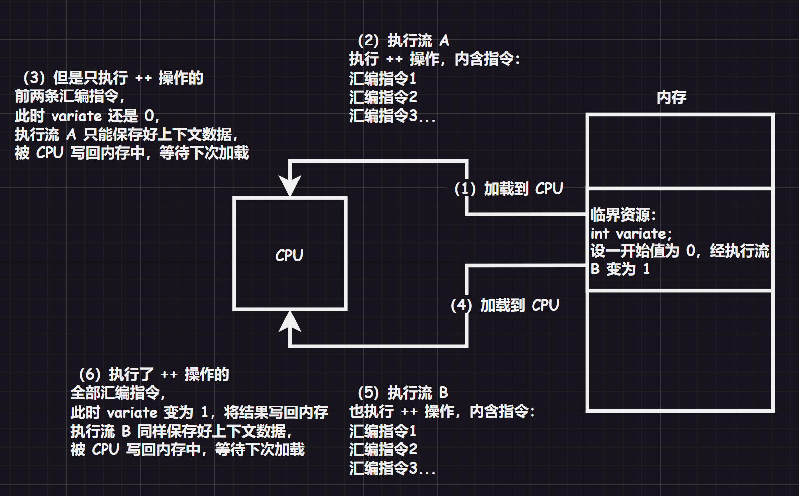
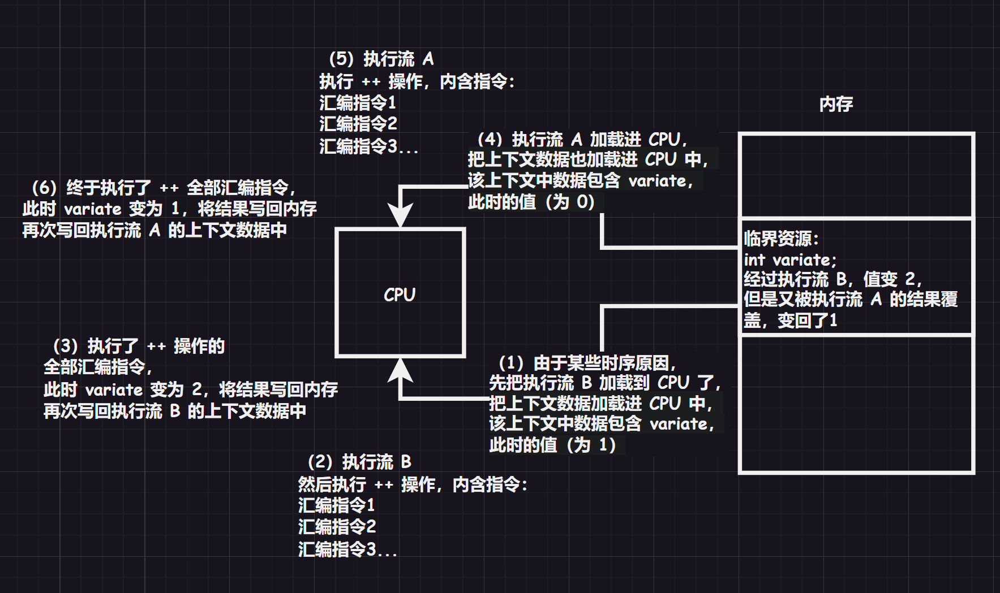
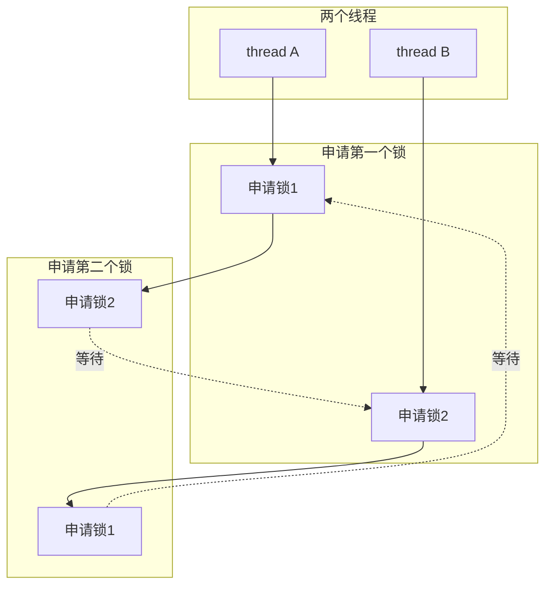
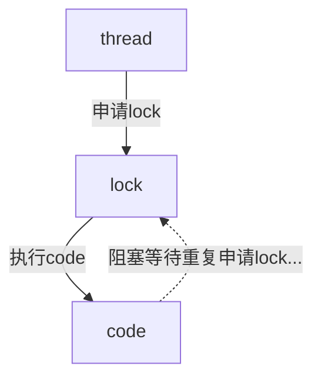
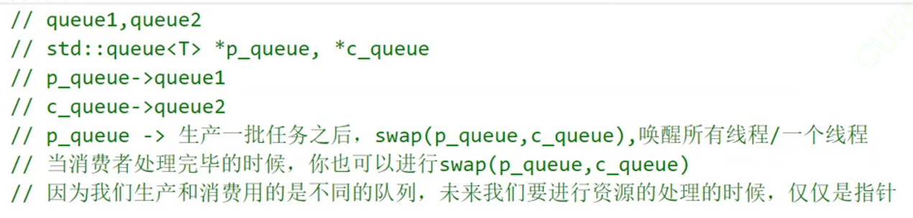

# 0.铺垫概念

1.   **临界资源**：指多个进程/执行流看到的那份公共资源，而访问临界资源时，执行流一定在执行自己的某段代码。

2.   **临界区**：上述使用临界资源的某段代码，就是执行流的临界区，或者叫临界区代码。

3.   **数据不一致问题**：多个执行流的临界区同时访问同样的、不加保护的临界资源，就会互相干扰，造成数据不一致的问题（两个执行流可能同时写入，相互覆盖数据，造成数据错乱）。

     

     

     而在多个执行流的非临界区之间是互不干扰的，产生不一致的原因主要是由临界区的少部分代码引起的。

4.   **互斥/加锁**：在任何一个时刻只允许一个进程进入临界区，这就叫做“互斥/加锁”，本质是将访问临界资源的顺序“串行化”。

5.   **原子性**：一个操作要么不做，要么做完，没有中间状态，这种操作就具有“原子性”。

6.   **信号量/信号灯**：有些时候，执行流们虽然会访问同一份资源，但只是访问资源内不同的部分，如果真的让进程一个一个串行访问，就会慢很多，因此就可以先申请“信号量”，也就是先申请对应资源内部某个部分的访问权力（这类似于电影院订票预约的机制）。

     而信号量可以简单理解为计数器 `count`（也就是说：**信号量表示公共资源内的子资源份数**），申请信号量就会 `--`，执行流申请信号量成功后，临界资源内部一定会预留该执行流想要的资源（也就是预定）。

     而只有该执行流执行完了，释放了信号量（也就是 `++`），才可以被别的执行流申请同样临界资源内部资源对应的的信号量。

     而如果信号量申请失败，执行流就会进入阻塞状态，直到其他执行流释放出更多的信号量。

     并且，我们无法使用一个全局变量来充当信号量，原因很简单，`count` 本身就是临界资源（信号量也需要被所有执行流看到），本身就必须被保护，否则也会因为多个执行流的同时改动造成数据不一致问题...

     进一步说的话，信号量也必须保证自己的 `++` 或 `--` 的操作过程是原子的，不能在过程中被 `CPU` 切换，否则很难做到保护临界资源。

     而如果信号量只有一个，只有一份资源，则可以变为一把轻量级的锁（二元信号量）。

     在我们之前学习的 `IPC` 模块知识中，`IPC` 都需要看到同一份资源才能进行通信，而信号量本身也需要作为公共资源访问，因此也被加入了 `IPC` 模块中（这意味着 `IPC` 并不一定是以数据传输为目的）。

     >   注意：`++` 和 `--` 操作可能背后有较多的汇编代码，汇编代码内又有可能划分为许多微指令，而 `CPU` 很有可能只执行了 `++/--` 的部分汇编代码，就被切换走了，因此如果不保护，`++/--` 操作就是非原子性的）

# 1.线程概念

## 1.1.线程和进程的区别

线程在进程内部执行，是 `OS` 调度的基本单位，这是一种常见的说法，虽然每个字您都认识，但是您有可能无法直接理解，我们慢慢来阐述。

假设一个场景：每个进程都有自己的进程地址空间和进程 `PCB`，如果我们有一种方法，创建多个进程的时候只创建多个进程 `PCB` 对象，但是都指向父进程的进程地址空间，通过一定的技术手段，将父进程的进程地址空间以一定的方式划分给不同子进程的 `task_struct{/*...*/};` 内，达到共享资源的目的，例如“多个执行流各自执行在同一个代码区内的不同函数”。

而对于 `CPU` 来讲，运行上述的每一个进程就像是运行每一个独立的进程，在 `CPU` 的视角下，每个进程都有自己的进程地址空间。

在这里的每一个进程都可以被称为“线程”，再回到一开始提及的线程概念：

-   “线程在进程内部执行”：就是指在进程的地址空间内运行
-   “是 `OS` 调度的基本单位”：就是指 `CPU` 不关心执行流是进程还是线程，只关心 `PCB` 结构（`CPU` 不关心线程和进程概念的区分）

线程在不同的操作系统中，实现方案也有可能会不同，只要满足前面的特征就都是“线程”。

其中，`Linux` 没有为线程专门设计数据结构（`Windows` 有真正的线程，有设计专门的数据结构）。

在 `Linux` 下，进程和线程的概念高度重合（最大的区别在于有无独立属于自己的进程地址空间），因此 `Linux` 用巧妙地方式实现了“软件复用”（当然还是有很大的区别，但是核心代码是很类似的）。

而有了线程，就可以通过特定的划分，从以前单个执行流的串行运行转化到在多个执行流中并发运行，程序效率将会大大提高。

而进程的概念我们还需要细化一下，进程就是：

-   用户视角：是一种内核数据结构，有该进程所需要的代码和数据，并且拥有自己的进程地址空间，有可能包含多个 `PCB` 结构的线程。

    以前我们认为进程只需要一个进程 `PCB` 结构，把进程 `PCB` 结构代表一个进程，实际上进程 `PCB` 结构只是进程的一个执行流，是描述执行流的数据结构，`CPU` 调度的不是进程，而是执行流！

-   内核视角：是承担系统资源分配的基本实体（也就是说资源请求一般是申请到一个进程的资源）

因此线程是调度的基本单位，而进程是承担分配系统资源的基本单位。

以前我们是使用单个的进程，最多就是使用多进程的代码，都是单执行流的。但是有了线程的概念，就可以使用一个进程写出多线程的代码，内部具有多个执行流。

也就是说，以前学习的就是：==“单线程进程”和“多个单线程进程”==，扩充了线程的概念后，就多了==“多线程进程”和“多个多线程进程”==。

>   注意 `1`：以前我们对 `PCB` 结构的理解比较狭隘，从学习线程开始就必须要暗暗注意，理解好 `PCB` 的本质。
>
>   注意 `2`：`Linux` 的 `PCB` 结构体量级会比其他操作系统更轻，是轻量级进程，轻量级进程代表别的操作系统的单进程。

由于 `Linux` 没有提供线程的结构，因此没有直接提供线程的接口，只能提供轻量级进程的接口。

但是这对于其他操作系统的开发者来说有点不友好，因此 `Linux` 为了生态问题还是提供了线程接口，在用户层实现了多线程方案，以动或静态库的方式提供接口，这个库就是 `pthread`。

基本上任何一款发行版的 `Linux` 系统都有这个原生线程库，作为用户的我们调用接口即可（但是内部实现还是用的轻量级进程的实现）。

>   补充：如果细心的话，您可以查看一下关于进程接口的实现，创建进程的 `fork()` 底层调用的是 `clone()`，该接口可以创建出一个轻量级进程。
>
>   而 `vfork()` 是创建轻量级子进程，但是共享的是父进程的资源。
>
>   这些都侧面说明 `Linux` 的确是只提供了轻量级别进程的结构和设置）。

## 1.2.线程的优点和缺点

线程的优点很多：

1.   占用资源低：创建一个新线程的代价要比创建一个新进程小得多，线程占用的资源也比进程少很多  

2.   调度成本低：与进程之间的切换相比，线程之间的切换需要操作系统做的工作要少很多

3.   运行效率高：能充分利用多处理器的可并行数量

     (1)计算密集型应用提效，为了能在多处理器系统上运行，可以将计算分解到多个线程中实现提高 `CPU` 密集型程序的执行效率

     (2)`IO` 密集型应用提效，为了提高性能，将 `IO` 操作重叠。线程可以同时等待不同的 `IO` 操作，在等待慢速 `IO` 操作结束的同时，程序可执行其他的计算任务
     
4.   通信速度快：线程的通信更加简单

而线程概念的出现，又会导致更多的问题：

1.   性能有损失：看似和上面的结论很矛盾，实际上只是一个适量的问题，一个很少被外部事件阻塞的计算密集型线程往往无法与它的线程共享同一个处理器。如果计算密集型线程的数量比可用的处理器多，那么可能会有较大的性能损失，这里的性能损失指的是增加了额外的同步和调度开销，而可用的资源不变（一定要适度使用多线程，而不是盲目使用）
2.   健壮性降低：编写多线程代码需要全面、深入的考虑，在一个多线程程序里，因时间分配上的细微偏差或因共享了不该共享的变量而造成不良影响的可能性很大，也就是说线程之间缺乏保护，一个线程出错就会影响到别的线程
3.   缺乏访问控制：进程是访问控制的基本粒度，在一个线程中调用某些系统调用时会对整个进程造成影响
4.   编程难度提高：编写与调试一个多线程程序比单线程程序困难得多
5.   线程异常问题：单个线程如果出现除零、野指针访问等问题导致线程崩溃，那么进程也会随着崩溃。而线程是进程的执行分支，线程出异常，就类似进程出异常，进而触发信号机制，终止进程，该进程内的所有线程也就全部开始退出。因此，无论是奔溃还是退出都是以进程为基本单位的

有了这一概念的铺垫，接下来就可以深入学习其他的知识了。

>   补充：一般而言，线程的总数不会超过 `CPU` 内核的个数。

## 1.3.线程共享进程资源

进程地址空间共享，包含：

-   代码区共享：也就是代码
-   栈区共享：严格来说也是共享，但是一般认为私有，很少将局部变量给多个线程共享
-   堆区共享：虽然可以共享，但是一般一个线程自己申请自己的堆空间，一般也认为是私有
-   共享区共享：典型的就是 `C` 库文件被共享使用
-   未初始化/已初始化数据区共享：典型的就是全局变量
-   内核区共享：略

除了进程地址空间共享，实际上线程还共享了进程的文件描述符表、对每种信号的处理方法、当前的工作目录、用户 `id` 和用户组 `id`。

而为什么线程的切换成本更低呢？

1.   进程地址空间无需切换，用户级页表无需切换，但是这只是无需更新 `CPU` 内的寄存器，不是成本低的主要原因，仅仅是次要原因
1.   `CPU` 内部还有一个硬件叫做 `cache`，也就是“高速缓存”，操作系统会提前将内存内部分代码和数据加载进 `cache` 进行预读操作（因为这些数据有可能需要反复读写，先加载到 `cache` 会更快一些）。切换线程后，`CPU` 寻址的时候无需将内存中的数据刷新到 `cache`，依旧可以使用原来的 `cache`。而切换进程后，`cache` 内的数据就失效了，只能重新从内存中加载，这才是切换成本更低、更轻量化的主要原因

上述两个原因，在多个线程和多个进程切换的时候会比较明显。

## 1.4.线程内部独特资源

线程虽然共享进程的内存地址空间资源，但是也有独属于自己的一部分数据：

-   线程 `id`（`LWP`）
-   `errno`
-   信号屏蔽字
-   调度优先级
-   一组寄存器（上下文数据）
-   栈（一般认为是私有的、独立的栈结构，但这比较奇怪，栈区只有一个，压栈和出栈很容易出现问题，这要怎么私有？后面提及...）

线程共享资源为主（独立资源为辅），进程独立资源为主（共享资源为辅）

>   补充：最后两点体现了线程的动态属性，是最为重要的。

# 2.线程控制

接下来学习的有关线程控制的线程接口，都在声明在头文件 `pthread.h` 中，严格来说这个库属于系统，不属于 `C/C++` 库内，因此在使用 `gcc` 编译的时候需要添加选项 `-lpthread`。

>   注意：哪一个线程先被启动是未知的，根据调度器的判断而定。

## 2.1.线程创建

```cpp
//线程创建 pthread_create() 声明
#include <pthread.h>
int pthread_create(
    pthread_t* thread, //线程 id
	const pthread_attr_t* attr, //线程属性
    void* (*start_routinue) (void*), //使用回调函数的方式让线程执行一部分的代码
    void* arg //传递给函数指针的参数
);
```

这个接口还挺有趣，让我们来用一下试试：

```cpp
//尝试创建新线程（注意使用 g++ 编译的时候加上参数 -lpthread）
#include <iostream>
#include <string>
#include <pthread.h>
#include <unistd.h>
using namespace std;

void* ThreadRun(void* args) //args 获取参数，也就是 pthread_create() 的最后一个参数
{
    const string name = (char*)args;
    cout
    << "新线程的 name:" << name << '\n' //显示线程名
    << "新线程所处进程的 pid:" << getpid() << '\n'; //检验线程是否真的在进程内（若是则获得和进程一样的 pid）
    sleep(100);
    cout << "新进程任务结束" << '\n';

    return nullptr;
}

int main()
{
    //打印本进程的 pid
    cout << "本进程的 pid:" << getpid() << '\n';

    //创建 5 个新线程
    pthread_t tids[5] = { 0 };
    for(int i = 0; i < 5; ++i)
    {
        string name = "thread ";
        name += to_string(i + 1);
        pthread_create(
            tids + i, //线程 id
            nullptr, //线程属性
            ThreadRun, //使用回调函数的方式让线程执行一部分的代码
            (void*)name.c_str() //传递给函数指针的参数
        );
        sleep(1);
    }

    //主线程持续运行
    cout << "-------" << '\n';
    while(true)
    {
        cout << "主线程所处进程的 pid:" << getpid() << '\n';
        sleep(1);
    }

    return 0;
}

```

使用 `ps -a` 只能查看到一个进程的存在，但是使用 `ps -aL` 可以看到所有轻量级进程的存在，并且还有轻量级进程的标识符 `LWP`：

```bash
# 查看进程和轻量级进程的标识符
$ ps -a
  PID TTY          TIME CMD
 6867 pts/13   00:00:00 a.out
 6897 pts/14   00:00:00 ps
$ ps -aL
  PID   LWP TTY          TIME CMD
 6867  6867 pts/13   00:00:00 a.out
 6867  6868 pts/13   00:00:00 a.out
 6867  6877 pts/13   00:00:00 a.out
 6867  6884 pts/13   00:00:00 a.out
 6867  6890 pts/13   00:00:00 a.out
 6867  6898 pts/13   00:00:00 a.out
 6925  6925 pts/14   00:00:00 ps
```

可以看到还有一个 `pid` 和 `lwp` 一样的线程，该线程就是主线程，如果进程只有一个线程，那么看哪一个都没有差别（反正标识都一样）。

并且终止任意一个线程的 `pid` 都会导致整个进程终止，因为 `pid` 是一样的。

## 2.2.线程终止

线程因为异常终止会导致整个进程结束：

```cpp
//线程因异常而终止（注意使用 g++ 编译的时候加上参数 -lpthread）
#include <iostream>
#include <string>
#include <pthread.h>
#include <unistd.h>
using namespace std;

void* ThreadRun(void* args) //args 获取参数，也就是 pthread_create() 的最后一个参数
{
    while(true)
    {
        const string name = (char*)args;
        cout << "新线程的 name:" << name << '\n'; //显示线程名
        sleep(1);
        int a = 100;
        a /= 0; //除零硬件异常
    }
    
    return nullptr;
}

int main()
{
    //创建 1 个新线程
    pthread_t tid = 0; //线程名
    string name = "thread ";
    pthread_create(
        &tid, //线程 id
        nullptr, //线程属性
        ThreadRun, //使用回调函数的方式让线程执行一部分的代码
        (void*)name.c_str() //传递给函数指针的参数
    );

    //主线程持续运行
    cout << "-------" << '\n';
    while(true)
    {
        cout << "主线程所处进程的 pid:" << getpid() << '\n';
        sleep(1);
    } 

    return 0;
}
```

因此线程异常了，无需返回一个错误码，返回了主线程也处理不了，一起崩溃了，那为什么会一起奔溃呢？原因是所有的线程共用一个标记来标记异常。

信号和异常都是以进程为单元或载体出发的，因此以前理解的异常和信号，都是进程异常和进程信号。

在多线程场景中不要使用 `exit()`，因为该函数终止的是进程，无论在线程的哪里调用都会终止进程（这是比以前在任意代码调用更深刻的理解）

我们需要使用 `return` （`return` 的方式还要结合线程等待的接口使用，后面讲）或者 `pthread_exit()` 让线程正常终止：

```cpp
//线程终止 pthread_exit() 声明
#include <pthread.h>
int pthread_exit(void* arg); //线程的返回结果
```

我们来试试通过 `pthread_exit()` 正常终止线程，并且得到线程的返回值：

```cpp
//尝试终止新线程，并且获取返回值（注意使用 g++ 编译的时候加上参数 -lpthread）
#include <iostream>
#include <string>
#include <pthread.h>
#include <unistd.h>
using namespace std;

void* ThreadRun(void* args) //args 获取参数，也就是 pthread_create() 的最后一个参数
{
    long long* ret = new long long;
    *ret = 0;

    int i = 0;

    while(true)
    {
        const string name = (char*)args;
        cout << "新线程的 name:" << name << '\n'; //显示线程名
        *ret += i;
        sleep(1);
        if(i++ == 5)
            break;
    }

    pthread_exit((void*)ret);
    //return (void*)ret;
}

int main()
{
    //创建 1 个新线程
    pthread_t tid = 0; //线程名
    string name = "new thread ";
    pthread_create(
        &tid, //线程 id
        nullptr, //线程属性
        ThreadRun, //使用回调函数的方式让线程执行一部分的代码
        (void*)name.c_str() //传递给函数指针的参数
    );

    //线程等待，并且获取线程的结果
    void* ret = nullptr; //void* 大小就是 4/8，ret 作为变量为指针（我用的是 8 字节空间）
    pthread_join(tid, &ret); //阻塞等待新线程退出
    cout << "main thread wait done ... main quit, return value = " << *((long long*)ret) << '\n'; //long long 是为了避免截断问题，因为这里的平台是 64 位，指针大小为 8
    
    //释放资源
    delete (long long*)ret;
    return 0;
}

```

## 2.3.线程等待

线程也会有僵尸进程的问题，需要主线程对新进程进行等待回收。

```cpp
//线程等待 pthread_join() 声明
#include <pthread.h>
int pthread_join(
    pthread_t thread, //线程 id
    void** retval
); //不用可以设为 NULL
```

那么参数 `retval` 有什么用呢？别着急，慢慢来，我们先把等待用起来。

```cpp
//尝试等待新线程（注意使用 g++ 编译的时候加上参数 -lpthread）
#include <iostream>
#include <string>
#include <pthread.h>
#include <unistd.h>
using namespace std;

void* ThreadRun(void* args) //args 获取参数，也就是 pthread_create() 的最后一个参数
{
    int i = 0;

    while(true)
    {
        const string name = (char*)args;
        cout << "新线程的 name:" << name << '\n'; //显示线程名
        sleep(1);
        if(i++ == 10)
            break;
    }
    
    return nullptr;
}

int main()
{
    //创建 1 个新线程
    pthread_t tid = 0; //线程名
    string name = "new thread ";
    pthread_create(
        &tid, //线程 id
        nullptr, //线程属性
        ThreadRun, //使用回调函数的方式让线程执行一部分的代码
        (void*)name.c_str() //传递给函数指针的参数
    );

    pthread_join(tid, nullptr); //阻塞等待新线程退出
    cout << "main thread wait done ... main quit" << '\n';
    return 0;
}

```

我们之前在将“线程创建”的时候，调用完回调函数后有一个返回值类型为 `void*`，那这个返回值有什么用呢？该返回给给谁呢？一般是返回给在等待的主线程，那主线程如何获取到呢？使用 `retval` 参数接受，因此 `retval` 的类型是 `void**`。

```cpp
//尝试等待新线程，并且获取返回值（注意使用 g++ 编译的时候加上参数 -lpthread）
#include <iostream>
#include <string>
#include <pthread.h>
#include <unistd.h>
using namespace std;

void* ThreadRun(void* args) //args 获取参数，也就是 pthread_create() 的最后一个参数
{
    int i = 0;

    while(true)
    {
        const string name = (char*)args;
        cout << "新线程的 name:" << name << '\n'; //显示线程名
        sleep(1);
        if(i++ == 5)
            break;
    }
    
    return (void*)10;
}

int main()
{
    //创建 1 个新线程
    pthread_t tid = 0; //线程名
    string name = "new thread ";
    pthread_create(
        &tid, //线程 id
        nullptr, //线程属性
        ThreadRun, //使用回调函数的方式让线程执行一部分的代码
        (void*)name.c_str() //传递给函数指针的参数
    );

    //线程等待，并且获取线程的结果
    void* ret = nullptr; //void* 大小就是 4/8，ret 作为变量为指针（我用的是 8 字节空间）
    pthread_join(tid, &ret); //阻塞等待新线程退出
    cout << "main thread wait done ... main quit, return value = " << (long long)ret << '\n'; //long long 是为了避免截断问题，因为这里的平台是 64 位，指针大小为 8
    
    return 0;
}
```

## 2.4.线程取消

新线程也可以被主线程取消，使用接口如下。

```cpp
//线程取消 pthread_cancel() 声明
#include <pthread.h>
int pthread_cancel(pthread_t thread); //需要被取消的线程对应的 tid
//其中线程被取消的时候，退出码为 -1
```

下面的代码还有很多细节：

```cpp
//尝试取消新线程（注意使用 g++ 编译的时候加上参数 -lpthread）
#include <iostream>
#include <string>
#include <pthread.h>
#include <unistd.h>
using namespace std;

//新线程运行逻辑
void* ThreadRun(void* args) //args 获取参数，也就是 pthread_create() 的最后一个参数
{
    while(true)
    {
        cout << "new thred:" << (char*)args << ", runing..." << '\n';
        sleep(1);
    }
    return nullptr;
}

int main()
{
    //创建新线程并且运行
    pthread_t tid = 0; //新线程 id
    string name = "new thread "; //新线程名
    pthread_create(
        &tid, //设置新线程 id
        nullptr, //设置新线程属性
        ThreadRun, //设置新线程的回调函数
        (void*)name.c_str() //设置传递给回调函数的参数
    );

    //主线程运行逻辑
    int count = 0;
    while(true)
    {
        cout << "main thred, runing..." << '\n';
        sleep(1), count++;
        if(count >= 5) break;
    }

    //取消新线程
    pthread_cancel(tid);
    cout << "pthread_cancel:" << tid << '\n';
    
    //留一定的时间查看 ps -aL
    while(count--)
    {
        cout << "use \"ps -aL\"" << '\n';
        sleep(1);
    }

    //阻塞等待新线程推出
    void* ret = nullptr;
    pthread_join(tid, (void**)&ret);
    cout << (long long)ret << '\n';
    return 0;
}

```

其中线程被取消的时候，退出码为 `#define PTHREAD_CANCELED -1`，等价于 `return -1;`。

但是我们有可能会写出一个有问题的代码：

```cpp
//尝试终止新线程，但是有点问题（注意使用 g++ 编译的时候加上参数 -lpthread）
#include <iostream>
#include <string>
#include <pthread.h>
#include <unistd.h>
using namespace std;

//新线程运行逻辑
void* ThreadRun(void* args) //args 获取参数，也就是 pthread_create() 的最后一个参数
{
    while(true)
    {
        cout << "new thred:" << (char*)args << ", runing..." << '\n';
        sleep(1);
    }
    return nullptr;
}

int main()
{
    //创建新线程并且运行
    pthread_t tid = 0; //新线程 id
    string name = "new thread "; //新线程名
    pthread_create(
        &tid, //设置新线程 id
        nullptr, //设置新线程属性
        ThreadRun, //设置新线程的回调函数
        (void*)name.c_str() //设置传递给回调函数的参数
    );

    //立刻取消新线程
    pthread_cancel(tid);

    //主线程运行逻辑
    int count = 0;
    while(true)
    {
        cout << "main thred, runing..." << '\n';
        sleep(1), count++;
        if(count >= 5) break;
    }

    cout << "pthread_cancel:" << tid << '\n';

    //留一定的时间查看 ps -aL
    while(count--)
    {
        cout << "use \"ps -aL\"" << '\n';
        sleep(1);
    }

    //阻塞等待新线程推出
    void* ret = nullptr;
    pthread_join(tid, (void**)&ret);
    cout << (long long)ret << '\n';
    return 0;
}

```

我发现我们的程序卡住了，这告诉我们，这个线程取消的接口不是这么使用，要使用之前应该满足以下条件：

1.   该新线程存在
2.   该新线程已经运行起来了
3.   该新线程已经运行了一段时间

如果直接创建后立刻取消是未定义的行为，新线程可能都还没跑起来。

另外，主线程可以取消新线程，那能不能反过来呢？最好不要，即便您有可能有这样的程序，主线程除了运行自己的代码，还会处理新线程的返回释放，还有可能造成整个进程取消。

其中我们注意到线程 `id` 实际上不是我们使用 `ps -aL` 看到的 `LWP` 值，这是为什么呢？线程 `id` 本质是一个地址，直接打印 `tid` 只会打印出一个地址值，而由于我们用的不是直接的系统调用，而是 `pthread` 库中的调用（中间软件层），操作系统不关心线程的 `id`，但是用户关注。

栈区如何保证每一个线程独占呢？分割栈空间？那那样 `CPU` 就会感知到线程的存在，这是不可取的。

对线程的描述被库所承担，内部就含有线程的私有数据（线程 `id`、线程局部存储、线程栈结构），也就是说栈结构是由库来分配的，因此实际上上述返回的地址是这部分私有数据的起始地址。

那原本的栈区是谁来用？主线程，而新线程使用的是共享区内部的私有栈区。

```cpp
//证明数据共享
#include <iostream>
#include <string>
#include <pthread.h>
#include <unistd.h>
using namespace std;

int g_val = 0; //由于是全局变量并且进程地址空间共享，因此每个线程都可以访问

//新线程运行逻辑
void* ThreadRoutine(void* args) //args 获取参数，也就是 pthread_create() 的最后一个参数
{
    while(true)
    {
        cout
        << (char*)args
        << " g_val:" << g_val
        << " and &g_val:" << &g_val
        << '\n';

        g_val++, sleep(1); //每隔 1s 修改一次
    }
}

int main()
{
    //创建新线程并且运行
    pthread_t tid = 0; //新线程 id
    string name = "new thred"; //新线程名
    pthread_create(
        &tid, //设置新线程 id
        nullptr, //设置新线程属性
        ThreadRoutine, //设置新线程的回调函数
        (void*)name.c_str() //设置传递给回调函数的参数
    );

    //主线程运行逻辑
    while(true)
    {
        cout
        << "main thread"
        << " g_val:" << g_val
        << " and &g_val:" << &g_val
        << '\n';

        sleep(1);
    }

    return 0;
}
```

线程可以共享进程地址空间的数据，并且有修改的权力，那么如何让线程可以修改，但是不改动主线程的数据呢？使用关键字 `__thread`。

```cpp
//使用关键字 __thread
#include <iostream>
#include <string>
#include <pthread.h>
#include <unistd.h>
using namespace std;

int g_val = 0; //由于是全局变量并且进程地址空间共享，因此每个线程都可以访问
__thread int g_val = 0; //如果加上关键字 __thread 只能线程自己独占（线程局部存储），是库提供的，编译的时候给每一个线程拷贝这个全局变量，线程不能修改该全局变量，但是可以该自己拷贝的

//新线程运行逻辑
void* ThreadRoutine(void* args) //args 获取参数，也就是 pthread_create() 的最后一个参数
{
    while(true)
    {
        cout
        << (char*)args
        << " g_val:" << g_val
        << " and &g_val:" << &g_val
        << '\n';

        g_val++, sleep(1); //每隔 1s 修改一次
    }
}

int main()
{
    //创建新线程并且运行
    pthread_t tid = 0; //新线程 id
    string name = "new thred"; //新线程名
    pthread_create(
        &tid, //设置新线程 id
        nullptr, //设置新线程属性
        ThreadRoutine, //设置新线程的回调函数
        (void*)name.c_str() //设置传递给回调函数的参数
    );

    //主线程运行逻辑
    while(true)
    {
        cout
        << "main thread"
        << " g_val:" << g_val
        << " and &g_val:" << &g_val
        << '\n';

        sleep(1);
    }

    return 0;
}

```

那如果使用 `execl()` 将整个进程替换了，那么先运行的线程会有影响么？实际进程地址空间里的代码哈数据会全部替换为其他代码和数据，其他的线程运行到一半就不会运行了，也不可能报错（因为没有报错代码），因此替换就是进程替换，以进程为单位替换。

## 2.5.线程标识

可以使用 `pthread_self()` 获取线程 `id`，有了线程 `id`，也可以自己取消自己（但是不推荐这么做，容易出现未定义行为）。

```cpp
//尝试获取线程 tid
#include <iostream>
#include <string>
#include <pthread.h>
#include <unistd.h>
using namespace std;

//新线程运行逻辑
void* ThreadRun(void* args) //args 获取参数，也就是 pthread_create() 的最后一个参数
{
    while(true)
    {
        cout << (char*)args 
        << " tid:"
        << pthread_self() //获取新线程 id
        << '\n';

        sleep(1);
    }
    return nullptr;
}

int main()
{
    //创建新线程并且运行
    pthread_t tid = 0; //新线程 id
    string name = "new thred"; //新线程名
    pthread_create(
        &tid, //设置新线程 id
        nullptr, //设置新线程属性
        ThreadRun, //设置新线程的回调函数
        (void*)name.c_str() //设置传递给回调函数的参数
    );

    //主线程运行逻辑
    while(true)
    {
        cout << "main thred"
        << " tid:"
        << pthread_self() //获取主线程 id
        << '\n';

        sleep(1);
    }

    return 0;
}

```

## 2.6.线程分离

可以让新线程自己释放自己，不必让主线程使用 `pthread_join()` 等待，因此就有接口 `pthread_detach()`，只需要传入线程 `id` 作为次数即可。

```cpp
//尝试线程分离
#include <iostream>
#include <string>
#include <cerrno>
#include <cstring>
#include <pthread.h>
#include <unistd.h>
using namespace std;

int g_val = 0; //由于是全局变量并且进程地址空间共享，因此每个线程都可以访问

//新线程运行逻辑
void* ThreadRoutine(void* args) //args 获取参数，也就是 pthread_create() 的最后一个参数
{
    pthread_detach(pthread_self()); //线程分离
    cout
        << (char*)args
        << " g_val:" << g_val
        << " and &g_val:" << &g_val
        << '\n';
    
    g_val++, sleep(1);

    pthread_exit((void*)11);
}

int main()
{
    //创建新线程并且运行
    pthread_t tid = 0; //新线程 id
    string name = "new thred"; //新线程名
    pthread_create(
        &tid, //设置新线程 id
        nullptr, //设置新线程属性
        ThreadRoutine, //设置新线程的回调函数
        (void*)name.c_str() //设置传递给回调函数的参数
    );

    //主线程运行逻辑
    cout
        << "main thread"
        << " g_val:" << g_val
        << " and &g_val:" << &g_val
        << '\n';
    sleep(1);

    //强行等待
    int n = pthread_join(tid, nullptr);
    cout
        << "n:" << n << '\n'
        << "errstrong:" << strerror(n) << '\n'; //提示参数错误

    return 0;
}

```

那究竟什么时候线程分离呢？一个永远不退出的主线程，就需要将新线程做线程分离。

但是分离状态下的线程出现异常，整个进程也会出现异常导致终止。

>   补充：我们使用的是原生态的线程库，实际上 `C++` 有提供更加方便的线程库，这在 `C++` 进阶语法中提及。
>
>   ```cpp
>   #include <iostream>
>   #include <thread>
>   #include <windows.h>
>   using namespace std;
>   
>   void func()
>   {
>       cout << "I am a new thread!" << '\n';
>       Sleep(1000);
>   }
>   
>   int main()
>   {
>       cout << "I am a main thread!" << '\n';
>   
>       thread t(func); //创建线程
>       Sleep(2000);
>   
>       t.join(); //销毁线程
>   
>       return 0;
>   }
>   ```
>
>   并且 `C++` 线程库的内部在 `Linux` 下是使用 `pthread.h` 来实现的，实际一点也不神秘。

# 3.线程互斥

## 3.1.锁概念

我们来复习一些之前提到的一些概念：

1.   **临界资源**：多个进程/多线程（多执行流）看到的公共的资源，而访问临界资源就是执行流执行了自己的临界区代码

2.   **临界区**：使用临界资源的代码部分就是执行流的临界区

3.   **数据不一致问题**：多个执行流的临界区同时访问同样的、不加保护的临界资源，就会互相干扰，造成数据不一致的问题，而在多个执行流的非临界区之间是互不干扰的（因此产生不一致的原因是临界区的少部分代码）

4.   **互斥、互斥量**：在任何一个时刻只允许一个进程进入临界区，这就叫做“互斥”，本质是“串行化”，而所谓的“互斥量”其实就是“锁”

5.   **信号量**：有些时候进程们虽然会访问同一份资源，但只是访问资源内不同的部分，如果真的让进程一个一个串行访问，就会慢很多，因此就可以先申请“信号量”，也就是对应资源内部某一个部分的访问权力

     信号量可以先简单理解为计数器 `count`，申请信号量就会 `--`，执行流申请信号量成功后，临界资源内部一定会预留该执行流想要的资源（也就是预定机制）。

     而只有该执行流执行完了，释放了信号量（也就是 `++`），才可以被别的执行流申请同样临界资源内部资源对应的的信号量。

     并且不能使用一个全局变量来充当信号量，原因很简单，哪怕是父子进程也会因为写实拷贝而无法同步信号量。

     就算真的可以看见一个变量，也会因为进程切换和时序的问题导致数据不同步。

     另外，信号量也需要被所有进程看到，因此它天然就是临界资源，因此需要先保护自己的 `++` 或 `--` 是安全的、原子的。

6.   **原子性**：一个操作要么不做，要么做完，没有中间状态（不会被任何调度机制影响），就称为“原子性”，必须保证信号量的 `++` 或 `--` 操作是原子的（不被 `CPU` 切换），否则很难做到保护临界资源

并且在线程的知识基础上，我们来考虑一份代码：

```cpp
//多线程抢票
#include <iostream>
#include <pthread.h>
#include <unistd.h>
using namespace std;

int ticket = 10000; //票数，模拟临界资源，没有被保护的情况下被并发访问

void* GetTickets(void* args) //模拟临界区代码
{
    (void)args;
    while(true)
    {
        if(ticket > 0)
        {
            usleep(1000);
            printf("%p sells ticket:%d\n", pthread_self(), ticket--);
            //(1)实际上 -- 操作有三个执行步骤，先从内存中读取数据到 CPU 的上下文寄存器中
            //(2)CPU 进行自减操作
            //(3)自减操作做完后，写回进程中
            //在线程频繁切换中，有可能会触发上下文保护
            //被切出的线程记录了没有被 -- 操作的上下文
            //但是下一个线程切入的时候就把 -- 操作做完了
            //而原先的进程再次切入时，会把上一个线程的结果覆盖，数据就出现了错乱
        }
    }
}

int main()
{
    //创建 5 个新线程
    pthread_t t1, t2, t3;
    pthread_create(&t1, nullptr, GetTickets, nullptr); //这里的多个执行流同时调用 GetTickets() ，也就是对该函数进行重入
    pthread_create(&t2, nullptr, GetTickets, nullptr);
    pthread_create(&t3, nullptr, GetTickets, nullptr);

    //等待释放 5 个新线程
    pthread_join(t1, nullptr);
    pthread_join(t2, nullptr);
    pthread_join(t3, nullptr);

    return 0;
}

```

这份代码能清晰让您意识到临界资源和临界区的概念，并且深刻理解为何需要对临界资源进行保护的原因，如果临界资源没有被保护，则会导致危险情况。

而之际上锁就是互斥量。

## 3.2.锁接口

### 3.2.1.锁初始

初始化可以分为静态分配和动态分配。

```cpp
//静态分配
pthread_mutex_t mutex = PTHREAD_MUTEX_INITIALIZER
```

```cpp
//动态分配
int pthread_mutex_init(pthread_mutex_t *restrict mutex, const pthread_mutexattr_t *restrictattr);
//参数：
//mutex:要初始化的互斥量
//attr:NULL
```

### 3.2.2.锁销毁

销毁的时候需要注意几点：

1.   使用 `PTHREAD_ MUTEX_ INITIALIZER` 初始化的互斥量不需要销毁
2.   不要销毁一个已经加锁的互斥量
3.   已经销毁的互斥量，要确保后面不会有线程再尝试加锁

```cpp
//锁销毁
int pthread_mutex_destroy(pthread_mutex_t *mutex)；
```

### 3.2.3.锁加解

```cpp
//锁加解
int pthread_mutex_lock(pthread_mutex_t *mutex);
int pthread_mutex_unlock(pthread_mutex_t *mutex);
```

下面演示两个例子：

```cpp
//多线程抢票（全局锁）
#include <iostream>
#include <pthread.h>
#include <unistd.h>
#include <cassert>
using namespace std;

pthread_mutex_t mtx = PTHREAD_MUTEX_INITIALIZER; //定义锁（如果是全局的、静态的，就可以直接使用 PTHREAD_MUTEX_INITIALIZER 宏来初始化，也可以使用函数）

int ticket = 10000; //票数，模拟临界资源，没有被保护的情况下被并发访问

void* GetTickets(void* args) //模拟临界区代码
{
    //在临界区内，使用锁来保护临界资源
    (void)args;
    while(true)
    {
        int n = pthread_mutex_lock(&mtx); //每一个线程都会执行获得锁的动作，但是任何一个时刻只允许一个线程获得，其他线程此时处于阻塞状态，直到锁被解开（并且不一定所有每一个线程都可以平均获得锁）
        assert(n == 0); //检查是否加锁，没有则断死

        if(ticket > 0)
        {
            printf("%p sells ticket:%d\n", pthread_self(), ticket--);
            pthread_mutex_unlock(&mtx); //解锁，不要放太后，减少加锁的颗粒度，否则打印的效率更低，导致代码整体效率低
        }
        else
        {
            n = pthread_mutex_unlock(&mtx); //解锁
            assert(n == 0); //检查是否解锁，没有则断死

            break;
        }
        usleep(1000); //让线程停一下，保证可以让别的新线程也获得锁
    }
}

int main()
{
    //创建 5 个新线程
    pthread_t t1, t2, t3, t4, t5;
    pthread_create(&t1, nullptr, GetTickets, nullptr); //这里的多个执行流同时调用 GetTickets() ，也就是对该函数进行重入
    pthread_create(&t2, nullptr, GetTickets, nullptr);
    pthread_create(&t3, nullptr, GetTickets, nullptr);
    pthread_create(&t4, nullptr, GetTickets, nullptr);
    pthread_create(&t5, nullptr, GetTickets, nullptr);

    //等待释放 5 个新线程
    pthread_join(t1, nullptr);
    pthread_join(t2, nullptr);
    pthread_join(t3, nullptr);
    pthread_join(t4, nullptr);
    pthread_join(t5, nullptr);
    
    return 0;
}
```

```cpp
//多线程抢票（局部锁）
#include <iostream>
#include <string>
#include <pthread.h>
#include <unistd.h>
#include <cassert>
using namespace std;

int ticket = 10000; //票数，模拟临界资源

class ThreadDatas
{
public:
    ThreadDatas(const string &n, pthread_mutex_t* pm)
        : _tname(n), _pmtx(pm)
    {}

    string _tname;
    pthread_mutex_t* _pmtx;
};

void* GetTickets(void* args) //模拟临界区代码
{
    //在临界区内，使用锁来保护临界资源
    ThreadDatas* td = (ThreadDatas*)args;

    while(true)
    {
        int n = pthread_mutex_lock(td->_pmtx); //上锁
        assert(n == 0); //检查是否加锁，没有则断死

        if(ticket > 0)
        {
            printf("%s sells ticket:%d\n", td->_tname.c_str(), ticket--);
            pthread_mutex_unlock(td->_pmtx);
        }
        else
        {
            n = pthread_mutex_unlock(td->_pmtx); //解锁
            assert(n == 0); //检查是否解锁，没有则断死

            break;
        }
        usleep(1000); //让线程停一下，保证可以让别的新线程也获得锁
    }
}

#define NUM 5
int main()
{
    //创建锁
    pthread_mutex_t mtx;
    pthread_mutex_init(&mtx, nullptr);

    //创建 5 个新线程
    pthread_t ts[NUM] = { 0 };
    for(int i = 0; i < NUM; i++)
    {
        string name = "thread ";
        name += to_string(i + 1);
        ThreadDatas* td = new ThreadDatas(name, &mtx);
        pthread_create(ts + i, nullptr, GetTickets, (void*)td); //这里的多个执行流同时调用 GetTickets() ，也就是对该函数进行重入，最后一个参数就是锁参数
    }

    //等待释放 5 个新线程
    for(int i = 0; i < NUM; i++)
    {
        pthread_join(ts[i], nullptr); //这里的多个执行流同时调用 GetTickets() ，也就是对该函数进行重入
    }
    
    //释放锁
    pthread_mutex_destroy(&mtx);

    return 0;
}

```

## 3.3.锁原理

加锁后，线程在临界区中就不会切换了么？答案是依旧会切换，并且不会有问题。这是为什么呢？我们可以先简单理解一下，当原线程加锁时，如果进入了临界区执行了代码，一定加了锁，如果被其他线程切换，原线程依旧持有锁，其他线程即使切换进来也需要先申请锁，但是该锁正在被原线程持有中，导致其他线程无法执行临界区的代码。

对一个线程来说：

1.   线程本身没有加锁，就什么都还没做
2.   线程释放锁，任务就都做完了

此时就体现了原子性，要么不做，要么做完。

那要是有特立独行的线程，没有执行申请锁的过程，直接申请临界资源的读写怎么办？很抱歉，这是一种错误的编码方式，我们必须避免这种写法，因此，加锁可以达到串行执行的目的。

要范文临界资源，每一个线程就都必须访问锁，因此每个线程都必须看到同一锁，并且访问锁，那锁本身实际也是临界资源，那如何保证锁本身的数据一致性呢（临界资源用临界资源保护？），谁来保证锁的安全呢？

为了保证锁的安全，申请锁和释放锁就必须是原子的！但是怎么保证的呢？这就必须了解锁的底层原理了。

`CPU` 的寄存器被所有线程共享使用，但是寄存器内部的数据是执行流私有的，是每个线程的上下文。

我们可以简单看一下两份伪代码：

```assembly
lock:
	movb $0, %al
	xchgb %al, mutex
	if(al寄存器内容 > 0)
		return 0
	else
		挂起等待;
	goto lock
```

```assembly
unlock:
	movb $1, mutex
	唤醒等待mutex的线程
	return 0
```

假设内存中锁的值为 `1`，第一次加锁的线程用通过交换和上下文，把锁值带走，其他线程切入后，无论怎么交换都只能拿到数据 `0`，相当于第一个加锁的线程把锁（锁值）给拿走了！

## 3.4.可重入和线程安全

因此设计到线程的代码，需要注意函数重入所带来的线程安全问题，需要编写可重入的函数。

常见的线程不安全情况：

1.   不保护共享变量的函数，比如上述全局的 `ticket`
2.   函数状态随着被调用，状态发送变化的函数，比如统计函数的调用次数 `count`，每调用一次，函数内部的状态就会变化
3.   返回指向静态变量指针的函数，比如对堆空间的申请
4.   调用了线程不安全的函数，比如使用 `IO` 类的函数

常见的不可重入的情况：

1.   调用了 `malloc()/free()` 函数，因为是使用全局链表来管理堆的
2.   调用了 `IO` 库函数，标志 `IO` 库函数很多都是以不可重入的方式使用全局数据结构的
3.   可重入函数体内使用静态的数据结构

>   注意：线程安全和可重入的区别
>
>   1.   如果代码是线程安全的，函数不一定是可重入的
>   2.   如果一个函数是可重入的，那么代码就是线程安全的

## 3.5.死锁现象

实际在使用锁的时候，有可能使用多把锁，考虑存在场景：



1.   线程 `A` 申请了锁 `1`、锁 `2`
2.   线程 `B` 也申请了锁 `2`、锁 `1`，顺序和上面不一样
3.   假设两个线程申请第一个锁成功，`A` 得到锁 `1`，`B` 得到锁 `2`
4.   而当 `A` 需要申请锁 `2`，`B` 需要申请锁 `1` 的时候，出现了互相等待的死锁现象

极端的场景下，甚至一把锁可以跟自己死锁，也就是重复申请一把锁。



产生死锁的条件：

1.   互斥条件：一个临界资源每次只能被一个执行流使用（也就是使用了锁）
2.   请求并保持条件：一个执行流因为请求资源而阻塞时，对已获得的资源保持不放
3.   不剥夺条件：一个执行流已获得的资源，在使用完之前不能强行剥夺
4.   循环等待条件：若干执行流之间形成一种头尾相接的循环等待资源关系

避免死锁的产生：

1.   破坏死锁的四个必要条件
2.   加锁顺序保持一致
3.   避免锁未释放的场景
4.   资源一次性分配

避免死锁的算法：

1.   死锁检测算法
2.   银行家算法

>   补充：实践中，能不加锁就不加锁。

# 4.线程同步

一个线程有可能在加锁和解锁的情况下，一直申请一个临界资源，而其他线程加锁的速度没有该线程快，导致一直只有一个线程访问临界资源，虽然这种情况有点极端，但也不是不可能出现，并且这种情况是不太合理的：

1.   该线程频繁申请到临界资源（影响别的线程使用，造成线程饥饿问题）
2.   其他线程太过于频繁访问（长时间没办法使用被占用的临界资源），比较低效（其他进程不断竞争、内耗）

只有线程互斥的情况下，只能听取调度器的指令，因此就会导致饥饿问题、无效竞争的问题。

线程同步要解决的就是多线程调度的合理性问题。

所谓“同步”就是指：让多个线程按照一定的顺序对临界资源进行依次合理访问。

锁像是解决了二义性，同步提高了效率（这和 `C++` 的多继承的解决方案很类似）

>   补充：如果因为时序问题倒是程序异常，我们就称为“竞态条件”。

## 4.1.条件变量概念

申请临界资源之前，需要先检测临界资源是否存在（条件变量），而对临界资源的访问本身也需要加锁，处于临界区内。

因此常规的检测条件就绪注定要频繁申请和释放锁。

我们必须让线程做到两点：

1.   资源不就绪的情况下，不要让线程自己检测，而是直接进行等待
2.   等到条件就绪的时候，通知对应的线程，让其进行资源申请和访问

## 4.2.条件变量接口

### 4.2.1.条件变量初始

```cpp
//条件变量初始
int pthread_cond_init(
    pthread_cond_t *restrict cond, //要初始化的条件变量
    const pthread_condattr_t* restrictattr //NULL
);
```

### 4.2.2.条件变量销毁

```cpp
//条件变量销毁
int pthread_cond_destroy(pthread_cond_t *cond)
```

### 4.2.3.条件变量等待

```cpp
//条件变量等待
int pthread_cond_wait(
    pthread_cond_t *restrict cond, //要在这个条件变量上等待
    pthread_mutex_t* restrict mutex //互斥量，后面详细解释
);
```

### 4.2.4.条件变量唤醒

```cpp
//条件变量唤醒
int pthread_cond_broadcast(pthread_cond_t *cond); //唤醒所有线程
int pthread_cond_signal(pthread_cond_t *cond); //唤醒指定线程
```

用来发送通知，提醒线程可以使用临界资源了。

并且所有的接口都是返回真假的 `1/0`。

```cpp
//尝试使用线程同步的接口
#include <iostream>
#include <string>
#include <unistd.h>
#include <pthread.h>
using namespace std;

volatile bool quit = false;

//函数方法
typedef void (*func_t)(const string& name, pthread_mutex_t*pmutex, pthread_cond_t* pcond);
class ThreadData
{
public:
    ThreadData(const string& name, func_t func, pthread_mutex_t*pmutex, pthread_cond_t* pcond)
        : _name(name), _func(func), _pmutex(pmutex), _pcond(pcond)
    {}
    string _name;
    func_t _func;
    pthread_mutex_t* _pmutex;
    pthread_cond_t* _pcond;
};

void func1(const string& name, pthread_mutex_t*pmutex, pthread_cond_t* pcond)
{
    while(!quit)
    {
        pthread_mutex_lock(pmutex);
        pthread_cond_wait(pcond, pmutex); //等待，默认执行到这里时，当前线程会被立即挂起
        cout << name << " running..." << '\n';
        pthread_mutex_unlock(pmutex);
    }
}
void func2(const string& name, pthread_mutex_t*pmutex, pthread_cond_t* pcond)
{
    while(!quit)
    {
        pthread_mutex_lock(pmutex);
        pthread_cond_wait(pcond, pmutex); //等待，默认执行到这里时，当前线程会被立即挂起
        cout << name << " running..." << '\n';
        pthread_mutex_unlock(pmutex);
    }
}
void func3(const string& name, pthread_mutex_t*pmutex, pthread_cond_t* pcond)
{
    while(!quit)
    {
        pthread_mutex_lock(pmutex);
        pthread_cond_wait(pcond, pmutex); //等待，默认执行到这里时，当前线程会被立即挂起
        cout << name << " running..." << '\n';
        pthread_mutex_unlock(pmutex);
    }
}
void func4(const string& name, pthread_mutex_t*pmutex, pthread_cond_t* pcond)
{
    while(!quit)
    {
        pthread_mutex_lock(pmutex);
        pthread_cond_wait(pcond, pmutex); //等待，默认执行到这里时，当前线程会被立即挂起
        cout << name << " running..." << '\n';
        pthread_mutex_unlock(pmutex);
    }
}

//中间软件层
void* Entry(void* args)
{
    ThreadData* td = (ThreadData*)args; //td 在每个线程自己私有栈中保存
    td->_func(td->_name, td->_pmutex, td->_pcond); //函数调用完就会返回这里
    delete td; //继续释放堆资源
    return nullptr;
}

#define TNUM 4
int main( void )
{
    //初始锁、条件变量
    pthread_mutex_t mutex;
    pthread_cond_t cond;
    pthread_mutex_init(&mutex, nullptr);
    pthread_cond_init(&cond, nullptr);

    //创建线程
    pthread_t tids[TNUM];
    func_t funcs[TNUM]= { func1, func2, func3, func4 };
    for(int i = 0; i < TNUM; i++)
    {
        string name = "Thread";
        name += to_string(i + 1);
        ThreadData* td = new ThreadData(name, funcs[i], &mutex, &cond); //让每个线程拿到同样的锁和条件变量
        pthread_create(tids + i, nullptr, Entry, (void*)td);
    }

    //由于主线程没有开始控制，因此导致所有新线程和主线程都处于阻塞状态
    sleep(5);

    //主线程使用线程同步的思路赖控制新线程
    int count = 10;
    while(count)
    {
        cout << "resume thread run code ..." << count-- << '\n';
        pthread_cond_signal(&cond); //唤醒单个线程
        //pthread_cond_broadcast(&cond); //唤醒所有线程
        sleep(1);
    }

    cout << "ctrl done!" << '\n';
    quit = true;
    pthread_cond_broadcast(&cond); //唤醒所有线程

    //等待释放线程
    for(int i = 0; i < TNUM; i++)
    {
        pthread_join(tids[i], nullptr);
        cout << "thread: " << tids[i] << "quit" << '\n';
    }
    
    //销毁锁、条件变量
    pthread_mutex_destroy(&mutex);
    pthread_cond_destroy(&cond);
}
```

## 4.3.条件变量原理

待补充...

## 4.4.阻塞队列下的生产者-消费者模型（BlockingQueue）

超市将供货商的产品集合起来，消费者在超市内购买对应的产品，消费者无法直接从供应商直接获得产品。这样通过解耦的方式，效率较高。并且如果供应商提供的消费品时一样的，就会造成竞争问题（因为超市为了提高空间利用率，导致无需进口过多的同类产品）。

这里存在：一个场所（超市），两个角色（消费者 `consumer`、生产者 `producer`），三种关系（生产者和生产者、消费者和消费者、生产者和消费者）。而对于两个角色来说，超市都是公共资源。

1.   生产者和生产者之间是竞争、互斥关系（都想让自己的商品上架）
2.   消费者和消费者之间是竞争、互斥关系（都想取得同类的商品）
3.   生产者和消费者之间是互斥和同步关系（在没有货物时让消费者等待，生产者准备好货物后再通知消费者）

而我们只需要把“一个场所、两个角色、三和关系”对应到相应的线程上，就是经典的“生产者-消费者模型”。

消费场所实际是一个数据结构，因此会有多种实现，而消费者和生产者就是线程。

消费者如何使用数据呢？生产者从哪里生产数据呢？


`BlockingQueue` 是一种常见的实现生产者和消费者模型的数据结构，其与普通的队列区别为：

1.   队列为空的时候，从队列中出队元素的行为会被阻塞，直到队列中新入队了元素
2.   队列为满的时候，从队列外入队元素的行为会被阻塞，直到队列中有出队了元素

>   补充：这很像管道的使用，进程通信的前期就是看到同一份资源，这本身就是一个生产者消费者模型，只不过管道内部做了相应的互斥和同步问题。

接下来我们要尝试编写一下代码。

### 4.4.1.供过于求

```cpp
//BlockingQueue生产者-消费者模型（供过于求）
#pragma once
#include <iostream>
#include <queue>
#include <unistd.h>
#include <pthread.h>

const int gDefaultCap = 5;

template<class T>
class BlockingQueue
{
private:
    bool IsQueueEmpty()
    {
        return _bq.size() == 0;
    }
    bool IsQueueFull()
    {
        return _bq.size() == _capacity;
    }

public:
    BlockingQueue(int capacity = gDefaultCap) //默认为 5
        : _capacity(capacity)
    {
        pthread_mutex_init(&_mtx, nullptr);
        pthread_cond_init(&_empty, nullptr);
        pthread_cond_init(&_full, nullptr);
    }

    //生产者产数据
    void Push(const T& in)
    {
        //加锁，防止消费者非法消费
        pthread_mutex_lock(&_mtx);

        //检测临界资源是否满足访问条件（队列是否为满）
        if(IsQueueFull()) pthread_cond_wait(&_full, &_mtx);
        //第二个参数是锁的原因是：
        //生产者是带着锁去阻塞的，那消费者就无法拿到锁，
        //最终生产者的挂起是没有效果的，本来我们挂起就是为了让消费者去消费资源...
        //因此第二个参数可以传递锁，在函数内的锁会被自动解开

        //如果线程在这行之前曾被挂起，则会从这里继续运行/唤醒，唤醒的时候 pthread_cond_wait() 会自动为线程获取锁
         
        //访问临界资源，生产数据
        _bq.push(in);

        //解锁
        pthread_mutex_unlock(&_mtx);

        //唤醒消费者
        pthread_cond_signal(&_empty);
    }

    //消费者取数据
    void Pop(T* out)
    {
        //加锁
        pthread_mutex_lock(&_mtx);

        //检测临界资源是否满足访问条件（队列是否为空）
        if(IsQueueEmpty()) pthread_cond_wait(&_empty, &_mtx);

        //访问临界资源，取得数据
        *out = _bq.front();
        _bq.pop();

        //解锁
        pthread_mutex_unlock(&_mtx);

        //唤醒生产者
        pthread_cond_signal(&_full);

    }

    ~BlockingQueue()
    {
        pthread_mutex_destroy(&_mtx);
        pthread_cond_destroy(&_empty);
        pthread_cond_destroy(&_full);
    }

private:
    std::queue<T> _bq; //阻塞队列
    int _capacity; //容量上限
    pthread_mutex_t _mtx; //通过互斥锁保护队列安全
    pthread_cond_t _empty; //通过条件变量阻塞队列（阻塞时表示 bq 为空）
    pthread_cond_t _full; //通过条件变量阻塞队列（阻塞时表示 bq 为满）
};
```

```cpp
//ConProd.cc
#include "BlockingQueue.hpp"

//生产者方法
void* producer(void* args)
{
    BlockingQueue<int>* bqueue = (BlockingQueue<int>*)args;
    int a = 1;
    while(true)
    {
        bqueue->Push(a); //生产数据
        std::cout << "生产数据:" << a++ << '\n';
    }
    return nullptr;
}

//消费者方法
void* consumer(void* args)
{
    BlockingQueue<int>* bqueue = (BlockingQueue<int>*) args;
    int a;
    while(true)
    {
        bqueue->Pop(&a); //消费数据
        std::cout << "消费数据:" << a << '\n';
        sleep(5);
    }
    return nullptr;
}

int main()
{
    //使用 生产者-消费者模型 运作线程
    BlockingQueue<int>* bqueue = new BlockingQueue<int>();

    //创建生产者和消费者进程
    pthread_t p; //生产者
    pthread_t c; //消费者
    pthread_create(&p, nullptr, consumer, bqueue); //最后一个参数可以让两者看到同一个队列
    pthread_create(&c, nullptr, producer, bqueue);

    //等待释放两种线程
    pthread_join(p, nullptr);
    pthread_join(c, nullptr);
    return 0;
}
```

```makefile
# Makefile
cp:ConProd.cc
	g++ -o $@ $^ -std=c++11 -lpthread

.PHONY:clean
clean:
	rm -f cp
```

### 4.4.2.求过于供

```cpp
//BlockingQueue生产者-消费者模型（求过于供）
#pragma once
#include <iostream>
#include <queue>
#include <unistd.h>
#include <pthread.h>

const int gDefaultCap = 10;

template<class T>
class BlockingQueue
{
private:
    bool IsQueueEmpty()
    {
        return _bq.size() == 0;
    }
    bool IsQueueFull()
    {
        return _bq.size() == _capacity;
    }

public:
    BlockingQueue(int capacity = gDefaultCap) //默认为 5
        : _capacity(capacity)
    {
        pthread_mutex_init(&_mtx, nullptr);
        pthread_cond_init(&_empty, nullptr);
        pthread_cond_init(&_full, nullptr);
    }

    //生产者产数据
    void Push(const T& in)
    {
        //加锁，防止消费者非法消费
        pthread_mutex_lock(&_mtx);

        //检测临界资源是否满足访问条件（队列是否为满）
        if(IsQueueFull()) pthread_cond_wait(&_full, &_mtx);
        //第二个参数是锁的原因是：
        //生产者是带着锁去阻塞的，那消费者就无法拿到锁，
        //最终生产者的挂起是没有效果的，本来我们挂起就是为了然消费者去消费资源...
        //因此第二个参数可以传递锁，在函数内的锁会被自动解开

        //如果线程在这行之前曾被挂起，则会从这里继续运行/唤醒，唤醒的时候 pthread_cond_wait() 会自动为线程获取锁
         
        //访问临界资源，生产数据
        _bq.push(in);

        //只有在生产出足够的商品时才唤醒消费者（生产策略）
        if(_bq.size() >= _capacity/2) pthread_cond_signal(&_empty);

        //解锁
        pthread_mutex_unlock(&_mtx);
    }

    //消费者取数据
    void Pop(T* out)
    {
        //加锁
        pthread_mutex_lock(&_mtx);

        //检测临界资源是否满足访问条件（队列是否为空）
        if(IsQueueEmpty()) pthread_cond_wait(&_empty, &_mtx);

        //访问临界资源，取得数据
        *out = _bq.front();
        _bq.pop();

        //解锁
        pthread_mutex_unlock(&_mtx);

        //唤醒生产者
        pthread_cond_signal(&_full);

    }

    ~BlockingQueue()
    {
        pthread_mutex_destroy(&_mtx);
        pthread_cond_destroy(&_empty);
        pthread_cond_destroy(&_full);
    }

private:
    std::queue<T> _bq; //阻塞队列
    int _capacity; //容量上限
    pthread_mutex_t _mtx; //通过互斥锁保护队列安全
    pthread_cond_t _empty; //通过条件变量阻塞队列（阻塞时表示 bq 为空）
    pthread_cond_t _full; //通过条件变量阻塞队列（阻塞时表示 bq 为满）
};
```

```cpp
//ConProd.cc
#include "BlockingQueue.hpp"

//生产者方法
void* producer(void* args)
{
    BlockingQueue<int>* bqueue = (BlockingQueue<int>*)args;
    int a = 1;
    while(true)
    {
        bqueue->Push(a); //生产数据
        std::cout << "生产数据:" << a++ << '\n';
        sleep(5);
    }
    return nullptr;
}

//消费者方法
void* consumer(void* args)
{
    BlockingQueue<int>* bqueue = (BlockingQueue<int>*) args;
    int a;
    while(true)
    {
        bqueue->Pop(&a); //消费数据
        std::cout << "消费数据:" << a << '\n';
    }
    return nullptr;
}

int main()
{
    //使用 生产者-消费者模型 运作线程
    BlockingQueue<int>* bqueue = new BlockingQueue<int>();

    //创建生产者和消费者进程
    pthread_t p; //生产者
    pthread_t c; //消费者
    pthread_create(&p, nullptr, consumer, bqueue); //最后一个参数可以让两者看到同一个队列
    pthread_create(&c, nullptr, producer, bqueue);

    //等待释放两种线程
    pthread_join(p, nullptr);
    pthread_join(c, nullptr);
    return 0;
}
```

```makefile
# Makefile
cp:ConProd.cc
	g++ -o $@ $^ -std=c++11 -lpthread

.PHONY:clean
clean:
	rm -f cp
```

### 4.4.3.修改 bug

```cpp
//BlockingQueue生产者-消费者模型（修改伪唤醒的 bug）
#pragma once
#include <iostream>
#include <queue>
#include <unistd.h>
#include <pthread.h>

const int gDefaultCap = 10;

template<class T>
class BlockingQueue
{
private:
    bool IsQueueEmpty()
    {
        return _bq.size() == 0;
    }
    bool IsQueueFull()
    {
        return _bq.size() == _capacity;
    }

public:
    BlockingQueue(int capacity = gDefaultCap) //默认为 5
        : _capacity(capacity)
    {
        pthread_mutex_init(&_mtx, nullptr);
        pthread_cond_init(&_empty, nullptr);
        pthread_cond_init(&_full, nullptr);
    }

    //生产者产数据
    void Push(const T& in)
    {
        //加锁，防止消费者非法消费
        pthread_mutex_lock(&_mtx);

        //检测临界资源是否满足访问条件（队列是否为满）
        while(IsQueueFull()) pthread_cond_wait(&_full, &_mtx);
        //debug:只要是一个函数就有可能调用失败，如果这里调用失败了，
        //就会导致生产者无法阻塞，进而导致哪怕时满了也有可能会导致越界入队，
        //因此需要改 if 为 while 来判断，往下走就可以 100% 确定临界资源是就绪的
        //第二个参数是锁的原因是：
        //生产者是带着锁去阻塞的，那消费者就无法拿到锁，
        //最终生产者的挂起是没有效果的，本来我们挂起就是为了然消费者去消费资源...
        //因此第二个参数可以传递锁，在函数内的锁会被自动解开

        //如果线程在这行之前曾被挂起，则会从这里继续运行/唤醒，唤醒的时候 pthread_cond_wait() 会自动为线程获取锁
         
        //访问临界资源，生产数据
        _bq.push(in);

        //只有在生产出足够的商品时才唤醒消费者（生产策略）
        if(_bq.size() >= _capacity/2) pthread_cond_signal(&_empty);

        //解锁
        pthread_mutex_unlock(&_mtx);
    }

    //消费者取数据
    void Pop(T* out)
    {
        //加锁
        pthread_mutex_lock(&_mtx);

        //检测临界资源是否满足访问条件（队列是否为空）
        while(IsQueueEmpty()) pthread_cond_wait(&_empty, &_mtx); //debug:这里也是一样的

        //访问临界资源，取得数据
        *out = _bq.front();
        _bq.pop();

        //唤醒生产者
        pthread_cond_signal(&_full);

        //解锁
        pthread_mutex_unlock(&_mtx);
    }

    ~BlockingQueue()
    {
        pthread_mutex_destroy(&_mtx);
        pthread_cond_destroy(&_empty);
        pthread_cond_destroy(&_full);
    }

private:
    std::queue<T> _bq; //阻塞队列
    int _capacity; //容量上限
    pthread_mutex_t _mtx; //通过互斥锁保护队列安全
    pthread_cond_t _empty; //通过条件变量阻塞队列（阻塞时表示 bq 为空）
    pthread_cond_t _full; //通过条件变量阻塞队列（阻塞时表示 bq 为满）
};
```

另外两份文件不做修改。

### 4.4.4.增添任务

只是生产数据这太挫了，应该执行一些任务。

```cpp
//BlockingQueue.hpp
#pragma once
#include <queue>
#include <unistd.h>
#include <pthread.h>

const int gDefaultCap = 10;

template<class T>
class BlockingQueue
{
private:
    bool IsQueueEmpty()
    {
        return _bq.size() == 0;
    }
    bool IsQueueFull()
    {
        return _bq.size() == _capacity;
    }

public:
    BlockingQueue(int capacity = gDefaultCap) //默认为 5
        : _capacity(capacity)
    {
        pthread_mutex_init(&_mtx, nullptr);
        pthread_cond_init(&_empty, nullptr);
        pthread_cond_init(&_full, nullptr);
    }

    //生产者产数据
    void Push(const T& in)
    {
        //加锁，防止消费者非法消费
        pthread_mutex_lock(&_mtx);

        //检测临界资源是否满足访问条件（队列是否为满）
        while(IsQueueFull()) pthread_cond_wait(&_full, &_mtx);
        //debug:只要是一个函数就有可能调用失败，如果这里调用失败了，
        //就会导致生产者无法阻塞，进而导致哪怕时满了也有可能会导致越界入队，
        //因此需要改 if 为 while 来判断，往下走就可以 100% 确定临界资源是就绪的
        //第二个参数是锁的原因是：
        //生产者是带着锁去阻塞的，那消费者就无法拿到锁，
        //最终生产者的挂起是没有效果的，本来我们挂起就是为了然消费者去消费资源...
        //因此第二个参数可以传递锁，在函数内的锁会被自动解开

        //如果线程在这行之前曾被挂起，则会从这里继续运行/唤醒，唤醒的时候 pthread_cond_wait() 会自动为线程获取锁
         
        //访问临界资源，生产数据
        _bq.push(in);

        //只有在生产出足够的商品时才唤醒消费者（生产策略）
        if(_bq.size() >= _capacity/2) pthread_cond_signal(&_empty);

        //解锁
        pthread_mutex_unlock(&_mtx);
    }

    //消费者取数据
    void Pop(T* out)
    {
        //加锁
        pthread_mutex_lock(&_mtx);

        //检测临界资源是否满足访问条件（队列是否为空）
        while(IsQueueEmpty()) pthread_cond_wait(&_empty, &_mtx); //debug:这里也是一样的

        //访问临界资源，取得数据
        *out = _bq.front();
        _bq.pop();

        //唤醒生产者
        pthread_cond_signal(&_full);

        //解锁
        pthread_mutex_unlock(&_mtx);
    }

    ~BlockingQueue()
    {
        pthread_mutex_destroy(&_mtx);
        pthread_cond_destroy(&_empty);
        pthread_cond_destroy(&_full);
    }

private:
    std::queue<T> _bq; //阻塞队列
    int _capacity; //容量上限
    pthread_mutex_t _mtx; //通过互斥锁保护队列安全
    pthread_cond_t _empty; //通过条件变量阻塞队列（阻塞时表示 bq 为空）
    pthread_cond_t _full; //通过条件变量阻塞队列（阻塞时表示 bq 为满）
};
```

```cpp
//Task.hpp
#pragma once
#include <functional>

class Task
{
    typedef std::function<int(int, int)> func_t; //函数包装
public:
    Task()
    {}
    Task(int x, int y, func_t func)
        : _x(x), _y(y), _func(func)
    {}
    int operator()() //仿函数
    {
        return _func(_x, _y);
    }

public:
    int _x; //操作数 x
    int _y; //操作数 y
    func_t _func;
};
```

```cpp
//ConProd.cc
#include "BlockingQueue.hpp"
#include "Task.hpp"
#include <iostream>
#include <cstdlib>
#include <ctime>

//操作方法
int MyAdd(int x, int y)
{
    return x + y;
}

//生产者方法
void* producer(void* args)
{
    BlockingQueue<Task>* bqueue = (BlockingQueue<Task>*)args;
    while(true)
    {
        //生产数据
        //int x = rand() % 10 + 1;
        //int y = rand() % 5 + 1;
        int x = 0, y = 0;
        std::cout << "please Enter x and y: ";
        std::cin >> x >> y;

        //构建任务（内含操作数和操作方法）
        Task t(x, y, MyAdd);
        bqueue->Push(t);

        std::cout << "生产任务:"
        << "\'" << t._x << "\'"
        << " and "
        << "\'" << t._y << "\'"
        << " and func()"
        << '\n';
    }
    return nullptr;
}

//消费者方法
void* consumer(void* args)
{
    BlockingQueue<Task>* bqueue = (BlockingQueue<Task>*) args;
    while(true)
    {
        //获取任务
        Task t;
        bqueue->Pop(&t);
        //输出结果
        std::cout << "消费任务:" << t._x << " and " << t._y << " --> " << t() << '\n';
    }
    return nullptr;
}

int main()
{
    //种下随机数种子
    srand((uint64_t)time(nullptr) ^ getpid() ^ 0x114514);

    //使用 生产者-消费者模型 运作线程
    BlockingQueue<Task>* bqueue = new BlockingQueue<Task>();

    //创建生产者和消费者进程
    pthread_t p; //生产者
    pthread_t c; //消费者
    pthread_create(&p, nullptr, consumer, bqueue); //最后一个参数可以让两者看到同一个队列
    pthread_create(&c, nullptr, producer, bqueue);

    //等待释放两种线程
    pthread_join(p, nullptr);
    pthread_join(c, nullptr);
    return 0;
}
```

```cpp
# Makefile
cp:ConProd.cc
	g++ -o $@ $^ -std=c++11 -lpthread

.PHONY:clean
clean:
	rm -f cp
```

### 4.4.5.增加角色

```cpp
//BlockingQueue.hpp
#pragma once
#include <queue>
#include <unistd.h>
#include <pthread.h>

const int gDefaultCap = 10;

template<class T>
class BlockingQueue
{
private:
    bool IsQueueEmpty()
    {
        return _bq.size() == 0;
    }
    bool IsQueueFull()
    {
        return _bq.size() == _capacity;
    }

public:
    BlockingQueue(int capacity = gDefaultCap) //默认为 5
        : _capacity(capacity)
    {
        pthread_mutex_init(&_mtx, nullptr);
        pthread_cond_init(&_empty, nullptr);
        pthread_cond_init(&_full, nullptr);
    }

    //生产者产数据
    void Push(const T& in)
    {
        //加锁，防止消费者非法消费
        pthread_mutex_lock(&_mtx);

        //检测临界资源是否满足访问条件（队列是否为满）
        while(IsQueueFull()) pthread_cond_wait(&_full, &_mtx);
        //debug:只要是一个函数就有可能调用失败，如果这里调用失败了，
        //就会导致生产者无法阻塞，进而导致哪怕时满了也有可能会导致越界入队，
        //因此需要改 if 为 while 来判断，往下走就可以 100% 确定临界资源是就绪的
        //第二个参数是锁的原因是：
        //生产者是带着锁去阻塞的，那消费者就无法拿到锁，
        //最终生产者的挂起是没有效果的，本来我们挂起就是为了然消费者去消费资源...
        //因此第二个参数可以传递锁，在函数内的锁会被自动解开

        //如果线程在这行之前曾被挂起，则会从这里继续运行/唤醒，唤醒的时候 pthread_cond_wait() 会自动为线程获取锁
         
        //访问临界资源，生产数据
        _bq.push(in);

        //只有在生产出足够的商品时才唤醒消费者（生产策略）
        if(_bq.size() >= _capacity/2) pthread_cond_signal(&_empty);

        //解锁
        pthread_mutex_unlock(&_mtx);
    }

    //消费者取数据
    void Pop(T* out)
    {
        //加锁
        pthread_mutex_lock(&_mtx);

        //检测临界资源是否满足访问条件（队列是否为空）
        while(IsQueueEmpty()) pthread_cond_wait(&_empty, &_mtx); //debug:这里也是一样的

        //访问临界资源，取得数据
        *out = _bq.front();
        _bq.pop();

        //唤醒生产者
        pthread_cond_signal(&_full);

        //解锁
        pthread_mutex_unlock(&_mtx);
    }

    ~BlockingQueue()
    {
        pthread_mutex_destroy(&_mtx);
        pthread_cond_destroy(&_empty);
        pthread_cond_destroy(&_full);
    }

private:
    std::queue<T> _bq; //阻塞队列
    int _capacity; //容量上限
    pthread_mutex_t _mtx; //通过互斥锁保护队列安全
    pthread_cond_t _empty; //通过条件变量阻塞队列（阻塞时表示 bq 为空）
    pthread_cond_t _full; //通过条件变量阻塞队列（阻塞时表示 bq 为满）
};
```

```cpp
//Task.hpp
#pragma once
#include <functional>

class Task
{
    typedef std::function<int(int, int)> func_t; //函数包装
public:
    Task()
    {}
    Task(int x, int y, func_t func)
        : _x(x), _y(y), _func(func)
    {}
    int operator()() //仿函数
    {
        return _func(_x, _y);
    }

public:
    int _x; //操作数 x
    int _y; //操作数 y
    func_t _func;
};
```

```cpp
//ConProd.cc
#include "BlockingQueue.hpp"
#include "Task.hpp"
#include <iostream>
#include <cstdlib>
#include <ctime>

//操作方法
int MyAdd(int x, int y)
{
    return x + y;
}

//生产者方法
void* producer(void* args)
{
    BlockingQueue<Task>* bqueue = (BlockingQueue<Task>*)args;
    while(true)
    {
        //生产数据
        int x = rand() % 10 + 1;
        int y = rand() % 5 + 1;

        //构建任务（内含操作数和操作方法）
        Task t(x, y, MyAdd);
        bqueue->Push(t);

        std::cout << pthread_self() << "生产任务:"
        << "\'" << t._x << "\'"
        << " and "
        << "\'" << t._y << "\'"
        << " and func()"
        << '\n';

        sleep(1);
    }
    return nullptr;
}

//消费者方法
void* consumer(void* args)
{
    BlockingQueue<Task>* bqueue = (BlockingQueue<Task>*) args;
    while(true)
    {
        //获取任务
        Task t;
        bqueue->Pop(&t);
        //输出结果
        std::cout << pthread_self() << "消费任务:" << t._x << " and " << t._y << " --> " << t() << '\n';
    
        usleep(100);
    }
    return nullptr;
}

const int size = 5;
int main()
{
    //种下随机数种子
    srand((uint64_t)time(nullptr) ^ getpid() ^ 0x114514);

    //使用 生产者-消费者模型 运作线程
    BlockingQueue<Task>* bqueue = new BlockingQueue<Task>();

    //创建生产者和消费者进程
    pthread_t ps[size]; //生产者
    pthread_t cs[size]; //消费者
    for(int i = 0; i < size; i++)
    {
        pthread_create(ps + i, nullptr, consumer, bqueue); //最后一个参数可以让生产者和消费者看到同一个队列
        pthread_create(cs + i, nullptr, producer, bqueue);
    }
    
    //等待释放两种线程
    for(int i = 0; i < size; i++)
    {
        pthread_join(ps[i], nullptr);
        pthread_join(cs[i] + i, nullptr);
    }
    return 0;
}
```

```cpp
# Makefile
cp:ConProd.cc
	g++ -o $@ $^ -std=c++11 -lpthread

.PHONY:clean
clean:
	rm -f cp
```

在处理任务的时候并发，并且不是线程越多越好，还是要看具体场景。

### 4.4.6.RAII 锁

锁的处理太过笨拙了，一不小心就会写出类似内存泄漏的问题（忘记解锁），因此我们就可以使用类似智能指针的 `RAII` 风格的锁。

```cpp
//BlockingQueue.hpp
#pragma once
#include <queue>
#include <unistd.h>
#include <pthread.h>
#include "LockGuard.hpp"

const int gDefaultCap = 10;

template<class T>
class BlockingQueue
{
private:
    bool IsQueueEmpty()
    {
        return _bq.size() == 0;
    }
    bool IsQueueFull()
    {
        return _bq.size() == _capacity;
    }

public:
    BlockingQueue(int capacity = gDefaultCap) //默认为 5
        : _capacity(capacity)
    {
        pthread_mutex_init(&_mtx, nullptr);
        pthread_cond_init(&_empty, nullptr);
        pthread_cond_init(&_full, nullptr);
    }

    //生产者产数据
    void Push(const T& in)
    {
        //使用 RAII 智能锁（自动加锁和解锁）
        LockGuard lockgrard(&_mtx);

        //检测临界资源是否满足访问条件（队列是否为满）
        while(IsQueueFull()) pthread_cond_wait(&_full, &_mtx);
        
        //访问临界资源，生产数据
        _bq.push(in);

        //只有在生产出足够的商品时才唤醒消费者（生产策略）
        if(_bq.size() >= _capacity/2) pthread_cond_signal(&_empty);
    }

    //消费者取数据
    void Pop(T* out)
    {
        //使用智能锁（自动加锁和解锁）
        LockGuard lockgrard(&_mtx);

        //检测临界资源是否满足访问条件（队列是否为空）
        while(IsQueueEmpty()) pthread_cond_wait(&_empty, &_mtx); //debug:这里也是一样的

        //访问临界资源，取得数据
        *out = _bq.front();
        _bq.pop();

        //唤醒生产者
        pthread_cond_signal(&_full);
    }

    ~BlockingQueue()
    {
        pthread_cond_destroy(&_empty);
        pthread_cond_destroy(&_full);
    }

private:
    std::queue<T> _bq; //阻塞队列
    int _capacity; //容量上限
    pthread_mutex_t _mtx; //通过互斥锁保护队列安全
    pthread_cond_t _empty; //通过条件变量阻塞队列（阻塞时表示 bq 为空）
    pthread_cond_t _full; //通过条件变量阻塞队列（阻塞时表示 bq 为满）
};
```

```cpp
//LockGuard.hpp
#pragma once
#include <iostream>
#include <pthread.h>

//封装锁
class Mutex
{
public:
    Mutex(pthread_mutex_t* mtx)
        : _pmtx(mtx)
    {}
    void Lock()
    {
        std::cout << "智能加锁" << '\n';
        pthread_mutex_lock(_pmtx);
    }
    void UnLock()
    {
        std::cout << "智能解锁" << '\n';
        pthread_mutex_unlock(_pmtx);
    }
    ~Mutex()
    {}

private:
    pthread_mutex_t* _pmtx;
};

//智能锁（有点类似智能指针）
class LockGuard
{
public:
    LockGuard(pthread_mutex_t* mtx)
        : _mtx(mtx)
    {
        _mtx.Lock();
    }
    ~LockGuard()
    {
        _mtx.UnLock();
    }

private:
    Mutex _mtx;
};
```

```cpp
//Task.hpp
#pragma once
#include <functional>

class Task
{
    typedef std::function<int(int, int)> func_t; //函数包装
public:
    Task()
    {}
    Task(int x, int y, func_t func)
        : _x(x), _y(y), _func(func)
    {}
    int operator()() //仿函数
    {
        return _func(_x, _y);
    }

public:
    int _x; //操作数 x
    int _y; //操作数 y
    func_t _func;
};
```

```cpp
//ConProd.cc
#include "BlockingQueue.hpp"
#include "Task.hpp"
#include <iostream>
#include <cstdlib>
#include <ctime>

//操作方法
int MyAdd(int x, int y)
{
    return x + y;
}

//生产者方法
void* producer(void* args)
{
    BlockingQueue<Task>* bqueue = (BlockingQueue<Task>*)args;
    while(true)
    {
        //生产数据
        int x = rand() % 10 + 1;
        int y = rand() % 5 + 1;

        //构建任务（内含操作数和操作方法）
        Task t(x, y, MyAdd);
        bqueue->Push(t);

        std::cout << pthread_self() << "生产任务:"
        << "\'" << t._x << "\'"
        << " and "
        << "\'" << t._y << "\'"
        << " and func()"
        << '\n';

        sleep(1);
    }
    return nullptr;
}

//消费者方法
void* consumer(void* args)
{
    BlockingQueue<Task>* bqueue = (BlockingQueue<Task>*) args;
    while(true)
    {
        //获取任务
        Task t;
        bqueue->Pop(&t);
        //输出结果
        std::cout << pthread_self() << "消费任务:" << t._x << " and " << t._y << " --> " << t() << '\n';
    
        usleep(100);
    }
    return nullptr;
}

const int size = 5;
int main()
{
    //种下随机数种子
    srand((uint64_t)time(nullptr) ^ getpid() ^ 0x114514);

    //使用 生产者-消费者模型 运作线程
    BlockingQueue<Task>* bqueue = new BlockingQueue<Task>();

    //创建生产者和消费者进程
    pthread_t ps[size]; //生产者
    pthread_t cs[size]; //消费者
    for(int i = 0; i < size; i++)
    {
        pthread_create(ps + i, nullptr, consumer, bqueue); //最后一个参数可以让生产者和消费者看到同一个队列
        pthread_create(cs + i, nullptr, producer, bqueue);
    }
    
    //等待释放两种线程
    for(int i = 0; i < size; i++)
    {
        pthread_join(ps[i], nullptr);
        pthread_join(cs[i] + i, nullptr);
    }
    return 0;
}
```

```cpp
# Makefile
cp:ConProd.cc
	g++ -o $@ $^ -std=c++11 -lpthread

.PHONY:clean
clean:
	rm -f cp
```

### 4.4.6.细节解说

但是一个很重要的一点：哪里提高效率了？生产者的数据不一定是自己出来，也有可能是从网路中来，会花费很多请求和处理时间，而消费者拿到数据也不是立马就可以用的，有可能需要花时间处理数据。

因此效率是体现在一些例如：

1.   假设消费者线程在处理数据的时候，不会占用 `BlockingQueue` 资源，而生产者可以安心使用 `BlockingQueue` 资源存放生产的数据
2.   假设生产者暂时无法生产数据时，可能无法放入 `BlockingQueue`，这是消费者可以不必等候生产者，而是寻求之前存在在 `BlockingQueue` 里的数据进行消费

生产者消费者的并发体现在两种角色之间，而不是生产者和生产者、消费者和消费者之间（同类间有锁的保护）

# 5.POSIX 信号量

## 5.1.信号量概念

>   注意：信号量的概念开头有，建议您复习一下...
>

我们之前有简单提及过信号量（`semaphore`，简写 `sem`） 的概念，这里摆在上面供给您复习，并且我们这次来深刻理解信号量的概念和使用。

如果一个共享资源不被当作整体看待，而是让不同的执行流访问不同的区域的话，那就可以提高并发效率，只有在访问共享资源内同一小部分资源时，才会进行同步或者互斥。

但是这就设计到几个问题：

1.   如何知道共享资源内有多少个子资源？
2.   如何保证这个子资源就是给程序员的？程序员如何知道他一定可以拥有某个子资源呢？

申请信号量类似去电影院买票，是一种资源预定机制，只要把票买好了，哪怕没有真的去坐电影院的座位，您心里也十分清楚：这个座位在没有任何意外的情况下，在看电影的期间一定属于您的。而与之类似的，信号量也是这样，本质是一个计数器，访问共享资源前先申请信号量资源 `sem--`（`P` 操作），使用完共享资源后释放信号量资源 `sem++`（`V` 操作）。

那如果申请了信号量后没有进行访问会怎么样？没有任何关系，操作系统一定会为您的线程预留一个子资源。

## 5.2.信号量接口

### 5.2.1.信号量初始

```cpp
//信号量初始
#include <semaphore.h>
int sem_init(sem_t *sem, int pshared, unsigned int value);
//pshared：0 表示线程间共享，非零表示进程间共享
//value：信号量初始值
```

### 5.2.2.信号量销毁

```cpp
//信号量销毁
int sem_destroy(sem_t *sem);
```

### 5.2.3.信号量等待

```cpp
//信号量等待
int sem_wait(sem_t *sem); //P()，会将信号量的值减 1
```

### 5.2.4.信号量发布

```cpp
//发布信号量
int sem_post(sem_t *sem); //V()，表示资源使用完毕，可归还资源，将信号量值加 1
```

## 5.3.信号量原理

待补充...

## 5.4.循环队列下的生产者-消费者模型（RingQueue）

使用信号量则可以写出更为高效的不加互斥锁的生产者-消费者模型，我以循环队列为例子书写代码，关于循环队列的基础知识这里就不再提及，您可以看我之前的文章。

-   如果队列为满，我们不希望生产者运行

-   如果队列为空，我们不希望消费者运行

这样我们就会发现，生产者和消费者指向同一份资源就需要互斥或同步，但只要没有指向同一份数据，就不需要这么做，假设循环队列存放的元素较多，则大部分情况下，两者是很难指向同一块资源空间的，因此如果我们在写入和读出的时候，只对队列加锁，效率会比较低：

-   某个时间点，消费者明明可以消费多余的数据，却因为生产者需要新增加数据，导致队列被整体加锁，进而消费者被阻塞
-   某个时间点，生产者明明可以生产多余的数据，却因为消费者需要新读取数据没导致队列被整体加速，进而生产者被阻塞

在其他不指向同一资源空间的大部分情况下，让两者并发执行即可，因此实际上我们之前写的生产者-消费者模型在这方面是有一点效率问题的：线程抢占资源过于霸道，之间将所有资源都占有了。

并且在这里两者的关心点不同：

-   生产者关心空间大小，有空间就生产，就可以使用一个计数器，我们可以使用 `spaceSem` 空间信号量，起始应该是 `n`（队列的大小）
-   消费者关心数据多少，有数据就消费，就可以使用一个计数器，我们可以使用 `dataSem` 空间信号量，起始大小应该是 `0`

而生产者在申请信号量的时候（`P(spaceSem)`），可能没有真的在生产资源，只不过循环队列一定有一个空间供生产者生产，而退出的时候不应该释放信号量，因为生产后的数据空间依旧是被占用的，但是我们需要对消费者消费后的空间进行信号量释放（`V(dataSem)`）。

而消费就需要申请使用消费资源 `P(dataSem)`，此时一定有一个数据资源供给消费者使用，而消费后，该空间无人占有，就需要让生产者来生产（`V(spaceSem)`）。

我们重新来捋一下，假设循环队列为空：

1.   从消费者开始，消费者做操作 `P(dataSem)` 后，此时生产者因为各种客观条件，还没来得及生产任何数据，因此消费者 `P()` 操作失败，消费者被阻塞等待，也就是队列为空时互斥
2.   生产者没理会消费者，它开始做操作 `P(spaceSem)` 申请信号量（此时为 `n`），申请成功，生产数据，并且增加消费者的信号量 `V(spaceSem)`，消费者被唤醒
3.   假设这次时消费者消费数据的时候慢了，虽然成功申请了消费信号量，但是仍在处理数据中，而生产者速度突然快起来了，不断申请生产信号量，释放消费信号量，直到生产信号量为 `0`，此时循环队列为满，生产者申请不到生产信号量，被系统挂起...

那如何让两个线程处理不同位置的数据呢？这就需要程序员自己把控了，我们会在代码中体现出来。

>   补充：`PV` 操作在系统中保证为原子操作。

我们先来尝试使用信号量来控制一个生产者对接一个消费者的情况。

```cpp
//ringQueue.hpp
#pragma once
#include <vector>
#include "sem.hpp"

const int gDefaultNum = 5;

template <typename T>
class RingQueue
{
public:
	RingQueue(const int& num = gDefaultNum)
		: _ringQueue(num), _num(num)
		, p_step(0), c_step(0)
		, _space_sem(num), _data_sem(0)
	{}

	~RingQueue()
	{}

	void Push(const T& in)
	{
		/*生产者生产数据*/
		//申请空间资源
		_space_sem.P();

		//生产数据放入队列
		_ringQueue[p_step++] = in;
		p_step %= _num;

		//释放数据资源
		_data_sem.V();
	}

	void Pop(T* out)
	{
		/*消费者消费数据*/
		//申请数据资源
		_data_sem.P();

		//消费数据取出队列
		*out = _ringQueue[c_step++];
		c_step %= _num;

		//释放空间资源
		_space_sem.V();
	}

	void Debug()
	{
		std::cerr << "[debug]"
		<< "size:" << _ringQueue.size()
		<< " num:" << _num
		<< '\n';
	}

private:
	std::vector<T> _ringQueue; //循环队列
	int _num; //循环队列的大小
	int p_step; //生产者下标
	int c_step; //消费者下标
	Sem _space_sem; //空间资源
	Sem _data_sem; //数据资源
};

```

```cpp
//sem.hpp
#pragma once
#include <semaphore.h>

class Sem
{
public:
    Sem(int value)
    {
        sem_init(&_sem, 0, value);
    }

    void P()
    {
        sem_wait(&_sem); //申请信号量资源
    }

    void V()
    {
        sem_post(&_sem); //释放信号量资源
    }

    ~Sem()
    {
        sem_destroy(&_sem);
    }
private:
    sem_t _sem;
};
```

```cpp
//testMain.hpp
#include <iostream>
#include <pthread.h>
#include <unistd.h>
#include <sys/types.h>
#include <ctime>
#include <cstdlib>
#include "ringQueue.hpp"

//生产者方法
void* Producer(void* args)
{
    RingQueue<int>* rq = (RingQueue<int>*)args;
    while(true)
    {
        //1.生产数据
        int x = rand() %100 + 1;
        std::cout << "生产数据" << x << '\n';

        //2.推送数据
        rq->Push(x);
        
        //3.控制循环速度，便于观察数据生产和消费
        //sleep(1);
    }
    return nullptr;
}

//消费者方法
void* Consumer(void* args)
{
    RingQueue<int>* rq = (RingQueue<int>*)args;
    while(true)
    {
        //1.获取数据
        int x = 0;
        rq->Pop(&x);

        //2.数据处理
        std::cout << "消费数据" << x << '\n';
        
        //3.控制循环速度，便于观察数据生产和消费
        sleep(3);
    }
    return nullptr;
}

int main()
{
    //设置随机数 种子
    srand((uint64_t)time(nullptr) ^ getpid());

    //构建循环队列
    RingQueue<int>* rq = new RingQueue<int>(10);
    rq->Debug();


    //创建和初始化生产者和消费者线程
    pthread_t p, c;
    pthread_create(&p, nullptr, Producer, (void*)rq);
    pthread_create(&c, nullptr, Consumer, (void*)rq);

    //释放线程
    pthread_join(p, nullptr);
    pthread_join(c, nullptr);

    return 0;
}
```

```cpp
# makefile
rq:testMain.cc
	g++ -o $@ $^ -std=c++11 -lpthread

.PHONY:clean
clean:
	rm -f rq
```

而如果我们需要多个角色怎么办？生产者和生产者之间、消费者和消费者之间必然时互斥关系，因此我们肯定时需要为两种角色各自加锁的。

那么生产者和生产者的临界资源是哪一个呢？不是循环队列整体，而是内部的每一个元素。

下面我们来写写看，并且使用智能锁来保证同类者竞争选出一个生产者或者消费者。

```cpp
//ringQueue.hpp
#pragma once
#include <vector>
#include <pthread.h>
#include "sem.hpp"
#include "lock.hpp"

const int gDefaultNum = 5;

template <typename T>
class RingQueue
{
public:
	RingQueue(const int& num = gDefaultNum)
		: _ringQueue(num), _num(num)
		, p_step(0), c_step(0)
		, _space_sem(num), _data_sem(0)
	{}

	~RingQueue()
	{}

	void Push(const T& in)
	{
		/*生产者生产数据*/
		//申请空间资源（一般先申请信号量，先分配好空间资源，相当于“先买票再来排队进入电影院”）
		_space_sem.P();

		//对所有生产者加锁（如果先加锁，只有一个进程会进行 P() 操作，无法尽快分配资源）
		LockGuard psLock(&_plock);

		//生产数据放入队列
		_ringQueue[p_step++] = in;
		p_step %= _num;

		//释放数据资源
		_data_sem.V();
	}

	void Pop(T* out)
	{
		/*消费者消费数据*/
		//申请数据资源
		_data_sem.P();

		//对所有消费者加锁
		LockGuard csLock(&_clock);

		//消费数据取出队列
		*out = _ringQueue[c_step++];
		c_step %= _num;

		//释放空间资源
		_space_sem.V();
	}

	void Debug()
	{
		std::cerr << "[debug]"
		<< "size:" << _ringQueue.size()
		<< " num:" << _num
		<< '\n';
	}

private:
	std::vector<T> _ringQueue; //循环队列
	int _num; //循环队列的大小
	int p_step; //生产者下标
	int c_step; //消费者下标
	Sem _space_sem; //空间资源
	Sem _data_sem; //数据资源
	pthread_mutex_t _plock; //生产者之间的锁
	pthread_mutex_t _clock; //消费者之间的锁
};
```

```cpp
//lock.hpp
#pragma once
#include <iostream>
#include <pthread.h>

//封装锁
class Mutex
{
public:
    Mutex(pthread_mutex_t* mtx)
        : _pmtx(mtx)
    {}
    void Lock()
    {
        std::cout << "智能加锁" << '\n';
        pthread_mutex_lock(_pmtx);
    }
    void UnLock()
    {
        std::cout << "智能解锁" << '\n';
        pthread_mutex_unlock(_pmtx);
    }
    ~Mutex()
    {}

private:
    pthread_mutex_t* _pmtx;
};

//智能锁（有点类似智能指针）
class LockGuard
{
public:
    LockGuard(pthread_mutex_t* mtx)
        : _mtx(mtx)
    {
        _mtx.Lock();
    }
    ~LockGuard()
    {
        _mtx.UnLock();
    }

private:
    Mutex _mtx;
};
```

```cpp
//sem.hpp
#pragma once
#include <semaphore.h>

class Sem
{
public:
    Sem(int value)
    {
        sem_init(&_sem, 0, value);
    }

    void P()
    {
        sem_wait(&_sem); //申请信号量资源
    }

    void V()
    {
        sem_post(&_sem); //释放信号量资源
    }

    ~Sem()
    {
        sem_destroy(&_sem);
    }
private:
    sem_t _sem;
};
```

```cpp
//testMain.hpp
#include <iostream>
#include <pthread.h>
#include <unistd.h>
#include <sys/types.h>
#include <ctime>
#include <cstdlib>
#include "ringQueue.hpp"

//生产者方法
void* Producer(void* args)
{
    RingQueue<int>* rq = (RingQueue<int>*)args;
    while(true)
    {
        //1.生产数据
        int x = rand() % 100 + 1;
        std::cout << pthread_self() << ":生产数据" << x << '\n';

        //2.推送数据
        rq->Push(x);
        
        //3.控制循环速度，便于观察数据生产和消费
        sleep(1);
    }
    return nullptr;
}

//消费者方法
void* Consumer(void* args)
{
    RingQueue<int>* rq = (RingQueue<int>*)args;
    while(true)
    {
        //1.获取数据
        int x = 0;
        rq->Pop(&x);

        //2.数据处理
        std::cout << pthread_self() << ":消费数据" << x << '\n';
        
        //3.控制循环速度，便于观察数据生产和消费
        sleep(6);
    }
    return nullptr;
}

const int size = 3;

int main()
{
    //设置随机数 种子
    srand((uint64_t)time(nullptr) ^ getpid());

    //构建循环队列
    RingQueue<int>* rq = new RingQueue<int>(10);
    rq->Debug();


    //创建和初始化生产者和消费者线程
    pthread_t ps[size], cs[size];

    for(int i = 0; i < size; i++)
        pthread_create(ps + i, nullptr, Producer, (void*)rq);
    for(int i = 0; i < size; i++)
        pthread_create(cs + i, nullptr, Consumer, (void*)rq);

    //释放线程
    for(int i = 0; i < size; i++)
        pthread_join(ps[i], nullptr);
    for(int i = 0; i < size; i++)
        pthread_join(cs[i], nullptr);

    return 0;
}
```

```cpp
# makefile
rq:testMain.cc
	g++ -o $@ $^ -std=c++11 -lpthread

.PHONY:clean
clean:
	rm -f rq
```

在代码中我们会发现，多生产多消费的最大意义在于：

1.   为什么需要多线程代码？生产者在生产数据的时候，可能处理时间较久，而此时多生产者的多线程代码可以将已经生产好的数据放入队列中，这就大大提高了生产效率。同理，消费者也是类似的原理

2.   我们为什么需要信号量？表征临界资源中的子资源，让共享资源更加颗粒化。

     ```mermaid
     flowchart LR
     lock["加锁"] --> if["判断与访问"] --> unclock["解锁"]
     ```

     而有了信号量，就可以提前假设出临界资源的使用情况，不需要显式的进入临界区，然后判断临界区内部临界资源的情况。

     ```mermaid
     flowchart LR
     sem["提前申请信号量"] --> lock["加锁"] -.-x if["判断与访问"] -.-x unclock["解锁"]
     lock --> unclock
     ```

# 6.线程池

要提线程池久不得不提到池化技术了，池化技术也是一种预定机制，如果在代码中大量反复申请资源可能会降低效率（例如不断使用 `new` 申请内存，会导致内存碎片、底层反复的系统调用），因此很有必要提前给“资源池存蓄好资源”。

而线程池也是一种池化技术，线程过多会带来调度开销，影响缓存局部性和整体性，而线程池内维护多个提前申请的线程，等待管理者分配可以并发的任务，避免短时间任务时创建和销毁线程的代价，保证内核的充分利用，防止过度调度。

首先我们需要对线程进行封装，再使用封装后的线程来构成线程池。

```cpp
//thread.hpp
#pragma once
#include <iostream>
#include <string>
#include <functional>
#include <pthread.h>

struct ThreadData
{
    void* _args;
    std::string _name;
};

typedef void*(*func_t)(void*);

class Thread
{
    /*线程封装*/
public:
    Thread(int num, func_t callback, void* args)
        : _func(callback)
    {
        /*传递名称*/
        std::string name = "Thread-";
        name += std::to_string(num);
        _tdata._args = args;
        _tdata._name = name;
    }

    void Start()
    {
        /*线程启动*/
        pthread_create(&_tid, nullptr, _func, (void*)(&_tdata));
    }

    void Join()
    {
        /*线程等待*/
        pthread_join(_tid, nullptr);
    }

    std::string Name()
    {
        /*线程名字*/
        return _tdata._name;
    }

    ~Thread()
    {}
private:
    pthread_t _tid;
    ThreadData _tdata;
    func_t _func;
};
```

```cpp
//threadPool.hpp
#pragma once
#include <iostream>
#include <vector>
#include <queue>
#include <string>
#include <unistd.h>
#include <pthread.h>
#include "thread.hpp"
#include "lockGuard.hpp"
#include "log.hpp"

//线程池（这里的运行逻辑实际上就是生产者-消费者模型）
const int gThreadNum = 3;

template <typename T>
class ThreadPool
{
private:
    //线程默认调用方法（相当于消费）
    static void* routine(void* tdata) //this 指针有一个坑，这个函数实际具有两个参数类型，最好不要写成成员函数
    {
        ThreadData* td = (ThreadData*)tdata;
        ThreadPool<T>* tp = (ThreadPool<T>*)td->_args;
        while(true)
        {
            T task;
            {
                LockGuard lockGuard(tp->GetMutex()); //智能锁
                while(tp->IsEmpty()) tp->WaitCond(); //内部自动释放锁（在被重新唤醒时会自动持有锁，不影响后续析构）
                
                task = tp->GetTask(); //获取任务（从共享空间拿到私有空间）
                LogMessage(DEBUG, "%s:%d+%d=%d | file:%s | line:%d", td->_name.c_str(), task._x, task._y, task()), __FILE__, __LINE__;
            }

            sleep(10);
        }
    }

public:
    ThreadPool(int threadNum = gThreadNum)
        : _num(threadNum)
    {
        for(int i = 0; i < _num; i++)
            _threads.push_back(new Thread(i, routine, this));
    
        pthread_mutex_init(&_lock, nullptr);
        pthread_cond_init(&_cond, nullptr);
    }

    void Run()
    {
        /*线程创建*/
        for(auto& iter : _threads)
        {
            iter->Start();
            LogMessage(NORMAL, "%s %s", iter->Name().c_str(), "run...");
        }
    }

    void PushTask(const T& task)
    {
        /*给线程放置任务*/
        LockGuard lockGuard(&_lock); //添加智能锁
        _task_queue.push(task);
        pthread_cond_signal(&_cond);
    }

    pthread_mutex_t* GetMutex()
    {
        return &_lock;
    }

    bool IsEmpty()
    {
        return _task_queue.empty();
    }

    void WaitCond()
    {
        pthread_cond_wait(&_cond, &_lock);
    }

    T GetTask()
    {
        T t = _task_queue.front();
        _task_queue.pop();
        return t;
    }

    ~ThreadPool()
    {
        std::cout << "析构线程池" << '\n';
        for(auto& iter : _threads) iter->Join(), delete iter;
        pthread_mutex_destroy(&_lock);
        pthread_cond_destroy(&_cond);
    }

private:
    std::vector<Thread*> _threads; //线程池
    int _num; //线程池大小
    std::queue<T> _task_queue; //任务列表
    pthread_mutex_t _lock; //任务列表锁
    pthread_cond_t _cond; //任务列表条件变量
};
```

```cpp
//LockGuard.hpp
#pragma once
#include <iostream>
#include <pthread.h>

//封装锁
class Mutex
{
public:
    Mutex(pthread_mutex_t* mtx)
        : _pmtx(mtx)
    {}
    
    void Lock()
    {
        pthread_mutex_lock(_pmtx);
    }
    
    void UnLock()
    {
        pthread_mutex_unlock(_pmtx);
    }
    
    ~Mutex()
    {}

private:
    pthread_mutex_t* _pmtx;
};

//智能锁（有点类似智能指针）
class LockGuard
{
public:
    LockGuard(pthread_mutex_t* mtx)
        : _mtx(mtx)
    {
        _mtx.Lock();
    }

    ~LockGuard()
    {
        _mtx.UnLock();
    }

private:
    Mutex _mtx;
};
```

```cpp
//Task.hpp
#pragma once
#include <functional>

class Task
{
    typedef std::function<int(int, int)> func_t; //函数包装
public:
    Task(){}

    Task(int x, int y, func_t func)
        : _x(x), _y(y), _func(func)
    {}

    int operator()() //仿函数
    {
        return _func(_x, _y);
    }

public:
    int _x; //操作数 x
    int _y; //操作数 y
    func_t _func;
};
```

```cpp
//log.hpp
#pragma once
#include <iostream>
#include <string>

#include <cstdio>
#include <cstdarg>
#include <ctime>

//日志级别
#define DEBUG 0 //调式
#define NORMAL 1 //正常
#define WARNING 2 //警告
#define ERROR 3 //错误
#define FATAL 4 //致命

const char* gLevelMap[] = {
    "DEBUG", //debug 模式
    "NORMAL", //正常
    "WARNING", //警告
    "ERROR", //错误
    "FATAL" //严重错误
};

//日志功能主要有：日志等级+发送时间+日志内容/自定义日志内容+Other（代码行数+运行用户）
void LogMessage(int level, const char *format, ...)
{
#ifndef DEBUG_SHOW
    if (level == DEBUG) return;
#endif
    //日志标准部分 
    char stdBuffer[1024];
    time_t timestamp = time(nullptr); 
    snprintf(stdBuffer, sizeof stdBuffer, "[%s][%d]", gLevelMap[level], timestamp);

    //日志自定义部分
    char logBuffer[1024];

    va_list args; //声明可变参数列表
    va_start(args, format); //初始化可变参数列表
    vsnprintf(logBuffer, sizeof logBuffer, format, args); //int vsnprintf(char *str, size_t size, const char *format, va_list ap); 是一个可变参数函数，将格式化的字符串输出到缓冲区中
    va_end(args); //清理可变参数列表

    printf("%s %s\n", stdBuffer, logBuffer);
}
```

```cpp
//testMain
#include <iostream>
#include <ctime>
#include <cstdlib>
#include <unistd.h>
#include "threadPool.hpp"
#include "task.hpp"
#include "log.hpp"

int main()
{
    //种下随机种子
    srand((unsigned long)time(nullptr) ^ getpid());

    //创建线程池
    std::cout << "--thread Pool--" << '\n';
    ThreadPool<Task>* tp = new ThreadPool<Task>();
    tp->Run();

    //生产-消费过程
    while (true) 
    {
        //主线程承担生产的过程（可能需要一定的时间）
        int x = rand() % 100 + 1;
        usleep(1000);
        int y = rand() % 30 + 1;

        //制作任务
        Task t(x, y, [](int x, int y)->int {
            return x + y;
        });
        LogMessage(NORMAL, "%s:%d+%d=?", "completion of the production:", x, y);

        //推送任务
        tp->PushTask(t);
        sleep(1);
    }
    return 0;
}
```

```makefile
# makefile
pool:testMain.cc
	g++ -o $@ $^ -std=c++11 -lpthread

.PHONY:clean
clean:
	rm -f pool
```

我们写的线程池可以做一个优化：


