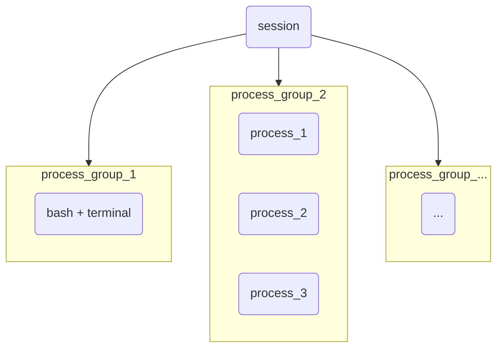

# 1.铺垫概念

理解守护进程之前，我们要先来理解一些周边概念：

-   **PGID**：实际上一个进程除了 `pid、ppid` 还有一个组 `ID` 也就是 `PGID`，组长一般是父进程，也就是第一个被分配 `pid` 进程（不过值得注意的是 `bash` 本身自成一组）

-   **SID**：进程还有一个会话 `ID` 也就是 `SID`，任何进行登录的用户，需要有多个进程（组）来给该用户提供服务，以及用户自己启动的进程或服务，最终都会属于同一个 `SID`

-   **PPID**：在 `bash` 中同时用管道启动多个进程，则这些进程都是兄弟进程（都有共同的 `PPID`），父进程都是 `bash`，可以通过管道来通信

-   **前台进程**：和终端相关联的进程就是前台进程，简单说就是能从终端正常获取输入并且正常输出的进程（`bash` 本身就是一种前台进程）。而若一个进程被 `bash` 运行起来后，用户无法继续和 `bash` 进行交互，则说明前台进程从 `bash` 切换到了该进程

-   **登录和注销**：`Windows` 下实际上也有登录和退出登录的概念，那就是“注销”而非“关机”选项，一旦注销，就会把当前用户启动的相关进程或服务全部杀掉，也可以达到解决卡顿的目的。

# 2.守护进程的编写



如果用户退出登录了，理论上上述会话内的进程和服务都需要被释放（大部分需要，不同版本的退出处理机制不一样）。

如果我们 **让一个进程自成一个会话，就可以让该进程变成守护进程**。而 `Linux` 就提供了 `<unistd.h>` 内的 `pid_tr setsid(void);` 系统调用，可以让一个进程变成会话。失败返回 `-1`，成功返回调用该函数的进程。

另外还需要保证调用进程不是进程组组长（组长不允许成为守护进程），可使用 `fork()` 创建的子进程来保证该进程不是组长。

>   补充：而且 `Linux` 下还有关于守护进程的 `daemon()` 接口，可以让一个进程变成守护进程，但不怎么使用。

下面我写一份代码，我先不运用这份代码，但是在之后的网络代码中会尝试进行运用，您可以先简单看看这里的代码：

```cpp
//daemon.hpp
#pragma once
#include <iostream>
#include <unistd.h>
#include <signal.h>
#include <signal.h>
#include <sys/types.h>
#include <sys/stat.h>
#include <fcntl.h>

//调用下述函数时，就会
void MyDaemon()
{
    //1.忽略信号，避免服务端因为某些原因挂掉
    signal(SIGPIPE, SIG_IGN); //防止运行过程中出现非法写入的问题（例如服务端写到一半时，客户端因为异常而被关闭），避免因为客户端出现问题，导致服务端跟着挂掉
    signal(SIGCHLD, SIG_IGN); //不向父进程提醒，因此不回收子进程

    //2.避免自己成为组长
    if (fork() > 0)
    {
        exit(0); //父进程直接正常终止
    }

    //下面是子进程的部分

    //3.调用 setsid()
    setsid(); //成为新的会话

    //4.标准输出、标准输入、标准错误的重定向（尤其是不能在屏幕上进行日志打印，一旦打印就有可能暂停和中止）
    int devNnll = open("/dev/null", O_RDONLY | O_WRONLY); //在 Linux 中基本都有 /dev/null，其特点就是写入任何数据都会清空，也无法读取任何数据（文件黑洞）
    if (devNnll > 0)
    {
        dup2(devNnll, 0); //oldfd 复制-> newfd
        dup2(devNnll, 1);
        dup2(devNnll, 2);
        close(devNnll);
    }
}
```

另外，我们也可以看到，守护进程实际上就是一种被托管的特殊的孤儿进程。

# 3.发布作业

`at` 命令用于在指定时间内执行一次性的任务，例如下面用法

```bash
$ at 10:46 PM
at> echo "Hello, world!" > ./temp
at> <EOT>
job 4 at Wed Apr 24 22:46:00 2024
```

这将在本日的晚上 `10:46` 点执行任务。要删除作业，可以使用 `atrm` 命令，后跟作业的 `ID`。

还有一个 `crontab` 可以设置可重复执行的、周期性的作业。

1.  创建或编辑 `crontab` 文件：使用 `crontab -e` 命令来编辑当前用户的 `crontab` 文件。如果之前没有设置过 `crontab`，它会打开一个新的编辑器，并在其中添加或编辑 `cron` 作业。如果已经有了 `crontab`，它会打开一个编辑器，允许您编辑现有的 `cron` 作业。

2.  添加 `cron` 作业：在编辑器中按照 `cron` 作业的格式添加要执行的命令和时间规范，格式如下：

    ```bash
    分 时 日 月 周 命令
    ```

    其中，分表示分钟（`0-59`），时表示小时（`0-23`），日表示一个月中的某一天（`1-31`），月表示月份（`1-12`），周表示一周中的某一天（`0-6`，`0` 代表周日），使用 `*` 就代表该时间段内的任意一个时间点，命令是要执行的命令或脚本。

    例如，要在每分钟执行一个脚本，可以这样添加一个 `cron` 作业：

    ```bash
    0 * * * * echo "hello" >> mytest
    ```

3.  保存和退出：编辑完成后，保存并退出编辑器。

4.  列出当前的 `crontab` 文件：使用 `crontab -l` 命令列出当前用户的 `crontab` 文件中的所有作业。

5.  删除 `crontab` 文件：使用 `crontab -r` 命令删除当前用户的 `crontab` 文件。
