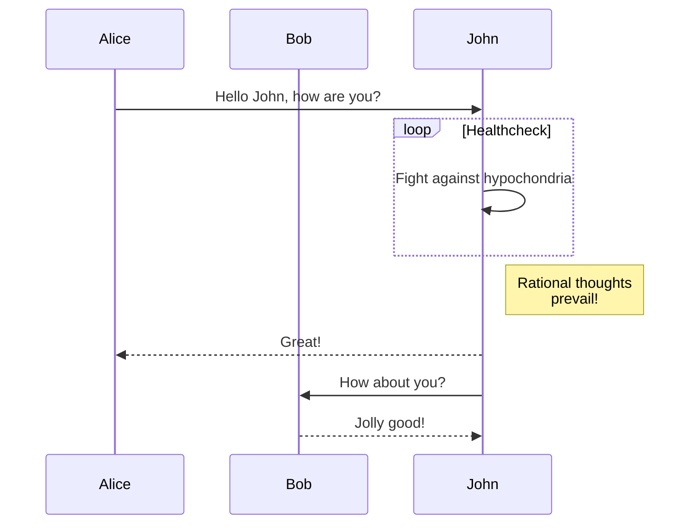
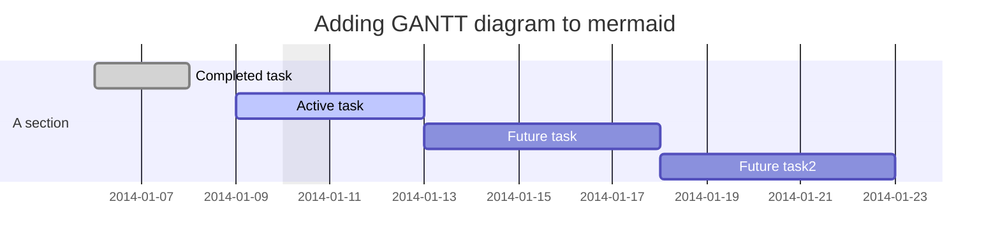
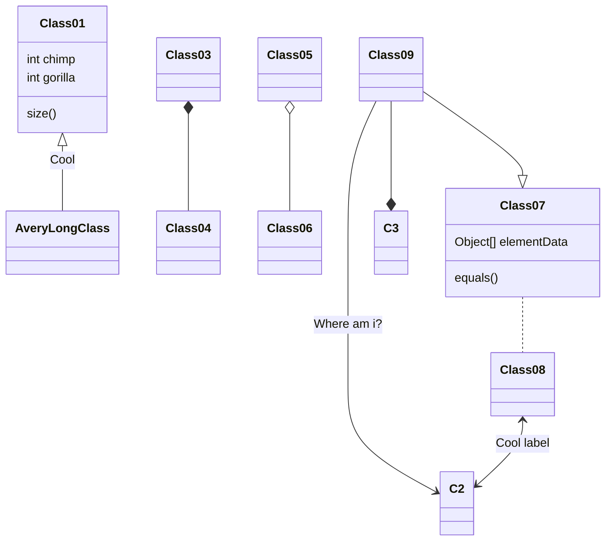
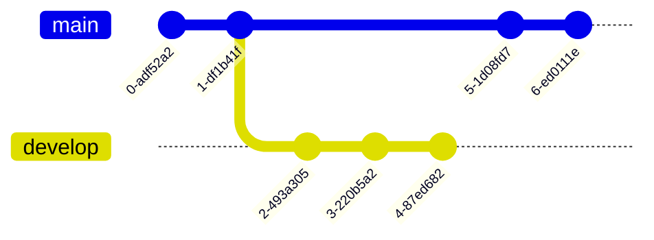
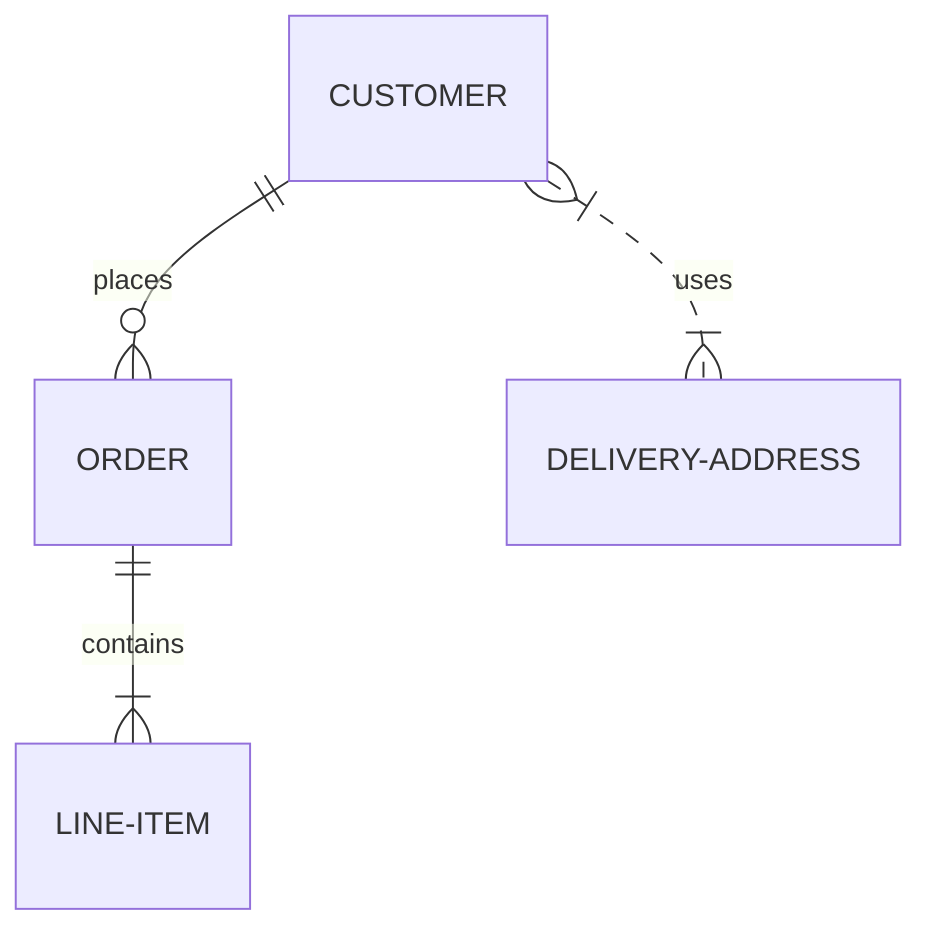
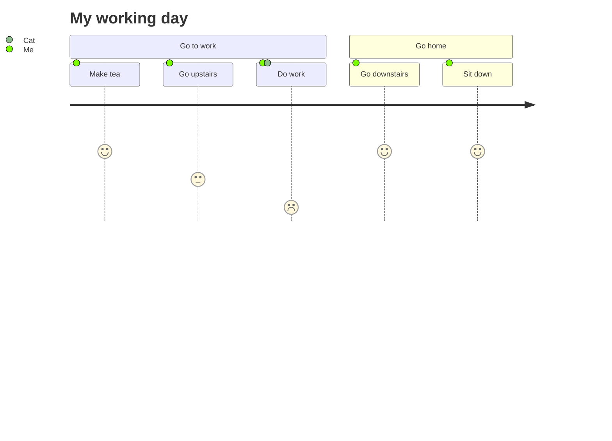
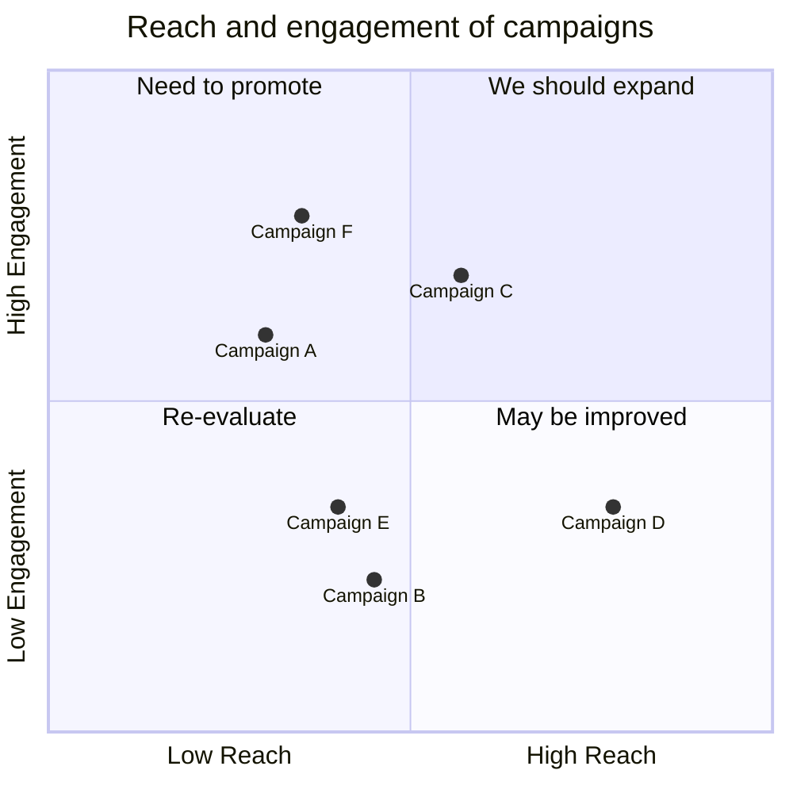

>   译者：我不会将所有的内容全部翻译一遍，那样真的是太多了，并且不符合我的需求：学习`mermaid`的基础语法。因此如果需要完整阅读所有有关`mermaid`的内容请移步[Mermaid | Diagramming and charting tool](http://mermaid.js.org/)的官方文档。另外本译文不是完整将整个网页进行翻译，会为了符合学习逻辑对文档文本进行剪切和调换。因此我会在开头给与原文链接供您朔源。

[TOC]

>   朔源：[About Mermaid | Mermaid](http://mermaid.js.org/intro/)

# 1.Mermaid概念

Mermaid lets you create diagrams and visualizations using text and code.

It is a JavaScript based diagramming and charting tool that renders Markdown-inspired text definitions to create and modify diagrams dynamically.

If you are familiar with Markdown you should have no problem learning [Mermaid's Syntax](http://mermaid.js.org/intro/syntax-reference.html).

The main purpose of Mermaid is to help documentation catch up with development.

Diagramming and documentation costs precious developer time and gets outdated quickly. But not having diagrams or docs ruins productivity and hurts organizational learning.

Mermaid addresses this problem by enabling users to create easily modifiable diagrams, it can also be made part of production scripts (and other pieces of code).

Mermaid allows even non-programmers to easily create detailed and diagrams through the [Mermaid Live Editor](https://mermaid.live/).

>   fan'yi：`Mermaid`允许您（`let you`）使用文本和代码创建图表和可视化（`diagrams and visualizations `图表（偏向概念转化为图标）和可视化）
>
>   它是基于（`based `以...为基础的）`JavaScript`的图表和图表工具（`charting tool`图表工具（偏向数据转化为图表）），启发（`inspired`品质优秀的，能力卓越的；启发、激发）自`markdown`的文本定义（`renders `渲染，`definition`定义），用来动态（ `dynamically `动态地，充满活力的）创建和修改图表（`modify diagrams`修改图表）。
>
>   如果您熟悉（`familiar `熟悉）`Markdown`语法，那么那么学习`Mermaid`应该没有问题。
>
>   `Mermaid`的主要目的（`purpose `目的）是帮助文档追上（`catch`捕捉、追上）开发（`development`开发）。
>
>   图表和文档损失（`costs `损失）宝贵（`precious`珍贵）的开发时间并且很快过时（`quickly`快捷、短暂、马上，`gets outdated`过时）。但是没有图表或者说明文献（`docs`说明文件、文献）会损灭（` ruins`毁灭）生产力（`productivity`生产力）和损害（`hurt`损害）组织学习（`organizational`学习）。
>
>   `Mermaid`使用户能够（`enabling`授权的；使能够）创建易于修改的图表解决这个问题（`addresses this problem`解决这个问题，`address`还有地址的意思），它也可以变为（`make`这里出现的`make`是指“变成”）制作生产脚本（`production scripts`生产脚本）的一部分（`part`某物的部分）。
>
>   `Mermaid`甚至（`even`甚至）允许（`allows `允许）非程序员通过（`through`通过）实时编译器（`Live Editor`）简单创建精致图表（`detailed`精致的）。

# 2.Mermaid运用

## 2.1.[Flowchart | 流程图](http://mermaid.js.org/syntax/flowchart.html?id=flowcharts-basic-syntax)

## 2.2.[Sequence diagram | 序列图](http://mermaid.js.org/syntax/sequenceDiagram.html)

## 2.3.[Gantt diagram | 甘特图](http://mermaid.js.org/syntax/gantt.html)

## 2.4.[Class diagram | 类图](http://mermaid.js.org/syntax/classDiagram.html)

## 2.5.[Git graph Git | Git图](http://mermaid.js.org/syntax/gitgraph.html)

## 2.6.[Entity Relationship Diagram | 实体关系图](http://mermaid.js.org/syntax/entityRelationshipDiagram.html)

## 2.7.[User Journey Diagram | 用户旅程图](http://mermaid.js.org/syntax/userJourney.html)

## 2.8.[Quadrant Chart | 象限图](http://mermaid.js.org/syntax/quadrantChart.html)

# 3.Mermaid安装

In depth guides and examples can be found at [Getting Started](http://mermaid.js.org/intro/getting-started.html) and [Usage](http://mermaid.js.org/config/usage.html).

Four ways of using mermaid:

1.  Using the Mermaid Live Editor at [mermaid.live](https://mermaid.live/).
2.  Using [mermaid plugins](http://mermaid.js.org/ecosystem/integrations-community.html) with programs you are familiar with.
3.  Calling the Mermaid JavaScript API.
4.  Deploying Mermaid as a dependency.

>   译文：深入（`depth `）的指南（`guides`）和示例（`examples`）可以在“开始（`Getting Started`）”和“使用方法”中找到（`found `）。
>
>   使用美人鱼的四种方法（`ways`）：
>
>   1.   在`mermaid.live`使用美人鱼实时编辑器。
>   2.   将`mermaid`插件与您熟悉的程序一起使用。
>   3.   调用`mermaid`的`JavaScript API`。
>   4.   将`mermaid`部署（`Deploying `部署）为依赖项（`dependency`依赖关系；依赖）。

>   译者：本译文会使用实施编辑器，关于其他三种方法请读者自行移步官方文档，因为本译文的目的是学习`mermaid`语法。

# 4.Mermaid语法

It would also be helpful to learn more about mermaid's [Syntax](http://mermaid.js.org/intro/syntax-reference.html).

>   了解学习更多关于美人鱼语法（`Syntax`语法）的信息也将会有所帮助（`be helpful to`对...有帮助的）。

# 5.Mermaid资源

## 5.1.视频教程

[Tutorials | Mermaid](http://mermaid.js.org/config/Tutorials.html)

## 5.2.结合程序

[Integrations | Mermaid](http://mermaid.js.org/ecosystem/integrations-community.html)