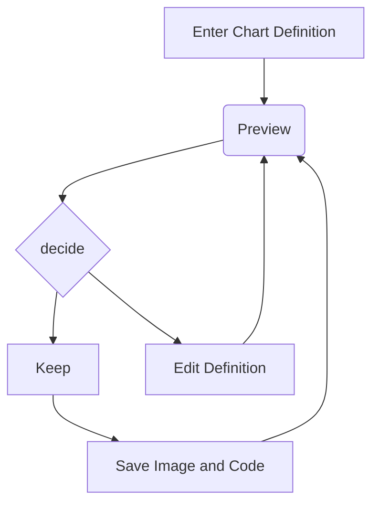

[TOC]

>   朔源：[A Mermaid User-Guide for Beginners | Mermaid](http://mermaid.js.org/intro/getting-started.html)

# 1.[Using the Live Editor(使用实时编辑器)](http://mermaid.js.org/intro/getting-started.html#_1-using-the-live-editor)

Available at [mermaid.live](https://mermaid.live/).

```
graph TD
    A[Enter Chart Definition] --> B(Preview)
    B --> C{decide}
    C --> D[Keep]
    C --> E[Edit Definition]
    E --> B
    D --> F[Save Image and Code]
    F --> B
```



In the `Code` section one can write or edit raw mermaid code, and instantly `Preview` the rendered result on the panel beside it.

The `Configuration` Section is for changing the appearance and behavior of mermaid diagrams. An easy introduction to mermaid configuration is found in the [Advanced usage](http://mermaid.js.org/config/advanced.html) section. A complete configuration reference cataloging the default values can be found on the [mermaidAPI](http://mermaid.js.org/config/setup/README.html) page.


>   翻译：在该代码段部分（`section`）中，可以编写或编辑（`edit`）原始（`raw`原始的）美人鱼代码，并且立即（`instantly`）预览（`Preview`）在其旁边（`beside`）的面板（`panel`）上显示渲染（`rendered`）结果（`result`）。
>
>   配置（`Configuration`）部分用于更改（`changing`）美人鱼图的外观和行为（`appearance and behavior`）。有关美人鱼配置的简单介绍（`An easy introduction`），可在高级用法（`Advanced usage`）部分找到。可以在`mermaidAPI`页面上找到对默认值进行目录编制（`cataloging`）的一个完整配置（`complete configuration `）参考（`reference`）。

# 2.[Editing History(编辑历史记录)](http://mermaid.js.org/intro/getting-started.html#editing-history)

Your code will be autosaved every minute into the Timeline tab of History which shows the most recent 30 items.

You can manually save code by clicking the Save icon in the History section. It can also be accessed in the Saved tab. This is stored in the browser storage only.

>   翻译：您的代码将每分钟自动保存（`autosaved`，其中`Saved`是保存的意思）到历史记录的“时间轴”选项卡中，该选项卡显示最近（`recent`最近、最新的）的`30`个项目（`item`）。
>
>   您可以通过单击（`clicking`）“历史记录”部分中的“保存”图标（`icon`）来手动（`manually`）保存代码。也可以在“已保存”选项卡中访问（`accessed`访问、存取）它，这仅存储（`stored`）在浏览器（`browser`）存储中。

# 3.[Saving a Diagram(保存图表)](http://mermaid.js.org/intro/getting-started.html#saving-a-diagram)

You may choose any of the methods below, to save it.

We recommend that you save your diagram code on top of any method you choose, in order to make edits and modifications further down the line.


>   翻译：您可以选择以下（`below`在...下面）任何一种方法（`methods `）来保存它。
>
>   我们建议（`recommend`）您保存您的图表代码在任何所选方法之上，为了（`in order to do`）在未来（`down the line`）进一步（`further`）进行编辑和修改（`modifications`）。

# 4.[Editing your diagrams(编辑图表)](http://mermaid.js.org/intro/getting-started.html#editing-your-diagrams)

Editing is as easy as pasting your Diagram code into the `code` section of the `Live Editor`.

>   翻译：编辑就像粘贴（`pasting`）图表代码到`Live Editor`一样简单

# 5.[Loading from Gists(从要点加载)](http://mermaid.js.org/intro/getting-started.html#loading-from-gists)

>   译者：这部分没看懂...