[TOC]

>   朔源：[Flowcharts Syntax | Mermaid](http://mermaid.js.org/syntax/flowchart.html)

>   译者：主要是关于流程图的基本语法。另外，本章说的代码都可以在[Mermaid Live Editor](https://mermaid.live/edit#pako:eNoljr0OwjAMhF8l8ty8QGZGYIDVi5W4NCI_yDhCqOq745abTt_dSbdC7IkhgPcem2YtHNzVELaDzKV_4kKi7nzD5kx7CBNUlko52XLdOYIuXBkhmE0kTwRsm_VoaL9_W4SgMniC8UqkfMr0EKoQZipvo5yydrn8rxyPth8e5zL-)中测试验证。

Flowcharts are composed of **nodes** (geometric shapes) and **edges** (arrows or lines). The Mermaid code defines how nodes and edges are made and accommodates different arrow types, multi-directional arrows, and any linking to and from subgraphs.

>   翻译：流程图是由结点（一些几何形状（`geometric shape`几何形状））和连接线(箭头和线条（`arrows or lines`箭头和线条）组成（`composed`组成）。
>
>   `Mermaid`代码定义了如何制作结点和箭头，并且适应（`accommodates`适应）不同的箭头类型、多向（`multi`多用的 `directional`方向）箭头，以及和子图的任意连接。

# 1.A node(default)(默认结点)

```
---
title: Node //这是一段描述
---
flowchart LR
    id
```

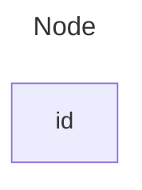

Instead of `flowchart` one can also use `graph`.

>   翻译：也可以使用`graph`替代（`instead of`替代）`flowchart`。

# 2.A node with text(包含文本的结点)

```
graph LR
    A["Node A"] --> B["Node B"]
```

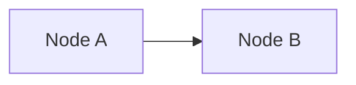

```
graph LR
    A -->|Edge from A to B| B
    A["Node A"]
    B["Node B"]
```

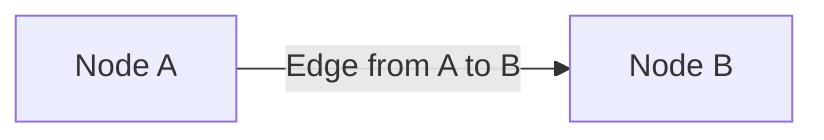


It is also possible to set text in the box that differs from the id.

If this is done several times, it is the last text found for the node that will be used.

Also if you define edges for the node later on, you can omit text definitions.

The one previously defined will be used when rendering the box.

```
%%{init: {"flowchart": {"htmlLabels": false}} }%%
flowchart LR
    markdown["`This **is** _Markdown_`"]
    newLines["`Line1
    Line 2
    Line 3`"]
    
    markdown --> newLines
```

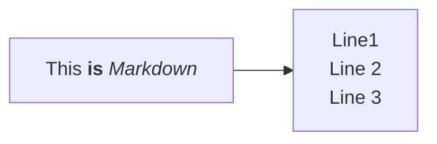

Use `"` to enclose the unicode text.

Use double quotes and backticks "\` text \`" to enclose the markdown text.

>   翻译：也可以（`possible`可能的、可以做到的）设置和`id`不同的文本。
>
>   如果多次做这个操作，它将找到并使用结点的最后文本。
>
>   如果你后面为结点定义连接线（`edge`边缘、连接线），你可以省去（`omit`省去、省略）文本定义。
>
>   >   译者：然后在代码的末尾定义文本，这种做法首先保证了流程图的逻辑性，然后才考虑具体内容，具体以您而定。
>
>   渲染（`rendering`渲染）盒子时，将会使用（`previously`以前的、先前的）之前的那个定义。
>
>   >   译者：应该是指省略文本定义后，就会回到[A node(default)](#1.A node(default)(默认结点))的情况，只显示`id`名。
>
>   使用`"`将`Unicode text`文本括起来。
>
>   使用双引号和反引号（`double quotes and backticks`）将`Markdown text`文本括起来。
>
>   >   译者：上述两句话第一句推荐在定义任何文本的时候使用，避免渲染的时候错误解析了文本。第二句话实际上就是支持一些`Markdown`语法，需要注意换行也会被解释为实际的换行，而不会被省略。

# 3.Direction(方向)

This statement declares the direction of the Flowchart.

This declares the flowchart is oriented from top to bottom (`TD` or `TB`).

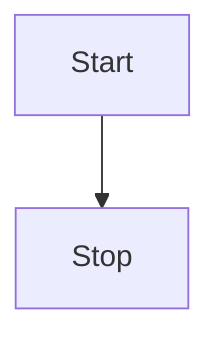

This declares the flowchart is oriented from left to right (`LR`).


Possible FlowChart orientations are:

1.   `TB` - Top to bottom(`TD` - Top-down/same as top to bottom)
2.   `BT` - Bottom to top
3.   `RL` - Right to left
4.   `LR` - Left to right

>   翻译：此语句（`This statement`）声明（`declare`声明）了流程图的方向。
>
>   这个声明代表流程图是从上到下定向（`oriented`以...为方向）的（ `TD` 或 `TB` 都可以）。
>
>   这个声明代表流程图的方向是从左到右的（ `LR` ）。
>
>   流程图可能的方向（`orientations`方向）是：
>
>   1.   `TB/TD`：从上到下
>   2.   `BT`：从下到上
>   3.   `RL`：从右到左
>   4.   `LR`：从左到右

# 4.Node shapes(结点形状)

## 4.1.A node with round edges(圆角边缘结点)

```
flowchart LR
    id1(This is the text in the box)
```


## 4.2.A stadium-shaped node(椭圆形结点)

```
flowchart LR
    id1([This is the text in the box])
```


## 4.3.A node in a subroutine shape(在子形状中的结点)

```
flowchart LR
    id1[[This is the text in the box]]
```


## 4.4.A node in a cylindrical shape(圆柱形节点)

```
flowchart LR
    id1[(Database)]
```

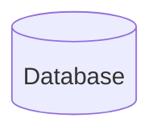

## 4.5.A node in the form of a circle(圆形节点)

```
flowchart LR
    id1((This is the text in the circle))
```

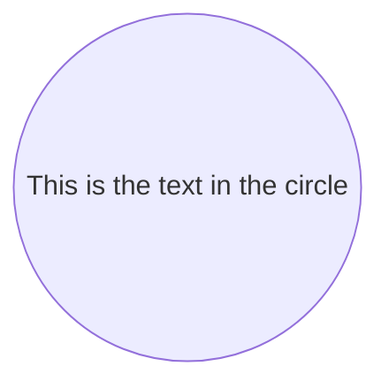

```cpp
flowchart TD
    id1(((This is the text in the circle)))
```

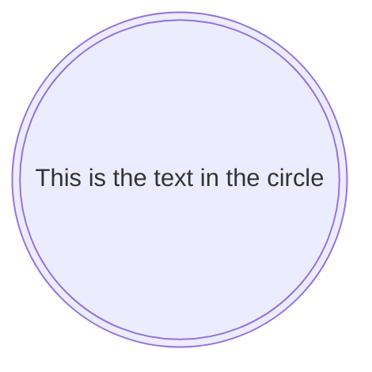

## 4.6.A node in an asymmetric shape(不对称形状的节点)

```
flowchart LR
    id1>This is the text in the box]
```


## 4.7.A node (rhombus)(菱形节点)

```
flowchart LR
    id1{This is the text in the box}
```

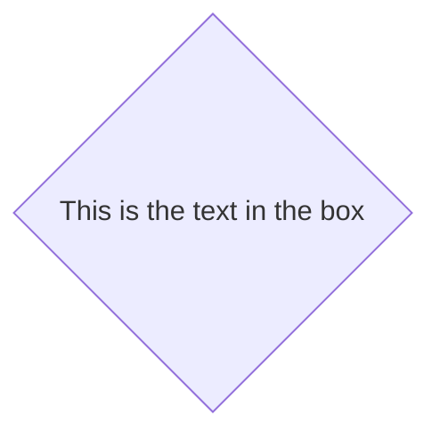

## 4.8.A hexagon node(六边形节点)

```
flowchart LR
    id1{{This is the text in the box}}
```


## 4.9.Parallelogram(平行四边形)

```
flowchart TD
    id1[/This is the text in the box/]
```


```
flowchart TD
    id1[\This is the text in the box\]
```


## 4.10.Trapezoid(梯形)

```
flowchart TD
    A[/Christmas\]
```

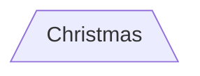

```
flowchart TD
    B[\Go shopping/]
```


# 5.Links between nodes(结点之间的链接)

>   译者：这里主要是看链接语法，无需翻译过度。

## 5.1.带箭头的链接

```
flowchart LR
    A-->B
```

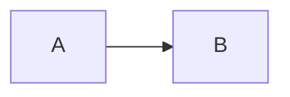

## 5.2.开放的链接

```
flowchart LR
    A --- B
```

```mermaid
flowchart LR
    A --- B
```

## 5.3.带文字的链接

```
flowchart LR
    A-- This is the text ---B
    C---|This is the text|D
    
    G-- |This is the text|--> H
    E-->|This is the text|F    
```

```mermaid
flowchart LR
    A-- This is the text ---B
    C---|This is the text|D
    
    G-- |This is the text|--> H
    E-->|This is the text|F    
```

## 5.4.虚线的链接

```
flowchart LR
   A-.->B;
   C-. This is the text .-> D
   E -.->|This is the text| F
```

```mermaid
flowchart LR
   A-.->B;
   C-. This is the text .-> D
   E -.->|This is the text| F
```

## 5.5.带粗线的链接

```
flowchart LR
   A ==> B
   C == This is the text ==> D
   E ==>|This is the text| F
```

```mermaid
flowchart LR
   A ==> B
   C == This is the text ==> D
   E ==>|This is the text| F
```

## 5.6.看不见的链接

```
flowchart LR
    A ~~~ B
```

```mermaid
flowchart LR
    A ~~~ B
```

This can be a useful tool in some instances where you want to alter the default positioning of a node.

>   翻译：在某些情况下（`in some instances`在某些（特定）情况下）这可能是（`can be`可能是、能成为、可以是）有用的（`useful`有用的、有益的）工具（当您希望改变（`alter`）结点的默认位置（`positioning`位置，定位，走位）的时候）。

## 5.7.Chaining of links(连接链接们)

It is possible declare many links in the same line as per below:

>   翻译：（`possible`可能的，可能做到的）（`declare`声明）可以在同一行中声明许多同样的链接，如下所示（`as per below:`）：

```
flowchart LR
   A -- text --> B -- text2 --> C
```

It is also possible to declare multiple nodes links in the same line as per below:

>   翻译：也可以在同一行中声明多个（`multiple`多个的、多种的，多人共有的）点链接，如下所示：

```mermaid
flowchart LR
   a --> b & c--> d
```

You can then describe dependencies in a very expressive way. Like the one-liner below:

>   翻译：你也可以用一种非常富有表现力的方式（`expressive way`表现手法）声明依赖，就像下面这一行：

```
flowchart TB
    A & B--> C & D
```

```mermaid
flowchart TB
    A & B--> C & D
```

If you describe the same diagram using the the basic syntax, it will take four lines.

A word of warning, one could go overboard with this making the flowchart harder to read in markdown form.

>   翻译：如果你使用级别的语法（`syntax`语法）声明同样的图表（`diagram`图表），这将需要四行。
>
>   提醒一句，可能使得（`making`使得）这个流程图在`Markdown`中更难阅读。

```
flowchart TB
    A --> C
    A --> D
    B --> C
    B --> D
```

```mermaid
flowchart TB
    A --> C
    A --> D
    B --> C
    B --> D
```

## 5.8.New arrow types(新的箭头类型)

There are new types of arrows supported as per below:

```
flowchart LR
    A --o B
    B --x C
```

```mermaid
flowchart LR
    A --o B
    B --x C
```

>   翻译：支持如下所示（`as per below`）新的箭头类型。

## 5.9.Multi directional arrows(多方向箭头)

There is the possibility to use multidirectional arrows.

```
flowchart LR
    A o--o B
    B <--> C
    C x--x D
```

```mermaid
flowchart LR
    A o--o B
    B <--> C
    C x--x D
```

>   可以（` possibility`）使用多向的箭头。

## 5.10.Minimum length of a link(链接的最小长度)

Each node in the flowchart is ultimately assigned to a rank in the rendered graph, i.e. to a vertical or horizontal level (depending on the flowchart orientation), based on the nodes to which it is linked. By default, links can span any number of ranks, but you can ask for any link to be longer than the others by adding extra dashes in the link definition.

In the following example, two extra dashes are added in the link from node *B* to node *E*, so that it spans two more ranks than regular links:

```
flowchart TD
    A[Start] --> B{Is it?}
    B -->|Yes| C[OK]
    C --> D[Rethink]
    D --> B
    B ---->|No| E[End]
```

```mermaid
flowchart TD
    A[Start] --> B{Is it?}
    B -->|Yes| C[OK]
    C --> D[Rethink]
    D --> B
    B ---->|No| E[End]
```

**Note** Links may still be made longer than the requested number of ranks by the rendering engine to accommodate other requests.

When the link label is written in the middle of the link, the extra dashes must be added on the right side of the link. The following example is equivalent to the previous one:

```
flowchart TD
    A[Start] --> B{Is it?}
    B -- Yes --> C[OK]
    C --> D[Rethink]
    D --> B
    B -- No ----> E[End]
```

```mermaid
flowchart TD
    A[Start] --> B{Is it?}
    B -- Yes --> C[OK]
    C --> D[Rethink]
    D --> B
    B -- No ----> E[End]
```

For dotted or thick links, the characters to add are equals signs or dots, as summed up in the following table:

| Length(长度)                    |   1    |    2    |    3     |
| :------------------------------ | :----: | :-----: | :------: |
| Normal(正常)                    | `---`  | `----`  | `-----`  |
| Normal with arrow(正常带箭头的) | `-->`  | `--->`  | `---->`  |
| Thick(粗的)                     | `===`  | `====`  | `=====`  |
| Thick with arrow(带厚箭头的)    | `==>`  | `===>`  | `====>`  |
| Dotted(虚线)                    | `-.-`  | `-..-`  | `-...-`  |
| Dotted with arrow(箭头箭头)     | `-.->` | `-..->` | `-...->` |

# 6.Special characters that break syntax(破坏语法的特殊字符)

# 7.Subgraphs(子图)

# 8.Markdown Strings(Markdown字符串)

# 9.Interaction(互动)

# 10.Styling and classes(样式和类)

# 11.Basic support for fontawesome(对fontawesome的基本支持)


