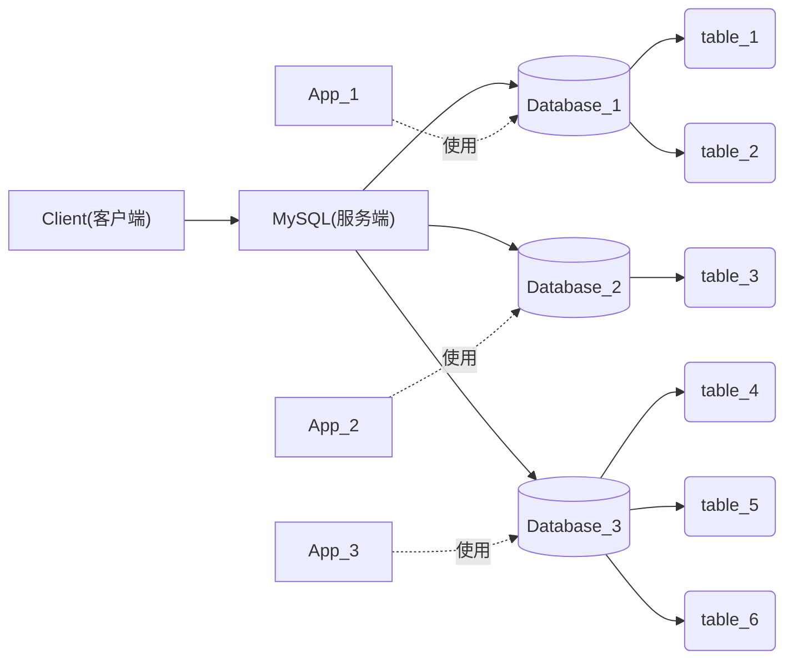
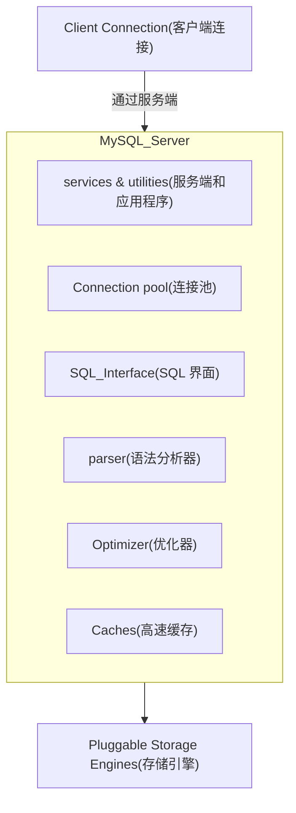

# 1.连接 MySQL

`MySQL` 本质是一个网络服务，因此需要连接主机 `IP` 地址

```bash
mysql -h 127.0.0.1 -P 3306 -u root -p
```

回车输入密码或者设置免密。

-   `-h`：指明登录部署了 `MySQL` 服务的主机
-   `-P`：指明需要访问的端口号
-   `-u`：指明登录用户
-   `-p`：指明需要输入的密码

而使用 `quit` 就可以退出数据库（使用 `exit` 也可以）。

连接上数据库后，可以使用类似编程语言的数据库语法来操作数据库。

# 2.数据库操作

>   前要：只是的数据库本身进行增删查改、备份、恢复等操作，而不是对数据库内的数据表做操作，还请您区分好这两点。

## 2.1.创建数据库

```mysql
# 创建数据库的语法形式
CREATE DATABASE [IF NOT EXISTS] database_name [create_specification]

# 大写的是关键字
# [] 是可选项
# [create_specification]:设置数据库的创建规格
#    (1)[charset=指定字符集]/[charset set 指定字符集]:数据库设置字符集
#    (2)[collate 指定校验规则]:数据库设置校验集/校验规则
# IF NOT EXISTS:如果数据库不存在就创建，存在就不创建
# CHARACTER SET:指定数据库采用的字符集
# COLLATE:指定数据库字符集的校验规则
```

会在 `/var/lib/mysql` 里创建一个和数据库列表中同名的一个目录（实际上我们在该目录下创建一个目录时，使用 `SHOW DATABASE` 也会出现在数据库列表中，但是最好不要这么做）。

创建数据库的知识我们前面已经讲过了，这里只是做一些语法补充，其中最重要的补充就是字符编码和校验规则。

当我们创建数据库没有指定字符集和校验规则时，系统将会使用默认字符集 `utf8` 和校验规则 `utf8_general_ci`。

我们可以使用以下指令来查看系统默认的字符集和校验规则：

```mysql
# 查看系统默认的字符集和校验规则 
mysql> show variables like 'character_set_database';
+------------------------+-------+
| Variable_name          | Value |
+------------------------+-------+
| character_set_database | utf8  |
+------------------------+-------+
1 row in set (0.01 sec)

mysql> show variables like 'collation_database';
+--------------------+-----------------+
| Variable_name      | Value           |
+--------------------+-----------------+
| collation_database | utf8_general_ci |
+--------------------+-----------------+
1 row in set (0.00 sec)
```

这两个设置的值会被存放在数据库对应的文件目录下的 `db.opt` 文件中。

### 2.1.1.字符编码

字符集的设置，关系到数据库未来如何“存储”或“表示”数据。

>   补充：`utf8` 支持中文。

可以使用以下命令来查看数据库支持的字符集：

```mysql
# 查看数据库支持的字符集
mysql> show charset;
+----------+---------------------------------+---------------------+--------+
| Charset  | Description                     | Default collation   | Maxlen |
+----------+---------------------------------+---------------------+--------+
| big5     | Big5 Traditional Chinese        | big5_chinese_ci     |      2 |
| dec8     | DEC West European               | dec8_swedish_ci     |      1 |
| cp850    | DOS West European               | cp850_general_ci    |      1 |
| hp8      | HP West European                | hp8_english_ci      |      1 |
| koi8r    | KOI8-R Relcom Russian           | koi8r_general_ci    |      1 |
| latin1   | cp1252 West European            | latin1_swedish_ci   |      1 |
| latin2   | ISO 8859-2 Central European     | latin2_general_ci   |      1 |
| swe7     | 7bit Swedish                    | swe7_swedish_ci     |      1 |
| ascii    | US ASCII                        | ascii_general_ci    |      1 |
| ujis     | EUC-JP Japanese                 | ujis_japanese_ci    |      3 |
| sjis     | Shift-JIS Japanese              | sjis_japanese_ci    |      2 |
| hebrew   | ISO 8859-8 Hebrew               | hebrew_general_ci   |      1 |
| tis620   | TIS620 Thai                     | tis620_thai_ci      |      1 |
| euckr    | EUC-KR Korean                   | euckr_korean_ci     |      2 |
| koi8u    | KOI8-U Ukrainian                | koi8u_general_ci    |      1 |
| gb2312   | GB2312 Simplified Chinese       | gb2312_chinese_ci   |      2 |
| greek    | ISO 8859-7 Greek                | greek_general_ci    |      1 |
| cp1250   | Windows Central European        | cp1250_general_ci   |      1 |
| gbk      | GBK Simplified Chinese          | gbk_chinese_ci      |      2 |
| latin5   | ISO 8859-9 Turkish              | latin5_turkish_ci   |      1 |
| armscii8 | ARMSCII-8 Armenian              | armscii8_general_ci |      1 |
| utf8     | UTF-8 Unicode                   | utf8_general_ci     |      3 |
| ucs2     | UCS-2 Unicode                   | ucs2_general_ci     |      2 |
| cp866    | DOS Russian                     | cp866_general_ci    |      1 |
| keybcs2  | DOS Kamenicky Czech-Slovak      | keybcs2_general_ci  |      1 |
| macce    | Mac Central European            | macce_general_ci    |      1 |
| macroman | Mac West European               | macroman_general_ci |      1 |
| cp852    | DOS Central European            | cp852_general_ci    |      1 |
| latin7   | ISO 8859-13 Baltic              | latin7_general_ci   |      1 |
| utf8mb4  | UTF-8 Unicode                   | utf8mb4_general_ci  |      4 |
| cp1251   | Windows Cyrillic                | cp1251_general_ci   |      1 |
| utf16    | UTF-16 Unicode                  | utf16_general_ci    |      4 |
| utf16le  | UTF-16LE Unicode                | utf16le_general_ci  |      4 |
| cp1256   | Windows Arabic                  | cp1256_general_ci   |      1 |
| cp1257   | Windows Baltic                  | cp1257_general_ci   |      1 |
| utf32    | UTF-32 Unicode                  | utf32_general_ci    |      4 |
| binary   | Binary pseudo charset           | binary
   |      1 |
| geostd8  | GEOSTD8 Georgian                | geostd8_general_ci  |      1 |
| cp932    | SJIS for Windows Japanese       | cp932_japanese_ci   |      2 |
| eucjpms  | UJIS for Windows Japanese       | eucjpms_japanese_ci |      3 |
| gb18030  | China National Standard GB18030 | gb18030_chinese_ci  |      4 |
+----------+---------------------------------+---------------------+--------+
41 rows in set (0.00 sec)
```

### 2.1.2.校验规则

校验规则定义了字符的比较规则、排序规则、字符串的大小写敏感性等，影响数据库的排序、搜索、比较操作。

可以使用以下命令来查看数据库支持的校验规则：

```mysql
# 查看数据库支持的校验规则
mysql> show collation;
+--------------------------+----------+-----+---------+----------+---------+
| Collation                | Charset  | Id  | Default | Compiled | Sortlen |
+--------------------------+----------+-----+---------+----------+---------+
| big5_chinese_ci          | big5     |   1 | Yes     | Yes      |       1 |
| big5_bin                 | big5     |  84 |         | Yes      |       1 |
| dec8_swedish_ci          | dec8     |   3 | Yes     | Yes      |       1 |
| dec8_bin                 | dec8     |  69 |         | Yes      |       1 |
| cp850_general_ci         | cp850    |   4 | Yes     | Yes      |       1 |
| cp850_bin                | cp850    |  80 |         | Yes      |       1 |
| hp8_english_ci           | hp8      |   6 | Yes     | Yes      |       1 |
| hp8_bin                  | hp8      |  72 |         | Yes      |       1 |
| koi8r_general_ci         | koi8r    |   7 | Yes     | Yes      |       1 |
| koi8r_bin                | koi8r    |  74 |         | Yes      |       1 |
| latin1_german1_ci        | latin1   |   5 |         | Yes      |       1 |
| latin1_swedish_ci        | latin1   |   8 | Yes     | Yes      |       1 |
| latin1_danish_ci         | latin1   |  15 |         | Yes      |       1 |
| latin1_german2_ci        | latin1   |  31 |         | Yes      |       2 |
| latin1_bin               | latin1   |  47 |         | Yes      |       1 |
| latin1_general_ci        | latin1   |  48 |         | Yes      |       1 |
| latin1_general_cs        | latin1   |  49 |         | Yes      |       1 |
| latin1_spanish_ci        | latin1   |  94 |         | Yes      |       1 |
| latin2_czech_cs          | latin2   |   2 |         | Yes      |       4 |
| latin2_general_ci        | latin2   |   9 | Yes     | Yes      |       1 |
| latin2_hungarian_ci      | latin2   |  21 |         | Yes      |       1 |
| latin2_croatian_ci       | latin2   |  27 |         | Yes      |       1 |
| latin2_bin               | latin2   |  77 |         | Yes      |       1 |
| swe7_swedish_ci          | swe7     |  10 | Yes     | Yes      |       1 |
| swe7_bin                 | swe7     |  82 |         | Yes      |       1 |
| ascii_general_ci         | ascii    |  11 | Yes     | Yes      |       1 |
| ascii_bin                | ascii    |  65 |         | Yes      |       1 |
| ujis_japanese_ci         | ujis     |  12 | Yes     | Yes      |       1 |
| ujis_bin                 | ujis     |  91 |         | Yes      |       1 |
| sjis_japanese_ci         | sjis     |  13 | Yes     | Yes      |       1 |
| sjis_bin                 | sjis     |  88 |         | Yes      |       1 |
| hebrew_general_ci        | hebrew   |  16 | Yes     | Yes      |       1 |
| hebrew_bin               | hebrew   |  71 |         | Yes      |       1 |
| tis620_thai_ci           | tis620   |  18 | Yes     | Yes      |       4 |
| tis620_bin               | tis620   |  89 |         | Yes      |       1 |
| euckr_korean_ci          | euckr    |  19 | Yes     | Yes      |       1 |
| euckr_bin                | euckr    |  85 |         | Yes      |       1 |
| koi8u_general_ci         | koi8u    |  22 | Yes     | Yes      |       1 |
| koi8u_bin                | koi8u    |  75 |         | Yes      |       1 |
| gb2312_chinese_ci        | gb2312   |  24 | Yes     | Yes      |       1 |
| gb2312_bin               | gb2312   |  86 |         | Yes      |       1 |
| greek_general_ci         | greek    |  25 | Yes     | Yes      |       1 |
| greek_bin                | greek    |  70 |         | Yes      |       1 |
| cp1250_general_ci        | cp1250   |  26 | Yes     | Yes      |       1 |
| cp1250_czech_cs          | cp1250   |  34 |         | Yes      |       2 |
| cp1250_croatian_ci       | cp1250   |  44 |         | Yes      |       1 |
| cp1250_bin               | cp1250   |  66 |         | Yes      |       1 |
| cp1250_polish_ci         | cp1250   |  99 |         | Yes      |       1 |
| gbk_chinese_ci           | gbk      |  28 | Yes     | Yes      |       1 |
| gbk_bin                  | gbk      |  87 |         | Yes      |       1 |
| latin5_turkish_ci        | latin5   |  30 | Yes     | Yes      |       1 |
| latin5_bin               | latin5   |  78 |         | Yes      |       1 |
| armscii8_general_ci      | armscii8 |  32 | Yes     | Yes      |       1 |
| armscii8_bin             | armscii8 |  64 |         | Yes      |       1 |
| utf8_general_ci          | utf8     |  33 | Yes     | Yes      |       1 |
| utf8_bin                 | utf8     |  83 |         | Yes      |       1 |
| utf8_unicode_ci          | utf8     | 192 |         | Yes      |       8 |
| utf8_icelandic_ci        | utf8     | 193 |         | Yes      |       8 |
| utf8_latvian_ci          | utf8     | 194 |         | Yes      |       8 |
| utf8_romanian_ci         | utf8     | 195 |         | Yes      |       8 |
| utf8_slovenian_ci        | utf8     | 196 |         | Yes      |       8 |
| utf8_polish_ci           | utf8     | 197 |         | Yes      |       8 |
| utf8_estonian_ci         | utf8     | 198 |         | Yes      |       8 |
| utf8_spanish_ci          | utf8     | 199 |         | Yes      |       8 |
| utf8_swedish_ci          | utf8     | 200 |         | Yes      |       8 |
| utf8_turkish_ci          | utf8     | 201 |         | Yes      |       8 |
| utf8_czech_ci            | utf8     | 202 |         | Yes      |       8 |
| utf8_danish_ci           | utf8     | 203 |         | Yes      |       8 |
| utf8_lithuanian_ci       | utf8     | 204 |         | Yes      |       8 |
| utf8_slovak_ci           | utf8     | 205 |         | Yes      |       8 |
| utf8_spanish2_ci         | utf8     | 206 |         | Yes      |       8 |
| utf8_roman_ci            | utf8     | 207 |         | Yes      |       8 |
| utf8_persian_ci          | utf8     | 208 |         | Yes      |       8 |
| utf8_esperanto_ci        | utf8     | 209 |         | Yes      |       8 |
| utf8_hungarian_ci        | utf8     | 210 |         | Yes      |       8 |
| utf8_sinhala_ci          | utf8     | 211 |         | Yes      |       8 |
| utf8_german2_ci          | utf8     | 212 |         | Yes      |       8 |
| utf8_croatian_ci         | utf8     | 213 |         | Yes      |       8 |
| utf8_unicode_520_ci      | utf8     | 214 |         | Yes      |       8 |
| utf8_vietnamese_ci       | utf8     | 215 |         | Yes      |       8 |
| utf8_general_mysql500_ci | utf8     | 223 |         | Yes      |       1 |
| ucs2_general_ci          | ucs2     |  35 | Yes     | Yes      |       1 |
| ucs2_bin                 | ucs2     |  90 |         | Yes      |       1 |
| ucs2_unicode_ci          | ucs2     | 128 |         | Yes      |       8 |
| ucs2_icelandic_ci        | ucs2     | 129 |         | Yes      |       8 |
| ucs2_latvian_ci          | ucs2     | 130 |         | Yes      |       8 |
| ucs2_romanian_ci         | ucs2     | 131 |         | Yes      |       8 |
| ucs2_slovenian_ci        | ucs2     | 132 |         | Yes      |       8 |
| ucs2_polish_ci           | ucs2     | 133 |         | Yes      |       8 |
| ucs2_estonian_ci         | ucs2     | 134 |         | Yes      |       8 |
| ucs2_spanish_ci          | ucs2     | 135 |         | Yes      |       8 |
| ucs2_swedish_ci          | ucs2     | 136 |         | Yes      |       8 |
| ucs2_turkish_ci          | ucs2     | 137 |         | Yes      |       8 |
| ucs2_czech_ci            | ucs2     | 138 |         | Yes      |       8 |
| ucs2_danish_ci           | ucs2     | 139 |         | Yes      |       8 |
| ucs2_lithuanian_ci       | ucs2     | 140 |         | Yes      |       8 |
| ucs2_slovak_ci           | ucs2     | 141 |         | Yes      |       8 |
| ucs2_spanish2_ci         | ucs2     | 142 |         | Yes      |       8 |
| ucs2_roman_ci            | ucs2     | 143 |         | Yes      |       8 |
| ucs2_persian_ci          | ucs2     | 144 |         | Yes      |       8 |
| ucs2_esperanto_ci        | ucs2     | 145 |         | Yes      |       8 |
| ucs2_hungarian_ci        | ucs2     | 146 |         | Yes      |       8 |
| ucs2_sinhala_ci          | ucs2     | 147 |         | Yes      |       8 |
| ucs2_german2_ci          | ucs2     | 148 |         | Yes      |       8 |
| ucs2_croatian_ci         | ucs2     | 149 |         | Yes      |       8 |
| ucs2_unicode_520_ci      | ucs2     | 150 |         | Yes      |       8 |
| ucs2_vietnamese_ci       | ucs2     | 151 |         | Yes      |       8 |
| ucs2_general_mysql500_ci | ucs2     | 159 |         | Yes      |       1 |
| cp866_general_ci         | cp866    |  36 | Yes     | Yes      |       1 |
| cp866_bin                | cp866    |  68 |         | Yes      |       1 |
| keybcs2_general_ci       | keybcs2  |  37 | Yes     | Yes      |       1 |
| keybcs2_bin              | keybcs2  |  73 |         | Yes      |       1 |
| macce_general_ci         | macce    |  38 | Yes     | Yes      |       1 |
| macce_bin                | macce    |  43 |         | Yes      |       1 |
| macroman_general_ci      | macroman |  39 | Yes     | Yes      |       1 |
| macroman_bin             | macroman |  53 |         | Yes      |       1 |
| cp852_general_ci         | cp852    |  40 | Yes     | Yes      |       1 |
| cp852_bin                | cp852    |  81 |         | Yes      |       1 |
| latin7_estonian_cs       | latin7   |  20 |         | Yes      |       1 |
| latin7_general_ci        | latin7   |  41 | Yes     | Yes      |       1 |
| latin7_general_cs        | latin7   |  42 |         | Yes      |       1 |
| latin7_bin               | latin7   |  79 |         | Yes      |       1 |
| utf8mb4_general_ci       | utf8mb4  |  45 | Yes     | Yes      |       1 |
| utf8mb4_bin              | utf8mb4  |  46 |         | Yes      |       1 |
| utf8mb4_unicode_ci       | utf8mb4  | 224 |         | Yes      |       8 |
| utf8mb4_icelandic_ci     | utf8mb4  | 225 |         | Yes      |       8 |
| utf8mb4_latvian_ci       | utf8mb4  | 226 |         | Yes      |       8 |
| utf8mb4_romanian_ci      | utf8mb4  | 227 |         | Yes      |       8 |
| utf8mb4_slovenian_ci     | utf8mb4  | 228 |         | Yes      |       8 |
| utf8mb4_polish_ci        | utf8mb4  | 229 |         | Yes      |       8 |
| utf8mb4_estonian_ci      | utf8mb4  | 230 |         | Yes      |       8 |
| utf8mb4_spanish_ci       | utf8mb4  | 231 |         | Yes      |       8 |
| utf8mb4_swedish_ci       | utf8mb4  | 232 |         | Yes      |       8 |
| utf8mb4_turkish_ci       | utf8mb4  | 233 |         | Yes      |       8 |
| utf8mb4_czech_ci         | utf8mb4  | 234 |         | Yes      |       8 |
| utf8mb4_danish_ci        | utf8mb4  | 235 |         | Yes      |       8 |
| utf8mb4_lithuanian_ci    | utf8mb4  | 236 |         | Yes      |       8 |
| utf8mb4_slovak_ci        | utf8mb4  | 237 |         | Yes      |       8 |
| utf8mb4_spanish2_ci      | utf8mb4  | 238 |         | Yes      |       8 |
| utf8mb4_roman_ci         | utf8mb4  | 239 |         | Yes      |       8 |
| utf8mb4_persian_ci       | utf8mb4  | 240 |         | Yes      |       8 |
| utf8mb4_esperanto_ci     | utf8mb4  | 241 |         | Yes      |       8 |
| utf8mb4_hungarian_ci     | utf8mb4  | 242 |         | Yes      |       8 |
| utf8mb4_sinhala_ci       | utf8mb4  | 243 |         | Yes      |       8 |
| utf8mb4_german2_ci       | utf8mb4  | 244 |         | Yes      |       8 |
| utf8mb4_croatian_ci      | utf8mb4  | 245 |         | Yes      |       8 |
| utf8mb4_unicode_520_ci   | utf8mb4  | 246 |         | Yes      |       8 |
| utf8mb4_vietnamese_ci    | utf8mb4  | 247 |         | Yes      |       8 |
| cp1251_bulgarian_ci      | cp1251   |  14 |         | Yes      |       1 |
| cp1251_ukrainian_ci      | cp1251   |  23 |         | Yes      |       1 |
| cp1251_bin               | cp1251   |  50 |         | Yes      |       1 |
| cp1251_general_ci        | cp1251   |  51 | Yes     | Yes      |       1 |
| cp1251_general_cs        | cp1251   |  52 |         | Yes      |       1 |
| utf16_general_ci         | utf16    |  54 | Yes     | Yes      |       1 |
| utf16_bin                | utf16    |  55 |         | Yes      |       1 |
| utf16_unicode_ci         | utf16    | 101 |         | Yes      |       8 |
| utf16_icelandic_ci       | utf16    | 102 |         | Yes      |       8 |
| utf16_latvian_ci         | utf16    | 103 |         | Yes      |       8 |
| utf16_romanian_ci        | utf16    | 104 |         | Yes      |       8 |
| utf16_slovenian_ci       | utf16    | 105 |         | Yes      |       8 |
| utf16_polish_ci          | utf16    | 106 |         | Yes      |       8 |
| utf16_estonian_ci        | utf16    | 107 |         | Yes      |       8 |
| utf16_spanish_ci         | utf16    | 108 |         | Yes      |       8 |
| utf16_swedish_ci         | utf16    | 109 |         | Yes      |       8 |
| utf16_turkish_ci         | utf16    | 110 |         | Yes      |       8 |
| utf16_czech_ci           | utf16    | 111 |         | Yes      |       8 |
| utf16_danish_ci          | utf16    | 112 |         | Yes      |       8 |
| utf16_lithuanian_ci      | utf16    | 113 |         | Yes      |       8 |
| utf16_slovak_ci          | utf16    | 114 |         | Yes      |       8 |
| utf16_spanish2_ci        | utf16    | 115 |         | Yes      |       8 |
| utf16_roman_ci           | utf16    | 116 |         | Yes      |       8 |
| utf16_persian_ci         | utf16    | 117 |         | Yes      |       8 |
| utf16_esperanto_ci       | utf16    | 118 |         | Yes      |       8 |
| utf16_hungarian_ci       | utf16    | 119 |         | Yes      |       8 |
| utf16_sinhala_ci         | utf16    | 120 |         | Yes      |       8 |
| utf16_german2_ci         | utf16    | 121 |         | Yes      |       8 |
| utf16_croatian_ci        | utf16    | 122 |         | Yes      |       8 |
| utf16_unicode_520_ci     | utf16    | 123 |         | Yes      |       8 |
| utf16_vietnamese_ci      | utf16    | 124 |         | Yes      |       8 |
| utf16le_general_ci       | utf16le  |  56 | Yes     | Yes      |       1 |
| utf16le_bin              | utf16le  |  62 |         | Yes      |       1 |
| cp1256_general_ci        | cp1256   |  57 | Yes     | Yes      |       1 |
| cp1256_bin               | cp1256   |  67 |         | Yes      |       1 |
| cp1257_lithuanian_ci     | cp1257   |  29 |         | Yes      |       1 |
| cp1257_bin               | cp1257   |  58 |         | Yes      |       1 |
| cp1257_general_ci        | cp1257   |  59 | Yes     | Yes      |       1 |
| utf32_general_ci         | utf32    |  60 | Yes     | Yes      |       1 |
| utf32_bin                | utf32    |  61 |         | Yes      |       1 |
| utf32_unicode_ci         | utf32    | 160 |         | Yes      |       8 |
| utf32_icelandic_ci       | utf32    | 161 |         | Yes      |       8 |
| utf32_latvian_ci         | utf32    | 162 |         | Yes      |       8 |
| utf32_romanian_ci        | utf32    | 163 |         | Yes      |       8 |
| utf32_slovenian_ci       | utf32    | 164 |         | Yes      |       8 |
| utf32_polish_ci          | utf32    | 165 |         | Yes      |       8 |
| utf32_estonian_ci        | utf32    | 166 |         | Yes      |       8 |
| utf32_spanish_ci         | utf32    | 167 |         | Yes      |       8 |
| utf32_swedish_ci         | utf32    | 168 |         | Yes      |       8 |
| utf32_turkish_ci         | utf32    | 169 |         | Yes      |       8 |
| utf32_czech_ci           | utf32    | 170 |         | Yes      |       8 |
| utf32_danish_ci          | utf32    | 171 |         | Yes      |       8 |
| utf32_lithuanian_ci      | utf32    | 172 |         | Yes      |       8 |
| utf32_slovak_ci          | utf32    | 173 |         | Yes      |       8 |
| utf32_spanish2_ci        | utf32    | 174 |         | Yes      |       8 |
| utf32_roman_ci           | utf32    | 175 |         | Yes      |       8 |
| utf32_persian_ci         | utf32    | 176 |         | Yes      |       8 |
| utf32_esperanto_ci       | utf32    | 177 |         | Yes      |       8 |
| utf32_hungarian_ci       | utf32    | 178 |         | Yes      |       8 |
| utf32_sinhala_ci         | utf32    | 179 |         | Yes      |       8 |
| utf32_german2_ci         | utf32    | 180 |         | Yes      |       8 |
| utf32_croatian_ci        | utf32    | 181 |         | Yes      |       8 |
| utf32_unicode_520_ci     | utf32    | 182 |         | Yes      |       8 |
| utf32_vietnamese_ci      | utf32    | 183 |         | Yes      |       8 |
| binary                   | binary   |  63 | Yes     | Yes      |       1 |
| geostd8_general_ci       | geostd8  |  92 | Yes     | Yes      |       1 |
| geostd8_bin              | geostd8  |  93 |         | Yes      |       1 |
| cp932_japanese_ci        | cp932    |  95 | Yes     | Yes      |       1 |
| cp932_bin                | cp932    |  96 |         | Yes      |       1 |
| eucjpms_japanese_ci      | eucjpms  |  97 | Yes     | Yes      |       1 |
| eucjpms_bin              | eucjpms  |  98 |         | Yes      |       1 |
| gb18030_chinese_ci       | gb18030  | 248 | Yes     | Yes      |       2 |
| gb18030_bin              | gb18030  | 249 |         | Yes      |       1 |
| gb18030_unicode_520_ci   | gb18030  | 250 |         | Yes      |       8 |
+--------------------------+----------+-----+---------+----------+---------+
222 rows in set (0.00 sec)
```

>   补充：这个校验规则的输出还是挺多的，在 `MySQL` 中可不可以清屏呢？可以，使用 `system clear` 就可以了。

### 2.1.3.差别比较

不同的字符集和校验规则设置会带来一些差异，下面将带您深入了解这一差距的具体现象（本例使用不同的校验规则来查看这一现象）。

1.   如下要求创建两个数据库，并且建表插入数据

     (1)创建一个数据库，校验规则使用 `utf8_general_ci[不区分大小写]`

     (2)创建一个数据库，校验规则使用 `utf8_bin[区分大小写]`

     ```mysql
     # 按照要求建库和建表
     mysql> create database test1 collate utf8_general_ci;
     Query OK, 1 row affected (0.01 sec)
     
     mysql> use test1;
     Database changed
     mysql> create table person(name varchar(20));
     Query OK, 0 rows affected (0.04 sec)
     
     mysql> insert into person values('a');
     Query OK, 1 row affected (0.00 sec)
     
     mysql> insert into person values('A');
     Query OK, 1 row affected (0.01 sec)
     
     
     mysql> create database test2 collate utf8_bin;
     Query OK, 1 row affected (0.00 sec)
     
     mysql> use test2
     Database changed
     mysql> create table person(name varchar(20));
     Query OK, 0 rows affected (0.03 sec)
     
     mysql> insert into person values('a');
     Query OK, 1 row affected (0.00 sec)
     
     mysql> insert into person values('A');
     Query OK, 1 row affected (0.00 sec)
     ```

2.   分别进行查询，观察结果
     ```mysql
     # 查询数据的结果
     mysql> use test1;
     Reading table information for completion of table and column names
     You can turn off this feature to get a quicker startup with -A
     
     Database changed
     mysql> select * from person where name='a';
     +------+
     | name |
     +------+
     | a    |
     | A    |
     +------+
     2 rows in set (0.01 sec)
     
     
     mysql> use test2;
     Reading table information for completion of table and column names
     You can turn off this feature to get a quicker startup with -A
     
     Database changed
     mysql> select * from person where name='a';
     +------+
     | name |
     +------+
     | a    |
     +------+
     1 row in set (0.00 sec)
     ```

3.   分别进行排序，观察结果

     ```mysql
     # 排序数据的结果
     mysql> use test1
     Reading table information for completion of table and column names
     You can turn off this feature to get a quicker startup with -A
     
     Database changed
     mysql> select * from person order by name;
     +------+
     | name |
     +------+
     | a    |
     | A    |
     | b    |
     | B    |
     +------+
     4 rows in set (0.00 sec)
     
     
     mysql> use test2
     Reading table information for completion of table and column names
     You can turn off this feature to get a quicker startup with -A
     
     Database changed
     mysql> select * from person order by name;
     +------+
     | name |
     +------+
     | A    |
     | B    |
     | a    |
     | b    |
     +------+
     4 rows in set (0.00 sec)
     ```

可以看到，不同的校验规则的确会导致查询结果的不同（上述查询语法、排序语法我们后面学习，您先看着就行）。

## 2.2.选择数据库

后续有一些操作必须选中对应的数据库才可以进行，因此我们需要能选择一个具体的数据库的语法。

```mysql
# 选择数据库的语法形式
USE database_nae;
```

## 2.3.查看数据库

可以查看当前存在的数据库。

```mysql
# 查看数据库的语法形式
SHOW DATABASES
```

>   补充：数据库的所在地。
>
>   这些数据库都在哪里呢？我们可以查看 `my.cnf` 的 `datadi` 字段，其值为 `MySQL` 的数据存放路径 `/var/lib/mysql`。
>
>   ```mysql
>   # 查询数据库
>   mysql> show databases;
>   +--------------------+
>   | Database           |
>   +--------------------+
>   | information_schema |
>   | mysql              |
>   | performance_schema |
>   | sys                |
>   +--------------------+
>   4 rows in set (0.05 sec)
>   ```
>
>   ```mysql
>   # my.cnf 的文本片段
>   [root] # cat my.cnf
>   # ...
>   datadir=/var/lib/mysql                                  
>   socket=/var/lib/mysql/mysql.sock
>   # ...
>   ```
>
>   ```mysql
>   # 查看 /var/lib/mysql 目录
>   [root] # pwd
>   /var/lib/mysql
>   
>   [root] # ls
>   auto.cnf         ib_buffer_pool  mysql               public_key.pem
>   ca-key.pem       ibdata1         mysql.sock          server-cert.pem
>   ca.pem           ib_logfile0     mysql.sock.lock     server-key.pem
>   client-cert.pem  ib_logfile1     performance_schema  sys
>   client-key.pem   ibtmp1          private_key.pem
>   ```

## 2.4.修改数据库

这里的修改数据库指的是对数据库本身的修改（修改已有数据库的字符集和校验规则），而不是插入或修改表格内的数据。

```mysql
# 修改数据库的语法形式
ALTER DATABASE database_name charset=charset_name[, collate collation_name]
```

编码变化可以使用 `show create database database_name;` 来查看变化。

```mysql
# 修改数据库
mysql> show databases;
+--------------------+
| Database           |
+--------------------+
| information_schema |
| my_database        |
| mysql              |
| performance_schema |
| sys                |
| test1              |
| test2              |
+--------------------+
7 rows in set (0.00 sec)

mysql> use test1
Database changed

mysql> show create database test1;
+----------+----------------------------------------------------------------+
| Database | Create Database                                                |
+----------+----------------------------------------------------------------+
| test1    | CREATE DATABASE `test1` /*!40100 DEFAULT CHARACTER SET utf8 */ |
+----------+----------------------------------------------------------------+
1 row in set (0.01 sec)

mysql> alter database test1 charset=gbk collate gbk_chinese_ci;
Query OK, 1 row affected (0.00 sec)

mysql> show create database test1;
+----------+---------------------------------------------------------------+
| Database | Create Database                                               |
+----------+---------------------------------------------------------------+
| test1    | CREATE DATABASE `test1` /*!40100 DEFAULT CHARACTER SET gbk */ |
+----------+---------------------------------------------------------------+
1 row in set (0.00 sec)
```

## 2.5.删除数据库

```mysql
# 删除数据库的语法形式
DROP DATABASE [IF EXISTS] database_name;
```

会在 `/var/lib/mysql` 里删除一个和数据库列表中同名的一个目录，且包括内部的文件也被删除（实际上我们在该目录下删除一个目录时，使用 `SHOW DATABASE` 也会在数据库列表中去除，但是您最好不要这么做）。

## 2.6.备份数据库

最简单的数据库备份做法就是找到数据库对应的目录直接进行打包压缩拷贝存储起来，但是这种操作过于简单粗暴，容易出现各种问题（包括 `MySQL` 现在不支持重命名也是这个原因）。

我们可以使用下面 `MySQL` 自带的语法来进行备份：

```shell
# 备份数据库的语法形式
$ mysqldump -P3306 -u root -p -B 数据库名 > 备份文件的存储路径
```

>   注意：上述命令是在 `Shell` 中执行的，不是在数据库内（安装数据库的时候，该工具会被默认安装），并且由于我们的数据库数免密登录的，所以不需要密码回车即可备份。

```shell
# 备份数据库命令
$ mysqldump -P3306 -u root -p -B test1 > ./test1.sql
Enter password: 

$ ls
test1.sql
```

如果观察备份文件的内容，您就会发现：该文件备份的不仅仅是我们填入的数据，还有曾经对数据库进行的各种有效操作...

还可以进行一张表的备份：

```shell
$ mysqldump -u root -p 数据库名 表名1 表名2 > 备份文件的存储路径
```

或者多个数据库的备份：

```shell
$ mysqldump -u root -p -B 数据库名1 数据库名2 ... > 备份文件的存储路径
```

## 2.7.恢复数据库

如果我们拥有了一个数据库的备份文件，那么应该怎么恢复呢？使用下述语法：

```mysql
# 恢复数据库语法形式
source 备份文件所处路径（包括文件名）;
```

>   补充：由于备份的时候备份的是操作和数据，因此恢复的时候实际上也差不多是执行原有的有效操作的过程（所以会弹出很多类似 `Query OK, 0 rows affected (0.00 sec)` 的回显消息）。

```shell
# 恢复数据库
mysql> drop database test1;
Query OK, 1 row affected (0.14 sec)

mysql> show databases;
+--------------------+
| Database           |
+--------------------+
| information_schema |
| my_database        |
| mysql              |
| performance_schema |
| sys                |
| test2              |
+--------------------+
6 rows in set (0.00 sec)

mysql> source /home/test1.sql
Query OK, 0 rows affected (0.00 sec)
...

mysql> show databases;
+--------------------+
| Database           |
+--------------------+
| information_schema |
| my_database        |
| mysql              |
| performance_schema |
| sys                |
| test1              |
| test2              |
+--------------------+
7 rows in set (0.00 sec)
```

>   补充：如果备份一个数据库时，没有带上 `-B` 参数，那么在恢复数据库时，需要先创建空的数据库，然后切换到该数据库，最后使用 `source` 语法来还原数据库。

## 2.8.查看连接情况

```mysql
# 查看数据库连接情况的语法形式
SHOW PROCESSLIST;
```

该操作可显示当前有哪些用户连接到您的 `MySQL`，一但查出非正常登陆的用户，则很有可能您的数据库已经被人入侵了（在数据库运行较慢时，可以尝试运行该指令查看）。

# 3.数据表操作

## 3.1.创建数据表

```mysql
# 创建数据表语法
CREATE TABLE [IF NOT EXISTS] table_name (
    field1 datatype,
    field2 datatype,
    field3 datatype
) character set 字符集 collate 校验规则 engine 存储引擎;
# 其中 fieldx 是列名，datatype 是列类型，而如果没有设定字符集就会以创建数据库时的字符集为标准（同理校验规则也一样），而存储引擎的默认选项早在我们配置 MySQL 的时候就有配置
```

>   补充：例如下面，就是一个创建数据表的例子。
>
>   ```mysql
>   # 尝试创建一个数据表
>   create table users1 (
>       id int,
>       name varchar(20) comment '用户名',
>       password char(32) comment '密码是32位的md5值',
>       birthday date comment '生日'
>   ) character set utf8 engine MyISAM;
>   ```
>
>   并且立马可以发现在 `/var/lib/mysql` 里会多出三个文件：
>
>   ```bash
>   $ ls
>   db.opt  users1.frm  users1.MYD  users1.MYI
>   ```
>
>   如果使用其他的存储引擎（例如 `InnoDB`）就会发现，文件的数量和后缀会根据搜索引擎的变化而变化。
>
>   ```bash
>   # ls
>   db.opt  users2.frm  users2.ibd  users1.frm  users1.MYD  users1.MYI
>   ```
>
>   这些文件的细节我以后在谈及。

## 3.2.选择数据库

```mysql
# 选择数据库的语法形式
USE table_name;
```

## 3.3.查看数据表

### 3.3.1.查看数据库内的数据表

如果需要列出一个数据库内的数据表，可以使用：

```mysql
# 查看数据库内数据表的语法形式
USE database_name;
SHOW TABLES;
```

### 3.3.2.查看数据表的字段和描述

查找数据表的字段/描述时，可以使用：

```mysql
# 查看数据表的字段
DESC 数据表名;
```

>   补充：关于数据表的字段我们可以简单了解一下。
>
>   ```mysql
>   # 字段解释
>   +----------------+--------------+------------------+--------------+----------------+------------+
>   | Field(字段名字) | Type(字段类型) | Null(是否允许为空) | Key(索引类型) | Default(默认值) | Extra(扩充) |
>   +----------------+--------------+------------------+--------------+----------------+------------+
>   +----------------+--------------+------------------+--------------+----------------+------------+

如果需要查询在创建数据表时的创建细节（会标准、优化曾经我们书写的 `SQL` 语句），可以使用（如果打印结果不容易观看可以把 `;` 换成 `\G`）：

```mysql
# 查看数据表的创建细节
SHOW CREATE TABLE table_name;
```

### 3.3.3.查看数据库的内部数据

在查找某个数据表内部的数据时，需要进入该数据表才能进行查找：

```mysql
# 查询数据库的语法形式
USE 数据库名;
SELECT 列名/可以使用 * 表示所有列 from 表格名 [where 匹配条件];
```

如果进入某个数据库后，忘记在哪个数据库了，则可以使用 `select database();`

## 3.4.修改数据表

```mysql
# 修改数据表语法
ALTER TABLE table_name RENAME [TO] new_table_name; # 修改数据表名，to 可省略
ALTER TABLE table_name CHANGE old_name new_name DATATYPE; # 修改数据表的列名称，注意不仅需要列名，还需要提供列的类型，因此修改数据表的列名称可以理解为是一种覆盖，该操作比较危险

INSERT INTO table_name VALUES(...); # 插入一行数据进入表格

ALTER TABLE table_name ADD new_column_name DATATYPE COMMENT '列的描述' [AFTER old_column_name]; # 新增某一列，AFTER 表示该列增添在 old_column_name 之后，新增字段的值默认为 NULL
ALTER TABLE table_name MODIfy column_name NEW_DATATYPE; # 修改指定列的属性，默认会覆盖 comment 描述，这说明这里的修改是一种覆盖，该操作比较危险
ALTER TABLE table_name DROP column_name; # 删除某一列，但是该操作比较危险
```

可以观察到，如果修改数据表名，对于 `/var/lib/mysql` 路径下的文件名也会进行对应的修改。

## 3.5.删除数据表

```mysql
# 删除数据表语法
DROP TABLE [IF EXISTS] table_name [, table_name, ...] # 该操作比较危险
```

>   注意：关于数据表的备份和恢复问题，在前面的数据库备份和恢复中有所提及...

# 4.数据库原理

## 4.1.MySQL 数据库基本原理

根据文件的变化我们可以知道，对数据库的操作可以屏蔽底层的细节操作，程序员只需要通过客户端，就可以对数据进行增删查改，剩下的所有工作都交给数据库来处理。

我们还需要了解 `C/S` 之间的联系：



-   安装数据库，就是在机器上安装一个数据库管理系统软件（在后台以“守护进程”的模式运行），该程序可以管理多个数据库，一般一个应用使用一个数据库
-   为了保存应用中实体的数据，一般会在数据库中创建多个数据表
-   在逻辑结构上，数据库内的数据以二维表结构来存储数据（物理结构上不一定）。

## 4.2.MySQL 数据库基本架构

`MySQL` 是可以移植的库，可以在任意操作系统上运行（主流场景是 `Linux`），对于一个 `MySQL` 服务端来说，主要有下面的模块组成：



>   补充：这里的存储引擎有点类似于驱动程序，不同的存储引擎接受上层传达下来的经过转化的 `SQL` 语句，然后进行解释做对应的操作。也就是说，“存储引擎是数据库管理系统如何存储数据、如何为存储数据建立索引、如何更新数据、如如何查询数据等技术的具体实现方法”。
>
>   而针对不同的数据会采用不同的存储引擎方案，这在效率上有明显的差别（而 `MySQL` 的核心就是插件式存储引擎，支持多种存储引擎）。
>
>   我们可以通过语句来查看数据库中存储引擎
>
>   ```bash
>   # 打印所有的存储引擎信息
>   mysql> show enginess;
>   ERROR 1064 (42000): You have an error in your SQL syntax; check the manual that corresponds to your MySQL server version for the right syntax to use near 'enginess' at line 1
>   mysql> show engines;
>   +--------------------+---------+----------------------------------------------------------------+--------------+------+------------+
>   | Engine             | Support | Comment                                                        | Transactions | XA   | Savepoints |
>   +--------------------+---------+----------------------------------------------------------------+--------------+------+------------+
>   | InnoDB             | DEFAULT | Supports transactions, row-level locking, and foreign keys     | YES          | YES  | YES        |
>   | MRG_MYISAM         | YES     | Collection of identical MyISAM tables                          | NO           | NO   | NO         |
>   | MEMORY             | YES     | Hash based, stored in memory, useful for temporary tables      | NO           | NO   | NO         |
>   | BLACKHOLE          | YES     | /dev/null storage engine (anything you write to it disappears) | NO           | NO   | NO         |
>   | MyISAM             | YES     | MyISAM storage engine                                          | NO           | NO   | NO         |
>   | CSV                | YES     | CSV storage engine                                             | NO           | NO   | NO         |
>   | ARCHIVE            | YES     | Archive storage engine                                         | NO           | NO   | NO         |
>   | PERFORMANCE_SCHEMA | YES     | Performance Schema                                             | NO           | NO   | NO         |
>   | FEDERATED          | NO      | Federated MySQL storage engine                                 | NULL         | NULL | NULL       |
>   +--------------------+---------+----------------------------------------------------------------+--------------+------+------------+
>   9 rows in set (0.00 sec)
>   ```
>
>   这样打印可能屏幕空间不够，可以使用 `\G` 选项辅助打印
>
>   ```bash
>   # 使用 `\G` 选项辅助打印所有的存储引擎信息
>   mysql> show engines \G
>   *************************** 1. row ***************************
>        Engine: InnoDB
>       Support: DEFAULT
>       Comment: Supports transactions, row-level locking, and foreign keys
>   Transactions: YES
>            XA: YES
>    Savepoints: YES
>   *************************** 2. row ***************************
>        Engine: MRG_MYISAM
>       Support: YES
>       Comment: Collection of identical MyISAM tables
>   Transactions: NO
>            XA: NO
>    Savepoints: NO
>   *************************** 3. row ***************************
>        Engine: MEMORY
>       Support: YES
>       Comment: Hash based, stored in memory, useful for temporary tables
>   Transactions: NO
>            XA: NO
>    Savepoints: NO
>   *************************** 4. row ***************************
>        Engine: BLACKHOLE
>       Support: YES
>       Comment: /dev/null storage engine (anything you write to it disappears)
>   Transactions: NO
>            XA: NO
>    Savepoints: NO
>   *************************** 5. row ***************************
>        Engine: MyISAM
>       Support: YES
>       Comment: MyISAM storage engine
>   Transactions: NO
>            XA: NO
>    Savepoints: NO
>   *************************** 6. row ***************************
>        Engine: CSV
>       Support: YES
>       Comment: CSV storage engine
>   Transactions: NO
>            XA: NO
>    Savepoints: NO
>   *************************** 7. row ***************************
>        Engine: ARCHIVE
>       Support: YES
>       Comment: Archive storage engine
>   Transactions: NO
>            XA: NO
>    Savepoints: NO
>   *************************** 8. row ***************************
>        Engine: PERFORMANCE_SCHEMA
>       Support: YES
>       Comment: Performance Schema
>   Transactions: NO
>            XA: NO
>    Savepoints: NO
>   *************************** 9. row ***************************
>        Engine: FEDERATED
>       Support: NO
>       Comment: Federated MySQL storage engine
>   Transactions: NULL
>            XA: NULL
>    Savepoints: NULL
>   9 rows in set (0.00 sec)
>   ```
>
>   大部分情况下，常用的存储引擎也就两个：`InnoDB` 和 `MyISAM`，并且前者比后者更加常用，我们以后再深入研究。

# 5.SQL 语句分类

1.   **DDL 数据定义语句**：用于维护存储数据的结构（建表、修改表结构...）
1.   **DML 数据操作语句**：用于数据操作（插入数据、删除数据...）
1.   **DCL 数据控制语句**：用于数据控制，主要是用于权限管理、事务管理（赋予权限、取消权限）
