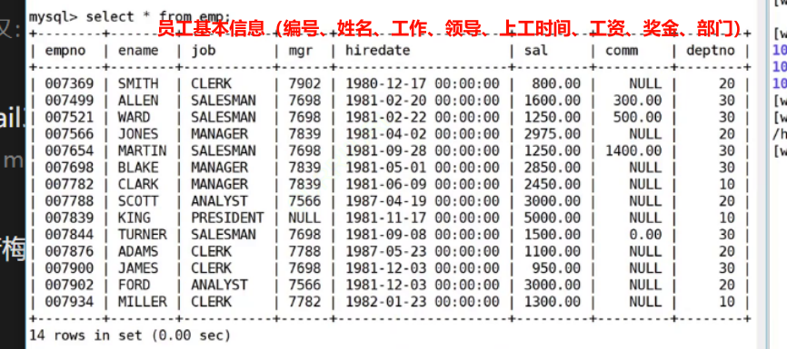
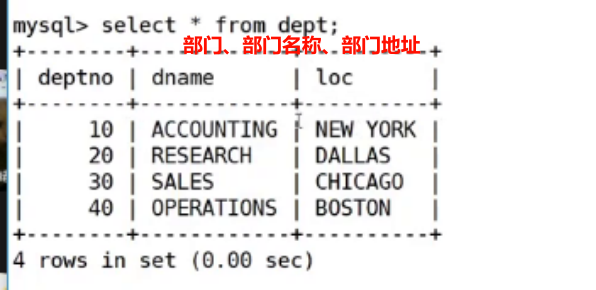
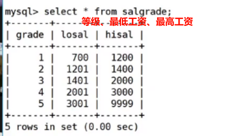

# 1.聚合函数

| 函数                 | 说明                                                      |
| -------------------- | --------------------------------------------------------- |
| COUNT(DISTINCT expr) | 返回查询到的数据的不同值的 **数量**                       |
| SUM(expr)            | 返回查询到的数据的 **总和**，如果数据不是数字则没有意义   |
| AVG(expr)            | 返回查询到的数据的 **平均值**，如果数据不是数字则没有意义 |
| MAX(expr)            | 返回查询到的数据的 **最大值**，如果数据不是数字则没有意义 |
| MIN(expr)            | 返回查询到的数据的 **最小值**，如果数据不是数字则没有意义 |

在 `SQL` 中，聚合函数（如 `MAX()`、`MIN()`、`AVG()`、`SUM()`）用于对一组数据进行计算，并返回单个值。聚合函数通常应用于整列数据，而不是单个行或单个数据项。聚合函数的条件通常是对多个数据行进行计算，然后生成一个汇总结果。

通常情况下，聚合函数的条件是：

1. **对多个数据行进行计算**：聚合函数应用于数据集中的多行，而不是单个行。例如，你可以计算一列的总和、平均值、最大值或最小值。

2. **返回单个值**：聚合函数计算结果是单个值，而不是每个行的值。例如，SUM 函数计算一列的总和，返回一个总和值。

3. **不包括 GROUP BY 子句中的列**：如果查询中包含 GROUP BY 子句，聚合函数将对分组后的数据进行计算。每个分组将产生一个结果行。在这种情况下，聚合函数的条件是应用于每个分组，并返回每个分组的汇总结果。

总的来说，聚合函数的条件是对多个数据行进行计算，生成单个值的结果，通常在 SELECT 语句的末尾或包含 GROUP BY 子句的查询中使用。

上述函数使用起来很简单，直接看下面例子即可：

```sql
# 使用各种聚合函数
mysql> select * from exam_result;
+----+-------+---------+------+---------+
| id | name  | chinese | math | english |
+----+-------+---------+------+---------+
|  1 | limou |     134 |  196 |     112 |
|  2 | swk   |     174 |  216 |     154 |
|  3 | zwn   |     176 |  256 |     180 |
|  4 | cmd   |     164 |  228 |     134 |
|  5 | lxd   |     110 |  170 |      90 |
|  6 | sq    |     140 |  146 |     156 |
|  7 | sgm   |     150 |  130 |      60 |
|  8 | dimou |    NULL |  196 |     116 |
+----+-------+---------+------+---------+
7 rows in set (0.00 sec)

mysql> select count(*) from exam_result; # 统计所有行数，不受 null 影响
+----------+
| count(*) |
+----------+
|        8 |
+----------+
1 row in set (0.01 sec)

mysql> select count(chinese) from exam_result; # 统计 chinese 字段的行数（出去 null）
+----------------+
| count(chinese) |
+----------------+
|              7 |
+----------------+
1 row in set (0.00 sec)

mysql> select count(distinct math) from exam_result; # 统计出不重复的数学成绩
+----------------------+
| count(distinct math) |
+----------------------+
|                    7 |
+----------------------+
1 row in set (0.00 sec)

mysql> select sum(math) from exam_result; # 统计数学成绩总分
+-----------+
| sum(math) |
+-----------+
|      1538 |
+-----------+
1 row in set (0.00 sec)

mysql> select sum(math)/count(*) from exam_result; # 计算数学成绩平均分
+--------------------+
| sum(math)/count(*) |
+--------------------+
|             192.25 |
+--------------------+
1 row in set (0.00 sec)

mysql> select count(*) from exam_result where english<100; # 筛选出英语成绩低于 100 的总人数
+----------+
| count(*) |
+----------+
|        2 |
+----------+
1 row in set (0.00 sec)

mysql> select avg(chinese+english+math) as '平均分' from exam_result where # 求班级的总成绩平均分
english<100;
+-----------+
| 平均分    |
+-----------+
|       355 |
+-----------+
1 row in set (0.00 sec)

mysql> select max(chinese+english+math) as ' 高分 ' from exam_result; # 得到总分最高分
+-----------+
| 最高分    |
+-----------+
|       612 |
+-----------+
1 row in set (0.00 sec)

mysql> select max(math) as '最高分' from exam_result; # 得到数学最高分
+-----------+
| 最高分    |
+-----------+
|       256 |
+-----------+
1 row in set (0.00 sec)
```

# 3.聚合函数分组聚合

聚合函数可以结合分组子句来使用，首先需要明白，分组的目的是为了方便进行聚合统计。

而另外一种角度来理解分组聚合统计就是“分表”，把一张表按照条件，在逻辑上拆分成多个子表，然后分别进行聚合统计，这种理解方法可以和之前针对单表的聚合统计衔接起来。







```sql
# 尝试使用分组查询
mysql> select max(sal) 最高工资, avg(sal) 平均工资 from emp; # 显示员工中的最高工资和平均工资

mysql> select deptno, max(sal) 最高工资, avg(sal) 平均工资 from emp group by deptno; # 按 group by 后的列（也就是部门）来分组显示员工中的最高工资和平均工资

mysql> select deptno, job, min(sal) 最低工资, avg(sal) 平均工资 from emp group by deptno, job;  # 显示每个部分的的每种岗位的平均工资和最低工资

mysql> select ename, deptno, job, min(sal) 最低工资, avg(sal) 平均工资 from emp group by deptno, job;  # 报错，ename 不能以压缩聚合（重复的列数据进行压缩）方式出现
# 一般只有聚合函数和分组子句出现的列依据可以出现在 select 后面，其他的均会报错
```

另外补充一个和 `WHERE` 类似的语法 `HAVING`，该语法可以筛选聚合结果，经常和聚合语法搭配使用。

```sql
# 尝试使用 having 来筛选聚合结果
mysql> select deptno, avg(sal) 'deptavg' from emp group by deptno haning deptavg<2000; # 显示出平均工资低于 2000 的部门和它的平均工资
```

但是为什么不使用 `WHERE` 而使用 `HAVING` 呢，或者说，两者的区别是什么？

两者都可以进行筛选，但是完全不同：`WHERE` 子句在数据分组之前对记录进行过滤，而 `HAVING` 子句在数据分组之后对分组或聚合结果进行过滤。前者处理一个基本表，后者处理分组后的多个子表。因此，无论是处理对象还是处理顺序都是不一样的。

>   补充：`MySQL` 的表不一定是物理真实存在表，也可以是逻辑上（中间筛选出来的表、最终结果得到的表）的表（`MySQL` 一切皆表？某些角度上真的可以这么理解，这意味着只要处理好单表的 `CURD(增删查改)` ，就可以统一处理其他的场景）。

# 2.日期函数

| 函数                                    | 说明                                                         |
| --------------------------------------- | ------------------------------------------------------------ |
| `current_date()`                        | 返回当前日期                                                 |
| `current_time()`                        | 返回当前时间                                                 |
| `now()`                                 | 返回当前的日期和时间                                         |
| `current_timestamp()`                   | 返回当前时间戳                                               |
| `date(datetime)`                        | 返回 `datetime(格式为 yyyy-mm-dd t:m:s)` 参数中的日期部分    |
| `date_add(date, interval d_value_type)` | 向日期中添加指定的时间间隔。间隔单位可以是年、天、分钟、秒（`year`、`minute`、`second`、`day`） |
| `date_sub(date, interval d_value_type)` | 从日期中减去指定的时间间隔。间隔单位可以是年、天、分钟、秒（`year`、`minute`、`second`、`day`） |
| `datediff(date1, date2)`                | 返回两个日期之间的差异，单位是天                             |

接下来我们来简单使用一下这些函数。

```sql
# 尝试使用日期函数(1)
# (1)查看时间
mysql> select current_date();
+----------------+
| current_date() |
+----------------+
| 2024-02-25     |
+----------------+
1 row in set (0.00 sec)

mysql> select current_time();
+----------------+
| current_time() |
+----------------+
| 18:30:50       |
+----------------+
1 row in set (0.00 sec)

mysql> select current_timestamp();
+---------------------+
| current_timestamp() |
+---------------------+
| 2024-02-25 18:31:17 |
+---------------------+
1 row in set (0.00 sec)

mysql> select current_date();
+----------------+
mysql> select date('1949-10-01 00:00:00');
+-----------------------------+
| date('1949-10-01 00:00:00') |
+-----------------------------+
| 1949-10-01                  |
+-----------------------------+
1 row in set (0.00 sec)

# (2)加减时间
mysql> select date_add('1949-10-01 00:00:00', interval 10 day);
 
+--------------------------------------------------+
| date_add('1949-10-01 00:00:00', interval 10 day) |
+--------------------------------------------------+
| 1949-10-11 00:00:00                              |
+--------------------------------------------------+
1 row in set (0.00 sec)

mysql> select date_add('1949-10-01 00:00:00', interval 10 secon
d);
+-----------------------------------------------------+
| date_add('1949-10-01 00:00:00', interval 10 second) |
+-----------------------------------------------------+
| 1949-10-01 00:00:10                                 |
+-----------------------------------------------------+
1 row in set (0.00 sec)

mysql> select date_sub('1949-10-01 00:00:00', interval 100 minute);
+------------------------------------------------------+
| date_sub('1949-10-01 00:00:00', interval 100 minute) |
+------------------------------------------------------+
| 1949-09-30 22:20:00                                  |
+------------------------------------------------------+
1 row in set (0.00 sec)

# (3)时间差值
mysql> select datediff(now(), '1949-10-01 00:00:00');
+----------------------------------------+
| datediff(now(), '1949-10-01 00:00:00') |
+----------------------------------------+
|                                  27175 |
+----------------------------------------+
1 row in set (0.00 sec)
```

```sql
# 尝试使用日期函数(2)
mysql> create table tmp(id int primary key auto_increment, birthday date);
Query OK, 0 rows affected (0.03 sec)

mysql> show create table tmp\G
*************************** 1. row ***************************
       Table: tmp
Create Table: CREATE TABLE `tmp` (
  `id` int(11) NOT NULL AUTO_INCREMENT,
  `birthday` date DEFAULT NULL,
  PRIMARY KEY (`id`)
) ENGINE=InnoDB DEFAULT CHARSET=latin1
1 row in set (0.00 sec)

mysql> insert into tmp (birthday) value ('2000-02-04');
Query OK, 1 row affected (0.00 sec)

mysql> insert into tmp (birthday) value ('2002-03-04');
Query OK, 1 row affected (0.00 sec)

mysql> insert into tmp (birthday) value ('1998-09-01');
Query OK, 1 row affected (0.00 sec)

mysql> insert into tmp (birthday) value (current_date());
Query OK, 1 row affected (0.00 sec)

mysql> select * from tmp;
+----+------------+
| id | birthday   |
+----+------------+
|  1 | 2000-02-04 |
|  2 | 2002-03-04 |
|  3 | 1998-09-01 |
|  4 | 2024-02-25 |
+----+------------+
4 rows in set (0.00 sec)

# 下面结果说明无论是时间、日期、时间戳，其背后都是同一个时间格式，只是返回的显示结果有所不同而已（类似隐式转化），当然，这种操作在当前版本是成立的
mysql> insert into tmp (birthday) value (current_time());
Query OK, 1 row affected, 1 warning (0.01 sec)

mysql> insert into tmp (birthday) value (current_timestamp());
Query OK, 1 row affected, 1 warning (0.01 sec)

mysql> select * from tmp;
+----+------------+
| id | birthday   |
+----+------------+
|  1 | 2000-02-04 |
|  2 | 2002-03-04 |
|  3 | 1998-09-01 |
|  4 | 2024-02-25 |
|  5 | 2024-02-25 |
|  6 | 2024-02-25 |
+----+------------+
6 rows in set (0.00 sec)
```

# 3.字符函数

| 函数                                    | 说明                                                         |
| --------------------------------------- | ------------------------------------------------------------ |
| `charset(str)`                          | 返回字符串 `str` 的字符集                                    |
| `concat(string1, string2, ...)`         | 连接两个或多个字符串                                         |
| `instr(string, substring)`              | 如果 `substring` 在 `string` 中存在，则返回其位置；如果不存在，返回 `0` |
| `ucase(string)`                         | 将字符串 `string`  转换成大写                                |
| `lcase(string)`                         | 将字符串 `string` 转换成小写                                 |
| `left(string, length)`                  | 从字符串 `string` 的左边开始，取 `length` 个字符             |
| `right(string, length)`                 | 从字符串 `string` 的右边开始，取 `length` 个字符             |
| `length(string)`                        | 返回字符串 `string` 的长度（长度的单位是字节而不是字符）     |
| `replace(str, search_str, replace_str)` | 在字符串 `str` 中，用 `replace_str` 替换所有的 `search_str`  |
| `strcmp(string1, string2)`              | 逐字符比较两个字符串 `string1` 和 `string2` 的大小           |
| `substring(str, position [, length])`   | 从字符串 `str` 的 `position` 位置开始，取 `length` 个字符    |
| `rtrim(string)`                         | 去除字符串 `string` 末尾的空格                               |
| `ltrim(string)`                         | 去除字符串 `string` 开头的空格                               |
| `trim(string)`                          | 去除字符串 `string` 开头和末尾的空格                         |

```sql
# 尝试使用字符函数
mysql> select chinese, math, english, chinese+math+english from
 exam_result;
+---------+------+---------+----------------------+
| chinese | math | english | chinese+math+english |
+---------+------+---------+----------------------+
|     134 |  196 |     112 |                  442 |
|     174 |  216 |     154 |                  544 |
|     176 |  256 |     180 |                  612 |
|     164 |  228 |     134 |                  526 |
|     110 |  170 |      90 |                  370 |
|     140 |  146 |     156 |                  442 |
|     150 |  130 |      60 |                  340 |
|    NULL |  196 |     116 |                 NULL |
+---------+------+---------+----------------------+
8 rows in set (0.00 sec)

mysql> select concat(chinese, math, english, chinese+math+engli
sh) from exam_result;
+------------------------------------------------------+
| concat(chinese, math, english, chinese+math+english) |
+------------------------------------------------------+
| 134196112442                                         |
| 174216154544                                         |
| 176256180612                                         |
| 164228134526                                         |
| 11017090370                                          |
| 140146156442                                         |
| 15013060340                                          |
| NULL                                                 |
+------------------------------------------------------+
8 rows in set (0.00 sec)

mysql> select concat('计算总分', chinese, '+', math, '+',english, '=', chinese+math+english) from exam_result\G
*************************** 1. row ***************************
concat('计算总分', chinese, '+', math, '+',english, '=', chinese+math+english): 计算总分134+196+112=442
*************************** 2. row ***************************
concat('计算总分', chinese, '+', math, '+',english, '=', chinese+math+english): 计算总分174+216+154=544
*************************** 3. row ***************************
concat('计算总分', chinese, '+', math, '+',english, '=', chinese+math+english): 计算总分176+256+180=612
*************************** 4. row ***************************
concat('计算总分', chinese, '+', math, '+',english, '=', chinese+math+english): 计算总分164+228+134=526
*************************** 5. row ***************************
concat('计算总分', chinese, '+', math, '+',english, '=', chinese+math+english): 计算总分110+170+90=370
*************************** 6. row ***************************
concat('计算总分', chinese, '+', math, '+',english, '=', chinese+math+english): 计算总分140+146+156=442
*************************** 7. row ***************************
concat('计算总分', chinese, '+', math, '+',english, '=', chinese+math+english): 计算总分150+130+60=340
*************************** 8. row ***************************
concat('计算总分', chinese, '+', math, '+',english, '=', chinese+math+english): NULL
8 rows in set (0.01 sec)

# 替换表中字符
mysql> select * from exam_result;
+----+-------+---------+------+---------+
| id | name  | chinese | math | english |
+----+-------+---------+------+---------+
|  1 | limou |     134 |  196 |     112 |
|  2 | swk   |     174 |  216 |     154 |
|  3 | zwn   |     176 |  256 |     180 |
|  4 | cmd   |     164 |  228 |     134 |
|  5 | lxd   |     110 |  170 |      90 |
|  6 | sq    |     140 |  146 |     156 |
|  7 | sgm   |     150 |  130 |      60 |
|  8 | dimou |    NULL |  196 |     116 |
+----+-------+---------+------+---------+
8 rows in set (0.00 sec)

mysql> select replace(name, 's', 'S') from exam_result;
+-------------------------+
| replace(name, 's', 'S') |
+-------------------------+
| limou                   |
| Swk                     |
| zwn                     |
| cmd                     |
| lxd                     |
| Sq                      |
| Sgm                     |
| dimou                   |
+-------------------------+
8 rows in set (0.00 sec)

mysql> select * from exam_result;
+----+-------+---------+------+---------+
| id | name  | chinese | math | english |
+----+-------+---------+------+---------+
|  1 | limou |     134 |  196 |     112 |
|  2 | swk   |     174 |  216 |     154 |
|  3 | zwn   |     176 |  256 |     180 |
|  4 | cmd   |     164 |  228 |     134 |
|  5 | lxd   |     110 |  170 |      90 |
|  6 | sq    |     140 |  146 |     156 |
|  7 | sgm   |     150 |  130 |      60 |
|  8 | dimou |    NULL |  196 |     116 |
+----+-------+---------+------+---------+
8 rows in set (0.00 sec)

mysql> select concat(ucase(substring(name, 1, 1)), substring(name, 2)) from exam_result;
+----------------------------------------------------------+
| concat(ucase(substring(name, 1, 1)), substring(name, 2)) |
+----------------------------------------------------------+
| Limou                                                    |
| Swk                                                      |
| Zwn                                                      |
| Cmd                                                      |
| Lxd                                                      |
| Sq                                                       |
| Sgm                                                      |
| Dimou                                                    |
+----------------------------------------------------------+
8 rows in set (0.00 sec)
```

# 4.数学函数

| 函数                               | 说明                                                       |
| ---------------------------------- | ---------------------------------------------------------- |
| `abs(number)`                      | 返回 `number` 的绝对值                                     |
| `bin(decimal_number)`              | 将十进制数 `decimal_number` 转换为二进制。                 |
| `hex(decimalNumber)`               | 将十进制数 `decimal_number` 转换成十六进制                 |
| `conv(number, from_base, to_base)` | 将数字 `number` 从 `from_base` 进制转换到 `to_base` 进制。 |
| `ceiling(number)`                  | 将 `number` 向上取整到最近的整数                           |
| `floor(number)`                    | 将 `number` 向下取整到最近的整数                           |
| `format(number, decimal_places)`   | 格式化数字 `number`，保留 `decimal_places` 指定的小数位数  |
| `rand()`                           | 返回一个随机浮点数，范围是[0.0, 1.0)                       |
| `mod(number, denominator)`         | 返回 `number` 除以 `denominator` 的余数                    |


# 5.其他函数

