# 1.清理回收站

删除一些文件后，会被添加到会回收站，这是为了方便用户找回一些误删除的文件，而回收站默认占用 `C盘` 的空间，优先清理这里效果显著...

打开回收站后，点击 `[清空回收站]` 即可。

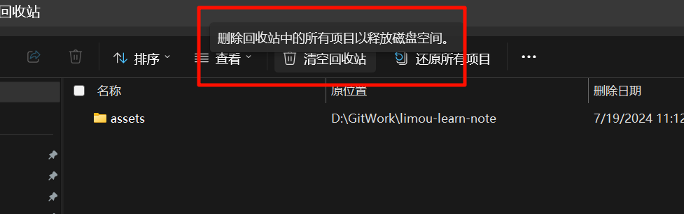

# 2.清理下载文件夹

打开文件资源管理器，或者使用快捷键 `[win+e]` 快速打开，点击下载文件夹，这里面存储的就是一些平时从浏览器、网盘等地方下载文件后存储到本地电脑的文件。

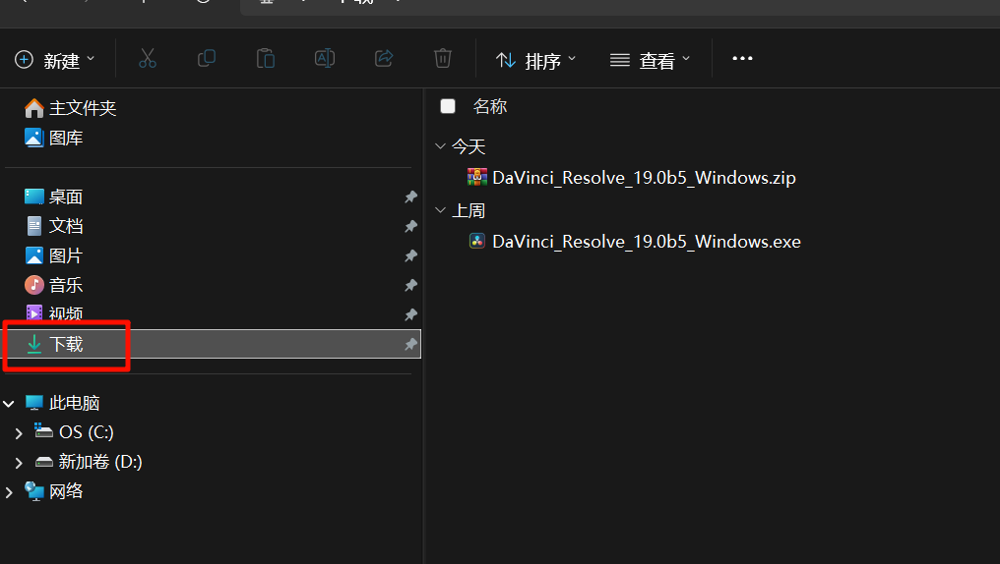

然后使用快捷键 `[ctrl+A]` 选中所有文件，然后使用快捷键 `[shift+delete]` 进行删除（当然全部删除了的话，就需要重新下载这些文件）。

# 3.清理临时文件夹

电脑会存储的一些临时文件，删除掉这些文件是不会影响使用的。使用快捷键 `[win + r]`，跳出下面窗口，输入指令 `%temp%`。

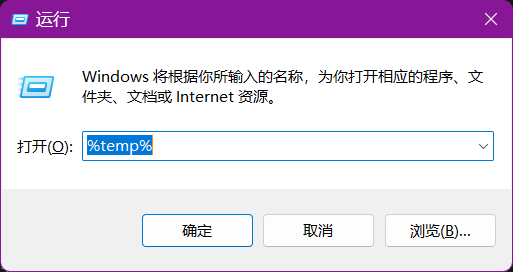

回车后，就会打开一个文件夹，里面存储的就是一些软件运行时的临时文件，直接全选该文件夹内的所有文件，使用快捷键 `[shift + delete]` 全部删除（或者右键删除）。

其中如果出现“文件正在使用”、“操作无法完成”等提示，直接勾选“为所有当前项目执行此操作”，然后选择“跳过”即可。

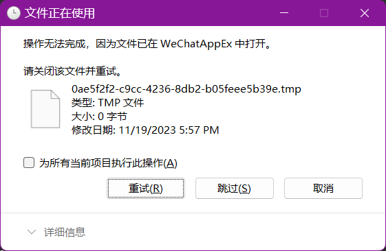

# 4.清理聊天软件

微信和 `QQ` 会自动存储聊天记录、表情包、图片、视频、`word` 等文件，并且通常默认存储在 `C` 盘的某个位置，我们可以找到这个位置删除掉内部的文件。

打开微信的设置。

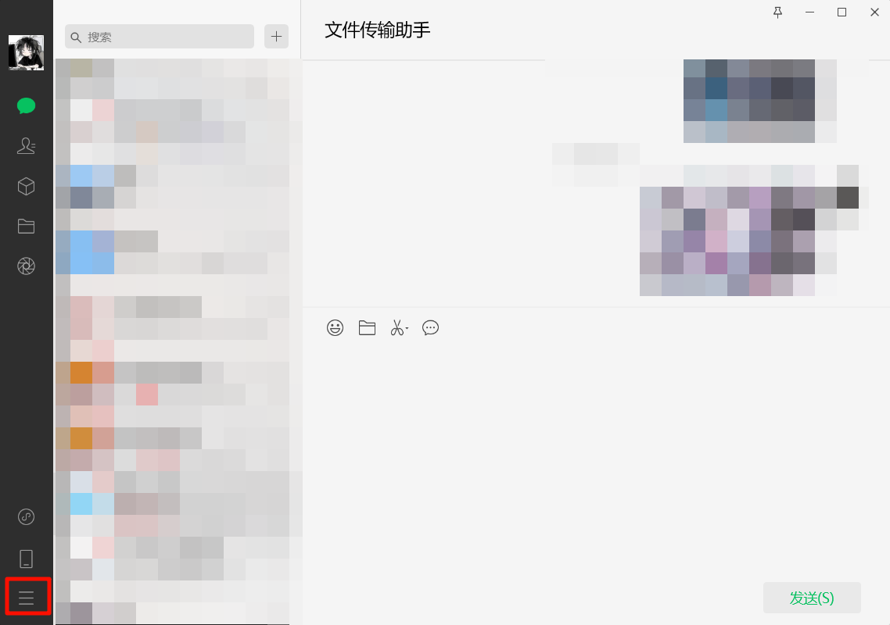

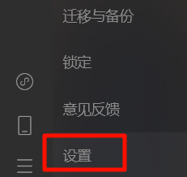

点击里面“通用设置”，点击“清空聊天记录”即可（当然请留意您的聊天记录是否重要，先做简单评估再做删除）。

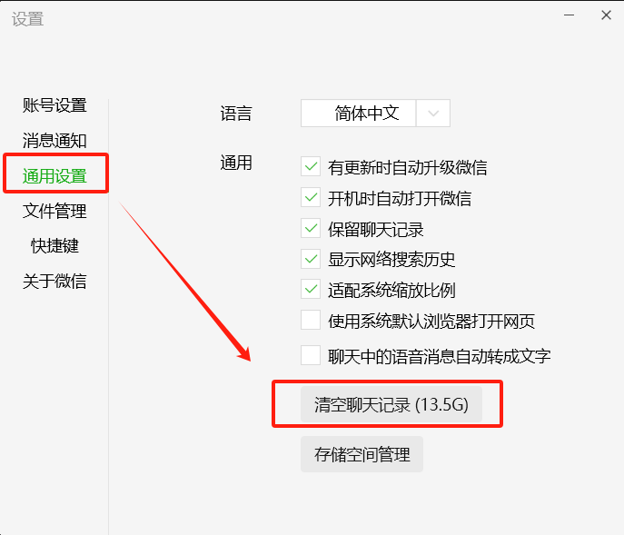

如果不希望删除上面的聊天记录，可以选择“文件管理”，选择更改，将微信文件的保存位置修改到别的盘符下即可（这样以后就是微信缓存文件变多了也用的是其他盘的空间，不会占用 `C` 盘空间）。

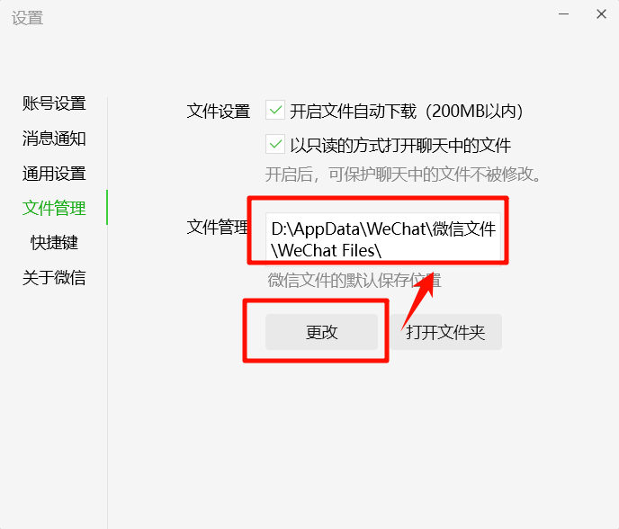

>   补充：同理如果您的电脑有 `QQ` 也是这么处理，请您自行查询对应的方法。

# 5.卸载不必要的软件

使用快捷键 `[win + i]` 打开设置，进入存储页面

然后点击安装的应用。

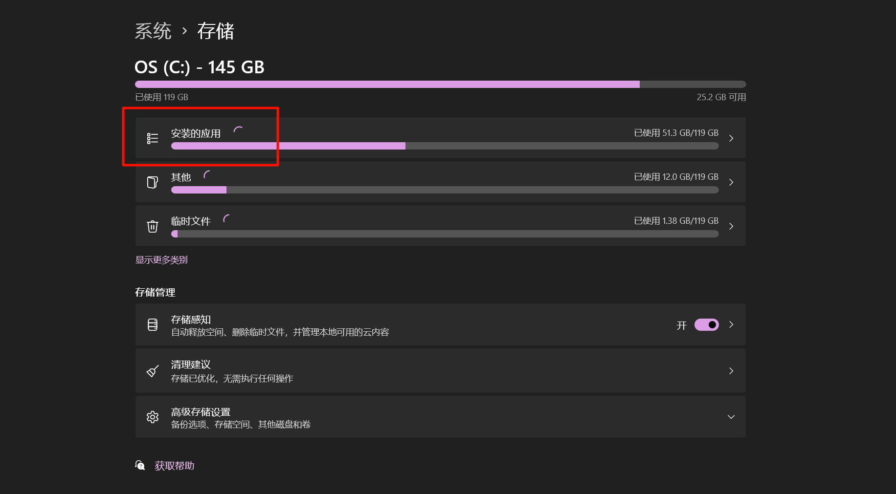

选择筛选条件为 `新加卷(D:)`，此时列出来的就是被安装到 `C盘` 中所能检测到的软件。

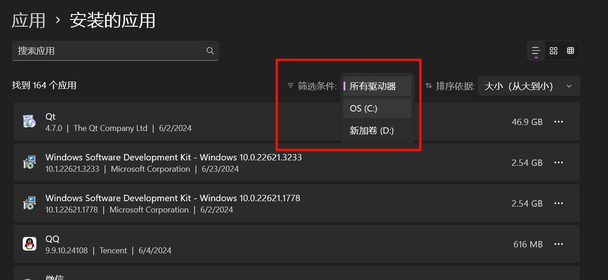

卸载的原则是：自己完全搞不懂作用的软件禁止卸载，搞得懂作用并且不是自己下载的软件慎重卸载，是自己下载的软件并且未来相当长一段时间不用的软件直接卸载。

而卸载的按钮就在这里。

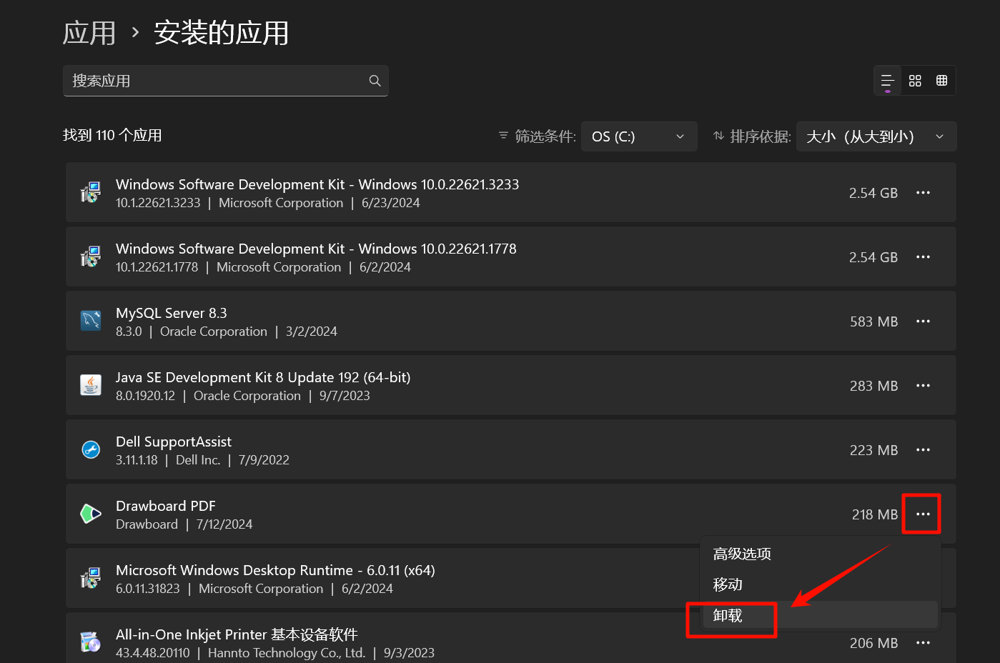

并且注意，微软商店里的软件尽量不要下载，因为默认软件安装是无法修改安装路径，并且直接安装在 `C` 盘的...

# 6.扩容 C 盘的空间

但是对新手操作难度偏大，我不推荐，只给您提供对应的思路，待补充...

# 7.电脑初始化

但是对新手操作难度偏大，我不推荐，只给您提供对应的思路，待补充...