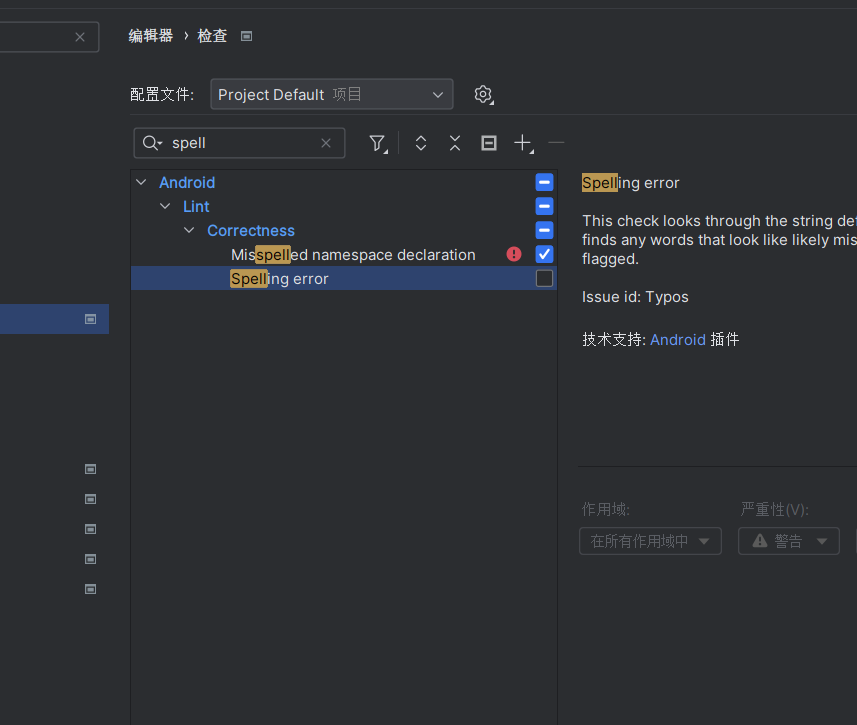
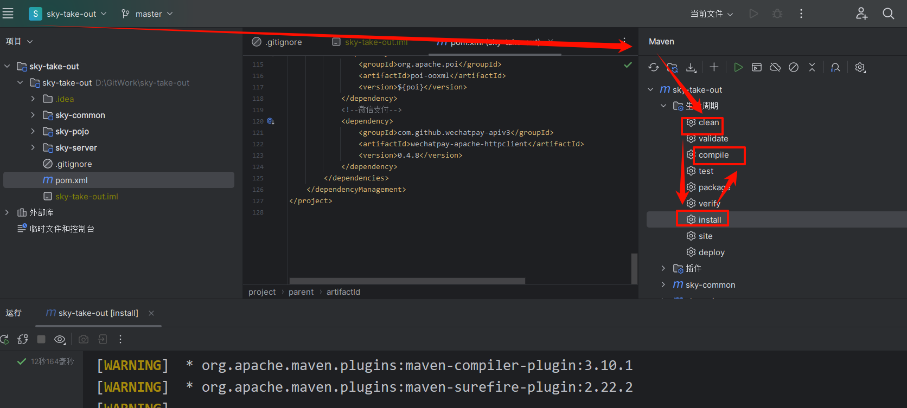
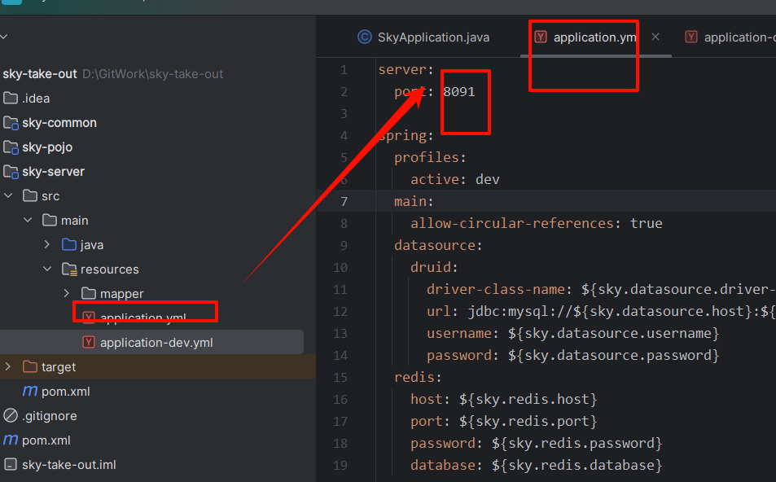
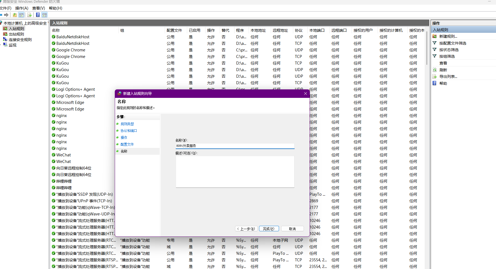
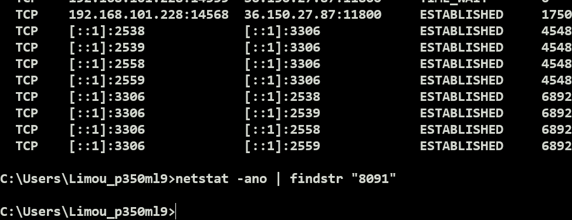

导入前后端基础文件后，使用 ctrl+enter 运行  mvn idea:module 生成 sky-take-out.iml 

停止检查拼写错误

View - Tool Windows - Maven，选中 maven 即可打开右侧的菜单，这个插件就相当于 Makefile 但是需要用到网络下载一些软件（有可能还需要使用 jdk11），找个时间学习一下...

更换端口和开启端口和检查端口

无占用...

