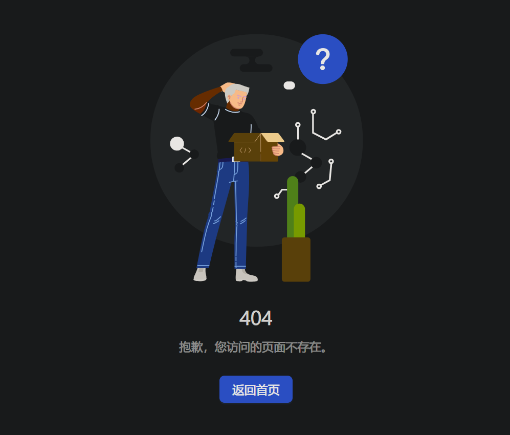
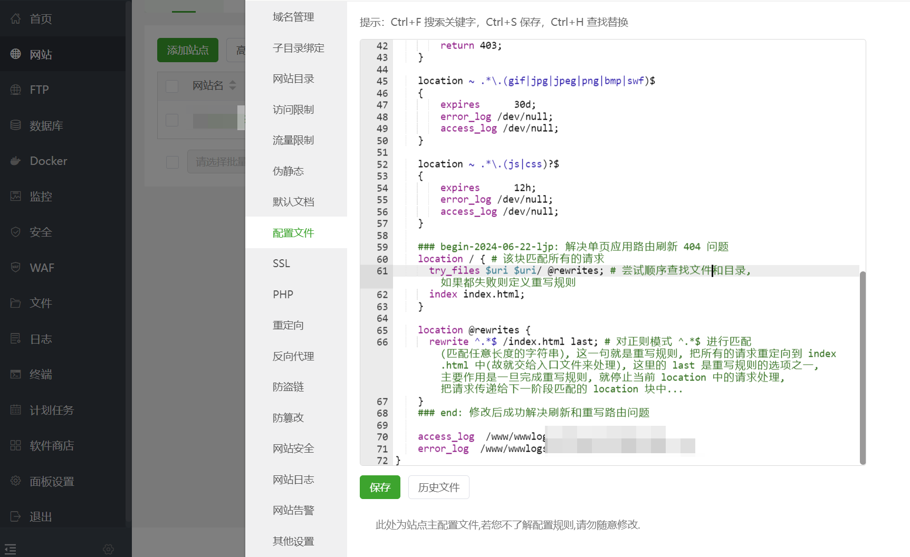

**叠甲：以下文章主要是依靠我的实际编码学习中总结出来的经验之谈，求逻辑自洽，不能百分百保证正确，有错误、未定义、不合适的内容请尽情指出！**

[TOC]

>   概要：...

>   资料：本文参考了 [这份博文您可前去一看](https://blog.csdn.net/Boale_H/article/details/130422276)。

---

# 1.源头

在帮朋友部署和测试项目的时候，遇到一个比较奇葩的问题，页面可以成功访问，但是刷新就返回 `404`。

# 2.排错

首先我是使用了 `fiddler Classic` 进行抓包，我很快发现了刷新前和刷新后的 `http` 请求是完全不一样的，这个时候我就察觉到：他们做的应该是一个前后端分离的项目，并且 `404` 错误返回是 `Nginx` 默认的返回页面，而不是他们项目中自己设计的 `404` 页面（如下是他们项目的 `404` 页面）。



此时我就有一个推测，这个很可能和他们的 `Nginx` 配置有关系...于是我打开了他们的 `Nginx` 配置（他们使用的是宝塔部署，不过您也可以直接查找 `Linux` 中的 `Nginx` 配置文件）。

```nginx
# 有问题的 Nginx 配置
server
{
    listen PORT; # 由于是朋友的项目还未公开就隐去了端口号, 统一使用 PORT 表示
    server_name IP; # 由于是朋友的项目还未公开就隐去了地址, 统一使用 IP 表示
    index index.php index.html index.htm default.php default.htm default.html;
    root /www/wwwroot/IP;
    # CERT-APPLY-CHECK--START
    # 用于 SSL 证书申请时的文件验证相关配置 -- 请勿删除
    include /www/server/panel/vhost/nginx/well-known/IP.conf;
    # CERT-APPLY-CHECK--END

    # SSL-START SSL相关配置，请勿删除或修改下一行带注释的404规则
    # error_page 404/404.html;
    # SSL-END

    # ERROR-PAGE-START  错误页配置，可以注释、删除或修改
    # error_page 404 /404.html;
    # error_page 502 /502.html;
    # ERROR-PAGE-END

    # PHP-INFO-START  PHP 引用配置，可以注释或修改
    include enable-php-00.conf;
    # PHP-INFO-END

    # REWRITE-START URL重写规则引用,修改后将导致面板设置的伪静态规则失效
    include /www/server/panel/vhost/rewrite/IP.conf;
    # REWRITE-END

    # 禁止访问的文件或目录
    location ~ ^/(\.user.ini|\.htaccess|\.git|\.env|\.svn|\.project|LICENSE|README.md)
    {
        return 404;
    }

    # 一键申请 SSL 证书验证目录相关设置
    location ~ \.well-known{
        allow all;
    }

    # 禁止在证书验证目录放入敏感文件
    if ( $uri ~ "^/\.well-known/.*\.(php|jsp|py|js|css|lua|ts|go|zip|tar\.gz|rar|7z|sql|bak)$" ) {
        return 403;
    }

    location ~ .*\.(gif|jpg|jpeg|png|bmp|swf)$
    {
        expires      30d;
        error_log /dev/null;
        access_log /dev/null;
    }

    location ~ .*\.(js|css)?$
    {
        expires      12h;
        error_log /dev/null;
        access_log /dev/null;
    }
       
    access_log  /www/wwwlogs/IP.log;
    error_log  /www/wwwlogs/IP.error.log;
}
```

嗯...果然只返回了 `index` 这个单体页面。

# 3.原因

在使用 `Nginx` 做反向代理服务器且部署了一些关于 `Vue、Reactor` 项目时，有时会遇到页面成功返回，但是在浏览器中刷新出现 `404` 的问题。我不是特别了解这些 `js` 库的使用，但是我曾经做过一些 `QML` 文件的路由跳转机制，这种跳转机制其实就是通过在一个 `.qml` 文件中进行路由配置来达到页面跳转的目的。

这在桌面客户端可能还没有什么问题，但是在 `Web` 应用中使用了 `Vue、Reactor` 时，由于前端开发者只开发了一个 `index`，然后通过路由跳转来得到前后端分离的效果，这其实就是一种 `单页应用(SPA)`。

因此如果用户在浏览器中请求网站时，其实就是浏览器包装 `url:port` 做 `http` 请求的时候。而由于前后端分离，后端代码只返回一个 `index`，而其他页面的跳转交给前端来实现，后端只需要专注于和前端约定好需要返回给页面什么样的数据即可。

但这样就会出现一个很尴尬的问题，如果用户在浏览器中跳转到了该网站中的其他页面（例如登录页面），刷新浏览器时，浏览器就会误认为用户请求的 `url:port/login` 在远端服务器中，就会重新对 `url` 进行包装，向远端服务器进行请求。

可这是单页应用，服务器上只有一个 `index`，因此必然是请求不到对应的资源，返回的自然就是 `404` 了。

# 4.解决

想要解决这个问题，只需要让 `Nginx` 在对找不到的路径上的资源时，把用户的请求重定向到 `index` 中即可，交给分离出来的前端代码进行处理就行了，修改 `Nginx` 配置文件内容如下...

>   补充：宝塔把这个配置文件配置到了 `/www/server/panel/vhost/nginx/IP.conf` 文件中了，这个 `IP` 是您部署的服务器 公网 `IP`，这里为了保护隐私我也隐去了...

```nginx
# 没问题的 Nginx 配置
server
{
    listen PORT; # 由于是朋友的项目还未公开就隐去了端口号, 统一使用 PORT 表示
    server_name IP; # 由于是朋友的项目还未公开就隐去了地址, 统一使用 IP 表示
    index index.php index.html index.htm default.php default.htm default.html;
    root /www/wwwroot/IP;
    # CERT-APPLY-CHECK--START
    # 用于SSL证书申请时的文件验证相关配置 -- 请勿删除
    include /www/server/panel/vhost/nginx/well-known/IP.conf;
    # CERT-APPLY-CHECK--END

    # SSL-START SSL相关配置，请勿删除或修改下一行带注释的404规则
    # error_page 404/404.html;
    # SSL-END

    # ERROR-PAGE-START  错误页配置，可以注释、删除或修改
    # error_page 404 /404.html;
    # error_page 502 /502.html;
    # ERROR-PAGE-END

    # PHP-INFO-START  PHP 引用配置，可以注释或修改
    include enable-php-00.conf;
    # PHP-INFO-END

    # REWRITE-START URL重写规则引用,修改后将导致面板设置的伪静态规则失效
    include /www/server/panel/vhost/rewrite/IP.conf;
    # REWRITE-END

    # 禁止访问的文件或目录
    location ~ ^/(\.user.ini|\.htaccess|\.git|\.env|\.svn|\.project|LICENSE|README.md)
    {
        return 404;
    }

    # 一键申请SSL证书验证目录相关设置
    location ~ \.well-known{
        allow all;
    }

    # 禁止在证书验证目录放入敏感文件
    if ( $uri ~ "^/\.well-known/.*\.(php|jsp|py|js|css|lua|ts|go|zip|tar\.gz|rar|7z|sql|bak)$" ) {
        return 403;
    }

    location ~ .*\.(gif|jpg|jpeg|png|bmp|swf)$
    {
        expires      30d;
        error_log /dev/null;
        access_log /dev/null;
    }

    location ~ .*\.(js|css)?$
    {
        expires      12h;
        error_log /dev/null;
        access_log /dev/null;
    }
    
    ### begin-2024-06-22-mod: 解决单页应用路由刷新 404 问题
    location / { # 该块匹配所有的请求
      try_files $uri $uri/ @rewrites; # 尝试顺序查找文件和目录, 如果都失败则定义重写规则
      index index.html;
    }
 
    location @rewrites {
      rewrite ^.*$ /index.html last; # 对正则模式 ^.*$ 进行匹配(匹配任意长度的字符串), 这一句就是重写规则, 把所有的请求重定向到 index.html 中(故就交给入口文件来处理), 这里的 last 是重写规则的选项之一, 主要作用是一旦完成重写规则, 就停止当前 location 中的请求处理, 把请求传递给下一阶段匹配的 location 块中...
    }
    ### end: 修改后成功解决刷新和重写路由问题
    
    access_log  /www/wwwlogs/IP.log;
    error_log  /www/wwwlogs/IP.error.log;
}
```



至此成功解决问题，刷新页面也不会返回 `Nginx` 的 `404` 错误，同时即便前端用户真的请求了错误的资源，也只会返回项目中定义的 `404` 页面。

---

>   结语：...
