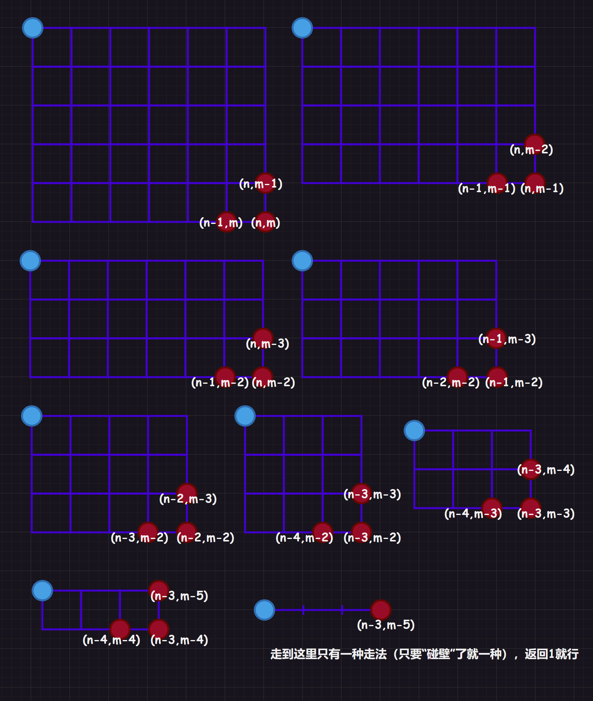

# 1.编程题

## 1.1.[另类加法](https://www.nowcoder.com/questionTerminal/e7e0d226f1e84ba7ab8b28efc6e1aebc)

```cpp
 class UnusualAdd
 {
 public:
    int addAB(int A, int B)
    {
        if(B == 0)//B为0说明不再产生进位了
        {
            return A;
        }
        int number1 = (A ^ B);//单纯求和，不考虑进位
        int number2 = (A & B) << 1;//考虑进位，并且进位只有在两个比特位为1的时候才会发生进位
        return addAB(number1, number2);
    }
 };
```

## 1.2.[HJ91 走方格的方案数](https://www.nowcoder.com/practice/e2a22f0305eb4f2f9846e7d644dba09b?tpId=37&tqId=21314&ru=/exam/oj)

### 1.2.1.解法一：分而治之

1.   从终点开始，走到终点$(n, m)$有两种走法，从$(n-1, m)$和从$(n, m - 1)$开始
2.   而$(n - 1, m)$又可以从$(n-2, m)$和从$(n-1, m-1)$开始
3.   而$(n, m - 1)$又可以从$(n - 1, m - 1)$和从$(n, m - 2)$开始...

一个格点都是另外两个格点走过来的，因此该格点的走法等于走到其他两格点走法之和，而只有越界才会只有一种走法，这很明显就是递归代码。



```cpp
#include <iostream>
using namespace std;

int pathnum(int n, int m)
{
	if (n == 0 || m == 0)
	{
		return 1;
	}
	return pathnum(n - 1, m) + pathnum(n, m - 1);
}
int main()
{
    int n = 0, m = 0;
    cin >> n >> m;
	cout << pathnum(n, m);
	return 0;
}
```

### 1.2.2.解法二：排列组合

这道题目对于学过排列组合的人来说绝对不陌生，只需要提前实现好阶乘的计算函数$f(x) = x!$，以及组合的计算函数$f(x) = C^{m}_{n} = \frac{n!}{m!(n - m)!}$即可。

然后分析题目，由于需要走$n + m$步，因此只需要选择$n$步走横线即可（剩下的步骤都是走竖线的）。而走横向，先走哪一条横线都没有影响（竖线也是），因此采用组合计算得$C^{n}_{n + m}$即可得出结果。

```cpp
#include <iostream>
 using std::cin;
 using std::cout;
 int f(int val)
 {
    if (val == 0 || val == 1)
    {
        return 1;
    }
    return val * f(val - 1);
 }
 int main()
 {
    int m, n;
    cin >> m >> n;
 
    cout << f(n + m) / (f(n) * f(m));
    return 0;
 }
```

# 2. 选择题

## 2.1.题目一：初始化静态成员变量的特殊情况

下面有关`C++`静态数据成员，说法正确的是哪一个？

1.   不能在类内初始化
2.   不能被类的对象调用
3.   不能受`private`修饰符的作用
4.   可以直接用类名调用

>   解释：静态成员变量一定要在类的外面进行初始化，不可以使用构造函数的初始化列表来初始化。但是有一种特殊情况是可以的，就是带`const`修饰的静态成员变量可以在类内拥有缺省值。

## 2.2.题目二：只能用new来创建对象，而不能直接创建对象

在`C++`中，为了让某个类只能通过`new`来创建（即如果直接创建对象，编译器将报错），应该怎么做呢？

1.   将构造函数设为私有
2.   将析构函数设为私有
3.   将构造函数和析构函数均设为私有
4.   没有办法能做到

>   解释：首先考虑将构造函数设为私有，但是这是行不通的，因为这会导致无论是直接创建，还是`new`创建都会失败。
>
>   那析构函数设为私有呢？这反而是可以的：
>
>   1.   直接创建的对象在代码结束后会自动调用析构函数，但是没有权限调用，因此无法直接创建，代码一定会报错。
>   2.   使用`new`创建对象的虽然也会在最后`delete`的时候自动调用析构，导致权限问题。但是我们可以在类内部提前写好关于`delete`的代码，将其设计为公开的接口，然后调用这个接口即可（而直接构造是没有办法做到这一点的）。
>
>   ```cpp
>   class Data
>   {
>   public:
>   	Data() {}
>   	void Delete()
>   	{
>   		delete this;
>   	}
>   private:
>   	~Data() {}
>   };
>   int main()
>   {
>   	Data* a = new Data;
>   	a->Delete();
>   	return 0;
>   }
>   ```