>   参考：【编译原理_中科大(华保健)】https://www.bilibili.com/video/BV16h411X7JY?p=56&vd_source=4772b64d7a3cb1873f14bc0153c4de68 这个教程很好...
>
>   参考：【【编译原理】期末必考，正规式-NFA-DFA-最小DFA，编译原理期末救急】https://www.bilibili.com/video/BV16r4y1g7pq?vd_source=4772b64d7a3cb1873f14bc0153c4de68
>
>   参考：【编译原理正规表达式转NFA到DFA再化简】https://www.bilibili.com/video/BV1mh41187fN?vd_source=4772b64d7a3cb1873f14bc0153c4de68
>
>   参考：【编译原理消除左递归和回溯0基础详解】https://www.bilibili.com/video/BV1xP4y1F7gn?vd_source=4772b64d7a3cb1873f14bc0153c4de68
>
>   参考：【9编译原理构造LR(1)分析表（带向前搜索符的项目集规范族）】https://www.bilibili.com/video/BV1Vm4y1Q7XB?vd_source=4772b64d7a3cb1873f14bc0153c4de68
>
>   参考：【编译原理如何区别LR(0),SLR(1),LR(1),LALR(1)文法】 https://www.bilibili.com/video/BV1xr4y1m7Kg/?share_source=copy_web&vd_source=4772b64d7a3cb1873f14bc0153c4de68

# 1.文法

## 1.1.文法概念

任何构成程序的字符串都可以看作是基于字符集上的一个字符串。一个字符串由一些 $x$ 字符构成，字符串长度为 $|str|$，判断一个字符串 $str$ 是否基于一个字符集 $\Sigma={\{x\}}$ 的依据就是 **文法**。也就是描述单词符号的构成规则，一般包含 (1)词法规则 (2)语法规则。

-   一个语言的单词符号通常包含 `标识符、常数、运算符...`（对应的词法规则描述工具，例如“正则表达式语法”）
-   一个语言的语法单位通常包含 `表达式、语句、函数、过程...`（对应的语法规则描述工具，例如“上下文无关语法”）

>   补充：我们特别规定 $\epsilon$ 表示一个不含任何字符的空字符串。

>   补充：一些关于字符串和集合的运算。
>
>   -   **字符串的长度**：所构成的字符的个数 $|str|$
>
>   -   **字符串的连接**：符号串 $x$ 和 $y$ 的连接形成新字符串 $xy$
>
>   -   **字符串幂运算**：$x^{0} = \epsilon, x^{1} = x, x^{2} = xx, x^{3} = xxx...$
>
>   -   **串集合间乘积**：若 $A、B$ 均为字符串集合，则 $AB = \{xy|x\in A, y\in B\}$
>
>   -   **串集合幂运算**：若 $A、B$ 均为字符串集合，则 $A^{0} = \{\epsilon\}, A^{1} = A, A^{2} = AA, A^{3} = AAA...$
>
>   -   **串集合的闭包**：闭包分为正则闭包和闭包，闭包本质就是利用串集合衍生更多的
>
>       (1)正则闭包，$A^{+} = A^{1} \cup A^{2} \cup A^{3}...$
>
>       (2)闭包，$A^{*} = A^{0} \cup A^{+}$，也有 $A^{+} = AA^{*}$

>   补充：文法是描述语言的形式规则，而 `乔姆斯基` 将文法分为四种类型：`0型、1型、2型、3型`，这四种文法的差别在于对四元组的限制不同。
>
>   -   **0 型文法-无限制文法**，暂时没有广泛的应用，本系列不提及，待补充...
>   -   **1 型文法-上下文相关文法**，暂时没有广泛的应用，本系列不提及，待补充...
>   -   **2 型文法-上下文无关文法**，我们的重点之一...
>   -   **3 型文法-正规则文法**，我们的重点之一...
>
>   型号越小的文法，表达能力越强，限制越小。

## 1.2.词法分析

代码文本的本质是非常长的字符串整体，想要对代码进行解释就必须先识别出代码中正确书写的、允许存在的一个个词语，因此就需要把字符经过词法分析程序。

### 1.2.1.手工词法分析的实现

读取程序字符串的同时，可以读取得多个 `token`，也就是 `<记号, 属性>`。一次或多次扫描，就可以得到对应的 `token` 流。而 `token` 解析过程中，可能会涉及到转移图的绘制。


```cpp
// 转移图
function NextToken() {
    c = getChar();
    switch (c) {
        case 'a', ..., 'z', 'A', ..., 'Z', '_', ...:
            c = getChar();
            while (c == 'a' || c == 'b' || ... || c == '_') {
                c = getChar();
            }
            // 故意不使用 break 就是为了可以在出错的时候可以给出回应
        case 'error':
            // ErrorFunc()...
            break;
            // case ...:
    }
}
```

上图从 `0` 状态开始解析得到 `[a-zA-Z]` 字符后，就会到达 `1` 状态，继续读取如果还是字符 `[a-zA-Z]` 后，依旧会到达 `1` 状态，否则属于其他情况（例如空格），到达 `2` 状态，最终返回一个关键字 `token<ID, ...>`...具体实现我给了部分的伪代码。

上述的分析仅仅可以识别出程序中所有的标识符，却无法识别出关键字，我们当然可以在转换图的情况 `0` 中加入其他分支情况，但是这么做就有可能需要多次重入状态图，效率极低，并且转移图也将逐渐变得特别复杂。

如果直接在标识符的识别关键字。而由于关键字实际上是标识符的一部分，因此可以先让程序走一遍转移图，先抽取出所有的标识符保存起来。接着定义一个包含语言所有关键字的哈希表（其他表其实也可以，但是哈希会比较快），再让标识符去识别是否为哈希表中的一部分，是则标识符是关键字，否则标识符是用户自定义的。

因此手动编码的形式本质是一一读取字符后，对标识符进行关键字映射，这种方案是主流的方案，好把控也易编写。

### 1.2.2.自动词法分析的实现

如果程序员只需要使用一些声明式的规范，告知语言的特征就可以得到自动分析得到 `token` 流的生成器，这种方式就是自动编码。虽然代码量变少了，但是本身细节难以把控，自动机较难实现。而实现自动机，往往需要提到正则表达式的相关知识，我们先来具备两份基础：(1)RE (2)FA。

#### 1.2.2.1.正则表达式 RE

正则表达式 `RE` 又被称为 **正规表达式**，对给定的字符集 $\Sigma = {c1, c2, c3, ...}$ 中做下面约定：

1.   空串 $\epsilon$ 本身就是正则表达式

2.   对于任意的 $c_n \in \Sigma$，$c_n$ 也是正则表达式

3.   如果 $M$ 和 $N$ 是正则表达式，则以下也是表达式

     (1)选择 $M|N = \{M \cup N\}$ 本身也是一条正则表达式

     (2)连接 $MN = \{mn | m \in M, n \in N\}$ 本身也是一条正则表达式

     (3)闭包 $M^* = \{\epsilon, M, MM, MMM, ...\}$ 本身也是一条正则表达式

而一些教材中常见定义的正规表达式，也就是：形如 $A \to a, A \to aB$ 或 $A \to a, A \to Ba$ 两种情况中的其中一种情况（其中大写字母是非终结符，小写字母是终结符，`B` 可以为 `A`），前一种被称为 **右线性文法**，后一种被称为 **左线性文法**，其实也是这种规则的演化。

>   补充：如果您学习了下面的上下文无关文法，就会发现这正则表达式在第二种形式中，实际上就是加了限制的上下文无关文法。

为什么需要提到正则表达式呢？我们其实可以联想到算术表达式，我们仅知道数字和 `+-*/` 就可以替换和复合出复杂的算术表达式。而正则表达式也是类似诞生的...

如果给定字符集 $\Sigma = \{a, b\}$，我们来尝试写出正则表达式，例如 $\epsilon、a、b、\epsilon | \epsilon、\epsilon | a...、\epsilon a、\epsilon b、ab、\epsilon \epsilon...、\epsilon^*、(a(\epsilon | a))^*$，可以看出正则表达式有很多，可以从前到后一步步进行推导...

那 `C语言` 中的 `if/while` 等关键字怎么使用正则表达式来表示呢？`if` 只需要 $i \in \Sigma, f \in \Sigma$ 就可以使得 $if$ 本身就是一个正则表达式。同理，`while` 也是类似的。

进一步，在 `C语言` 中的 `标识符` 是以字母或下划线开头，后面跟上零或多个字符、数字、下划线构成的字符串，这种复杂的规则怎么用正则表达式表示呢？

首先构造一个正则表达式 $M = \{a|b|c...z|A|B|C...|Z|_\}$ 作为第一部分，再构造一个正则表达式 $N = \{a|b|c...z|A|B|C...Z|\_|1|2|3...|9\} $ 作为第二部分，然后再把两个正则表达式连接起来，形成闭包，因此最终结果为 $\{(MN)^*\}$。

完美把 `C` 的标识符解析全部表示出来了，这种正则表达式就可以为语言的声明提供依据。因此正则表达式不像手工编码实现的转移图，当前只具有声明一个语言规则的功能。

#### 1.2.2.2.有限状态自动机 FA

那么声明的工具我们有了，还需要怎么继续实现自动机呢？这就要提到有限状态自动机（`FA`）了，`FA` 的工作流程如下。

```mermaid
graph LR
str["输入字符串"] --> FA["有限状态自动机\nM = {Σ, S, q0, F, δ}"] --> YN{Yes/No}
正则表达式 -.->|"转化为"| FA
```

其中 $\Sigma, S, q_0, F, \delta$ 分别代表 **字符集(保存自动机途径的所有字符)、状态集(保存自动机中包括终态的所有状态)、初始状态(自动机运行时初始状态)、终结状态集(保存自动机所有终结状态)、转移函数(描述自动机在给定串的驱动下是如何进行工作的)**，经过这个流程回答 `Yes/No`，也就是回答该字符串是否符合提前规定好的文法。

其中如果自动机 `FA` 在转移状态的过程中是确定的就叫 `DFA`，不确定就叫 `NFA`。对于第二种情况的 `FA`，则只要有可能走到最终状态，那这个字符串一定是可以接受的，不过这也代表 `NFA` 的扫描过程不是简单的一次即可，有可能需要多次（或者通过某些方式把 `DFA` 转化为 `NFA`）。

后面我们会使用某些算法，把正则表达式转化为 `FA`，然后使用这个建议的 `FA` 来判断一个单词是否为语言中符合规定的标识符，也就达到了词法分析的目的。

#### 1.2.2.3.整合使用 RE 和 FA

您先概览一下自动词法分析的流程。

```mermaid
graph LR
RE -->|"Thompson算法"| NFA -->|"子集构造算法"| DFA -->|"Hopcroft最小化算法"| 词法分析器代码
```

然后我假设给您一个正则表达式 $a(b | c)$，这个正则表达式描述了一种语言的特征，请您根据下述步骤尝试做一名“人肉机器”，构造出一份自动机代码...

##### 1.2.2.3.1.Thompson 算法(RE 转化 NFA)

我们来看具体的过程，首先我们已知道正则表达式的生成规则（包括另外一种常见的形式）。而自动机实际上是判断一个字符或字符串是否为设计者想要的字符串的一种程序，这种程序可以用状态图进行简单描述，因此下面状态图中，字符只要能走到接收状态 `1`，就代表该字符对于该自动机合法。

`Thompson` 算法就是对正则表达式本身的规则进行 `NFA` 自动机描述，其产生的自动机状态转化很可能是多选择的。但是我们先不考虑其他，我们先把正则表达式的每一个规则实现为 `NFA`。

>   警告：下述转换图中，`c` 代表字符，`e` 代表字符或正则表达式，`ε` 代表空串或空字符。

```mermaid
graph LR
0_1((0)) -->|ε| 1_1((("1")));
0_2((0)) -->|c| 1_2((("1")));

0_3((0)) -->|e1| 1_3(("...")) -->|ε| 1_4(("...")) -->|e2| 1_5(((1)));

0_4((0)) -->|ε| 1_6(("...")) -->|e1| 1_7(("...")) -->|ε| 1_8(((1)));
0_4((0)) -->|ε| 1_9(("...")) -->|e2| 1_10(("...")) -->|ε| 1_8(((1)));

0_5((0)) -->|ε| 1_11(("...")) 
1_12(("...")) -->|ε| 1_13(((1)));
1_12 -->|ε| 1_11
0_5 -->|ε| 1_13
1_11 --->|e1| 1_12
```

>   补充：每经过一条边，就会消耗一个字母或字符串，但如果遇到 $\epsilon$ 无需任何消耗就可以走到下一个状态。

有了上述对正则表达式的每一条规则的 `NFA` 化，那一条任意的正则表达式都是由规则构成的，其对应的状态图自然也是可以由规则对应的转换图来构成，因此就可以拼凑出一个全新的 `NFA`。

如果我们直接给出一个正则表达式 $a(b | c)^*$，绘制其对应的 `Thompson` 算法，就是利用上面的五基本组件从左到右从内到外构造复杂的自动机。我们先从外到内分析一下：

1.   $a(b | c)^*$ 这个正则表达式由 $a$ 和 $(b|c)^*$ 的连接构成，因此需要一个表示连接的状态图
2.   $(b|c)^*$ 这个正则表达式由 $(b|c)$ 的闭包构成，因此需要一个表示闭包的状态图
3.   $b|c$ 这个正则表达式本身就需要一个表示连接的状态图
4.   因此总结绘图如下


但是有些时候，您遇到的正则表达式可能是第二种形式的，因此这里也举个例子，假设有以下正则表达式。
$$
G[Z]: Z \to Za | Aa | Bb\\
A \to Ba | a\\
B \to Ab | b
$$
<span style="text-emphasis:filled red;">这里的原理我也有点不太清楚，待补充...</span>先记录一下吧...下面括号代表一个圆圈...

-   把左线型正规文法中，表达式 $A \to a$ 理解为 $(S) \stackrel{a}\to (A)$；表达式 $A \to Ba$ 理解为 $(B) \stackrel{a}\to (A)$
-   把右线性正规文法中，表达式 $A \to a$ 理解为 $(A) \stackrel{a}\to ((Q))$；表达式 $A \to aB$ 理解为 $(A) \stackrel{a}\to (B)$

那么把上述正规表达式的产生式每一条都进行拆分，然后变成以下状态转化图。

```mermaid
graph TD
Z1((Z)) -->|a| Z1((Z));
A1((A)) -->|a| Z2((Z));
B1((B)) -->|b| Z3((Z));

B2((B)) -->|a| A2((A));
S1((S)) -->|a| A3((A));

A4((A)) -->|b| B3((B));
S2((S)) -->|b| B4((B));
```

因此把每个式子的转化图整合起来就是下图 `NFA`。

```mermaid
graph LR
start -.-> S
Z((Z)) -->|a| Z(((Z)));
A((A)) -->|a| Z(((Z)));
B((B)) -->|b| Z(((Z)));

B((B)) -->|a| A((A));
S((S)) -->|a| A((A));

A((A)) -->|b| B((B));
S((S)) -->|b| B((B));
```


>   补充：值得注意的是左线性文法的第一个推导式不是起始反而结束，<span style="text-emphasis:filled red;">待补充...</span>

有些时候还有可能给出几个和推导无关的冗余产生式，例如下面的正规文法中最后的两个产生式就是冗余的，这在绘图的时候可以被发现：因为一个状态图只有一个起初状态，其他状态必须由该状态退出。
$$
G[Z]: S \to aA | bQ\\
A \to aA | bB | b\\
B \to bD | aQ\\
Q \to aQ | bD | b\\
D \to bB | aA\\
E \to aB | bF\\
F \to bD | aE | b\\
$$
这是一个右线性正规文法，我们依葫芦画瓢画出状态转化图。

```mermaid
graph TD
S1((S)) -->|a| A1((A));
S2((S)) -->|b| Q1((Q));

A1((A)) -->|a| A1((A));
A2((A)) -->|b| B1((A))

B2((B)) -->|b| D1((D));
B3((B)) -->|a| Q2((Q));

Q1((Q)) -->|a| Q1((Q));
Q2((Q)) -->|b| D2((D));
Q3((Q)) -->|b| ...1(((?)));

D3((D)) -->|b| B4((B));
D4((D)) -->|a| A3((A));

E1((E)) -->|a| B5((B));
E2((E)) -->|b| F1((F));

F1((F)) -->|b| D5((D));
F2((F)) -->|a| E3((E));
F3((F)) -->|b| ...2(((?)));
```

因此同样可以得出对于的 `NFA` 如下。

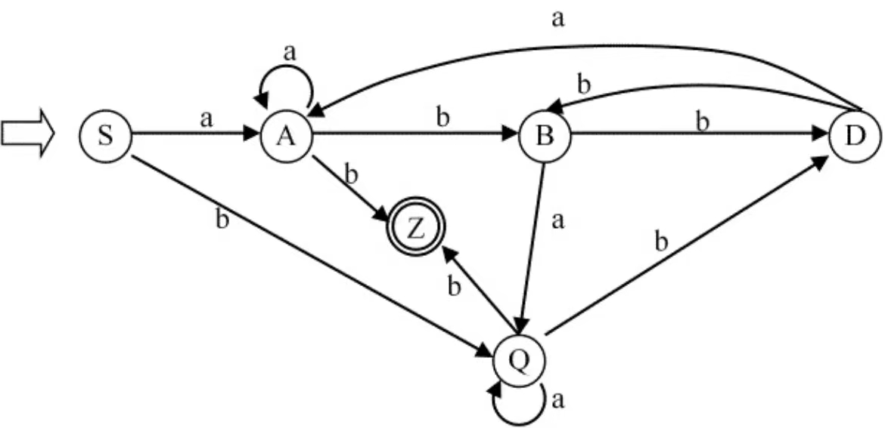

>   补充：有时候还会绘制一个状态表，一般使用右线性来表示最终对应的状态图，并且有可能利用状态图逆向推导出产生式（一定不要忘记把终结状态的正则表达式写出来...）。或者直接给出五元组的定义，但其实这两种情况已经隐含一张状态图了，比从正则表达式从头推起要来得简单。
>
>   **从方向表推导出状态图**
>
>   | S\C  | a    | b    |
>   | ---- | ---- | ---- |
>   | S    | A    | S    |
>   | A    | A    | B    |
>   | B    | B    | B    |
>
>   对于上图表示的对应状态图如下。
>
>   ```mermaid
>   graph LR
>   S((S)) -->|a| A((A)) -->|b| B(((B)));
>   S -->|b| S;
>   A -->|a| A
>   B -->|a,b| B
>   ```
>
>   **从五元组推导出状态图**
>   $$
>   NFA = (\{0, 1\}, \{x, y, z\}, x,\{z\}, M)\\
>   M(x, 0) = {z}\\
>   M(y, 0) = {x, y}\\
>   M(z, 0) = {x, z}\\
>   M(x, 1) = {x}\\
>   M(y, 1) = {\varnothing}
>   M(z, 1) = {y}
>   $$
>   对于上式表示的对应状态图如下。
>
>   ```mermaid
>   graph LR
>   x((x)) -->|0| z(((z)))
>   x -->|1| x
>   y((y)) -->|0| x
>   y -->|1| k((∅))
>   z -->|1| y
>   z -->|0| z
>   z -->|0| x
>   ```
>
>   

##### 1.2.2.3.2.子集构造确定化算法(NFA 转化 DFA)

而之所以需要子集构造法，就是希望将上述结果中不确定的 `NFA` 转化为确定的 `DFA`（最重要的原因就在于 `NFA` 需要在代码中做到回溯故较难实现，效率也比较低下），一旦转化为 `DFA`，简单点就可以使用 `if` 等控制语句直接实现，复杂点就可以使用 `图` 来进行实现。

这个算法的思路就是：<span style="text-emphasis:filled red;">这里要提到第一种定义对应的算法，待补充...</span>

如果使用第二种定义产生的 `NFA`，也有对应的方法。

1.   先把正则表达式转化为转换图，然后收集状态表弧上的所有字符 $a, b, ...$
2.   绘制子集表，表头由 $I, I_a, I_b..., I_i$ 构成，其中 $I$ 的第一项情况集合中一定包含处置状态，剩下的都是无需消耗任何字符就可以到达的状态
3.   从 $I$ 的第一项集合内的所有状态出发，填写 $I_a, I_b..., I_i$ 的第一项，每一项中的集合代表从集合 $I$ 出发消耗字符 $i$ 时到达的所有状态集合
4.   而 $I$ 的第二项集合从 $I_a, I_b, ...$ 的集合中先从左到右再从上到下的方式取得，并且保证 $I$ 上的每一项集合是不重复的
5.   ...
6.   直到无法给出 $I$ 为止，然后进行按照从上到下的方式对 $I$ 的每一项集合进行编号，根据编号重写状态图
7.   于是就得到了确定的 `DFA`...

例如对于以下 `NFA` 有以下的转化过程。


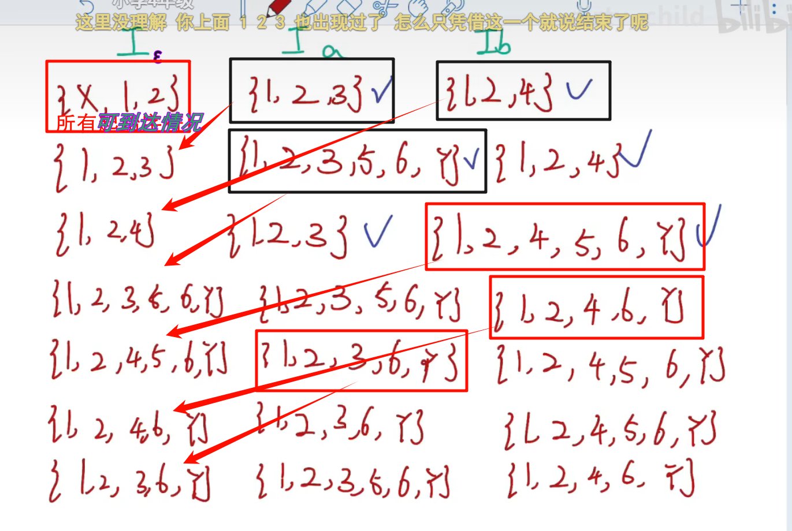

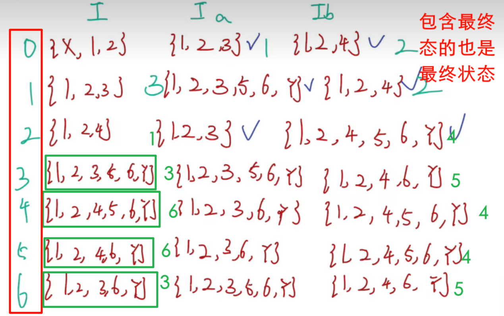

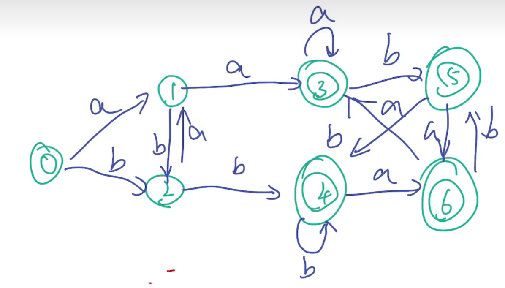

>   补充：因此为什么叫子集构造法呢？就是因为这个算法在不断构造出很多的集合作为一个状态。子集算法还有一些其他的讨论问题，为什么是一个不动点算法（算法为什么可以进行终止）？还有相关的时间复杂度？相关的知识和代码实现以后再来，<span style="text-emphasis:filled red;">待补充...</span>

##### 1.2.2.3.3.Hopcroft 最小化算法(DFA 转化 MIN_DFA)

为什么需要把 `DFA` 最小化呢？可以把 `DFA` 的状态减少，让代码更加简洁，算法实现时占用的资源也较小。而 `Hopcroft` 算法做的事情其实就是把状态进行合并，以减少状态和边的产生，先简单看一下大概了解一下...

1.   先把 `DFA` 中的非接受状态和接受状态划分为两个大集合，从非接受状态集合中不断切割出异类
2.   怎么评判异类？很简单，收集所有弧上的字符，然后让非接受状态集合出发，消耗这些字符。只要出现一个非接受状态消耗字符后得到的信状态不在非接受状态集合内，就代表这个非接受状态为异类
3.   把所有的异类从非接受状态中单独隔离出来一个新集合
4.   最后切分到无法切分为止，把同属一个集合的状态融合为一个状态

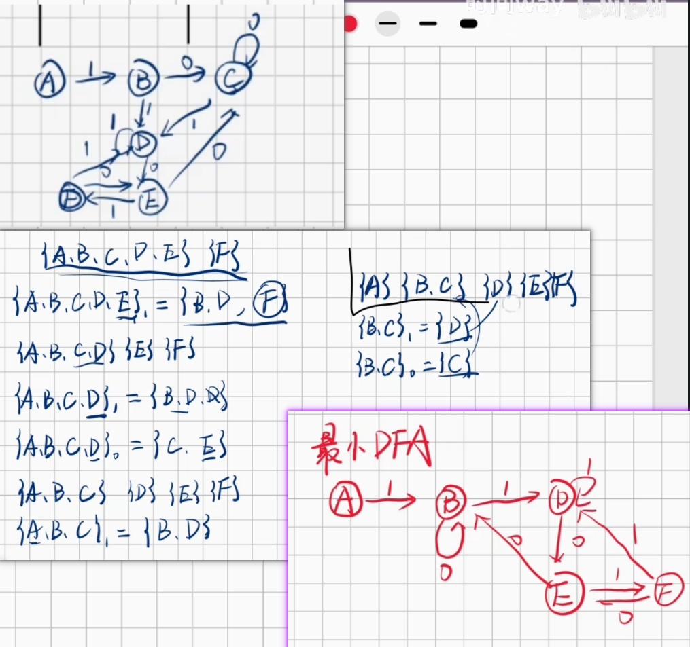

之前那道题的就是。

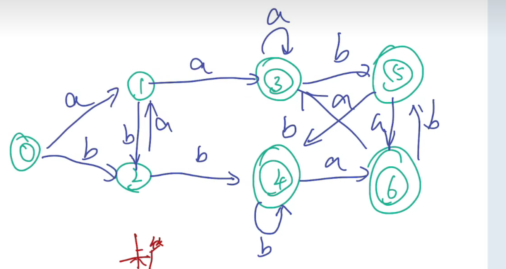

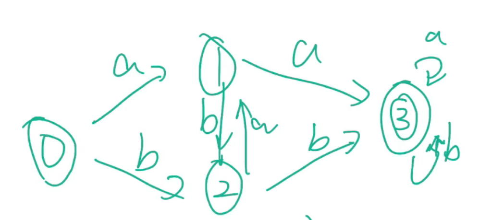

##### 1.2.2.3.4.转化为实际的代码(MIN_DFA 转化为 CODE)

除了使用单纯的分支代码，也就是把 `MIN_DFA` 看作流程图来处理，也可以直接把 `MIN_DFA` 看作有向图，就会有类似邻接矩阵的实现，这里无法过于细讲，因为需要考虑的部分有很多。

这里我们来举个例子。


| 状态 | a         | b         | c         |
| ---- | --------- | --------- | --------- |
| 0    | 1         | -1(ERROE) | -1(ERROE) |
| 1    | -1(ERROE) | 1         | 1         |

状态被打开就代表指向某一个状态。


还有跳转表的实现，这里待补充...

## 1.3.语法分析

语法分析器最主要的任务就是检测在代码文本经过词法分析程序后得到的最终 `token` 流的组合是否能通过语法分析程序，通过则符合语法，合法后就需要构建一颗语法树作为中间层交给更底层的编译器组件来进行进一步的处理。

因此我们也希望有一个类似 `RE` 的工具，可以用来声明语法，然后自动生成一个语法分析器。

### 1.3.1.上下文无关语法定义

上下文无关语法 `CFG` 是一种数学工具，我们主要依赖这以数学工具来定义一个语言的语法。通常由四元组 $G = (N,T,P,S)$ 组成：

*   $N$：非终结符集合，表示语法结构中的变量或符号
*   $T$：终结符集合，表示语法结构中的实际符号或词汇
*   $P$：生成规则集合，定义了如何用非终结符和终结符生成句子（又被称为产生式，通常写为 $A \to a 或 A ::= a, A \in N, a \in (N \cup T)^*$ 这种左部推导出右部的形式）
*   $S$：开始符号，指定了生成句子的起点

>   补充：另外，我们称呼 $V = N \cup T$ 为一个 **字汇表**。

>   举例：假设有如下规则
>
>   *   非终结符集合：$\{E, T, F\}$
>   *   终结符集合：$\{+, *, (, ), id\}$
>   *   规则集合如下：
>       1.  $E→E+T | T$
>       2.  $T→T∗F | F$
>       3.  $F→(E) | id$
>   *   开始符号：$E$
>
>   这样的规则可以推导出一个句子出来，则该句子符合该文法规则。

>   补充：如果产生式 $A \to a$ 在后续的推导中又重复出现了 $A$ 符号在右部中，则称为 **递归产生式**。若仅作了一次推导就得到带有 $A$ 的右部结果，就称这个产生式为 **直接递归产生式**。由于很多的语言都是无限集，就需要依靠递归使有限的语法推导出无限语言。

>   补充：有些教程会把生产式写为 `BNF` 的形式（您可以稍微查询一下这个形式），但是除了书写格式有些不一样没啥区别...

### 1.3.2.上下文无关语法的树

通过上下文无关语法的产生式得到句子的过程就是 **推导**，而上下文无关语法对应“实例”的图形化表示就是 **语法树/推导树**，可以直观看出语法的构成。

>   补充：“推导”这个词在不同条件下有不同的细分概念：
>
>   -   使用文法推导出最终句子的 $a_0$ 到 $a_n$ 中的每一个过程都被称为 **直接推导**，其逆向的过程就被称为 **直接归约**，符号分别记为 $a_{i} \Longrightarrow a_{i+1}$ 和 $a_{i+1} \underset{\Delta} \Longrightarrow a_{i}$。
>   -   而如果从 $a_0$ 经过一步步直接推导得到 $a_n$，则可以说 $a_n$ 是 $a_0$ 的 **多步推导**，符号记为 $a_0 \stackrel{+} \Longrightarrow a_n$。
>   -   而如果允许这个过程中出现 $a_0 == a_n$，则可以说 $a_n$ 是 $a_0$ 的 **广义推导**，符号记为 $a_0 \stackrel{*} \Longrightarrow a_n$。
>   -   如果对直接推导和直接规约加以限制，确保 $xAy \Longrightarrow xBy$ 中，如果 $y$ 为终结符号串或为空符号串，那这种推导就是 **规范推导(最右推导)**，其反动作就是 **规范规约(最左归约)**，规范推导记为 $xAy \underset{r} \Longrightarrow xBy$。而由规范推导得到的每一步式子也都被叫做 **规范句型**。
>
>   同时推导的步数就是推导长度。

>   补充：句型和句子的定义。
>
>   -   若 $S \stackrel{*} \Longrightarrow a, a \in V^{*}$，则称 $a$ 为文法 $G$ 的一个 **句型**（注意 $V = N \cup T$）
>   -   若 $S \stackrel{+} \Longrightarrow a, a \in T^{*}$，则称 $a$ 为文法 $G$ 的一个 **句子**
>
>   因此句子也是一种特殊的句型，句型中可以混杂入终结字符。

>   警告：在做上下文文法最左和最右推导时，一定要注意使用符号 $\Longrightarrow$ 来进行推导，而 $\to$ 只是定义，不要用来推导...

但是如果一个上下文无关语法存在两个完全不同的语法树，则此文法就是 **二义性文法**，这样的文法有很多，因为分析树的含义取决于后续遍历，也就是先从左到右访问树的子树，再访问树的根，而子树又按照这个规则进行访问，这样就会得到不同的含义，在代码中就会体现为求值顺序的不一致导致出现诧异的情况。

下面就是上下文无关文法 $E \to i | E + E | E * E | (E)$ 在推导 $i*i+i$ 时产生的两颗不同语法树。

```mermaid
graph TD
E1[E]
E2[E]
E3[E]
E4[E]
E5[E]
i1[i]
i2[i]
i3[i]
sub["*"]
add["+"]

E1 --> E2 & add & E3
E2 --> E4 & sub & E5
E4 --> i2
E5 --> i3
E3 --> i1
```

```mermaid
graph TD
E1[E]
E2[E]
E3[E]
E4[E]
E5[E]
i1[i]
i2[i]
i3[i]
sub["+"]
add["*"]

E1 --> E2 & add & E3
E3 --> E4 & sub & E5
E2 --> i2
E5 --> i3
E4 --> i1
```

另外注意，如果恰好有两种形式的语法推导出的语言 $L(G_1)$ 和 $L(G_2)$ 是相同的，则称两文法为 **等价语法**。

而如果同一个上下文无关语法可以推导出两颗或以上的语法树，就称该情况为 **文法二义性**，会影响到编译器的求值顺序。那么如何解决文法二义性的问题呢？可能需要进行文法重写，暂时不存在统一的算法，只能针对性解决...

语法树中还有几个比较常见的概念：

-   **短语**：把语法树每颗子树的所有叶子节点字符（不包含根节点）连接为一个字符串即可得到相对于该子树的短语
-   **直接短语**：而直接短语就是由一颗子树直接推导出的叶子节点（也就是只有单层分支的简单子树），推导过程中不包含非终结字符（也有人称直接短语为简单短语，不过我觉得前者更加易懂...）
-   **句柄**：而句柄就是最左直接短语，也就是语法树中最左边的哪一个直接短语

在实际书写中，一般不会把四元组直接书写出来，而是直接写出一系列的最终的产生式，并且约定第一个产生式的左部就是开始符号，大写字母表示非终结符，小写字母表示终结符。

>   举例：短语、直接短语、句柄的概念。如果直接使用语法树生成具体的句子会容易理解一些，对于以下语法树。
>
>   ```mermaid
>   graph TD
>   E1["E"] --> E2[E] & ADD1[+] & T1[T]
>   E2 --> E3[E] & ADD2[+] & T2[T]
>   T1 --> F[F] --> i[i]
>   E3 --> T
>   T2 --> T3[T] & SUB[*] & F2[F]
>   ```
>
>   -   短语：$T、T*F、i、T+T*F、T+T*F+i$
>   -   直接短语：$T、T*F、i$
>   -   句柄：$T$
>
>   文字描述可能有些抽象，可以看看 [这位温柔小姐姐关于短语、直接短语、句柄视频讲解](https://www.bilibili.com/video/BV1af4y1Z7ji?vd_source=4772b64d7a3cb1873f14bc0153c4de68)，虽然讲直接短语的时候出金句的样子很可爱...
>

### 1.3.3.使用工具来分析语法

因此判断一个句子是否符合一种语言的语法，只需要提前使用上下文无关语法定义一门语言的语法，然后使用最朴素的两种做法：

-   使用上下文无关语法进行枚举推导，只要能推导出这个句子，就可以证明这个符合语法
-   或从具体的句子逆向规约，只要规约得到了上下文无关语法中的产生式，同样可以证明符合语法

因此语法分析这里就分为了两种分析算法：

-   一是更加符合人类逻辑推断的 **自顶向下语法分析**，向下建立语法树
-   二是跟更加符合机器逻辑推断的 **自底向上语法分析**，向上建立语法树

而使用上下文无关语法的主要目的，就是为了让程序自动生成一个分析表，让语法分析器结合分析栈进行语法检查、语法分析。

#### 1.3.3.1.自顶向下分析

##### 1.3.3.1.1.朴素推导分析算法

这种做法符合人类逻辑，但是很难回答出是否“不符合语法”的答案。因此这种分析也被称为自顶向下分析，对应分析树从上到下的构造顺序，从起始符号出发一直推导...

如果一定要回答否的问题，就必须不断进行推导，然后不断进行回溯，从部分匹配直到全部匹配。

```cpp
// 朴素回溯分析算法
// 对于上下文无关语法
// S -> N1 V N2
// S -> s | t | g | w
// V -> e | d
// 判断 gdw 是否符合上述文法
// 初始的栈 stack 中只有起始符号一个元素
tokens['g', 'd', 'w'];
i = 0;
while (stack.isEmpty() == false) {
    if (stack.getTop() is T) { // 如果栈顶元素是终结符
    	if (t == tokens[i]) { // 如果符合匹配
            pop();
            i++;
        } else { // 如果不符合匹配
            stack.pop();
        }
    } else { // 如果栈顶元素是非终结符
        stack.pop(); // 退出栈顶元素
        stack.push(tRight); // 把非终结符的右部全部依次压入 stack 中
    }
}
```

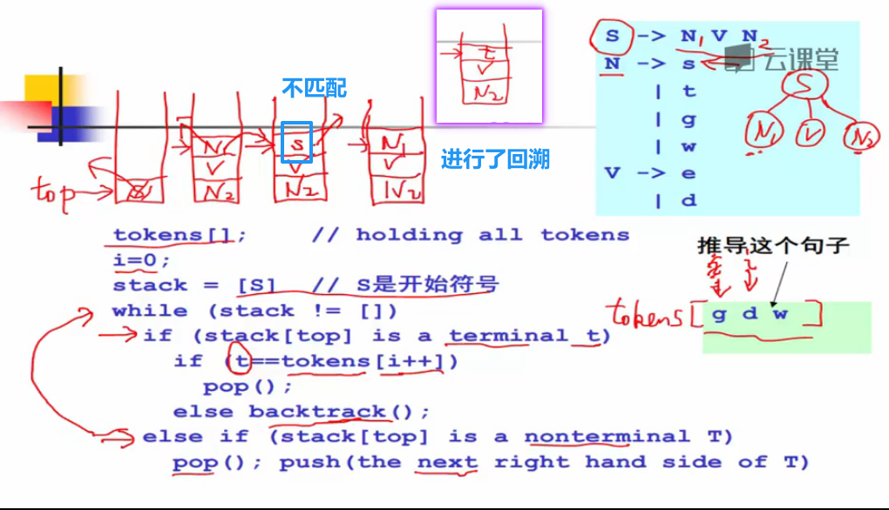

很容易看出来，这种算法是比较低效的，我们最好是设计出可以线性时间的算法，因此可以引出其他的算法。

##### 1.3.3.1.2.递归下降分析算法

用“前看符号”来尽可能避免回溯，在选择终结符号或非总结符号时，如果是终结符号就进行一个表达式匹配。

前看符号实际上就是在还没有确定终结符号时，指向字符串的字符。

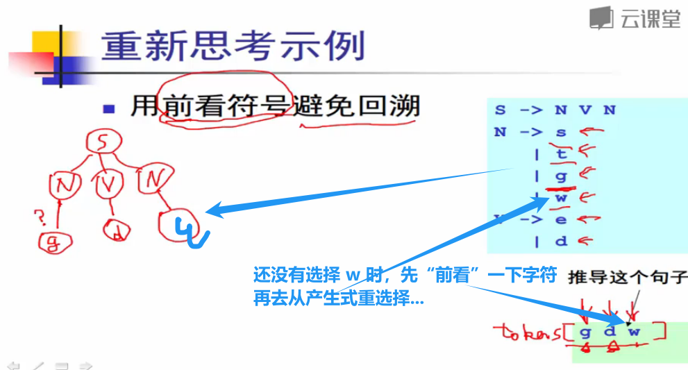

这样替换左部的时候就可以直接替换正确的字符，减少回溯的情况。


进一步，如果我们设计为分治算法，如下。

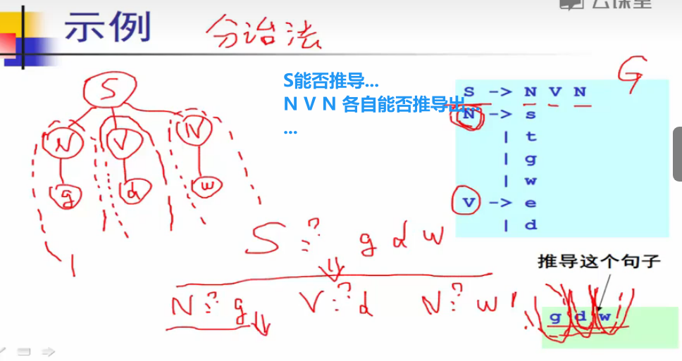

因此就需要给每个非终结符设计一个回调函数。

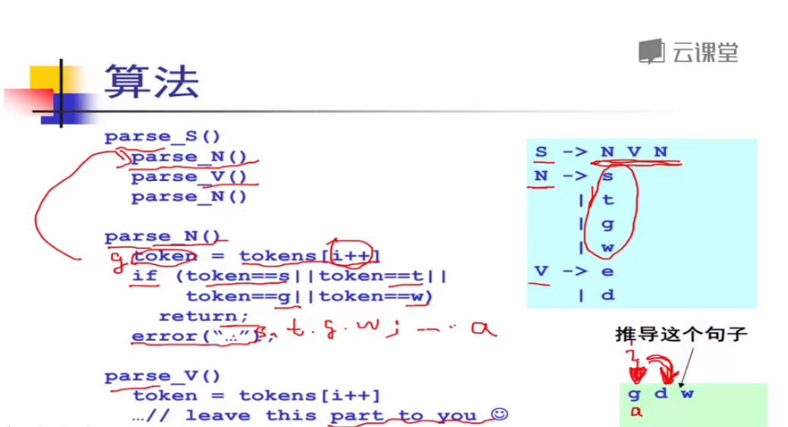

每个非终结符都有一个比较笼统的算法框架。


##### 1.3.3.1.3.LL(1) 分析算法

`LL(1)` 其实就是最左推导，这个名字的意思是，从左到右读取程序，从左到右推导式子，采用一个前看符号，直接看算法过程吧...
$$
G[S]: S \to MH | a\\
H \to LSo | \epsilon\\
K \to dML | \epsilon\\
L \to eHf\\
M \to K | bLM
$$

1.   **消除左递归**：也就是出现产生式为 $P \to Pa_1 | Pa_2 |...| b_1 | b_2 | ...$，就有可能出现类似 $P \to Pa...a$ 的左递归情况，因此我需要消除这一现象变为右递归，做法就是带入产生式 $P \to bP'$ 得到 $bP' \to bP'a|b$，然后提取公因子 $b$，最终得到 $P' \to P'a | \epsilon$，然后进行交换得到 $P' \to aP' | \epsilon$。**注意这里的 a 和 b 是字符串，可以看作一个整体即可，只要保证左部的第一个非终结符和右部非终结符一样就行...**

     由于上述的文法中不存在左递归情况，因此不需要进行消除左递归。消除左递归的主要目的，实际上是尝试把非 $LL(1)$ 转化为 $LL(1)$ 语法，把左递归变成右递归...

     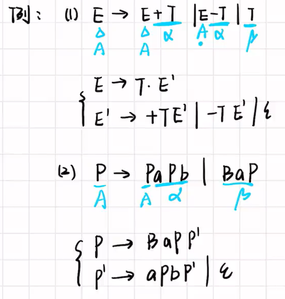

2.   **消除回溯**：当不是左递归时，右部中多个式子出现了相同的最左符号 $A \to Aa_1 | Aa_2 | Aa_3... | b_1 | b_2 | ...$，因此就可以把公共因子（可能是终结符也可能是非终结符）提取出来，类似左递归的做法，只不过不需要逆转，直接代入后提取就行。

     由于上述的文法中不存在回溯情况，因此不需要进行消除回溯...

     

3.   **求 First 集**：求解所有非终结符 $First$ 集，使用产生式逐步推导直到变成终结符号，每次推导都找出右式中最左边出现的终结符（包括空字符串），找不到就推导。

     因此对于上述题目求 $First$ 如下展示...
     $$
     First(S) \to M, a \to K, b, a \to d, \epsilon, b, a \to \{d, \epsilon, b, a\},\\但 M 可能推导为 \epsilon, 因此还需要考虑 H, First(S) \to H, a \to L, \epsilon, a \to \{e, \epsilon, a\}因此最终的\\ Frist(S) \to \{d, \epsilon, b, a, e\}\\
     
     First(H) \to L, \epsilon \to e, \epsilon \to \{e, \epsilon\}\\
     First(K) \to \{d, \epsilon\}\\
     First(L) \to \{e\}\\
     First(M) \to K, b \to d, \epsilon, b \to \{d, \epsilon, b\}\\
     ...\\
     First(MH) = ...
     $$
     但是需要注意一种特殊情况，如果右部非终结符最终可以推导出 $\epsilon$ 则需要继续推导下一个非终结符，上面第一个 $frist$ 就体现了这一情况。

4.   **求 Follow 集**：求解所有非终结符的 $Follow$ 集，其实就是找到该非终结符在右部式子中后面跟随的所有终结符，并且必须遵守几个规则：

     (1)$Follow$ 中绝对不存在 $\epsilon$

     (2)起始符号必有 $\# \in Follow(S)$

     (3)然后求解得过程中 **只看右部** 内容（绝对不要看左部！！！），针对我们要求 $follow$ 的字符 $W$，只查询有改字符的右部式子，然后顺序寻找有没有下述述式子求解 $follow$

     ​	a.若存在 $U \to xWy$（$x、y$ 均为广义字符串），则必有 $First(y) - \{\epsilon\} \in Follow\{W\}$，不过如果 $y$ 是终结符直接选择即可

     ​	b.若存在 $U \to xWy$, 且 $y \stackrel{*} \Longrightarrow \epsilon$（$x、y$ 均为广义字符串），则必有 $Follow(U) \in Follow(W)$，有时可能需要进行推导

     因此对于上述题目求 $follow$ 如下展示...
     $$
     Follow(S) \to \{\#, o\}\\
     Follow(H) \to \{f, \#, o\}\\
     Follow(K) \to \{e, \#, o\}\\
     Follow(L) \to \{e, \#, o, d, b, a\}\\
     Follow(M) \to \{e, \#, o\}\\
     $$

5.   **求 Select 集**：求解所有有两条及以上产生式的 $Select$ 集，对于产生式 $A \to a$ 中，有以下两种情况

     (1)$a \cancel{\stackrel{*}\Longrightarrow} \epsilon$ 则 $Select(A \to a) = First(a)$

     (2)$a \stackrel{*}\Longrightarrow \epsilon$ 则 $Select(A \to a) = Follow(A) \cup First(a) - \{\epsilon\}$

     因此对于上述题目求 $select$ 如下展示...
     $$
     \left\{
         \begin{array}{**lr**}  
             Select(S \to MH) = Follow(S) \cup First(MH) - \{\epsilon\} = \{d, b, e, \#, o\} & \\
             Select(S \to a) = First(a) = \{a\} & \\
         \end{array}
     \right.\\
     
     \left\{
         \begin{array}{**lr**}  
             Select(H \to LSo) = First(LSo) = \{e\} & \\
             Select(H \to \epsilon) = Follow(H) \cup First(\epsilon) - \{\epsilon\} = \{f, \#, 0\} & \\
         \end{array}
     \right.\\
     
     \left\{
         \begin{array}{**lr**}  
             Select(K \to dML) = First(dML) = \{d\} & \\
             Select(K \to \epsilon) = Follow(K) \cup First(\epsilon) - \{\epsilon\} = \{e, \#, o\} & \\
         \end{array}
     \right.\\
     
     \left\{
         \begin{array}{**lr**}  
             Select(M \to K) = First(K) = \{d\} & \\
             Select(M \to bLM) = First(bLM) = \{b\} & \\
         \end{array}
     \right.\\
     $$

6.   **判断是否为 LL(1) 文法**：每一组 $Select$ 组合的交集为 $\varnothing$ 就可以判断该文法为 $LL(1)$。

     因此对于上述题目判断是否为 $LL(1)$ 如下展示...
     $$
     \left\{
         \begin{array}{**lr**}  
             Select(S \to MH) = \{d, b, e, \#, o\} & \\
             Select(S \to a) = \{a\} & \\
             \to Select(S \to MH) \cap Select(S \to a) = \varnothing & \\
         \end{array}
     \right.\\
     
     \left\{
         \begin{array}{**lr**}  
             Select(H \to LSo) = First(LSo) = \{e\} & \\
             Select(H \to \epsilon) = Follow(H) \cup First(\epsilon) - \{\epsilon\} = \{f, \#, 0\} & \\
             \to Select(H \to LSo) \cap Select(H \to \epsilon) = \varnothing & \\
         \end{array}
     \right.\\
     
     \left\{
         \begin{array}{**lr**}  
             Select(K \to dML) = First(dML) = \{d\} & \\
             Select(K \to \epsilon) = Follow(K) \cup First(\epsilon) - \{\epsilon\} = \{e, \#, o\} & \\
             \to Select(K \to dML) \cap Select(K \to \epsilon) = \varnothing & \\
         \end{array}
     \right.\\
     
     \left\{
         \begin{array}{**lr**}  
             Select(M \to K) = First(K) = \{d\} & \\
             Select(M \to bLM) = First(bLM) = \{b\} & \\
             \to Select(M \to K) \cap Select(M \to bLM) = \varnothing & \\
         \end{array}
     \right.\\
     $$

>   补充：如果您愿意，也可以绘制出一个 $LL(1)$ 的方向表，和之前的类似...

>   特点：算法运行高效，有现成工具可用；但能分析的文法有限，可能超出能力，往往需要文法的改写。

##### 1.3.3.1.4.表驱动分析算法

由 `CFG` 最终得到一个表，结合表驱动算法后自动生成一个语法分析器，待补充...

#### 1.3.3.2.自底向上分析

##### 1.3.3.2.1.朴素规约分析算法

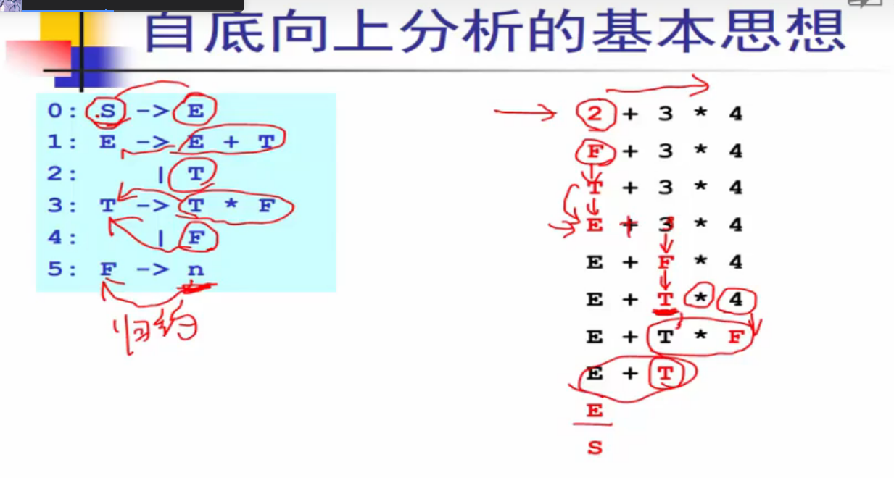

有时为了方便标识语法分析器已经读入了多少输入，会引入点记号来进行辅助。


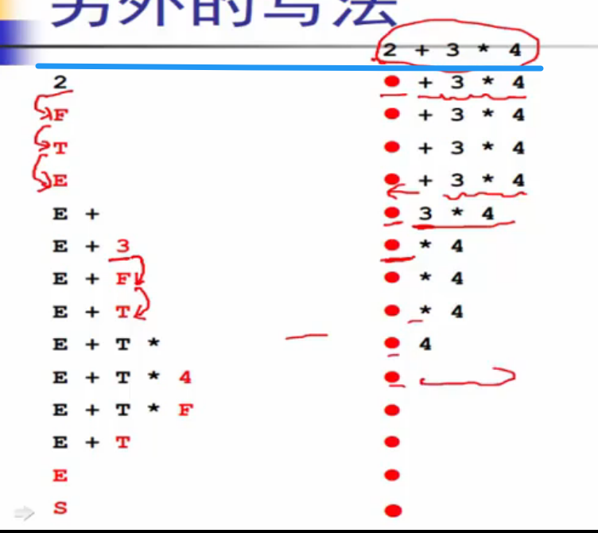

每个项目的含义和其圆点的相对位置有关。

-   **移进项目**：圆点后为终结符项目（$A \to ?.b$）
-   **待约项目**：圆点后为非终结符的项目（$A \to ?.B$）
-   **归约项目**：圆点在最右端的项目（$A \to ?.$）
-   **接受项目**：圆点在最右段的项目，但是左部是文法的开始符号（$S \to S.$）

>   补充：还有 **接受项、后继项、初始项** 的概念。

因此最为核心的问题就是，如何确定移进和归约的时机。

##### 1.3.3.2.2.LR(0) 分析

`LR(0)` 其实就是最右推导。
$$
G(E): E \to aA | bB \\
A \to cA | d \\
B \to cB | d
$$

1.   **拓广文法，先做初始项**：先不要贸然出发，把开始产生式 $G(S): S \to ...$ 做一个初始变化，$G'(S'): S' \to S$，这样会方便一些。
     $$
     G(E): E \to aA | bB \Longrightarrow G(S'): S' \to E
     $$

2.   **构造项目规范族**：把所有产生式拆开，每一条都从 $0$ 开始进行编号，然后进行拓广。
     $$
     G(S'): [r0]S' \to E \\
     [r1]E \to aA \\
     [r2]E \to bB \\
     [r3]A \to cA \\
     [r4]A \to d \\
     [r5]B \to cB \\
     [r6]B \to d
     $$
     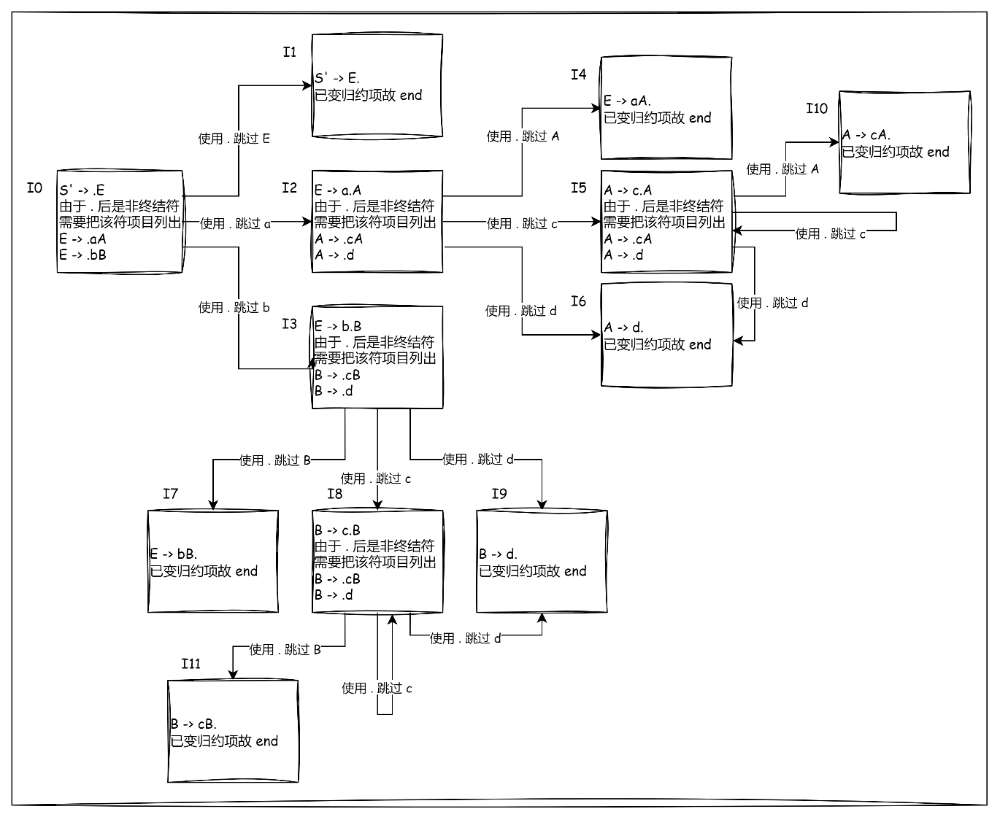

3.   **构造 action-goto 表**：根据生成的 `DFA`，绘制图表。

     | 状态 | Action | a    | b    | c    | d    | #             | Go   | E    | A    | B    |
     | ---- | ------ | ---- | ---- | ---- | ---- | ------------- | ---- | ---- | ---- | ---- |
     | I0   | \|     | I2   | I3   |      |      |               | \|   | I1   |      |      |
     | I1   | \|     |      |      |      |      | acc(代表接受) | \|   |      |      |      |
     | I2   | \|     |      |      | I5   | I6   |               | \|   |      | I4   |      |
     | I3   | \|     |      |      | I8   | I9   |               | \|   |      |      | I7   |
     | I4   | \|     | r1   | r1   | r1   | r1   | r1            | \|   |      |      |      |
     | I5   | \|     |      |      | I5   | I6   |               | \|   |      | I10  |      |
     | I6   | \|     | r4   | r4   | r4   | r4   | r4            | \|   |      |      |      |
     | I7   | \|     | r2   | r2   | r2   | r2   | r2            | \|   |      |      |      |
     | I8   | \|     |      |      | I8   | I9   |               | \|   |      |      | I10  |
     | I9   | \|     | r6   | r6   | r6   | r6   | r6            | \|   |      |      |      |
     | I10  | \|     | r3   | r3   | r3   | r3   | r3            | \|   |      |      |      |
     | I11  | \|     | r5   | r5   | r5   | r5   | r5            | \|   |      |      |      |
4.   判断是否存在 **移进-归约、归约-归约** 冲突，如果一个状态中存在这种情况，就不是一个 `LR(0)` 分析。否则，就是一个 `LR(0)` 分析。


##### 1.3.3.2.3.SLR(1) 分析

如果 `LR(0)` 比在求解过程中，出现了 `归约-归约` 和 `归约-移进` 问题，但是通过 `Follow` 集的步骤能够解决 `归约-移进` 冲突，则是 `SLR(1)` 分析。如果无法解决，就证明该文法不是 `LR(0)`。我们再来一道题目，熟悉一下 `LR(0)` 分析过程，并且指出 `SLR(1)` 的分析。
$$
G(E): E \to E + T | T \\
T \to T * F | F \\
F \to (E) | i
$$
直接写出图表来供您判断正误。

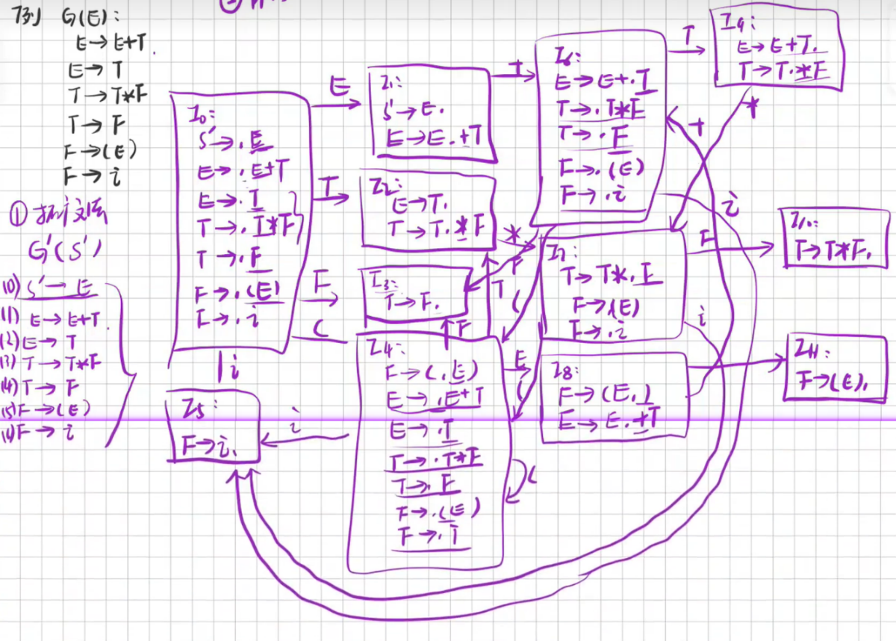

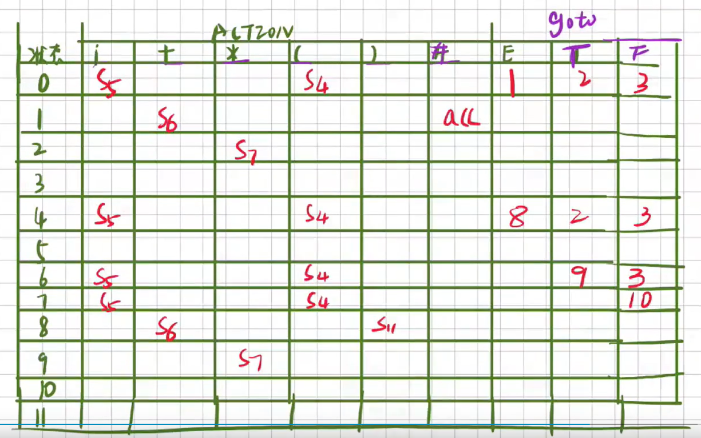

接受项 `acc` 无需理会，可以看到存在 `归约-移进` 冲突的有 `I2, I9`，故把 **移进项目中点号后面的终结符自己形成的一个集合** 和 **归约项目中左部 $Follow$ 形成的集合** 进行交集运算。此时如果发现结果为空集，则说明冲突是可以解决的。

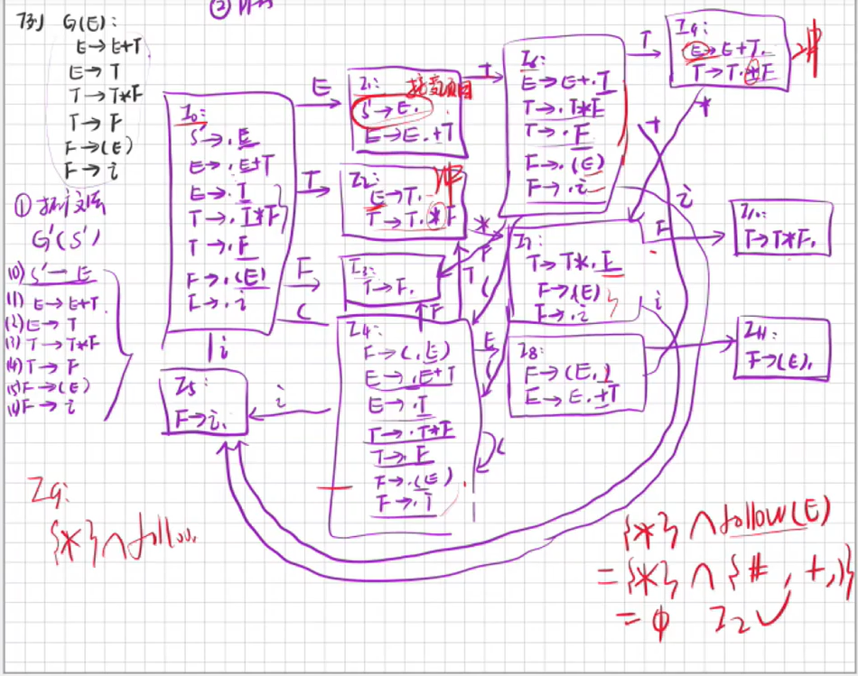

因此找出所有的带有归约项目的情况，则取其产生式的左部，获取对应的 `Follow` 集，然后根据这个集的字符在分析表中填入对应产生式编号（有空就填，无空不填）在，这和原来 `LR(0)` 中全部填写不太一样。

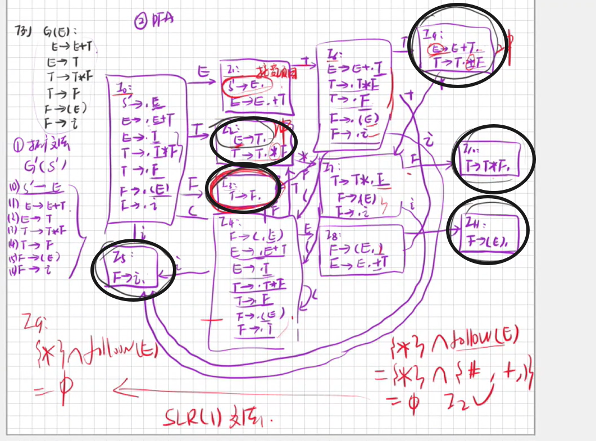

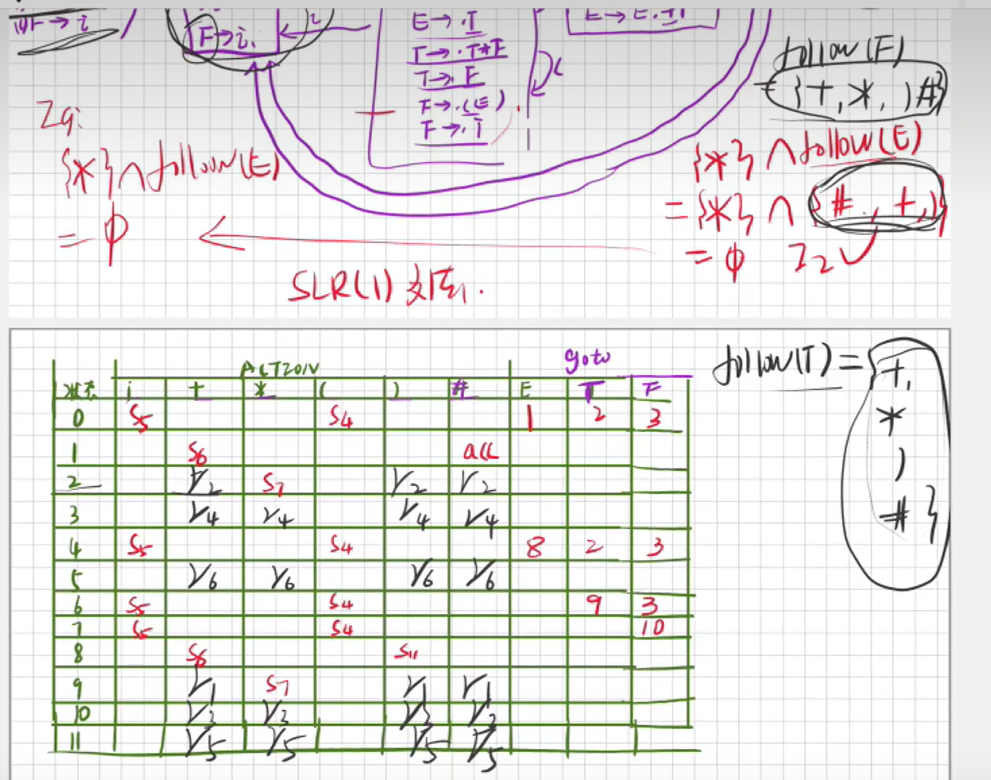

>   补充：`LR(0)、SLR(1)` 的预测分析，待补充...

##### 1.3.3.2.4.LR(1) 分析

如果上述无法得出空集的情况，就需要使用 `LR(1)` 分析来解决，但是项目集规范是携带向前搜索符的（也就是在求项目集开始），最后才能得到 `LR(1)` 分析表。同样，我们从一个例子开始做起：
$$
G(S):S \to A \\
A \to BA | \epsilon \\
B \to aB | b
$$

1.   文法拓广后，先求 $Follow(S)$，然后把结果集合中的字符加入到项目中，使用逗号进行分割。
     $$
     G(S):S' \to S, \# \\
     S \to A \\
     A \to BA \\
     A \to \epsilon \\
     B \to aB \\
     B \to b
     $$

2.   然后先看项目的左部 $X$，拿着该字符再顺序从上到下查看上面已带有前搜索符的项目（包括自己），如果有某个项目的右部中存在之前持有的右部，再分情况讨论。

     (1)如果遇到该项目是 $S \to ?X\epsilon$，则直接照抄其对应的前搜索符

     (2)如果遇到该项目是 $S \to ?Xa$，则需要求得 $First(a)$，然后除去 $\epsilon$ 加入为新的搜索符（但如果 `a` 是终结符，就直接加入）
     $$
     G(S):S' \to S, \# \\
     S \to A, \# \\
     A \to BA, \# \\
     A \to \epsilon, \#\\
     B \to aB, a/b/\#(First(A)=\{a, b, \epsilon\}, 由于 A 有可能得到 \epsilon 就会导致 B 后为空许哟照抄...)\\
     B \to b, a/b/\#(
     $$
     
3.   然后构建项目规范族，无需理会前搜索字符，这个只有在写分析表的时候有用...不过绘表的时候也照抄抄写下来，需要注意的是，每个情况的前搜索字符都是一样的，和第一条进行同步。

     

4.   然后填写分析表，步骤和之前也一样，但是需要额外多一步，需要根据不同的情况，把内部的前搜索符号和对应的情况编号所对应的格子内填入式子编号即可。

     

>   特点：算法运行高效，有现成工具可用，能分析的文法更多，并且不需要改写文法（不需要左递归和消除回溯）。

>   总结：...


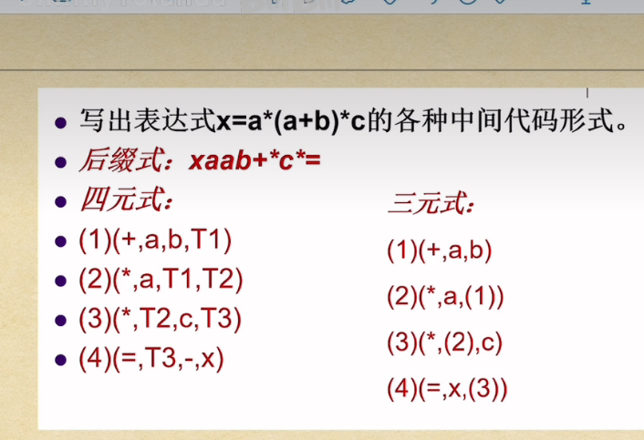
