# 1.文法

## 1.1.文法概念

任何构成程序的字符串都可以看作是基于字符集上的一个字符串。一个字符串由一些 $x$ 字符构成，字符串长度为 $|str|$，判断一个字符串 $str$ 是否基于一个字符集 $\Sigma={\{x\}}$ 的依据就是 **文法**。也就是描述单词符号的构成规则，一般包含 (1)词法规则 (2)语法规则。

-   一个语言的单词符号通常包含 `标识符、常数、运算符...`（对应的词法规则描述工具，例如“正规式”）
-   一个语言的语法单位通常包含 `表达式、语句、函数、过程...`（对应的语法规则描述工具，例如“上下文无关语法”）

>   补充：我们特别规定 $\epsilon$ 表示一个不含任何字符的空字符串。

>   补充：一些关于字符串和集合的运算。
>
>   -   **字符串的长度**：所构成的字符的个数 $|str|$
>
>   -   **字符串的连接**：符号串 $x$ 和 $y$ 的连接形成新字符串 $xy$
>
>   -   **字符串幂运算**：$x^{0} = \epsilon, x^{1} = x, x^{2} = xx, x^{3} = xxx...$
>
>   -   **串集合间乘积**：若 $A、B$ 均为字符串集合，则 $AB = \{xy|x\in A, y\in B\}$
>
>   -   **串集合幂运算**：若 $A、B$ 均为字符串集合，则 $A^{0} = \{\epsilon\}, A^{1} = A, A^{2} = AA, A^{3} = AAA...$
>
>   -   **串集合的闭包**：闭包分为正则闭包和闭包，闭包本质就是利用串集合衍生更多的
>
>       (1)正则闭包，$A^{+} = A^{1} \cup A^{2} \cup A^{3}...$
>
>       (2)闭包，$A^{*} = A^{0} \cup A^{+}$，也有 $A^{+} = AA^{*}$

## 1.2.词法规则

### 1.2.1.手工词法分析的实现

读取程序字符串的同时，可以读取得多个 `token`，也就是 `<记号, 属性>`。一次或多次扫描，就可以得到对应的 `token` 流。而 `token` 解析过程中，可能会涉及到转移图的绘制，这里介绍关于标识符的。

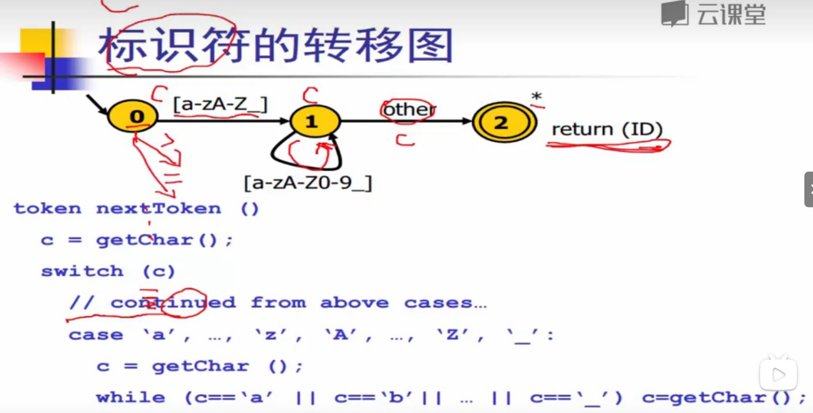

上图就是从 `0` 状态开始解析得到 `[a-zA-Z]` 字符后，就会到达 `1` 状态，继续读取如果还是字符 `[a-zA-Z]` 后，依旧会到达 `1` 状态，否则属于其他情况（例如空格），到达 `2` 状态，最终返回一个关键字 `token<ID, ...>`。


如果直接在标识符的识别关键字，就会使得转移图变得特别复杂。而由于关键字实际上是标识符的一部分，因此可以先让程序走一遍转移图，先抽取出所有的标识符保存起来。接着定义一个包含语言所有关键字的哈希表（其他表其实也可以，但是哈希会比较快），再让标识符去识别是否为哈希表中的一部分，是则标识符是关键字，否则标识符是用户自定义的。

因此手动编码的形式本质是一一读取字符后，对标识符进行关键字映射，这种方案是主流的方案，好把控也易编写。

### 1.2.2.自动词法分析的实现

如果程序员只需要使用一些声明式的规范，告知语言的特征就可以得到自动分析得到 `token` 流的生成器，这种方式就是自动编码。虽然代码量变少了，但是本身细节难以把控，自动机较难实现。而实现自动机，往往需要提到正则表达式的相关知识，我们先来具备两份基础：(1)RE (2)FA

#### 1.2.2.1.正则表达式 RE

1.   对给定的字符集 $\Sigma = {c1, c2, c3, ...}$ 中做下面约定

2.   空串 $\epsilon$ 本身就是正则表达式

3.   对于任意的 $c_n \in \Sigma$，$c_n$ 也是正则表达式

4.   如果 $M$ 和 $N$ 是正则表达式，则以下也是表达式

     (1)选择 $M|N = \{M \cup N\}$ 是一条正则表达式

     (2)连接 $MN = \{mn | m \in M, n \in N\}$

     (3)闭包 $M^* = \{\epsilon, M, MM, MMM, ...\}$

为什么需要提到正则表达式呢？我们其实可以联想到算术表达式，我们仅知道数字和 `+-*/` 就可以替换和复合出复杂的算术表达式。而正则表达式也是类似诞生的...

>   举例：给定字符集 $\Sigma = \{a, b\}$，尝试写出正则表达式，例如 $\epsilon、a、b、\epsilon | \epsilon、\epsilon | a...、\epsilon a、\epsilon b、ab、\epsilon \epsilon...、\epsilon^*、(a(\epsilon | a))^*$，可以看出正则表达式有很多，可以从前到后一步步进行推导...

那 `C语言` 中的 `if/while` 等关键字怎么使用正则表达式来表示呢？`if` 只需要 $i \in \Sigma, f \in \Sigma$ 就可以使得 $if$ 本身就是一个正则表达式。同理，`while` 也是类似的。

进一步，在 `C语言` 中的 `标识符` 是以字母或下划线开头，后面跟上零或多个字符、数字、下划线构成的字符串，这种复杂的规则怎么用正则表达式表示呢？

首先构造一个正则表达式 $M = \{a|b|c...z|A|B|C...|Z|_\}$ 作为第一部分，再构造一个正则表达式 $N = \{a|b|c...z|A|B|C...Z|\_|1|2|3...|9\} $ 作为第二部分，然后再把两个正则表达式连接起来，形成闭包，因此最终结果为 $\{(MN)^*\}$。

完美把 `C` 的标识符解析全部表示出来了，这种正则表达式就可以为语言的声明提供依据。因此正则表达式不像手工编码实现的转移图，当前只具有声明一个语言规则的功能。

#### 1.2.2.2.有限状态自动机 FA

那么声明的工具我们有了，还需要怎么继续实现自动机呢？这就要提到有限状态自动机（`FA`）了，`FA` 的工作流程如下。

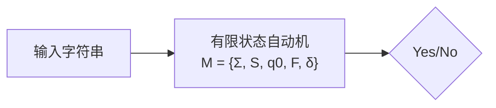

其中 $\Sigma, S, q_0, F, \delta$ 分别代表字符集(保存自动机所有的字符)、状态集(保存自动机所有状态)、初始状态(自动机运行时初始状态)、终结状态集(保存自动机所有终结状态)、转移函数(描述自动机在给定串的驱动下是如何进行工作的)，经过这个流程回答能否接受给定的字符串。

其中如果自动机 `FA` 在转移状态的过程中是确定的就叫 `DFA`，不确定就叫 `NFA`。对于第二种情况的 `FA`，则只要有可能走到最终状态，那这个字符串一定是可以接受的，不过这也代表 `NFA` 的扫描过程不是简单的一次即可，有可能需要多次（或者通过某些方式把 `DFA` 转化为 `NFA`）。

>   举例：假设给予以下自动机，尝试判断一个字符串是否可以被接受。
>
>   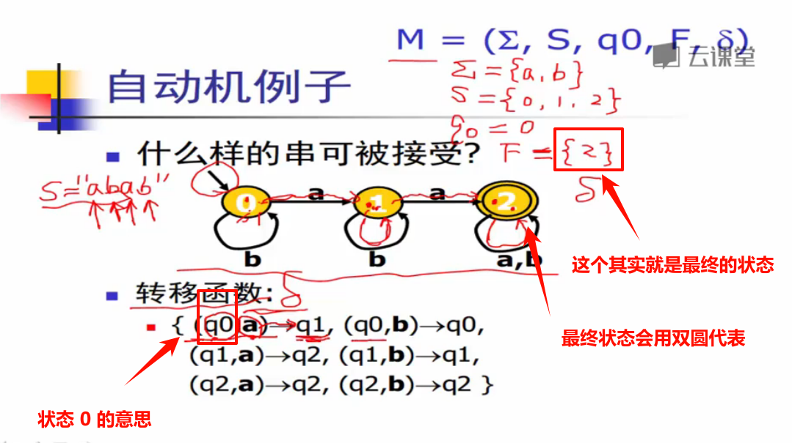
>
>   检测最终状态为 `2` 则整体输出 `Yes`。除此以外还有非确定的自动机，因此可以分类为 `NFA` 和 `DFA`。

#### 1.2.2.3.整合使用 RE 和 FA

这里的自动机和之前的转移图很像，但是转移图实现会一般会比较简单，这里提到的自动机主要是为何正则表达式一起使用的。因此我们有了这两个工具就可以进行进一步的探究，您先概览一下自动词法分析的流程。

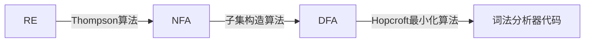

然后我假设给您一个正则表达式 $a(b | c)$，这个正则表达式描述了一种语言的特征，请您根据下述步骤尝试做一名“人肉编译器”，构造一份自动机代码...

##### 1.2.2.3.1.Thompson 算法(RE 转化 NFA)

我们来看具体的过程，首先我们已知道正则表达式的生成规则，`Thompson` 算法就是对正则表达式本身的规则进行 `NFA` 自动机描述，其产生的自动机状态转化很可能是多选择的。

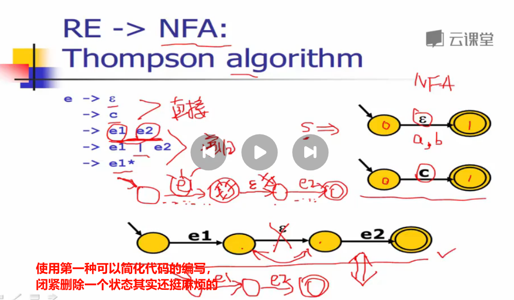

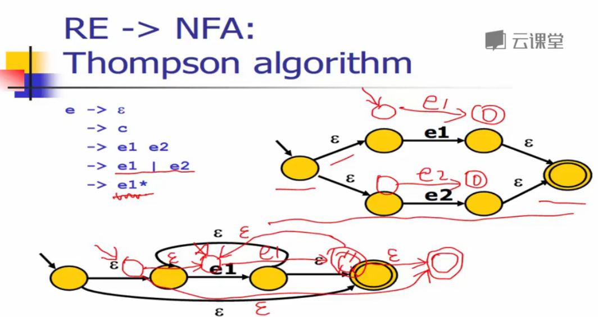

每经过一条边，就会消耗一个字母，但如果遇到 $\epsilon$ 无需任何消耗就可以走到下一个状态。

>   举例：如果我们给出一个正则表达式 $a(b | c)^*$，绘制其对应的 `Thompson` 算法，就是利用上面的五基本组件从左到右从内到外构造复杂的自动机。
>
>   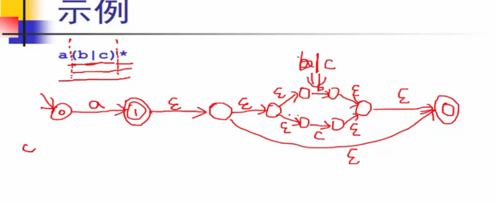
>
>   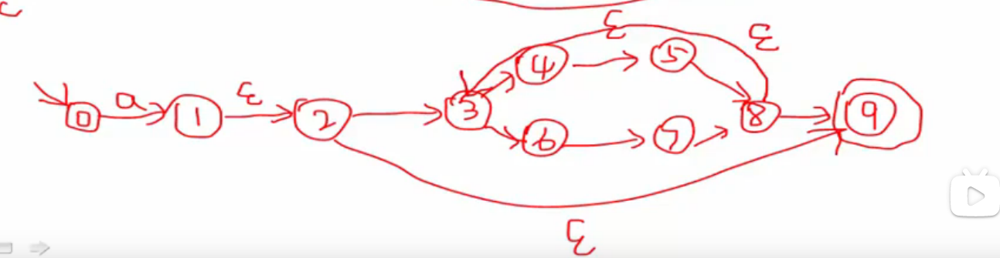

##### 1.2.2.3.2.子集构造算法(NFA 转化 DFA)

而之所以需要子集构造法，就是希望将上述结果中不确定的 `NFA` 转化为确定的 `DFA`（最重要的原因就在于 `NFA` 需要在代码中做到回溯故较难实现，效率也比较低下），一旦转化为 `DFA`，简单点就可以使用 `if` 等控制语句直接实现，复杂点就可以使用 `图` 来进行实现。

这个算法的思路就是：先把状态图中的空字符 $\epsilon$ 和所有边上的字符收集为一个列表，从空字符开始依次输入 `NFA` 中，把所遇到的所有状态全部放入一个集合之中。然后再从这个集合做连线开始走起，并且整体作为一次状态。接下来从该状态出发，依次读取列表中的下一个字符，再次把所遇到的可以走到的状态都放入多个集合中...直到每一条分支把列表中的字符都循环读取多边不出现新的状态变化。

如果有某个集合包含了原 `NFA` 的最终状态，那么这个集合代表的状态也是最终状态（因此这里就有可能会出现多最终状态的转换图）。

>   吐槽：每一次收集状态集合的过程，类似一次树结构的深度优先遍历。

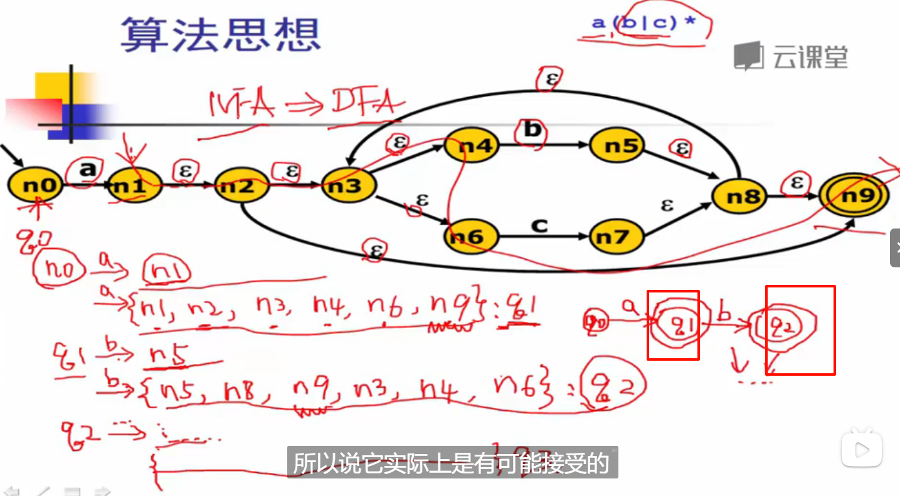

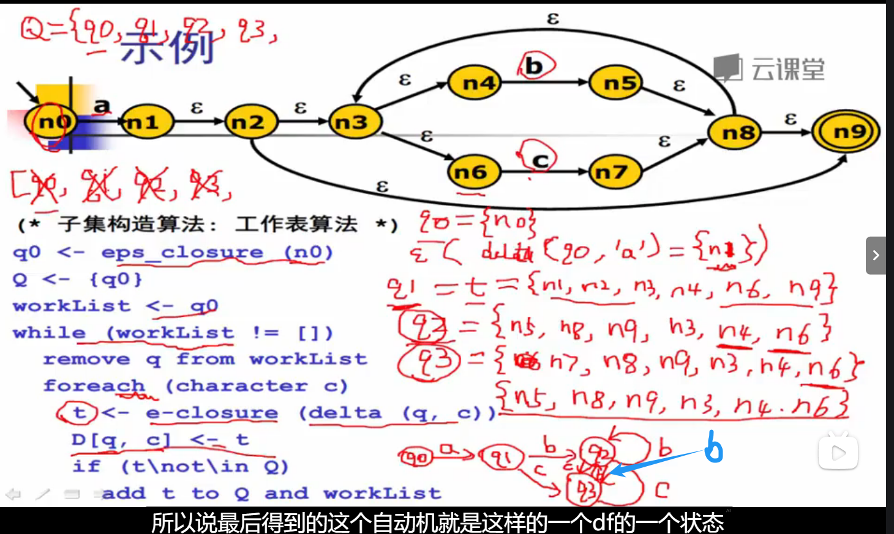

再加上最终状态...

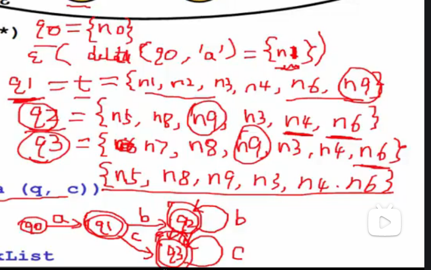

因此为什么叫子集构造法呢？就是因为这个算法在不断构造出很多的集合作为一个状态。子集算法还有一些其他的讨论问题，为什么是一个不动点算法（算法为什么可以进行终止）？还有相关的时间复杂度？相关的知识和代码实现以后再来...

##### 1.2.2.3.3.Hopcroft 最小化算法(DFA 转化 CODE)

为什么需要把 `DFA` 最小化呢？可以把 `DFA` 的状态减少，让代码更加简洁，算法实现时占用的资源也较小。而 `Hopcroft` 算法做的事情其实就是把状态进行合并，以减少状态和边的产生，先简单看一下大概了解一下...


具体怎么做呢？从出口开始把所有的非接受状态 `N` 和接受状态 `A` 两个划分，然后。

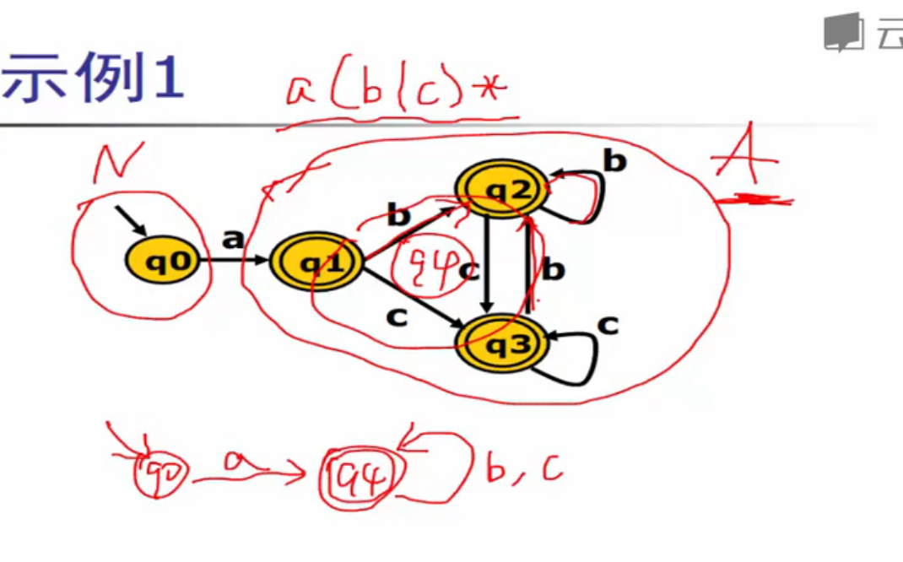

再来一个例子把。


## 1.3.语法规则

文法是描述语言的形式规则，而 `乔姆斯基` 将文法分为四种类型：`0型、1型、2型、3型`。

-   0 型文法-无限制文法
-   1 型文法-上下文相关文法
-   2 型文法-上下文无关文法
-   3 型文法-正则文法

我们重点学习上下文无关语法，上下文无关语法通常由四元组 $G = (N,T,P,S)$ 组成：

*   $N$：非终结符集合，表示语法结构中的变量或符号
*   $T$：终结符集合，表示语法结构中的实际符号或词汇
*   $P$：生成规则集合，定义了如何用非终结符和终结符生成句子（又被称为产生式，通常写为 $A \to a 或 A ::= a, A \in N, a \in (N \cup T)^*$ 这种左部推导出右部的形式）
*   $S$：开始符号，指定了生成句子的起点
*   $V$：$N \cup T$

通过上下文得到实例的过程就是推导，而上下文无关语法对应实例的图形化表示就是语法树，可以直观看出语法的构成（但是如果一个文法存在两个完全不同的语法树，则此文法就是二义性文法，这样的文法有很多）。

>   举例：假设有如下规则
>
>   *   非终结符：$E, T, F$
>   *   终结符：$+, *, (, ), id$
>   *   规则如下：
>       1.  $E→E+T | T$
>       2.  $T→T∗F | F$
>       3.  $F→(E) | id$
>   *   开始符号：$E$
>
>   这样的规则可以推导出一个句子出来，则该句子符合该文法规则。

推导这个词在不同条件下有不同的细分概念：

-   使用文法推导出最终句子的每一个过程都被称为 **直接推导**，其逆向的过程就被称为 **直接归约**。而如果从 $a_0$ 经过一步步直接推导得到 $a_n$，则可以说 $a_n$ 是 $a_0$ 的推导，符号记为 $a_0 \stackrel{+} \Longrightarrow a_n$。
-   而如果允许这个过程中出现 $a_0 == a_n$，则可以说 $a_n$ 是 $a_0$ 的 **广义推导**，符号记为 $a_0 \stackrel{*} \Longrightarrow a_n$。
-   如果对直接推导和直接规约加以限制，确保 $xAy \Longrightarrow xBy$ 中，如果 $y$ 为终结符号串或为空符号串，那这种推导就是 **规范推导(最右推导)**，其反动作就是 **最左归约**，规范推导记为 $xAy \underset{r} \Longrightarrow xBy$。

>   补充：句型和句子的定义。
>
>   -   若 $S \stackrel{*} \Longrightarrow a, a \in V^{*}$，则称 $a$ 为文法 $G$ 的一个 **句型**
>   -   若 $S \stackrel{+} \Longrightarrow a, a \in T^{*}$，则称 $a$ 为文法 $G$ 的一个 **句子**

>   补充：如果产生式 $A \to a$ 在后续的推导中又重复出现了 $A$ 符号在右部中，则称为 **递归产生式**。若仅作了一次推导就得到带有 $A$ 的右部结果，就称这个产生式为 **直接递归产生式**。由于很多的语言都是无限集，就需要依靠递归使有限的语法推导出无限语言。

>   补充：短语、直接短语、句柄的概念。如果直接使用语法树来理解会容易一些，则对应语法树如下。从左到右，从上到下：
>
>   -   把每颗子树的叶子节点字符连接为一个字符串即可得到短语
>   -   而直接短语就是子树直接推导出的叶子节点
>   -   而句柄就是最左直接短语
>
>   ```mermaid
>   graph TD
>   E1["E"] --> E2[E] & ADD1[+] & T1[T]
>   E2 --> E3[E] & ADD2[+] & T2[T]
>   T1 --> F[F] --> i[i]
>   E3 --> T
>   T2 --> T3[T] & SUB[*] & F2[F]
>   ```
>
>   -   短语：$T、T*F、i、T+T*F、T+T*F+i$
>   -   直接短语：$T、T*F、i$
>   -   句柄：$T$
>
>   文字描述可能有些抽象，可以看看 [这位温柔小姐姐关于短语、直接短语、句柄视频讲解](https://www.bilibili.com/video/BV1af4y1Z7ji?vd_source=4772b64d7a3cb1873f14bc0153c4de68)，虽然讲直接短语的时候讲金句的样子很可爱...

另外注意，如果恰好有两种形式的语法推导出的语言 $L(G_1)$ 和 $L(G_2)$ 是相同的，则称两文法为 **等价语法**。


到这里就可以成功利用文法 $G$ 规则推导出其对应所有的句子，而这些句子的集合就是一门语言 $L(G)$。但正常来说，给定一个文法就可以推导出一个语言，但给定一个语言无法穷举出对应的文法。
