# 1.AE作用

`AE`实际就是`Adobe After Effects`的缩写，其最大作用就是设计和视频特效，适用于：电视台、影视制作机构、多媒体工作室、个人自媒体。`AE`可以理解为动态的`PS`，贴别适合后期特效。

>   补充：既然都了解了`AE`，那不如了解一下其他同系列的软件：
>
>   1.   `PR`：视频制作软件，非线性剪辑软件
>   2.   `PS`：图像处理软件（建议掌握一些）
>   3.   `ME`：媒体编码工具，用于输出视频的格式和编码的设置，最后输出环节中重要的外置工具
>   4.   `AI`：矢量制作软件，用于平面设计、插画设计
>   5.   `AU`：音频编辑视频软件，门槛较高

# 2.AE下载

官方网址：[Adobe products: desktop, web, and mobile applications](https://www.adobe.com/products/catalog.html)。

# 3.AE配置

下面操作主要是打开“编辑/首选项”内的一些配置操作。

## 3.1.磁盘缓存和媒体缓存

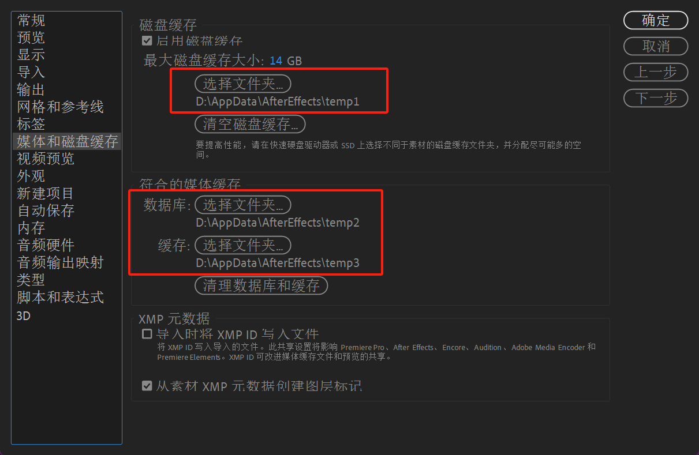

上述三个缓存路径指向三个缓存文件夹，主要是在`AE`工作中产生的临时文件的存放地（以便用户快速进行预览和编辑）。一般默认设置在`C`盘，但是对于`C`盘空间吃紧的用户可以将这三个文件夹的地址修改为别处的盘符。

## 3.2.自动保存

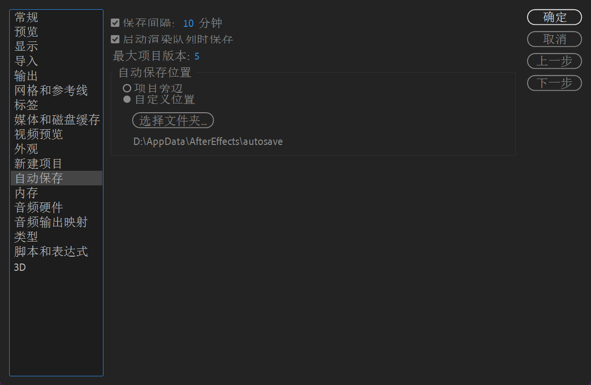

自动保存是已将很重要的事情，您可以根据自己的需要来设置每隔一段时间自动保存`AE`工作文件（另外，您还需要养成时刻使用`[ctrl+s]`快捷键保存文件的习惯）。另外`AE`会存储项目版本，默认保存`5`个版本，存放在一个路径下（同样可以自定义存放的路径），方便用户回溯项目版本。

## 3.3.缺省导入行为

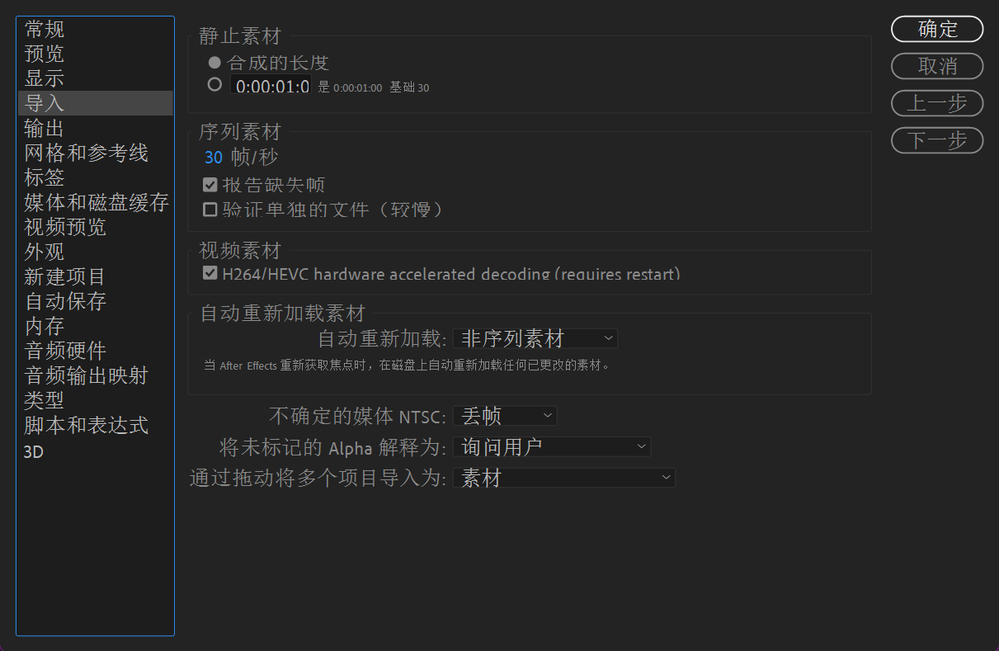

“导入”主要指的是在使用`AE`的过程中导入的音频、视频等文件。这里主要设置一些导入的默认（或者叫缺省）行为。

1.   静止素材，指图片素材，这里默认选择“合成的长度”，则导入的图片时长和合成相同。如果是自定义时长，则导入图片时会自动转换对应的时间长度，与合成无关。
2.   序列素材：这里默认的帧率是`30`，导入序列素材后在`AE`中的帧率就是`30`，与素材的原帧率没有关系（同样也可以自己设置）。
3.   自动重新加载素材：如果原素材发生了改动，则之前已经导入到`AE`中的素材也会同步更新（这里可以尝试使用所有素材类型）。

## 3.4.内存

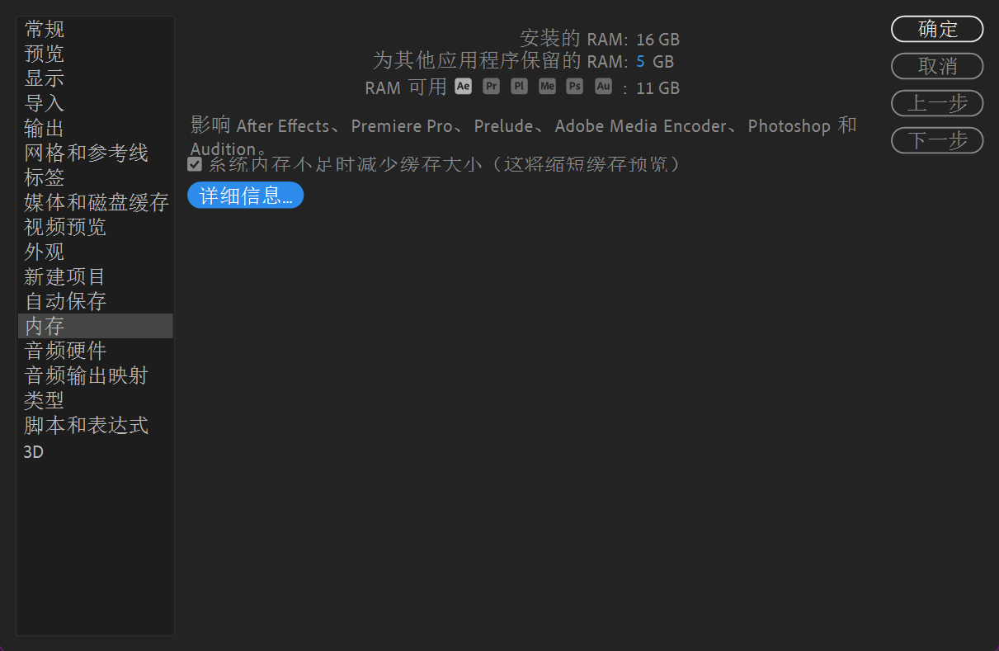

这里的“安装的`RAM`”就会显示自己电脑的可用内存，可以给`AE`设置足够的内存空间，一般建议给`AE`大约`70%`的内存空间（这也侧面说明，在您的电脑性能不够强悍时，不建议在开启`AE`的同时，过多运行其他的软件）

## 3.5.自定义快捷键

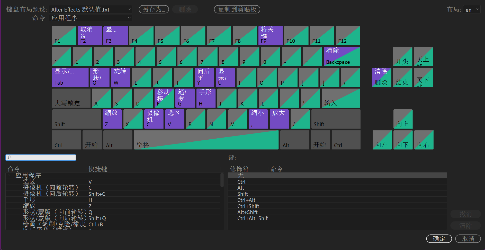

打开`编辑/键盘快捷键`，里面就有`AE`的快捷键提示，并且可以自己手动修改快捷键（不过这种操作并不推荐）。

## 3.6.字体大小

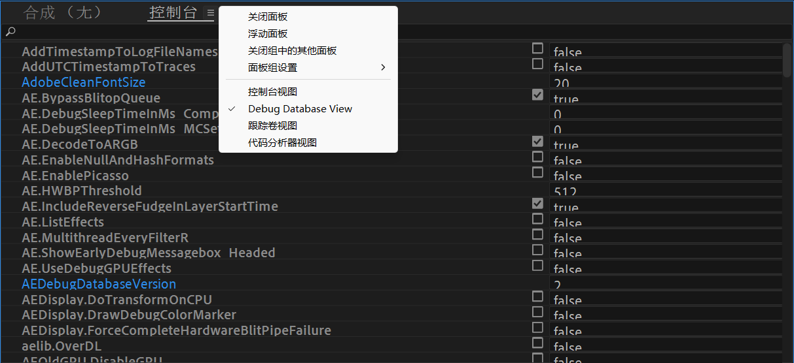

可能会有人吐槽`AE`界面中字体太小，实际上这是可以修改的。使用快捷键`[ctrl+F12]`调出`AE`的隐藏控制台，更换为`Debug Database View`。在其中就可以更改`AdobeCleanFontSize`的值为`15~20`（具体视您的电脑而定），回车然后重启`AE`即可。

# 4.AE界面

在使用`AE`之前，必须先要熟悉`AE`的界面以及一些基本操作和基本知识。

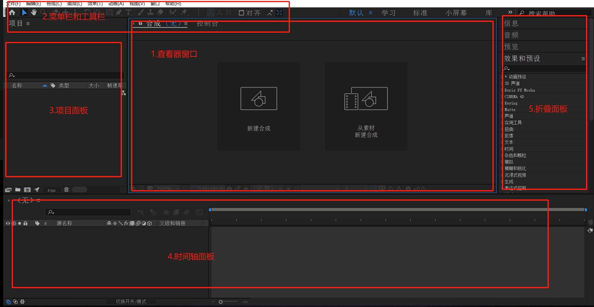

除了上述这些默认的工作区，还有一些工作区我们也可以自己手动在`窗口/工作区`调出不同业务场景下的窗口模式。

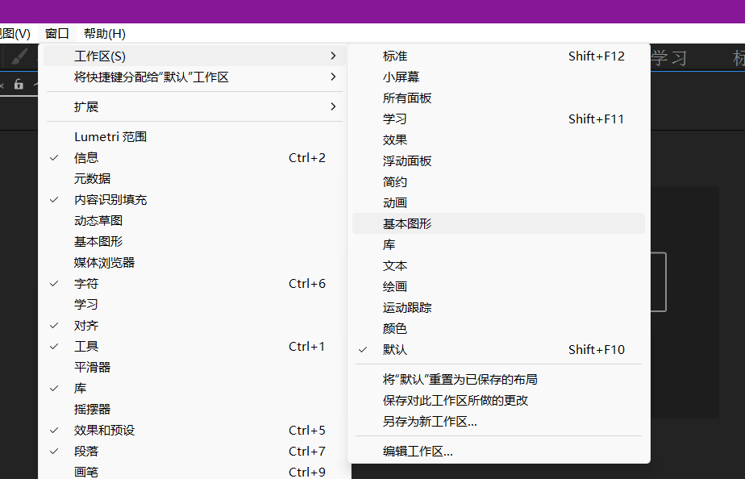

有时为了操作空间最大化，会使用`[ctrl+\]`来最大化`AE`的窗口。

## 4.1.菜单栏

这里主要分布`AE`的很多基础命令，菜单内还有二级、三级菜单，几乎是所有命令都集合在这里了。

## 4.2.工具栏

这里的工具栏在很多编辑软件都有，其中可能有几个是您不曾用过的，例如：下面的工具是用来操作三维图像的“旋转”、“平移”、“推拉”工具。

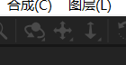

其他的工具我们以后再来详细解说，在这里即便是解释了您耶很难理解。

## 4.3.查看器窗口

这里可以对素材（视频或者图片）进行监视或者预览，可以显示各个层的效果，并且对层进行直观的调整（移动、旋转、缩放等），可以使用`[ctrl+alt+shift+n]`来创建多个查看器（或者在`视图/新建查看器`中新建）。

## 4.5.时间轴面板

这里是`AE`的精华，用于控制对象间的时间关系，包括了所有的视频、音频、图片轨道。

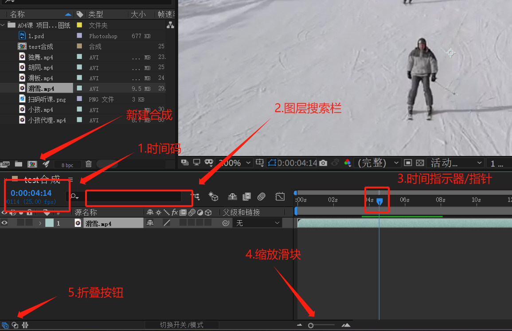

1.   时间码：表示当前时间，单击即可进入编辑状态，输入时间即可跳转到该时间的合成画面，默认的显示单位是“秒”，如果按住`[ctrl]`的同时单击，就会显示单位为“帧”。
2.   图层搜索栏：可以搜索图层。
3.   时间指示器/指针（`CTI`）：指向当前正在查看或者修改的单帧画面，可以手动拖动指针。
4.   缩放滑块：用于缩放时间标尺区域的大小。
5.   折叠按钮：有的时候面板太多可以用这个来分类折叠。

# 5.AE合成

合成是`AE`的视频制作空间，是后期输出视频的来源，每一个合成都有自己的尺寸和时间线。合成包含多个图层（视频、音频、文本、图片、图形图层），甚至可以嵌套合成。

## 5.1.新建合成

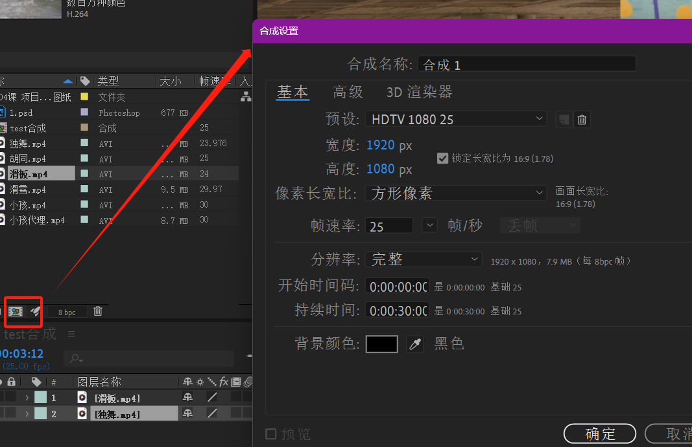

新建合成的时候，可以设置预设、宽高度、像素长宽比、帧速率、分辨率等。创建好合成后，将素材拖进合成即可（或者同时选中多个文件，然后新建合成，快捷键是`[alt+\]`）。如果还需要从现有合成中复制出新的合成，可以使用快捷键`[ctrl+d]`，并且两者各自的修改不会相互影响。建好的合成也可以自己重新设置，右键合成点击“合成设置”即可，或者使用快捷键`[ctrl+k]`。

其中有几样东西需要科普一下：

1.   视频制式：我们有时需要通过视频制式，来确定合成的尺寸、像素比、帧速率等。目前主流的视频制式是`NTSC`和`PAL`，是根据不同国家的电压和频率决定的（`NTSC`用于欧美和日本等地区和国家，帧速率为`29.97fps`，标准尺寸为`720px*480px`；`PAL`用于我国、欧洲等地区和国家，帧速率为`25fps`，标准尺寸为`720px*576px`）。我们可以在“合成设置/预设”中进行设置，选好预设就会自动帮我们调整好所需的参数。

     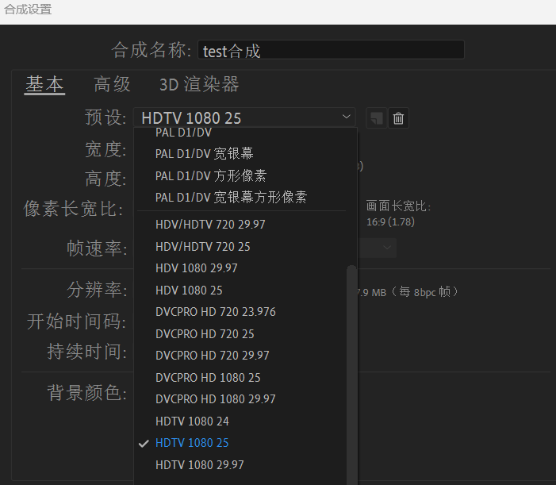

2.   分辨率：单位尺寸内一共有多少像素，这是最原本的分辨率概念，是一个比例，而不是大小（显示生活中分辨率会被用成尺寸，实际上这是不严谨的）。

3.   视频尺寸：`HD`指垂直像素大于等于`720`像素，也就是`720p`，实际上`1920*1080p`尺寸的屏幕，根据`1080p`也可以叫做`HD`；`2560*1440p`中根据数字`2560≈2K`命名为`2K`；`4096*2160p`中根据数字`4096≈4K`命名为`4K`...

     >   补充：这里的`p`单位指的是垂直方向一英寸穿过的像素点个数，横向的一般没有单位，只有数字。

4.   视频像素长宽比：普通的视频可能就是`1:1`的像素方格，但是有些情况会出现非方形像素。

5.   帧速率：每秒钟刷新图像的帧数，帧就是一页静止的画面，视频由大量连续刷新的帧构成。

## 5.2.合成嵌套

合成里可以嵌套合成，在项目中生成两个合成，然后双击其中一个合成进入时间轴面板，然后拖拽另外一个合成进入该合成即可（或者拖进查看器窗口也可以）。

## 5.3.预合成嵌套

实际上预合成生成的新图层也是合成，预合成会将一个合成内单个或者多个图层合并为一个合成图层，可以右键选中，也可以使用快捷键`[ctrl+shift+c]`。

# 6.AE导入

`AE`导入素材的快捷键是`[ctrl+i]`，可以选择直接导入素材、合成、合成（保持图层大小）。

其中需要注意，如果是`PS`的工程文件

1.   直接作为素材导入会出现两个选项：如果选择“合并的图层”，则会将所有图层当作一个图层来操作。如果选择“选择图层”，则可以择取需要的图层。

     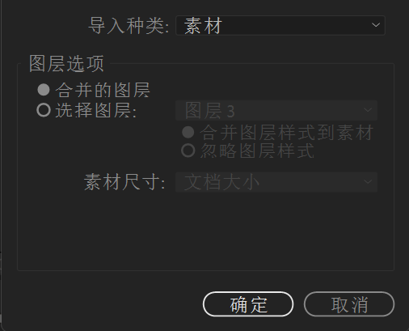

2.   如果作为合成导入，则会包含所有的图层信息，可以直接在`AE`中生成合成，同样也是有两个选项，如果选中`PS`的素材，使用`[ctrl+e]/[alt+双击左键]`则可以快速跳转到`PS`中进行编辑。

     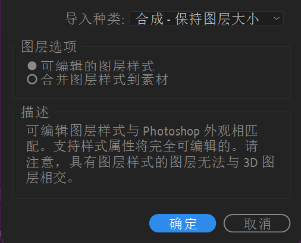

# 7.AE素材

素材被导入后可以被`AE`使用某些命令来管理。

1.   去除重复：有的时候会导入一些重复的素材，可以使用`文件/整理工程文件/整合所有素材`去除重复导入的文件
2.   删除未用：有些文件我们导入了，但是没有用过，想要清理掉就可以使用`文件/整理工程文件/删除未用过的素材`
3.   减少项目：选中不想删除的文件，使用`文件/整理工程文件/减少项目`即可删除非选中的所有文件
4.   替换素材：`文件/替换素材/文件`就可以替换自己的素材
5.   重新加载：如果源素材发生了改动，我们希望在`AE`里也可以实时发生变动，则可以使用`文件/重新加载素材`，快捷键`[ctrl+alt+l]`

# 8.AE代理

`AE`在导入高质量素材的时候，可能造成合成预览卡顿，这个时候就可以在项目面板选择素材，然后右键创建代理，选择影片或者静止图像，就会将素材推入渲染队列，然后选择指定的代理文件路径，点击渲染。就可以输出体积小于源文件的文件，完成渲染后素材的前面会出现方框标志，此时点击则开启代理文件，关闭就是源文件。

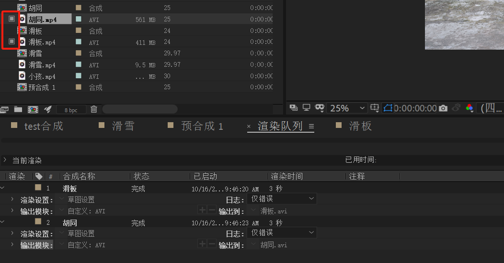

当然如果已经有了代理文件，则可以使用`右键素材/设置代理/文件`或者使用`[ctrl+alt+p]`手动导入代理文件：

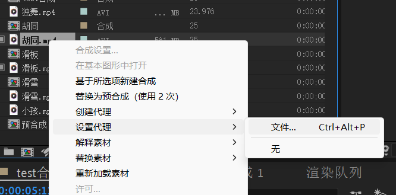

