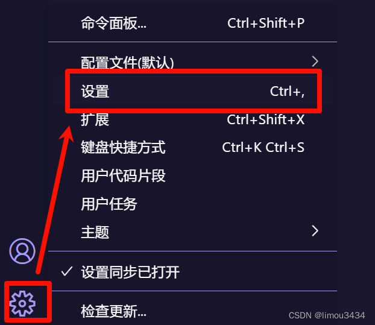
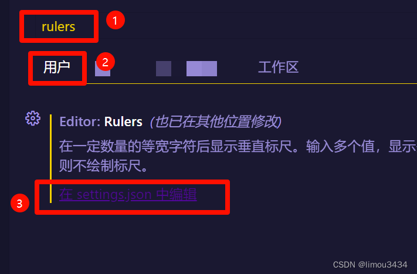
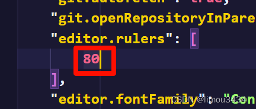
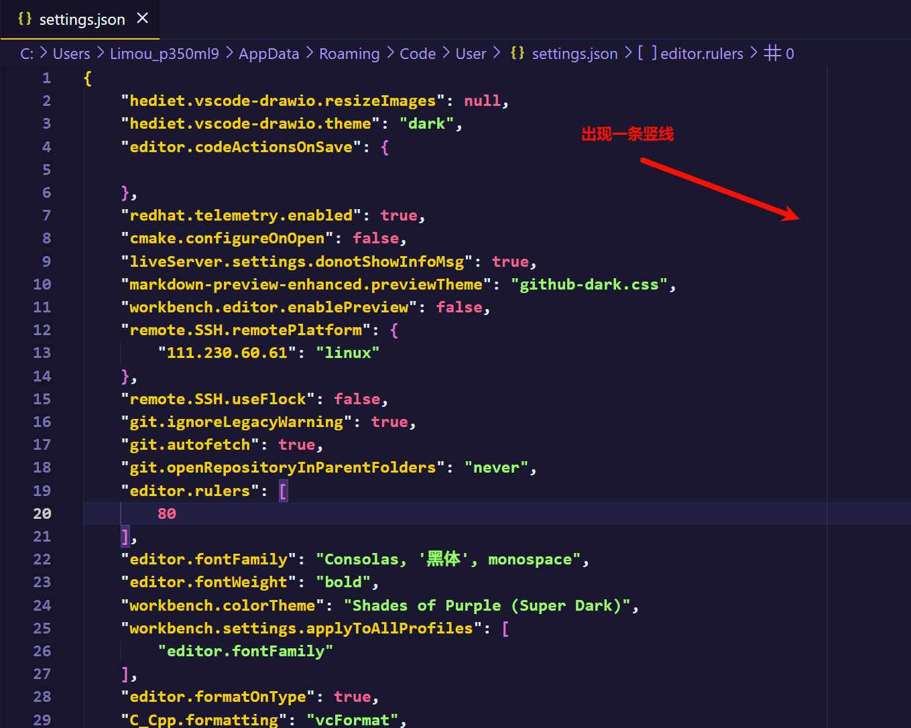

`vscode` 设置行宽提示线，可以按如下步骤设置：
1. 打开设置
  

2. 搜索框输入 `rulers`，选择用户，点击 **在 settings.json 中编辑**
  

3. 跳转到一个 `json` 文件后，将字段 `rulers` 对应值设置为 `80`
  

  >   补充：如果您在您的 `json` 配置文件中没有找到 `editor.rulers` 字段，则可以手动将下述代码复制粘贴进去，需要注意的是您必须复制到整个 `json` 代码块的 `{}` 内，区别注意结尾带上逗号。
  >
  >   ```json
  >   {
  >       "editor.rulers": [
  >           80
  >       ],
  >   }
  >   ```
  >
  >   详细原因请查看 `json` 的使用文档...

4. 检查配置，重新启动 `vscode`，查看代码文件中是否出现白色竖线

  

5. 这条竖线可以提示您，==代码行不要超过 `80` 个字符，否则会因为屏幕不够宽造成一定的阅读困难==