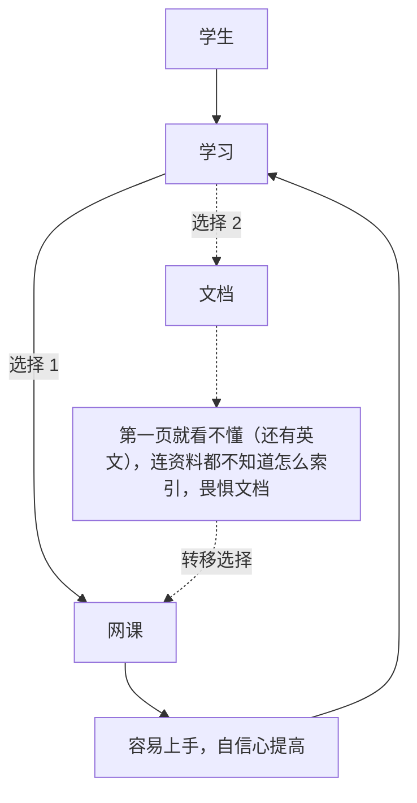

## 理解抽象的概念之前先找具体的操作

在有些时候我们会执着于抽象的概念，而脱离具体的现实，而逻辑上，所有人类给定的抽象概念应该都是从具体的现实中抽离出来的，因此在学习抽象概念之前，先找到具象的操作学习。

## X-Y问题

很经典的问题

## 假借和模仿

模仿人类的行为，抑或是其他动物的行为，是一种重要的方法。

## 重复的警觉

如果您每天重复做一件事情，那么就需要一定的警觉了，“这是否可以优化减少重复”这个一想法。

## 文档学习法

学生时代经常会陷入一个学习困境如下：

## 有问题的类比比不类比还要恐怖

举例子不行就别举
