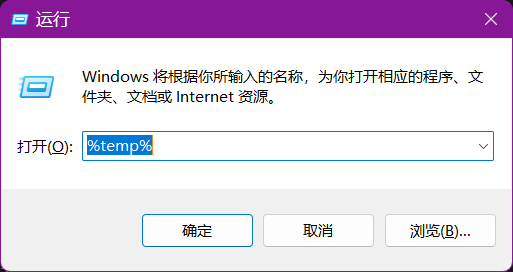
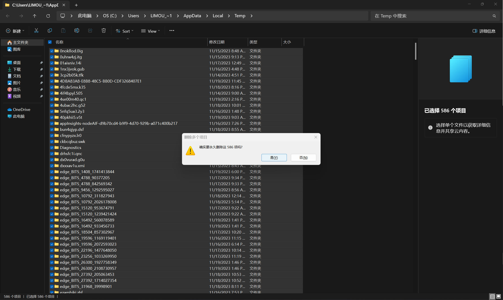
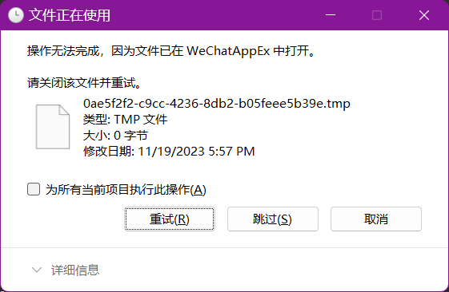
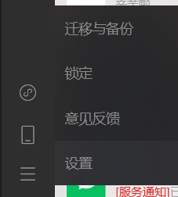
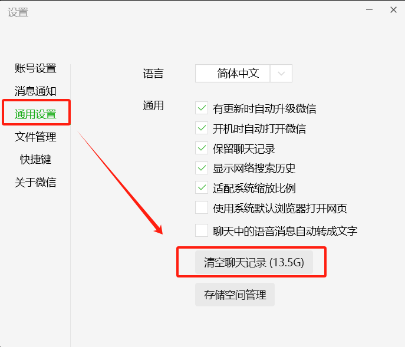
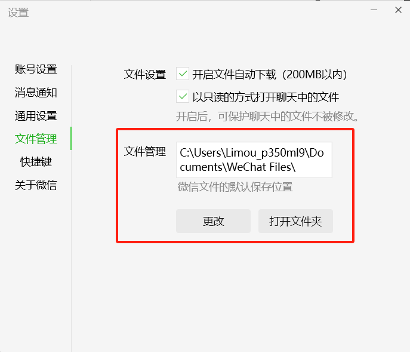
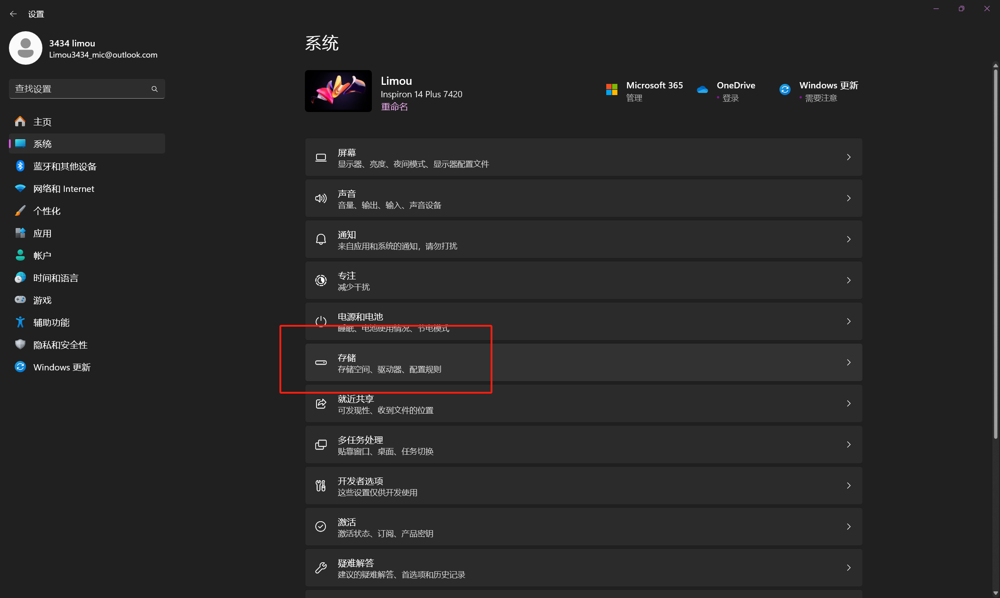

# 1.清理临时文件

电脑会存储的一些临时文件，删除掉这些文件是不会影响使用的。使用快捷键`[win + r]`，跳出下面窗口，输入指令`%temp%`。

回车后，就会打开一个文件夹，直接全选该文件夹内的所有文件，使用快捷键`[shift + delete]`全部删除（或者右键删除）。

其中如果出现“文件正在使用”、“操作无法完成”等提示，直接勾选“为所有当前项目执行此操作”，然后选择“跳过即可”。

# 2.微信QQ等聊天工具缓存

微信和`QQ`会自动存储表情包、图片、视频、`word`等文件，并且通常默认存储在`C`盘的某个位置，我们可以找到这个位置删除掉内部的文件。这里举微信的例子，首先找到微信的“设置”。

点击里面“通用设置”，点击“清空聊天记录”即可（但是需要注意，请确保自己的聊天记录里没有什么重要的文件，否者删除后就再也打不开对应的文件了，除非别人重新发给你文件）。

如果不希望删除上面的聊天记录，可以选择“文件管理”，选择更改，将微信文件的保存位置修改到别的盘符下即可（这样以后就是微信缓存文件变多了也用的是其他盘的空间，不会占用`C`盘空间）。

>   补充：同理如果您的电脑有`QQ`也是这么处理。

# 3.清空回收站

删除一些文件后，会被添加到会回收站，方便用户找回一些误删除的文件，因此这里如果没有设置好的话，有可能会有很多的文件没有被删除。

# .卸载不必要的软件

使用快捷键`[win + i]`打开设置，进入存储页面

