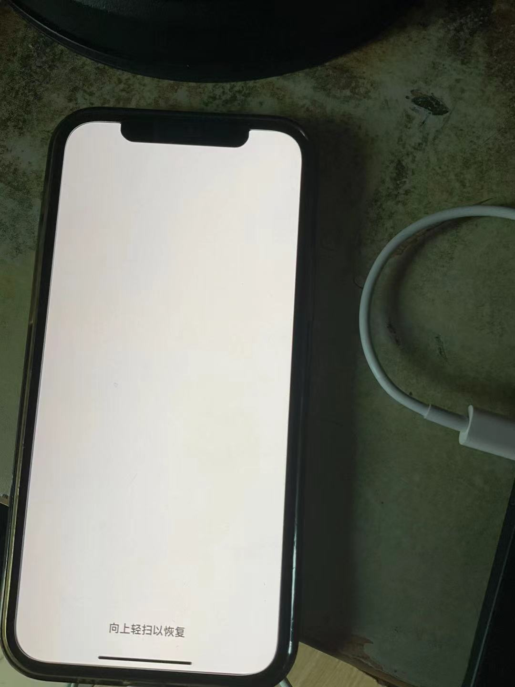

# 1.问题分析

嗯，我猜测...因为被朋友推荐了一款游戏，没注意到空间需求导致惨遭“空间背刺”，于是开始考虑刷机。接下来阐述一下我的设备和刷机工具：

1.   苹果手机型号：`iPhone 12 Pro`

2.   苹果手机操作系统版本：`iOS 17.5` 左右，因为我有些忘记了，刷机后版本有可能发生变动

3.   刷机工具：[爱思助手 V8.21](https://www.i4.cn/)、苹果数据线、`Windows11 x64` 电脑

4.   刷机参考教程资料：

     (1)[爱思助手修复刷机视频教程](https://www.bilibili.com/video/BV1CU4y1Z78P?vd_source=4772b64d7a3cb1873f14bc0153c4de68)

     (2)[爱思助手修复刷机图文教程](https://www.i4.cn/news_detail_48669.html)

# 2.修复步骤

首先，此时的苹果一点是陷入了所谓 `白苹果模式`，也就是开机后一直停留在白色苹果图标的界面，无法进入系统的主界面。

## 2.1.连接电脑，打开恢复模式

因此我们首先使用数据线连接苹果手机和电脑，启动爱思助手，然后打开苹果的 `恢复模式`。

快速点击 `+` `-` 音量键后，**长按** `电源键` **直到出现**以下界面：

这是我自己的手机弹出来的 `恢复模式` 界面：

## 2.2.打开爱思助手下载固件版本

安装好爱思助手后，点击 `智能刷机 -> 一键刷机`，然后下载最新版本的固件版本，进入下载队列后进行等待即可，这里可以提前勾选下方的 `修复刷机` 选项（注意看好不同版本的固件进行选择，一般推荐越新越好）。

过程可能有点长，固件大概有 `7G` 左右，最好也确保您的电脑磁盘空间够用，不然两个设备同时进入空间溢出状态未免有点好笑...

## 2.3.开始进行刷机操作

下载完成后，确保此时的苹果手机仍旧处于 `恢复模式`，选择已经下载好的固件，检查是否选中下方的 `修复刷机`，然后点击 `立刻刷机` 即可。

同时我的手机的状态如下：

## 2.4.刷机后手机自动进行恢复

1.   如果报错 `100、1110` 等，可能是 `恢复模式` 被退出了，重新让苹果进入 `恢复模式` 即可。
2.   或者干脆把整个刷机步骤重新走一边，检查是不是哪里选错了。

一直到出现下方界面：

然后手机界面就会出现字样代表刷机成功：

不过还需要进行进一步的等待，等待系统完成恢复，直到出现 `hello` 的字样：

# 3.空间清理

刷机恢复成功后，首当其冲就需要对自己的磁盘空间进行释放（我光速把游戏删了...）

