>   前要：本文只是概括重要的 `CSS` 的较为重要的内容，详细的您可以跳转 [Mmdn](https://developer.mozilla.org/zh-CN/docs/Glossary/HTML) 进行深入的学习。

# 1.JS 概念

## 1.JS 历史

- `JavaScript` 最早由 `Netscape` 公司的 `Brendan Eich` 设计和开发，在 `1995` 年 `Netscape Navigator 2.0` 发布时首次引入。
- `1997` 年，`ECMAScript` 第一版发布，成为 `JavaScript` 的规范标准，定义了语言的核心特性和语法规则。
- 后续的版本更新包括 `ECMAScript 3`（`1999` 年）、`ECMAScript 5`（`2009` 年）、`ECMAScript 6`（`2015` 年，也称为 `ECMAScript 2015` 或 `ES6`）等，每个版本都增加了新的特性和改进。
- 随着时间的推移，`JavaScript` 在浏览器端和服务器端的应用范围不断扩大，成为 `Web` 开发的重要组成部分之一。

总的来说，`JavaScript` 在 `Web` 开发、移动应用开发、服务器端开发等方面有着广泛的应用，并且在不断发展和演进中。

## 2.JS 作用

1. **网页交互性：** `JavaScript` 最初设计是为了增强网页的交互性。它可以通过 DOM（文档对象模型）操作网页的结构、样式和内容，从而实现动态的用户界面和用户交互效果。

2. **浏览器扩展：** `JavaScript` 可以用于开发浏览器扩展和插件，增强浏览器的功能和性能，比如广告拦截器、密码管理器等。

3. **服务器端开发：** `Node.js` 是基于 `JavaScript` 的服务器端运行环境，使得 `JavaScript` 可以用于开发服务器端应用程序，如 `Web` 服务器、`RESTful API`、实时应用等。

4. **移动应用开发：** 使用框架如 `React Native` 或 `Ionic`，开发者可以使用 `JavaScript` 来构建原生移动应用，同时充分利用 `Web` 开发技术和工具。

5. **数据交互：** `JavaScript` 可以通过 `AJAX` 技术与服务器进行异步数据交互，实现页面无需刷新的动态更新。

6. **动画和游戏开发：** 利用 `HTML5` 的 `Canvas` 和 `SVG`，结合 `JavaScript`，开发者可以创建丰富的动画效果和游戏。

7. **跨平台开发：** 使用框架如 `Electron` 或 `NW.js`，可以将 `JavaScript` 应用打包成桌面应用程序，支持多个操作系统。

8. **机器学习和数据分析：** `JavaScript` 的库和框架（如 `TensorFlow.js`）使得开发者可以在浏览器中进行机器学习和数据分析任务。

# 2.JS 环境

## 2.1.浏览器环境

在 `JS` 的视角下，浏览器可以看作 `渲染引擎 + JS引擎`，其中 `JS引擎` 就是 `JS` 解释器，该解释器会把 `JS` 代码解释为二进制内容，因此 `JS` 一般是运行在浏览器上的脚本。

`JS` 一般由以下部分构成：

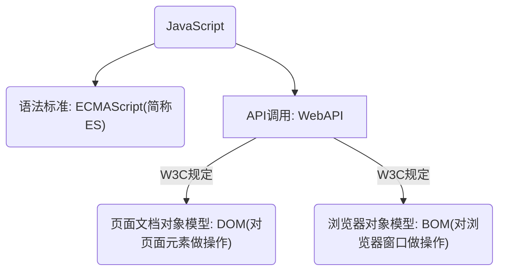

因此如果我们希望 `JS` 这一语言运用在网站上，就必须在 `html` 文件中进行导入，这样整个 `html` 文件交给浏览器后，就会携带 `html` 本身的标签、`CSS` 的选择器、`JS` 语言编写的代码...综合得到一个动态的网站（没有 `JS` 等编程语言参与构建的网站只能是静态网站，几乎不具备和用户交互的可能，最大的作用只是作为文本资料进行展示）。

>   补充：有一款直到现在也依旧爆红的 [浏览器插件——篡改猴/油猴插件](https://www.tampermonkey.net/)，其使用非常简单，基本上您会使用 `JS` 就会使用这个插件，让 `JS` 可以更好的在某些网站上进行自动化运行，是一个高可自定义的编写网站插件的浏览器插件。不过本质上油猴也是在浏览器上运行，不过不在需要将 `JS` 文件手动引入到网站中而已...

>   补充：其实浏览器是可以关闭 `JS` 脚本的，这里演示 `google` 关闭 `JS` 运行的例子。
>
>   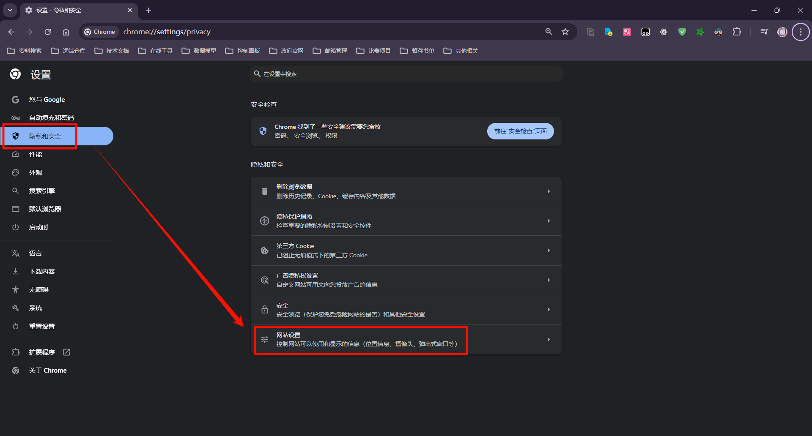
>
>   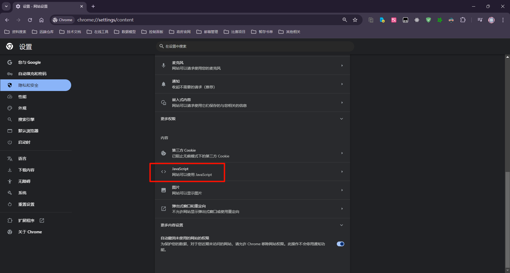
>
>   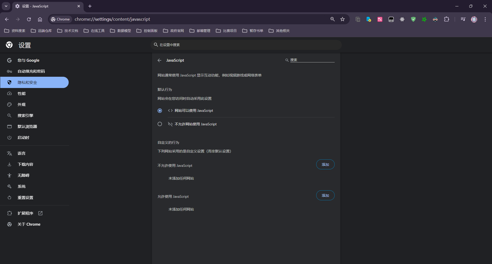
>
>   因此，要想要一个浏览器能运行 `JS` 代码，其本身除了渲染 `HTML` 的标签和 `CSS` 对于的图形设计以外，还需要内置关于 `JS` 的解释器，这个解释器可以被用户所关闭，在有些情况下，可以达到屏蔽广告的效果...

## 2.2.服务器环境

但是上述是早期的 `JS` 环境，尽管也是现在最常用的环境之一，但是现在的 `JS` 可以脱离浏览器环境，而这种技术手段就是 `Node.js`，原本是基于 `Chrome V8` 引擎的 `JS` 的运行时环境。

在这种摘离的基础上，`Node.js` 走上了和 `浏览器 JS` 截然不同的道路，支持事件驱动 `IO` 模型，因此性能比较快，非常适合直接部署在服务端。

>   吐槽：其实就是把浏览器中支持 `JS` 的运行环境单独摘取出来了，这样就可以在任何一个下载了 `Node.js` 的机器中使用 `JS` 代码，这样甚至可以把 `Node.js` 支持的 `JS` 作为服务器使用...

不过本节主要讲浏览器环境的 `JS` 以降低您的学习难度，这里简单提及一下而已。

# 3.JS 使用

## 3.1.JS 引入

和 `CSS` 类似，`JS` 也有三种引入方式。

### 3.1.1.行内 JS

```html
<!-- 行内 JS -->
<!DOCTYPE html>
<html lang="en">
    <head>
        <meta charset="UTF-8">
        <title>行内式 JavaScript 示例</title>
    </head>
    <body>
        <button onclick="alert('Hello, World!')">点击我弹出提示框</button>

    </body>
</html>
```

### 3.1.2.内部 JS

直接写到 `html` 的 `<script>` 内。

```html
<!-- 内部 JS -->
<!DOCTYPE html>
<html lang="en">
    <head>
        <meta charset="UTF-8">
        <title>行内式 JavaScript 示例</title>
    </head>
    <body>
        <button onclick="changeColor()">点击我改变颜色</button>
        <script>
            // 行内式 JavaScript
            function changeColor() {
                // 获取按钮元素
                var button = document.querySelector('button');

                // 生成随机颜色
                var randomColor = '#' + Math.floor(Math.random()*16777215).toString(16);

                // 修改按钮的背景颜色
                button.style.backgroundColor = randomColor;
            }
        </script>
    </body>
</html>
```

### 3.1.3.外部 JS

```html
<!-- 外部 JS -->
<script src=".js文件路径"></script>
```

>   补充：根据 `<script>` 的引入位置或某些关键字的设置有时会有不同的效果。
>
>   1.   放在 `<head>` 标签内可以确保在 `HTML` 文档的内容加载之前执行 `JavaScript` 代码。这通常用于加载外部库、设置全局变量或执行一些初始化操作。
>
>        ```html
>        <!DOCTYPE html>
>        <html>
>        <head>
>            <title>My Web Page</title>
>            <script src="path/to/external/script.js"></script>
>            <script>
>                // JavaScript 代码
>                console.log("Script in head");
>            </script>
>        </head>
>        <body>
>            <h1>Hello, World!</h1>
>        </body>
>        </html>
>        ```
>
>   2.   放在 `<body>` 标签内的内容之前，比较少见，但如果有需要在文档的某个部分之前执行一些脚本，可以选择这种方式。
>
>        ```html
>        <!DOCTYPE html>
>        <html>
>        <head>
>            <title>My Web Page</title>
>        </head>
>        <body>
>            <script>
>                // JavaScript 代码
>                console.log("Script before content");
>            </script>
>            <h1>Hello, World!</h1>
>        </body>
>        </html>
>        ```
>
>   3.   放在 `<body>` 标签内的内容之后是最常见的做法，可以确保 `HTML` 文档内容加载完毕后再执行 `JavaScript` 代码。这有助于避免在页面加载时阻塞渲染，提高页面加载速度和用户体验。
>
>        ```html
>        <!DOCTYPE html>
>        <html>
>        <head>
>            <title>My Web Page</title>
>        </head>
>        <body>
>            <h1>Hello, World!</h1>
>            <script src="path/to/external/script.js"></script>
>            <script>
>                // JavaScript 代码
>                console.log("Script after content");
>            </script>
>        </body>
>        </html>
>        ```
>
>   4.   使用 `defer` 和 `async` 属性这两种属性可以直接控制外部脚本的加载和执行时机。
>
>        (1)`defer` 指定脚本在 `HTML` 文档解析完毕后才执行。适用于需要按顺序加载和执行的脚本。
>
>        ```html
>        <!DOCTYPE html>
>        <html>
>        <head>
>            <title>My Web Page</title>
>            <script src="path/to/external/script.js" defer></script>
>        </head>
>        <body>
>            <h1>Hello, World!</h1>
>        </body>
>        </html>
>        ```
>
>        (2)`async` 指定脚本异步加载并尽快执行，适用于不依赖其他脚本或不影响页面加载的脚本。
>
>        ```html
>        <!DOCTYPE html>
>        <html>
>        <head>
>            <title>My Web Page</title>
>            <script src="path/to/external/script.js" async></script>
>        </head>
>        <body>
>            <h1>Hello, World!</h1>
>        </body>
>        </html>
>        ```
>
>   因此根据自己的需求来调整引入的位置即可...

## 3.2.语法 JS

由于我们暂时只是学习基本语法，因此基本是在浏览器上的控制台进行编程，一是为了熟悉这一测试工具，二是方便您即时操作。唯一需要您注意的是，代码换行需要使用 `[shift+enter]` 来换行，如果直接在控制台中换行就会立刻执行 `JS` 语句。

### 3.2.1.Hello World 程序

我们首先来尝试写一个 `JS` 版本的 `hello world`。

首先，创建一个名为 `hello_world.js` 的 `JavaScript` 文件，并将以下代码写入该文件：

```javascript
// hello_world.js
// 在控制台打印 "Hello, World!"
console.log("Hello, World!");
```

然后，在您的 `HTML` 文件中引入这个 `JavaScript` 文件，并在页面加载时执行它。例如：

```html
<!DOCTYPE html>
<html lang="en">
<head>
    <meta charset="UTF-8">
    <title>Hello World</title>
</head>
<body>
    <!-- 引入外部 JavaScript 文件 -->
    <script src="hello-world.js"></script>
</body>
</html>
```

当您打开包含这个 `HTML` 文件的浏览器时，浏览器会加载并执行 `hello_world.js` 文件，并在控制台中输出 `"Hello, World!"`。

要查看控制台输出，您可以在浏览器中打开开发者工具（通常是按 `F12` 键），然后切换到 `"Console"` 标签页。您将看到 `"Hello, World!"` 字样输出在控制台中。

这个示例展示了如何使用外部 `JavaScript` 文件编写一个简单的 `hello world` 程序，并在浏览器中查看输出结果。


当然，还有其他方式，这种只是在控制台发送文本，也可以直接在控制台编写 `JS` 代码，操控浏览器显示弹框。

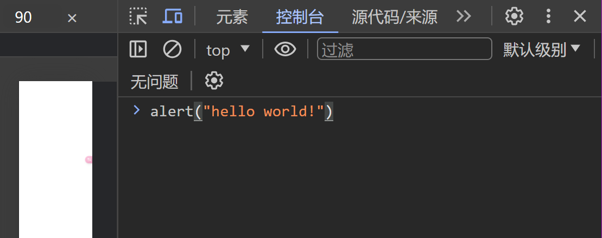


您大概也意识到了，第一种方式实际上从函数名 `console.log()` 上来看理应是一种打印日志的方式，而第二种 `alert()` 实际上就是使用命令行来操控浏览器的一种方式（这意味着我们可以直接在控制台中进行 `JS` 编程）。

### 3.2.2.创建变量

`JS` 变量直接使用关键字 `var` 即可创建，还可以使用 `let` 关键字来定义一个变量（一般使用 `let`），这两种有什么区别呢？

`let` 是后来者，避免了 `var` 的一些缺陷（使用 `let` 是变量的生命周期后作用域和 `java` 基本类似）。

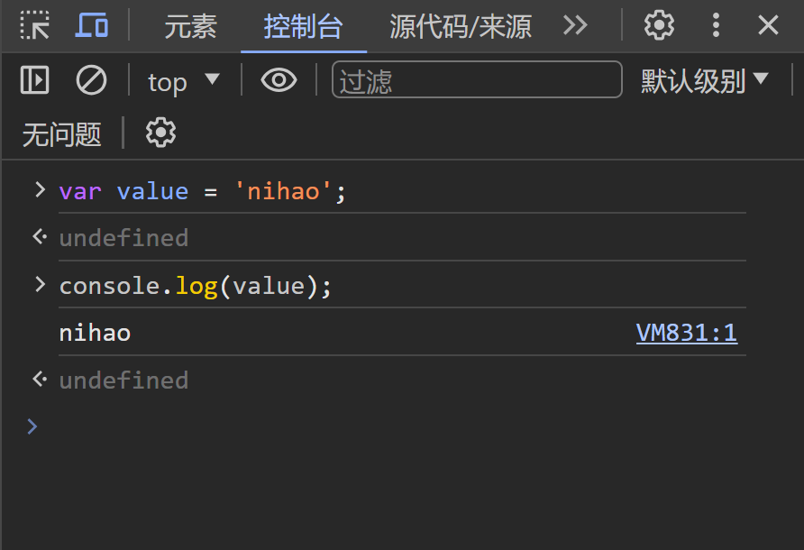

另外，一门语言如果对不同类型的变量之间进行赋值需要强制类型转化等操作，则称为“强类型”，而如果无需顾及直接转化就叫做“弱类型”。

而如果一个变量从定义开始类型就被固定时，就叫“静态类型”，而根据运行逻辑时刻改变类型的就叫“动态类型”。

由此可见 `JS` 是“弱类型、动态类型”的“脚本”语言。


在 `JS` 中，主要类型有以下几种：

1.  **数字 (Number)：** 表示数值，包括整数和浮点数。例如：`10`, `3.14`, `-5`

    另外 `0bdd`、`dd`、`0dd`、`0xdd` 分别表示二进制、十进制、八进制、十六进制。

    而 `JS` 还有表示无穷大 `Infinity` 、无穷小 `-Infinity` 的特殊值。

    还有 `NaN` 表示非数字值。

2.  **字符串 (String)：** 表示文本数据，用单引号 `' '` 或双引号 `" "` 包裹起来。例如：`'Hello'`, `"JavaScript"`。在字符串类型中，也有类似 `C` 语言的转义字符规则，也是为了避免冲突的问题。

    

    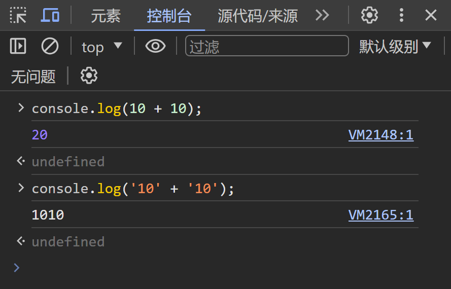

3.  **布尔值 (Boolean)：** 表示逻辑值，只有两个值 `true` 和 `false`，用于条件判断和逻辑运算。如果布尔值参与了运算，就会把 `true/flase` 当作 `1/0` 来计算，但是这样做的场景很少，也应该尽量避免这种场景。

4.  **未定义 (Undefined)：** 表示变量已声明但未赋值，只有一个值 `undefined` 或者访问不存在的属性或变量时返回的值。但是有些比较神奇的是，如果该类型和字符类型拼接也会拼接成一个新字符串。如果和一个数字类型（或者布尔类型）相加，就会得到数字类型中的 `NaN`。

    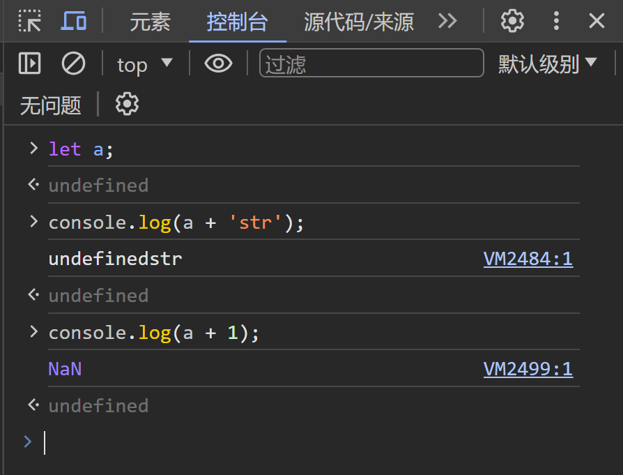

5.  **空值 (Null)：** 表示空值或无值，用关键字 `null` 表示。

    

6.  **Object 对象**：是所有对象的基类，其他所有对象都继承自 `Object` 对象

7.  **符号 (Symbol)：** `ES6` 引入的新类型，表示唯一的标识符，通常用于对象属性的键值。

### 3.2.3.运算符

有了变量类型定义变量，运算基本和 `Java` 类似，唯一不太一样的在于比较运算符。

-   `==、!=`：比较时会进行隐式类型转化
-   `===、!==`：比较时不会进行隐式类型转化

### 3.2.4.控制语句

这些您看看就知道了，不困难。


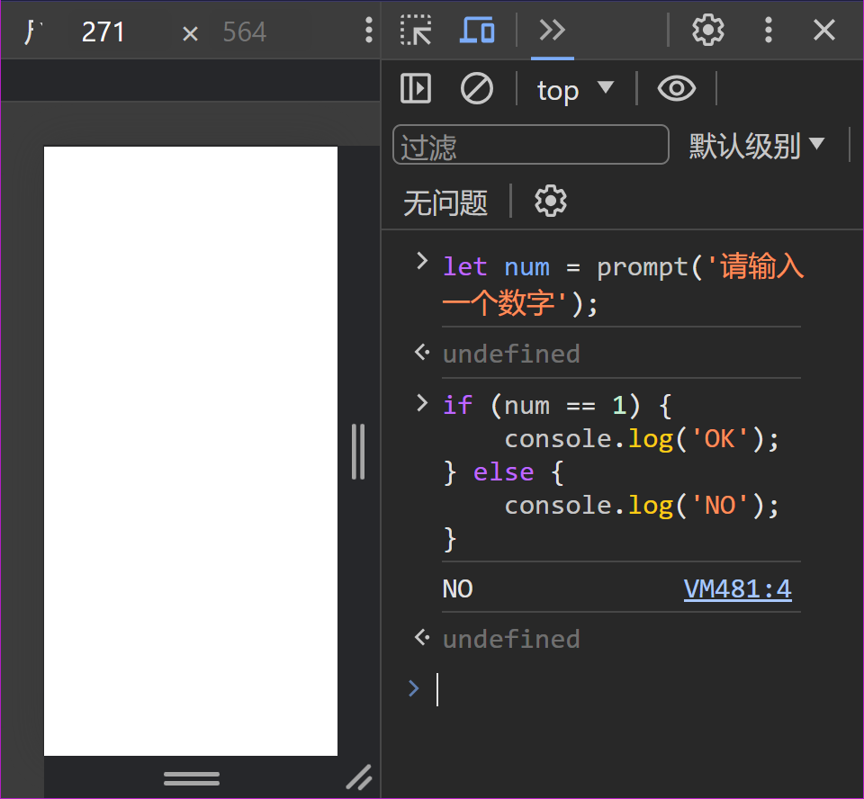

还有 `switch` 语句，都很经典。

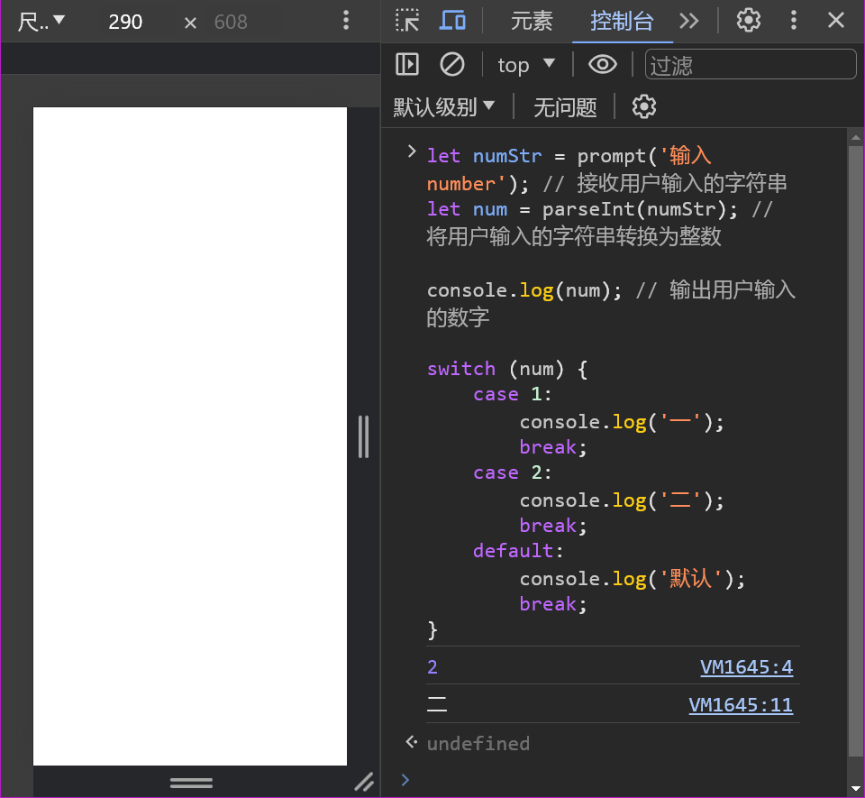

也可以编写循环语句，和 `C` 语言也是类似，并且我们结合调试来运行一个循环代码。


值得注意的是 `for()` 中如果显示定义 `let i` 就会使 `i` 称为局部变量，而不加就会变成全局变量。并且也有 `while()` 循环语句、`break`、`continue`。

>   补充：如果是 `chrome` 浏览器，按 `[esc]` 就可以弹出控制台。

另外，`JS` 还有一个类似循环的 `forEach()` 方法，用于遍历数组中的每个元素，并使用回调函数对每个元素执行指定的操作

```javascript
//使用 forEach()
//创建一个数组
let numbers = [1, 2, 3, 4, 5];

//使用 forEach 方法遍历数组
numbers.forEach(function(item, index, array) {
    console.log(`Item ${item} at index ${index}`);
});
```

在上面的示例中，我们创建了一个包含数字的数组 `numbers`，然后使用 `forEach()` 方法对数组中的每个元素进行遍历。`forEach()` 方法接受一个回调函数作为参数，这个回调函数会在数组中的每个元素上调用一次，参数包括当前元素的值 `item`、当前元素的索引 `index`、正在遍历的数组 `array`。

回调函数可以包含三个参数，也可以只包含一个或两个参数，具体取决于您的需求。

需要注意的是，`forEach()` 方法会在遍历过程中改变原数组中的元素，但它不会改变数组的长度或结构。如果需要对数组进行修改或者生成一个新的数组，可以考虑使用其他数组方法，比如 `map()`、`filter()`、`reduce()` 等。

### 3.2.5.字符串处理

*   `charAt(index)`: 返回指定索引位置的字符。
*   `concat(str1, str2, ...)`：连接两个或多个字符串。
*   `indexOf(searchValue, startIndex)`: 返回指定值在字符串中首次出现的位置。
*   `slice(startIndex, endIndex)`: 提取字符串的一部分。
*   `split(separator, limit)`: 将字符串分割为子字符串数组。
*   `toUpperCase()`: 将字符串转换为大写。
*   `toLowerCase()`: 将字符串转换为小写。
*   `trim()`: 去除字符串两端的空白字符。

### 3.2.6.数组处理函数

*   `new Array(size)`：创建一个大小为 `size` 的数组（初始值为空），需要注意 `JS` 的数组是忽略类型的，可以放入多种类型的元素。还有一种创建方法，直接使用 `[]` 来创建。元素索引也是从 `0` 开始，这点和很多语言都一样。创建出来的数组可以使用 `length` 属性进行修改

*   `push(element1, element2, ...)`：向数组末尾添加一个或多个元素。

*   `pop()`: 移除并返回数组的最后一个元素。

*   `shift()`: 移除并返回数组的第一个元素。

*   `splice(start, number_of_values)`: 删除数组中从 `start` 下标开始的 `number_of_values` 个元素

*   `unshift(element1, element2, ...)`：向数组开头添加一个或多个元素。

*   `join(separator)`: 将数组元素连接成一个字符串，使用指定的分隔符。

*   `concat(array1, array2, ...)`：连接两个或多个数组。

*   `slice(startIndex, endIndex)`: 提取数组的一部分。

*   `indexOf(searchElement, startIndex)`: 返回指定元素在数组中首次出现的位置。

*   `includes(element, startIndex)`: 判断数组是否包含指定元素。

*   `sort(compareFunction)`: 对数组元素进行排序，后面可以加上类似回调函数的参数，后续会接受 `=>` 语法糖制作的回调函数

*   `reverse()`: 反转数组元素的顺序。

    >   补充：另外，如果索引越界的话，`JS` 不会报错，而是返回一个 `undefined` 值。并且不要直接给数组名赋值，否者数组就会被清空，这是因为 `JS` 是动态类型的。

### 3.2.7.IO 函数

(1)**输入函数**：

- `prompt(message, defaultValue)`: 在浏览器中弹出一个对话框，提示用户输入信息，并返回用户输入的字符串。可以指定一个默认值。
- `confirm(message)`: 在浏览器中弹出一个确认对话框，提示用户确认或取消操作，并返回一个布尔值（true 表示确认，false 表示取消）。
- `alert(message)`: 在浏览器中弹出一个警告对话框，显示指定的消息。

(2)**输出函数**：

- `console.log(value1, value2, ...)`: 在浏览器的控制台输出一条消息，可以输出多个值。

- `console.warn(value)`: 在控制台输出警告消息，通常用于提示开发者注意。

- `console.error(value)`: 在控制台输出错误消息，用于指示出现的错误。

- `document.write(content)`: 将指定的内容写入到 `HTML` 文档中，可以在页面加载时直接显示内容。

    >   注意：`document.write()` 在实际开发中不常用，因为会直接修改 `HTML` 文档导致不可预料的结果和性能问题，推荐使用 `DOM` 操作来动态更新页面内容。

### 3.2.8.数学函数

*   `Math.abs(x)`: 返回数的绝对值。
*   `Math.ceil(x)`: 返回大于或等于给定数字的最小整数。
*   `Math.floor(x)`: 返回小于或等于给定数字的最大整数。
*   `Math.round(x)`: 返回最接近给定数字的整数。
*   `Math.max(num1, num2, ...)`：返回一组数中的最大值。
*   `Math.min(num1, num2, ...)`：返回一组数中的最小值。
*   `Math.random()`: 返回一个介于 0（包括）到 1（不包括）之间的随机数。

### 3.2.9.时间函数

*   `new Date()`: 创建一个表示当前时间的 Date 对象。
*   `getFullYear()`: 获取年份。
*   `getMonth()`: 获取月份（0-11）。
*   `getDate()`: 获取月份中的某一天（1-31）。
*   `getDay()`: 获取星期几（0-6，0 表示星期日）。
*   `getHours()`: 获取小时数（0-23）。
*   `getMinutes()`: 获取分钟数（0-59）。
*   `getSeconds()`: 获取秒数（0-59）。
*   `getTime()`: 获取时间戳。
*   `toISOString()`: 将日期对象转换为 `ISO` 格式的字符串。

### 3.2.10.定义函数

`JS` 的函数直接使用 `function` 关键字来声明，有如下格式：

```js
//JS 函数声明格式
function 函数名(形参列表) {
    函数体;
    return 返回值; //是否需要写返回值根据需要
}
```

`JS` 的函数参数不一定需要完全匹配才能调用，会尽可能进行匹配，但是最好还是完全匹配为好。

函数还可以作为匿名函数存在，也叫做函数表达式，匿名函数本身也可以用一个变量存储，调用变量就是在调用匿名函数。

因此也可以作为其他函数的返回值或参数。

```js
//函数表达式
let result = function () {
    console.log(arguments)
    ret = 0;
    for (i = 0; i <= 100; i++)
        ret += 1;
    return ret;
}

console.log(result(1, 2, 3));
```


### 3.2.11.作用域

在 `ES6` 标准之前，作用域主要分为两个：

-   全局作用域：在函数外定义，整个 `<script>` 或 `.js` 文件中都可以生效
-   局部作用域：在函数内定义，只在函数内部生效

>   注意：如果一个变量既不使用 `let` 也不使用 `var` 定义，就会是一个全局变量，否则就是一个局部变量。

`JS` 还有一个很神奇的地方，函数可以定义在另外一个函数的内部，内函数可以访问外函数的变量，采取链式查找的方式从内到外依次进行查找。

```js
//JS 函数嵌套定义
let num = 1;
console.log(num);
function test1() {
    let num = 2;
    console.log(num);
    function test2() {
        let num = 3;
        console.log(num);
    }
    test2();
}
test1();
```


### 3.2.12.面向对象

在 `JS` 的 `ES6` 之前没有 `class` 的概念，但是依旧可以使用 `{}` 来创建对象，在 `ES6` 后可以使用 `Object` 和 `class`。

```js
//创建单对象（第一种）
let student = {
    name: 'limou',
    height: '164',
    weight: '104',
    say_hello: function () {
        console.log('hello');
    }
}

console.log(student.name)
console.log(student['height'], student['weight'])
student.say_hello(); //注意加上括号
```

```js
//创建单对象（第二种）
let student = new Object();
student.name = 'limou',
student.height = '164',
student.weight = '104',
student.say_hello = function () {
    console.log('hello');
}

console.log(student.name)
console.log(student['height'], student['weight'])
student.say_hello(); //注意加上括号
```

```cpp
//构造函数构造多对象
function People(name, height, weight) {
    this.name = name;
    this.height = height;
    this.weight = weight;
    this.say_hello = function () {
        console.log('hello');
    }
}

let p1 = new People('limou', 164, 104);
console.log(p1.name)
console.log(p1['height'], p1['weight'])
p1.say_hello();

let p2 = new People('dimou', 154, 98);
console.log(p2.name)
console.log(p2['height'], p2['weight'])
p2.say_hello();
```

`JS` 对象不区分属性和方法，两者的使用几乎是等价的。`JS` 对象没有 `private/public` 和继承（但是有类似的“原型”）。

但在 `ES6` 有了 `class` 后，就有一些面向对象的特性，但是不够全。

```js
//使用 class 关键字
//定义一个名为 Person 的类
class Person {
    //构造函数，在创建类的实例时会被调用
    constructor(name, age) {
        this.name = name;
        this.age = age;
    }

    //类的方法
    sayHello() {
        console.log(`Hello, my name is ${this.name} and I'm ${this.age} years old.`); //模板字面量，使用反引号 `` 括起
    }
}

//创建 Person 类的实例
let person1 = new Person('Alice', 30);
let person2 = new Person('Bob', 25);

//调用实例的方法
person1.sayHello(); //输出：Hello, my name is Alice and I'm 30 years old.
person2.sayHello(); //输出：Hello, my name is Bob and I'm 25 years old.
```

例如 `__proto__` 关键字，可以指向另外一个对象，让本对象拥有和指向对象一样的属性和方法。

```js
//使用 __proto__
//定义一个对象
const animal = {
  type: 'mammal',
  sound: 'roar'
};

//定义一个新对象，使用 animal 对象作为原型
const lion = {
  name: 'Simba',
  __proto__: animal //使用 __proto__ 设置 lion 对象的原型为 animal
};

//访问 lion 对象的属性
console.log(lion.name); //输出：Simba
console.log(lion.type); //输出：mammal
console.log(lion.sound); //输出：roar

//使用 Object.getPrototypeOf() 获取对象的原型
const lionPrototype = Object.getPrototypeOf(lion);
console.log(lionPrototype === animal); //输出：true，lion 的原型是 animal
```

当然，现在的标准下也有类继承的概念。

```js
//类继承
//定义一个父类
class Animal {
    constructor(name) {
        this.name = name;
    }

    speak() {
        console.log(`${this.name} makes a sound.`);
    }
}

//定义一个子类继承自 Animal 父类
class Dog extends Animal {
    constructor(name, breed) {
        super(name); //调用父类的构造函数
        this.breed = breed;
    }

    //子类的方法，覆盖父类的方法
    speak() {
        console.log(`${this.name} barks.`);
    }

    //子类特有的方法
    fetch() {
        console.log(`${this.name} fetches the ball.`);
    }
}

//创建子类的实例
let dog = new Dog('Buddy', 'Golden Retriever');

//调用子类的方法
dog.speak(); //输出：Buddy barks.
dog.fetch();输出：Buddy fetches the ball.

//调用继承自父类的方法
dog.speak(); //输出：Buddy makes a sound.
```

### 3.2.13.静态成员

静态成员也是属于类的，可以在类中使用 `static` 定义。

```js
//使用静态成员
//使用 class 关键字
//定义一个名为 Person 的类
class Person {
    static number_of_person = 0;

    //构造函数，在创建类的实例时会被调用
    constructor(name, age) {
        this.name = name;
        this.age = age;
        Person.number_of_person += 1;
    }

    //类的方法
    SayHello() {
        console.log(`Hello, my name is ${this.name} and I'm ${this.age} years old.`); //模板字面量，使用反引号 `` 括起
    }

    static Size() {
        return Person.number_of_person; 
    }
}

//创建 Person 类的实例
let person1 = new Person('Alice', 30).SayHello();
let person2 = new Person('Bob', 25).SayHello();
console.log(Person.number_of_person);
console.log(Person.Size());
```

由于静态成员不属于对象而属于类，因此不能通过对象来直接访问静态成员。

### 3.2.14.导出导入

一个 `JS` 文件可以作为一个整体，也就是模块来存在。而 `export` 声明则用于从 `JS` 模块中导出值。导出的值可通过  `声明 import` 或 `动态导入 import()` 来将其导入到其他程序。

要在源文件中使用 `export` 声明，运行时就必须将该被导入文件解释为 **模块**。可以在 `HTML` 中通过 `type="module"` 或由其他模块导入来实现，模块会自动以严格模式进行解释。

这里演示一个最简单的例子。

```js
// module.js
const myFunction = () => {
    console.log('Hello, world!');
};

export default myFunction;

```

```js
// main.js
import myFunction from './module.js'; // 不需要大括号，名称可以随意

myFunction(); // 输出 'Hello, world!'

```

```html
<!-- test.html -->
<!DOCTYPE html>
<html lang="en">
<head>
    <meta charset="UTF-8">
    <meta name="viewport" content="width=device-width, initial-scale=1.0">
    
    <!-- 使用其他 JS 文件导入-->
    <script type="module" src="./main.js"></script>
    
    <title>Document</title>
</head>
<body>

</body>
</html>

```

>   补充：当您使用 `type="module"` 时，浏览器会理解文件作为 `ES6` 模块，并处理其中的 `import` 和 `export`，这样的引入也能避免重复包含。

上述例子演示的只是最简单的默认导出模式，但是其实 `JS` 模块还有一种导出方式，也就是命名导出模式，并且导出的东西可以是任意 `JS` 对象。

```js
// module1.js

// 命名导出
export const string = 'Hello from named export!';

```

```js
// module2.js
import { string } from "./module1.js";

// 默认导出
const myFunction = () => {
    console.log('Hello from default export!');
};
export default myFunction;

// 命名导出
export const greet = () => {
    console.log(string);
};

```

```js
// main.js
import aMyFunction, { greet } from './module2.js'; // 从 module.js 中导入默认导出和命名导出, 默认导出的名字可以任意重命名, 但是命名导出的名字必须完全一样

// 使用导入的函数
aMyFunction();
greet();

```

```js
<!-- test.html -->
<!DOCTYPE html>
<html lang="en">
<head>
    <meta charset="UTF-8">
    <meta name="viewport" content="width=device-width, initial-scale=1.0">
    <title>Document</title>
    <script type="module" src="./main.js"></script>
</head>
<body>
</body>
</html>

```

这样浏览器就可以正常使用模块中的数据和函数来进行打印了。

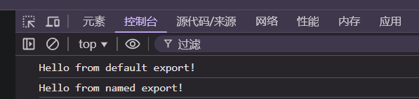

>   补充：更加详细的导入导出语法可以[前往 MMDN 查看 export 部分](https://developer.mozilla.org/zh-CN/docs/Web/JavaScript/Reference/Statements/export)。

## 3.3.DOMAPI

>   补充：[DOMAPI 相关文档](https://www.w3school.com.cn/js/js_htmldom.asp)

`DOMAPI`（`Document Object Model API`）是一组用于操作网页文档结构的接口和方法。通过 `DOMAPI`，开发者可以使用 `JavaScript` 来访问、操作和修改网页中的 `HTML` 元素、属性和内容，实现动态交互和内容更新等功能。

该 `API` 使用 `DOM` 树来完成对页面的操控，只需要获取到对于的元素，就可以通过一系列方法和属性对元素进行操作。


上述节点中展示了元素节点、属性节点、文本节点，每种节点都要对应的代号（还有其他的节点）：

1.  **元素节点（Element Node）：** 表示 `HTML` 中的标签元素，如 `<div>、<p>、<span>` 等，编号为 `1`。
2.  **属性节点（Attribute Node）：** 表示元素节点的属性，如 `id、class、src` 等，编号为 `2`。
3.  **文本节点（Text Node）：** 表示元素节点内的文本内容，即标签中的文字内容，编号为 `3`。
4.  **注释节点（Comment Node）：** 表示 HTML 中的注释，如 `<!-- 注释内容 -->`，编号为 `8`。

而我们的操作的主要对象如下：

-   `document`：文档对象
-   `element`：元素对象
-   `event`：事件对象

### 3.3.1.文档对象

>   补充：[关于文档对象的文档](https://www.w3school.com.cn/jsref/dom_obj_document.asp)。

#### 3.3.1.1.获取文档中的元素对象

| 方法                                                        | 描述                                                         |
| :---------------------------------------------------------- | :----------------------------------------------------------- |
| `document.getElementsByTagName(元素标签名)`                 | 通过标签名来查找元素。                                       |
| `document.getElementById(元素id名)`                         | 通过元素 `id` 来查找元素。                                   |
| `document.getElementsByClassName(类名)`                     | 通过类名来查找元素。                                         |
| `document.querySelector()` 和 `document.querySelectorAll()` | 使用 `CSS` 选择器来获取匹配的元素，`querySelector()` 返回匹配的第一个元素，`querySelectorAll()` 返回所有匹配的元素。 |

其中最后一种使用 `CSS` 的方法更为强大，可以替代前面三个方法。并且，这些方法可以使用链式的调用，例如 `document.querySelector('.class1').querySelector('.class2').querySelector('.class3')`。

也可以将所有方法混合在一起链式调用。

#### 3.3.1.2.设置文档中的元素对象

| 方法                                                         | 描述                                                         |
| :----------------------------------------------------------- | :----------------------------------------------------------- |
| `document.createElement(tagName[, options])`                 | 创建 `HTML` 元素，最后一个参数可以在创建元素的同时直接设置元素的属性和事件...当然，可以在创建完后在进行设置。 |
| `parent_element.appendChild(new_element)`                    | 在 `parent_element` 中最后一个孩子之后添加 `HTML` 元素。     |
| `parent_element.insertBefore(new_element, reference_element)` | 在 `parent_element` 中 `reference_element` 节点前添加 `HTML` 元素。 |
| `element.removeChild(element)`                               | 删除 `HTML` 元素，但是在内存中还存有，其返回值可以被重新作为一个节点插入进来。 |
| `element.replaceChild(element)`                              | 替换 `HTML` 元素。                                           |
| `document.write(HTML代码)`                                   | 写入 `HTML` 输出流，如果在页面加载完毕后再使用 `document.write`，它将会覆盖整个文档内容。 |

直接给一个使用例子：

```html
<!DOCTYPE html>
<html lang="en">
<head>
    <meta charset="UTF-8">
    <meta name="viewport" content="width=device-width, initial-scale=1.0">
    <title>DOM操作示例</title>
</head>
<body>
    <div id="container">
        <!-- 这里是容器 -->
    </div>

    <script>
        //创建一个新的 div 元素，并设置一些属性
        var newDiv = document.createElement('div');
        newDiv.textContent = '这是新创建的 div 元素';
        newDiv.style.color = 'blue';

        //获取容器元素
        var container = document.getElementById('container');

        //在容器中添加新创建的 div 元素
        container.appendChild(newDiv);

        //创建一个新的 p 元素，并设置一些属性
        var newParagraph = document.createElement('p');
        newParagraph.textContent = '这是新创建的 p 元素';
        newParagraph.style.fontWeight = 'bold';

        //在容器中新创建的 div 元素之前添加新创建的 p 元素
        container.insertBefore(newParagraph, newDiv);

        //删除新创建的 div 元素
        setTimeout(function() {
            container.removeChild(newDiv);
        }, 3000);

        //替换新创建的 p 元素
        setTimeout(function() {
            var replacementParagraph = document.createElement('p');
            replacementParagraph.textContent = '这是替换后的 p 元素';
            replacementParagraph.style.color = 'green';
            container.replaceChild(replacementParagraph, newParagraph);
        }, 5000);

        //写入 HTML 输出流，覆盖整个文档内容
        setTimeout(function() {
            document.write('<h1>这是使用 document.write 写入的标题</h1>');
        }, 7000);
    </script>
</body>
</html>

```

如果一个新创建的节点被多次任意插入，就只有最后一次会生效（相当于把元素进行了移动），并且，如果一个节点插入完毕，再次针对该节点的属性等进行修改，也会同步到 `DOM` 树种。

### 3.3.2.元素对象

在 `HTML DOM` 中，`Element` 对象代表 `HTML` 元素，如 `P、DIV、A、TABLE` 或任何其他 `HTML` 元素。

>   补充：[关于元素对象的文档](https://www.w3school.com.cn/jsref/dom_obj_all.asp)。

| 属性                   | 描述                                                         |
| ---------------------- | ------------------------------------------------------------ |
| `element.id`           | 返回元素的 `id` 属性值。                                     |
| `element.className`    | 返回元素的类名（字符串），包含了所有类名，多个类名之间用空格分隔。如果有内部和外部引入的 `CSS` 可以用这个属性进行 `CSS` 样式替换。 |
| `element.classList`    | 返回一个 `DOMTokenList` 对象，包含了元素的所有类名，可以用来操作元素的类名。 |
| `element.tagName`      | 返回元素的标签名，以大写形式表示。                           |
| `element.innerHTML`    | 返回元素的 `HTML` 内容，包括所有子元素和文本。               |
| `element.textContent`  | 返回元素的文本内容，不包括任何 `HTML` 标签。                 |
| `element.style`        | 返回一个 `CSSStyleDeclaration` 对象，包含了元素的所有样式属性。想要修改的话可以使用 `element.style.属性名 = 属性值` 或 `element.style.cssText = [属性名: 属性值; ...]`，但是这种修改只适用于行内引入的 `CSS` |
| `element.parentNode`   | 返回元素的父节点。                                           |
| `element.children`     | 返回一个 `HTMLCollection` 对象，包含了元素的所有子元素节点。 |
| `element.attributes`   | 返回一个 `NamedNodeMap` 对象，包含了元素的所有属性节点。     |
| `element.dataset`      | 返回一个 `DOMStringMap` 对象，包含了元素的所有自定义数据属性。 |
| `element.offsetWidth`  | 返回元素的宽度和高度，包括边框、内边距和滚动条。             |
| `element.offsetHeight` | 返回元素的宽度和高度，包括边框、内边距和滚动条。             |

上述属性既可以获取也可以获取后进行修改，不过一般使用 `element.setAttribute(属性名, value)` 改变 `HTML` 元素的属性值。

使用 `element.getAttribute(attributeName)` 获取属性的具体值。

而针对一个元素对象可以通过 `parentNode` 和 `childNodes` 来遍历其父子元素对象，进一步获取其对应的节点：

```html
<!-- 获得元素的父子元素 -->
<!DOCTYPE html>
<html lang="en">
<head>
    <meta charset="UTF-8">
    <meta name="viewport" content="width=device-width, initial-scale=1.0">
    <title>parentNode 和 childNodes 示例</title>
</head>
<body>
    <div id="parent">
        <p>Paragraph 1</p>
        <p>Paragraph 2</p>
        <p>Paragraph 3</p>
    </div>

    <script>
        //获取父节点
        let parentElement = document.getElementById('parent'); //就是 div
        let parent = parentElement.parentNode; //就是 body
        console.log('父节点:', parent);

        //获取子节点列表
        let childNodesList = parentElement.childNodes; //就是所有的 p 标签
        console.log('子节点列表:', childNodesList);

        //遍历子节点列表
        childNodesList.forEach(function(node) {
            if (node.nodeType === 1) { //过滤元素节点
                console.log('子节点:', node);
            }
        });
    </script>
</body>
</html>

```

使用 `console.dir(元素对象)` 就可以显示出一个元素对象所有的属性。

### 3.3.3.事件对象

>   补充：[关于事件对象的文档](https://www.w3school.com.cn/jsref/dom_obj_event.asp)。

这里的事件就是用户对页面的一些操作事件（点击、选择、修改...），这些事件都可以被 `JS` 获取得到，进行进一步的交互操作。

所有事件对象均基于 `Event` 对象，并继承其所有属性和方法。

#### 3.3.3.1.事件三要素

对于事件，需要知道三个基本要素：

-   事件源：哪一个元素触发？

-   事件类型：用户是点击、选中、修改？

-   事件处理程序：发现这个事件后，`JS` 需要怎么处理？

-   事件处理过程：在 `DOM` 中，事件传播（`event propagation`）分为三个阶段，当一个事件发生时，它会经过这三个阶段，然后由具体的目标元素上的事件处理函数来处理。

    (1)**捕获阶段（capturing phase）**：事件从根节点向目标元素传播的阶段。在捕获阶段，事件首先被触发在最外层的父级元素，然后逐级向下，直到目标元素。

    (2)**目标阶段（target phase）**：事件达到目标元素时触发的阶段。事件在目标元素上触发，然后停止传播。

    (3)**冒泡阶段（bubbling phase）**：事件从目标元素向根节点传播的阶段。在冒泡阶段，事件从目标元素开始，逐级向上直到根节点。

#### 3.3.3.2.事件的绑定

使用 `元素对象.addEventListener()` 可以向元素添加事件监听器，它接受三个参数：

1.  **事件类型（event）：** 要监听的事件类型，例如 `"click"、"mouseover"、"keydown"` 等。
2.  **事件处理函数（listener）：** 当事件被触发时要执行的函数，也称为事件处理程序。
3.  **是否使用捕获（capture）：** 一个可选的布尔值参数，表示事件是在捕获阶段还是冒泡阶段执行。默认为 `false`，表示在冒泡阶段执行事件处理函数；如果设置为 `true`，则在捕获阶段执行事件处理函数。

```javascript
element.addEventListener(event, listener, capture);
```

而 `元素对象.removeEventListener()` 则用于给元素添加或移除事件监听器，实现对用户交互的响应。

>   补充：我们可以顺表演示一下事件传播的三个阶段
>
>   ```html
>   <!-- 事件传播的三个阶段 -->
>   <!DOCTYPE html>
>   <html lang="en">
>   <head>
>       <meta charset="UTF-8">
>       <meta name="viewport" content="width=device-width, initial-scale=1.0">
>       <title>Event Propagation Demo</title>
>   </head>
>   <body>
>       <div id="parent-div">
>           <div id="child-div">
>               <div id="grandchild-div">Click me</div>
>           </div>
>       </div>
>   
>       <script>
>           let parentDiv = document.getElementById('parent-div');
>           let childDiv = document.getElementById('child-div');
>           let grandchildDiv = document.getElementById('grandchild-div');
>   
>           parentDiv.addEventListener('click', function() {
>               console.log('Capturing Phase: Parent Div');
>           }, true);
>   
>           childDiv.addEventListener('click', function() {
>               console.log('Capturing Phase: Child Div');
>           }, true);
>   
>           grandchildDiv.addEventListener('click', function() {
>               console.log('Capturing Phase: Grandchild Div');
>           }, true);
>   
>           grandchildDiv.addEventListener('click', function() {
>               console.log('Target Phase: Grandchild Div');
>           });
>   
>           childDiv.addEventListener('click', function() {
>               console.log('Bubbling Phase: Child Div');
>           });
>   
>           parentDiv.addEventListener('click', function() {
>               console.log('Bubbling Phase: Parent Div');
>           });
>       </script>
>   </body>
>   </html>
>   ```

在 `JS` 中添加事件可以通过以下几种方式来实现：

1. **直接在 HTML 元素中添加事件属性**：可以直接在 `HTML` 元素的标签中使用事件属性来添加事件，例如 `onclick`、`onmouseover`、`onsubmit` 等。

   ```html
   <button onclick="myFunction()">Click me</button>
   
   <script>
       function myFunction() {
           alert('Button clicked!');
       }
   </script>
   ```

   ```html
   <button>Click me</button>
   
   <script>
       let button = document.querySelector('button');
       button.onclick = function() {
           alert('Button clicked!');
       }
   </script>
   ```

2. **使用 DOM 事件监听器：** 可以使用 `DOM` 的事件监听器来添加事件，这种方式更灵活，可以在 `JS` 中动态添加和移除事件监听器。

   ```javascript
   let button = document.querySelector('button');
   
   button.addEventListener('click', function() {
       alert('Button clicked!');
   });
   ```

   或者可以定义一个事件处理函数，然后将该函数作为事件监听器添加到元素上。

   ```javascript
   function handleClick() {
       alert('Button clicked!');
   }
   
   let button = document.querySelector('button');
   button.addEventListener('click', handleClick);
   ```

3. **使用事件委托**：可以将事件监听器添加到父元素上，并使用事件委托（`event delegation`）来处理子元素的事件。

   ```html
   <!DOCTYPE html>
   <html lang="en">
   <head>
       <meta charset="UTF-8">
       <meta name="viewport" content="width=device-width, initial-scale=1.0">
       <title>Document</title>
   </head>
   <body>
       <ul id="parent-list">
           <p>Items: </p>
           <li>Item 1</li>
           <li>Item 2</li>
           <li>Item 3</li>
       </ul>
       
       <script>
           let parentList = document.getElementById('parent-list');
       
           parentList.addEventListener('click', function(event) {
               if (event.target.tagName.toLowerCase() === 'li') {
                   alert('Clicked on ' + event.target.textContent);
               }
           });
       </script>
   </body>
   </html>
   ```

以上是几种常见的添加事件的方式，具体选择哪种方式取决于你的需求和代码结构。通常推荐使用 `DOM` 事件监听器的方式来添加事件，因为它更加灵活且易于维护。

我们还可以在回调函数中使用全局对象 `event` 获取事件的信息，比如事件类型、事件目标、鼠标位置、键盘代码等。

```javascript
<!DOCTYPE html>
<html lang="en">
<head>
    <meta charset="UTF-8">
    <meta name="viewport" content="width=device-width, initial-scale=1.0">
    <title>根据键盘代码得到对应大小写字符</title>
</head>
<body>
    <label for="keyCodeInput">键盘代码:</label>
    <input type="text" id="keyCodeInput">

    <p id="characterOutput"></p>

    <script>
        const keyCodeInput = document.getElementById('keyCodeInput');
        const characterOutput = document.getElementById('characterOutput');

        keyCodeInput.addEventListener('keydown', function(event) {
            let keyCode = event.keyCode;
            let character = '';

            if (keyCode >= 65 && keyCode <= 90) { // 大写字母
                if (event.shiftKey) {
                    character = String.fromCharCode(keyCode);
                } else {
                    character = String.fromCharCode(keyCode + 32); // 转换为小写字母
                }
            } else if (keyCode >= 97 && keyCode <= 122) { // 小写字母
                if (event.shiftKey) {
                    character = String.fromCharCode(keyCode - 32); // 转换为大写字母
                } else {
                    character = String.fromCharCode(keyCode);
                }
            } else {
                character = '无效键盘代码';
            }

            characterOutput.textContent = `对应字符: ${character}`;
        });
    </script>
</body>
</html>
```

>   补充：作为元素的属性来设置事件和使用 `addEventListener()` 事件时，可能会产生不同但类似的设置
>
>   1.  使用 `addEventListener` 方法：这是一种现代的、推荐的添加事件监听器的方式。您可以通过 `addEventListener` 方法将事件监听器绑定到元素上，语法如下：
>
>       ```javascript
>       element.addEventListener('event', listener);
>       ```
>
>       这里的 `'event'` 是事件类型，比如 `'click'`、`'keydown'`、`'keyup'`、`'keypress'` 等，`listener` 则是事件处理函数。
>
>   2.  直接赋值属性：这是一种较为传统的添加事件监听器的方式，您可以直接将事件处理函数赋值给元素的事件属性，例如：
>
>       ```javascript
>       element.onkeypress = function(event) { /* 处理事件的代码 */ };
>       ```

猜数字、表白墙、代办事项的例子：

```html
<!-- 猜数字 -->
<!DOCTYPE html>
<html lang="en">
<head>
    <meta charset="UTF-8">
    <meta name="viewport" content="width=device-width, initial-scale=1.0">
    <title>Document</title>
    <style>
        .false {
            color: red;
        }
        .true {
            color: blue;
        }
    </style>
</head>
<body>        
    <input class="reset_button" type="button" value="重新开始一局游戏" onclick="ReSet()"><br>
    输入数字: <input class="to_guess_num" type=" text"> <input type="button" value="猜" onclick="Guess()"><br>
    次数: <span class="has_guess_num">0</span><br>
    结果: <span class="result"></span>
</body>
    <script>
        let to_guess_num_element = document.querySelector('.to_guess_num');
        let input_num_element = document.querySelector('.has_guess_num');
        let result_element = document.querySelector('.result');

        function ReSet() {
            to_guess_num_element.value = 0;
            input_num_element.innerHTML = 0;
            result_element.innerHTML = "";
        }

        let num = Math.floor(Math.random() * 100) + 1; //1-100
        console.log(num);

        function Guess() {
            input_num_element.innerHTML = parseInt(input_num_element.innerHTML) + 1;
            if(num < parseInt(to_guess_num_element.value)) {
                result_element.innerHTML = "大了";
                result_element.className = "false";
            } else if(num > parseInt(to_guess_num_element.value)) {
                result_element.innerHTML = "小了";
                result_element.className = "false";
            } else {
                result_element.innerHTML = "正确";
                result_element.className = "true";
            }
        }
    </script>
</html>
```

```html
<!-- 表白墙 -->
<!DOCTYPE html>
<html lang="en">
<head>
    <meta charset="UTF-8">
    <meta name="viewport" content="width=device-width, initial-scale=1.0">
    <title>Document</title>
</head>
<body>
    <div class="container">
        <h1>表白墙</h1>
        <p>输入相关信息后点击提交</p>

        <div class="input-group">
        <span>谁: </span><input type="text" class="edit">
        </div>
    
        <div class="input-group">
        <span>对谁:</span> <input type="text" class="edit">
        </div>
    
        <div class="input-group">
        <span>说:</span> <input type="text" class="edit">
        </div>
        
        <div class="input-group">
        <input type="button" value="提交" class="submit" onclick="Submit()">
        </div>
    </div>
</body>
<style>
    * {
        margin: 0px;
        padding: 0px;
    }
    .container {
        width:400px;
        margin:0 auto;
    }
    h1 {
        text-align: center;
        margin-bottom: 40px;
    }
    p {
        text-align: center;
        color: gray;
        line-height: 60px;
    }
    .input-group {
        display: flex;
        justify-content: center;
        align-items: center;
    }
    .edit {
        margin-bottom: 20px;
        width: 200px; 
        height: 30px;
    }
    span {
        width: 50px;
        height: 40px;
    }
    .submit {
        background-color: rgb(207, 148, 37);
        color: white;
        width: 260px;
        height: 30px;
        border: none;
        border-radius: 5px;
    }
    .submit:active {
        background-color: gray;
    }
</style>
<script>
    function Submit() {
        let edits = document.querySelectorAll('.edit');
        let from = edits[0].value;
        let to = edits[1].value;
        let message = edits[2].value;
        console.log(from + " " + to + " " + message);

        let div = document.createElement('div');
        div.className = 'input-group';
        div.innerHTML = from + " " + to + " " + message
        let container = document.querySelector('.container');
        container.appendChild(div);
    }
</script>
</html>
```

## 3.4.BOMAPI

BOM 提供了与浏览器窗口和控制浏览器的功能，允许开发人员操作浏览器窗口、处理浏览器历史记录、与浏览器地址栏进行交互等。

**`window` 对象**：

*   `window.alert()`: 显示一个警告框
*   `window.confirm()`: 显示一个确认框，返回 `true` 或 `false`
*   `window.prompt()`: 显示一个提示框，返回用户输入的值
*   `window.open()`: 打开一个新的浏览器窗口
*   `window.close()`: 关闭当前窗口
*   `window.setTimeout()`: 设置一个定时器，定时器到期后执行指定的代码
*   `window.setInterval()`: 设置一个间隔定时器，每隔指定时间执行一次指定的代码

**`navigator` 对象**：

*   `navigator.userAgent`: 返回用户代理字符串，包含浏览器信息
*   `navigator.language`: 返回用户的语言设置
*   `navigator.onLine`: 返回一个布尔值，表示浏览器是否处于在线状态
*   `navigator.geolocation`: 访问用户的地理位置

**`location` 对象**：

*   `location.href`: 获取或设置当前 URL
*   `location.reload()`: 重新加载当前页面
*   `location.assign()`: 加载新的文档
*   `location.replace()`: 用新的 URL 替换当前 URL

**`history` 对象**：

*   `history.back()`: 加载历史列表中的前一个 URL
*   `history.forward()`: 加载历史列表中的下一个 URL
*   `history.go()`: 加载历史列表中的某个具体页面，相对于当前页面的位置

**`screen` 对象**：

*   `screen.width`: 返回屏幕的宽度
*   `screen.height`: 返回屏幕的高度
*   `screen.availWidth`: 返回屏幕的可用宽度
*   `screen.availHeight`: 返回屏幕的可用高度

# 4.JS 插件

油猴脚本...待补充...

# 5.JS 调试

`JS` 代码在浏览器中可以进行调试，这在之前就介绍过了。


