>   前腰：本文只是概括重要的 `html` 标签，这些标签的使用频率较高，更多标签相关的资源您可以跳转 [Mmdn](https://developer.mozilla.org/zh-CN/docs/Glossary/HTML) 进行深入的学习。

# 1.HTML 概念

就其核心而言，[HTML](https://developer.mozilla.org/zh-CN/docs/Glossary/HTML) 是一种相当简单的、由不同 [元素](https://developer.mozilla.org/zh-CN/docs/Glossary/Element) 组成的标记语言，它可以被应用于文本片段：

1. 使文本在文档中具有不同的含义（它是段落吗？它是项目列表吗？它是表格吗？）

2. 将文档结构化为逻辑块（文档是否有头部？有三列内容？有一个导航菜单？）

3. 可以将图片，影像等内容嵌入到页面中（文本是否表示图片？还是视频？）

`HTML` 最重要的作用，就是让普通的文本具有“语义”（也就是“超文本标记”），可以根据不同的语义显示出不同的效果。

# 2.HTML 环境

`HTML` 需要依赖浏览器来实现显示相关的元素和文本，这里我推荐使用 `Chrome` 浏览器（当然使用 `Edge` 浏览器也可以），开发环境推荐使用 `VSCode`（实际上使用电脑自带的记事本也是可以的，例如 `Windows` 下的“记事本”），下面我会推荐几个 `VSCode` 里关于 `HTML` 的插件，帮助您更好进行开发。

1.   [Chrome 下载地址](https://www.google.cn/chrome/index.html)
2.   [VSCode 下载地址](https://code.visualstudio.com/)

>   提示：这里可以先跳转到文末的插件介绍，先把 `VSCode` 的一些插件下载好，再回到这里向下阅读。

# 3.HTML 使用

首先我来见见一个标准的 `HTML` 页面结构，在 `VSCode` 种，输入英文输入法的感叹号，然后按下键盘上的 `[Tab]` 即可快速得到一个 `HTML` 模板。


```html
<!-- HTML 标准模板 -->
<!DOCTYPE html> <!-- 指定 HTML 的版本，了解一下就行 -->
<html lang="en">
<head>
    <meta charset="UTF-8"> <!-- 规定使用的字符集 -->
    <meta name="viewport" content="width=device-width, initial-scale=1.0">
    <title>Document</title> <!-- 规定网页的标题 -->
</head>
<body>
    <!-- 其他主要的标签 -->
</body>
</html>
```

在 [开始学习 HTML](https://developer.mozilla.org/zh-CN/docs/Learn/HTML/Introduction_to_HTML/Getting_started) 这份文档里，涵盖了 `HTML` 基础知识，以帮助你入门“定义元素”、“属性”等重要术语并且解释了一些重要的基本语言特征。

简单来说 `HTML` 是使用标签来构成的，所有标签的结构类似一颗树结构（也叫“ `DOM` 树”，全称为 `Document Object Model`，即“文档对象模型”）。

```mermaid
flowchart TD
html["html"] --> head["head"] & body["body"]
head --> meta["meta"] & title["title"]
body --> other1["..."] & other2["..."] & other3["..."]
```

-   `<!DOCTYPE html>`：用于指定 `HTML` 的版本（在 `2022` 年的时候，几乎所有的网页标准都是 `HTML5`），了解一下就行

-   `<html></html>`：根标签，也就是“文件根目录”，可以设置 `lang` 属性，也就是告诉浏览器这个网页使用的主要语言（`chrome` 浏览器可以根据这点自动弹出“是否翻译此页面”的提示） 

    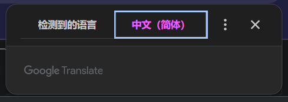

-   `<head></head>`：文档属性标签，被 `<head></head>` 框起的文本部分是不会被显示在浏览器中的，它包含了许多信息，例如网页的标题 [`<title</title>`](https://developer.mozilla.org/zh-CN/docs/Web/HTML/Element/title)，指向 `CSS` 文件的链接等等，实际上就是存放一些和页面相关的属性设置和文件说明

-   `<meta>`：`HTML` 语言 `head` 区的一个辅助性标签，位于文档的头部，不包含任何内容（也就是所谓的“空元素”，空元素就是只会以 `<标签>` 这种形式出现，而不会以 `<标签></标签>` 的形式出现的标签元素）。可提供相关页面的元信息/元属性，声明网页使用的字符集、作者、日期和时间、网页描述、关键词、页面刷新...下面介绍几个常见的属性

    (1)`charset`：指出浏览器对 `HTML` 的解码规则，如果我们的 `HTML` 文件使用的编码和解码规则不对应，就会导致乱码问题

    (2)`http-equiv`、`content`：通常会出现这样的设置 `<http-equiv="X-UA-Compatible" content="IE=edge">`，代表 `IE` 浏览器的渲染效果按照 `IE` 浏览器的最高版本展示，简单了解一下

    (3)`name`、`content`：会出现类似 `<meta name="viewport" content="width=device-width, initial-scale=1.0">` 这样的设置，这是为了让网页也适应手机端的设置，了解一下即可

    >   补充：元属性这个叫法非常的晦涩，其实就是代指一个 `HTML` 页面文档本身的一些属性，这些属性和其他标签放在一个文档内，浏览器在渲染份 `HTML` 文档之后，除了渲染其他“用户看得见”的组件，也会处理元数据这些看不见的属性，例如整个页面的文字语言是什么、该用什么字符编码、手机浏览器该又要怎么渲染、不同厂家的浏览器如何做兼容...
    >
    >   总之，元数据非常重要！并且对于元数据的理解通常都需要有一些足够久的开发知识，否则可能难以理解...因此如果您无法理解，也可以暂时跳过，等到您积累到一定的知识后，就可以尝试去了解一下了。
    >
    >   而关于元数据的资料可以[在 MMDN-meta 详细查看](https://developer.mozilla.org/zh-CN/docs/Web/HTML/Element/meta)。

-   `<title></title>`：就是页面的标题，标签内部填写的内容会显示到浏览器的标签页上

-   `<body></body>`：就是网页的主题部分，这个标签内部包含的大部分都是在浏览器上可以被显示出来的内容（例如文本、图片、视频、甚至是 `pdf`、可以点击的按钮、可输入文本框...）我们后面会介绍这里填写的标签有哪些...

因此根据现成的 `DOM` 树，程序员就可以依赖某些编程语言对该树进行增删查改，达到操控网页的目的。

>   注意：在 `HTML` 语法里，有时候标签和元素会混合使用，两者几乎是等价的。

下面我们来介绍一些写在 `<body></body>` 里的常见标签元素。

## 3.1.创建注释

`HTML` 使用 `<!-- 一些注释... -->` 来注释，在浏览器中不可见（对普通用户不可见），但是在调试工具中可见（对开发人员可见）

## 3.2.创建文本

### 3.2.1.标题标签

根据文本的分级，可以写出六个级别的标题标签 `<h1~h6></h1~/h6>` 在浏览器中体现为文字的大小变化。

```html
<!-- 使用标题标签 -->
<!DOCTYPE html>
<html lang="en">
<head>
    <meta charset="UTF-8">
    <meta name="viewport" content="width=device-width, initial-scale=1.0">
    <title>Document</title>
</head>
<body>
    <h1>标题 1</h1>
    <h2>标题 2</h2>
    <h3>标题 3</h3>
    <h4>标题 4</h4>
    <h5>标题 5</h5>
    <h6>标题 6</h6>
</body>
</html>
```

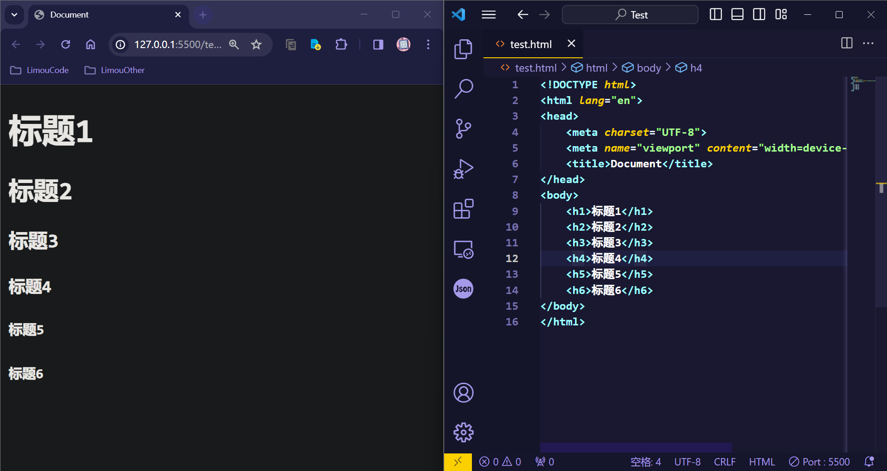

设置标题是很重要的，有可能会影响搜索引擎对该网页的检索（这些我们以后再提），您需要知道一个警告，一个页面最好是只有一个 `<h1></h1>` 标签，这个级别的标题标签优先级很高。

### 3.1.2.段落标签

使用 `<p></p>` 可以在网页上显示一段文本，需要注意的是，在代码中使用一个或多个换号会被浏览器当作空格处理。

```html
<!-- 使用段落标签 -->
<!-- 使用标题标签 -->
<!DOCTYPE html>
<html lang="en">
<head>
    <meta charset="UTF-8">
    <meta name="viewport" content="width=device-width, initial-scale=1.0">
    <title>Document</title>
</head>
<body>
    <p>这是一段文本</p>
    <p>这是一
        
        
        段文本</p>
</body>
</html>
```

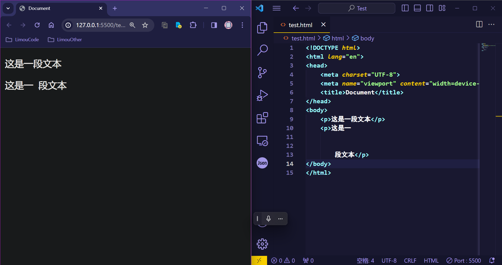

### 3.1.3.换号标签

如果需要换号，就需要使用换号标签 `<br/>`，这样解析到浏览器中才会产生实际的换号。

```html
<!-- 使用换号标签 -->
<!DOCTYPE html>
<html lang="en">
<head>
    <meta charset="UTF-8">
    <meta name="viewport" content="width=device-width, initial-scale=1.0">
    <title>Document</title>
</head>
<body>
    <p>这是一段文本</p>
    <p>这是一<br/>
        <br/>
        <br/>
        段文本</p>
</body>
</html>
```

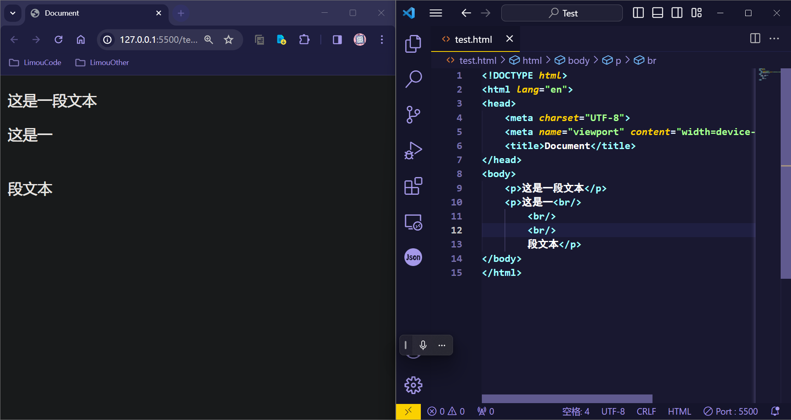

>   注意：有的时候使用 `<br>`，也就是末尾不加 `/` 的情况下，也可以达到换号的效果，但是最好不要这么做，因为这不够规范...

### 3.1.4.格式标签

实际上格式化标签用的在后面会用得比较少，会使用 `CSS` 来实现，只有一些简单的 `HTML` 页面才会直接使用格式化标签，这里您简单理解一些即可。

-   `<strong></strong>`、`<b></b>`：对字体加粗
-   `<em></em>`、`<i></i>`：对字体倾斜
-   `<del></del>`、`<s></s>`：对字体加删除线
-   `<ins></ins>`、`<u></u>`：对字体加下划线

```html
<!-- 格式化文字示例 -->
<!DOCTYPE html>
<html lang="en">
<head>
    <meta charset="UTF-8">
    <meta name="viewport" content="width=device-width, initial-scale=1.0">
    <title>Document</title>
</head>
<body>
    <p>这是<strong>粗体</strong></p>
    <p>这是<em>斜体</em></p>
    <p>这是<del>删除线</del></p>
    <p>这是<ins>下划线</ins></p>

    <br/>
    
    <p>这是<b>粗体</b></p>
    <p>这是<i>斜体</i></p>
    <p>这是<s>删除线</s></p>
    <p>这是<u>下划线</u></p>
</body>
</html>
```


## 3.4.创建图片

使用 `</img>` 就可以创建一张照片，该标签有以下属性：

-   `src` ：指定要显示在浏览器上图片的路径
-   `alt` ：该属性内的内容会在图片加载失败后以文字的形式显示在浏览器上（这有助于帮助我们调试代码或提示用户）
-   `title`：图片的标题，用鼠标悬停在浏览器显示的图片上时，这个标签内的内容会被显示出来，一般用作图片的辅助说明
-   `width`、`height`：这两个属性可以调整图片的宽和高（一般用像素单位控制）
-   `border`：显示图片的边框（一般用像素单位控制）

```html
<!-- 使用图片标签 -->
<!DOCTYPE html>
<html lang="en">
<head>
    <meta charset="UTF-8">
    <meta name="viewport" content="width=device-width, initial-scale=1.0">
    <title>Document</title>
</head>
    <br/>

    <br/>

    <br/>
</body>
</html>
```

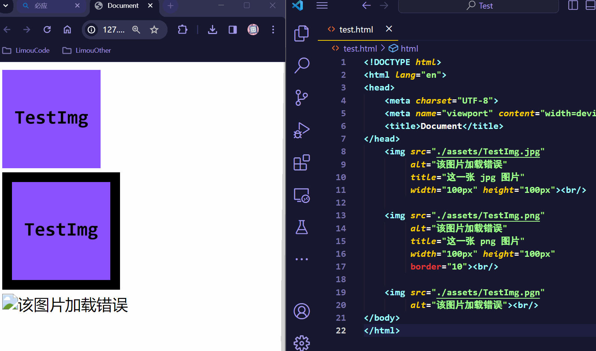

## 3.5.创建链接

使用标签 `<a></a>` 来创建一个超链接标记（就是下面的那段蓝色带有下划线的字），其包含的超链接标记也可以是其他标签元素（例如图片标签），该标签有如下属性：

-   `href`：指向某个网站或者本地的 `HTML` 文件，其值若为 `#` 则跳转到当前页面（相当于不跳转）
-   `target`：其值可以是 `_self`（在超链接所在的标签页打开超链接） 或 `_blank`（在新的标签页里打开超链接），前者是默认值

```html
<!-- 使用超链接标签 -->
<!DOCTYPE html>
<html lang="en">
<head>
    <meta charset="UTF-8">
    <meta name="viewport" content="width=device-width, initial-scale=1.0">
    <title>Document</title>
</head>
    <a href="https://cn.bing.com/?mkt=zh-CN">
        1.在本页面点击，在本标签页跳转到 bing 搜索</a>

    <br/>

    <a href="https://cn.bing.com/?mkt=zh-CN" target="_blank">
        2.在本页面点击，在新标签页中跳转 bing 搜索</a>
</body>
</html>
```

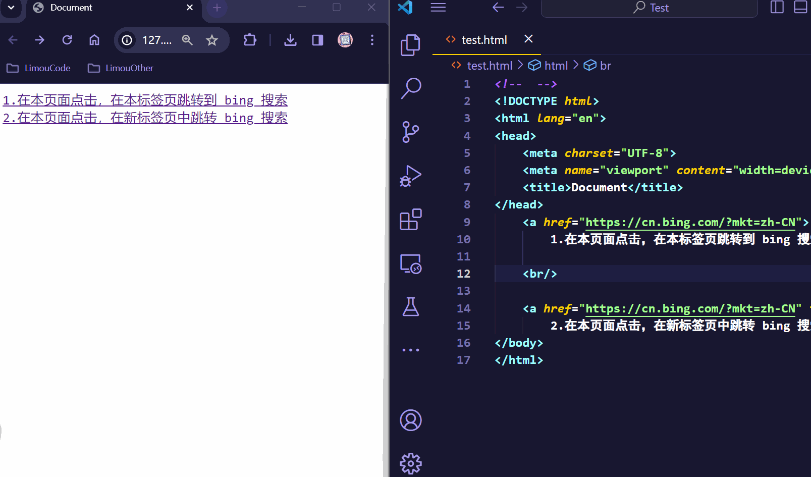

## 3.6.创建表格

使用 `<table></table>` 创建表格，内部使用 `<tr></tr>` 代表一个单元行，`<td></td>` 代表一个单元格，该标签元素有如下属性：

-   `border`：表格的是否带有边框，`0` 代表没有边框，其他数的值越大，边框越粗
-   `width`：表格的宽度
-   `height`：表格的高度
-   `cellpadding`：单元格内容距离边框的距离（默认 `1px`）
-   `cellspacing`：单元格与单元格之间的距离（默认 `2px`）
-   `align`：表格的对齐方向

```html
<!-- 创建表格 -->
<!DOCTYPE html>
<html lang="en">
<head>
    <meta charset="UTF-8">
    <meta name="viewport" content="width=device-width, initial-scale=1.0">
    <title>Document</title>
</head>
<body>
    <table border="1" 
         width="200px"
         height="40px"
         cellpadding="10px"
         cellspacing="1px"
         align="left">
         
        <thead>
            <tr>
                <th>姓名</th>
                <th>性别</th>
                <th>年龄</th>
            </tr> 
        </thead>

        <tbody>
            <tr>
                <td>limou</td>
                <td>男</td>
                <td>18</td>
            </tr>    
            <tr>
                <td>dimou</td>
                <td>男</td>
                <td>20</td>
            </tr> 
            <tr>
                <td>iimou</td>
                <td>女</td>
                <td>16</td>
            </tr>
        </tbody>
    </table>
</body>
</html>
```


另外，表格更加规范的写法如下：

```html
<!-- 规范表格 -->
<!DOCTYPE html>
<html lang="en">
<head>
    <meta charset="UTF-8">
    <meta name="viewport" content="width=device-width, initial-scale=1.0">
    <title>Document</title>
</head>
<body>
    <table border="1" 
         width="200px"
         height="40px"
         cellpadding="10px"
         cellspacing="1px"
         align="left">
         
        <thead>
            <tr>
                <th>姓名</th>
                <th>性别</th>
                <th>年龄</th>
            </tr> 
        </thead>

        <tbody>
            <tr>
                <td>limou</td>
                <td>男</td>
                <td>18</td>
            </tr>    
            <tr>
                <td>dimou</td>
                <td>男</td>
                <td>20</td>
            </tr> 
            <tr>
                <td>iimou</td>
                <td>女</td>
                <td>16</td>
            </tr>
        </tbody>
    </table>
</body>
</html>
```

`<thead></thead>` 一般包含表头标签元素，`<tbody></tbody>` 一般包含表项标签元素，这样做是为了后续方便寻找表头和表身，达到控制不同标签元素然后进行不同操作的目的（例如样式操作）。

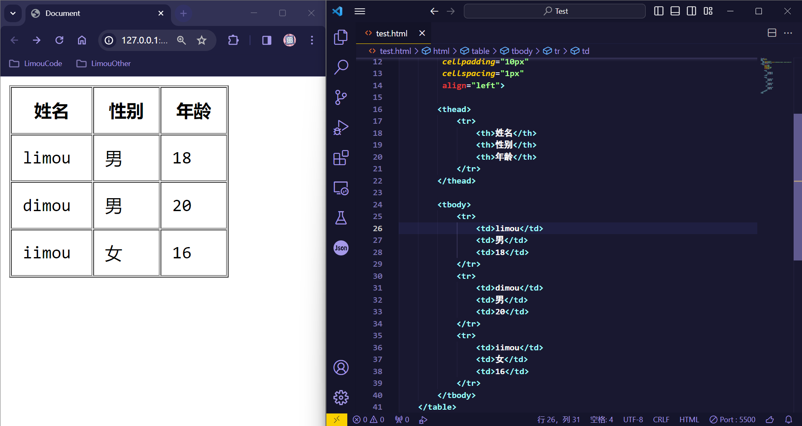

除此以外，表格还有一个重要操作：使用 `<td></td>` 的属性来合并某些单元格。

-   `rowspan`：将处于同列多行的单元格合并为一个单元格
-   `colspan`：将处于同行多列的单元格合并为一个单元格

```html
<!-- 合并表格 -->
<!DOCTYPE html>
<html lang="en">
<head>
    <meta charset="UTF-8">
    <meta name="viewport" content="width=device-width, initial-scale=1.0">
    <title>Document</title>
</head>
<body>
    <table border="1" 
         width="200px"
         height="40px"
         cellpadding="10px"
         cellspacing="1px"
         align="left">
         
        <thead>
            <tr>
                <th>姓名</th>
                <th>性别</th>
                <th>年龄</th>
            </tr> 
        </thead>

        <tbody>
            <tr>
                <td>limou</td>
                <td rowspan="2">男</td>
                <td>18</td>
            </tr>    
            <tr>
                <td>dimou</td>
                <!-- <td>男</td> -->
                <td>20</td>
            </tr> 
            <tr>
                <td>iimou</td>
                <td colspan="2">女/16</td>
                <!-- <td>16</td> -->
            </tr>
        </tbody>
    </table>
</body>
</html>
```


## 3.7.创建列表

### 3.7.1.无序列表

使用 `<ul><li></li></ul>` 来创建无序列表，其还有一些相关的属性可以修改样式（可以将该属性放在 `ul`，也可以放在 `li`）：

-   `type`：

    (1)`disc`，实心原点（默认值）

    (2)`circle`，空心原点

    (3)`square`，方块

```html
<!-- 使用无序列表 -->
<!DOCTYPE html>
<html lang="en">
<head>
    <meta charset="UTF-8">
    <meta name="viewport" content="width=device-width, initial-scale=1.0">
    <title>Document</title>
</head>
<body>
    <ul> <!-- 使用快捷方式 "ul>li*4" 可以快速创建无序列表的相关标签元素 -->
        <li>特征一</li>
        <li type="disc">特征二</li>
        <li type="circle">特征三</li>
        <li type="square">特征四</li>
    </ul>
</body>
</html>
```


### 3.7.2.有序列表

使用 `<ol><li></li></ol>` 来创建有序列表，其还有一些相关的属性可以修改样式（可以将该属性放在 `ol`，也可以放在 `li`）：

-   `type`：

    (1)`1`：按照阿拉伯数字顺序编号（默认值）

    (2)`a`，按照小写字母顺序编号

    (3)`A`，按照大写字母顺序编号

    (4)`i`，按照小写罗马数字顺序编号

    (5)`I`，按照大写罗马数字顺序编号

-   `start`：可以设定起始编号的从第几个开始

```html
<!-- 使用有序列表 -->
<!DOCTYPE html>
<html lang="en">
<head>
    <meta charset="UTF-8">
    <meta name="viewport" content="width=device-width, initial-scale=1.0">
    <title>Document</title>
</head>
    <ol>
        <li>步骤一</li>
        <li type="1">步骤二</li>
        <li type="a">步骤三</li>
        <li type="A">步骤四</li>
        <li type="i">步骤五</li>
        <li type="I">步骤六</li>
    </ol>
</body>
</html>
```


```html
<!-- 使用有序列表（改变编号起始位置） -->
<!DOCTYPE html>
<html lang="en">
<head>
    <meta charset="UTF-8">
    <meta name="viewport" content="width=device-width, initial-scale=1.0">
    <title>Document</title>
</head>
    <ol type="I" start="3">
        <li>步骤一</li>
        <li>步骤二</li>
        <li>步骤三</li>
        <li>步骤四</li>
        <li>步骤五</li>
        <li>步骤六</li>
    </ol>
</body>
</html>
```

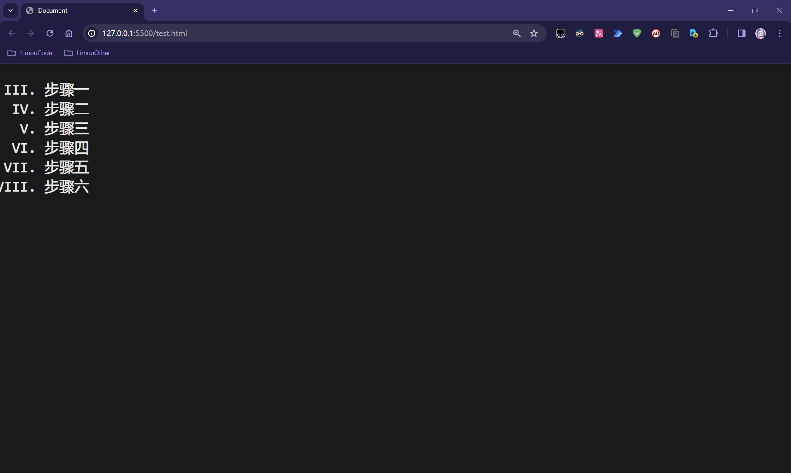

### 3.7.3.自定义列表

使用 `<dl><dt><dd></dd></dt></dl>` 来创建自定义列表：

```html
<!-- 使用自定义列表 -->
<!DOCTYPE html>
<html lang="en">
<head>
    <meta charset="UTF-8">
    <meta name="viewport" content="width=device-width, initial-scale=1.0">
    <title>Document</title>
</head>
    <dl><!-- "dl>dt>dd*4" -->
        <dt>变量</dt>
        <dd>用于存储值或对象的名称或标识符，可以在程序中被修改或引用。</dd>
      
        <dt>函数</dt>
        <dd>一组指令的集合，用于执行特定的任务或操作，并可以接受输入参数并返回输出结果。</dd>
      
        <dt>类</dt>
        <dd>一种用户定义的数据类型，可封装数据和功能，并可以创建新的对象实例。</dd>
    </dl>
</body>
</html>
```


## 3.8.创建表单

1.   表单域：包含表单元素的区域，由元素标签 `<form></form>` 体现，拥有属性 `action` ，用于填写服务器地址，将表单提交给服务器

2.   表单控件：一般指输入框、提交按钮等，由元素标签 `<input>` 来体现，拥有一个非常重要的属性：`type` ，不同的取值可以变换出不同的控件类型

     (1)`text`：文本框控件

     (2)`password`：密码框控件

     (3)`radio`：单选框控，加上属性 `name` 可以保证多个同名单选只有一个被选中，加上属性 `checked` 则可以设置默认选项

     (4)`checkbox`：复选框控件

     (5)`button`：普通按钮控件，可以使用属性 `value` 设定按钮名字

     (6)`submit`：跳转地址提交控件

     (7)`reset`：重置输入控件

     (8)`file`：选择文件控件
     
3.   标注：`<label></label>` 为 `<input>` 定义标注/标记，使用属性 `for` 来连接 `<input>` 的 `id` 值，此时点击选项文本也可以选中该文本对应的选项（之前是点小圆框才可以选中一个选项）

```html
<!-- 使用表单控件 -->
<!DOCTYPE html>
<html lang="en">
    <head>
        <meta charset="UTF-8">
        <meta name="viewport" content="width=device-width, initial-scale=1.0">
        <title>Document</title>
    </head>
    <body>
        <form>
            账户名字:<input type="text">
            <br/>

            账户密码:<input type="password">
            <br/>

            保留登录:
            <input type="radio" name="retain">是 <!-- name 值相同的单选只能有一个选项被选中 -->
            <input type="radio" name="retain" checked="checked">否 <!-- checked="checked" 可以设定默认选项 -->
            <br/>

            设定爱好:
            <input type="checkbox">打篮球
            <input type="checkbox">听音乐
            <input type="checkbox">玩游戏
            <br/>

            <input type="button" value="普通按钮（无反应）">
            <input type="button" value="普通按钮（有反应）" onclick="alert('Hello word!')"> <!-- 这用了一点 JS 粗略看一下就行，这个 onclick 属性可以使得点击按钮时，让浏览器弹出 'Hello word!' 的弹窗-->
            <br/>
        </form>

        <form action=""> <!-- 'action' 属性可以是网页地址、服务器地址 -->
            <input type="text" value="填入您的年龄" name="age">
            <input type="submit"> <!-- 浏览器会跳转地址 action，并且 URL 栏末尾就会出现 '?age=年龄' -->
            <input type="reset"> <!-- 点击“重置”就会清空输入 -->
        </form>

        <form>
            <input type="file">
        </form>
    </body>
</html>
```


```html
<!-- 给 <input> 提供标记 -->
<!DOCTYPE html>
<html lang="en">
<head>
    <meta charset="UTF-8">
    <meta name="viewport" content="width=device-width, initial-scale=1.0">
    <title>Document</title>
</head>
    <input type="radio" name="sex" id="male">
    <label for="male">男</label>

    <input type="radio" name="sex" id="female">
    <label for="female">女</label>
</body>
</html>
```


## 3.9.创建下拉选项框

`<select><option></option></select>` 创建的下拉菜单有时候会比单/多选项更好使用（不会占据过多的页面空间），而 `<option></option>` 的属性 `value` 值是用户选中对应选项后的对应数值。

```html
<!-- 创建下拉选项 -->
<!DOCTYPE html>
<html lang="en">
<head>
    <meta charset="UTF-8">
    <meta name="viewport" content="width=device-width, initial-scale=1.0">
    <title>Document</title>
</head>
    <select name="" id="">
        <option value="-- 选年份 --">-- 选年份 --</option> <!-- 默认选中第一个选项 -->>
        <option value="-- 2020 --">-- 2020 --</option>
        <option value="-- 2021 --">-- 2021 --</option> <!-- 也可以使用属性 selected='selected' 来默认某个下拉选项 -->>
        <option value="-- 2022 --">-- 2022 --</option>
        <option value="-- 2023 --">-- 2023 --</option>
        <option value="-- 2024 --">-- 2024 --</option>
    </select>
</body>
</html>
```

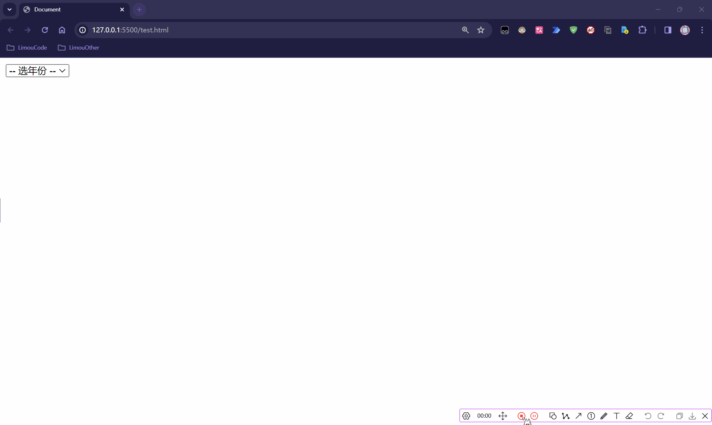

## 3.10.创建文本区域

文本框对我们来说还是太小了，我们可以使用 `textarea` 创建更大的文本区域。

```html
<!-- 创建文本区域 -->
<!DOCTYPE html>
<html lang="en">
<head>
    <meta charset="UTF-8">
    <meta name="viewport" content="width=device-width, initial-scale=1.0">
    <title>Document</title>
</head>
    <textarea name="" id="" cols="30" rows="10"></textarea>
</body>
</html>
```

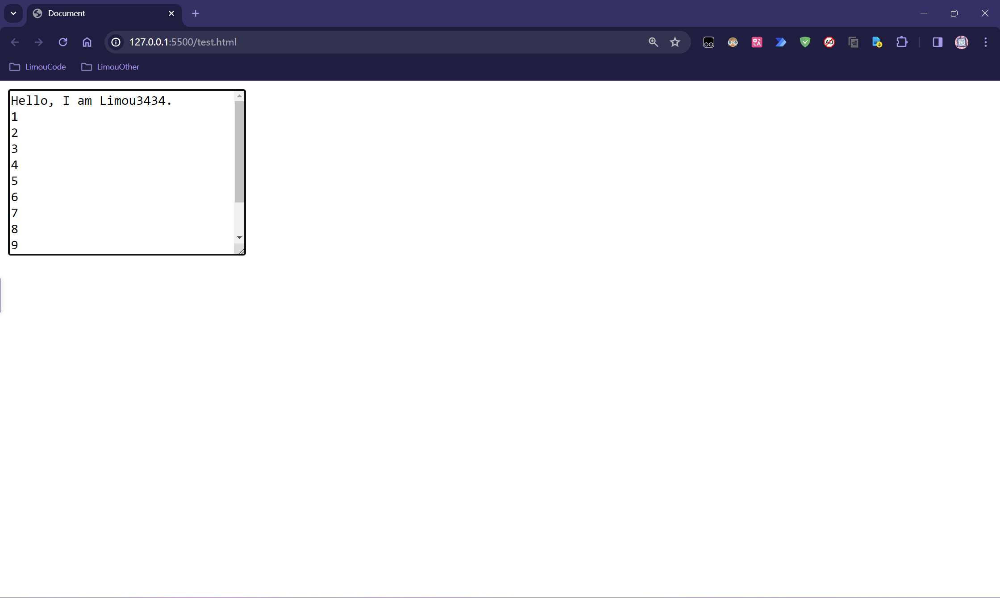

## 3.11.创建无语义标签

除了上述具有语言的标签，还可以使用两个无语义的标签：`<div></div>`、`<span></span>`，其用途不固定，可以做很多事情（通常作为页面布局）。

-   `<div>`：独占一行的大盒子
-   `<span>`：不独占一行的小盒子

```html
<!-- 创建无语义标签 -->
<!DOCTYPE html>
<html lang="en">
<head>
    <meta charset="UTF-8">
    <meta name="viewport" content="width=device-width, initial-scale=1.0">
    <title>Document</title>
</head>
    <div>
        <div>
            <span>步骤 1</span>
            <span>方法(1)</span>
            <span>方法(2)</span>
            <span>方法(3)</span>
            <span>方法(4)</span>
        </div>
        <div>步骤 2</div>
        <div>步骤 3</div>
        <div>步骤 4</div>
    </div>
</body>
</html>
```

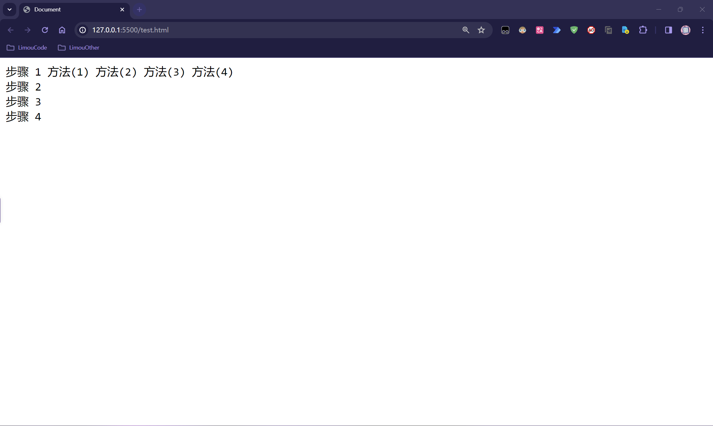

## 3.12.特殊字符

`HTML` 的空白字符和一些特殊字符在非 `""` 引用时，可使用代码来表示，例如：

-   `&nbsp;`：空格
-   `&lt;`：小于号
-   `&gt;`：大于号
-   `&amp;`：按位与

>   补充：更详细的内容可以 [看这里](https://www.jb51.net/onlineread/htmlchar.htm)。

# 4.HTML 插件

这里推荐一些 `VSCode` 的插件，可以帮助您提高效率。

## 4.1.Auto Rename Tag

`Auto Rename Tag` 这是一个可以让标签自动同步更新的插件，可以减少一些标签不对应导致的 `bug`


## 4.2.view-in-browser

使用插件 `view-in-browser` 可以右键快捷打开浏览器进行 `HTML` 解析。


>   注意：修改完 `HTML` 代码后，就需要保持一次文件（`VsCode` 的保持文件快捷键为 `[ctrl+s]`），再用浏览器打开，否则没有办法查看到页面被修改后的样子。


## 4.3.Live Server

虽然可以快捷打开浏览器了，但是每次修改代码都需要更新浏览器，浏览器才会重新显示修改后的内容...

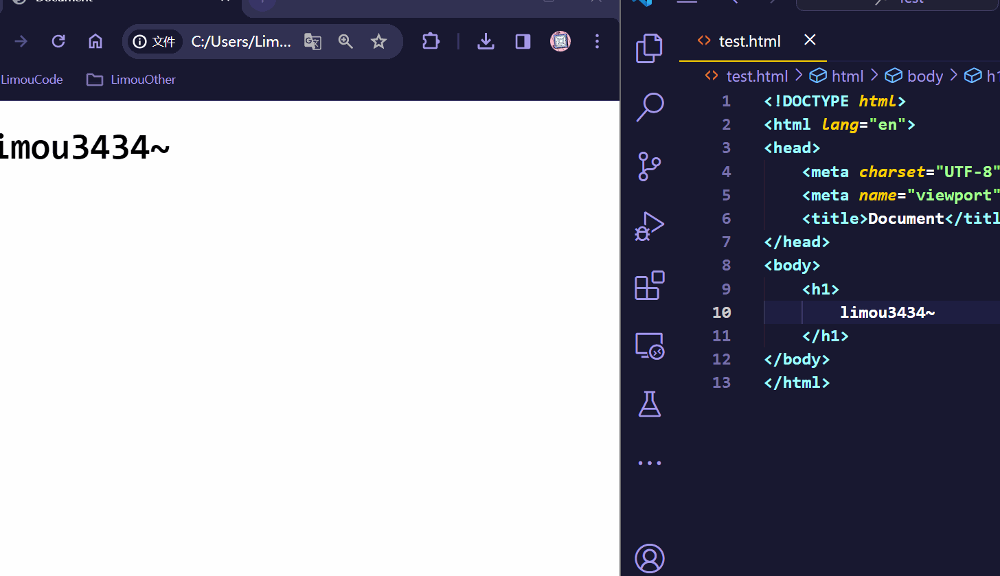

而插件 `Live Server` 则在保持文件后，实时刷新浏览器，让浏览器显示被修改后的 `html` 内容。


# 5.HTML 调试

光是编写 `HTML` 还好，但如果出了什么问题，而找不到问题的来源怎么办？

1.   正确使用标签：这样才能将文本块分解为树结构的标题、段落、强调、加粗单词、创建列表以及其他内容，进而动态的操控网页。这貌似是废话？不，实际上有相当多标签被误用，或者混用的例子，尽管有些时候它们在浏览器上的最终显示效果差不多...但是我依旧需要警告您：正确使用标签，尽量别混用
2.   一些检测网站：这里提供一个网站 [Markup Validation Service](https://validator.w3.org/)（该网站由 `W3C`（制定 `HTML`、`CSS` 和其他网络技术标准的组织）创立并维护的标记验证服务），把一个 `HTML` 文档加载到该网页并运行，网页就会返回一个错误报告，您可以尝试写一个脚本代码，让您的 `HTML` 可以被复制到该网站，并且返回检查报告
3.   使用浏览器调试： `chrome` 浏览器除了显示 `HTML` 的结果，也可以用来调试 `HTML` 代码

这里着重介绍关于 `chrome` 的使用技巧，首先这是一份 [关于 chrome 基本使用](https://www.google.com/intl/zh-CN/chrome/browser-features/#google-search-bar) 的文档，没有涉及到调试方面 ，在调试之前，您需要了解这个浏览器一些基本的使用。

接下来打开一个 `HTML` 代码，使用快捷键 `[F12]` 来打开对应的开发者调试界面：


调试窗口会显示出页面背后的 `HTML` 的代码，并且还可以调查其他的信息，这里提供一份关于 [谷歌开发者工具的文档](https://developer.chrome.com/docs/devtools/overview?hl=zh-cn)，里面有关于该调试器的使用说明，您可以先存着，然后先看我下面写的这些常见技巧和说明...

1.   若一个标签元素被代码缩略时，右边会显示类似 `==$[数组]` 的东西，这代表该标签元素及内部元素在网页中占有的像素大小
2.   使用快捷键 `[ctrl+f]` 就会出现一个文本框，可以在该文本框内搜索想要查询的标签元素或者其他文本
