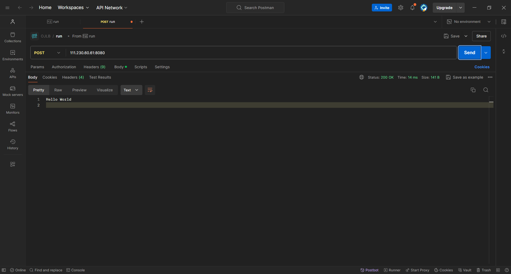

https://nodejs.org/docs/latest/api/synopsis.html

# 1.安装 Node.js 软件

`Windows` 可以到 [Node.js 官网处下载](https://nodejs.org/en/download)，`Linux` 可以使用包管理器下载，待补充...

# 2.解析 Node.js 内部

当您下载和安装 `Node.js` 后，实际上下载了以下几种工具和组件：

1.  **运行时环境**：这是核心组件，提供了运行 `JS` 代码的环境。包含了 `V8 JS` 引擎以及执行 `JS` 代码所需的各种底层系统库和 `API`。
2.  **npm 包管理器**：全称是 `Node Package Manager` 这是 `Node.js` 的默认包管理器，使得 `Node.js` 具备了现代高级编程语言的资格，主要用于管理和安装 `JS` 包。具体来说 `npm` 是一个命令行工具，帮助你安装、更新、卸载和发布和 `Node.js` 相关的软件包。
3.  **核心模块**：`Node.js` 除了支持基本的 `JS` 语法，还包含一组内置的核心模块，例如 `fs(文件系统)`、`http(HTTP 服务)`、`path(路径处理)`等，这些模块不需要额外安装，可以直接在 `Node.js` 应用程序中使用。
4.  **命令行工具**：包括 `node` 本身的一些命令，使用 `node xxx.js` 可以在运行时环境下运行 `JS` 程序，甚至可以打断点进行调试。
5.  ...

>   补充：不过在早些版本的 `Nodo.js` 下载的过程中，可能不会包含太多的工具而只有 `JS` 运行环境和 `node` 命令行程序（这点我在我的 `Centos7` 服务器中就遇到了，没有把 `npm` 也下载下来的情况）。

# 3.使用 Node.js 工具

## 3.1.使用 node 运行和调试代码

我们来尝试使用最原生的方法来使用 `node` 命令行工具运行最基本的 `JS` 代码，如下命令行来展示。

```shell
# 使用 node 运行原生 JS 代码
$ vim test.js
$ cat test.js
console.log("Hello World");
$ node test.js 
Hello World
```

`node` 本身还提供了和 `python` 类似的交互模式，直接输入 `node` 指令可以进入交互模式，这样就和在浏览器开发者模式中的控制台直接使用 `JS` 没有差别了，并且打印出来的格式还蛮相似的，而使用 `.exit` 就可以退出交互模式。

```shell
# 进入和退出 node 的交互模式
$ node
Welcome to Node.js v16.20.2.
Type ".help" for more information.
> console.log("Hello World");
Hello World
undefined
> .exit
[ljp@VM-8-9-centos cpu: 3.2% mem: 52.05% - test]$
```

不过，如果您不是把 `Node.js` 作为服务端开发使用，也完全可以把 `Node.js` 的 `node` 当做 `JS` 的开发工具，并且使用 `npm` 包管理器下载一下模块再进行编程（这点我们后面提及）。

```shell
# 使用 node inspect 对 JS 代码进行调试
$ vim test.js
$ cat test.js 
function example() {
    let a = 1;
    debugger; // 这里使用 debugger 打了一个断点, 调试器会在这里暂停
    let b = 2;
    console.log(a + b);
}
example();

$ node inspect test.js 
< Debugger listening on ws://127.0.0.1:9229/21db8145-f19d-4200-bf92-9fe3ad4ccb2d
< For help, see: https://nodejs.org/en/docs/inspector
< 
connecting to 127.0.0.1:9229 ... ok
< Debugger attached.
< 
Break on start in test.js:7
5   console.log(a + b);
6 }
> 7 example();
8 
9 
debug> n
break in test.js:3
1 function example() {
2   let a = 1;
> 3   debugger; // 调试器会在这里暂停
4   let b = 2;
5   console.log(a + b);
debug> c
< 3
< 
< Waiting for the debugger to disconnect...
< 
debug> .exit
```

相关的调试命令可以简单看一下：

-   `n`：继续执行到下一个断点
-   `c`：继续执行直到程序结束
-   `s`：单步进入
-   `o`：单步跳过
-   `repl`：进入交互模式

而且不仅仅是 `原生 JS` 代码，`Node.js` 应用的开发还比较特殊，在实现一个 `Node.js` 的 `HTTP` 服务器过程中，往往在一份 `.js` 代码中会包含以下步骤：

-   使用 `require` 指令加载模块
-   创建服务器接受请求和返回响应

```shell
$ vim test.js 
$ cat test.js 
// 下面是一份简单的 HTTP 应用服务器代码
const http = require("http"); // 这里引入了 http 模块, 其实也可以放路径, 不过使用 Node.js 自带模块名字就会自动进行模块查找

const server = http.createServer(function (request, response) { // 利用引入的模块实例变量来创建服务器应用
    console.log(`Received ${request.method} request for ${request.url}`); // 查看对端的请求方法和路径, 这里使用反引号做插值打印
    response.writeHead(200, {'Content-Type': 'text/plain'}); // 设置响应的 HTTP 头部, 包含状态值, 状态说明, 正文类型
    response.end('Hello World\n'); // 发送响应数据 "Hello World"
}); // 但是这种设置方法只是配置了一个比较简单的 HTTP 服务器, 暂时没有设置对应的 HTTP 方法

server.listen(8080, "0.0.0.0", () => { // 监听 8080 端口, 第二个 ip 参数如果不传, 默认使用 127.0.0.1
    console.log('Server running at http://0.0.0.0:8080/'); // 终端打印日志信息
});
$ node test.js 
Server running at http://0.0.0.0:8080/
Received GET request for /
Received POST request for /
```

对端我使用的是 `postman` 来充当客户端。




不过这种创建方式只是简单的 `HTTP` 服务器，还没有详细设置 `HTTP` 的方法，因此更加规范点可以写出如下的 `HTTP` 应用服务器，我直接把代码给出来，您可以自己在本地进行尝试，注意 `ip` 和 `port` 的修改。

```js
// 创建一份带有路由处理的 HTTP 服务器代码
const express = require('express'); // 引入 express 模块, 这是比较流行的 JS Web 框架
const app = express(); // 使用模块初始化一个 express 应用实例

app.get('/', (req, res) => { // 定义路由
    res.status(200).send('Hello World');
});

const PORT = 8080;
const HOST = '0.0.0.0';

app.listen(PORT, HOST, () => {
    console.log(`Server running at http://${HOST}:${PORT}/`);
});
```

## 3.2.使用 npm 下载和管理软件包

和许多包管理工具的行为类似，使用 `npm install <Module Name@version>` 即可快速进行第三方模块的安装，值得注意的是 `npm` 可以使用 `npm install npm -g` 自己升级自己，期间可能需要一点管理员权限。

`-g` 选项可以指定为全局安装，这两种安装有所区别，并且非常有用，是避免冲突的有效解决方案。

-   局部安装：不带 `-g` 的局部安装将安装包放在运行 `npm` 命令时所在的目录下（也就是 `./module_name`），如果需要在代码中使用必须通过 `require()` 来引入本地安装的包
-   全局安装：带上 `-g` 的全局安装将安装包放在 `/usr/local` 下或者 `node` 的安装目录，则可以直接在命令行里使用对应的应用，如果需要在代码中使用必须通过 `require()` 来引入本地安装的包

因此有些情况下如果需要全局安装，很可能是为了通过 `npm` 下载一些第三方的命令行工具，而不单纯是为了编码工作。

也可以查看已经安装过的局部模块 `npm list` 同样可以加上 `-g` 选项查看全局下载的模块。

使用 `npm uninstall` 则可以卸载模块，同样也有加 `-g` 和不加 `-g` 的局部和全局区别。

>   补充：这里还可以一个使用 `npm` 一个比较恶心的点，那就国外源的问题。使用 `npm` 下载模块时，有时会遇到网络连接的问题，至于解决方案，我这里只提供一种换源方案，还不行的话只能各显神通了。
>
>   1.   首先确保您的网络连接稳定，并且关闭任何防火墙或安全软件
>   2.   `npm cache clean --force` 清理 `npm` 缓存，有时清理 `npm` 缓存可以解决问题
>   3.   `npm install -g npm@latest` 尝试更新 `npm` 可能也会解决一些连接问题
>   4.   `npm config set registry https://registry.npmmirror.com` 尝试使用不同的 npm 注册表镜像，例如淘宝的 `npm` 镜像
>
>   或者干脆使用淘宝镜像的 `cnpm` 替代 `npm` 的使用，执行 `npm install -g cnpm --registry=https://registry.npmmirror.com` 就可以使用 `cnpm` 来替代 `npm` 的日常使用。
>
>   ```shell
>   # 安装 cnpm 来替代 npm 的使用
>   $ npm install -g cnpm --registry=https://registry.npmmirror.com
>   
>   added 1 package in 38s
>   
>   59 packages are looking for funding
>     run `npm fund` for details
>   
>   $ cnpm --version
>   cnpm@9.4.0 (C:\Users\Limou_p350ml9\AppData\Roaming\npm\node_modules\cnpm\lib\parse_argv.js)
>   npm@9.9.2 (C:\Users\Limou_p350ml9\AppData\Roaming\npm\node_modules\cnpm\node_modules\npm\index.js)
>   node@20.10.0 (D:\AppData\Node.js\node.exe)
>   npminstall@7.12.0 (C:\Users\Limou_p350ml9\AppData\Roaming\npm\node_modules\cnpm\node_modules\npminstall\lib\index.js)
>   prefix=C:\Users\Limou_p350ml9\AppData\Roaming\npm 
>   win32 x64 10.0.26120 
>   registry=https://registry.npmmirror.com
>   ```

还有一种更加方便的下载方案，通常适用于大型项目部署的情况，就是使用 `package.json` 配置文件，然后使用。

您可以选择手动创建 `package.json` 文件，也可以使用 `npm init` 命令自动生成，一般我们推荐使用后者，只需要按照提示填写信息，`npm` 就会生成一个基础的 `package.json` 文件。如果希望使用默认配置，可以使用 `npm init -y`

```shell
# 配置 package.json 的过程
$ npm init       
This utility will walk you through creating a package.json file.
It only covers the most common items, and tries to guess sensible defaults.

See `npm help init` for definitive documentation on these fields
and exactly what they do.

Use `npm install <pkg>` afterwards to install a package and
save it as a dependency in the package.json file.

Press ^C at any time to quit.
package name: (vuetest) my_package
version: (1.0.0) 1.2.1
description: a self-made software package.
entry point: (index.js) index.js
test command: test
git repository: https://github.com/limou3434/my_package.git
keywords: limou_package
author: limou3434
license: (ISC)
About to write to D:\Other\vuetest\package.json:

{
  "name": "my_package",
  "version": "1.2.1",
  "description": "a self-made software package.",
  "main": "index.js",
  "scripts": {
    "test": "test"
  },
  "repository": {
    "type": "git",
    "url": "git+https://github.com/limou3434/my_package.git"
  },
  "keywords": [
    "limou_package"
  ],
  "author": "limou3434",
  "license": "ISC",
  "bugs": {
    "url": "https://github.com/limou3434/my_package/issues"
  },
  "homepage": "https://github.com/limou3434/my_package#readme"
}


Is this OK? (yes) yes
```

编写完毕后，使用 `npm install` 即可自动根据 `package.json` 文件进行安装（同样可以加上 `-g` 选项），使用 `npm start` 运行 `"scripts"` 中定义的脚本，也可以直接使用 `npm 脚本名称` 来直接运行特定的脚本。使用 `npm publish` 可以对包进行发布。

可以看到 `package.json` 文件在 `Node.js` 项目中既可以用来描述项目的元数据（如项目名称、版本、描述等），也可以用作依赖管理的配置文件。
