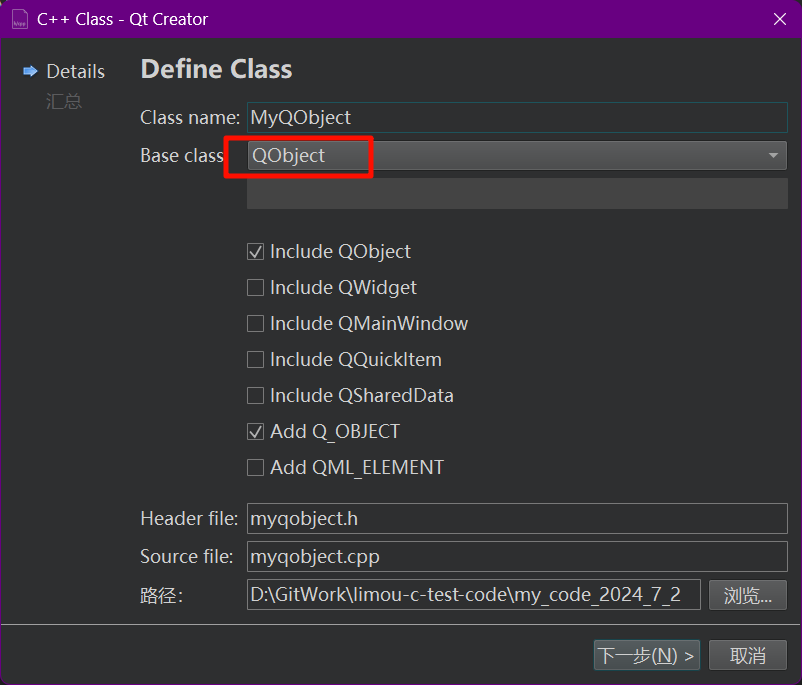

>   这要重新书写...待补充...

前面基本都是对 `UI` 进行静态绘制，因此可以使用 `Cpp` 来进行动态渲染，并且我们需要先了解一下一些前后端开发的流程。


这种统一的分离设计就是经典的 `MVC` 架构。然后我们再来看看迟迟未看的 `QML` 项目中的 `main.cpp` 文件。

```cpp
// 查看并解读 main.cpp 文件
#include <QGuiApplication> // QGuiApplication 类的头文件, 是所有 Qt 应用程序的基类, 负责应用程序的生命周期和资源管理
#include <QQmlApplicationEngine> // QQmlApplicationEngine 类的头文件, 用于加载和执行 QML 代码。

int main(int argc, char *argv[])
{
    QGuiApplication app(argc, argv); // 创建应用程序对象
    QQmlApplicationEngine engine; // 创建 QML 对象
    const QUrl url(QStringLiteral("qrc:/my_code_2024_7_2/main.qml")); // 创建 QML 文件的 URL

    QObject::connect( // 使用 QObject::connect（） 连接 QQmlApplicationEngine：：objectCreated（） 信号到一个 lambda表达式槽函数
        &engine, // 发送信号对象
        &QQmlApplicationEngine::objectCreated, // 信号类型
        &app, // 处理信号对象
        [url](QObject *obj, const QUrl &objUrl) { // 信号处理
            if (!obj && url == objUrl)
                QCoreApplication::exit(-1);
        },
        Qt::QueuedConnection // 指定连接的类型为排队连接, 信号的传递将在事件循环中排队进行
    );

    engine.load(url); // 加载 QML 文件
    return app.exec(); // 进入事件循环
}

```

# 7.1.Cpp 返回 QML 数值

假设场景：我们希望通过 `Cpp` 和 `QML` 交互的形式，对界面做动态的修改。因此我们可以尝试使用一个叫做 **全局对象/上下文对象(头文件 QQmlContext)** 的东西，让所有的 `.qml` 文件都可以访问到 `Cpp` 传递回来的数据。

```cpp
// main.cpp
#include <QGuiApplication> // QGuiApplication 类的头文件, 是所有 Qt 应用程序的基类, 负责应用程序的生命周期和资源管理
#include <QQmlApplicationEngine> // QQmlApplicationEngine 类的头文件, 用于加载和执行 QML 代码。
#include <QQmlContext> // 引入上下文对象的头文件

int main(int argc, char *argv[])
{
    QGuiApplication app(argc, argv); // 创建应用程序对象
    QQmlApplicationEngine engine; // 创建 QML 对象
    const QUrl url(QStringLiteral("qrc:/my_code_2024_7_2/main.qml")); // 创建 QML 文件的 URL
    QQmlContext* context = engine.rootContext(); // 创建一个上下文对象

    context->setContextProperty("SCREEN_WIDTH", 200); // 返回所有 .qml 一个全局对象 "SCREEN_WIDTH", 可以直接被使用

    QObject::connect( // 使用 QObject::connect（） 连接 QQmlApplicationEngine：：objectCreated（） 信号到一个 lambda表达式槽函数
        &engine, // 发送信号对象
        &QQmlApplicationEngine::objectCreated, // 信号类型
        &app, // 处理信号对象
        [url](QObject *obj, const QUrl &objUrl) { // 信号处理
            if (!obj && url == objUrl)
                QCoreApplication::exit(-1);
        },
        Qt::QueuedConnection // 指定连接的类型为排队连接, 信号的传递将在事件循环中排队进行
    );

    engine.load(url); // 加载 QML 文件
    return app.exec(); // 进入事件循环
}

```

```cpp
// main.qml
import QtQuick 2.15
import QtQuick.Window 2.15
import QtQuick.Controls 2.15

Window {
    id: win
    visible: true
    width: SCREEN_WIDTH
    height: 480
    title: "QML Text Example"
}

```

# 7.2.Cpp 注册 QML 模块

另外，如果复杂一些，希望使用 `Cpp` 制作一个类对象，然后交给 `.qml` 文件作为模块导入，这样也可以达到自定义组件的目的。




```cpp
// myqobject.h
#ifndef MYQOBJECT_H
#define MYQOBJECT_H

#include <QObject>

// 编写下述类
class MyQObject : public QObject
{
    Q_OBJECT

public:
    explicit MyQObject(QObject *parent = nullptr);

    int getMyValue() const;
    void setMyValue(int newMyValue);

    QString getMyString() const;
    void setMyString(const QString &newMyString);

signals:
    void myValueChanged();

    void myStringChanged();

private:
    int myValue;
    QString myString;

    // 属性 + 读方法 + 写方法 + 检测到属性在 qml 中被修改后就会立刻发送的通知信号 + FINAL
    // 允许您将 Cpp 类的成员变量以属性的形式暴露给 QML 以及其他 Qt 系统
    Q_PROPERTY(int myValue READ getMyValue WRITE setMyValue NOTIFY myValueChanged FINAL) // 设置需要返回给 .qml 文件的 QObject 组件的属性
    Q_PROPERTY(QString myString READ getMyString WRITE setMyString NOTIFY myStringChanged FINAL)
    /* 还有一种比较简便的写法
    Q_PROPERTY(int myValue MEMBER myValue NOTIFY myValueChanged FINAL)
    Q_PROPERTY(QString myString MEMBER myString NOTIFY myStringChanged FINAL)
    */
};

#endif // MYQOBJECT_H

```

```cpp
// myqobject.cpp
#include "myqobject.h"

MyQObject::MyQObject(QObject *parent)
    : QObject{parent}
{}

int MyQObject::getMyValue() const
{
    return myValue;
}

void MyQObject::setMyValue(int newMyValue)
{
    if (myValue == newMyValue)
        return;
    myValue = newMyValue;
    emit myValueChanged();
}

QString MyQObject::getMyString() const
{
    return myString;
}

void MyQObject::setMyString(const QString &newMyString)
{
    if (myString == newMyString)
        return;
    myString = newMyString;
    emit myStringChanged();
}

```

```cpp
// main.cpp
#include <QGuiApplication> // QGuiApplication 类的头文件, 是所有 Qt 应用程序的基类, 负责应用程序的生命周期和资源管理
#include <QQmlApplicationEngine> // QQmlApplicationEngine 类的头文件, 用于加载和执行 QML 代码。
#include <QQmlContext> // 引入上下文对象的头文件
#include "myqobject.h"

int main(int argc, char *argv[])
{
    QGuiApplication app(argc, argv); // 创建应用程序对象
    QQmlApplicationEngine engine; // 创建 QML 对象
    const QUrl url(QStringLiteral("qrc:/my_code_2024_7_2/main.qml")); // 创建 QML 文件的 URL

    /* 一般不会这么做, 并且可能需要设置一些 CMake 的选项, 很麻烦...
    QQmlContext* context = engine.rootContext(); // 创建一个上下文对象
    MyQObject mqo; // 创建一个自定义的 MyQObject 对象
    context->setContextProperty("MyQObject", &mqo); // 返回所有 .qml 一个全局对象 "SCREEN_WIDTH", 可以直接被使用
    */

    // 常见的用法（将 Cpp 类注册到上下文中）
    qmlRegisterType<MyQObject>("com.example.mymodle", 1, 0, "MyQObjectModle"); // 命名空间, 主版本号, 次版本号, 模块名

    QObject::connect( // 使用 QObject::connect（） 连接 QQmlApplicationEngine：：objectCreated（） 信号到一个 lambda 表达式槽函数
        &engine, // 发送信号对象
        &QQmlApplicationEngine::objectCreated, // 信号类型
        &app, // 处理信号对象
        [url](QObject *obj, const QUrl &objUrl) { // 信号处理
            if (!obj && url == objUrl)
                QCoreApplication::exit(-1);
        },
        Qt::QueuedConnection // 指定连接的类型为排队连接, 信号的传递将在事件循环中排队进行
    );

    engine.load(url); // 加载 QML 文件
    return app.exec(); // 进入事件循环
}

```

```cpp
// main.qml
import QtQuick 2.15
import QtQuick.Window 2.15
import QtQuick.Controls 2.15
import com.example.mymodle 1.0

Window {
    id: win
    visible: true
    width: mqo.myValue // 这里就是动态绑定的部分了, 如果 mqo.myValue 发送了改变, 就会发送信号通过自己被改变了(多亏前面使用了 NOTIFY 才能有这种效果), 因此后面如果 id:mqo 组件的的 myValue 发生了改变, 就会导致这里的发生变化
    height: 480
    title: mqo.myString

    MyQObjectModle {
        id: mqo
        myValue: 1000
        myString: "limou3434"
        Component.onCompleted: {
            console.log(myValue, myString)
        }
    }
}

```

>   补充：通过注册的方式可以只在必要的时候导入，进而提高性能。

# 7.3.QML 调用 Cpp 函数

而上述把类封装为模型给 `QML` 使用，主要使用的是类的属性，那么可否让 `.qml` 文件中的自定义模型对应的组件使用上 `Cpp` 类中的方法呢？其实可以，并且还挺简单的，只需要在方法声明前加上一个 `Q_INVOKABLE` 关键字即可。

```cpp
// myqobject.h
#ifndef MYQOBJECT_H
#define MYQOBJECT_H

#include <QObject>

class MyQObject : public QObject
{
    Q_OBJECT

public:
    explicit MyQObject(QObject *parent = nullptr);

    int getMyValue() const;
    void setMyValue(int newMyValue);

    QString getMyString() const;
    void setMyString(const QString &newMyString);

    Q_INVOKABLE void testFunc(void); // 其他代码不变, 这里加上 Q_INVOKABLE 即可

signals:
    void myValueChanged();

    void myStringChanged();

private:
    int myValue;
    QString myString;

    Q_PROPERTY(int myValue READ getMyValue WRITE setMyValue NOTIFY myValueChanged FINAL)
    Q_PROPERTY(QString myString READ getMyString WRITE setMyString NOTIFY myStringChanged FINAL)
};

#endif // MYQOBJECT_H

```

```cpp
// myqobject.cpp
#include "myqobject.h"
#include <QDebug>

MyQObject::MyQObject(QObject *parent)
    : QObject{parent}
{}

int MyQObject::getMyValue() const
{
    return myValue;
}

void MyQObject::setMyValue(int newMyValue)
{
    if (myValue == newMyValue)
        return;
    myValue = newMyValue;
    emit myValueChanged();
}

QString MyQObject::getMyString() const
{
    return myString;
}

void MyQObject::setMyString(const QString &newMyString)
{
    if (myString == newMyString)
        return;
    myString = newMyString;
    emit myStringChanged();
}

void MyQObject::testFunc()
{
    qDebug() << __FUNCTION__;
}

```

```cpp
// main.cpp
#include <QGuiApplication>
#include <QQmlApplicationEngine>
#include <QQmlContext>
#include "myqobject.h"

int main(int argc, char *argv[])
{
    QGuiApplication app(argc, argv);
    QQmlApplicationEngine engine;
    const QUrl url(QStringLiteral("qrc:/my_code_2024_7_2/main.qml"));
    qmlRegisterType<MyQObject>("com.example.mymodle", 1, 0, "MyQObjectModle");

    QObject::connect(
        &engine,
        &QQmlApplicationEngine::objectCreated,
        &app,
        [url](QObject *obj, const QUrl &objUrl) {
            if (!obj && url == objUrl)
                QCoreApplication::exit(-1);
        },
        Qt::QueuedConnection
    );

    engine.load(url);
    return app.exec();
}

```

```cpp
// main.qml
import QtQuick 2.15
import QtQuick.Window 2.15
import QtQuick.Controls 2.15
import com.example.mymodle 1.0

Window {
    id: win
    visible: true
    width: mqo.myValue
    height: 480
    title: mqo.myString

    MyQObjectModle {
        id: mqo
        myValue: 1000
        myString: "limou3434"
        Component.onCompleted: {
            console.log(myValue, myString)
        }
    }

    Button {
        width: 100
        onClicked: {
            mqo.testFunc()
        }
    }
}

```

上述调用函数还属于比较直接的调用，另外一种函数调用就是由 `qml` 发送信号给 `Cpp`，让其做出对应的响应。

# 7.4.Cpp 调用 QML 函数

首先是需要明确 `Object` 对象有的 `QML` 函数，并且使用 `QVariant res; QVariant arg_1 = 1, arg_2 = "limou"; QMetaObject::invokeWethod(<Object调用对象>, <调用函数名称>, <Q_RETURN_ARG(QVariant, res)存储返回值>, <Q_ARG(QVariant, arg_1)函数需要的参数>, <Q_ARG(QVariant, arg_2)函数需要的参数>, ...);` 即可。

# 7.5.QML 和 Cpp 信号槽混杂

## 7.5.1.QML 制作信号 QML 制作槽

```cpp
// 信号槽的第一种写法
import QtQuick 2.15
import QtQuick.Window 2.15
import QtQuick.Controls 2.15

Window {
    visible: true
    width: 640
    height: 480
    title: "QML Text Example"

    signal testSig(string str, int value) // 制作信号（信号）

    function func(s, v) { // 制作信号对应的处理方法（槽）
        console.log(s, v)
    }

    Component.onCompleted: { // 设置主界面被创建时的回调
        testSig.connect(func) // 绑定信号所对应的处理方法
    }

    Button {
        width: 50
        height: 50
        onClicked: {
            testSig("limou3434", "18") // 触发信号（发出者）
        }
    }
}

```

```cpp
// 信号槽的第二种写法
import QtQuick 2.15
import QtQuick.Window 2.15
import QtQuick.Controls 2.15

Window {
    id: win
    visible: true
    width: 640
    height: 480
    title: "QML Text Example"

    signal testSig(string str, int value) // 制作信号（信号）

    Connections { // 绑定信号(槽)
        target: win // 信号源
        // onTestSig: { // 已经摈弃的写法
        //     console.log(str, value)
        // }
        function onTestSig(s, v) {
            console.log(s, v)
        }
    }

    Button { // 触发信号的按钮
        width: 50
        height: 50
        onClicked: {
            testSig("limou3434", "18") // 触发信号（发出者）
        }
    }
}

```

## 7.5.2.QML 制作信号 Cpp 制作槽

### 7.4.2.1.交给 QML 来绑定

```cpp
// myqobject.h
#ifndef MYQOBJECT_H
#define MYQOBJECT_H

#include <QObject>
#include <Qstring>

class MyQObject : public QObject
{
    Q_OBJECT

public:
    explicit MyQObject(QObject *parent = nullptr);

    int getMyValue() const;
    void setMyValue(int newMyValue);

    QString getMyString() const;
    void setMyString(const QString &newMyString);

    Q_INVOKABLE void testFunc(void);

public slots:
    void cppSlot(int i, QString s); // 首先必定是需要定义一个槽函数的, 然后后续进行连接

signals:
    void myValueChanged();

    void myStringChanged();

private:
    int myValue;
    QString myString;

    Q_PROPERTY(int myValue READ getMyValue WRITE setMyValue NOTIFY myValueChanged FINAL)
    Q_PROPERTY(QString myString READ getMyString WRITE setMyString NOTIFY myStringChanged FINAL)
};

#endif // MYQOBJECT_H

```

```cpp
// myqobject.cpp
#include "myqobject.h"
#include <QDebug>

MyQObject::MyQObject(QObject *parent)
    : QObject{parent}
{}

int MyQObject::getMyValue() const
{
    return myValue;
}

void MyQObject::setMyValue(int newMyValue)
{
    if (myValue == newMyValue)
        return;
    myValue = newMyValue;
    emit myValueChanged();
}

QString MyQObject::getMyString() const
{
    return myString;
}

void MyQObject::setMyString(const QString &newMyString)
{
    if (myString == newMyString)
        return;
    myString = newMyString;
    emit myStringChanged();
}

void MyQObject::testFunc()
{
    qDebug() << __FUNCTION__;
}

void MyQObject::cppSlot(int i, QString s)
{
    qDebug() << __FUNCTION__;
}

```

```cpp
// main.cpp
#include <QGuiApplication>
#include <QQmlApplicationEngine>
#include <QQmlContext>
#include "myqobject.h"

int main(int argc, char *argv[])
{
    QGuiApplication app(argc, argv);
    QQmlApplicationEngine engine;
    const QUrl url(QStringLiteral("qrc:/my_code_2024_7_2/main.qml"));
    qmlRegisterType<MyQObject>("com.example.mymodle", 1, 0, "MyQObjectModle");

    QObject::connect(
        &engine,
        &QQmlApplicationEngine::objectCreated,
        &app,
        [url](QObject *obj, const QUrl &objUrl) {
            if (!obj && url == objUrl)
                QCoreApplication::exit(-1);
        },
        Qt::QueuedConnection
    );

    engine.load(url);
    return app.exec();
}

```

```cpp
// main.qml
import QtQuick 2.15
import QtQuick.Window 2.15
import QtQuick.Controls 2.15
import com.example.mymodle 1.0

Window {
    id: win
    visible: true
    width: mqo.myValue
    height: 480
    title: mqo.myString

    MyQObjectModle {
        id: mqo
        myValue: 1000
        myString: "limou3434"
        Component.onCompleted: {
            console.log(myValue, myString)
        }
    }

    signal qmlSig(string str, int value) // 制作信号(信号)

    Button { // 触发信号的按钮
        width: 50
        height: 50
        onClicked: {
            qmlSig("limou", "18") // 触发信号(发出者)
        }
    }

    Connections { // 绑定信号(槽)
        target: win
        function onQmlSig(s, v) {
            mqo.cppSlot(s, v)
        }
    }
    
    // Component.onCompleted: { // 当然这种方法也可以
        // qmlSig.connect(mqo.cppSlot)
    // }
}

```

### 7.4.2.2.交给 Cpp 来绑定

```cpp
// myqobject.h
#ifndef MYQOBJECT_H
#define MYQOBJECT_H

#include <QObject>
#include <Qstring>

class MyQObject : public QObject
{
    Q_OBJECT

public:
    explicit MyQObject(QObject *parent = nullptr);

    int getMyValue() const;
    void setMyValue(int newMyValue);

    QString getMyString() const;
    void setMyString(const QString &newMyString);

    Q_INVOKABLE void testFunc(void);

    // 增加一个简单的单例接口并且设置一个简单的销毁
    static MyQObject* getInstance(void);

public slots:
    void cppSlot(int i, QString s); // 首先必定是需要定义一个槽函数, 然后后续进行连接

signals:
    void myValueChanged();

    void myStringChanged();

private:
    int myValue;
    QString myString;

    Q_PROPERTY(int myValue READ getMyValue WRITE setMyValue NOTIFY myValueChanged FINAL)
    Q_PROPERTY(QString myString READ getMyString WRITE setMyString NOTIFY myStringChanged FINAL)

    MyQObject* instance;
};

#endif // MYQOBJECT_H

```

```cpp
// myqobject.cpp
#include "myqobject.h"
#include <QDebug>

MyQObject::MyQObject(QObject *parent)
    : QObject{parent}
{}

int MyQObject::getMyValue() const
{
    return myValue;
}

void MyQObject::setMyValue(int newMyValue)
{
    if (myValue == newMyValue)
        return;
    myValue = newMyValue;
    emit myValueChanged();
}

QString MyQObject::getMyString() const
{
    return myString;
}

void MyQObject::setMyString(const QString &newMyString)
{
    if (myString == newMyString)
        return;
    myString = newMyString;
    emit myStringChanged();
}

void MyQObject::testFunc()
{
    qDebug() << __FUNCTION__;
}

MyQObject *MyQObject::getInstance()
{
    return new MyQObject();
}

void MyQObject::cppSlot(int i, QString s)
{
    qDebug() << __FUNCTION__;
}

```

```cpp
// main.cpp
#include <QGuiApplication>
#include <QQmlApplicationEngine>
#include <QQmlContext>
#include "myqobject.h"
#include <QObject>

int main(int argc, char *argv[])
{
    QGuiApplication app(argc, argv);
    QQmlApplicationEngine engine;
    const QUrl url(QStringLiteral("qrc:/my_code_2024_7_2/main.qml"));
    qmlRegisterType<MyQObject>("com.example.mymodle", 1, 0, "MyQObjectModle");

    QObject::connect(
        &engine,
        &QQmlApplicationEngine::objectCreated,
        &app,
        [url](QObject *obj, const QUrl &objUrl) {
            if (!obj && url == objUrl)
                QCoreApplication::exit(-1);
        },
        Qt::QueuedConnection
    );

    engine.load(url); // 必须等待这个加载完毕

    // 下面是示例代码
    // auto list = engine.rootObjects();
    // auto objName = list.first()->objectName();
    // auto objChildName = list.first()->findChild<QObject*>("nameIsMqo"); // 查找对象名为 nameIsMqo 的子组件
    // qDebug() << objName; // 可以看到打印了 NameIsWin
    // qDebug() << objChildName;

    // 开始使用 Cpp 来做连接信号和槽的工作（和 Cpp-Qt 做的工作完全一样）
    auto window = engine.rootObjects().first();
    QObject::connect( // 使用常规的 connect() 进行
        window, // 发送信号对象
        SIGNAL(qmlSig(int, QString)), // 信号类型
        MyQObject::getInstance(), // 处理信号对象
        SLOT(cppSlot(int, QString)) // 信号处理
    );

    return app.exec();
}

```

```cpp
// main.qml
import QtQuick 2.15
import QtQuick.Window 2.15
import QtQuick.Controls 2.15
import com.example.mymodle 1.0

Window {
    id: win
    visible: true
    width: mqo.myValue
    height: 480
    title: mqo.myString
    objectName: "nameIsWin"

    MyQObjectModle {
        id: mqo
        myValue: 1000
        myString: "limou3434"
        objectName: "nameIsMqo"
    }

    signal qmlSig(int value, string str) // 制作信号（信号）

    Button { // 触发信号的按钮
        id: but
        width: 50
        height: 50
        onClicked: {
            qmlSig("limou", "18") // 触发信号（发出者）
        }
        objectName: "nameIsBut"
    }
}

```

## 7.5.3.Cpp 制作信号 Cpp 制作槽

待补充...

## 7.5.4.Cpp 制作信号 QML 制作槽

```cpp
// myqobject.h
#ifndef MYQOBJECT_H
#define MYQOBJECT_H

#include <QObject>
#include <Qstring>

class MyQObject : public QObject
{
    Q_OBJECT

public:
    explicit MyQObject(QObject *parent = nullptr);

    int getMyValue() const;
    void setMyValue(int newMyValue);

    QString getMyString() const;
    void setMyString(const QString &newMyString);

    Q_INVOKABLE void testFunc(void);

    static MyQObject* getInstance(void);

public slots:
    void cppSlot(int i, QString s);


signals:
    void myValueChanged();

    void myStringChanged();

    void cppSig(int i, QString s); // 做一个 Cpp 端的信号


private:
    int myValue;
    QString myString;

    Q_PROPERTY(int myValue READ getMyValue WRITE setMyValue NOTIFY myValueChanged FINAL)
    Q_PROPERTY(QString myString READ getMyString WRITE setMyString NOTIFY myStringChanged FINAL)

    MyQObject* instance;
};

#endif // MYQOBJECT_H

```

```cpp
// myqobject.cpp
#include "myqobject.h"
#include <QDebug>

MyQObject::MyQObject(QObject *parent)
    : QObject{parent}
{}

int MyQObject::getMyValue() const
{
    return myValue;
}

void MyQObject::setMyValue(int newMyValue)
{
    if (myValue == newMyValue)
        return;
    myValue = newMyValue;
    emit myValueChanged();
}

QString MyQObject::getMyString() const
{
    return myString;
}

void MyQObject::setMyString(const QString &newMyString)
{
    if (myString == newMyString)
        return;
    myString = newMyString;
    emit myStringChanged();
}

void MyQObject::testFunc()
{
    qDebug() << __FUNCTION__;
}

MyQObject *MyQObject::getInstance()
{
    return new MyQObject();
}

void MyQObject::cppSlot(int i, QString s)
{
    qDebug() << __FUNCTION__;
}

```

```cpp
// main.cpp
#include <QGuiApplication>
#include <QQmlApplicationEngine>
#include <QQmlContext>
#include "myqobject.h"
#include <QObject>

int main(int argc, char *argv[])
{
    QGuiApplication app(argc, argv);
    QQmlApplicationEngine engine;
    const QUrl url(QStringLiteral("qrc:/my_code_2024_7_2/main.qml"));
    qmlRegisterType<MyQObject>("com.example.mymodle", 1, 0, "MyQObjectModle");

    QObject::connect(
        &engine,
        &QQmlApplicationEngine::objectCreated,
        &app,
        [url](QObject *obj, const QUrl &objUrl) {
            if (!obj && url == objUrl)
                QCoreApplication::exit(-1);
        },
        Qt::QueuedConnection
    );

    engine.load(url);

    return app.exec();
}

```

```cpp
// main.qml
import QtQuick 2.15
import QtQuick.Window 2.15
import QtQuick.Controls 2.15
import com.example.mymodle 1.0

Window {
    id: win
    visible: true
    width: mqo.myValue
    height: 480
    title: mqo.myString
    objectName: "nameIsWin"

    MyQObjectModle {
        id: mqo
        myValue: 1000
        myString: "limou3434"
        objectName: "nameIsMqo"
    }

    Button {
        width: 100
        onClicked: {
            mqo.cppSig(9, "eimou") // 触发信号
        }
    }

    Connections {
        target: mqo
        function onCppSig(i, s) { // 收到 Cpp 端对应的信号时对应的槽
            mqo.cppSlot(i, s)
        }
    }
}

```

但是如果还希望由 `Cpp` 来发送信号呢？

```cpp
// myqobject.h
#ifndef MYQOBJECT_H
#define MYQOBJECT_H

#include <QObject>
#include <Qstring>

class MyQObject : public QObject
{
    Q_OBJECT

public:
    explicit MyQObject(QObject *parent = nullptr);

    int getMyValue() const;
    void setMyValue(int newMyValue);

    QString getMyString() const;
    void setMyString(const QString &newMyString);

    Q_INVOKABLE void testFunc(int i, QString s); // 把这个作为发送信号的接口

    static MyQObject* getInstance(void);

public slots:
    void cppSlot(int i, QString s);


signals:
    void myValueChanged();

    void myStringChanged();

    void cppSig(int i, QString s); // 做一个 Cpp 端的信号


private:
    int myValue;
    QString myString;

    Q_PROPERTY(int myValue READ getMyValue WRITE setMyValue NOTIFY myValueChanged FINAL)
    Q_PROPERTY(QString myString READ getMyString WRITE setMyString NOTIFY myStringChanged FINAL)

    MyQObject* instance;
};

#endif // MYQOBJECT_H

```

```cpp
// myqobject.cpp
#include "myqobject.h"
#include <QDebug>

MyQObject::MyQObject(QObject *parent)
    : QObject{parent}
{}

int MyQObject::getMyValue() const
{
    return myValue;
}

void MyQObject::setMyValue(int newMyValue)
{
    if (myValue == newMyValue)
        return;
    myValue = newMyValue;
    emit myValueChanged();
}

QString MyQObject::getMyString() const
{
    return myString;
}

void MyQObject::setMyString(const QString &newMyString)
{
    if (myString == newMyString)
        return;
    myString = newMyString;
    emit myStringChanged();
}

void MyQObject::testFunc(int i, QString s)
{
    emit cppSig(i, s); // 由 Cpp 端发送信号
    qDebug() << __FUNCTION__;
}

MyQObject *MyQObject::getInstance()
{
    return new MyQObject();
}

void MyQObject::cppSlot(int i, QString s)
{
    qDebug() << __FUNCTION__;
}

```

```cpp
// main.cpp
#include <QGuiApplication>
#include <QQmlApplicationEngine>
#include <QQmlContext>
#include "myqobject.h"
#include <QObject>

int main(int argc, char *argv[])
{
    QGuiApplication app(argc, argv);
    QQmlApplicationEngine engine;
    const QUrl url(QStringLiteral("qrc:/my_code_2024_7_2/main.qml"));
    qmlRegisterType<MyQObject>("com.example.mymodle", 1, 0, "MyQObjectModle");

    QObject::connect(
        &engine,
        &QQmlApplicationEngine::objectCreated,
        &app,
        [url](QObject *obj, const QUrl &objUrl) {
            if (!obj && url == objUrl)
                QCoreApplication::exit(-1);
        },
        Qt::QueuedConnection
    );

    engine.load(url);

    return app.exec();
}

```

```cpp
// main.qml
import QtQuick 2.15
import QtQuick.Window 2.15
import QtQuick.Controls 2.15
import com.example.mymodle 1.0

Window {
    id: win
    visible: true
    width: mqo.myValue
    height: 480
    title: mqo.myString
    objectName: "nameIsWin"

    MyQObjectModle {
        id: mqo
        myValue: 1000
        myString: "limou3434"
        objectName: "nameIsMqo"
    }

    Button {
        width: 100
        onClicked: {
            mqo.testFunc(9, "eimou") // 触发信号(但实际上是 Cpp 端触发信号)
        }
    }

    Connections {
        target: mqo
        function onCppSig(i, s) { // 收到 Cpp 端对应的信号时对应的槽
            mqo.cppSlot(i, s)
        }
    }
}

```

能不能简化 `QML` 创建自定义组件的步骤呢？也就是全局的信号。

```cpp
// myqobject.h
#ifndef MYQOBJECT_H
#define MYQOBJECT_H

#include <QObject>
#include <Qstring>

class MyQObject : public QObject
{
    Q_OBJECT

public:
    explicit MyQObject(QObject *parent = nullptr);

    int getMyValue() const;
    void setMyValue(int newMyValue);

    QString getMyString() const;
    void setMyString(const QString &newMyString);

    Q_INVOKABLE void testFunc(int i, QString s); // 把这个作为发送信号的接口

    static MyQObject* getInstance(void);

public slots:
    void cppSlot(int i, QString s);


signals:
    void myValueChanged();

    void myStringChanged();

    void cppSig(int i, QString s); // 做一个 Cpp 端的信号


private:
    int myValue;
    QString myString;

    Q_PROPERTY(int myValue READ getMyValue WRITE setMyValue NOTIFY myValueChanged FINAL)
    Q_PROPERTY(QString myString READ getMyString WRITE setMyString NOTIFY myStringChanged FINAL)

    MyQObject* instance;
};

#endif // MYQOBJECT_H

```

```cpp
// myqobject.cpp
#include "myqobject.h"
#include <QDebug>

MyQObject::MyQObject(QObject *parent)
    : QObject{parent}
{}

int MyQObject::getMyValue() const
{
    return myValue;
}

void MyQObject::setMyValue(int newMyValue)
{
    if (myValue == newMyValue)
        return;
    myValue = newMyValue;
    emit myValueChanged();
}

QString MyQObject::getMyString() const
{
    return myString;
}

void MyQObject::setMyString(const QString &newMyString)
{
    if (myString == newMyString)
        return;
    myString = newMyString;
    emit myStringChanged();
}

void MyQObject::testFunc(int i, QString s)
{
    emit cppSig(i, s); // 由 Cpp 端发送信号
    qDebug() << __FUNCTION__;
}

MyQObject *MyQObject::getInstance()
{
    return new MyQObject();
}

void MyQObject::cppSlot(int i, QString s)
{
    qDebug() << __FUNCTION__;
}

```

```cpp
// main.cpp
#include <QGuiApplication>
#include <QQmlApplicationEngine>
#include <QQmlContext>
#include "myqobject.h"
#include <QObject>

int main(int argc, char *argv[])
{
    QGuiApplication app(argc, argv);
    QQmlApplicationEngine engine;
    const QUrl url(QStringLiteral("qrc:/my_code_2024_7_2/main.qml"));
    qmlRegisterType<MyQObject>("com.example.mymodle", 1, 0, "MyQObjectModle");

    qmlRegisterSingletonInstance("com.example.mymodle", 1, 0, "MyQObjectModle", MyQObject::getInstance()); // 通过单例的形式直接传递, QML 中就可以直接使用类中的信号, 而不必借助组件

    QObject::connect(
        &engine,
        &QQmlApplicationEngine::objectCreated,
        &app,
        [url](QObject *obj, const QUrl &objUrl) {
            if (!obj && url == objUrl)
                QCoreApplication::exit(-1);
        },
        Qt::QueuedConnection
    );

    engine.load(url);

    return app.exec();
}

```

```cpp
// main.qml
import QtQuick 2.15
import QtQuick.Window 2.15
import QtQuick.Controls 2.15
import com.example.mymodle 1.0

Window {
    id: win
    visible: true
    width: 800
    height: 480
    title: "limou"
    objectName: "nameIsWin"

    // MyQObjectModle {
    //     id: mqo
    //     myValue: 1000
    //     myString: "limou3434"
    //     objectName: "nameIsMqo"
    // }

    Button {
        width: 100
        onClicked: {
            MyQObjectModle.testFunc(9, "eimou") // 触发信号(但实际上是 Cpp 端触发信号)
        }
    }

    Connections {
        target: MyQObjectModle
        function onCppSig(i, s) { // 收到 Cpp 端对应的信号时对应的槽
            MyQObjectModle.cppSlot(i, s)
        }
    }
}

```

>   补充：上面其实有一点误区，`QML` 信号传递到 `Cpp` 中，参数类型统一变成了 `QVariant`。

