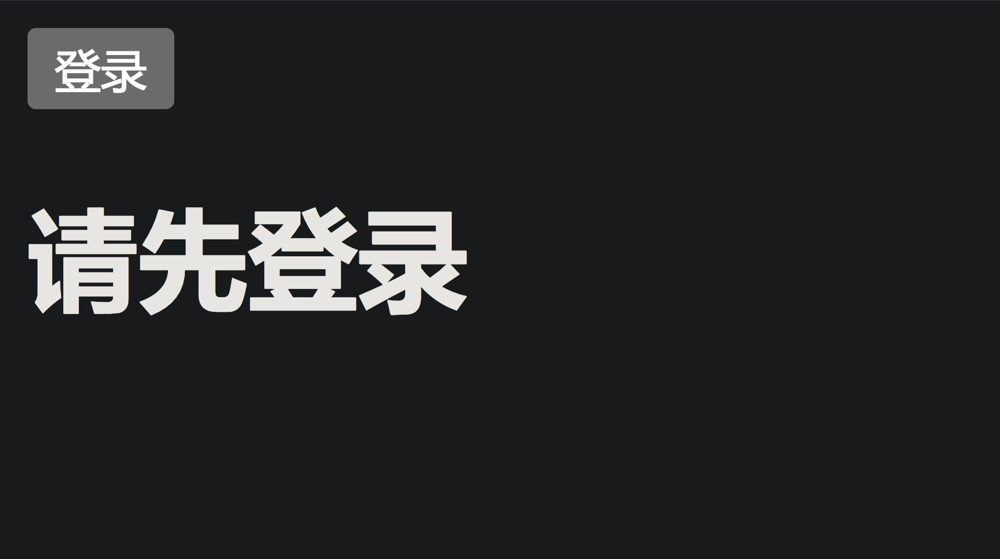
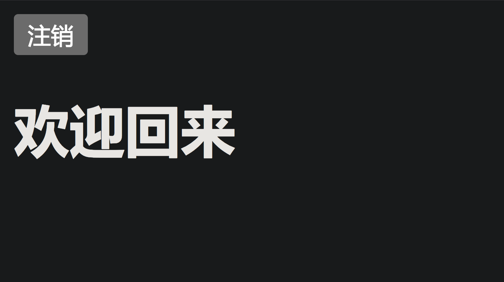

<style>
.heimu {
    position: relative;
    display: inline-block;
    color: transparent;
    text-decoration: none;
}
.heimu:: before {
    content: '';
    position: absolute;
    top: 0;
    left: 0;
    width: 100%;
    height: 100%;
    background-color: #333; /* 深色遮盖 */
    z-index: 1;
}
.heimu: hover:: before {
    background-color: transparent; /* 鼠标悬浮时移除深色遮盖 */
}
.heimu: hover {
    color: white ! important; /* 鼠标悬浮时显示白色文字 */
    text-shadow: none;
}
</style>

**如果本系列文章对您有帮助，可以 [star 一下我的 limou-learn-note](https://github.com/xiaogithubooo/LimouLearnNote)，求求惹(๑＞ ＜)☆♡~**

**叠甲：以下文章主要是依靠我的实际编码学习中总结出来的经验之谈，求逻辑自洽，不能百分百保证正确，有错误、未定义、不合适的内容请尽情指出！**

[TOC]

>   [!NOTE]
>
>   概要：...

>   [!NOTE]
>
>   资源：...

------

# 1.React 的下载

`React` 也是一个 `JS` 库，和 `Vue` 是类似，不过这个库开发起来要比 `Vue` 更加快速，两者都是为了构建单体应用程序的 `SPA` 的 `JS` 库。不过我需要在您有 `Vue` 的基础上再进一步学习 `React`，这样后面我们才能对比出两者的区别（这点很重要）。

因此我们只需要下载 `React` 的 `JS` 代码就可以使用 `React` 了，我们先不使用脚手架，暂时使用最原生的开发方式。[这里提供一个官方文档，里面提供了最新的源代码链接](https://react.docschina.org/learn/installation)，这里我只展示我此时编写文档时最新的链接（下面的三个链接都在官方提供的 `HTML` 页面中）。

```html
<!-- 源代码链接 -->
<script src="https://unpkg.com/react@18/umd/react.development.js"></script> <!-- React 核心构建界面库: 组件声明, 状态管理, 生命周期... -->
<script src="https://unpkg.com/react-dom@18/umd/react-dom.development.js"></script> <!-- ReactDOM 组件渲染库: 把 React 组件实时渲染到浏览器 DOM 上, 处理和浏览器渲染相关的工作 -->

<!-- 不要使用这个链接到实际生产中(原因我们后面再来提及): -->
<script src="https://unpkg.com/@babel/standalone/babel.min.js"></script> <!-- Babel Standalone 即时 JSX 语法编译库: 这个链接指向 Babel 的源代码, 这个源代码用用于编译现代 JS 代码和 JSX 代码, JSX 是 JS 代码的拓展, 如果不使用这个链接就会导致代码中的 JSX 语法无法被正确转化, 因此无法被浏览器渲染 -->

```

当然您也可以选择从远端直接下载源代码，顺着链接把代码保存到本地文件中进行引用即可，这里我保持上面的引入方式。

>   [!WARNING]
>
>   注意：本教程采用的 `React` 版本为 `React18`，可能和旧版本有些语法上的不同...

# 2.React 的第一份代码

```jsx
<!-- React 的第一份代码 -->
<!DOCTYPE html>
<html lang="en">
<head>
    <meta charset="UTF-8">
    <meta name="viewport" content="width=device-width, initial-scale=1.0">
    <title>React Test</title>
    <script src="https://unpkg.com/react@18/umd/react.development.js"></script> <!-- React 核心构建界面库: 组件声明, 状态管理, 生命周期... -->
    <script src="https://unpkg.com/react-dom@18/umd/react-dom.development.js"></script> <!-- ReactDOM 组件渲染库: 把 React 组件实时渲染到浏览器 DOM 上, 处理和浏览器渲染相关的工作 -->

    <!-- 不要使用这个链接到实际生产中(原因我们后面再来提及): -->
    <script src="https://unpkg.com/@babel/standalone/babel.min.js"></script> <!-- Babel Standalone 即时 JSX 语法编译库: 这个链接指向 Babel 的源代码, 这个源代码用用于编译现代 JS 代码和 JSX 代码, JSX 是 JS 代码的拓展, 如果不使用这个链接就会导致代码中的 JSX 语法无法被正确转化, 因此无法被浏览器渲染 -->
    </head>
<body>
    <!-- 这个块是 React 应用的一个挂载点 -->
    <div id="example"></div>

    <script type="text/babel"> <!-- 标记 JavaScript 代码块为使用了 JSX 语法的代码 -->
    // 创建一个名为 App 的应用
    function App() {
        return <h1>Hello, React!</h1>; // 这里其实就是 JSX 语法, 允许您在 JS 中编写 HTML 结构, 这里的 JS 代码返回了一个 <h1> 元素
    }

    // 寻找挂载点, 创建一个名为 root 的根节点
    const root = ReactDOM.createRoot(document.getElementById("example")); // 其实就是寻找 DOM 页面中 id=example 的元素
    
    // 挂载
    root.render(<App />); // 使用根节点 root 来渲染 App 应用, React 将调用 App() 将结果插入到挂载点中
    </script>
</body>
</html>

```


上述代码如果您有点难以理解，就按下面这样简单理解：

1.   创建挂载点 = 创建空容器
2.   编写应用 = 编写函数
3.   创建根节点 = 寻找 `DOM` 元素
4.   挂载 = 渲染

>   [!NOTE]
>
>   吐槽：如果您学过 `Linux` 的文件挂载，应该能很快理解上面的过程，因为这和将文件系统挂载到挂载点的逻辑是很类似的...

# 3.React 的组件

## 3.1.组件的创建

利用 `React 元素` 可以构建出一个 `React 应用`，而 `React 元素` 是由 `JSX` 编写的一种不可变对象，一旦创建就不可改变。下述 `React DOM` 最终可以通过 `ReactDOM 库` 来映射到 `浏览器 DOM`，最终渲染到浏览器上。

```jsx
const element = <p>这是一个 React 元素</p>;
```

>   [!IMPORTANT]
>
>   补充：上述这种既不像字符串又不像 `HTML` 的语法就是 `JSX`，这种语法是通过 `JS` 来实现的，`React` 通过大量的 `JSX` 声明来创建 `React 元素`，进而构建出用户界面（完全可以说 `JSX` 就是为了 `React` 而设计的）。

>   [!IMPORTANT]
>
>   补充：`React 元素` 几乎都是由 `JSX` 编写的，尽管 `React` 提供了无需使用 `JSX` 的纯 `JS` 用法来编写 `React 应用`，但是一般不推荐这么做...


>   [!IMPORTANT]
>
>   补充：`React DOM` 可以看作一种 `虚拟 DOM`，最终是一定要转化为 `物理 DOM` 也就是 `浏览器 DOM`...

去除掉函数，我们尝试改写一下我们之前的第一份代码，让您直观理解整个编写过程。

```jsx
<!-- 改写 React 的第一份代码 -->
<!DOCTYPE html>
<html lang="en">
<head>
    <meta charset="UTF-8">
    <meta name="viewport" content="width=device-width, initial-scale=1.0">
    <title>React Test</title>
    <script src="https://unpkg.com/react@18/umd/react.development.js"></script> <!-- React 核心构建界面库: 组件声明, 状态管理, 生命周期... -->
    <script src="https://unpkg.com/react-dom@18/umd/react-dom.development.js"></script> <!-- ReactDOM 组件渲染库: 把 React 组件实时渲染到浏览器 DOM 上, 处理和浏览器渲染相关的工作 -->
    
    <!-- 不要使用这个链接到实际生产中(原因我们后面再来提及): -->
    <script src="https://unpkg.com/@babel/standalone/babel.min.js"></script> <!-- Babel Standalone 即时 JSX 语法编译库: 这个链接指向 Babel 的源代码, 这个源代码用用于编译现代 JS 代码和 JSX 代码, JSX 是 JS 代码的拓展, 如果不使用这个链接就会导致代码中的 JSX 语法无法被正确转化, 因此无法被浏览器渲染 -->
</head>
<body>
    <!-- 这个块是 React 应用的一个挂载点 -->
    <div id="example"></div>

    <script type="text/babel">
    // 相当于创建一个匿名的应用, 这个匿名的 React 应用目前只由一个 React 元素构成
    const element = <p>这是一个 React 元素</p>;

    // 寻找挂载点, 并且创建一个名为 root 的根节点
    const root = ReactDOM.createRoot(document.getElementById("example")); // 其实就是寻找 DOM 页面中 id=example 的元素
    
    // 挂载
    root.render(element); // 使用根节点 root 来渲染 element 应用, React 将自动将 element 元素转化为应用(这只是一种粗糙理解, 实际可能不是这么做的, 我这种表述只是方便学习), 将结果插入到挂载点中
    </script>
</body>
</html>

```


>   [!CAUTION]
>
>   警告：上述所谓的“匿名应用、元素转化为应用”只是我的个人说法，方便学习而已...

## 3.2.组件的更新

`React` 元素都是不可变得，包括内容和属性，更新界面的唯一办法就是创建新的元素再次传入 `root.render()` 进行重新挂载，这里给一个在页面上实时显示时间的例子，和我们第一份代码一样，照猫画虎。

```jsx
<!-- 更新组件(正常) -->
<!DOCTYPE html>
<html lang="en">
<head>
    <meta charset="UTF-8">
    <meta name="viewport" content="width=device-width, initial-scale=1.0">
    <title>React Test</title>
    <script src="https://unpkg.com/react@18/umd/react.development.js"></script> <!-- React 核心构建界面库: 组件声明, 状态管理, 生命周期... -->
    <script src="https://unpkg.com/react-dom@18/umd/react-dom.development.js"></script> <!-- ReactDOM 组件渲染库: 把 React 组件实时渲染到浏览器 DOM 上, 处理和浏览器渲染相关的工作 -->
    
    <!-- 不要使用这个链接到实际生产中(原因我们后面再来提及): -->
    <script src="https://unpkg.com/@babel/standalone/babel.min.js"></script> <!-- Babel Standalone 即时 JSX 语法编译库: 这个链接指向 Babel 的源代码, 这个源代码用用于编译现代 JS 代码和 JSX 代码, JSX 是 JS 代码的拓展, 如果不使用这个链接就会导致代码中的 JSX 语法无法被正确转化, 因此无法被浏览器渲染 -->
</head>
<body>
    <!-- 挂载点 -->
    <div id="example"></div>

    <script type="text/babel">
    // 寻找挂载点, 创建根节点
    const root = ReactDOM.createRoot(document.getElementById("example"));
    
    // 编写 Tick 应用
    function Tick() {
        const element = (
        <div>
            <h1>Hello, React!</h1>
            <h2>现在是 {new Date().toLocaleTimeString()}.</h2>
        </div>
        ); // 这里的 element 还是算一个 React 元素

        // 实时挂载
        root.render(element); // 这是一种一边创建应用一边挂载的写法, 也是非常常见的, 这意味应用可以在调用的时候被渲染, 而不是交给外部的渲染
    }
    
    setInterval(Tick, 1000); // 每嗝 1 s 就调用 Tick()
    </script>
</body>
</html>

```

甚至封装得更严密一些，可以这么写：

```jsx
<!-- 更新组件(封装) -->
<!DOCTYPE html>
<html lang="en">
<head>
    <meta charset="UTF-8">
    <meta name="viewport" content="width=device-width, initial-scale=1.0">
    <title>React Test</title>
    <script src="https://unpkg.com/react@18/umd/react.development.js"></script> <!-- React 核心构建界面库: 组件声明, 状态管理, 生命周期... -->
    <script src="https://unpkg.com/react-dom@18/umd/react-dom.development.js"></script> <!-- ReactDOM 组件渲染库: 把 React 组件实时渲染到浏览器 DOM 上, 处理和浏览器渲染相关的工作 -->
    
    <!-- 不要使用这个链接到实际生产中(原因我们后面再来提及): -->
    <script src="https://unpkg.com/@babel/standalone/babel.min.js"></script> <!-- Babel Standalone 即时 JSX 语法编译库: 这个链接指向 Babel 的源代码, 这个源代码用用于编译现代 JS 代码和 JSX 代码, JSX 是 JS 代码的拓展, 如果不使用这个链接就会导致代码中的 JSX 语法无法被正确转化, 因此无法被浏览器渲染 -->
</head>
<body>
    <!-- 挂载点 -->
    <div id="example"></div>

    <script type="text/babel">
    // 编写 Tick 应用
    function Tick() {
        // 寻找挂载点, 创建根节点
        const root = ReactDOM.createRoot(document.getElementById("example"));
        
        // 堆积 React 元素
        const element = (
        <div>
            <h1>Hello, React!</h1>
            <h2>现在是 {new Date().toLocaleTimeString()}.</h2>
        </div>
        ); // 这里的 element 还是算一个 React 元素

        // 实时挂载
        root.render(element); // 这是一种一边创建应用一边挂载的写法, 也是非常常见的, 这意味应用可以在调用的时候被渲染, 而不是交给外部的渲染
    }
    
    // 每嗝 1 s 就调用 Tick()
    setInterval(Tick, 1000);
    </script>
</body>
</html>

```

如果希望提高代码可维护性，可以进行解耦：

```jsx
<!-- 更新组件(解耦) -->
<!DOCTYPE html>
<html lang="en">
<head>
    <meta charset="UTF-8">
    <meta name="viewport" content="width=device-width, initial-scale=1.0">
    <title>React Test</title>
    <script src="https://unpkg.com/react@18/umd/react.development.js"></script> <!-- React 核心构建界面库: 组件声明, 状态管理, 生命周期... -->
    <script src="https://unpkg.com/react-dom@18/umd/react-dom.development.js"></script> <!-- ReactDOM 组件渲染库: 把 React 组件实时渲染到浏览器 DOM 上, 处理和浏览器渲染相关的工作 -->
    
    <!-- 不要使用这个链接到实际生产中(原因我们后面再来提及): -->
    <script src="https://unpkg.com/@babel/standalone/babel.min.js"></script> <!-- Babel Standalone 即时 JSX 语法编译库: 这个链接指向 Babel 的源代码, 这个源代码用用于编译现代 JS 代码和 JSX 代码, JSX 是 JS 代码的拓展, 如果不使用这个链接就会导致代码中的 JSX 语法无法被正确转化, 因此无法被浏览器渲染 -->
</head>
<body>
    <!-- 挂载点 -->
    <div id="example"></div>

    <script type="text/babel">
        // 分离骨架, 本质也是一个应用(子应用: 控制界面显示)
        function Clock(props) {
            return (
                <div>
                    <h1>Hello, React!</h1>
                    <h2>现在是 {props.date.toLocaleTimeString()}.</h2>
                </div>
            );
        }

        // 编写 Tick 应用(父应用: 控制数据传入)
        function Tick() {
            // 寻找挂载点, 创建根节点
            const root = ReactDOM.createRoot(document.getElementById("example"));
            
            // 实时挂载
            root.render(<Clock date={new Date()} />); // 这是一种一边创建应用一边挂载的写法, 也是非常常见的, 这意味应用可以在调用的时候被渲染, 而不是交给外部的渲染
        }

        // 每嗝 1 s 就调用 Tick()
        setInterval(Tick, 1000);
    </script>
</body>
</html>

```

另外 `React JSX` 也可以把核心代码封装在一个 `.js` 文件中，然后交给其他的 `HTML` 页面中使用 `<script type="text/babel" src="xxx.js"></script>` 的方式引入，并且借此使用组件。

```jsx
// anonymity_app.js
// 分离骨架, 本质也是一个应用(子应用: 控制界面显示)
function Clock(props) {
    return (
        <div>
            <h1>Hello, React!</h1>
            <h2>现在是 {props.date.toLocaleTimeString()}.</h2>
        </div>
    );
}

// 编写 Tick 应用(父应用: 控制数据传入)
function Tick() {
    // 寻找挂载点, 创建根节点
    const root = ReactDOM.createRoot(document.getElementById("example"));
    
    // 实时挂载
    root.render(<Clock date={new Date()} />); // 这是一种一边创建应用一边挂载的写法, 也是非常常见的, 这意味应用可以在调用的时候被渲染, 而不是交给外部的渲染
}

// 每嗝 1 s 就调用 Tick()
setInterval(Tick, 1000);
```

```html
<!-- test.html -->
<!DOCTYPE html>
<html lang="en">
<head>
    <meta charset="UTF-8">
    <meta name="viewport" content="width=device-width, initial-scale=1.0">
    <title>React Test</title>
    <script src="https://unpkg.com/react@18/umd/react.development.js"></script> <!-- React 核心构建界面库: 组件声明, 状态管理, 生命周期... -->
    <script src="https://unpkg.com/react-dom@18/umd/react-dom.development.js"></script> <!-- ReactDOM 组件渲染库: 把 React 组件实时渲染到浏览器 DOM 上, 处理和浏览器渲染相关的工作 -->
    
    <!-- 不要使用这个链接到实际生产中(原因我们后面再来提及): -->
    <script src="https://unpkg.com/@babel/standalone/babel.min.js"></script> <!-- Babel Standalone 即时 JSX 语法编译库: 这个链接指向 Babel 的源代码, 这个源代码用用于编译现代 JS 代码和 JSX 代码, JSX 是 JS 代码的拓展, 如果不使用这个链接就会导致代码中的 JSX 语法无法被正确转化, 因此无法被浏览器渲染 -->
</head>
<body>
    <!-- 挂载点 -->
    <div id="example"></div>
    <script type="text/babel" src="./anonymity_app.js"></script>
</body>
</html>

```

好了，到这就可以了，相信您对于 `React` 的基本代码编写还是比较熟悉了。

>   [!IMPORTANT]
>
>   补充：实际上还能结合 `ES6` 的类写法，不过为了不给您添加负担，这部分我后面再提...

## 3.3.组件的模板

`JSX` 看起来就像是嵌入到 `JS` 中的 `HTML`，不过内部编写的标签和 `HTML` 是有很大的不同的。一个 `JSX` 如果有多个标签组成，就需要一个根标签进行包裹。`JSX` 的标签中还可以使用 `{}` 模板填写 `JS` 代码，这点很像一些具有模板的框架（`Falsk` 和 `Django` 包括 `Vue` 中就有使用类似的技术，功能也是类似的）

```jsx
// 演示 JSX 的一些特点
<script>
const i = 0; // 由于无法在 {} 中使用 if-else 的 JS 代码, 所以这里只能使用三元表达式
const element = (
    <div>
        <ul>
            <li>项目1</li>
            <li>项目2</li>
            <li>项目{2+1}</li>
            <li>{i == 0 ? 'yes' : 'no'}</li>
        </ul>
    </div>
); // 上面多个标签组合时, 最外面总有且只有一个根元素(这里是 div 元素)
</script>
```

`JSX` 还允许模板中存在数组，这方便我们后续对一个数组进行操作后再进行渲染，这里只是简单用一下。

```jsx
// 模板中的数组
var contentArr = [
  ,
  <p>这是一段关于图片的描述。</p>,
  ,
  <p>这是一段关于第二张图片的描述。</p>,
];

const root = ReactDOM.createRoot(document.getElementById("root"));
root.render(
  <div>{contentArr}</div>
);

```

`JSX` 的注释可以写在 `{/* ... */}` 中。

>   [!IMPORTANT]
>
>   补充：`React 应用` 有几个比较重要的属性（其实应该叫 `JSX` 的属性），这里给您稍微补充一下。
>
>   -   `React DOM` 把 `className` 作为类属性名称，而不是直接使用 `class`
>
>   -   `style` 样式属性（后面进行演示），`React` 也推荐您使用内联模式来赋予样式，样式的语法和 `CSS` 是很类似的（比较大的区别是 `CSS` 使用连字符命名，而 `JSX` 使用驼峰命名，并且不支持伪类等语法）
>
>   -   `data-xxx` 自定义属性，自定义的属性应该使用 `data-` 作为前缀才能使用
>
>   ```jsx
>   // anonymity_app.js
>   var aStyle = {
>       fontSize: 100,
>       color: '#FF0000'
>   };
>   const element = <p className="elem" style={aStyle}>这是一个 React 元素{/*这是不显示到浏览器上的注释*/}</p>;
>   const root = ReactDOM.createRoot(document.getElementById("example"));
>   root.render(element);
>   
>   ```
>
>   ```html
>   <!-- test.html -->
>   <!DOCTYPE html>
>   <html lang="en">
>   <head>
>       <meta charset="UTF-8">
>       <meta name="viewport" content="width=device-width, initial-scale=1.0">
>       <title>React Test</title>
>       <script src="https://unpkg.com/react@18/umd/react.development.js"></script>
>       <script src="https://unpkg.com/react-dom@18/umd/react-dom.development.js"></script>
>       <script src="https://unpkg.com/@babel/standalone/babel.min.js"></script>
>   </head>
>   <body>
>       <div id="example"></div>
>       <script type="text/babel" src="./anonymity_app.js"></script>
>   </body>
>   </html>
>   
>   ```
>
>   
>

## 3.4.组件的类别

>   [!NOTE]
>
>   吐槽：应用不过就是大的组件罢了，这两个词混用有时候也挺合理的...

`React` 的组件主要分为两种：

-   函数组件，使用参数 `props` 获得属性值
-   类组件，继承自 `React.Component.属性字段` 使用 `this.props.属性字段` 获取属性值

### 3.4.1.函数组件

```jsx
// anonymity_app.js: 定义函数组件
var aStyle = {
    fontSize: 100,
    color: '#FF0000'
};

// 定义函数组件
function Show(props) {
    return (
        <p className="elem" style={aStyle}>message: {props.message}{/* 这个 props 可以用来读取属性值 */}</p>
    );
}

const root = ReactDOM.createRoot(document.getElementById("example"));
root.render(<Show message="This is a info message."/>); // 这里的 <Show message=""> 中的 message 已经是一个 React 应用的属性了, 不用 data- 前缀, 这个前缀是加给 JSX 的

```

```html
<!-- test.html: 使用函数组件 -->
<!DOCTYPE html>
<html lang="en">
<head>
    <meta charset="UTF-8">
    <meta name="viewport" content="width=device-width, initial-scale=1.0">
    <title>React Test</title>
    <script src="https://unpkg.com/react@18/umd/react.development.js"></script>
    <script src="https://unpkg.com/react-dom@18/umd/react-dom.development.js"></script>
    <script src="https://unpkg.com/@babel/standalone/babel.min.js"></script>
</head>
<body>
    <div id="example"></div>
    <script type="text/babel" src="./anonymity_app.js"></script>
</body>
</html>

```

### 3.4.2.类组件

```jsx
// anonymity_app.js: 定义类组件
var aStyle = {
    fontSize: 100,
    color: '#FF0000'
};

// 定义类组件
class Show extends React.Component {
    render() { // render() 用来定义返回组件的渲染内容
        return (
            <p className="elem" style={aStyle}>
                message: {this.props.message} {/* 通过 this.props 访问属性值 */}
            </p>
        );
    }
}

const root = ReactDOM.createRoot(document.getElementById("example"));
root.render(<Show message="This is a info message."/>); 

```

```jsx
<!-- test.html: 使用类组件 -->
<!DOCTYPE html>
<html lang="en">
<head>
    <meta charset="UTF-8">
    <meta name="viewport" content="width=device-width, initial-scale=1.0">
    <title>React Test</title>
    <script src="https://unpkg.com/react@18/umd/react.development.js"></script>
    <script src="https://unpkg.com/react-dom@18/umd/react-dom.development.js"></script>
    <script src="https://unpkg.com/@babel/standalone/babel.min.js"></script>
</head>
<body>
    <div id="example"></div>
    <script type="text/babel" src="./anonymity_app.js"></script>
</body>
</html>

```

>   [!CAUTION]
>
>   注意：在 `React18` 中，函数组件也几乎成为了主流，我建议您使用函数组件（这种说法只适用于 `React16` 在函数组件中引入 `Hooks` 之后的版本），因此后续的学习中，关于类组件的部分我仅仅是简单提及一下，不做过分深入，优先学习函数组件...

>   [!TIP]
>
>   补充：两种写法该使用哪一种呢？
>
>   -   类组件支持较早，对于后端开发人员来说易于理解
>   -   函数组件支持较晚，语法简洁高效，在后续引入 `Hooks` 后几乎可以平替类组件

>   [!IMPORTANT]
>
>   补充：`React 应用` 中函数组件通常使用大驼峰法，在使用的时候也和函数名一样。

>   [!IMPORTANT]
>
>   补充：`React 应用` 的组件们相互之间都是无法得知对方是否有状态还是无状态的，因此状态独属于组件自己，算是一种封装，并且也不关心组件时函数组件还是类组件（这意味着可以混合使用），组件之间只有数据流的传递，并且时自顶向下的单向数据流动（子组件要修改数据只能通过父组件自己的状态进行变化）。
>
>   ```jsx
>   // anonymity_app.js: 数据流动方向
>   // 函数式的子组件(水经过的地方 | 数据经过的地方)
>   function FormattedDate(props) {
>       return <h2>现在是 {props.date.toLocaleTimeString()}.</h2>;
>   }
>   
>   // 类式的父组件(水源 | 数据源头)
>   class Clock extends React.Component {
>       constructor(props) {
>           super(props);
>           this.state = {date: new Date()};
>       }
>   
>       componentDidMount() {
>           this.timerID = setInterval(
>               () => this.tick(),
>               1000
>           );
>       }
>   
>       componentWillUnmount() {
>           clearInterval(this.timerID);
>       }
>   
>       tick() {
>           this.setState({
>               date: new Date()
>           });
>       }
>   
>       render() {
>           return (
>               <div>
>                   <h1>Hello, world!</h1>
>                   <FormattedDate date={this.state.date} />
>               </div>
>           );
>       }
>   }
>   
>   function App() {
>       return (
>           <div>
>               <Clock />
>           </div>
>       );
>   }
>   const root = ReactDOM.createRoot(document.getElementById("root"));
>   root.render(<App />);
>   ```
>
>   ```jsx
>   <!-- test.html: 数据流动方向 -->
>   <!DOCTYPE html>
>   <html lang="en">
>   <head>
>       <meta charset="UTF-8">
>       <meta name="viewport" content="width=device-width, initial-scale=1.0">
>       <title>React Test</title>
>       <script src="https://unpkg.com/react@18/umd/react.development.js"></script>
>       <script src="https://unpkg.com/react-dom@18/umd/react-dom.development.js"></script>
>       <script src="https://unpkg.com/@babel/standalone/babel.min.js"></script>
>   </head>
>   <body>
>       <div id="root"></div>
>       <script type="text/babel" src="./anonymity_app.js"></script>
>   </body>
>   </html>
>   
>   ```

## 3.5.组件的复合

多个组件可以复合在一起，也就是说多个 `React 应用` 可以复合出更复杂的 `React 应用`，我们这里把之前实现的两个组件 ` Tick 和 Show` 复合为一个 `App` 组件。

```jsx
// anonymity_app.js: 定义复合组件
var aStyle = {
    color: '#FF0000'
};

// 编写 Tick 应用
function Tick() {
    const tip = ReactDOM.createRoot(document.getElementById("tip"));

    const element = (
    <div>
        <h1>Hello, React!</h1>
        <h2>现在是 {new Date().toLocaleTimeString()}.</h2>
    </div>
    );

    tip.render(element);
}

// 编写 Show 应用
function Show(props) {
    return (
        <p style={aStyle}>message: {props.message}</p>
    );
}

// 编写 App 应用
function App() {
    setInterval(Tick, 1000); // 每嗝 1 s 就调用 Tick()
    return (
        <div>
            <div id="tip"></div>
            <div id="show"><Show message="This is a info message." /></div>
        </div>
    );
}

const app = ReactDOM.createRoot(document.getElementById("app"));
app.render(<App />); // 这里的 <Show message=""> 中的 message 已经是一个 React 应用的属性了, 不用 data- 前缀, 这个前缀是加给 JSX 的

```

```html
<!-- test.html: 使用复合组件 -->
<!DOCTYPE html>
<html lang="en">
<head>
    <meta charset="UTF-8">
    <meta name="viewport" content="width=device-width, initial-scale=1.0">
    <title>React Test</title>
    <script src="https://unpkg.com/react@18/umd/react.development.js"></script>
    <script src="https://unpkg.com/react-dom@18/umd/react-dom.development.js"></script>
    <script src="https://unpkg.com/@babel/standalone/babel.min.js"></script>
</head>
<body>
    <div id="app"></div>
    <script type="text/babel" src="./anonymity_app.js"></script>
</body>
</html>

```


## 3.6.组件的状态

`React` 把组件看成是一个状态机，通过与用户的交互，实现不同状态，然后渲染 `UI`，让用户界面和数据保持一致。

`React` 里，只需更新组件的 `state`，然后就根据新的 `state` 重新渲染用户界面（不要直接操作 `DOM`）。

>   [!NOTE]
>
>   吐槽：所谓状态机也算是编译原理的概念，编译原理里有状态图的定义，一个状态图内部有多个节点，每个节点有可能发生状态的变化。因此整个图就是不断持续状态的变化，产生不同的结果，整体就叫做一个状态机，`React` 这里也是类似的，`React` 把一个应用看作一个状态机，会根据某些交互来达到内部状态的变化（状态的变化其实基本就是数据的变化），然后自动重新渲染应用，而无需用户直接操作 `DOM`。<div class="heimu"> 用户只需要考虑数据变化，而 `React` 考虑的可就多了 😏...</div>

### 3.6.1.函数组件的状态

`useState` 就是组件的使用状态，这是一个 `Hook(钩子函数)`，`userState hook` 允许函数组件中使用状态管理功能。我们前面不是提到 `React` 创建的 `React 元素` 是由 `JSX` 编写的一种不可变对象么？但是我们一旦发生数据改变（状态改变）就需要重新手动挂载对象，这未免太过于麻烦，因此就有了上面这个一个钩子函数。编写格式如下，每次调用修改函数进行修改时，就会导致变量被修改，并且自动重新挂载本组件：

```jsx
const [变量, 修改函数] = React.useState(初始值); // const 表示变量要用修改函数修改而无法直接被赋值修改
```

我们编写一个计时器复合到我们之前的复合应用代码中。

```jsx
// anonymity_app.js: 函数组件的状态
var aStyle = {
    color: '#FF0000'
};

// 编写 Tick 应用
function Tick() {
    const root = ReactDOM.createRoot(document.getElementById("tip"));

    const element = (
    <div>
        <h1>Hello, React!</h1>
        <h2>现在是 {new Date().toLocaleTimeString()}.</h2>
    </div>
    );

    root.render(element);
}

// 编写 Show 应用
function Show(props) {
    return (
        <p style={aStyle}>message: {props.message}</p>
    );
}

// 编写 Counter 应用
function Counter() {
    const [count, setCount] = React.useState(0);

    return (
        <div>
        <p>Count: {count}</p>
        <button onClick={() => setCount(count + 1)}{/* JS 经常受用箭头函数替代回调 */}>Increment</button>
        </div>
    );
}

// 编写 App 应用
function App() {
    setInterval(Tick, 1000); // 每嗝 1 s 就调用 Tick()
    return (
        <div>
            <div id="tip"></div>
            <div id="show"><Show message="This is a info message." /></div>
            <div id="counter"><Counter /></div>
        </div>
    );
}

const root = ReactDOM.createRoot(document.getElementById("app"));
root.render(<App />); // 这里的 <Show message=""> 中的 message 已经是一个 React 应用的属性了, 不用 data- 前缀, 这个前缀是加给 JSX 的

```

```html
<!-- test.html: 函数组件的状态 -->
<!DOCTYPE html>
<html lang="en">
<head>
    <meta charset="UTF-8">
    <meta name="viewport" content="width=device-width, initial-scale=1.0">
    <title>React Test</title>
    <script src="https://unpkg.com/react@18/umd/react.development.js"></script>
    <script src="https://unpkg.com/react-dom@18/umd/react-dom.development.js"></script>
    <script src="https://unpkg.com/@babel/standalone/babel.min.js"></script>
</head>
<body>
    <div id="app"></div>
    <script type="text/babel" src="./anonymity_app.js"></script>
</body>
</html>

```


另外我们之前不是有一个需要重复挂载的 `Tick` 应用么，改写为状态的写法试试？

```jsx
// anonymity_app.js: 函数组件的状态
var aStyle = {
    color: '#FF0000'
};

// 编写 Tick 应用
function Tick() {
    const [time, setTime] = React.useState(new Date().toLocaleTimeString());
    
    // 副作用钩子函数(之前没用过)
    React.useEffect(() => {
        // 组件将挂载时调用
        const interval = setInterval(() => { // 设置一个定时器
            setTime(new Date().toLocaleTimeString()); // 每秒修改一次时间
        }, 1000);
        
        return () => clearInterval(interval); // 组件将卸载时调用
    }, [/* 依赖项 */]);

    return (
        <div>
            <h1>Hello, React!</h1>
            <h2>现在是 {time}.</h2>
        </div>
    );
}

// 编写 Show 应用
function Show(props) {
    return (
        <p style={aStyle}>message: {props.message}</p>
    );
}

// 编写 Counter 应用
function Counter() {
    const [count, setCount] = React.useState(0);

    return (
        <div>
            <p>Count: {count}</p>
            <button onClick={() => setCount(count + 1)}>Increment</button>
        </div>
    );
}

// 编写 App 应用
function App() {
    return (
        <div>
            <div id="tip"><Tick /></div>{/* 其实这里直接写标签的写法也间接证明了一般挂载点只有一个即可, 没必要像我们之前写的挂载两次 */}
            <div id="show"><Show message="This is a info message." /></div>
            <div id="counter"><Counter /></div>
        </div>
    );
}

const root = ReactDOM.createRoot(document.getElementById("app"));
root.render(<App />); // 这里的 <Show message=""> 中的 message 已经是一个 React 应用的属性了, 不用 data- 前缀, 这个前缀是加给 JSX 的

```

```html
<!-- test.html: 函数组件的状态 -->
<!DOCTYPE html>
<html lang="en">
<head>
    <meta charset="UTF-8">
    <meta name="viewport" content="width=device-width, initial-scale=1.0">
    <title>React Test</title>
    <script src="https://unpkg.com/react@18/umd/react.development.js"></script>
    <script src="https://unpkg.com/react-dom@18/umd/react-dom.development.js"></script>
    <script src="https://unpkg.com/@babel/standalone/babel.min.js"></script>
</head>
<body>
    <div id="app"></div>
    <script type="text/babel" src="./anonymity_app.js"></script>
</body>
</html>

```


### 3.6.2.类组件的状态

同样的，类组件也有类似的操作，并且实际上类组件的状态要比函数组件的状态要先推出，但是写起来可麻烦了...上述复合应用代码可以改写如下：

```jsx
// anonymity_app.js: 类组件的状态
var aStyle = {
    color: '#FF0000'
};

// 编写 Tick 类组件
class Tick extends React.Component {
    // 构造函数
    constructor(props) {
        super(props);
        this.state = { time: new Date().toLocaleTimeString() }; // 初始状态
    }

    // 组件将挂载
    componentDidMount() {
        this.interval = setInterval(() => {
            this.setState({ time: new Date().toLocaleTimeString() }); // 设置状态
        }, 1000);
    }

    // 组件将卸载
    componentWillUnmount() {
        clearInterval(this.interval);
    }

    // 返回
    render() {
        return (
            <div>
                <h1>Hello, React!</h1>
                <h2>现在是 {this.state.time}.</h2>
            </div>
        );
    }
}

// 编写 Show 类组件
class Show extends React.Component {
    render() {
        return (
            <p style={aStyle}>message: {this.props.message}</p>
        );
    }
}

// 编写 Counter 类组件
class Counter extends React.Component { // 和上面的应用是类似的
    constructor(props) {
        super(props);
        this.state = { count: 0 };
    }

    incrementCount = () => {
        this.setState({ count: this.state.count + 1 });
    };

    render() {
        return (
            <div>
                <p>Count: {this.state.count}</p>
                <button onClick={this.incrementCount}>Increment</button>
            </div>
        );
    }
}

// 编写 App 类组件
class App extends React.Component {
    render() {
        return (
            <div>
                <div id="tip"><Tick /></div>
                <div id="show"><Show message="This is a info message." /></div>
                <div id="counter"><Counter /></div>
            </div>
        );
    }
}

const root = ReactDOM.createRoot(document.getElementById("app"));
root.render(<App />);

```

```html
<!-- test.html: 类组件的状态 -->
<!DOCTYPE html>
<html lang="en">
<head>
    <meta charset="UTF-8">
    <meta name="viewport" content="width=device-width, initial-scale=1.0">
    <title>React Test</title>
    <script src="https://unpkg.com/react@18/umd/react.development.js"></script>
    <script src="https://unpkg.com/react-dom@18/umd/react-dom.development.js"></script>
    <script src="https://unpkg.com/@babel/standalone/babel.min.js"></script>
</head>
<body>
    <div id="app"></div>
    <script type="text/babel" src="./anonymity_app.js"></script>
</body>
</html>

```

>   [!IMPORTANT]
>
>   补充：`useEffect()` 副作用钩子函数和类组件中的 `componentDidMount()` 以及 `componentWillUnmount()` 等类似，并且功能更加强大，都是有关生命周期的钩子函数。

不过类组件的写法通常会让人更加容易理解，毕竟现在是面向对象编程的时代。我们稍微解释下上述的执行顺序，这个顺序也有助于您理解函数组件的大概调用逻辑。

1.  当 `<Tick />` 通过 `<App />` 传递给 `ReactDOM.render()` 时，`React` 调用 `Tick` 组件的构造函数。由于 `Tick` 需要显示当前时间，所以使用包含当前时间的对象来初始化 `this.state`
2.  `React` 然后调用 `Tick` 组件的 `render()` 方法，这是 `React` 了解屏幕上应该显示什么内容，然后 `React` 更新 `DOM` 以匹配 `Clock` 的渲染输出
3.  当 `Tick` 的输出插入到 `DOM` 中时，`React` 调用 `componentDidMount()` 生命周期钩子，其中 `Tick` 组件要求浏览器设置一个定时器，每秒钟调用一次 `this.setState({ time: new Date().toLocaleTimeString() });` 设置状态
4.  `Tick` 组件通过使用包含当前时间的对象调用 `setState()` 来调度 `UI` 更新，通过调用 `setState()` ，`React` 知道状态已经改变，并再次调用 `render()` 方法来确定屏幕上应当显示什么，这一次，`render()` 方法中的 `this.state.date` 将不同，所以渲染输出将包含更新的时间，并相应地更新 `DOM`
5.  一旦 `Tick` 组件被从 `DOM` 中移除，`React` 会调用 `componentWillUnmount()` 这个钩子函数，定时器也就会被清除

## 3.7.组件的属性

### 3.7.1.props 的单属性传递

之前提到过，组件之间的属性值传输依靠的是 `props`，这个我们用过很多次了，不过这里细细讲解一下。

```jsx
// anonymity_app.js: 使用带有默认值的属性
function HelloMessage({ name = 'limou' }) {
    return <h1>Hello, {name}</h1>;
}

const root = ReactDOM.createRoot(document.getElementById("root"));

root.render(
  <HelloMessage />
);

```

```html
<!-- test.html: 使用带有默认值的属性 -->
<!DOCTYPE html>
<html lang="en">
<head>
    <meta charset="UTF-8">
    <meta name="viewport" content="width=device-width, initial-scale=1.0">
    <title>React Test</title>
    <script src="https://unpkg.com/react@18/umd/react.development.js"></script>
    <script src="https://unpkg.com/react-dom@18/umd/react-dom.development.js"></script>
    <script src="https://unpkg.com/@babel/standalone/babel.min.js"></script>
</head>
<body>
    <div id="root"></div>
    <script type="text/babel" src="./anonymity_app.js"></script>
</body>
</html>

```

>   [!IMPORTANT]
>
>   补充：类组件的写法如下
>
>   ```jsx
>   // anonymity_app.js: 使用带有默认值的属性
>   class HelloMessage extends React.Component {
>       render() {
>           return (
>           <h1>Hello, {this.props.name}</h1>
>           );
>       }
>   }
>   
>   HelloMessage.defaultProps = {
>       name: 'limou'
>   };
>      
>   const root = ReactDOM.createRoot(document.getElementById("root"));
>   
>   root.render(
>     <HelloMessage />
>   );
>   
>   ```

甚至可以传递（回调）函数。

```jsx
// anonymity_app.js: 传递函数
// 父组件
function Parent() {
    const handleClick = () => {
        alert('按钮被点击了！');
    };

    return <Child onButtonClick={handleClick} />; // 这里的 onButtonClick 只是个自定义的属性名
}

// 子组件
function Child({ onButtonClick }) {
    return <button onClick={onButtonClick}>点击我</button>;
}

const root = ReactDOM.createRoot(document.getElementById("root"));

root.render(
    <Parent />
);

```

```html
<!-- test.html -->
<!DOCTYPE html>
<html lang="en">
<head>
    <meta charset="UTF-8">
    <meta name="viewport" content="width=device-width, initial-scale=1.0">
    <title>React Test</title>
    <script src="https://unpkg.com/react@18/umd/react.development.js"></script>
    <script src="https://unpkg.com/react-dom@18/umd/react-dom.development.js"></script>
    <script src="https://unpkg.com/@babel/standalone/babel.min.js"></script>
</head>
<body>
    <div id="root"></div>
    <script type="text/babel" src="./anonymity_app.js"></script>
</body>
</html>

```

### 3.7.2.props 的多属性传递

而可以传递多个属性交给属性这点之前也用过。

```jsx
// anonymity_app.js: 传递多个属性
function HelloMessage(props) {
    return (
        <div>
            <h1>Hello, {props.name}</h1>
            <p>Age = {props.age}</p>
        </div>
    );
}

HelloMessage.defaultProps = {
    name: 'limou',
    age: '18'
};

const root = ReactDOM.createRoot(document.getElementById("root"));

root.render(
    <HelloMessage />
);


```

```html
<!-- test.html: 传递多个属性 -->
<!DOCTYPE html>
<html lang="en">
<head>
    <meta charset="UTF-8">
    <meta name="viewport" content="width=device-width, initial-scale=1.0">
    <title>React Test</title>
    <script src="https://unpkg.com/react@18/umd/react.development.js"></script>
    <script src="https://unpkg.com/react-dom@18/umd/react-dom.development.js"></script>
    <script src="https://unpkg.com/@babel/standalone/babel.min.js"></script>
</head>
<body>
    <div id="root"></div>
    <script type="text/babel" src="./anonymity_app.js"></script>
</body>
</html>

```

>   [!IMPORTANT]
>
>   补充：类组件的写法如下
>
>   ```jsx
>   // anonymity_app.js: 传递多个属性
>   class HelloMessage extends React.Component {
>       render() {
>           return (
>               <div>
>                   <h1>Hello, {this.props.name}</h1>
>                   <p>Age = {this.props.age}</p>
>               </div>
>           );
>       }
>   }
>   
>   HelloMessage.defaultProps = {
>       name: 'limou',
>       age: '18'
>   };
>      
>   const root = ReactDOM.createRoot(document.getElementById("root"));
>   
>   root.render(
>     <HelloMessage />
>   );
>   
>   ```

### 3.7.3.props 隐式解构写法

```jsx
// anonymity_app.js: 隐式解构写法
function HelloMessage({name, age}) {
    return (
        <div>
            <h1>Hello, {name}</h1>
            <p>Age = {age}</p>
        </div>
    );
}

HelloMessage.defaultProps = {
    name: 'limou',
    age: '18'
};

const root = ReactDOM.createRoot(document.getElementById("root"));

root.render(
    <HelloMessage />
);


```

```html
<!-- test.html -->
<!DOCTYPE html>
<html lang="en">
<head>
    <meta charset="UTF-8">
    <meta name="viewport" content="width=device-width, initial-scale=1.0">
    <title>React Test</title>
    <script src="https://unpkg.com/react@18/umd/react.development.js"></script>
    <script src="https://unpkg.com/react-dom@18/umd/react-dom.development.js"></script>
    <script src="https://unpkg.com/@babel/standalone/babel.min.js"></script>
</head>
<body>
    <div id="root"></div>
    <script type="text/babel" src="./anonymity_app.js"></script>
</body>
</html>

```

## 3.8.组件的事件

`React` 提供了许多事件（其实应该叫 `JSX` 的属性），主要分为以下几类：

1.  **合成事件**
    *   `onClick` 点击事件
    *   `onChange` 输入字段内容改变事件
    *   `onSubmit` 表单提交事件
    *   `onMouseEnter` 鼠标进入事件
    *   `onMouseLeave` 鼠标离开事件
2.  **键盘事件**
    *   `onKeyDown` 按下键盘事件
    *   `onKeyPress` 按下字符键事件
    *   `onKeyUp` 松开键盘事件
3.  **焦点事件**
    *   `onFocus` 元素获得焦点事件
    *   `onBlur` 元素失去焦点事件
4.  **表单事件**
    *   `onInput` 输入事件
    *   `onInvalid` 输入无效事件
5.  **触摸事件**
    *   `onTouchStart` 触摸开始事件
    *   `onTouchMove` 触摸移动事件
    *   `onTouchEnd` 触摸结束事件
6.  **其他事件**
    *   `onLoad` 加载事件（如图片加载完成）
    *   `onError` 错误事件（如加载失败）

另外，`React` 的事件发生后，对应的回调函数应该使用 `{}` 进行，并且事件名称和回调名称都是采用小驼峰命名法。

```jsx
// anonymity_app.js: 使用事件和回调
function ActionLink() {
    function handleClick(e) {
        e.preventDefault();
        alert('链接被点击');
    }

    return (
        <a href="#" onClick={handleClick}>点我</a>
    );
}

const root = ReactDOM.createRoot(document.getElementById("root"));

root.render(
    <ActionLink />
);

```

```html
<!-- test.html: 使用事件和回调 -->
<!DOCTYPE html>
<html lang="en">
<head>
    <meta charset="UTF-8">
    <meta name="viewport" content="width=device-width, initial-scale=1.0">
    <title>React Test</title>
    <script src="https://unpkg.com/react@18/umd/react.development.js"></script>
    <script src="https://unpkg.com/react-dom@18/umd/react-dom.development.js"></script>
    <script src="https://unpkg.com/@babel/standalone/babel.min.js"></script>
</head>
<body>
    <div id="root"></div>
    <script type="text/babel" src="./anonymity_app.js"></script>
</body>
</html>

```

也可以向回调传递参数，可以使用箭头函数达到这一点。

```jsx
// anonymity_app.js: 向回调传递参数
function ActionLink() {
    function handleClick(e, message) {
        e.preventDefault(); // 这个调用后面有补充
        alert(message);
    }

    return (
        <a href="#" onClick={(e) => handleClick(e, '链接又被点击辣~')}>点我</a>
    );
}

const root = ReactDOM.createRoot(document.getElementById("root"));

root.render(
    <ActionLink />
);

```

```html
<!-- test.html: 向回调传递参数 -->
<!DOCTYPE html>
<html lang="en">
<head>
    <meta charset="UTF-8">
    <meta name="viewport" content="width=device-width, initial-scale=1.0">
    <title>React Test</title>
    <script src="https://unpkg.com/react@18/umd/react.development.js"></script>
    <script src="https://unpkg.com/react-dom@18/umd/react-dom.development.js"></script>
    <script src="https://unpkg.com/@babel/standalone/babel.min.js"></script>
</head>
<body>
    <div id="root"></div>
    <script type="text/babel" src="./anonymity_app.js"></script>
</body>
</html>

```

>   [!IMPORTANT]
>
>   补充：在 `React` 中另一个不同是您不能使用返回 `false` 的方式阻止默认行为， 你必须明确使用 `e.preventDefault()` 才可以。例如通常我们在 `HTML` 中阻止链接默认打开一个新页面，可以这样写：
>
>   ```html
>   <a href="#" onclick="console.log('点击链接'); return false">点我</a>
>   ```
>
>   但是我们之前的代码却是使用了 `e.preventDefault()`，这点您了解一下就好。

## 3.9.组件的生命

组件的生命周期基本也是前端组件老生常谈的东西了，学起来和理解起来并不困难，特别是本系列文章基本只是用函数组件的情况下。

这里我不再提及较复杂的类写法，而是用 `Hook` 函数里的生命周期函数（不是所有 `Hook` 函数都是生命周期钩子函数），这些函数通常以 `use` 开头。

我们之前学习的 `useState(), useEffect()` 的状态更新和副作用函数就是最经典的 `Hook` 函数。

`Hook` 是特殊的函数，比普通的函数要更加严格。

`React` 组件的生命周期分为三个主要阶段：挂载、更新、卸载，对应的类组件生命周期方法和函数组件的函数如下。

### 3.9.1.组件挂载

*   类组件
    *   `constructor()` 在 `React` 组件挂载之前，会调用它的构造函数进行初始化，用于设置初始状态和绑定事件处理函数
    *   `getDerivedStateFromProps()` 在组件接收到新的 `props` 时更新 `state`。它在每次渲染前都会被调用，包括初次渲染
    *   `render()` 该方法是 `class` 组件中唯一必须实现的方法
    *   `componentDidMount()` 在组件挂载后（插入 `DOM` 树中）立即调用
*   函数组件
    *   使用 `useEffect()` 替代

### 3.9.2.数据更新

*   类组件
    *   `getDerivedStateFromProps()` 和上述一样
    *   `shouldComponentUpdate()` 当 `props` 或 `state` 发生变化时会在渲染执行之前被调用，用于提高效率
    *   `render()` 和上述一样
    *   `getSnapshotBeforeUpdate()` 在最近一次渲染输出（提交到 `DOM` 节点，也就是调用 `render()`）之前调用。
    *   `componentDidUpdate()` 在状态更新后会被立即调用
*   函数组件
    *   使用 `useEffect(() => { ... }, [dependencies])` 和 `React.memo` 替代

### 3.9.3.组件卸载

*   类组件
    *   `componentWillUnmount()`: 在组件卸载及销毁之前直接调用
*   函数组件
    *   使用 `useEffect(() => { return () => { ... }; }, [])` 替代

直接说明是没有用的，必须使用代码演示。

```jsx
// anonymity_app.js: 组件的生命周期过程演示
// 定义一份状态的拷贝
let copy = 0;

// 自定义组件
function MyComponent({ initialValue }) { // 无需模拟 constructor() 函数组件已经自动处理好
    const [count, setCount] = React.useState(initialValue);

    // 1.挂载组件和卸载组件

    React.useEffect(() => {
        // 1.1.挂载组件
        // 模拟 componentDidMount()
        console.log('组件挂载后调用');

        // 1.2.卸载组件
        // 模拟 componentWillUnmount()
        return () => {
            console.log('组件卸载前调用');
        };
    }, []); // 不依赖任何对象就可以调用本箭头函数

    // 2.状态更新或属性更新
    
    // 2.1.状态更新
    // 模拟 componentDidUpdate()
    React.useEffect(() => {
        console.log('组件状态更新后调用', count);
        copy = count; // 拷贝一份状态
    }, [count]); // 依赖于 count 更新时才调用本箭头函数

    // 2.2.属性更新
    // 模拟 getDerivedStateFromProps()
    React.useEffect(() => {
        // 检查 props 的变化并更新 state
        console.log('组件属性更新后调用', count); // 只要外面传递的属性值不变就只触发一次
    }, [initialValue]); // 依赖于 initialValue 变化时才调用本箭头函数

    // 3.渲染组件
    return (
        <div>
            <p>{'渲染组件 -->'} 计数: {count}</p>
            <button onClick={() => setCount(count + 1)}>增加</button>
        </div>
    );
}

// 4.优化组件
const MemoizedMyComponent = React.memo(MyComponent, (prevProps, nextProps) => { // 传递组件和自比较函数, 模拟 shouldComponentUpdate()
    if (prevProps.initialValue === nextProps.initialValue) { // 这里设置为只有 initialValue 变化时(也就是返回假), 组件才会重新渲染, 因此用户可以控制属性的改变带来的渲染
        console.log('组件不允许被渲染');
        return true;
    }
    else {
        console.log('组件允许被渲染');
        return false;
    }
});

const root = ReactDOM.createRoot(document.getElementById("root"));

// 初始设置 initialValue, 第一次渲染
root.render(
    <div>
        <MemoizedMyComponent initialValue={0} />
    </div>
); // 初始化 initialValue

// 隔 3 秒重赋 initialValue, 第二次渲染
setTimeout(() => {
    root.render(
        <div>
            <MemoizedMyComponent initialValue={0} />
        </div>
    ); // 不对 initialValue 进行更新
}, 3000);

// 隔 6 秒更新 initialValue, 第二次渲染
setTimeout(() => {
    root.render(
        <div>
            <MemoizedMyComponent initialValue={10} />
        </div>
    ); // 将 initialValue 更新为 10
}, 6000);

// 隔 9 秒再次更新 initialValue, 第三次渲染
setTimeout(() => {
    root.render(
        <div>
            <MemoizedMyComponent initialValue={20} />
        </div>
    ); // 将 initialValue 更新为 20
}, 9000);

// 每隔 12 秒后卸载组件
let intervalId = setInterval(() => {
    if (copy > 10) {
        root.unmount();
    } else {
        console.log('未满足卸载条件, count 状态超过 10 才可以销毁', copy);
    }
}, 12000);
```

```html
<!-- test.html: 组件的生命周期过程演示 -->
<!DOCTYPE html>
<html lang="en">
<head>
    <meta charset="UTF-8">
    <meta name="viewport" content="width=device-width, initial-scale=1.0">
    <title>React Test</title>
    <script src="https://unpkg.com/react@18/umd/react.development.js"></script>
    <script src="https://unpkg.com/react-dom@18/umd/react-dom.development.js"></script>
    <script src="https://unpkg.com/@babel/standalone/babel.min.js"></script>
</head>
<body>
    <div id="root"></div>
    <script type="text/babel" src="./anonymity_app.js"></script>
</body>
</html>

```

>   [!IMPORTANT]
>
>   补充：也可以直接使用 `memo()` 创建组件。
>
>   ```jsx
>   // anonymity_app.js: 直接使用 memo() 创建组件
>   import React from 'react';
>   import ReactDOM from 'react-dom';
>   
>   const MyComponent = React.memo((props) => {
>       console.log('Rendering MyComponent');
>       return <div>{props.text}</div>;
>   }, (prevProps, nextProps) => {
>       return prevProps.text === nextProps.text;
>   });
>   
>   const App = () => {
>       const [count, setCount] = React.useState(0);
>       const [text, setText] = React.useState('Hello, world!');
>   
>       return (
>           <div>
>               <button onClick={() => setCount(count + 1)}>Increment Count</button>
>               <MyComponent text={text} />
>           </div>
>       );
>   };
>   
>   const root = ReactDOM.createRoot(document.getElementById('root'));
>   root.render(<App />);
>   ```

## 3.10.组件的共享

组件有时需要共享数据，通常 `React` 使用组件们的共同父组件来一起共享某些数据，这点您如果学会了上述代码的编写应该还是比较去清楚是怎么回事的。


# 4.React 的渲染

## 4.1.条件渲染

得益于 `JSX` 是 `JS` 拓展语法，`React` 的条件渲染异常简单，只需要使用 `JS` 的 `if-else` 语法或 `switch` 即可，用户不需要有过多的学习负担（一般也推荐使用 `JS` 的语法来进行条件渲染）。

```jsx
// anonymity_app.js: 使用条件渲染
function UserGreeting() {
    return <h1>欢迎回来</h1>;
}

function GuestGreeting() {
    return <h1>请先登录</h1>;
}

function ButtonGreeting({ onClick, text }) {
    return <button onClick={onClick}>{text}</button>;
}

function Greeting(props) {
    const [isLoggedIn, setIsLoggedIn] = React.useState(props.flag);

    const switchGreeting = () => { // 这种写法的好处就是不用把本调用写到外面, 易于封装
        setIsLoggedIn(prev => !prev);
    };

    if(isLoggedIn) {
        return (
            <div>
                <ButtonGreeting onClick={switchGreeting} text='注销' />
                <UserGreeting />
            </div>
        );
    }
    else {
        return (
            <div>
                <ButtonGreeting onClick={switchGreeting} text='登录' />
                <GuestGreeting />
            </div>
        );
    }
}

const root = ReactDOM.createRoot(document.getElementById("root"));

root.render(<Greeting flag={false} />); // 注意这里一定要使用 {}, 否则就会导致识别为字符串, 默认传递任何字符串的转化结果都是 true

```





>   补充：我们前面还提过一种在 `JSX` 的 `{}` 内部使用三目表达式的写法，这种也是可以的，不过 `{}` 里面没办法支持 `if-else` 确实挺遗憾的...另外还可以在 `{}` 使用 `&&` 来进行条件渲染，可以写出类似 `{JS变量 && React组件}` 这种写法。

>   补充：有些时候您可能在组件内部数据处理的阶段中，需要隐藏组件防止组件被渲染，这个时候可以使用 `return null;` 来进行返回，而不直接返回有效的 `JSX` 标签。
>
>   ```jsx
>   // 阻止组件渲染
>   function WarningBanner(props) {
>       if (!props.warn) {
>           return null;
>       }
>   
>       return (
>       <div className="warning">
>           警告!
>       </div>
>       );
>   }
>   ```
>
>   不过这种返回 `null` 的方式并不会影响该组件生命周期钩子的调用。

## 4.2.列表渲染

同样得益于 `JSX` 是 `JS` 的拓展，这里简单演示一下。

```jsx
// anonymity_app.js: 使用列表渲染
function MyComponent () {
    const items = ['Item 1', 'Item 2', 'Item 3'];
    return (
        <ul>{
            items.map((item, index) => (
                <li key={index}>{item}</li>
            ))
        }</ul>
    );
}

const root = ReactDOM.createRoot(document.getElementById("root"));

root.render(<MyComponent initialValue={0} />);

```

```html
<!-- test.html: 使用列表渲染 -->
<!DOCTYPE html>
<html lang="en">
<head>
    <meta charset="UTF-8">
    <meta name="viewport" content="width=device-width, initial-scale=1.0">
    <title>React Test</title>
    <script src="https://unpkg.com/react@18/umd/react.development.js"></script>
    <script src="https://unpkg.com/react-dom@18/umd/react-dom.development.js"></script>
    <script src="https://unpkg.com/@babel/standalone/babel.min.js"></script>
</head>
<body>
    <div id="root"></div>
    <script type="text/babel" src="./anonymity_app.js"></script>
</body>
</html>

```


# 5.React 的表单

由于 `React 应用` 是一个不可变的对象，而表单元素在 `HTML` 天然就有状态的变化，因此 `React` 的表单和 `HTML` 的表单有所i区别（`React` 虽然复杂点，但是不违背 `React` 整体的设计，从代码可读性上变好了）。

```html
<input type="text" value="Hello"/> <!-- 用户可以在这个输入框中输入文本, 输入的内容会立刻反映在输入框中, 这是一种状态变化 -->

```

由于表单元素需要有状态变化，因此就需要 `React 应用` 使用和状态相关的设置，才能编写出符合 `React` 设计的表单元素。

## 5.1.单行文本框

```jsx
// anonymity_app.js: 单行文本框
const HelloMessage = () => {
    const [value, setValue] = React.useState('Hello limou!'); // 设置状态变量和修改函数

    const handleChange = (event) => { // 设置中间(const 可以确保 handleChange 回调不会发生变化)
        setValue(event.target.value);
    };

    return (
        <div>
            <input type="text" value={value} onChange={handleChange} />
            <p>{value}</p>
        </div>
    );
};

```

如果希望进一步进行解耦，可以继续这样写：

```jsx
// anonymity_app.js: 单行文本框(解耦)
// Content 组件
const Content = ({ myDataProp, updateStateProp }) => {
    return (
        <div>
            <input type="text" value={myDataProp} onChange={updateStateProp} />
            <p>{myDataProp}</p>
        </div>
    );
};

// HelloMessage 组件
const HelloMessage = () => {
    const [value, setValue] = React.useState('Hello limou3434!');

    const handleChange = (event) => {
        setValue(event.target.value);
    };

    return (
        <div>
            <Content myDataProp={value} updateStateProp={handleChange} />{/* 这里的 updateStateProp 是自定义的, 只是把修改状态的函数传递出去给子组件使用而已 */}
        </div>
    );
};

```

下面再演示出其他的表单例子供您参考，其中还有一些值得学习的例子或值得复习的 `JS` 知识。

```jsx
// anonymity_app.js: 下拉列表
const FlavorForm = () => {
    const [value, setValue] = React.useState('coconut'); // 使用 useState 初始化状态

    const handleChange = (event) => {
        setValue(event.target.value); // 更新状态
    };

    const handleSubmit = (event) => {
        alert('您选择的是: ' + value); // 弹出当前选择的值
        event.preventDefault(); // 阻止默认的表单提交行为(使用 POST 访问 http://127.0.0.1 和刷新页面)
    };

    return (
        <form action="http://127.0.0.1" method="POST" onSubmit={handleSubmit}> {/* 点击提交后自动调用 handleSubmit */}
            选择您最喜欢的网站:
            <select value={value} onChange={handleChange}>
                <option value="gg">Google</option>
                <option value="bi">Bing</option>
                <option value="dd">DuckDuckGo</option>
                <option value="bd">Baidu</option>
            </select>
            <input type="submit" value="提交" />
        </form>
    );
};

```

```jsx
// anonymity_app.js: 单选框和数字选择器
const Reservation = () => {
    const [isGoing, setIsGoing] = React.useState(true); // 管理是否离开状态
    const [numberOfGuests, setNumberOfGuests] = React.useState(0); // 管理访客数状态

    const handleInputChange = (event) => {
        console.log("Value:", event.target.value);
        console.log("Checked:", event.target.hecked);
        console.log("Name:", event.target.name);
        console.log("Type:", event.target.type);
        console.log("ID:", event.target.id);
        console.log("Class Name:", event.target.className);

        const { name: myName, type: myType, value: myValue, checked: myChecked } = event.target;  // const { name, type, value, checked } = event.target; 这里作了一个重命名的操作

        // 根据输入类型更新状态
        if (myName === 'checkbox_isGoing') { // 可以使用 name 判断也可以使用 type 判断, 具体取决于您
            setIsGoing(myChecked);
        } else {
            setNumberOfGuests(myValue);
        }
    };

    return (
        <form>
            <label>
                是否离开:
                <input
                    name="checkbox_isGoing"
                    type="checkbox"
                    checked={isGoing}
                    onChange={handleInputChange}
                />
            </label>

            <br />

            <label>
                访客数:
                <input
                    name="number_numberOfGuests"
                    type="number"
                    value={numberOfGuests}
                    onChange={handleInputChange}
                />
            </label>
        </form>
    );
};
```

> [!WARNING]
>
> 注意：后面开始我几乎不会在写出整个挂载的过程，只写出各个组件的 `jsx` 代码以提高本文档的简洁性...

# 6.React 的引用

## 6.1.引用 JSX 原生标签

`React` 中的 `JSX` 标签可以借助引用来获取，而不再需要原生的 `JS` 进行标签查找。而这里的 `React ref` 实则是一种对象的实例化，因此内部有许多的属性可以被使用，其中 `current` 就是其中之一。

```jsx
// 使用 JS 的查询
const MyComponent = () => {
    const handleClick = () => {
        const input = document.querySelector('input[type="text"]');
        input.focus();
    };

    return (
        <div>
            <input type="text" />
            <input type="button" value="点我时, 输入框获取焦点" onClick={handleClick} />
        </div>
    );
};

```

```jsx
// 使用 JSX 的引用
const MyComponent = () => {
    const myInputRef = React.useRef(null); // 创建一个 ref

    const handleClick = () => {
        myInputRef.current.focus();
    };

    return (
        <div>
            <input type="text" ref={myInputRef} /> {/* 这样后续使用 myInputRef 的时候就相当于使用这一条 JSX 标签 */}
            <input type="button" value="点我时, 输入框获取焦点" onClick={handleClick} />
        </div>
    );
};

const root = ReactDOM.createRoot(document.getElementById('root'));
root.render(<MyComponent />);

```

## 6.2.引用 React 自定义组件

还可以通过 `useImperativeHandle Hook` 来把已封装好的 `React` 子组件内部方法暴露给外界，这样外界就可以通过使用组件实例的引用，来获取内部的方法进行调用。不过，这种暴露的做法还需要把子组件整体传入 `React.forwardRef((props, ref) => {})` 中，这样做的目的是使得传入的 `ref` 能够被转发给子组件的内部，让父组件通过 `ref` 直接引用子组件或使用其内部的方法。

```jsx
// 使用引用来调用组件实例中对外暴露的方法
const ChildComponent = React.forwardRef((props, ref) => {
    const inputRef = React.useRef(null);

    React.useImperativeHandle(ref, () => ({ // useImperativeHandle Hook 允许允许您自定义子组件可对外提供的方法, 这样就不会直接暴露整个组件实例
        focusInput() {
            inputRef.current.focus();
        },
    }));

    return <input type="text" ref={inputRef} />;
});

const ParentComponent = () => {
    const childRef = React.useRef(null);

    const handleClick = () => {
        if (childRef.current) {
            childRef.current.focusInput(); // 调用 ChildComponent 组件中的 focusInput() 方法
        }
    };

    return (
        <div>
            <ChildComponent ref={childRef} />
            <button onClick={handleClick}>Focus Child Input</button>
        </div>
    );
};

const root = ReactDOM.createRoot(document.getElementById("root"));
root.render(<ParentComponent />);

```

> [!IMPORTANT]
>
> 补充：都可以传递函数

# 6.React 的样式

`React` 的样式可以从 `JSX` 的样式属性 `style` 开始，`<x style={填入传统的css样式/css变量}><x/>` 就可以应用 `css`。

```jsx
// 使用内联样式
const MyComponent = () => {
    const [isHighlighted, setIsHighlighted] = React.useState(false);

    const containerStyle = {
        padding: '20px',
        backgroundColor: isHighlighted ? '#ffff99' : '#f0f0f0'
    };

    const titleStyle = {
        fontSize: '24px',
        color: '#333'
    };

    return (
        <div style={containerStyle}>
            <h1 style={titleStyle}>Hello, world!</h1>
            <button onClick={() => setIsHighlighted(!isHighlighted)}>点击高亮/点击取消</button>
        </div>
    );
};

```

>   [!IMPORTANT]
>
>   补充：上述的 `css` 都是使用大驼峰才能做到，下面都是使用原生的 `css`。

-   也可以把 `css` 封装为 `css` 文件，通过 `css` 选择器来赋予 `jsx` 标签样式，再使用 ` <link rel="stylesheet" href="./App.css">` 进行导入（`Node.js` 等包管理环境则可以使用 `import` 引入）
-   而另外一种就是使用 `css 模块`，选择器可以使用 `.组件{}` 的形式来赋予一个单独组件的样式

```css
/* App.css */
body {
  background-color: #282c34;
  color: white;
  padding: 40px;
  font-family: Sans-Serif;
  text-align: center;
}
```

```cpp
// 使用外联样式
const Header = () => {
  return (
    <div>
      <h1>Hello Style!</h1>
      <p>Add a little style!.</p>
    <div/>
  );
}
```

>   补充：还有一个 `React Sass` 是 `css` 的拓展（比如变量、嵌套规则、混入、函数等等），以及 `React Tailwind CSS` 的 `css` 框架。但通过链接引入的形式不好演示，后面补充...

# 7.React 的路由

## 7.1.普通路由

这里也给一个有效的连接供您使用，这是使用 `React` 路由必须要引入的 `js` 库（暂时引入 `React Router v5` 因为，更高版本的不好找 `JS` 源代码）。

```html
<script src="https://unpkg.com/react-router-dom@5/umd/react-router-dom.min.js"></script>
```

使用起来也很简单，和 `Vue` 的没什么差别。

```jsx
// App.js: 展开写法
function Home() {
    return <h2>Home Page</h2>;
}

function About() {
    return <h2>About Page</h2>;
}

function NotFound() {
    return <h2>404 Not Found</h2>;
}

function App() {
    return (
        <window.ReactRouterDOM.BrowserRouter basename="/Test.html"> {/* <浏览器路由标签> */}
            <div>
                <nav><ul>
                    <li><window.ReactRouterDOM.Link to="/">Home</window.ReactRouterDOM.Link></li> {/* <链接标签> */}
                    <li><window.ReactRouterDOM.Link to="/about">About</window.ReactRouterDOM.Link></li>
                </ul></nav>

                <window.ReactRouterDOM.Switch> {/* <切换标签> */}
                    <window.ReactRouterDOM.Route path="/" exact component={Home} /> {/* <路由标签> */}
                    <window.ReactRouterDOM.Route path="/about" component={About} />
                    <window.ReactRouterDOM.Route component={NotFound} /> {/* "兜底"的路由 */}
                </window.ReactRouterDOM.Switch>
            </div>
        </window.ReactRouterDOM.BrowserRouter>
    );
}

```

```jsx
// App.js: 结构写法
function Home() {
    return <h2>Home Page</h2>;
}

function About() {
    return <h2>About Page</h2>;
}

function NotFound() {
    return <h2>404 Not Found</h2>;
}

const { BrowserRouter, Switch, Route, Link } = window.ReactRouterDOM;

function App() {
    return (
        <BrowserRouter basename="/Test.html">
            <div>
                <nav><ul>
                    <li><Link to="/">Home</Link></li>
                    <li><Link to="/about">About</Link></li>
                </ul></nav>

                <Switch>
                    <Route path="/" exact component={Home} />
                    <Route path="/about" component={About} />
                    <Route component={NotFound} />
                </Switch>
            </div>
        </BrowserRouter>
    );
}

const root = ReactDOM.createRoot(document.getElementById('root'));
root.render(<App />);
```

> [!IMPORTANT]
>
> 补充：在使用 `<script>` 标签引入库时（如 `react-router-dom`），这些库会被加载到全局对象 `window` 中，`window` 包含了所有全局变量和函数。`const { BrowserRouter, Switch, Route, Link } = window.ReactRouterDOM;` 其实是一个解构赋值的语句，从 `window.ReactRouterDOM` 对象中提取出 `BrowserRouter, Switch, Route, Link` 四个属性。

> [!IMPORTANT]
>
> 补充：`React Router v5` 使用 `Switch+component`, 但是 `React Router v6` 使用 `Routes+element` 等我之后使用脚手架后再来采用这种做法，后者语义上更加明显，并且 `element` 要比 `component` 更加强大，可以以 `React 应用` 的方式来传入页面，更加符合整体设计。除此以外，使用新版本的 `element` 还能方便用户传递属性，这些我们以后提及...

## 7.2.嵌套路由

还可以使用嵌套的路由，不过 `React Router v5` 和 `React Router v6` 的写法有些不同，我们先展示前一种版本的写法，后一种我们以后再来...

```jsx
// App.js: 嵌套路由
function Home() {
    return <h2>Home Page</h2>;
}

function About() {
    return <h2>About Page</h2>;
}

function Blog() {
    return (
        <div>
            <h2>Blog Page</h2>
            <nav>
                <ul>
                    <li><Link to="/blog/text1">Text 1</Link></li>
                    <li><Link to="/blog/text2">Text 2</Link></li>
                </ul>
            </nav>
            <Switch> {/* React Router v5 的嵌套路由如果内部组件传递属性只能这么写 */}
                <Route path="/blog/text1" render={() => <Text customProp="Text 1 Content" />} />
                <Route path="/blog/text2" render={() => <Text customProp="Text 2 Content" />} />
            </Switch>
        </div>
    );
}

function Text({ customProp }) {
    return <h2>{customProp}</h2>;
}

function NotFound() {
    return <h2>404 Not Found</h2>;
}

const { BrowserRouter, Switch, Route, Link } = window.ReactRouterDOM;

function App() {
    return (
        <BrowserRouter basename="/Test.html">
            <div>
                <nav>
                    <ul>
                        <li><Link to="/">Home</Link></li>
                        <li><Link to="/blog">Blog</Link></li>
                        <li><Link to="/about">About</Link></li>
                    </ul>
                </nav>

                <Switch>
                    <Route path="/" exact component={Home} />
                    <Route path="/blog" component={Blog} />
                    <Route path="/about" component={About} />
                    <Route component={NotFound} />
                </Switch>
            </div>
        </BrowserRouter>
    );
}

```

>   [!IMPORTANT]
>
>   补充：`Route` 组件的 `render()` 允许你在匹配到某个路径时渲染一个组件，并且可以将 `Route` 的路由参数等信息（如 `match`, `location`, `history`）传递给该组件。同样的，`React Router v5` 和 `React Router v6` 也有编写上的区别，以后提及。 

## 7.3.传参路由

```jsx
// App.js: 传递路由参数
function Home() {
    return <h2>Home Page</h2>;
}

function About() {
    return <h2>About Page</h2>;
}

function Blog() {
    return (
        <div>
            <h2>Blog Page</h2>
            <nav>
                <ul>
                    <li><Link to="/blog/text/1">Text 1</Link></li>
                    <li><Link to="/blog/text/2">Text 2</Link></li>
                </ul>
            </nav>
            <Switch> {/* React Router v5 的嵌套路由如果内部组件传递属性只能这么写 */}
                <Route path="/blog/text/:id" render={({ match }) => <Text id={match.params.id} />} />
            </Switch>
        </div>
    );
}

function Text({ id }) {
    return <h2>{`Text ${id} Content`}</h2>;
}

function NotFound() {
    return <h2>404 Not Found</h2>;
}

const { BrowserRouter, Switch, Route, Link } = window.ReactRouterDOM;

function App() {
    return (
        <BrowserRouter basename="/Test.html">
            <div>
                <nav>
                    <ul>
                        <li><Link to="/">Home</Link></li>
                        <li><Link to="/blog">Blog</Link></li>
                        <li><Link to="/about">About</Link></li>
                    </ul>
                </nav>

                <Switch>
                    <Route path="/" exact component={Home} />
                    <Route path="/blog" component={Blog} />
                    <Route path="/about" component={About} />
                    <Route component={NotFound} />
                </Switch>
            </div>
        </BrowserRouter>
    );
}

```

>   [!IMPORTANT]
>
>   补充： 另外还有一个关于路由重定向的功能就是使用 `Navigate`，不过 `Navigate` 是 `React Router v6` 中才引入的组件。在 `v5` 中，如果要实现类似的导航重定向跳转，可以使用 `<Redirect>` 来替代。

# 8.React 的 Ajax

关于 `Ajax` 的使用，在 `Vue` 中已经用过很多，这里只给一个简单的例子作为演示，直接使用 `Axios` 组件而不是用原生的组件。

```html
<script src="https://cdn.staticfile.org/axios/0.18.0/axios.min.js"></script>
```

我们先简单使用 `ajax` 向 `node` 服务区发送 `get` 请求，然后处理数据或错误。

```js
// server.js: 在具有公网的服务器中运行 node 服务器
const http = require('http');

const host = '0.0.0.0';
const port = 8087;

const server = http.createServer((req, res) => {
    const clientIp = req.connection.remoteAddress;
    console.log(`Request from IP: ${clientIp}`);

    res.setHeader('Access-Control-Allow-Origin', '*'); // 允许所有来源(防止跨域问题)
    res.writeHead(200, {'Content-Type': 'text/plain'});
    res.end('Hello\n');
});

server.listen(port, host, () => {
    console.log(`Server running at http://${host}:${port}/`);
});

server.on('error', (err) => {
    console.error('Server error:', err);
});

```

```jsx
// anonymity_app.js: 编写关于 ajax 的组件代码
const MyComponent = () => {
    const [message, setMessage] = React.useState(null); // 设置响应消息
    const [error, setError] = React.useState(null);
    const [loading, setLoading] = React.useState(true);

    React.useEffect(() => {
        const fetchData = async () => { // async 和 await
            try {
                const response = await axios.get('http://您所拥有的公网ip地址:8087'); // 请求 Node.js 服务器(这里就用到了 axios)
                setMessage(response.data); // 获取服务器返回的文本
            } catch (error) {
                console.error('Error fetching data:', error);
                setError('Error fetching data');
            } finally {
                setLoading(false); // 请求结束后设置 loading 为 false
            }
        };

        fetchData();
    }, []);

    if (loading) {
        return <div>Loading...</div>; // 加载状态
    }

    if (error) {
        return <div>{error}</div>; // 错误信息
    }

    return (
        <div>
            <h1>Server Response:</h1>
            <pre>{message}</pre> {/* 显示服务器返回的文本 */}
        </div>
    );
};

const root = ReactDOM.createRoot(document.getElementById("root"));
root.render(<MyComponent />);

```

```html
<!-- test.html: 使用 ajax 进行网络通信 -->
<!DOCTYPE html>
<html lang="en">

<head>
    <meta charset="UTF-8">
    <meta name="viewport" content="width=device-width, initial-scale=1.0">
    <title>React Test</title>
    <script src="https://unpkg.com/react@18/umd/react.development.js"></script>
    <script src="https://unpkg.com/react-dom@18/umd/react-dom.development.js"></script>
    <script src="https://unpkg.com/@babel/standalone/babel.min.js"></script>
    <script src="https://cdn.staticfile.org/axios/0.18.0/axios.min.js"></script>
</head>

<body>
    <div id="root"></div>
    <script type="text/babel" src="./anonymity_app.js"></script>
</body>

</html>
```


关于其他 `ajax` 其他的知识在这里就不展开了。

# 9.React 的校验

```html
<script src="https://lf3-cdn-tos.bytecdntp.com/cdn/expire-1-M/prop-types/15.8.1/prop-types.min.js" type="application/javascript"></script>
```

虽然我给了您代码链接，但是不打算使用它，而是在后续使用脚手架的时候再来考虑重新学习样式、路由、`Ajax`、校验的用法。

# 10.React 的 Hooks

一些常见的 `Hooks`，待补充...

https://www.runoob.com/react/react-hooks.html

---

>   [!NOTE]
>
>   结语：...

**如果本系列文章对您有帮助，可以 [star 一下我的 limou-learn-note](https://github.com/xiaogithubooo/LimouLearnNote)，求求惹(๑＞ ＜)☆♡~**