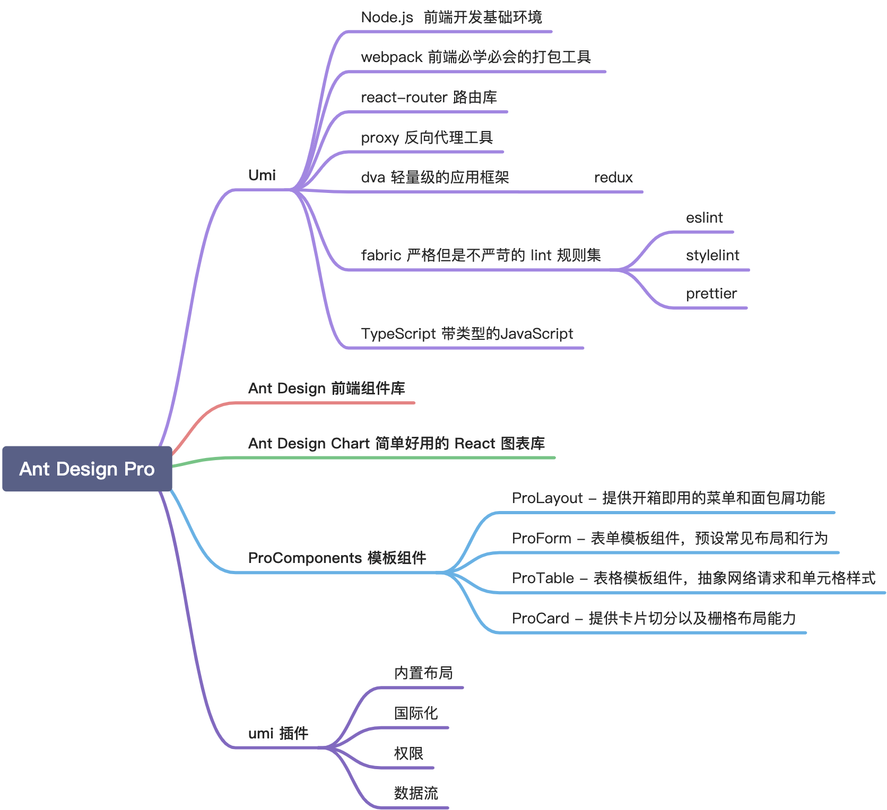

<style>
.heimu {
    position: relative;
    display: inline-block;
    color: transparent;
    text-decoration: none;
}
.heimu::before {
    content: '';
    position: absolute;
    top: 0;
    left: 0;
    width: 100%;
    height: 100%;
    background-color: #333; /* 深色遮盖 */
    z-index: 1;
}
.heimu:hover::before {
    background-color: transparent; /* 鼠标悬浮时移除深色遮盖 */
}
.heimu:hover {
    color: white !important; /* 鼠标悬浮时显示白色文字 */
    text-shadow: none;
}
</style>


**如果本系列文章对您有帮助，可以 [star 一下我的 limou-learn-note](https://github.com/xiaogithubooo/LimouLearnNote)，求求惹(๑＞ ＜)☆♡~**

**叠甲：以下文章主要是依靠我的实际编码学习中总结出来的经验之谈，求逻辑自洽，不能百分百保证正确，有错误、未定义、不合适的内容请尽情指出！**

[TOC]

>   [!NOTE]
>
>   概要：...

>   [!NOTE]
>
>   资源：...

------

# 1.create-react-app 简介

抛弃我们之前使用

# 2.create-react-app 创建


# 3.create-react-app 目录


# 4.create-react-app 使用


# 5.create-react-app 打包


# 6.create-react-app 框架

## 6.1.Ant Design Pro 的环境配置

我的主要目的是带您了解关于 [Antd pro](https://pro.ant.design/zh-CN/docs/getting-started/) 这一开箱即用的开发框架，不过使用 `Antd pro` 这一种大框架，需要有几个知识的铺垫，如下是官方给的思维导图。



从上图可以看出，您至少需要有：

- 对于 `Web 技术` 的了解
- 对于 `Node.js` 的了解
- 对于 `Webpack` 的了解
- 对于 `React` 的了解
- 对于 `React 拓展库` 的了解
- 对于 `JS/TS` 的了解
- 对于 `Ant Design` 的了解
- 对于 `umi` 的了解

不过，我们不用那么麻烦一个一个去了解，直接看官方文档进行操作即可，在过程中进行学习即可，您只需要持有两个链接：

- [Ant Design Pro](https://pro.ant.design/zh-CN/docs/getting-started/)
- [Ant Design](https://ant.design/components/overview-cn)

推荐使用 [tyarn](https://www.npmjs.com/package/tyarn) 来进行包管理（`sudo npm install -g tyarn`），可以极大地减少 `install` 的时间和失败的概率，并且完全兼容 `npm`，不过谁叫我是魔法师呢（我依旧使用 `npm` 进行管理）？

```bash
# 安装 @ant-design/pro-cli 的项目构建工具
$ npm i @ant-design/pro-cli -g

$ pro -v
3.2.1

$ npm list -g @ant-design/pro-cli
/usr/local/lib
└── @ant-design/pro-cli@3.2.1
```

## 6.2.Ant Design Pro 的创建项目

接下来使用 `ant-design/pro-cli` 也就是 `pro` 来初始化一个项目。

```shell
# 创建项目
$ pro create myapp

$ tree -L 3 antd_pro_test
antd_pro_test
├── myapp
│   ├── config
│   │   ├── config.ts
│   │   ├── defaultSettings.ts
│   │   ├── oneapi.json
│   │   ├── proxy.ts
│   │   └── routes.ts
│   ├── jest.config.ts
│   ├── jsconfig.json
│   ├── mock
│   │   ├── listTableList.ts
│   │   ├── notices.ts
│   │   ├── requestRecord.mock.js
│   │   ├── route.ts
│   │   └── user.ts
│   ├── package.json
│   ├── pnpm-lock.yaml
│   ├── public
│   │   ├── CNAME
│   │   ├── favicon.ico
│   │   ├── icons
│   │   ├── logo.svg
│   │   ├── pro_icon.svg
│   │   └── scripts
│   ├── README.md
│   ├── src
│   │   ├── access.ts
│   │   ├── app.tsx
│   │   ├── components
│   │   ├── global.less
│   │   ├── global.tsx
│   │   ├── locales
│   │   ├── manifest.json
│   │   ├── pages
│   │   ├── requestErrorConfig.ts
│   │   ├── services
│   │   ├── service-worker.js
│   │   └── typings.d.ts
│   ├── tests
│   │   └── setupTests.jsx
│   ├── tsconfig.json
│   └── types
│       ├── cache
│       └── index.d.ts
├── node_modules
├── package.json
└── package-lock.json
```

然后就可以开始管理项目了，我们只执行下面的 `npm install` 和 `npm run start` 就行，就尝试登陆一下网站就行。

```shell
# 管理项目
$ npm install # 安装依赖
$ npm run start # 启动项目(热载开发)
# 访问给予的网站即可

# 下面是一些常见的指令
$ npm run build # 编译项目(便于部署)
$ npm run analyze # 和 build 类似, 但是会打开页面展示依赖信息
$ npm run lint # 检查 TS, less, css, md 等文件中是是否存在代码问题(使用 lint:fix 甚至还会尝试自动修复)
```


## 6.3.Ant Design Pro 的模拟后端

`MOCK` 是一种在前端开发中使用的技术（本质就是一样 `js`），用于模拟后端 `API` 的响应数据。在后端服务尚未完成时，前端开发人员可以使用 `mock` 数据来实现和测试前端功能，`MOCK` 数据通常由以下三个部分组成：

1. **请求方法**：指定 `HTTP` 请求的类型，常见的有 `GET` 和 `POST`
2. **请求 URL**：定义客户端发送请求的地址，通常会使用统一的前缀，以便进行代理和管理
3. **数据处理**：可以直接返回 `JSON` 数据，或者使用函数处理请求。函数可以接受 `req`（请求对象）、`res`（响应对象）和 `url`（请求的 `URL`）作为参数，通过 `res.send` 方法返回响应

```js
// 模拟后端
export default {
  'GET /api/rule': [{ name: '12' }], // 简写, 表示当收到一个 GET 请求, URL 为 /api/rule 时返回的响应数据是一个包含对象 { name: '12' } 的数组
  'POST /api/rule': (req: Request, res: Response, u: string) => {
    res.send({
      success: true,
    });
  },
};
```

这种方式使得前端开发能够独立于后端开发进行，同时也便于测试和调试，后面再用。

## 6.4.Ant Design Pro 的开发结构

### 6.4.1.文件目录树

```shell
# 项目初始化的文件目录树
MyApp
├── config/ # umi 配置, 包含路由, 构建等配置
├── mock/ # 本地模拟数据(模拟后端)
├── public/ # 公共资源        
├── src/ # 源代码
├── tests/ # 测试工具
├── README.md
└── package.json

```

### 6.4.2.源代码解析

```shell
# 源代码目录
.
├── .umi/
├── typings.d.ts # TypeScript 类型定义文件
├── access.ts # 访问控制策略, 管理用户权限
├── components/ # 可复用的 React 组件
|   ├── Footer/
|   ├── HeaderDropdown/
|   ├── RightContent/
|   └── index.ts
├── app.tsx # 应用主入口文件, 配置全局状态和路由
├── pages/ # 应用页面组件, 对应路由
├── requestErrorConfig.ts     // 请求错误处理配置
├── services                  // 封装与后端 API 交互的服务文件
├── service-worker.js         // 服务工作者文件，实现离线支持等功能
├── global.less               // 全局样式文件，使用 Less 预处理器
├── global.tsx                // 全局配置或上下文提供者
├── locales                   // 国际化相关文件，存放翻译资源
└── manifest.json             // Web 应用信息描述文件，用于 PWA

```

我们按照上面的文件目录树来一个一个进行研究，逐步进行解读，并且把一些对您不熟悉的语法进行解析。

```ts
// src/typings.d.ts: 定义众多类型
// @ts-ignore
/* eslint-disable */

// 这里定义的就是一些自定义类型, 可以用于帮助函数检查参数时候符合要求
declare namespace API {
  type CurrentUser = {
    name?: string;
    avatar?: string;
    userid?: string;
    email?: string;
    signature?: string;
    title?: string;
    group?: string;
    tags?: { key?: string; label?: string }[];
    notifyCount?: number;
    unreadCount?: number;
    country?: string;
    access?: string;
    geographic?: {
      province?: { label?: string; key?: string };
      city?: { label?: string; key?: string };
    };
    address?: string;
    phone?: string;
  };

  type LoginResult = {
    status?: string;
    type?: string;
    currentAuthority?: string;
  };

  type PageParams = {
    current?: number;
    pageSize?: number;
  };

  type RuleListItem = {
    key?: number;
    disabled?: boolean;
    href?: string;
    avatar?: string;
    name?: string;
    owner?: string;
    desc?: string;
    callNo?: number;
    status?: number;
    updatedAt?: string;
    createdAt?: string;
    progress?: number;
  };

  type RuleList = {
    data?: RuleListItem[];
    /** 列表的内容总数 */
    total?: number;
    success?: boolean;
  };

  type FakeCaptcha = {
    code?: number;
    status?: string;
  };

  type LoginParams = {
    username?: string;
    password?: string;
    autoLogin?: boolean;
    type?: string;
  };

  type ErrorResponse = {
    /** 业务约定的错误码 */
    errorCode: string;
    /** 业务上的错误信息 */
    errorMessage?: string;
    /** 业务上的请求是否成功 */
    success?: boolean;
  };

  type NoticeIconList = {
    data?: NoticeIconItem[];
    /** 列表的内容总数 */
    total?: number;
    success?: boolean;
  };

  type NoticeIconItemType = 'notification' | 'message' | 'event';

  type NoticeIconItem = {
    id?: string;
    extra?: string;
    key?: string;
    read?: boolean;
    avatar?: string;
    title?: string;
    status?: string;
    datetime?: string;
    description?: string;
    type?: NoticeIconItemType;
  };
}

```

```ts
// src/access.ts: 定义用户权限
/**
 * @see https://umijs.org/docs/max/access#access
 * */

// access 的翻译就是 "使用权", 下面这个 ts 函数实际上就是为了判断用户权限的
export default function access(initialState: { currentUser?: API.CurrentUser } | undefined) {
  // 这里的 initialState 是一个可以包含名为 currentUser 的属性的函数参数
  // '?' 表示 currentUser 属性是可选的(因此可以不包含)
  // ": API.CurrentUser" 中的 API.CurrentUser 通常在 declare namespace 命名空间中自定义, 这种方式 ": 类型" 的做法可以用来检查参数类型
  // "| undefined" 表示 initialState 参数还可以在本函数调用时不传入

  const { currentUser } = initialState ?? {}; // ?? 是空值合并运算符, 用于处理 null 或 undefined 的分支情况
  // 这里使用解构赋值语法
  // 如果 initialState 对象有存在, 则从中提取 currentUser 属性到变量 currentUser 中
  // 如果 initialState 对象不存在(是 null 或 undefined), 则 currentUser 赋值为空对象 {}

  return {
    canAdmin: currentUser && currentUser.access === 'admin',
  };
  // 返回一个对象, 只有 currentUser 存在且满足 currentUser.access === 'admin' 那么就有 canAdmin 的值为 true, 也就是存在权限
}

```

经过上面的学习，您可以知道 `ts` 和 `js` 的一些不同之处。

```tsx
// src/components/index.ts: 导入所有公共组件后进行统一的导出
/**
 * 这个文件作为组件的目录
 * 目的是统一管理对外输出的组件，方便分类
 */
/**
 * 布局组件
 */
import Footer from './Footer'; // 实际是导入 ./Footer/index.ts
import { Question, SelectLang } from './RightContent'; // 实际是导入 ./RightContent/index.ts
import { AvatarDropdown, AvatarName } from './RightContent/AvatarDropdown'; // 实际是导入 ./RightContent/AvatarDropdown.tsx

export { Footer, Question, SelectLang, AvatarDropdown, AvatarName }; // 再统一进行导出

```

这里的 `components` 定义了五个公用组件：

1.   `Footer` 用于页面的底部，通常包含版权信息、网站链接或其他相关信息
2.   `Question` 通常用于展示一些常见问题（`FAQ`）或帮助信息，用来引导用户了解如何使用应用程序，或者解答他们可能遇到的常见问题
3.   `SelectLang` 用于语言选择，允许用户在不同语言之间切换
4.   `AvatarDropdown` 用于显示用户的头像，并提供下拉菜单，通常包含用户的相关操作选项，如账户设置、登出等
5.   `AvatarName` 显示用户的名称和头像，通常在用户界面中提供个性化的体验

>   [!IMPORTANT]
>
>   补充：在 `JS` 或 `TS` 项目中，`import Footer from './Footer';` 的这种导入方式，实际上并不是导入一个文件夹，而是导入文件夹中的特定文件。这里的导入路径遵循了 `Node.js` 的模块解析规则。
>
>   举个例子来说，`import Footer from './Footer';` 的工作方式是：
>
>   1.  优先查找 `Footer.js` 或 `Footer.tsx` 文件，如果当前路径下有一个名为 `Footer.js`、`Footer.jsx`、`Footer.ts` 或 `Footer.tsx` 的文件，它会直接导入这个文件。
>   2.  查找 `Footer/index.js` 或 `Footer/index.tsx` 文件，如果没有直接命名为 `Footer.js` 的文件，接下来它会在 `./Footer` 文件夹中查找 `index.js`、`index.tsx`、`index.ts` 或 `index.jsx` 文件（这是一种常见的组织文件的方式，也就是将组件相关文件放在一个文件夹里，并通过 `index.js` 文件来统一导出）。
>
>   这种写法常见于将复杂组件分离到多个文件中，以保持代码的结构清晰。如果 `Footer` 是一个文件夹，而 `index.js` 是文件夹中的入口文件，那么 `import Footer from './Footer';` 实际上等同于 `import Footer from './Footer/index.js';`。

```tsx
// src/components/Footer/index.tsx: 定义网页中页脚组件
import { GithubOutlined } from '@ant-design/icons'; // 从 npm 包中的 ant-design/icons 导入 GithubOutlined 图标
import { DefaultFooter } from '@ant-design/pro-components'; // 从 npm 包中的 ant-design/pro-components 导入 DefaultFooter 组件
import React from 'react';
import type {WithFalse} from "@ant-design/pro-layout/es/typing"; // 从 npm 包中的 react 导入 React 组件

// 不带 @ 的模块表示普通包, 不属于任何特定的组织, 就会直接从 ./myapp/node_modules/ 中寻找对应的 js 包
// 使用 @ 是为了表示模块属于某个特定的组织或用户, 可以理解 @ 为 ./myapp/node_modules/@..., @ant-design 就表示 ./myapp/node_modules/@ant-design

// 定义一个名为 Footer, "页脚" 的函数组件, 使用 React.FC 类型声明
// React.FC 是 React 的函数组件类型, 通常用于定义函数组件的类型
const Footer: React.FC = () => {
  return (
    <DefaultFooter
      // 传递多个样式
      style={{
        background: 'none',
      }}
      // 传递页脚要显示的链接
      links={[
        {
          key: 'Intelligent cloud backup', // key 值
          title: '智能云备份', // 可见标题
          href: '/', // 跳转链接
          blankTarget: true, // 链接将允许新标签页中打开
        },
        {
          key: 'Individual developer',
          title: <GithubOutlined />,
          href: 'https://github.com/xiaogithubooo',
          blankTarget: true,
        },
        {
          key: 'Development framework',
          title: '开发框架',
          href: 'https://pro.ant.design/zh-CN/',
          blankTarget: true,
        },
      ]}
      // 版权信息
      copyright="limou3434"
    />
  );
};

export default Footer; // 其他文件在导入时就可以使用任何名称来引用这个默认导出

```

```ts
// src/components/RightContent/index.tsx: 定义网站中右侧内容的问号文档组件、切换语言组件
import { QuestionCircleOutlined } from '@ant-design/icons';
// import { SelectLang as UmiSelectLang } from '@umijs/max';
import React from 'react';

export type SiderTheme = 'light' | 'dark';

// 定义 SelectLang 组件, 用于切换语言
export const SelectLang = () => {
  return null; // 暂时不做国际化
  // return (
  //   <UmiSelectLang
  //     style={{
  //       padding: 4,
  //     }}
  //   />
  // );
};

// 定义 Question 组件, 用于打开说明文档
export const Question = () => {
  return (
    <div
      style={{
        display: 'flex',
        height: 26,
      }}
      onClick={() => {
        window.open('https://github.com/xiaogithubooo'); // 打开说明文档
      }}
    >
      <QuestionCircleOutlined />
    </div>
  );
};

```


>   [!IMPORTANT]
>
>   补充：拓展运算符 `...` 这里简单直接使用一个例子快速带您理解。
>
>   ```jsx
>   // 使用拓展运算符
>   const arr1 = [1, 2, 3]; // 原数组
>   const arr2 = [...arr1, 4, 5]; // 使用扩展运算符
>   console.log(arr2); // 输出: [1, 2, 3, 4, 5]
>   
>   ```


------

>   [!NOTE]
>
>   结语：...

**如果本系列文章对您有帮助，可以 [star 一下我的 limou-learn-note](https://github.com/xiaogithubooo/LimouLearnNote)，求求惹(๑＞ ＜)☆♡~**


