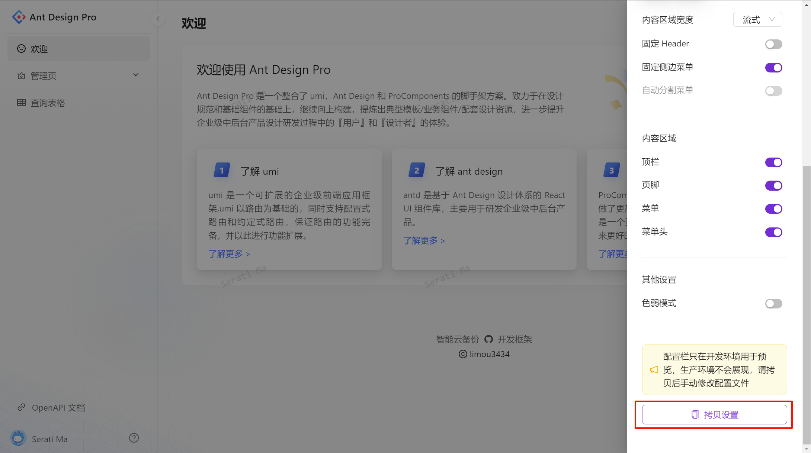
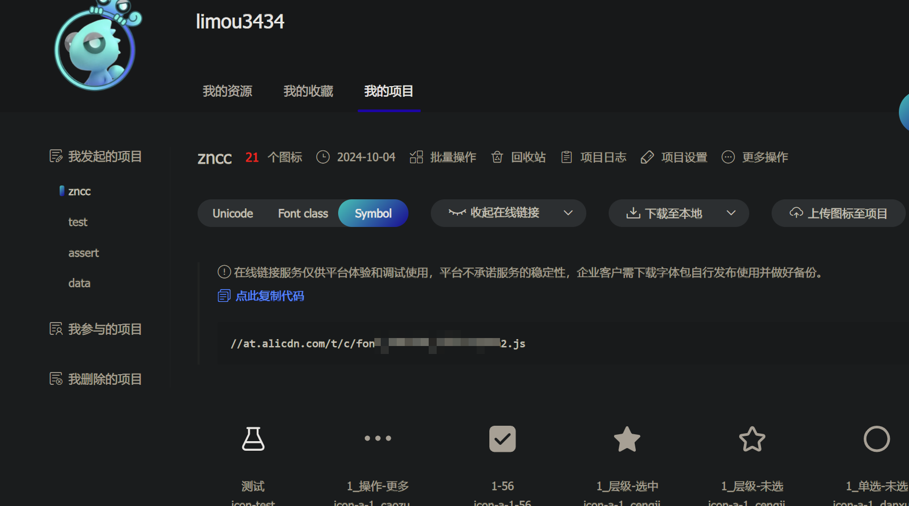
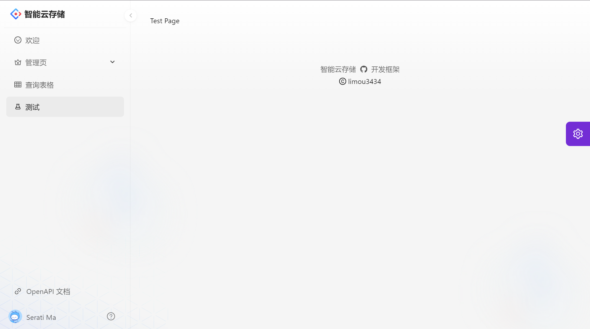

<style>
.heimu {
    position: relative;
    display: inline-block;
    color: transparent;
    text-decoration: none;
}
.heimu::before {
    content: '';
    position: absolute;
    top: 0;
    left: 0;
    width: 100%;
    height: 100%;
    background-color: #333; /* 深色遮盖 */
    z-index: 1;
}
.heimu:hover::before {
    background-color: transparent; /* 鼠标悬浮时移除深色遮盖 */
}
.heimu:hover {
    color: white !important; /* 鼠标悬浮时显示白色文字 */
    text-shadow: none;
}
</style>


**如果本系列文章对您有帮助，可以 [star 一下我的 limou-learn-note](https://github.com/xiaogithubooo/LimouLearnNote)，求求惹(๑＞ ＜)☆♡~**

**叠甲：以下文章主要是依靠我的实际编码学习中总结出来的经验之谈，求逻辑自洽，不能百分百保证正确，有错误、未定义、不合适的内容请尽情指出！**

[TOC]

>   [!NOTE]
>
>   概要：...

>   [!NOTE]
>
>   资源：...

------

# 1.create-react-app 简介

抛弃我们之前使用

# 2.create-react-app 创建


# 3.create-react-app 目录


# 4.create-react-app 使用


# 5.create-react-app 打包


# 6.create-react-app 框架

## 6.1.Ant Design Pro 的环境配置

我的主要目的是带您了解关于 [Antd pro](https://pro.ant.design/zh-CN/docs/getting-started/) 这一开箱即用的开发框架，不过使用 `Antd pro` 这一种大框架，需要有几个知识的铺垫，如下是官方给的思维导图。


从上图可以看出，您至少需要有：

- 对于 `Web 技术` 的了解
- 对于 `Node.js` 的了解
- 对于 `Webpack` 的了解
- 对于 `React` 的了解
- 对于 `React 拓展库` 的了解
- 对于 `JS/TS` 的了解
- 对于 `Ant Design` 的了解
- 对于 `umi` 的了解

不过，我们不用那么麻烦一个一个去了解，直接看官方文档进行操作即可，在过程中进行学习即可，您只需要持有两个链接：

- [Ant Design Pro](https://pro.ant.design/zh-CN/docs/getting-started/)
- [Ant Design](https://ant.design/components/overview-cn)

推荐使用 [tyarn](https://www.npmjs.com/package/tyarn) 来进行包管理（`sudo npm install -g tyarn`），可以极大地减少 `install` 的时间和失败的概率，并且完全兼容 `npm`，不过谁叫我是魔法师呢（我依旧使用 `npm` 进行管理）？

```bash
# 安装 @ant-design/pro-cli 的项目构建工具
$ npm i @ant-design/pro-cli -g

$ pro -v
3.2.1

$ npm list -g @ant-design/pro-cli
/usr/local/lib
└── @ant-design/pro-cli@3.2.1
```

## 6.2.Ant Design Pro 的创建项目

接下来使用 `ant-design/pro-cli` 也就是 `pro` 来初始化一个项目。

```shell
# 创建项目
$ pro create myapp

$ tree -L 3 antd_pro_test
antd_pro_test
├── myapp
│   ├── config
│   │   ├── config.ts
│   │   ├── defaultSettings.ts
│   │   ├── oneapi.json
│   │   ├── proxy.ts
│   │   └── routes.ts
│   ├── jest.config.ts
│   ├── jsconfig.json
│   ├── mock
│   │   ├── listTableList.ts
│   │   ├── notices.ts
│   │   ├── requestRecord.mock.js
│   │   ├── route.ts
│   │   └── user.ts
│   ├── package.json
│   ├── pnpm-lock.yaml
│   ├── public
│   │   ├── CNAME
│   │   ├── favicon.ico
│   │   ├── icons
│   │   ├── logo.svg
│   │   ├── pro_icon.svg
│   │   └── scripts
│   ├── README.md
│   ├── src
│   │   ├── access.ts
│   │   ├── app.tsx
│   │   ├── components
│   │   ├── global.less
│   │   ├── global.tsx
│   │   ├── locales
│   │   ├── manifest.json
│   │   ├── pages
│   │   ├── requestErrorConfig.ts
│   │   ├── services
│   │   ├── service-worker.js
│   │   └── typings.d.ts
│   ├── tests
│   │   └── setupTests.jsx
│   ├── tsconfig.json
│   └── types
│       ├── cache
│       └── index.d.ts
├── node_modules
├── package.json
└── package-lock.json
```

然后就可以开始管理项目了，我们只执行下面的 `npm install` 和 `npm run start` 就行，就尝试登陆一下网站就行。

```shell
# 管理项目
$ npm install # 安装依赖
$ npm run start # 启动项目(热载开发)
# 访问给予的网站即可

# 下面是一些常见的指令
$ npm run build # 编译项目(便于部署)
$ npm run analyze # 和 build 类似, 但是会打开页面展示依赖信息
$ npm run lint # 检查 TS, less, css, md 等文件中是是否存在代码问题(使用 lint:fix 甚至还会尝试自动修复)
```


## 6.3.Ant Design Pro 的模拟后端

`MOCK` 是一种在前端开发中使用的技术（本质就是一样 `js`），用于模拟后端 `API` 的响应数据。在后端服务尚未完成时，前端开发人员可以使用 `mock` 数据来实现和测试前端功能，`MOCK` 数据通常由以下三个部分组成：

1. **请求方法**：指定 `HTTP` 请求的类型，常见的有 `GET` 和 `POST`
2. **请求 URL**：定义客户端发送请求的地址，通常会使用统一的前缀，以便进行代理和管理
3. **数据处理**：可以直接返回 `JSON` 数据，或者使用函数处理请求。函数可以接受 `req`（请求对象）、`res`（响应对象）和 `url`（请求的 `URL`）作为参数，通过 `res.send` 方法返回响应

```js
// 模拟后端
export default {
  'GET /api/rule': [{ name: '12' }], // 简写, 表示当收到一个 GET 请求, URL 为 /api/rule 时返回的响应数据是一个包含对象 { name: '12' } 的数组
  'POST /api/rule': (req: Request, res: Response, u: string) => {
    res.send({
      success: true,
    });
  },
};
```

这种方式使得前端开发能够独立于后端开发进行，同时也便于测试和调试，后面再用。

## 6.4.Ant Design Pro 的开发结构

接下来我将一步一步修改源代码和添加源代码，把框架修改为我曾经的一个云存储项目的雏形，也让您能够快速上手。

### 6.4.1.目录文件

```shell
# 项目初始化的文件目录树
MyApp
├── config/ # umi 配置, 包含路由, 构建等配置
├── mock/ # 本地模拟数据(模拟后端)
├── public/ # 公共资源        
├── src/ # 源代码
├── tests/ # 测试工具
├── README.md
└── package.json

```

### 6.4.2.代码解析

```shell
# 源代码目录
.
├── .umi/
├── typings.d.ts # TypeScript 类型定义文件
├── access.ts # 访问控制策略, 管理用户权限
├── components/ # 可复用的 React 组件
|   ├── Footer/
|   ├── HeaderDropdown/
|   ├── RightContent/
|   └── index.ts
├── app.tsx # 应用主入口文件, 配置全局状态和路由
├── pages/ # 应用页面组件, 对应路由
├── requestErrorConfig.ts     // 请求错误处理配置
├── services                  // 封装与后端 API 交互的服务文件
├── service-worker.js         // 服务工作者文件，实现离线支持等功能
├── global.less               // 全局样式文件，使用 Less 预处理器
├── global.tsx                // 全局配置或上下文提供者
├── locales                   // 国际化相关文件，存放翻译资源
└── manifest.json             // Web 应用信息描述文件，用于 PWA

```

我们按照上面的文件目录树来一个一个进行研究，逐步进行解读，并且把一些对您不熟悉的语法进行解析。

#### 6.4.2.1.类型限定和用户权限

```ts
// src/typings.d.ts: 定义众多类型
// @ts-ignore
/* eslint-disable */

// 这里定义的就是一些自定义类型, 可以用于帮助函数检查参数时候符合要求
declare namespace API {
  type CurrentUser = {
    name?: string;
    avatar?: string;
    userid?: string;
    email?: string;
    signature?: string;
    title?: string;
    group?: string;
    tags?: { key?: string; label?: string }[];
    notifyCount?: number;
    unreadCount?: number;
    country?: string;
    access?: string;
    geographic?: {
      province?: { label?: string; key?: string };
      city?: { label?: string; key?: string };
    };
    address?: string;
    phone?: string;
  };

  type LoginResult = {
    status?: string;
    type?: string;
    currentAuthority?: string;
  };

  type PageParams = {
    current?: number;
    pageSize?: number;
  };

  type RuleListItem = {
    key?: number;
    disabled?: boolean;
    href?: string;
    avatar?: string;
    name?: string;
    owner?: string;
    desc?: string;
    callNo?: number;
    status?: number;
    updatedAt?: string;
    createdAt?: string;
    progress?: number;
  };

  type RuleList = {
    data?: RuleListItem[];
    /** 列表的内容总数 */
    total?: number;
    success?: boolean;
  };

  type FakeCaptcha = {
    code?: number;
    status?: string;
  };

  type LoginParams = {
    username?: string;
    password?: string;
    autoLogin?: boolean;
    type?: string;
  };

  type ErrorResponse = {
    /** 业务约定的错误码 */
    errorCode: string;
    /** 业务上的错误信息 */
    errorMessage?: string;
    /** 业务上的请求是否成功 */
    success?: boolean;
  };

  type NoticeIconList = {
    data?: NoticeIconItem[];
    /** 列表的内容总数 */
    total?: number;
    success?: boolean;
  };

  type NoticeIconItemType = 'notification' | 'message' | 'event';

  type NoticeIconItem = {
    id?: string;
    extra?: string;
    key?: string;
    read?: boolean;
    avatar?: string;
    title?: string;
    status?: string;
    datetime?: string;
    description?: string;
    type?: NoticeIconItemType;
  };
}

```

```ts
// src/access.ts: 定义用户权限
/**
 * @see https://umijs.org/docs/max/access#access
 * */

// access 的翻译就是 "使用权", 下面这个 ts 函数实际上就是为了判断用户权限的
export default function access(initialState: { currentUser?: API.CurrentUser } | undefined) {
  // 这里的 initialState 是一个可以包含名为 currentUser 的属性的函数参数
  // '?' 表示 currentUser 属性是可选的(因此可以不包含)
  // ": API.CurrentUser" 中的 API.CurrentUser 通常在 declare namespace 命名空间中自定义, 这种方式 ": 类型" 的做法可以用来检查参数类型
  // "| undefined" 表示 initialState 参数还可以在本函数调用时不传入

  const { currentUser } = initialState ?? {}; // ?? 是空值合并运算符, 用于处理 null 或 undefined 的分支情况
  // 这里使用解构赋值语法
  // 如果 initialState 对象有存在, 则从中提取 currentUser 属性到变量 currentUser 中
  // 如果 initialState 对象不存在(是 null 或 undefined), 则 currentUser 赋值为空对象 {}

  return {
    canAdmin: currentUser && currentUser.access === 'admin',
  };
  // 返回一个对象, 只有 currentUser 存在且满足 currentUser.access === 'admin' 那么就有 canAdmin 的值为 true, 也就是存在权限
}

```

经过上面的学习，您可以知道 `ts` 和 `js` 的一些不同之处。

#### 6.4.2.2.公共组件

```tsx
// src/components/index.ts: 导入所有公共组件后进行统一的导出
/**
 * 这个文件作为组件的目录
 * 目的是统一管理对外输出的组件，方便分类
 */
/**
 * 布局组件
 */
import Footer from './Footer'; // 实际是导入 ./Footer/index.ts
import { Question, SelectLang } from './RightContent'; // 实际是导入 ./RightContent/index.ts
import { AvatarDropdown, AvatarName } from './RightContent/AvatarDropdown'; // 实际是导入 ./RightContent/AvatarDropdown.tsx

export { Footer, Question, SelectLang, AvatarDropdown, AvatarName }; // 再统一进行导出

```

这里的 `components` 定义了五个公用组件：

1.   `Footer` 用于页面的底部，通常包含版权信息、网站链接或其他相关信息
2.   `Question` 通常用于展示一些常见问题（`FAQ`）或帮助信息，用来引导用户了解如何使用应用程序，或者解答他们可能遇到的常见问题
3.   `SelectLang` 用于语言选择，允许用户在不同语言之间切换
4.   `AvatarDropdown` 用于显示用户的头像，并提供下拉菜单，通常包含用户的相关操作选项，如账户设置、登出等
5.   `AvatarName` 显示用户的名称和头像，通常在用户界面中提供个性化的体验

>   [!IMPORTANT]
>
>   补充：在 `JS` 或 `TS` 项目中，`import Footer from './Footer';` 的这种导入方式，实际上并不是导入一个文件夹，而是导入文件夹中的特定文件。这里的导入路径遵循了 `Node.js` 的模块解析规则。
>
>   举个例子来说，`import Footer from './Footer';` 的工作方式是：
>
>   1.  优先查找 `Footer.js` 或 `Footer.tsx` 文件，如果当前路径下有一个名为 `Footer.js`、`Footer.jsx`、`Footer.ts` 或 `Footer.tsx` 的文件，它会直接导入这个文件。
>   2.  查找 `Footer/index.js` 或 `Footer/index.tsx` 文件，如果没有直接命名为 `Footer.js` 的文件，接下来它会在 `./Footer` 文件夹中查找 `index.js`、`index.tsx`、`index.ts` 或 `index.jsx` 文件（这是一种常见的组织文件的方式，也就是将组件相关文件放在一个文件夹里，并通过 `index.js` 文件来统一导出）。
>
>   这种写法常见于将复杂组件分离到多个文件中，以保持代码的结构清晰。如果 `Footer` 是一个文件夹，而 `index.js` 是文件夹中的入口文件，那么 `import Footer from './Footer';` 实际上等同于 `import Footer from './Footer/index.js';`。

我们先来讨论网页最下方的页脚组件 `Footer`。

```tsx
// src/components/Footer/index.tsx: 定义网页中页脚组件
import { GithubOutlined } from '@ant-design/icons'; // 从 npm 包中的 ant-design/icons 导入 GithubOutlined 图标
import { DefaultFooter } from '@ant-design/pro-components'; // 从 npm 包中的 ant-design/pro-components 导入 DefaultFooter 组件
import React from 'react';
import type {WithFalse} from "@ant-design/pro-layout/es/typing"; // 从 npm 包中的 react 导入 React 组件

// 不带 @ 的模块表示普通包, 不属于任何特定的组织, 就会直接从 ./myapp/node_modules/ 中寻找对应的 js 包
// 使用 @ 是为了表示模块属于某个特定的组织或用户, 可以理解 @ 为 ./myapp/node_modules/@..., @ant-design 就表示 ./myapp/node_modules/@ant-design

// 定义一个名为 Footer, "页脚" 的函数组件, 使用 React.FC 类型声明
// React.FC 是 React 的函数组件类型, 通常用于定义函数组件的类型
const Footer: React.FC = () => {
  return (
    <DefaultFooter
      // 传递多个样式
      style={{
        background: 'none',
      }}
      // 传递页脚要显示的链接
      links={[
        {
          key: 'Intelligent cloud backup', // key 值
          title: '智能云存储', // 可见标题
          href: '/', // 跳转链接
          blankTarget: true, // 链接将允许新标签页中打开
        },
        {
          key: 'Individual developer',
          title: <GithubOutlined />,
          href: 'https://github.com/xiaogithubooo',
          blankTarget: true,
        },
        {
          key: 'Development framework',
          title: '开发框架',
          href: 'https://pro.ant.design/zh-CN/',
          blankTarget: true,
        },
      ]}
      // 版权信息
      copyright="limou3434"
    />
  );
};

export default Footer; // 其他文件在导入时就可以使用任何名称来引用这个默认导出

```

网页右侧最上边的 `Question` 和 `SelectLang` 组件。

```ts
// src/components/RightContent/index.tsx: 定义网站中右侧内容的问号文档组件、切换语言组件
import { QuestionCircleOutlined } from '@ant-design/icons';
// import { SelectLang as UmiSelectLang } from '@umijs/max';
import React from 'react';

export type SiderTheme = 'light' | 'dark';

// 定义 SelectLang 组件, 用于切换语言
export const SelectLang = () => {
  return null; // 暂时不做国际化
  // return (
  //   <UmiSelectLang
  //     style={{
  //       padding: 4,
  //     }}
  //   />
  // );
};

// 定义 Question 组件, 用于打开说明文档
export const Question = () => {
  return (
    <div
      style={{
        display: 'flex',
        height: 26,
      }}
      onClick={() => {
        window.open('https://github.com/xiaogithubooo'); // 打开说明文档
      }}
    >
      <QuestionCircleOutlined />
    </div>
  );
};

```

右侧最上边的下拉菜单组件 `AvatarName` 和 `AvatarDropdown`。

```jsx
// src/components/RightContent/AvatarDropdown.tsx: 定义
import { outLogin } from '@/services/ant-design-pro/api';
import { LogoutOutlined, SettingOutlined, UserOutlined } from '@ant-design/icons';
import { history, useModel } from '@umijs/max';
import { Spin } from 'antd';
import { createStyles } from 'antd-style';
import { stringify } from 'querystring';
import type { MenuInfo } from 'rc-menu/lib/interface';
import React, { useCallback } from 'react';
import { flushSync } from 'react-dom';
import HeaderDropdown from '../HeaderDropdown';

// 定义 AvatarName 组件, 用于在右侧上方显示当前用户的名称
export const AvatarName = () => {
  const { initialState } = useModel('@@initialState');
  // 获取当前登录用户的信息, useModel() 是一个提供模型状态访问 Hook
  // 可以将 '@@initialState' 视为 Umi 内置的一个全局对象, 供所有组件访问
  // 类似于 globalState 或 context, 这种全局状态非常适合管理那些需要跨页面、跨组件共享的信息

  const { currentUser } = initialState || {};
  // 在解构 initialState 时, 进一步提取了其中的 currentUser 属性
  // 包含当前登录用户的信息, initialState 有可能为 null 或 undefined
  // 所以使用了 || {} 来确保当 initialState 为空时不会出现解构错误
  // 如果 initialState 是 null 或 undefined, currentUser 会被解构为空对象 {} 保证代码安全

  return <span className="anticon">{currentUser?.name}</span>;
  // 返回一个行元素, currentUser 对象中包含 name 属性, 这种对象的类型其实就定义在 src/typings.d.ts
};


// 定义 GlobalHeaderRightProps 类型, 用于在 GlobalHeaderRight 组件中定义 props 类型
export type GlobalHeaderRightProps = {
  menu?: boolean; // 控制是否显示菜单选项
  children?: React.ReactNode; // 表示组件的节点内容
};

// 定义 useStyles 函数, createStyles() 允许您以编程方式定义 CSS 样式, 并将其注入到组件中, 这个函数返回一个自定义的 useStyles Hook, 可以在组件中调用这个钩子来获取定义好的 CSS 样式类
const useStyles = createStyles(({ token }) => {
  return {
    action: {
      display: 'flex',
      height: '48px',
      marginLeft: 'auto',
      overflow: 'hidden',
      alignItems: 'center',
      padding: '0 8px',
      cursor: 'pointer',
      borderRadius: token.borderRadius,
      '&:hover': {
        backgroundColor: token.colorBgTextHover,
      },
    },
  };
});

// 定义一个 AvatarDropdown 组件, 用于在页面右侧上方显示图片, 并提供下来菜单允许用户进行用户操作(如查看个人中心、个人设置、退出登录等)的功能
export const AvatarDropdown: React.FC<GlobalHeaderRightProps> = ({ menu, children }) => {
  // 从泛型 GlobalHeaderRightProps 中解构出 menu 和 children 属性, 这里的 GlobalHeaderRightProps 只是泛型, 要看用户怎么使用这个组件
  // 如果用户没有传递这两个属性, 那么这两个属性就是空值

  /**
   * 退出登录，并且将当前的 url 保存(这定义了一个异步函数)
   */
  // 定义一个退出登录的函数
  const loginOut = async () => {
    await outLogin();
    // 异步等待 outLogin() API 的调用, 这个 API 是官方定义的
    // 在 src/services/ant-design-pro/api.ts 中定义了 outLogin(), 定义内容如下
    // export async function outLogin(options?: { [key: string]: any }) { // async 代表这是一个异步函数, options 中的 ? 代表这是一个可选的函数参数, 类型是一个对象, 键类型为字符串, 值类型任意
    //   return request<Record<string, any>>('/api/login/outLogin', { // 这个请求对象中定义了请求路由
    //     method: 'POST', // 定义了请求方法
    //     ...(options || {}), // 使用拓展操作符来合并, 因此所有的 options 就会和前面的 method: 'POST' 合并起来
    //   });
    // }
    // 返回调用 request() 的请求结果, 使用泛型 <> 能够让 request() 的调用者指定期望的返回值类型

    const { search, pathname } = window.location; // 然后获取当前页面的 路径名 pathname 和 查询字符串 search
    const urlParams = new URL(window.location.href).searchParams;
    /** 此方法会跳转到 redirect 参数所在的位置 */
    const redirect = urlParams.get('redirect'); // 检查 url 中是否存在重定向参数 redirect
    // Note: There may be security issues, please note
    if (window.location.pathname !== '/user/login' && !redirect) { // 只有在没有 redirect 参数且当前 url 不是 /user/login 时
      history.replace({ // 使用 history 的 replace() 方法来替换当前的 url, 但是这没有发送请求, 只是修改 url 而已
        pathname: '/user/login',
        search: stringify({
          redirect: pathname + search,
        }),
      });
      // history.replace() 是 React Router 提供的
      // 之后前端框架 React Router 会通过这个函数检测到 url 变化, 就会渲染登录页面组件
      // 如果是传统服务端渲染应用, 在替换 url 后, 可能会触发一次页面请求
      // 但在 SPA 中, 这只是一次浏览器的 url 替换和组件渲染, 和服务端无关
      // 因此这里说的修改 url 是指通过 history.replace() 修改, 而不是用户手动修改浏览器的 url 地址栏
    }
  };

  // 从 useStyles Hook 中解构出 styles
  const { styles } = useStyles();

  // 从 useModel Hook 中解构出 initialState 和 setInitialState
  const { initialState, setInitialState } = useModel('@@initialState');

  // 定义一个菜单栏中处理各节点被点击时对应触发函数的函数
  const onMenuClick = useCallback((event: MenuInfo) => {
      const { key } = event; // 从事件中读取出 key 属性
      // 如果属性是退出登录
      if (key === 'logout') {
        flushSync(() => { // flushSync() 是 React 提供的一个函数, 用于强制同步更新(希望某些关键的状态更新立即反映在 UI 上可以使用)
          setInitialState((s) => ({ ...s, currentUser: undefined }));
          // setInitialState() 在传递一个 (s) => {} 时会把 s 传入当前的状态 InitialState
          // 因此这里使用拓展符 ... 保证其他字段不变只修改 currentUser 为未定义, 借此清除用户数据
        });
        loginOut(); // 调用前面定义的退出登录 loginOut() 即可
        return;
      }
      history.push(`/account/${key}`);
      // 如果是其他节点选项统一跳转到 /account/${key} 所对应的页面中
      // history.push: 添加新的历史记录, 允许用户 "后退" 浏览器历史记录
      // history.replace: 替换当前的历史记录, 不允许用户 "后退" 浏览器历史记录

    }, [setInitialState], // setInitialState 是 useCallback 的依赖项, 否则 onMenuClick 会过度渲染影响性能
  );

  const loading = (
    <span className={styles.action}>
      <Spin
        size="small"
        style={{
          marginLeft: 8,
          marginRight: 8,
        }}
      />
    </span>
  );

  if (!initialState) {
    return loading;
  }

  const { currentUser } = initialState;

  if (!currentUser || !currentUser.name) {
    return loading;
  }

  const menuItems = [
    ...(menu // 如果 menu 为真(menu 是本组件外部传递进来的)
      // 则显示如下内容
      ? [
          {
            key: 'center',
            icon: <UserOutlined />,
            label: '个人中心',
          },
          {
            key: 'settings',
            icon: <SettingOutlined />,
            label: '个人设置',
          },
          {
            type: 'divider' as const,
          },
        ]
      // 否则显示空内容
      : []),
    // 但是最后一定会显示出 "退出登录" 这个选项
    {
      key: 'logout',
      icon: <LogoutOutlined />,
      label: '退出登录',
    },
    // 如果还需要其他下来菜单选项在这里加入即可
  ];

  return ( // 返回一个头部下拉组件
    <HeaderDropdown // HeaderDropdown 组件在 src/components/HeaderDropdown/index.tsx 中定义
      menu={{
        selectedKeys: [],
        onClick: onMenuClick, // 菜单对应的点击函数
        items: menuItems, // 要显示的节点子项
      }}
    >
      {children}{/* children 是本组件在外部传递进来的 */}
    </HeaderDropdown>
  );
};

/* 下面是上面代码的补充
// src/components/HeaderDropdown/index.tsx: 定义一个头部下拉组件
import { Dropdown } from 'antd';
import type { DropDownProps } from 'antd/es/dropdown';
import React from 'react';
import { createStyles } from 'antd-style';
import classNames from 'classnames';

// 定义一个 Hook
const useStyles = createStyles(({ token }) => {
  return {
    dropdown: {
      [`@media screen and (max-width: ${token.screenXS}px)`]: {
        width: '100%',
      },
    },
  };
});

// 定义一个新类型
export type HeaderDropdownProps = { // HeaderDropdownProps 定义了组件可接受的属性类型
  overlayClassName?: string; // 允许传入一个可选的字符作为 class 名称用于覆盖原有下拉菜单的样式
  placement?: 'bottomLeft' | 'bottomRight' | 'topLeft' | 'topCenter' | 'topRight' | 'bottomCenter'; // 定义了下拉菜单的弹出位置
} & Omit<DropDownProps, 'overlay'>;
// Omit<Type, Keys> 是 TypeScript 中的工具类型, 用于在前面类型中排除后面指定的键属性
// & 是交叉运算符可以把两个类型结合起来, 新类型包含了所有的合并类型的属性

// 定义 HeaderDropdown 函数组件
const HeaderDropdown: React.FC<HeaderDropdownProps> = ({ overlayClassName: cls, ...restProps }) => {
  // React.FC<> 通过 <> 来指定属性的类型, 这是 TS 的泛型编程
  // 而这里的 ... 是 TS 的展开运算符, 这里 {} 将解构传递的所有属性, 优先解构出 overlayClassName 属性
  // 然后将剩余的属性解构传递到 restProps 对象中, 方便后续可以继续进行解构

  const { styles } = useStyles();
  return <Dropdown overlayClassName={classNames(styles.dropdown, cls)} {...restProps} />;
};

export default HeaderDropdown;
*/

```

>   [!IMPORTANT]
>
>   补充：拓展运算符 `...` 这里简单直接使用一个例子快速带您理解。
>
>   ```jsx
>   // 使用拓展运算符
>   const arr1 = [1, 2, 3]; // 原数组
>   const arr2 = [...arr1, 4, 5]; // 使用扩展运算符
>   console.log(arr2); // 输出: [1, 2, 3, 4, 5]
>   
>   ```

#### 6.4.2.3.样式配置

在实际使用中我们一般会通过 `config/defaultSettings.ts` 来控制标题和 `Logo`，这部分功能来自 `ProLayout` 的功能。可以在 `预览界面` 中拷贝设置覆盖到 `config\defaultSettings.ts` 中来修改配置。



```jsx
// config/defaultSettings.ts
import { ProLayoutProps } from '@ant-design/pro-components';

/**
 * @name
 */
const Settings: ProLayoutProps & {
  pwa?: boolean;
  logo?: string;
} = {
  /*
  navTheme: 'light',
  // 拂晓蓝
  colorPrimary: '#1890ff',
  layout: 'mix',
  contentWidth: 'Fluid',
  fixedHeader: false,
  fixSiderbar: true,
  colorWeak: false,
  title: 'Ant Design Pro',
  pwa: true,
  logo: 'https://gw.alipayobjects.com/zos/rmsportal/KDpgvguMpGfqaHPjicRK.svg',
  iconfontUrl: '',
  token: {
    // 参见 ts 声明, demo 见文档, 通过 token 修改样式
    //https://procomponents.ant.design/components/layout#%E9%80%9A%E8%BF%87-token-%E4%BF%AE%E6%94%B9%E6%A0%B7%E5%BC%8F
  },
  */

  // 拷贝过来的配置(不过做了一些微小修改)
  navTheme: "light",
  colorPrimary: "#722ED1",
  layout: "side",
  contentWidth: "Fluid",
  fixedHeader: false,
  fixSiderbar: true,
  colorWeak: false,
  title: '智能云存储',
  pwa: true,
  logo: "https://gw.alipayobjects.com/zos/rmsportal/KDpgvguMpGfqaHPjicRK.svg",
  token: {},
  splitMenus: false,
  siderMenuType: "sub"
};

export default Settings;

```

#### 6.4.2.3.页面路由

接下来就是非常重点的部分了，如何添加新的页面路由进行 `SPA` 应用页面跳转，我先编写一个示例页面来进行尝试。

1. **新建页面**：

    - 在 `src/pages` 目录下创建文件夹 `Test` 后，创建新的 `TSX` 和 `LESS` 文件，命名为 `TestPage.tsx` 和 `NewPage.less`。
    - `NewPage.tsx` 文件的初始内容如下：
      
      ```javascript
      // src/pages/Test/TestPage.tsx
      import React from 'react'; // 导入 React 库
      export default () => {
        return <div>Test Page</div>;
      };
      ```
    - `NewPage.less` 文件可以留空，待后续添加样式。**LESS** 是一种动态样式表语言，扩展了 CSS 的功能。它允许使用变量、嵌套规则、混合和函数等，帮助开发者更方便地编写和维护样式。

    - `NewPage.less` 文件的初始内容吧可以导入 `Ant Design` 的默认主题变量：

      ```less
      // src/pages/Test/TestPage.less
      @import '~antd/lib/style/themes/default.less';
      ```

      关于这里，[阮一峰先生写的这篇关于 CSS Modules 的文章](https://www.ruanyifeng.com/blog/2016/06/css_modules.html) 可以帮助到您，待补充...

2. **新增布局**：

    - 在项目的 `config/routes.ts` 文件中配置新的页面路由，这个文件定义了整个应用的路由结构。
    - 新增布局的方式是直接在 `routes.ts` 中增加一个新的对象，指向你的新页面组件。
      ```tsx
      // config/routes.ts
      /**
       * @name umi 的路由配置
       * @description 只支持 path,component,routes,redirect,wrappers,name,icon 的配置
       * @param path  path 只支持两种占位符配置，第一种是动态参数 :id 的形式，第二种是 * 通配符，通配符只能出现路由字符串的最后。
       * @param component 配置 location 和 path 匹配后用于渲染的 React 组件路径。可以是绝对路径，也可以是相对路径，如果是相对路径，会从 src/pages 开始找起。
       * @param routes 配置子路由，通常在需要为多个路径增加 layout 组件时使用。
       * @param redirect 配置路由跳转
       * @param wrappers 配置路由组件的包装组件，通过包装组件可以为当前的路由组件组合进更多的功能。 比如，可以用于路由级别的权限校验
       * @param name 配置路由的标题，默认读取国际化文件 menu.ts 中 menu.xxxx 的值，如配置 name 为 login，则读取 menu.ts 中 menu.login 的取值作为标题
       * @param icon 配置路由的图标，取值参考 https://ant.design/components/icon-cn， 注意去除风格后缀和大小写，如想要配置图标为 <StepBackwardOutlined /> 则取值应为 stepBackward 或 StepBackward，如想要配置图标为 <UserOutlined /> 则取值应为 user 或者 User
       * @doc https://umijs.org/docs/guides/routes
       */
      export default [
        // "/user" 对应的页面
        {
          path: '/user',
          layout: false,
          routes: [
            {
              name: 'login',
              path: '/user/login',
              component: './User/Login',
            },
          ],
        },
        // "/welcome" 对应的页面
        {
          path: '/welcome',
          name: 'welcome',
          icon: 'smile',
          component: './Welcome',
        },
        // "/admin" 对应的页面
        {
          path: '/admin',
          name: 'admin',
          icon: 'crown',
          access: 'canAdmin',
          routes: [
            {
              path: '/admin',
              redirect: '/admin/sub-page',
            },
            {
              path: '/admin/sub-page',
              name: 'sub-page',
              component: './Admin',
            },
          ],
        },
        // "/list" 对应的页面
        {
          name: 'list.table-list',
          icon: 'table',
          path: '/list',
          component: './TableList',
        },
        // "/new" 对应的页面(我新增加的, 其他的部分都是默认生成的)
        {
          name: '测试',
          path: '/new',
          component: './Test/TestPage.tsx',
          // icon: '', // TODO: 设置图标
          // routes: [{}, {}, ...] // TODO: 设置二级管理页
        },
        // "/" 对应的页面
        {
          path: '/',
          redirect: '/welcome',
        },
        // "*" 对应的页面
        {
          path: '*',
          layout: false,
          component: './404',
        },
      ];
      
      ```

3. **新加图标**：不过我们的页面菜单也可以设置出图标，不过可能需要我们自己进行导入，您可以 [先在阿里巴巴矢量图标中寻找符合心意的图标](https://www.iconfont.cn/)，然后导入自己的项目中生成 `JS` 代码。

    

    ```tsx
    // src/app.tsx
    export const layout: RunTimeLayoutConfig = ({ initialState, setInitialState }) => {
        return {
            ...,
            // 在这里添加项目图标配置
            iconfontUrl: '//at.alicdn.com/t/c/fontxxxxxxxxxxxxxx2.js',
        };
    };
    
    ```

    ```tsx
    // config/routes.ts
    // ...
        {
            name: '测试',
            path: '/new',
            component: './Test/TestPage.tsx',
            icon: 'icon-test',
            // routes: [{}, {}, ...] // TODO: 设置二级管理页
        },
    // ...
    
    ```



接下来我们就可以仿制其他页面进行开发，后续我们更多在 `Pages/` 文件夹中进行业务的开发。

>   [!IMPORTANT]
>
>   补充：对于路由的完整配置说明具体如下。
>
>   *   `name:string` 配置菜单的 `name`，如果配置了国际化，`name` 为国际化的 `key`
>   *   `icon:string` 配置菜单的图标，默认使用 `antd` 的 `icon` 名，默认不适用二级菜单的 icon
>   *   `access:string` 权限配置，需要预先配置权限
>   *   `hideChildrenInMenu:true` 用于隐藏不需要在菜单中展示的子路由
>   *   `hideInMenu:true` 可以在菜单中不展示这个路由，包括子路由
>   *   `hideInBreadcrumb:true` 可以在面包屑中不展示这个路由，包括子路由
>   *   `headerRender:false` 当前路由不展示顶栏
>   *   `footerRender:false` 当前路由不展示页脚
>   *   `menuRender: false` 当前路由不展示菜单
>   *   `menuHeaderRender: false` 当前路由不展示菜单顶栏
>   *   `parentKeys: string[]` 当此节点被选中的时候也会选中 `parentKeys` 的节点
>   *   `flatMenu` 子项往上提，只是不展示父菜单

#### 6.4.2.4.图表绘制

我们先不谈论数据的获取，可以先使用 `npm install @ant-design/charts` 来体验一些关于非常好看的图标绘制库。


#### 6.4.2.5.数据管理

#### 6.4.2.6.样式资源

#### 6.4.2.7.国际处理

#### 6.4.2.8.开放接口

### 6.4.3.项目部署

### 6.4.4.高级配置

待补充...

------

>   [!NOTE]
>
>   结语：...

**如果本系列文章对您有帮助，可以 [star 一下我的 limou-learn-note](https://github.com/xiaogithubooo/LimouLearnNote)，求求惹(๑＞ ＜)☆♡~**


