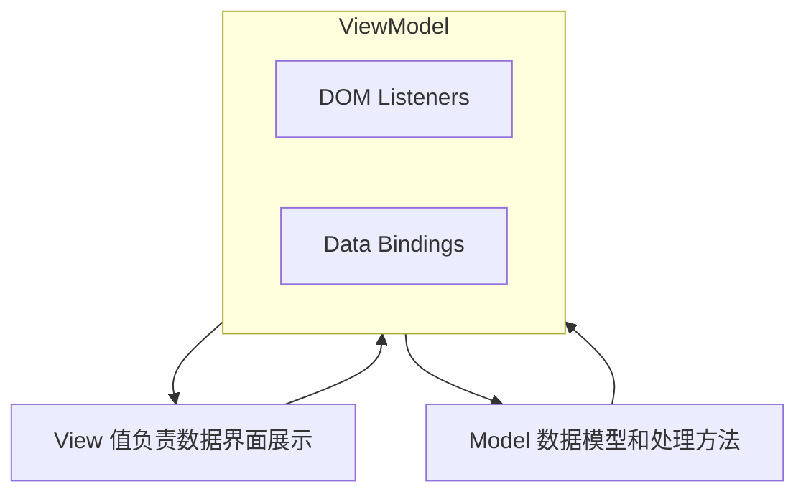

**叠甲：以下文章主要是依靠我的实际编码学习中总结出来的经验之谈，求逻辑自洽，不能百分百保证正确，有错误、未定义、不合适的内容请尽情指出！**

[TOC]

>   概要：...

>   资料：...

---

# 1.Vue 的历史

待补充...

# 2.Vue 的思想

## 2.1.MVVI 架构

`Vue` 是前端框架，主要简化对 `DOM API` 繁琐操作，本身基于 `Model-View-ViewModel` 思想进行实现，实现数据的双向绑定。

而下载 `vue` 的方式很简单，只需要下载对应的 `.js` 文件，`vue2 和 vue3` 都各自有一个 `.js` 单文件，直接下载好后手动引入到 `.html` 即可，因此 `vue` 的本质其实是一个 `js` 三方库。

另外，您也可以研究一下 `npm` 这样的 `JS` 包管理器，不过本系列只会大部分情况下都是直接引入 `vue.js` 文件，以最轻量化的方式带您学习 `vue` 的基础知识。

## 2.2.渐进式

`Vue` 的渐进式指它的设计理念和功能特性可以逐步应用和扩展，而不是一次性强制性地引入整个框架的所有功能和概念。

# 3.Vue 的代码

https://cdn.staticfile.net/vue/2.4.2/vue.min.js

https://cdn.staticfile.net/vue-router/2.7.0/vue-router.min.js

---

>   结语：...
