**如果本系列文章对您有帮助，可以 [star 一下我的 limou-learn-note](https://github.com/xiaogithubooo/LimouLearnNote)，求求惹~**

**叠甲：以下文章主要是依靠我的实际编码学习中总结出来的经验之谈，求逻辑自洽，不能百分百保证正确，有错误、未定义、不合适的内容请尽情指出！**

[TOC]

>   概要：在阅读本系列之前，您至少需要以下技术基础。
>
>   -   前端四大件 `HTML, CSS, JS` 基础，不过要求不算太高...
>   -   `Vue2.js` 基础，至少常用的知识要知道...
>   -   `HTTP` 协议开发基础，至少明白为什么要有 `HTTP` 协议，我们需要 `HTTP` 协议做什么？
>   -   `npm` 包管理器基础，至少会明白带不带 `-g` 下载的区别是什么把？

>   资料：先导需要搜集整个系列用到的所有资料，而每个章节的博文需要收集 2 本小节用到的所有资料...

---

# 1.vue-cli 简介

使用脚手架工具规范化 `Vue.js` 的应用 `web`，这里举一个使用 `vue-cli` 的脚手架工具，这个脚手架工具实际上可以通过 `Node.js` 中的 `npm` 来进行安装，安装指令为 `npm install -g @vue/cli`。这里展示两种版本，一种是使用命令行的版本，一种是使用 `WebStorm` 进行生成的版本。这个脚手架工具有以下多个功能：

-   创建统一目录结构
-   支持进行本地调试
-   支持热加载热调试
-   支持简单单元测试
-   支持集成打包上线

# 2.vue-cli 创建

## 2.1.命令行窗口使用 vue-cli 生成 Vue2 项目

看以下命令行即可。

```shell
# 使用 vue-cli 构建 Vue2 工程
$ npm install -g @vue/cli # 下载 vue-cli
$ npm list -g # 检查安装包列表中是否存在 vue-cli 模块, 也就是 vue/cli
$ vue create my-vue-project # 开始创建一个 vue 工程

Vue CLI v5.0.8 # 使用方向键选择 vue 版本, 这里选择 vue2
? Please pick a preset: 
  Default ([Vue 3] babel, eslint) 
> Default ([Vue 2] babel, eslint) 
  Manually select features
  
# 下面就是一大堆的创建信息...忽略即可, 或者自己简单看一看

✨  Creating project in D:\Other\vuetest\my-vue-project.
🗃  Initializing git repository...
⚙️  Installing CLI plugins. This might take a while...


added 871 packages in 24s

100 packages are looking for funding
  run `npm fund` for details
🚀  Invoking generators...
📦  Installing additional dependencies...


added 88 packages in 4s

112 packages are looking for funding
  run `npm fund` for details
⚓  Running completion hooks...

# ...创建信息

# 下面是给出提示的两个指令
$ cd my-vue-project # 打开已经创建好的项目
$ npm run serve # 运行这个可以启动一个本地服务器进行调试开发
```

我个人更加推荐使用命令行来创建 `Vue2.js` 工程，因为更加直观和通用。

## 2.2.图形化界面使用 vue-cli 生成 Vue2 项目

实际上在 `cmd` 中输入 `vue ui` 可以运行得到一个图形化界面网站。

```shell
# 启动 vue-cli 启动图形化界面网站
vue ui
🚀  Starting GUI...
🌠  Ready on http://localhost:8000
```

在浏览器中 `url` 输入 `http://localhost:8000` 就可以打开这个 `GUI` 网站（不过一般会自动打开）。

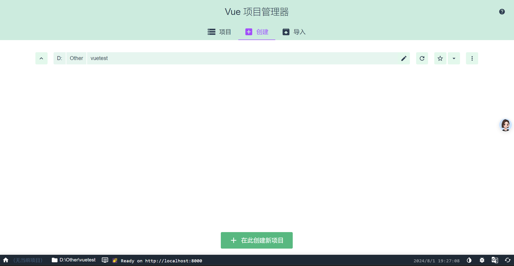

接下来的配置选项就和之前命令行界面中的设置差不多了。

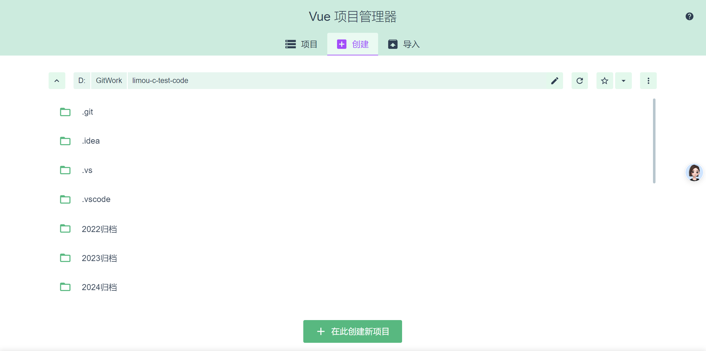

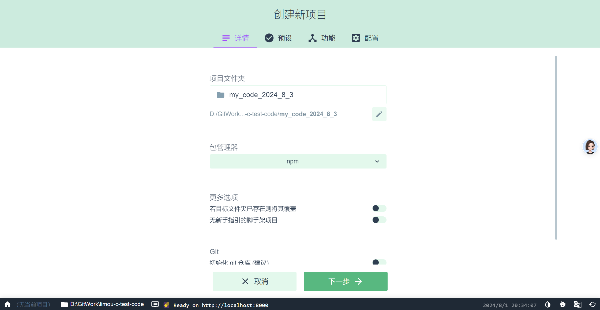

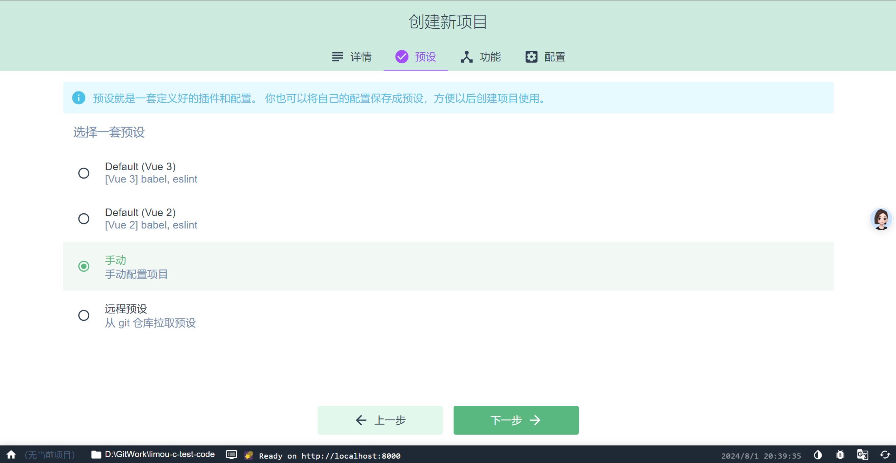

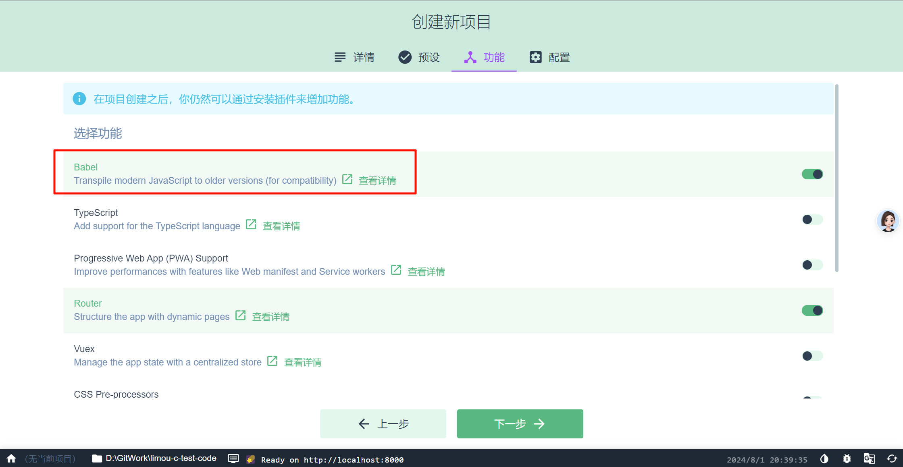

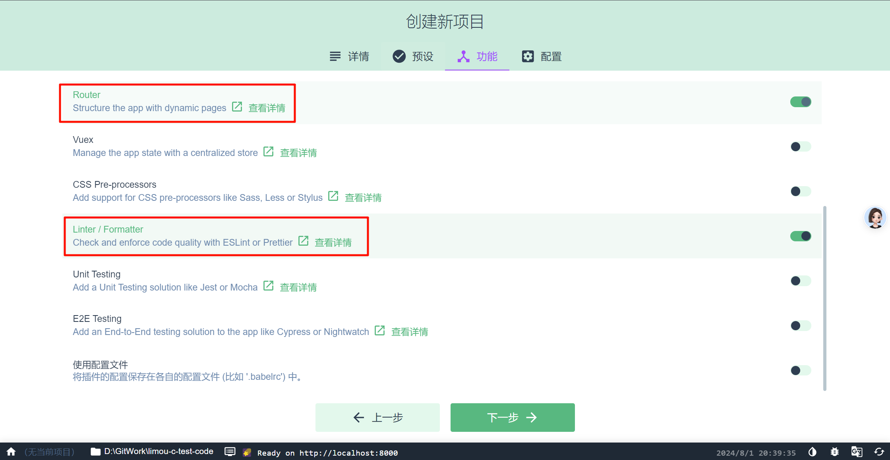

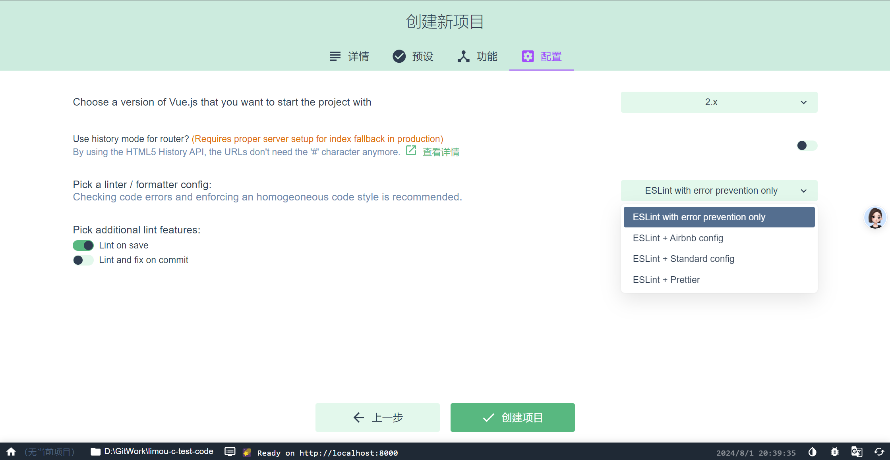


下面的预设可以不保存，其实就是记录一份配置记录，下次创建新的相同项目时就可以直接使用这份预设进行快速配置。

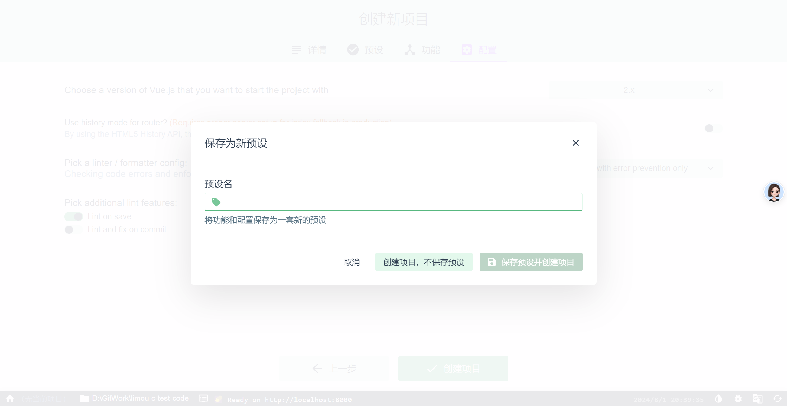

然后此时的命令行窗口千万不能关闭，否则就需要重新配置了，直到 `UI` 界面出现下面这个界面。

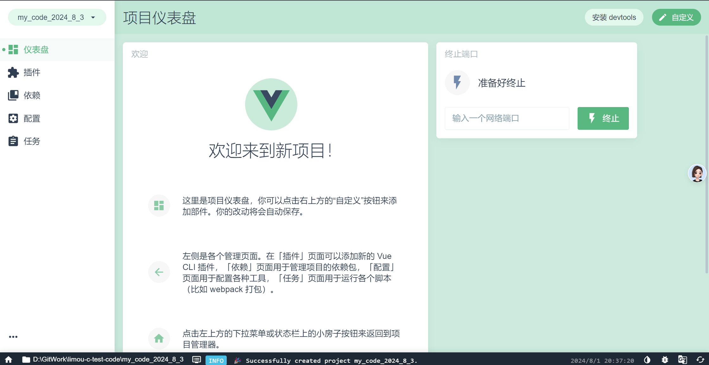

然后在您喜欢的开发环境中打开项目即可。

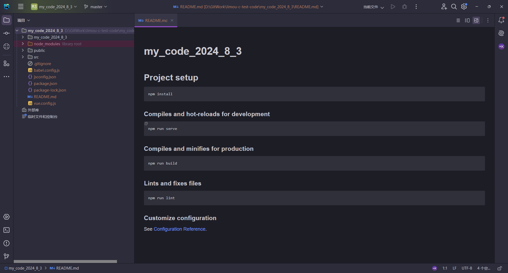

## 2.3.WebStorm 使用 vue-cli 生成 Vue2 项目

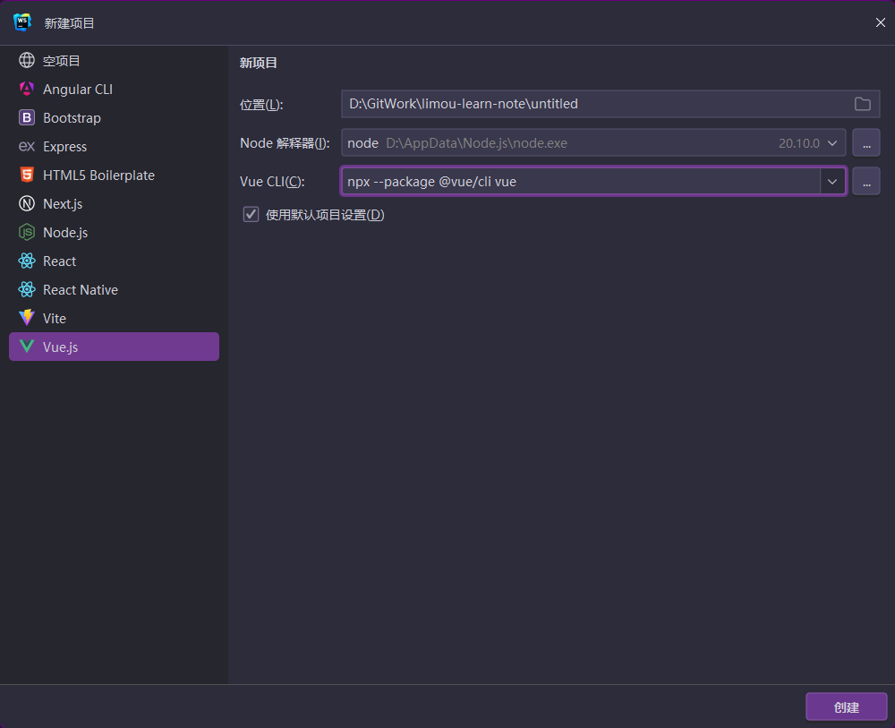

这个就更加直观了，输入上面几个文本框就可以得到一个 `Vue` 工程了，不过这里貌似没法手动自定义配置选项，比较不灵活...

# 3.vue-cli 目录

## 3.1.概览工程目录

关于创建出来的项目目录我们需要详细解释一下。

```shell
# Vue2 工程目录
vue-project
├─ node_modules/ # 整个项目的依赖包, 由 npm 管理
├─ public/ # 存放项目的静态文件, 不会被 Webpack 处理, 可以直接在应用中使用
├─ src/ # vue 前端源代码, 项目的核心目录
│	├─ assets/ # 静态资源, 通常会通过 Webpack 进行处理
│	├─ components/ # 可重用的组件
│	├─ router/ # 路由配置, 一般包含 index.js 文件，用于配置项目的路由信息
│	├─ views/ # 视图组件, 通常由多个基础组件组合而成的页面级组件
│	├─ App.vue # 入口组件/入口页面/根组件
│	└─ main.js # 入口 JS 文件, 初始化 Vue 实例, 挂载根组件, 并设置全局配置
├─ package.json # npm 的包管理配置文件, 配置项目的版本依赖和脚本等
├─ vue.json # vue-cli 的内部配置文件, 配置代理、端口等
├─ babel.config.js # Babel 的配置文件, 用于配置 JS 编译选项
└─ ...
```

在关于 `Vue2.js` 的脚手架工具中，我将使用 `vue-cli` 第二种图形化界面的方式，并且使用 `WebStorm` 打开项目的形式，之所以这么做单纯只是因为我对 `WebStorm`  自带 `Vue2` 构建过程不太满意，省略了一些自定义的步骤，但是 `UI` 的操作方式快速又有较多的自定义选项。

>   吐槽：当然可能纯粹是我对 `WebStorm` 的设置不够熟练，以后如果探索到的相应的设置，会回到这里进行补充...

接下来我们通过一个开发场景来大概了解一下在这些目录下应该做的开发工作，首先我们先无论做什么，先在项目目录下执行指令 `run serve` 然后访问热部署的网站，此时修改 `vue2` 文件就可以实时反应到页面上。

## 3.2.理解工程文件

### 3.2.1.public/index.html

我们先来查看最原始的主页面 `HTML`，看看 `vue-cli` 对这个页面都做了些什么。

```js
<!-- index.html -->
<!DOCTYPE html> <!-- 声明文档类型为 HTML5 -->
<html lang=""> <!-- 设置页面语言 -->
<head>
    <!-- 为避免知识缺漏, 这里解释一下下面设置页面的元数据元素, 可以在 https://developer.mozilla.org/zh-CN/docs/Web/HTML/Element/meta 详细查看 -->
    <meta charset="utf-8"> <!-- 设置本文档支持的字符集 -->
    <meta http-equiv="X-UA-Compatible" content="IE=edge"> <!-- 指定 IE 浏览器使用最新渲染引擎, 这个 http-equiv 可以模拟类似 http 的响应头 -->
    <meta name="viewport" content="width=device-width,initial-scale=1.0"> <!-- 设置视图确保能在移动设备上正确缩放和显示 -->
    <link rel="icon" href="<%= BASE_URL %>favicon.ico"> <!-- 设置页面的 favicon 网站图标, 这里的 BASE_URL 占位符后续会被 -->
    <title><%= htmlWebpackPlugin.options.title %></title>
    <!-- 这里的 htmlWebpackPlugin.options.title 也是占位符, 后续会被替换为真正的标题 -->
</head>
<body>
<noscript>
    <strong>
        <!-- 当用户禁用浏览器的 JS 解释器时就会显示下面这段文本 -->
        We're sorry but <%= htmlWebpackPlugin.options.title %> doesn't work properly without JavaScript enabled.
        Please enable it to continue.
    </strong>
</noscript>
<div id="app"></div> <!-- 这里就挂载了 vue2 的根组件 -->
</body>
</html>

```

>   吐槽：这里的占位符我怀疑是 `Webpack` 替换的，但是我不知道哪一个是对应的配置文件，之后再来补充吧...

### 3.2.2.src/components/HelloWorld.vue

```js
<!-- HelloWorld.vue -->
<template>
  <div class="hello"> <!-- 模板部分 -->
    <h1>{{ msg }}</h1>
    <p>
      For a guide and recipes on how to configure / customize this project,<br>
      check out the
      <a href="https://cli.vuejs.org" rel="noopener" target="_blank">vue-cli documentation</a>.
    </p>
    <h3>Installed CLI Plugins</h3>
    <ul>
      <li><a href="https://github.com/vuejs/vue-cli/tree/dev/packages/%40vue/cli-plugin-babel" rel="noopener"
             target="_blank">babel</a></li>
      <li><a href="https://github.com/vuejs/vue-cli/tree/dev/packages/%40vue/cli-plugin-router" rel="noopener"
             target="_blank">router</a></li>
      <li><a href="https://github.com/vuejs/vue-cli/tree/dev/packages/%40vue/cli-plugin-eslint" rel="noopener"
             target="_blank">eslint</a></li>
    </ul>
    <h3>Essential Links</h3>
    <ul>
      <li><a href="https://vuejs.org" rel="noopener" target="_blank">Core Docs</a></li>
      <li><a href="https://forum.vuejs.org" rel="noopener" target="_blank">Forum</a></li>
      <li><a href="https://chat.vuejs.org" rel="noopener" target="_blank">Community Chat</a></li>
      <li><a href="https://twitter.com/vuejs" rel="noopener" target="_blank">Twitter</a></li>
      <li><a href="https://news.vuejs.org" rel="noopener" target="_blank">News</a></li>
    </ul>
    <h3>Ecosystem</h3>
    <ul>
      <li><a href="https://router.vuejs.org" rel="noopener" target="_blank">vue-router</a></li>
      <li><a href="https://vuex.vuejs.org" rel="noopener" target="_blank">vuex</a></li>
      <li><a href="https://github.com/vuejs/vue-devtools#vue-devtools" rel="noopener" target="_blank">vue-devtools</a>
      </li>
      <li><a href="https://vue-loader.vuejs.org" rel="noopener" target="_blank">vue-loader</a></li>
      <li><a href="https://github.com/vuejs/awesome-vue" rel="noopener" target="_blank">awesome-vue</a></li>
    </ul>
  </div>
</template>

<script>
export default { // 导出一个默认对象
  name: 'HelloWorld', // name 关键字设置了子组件的名字
  props: { // props 关键字设置组件可以接受父组件传递过来的属性, 其实就是我们之前在 Vue.js 基础中学习的子组件内部的数据
    msg: String // 这里的 msg 就是子组件所能接受的属性, 这里指定了类型必须是 String
  }
}
// 之前的代码中我们是按照下面这种方式定义一个子组件的, 其实和上面类似
// -- 代码片段 --
// Vue.component('Child', {
// props: ['mess1', 'mess2'],
//     template: `
//             <div>
//                 <span>{{ mess1 }}</span><br>
//                 <span>{{ mess2 }}</span>
//             </div>
//         `
// })
//
// new Vue({
//   el: '#app'
// })
// -- 代码片段 --
</script>

<!-- Add "scoped" attribute to limit CSS to this component only -->
<style scoped>
h3 {
  margin: 40px 0 0;
}

ul {
  list-style-type: none;
  padding: 0;
}

li {
  display: inline-block;
  margin: 0 10px;
}

a {
  color: #42b983;
}
</style>

```

然后再来看看之前没有接触过的 `.vue` 文件 `HelloWorld.vue`，实际上 `.vue` 文件是 `Vue.js` 的单文件组件，也算是一种特殊的 `HTML` 文件，它将模板、脚本、样式封装在一个文件中，以便于多个组件的管理和重用。`.vue` 文件通常包含以下几部分内容。

-   `<template>` 部分：定义构成组件的 `HTML` 骨架模板，主要描述了组件的结构/骨架和视图/显示，同时会使用一些 `Vue2.js` 语法进行数据渲染。

    ```js
    <!-- template 部分 -->
    <template>
      <div class="hello"> <!-- 模板部分 -->
        <h1>{{ msg }}</h1>
        <p>
          For a guide and recipes on how to configure / customize this project,<br>
          check out the
          <a href="https://cli.vuejs.org" rel="noopener" target="_blank">vue-cli documentation</a>.
        </p>
        <h3>Installed CLI Plugins</h3>
        <ul>
          <li><a href="https://github.com/vuejs/vue-cli/tree/dev/packages/%40vue/cli-plugin-babel" rel="noopener"
                 target="_blank">babel</a></li>
          <li><a href="https://github.com/vuejs/vue-cli/tree/dev/packages/%40vue/cli-plugin-router" rel="noopener"
                 target="_blank">router</a></li>
          <li><a href="https://github.com/vuejs/vue-cli/tree/dev/packages/%40vue/cli-plugin-eslint" rel="noopener"
                 target="_blank">eslint</a></li>
        </ul>
        <h3>Essential Links</h3>
        <ul>
          <li><a href="https://vuejs.org" rel="noopener" target="_blank">Core Docs</a></li>
          <li><a href="https://forum.vuejs.org" rel="noopener" target="_blank">Forum</a></li>
          <li><a href="https://chat.vuejs.org" rel="noopener" target="_blank">Community Chat</a></li>
          <li><a href="https://twitter.com/vuejs" rel="noopener" target="_blank">Twitter</a></li>
          <li><a href="https://news.vuejs.org" rel="noopener" target="_blank">News</a></li>
        </ul>
        <h3>Ecosystem</h3>
        <ul>
          <li><a href="https://router.vuejs.org" rel="noopener" target="_blank">vue-router</a></li>
          <li><a href="https://vuex.vuejs.org" rel="noopener" target="_blank">vuex</a></li>
          <li><a href="https://github.com/vuejs/vue-devtools#vue-devtools" rel="noopener" target="_blank">vue-devtools</a>
          </li>
          <li><a href="https://vue-loader.vuejs.org" rel="noopener" target="_blank">vue-loader</a></li>
          <li><a href="https://github.com/vuejs/awesome-vue" rel="noopener" target="_blank">awesome-vue</a></li>
        </ul>
      </div>
    </template>
    
    ```

-   `<script>` 部分：定义组件的逻辑和数据，这里编写 `Vue2` 组件的相关 `JS` 代码，包括模型的数据定义、方法定义、钩子函数等。

    ```js
    <!-- script 部分 -->
    <script>
    export default { // 导出一个默认对象
      name: 'HelloWorld', // name 关键字设置了子组件的名字
      props: { // props 关键字设置组件可以接受的属性, 其实就是我们之前在 Vue.js 基础中学习的子组件内部的数据
        msg: String // 这里的 msg 就是子组件所能接受的属性, 这里指定了类型必须是 String
      }
    }
    // 之前的代码中我们是按照下面这种方式定义一个子组件的, 其实和上面类似
    // -- 代码片段 --
    // Vue.component('Child', {
    // props: ['mess1', 'mess2'],
    //     template: `
    //             <div>
    //                 <span>{{ mess1 }}</span><br>
    //                 <span>{{ mess2 }}</span>
    //             </div>
    //         `
    // })
    //
    // new Vue({
    //   el: '#app'
    // })
    // -- 代码片段 --
    </script>
    
    ```

-   `<style>` 部分：标签定义组件的样式，这里会编写 `CSS` 或 `SCSS` 来控制组件的外观，可以使用 `style` 标签的 `scoped` 属性来确保样式仅应用于当前组件。

    ```html
    <!-- style 部分 -->
    <style scoped>
    h3 {
      margin: 40px 0 0;
    }
    
    ul {
      list-style-type: none;
      padding: 0;
    }
    
    li {
      display: inline-block;
      margin: 0 10px;
    }
    
    a {
      color: #42b983;
    }
    </style>
    
    ```

当然，还有很多其他额外的补充部分，不过我们先不理会，您先理解到这里就行。

>   补充：注意 `props` 主要是子组件的父组件传递进来的数据，如果希望子组件使用自己的数据，则可以使用以下 `data()` 的方式。
>
>   ```js
>   <!-- 子组件使用自己的数据和方法 -->
>   <template>
>       <h1>{{ message }}</h1>
>   </template>
>   
>   <script>
>   export default {
>       data() {
>           return {
>               message: "Hello, I am limou3434."
>           }
>       },
>       methods: {
>           // ...
>       }
>   }
>   </script>
>   
>   ```

### 3.2.3.src/router/\*.vue

因此我们可以认为一个 `.vue` 就是 `Vue2.js` 的一个子组件，但是这个子组件在不同场景下的解释不同，如果只是普通的可以复用的子组件，那就叫“子组件”。但是如果这个子组件注意作为一个完整对应页面或者视图来完成视图切换/路由切换的工作，那就叫“视图”。如果这个组件是整个 `Vue2.js` 工程的主 `app` 引用，那就是“主视图”。

因此这里复用了 `src/components/` 下组件和一些其他设置的 `.vue` 文件，没一份对应一个完整页面，可以用来在 `vue` 应用中快速切换页面。这里我们先不管是如何“切换的视图/切换路由”的，先看看我们的初始化工程中每个页面都做了些什么工作。

```html
<!-- HomeView.vue -->
<template>
  <div class="home">
    
    <HelloWorld msg="Welcome to Your Vue.js App"/> <!-- 在这里使用子组件, 同时传入属性值(3.最后用子组件) -->
  </div>
</template>

<script>
import HelloWorld from '@/components/HelloWorld.vue' // 这里的 @ 通常代指 /src 目录, 这里成功导入了子组件(1.先导入子组件)

export default {
  name: 'HomeView',
  components: { // 这里注册了子组件, 和之前使用 Vue.component() 类似(2.再注册子组件)
    HelloWorld
  }
}
</script>

```

```html
<!-- AboutView.vue -->
<template>
  <div class="about">
    <h1>This is an about page</h1>
  </div>
</template>

<!-- 您可能注意到了这个视图没有设置组件名字, 其实这样也是可以的, 但是后面需要使用 import() 进行动态链接了 -->

```

而实际上切换视图/切换路由的工作也简单，实际上就是使用 `<router-link to="">, <router-view/>` 语法结合 `Vue.js` 的 `VueRouter` 路由实例中设置对应的视图，即可达到切换的目的（这个路由配置后面再来提及）。

### 3.2.4.src/router/index.js

这份 `js` 文件中就定义了“视图切换/路由切换”，最后再以默认导出的形式作为模块交给 `vue` 实例进行路由注入。

```js
<!-- HomeView.vue -->
<template>
  <div class="home">
    
    <HelloWorld msg="Welcome to Your Vue.js App"/> <!-- 在这里使用子组件, 同时传入属性值(3.最后用子组件) -->
  </div>
</template>

<script>
import HelloWorld from '@/components/HelloWorld.vue' // 这里的 @ 通常代指 /src 目录, 这里成功导入了子组件(1.先导入子组件)

export default {
  name: 'HomeView',
  components: { // 这里注册了子组件, 和之前使用 Vue.component() 类似(2.再注册子组件)
    HelloWorld
  }
}
</script>

```

### 3.2.5.src/App.vue

有了上述关于 `.vue` 文件的解说，这里的 `App.vue` 实际上也是一个 `Vue2.js` 的组件，只不过这个组件是主组件，这个组件内部还会渲染其他的主组件，您只需要在 `<template>` 中写出 `id=""` 挂载组件即可，其他部分也都差不多...

```html
<!-- App.vue -->
<template>
  <div id="app">
    <nav> <!-- 这个 nav 只是一个语义标签, 主要是用在页面中的导航链接部分, 它通常包含一组链接, 用户可以通过这些链接在网站或应用的不同部分之间进行导航, 主要是为了增加代码可读性和搜索引擎 SEO 友好的 -->
      <router-link to="/">Home</router-link> <!-- 显示 Home 视图链接 -->
      |
      <router-link to="/about">about</router-link> <!-- 显示 about 视图链接 -->
    </nav>
    <router-view/> <!-- 页面/视图的显示地点 -->
  </div>
</template>

<style>
#app {
  font-family: Avenir, Helvetica, Arial, sans-serif;
  -webkit-font-smoothing: antialiased;
  -moz-osx-font-smoothing: grayscale;
  text-align: center;
  color: #2c3e50;
}

nav {
  padding: 30px;
}

nav a {
  font-weight: bold;
  color: #2c3e50;
}

nav a.router-link-exact-active {
  color: #42b983;
}
</style>

```

### 3.2.6.src/main.js

这里就是创建“`vue` 实例/根实例”的地方了，加载了最为重要的 `App.vue` 主视图，该主视图内部又定义了路由切换时显示出不同的视图，视图内部又各自复用了子组件。并且还进行了路由注入，同时还挂载给了单体 `HTML` 页面的 `id="app"` 标签中。

```js
// main.js
import Vue from 'vue'
import App from './App.vue'
import router from './router'

Vue.config.productionTip = false

new Vue({
  router,
  render: h => h(App) // 创建一个 App 组件的虚拟节点, 并将其渲染为实际的 DOM 元素, h 实际上就是 createElement()
}).$mount('#app') // 这种挂载是手动挂载, 可以等待 vue 实例创建后再手动挂载, 从最终效果上和 el 差不多

```

### 3.2.7.package.json

这个和 `npm` 的有关，可以去了解一下这个配置文件，这里就不进行展开了，后续如果使用到就会稍微进行修改。

```json
// package.json
{
  "name": "my_code_2024_8_4",
  "version": "0.1.0",
  "private": true,
  "scripts": {
    "serve": "vue-cli-service serve",
    "build": "vue-cli-service build",
    "lint": "vue-cli-service lint"
  },
  "dependencies": {
    "core-js": "^3.8.3",
    "vue": "^2.6.14",
    "vue-router": "^3.5.1"
  },
  "devDependencies": {
    "@babel/core": "^7.12.16",
    "@babel/eslint-parser": "^7.12.16",
    "@vue/cli-plugin-babel": "~5.0.0",
    "@vue/cli-plugin-eslint": "~5.0.0",
    "@vue/cli-plugin-router": "~5.0.0",
    "@vue/cli-service": "~5.0.0",
    "eslint": "^7.32.0",
    "eslint-plugin-vue": "^8.0.3",
    "vue-template-compiler": "^2.6.14"
  },
  "eslintConfig": {
    "root": true,
    "env": {
      "node": true
    },
    "extends": [
      "plugin:vue/essential",
      "eslint:recommended"
    ],
    "parserOptions": {
      "parser": "@babel/eslint-parser"
    },
    "rules": {}
  },
  "browserslist": [
    "> 1%",
    "last 2 versions",
    "not dead"
  ]
}

```

### 3.2.8.vue.config.json

这个配置文件也是，后续需要的时候再来解释和修改...

```json
// vue.config.json
const { defineConfig } = require('@vue/cli-service')
module.exports = defineConfig({
  transpileDependencies: true
})

```

不过值得注意的是，如果我们的前端项目需要更换访问服务器的 `ip` 和 `port`，就需要修改 `vue.config.json` 文件。

```json
// vue.config.json
const { defineConfig } = require('@vue/cli-service')
module.exports = defineConfig({
  transpileDependencies: true,
  devServer: {
    host: '127.0.0.1', // 更改 ip
    port: 8080 // 更换 ip
  }
})

```

此时就需要重新启动项目了，不过这次我们不用命令行，用 `IDEA` 内置的运行按钮试一试。

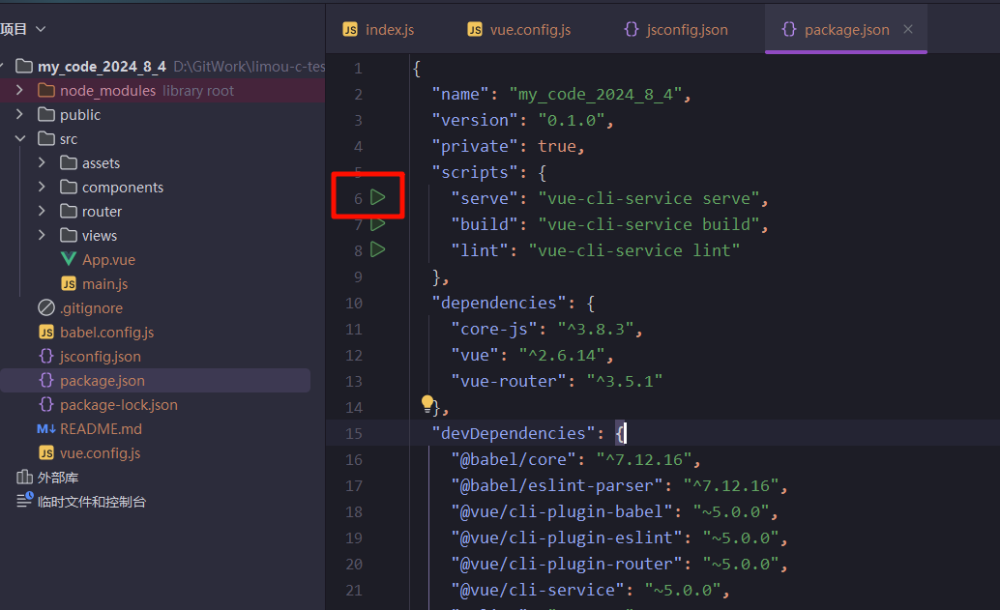

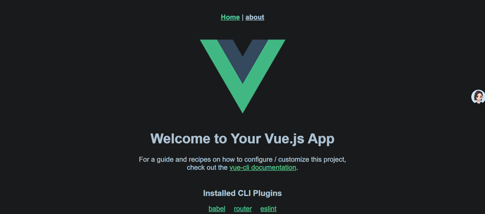

又可以成功访问界面了。

>   补充：不过当前我们的前端项目之所以能够被访问到，完全是因为 `vue-cli` 有帮您做代理服务器，提供了最基础的可以访问单体页面的手段，而这个服务器就是 `webpack-dev-server`，允许你在开发过程中快速预览和调试你的应用，而无需手动设置后端服务器。

>   吐槽：到此即便您无法完全理解一些细小的语法细节，但是您已经可以“照猫画虎”，写出专属于您的单体页面了。

# 4.vue-cli 组件

## 4.1.界面组件

>   注意：之后尝试使用组件的代码和测试 `Ajax` 请求的代码我都打包为压缩包 `vue2_elementui_test.rar` 放在了网盘中
>
>   -   [您可以前往 Google 云盘中进行解压](https://drive.google.com/file/d/1sjpQnJcCNyXEURvd5MsA2r5gYv5rYWIP/view?usp=sharing)，无访问密码
>   -   [也可以前往百度网盘中进行解压](https://pan.baidu.com/s/1tuUVccabzzskuXFBb7x0nw?pwd=9n2i)，访问密码 `9n21`
>
>   除了后面要引入的 `ElementUI` 无需您下载（因为已经包含在文件夹中了），但是其他的类似 `npm, node, vue-cli` 等还是需要您手动全局安装一下...您先尝试一下，如果不成功就自己创建一个工程项目，然后把我写的代码复制过去实验就行。

### 4.1.1.引入组件

不过我不打算直接使用原生的 `vue` 进行开发了，我希望使用一些现成的 `UI` 框架，这里使用的是基于 `Vue` 的 [组件库 element](https://element.eleme.cn/#/zh-CN)，该组件库是由饿了么团队进行开发的。

>   吐槽：饿了么，`e'le'me` 也就是 `eleme` 再加上 `nt`...

首先还是老样子，使用 `ElementUI` 之前，需要使用 `npm install element-ui@2.15.3` 进行下载（建议只在当前项目中进行下载，不要全局下载），这样就不用迁移过多的 `UI` 代码，就可以使用 `UI` 组件了。

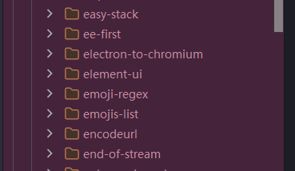

然后在 `main.js` 中，引入以下代码即可，这段可以在 [ElementUI 官方文档-安装和快速上手](https://element.eleme.cn/#/zh-CN/component/quickstart) 中查阅到。

```js
// 在 main.js 中引入 ElementUI 框架
import Vue from 'vue'
import App from './App.vue'
import router from './router'
import ElementUI from 'element-ui';
import 'element-ui/lib/theme-chalk/index.css';

Vue.use(ElementUI); // 这里使用的所有的组件

Vue.config.productionTip = false

new Vue({
  router,
  render: h => h(App) // 创建一个 App 组件的虚拟节点, 并将其渲染为实际的 DOM 元素, h 实际上就是 createElement()
}).$mount('#app') // 这种挂载是手动挂载, 可以等待 vue 实例创建后再手动挂载, 从最终效果上和 el 差不多

```

这种引入方式是全部引入的方式，如果您希望按需引入，可以查看官方文档进行操作，为了简单，本系列只采用这种方式。后面我将在不同种类的组件中直接随机使用某一种类的组件，您稍微比对一下官方文档就行。

>   警告：本人亲测，尽可能不要在配置太低、版本太低的服务器上直接进行开发，一是可能组件库安装后更不上版本（我就出现过类似问题，有些组件明明语法正确却无法正常加载），二是调试也比较困难，最好是在本地电脑上进行开发（因为大多数的个人电脑性能远远超过某些低配的服务器）。

### 4.1.2.使用组件

#### 4.1.2.1.按钮组件

接下里我们尝试引入一个按钮，由于我们只是为了测试，我们此时需要一个视图，这个视图只会显示官方提供的按钮即可，因此您首先需要建立一个视图文件 `ElementButtonView.vue` 然后放入 [ElementUI 官方文档-按钮](https://element.eleme.cn/#/zh-CN/component/button) 中的按钮代码即可。

```js
<!-- ElementButtonView.vue -->
<template>
  <div>
    <el-row>
      <el-button>默认按钮</el-button>
      <el-button type="primary">主要按钮</el-button>
      <el-button type="success">成功按钮</el-button>
      <el-button type="info">信息按钮</el-button>
      <el-button type="warning">警告按钮</el-button>
      <el-button type="danger">危险按钮</el-button>
    </el-row>

    <el-row>
      <el-button plain>朴素按钮</el-button>
      <el-button plain type="primary">主要按钮</el-button>
      <el-button plain type="success">成功按钮</el-button>
      <el-button plain type="info">信息按钮</el-button>
      <el-button plain type="warning">警告按钮</el-button>
      <el-button plain type="danger">危险按钮</el-button>
    </el-row>

    <el-row>
      <el-button round>圆角按钮</el-button>
      <el-button round type="primary">主要按钮</el-button>
      <el-button round type="success">成功按钮</el-button>
      <el-button round type="info">信息按钮</el-button>
      <el-button round type="warning">警告按钮</el-button>
      <el-button round type="danger">危险按钮</el-button>
    </el-row>

    <el-row>
      <el-button circle icon="el-icon-search"></el-button>
      <el-button circle icon="el-icon-edit" type="primary"></el-button>
      <el-button circle icon="el-icon-check" type="success"></el-button>
      <el-button circle icon="el-icon-message" type="info"></el-button>
      <el-button circle icon="el-icon-star-off" type="warning"></el-button>
      <el-button circle icon="el-icon-delete" type="danger"></el-button>
    </el-row>
  </div>
</template>

<script>

</script>

<style scoped>

</style>
```

>   警告：`ElementButtonView.vue` 这个名字不是随便起的，是一个大驼峰命名文件，如果不是大驼峰就会导致运行失败。

然后还需要像其他视图一样做导入，我们不改变 `vue-cli` 原本创建的页面，我们多加一个视图切换吧！在 `App.vue` 中增加一个 `<router-link to="/button">button</router-link>` 此时重新运行 `npm run serve` 就可以看到页面多了一个 `button` 的超链接显示，但是此时我们还没有设置路由，因此点击后页面为空。

```js
<!-- App.vue -->
<template>
  <div id="app">
    <nav> <!-- 这个 nav 只是一个语义标签, 主要是用在页面中的导航链接部分, 它通常包含一组链接, 用户可以通过这些链接在网站或应用的不同部分之间进行导航, 主要是为了增加代码可读性和搜索引擎 SEO 友好的 -->
      <router-link to="/">Home</router-link> <!-- 显示 Home 视图链接 -->
      |
      <router-link to="/about">about</router-link> <!-- 显示 about 视图链接 -->
      |
      <router-link to="/button">button</router-link> <!-- 显示 about 视图链接 -->
    </nav>
    <router-view/> <!-- 页面/视图的显示地点 -->
  </div>
</template>

<style>
#app {
  font-family: Avenir, Helvetica, Arial, sans-serif;
  -webkit-font-smoothing: antialiased;
  -moz-osx-font-smoothing: grayscale;
  text-align: center;
  color: #2c3e50;
}

nav {
  padding: 30px;
}

nav a {
  font-weight: bold;
  color: #2c3e50;
}

nav a.router-link-exact-active {
  color: #42b983;
}
</style>
<script setup lang="ts">
</script>
```


然后我们修改一下路由配置 `router.js` 如下，添加新的视图即可。

```js
// index.js
import Vue from 'vue'
import VueRouter from 'vue-router'
import HomeView from '../views/HomeView.vue'
import ButtonView from '../views/ElementButtonView.vue' // 注意这里要导入

Vue.use(VueRouter)

// 定义路由映射
const routes = [
    {
        path: '/',
        name: 'home', // 这里的 name 是路由名字, 路由名字可以让路由修改的时候不是硬编码设置, 方便业务随时进行修改
        component: HomeView // 注册子组件, 也就是视图
    },
    {
        path: '/about',
        name: 'about',
        // 下面这种动态加载实际上是懒加载, 只有用户实际访问了 /about 路径时, 才会进行下载和渲染, 可以提高用户的响应速度
        component: () => import(/* webpackChunkName: "about" */ '../views/AboutView.vue') // 这也是为什么之前我们设置的 about 没有设置 name 的原因
    },
    { // 下面是新增加的路由
        path: '/button',
        name: 'button', // 这里的 name 是路由名字, 路由名字可以让路由修改的时候不是硬编码设置, 方便业务随时进行修改
        component: ButtonView // 注册子组件, 也就是视图
    }
]

// 设置路由管理
const router = new VueRouter({
    routes
})

// 把路由实例对象导出, 等待后续交给 vue 实例进行路由注入
export default router

```

此保存在点击 `button` 超链接，就可以完美展示出 `ElementUI` 的按钮了。

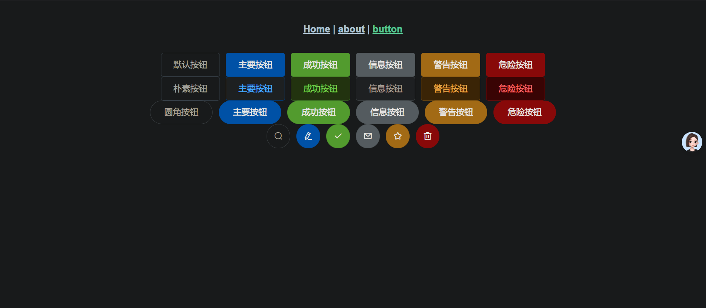

那如果我此时不希望直接以路由的形式显示出来，而是直接显示在 `App.vue` 的主视图中呢？可以借助 `<...-view>` 标签来直接显示子视图，这里的 `xxx` 需要保持和引入的模块同名，这里引入的是 `ElementView`，所以标签要写为 `<element-view>`。

```js
<!-- App.vue -->
<template>
  <div>
    <element-view></element-view>
  </div>
</template>

<script>
import ElementView from './views/ElementButtonView.vue'
export default {
  components:{
    ElementView
  },
  methods: {

  }
}
</script>

<style>

</style>

```

>   吐槽：当然我们一般不会这么用按钮，而是把按钮封装为公共组件再进行使用。

#### 4.1.2.2.表格组件

我们多用几个组件，再来考虑一些事件的触发，现在最主要的任务是熟悉如何把组件显示到网页中，然后尽可能穿插一些知识。

```js
<!-- ElementTableView.vue -->
<template>
  <el-table
      :data="tableData"
      border
      style="width: 100%">
    <el-table-column
        prop="date"
        label="日期"
        width="180">
    </el-table-column>
    <el-table-column
        prop="name"
        label="姓名"
        width="180">
    </el-table-column>
    <el-table-column
        prop="address"
        label="地址">
    </el-table-column>
  </el-table>
</template>

<script>
export default {
  data() {
    return {
      tableData: [{
        date: '2016-05-02',
        name: '王小虎',
        address: '上海市普陀区金沙江路 1518 弄'
      }, {
        date: '2016-05-04',
        name: '王小虎',
        address: '上海市普陀区金沙江路 1517 弄'
      }, {
        date: '2016-05-01',
        name: '王小虎',
        address: '上海市普陀区金沙江路 1519 弄'
      }, {
        date: '2016-05-03',
        name: '王小虎',
        address: '上海市普陀区金沙江路 1516 弄'
      }]
    }
  }
}
</script>
```

```js
<!-- App.vue -->
<template>
  <div id="app">
    <nav> <!-- 这个 nav 只是一个语义标签, 主要是用在页面中的导航链接部分, 它通常包含一组链接, 用户可以通过这些链接在网站或应用的不同部分之间进行导航, 主要是为了增加代码可读性和搜索引擎 SEO 友好的 -->
      <router-link to="/">Home</router-link> <!-- 显示 Home 视图链接 -->
      |
      <router-link to="/about">about</router-link> <!-- 显示 about 视图链接 -->
      |
      <router-link to="/button">button</router-link> <!-- 显示 about 视图链接 -->
      |
      <router-link to="/table">table</router-link> <!-- 显示 about 视图链接 -->
    </nav>
    <router-view/> <!-- 页面/视图的显示地点 -->
  </div>
</template>

<style>
#app {
  font-family: Avenir, Helvetica, Arial, sans-serif;
  -webkit-font-smoothing: antialiased;
  -moz-osx-font-smoothing: grayscale;
  text-align: center;
  color: #2c3e50;
}

nav {
  padding: 30px;
}

nav a {
  font-weight: bold;
  color: #2c3e50;
}

nav a.router-link-exact-active {
  color: #42b983;
}
</style>
<script setup lang="ts">
</script>
```

```js
// index.js
import Vue from 'vue'
import VueRouter from 'vue-router'
import HomeView from '../views/HomeView.vue'
import ButtonView from '../views/ElementButtonView.vue'
import TableView from '../views/ElementTableView.vue' // 注意这里要导入

Vue.use(VueRouter)

// 定义路由映射
const routes = [
    {
        path: '/',
        name: 'home', // 这里的 name 是路由名字, 路由名字可以让路由修改的时候不是硬编码设置, 方便业务随时进行修改
        component: HomeView // 注册子组件, 也就是视图
    },
    {
        path: '/about',
        name: 'about',
        // 下面这种动态加载实际上是懒加载, 只有用户实际访问了 /about 路径时, 才会进行下载和渲染, 可以提高用户的响应速度
        component: () => import(/* webpackChunkName: "about" */ '../views/AboutView.vue') // 这也是为什么之前我们设置的 about 没有设置 name 的原因
    },
    { // 下面是新增加的路由
        path: '/button',
        name: 'button', // 这里的 name 是路由名字, 路由名字可以让路由修改的时候不是硬编码设置, 方便业务随时进行修改
        component: ButtonView // 注册子组件, 也就是视图
    },
    { // 下面是新增加的路由
        path: '/table',
        name: 'table', // 这里的 name 是路由名字, 路由名字可以让路由修改的时候不是硬编码设置, 方便业务随时进行修改
        component: TableView // 注册子组件, 也就是视图
    }
]

// 设置路由管理
const router = new VueRouter({
    routes
})

// 把路由实例对象导出, 等待后续交给 vue 实例进行路由注入
export default router

```

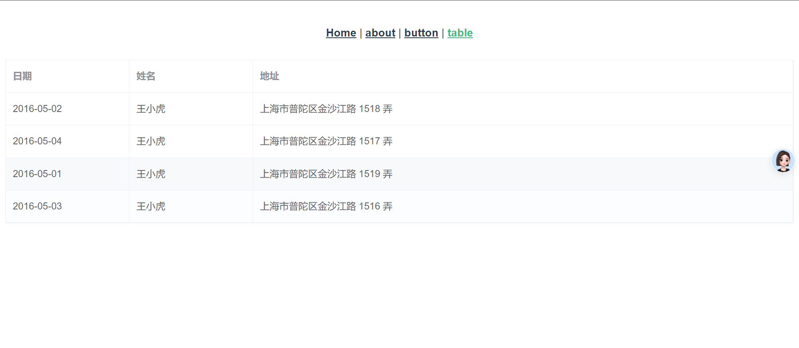

很好，我们可以开始了解一下表格的属性、事件、方法，包括之前的按钮组件，这些在官方文档每个组件的末尾基本都有声明。

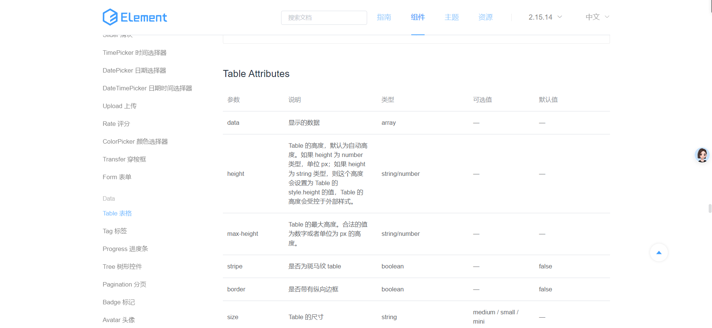

我们尝试理解一下这里的 `:data="tableData"` 实际上就是使用 `v-bind` 把 `tableData` 数组中的数据绑定到了 `data` 中，这样就可以让表格对数组中的数据进行渲染，这里的数据是我们直接硬编码进来的，直接使用了数据模型中的数据，不过这个 `ElementTableView.vue` 文件可是一个完整视图文件，除了视图模型，完全可以通过 `Ajax` 的形式从远端服务器获取 `json` 数据，再通过 `JS` 代码转化为数组的形式再进行传递。

可以设置为当用户切换到该视图时，在渲染后发送 `Ajax` 请求，不过这里为了不让您产生担当，咱暂时使用硬编码简单使用一下表格就行。

关于组件的其他属性、事件、方法也可以看一下。

#### 4.1.2.3.分页组件

我们再来看一个非常常用的分页组件，依葫芦画瓢，同样把分页组件作为一个视图展示出来，不过这次我希望在分页组件中进行真的分页，而不是简单的进行展示。

因为表格的数据一般都会有很多，所有经常和分页一起使用，那我们就在分页的时候显示不同的表格吧。

```js
<!-- ElementPaginationView.vue -->
<template>
  <el-pagination
      background
      layout="prev, pager, next"
      :total="1000">
  </el-pagination>
</template>

<script>

</script>

<style>

</style>

```

```js
<!-- App.vue -->
<template>
  <div id="app">
    <nav> <!-- 这个 nav 只是一个语义标签, 主要是用在页面中的导航链接部分, 它通常包含一组链接, 用户可以通过这些链接在网站或应用的不同部分之间进行导航, 主要是为了增加代码可读性和搜索引擎 SEO 友好的 -->
      <router-link to="/">Home</router-link> <!-- 显示 Home 视图链接 -->
      |
      <router-link to="/about">about</router-link> <!-- 显示 about 视图链接 -->
      |
      <router-link to="/button">button</router-link> <!-- 显示 about 视图链接 -->
      |
      <router-link to="/table">table</router-link> <!-- 显示 about 视图链接 -->
      |
      <router-link to="/pagination">pagination</router-link> <!-- 显示 about 视图链接 -->
    </nav>
    <router-view/> <!-- 页面/视图的显示地点 -->
  </div>
</template>

<style>
#app {
  font-family: Avenir, Helvetica, Arial, sans-serif;
  -webkit-font-smoothing: antialiased;
  -moz-osx-font-smoothing: grayscale;
  text-align: center;
  color: #2c3e50;
}

nav {
  padding: 30px;
}

nav a {
  font-weight: bold;
  color: #2c3e50;
}

nav a.router-link-exact-active {
  color: #42b983;
}
</style>
<script setup lang="ts">
</script>
```

```js
// index.js
import Vue from 'vue'
import VueRouter from 'vue-router'
import HomeView from '../views/HomeView.vue'
import ButtonView from '../views/ElementButtonView.vue'
import TableView from '../views/ElementTableView.vue'
import PaginationView from '../views/ElementPaginationView.vue' // 注意这里要导入

Vue.use(VueRouter)

// 定义路由映射
const routes = [
    {
        path: '/',
        name: 'home', // 这里的 name 是路由名字, 路由名字可以让路由修改的时候不是硬编码设置, 方便业务随时进行修改
        component: HomeView // 注册子组件, 也就是视图
    },
    {
        path: '/about',
        name: 'about',
        // 下面这种动态加载实际上是懒加载, 只有用户实际访问了 /about 路径时, 才会进行下载和渲染, 可以提高用户的响应速度
        component: () => import(/* webpackChunkName: "about" */ '../views/AboutView.vue') // 这也是为什么之前我们设置的 about 没有设置 name 的原因
    },
    { // 下面是新增加的路由
        path: '/button',
        name: 'button', // 这里的 name 是路由名字, 路由名字可以让路由修改的时候不是硬编码设置, 方便业务随时进行修改
        component: ButtonView // 注册子组件, 也就是视图
    },
    { // 下面是新增加的路由
        path: '/table',
        name: 'table', // 这里的 name 是路由名字, 路由名字可以让路由修改的时候不是硬编码设置, 方便业务随时进行修改
        component: TableView // 注册子组件, 也就是视图
    }
    ,
    { // 下面是新增加的路由
        path: '/pagination',
        name: 'pagination', // 这里的 name 是路由名字, 路由名字可以让路由修改的时候不是硬编码设置, 方便业务随时进行修改
        component: PaginationView // 注册子组件, 也就是视图
    }
]

// 设置路由管理
const router = new VueRouter({
    routes
})

// 把路由实例对象导出, 等待后续交给 vue 实例进行路由注入
export default router

```

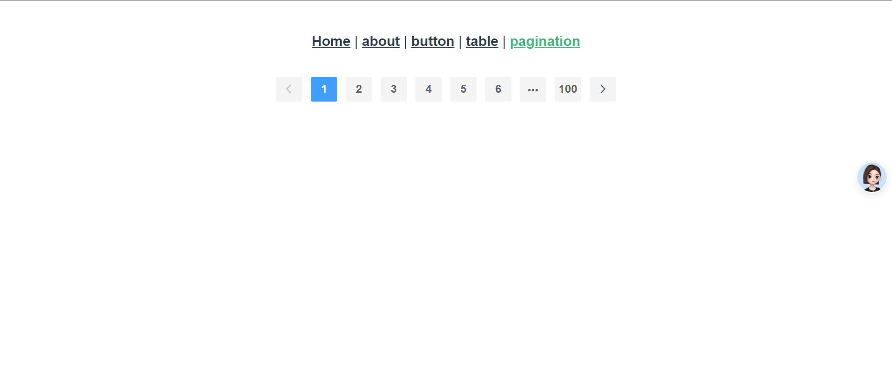

怎么样，很简单对吧？接下来把表格加进去吧，这样就是复用了两个组件到同一个页面中了！

```js
<!-- ElementPaginationView.vue -->
<template>
  <!-- 表格部分 -->
  <div>
    <el-table :data="tableData" border style="width: 100%">
      <el-table-column
          label="日期"
          prop="date"
          width="180">
      </el-table-column>
      <el-table-column
          label="姓名"
          prop="name"
          width="180">
      </el-table-column>
      <el-table-column
          label="地址"
          prop="address">
      </el-table-column>
    </el-table>

    <!-- 分页部分 -->
    <el-pagination
        :total="1000"
        background
        layout="prev, pager, next">
    </el-pagination>
  </div>
</template>

<script>
export default {
  data() {
    return {
      tableData: [{
        date: '2016-05-02',
        name: '王小虎',
        address: '上海市普陀区金沙江路 1518 弄'
      }, {
        date: '2016-05-04',
        name: '王小虎',
        address: '上海市普陀区金沙江路 1517 弄'
      }, {
        date: '2016-05-01',
        name: '王小虎',
        address: '上海市普陀区金沙江路 1519 弄'
      }, {
        date: '2016-05-03',
        name: '王小虎',
        address: '上海市普陀区金沙江路 1516 弄'
      }]
    }
  }
}
</script>
```

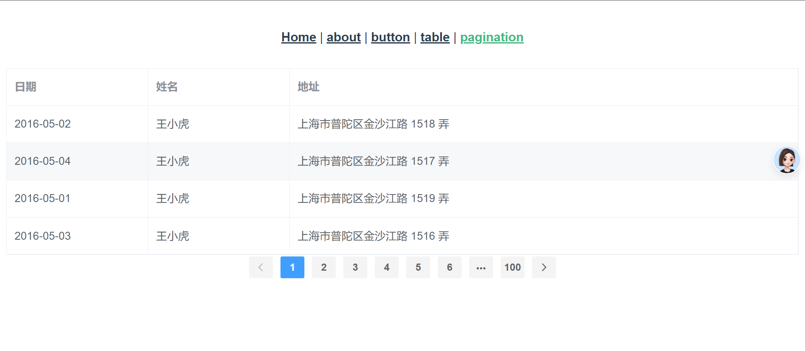

不过这种还是假分页，要做到真分页还需要继续查阅文档，查找对应的事件和回调参数等信息，设计一些钩子函数或方法等。由于我们暂时还没有服务器程序，可以先硬编码模拟多个数组数据。修改上述代码如下：

```js
<!-- ElementPaginationView.vue -->
<template>
  <!-- 表格部分 -->
  <div>
    <el-table :data="tableData" border style="width: 100%">
      <el-table-column
          label="日期"
          prop="date"
          width="180">
      </el-table-column>
      <el-table-column
          label="姓名"
          prop="name"
          width="180">
      </el-table-column>
      <el-table-column
          label="地址"
          prop="address">
      </el-table-column>
    </el-table>

    <!-- 分页部分 -->
    <el-pagination
        :page-size="pageSize"
        :total="totalItems"
        background
        layout="prev, pager, next"
        @current-change="handlePageChange">
    </el-pagination>
  </div>
</template>

<script>
export default {
  data() {
    return {
      currentPage: 1, // 默认的当前页码
      pageSize: 1, // 每页显示的数组个数，这里设置为 1 是因为每个数组是一页
      tableData: [],
      dataSets: [
        [
          {date: '2016-05-02', name: '王小虎', address: '上海市普陀区金沙江路 1518 弄'},
          {date: '2016-05-04', name: '王小虎', address: '上海市普陀区金沙江路 1517 弄'},
          {date: '2016-05-01', name: '王小虎', address: '上海市普陀区金沙江路 1519 弄'},
          {date: '2016-05-03', name: '王小虎', address: '上海市普陀区金沙江路 1516 弄'}
        ],
        [
          {date: '2017-05-02', name: '李小龙', address: '北京市朝阳区望京街 1518 弄'},
          {date: '2017-05-04', name: '李小龙', address: '北京市朝阳区望京街 1517 弄'},
          {date: '2017-05-01', name: '李小龙', address: '北京市朝阳区望京街 1519 弄'},
          {date: '2017-05-03', name: '李小龙', address: '北京市朝阳区望京街 1516 弄'}
        ],
        [
          {date: '2018-06-12', name: '张三', address: '广州市天河区体育西路 20 号'},
          {date: '2018-06-15', name: '张三', address: '广州市天河区体育西路 21 号'},
          {date: '2018-06-18', name: '张三', address: '广州市天河区体育西路 22 号'},
          {date: '2018-06-20', name: '张三', address: '广州市天河区体育西路 23 号'}
        ],
        [
          {date: '2019-07-22', name: '赵四', address: '深圳市南山区科技园 1 号'},
          {date: '2019-07-25', name: '赵四', address: '深圳市南山区科技园 2 号'},
          {date: '2019-07-28', name: '赵四', address: '深圳市南山区科技园 3 号'},
          {date: '2019-07-30', name: '赵四', address: '深圳市南山区科技园 4 号'}
        ],
        [
          {date: '2020-08-05', name: '王五', address: '杭州市西湖区文三路 100 号'},
          {date: '2020-08-08', name: '王五', address: '杭州市西湖区文三路 101 号'},
          {date: '2020-08-11', name: '王五', address: '杭州市西湖区文三路 102 号'},
          {date: '2020-08-13', name: '王五', address: '杭州市西湖区文三路 103 号'}
        ]
      ]
    };
  },
  computed: { // 使用计算属性会比直接使用方法绑定好一些, 能够高效依赖缓存机制避免过度重复计算
    totalItems() {
      return this.dataSets.length; // 返回的就是数据模型中 dataSets[] 的大小, 也就是分页的大小
    }
  },
  methods: {
    handlePageChange(page) { // 只要 current-change 事件触发了, 就会调用这个方法, 文档里对这个事件的回调参数有描述, 指明了 currentPage 改变时会触发返回当前页数
      this.currentPage = page; // 更新数据模型中的页码变量
      this.loadPageData(); // 调用 loadPageData()
    },
    loadPageData() {
      const index = this.currentPage - 1; // 去除数据模型中的当前页码再减一得到索引
      if (index >= 0 && index < this.dataSets.length) { // 只要索引在合法范围内
        this.tableData = this.dataSets[index]; // 就会设置要渲染的数据为某个索引的数组元素, 而由于 Vue2.js 非常强大的控制同步, 数据模型中的数据发生改动也会影响视图的改动
      }
    }
  },
  mounted() { // 钩子函数, 之所以需要这个钩子函数, 是希望在本视图组件被挂载后, 立刻填充一次 tableData[], 否则一开始没有数据可以被渲染, 用户只要不点击分页标签就不会显示数据...
    this.loadPageData();
  }
}
</script>

<style scoped>
/* 你的样式可以写在这里 */
</style>

```

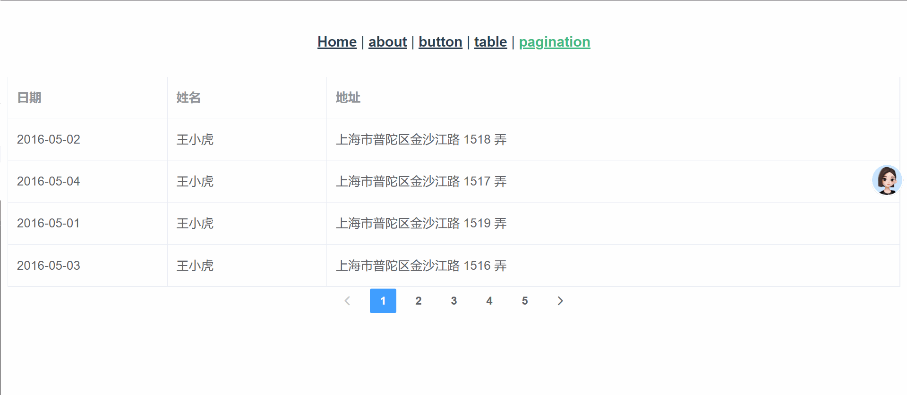

很好用到了我们之前学习的 `Vue2.js` 的知识，编写过程非常优雅。不妨再优雅一点？这里渲染的表格数据都是固定的条数，有没有办法动态调整表格的显示条数呢？毕竟我们通常只会返回一个表格数据，但是这个表格数据通常条数会比较多，如果能根据用户意愿显示对应的条数再来分页那再好不过了，我们依旧是查看文档来重新修改上述代码。

```js
<!-- ElementPaginationView.vue -->
<template>
  <!-- 表格部分 -->
  <div>
    <el-table :data="currentPageData" border style="width: 100%">
      <el-table-column
          label="日期"
          prop="date"
          width="180">
      </el-table-column>
      <el-table-column
          label="姓名"
          prop="name"
          width="180">
      </el-table-column>
      <el-table-column
          label="地址"
          prop="address">
      </el-table-column>
    </el-table>

    <!-- 分页部分 -->
    <el-pagination
        :page-size="pageSize"
        :total="totalItems"
        background
        layout="sizes, prev, pager, next, jumper, total"
        @current-change="handlePageChange"
        @size-change="handleSizeChange">
    </el-pagination>
  </div>
</template>

<script>
export default {
  data() {
    return {
      currentPage: 1, // 当前页码
      pageSize: 10, // 默认每页显示的条目数为 10
      tableData: [ // 需要渲染的大量数组
        {date: '2016-05-02', name: '王小虎', address: '上海市普陀区金沙江路 1518 弄'},
        {date: '2016-05-04', name: '王小虎', address: '上海市普陀区金沙江路 1517 弄'},
        {date: '2016-05-01', name: '王小虎', address: '上海市普陀区金沙江路 1519 弄'},
        {date: '2016-05-03', name: '王小虎', address: '上海市普陀区金沙江路 1516 弄'},
        {date: '2017-05-02', name: '李小龙', address: '北京市朝阳区望京街 1518 弄'},
        {date: '2017-05-04', name: '李小龙', address: '北京市朝阳区望京街 1517 弄'},
        {date: '2017-05-01', name: '李小龙', address: '北京市朝阳区望京街 1519 弄'},
        {date: '2017-05-03', name: '李小龙', address: '北京市朝阳区望京街 1516 弄'},
        {date: '2018-06-12', name: '张三', address: '广州市天河区体育西路 20 号'},
        {date: '2018-06-15', name: '张三', address: '广州市天河区体育西路 21 号'},
        {date: '2018-06-18', name: '张三', address: '广州市天河区体育西路 22 号'},
        {date: '2018-06-20', name: '张三', address: '广州市天河区体育西路 23 号'},
        {date: '2019-07-22', name: '赵四', address: '深圳市南山区科技园 1 号'},
        {date: '2019-07-25', name: '赵四', address: '深圳市南山区科技园 2 号'},
        {date: '2019-07-28', name: '赵四', address: '深圳市南山区科技园 3 号'},
        {date: '2019-07-30', name: '赵四', address: '深圳市南山区科技园 4 号'},
        {date: '2020-08-05', name: '王五', address: '杭州市西湖区文三路 100 号'},
        {date: '2020-08-08', name: '王五', address: '杭州市西湖区文三路 101 号'},
        {date: '2020-08-11', name: '王五', address: '杭州市西湖区文三路 102 号'},
        {date: '2020-08-13', name: '王五', address: '杭州市西湖区文三路 103 号'},
        {date: '2021-09-10', name: '刘德华', address: '广州市越秀区中山五路 10 号'},
        {date: '2021-09-15', name: '刘德华', address: '广州市越秀区中山五路 11 号'},
        {date: '2021-09-20', name: '刘德华', address: '广州市越秀区中山五路 12 号'},
        {date: '2021-09-25', name: '刘德华', address: '广州市越秀区中山五路 13 号'},
        {date: '2022-10-01', name: '张学友', address: '上海市静安区南京西路 100 号'},
        {date: '2022-10-05', name: '张学友', address: '上海市静安区南京西路 101 号'},
        {date: '2022-10-10', name: '张学友', address: '上海市静安区南京西路 102 号'},
        {date: '2022-10-15', name: '张学友', address: '上海市静安区南京西路 103 号'},
        {date: '2023-11-01', name: '周杰伦', address: '北京市海淀区中关村大街 1 号'},
        {date: '2023-11-05', name: '周杰伦', address: '北京市海淀区中关村大街 2 号'},
        {date: '2023-11-10', name: '周杰伦', address: '北京市海淀区中关村大街 3 号'},
        {date: '2023-11-15', name: '周杰伦', address: '北京市海淀区中关村大街 4 号'},
        {date: '2024-12-01', name: '陈奕迅', address: '深圳市福田区福华路 50 号'},
        {date: '2024-12-05', name: '陈奕迅', address: '深圳市福田区福华路 51 号'},
        {date: '2024-12-10', name: '陈奕迅', address: '深圳市福田区福华路 52 号'},
        {date: '2024-12-15', name: '陈奕迅', address: '深圳市福田区福华路 53 号'}
      ]
    };
  },
  computed: { // 计算属性方法
    totalItems() {
      return this.tableData.length; // 返回数据总条数
    },
    currentPageData() { // 当组件需要数据进行渲染时, 这里动态计算最多显示的条目个数数组, 然后再做返回
      const start = (this.currentPage - 1) * this.pageSize;
      const end = start + this.pageSize;
      return this.tableData.slice(start, end); // 获取当前页的数据
    }
  },
  methods: { // 普通方法
    handlePageChange(page) { // 当页面发生改变时触发
      this.currentPage = page; // 数据模型中存储一份页面数据, 导致同步被触发, 使得之前缓存的计算属性 currentPageData() 被重新进行计算
    },
    handleSizeChange(size) { // 当用户选择不同的最大显示条数时触发
      this.pageSize = size; // 数据模型中存储一份页面数据, 导致同步被触发, 使得之前缓存的计算属性 currentPageData() 被重新进行计算
      this.currentPage = 1; // 并且切换每页条数后默认重置为第一页
    }
  }
}
</script>

<style scoped>
/* 你的样式可以写在这里 */
</style>

```

但是有一点点小 `bug`，那就是用户切换页面最大条数的一瞬间，虽然数据模型中的分页修改了，但是没法即使反馈到视图中。我暂时没想到正确的修复办法，不过我有一个“黑魔法”，虽然看上去很奇怪，但是确实可以解决这个问题。

这个方法就是：如果您动态更改 `key` 的值，就会导致 `Vue2.js` 重新渲染组件。

```js
<!-- ElementPaginationView.vue -->
<template>
  <!-- 表格部分 -->
  <div>
    <el-table :data="currentPageData" border style="width: 100%">
      <el-table-column
          label="日期"
          prop="date"
          width="180">
      </el-table-column>
      <el-table-column
          label="姓名"
          prop="name"
          width="180">
      </el-table-column>
      <el-table-column
          label="地址"
          prop="address">
      </el-table-column>
    </el-table>

    <!-- 分页部分 -->
    <el-pagination
        :key="paginationKey"
        :page-size="pageSize"
        :total="totalItems"
        background
        layout="sizes, prev, pager, next, jumper, total"
        @current-change="handlePageChange"
        @size-change="handleSizeChange">
    </el-pagination>
  </div>
</template>

<script>
export default {
  data() {
    return {
      currentPage: 1, // 当前页码
      pageSize: 10, // 默认每页显示的条目数为 10
      paginationKey: 0, // 新增的 key 属性, 由于 key 值被修改, 可以强迫组件重新渲染
      tableData: [ // 需要渲染的大量数组
        {date: '2016-05-02', name: '王小虎', address: '上海市普陀区金沙江路 1518 弄'},
        {date: '2016-05-04', name: '王小虎', address: '上海市普陀区金沙江路 1517 弄'},
        {date: '2016-05-01', name: '王小虎', address: '上海市普陀区金沙江路 1519 弄'},
        {date: '2016-05-03', name: '王小虎', address: '上海市普陀区金沙江路 1516 弄'},
        {date: '2017-05-02', name: '李小龙', address: '北京市朝阳区望京街 1518 弄'},
        {date: '2017-05-04', name: '李小龙', address: '北京市朝阳区望京街 1517 弄'},
        {date: '2017-05-01', name: '李小龙', address: '北京市朝阳区望京街 1519 弄'},
        {date: '2017-05-03', name: '李小龙', address: '北京市朝阳区望京街 1516 弄'},
        {date: '2018-06-12', name: '张三', address: '广州市天河区体育西路 20 号'},
        {date: '2018-06-15', name: '张三', address: '广州市天河区体育西路 21 号'},
        {date: '2018-06-18', name: '张三', address: '广州市天河区体育西路 22 号'},
        {date: '2018-06-20', name: '张三', address: '广州市天河区体育西路 23 号'},
        {date: '2019-07-22', name: '赵四', address: '深圳市南山区科技园 1 号'},
        {date: '2019-07-25', name: '赵四', address: '深圳市南山区科技园 2 号'},
        {date: '2019-07-28', name: '赵四', address: '深圳市南山区科技园 3 号'},
        {date: '2019-07-30', name: '赵四', address: '深圳市南山区科技园 4 号'},
        {date: '2020-08-05', name: '王五', address: '杭州市西湖区文三路 100 号'},
        {date: '2020-08-08', name: '王五', address: '杭州市西湖区文三路 101 号'},
        {date: '2020-08-11', name: '王五', address: '杭州市西湖区文三路 102 号'},
        {date: '2020-08-13', name: '王五', address: '杭州市西湖区文三路 103 号'},
        {date: '2021-09-10', name: '刘德华', address: '广州市越秀区中山五路 10 号'},
        {date: '2021-09-15', name: '刘德华', address: '广州市越秀区中山五路 11 号'},
        {date: '2021-09-20', name: '刘德华', address: '广州市越秀区中山五路 12 号'},
        {date: '2021-09-25', name: '刘德华', address: '广州市越秀区中山五路 13 号'},
        {date: '2022-10-01', name: '张学友', address: '上海市静安区南京西路 100 号'},
        {date: '2022-10-05', name: '张学友', address: '上海市静安区南京西路 101 号'},
        {date: '2022-10-10', name: '张学友', address: '上海市静安区南京西路 102 号'},
        {date: '2022-10-15', name: '张学友', address: '上海市静安区南京西路 103 号'},
        {date: '2023-11-01', name: '周杰伦', address: '北京市海淀区中关村大街 1 号'},
        {date: '2023-11-05', name: '周杰伦', address: '北京市海淀区中关村大街 2 号'},
        {date: '2023-11-10', name: '周杰伦', address: '北京市海淀区中关村大街 3 号'},
        {date: '2023-11-15', name: '周杰伦', address: '北京市海淀区中关村大街 4 号'},
        {date: '2024-12-01', name: '陈奕迅', address: '深圳市福田区福华路 50 号'},
        {date: '2024-12-05', name: '陈奕迅', address: '深圳市福田区福华路 51 号'},
        {date: '2024-12-10', name: '陈奕迅', address: '深圳市福田区福华路 52 号'},
        {date: '2024-12-15', name: '陈奕迅', address: '深圳市福田区福华路 53 号'}
      ]
    };
  },
  computed: { // 计算属性方法
    totalItems() {
      return this.tableData.length; // 返回数据总条数
    },
    currentPageData() { // 当组件需要数据进行渲染时, 这里动态计算最多显示的条目个数数组, 然后再做返回
      const start = (this.currentPage - 1) * this.pageSize;
      const end = start + this.pageSize;
      return this.tableData.slice(start, end); // 获取当前页的数据
    }
  },
  methods: { // 普通方法
    handlePageChange(page) { // 当页面发生改变时触发
      this.currentPage = page; // 数据模型中存储一份页面数据, 导致同步被触发, 使得之前缓存的计算属性 currentPageData() 被重新进行计算
    },
    handleSizeChange(size) { // 当用户选择不同的最大显示条数时触发
      this.pageSize = size; // 数据模型中存储一份页面数据, 导致同步被触发, 使得之前缓存的计算属性 currentPageData() 被重新进行计算
      this.currentPage = 1; // 并且切换每页条数后默认重置为第一页
      this.paginationKey += 1; // 改变 key 以重新渲染分页组件
    }
  }
}
</script>

<style scoped>
/* 你的样式可以写在这里 */
</style>

```

>   吐槽：这点我认为官方做的不太好...正常用户如果进行切换，最好是默认分页的行为跳转到第一页，当然，如果真的希望用户在跳转到某一页的中间需要修改最大显示条数的话，按到确实有道理，总之看您的实现吧...不过也有可能是我没有太仔细阅读文档的原因，如果还有其他的解决方案我就在这里重新补上。

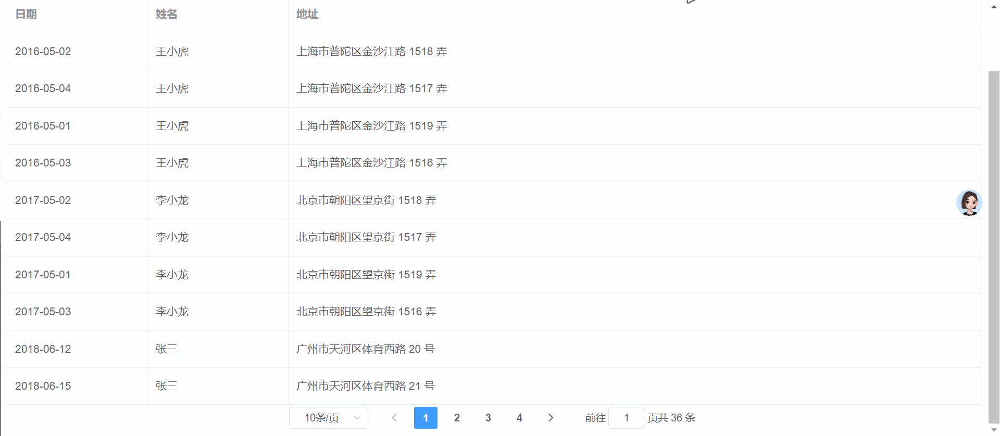

还是那句话非常的优雅！

#### 4.1.2.4.对话框组件

对话框也是非常常用，经常用在需要和用户交互的常见，用户可以通过对话框组件获取提示信息、输入数据...

```js
<!-- ElementDialogView.vue -->
<template>
  <div>
    <el-button type="text" @click="openDialog">点击打开 Dialog</el-button>

    <el-dialog
        title="提示"
        :visible.sync="dialogVisible"
        width="30%"
        :before-close="handleClose"
        ref="dialog">
      <span>这是一段信息</span>
      <span slot="footer" class="dialog-footer">
        <el-button @click="closeDialog">取 消</el-button>
        <el-button type="primary" @click="closeDialog">确 定</el-button>
      </span>
    </el-dialog>
  </div>
</template>

<script>
export default {
  data() {
    return {
      dialogVisible: false
    };
  },
  methods: {
    openDialog() {
      this.dialogVisible = true;
    },
    closeDialog() {
      this.dialogVisible = false;
    },
    handleClose(done) {
      this.$confirm('确认关闭？')
          .then(() => {
            done();
          })
          .catch(() => {});
    }
  }
};
</script>
	
```

```js
<!-- App.vue -->
<template>
  <div id="app">
    <nav> <!-- 这个 nav 只是一个语义标签, 主要是用在页面中的导航链接部分, 它通常包含一组链接, 用户可以通过这些链接在网站或应用的不同部分之间进行导航, 主要是为了增加代码可读性和搜索引擎 SEO 友好的 -->
      <router-link to="/">Home</router-link> <!-- 显示 Home 视图链接 -->
      |
      <router-link to="/about">about</router-link> <!-- 显示 about 视图链接 -->
      |
      <router-link to="/button">button</router-link> <!-- 显示 about 视图链接 -->
      |
      <router-link to="/table">table</router-link> <!-- 显示 about 视图链接 -->
      |
      <router-link to="/pagination">pagination</router-link> <!-- 显示 about 视图链接 -->
      |
      <router-link to="/dialog">dialog</router-link> <!-- 显示 about 视图链接 -->
    </nav>
    <router-view/> <!-- 页面/视图的显示地点 -->
  </div>
</template>

<style>
#app {
  font-family: Avenir, Helvetica, Arial, sans-serif;
  -webkit-font-smoothing: antialiased;
  -moz-osx-font-smoothing: grayscale;
  text-align: center;
  color: #2c3e50;
}

nav {
  padding: 30px;
}

nav a {
  font-weight: bold;
  color: #2c3e50;
}

nav a.router-link-exact-active {
  color: #42b983;
}
</style>
<script setup lang="ts">
</script>
```

```js
// index.js
import Vue from 'vue'
import VueRouter from 'vue-router'
import HomeView from '../views/HomeView.vue'
import ButtonView from '../views/ElementButtonView.vue'
import TableView from '../views/ElementTableView.vue'
import PaginationView from '../views/ElementPaginationView.vue'
import DialogView from '../views/ElementDialogView.vue' // 注意这里要导入

Vue.use(VueRouter)

// 定义路由映射
const routes = [
    {
        path: '/',
        name: 'home', // 这里的 name 是路由名字, 路由名字可以让路由修改的时候不是硬编码设置, 方便业务随时进行修改
        component: HomeView // 注册子组件, 也就是视图
    },
    {
        path: '/about',
        name: 'about',
        // 下面这种动态加载实际上是懒加载, 只有用户实际访问了 /about 路径时, 才会进行下载和渲染, 可以提高用户的响应速度
        component: () => import(/* webpackChunkName: "about" */ '../views/AboutView.vue') // 这也是为什么之前我们设置的 about 没有设置 name 的原因
    },
    { // 下面是新增加的路由
        path: '/button',
        name: 'button', // 这里的 name 是路由名字, 路由名字可以让路由修改的时候不是硬编码设置, 方便业务随时进行修改
        component: ButtonView // 注册子组件, 也就是视图
    },
    { // 下面是新增加的路由
        path: '/table',
        name: 'table', // 这里的 name 是路由名字, 路由名字可以让路由修改的时候不是硬编码设置, 方便业务随时进行修改
        component: TableView // 注册子组件, 也就是视图
    }
    ,
    { // 下面是新增加的路由
        path: '/pagination',
        name: 'pagination', // 这里的 name 是路由名字, 路由名字可以让路由修改的时候不是硬编码设置, 方便业务随时进行修改
        component: PaginationView // 注册子组件, 也就是视图
    }
    ,
    { // 下面是新增加的路由
        path: '/dialog',
        name: 'dialog', // 这里的 name 是路由名字, 路由名字可以让路由修改的时候不是硬编码设置, 方便业务随时进行修改
        component: DialogView // 注册子组件, 也就是视图
    }
]

// 设置路由管理
const router = new VueRouter({
    routes
})

// 把路由实例对象导出, 等待后续交给 vue 实例进行路由注入
export default router

```

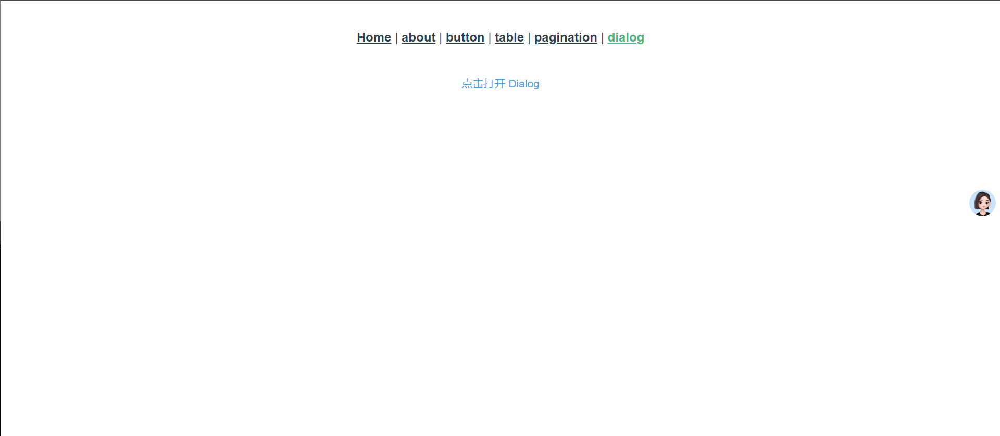

#### 4.1.2.5.表单组件

表单组件也是在实际开发中非常重要的组件，我们来尝试使用一下。

```js
<!-- ElementFormView.vue -->
<template>
  <div>
    <el-form ref="form" :model="form" label-width="80px">
      <el-form-item label="活动名称">
        <el-input v-model="form.name"></el-input>
      </el-form-item>
      <el-form-item label="活动区域">
        <el-select v-model="form.region" placeholder="请选择活动区域">
          <el-option label="区域一" value="shanghai"></el-option>
          <el-option label="区域二" value="beijing"></el-option>
        </el-select>
      </el-form-item>
      <el-form-item label="活动时间">
        <el-col :span="11">
          <el-date-picker v-model="form.date1" placeholder="选择日期" style="width: 100%;" type="date"></el-date-picker>
        </el-col>
        <el-col :span="2" class="line">-</el-col>
        <el-col :span="11">
          <el-time-picker v-model="form.date2" placeholder="选择时间" style="width: 100%;"></el-time-picker>
        </el-col>
      </el-form-item>
      <el-form-item label="即时配送">
        <el-switch v-model="form.delivery"></el-switch>
      </el-form-item>
      <el-form-item label="活动性质">
        <el-checkbox-group v-model="form.type">
          <el-checkbox label="美食/餐厅线上活动" name="type"></el-checkbox>
          <el-checkbox label="地推活动" name="type"></el-checkbox>
          <el-checkbox label="线下主题活动" name="type"></el-checkbox>
          <el-checkbox label="单纯品牌曝光" name="type"></el-checkbox>
        </el-checkbox-group>
      </el-form-item>
      <el-form-item label="特殊资源">
        <el-radio-group v-model="form.resource">
          <el-radio label="线上品牌商赞助"></el-radio>
          <el-radio label="线下场地免费"></el-radio>
        </el-radio-group>
      </el-form-item>
      <el-form-item label="活动形式">
        <el-input v-model="form.desc" type="textarea"></el-input>
      </el-form-item>
      <el-form-item>
        <el-button type="primary" @click="onSubmit">立即创建</el-button>
        <el-button>取消</el-button>
      </el-form-item>
    </el-form>
  </div>
</template>

<script>
export default {
  data() {
    return {
      form: {
        name: '',
        region: '',
        date1: '',
        date2: '',
        delivery: false,
        type: [],
        resource: '',
        desc: ''
      }
    }
  },
  methods: {
    onSubmit() {
      console.log('submit!');
    }
  }
}
</script>
```

```js
<!-- App.vue -->
<template>
  <div id="app">
    <nav> <!-- 这个 nav 只是一个语义标签, 主要是用在页面中的导航链接部分, 它通常包含一组链接, 用户可以通过这些链接在网站或应用的不同部分之间进行导航, 主要是为了增加代码可读性和搜索引擎 SEO 友好的 -->
      <router-link to="/">Home</router-link> <!-- 显示 Home 视图链接 -->
      |
      <router-link to="/about">about</router-link> <!-- 显示 about 视图链接 -->
      |
      <router-link to="/button">button</router-link> <!-- 显示 about 视图链接 -->
      |
      <router-link to="/table">table</router-link> <!-- 显示 about 视图链接 -->
      |
      <router-link to="/pagination">pagination</router-link> <!-- 显示 about 视图链接 -->
      |
      <router-link to="/dialog">dialog</router-link> <!-- 显示 about 视图链接 -->
      |
      <router-link to="/from">from</router-link> <!-- 显示 about 视图链接 -->
    </nav>
    <router-view/> <!-- 页面/视图的显示地点 -->
  </div>
</template>

<style>
#app {
  font-family: Avenir, Helvetica, Arial, sans-serif;
  -webkit-font-smoothing: antialiased;
  -moz-osx-font-smoothing: grayscale;
  text-align: center;
  color: #2c3e50;
}

nav {
  padding: 30px;
}

nav a {
  font-weight: bold;
  color: #2c3e50;
}

nav a.router-link-exact-active {
  color: #42b983;
}
</style>
<script setup lang="ts">
</script>
```

```js
// index.js
import Vue from 'vue'
import VueRouter from 'vue-router'
import HomeView from '../views/HomeView.vue'
import ButtonView from '../views/ElementButtonView.vue'
import TableView from '../views/ElementTableView.vue'
import PaginationView from '../views/ElementPaginationView.vue'
import DialogView from '../views/ElementDialogView.vue' // 注意这里要导入
import FromView from '../views/ElementFormView.vue' // 注意这里要导入

Vue.use(VueRouter)

// 定义路由映射
const routes = [
    {
        path: '/',
        name: 'home', // 这里的 name 是路由名字, 路由名字可以让路由修改的时候不是硬编码设置, 方便业务随时进行修改
        component: HomeView // 注册子组件, 也就是视图
    },
    {
        path: '/about',
        name: 'about',
        // 下面这种动态加载实际上是懒加载, 只有用户实际访问了 /about 路径时, 才会进行下载和渲染, 可以提高用户的响应速度
        component: () => import(/* webpackChunkName: "about" */ '../views/AboutView.vue') // 这也是为什么之前我们设置的 about 没有设置 name 的原因
    },
    { // 下面是新增加的路由
        path: '/button',
        name: 'button', // 这里的 name 是路由名字, 路由名字可以让路由修改的时候不是硬编码设置, 方便业务随时进行修改
        component: ButtonView // 注册子组件, 也就是视图
    },
    { // 下面是新增加的路由
        path: '/table',
        name: 'table', // 这里的 name 是路由名字, 路由名字可以让路由修改的时候不是硬编码设置, 方便业务随时进行修改
        component: TableView // 注册子组件, 也就是视图
    }
    ,
    { // 下面是新增加的路由
        path: '/pagination',
        name: 'pagination', // 这里的 name 是路由名字, 路由名字可以让路由修改的时候不是硬编码设置, 方便业务随时进行修改
        component: PaginationView // 注册子组件, 也就是视图
    }
    ,
    { // 下面是新增加的路由
        path: '/dialog',
        name: 'dialog', // 这里的 name 是路由名字, 路由名字可以让路由修改的时候不是硬编码设置, 方便业务随时进行修改
        component: DialogView // 注册子组件, 也就是视图
    }
    ,
    { // 下面是新增加的路由
        path: '/from',
        name: 'from', // 这里的 name 是路由名字, 路由名字可以让路由修改的时候不是硬编码设置, 方便业务随时进行修改
        component: FromView // 注册子组件, 也就是视图
    }
]

// 设置路由管理
const router = new VueRouter({
    routes
})

// 把路由实例对象导出, 等待后续交给 vue 实例进行路由注入
export default router

```

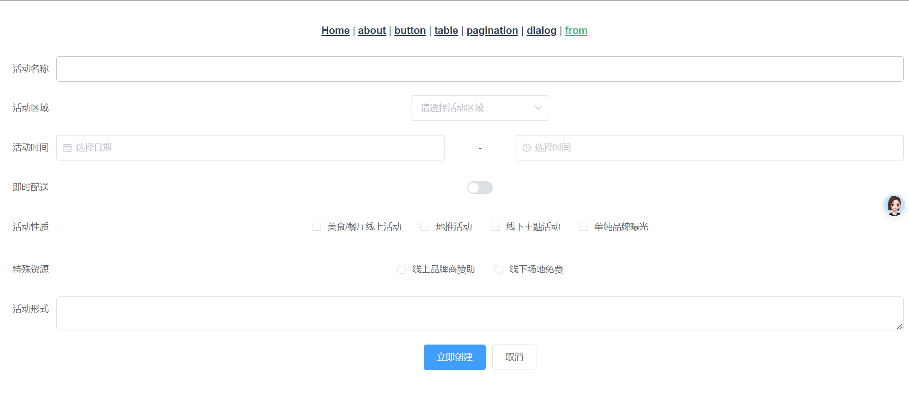

这里简单看一下就行，而关于表单验证、表单提交...细节，我会在后续项目开发中涉及，这里就先简单进行展示，不再过分扣取细节。

#### 4.1.2.6.布局容器组件

好看的组件是影响网站的美观程度，但合适的布局更是网站的重中之重。我们根据文档，选择一个比较常见的布局容器。

```js
<!-- ElementContainerView.vue -->
<template>
  <div>
    <el-container>
      <el-aside width="200px">Aside</el-aside>
      <el-container>
        <el-header>Header</el-header>
        <el-main>Main</el-main>
        <el-footer>Footer</el-footer>
      </el-container>
    </el-container>
  </div>
</template>

<style scoped>
.el-header, .el-footer {
  background-color: #B3C0D1;
  color: #333;
  text-align: center;
  line-height: 60px;
}

.el-aside {
  background-color: #D3DCE6;
  color: #333;
  text-align: center;
  line-height: 200px;
}

.el-main {
  background-color: #E9EEF3;
  color: #333;
  text-align: center;
  line-height: 160px;
}

body > .el-container {
  margin-bottom: 40px;
}

.el-container:nth-child(5) .el-aside,
.el-container:nth-child(6) .el-aside {
  line-height: 260px;
}

.el-container:nth-child(7) .el-aside {
  line-height: 320px;
}
</style>

<script>

</script>
```

```js
<!-- App.vue -->
<template>
  <div id="app">
    <nav> <!-- 这个 nav 只是一个语义标签, 主要是用在页面中的导航链接部分, 它通常包含一组链接, 用户可以通过这些链接在网站或应用的不同部分之间进行导航, 主要是为了增加代码可读性和搜索引擎 SEO 友好的 -->
      <router-link to="/">Home</router-link> <!-- 显示 Home 视图链接 -->
      |
      <router-link to="/about">about</router-link> <!-- 显示 about 视图链接 -->
      |
      <router-link to="/button">button</router-link> <!-- 显示 about 视图链接 -->
      |
      <router-link to="/table">table</router-link> <!-- 显示 about 视图链接 -->
      |
      <router-link to="/pagination">pagination</router-link> <!-- 显示 about 视图链接 -->
      |
      <router-link to="/dialog">dialog</router-link> <!-- 显示 about 视图链接 -->
      |
      <router-link to="/from">from</router-link> <!-- 显示 about 视图链接 -->
      |
      <router-link to="/container">container</router-link> <!-- 显示 about 视图链接 -->
    </nav>
    <router-view/> <!-- 页面/视图的显示地点 -->
  </div>
</template>

<style>
#app {
  font-family: Avenir, Helvetica, Arial, sans-serif;
  -webkit-font-smoothing: antialiased;
  -moz-osx-font-smoothing: grayscale;
  text-align: center;
  color: #2c3e50;
}

nav {
  padding: 30px;
}

nav a {
  font-weight: bold;
  color: #2c3e50;
}

nav a.router-link-exact-active {
  color: #42b983;
}
</style>
<script setup lang="ts">
</script>
```

```js
// index.js
import Vue from 'vue'
import VueRouter from 'vue-router'
import HomeView from '../views/HomeView.vue'
import ButtonView from '../views/ElementButtonView.vue'
import TableView from '../views/ElementTableView.vue'
import PaginationView from '../views/ElementPaginationView.vue'
import DialogView from '../views/ElementDialogView.vue' // 注意这里要导入
import FromView from '../views/ElementFormView.vue' // 注意这里要导入
import Container from '../views/ElementContainerView.vue' // 注意这里要导入

Vue.use(VueRouter)

// 定义路由映射
const routes = [
    {
        path: '/',
        name: 'home', // 这里的 name 是路由名字, 路由名字可以让路由修改的时候不是硬编码设置, 方便业务随时进行修改
        component: HomeView // 注册子组件, 也就是视图
    },
    {
        path: '/about',
        name: 'about',
        // 下面这种动态加载实际上是懒加载, 只有用户实际访问了 /about 路径时, 才会进行下载和渲染, 可以提高用户的响应速度
        component: () => import(/* webpackChunkName: "about" */ '../views/AboutView.vue') // 这也是为什么之前我们设置的 about 没有设置 name 的原因
    },
    { // 下面是新增加的路由
        path: '/button',
        name: 'button', // 这里的 name 是路由名字, 路由名字可以让路由修改的时候不是硬编码设置, 方便业务随时进行修改
        component: ButtonView // 注册子组件, 也就是视图
    },
    { // 下面是新增加的路由
        path: '/table',
        name: 'table', // 这里的 name 是路由名字, 路由名字可以让路由修改的时候不是硬编码设置, 方便业务随时进行修改
        component: TableView // 注册子组件, 也就是视图
    }
    ,
    { // 下面是新增加的路由
        path: '/pagination',
        name: 'pagination', // 这里的 name 是路由名字, 路由名字可以让路由修改的时候不是硬编码设置, 方便业务随时进行修改
        component: PaginationView // 注册子组件, 也就是视图
    }
    ,
    { // 下面是新增加的路由
        path: '/dialog',
        name: 'dialog', // 这里的 name 是路由名字, 路由名字可以让路由修改的时候不是硬编码设置, 方便业务随时进行修改
        component: DialogView // 注册子组件, 也就是视图
    }
    ,
    { // 下面是新增加的路由
        path: '/from',
        name: 'from', // 这里的 name 是路由名字, 路由名字可以让路由修改的时候不是硬编码设置, 方便业务随时进行修改
        component: FromView // 注册子组件, 也就是视图
    }
    ,
    { // 下面是新增加的路由
        path: '/container',
        name: 'container', // 这里的 name 是路由名字, 路由名字可以让路由修改的时候不是硬编码设置, 方便业务随时进行修改
        component: Container // 注册子组件, 也就是视图
    }
]

// 设置路由管理
const router = new VueRouter({
    routes
})

// 把路由实例对象导出, 等待后续交给 vue 实例进行路由注入
export default router

```

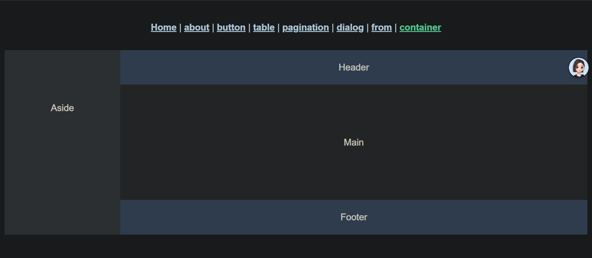

您可以尝试调整一下几个标签的位置，来观察它们之间的布局规律，不过我们的布局仅仅添加了样式，没有进行填充，所以并没有占据整个页面，需要有一些别的组件来扩充这个布局容器，我会在下一节中使用导航栏进行扩充。

#### 4.1.2.7.导航栏组件

```js
<!-- ElementNavMenuView.vue -->
<template>
  <div>
    <el-radio-group v-model="isCollapse" style="margin-bottom: 20px;">
      <el-radio-button :label="false">展开</el-radio-button>
      <el-radio-button :label="true">收起</el-radio-button>
    </el-radio-group>
    <el-menu :collapse="isCollapse" class="el-menu-vertical-demo" default-active="1-4-1" @close="handleClose"
             @open="handleOpen">
      <el-submenu index="1">
        <template slot="title">
          <i class="el-icon-location"></i>
          <span slot="title">导航一</span>
        </template>
        <el-menu-item-group>
          <span slot="title">分组一</span>
          <el-menu-item index="1-1">选项1</el-menu-item>
          <el-menu-item index="1-2">选项2</el-menu-item>
        </el-menu-item-group>
        <el-menu-item-group title="分组2">
          <el-menu-item index="1-3">选项3</el-menu-item>
        </el-menu-item-group>
        <el-submenu index="1-4">
          <span slot="title">选项4</span>
          <el-menu-item index="1-4-1">选项1</el-menu-item>
        </el-submenu>
      </el-submenu>
      <el-menu-item index="2">
        <i class="el-icon-menu"></i>
        <span slot="title">导航二</span>
      </el-menu-item>
      <el-menu-item disabled index="3">
        <i class="el-icon-document"></i>
        <span slot="title">导航三</span>
      </el-menu-item>
      <el-menu-item index="4">
        <i class="el-icon-setting"></i>
        <span slot="title">导航四</span>
      </el-menu-item>
    </el-menu>
  </div>
</template>

<script>
export default {
  data() {
    return {
      isCollapse: true
    };
  },
  methods: {
    handleOpen(key, keyPath) {
      console.log(key, keyPath);
    },
    handleClose(key, keyPath) {
      console.log(key, keyPath);
    }
  }
}
</script>

<style>
.el-menu-vertical-demo:not(.el	-menu--collapse) {
  width: 200px;
  min-height: 400px;
}
</style>	
```

```js
<!-- App.vue -->
<template>
  <div id="app">
    <nav> <!-- 这个 nav 只是一个语义标签, 主要是用在页面中的导航链接部分, 它通常包含一组链接, 用户可以通过这些链接在网站或应用的不同部分之间进行导航, 主要是为了增加代码可读性和搜索引擎 SEO 友好的 -->
      <router-link to="/">Home</router-link> <!-- 显示 Home 视图链接 -->
      |
      <router-link to="/about">about</router-link> <!-- 显示 about 视图链接 -->
      |
      <router-link to="/button">button</router-link> <!-- 显示 about 视图链接 -->
      |
      <router-link to="/table">table</router-link> <!-- 显示 about 视图链接 -->
      |
      <router-link to="/pagination">pagination</router-link> <!-- 显示 about 视图链接 -->
      |
      <router-link to="/dialog">dialog</router-link> <!-- 显示 about 视图链接 -->
      |
      <router-link to="/from">from</router-link> <!-- 显示 about 视图链接 -->
      |
      <router-link to="/container">container</router-link> <!-- 显示 about 视图链接 -->
      |
      <router-link to="/navMenu">navMenu</router-link> <!-- 显示 about 视图链接 -->
    </nav>
    <router-view/> <!-- 页面/视图的显示地点 -->
  </div>
</template>

<style>
#app {
  font-family: Avenir, Helvetica, Arial, sans-serif;
  -webkit-font-smoothing: antialiased;
  -moz-osx-font-smoothing: grayscale;
  text-align: center;
  color: #2c3e50;
}

nav {
  padding: 30px;
}

nav a {
  font-weight: bold;
  color: #2c3e50;
}

nav a.router-link-exact-active {
  color: #42b983;
}
</style>
<script setup lang="ts">
</script>
```

```js
// index.js
import Vue from 'vue'
import VueRouter from 'vue-router'
import HomeView from '../views/HomeView.vue'
import ButtonView from '../views/ElementButtonView.vue'
import TableView from '../views/ElementTableView.vue'
import PaginationView from '../views/ElementPaginationView.vue'
import DialogView from '../views/ElementDialogView.vue' // 注意这里要导入
import FromView from '../views/ElementFormView.vue' // 注意这里要导入
import Container from '../views/ElementContainerView.vue' // 注意这里要导入
import NavMenu from '../views/ElementNavMenuView.vue' // 注意这里要导入

Vue.use(VueRouter)

// 定义路由映射
const routes = [
    {
        path: '/',
        name: 'home', // 这里的 name 是路由名字, 路由名字可以让路由修改的时候不是硬编码设置, 方便业务随时进行修改
        component: HomeView // 注册子组件, 也就是视图
    },
    {
        path: '/about',
        name: 'about',
        // 下面这种动态加载实际上是懒加载, 只有用户实际访问了 /about 路径时, 才会进行下载和渲染, 可以提高用户的响应速度
        component: () => import(/* webpackChunkName: "about" */ '../views/AboutView.vue') // 这也是为什么之前我们设置的 about 没有设置 name 的原因
    },
    { // 下面是新增加的路由
        path: '/button',
        name: 'button', // 这里的 name 是路由名字, 路由名字可以让路由修改的时候不是硬编码设置, 方便业务随时进行修改
        component: ButtonView // 注册子组件, 也就是视图
    },
    { // 下面是新增加的路由
        path: '/table',
        name: 'table', // 这里的 name 是路由名字, 路由名字可以让路由修改的时候不是硬编码设置, 方便业务随时进行修改
        component: TableView // 注册子组件, 也就是视图
    }
    ,
    { // 下面是新增加的路由
        path: '/pagination',
        name: 'pagination', // 这里的 name 是路由名字, 路由名字可以让路由修改的时候不是硬编码设置, 方便业务随时进行修改
        component: PaginationView // 注册子组件, 也就是视图
    }
    ,
    { // 下面是新增加的路由
        path: '/dialog',
        name: 'dialog', // 这里的 name 是路由名字, 路由名字可以让路由修改的时候不是硬编码设置, 方便业务随时进行修改
        component: DialogView // 注册子组件, 也就是视图
    }
    ,
    { // 下面是新增加的路由
        path: '/from',
        name: 'from', // 这里的 name 是路由名字, 路由名字可以让路由修改的时候不是硬编码设置, 方便业务随时进行修改
        component: FromView // 注册子组件, 也就是视图
    }
    ,
    { // 下面是新增加的路由
        path: '/container',
        name: 'container', // 这里的 name 是路由名字, 路由名字可以让路由修改的时候不是硬编码设置, 方便业务随时进行修改
        component: Container // 注册子组件, 也就是视图
    }
    ,
    { // 下面是新增加的路由
        path: '/navMenu',
        name: 'navMenu', // 这里的 name 是路由名字, 路由名字可以让路由修改的时候不是硬编码设置, 方便业务随时进行修改
        component: NavMenu // 注册子组件, 也就是视图
    }
]

// 设置路由管理
const router = new VueRouter({
    routes
})

// 把路由实例对象导出, 等待后续交给 vue 实例进行路由注入
export default router

```

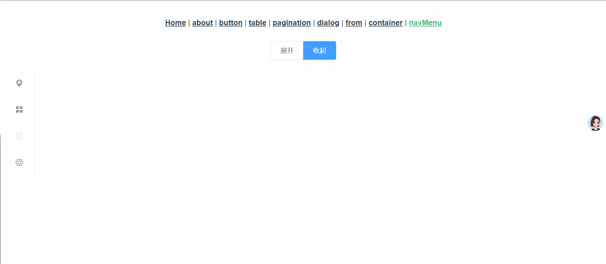

但是这样未免乏味，我们把之前写的分页表格、某些组件、布局容器都组合到这里试试？

>   补充：下面有用到单选框和选框组，但是前面我们没有怎么提及过，这里详细解释一下用法。
>
>   要使用 `Radio` 单选框组件，只需要设置 `v-model` 绑定变量，选中则意味着变量的值为相应 `Radio` 中 `label` 属性的设定值，`label` 属性值可以是 `String, Number, boolean` 三种，下面大概使用一下。
>
>   ```js
>   <!-- 使用单选框组件 -->
>   <template>
>       <el-radio v-model="radio" label="1">备选项</el-radio>
>       <el-radio v-model="radio" label="2">备选项</el-radio>
>   </template>
>   ```
>
>   但是单选框组件通常不会单独使用，会结合选框组一起使用。结合 `<el-radio-group>` 选框组元素和子元素 `<el-radio>` 即可实现单选组，不过这次是在 `<el-radio-group>` 中绑定 `v-model`，而在 `<el-radio>` 中只需要设置好 `label` 属性即可。另外还提供了 `change` 事件来响应变化，它会传入一个回调参数 `value`。
>
>   ```js
>   <!-- 使用选框组组合多个单选框 -->
>   <el-radio-group v-model="radio">
>       <el-radio :label="3">备选项</el-radio>
>       <el-radio :label="6">备选项</el-radio>
>       <el-radio :label="9">备选项</el-radio>
>   </el-radio-group>
>   ```

下面代码可能有点长，但单纯是在复制粘贴而已，没有太多技术含量...

```js
<!-- ElementNavMenuView.vue -->

<template>
  <div>
    <el-container>
      <el-aside width="200px">
        <el-menu
            :collapse="isCollapse"
            :default-active="activeMenu"
            @close="handleClose"
            @open="handleOpen"
            @select="handleSelect">
          <el-menu-item index="1">
            <i class="el-icon-setting"></i>
            <span slot="title">导航一</span>
          </el-menu-item>
          <el-menu-item index="2">
            <i class="el-icon-setting"></i>
            <span slot="title">导航二</span>
          </el-menu-item>
          <el-menu-item index="3">
            <i class="el-icon-setting"></i>
            <span slot="title">导航三</span>
          </el-menu-item>
          <el-menu-item index="4">
            <i class="el-icon-setting"></i>
            <span slot="title">导航四</span>
          </el-menu-item>
          <el-menu-item index="5">
            <i class="el-icon-setting"></i>
            <span slot="title">导航五</span>
          </el-menu-item>
          <el-menu-item index="6">
            <i class="el-icon-setting"></i>
            <span slot="title">导航六</span>
          </el-menu-item>
          <el-menu-item index="7">
            <i class="el-icon-setting"></i>
            <span slot="title">导航七</span>
          </el-menu-item>
          <el-menu-item index="8">
            <i class="el-icon-setting"></i>
            <span slot="title">导航八</span>
          </el-menu-item>
          <el-menu-item index="9">
            <i class="el-icon-setting"></i>
            <span slot="title">导航九</span>
          </el-menu-item>
        </el-menu>
      </el-aside>
      <el-container>
        <el-header>
          <el-radio-group v-model="isCollapse" style="margin-bottom: 20px;">
            <el-radio-button :label="false">展开</el-radio-button>
            <el-radio-button :label="true">收起</el-radio-button>
          </el-radio-group>
        </el-header>
        <el-main>    <!-- 根据当前激活的菜单项显示不同的内容 -->
          <div v-if="activeMenu === '1'">
            <!-- 表格部分 -->
            <div>
              <el-table :data="currentPageData" border style="width: 100%">
                <el-table-column
                    label="日期"
                    prop="date"
                    width="180">
                </el-table-column>
                <el-table-column
                    label="姓名"
                    prop="name"
                    width="180">
                </el-table-column>
                <el-table-column
                    label="地址"
                    prop="address">
                </el-table-column>
              </el-table>

              <!-- 分页部分 -->
              <el-pagination
                  :key="paginationKey"
                  :page-size="pageSize"
                  :total="totalItems"
                  background
                  layout="sizes, prev, pager, next, jumper, total"
                  @current-change="handlePageChange"
                  @size-change="handleSizeChange">
              </el-pagination>
            </div>
          </div>
          <div v-if="activeMenu === '2'">
            <h2>内容二</h2>
            <p>这是导航二的正文内容...</p>
            <p>这是导航二的正文内容...</p>
            <p>这是导航二的正文内容...</p>
            <p>这是导航二的正文内容...</p>
            <p>这是导航二的正文内容...</p>
            <p>这是导航二的正文内容...</p>
            <p>这是导航二的正文内容...</p>
            <p>这是导航二的正文内容...</p>
            <p>这是导航二的正文内容...</p>
            <p>这是导航二的正文内容...</p>
          </div>
          <div v-if="activeMenu === '3'">
            <h2>内容三</h2>
            <p>这是导航三的正文内容...</p>
            <p>这是导航三的正文内容...</p>
            <p>这是导航三的正文内容...</p>
            <p>这是导航三的正文内容...</p>
            <p>这是导航三的正文内容...</p>
            <p>这是导航三的正文内容...</p>
            <p>这是导航三的正文内容...</p>
            <p>这是导航三的正文内容...</p>
            <p>这是导航三的正文内容...</p>
            <p>这是导航三的正文内容...</p>
          </div>
          <div v-if="activeMenu === '4'">
            <h2>内容四</h2>
            <p>这是导航四的正文内容...</p>
            <p>这是导航四的正文内容...</p>
            <p>这是导航四的正文内容...</p>
            <p>这是导航四的正文内容...</p>
            <p>这是导航四的正文内容...</p>
            <p>这是导航四的正文内容...</p>
            <p>这是导航四的正文内容...</p>
            <p>这是导航四的正文内容...</p>
            <p>这是导航四的正文内容...</p>
            <p>这是导航四的正文内容...</p>
          </div>
          <div v-if="activeMenu === '5'">
            <h2>内容五</h2>
            <p>这是导航五的正文内容...</p>
            <p>这是导航五的正文内容...</p>
            <p>这是导航五的正文内容...</p>
            <p>这是导航五的正文内容...</p>
            <p>这是导航五的正文内容...</p>
            <p>这是导航五的正文内容...</p>
            <p>这是导航五的正文内容...</p>
            <p>这是导航五的正文内容...</p>
            <p>这是导航五的正文内容...</p>
            <p>这是导航五的正文内容...</p>
          </div>
          <div v-if="activeMenu === '6'">
            <h2>内容六</h2>
            <p>这是导航六的正文内容...</p>
            <p>这是导航六的正文内容...</p>
            <p>这是导航六的正文内容...</p>
            <p>这是导航六的正文内容...</p>
            <p>这是导航六的正文内容...</p>
            <p>这是导航六的正文内容...</p>
            <p>这是导航六的正文内容...</p>
            <p>这是导航六的正文内容...</p>
            <p>这是导航六的正文内容...</p>
            <p>这是导航六的正文内容...</p>
          </div>
          <div v-if="activeMenu === '7'">
            <h2>内容七</h2>
            <p>这是导航七的正文内容...</p>
            <p>这是导航七的正文内容...</p>
            <p>这是导航七的正文内容...</p>
            <p>这是导航七的正文内容...</p>
            <p>这是导航七的正文内容...</p>
            <p>这是导航七的正文内容...</p>
            <p>这是导航七的正文内容...</p>
            <p>这是导航七的正文内容...</p>
            <p>这是导航七的正文内容...</p>
            <p>这是导航七的正文内容...</p>
          </div>
          <div v-if="activeMenu === '8'">
            <h2>内容八</h2>
            <p>这是导航八的正文内容...</p>
            <p>这是导航八的正文内容...</p>
            <p>这是导航八的正文内容...</p>
            <p>这是导航八的正文内容...</p>
            <p>这是导航八的正文内容...</p>
            <p>这是导航八的正文内容...</p>
            <p>这是导航八的正文内容...</p>
            <p>这是导航八的正文内容...</p>
            <p>这是导航八的正文内容...</p>
            <p>这是导航八的正文内容...</p>
          </div>
          <div v-if="activeMenu === '9'">
            <h2>内容九</h2>
            <p>这是导航九的正文内容...</p>
            <p>这是导航九的正文内容...</p>
            <p>这是导航九的正文内容...</p>
            <p>这是导航九的正文内容...</p>
            <p>这是导航九的正文内容...</p>
            <p>这是导航九的正文内容...</p>
            <p>这是导航九的正文内容...</p>
            <p>这是导航九的正文内容...</p>
            <p>这是导航九的正文内容...</p>
            <p>这是导航九的正文内容...</p>
          </div>
        </el-main>
        <el-footer>备案号: xxxx 制作人: limou3434 邮箱: 898738804@qq.com</el-footer>
      </el-container>
    </el-container>
  </div>
</template>

<script>
export default {
  data() {
    return {
      isCollapse: false, // 默认为展开
      activeMenu: '1', // 默认选中第一个菜单项
      currentPage: 1, // 当前页码
      pageSize: 10, // 默认每页显示的条目数为 10
      paginationKey: 0, // 新增的 key 属性, 由于 key 值被修改, 可以强迫组件重新渲染
      tableData: [ // 需要渲染的大量数组
        {date: '2016-05-02', name: '王小虎', address: '上海市普陀区金沙江路 1518 弄'},
        {date: '2016-05-04', name: '王小虎', address: '上海市普陀区金沙江路 1517 弄'},
        {date: '2016-05-01', name: '王小虎', address: '上海市普陀区金沙江路 1519 弄'},
        {date: '2016-05-03', name: '王小虎', address: '上海市普陀区金沙江路 1516 弄'},
        {date: '2017-05-02', name: '李小龙', address: '北京市朝阳区望京街 1518 弄'},
        {date: '2017-05-04', name: '李小龙', address: '北京市朝阳区望京街 1517 弄'},
        {date: '2017-05-01', name: '李小龙', address: '北京市朝阳区望京街 1519 弄'},
        {date: '2017-05-03', name: '李小龙', address: '北京市朝阳区望京街 1516 弄'},
        {date: '2018-06-12', name: '张三', address: '广州市天河区体育西路 20 号'},
        {date: '2018-06-15', name: '张三', address: '广州市天河区体育西路 21 号'},
        {date: '2018-06-18', name: '张三', address: '广州市天河区体育西路 22 号'},
        {date: '2018-06-20', name: '张三', address: '广州市天河区体育西路 23 号'},
        {date: '2019-07-22', name: '赵四', address: '深圳市南山区科技园 1 号'},
        {date: '2019-07-25', name: '赵四', address: '深圳市南山区科技园 2 号'},
        {date: '2019-07-28', name: '赵四', address: '深圳市南山区科技园 3 号'},
        {date: '2019-07-30', name: '赵四', address: '深圳市南山区科技园 4 号'},
        {date: '2020-08-05', name: '王五', address: '杭州市西湖区文三路 100 号'},
        {date: '2020-08-08', name: '王五', address: '杭州市西湖区文三路 101 号'},
        {date: '2020-08-11', name: '王五', address: '杭州市西湖区文三路 102 号'},
        {date: '2020-08-13', name: '王五', address: '杭州市西湖区文三路 103 号'},
        {date: '2021-09-10', name: '刘德华', address: '广州市越秀区中山五路 10 号'},
        {date: '2021-09-15', name: '刘德华', address: '广州市越秀区中山五路 11 号'},
        {date: '2021-09-20', name: '刘德华', address: '广州市越秀区中山五路 12 号'},
        {date: '2021-09-25', name: '刘德华', address: '广州市越秀区中山五路 13 号'},
        {date: '2022-10-01', name: '张学友', address: '上海市静安区南京西路 100 号'},
        {date: '2022-10-05', name: '张学友', address: '上海市静安区南京西路 101 号'},
        {date: '2022-10-10', name: '张学友', address: '上海市静安区南京西路 102 号'},
        {date: '2022-10-15', name: '张学友', address: '上海市静安区南京西路 103 号'},
        {date: '2023-11-01', name: '周杰伦', address: '北京市海淀区中关村大街 1 号'},
        {date: '2023-11-05', name: '周杰伦', address: '北京市海淀区中关村大街 2 号'},
        {date: '2023-11-10', name: '周杰伦', address: '北京市海淀区中关村大街 3 号'},
        {date: '2023-11-15', name: '周杰伦', address: '北京市海淀区中关村大街 4 号'},
        {date: '2024-12-01', name: '陈奕迅', address: '深圳市福田区福华路 50 号'},
        {date: '2024-12-05', name: '陈奕迅', address: '深圳市福田区福华路 51 号'},
        {date: '2024-12-10', name: '陈奕迅', address: '深圳市福田区福华路 52 号'},
        {date: '2024-12-15', name: '陈奕迅', address: '深圳市福田区福华路 53 号'}
      ]
    };
  },
  computed: { // 计算属性方法
    totalItems() {
      return this.tableData.length; // 返回数据总条数
    },
    currentPageData() { // 当组件需要数据进行渲染时, 这里动态计算最多显示的条目个数数组, 然后再做返回
      const start = (this.currentPage - 1) * this.pageSize;
      const end = start + this.pageSize;
      return this.tableData.slice(start, end); // 获取当前页的数据
    }
  },
  methods: {
    handleOpen(key, keyPath) {
      console.log(key, keyPath); // 当展开时, 这里会输出控制台的回调信息
    },
    handleClose(key, keyPath) {
      console.log(key, keyPath); // 当关闭时, 这里会输出控制台的回调信息
    },
    handleSelect(key) { // 当选中某个菜单项时, 这里会修改数据模型中的数据
      this.activeMenu = key;
    },
    handlePageChange(page) { // 当页面发生改变时触发
      this.currentPage = page; // 数据模型中存储一份页面数据, 导致同步被触发, 使得之前缓存的计算属性 currentPageData() 被重新进行计算
    },
    handleSizeChange(size) { // 当用户选择不同的最大显示条数时触发
      this.pageSize = size; // 数据模型中存储一份页面数据, 导致同步被触发, 使得之前缓存的计算属性 currentPageData() 被重新进行计算
      this.currentPage = 1; // 并且切换每页条数后默认重置为第一页
      this.paginationKey += 1; // 改变 key 以重新渲染分页组件
    }
  }
}
</script>

<style>

</style>

```

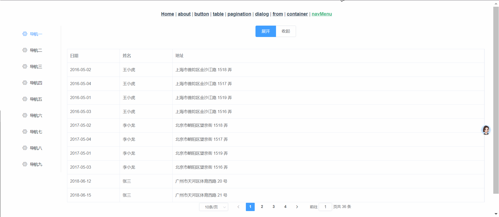

上面的导航栏几乎就具备了一个网站的雏形...不过这样的话，一个视图文件未免也太长了吧？要是功能复杂的网页，按这么写不得塞爆？所以我们可以考虑使用多个复合组件来组合成一个子视图文件，再交给主视图来使用。怎么做呢？当然是把组件当作模块来导入咯（前面有提到过），让我来带您尝试一下...

>   吐槽：这次的代码量有点大，您忍一忍...

```js
<!-- ElementNavMenuView.vue -->
<template>
  <div>
    <el-container>
      <el-aside width="200px">
        <el-menu
            :collapse="isCollapse"
            :default-active="activeMenu"
            @close="handleClose"
            @open="handleOpen"
            @select="handleSelect">
          <el-menu-item index="1">
            <i class="el-icon-setting"></i>
            <span slot="title">导航一</span>
          </el-menu-item>
          <el-menu-item index="2">
            <i class="el-icon-setting"></i>
            <span slot="title">导航二</span>
          </el-menu-item>
          <el-menu-item index="3">
            <i class="el-icon-setting"></i>
            <span slot="title">导航三</span>
          </el-menu-item>
          <el-menu-item index="4">
            <i class="el-icon-setting"></i>
            <span slot="title">导航四</span>
          </el-menu-item>
          <el-menu-item index="5">
            <i class="el-icon-setting"></i>
            <span slot="title">导航五</span>
          </el-menu-item>
          <el-menu-item index="6">
            <i class="el-icon-setting"></i>
            <span slot="title">导航六</span>
          </el-menu-item>
          <el-menu-item index="7">
            <i class="el-icon-setting"></i>
            <span slot="title">导航七</span>
          </el-menu-item>
          <el-menu-item index="8">
            <i class="el-icon-setting"></i>
            <span slot="title">导航八</span>
          </el-menu-item>
          <el-menu-item index="9">
            <i class="el-icon-setting"></i>
            <span slot="title">导航九</span>
          </el-menu-item>
        </el-menu>
      </el-aside>
      <el-container>
        <el-header>
          <el-radio-group v-model="isCollapse" style="margin-bottom: 20px;">
            <el-radio-button :label="false">展开</el-radio-button>
            <el-radio-button :label="true">收起</el-radio-button>
          </el-radio-group>
        </el-header>
        <el-main>
          <component :is="currentComponent"></component>
        </el-main>
        <el-footer>备案号: xxxx 制作人: limou3434 邮箱: 898738804@qq.com</el-footer>
      </el-container>
    </el-container>
  </div>
</template>

<script>
// 在这里引入其他组件
import NavContentOne from "@/views/NavMenuItem/NavContentOne.vue";
import NavContentTwo from "@/views/NavMenuItem/NavContentTwo.vue";
import NavContentThree from "@/views/NavMenuItem/NavContentThree.vue";
import NavContentFour from "@/views/NavMenuItem/NavContentFour.vue";
import NavContentFive from "@/views/NavMenuItem/NavContentFive.vue";
import NavContentSix from "@/views/NavMenuItem/NavContentSix.vue";
import NavContentSeven from "@/views/NavMenuItem/NavContentSeven.vue";
import NavContentEight from "@/views/NavMenuItem/NavContentEight.vue";
import NavContentNine from "@/views/NavMenuItem/NavContentNine.vue";

export default {
  data() {
    return {
      isCollapse: false, // 默认为展开
      activeMenu: '1', // 默认选中第一个菜单项
    };
  },
  computed: {
    currentComponent() {
      switch (this.activeMenu) {
        case '1':
          return NavContentOne;
        case '2':
          return NavContentTwo;
        case '3':
          return NavContentThree;
        case '4':
          return NavContentFour;
        case '5':
          return NavContentFive;
        case '6':
          return NavContentSix;
        case '7':
          return NavContentSeven;
        case '8':
          return NavContentEight;
        case '9':
          return NavContentNine;
        default:
          return NavContentOne;
      }
    }
  },
  methods: {
    handleOpen(key, keyPath) {
      console.log(key, keyPath); // 当展开时, 这里会输出控制台的回调信息
    },
    handleClose(key, keyPath) {
      console.log(key, keyPath); // 当关闭时, 这里会输出控制台的回调信息
    },
    handleSelect(key) { // 当选中某个菜单项时, 这里会修改数据模型中的数据
      this.activeMenu = key;
    },
  }
}
</script>

<style scoped>
/* 可以在这里添加样式 */
</style>

```

```js
<!-- NavMenuItem/NavContentOne.vue -->
<template>
  <!-- 表格部分 -->
  <div>
    <el-table :data="currentPageData" border style="width: 100%">
      <el-table-column
          label="日期"
          prop="date"
          width="180">
      </el-table-column>
      <el-table-column
          label="姓名"
          prop="name"
          width="180">
      </el-table-column>
      <el-table-column
          label="地址"
          prop="address">
      </el-table-column>
    </el-table>

    <!-- 分页部分 -->
    <el-pagination
        :key="paginationKey"
        :page-size="pageSize"
        :total="totalItems"
        background
        layout="sizes, prev, pager, next, jumper, total"
        @current-change="handlePageChange"
        @size-change="handleSizeChange">
    </el-pagination>
  </div>
</template>

<script>
export default {
  name: 'NavContentOne', // 由于做成了组件, 这里就必须导出组件的名字了!
  data() {
    return {
      isCollapse: false, // 默认为展开
      activeMenu: '1', // 默认选中第一个菜单项
      currentPage: 1, // 当前页码
      pageSize: 10, // 默认每页显示的条目数为 10
      paginationKey: 0, // 新增的 key 属性, 由于 key 值被修改, 可以强迫组件重新渲染
      tableData: [ // 需要渲染的大量数组
        {date: '2016-05-02', name: '王小虎', address: '上海市普陀区金沙江路 1518 弄'},
        {date: '2016-05-04', name: '王小虎', address: '上海市普陀区金沙江路 1517 弄'},
        {date: '2016-05-01', name: '王小虎', address: '上海市普陀区金沙江路 1519 弄'},
        {date: '2016-05-03', name: '王小虎', address: '上海市普陀区金沙江路 1516 弄'},
        {date: '2017-05-02', name: '李小龙', address: '北京市朝阳区望京街 1518 弄'},
        {date: '2017-05-04', name: '李小龙', address: '北京市朝阳区望京街 1517 弄'},
        {date: '2017-05-01', name: '李小龙', address: '北京市朝阳区望京街 1519 弄'},
        {date: '2017-05-03', name: '李小龙', address: '北京市朝阳区望京街 1516 弄'},
        {date: '2018-06-12', name: '张三', address: '广州市天河区体育西路 20 号'},
        {date: '2018-06-15', name: '张三', address: '广州市天河区体育西路 21 号'},
        {date: '2018-06-18', name: '张三', address: '广州市天河区体育西路 22 号'},
        {date: '2018-06-20', name: '张三', address: '广州市天河区体育西路 23 号'},
        {date: '2019-07-22', name: '赵四', address: '深圳市南山区科技园 1 号'},
        {date: '2019-07-25', name: '赵四', address: '深圳市南山区科技园 2 号'},
        {date: '2019-07-28', name: '赵四', address: '深圳市南山区科技园 3 号'},
        {date: '2019-07-30', name: '赵四', address: '深圳市南山区科技园 4 号'},
        {date: '2020-08-05', name: '王五', address: '杭州市西湖区文三路 100 号'},
        {date: '2020-08-08', name: '王五', address: '杭州市西湖区文三路 101 号'},
        {date: '2020-08-11', name: '王五', address: '杭州市西湖区文三路 102 号'},
        {date: '2020-08-13', name: '王五', address: '杭州市西湖区文三路 103 号'},
        {date: '2021-09-10', name: '刘德华', address: '广州市越秀区中山五路 10 号'},
        {date: '2021-09-15', name: '刘德华', address: '广州市越秀区中山五路 11 号'},
        {date: '2021-09-20', name: '刘德华', address: '广州市越秀区中山五路 12 号'},
        {date: '2021-09-25', name: '刘德华', address: '广州市越秀区中山五路 13 号'},
        {date: '2022-10-01', name: '张学友', address: '上海市静安区南京西路 100 号'},
        {date: '2022-10-05', name: '张学友', address: '上海市静安区南京西路 101 号'},
        {date: '2022-10-10', name: '张学友', address: '上海市静安区南京西路 102 号'},
        {date: '2022-10-15', name: '张学友', address: '上海市静安区南京西路 103 号'},
        {date: '2023-11-01', name: '周杰伦', address: '北京市海淀区中关村大街 1 号'},
        {date: '2023-11-05', name: '周杰伦', address: '北京市海淀区中关村大街 2 号'},
        {date: '2023-11-10', name: '周杰伦', address: '北京市海淀区中关村大街 3 号'},
        {date: '2023-11-15', name: '周杰伦', address: '北京市海淀区中关村大街 4 号'},
        {date: '2024-12-01', name: '陈奕迅', address: '深圳市福田区福华路 50 号'},
        {date: '2024-12-05', name: '陈奕迅', address: '深圳市福田区福华路 51 号'},
        {date: '2024-12-10', name: '陈奕迅', address: '深圳市福田区福华路 52 号'},
        {date: '2024-12-15', name: '陈奕迅', address: '深圳市福田区福华路 53 号'}
      ]
    };
  },
  computed: { // 计算属性方法
    totalItems() {
      return this.tableData.length; // 返回数据总条数
    },
    currentPageData() { // 当组件需要数据进行渲染时, 这里动态计算最多显示的条目个数数组, 然后再做返回
      const start = (this.currentPage - 1) * this.pageSize;
      const end = start + this.pageSize;
      return this.tableData.slice(start, end); // 获取当前页的数据
    }
  },
  methods: {
    handleOpen(key, keyPath) {
      console.log(key, keyPath); // 当展开时, 这里会输出控制台的回调信息
    },
    handleClose(key, keyPath) {
      console.log(key, keyPath); // 当关闭时, 这里会输出控制台的回调信息
    },
    handleSelect(key) { // 当选中某个菜单项时, 这里会修改数据模型中的数据
      this.activeMenu = key;
    },
    handlePageChange(page) { // 当页面发生改变时触发
      this.currentPage = page; // 数据模型中存储一份页面数据, 导致同步被触发, 使得之前缓存的计算属性 currentPageData() 被重新进行计算
    },
    handleSizeChange(size) { // 当用户选择不同的最大显示条数时触发
      this.pageSize = size; // 数据模型中存储一份页面数据, 导致同步被触发, 使得之前缓存的计算属性 currentPageData() 被重新进行计算
      this.currentPage = 1; // 并且切换每页条数后默认重置为第一页
      this.paginationKey += 1; // 改变 key 以重新渲染分页组件
    }
  }
}
</script>

<style scoped>
/* 你的样式可以写在这里 */
</style>

```

```js
<!-- NavMenuItem/NavContentTwo.vue -->
<template>
  <div>
    <h2>内容二</h2>
    <p>这是导航二的正文内容...</p>
    <!-- 添加更多内容 -->
  </div>
</template>

<script>
export default {
  name: 'NavContentOne', // 由于做成了组件, 这里就必须导出组件的名字了!
}
</script>

<style>
/* 添加必要的样式 */
</style>

```

至于后面的 `NavMenuItem/NavContentThree.vue, NavMenuItem/NavContentFour.vue, NavMenuItem/NavContentFive.vue, NavMenuItem/NavContentSix.vue, NavMenuItem/NavContentSeven.vue, NavMenuItem/NavContentEight.vue, NavMenuItem/NavContentNine.vue` 和 `NavMenuItem/NavContentTwo.vue` 的内容差不多，您看这写就行。

## 4.2.网络组件

### 4.2.1.引入组件

在 `vue-cli` 生成的 `Vue2.js` 工程中，虽然您也可以选择直接把 `ajax.js` 直接导入来使用，但是我们一般不推荐这么做，而是通过 `npm install axios` 的方式下载，再在 `main.js` 中使用 `import axios from 'axios';` 进行导入。

### 4.2.2.使用组件

由于 `axios-ajax` 只要熟悉 `HTTP` 手册的开发，即可进行快速编写，我这里就建立一个简单的 `Node.js` 程序，只需要在视图中简单进行请求返回数据即可，更多复杂的需求后面编写一个小工程的时候再给您详细解释。

>   吐槽：如果您完全没有学过 `HTTP` 协议，我建议您先去了解个大概叭...否则就先止步于这里先叭！不要继续往后看下去了，虽然不难但没有足够知识储备是没办法看懂的，所以请不要灰心，“以后再来探索叭~”...

首先我们必须有一个服务端程序，最好是基于 `HTTP` 协议的，这里我已经使用 `Node.js` 编写好了，只要您之前有安装过 `Node.js` 就可以直接使用 `node http_web_server.js` 运行起来。

```js
// http_web_server.js
const express = require('express');
const app = express();
const PORT = 8083;

app.get('/', (req, res) => {
    res.send('Hello, World!');
});

app.listen(PORT, '127.0.0.1', () => {
    console.log(`Server is running on http://127.0.0.1:${PORT}`);
});

```

我们先运行起来这个服务端程序。

```shell
# 运行 Node.js 编写的服务端程序
$ node http_web_server.js
Server is running on http://127.0.0.1:port # 这里的 port 根据您的设置而定
```

然后编写对应的视图函数。

```js
<!-- EllementAjaxView.vue -->
<template>
  <div>
    <h1>测试 Express 服务器</h1>
    <button @click="fetchData">获取数据</button>
    <div v-if="loading">加载中...</div>
    <div v-if="error" class="error">错误: {{ error }}</div>
    <div v-if="data">
      <h2>返回的数据:</h2>
      <pre>{{ data }}</pre>
    </div>
  </div>
</template>

<script>
import axios from 'axios';

export default {
  data() {
    return {
      data: null,
      error: null,
      loading: false,
    };
  },
  methods: {
    async fetchData() {
      this.loading = true;
      this.error = null;
      try {
        const response = await axios.get('http://127.0.0.1:port/'); // 这里的 port 也需要您手动修改
        this.data = response.data;
      } catch (err) {
        this.error = err.message;
      } finally {
        this.loading = false;
      }
    },
  },
};
</script>

<style scoped>
.error {
  color: red;
}
</style>

```

```js
<!-- App.vue -->
<template>
  <div id="app">
    <nav> <!-- 这个 nav 只是一个语义标签, 主要是用在页面中的导航链接部分, 它通常包含一组链接, 用户可以通过这些链接在网站或应用的不同部分之间进行导航, 主要是为了增加代码可读性和搜索引擎 SEO 友好的 -->
      <router-link to="/">Home</router-link> <!-- 显示 Home 视图链接 -->
      |
      <router-link to="/about">about</router-link> <!-- 显示 about 视图链接 -->
      |
      <router-link to="/button">button</router-link> <!-- 显示 about 视图链接 -->
      |
      <router-link to="/table">table</router-link> <!-- 显示 about 视图链接 -->
      |
      <router-link to="/pagination">pagination</router-link> <!-- 显示 about 视图链接 -->
      |
      <router-link to="/dialog">dialog</router-link> <!-- 显示 about 视图链接 -->
      |
      <router-link to="/from">from</router-link> <!-- 显示 about 视图链接 -->
      |
      <router-link to="/container">container</router-link> <!-- 显示 about 视图链接 -->
      |
      <router-link to="/navMenu">navMenu</router-link> <!-- 显示 about 视图链接 -->
      |
      <router-link to="/ajax">ajax</router-link> <!-- 显示 about 视图链接 -->
    </nav>
    <router-view/> <!-- 页面/视图的显示地点 -->
  </div>
</template>

<style>
#app {
  font-family: Avenir, Helvetica, Arial, sans-serif;
  -webkit-font-smoothing: antialiased;
  -moz-osx-font-smoothing: grayscale;
  text-align: center;
  color: #2c3e50;
}

nav {
  padding: 30px;
}

nav a {
  font-weight: bold;
  color: #2c3e50;
}

nav a.router-link-exact-active {
  color: #42b983;
}
</style>
<script setup lang="ts">
</script>
```

```js
// index.js
import Vue from 'vue'
import VueRouter from 'vue-router'
import HomeView from '../views/HomeView.vue'
import ButtonView from '../views/ElementButtonView.vue'
import TableView from '../views/ElementTableView.vue'
import PaginationView from '../views/ElementPaginationView.vue'
import DialogView from '../views/ElementDialogView.vue' // 注意这里要导入
import FromView from '../views/ElementFormView.vue' // 注意这里要导入
import Container from '../views/ElementContainerView.vue' // 注意这里要导入
import NavMenu from '../views/ElementNavMenuView.vue' // 注意这里要导入
import Ajax from '../views/ElementAjaxView.vue' // 注意这里要导入

Vue.use(VueRouter)

// 定义路由映射
const routes = [
    {
        path: '/',
        name: 'home', // 这里的 name 是路由名字, 路由名字可以让路由修改的时候不是硬编码设置, 方便业务随时进行修改
        component: HomeView // 注册子组件, 也就是视图
    },
    {
        path: '/about',
        name: 'about',
        // 下面这种动态加载实际上是懒加载, 只有用户实际访问了 /about 路径时, 才会进行下载和渲染, 可以提高用户的响应速度
        component: () => import(/* webpackChunkName: "about" */ '../views/AboutView.vue') // 这也是为什么之前我们设置的 about 没有设置 name 的原因
    },
    { // 下面是新增加的路由
        path: '/button',
        name: 'button', // 这里的 name 是路由名字, 路由名字可以让路由修改的时候不是硬编码设置, 方便业务随时进行修改
        component: ButtonView // 注册子组件, 也就是视图
    },
    { // 下面是新增加的路由
        path: '/table',
        name: 'table', // 这里的 name 是路由名字, 路由名字可以让路由修改的时候不是硬编码设置, 方便业务随时进行修改
        component: TableView // 注册子组件, 也就是视图
    }
    ,
    { // 下面是新增加的路由
        path: '/pagination',
        name: 'pagination', // 这里的 name 是路由名字, 路由名字可以让路由修改的时候不是硬编码设置, 方便业务随时进行修改
        component: PaginationView // 注册子组件, 也就是视图
    }
    ,
    { // 下面是新增加的路由
        path: '/dialog',
        name: 'dialog', // 这里的 name 是路由名字, 路由名字可以让路由修改的时候不是硬编码设置, 方便业务随时进行修改
        component: DialogView // 注册子组件, 也就是视图
    }
    ,
    { // 下面是新增加的路由
        path: '/from',
        name: 'from', // 这里的 name 是路由名字, 路由名字可以让路由修改的时候不是硬编码设置, 方便业务随时进行修改
        component: FromView // 注册子组件, 也就是视图
    }
    ,
    { // 下面是新增加的路由
        path: '/container',
        name: 'container', // 这里的 name 是路由名字, 路由名字可以让路由修改的时候不是硬编码设置, 方便业务随时进行修改
        component: Container // 注册子组件, 也就是视图
    }
    ,
    { // 下面是新增加的路由
        path: '/navMenu',
        name: 'navMenu', // 这里的 name 是路由名字, 路由名字可以让路由修改的时候不是硬编码设置, 方便业务随时进行修改
        component: NavMenu // 注册子组件, 也就是视图
    }
    ,
    { // 下面是新增加的路由
        path: '/ajax',
        name: 'ajax', // 这里的 name 是路由名字, 路由名字可以让路由修改的时候不是硬编码设置, 方便业务随时进行修改
        component: Ajax // 注册子组件, 也就是视图
    }
]

// 设置路由管理
const router = new VueRouter({
    routes
})

// 把路由实例对象导出, 等待后续交给 vue 实例进行路由注入
export default router

```

但是这么写可能是有点问题的，还不是语法问题，不信我们试一试点击“获取数据”按钮，看能否获取到数据。

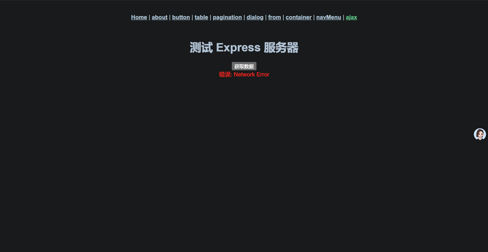

这其实就是典型的跨域问题，我以前在做开发替朋友维护系统时就遇到过一次，感兴趣的话可以去看看我那次的思考过程。不过这里我们先进行处理，再简单解释一下跨域的问题。

首先需要使用 `npm install cors` 安装 `cors`，然后在  添加一个中间件，此时再次点击“获取数据”就可以取得 `Node.js` 后端响应的数据了。

```js
// 添加了中间件的 http_web_server.js
const express = require('express');
const cors = require('cors'); // 导入 cors
const app = express();
const PORT = 8083;

// 使用 cors 中间件
app.use(cors());

app.get('/', (req, res) => {
    res.send('Hello, World!');
});

app.listen(PORT, '127.0.0.1', () => {
    console.log(`Server is running on http://127.0.0.1:${PORT}`);
});

```

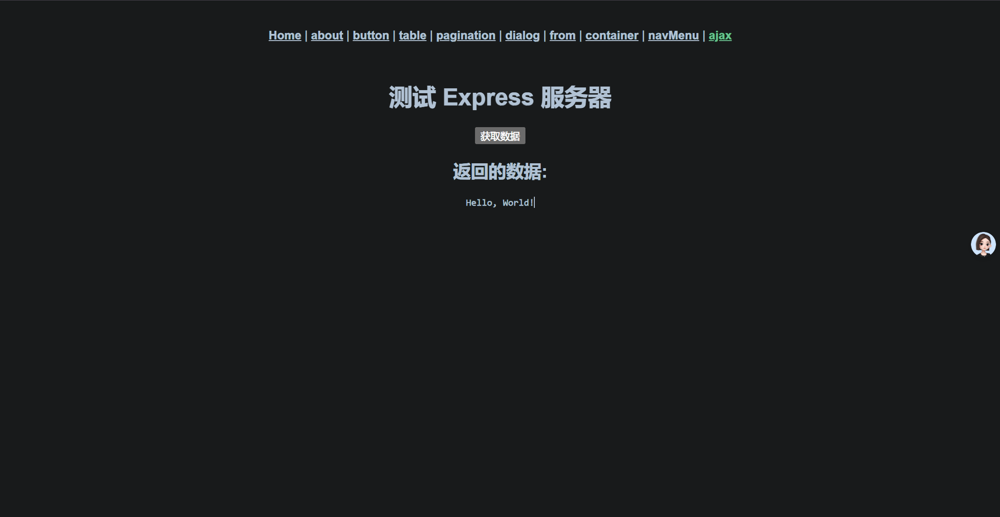

非常神奇，这是为什么呢？实际上关键点在于 `HTTP` 的响应头中的 `Access-Control-Allow-Origin` 属性（这个 `HTTP` 属性属于 [CORS 属性](https://developer.mozilla.org/zh-CN/docs/Glossary/CORS#cors_标头) 中的一种，还有其他的您可以去了解一下），指定了该响应的资源是否被允许与给定的“来源”共享。那什么是源呢？可以 [前去看看 MMDN 对源的解释](https://developer.mozilla.org/zh-CN/docs/Glossary/Origin)。可以看到，`Web` 内容的 **源** 由：

-   访问 `URL` 的网络协议
-   主机地址 `ip`
-   主机端口 `port`

所构成，只有当协议、主机、端口都完全匹配时，我们才说具有相同的源，因此某些网络接口操作时会默认仅限于同源内容。

举一个我们这里的例子，我们编写的客户端是通过 `vue-cli` 自己的代理服务器给出的，因此从客户端发出的请求报文中，就会包含源 `http://127.0.0.1:8082/#/ajax`，但是访问的服务器地址却是 `http://127.0.0.1:8083`，此时两个源就不匹配了，他们只有协议和 `ip` 相同。

但是这是谁不允许跨域的呢？是浏览器，这是浏览器在处理跨域请求时的一种安全机制。浏览器会检查服务器响应中是否包含 `Access-Control-Allow-Origin` 头部，并根据该头部决定是否允许跨域请求成功。如果头部不存在或不匹配，浏览器将阻止该响应获得的数据。

因此解决方案就是给服务器程序再放回响应的之前，在响应头部中添加 `Access-Control-Allow-Origin` 键值，表示该响应允许跨域，因此我们像下面这样修改 `http_web_server.js`，再重新运行，在前端也是可以继续访问的。

```js
// 剔除中间件并手动添加响应属性的 http_web_server.js
const express = require('express');
const app = express();
const PORT = 8083;

// 添加CORS中间件
app.use((req, res, next) => {
    res.header('Access-Control-Allow-Origin', '*'); // 允许来自所有域的请求
    res.header('Access-Control-Allow-Headers', 'Origin, X-Requested-With, Content-Type, Accept');
    next();
});

// 定义一个 GET 接口, 返回一个字符串
app.get('/', (req, res) => {
    res.send('Hello, World!');
});

// 启动服务器, 监听 127.0.0.1:8082
app.listen(PORT, '127.0.0.1', () => {
    console.log(`Server is running on http://127.0.0.1:${PORT}`);
});

```

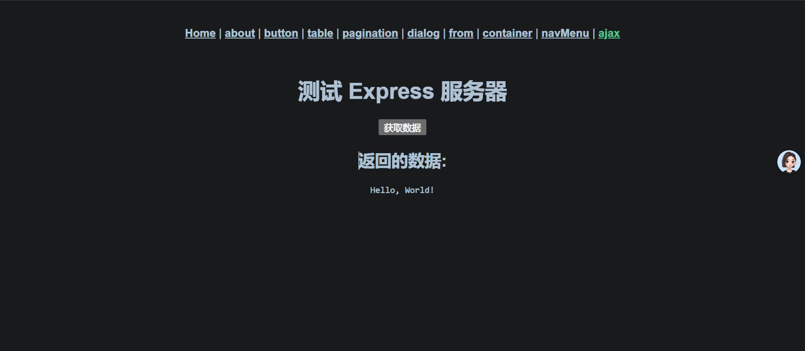

>   吐槽：至于为什么浏览器要阻止跨区请求得到的响应数据，就涉及到网络安全问题了，这里我不细细展开，有机会我会在我的网络系列中编写对应的解说...

到此，您熟悉了常用的组件开发，距离实际开发已经很接近了，下面给出一个接近实际开发的项目练练手把！

# 5.vue-cli 打包

在前后端分离开发模式中，前端项目和后端项目分别独占一个服务器的两个不同端口。前端页面不再通过后端程序返回浏览器，而是交给代理服务器进行返回，再由浏览器进行渲染，后端程序只需要为前端界面返回响应和接受请求即可。

而常见的代理服务器就是使用 `Nginx` 进行代理，不过我们在代理之前，我们必须先把整个前端项目进行打包为 `bulid` 文件夹，然后再交给 `Nginx` 代理，然后才有后续的开发操作。

怎么打包为 `bulid` 目录呢？很简单，直接使用 `npm run bulid` 即可，和之前的 `npm run serve` 原理是一样的，都是运行 `package.json` 中的脚本命令。

我之前给您的云盘链接中，特意没有进行打包，您可以自己打包一下试试，这里我只留一点运行过程供您比对参考。

```shell
# 打包的过程
D:\GitWork\limou-c-test-code\vue2_elementui_test> dir
    目录: D:\GitWork\limou-c-test-code\vue2_elementui_test
Mode                 LastWriteTime         Length Name
----                 -------------         ------ ----
d-----          8/4/2024   9:22 PM                .idea
d-----          8/4/2024   8:54 AM                node_modules
d-----          8/2/2024  11:29 AM                public
d-----          8/4/2024  12:06 AM                src
-a----          8/1/2024   8:56 PM            231 .gitignore
-a----          8/1/2024   8:56 PM             73 babel.config.js
-a----          8/4/2024  12:25 PM            618 http_web_server.js
-a----          8/1/2024   8:56 PM            279 jsconfig.json
-a----          8/4/2024   8:54 AM         451681 package-lock.json
-a----          8/4/2024   8:54 AM           1052 package.json
-a----          8/1/2024   8:56 PM            328 README.md
-a----          8/2/2024   3:03 PM            202 vue.config.js                      

D:\GitWork\limou-c-test-code\vue2_elementui_test> npm run build
> my_code_2024_8_4@0.1.0 build
> vue-cli-service build

All browser targets in the browserslist configuration have supported ES module.
Therefore we don't build two separate bundles for differential loading.

-  Building for production...[BABEL] Note: The code generator has deoptimised the styling of D:\GitWork\limou-c-test-code\vue2_elementui_test\node_modules\element-ui\lib\element-ui.common.js as it exceeds the max of 500KB.
/  Building for production...

 WARNING  Compiled with 2 warnings                                                                                          12:54:17 PM

 warning 

asset size limit: The following asset(s) exceed the recommended size limit (244 KiB).
This can impact web performance.
Assets:
  js/chunk-vendors.c0113584.js (877 KiB)

 warning 

entrypoint size limit: The following entrypoint(s) combined asset size exceeds the recommended limit (244 KiB). This can impact web performance.
Entrypoints:
  app (1.09 MiB)
      css/chunk-vendors.302ffaa7.css
      js/chunk-vendors.c0113584.js
      css/app.cf70f182.css
      js/app.44586ba8.js


  File                                   Size                                          Gzipped

  dist\js\chunk-vendors.c0113584.js      876.64 KiB                                    233.48 KiB
  dist\js\app.44586ba8.js                36.05 KiB                                     13.87 KiB
  dist\js\about.cdef4973.js              0.45 KiB                                      0.31 KiB
  dist\css\chunk-vendors.302ffaa7.css    201.93 KiB                                    32.79 KiB
  dist\css\app.cf70f182.css              1.01 KiB                                      0.42 KiB

  Images and other types of assets omitted.
  Build at: 2024-08-05T04:54:17.452Z - Hash: def806ebcae26dfd - Time: 12931ms

 DONE  Build complete. The dist directory is ready to be deployed.
 INFO  Check out deployment instructions at https://cli.vuejs.org/guide/deployment.html
 
 D:\GitWork\limou-c-test-code\vue2_elementui_test> dir
    目录: D:\GitWork\limou-c-test-code\vue2_elementui_test
Mode                 LastWriteTime         Length Name
----                 -------------         ------ ----
d-----          8/5/2024  12:53 PM                .idea
d-----          8/5/2024  12:54 PM                dist
d-----          8/4/2024   8:54 AM                node_modules
d-----          8/2/2024  11:29 AM                public
d-----          8/4/2024  12:06 AM                src
-a----          8/1/2024   8:56 PM            231 .gitignore
-a----          8/1/2024   8:56 PM             73 babel.config.js
-a----          8/4/2024  12:25 PM            618 http_web_server.js
-a----          8/1/2024   8:56 PM            279 jsconfig.json
-a----          8/4/2024   8:54 AM         451681 package-lock.json
-a----          8/4/2024   8:54 AM           1052 package.json
-a----          8/1/2024   8:56 PM            328 README.md
-a----          8/2/2024   3:03 PM            202 vue.config.js
```

果然，多了一个 `dist/` 目录，然后开始下载 `Nginx` ，您可以 [前往 Nginx 的官网下载](https://nginx.org/en/download.html)，这里简单解释一下包含 `Nginx.exe` 的压缩包解压完成后的文件目录结构。

```shell
# Nginx 的解压目录
nginx-1.27.0
├─ conf/ # 配置目录
├─ contrib/ # 第三方拓展陌路
├─ docs/ # 配置文档
├─ html/ # 静态资源文件目录 --> 也就是我们 dist/ 要放置代理的目录
├─ logs/ # 日志文件目录
├─ temp/ # 临时文件目录
└─ nginx.exe # Nginx 可执行程序
```

将 `dist/` 复制到 `html/` 后，可以把原本的 `html/` 内的文件全部删除再把 `dist/` 目录下的文件复制进去，注意是目录下面的所有文件，不包含目录自己，然后最好再配置一下配置文件 `conf/nginx.conf`，这个配置文件是最重要，其他配置文件有机会再谈。

>   注意：其实此时已经可以直接双击 `nginx.exe` 进行运行了（不过我推荐使用命令行启动），不过有可能发生端口占用，`nginx` 的默认端口为 `80`，但是本机不一定打开了对 `80` 端口的访问，所以我打算稍微配置一下。并且如果您还是运行不成功，要么是端口冲突，要么是权限不够的问题。

```nginx
# conf/nginx.conf
# 配置用户
# user  nobody;

# Nginx 的工作进程数目, 和 CPU 个数保持同步
worker_processes  1;

# 指定错误日志文件, 同时可以设置 日志等级
# error_log  logs/error.log;
# error_log  logs/error.log  notice;
# error_log  logs/error.log  info;

# 指定 Nginx 的进程 ID 文件
# pid        logs/nginx.pid;

# Nginx 的事件配置
events {
    worker_connections  1024; # 每个工作进程的最大连接数
}

# HTTP 服务器配置
http {
    include       mime.types; # 导入包含 MIME 类型的文件
    default_type  application/octet-stream; # 设置默认的 MIME 类型

    # log_format  main  '$remote_addr - $remote_user [$time_local] "$request" ' # 自定义日志的格式
    #                   '$status $body_bytes_sent "$http_referer" '
    #                   '"$http_user_agent" "$http_x_forwarded_for"';

    # access_log  logs/access.log  main; # 定义访问日志的使用和格式

    sendfile        on; # 启动高效文件传输模式
    
    # tcp_nopush     on; # 优化 TCP 传输

    keepalive_timeout  65; # 设置长连接超时时间

    # gzip  on; # 启动 Gzip 压缩

    server { # 设置服务虚拟主机配置
        listen       80; # 如果您的端口又冲突, 请在这里修改端口!
        server_name  localhost;

        # charset koi8-r;

        # access_log  logs/host.access.log  main;

        location / { # 定义对访问根路径请求的处理(前缀匹配法)
            root   html; # 指定路径对应的根目录文件
            index  index.html index.htm; # 设置默认索引文件, 其实就是在 html/ 下寻找网站的主页面
        }

        # error_page  404              /404.html; # 重定向用户请求出出现 404 状态码时放回 /404.html 错误页面
        error_page   500 502 503 504  /50x.html; # 重定向用户请求出出现 50x 状态码时放回 /50x.html 错误页面
        
        location = /50x.html { # 定义对 /50x.html 路径请求时的处理(精准匹配法)
            root   html; # 指定路径对应的根目录文件
        }

        # location ~ \.php$ { # 定义对匹配 \.php$ 的处理(正则匹配法)
        #     proxy_pass   http://127.0.0.1; # 将请求交给别的代理
        # }
        
        # location ~* 正则表达式 { # 定义对不分大小写匹配正则表达式的处理 (不分大小写正则匹配法)
        #     # ...
        # }

        # location @xxxx { # 定义内部的跳转(内部重定向法)
        # 	  # rewrite ...
        # }
        
        # ... 更多配置查看我另外一篇关于 Nginx 的文章
    }

    #  另外一种设置服务虚拟主机配置
    # server {
    #     listen       8000;
    #     listen       somename:8080;
    #     server_name  somename  alias  another.alias;

    #     location / {
    #         root   html;
    #         index  index.html index.htm;
    #     }
    # }


    # 针对 HTTPS 服务器的额外配置
    # server {
    #     listen       443 ssl;
    #     server_name  localhost;

    #     ssl_certificate      cert.pem; # 指定证书文件位置
    #     ssl_certificate_key  cert.key; # 指定证书密钥位置

    #     ssl_session_cache    shared:SSL:1m; # 配置 SSL 会话缓存, 使用共享内存来缓存
    #     ssl_session_timeout  5m; # 设置 SSL 会话超时时间为 5min

    #     ssl_ciphers  HIGH:!aNULL:!MD5; # 设置 SSL 加密套件
    #     ssl_prefer_server_ciphers  on; # 优先使用服务端指定加密套件而不是客户端

    #     location / {
    #         root   html;
    #         index  index.html index.htm;
    #     }
    # }
}

```

修改 `listen` 为合法的、没被占用的端口即可，然后使用命令行运行 `./Nginx.exe` 即可运行 `Nginx` 服务器，如果是 `Windows` 则可以使用 `资源管理器` 来检查（如果是 `Linux` 就使用 `ps -aux | grep "nginx"`）。

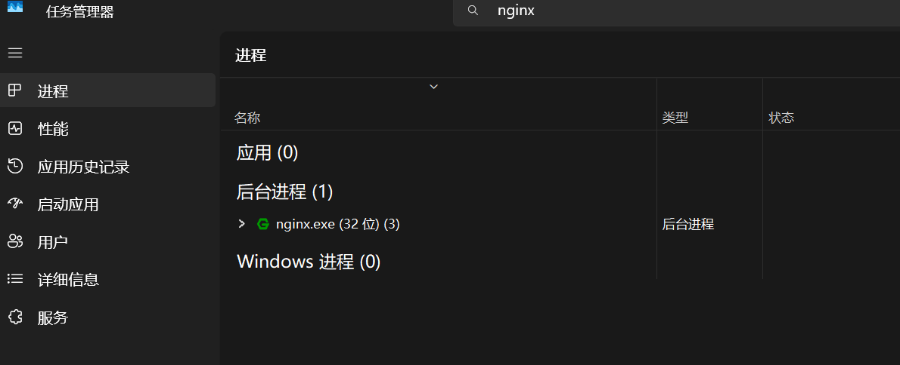

此时我们尝试访问 `http://127.0.0.1:80` 就可以访问到我们之前写的客户端了。

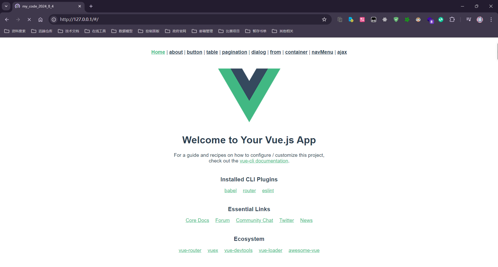

>   补充：关于整个 `Vue2.js` 工程原理和打包原理，以后有机会我再来补充...

>   吐槽：毕竟这里不是专门讲解 `Nginx` 的文章，相关的知识可以在我 `Linxu` 系列下查看，所以这里我简单讲解了一下如何代理静态文件而已，如何拿来负载均衡和反向代理，以后再来考虑。

# 6.vue-cli 实操

## 6.1.开发目标和项目概览

基于 `vue-cli` 创建的工程再结合 `ElementUI` 组件，我将带您开发一个在线 `OJ` 网站，并且我会提前给您一个最简单的 `Node.js` 编写的后端 `HTTP` 服务程序，您如果不了解 `HTTP` 则最好简单了解一下 `HTTP` 协议。

至于 `Node.js` 编写的服务端，我不希望给您造成负担，因此源代码和 `Postman` 生成的接口文档我会直接给您，您只需要在 `OJ` 网站设计做好后，稍微调试一下某些配置，然后在某一台机器上直接启动 `Web` 应用服务即可。

在开发过程中，需要具有前面包括 `Vue2.js` 的基础，在项目编写的过程中，可能有些我在前面没有提到过的知识，我会通过注释的形式给出，或者直接在文章正文中进行说明。

先提前预览一下我们的网站页面，好让您有个准备...

待补充...

>   警告：值得向您提醒的是，我不是专业的前端工程师，更不是专业的美工设计师，因此接下来做的 `OJ` 网站只是基于个人爱好和编码经验来编写的网站，我保证可以正确运行，但是不保证实际工程中是这么做的...

## 6.2.服务代码和接口文档

```js
// node.js HTTP 应用服务程序
```

```json
// Postman 接口文档资源
```

前一份服务代码先保存起来就行，后一份 `Postman` 我先教您怎么生成对应的接口文档...

## 5.3.前端代码和部分解说

待补充... 

---

>   结语：...

**如果本系列文章对您有帮助，可以 [star 一下我的 limou-learn-note](https://github.com/xiaogithubooo/LimouLearnNote)，求求惹~**
