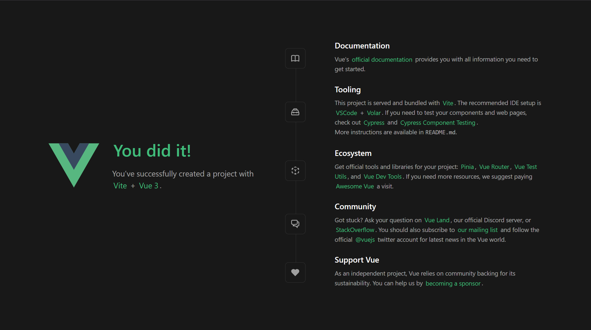

# 1.Vue3 的编码环境

## 1.1.在线环境

*   如果你更喜欢不用任何构建的原始 `HTML`，可以使用 [JSFiddle](https://jsfiddle.net/yyx990803/2ke1ab0z/) 入门
*   如果你已经比较熟悉 `Node.js` 和构建工具等概念，还可以直接在浏览器中打开 [StackBlitz](https://vite.new/vue) 来尝试完整的构建设置

## 1.2.脚架工具

在以前使用 `Vue2` 的时候，我们体验过原生的 `Vue2.js` 代码直接引入 `.html`  来使用，也使用过 `vue` 的第一款脚手架工具 `vue-cli`，这种工具的体验还是相当不错的，不过我们仅仅需要有 `Vue3.js` 也同样是个 `JS` 库的概念即可，这里不再使用传统的源代码引入和使用老旧的 `vue-cli` 脚手架，而是使用较为现代的 `create-vue`，这个脚手架内部又会默认使用 `vite` 构建工具。

>   补充：`vue-cli` 和 `create-vue` 的区别。
>
>   | 特性         | `create-vue`                         | `Vite`                                   |
>   | ------------ | ------------------------------------ | ---------------------------------------- |
>   | **功能**     | 项目初始化工具，生成 `Vue3` 项目模板 | 构建工具与开发服务器，提供构建和开发支持 |
>   | **目标**     | 提供 `Vue3` 项目的基础模板和结构     | 提供快速的开发体验与高效的生产构建       |
>   | **作用**     | 创建 `Vue3` 项目骨架（文件、配置等） | 处理项目的构建、开发、热重载等           |
>   | **使用场景** | 用于创建一个新的 `Vue3` 项目         | 用于开发和构建 `Vue3` 项目               |
>
>   另外，在没有 `Vite` 之前，许多前端项目是依赖 `Webpack` 来进行模块打包、构建、优化的。

# 2.Vue3 的首个应用

我们先使用 `create-vue` 来建立第一个应用，这个应用会打开一个关于 `vue` 的页面，首先需要下载脚手夹，然后进行配置。

```shell
# 安装脚手架并且配置应用
$ npm create vue@latest
Need to install the following packages:
create-vue@3.12.0
Ok to proceed? (y) y


> npx
> create-vue


Vue.js - The Progressive JavaScript Framework

✔ 请输入项目名称： … vue3-test
✔ 是否使用 TypeScript 语法？ … 否 / 是
✔ 是否启用 JSX 支持？ … 否 / 是
✔ 是否引入 Vue Router 进行单页面应用开发？ … 否 / 是
✔ 是否引入 Pinia 用于状态管理？ … 否 / 是
✔ 是否引入 Vitest 用于单元测试？ … 否 / 是
✔ 是否要引入一款端到端（End to End）测试工具？ › 不需要
✔ 是否引入 ESLint 用于代码质量检测？ › 是
✔ 是否引入 Prettier 用于代码格式化？ … 否 / 是
✔ 是否引入 Vue DevTools 7 扩展用于调试? (试验阶段) … 否 / 是

正在初始化项目 /home/ljp/test/vue3test/vue3-test...

项目初始化完成，可执行以下命令：

  cd vue3-test
  npm install
  npm run format
  npm run dev

npm notice
npm notice New minor version of npm available! 10.7.0 -> 10.9.0
npm notice Changelog: https://github.com/npm/cli/releases/tag/v10.9.0
npm notice To update run: npm install -g npm@10.9.0
npm notice

```

按照上面的指令来初始化项目。

```shell
# 初始化项目并且运行
# 打开项目主目录
$ cd vue3-test
# 安装项目依赖
$ npm install

added 139 packages, and audited 140 packages in 13s

36 packages are looking for funding
  run `npm fund` for details

found 0 vulnerabilities

# 运行代码格式化
$ npm run format

> vue3-test@0.0.0 format
> prettier --write src/

src/App.vue 54ms (unchanged)
src/assets/base.css 7ms (unchanged)
src/assets/main.css 2ms (unchanged)
src/components/HelloWorld.vue 12ms (unchanged)
src/components/icons/IconCommunity.vue 2ms (unchanged)
src/components/icons/IconDocumentation.vue 1ms (unchanged)
src/components/icons/IconEcosystem.vue 2ms (unchanged)
src/components/icons/IconSupport.vue 1ms (unchanged)
src/components/icons/IconTooling.vue 2ms (unchanged)
src/components/TheWelcome.vue 8ms (unchanged)
src/components/WelcomeItem.vue 5ms (unchanged)
src/main.js 2ms (unchanged)

# 修改配置(可选, 如果您是直接在自己本机的桌面操作系统安装, 则可以跳过这个步骤, 因为我是使用云服务器, 必须更改部署地址和部署端口才能看到界面)
$ ls
eslint.config.js  index.html  jsconfig.json  node_modules  package.json  package-lock.json  public  README.md  src  vite.config.js
$ vim vite.config.js 
$ cat vite.config.js 
import { fileURLToPath, URL } from 'node:url'

import { defineConfig } from 'vite'
import vue from '@vitejs/plugin-vue'

// https://vite.dev/config/
export default defineConfig({
  plugins: [
    vue(),
  ],
  resolve: {
    alias: {
      '@': fileURLToPath(new URL('./src', import.meta.url))
    },
  },
  server: {
    host: '0.0.0.0', // 修绑定在任意 ip 地址
    port: 8081, // 修改开放的 port 端口
  }
})

# 开放端口号
$ sudo ufw allow 8081
规则已添加
规则已添加 (v6)

# 运行项目
$ npm run dev
  VITE v5.4.10  ready in 154 ms

  ➜  Local:   http://localhost:8081/
  ➜  Network: http://10.1.74.26:8081/
  ➜  press h + enter to show help
```

在浏览器打开上面网址（本地开发使用第一个第二个都可以，远程开发只能使用第二个）。



# 3.Vue3 的模板语法


# 4.Vue3 的响应基础


# 5.Vue3 的计算属性


# 6.Vue3 的样式绑定


#  7.Vue3 的逻辑渲染


# 8.Vue3 的事件处理


# 9.Vue3 的表单绑定


# 10.Vue3 的生命周期


# 11.Vue3 的侦听观察


# 12.Vue3 的模板引用


# 13.Vue3 的组件封装


# 14.Vue3 的工程规范


# 15.Vue3 的进阶主题


