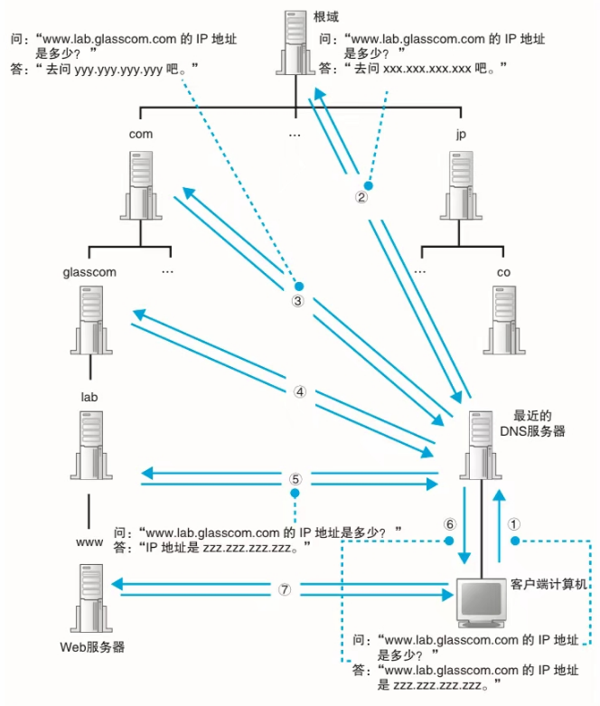

**如果本系列文章对您有帮助，可以 [star 一下我的 limou-learn-note](https://github.com/xiaogithubooo/LimouLearnNote)，求求惹(๑＞ ＜)☆♡~**

**叠甲：以下文章主要是依靠我的实际编码学习中总结出来的经验之谈，求逻辑自洽，不能百分百保证正确，有错误、未定义、不合适的内容请尽情指出！**

[TOC]

>   [!NOTE]
>
>   概要：本系列内容简介

>   [!NOTE]
>
>   资源：本系列相关资源

------

# 1.域名解析原理

域名是根据 `.` 来分级的，域名越靠右边，层级越高，而一个层级就被称作域。而 `DNS` 服务器也会分级，这些域名的信息会被注册到 `DNS` 服务器中，这里我们假设一个 `DNS` 服务器只存储一个域的信息。

- 没有域名解析的服务器，访问各个服务器上的文件数据、服务程序、远程操作...时，都需要使用 `ip + port` 来访问。
- 我们尝试解析一个域名 `http://limou.work.com`，我们需要向最近的 `DNS` 服务器请求，`DNS` 服务器会接受 `http://limou.work.com.` 作为解析
- 这里有个前提，根域 `DNS` 服务器的 `IP + PORT` 每个下载好的浏览器都是知道的
- 开始请求，客户端最近的 `DNS` 服务器根据 `URL` 最后一个 `.` 会向根域服务器请求，根域服务器解析自己的键值表，找到 `com` 对应的域服务器的 `IP` 地址，就会返回这个 `IP` 给上面那台离客户端最近的 `DNS` 服务器
- 继续请求，客户端最近的 `DNS` 服务器根据 `URL` 最后一个 `com` 会向较下级域服务器请求，较下级域服务器解析自己的键值表，找到 `work` 对应的域服务器的 `IP` 地址，就会返回这个 `IP` 给上面那台离客户端最近的 `DNS` 服务器
- 继续请求，客户端最近的 `DNS` 服务器根据 `URL` 最后一个 `work` 会向更下级域服务器请求，更下级域服务器解析自己的键值表，找到 `limou` 对应的域服务器的 `IP` 地址，就会返回这个 `IP` 给上面那台离客户端最近的 `DNS` 服务器
- 这样逐步解析，就会找到另外一台主机的 `IP` 地址，条件允许的话，就可以开始通信了
- 不过这样的消耗是很大的，因此就需要做缓存机制，在距离客户端机器最近的 `DNS` 服务器中，会把常用的 `IP` 和 `域名` 键值对数据缓存起来，方便快速访问，降低解析压力

# 2.域名解析图解

下图非常简要解释了这个原理。

------

>   [!NOTE]
>
>   结语：...

**如果本系列文章对您有帮助，可以 [star 一下我的 limou-learn-note](https://github.com/xiaogithubooo/LimouLearnNote)，求求惹(๑＞ ＜)☆♡~**

