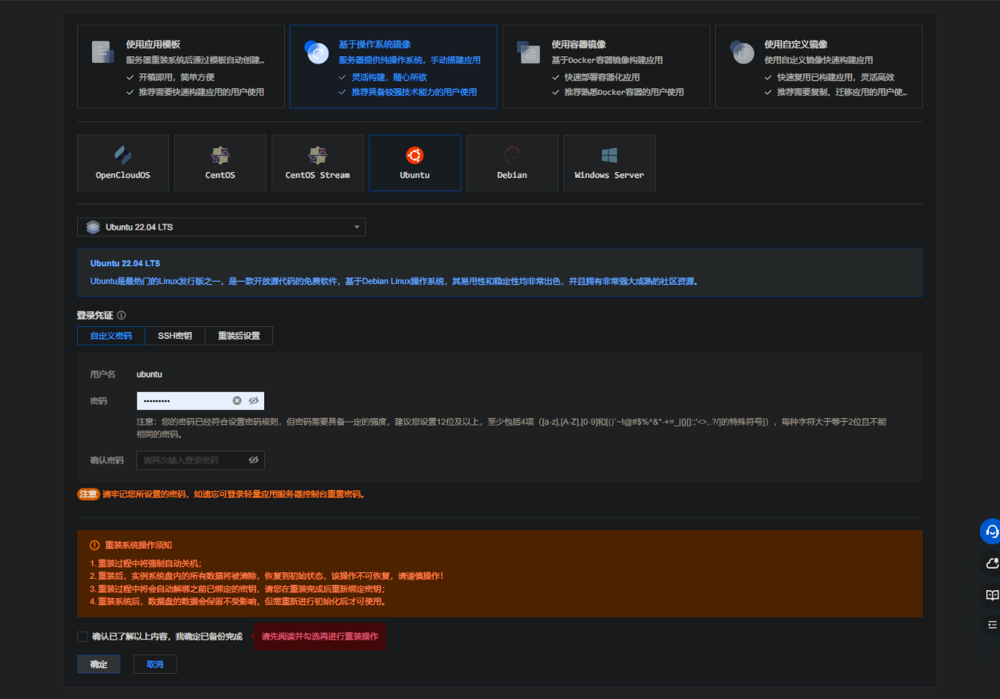
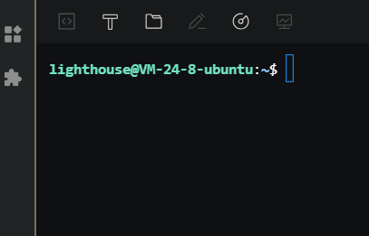
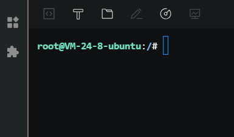
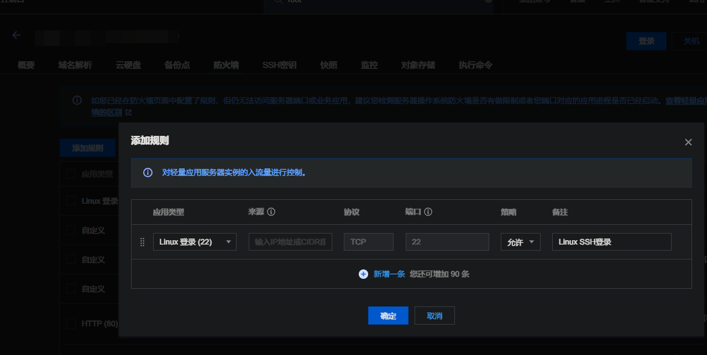
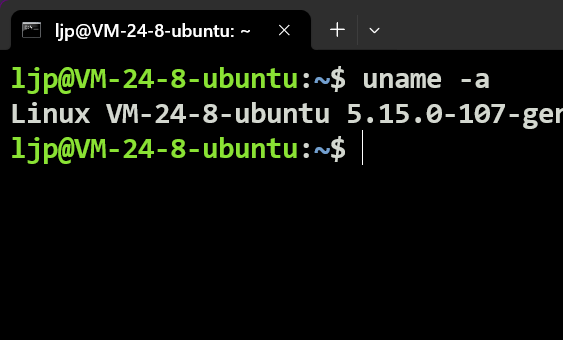

**叠甲：以下文章主要是依靠我的实际编码学习中总结出来的经验之谈，求逻辑自洽，不能百分百保证正确，有错误、未定义、不合适的内容请尽情指出！**

[TOC]

>   概要：...

>   资料：...

>   前要：补充：下面一些常用指令的相关解释...
>
>   ```shell
>   # ufw 的常用指令
>   sudo ufw enable # 启用防火墙并加载现有规则
>   sudo ufw disable # 禁用防火墙且停止所有防火墙规则
>   sudo ufw status # 显示当前防火墙状态和所有规则
>   ```
>
>   ```shell
>   # ssh 的常用指令
>   sudo systemctl start ssh         # 启动 SSH 服务
>   sudo systemctl stop ssh          # 停止 SSH 服务
>   sudo systemctl restart ssh       # 重启 SSH 服务
>   sudo systemctl enable ssh        # 设置 SSH 开机自启
>   sudo systemctl disable ssh       # 禁止 SSH 开机自启
>   sudo systemctl status ssh        # 查看 SSH 服务状态
>   ```

---

# 1.源头

在部署朋友的项目时，由于 `jdk` 的版本不符合项目需求，最终为了避免后续项目的麻烦，决定重装更容易进行包管理使用的 `Ubuntu` 系统。

>   吐槽：顺带一提，朋友使用的是腾讯云应用模板中的宝塔模板...



但是在成功进行重装后，就会出现普通用户和 `root` 用户无法使用 `ssh` 远程连接的问题...

# 2.排错

于是我打开了腾讯云的控制台，使用 `root` 权限进入了他的终端界面，也是失败进入，只能进入一个默认的用户 `lighthouse`，然后使用 `su-` 切换进 `root` 用户，结果发现无法进入...



我想应该是 `root` 密码的问题？于是我重新设置了 `root` 密码，再次切换用户，果然成功登陆了，如果您没有出现这样的问题就不要重置密码了...



然后使用 `sudo ufw status` 检查防火墙，果然，防火墙没有启动...我重新使用 `sudo ufw enable` 启动了防火墙，我发现了一个腾讯云比较离谱的一个问题...

# 3.原因

**神™操作系统内的防火墙没有任何的配置和腾讯云界面版的防火墙完全不匹配！**因此我们需要重新配置 `ssh` 和对应配置以及防火墙规则...

# 4.解决

## 4.1.确保 root 密码正确

这是最基本的要求，你一定要保证您在腾讯云上的控制台终端中可以登录 `root` 账户。

## 4.2.配置防火墙打开端口号

提前使用 `ufw` 打开防火墙的设置吧...

1.   `sudo apt update && sudo apt install -y ufw`：更新包管理器并且安装 `ufw`

2.   `sudo ufw allow 22`：打开 `22` 端口（这个端口就是 `ssh` 默认的服务端口，这种打开比较简单粗暴，但是稳妥一些...）

3.   `sudo ufw enable`：开启防火墙

4.   `sudo ufw status`：检查防火墙的状态，成功打开对应的端口会打印如下的回显信息

     ```shell
     # 回显信息
     Status: active
     
     To                         Action      From
     --                         ------      ----
     22                         ALLOW       Anywhere
     22 (v6)                    ALLOW       Anywhere (v6)
     ```

5.   `腾讯云控制台重新开放端口`：为了保险起见，我还把防火墙的端口开放也做了一边（我推荐您以后无论是命令行窗口的防火墙还是图形化界面的防火墙都设置一遍），设置选项如下，点击确认即可

     

## 4.3.保证 ssh 下载配置成功

1.   `sudo apt update && sudo apt install -y openssh-server`：重新安装 `ssh` 吧，保险一点

2.   `sudo cp /etc/ssh/sshd_config /etc/ssh/sshd_config.original`：备份一份对应的 `ssh` 配置文件

3.   `sudo vim /etc/ssh/sshd_config`：使用您习惯的文本编辑器来修改配置文件，主要修改的内容如下两条

     (1)允许 `root` 用户登录，可取消注释 `PermitRootLogin` 选项，并将其设置为 `yes`

     (2)启用密码认证，如果您希望允许使用密码进行 `SSH` 身份验证（而不是密钥认证），需要确保 `PasswordAuthentication` 设置为 `yes`

     下面就是我配置好的文件，我做了一些带有 `2024-6-22-ljp: This is a config` 字样的简单注释（不过其实我就改了一条注释，您最好检查一下其他地方）

     ```shell
     # ssh 配置文件内部
     $ cat /etc/ssh/sshd_config
     
     # This is the sshd server system-wide configuration file.  See
     # sshd_config(5) for more information.
     
     # This sshd was compiled with PATH=/usr/local/sbin:/usr/local/bin:/usr/sbin:/usr/bin:/sbin:/bin:/usr/games
     
     # The strategy used for options in the default sshd_config shipped with
     # OpenSSH is to specify options with their default value where
     # possible, but leave them commented.  Uncommented options override the
     # default value.
     
     Include /etc/ssh/sshd_config.d/*.conf
     
     #Port 22
     #AddressFamily any
     #ListenAddress 0.0.0.0
     #ListenAddress ::
     
     #HostKey /etc/ssh/ssh_host_rsa_key
     #HostKey /etc/ssh/ssh_host_ecdsa_key
     #HostKey /etc/ssh/ssh_host_ed25519_key
     
     # Ciphers and keying
     #RekeyLimit default none
     
     # Logging
     #SyslogFacility AUTH
     #LogLevel INFO
     
     # Authentication:
     
     #LoginGraceTime 2m
     #PermitRootLogin prohibit-password
     PermitRootLogin yes # 2024-6-22-ljp: This is a config
     #StrictModes yes
     #MaxAuthTries 6
     #MaxSessions 10
     
     #PubkeyAuthentication yes
     
     # Expect .ssh/authorized_keys2 to be disregarded by default in future.
     #AuthorizedKeysFile     .ssh/authorized_keys .ssh/authorized_keys2
     
     #AuthorizedPrincipalsFile none
     
     #AuthorizedKeysCommand none
     #AuthorizedKeysCommandUser nobody
     
     # For this to work you will also need host keys in /etc/ssh/ssh_known_hosts
     #HostbasedAuthentication no
     # Change to yes if you don't trust ~/.ssh/known_hosts for
     # HostbasedAuthentication
     #IgnoreUserKnownHosts no
     # Don't read the user's ~/.rhosts and ~/.shosts files
     #IgnoreRhosts yes
     
     # To disable tunneled clear text passwords, change to no here!
     #PasswordAuthentication yes
     #PermitEmptyPasswords no
     
     # Change to yes to enable challenge-response passwords (beware issues with
     # some PAM modules and threads)
     KbdInteractiveAuthentication no
     
     # Kerberos options
     #KerberosAuthentication no
     #KerberosOrLocalPasswd yes
     #KerberosTicketCleanup yes
     #KerberosGetAFSToken no
     
     # GSSAPI options
     #GSSAPIAuthentication no
     #GSSAPICleanupCredentials yes
     #GSSAPIStrictAcceptorCheck yes
     #GSSAPIKeyExchange no
     
     # Set this to 'yes' to enable PAM authentication, account processing,
     # and session processing. If this is enabled, PAM authentication will
     # be allowed through the KbdInteractiveAuthentication and
     # PasswordAuthentication.  Depending on your PAM configuration,
     # PAM authentication via KbdInteractiveAuthentication may bypass
     # the setting of "PermitRootLogin without-password".
     # If you just want the PAM account and session checks to run without
     # PAM authentication, then enable this but set PasswordAuthentication
     # and KbdInteractiveAuthentication to 'no'.
     UsePAM yes
     
     #AllowAgentForwarding yes
     #AllowTcpForwarding yes
     #GatewayPorts no
     X11Forwarding yes
     #X11DisplayOffset 10
     #X11UseLocalhost yes
     #PermitTTY yes
     PrintMotd no
     #PrintLastLog yes
     #TCPKeepAlive yes
     #PermitUserEnvironment no
     #Compression delayed
     #ClientAliveInterval 0
     #ClientAliveCountMax 3
     #UseDNS no
     #PidFile /run/sshd.pid
     #MaxStartups 10:30:100
     #PermitTunnel no
     #ChrootDirectory none
     #VersionAddendum none
     
     # no default banner path
     #Banner none
     
     # Allow client to pass locale environment variables
     AcceptEnv LANG LC_*
     
     # override default of no subsystems
     Subsystem sftp  /usr/lib/openssh/sftp-server
     
     # Example of overriding settings on a per-user basis
     #Match User anoncvs
     #       X11Forwarding no
     #       AllowTcpForwarding no
     #       PermitTTY no
     #       ForceCommand cvs server
     PasswordAuthentication yes
     PubkeyAcceptedKeyTypes=+ssh-rsa
     ```

4.   `sudo systemctl start ssh && sudo systemctl start reload ssh`：然后直接启动 `ssh`，保险起见我还重新加载了一下 `ssh` 服务，避免配置文件没有被正确载入...

5.   `sudo systemctl status ssh`：检查 `ssh` 是否运行成功，成功会打印如下的回显信息

     ```shell
     # 回显信息(使用 q 可以退出查看...)
     sudo systemctl status ssh
     ● ssh.service - OpenBSD Secure Shell server
          Loaded: loaded (/lib/systemd/system/ssh.service; enabled; vendor preset: enabled)
          Active: active (running) since Sat 2024-06-22 18:35:50 CST; 48min ago
            Docs: man:sshd(8)
                  man:sshd_config(5)
         Process: 20614 ExecReload=/usr/sbin/sshd -t (code=exited, status=0/SUCCESS)
         Process: 20615 ExecReload=/bin/kill -HUP $MAINPID (code=exited, status=0/SUCCESS)
        Main PID: 18088 (sshd)
           Tasks: 1 (limit: 8774)
          Memory: 6.4M
             CPU: 13.315s
          CGroup: /system.slice/ssh.service
                  └─18088 "sshd: /usr/sbin/sshd -D [listener] 0 of 10-100 startups"
     
     Jun 22 19:24:15 VM-24-8-ubuntu sshd[34722]: pam_unix(sshd:auth): check pass; user unknown
     Jun 22 19:24:15 VM-24-8-ubuntu sshd[34722]: pam_unix(sshd:auth): authentication failure; logname= uid=0 euid=0 tty=ssh ruser= rhost=113.133.177.77
     Jun 22 19:24:17 VM-24-8-ubuntu sshd[34722]: Failed password for invalid user zhou from 113.133.177.77 port 47742 ssh2
     Jun 22 19:24:18 VM-24-8-ubuntu sshd[34722]: Connection closed by invalid user zhou 113.133.177.77 port 47742 [preauth]
     Jun 22 19:24:25 VM-24-8-ubuntu sshd[34772]: pam_unix(sshd:auth): authentication failure; logname= uid=0 euid=0 tty=ssh ruser= rhost=113.133.177.77  user=root
     Jun 22 19:24:28 VM-24-8-ubuntu sshd[34772]: Failed password for root from 113.133.177.77 port 39438 ssh2
     Jun 22 19:24:28 VM-24-8-ubuntu sshd[34772]: Connection closed by authenticating user root 113.133.177.77 port 39438 [preauth]
     Jun 22 19:24:36 VM-24-8-ubuntu sshd[34820]: pam_unix(sshd:auth): authentication failure; logname= uid=0 euid=0 tty=ssh ruser= rhost=113.133.177.77  user=root
     ```

6.   `sudo systemctl enable ssh`：为了健壮性考虑，把 `ssh` 设置为服务器开机自启吧，成功会打印如下的回显信息

     ```shell
     # 回显信息
     sudo systemctl enable ssh
     Synchronizing state of ssh.service with SysV service script with /lib/systemd/systemd-sysv-install.
     Executing: /lib/systemd/systemd-sysv-install enable ssh
     ```

## 4.4.尝试使用 cmd 重新进行远程连接

可以使用 `ssh username@hostname_or_ip` 在 `cmd` 中尝试进行远程登陆（可能需要输入 `yes` 确认一下），检验是否可以进行系统，若可以则配置成功（也可以使用 `Xshell` 连接一下）。



---

>   结语：...

