<style>
.heimu {
    position: relative;
    display: inline-block;
    color: transparent;
    text-decoration: none;
}
.heimu::before {
    content: '';
    position: absolute;
    top: 0;
    left: 0;
    width: 100%;
    height: 100%;
    background-color: #333; /* 深色遮盖 */
    z-index: 1;
}
.heimu:hover::before {
    background-color: transparent; /* 鼠标悬浮时移除深色遮盖 */
}
.heimu:hover {
    color: white !important; /* 鼠标悬浮时显示白色文字 */
    text-shadow: none;
}
</style>

**如果本系列文章对您有帮助，可以 [star 一下我的 limou-learn-note](https://github.com/xiaogithubooo/LimouLearnNote)，求求惹(๑＞ ＜)☆♡~**

**叠甲：以下文章主要是依靠我的实际编码学习中总结出来的经验之谈，求逻辑自洽，不能百分百保证正确，有错误、未定义、不合适的内容请尽情指出！**

>   [!NOTE]
>
>   概要：本系列内容简介

>   [!NOTE]
>
>   资源：本系列相关资源

---

# 1.Git 仓库创建

首先您需要在 [Git 下载帮助文档](https://git-scm.com/book/zh/v2/%E8%B5%B7%E6%AD%A5-%E5%AE%89%E8%A3%85-Git) 里下载 `Git` 工具。

> [!WARNING]
>
> 注意：我们目前（在您还对 `Git` 一知半解的时候）不推荐使用任何图形化界面，这对您的学习作用不大，除非您已经熟练操作 `Git命令` 和 `Git的相 关概念`，这个时候才有使用图形化界面 `Git` 的意义。

1.1.本地创建
--------

打开 `git bash`，通常对于 `windows` 来说，在桌面右击鼠标即可找到该功能选项（点进去就有一个“黑色框”出现，以后我们依靠这个命令框，输入和 `Linux` 类似的命令和 `git` 的专属命令）。而对于 `Linux` 用户就方便许多，下载好后直接在终端中进行执行 `git` 相关指令即可。

想要 `Git` 管理本地的文件，只需要输入指令：

```bash
进入某个目录后执行初始化命令
$ mkdir gittest && cd gittest
$ git init
已初始化空的 Git 仓库于 /home/ljp/git/gittest/.git/

```

指令输入并且回车后 `Git` 将会创建一个 `.git` 子目录，该子目录包含 `Git` 仓库需要的必须文件，这些文件是 `Git` 仓库的骨干，有关 `Git` 所有的秘密基本都在这里面。

如果没有进行这个初始化，则没有办法在 `bash` 中对该目录使用 `git` 的其他命令（注意不可以把其他现有的 `.git` 直接复制到这个还未被 `Git` 跟踪的目录，这样做会使得 `Git` 仓库的状态有可能会出现问题）。

> [!CAUTION]
>
> 注意：本教程更多是在 `Linux` 上进行学习，使用 `Windows` 不一定可以成功操作所有步骤。

> [!IMPORTANT]
>
> 补充 ：如果不想要被 `Git` 进行版本控制，最简单的办法是将 .`git` 文件直接删除，当然在我们学过 `git` 后不建议这么做...

> [!IMPORTANT]
>
> 补充：关于 `.git` 的内容可以简单了解一下，可以看看下面的示例：
>
> ```bash
> # .git 内的内容
> $ ls -al
> total 329
> drwxr-xr-x 1 Limou 197121      0 Aug 17 21:58 ./
> drwxr-xr-x 1 Limou 197121      0 Aug 17 21:56 ../
> -rw-r--r-- 1 Limou 197121     47 Aug 17 21:58 COMMIT_EDITMSG
> -rw-r--r-- 1 Limou 197121    107 Jul 29 16:02 FETCH_HEAD
> -rw-r--r-- 1 Limou 197121     23 Jul 21 21:37 HEAD
> -rw-r--r-- 1 Limou 197121     41 Jul 29 16:02 ORIG_HEAD
> -rw-r--r-- 1 Limou 197121    373 Jul 27 11:24 config
> -rw-r--r-- 1 Limou 197121     73 Jul 21 21:37 description
> drwxr-xr-x 1 Limou 197121      0 Jul 21 21:37 hooks/
> -rw-r--r-- 1 Limou 197121 165766 Aug 17 21:58 index
> drwxr-xr-x 1 Limou 197121      0 Jul 21 21:37 info/
> drwxr-xr-x 1 Limou 197121      0 Jul 21 21:37 logs/
> drwxr-xr-x 1 Limou 197121      0 Aug 17 21:58 objects/
> -rw-r--r-- 1 Limou 197121    114 Jul 21 21:37 packed-refs
> drwxr-xr-x 1 Limou 197121      0 Jul 21 21:37 refs/
> 
> ```

后面的远程创建您可以先跳过，因为我要先使用本地创建的仓库来演示后面的指令，等到您学到了 `push` 指令后再来使用远端仓库。

## 1.2.远程创建

比如在 `Github` 或者 `Gitee` 上克隆下来一个 `Git` 仓库（或者叫“项目”），执行以下指令：

```bash
$ git clone github该项目的传输协议 [自定义文件名字]
```

如果你想在克隆远程仓库的时候，想要自定义本地仓库的名字，可以通过额外的参数指定新的目录名（若没有指定该参数，一般默认为该项目仓库在服务器上的名字）。

其中 `Git` 支持多种数据传输协议（我们可以先用 `https` 来学习，比较简单并且好理解）

1. 可使用 `https://` 协议

2. 可使用 `git://` 协议

3. 可使用 `SSH` 传输协议

>   [!IMPORTANT]
>
>   补充：其他协议的使用可能需要一些网络基础知识和额外配置操作，因此我们推荐直接使用 `http` 协议，其他您以后再来了解。

这里演示一个 `gitee` 如何使用 `git clone` 和 `http` 来克隆仓库的例子，您可以尝试按照这个例子，把我的笔记仓库给克隆下来，方便您本地阅读。

首先打开 [这个链接](https://gitee.com/limou3434/limou-learn-note)，找到我的仓库地址，然后复制一串 `http` 链接。


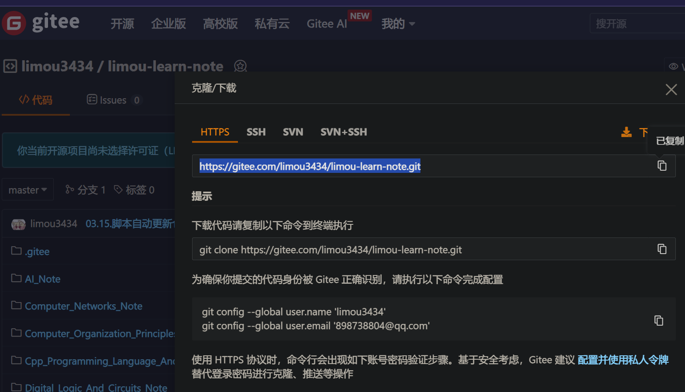

得到这个仓库的 `http` 链接后（如果您使用的是 `github` 也有类似的链接，可以找一找），打开一个空文件夹（您找得到位置的文件夹...）在内部右键选择 `Open Git Bach here`，也就是在该文件夹处打开一个命令行窗口（这个窗口可以执行的指令和 `Linux` 的指令几乎相同）。shell

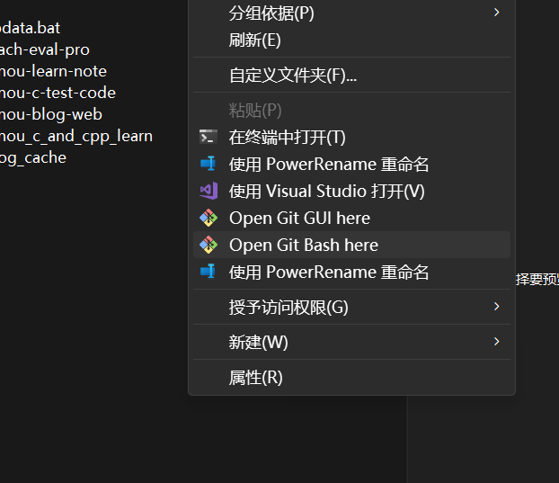

在 `bash` 中执行以下的命令：

```shell
# 克隆仓库文件到本地电脑

$ git clone https://gitee.com/limou3434/limou-learn-note.git

# 如果出现类似下面的错误
# Cloning into 'limou-learn-note'...
# fatal: unable to access 'https://gitee.com/limou3434/limou-learn-note.git/': SSL # certificate problem: unable to get local issuer certificate
# 则可以尝试使用命令 git config --global http.sslVerify false 后再次执行 git clone https://gitee.com/limou3434/limou-learn-note.git 指令

# 可能需要等待一会...
```

完成克隆后，就会出现一个 `.git` 文件夹，这里面就是 `Git` 的管理仓库和管理配置的文件，默认是被隐藏的（可能需要您设置资源管理器才能查看到隐藏文件）。

> [!IMPORTANT]
>
> 补充：关于本地创建和远端创建的仓库还是有区别的，不过我们后面提到 `push` 指令后再来区分...

# 2.Git 仓库配置

`Git` 用来配置的命令是 `git config`。而 `Git` 的配置变量存储在三个不同的位置，它们的作用范围不同，分别是：系统级别、用户级别、仓库级别。

## 2.1.添加配置

### 2.1.1.系统级别

包含系统上每一个用户及他们仓库的通用配置。如果你在执行 `git config` 命令时带上了 `--system` 选项，`Git` 就会在 `/etc/gitconfig` 中读写配置变量（`windows` 应该在 `C` 盘下的管理员文件下）。而因为它是系统级别的配置文件，所以需要管理员或超级用户的权限才能修改它。

```bash
$ git config --system 变量="配置值"
```

### 2.1.2.用户级别

针对当前用户的配置文件（该配置文件位置在 `~/.gitconfig` 或 `~/.config/git/config`），你可以传递 `--global` 选项让 `Git` 读写此文件，这样会对该用户在系统上所拥有的仓库生效（对于当前用户的工作目录来说，这个设置相当于全局设置）。

不过在初步使用 `git` 的过程中，最重要的配置是配置用户名字和邮箱地址（邮箱地址最好真实有效）

```bash
$ git config --global user.name "Your Name"
$ git config --global user.email "Your email"
```

### 2.1.3.仓库级别

针对当前仓库的配置文件（`.git/config`）。它只对当前用户拥有仓库有效。你可以传递 `--local` 选项让 `Git` 读写此文件（当然，你需要进入某个 `Git` 仓库中才能让该选项生效，并且生效于该仓库中）

```bash
$ git config --local 变量="配置值"
```

## 2.2.查看配置

可以查看当前不同范围的配置，这也是检验配置是否生效的好方法。

```bash
$ git config --范围 --list | -l | 某个配置变量
```

## 2.3.删除配置

```bash
$ git config --范围 --unset 某个配置变量 
```

> [!IMPORTANT]
>
> 补充：我们也可以直接打开不同范围级别对于的配置文件来查看（理论上来说配置也可以直接在配置文件里面手动修改来达到配置的目的）。不过这些直接打开配置文件读写的操作我们目前并不推荐使用。
>
> - 系统配置路径 `/etc/gitconfig`
> - 用户配置路径 `~/.gitconfig`
> - 仓库配置路径 `.git/config`

# 3.Git 仓库管理

## 3.1.添加提交

实际上 `Git仓库` 真正指的是 `.git` 目录，但是我们不能直接手动将文件手动写入 `.git`，一旦误改，就会造成 `Git 仓库` 失效。

1. 因此只能将我们需要给 `Git` 管理的文件放在工作目录中（也就是 `.git` 的同级目录）
2. 然后使用 `add` 指令将文件从工作区转向版本库中的暂存区/索引（也就是 `.git` 目录中的暂存区）。
3. 在版本库暂存区内部使用 `commit` 提交到分支中（也就是 `.git` 目录中的存储库）

`add` 后，对工作目录的修改的内容（修改包括新增、修改、删除）会写入到对象库中，被其维护，每修改一次后维护就相当于一次版本的管理。而实际上 `Git` 追踪管理的是修改而不是文件。


为什么暂存区也叫“索引”呢？因为该区存储了修改对象的索引（或许叫“指向对象的索引”）。而实际上，分支上存储的也不是对象，也是存储的是对象的索引。

> [!IMPORTANT]
>
> 补充：`Git` 中的对象有如下几个。
>
> - **Blob 对象**：存储文件内容的对象，每个文件在 `Git` 中都对应一个 `Blob` 对象，文件的内容会被计算出一个唯一的哈希值
> - **Tree 对象**：存储目录的信息，包含指向 `Blob` 对象和其他 `Tree` 对象的指针，通过 `Tree` 对象，`Git` 维护文件系统的层次结构
> - **Commit 对象**：记录一次提交的信息，包括指向一个 `Tree` 对象的指针、提交信息、作者信息、时间戳等，每个 `Commit` 对象指向一个 `Tree` 对象，表示那次提交时的文件状态
> - **Tag 对象**：用于给特定的 `Commit` 对象打标签，`Tag` 对象可以是轻量级的（直接指向 `Commit`）或附注的（包含附加信息，如签名、消息等）

在实际使用中，上述的流程体现为：

```shell
简化流程
# 程序员编写代码产生文件
$ cd gittest
$ echo "hello git!" >> test1.txt
$ cat test1.txt
hello git!

# 使用 git 进行版本管理
$ git add test1.txt # 添加到暂存区
$ git commit -m "这是第一次填写推送信息记录, 要认真写, 方便日后回溯" # 添加到存储库
[master （根提交） f64435b] 这是第一次填写推送信息记录, 要认真写, 方便日后回溯
 1 file changed, 1 insertion(+)
 create mode 100644 test1.txt

```

## 3.2.工作状态

使用 `status` 可以查看当前工作目录（或者叫工作树）中有哪些文件没有被 `add`，那些文件等待 `commit`。不过我们之前已经进行 `add` 和 `push` 了，所以这次就提示这是一个干净的工作区。

```shell
工作状态
$ git status
位于分支 master
无文件要提交，干净的工作区
```

## 3.3.历史列表

使用 `log` 指令可以查看 `commit` 历史、提交者信息、哈希值等。

```bash
历史列表
$ git log
commit f64435b08244ccd0ba4ccedece8ea0f12d5f1d6b (HEAD -> master)
Author: limou3434 <898738804@qq.com>
Date:   Sat Oct 19 22:38:50 2024 +0800

    这是第一次填写推送信息记录, 要认真写, 方便日后回溯

$ git log --oneline # 加上参数 "--oneline" 则输出更加简洁明了
f64435b (HEAD -> master) 这是第一次填写推送信息记录, 要认真写, 方便日后回溯
# 如果日志较多可能需要按 [q] 进行退出

```

## 3.4.对象哈希

不同的对象在 `Git` 中计算出一串哈希值，可以根据哈希值得到对象的相关信息，要想查看 `git` 对象（哈希值指向的内容），也有对应的指令。

```shell
$ git cat-file -p | -t | -s 哈希值
# -p: 查看对象的内容(某个提交的详细信息或查看某个文件的内容)
# -t: 查看对象的类型
# -s: 查看对象的大小

```

> [!IMPORTANT]
>
> 补充：查看哈希值。
>
> - 使用 `git log` 可以查看所有 `commit` 的哈希值
> - 用 `git ls-tree <HEAD | 特定commit的哈希值> <file_path>` 可以查看当前版本的文件的哈希值（这里的 `HEAD` 就是指当前的版本，也就是最近的一次 `commit`，`git` 版本的依据就是使用 `commit`，不同版本有不同的 `commit`）
> - 使用 `git hash-object <file_path>` 则可以查看未提交文件的哈希值（包括目录的）
> - 使用 `git show-ref --tags` 可以查看标签的哈希值

这里我们根据我们之前创建的文件和第一次的 `commit` 进行哈希相关的查看（这里还没有学习过标签，您后面学过后自己演示一下即可）。

```shell
哈希相关的查看
# 查看哈希值
$ git log
commit f64435b08244ccd0ba4ccedece8ea0f12d5f1d6b (HEAD -> master)
Author: limou3434 <898738804@qq.com>
Date:   Sat Oct 19 22:38:50 2024 +0800

    这是第一次填写推送信息记录, 要认真写, 方便日后回溯

$ git ls-tree HEAD test1.txt
100644 blob d1c64694584cf480b01273f2c729fd8b6b7c320c    test1.txt

这是第一次填写推送信息记录, 要认真写, 方便日后回溯

# 根据哈希值查看其他信息
$ git cat-file -p f64435b08244ccd0ba4ccedece8ea0f12d5f1d6b
tree 600f75ecbb1caa9761a249341efaaf0b1ef6e593
author limou3434 <898738804@qq.com> 1729348730 +0800
committer limou3434 <898738804@qq.com> 1729348730 +0800

$ git cat-file -t f64435b08244ccd0ba4ccedece8ea0f12d5f1d6b
commit

$ git cat-file -s f64435b08244ccd0ba4ccedece8ea0f12d5f1d6b
230

$ git cat-file -p d1c64694584cf480b01273f2c729fd8b6b7c320c
hello git!

$ git cat-file -t d1c64694584cf480b01273f2c729fd8b6b7c320c
blob

$ git cat-file -s d1c64694584cf480b01273f2c729fd8b6b7c320c
11

```

## 3.5.查看差异

### 3.5.1.diff 的使用

`diff` 是 `Git` 中一个重要的命令，用于比较文件或提交之间的差异。它可以帮助你了解文件内容的变化以及提交之间的变更情况。

以下是几个常见的使用方式：

1. 查看未暂存的更改（工作区 vs 版本库）

    ```shell
    $ git diff [默认使用HEAD | 特定commit哈希值] [文件名] # 不加具体文件名就显示全部更改
    ```

2. 查看已暂存的更改（暂存区 vs 版本库）

    ```bash
    $ git diff --cached [默认使用HEAD | 特定commit哈希值] [文件名] # 不加具体文件名就显示全部更改
    ```

3. 查看版本间的更改（版本库 vs 版本库）

    ```bash
    $ git diff [commit1哈希值] [commit2哈希值]
    ```

    用实际的提交哈希值来替换 `<commit1哈希值>` 和 `<commit2哈希值>`，这将显示两个提交之间的差异。

这里我们修改一下 `test1.txt` 文件，在没有 `add` 之前比对，在 `add` 后进行比对，在 `commit` 进行比对。

```shell
快速理解差异查看
# add 之前
$ vim test1.txt
$ cat test1.txt
hello git!

I am limou3434.

$ git diff HEAD test1.txt 
diff --git a/test1.txt b/test1.txt
index d1c6469..641225a 100644
--- a/test1.txt
+++ b/test1.txt
@@ -1 +1,3 @@
 hello git!
+
+I am limou3434.

# add 之后
$ git add --all
$ git diff --cached HEAD test1.txt 
diff --git a/test1.txt b/test1.txt
index d1c6469..641225a 100644
--- a/test1.txt
+++ b/test1.txt
@@ -1 +1,3 @@
 hello git!
+
+I am limou3434.

# commit 之后
$ git commit -m "这是第二次提交commit的消息"
[master 2a8c280] 这是第二次提交commit的消息
 1 file changed, 2 insertions(+)

$ git log
commit 2a8c2802e4c5b9a3d942b37800d9384a16ad0dfe (HEAD -> master)
Author: limou3434 <898738804@qq.com>
Date:   Sat Oct 19 23:22:16 2024 +0800

    这是第二次提交commit的消息

commit f64435b08244ccd0ba4ccedece8ea0f12d5f1d6b
Author: limou3434 <898738804@qq.com>
Date:   Sat Oct 19 22:38:50 2024 +0800

    这是第一次填写推送信息记录, 要认真写, 方便日后回溯

$ git diff f64435b08244ccd0ba4ccedece8ea0f12d5f1d6b 2a8c2802e4c5b9a3d942b37800d9384a16ad0dfe 
diff --git a/test1.txt b/test1.txt
index d1c6469..641225a 100644
--- a/test1.txt
+++ b/test1.txt
@@ -1 +1,3 @@
 hello git!
+
+I am limou3434.

```

### 3.5.2.diff 的输出

上面提供的输出您可能会有点蒙，可以仔细解读一下。

- `a/test1.txt` 表示源头文件路径
- `b/test1.txt` 表示目标文件路径
- `index ...` 是文件索引信息。
- `--- a/test1.txt` 表示源头文件的起始位置
- `+++ b/test1.txt` 表示目标文件的起始位置
- `@@ -1 +1,3 @@` 表示以下变更的范围，源头文件差异从第 `1` 行开始，连续 `0` 行；目标文件差异从第 `1` 行开始，连续 `3` 行

根据上述 `diff` 输出，可以看到在原文件中添加了空行和一句话。

在 `git diff` 的输出中，范围指示了变更的具体位置。范围的格式是 `@@ -m,n +x,y @@`，其中 `m,n` 表示源头文件中的范围，`x,y` 表示目标文件中的范围。

>   [!WARNING]
>
>   注意：当显示 `diff` 输出时，`Git` 有时会包含多余的上下文行（`context lines`），以便更好地理解变更的上下文，并在合并等操作中提供更好的决策。因此显示多少取决于 `Git` 的判断，但是 `Git` 必须要保证您阅读清晰。

## 3.6.版本控制

### 3.6.1.版本回退

版本回退是 `Git` 最重要的功能，主要是执行 `git reset` 命令来回退版本。可以指定退回某一次提交的版本，而回退的本质是要将版本库中的内容进行回退，回退依赖 `commit`，工作区和暂存区是否会退由命令参数来决定。

```bash
$ git reset [--soft/--mixed/--hard] <HEAD | commit哈希值>
```

1. `--soft` 参数（柔的），将 `版本库` 回退到某个指定版本，保留 `暂存区`，保留 `工作区`
2. `--mixed` 参数（混合），将 `版本库` 回退到某个指定版本，清空 `暂存区`，保留 `工作区`（默认）
3. `--hard` 参数（硬的），将 `版本库` 回退到某个指定版本，清空 `暂存区`，清空 `工作区`（谨慎）

> [!WARNING]
>
> 注意：这里的清空工作区是指清空那些已经被跟踪文件后（`add` 后），再次进行修改还尚未 `add` 的工作区。如果是一直还没有被跟踪的文件，即便使用 `hard` 后也无法清空。

> [!IMPORTANT]
>
> 补充：`HEAD` 的使用有点类似绝对路径和相对路径的区别，这个参数可以直接写成某次 `commit` 的哈希值，表示回退到指定的版本。也可以使用 `^` 来回退，`HEAD` 表示当前版本，`HEAD^` 表示上一个版本，`HEAD^^` 表示上上个版本...当然，直接使用哈希值是更加精准的选择（甚至可以使用 `git log HEAD^` 达到和 `ls ../..` 类似的目的，也就是试探版本号的哈希值和详细信息进行比较精准的回退）。

> [!IMPORTANT]
>
> 补充：使用 `reset` 实际上是移动 `HEAD` 指针的过程，这个指针指向最新的 `commit` 对象。

```shell
尝试撤回
$ git log
commit 2a8c2802e4c5b9a3d942b37800d9384a16ad0dfe (HEAD -> master)
Author: limou3434 <898738804@qq.com>
Date:   Sat Oct 19 23:22:16 2024 +0800

    这是第二次提交commit的消息

commit f64435b08244ccd0ba4ccedece8ea0f12d5f1d6b
Author: limou3434 <898738804@qq.com>
Date:   Sat Oct 19 22:38:50 2024 +0800

    这是第一次填写推送信息记录, 要认真写, 方便日后回溯
    
# 暂存区中有变动
$ vim test1.txt 
$ cat test1.txt
hello git!

I am limou3434.

...

$ git add --all

# 工作区中有变动
$ vim test1.txt 
$ cat test1.txt
hello git!

I am limou3434.

...

???

# 不同的撤回
$ git reset --soft HEAD^
$ git status
位于分支 master
要提交的变更：
  （使用 "git restore --staged <文件>..." 以取消暂存）
        修改：     test1.txt

尚未暂存以备提交的变更：
  （使用 "git add <文件>..." 更新要提交的内容）
  （使用 "git restore <文件>..." 丢弃工作区的改动）
        修改：     test1.txt

$ git log --oneline 
f64435b (HEAD -> master) 这是第一次填写推送信息记录, 要认真写, 方便日后回溯

$ git reset --mixed HEAD
重置后取消暂存的变更：
M       test1.txt
$ git status
位于分支 master
尚未暂存以备提交的变更：
  （使用 "git add <文件>..." 更新要提交的内容）
  （使用 "git restore <文件>..." 丢弃工作区的改动）
        修改：     test1.txt

修改尚未加入提交（使用 "git add" 和/或 "git commit -a"）

$ git reset --hard HEAD
HEAD 现在位于 f64435b 这是第一次填写推送信息记录, 要认真写, 方便日后回溯
$ git status
位于分支 master
无文件要提交，干净的工作区

```

### 3.6.2.撤回回退

如果后悔了怎么办？如果您还拥有之前提交的 `commit` 对应的哈希值，继续使用上述命令也可以达到撤回的效果（反正只要有哈希值就可以定点跳转）。那如果拿不到这个哈希值怎么办呢？

可以使用 `git reflog`，这条指令会从本地克隆或创建仓库开始，记录本地的每一次提交命令以及重要的 `commit`（不过也仅限于本地）对应的哈希值，可以说是本地的历史记录。

> [!IMPORTANT]
>
> 补充：版本回退的操作是很快的，原因是版本回退使用类似指针挪动的操作，所以就会很快。

## 3.7.删除文件

1. 直接使用 `rm` 只是删除了工作目录中，因此还需要 `add` 和 `commit` 一遍，也就是将工作区和暂存区里一起删除并且提交版本（这也是记录需要被 `git` 记录下来，因此 `git` 不是对文件进行版本控制的一个证明就是，对于被删除的文件也会进行版本控制，这控制的其实是“差异”）

2. 直接使用 `git rm [--cached] <文件名字>`，此时工作区和暂存区中都进行了删除，再加上一次 `commit` 将存储库中的也删除掉（`git rm` 等价于 `rm` 后使用 `add`）。如果加上 `--cached` 则仅从暂存区中移除文件，但保留工作区中的文件

> [!IMPORTANT]
>
> 补充：实际上在 `Git` 仓库中删除一个文件而无法恢复是难以办到的（可以进行版本恢复），因此我们后面需要有某些屏蔽方案禁止某一些敏感隐私的数据上传。

```shell
删除文件
# 当前状态
$ git status 
位于分支 master
无文件要提交，干净的工作区
$ cat test1.txt 
hello git!

# 提交暂存区
$ vim test1.txt 
$ cat test1.txt 
hello git!

!!!
$ git status 
位于分支 master
尚未暂存以备提交的变更：
  （使用 "git add <文件>..." 更新要提交的内容）
  （使用 "git restore <文件>..." 丢弃工作区的改动）
        修改：     test1.txt

修改尚未加入提交（使用 "git add" 和/或 "git commit -a"）

$ git add test1.txt
$ git status
位于分支 master
要提交的变更：
  （使用 "git restore --staged <文件>..." 以取消暂存）
        修改：     test1.txt

# 移除暂存区
$ git rm --cached test1.txt 
rm 'test1.txt'
$ git status 
位于分支 master
要提交的变更：
  （使用 "git restore --staged <文件>..." 以取消暂存）
        删除：     test1.txt

未跟踪的文件:
  （使用 "git add <文件>..." 以包含要提交的内容）
        test1.txt

# 恢复暂存区
$ git restore --staged test1.txt
$ git status 
位于分支 master
尚未暂存以备提交的变更：
  （使用 "git add <文件>..." 更新要提交的内容）
  （使用 "git restore <文件>..." 丢弃工作区的改动）
        修改：     test1.txt

修改尚未加入提交（使用 "git add" 和/或 "git commit -a"）

# 重新提交到暂存区
$ git add test1.txt 
$ git status
位于分支 master
要提交的变更：
  （使用 "git restore --staged <文件>..." 以取消暂存）
        修改：     test1.txt

# 移除暂存区, 移除工作区
$ git rm test1.txt 
error: 下列文件索引中有变更
    test1.txt
（使用 --cached 保留本地文件，或用 -f 强制删除）
$ git status 
位于分支 master
要提交的变更：
  （使用 "git restore --staged <文件>..." 以取消暂存）
        修改：     test1.txt

# 提交移除后的新版本
$ git commit -m "删除文件"
[master 3657ef8] 删除文件
 1 file changed, 2 insertions(+)
$ git status 
位于分支 master
无文件要提交，干净的工作区

```

# 4.Git 分支管理

`Git` 的分支也是最为强大的一部分。


每次 `commit` 最终都会形成一个提交时间线，默认叫做 `master` 主分支，由 `master` 指针维护。

`HEAD` 指向当前的工作分支（切换工作分支后就切换指向为当前分支），默认指向 `master`，并且指向该分支最新的一次 `commit` 提交。

在主分支上，有的时候需要开辟一个次分支，这样既能不影响主分支的重要开发，又可以在次分支上随意开发。等到该分支的代码内容足够稳定，就可以和主分支合并在一起。

## 4.1.分支创建

使用 `git branch [分支名]` 可以创建一个分支。此时在 `./git/refs/heads` 下除了 `master` 就会多一个分支的文件。次分支最开始指向的 `commit` 和主分支指向的 `commit` 是一样的。

```shell
分支创建
$ git branch dog
$ git branch cat
$ ls .git/refs/heads/
cat  dog  master

```

## 4.2.分支查看

使用 `git branch` 就可以查看当前本地存在的分支，其中开头带有 `*` 的分支为当前的工作分支。而如果带上 `-v` 选项，就可以看出当前分支中最新的一次 `commit`。

```shell
分支查看
$ git branch
  cat
  dog
* master

$ git branch -v
  cat    3657ef8 删除文件
  dog    3657ef8 删除文件
* master 3657ef8 删除文件

$ git cat-file -t 3657ef8
commit

$ git cat-file -p 3657ef8
tree 12bceac6a2e50aa3d503feda6f818f65e0d17ce9
parent f64435b08244ccd0ba4ccedece8ea0f12d5f1d6b
author limou3434 <898738804@qq.com> 1729355705 +0800
committer limou3434 <898738804@qq.com> 1729355705 +0800

删除文件

```

> [!IMPORTANT]
>
> 补充：查看分支也可以使用下面这种指令（比较直观），后面就会用到。
>
> ```shell
> $ git log --oneline --graph --all
> ```

## 4.3.分支切换

使用 `git checkout [分支名]` 可以切换当前的工作分支，并且可以注意到 `HEAD` 指向的内容发生的改动，此时的 `HEAD` 指向当前切换的分支。

```shell
分支切换
$ git checkout dog
切换到分支 'dog'

$ git branch
  cat
* dog
  master
  
```

## 4.4.分支删除

使用 `git branch -d 分支名` 即可，不过要删除某个分支，不可以切换到该分支上删除，需要切换到其他任意的分支才可以成功删除。这里把我们之前随意编写的两个分支删除吧。

```shell
分支删除
$ git checkout master 
切换到分支 'master'

$ git branch
  cat
  dog
* master

$ git branch -d dog cat
已删除分支 dog（曾为 3657ef8）。
已删除分支 cat（曾为 3657ef8）。

$ git branch
* master

```

如果一个非空分支还未被合并过，是没有办法删除的，这种情况下只能使用强制删除。

```shell
$ git branch -D [分支名]
```

## 4.5.分支合并

首先先切换到想要被合并的分支上，然后使用 `git merge [某分支名]`（把某分支合并到本分支），于是次分支就被合并到主分支上了，需要注意谁合并谁的问题，这有可能造成结果不同。

### 4.5.1.快进合并

当当前分支的 `HEAD` 可以直接移动到目标分支的最新提交时，直接合并会发生快进合并。这种情况通常发生在被合并的目标分支没有新提交，而当前分支的提交都在目标分支的提交之前，结果就是当前分支的历史记录变得线性。

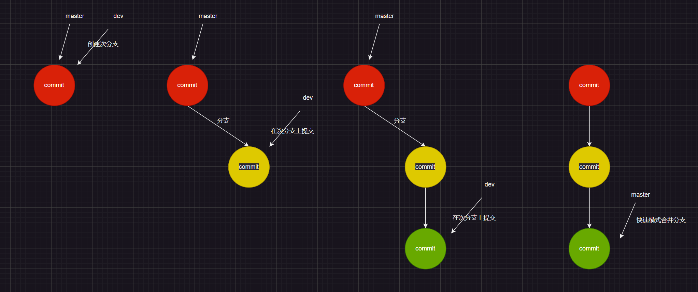

```shell
快进合并
$ git branch dev

$ git checkout dev
切换到分支 'dev'

$ vim test1.txt 

$ git add --all && git commit -m "这是第二次提交"
[dev 1a141ad] 这是第二次提交
 1 file changed, 2 insertions(+)

$ vim test1.txt 

$ git add --all && git commit -m "这是第三次提交"
[dev c391bb3] 这是第三次提交
 1 file changed, 2 insertions(+)

$ git log --oneline 
c391bb3 (HEAD -> dev) 这是第三次提交
1a141ad 这是第二次提交
3657ef8 (master) 删除文件
f64435b 这是第一次填写推送信息记录, 要认真写, 方便日后回溯

$ git branch -v
* dev    c391bb3 这是第三次提交
  master 3657ef8 删除文件

$ git checkout master
切换到分支 'master'

$ git log --oneline 
3657ef8 (HEAD -> master) 删除文件
f64435b 这是第一次填写推送信息记录, 要认真写, 方便日后回溯

$ git merge dev
更新 3657ef8..c391bb3
Fast-forward
 test1.txt | 4 ++++
 1 file changed, 4 insertions(+)

$ git log --oneline 
c391bb3 (HEAD -> master, dev) 这是第三次提交
1a141ad 这是第二次提交
3657ef8 删除文件
f64435b 这是第一次填写推送信息记录, 要认真写, 方便日后回溯

$ git branch -d dev 
已删除分支 dev（曾为 c391bb3）。

$ cat test1.txt 
hello git!

!!!

YYY

NNN

```

### 4.5.2.非快进合并

当当前分支和目标分支都有各自的提交时（注意必须没有相同文件的冲突，也就是同一个文件在不同分支上有不同内容，且 `Git` 无法自动处理），`Git` 会创建一个新的合并提交来将两者合并。这种合并保留了两条分支的历史，形成一个“分叉”的提交图。因此完整的命令是 `git merge --no-ff -m "commit内容" 分支名`。


```shell
非快进合并
$ git reset --hard HEAD^^
HEAD 现在位于 3657ef8 删除文件

$ git log --oneline 
3657ef8 (HEAD -> master) 删除文件
f64435b 这是第一次填写推送信息记录, 要认真写, 方便日后回溯

$ cat test1.txt 
hello git!

!!!

$ git branch dev

$ git checkout dev
切换到分支 'dev'

$ echo "I am test2.txt" > test2.txt

$ git add --all && git commit -m "dev: 这是第二次提交"
[dev ce5cea4] dev: 这是第二次提交
 1 file changed, 1 insertion(+)
 create mode 100644 test2.txt

$ echo "OKOK" >> test2.txt

$ git add --all && git commit -m "dev: 这是第三次提交"
[dev 2926bf4] dev: 这是第三次提交
 1 file changed, 1 insertion(+)

$ git checkout master
切换到分支 'master'

$ ls
test1.txt

$ echo "I am test1.txt" > test1.txt 

$ git add --all && git commit -m "master: 这是第二次提交"
[master c2b450c] master: 这是第二次提交
 1 file changed, 1 insertion(+), 3 deletions(-)

$ echo "NONO" >> test1.txt 

$ git add --all && git commit -m "master: 这是第三次提交"
[master baa5abf] master: 这是第三次提交
 1 file changed, 1 insertion(+)
 
$ git log --oneline --graph --all
* baa5abf (HEAD -> master) master: 这是第三次提交
* c2b450c master: 这是第二次提交
| * 2926bf4 (dev) dev: 这是第三次提交
| * ce5cea4 dev: 这是第二次提交
|/  
* 3657ef8 删除文件
* f64435b 这是第一次填写推送信息记录, 要认真写, 方便日后回溯

$ git branch # 确保在 master 上
  dev
* master

$ git merge --no-ff -m "合并两个不冲突的分支" dev
Merge made by the 'recursive' strategy.
 test2.txt | 2 ++
 1 file changed, 2 insertions(+)
 create mode 100644 test2.txt
  
 $ git log --oneline --graph --all
*   c16fc21 (HEAD -> master) 合并两个不冲突的分支
|\  
| * 2926bf4 (dev) dev: 这是第三次提交
| * ce5cea4 dev: 这是第二次提交
* | baa5abf master: 这是第三次提交
* | c2b450c master: 这是第二次提交
|/  
* 3657ef8 删除文件
* f64435b 这是第一次填写推送信息记录, 要认真写, 方便日后回溯

$ git checkout dev
切换到分支 'dev'

$ git log --oneline --graph --all
*   c16fc21 (master) 合并两个不冲突的分支
|\  
| * 2926bf4 (HEAD -> dev) dev: 这是第三次提交
| * ce5cea4 dev: 这是第二次提交
* | baa5abf master: 这是第三次提交
* | c2b450c master: 这是第二次提交
|/  
* 3657ef8 删除文件
* f64435b 这是第一次填写推送信息记录, 要认真写, 方便日后回溯

# 如果后续 dev 继续提交就会继续延伸
$ git branch -v
* dev    2926bf4 dev: 这是第三次提交
  master c16fc21 合并两个不冲突的分支

$ echo "..." >> test2.txt 

$ git add --all && git commit -m "dev: 这是第四次提交"
[dev e93e012] dev: 这是第四次提交
 1 file changed, 1 insertion(+)

$ git branch -v
* dev    e93e012 dev: 这是第四次提交
  master c16fc21 合并两个不冲突的分支

$ git log --oneline --graph --all
* e93e012 (HEAD -> dev) dev: 这是第四次提交
| *   c16fc21 (master) 合并两个不冲突的分支
| |\  
| |/  
|/|   
* | 2926bf4 dev: 这是第三次提交
* | ce5cea4 dev: 这是第二次提交
| * baa5abf master: 这是第三次提交
| * c2b450c master: 这是第二次提交
|/  
* 3657ef8 删除文件
* f64435b 这是第一次填写推送信息记录, 要认真写, 方便日后回溯

$ git checkout master
切换到分支 'master'

$ git log --oneline
c16fc21 (HEAD -> master) 合并两个不冲突的分支
baa5abf master: 这是第三次提交
c2b450c master: 这是第二次提交
2926bf4 dev: 这是第三次提交
ce5cea4 dev: 这是第二次提交
3657ef8 删除文件
f64435b 这是第一次填写推送信息记录, 要认真写, 方便日后回溯

```

> [!IMPORTANT]
>
> 补充：如果是一开头的分支，如果我们直接使用合并，就会导致分支下移。
>
> 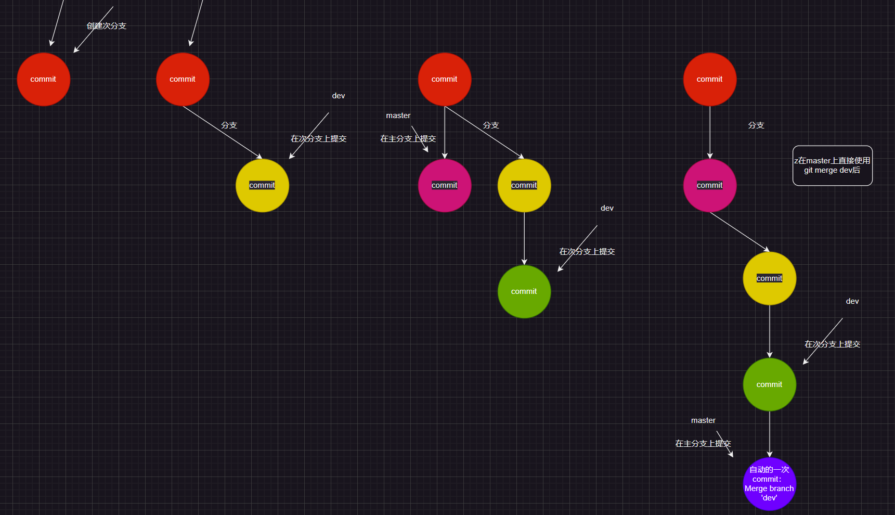

> [!NOTE]
>
> 区别：但是这两种合并有什么区别呢？
>
> - 快进合并会使提交历史保持线性，没有多余的合并提交，这使得历史更简洁，易于理解。在开发过程中，如果分支没有其他并行的更改，快进合并可以更方便地合并分支，减少操作复杂度
> - 非快进合并会创建一个新的合并提交，保留了分支合并的历史信息。这有助于追踪代码的来源和开发过程。在有多个开发者同时工作的场景中，非快进合并能够很好地处理并行开发的情况，尤其是在进行复杂的功能开发时，可以更清晰地看到何时以及为何合并了不同的分支

### 4.5.3.冲突合并

-   `git merge dev`：如果没有冲突且可以快进，`Git` 会直接移动当前分支的指针到目标分支的提交；如果有冲突，则需要手动解决冲突，合并完成后会创建一个新的合并提交
-   `git merge --no-ff dev`：无论是否有冲突，都会创建一个新的合并提交，即使可以快进合并也会生成一个合并提交。这种方式能更清晰地记录分支的合并历史

因此如果是在不同分支里修改了相同的文件，就会发生冲突，这个时候两份文件就会直接合并在一起，需要我们手动修改冲突的地方并且重新 `add` 和 `commit` 一次。


```shell
冲突合并
# 在两个分支上发生了同一个文件的冲突
$ rm -rf * && git init
已重新初始化已存在的 Git 仓库于 /home/ljp/git/gittest/.git/

$ vim test.txt

$ git add --all && git commit -m "第一次提交"
[master （根提交） a5f7b98] 第一次提交
 1 file changed, 1 insertion(+)
 create mode 100644 test.txt

$ git branch 
* master

$ git branch dev

$ git branch 
  dev
* master

$ vim test.txt 

$ cat test.txt 
Hello Git
master

$ git add --all && git commit -m "master: 第二次提交"
[master f3de6e3] master: 第二次提交
 1 file changed, 1 insertion(+)

$ git checkout dev
切换到分支 'dev'

$ cat test.txt 
Hello Git

$ vim test.txt 

$ cat test.txt 
Hello Git
dev

$ git add --all && git commit -m "dev: 第二次提交"
[dev 459cb09] dev: 第二次提交
 1 file changed, 1 insertion(+)

$ git branch master && git log --oneline --graph --all
fatal: 一个分支名 'master' 已经存在。

$ git checkout master && git log --oneline --graph --all
切换到分支 'master'
* 459cb09 (dev) dev: 第二次提交
| * f3de6e3 (HEAD -> master) master: 第二次提交
|/  
* a5f7b98 第一次提交

# 解决冲突
$ git branch 
  dev
* master

$ git merge dev
自动合并 test.txt
冲突（内容）：合并冲突于 test.txt
自动合并失败，修正冲突然后提交修正的结果。

$ cat test.txt
Hello Git
<<<<<<< HEAD
master
=======
dev
>>>>>>> dev

$ vim test.txt

$ cat test.txt
Hello Git
解决冲突

$ git add test.txt 

$ git commit -m "解决冲突"
[master ec70e27] 解决冲突

$ git log --oneline --graph --all
*   ec70e27 (HEAD -> master) 解决冲突
|\  
| * 459cb09 (dev) dev: 第二次提交
* | f3de6e3 master: 第二次提交
|/  
* a5f7b98 第一次提交

```

### 4.5.4.变基合并

合并是将一个分支的更改合并到另一个分支中 `git rebase master <某分支名>`，而变基 ` git rebase <某分支名>` 就是把找到两个分支的公共提交点，然后把其中一个分支的提交应用在另外一个分支上，这就叫做对一个分支的变基。

```shell
变基合并
$ git log --oneline --graph --all
* 8d9d4e6 (master) master: 第二次提交
* 8734351 (HEAD -> dev) 第一次提交 # 此时在 dev 分支

$ echo "new" > new.txt

$ git add --all && git commit -m "dev: 第二次提交"
[dev 56cf55f] dev: 第二次提交
 1 file changed, 1 insertion(+)
 create mode 100644 new.txt

$ git log --oneline --graph --all
* 56cf55f (HEAD -> dev) dev: 第二次提交
| * 8d9d4e6 (master) master: 第二次提交
|/  
* 8734351 第一次提交

$ git brach master

$ git rebase dev 
首先，回退头指针以便在其上重放您的工作...
快进 master 到 dev。

$ ls
new.txt  test

$ git log --oneline 
284a460 (HEAD -> master, dev) dev: 第二次提交
8d9d4e6 master: 第二次提交
8734351 第一次提交

```

这里还演示一下关于变基冲突的例子。

```shell
变基冲突
$ git init

$ echo "Line 1: Original content" > file.txt

$ git add file.txt && git commit -m "master: Initial commit"
[master （根提交） 2b02135] master: Initial commit
 1 file changed, 1 insertion(+)
 create mode 100644 file.txt

$ git checkout -b dev
切换到一个新分支 'dev'

$ echo "Line 2: Feature branch change" >> file.txt

$ git add file.txt && git commit -m "dev: Add a line in feature branch"
[dev f2710d9] dev: Add a line in feature branch
 1 file changed, 1 insertion(+)

$ git checkout master
切换到分支 'master'

$ echo "Line 2: Master branch change" >> file.txt

$ git add file.txt && git commit -m "Add a line in master branch"
[master 00d30ca] Add a line in master branch
 1 file changed, 1 insertion(+)

$ ls
file.txt

$ cat file.txt
Line 1: Original content
Line 2: Master branch change

$ git checkout dev
切换到分支 'dev'

$ ls
file.txt

$ cat file.txt
Line 1: Original content
Line 2: Feature branch change

# 开始变基
$ git rebase master # 把当前分支的提交, 变基到 master 上, 最终替换当前分支
自动合并 file.txt
冲突（内容）：合并冲突于 file.txt
error: 不能应用 f2710d9... dev: Add a line in feature branch
提示：Resolve all conflicts manually, mark them as resolved with
提示："git add/rm <conflicted_files>", then run "git rebase --continue".
提示：You can instead skip this commit: run "git rebase --skip".
提示：To abort and get back to the state before "git rebase", run "git rebase --abort".
不能应用 f2710d9... dev: Add a line in feature branch

# 出现冲突
$ git status
交互式变基操作正在进行中；至 00d30ca
最后完成的命令（1 条命令被执行）：
   pick f2710d9 dev: Add a line in feature branch
未剩下任何命令。
您在执行将分支 'dev' 变基到 '00d30ca' 的操作。
  （解决冲突，然后运行 "git rebase --continue"）
  （使用 "git rebase --skip" 跳过此补丁）
  （使用 "git rebase --abort" 以检出原有分支）

未合并的路径：
  （使用 "git restore --staged <文件>..." 以取消暂存）
  （使用 "git add <文件>..." 标记解决方案）
	双方修改：   file.txt

修改尚未加入提交（使用 "git add" 和/或 "git commit -a"）

# 查看冲突
$ cat file.txt
Line 1: Original content
<<<<<<< HEAD
Line 2: Master branch change
=======
Line 2: Feature branch change
>>>>>>> f2710d9 (dev: Add a line in feature branch)

# 修改冲突
$ vim file.txt
$ cat file.txt
Line 1: Original content
Line 2: Master branch change
Line 2: Feature branch change

$ git add file.txt
$ git rebase --continue # 继续变基, 您会进入一个文本编辑器, 用来确认输入提交信息(这里稍微修改一下试试, 输入 "(yes)" 表示确认)
dev: Add a line in feature branch(yes)

# 请为您的变更输入提交说明。以 '#' 开始的行将被忽略，而一个空的提交
# 说明将会终止提交。
#

# 交互式变基操作正在进行中；至 00d30ca
# 最后完成的命令（1 条命令被执行）：
#    pick f2710d9 dev: Add a line in feature branch
# 未剩下任何命令。
# 您在执行将分支 'dev' 变基到 '00d30ca' 的操作。
#

# 要提交的变更：
#       修改：     file.txt
#

# 保存文件后出现下面提示
[分离头指针 eef3c2e] dev: Add a line in feature branch(yes)
 1 file changed, 1 insertion(+)
成功变基并更新 refs/heads/dev。

# 查看结果
$ git log --oneline --graph --all
* eef3c2e (HEAD -> dev) dev: Add a line in feature branch(yes)
* 00d30ca (master) Add a line in master branch
* 2b02135 master: Initial commit

# 可以继续提交更好观察结果

* 80767a7 (master) master
| * c8d3715 (HEAD -> dev) dev
| * eef3c2e dev: Add a line in feature branch(yes)
|/  
* 00d30ca Add a line in master branch
* 2b02135 master: Initial commit


```

## 4.6.分支策略

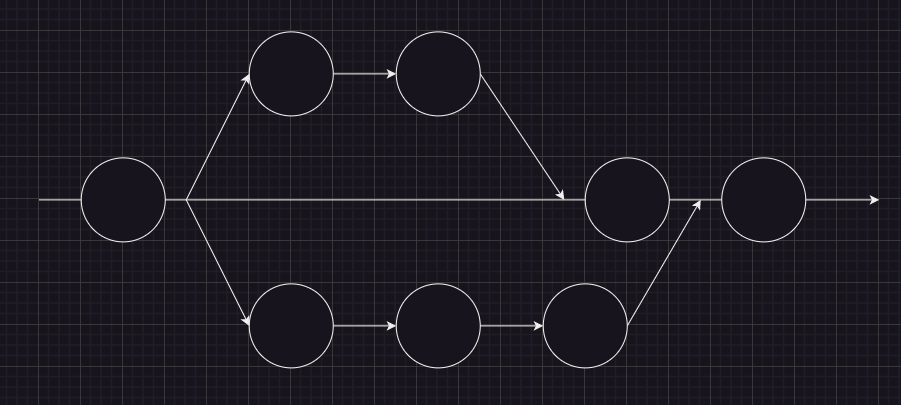

`Git` 的不同分支可能具有不同的功能，例如稳定推荐的 `master` 分支和多人协作开发的 `div` 分支。如果是那种小型开发团队（3~4 人），那只需要一个 `主分支+多个开发者分支` 即可。如果是大型开发团队，那么就需要更加复杂的分支模型才可以符合开发需求，不过这些我们后面再来介绍。

## 4.8.分支去错

有的时候哪怕是稳定的 `master` 分支也会出现 `bug`，这个时候不能直接修改 `master` 分支，否则有可能从小 `bug` 变成大 `bug`。因此我们需要通过分支合并，来进行 `bug` 修改。

1. 首先创建 `dev` 分支（也可以根据 `bug` 的名字来命名），修改好 `master` 分支里的 `bug`

2. 测试完 `dev` 分支确保没有新的 `bug` 后，切换回主分支，再将 `dev` 分支合并给 `master` 分支，并且解决

3. 最后最好是删除掉 `dev` 分支

这样做的好处是，可以保证 `master` 的稳定性，也可以保持 `master` 分支历史记录简洁清晰，就算修复失败，也可以直接删除 `dev` 分支重新再来。

> [!WARNING]
>
> 注意：这里只是针对小型开发团队，所以直接创建了一个 `dev` 分支，而对于大型开发团队不一定是叫做 `dev` 分支，可能会有专属的分支命名，这取决于企业采取的分支模型和命名规范，这些我们后面再来提及...

# 5.Git 远程仓库

## 5.1.分布式版本控制

我们上面所学的命令都只是在本地进行工作，也就是说每一个电脑都是一份版本库，因此我们工作的时候就不需要连接网络。但 `Git` 可是多人协作的工具，工作文件不能仅仅在每一个个人电脑上。如何在个人和个人直接传递文件来协调呢？

1. 因此就出现了 `中央服务器`，该 `中央服务器` 保持开机，用来存储代码

2. 其他人依靠 `push` 命令把文件记录推送到 `中央服务器`，而每一个人都可以 `clone 中央服务器` 库中的文件记录到自己本地电脑中

3. 每个人都在自己的本地电脑开发，使用 `Git` 协作，这样就实现了个人和个人的协调工作

而我们可以把中央服务器的仓库称为 `远端仓库`，一是可以自己搭建 `中央服务器`、二是使用 `Github, GitLab, Gitee` 这种代码托管平台。这上面的整个过程，实际上就是 `分布式版本控制` 的过程。

## 5.2.远程仓库的创建

利用 `Gitee` 和 `Github` 可以创建远程仓库，创建过程比较简单（我们之前就演示过，也就是不使用 `git init` 获取仓库的做法），一般来说一个仓库代表一个项目系统。一般来说会自动创建一个 `README.md`，这是项目的说明书，使用 `Markdown` 语法编写的项目文档。

> [!IMPORTANT]
>
> 补充：在 `Gitee` 中还有两个模板文件，`ISSUE_TEMPLATE.md` 文件和 `PULL_REQUEST_TEMPLATE.md` 文件，实际上就对于下面其中两个选项卡。
>
> 
>
> 1. `issues` 是有问题的人与开发者沟通的文件集合，这里可以处理使用者发现的问题，进而修改 `bug`
>
> 2. `pull request` 则是合并分支的申请集合，这里可以请求开发者合并某些分支，也就是所谓的“提交 `PR`”

> [!IMPORTANT]
>
> 补充：只要设置了两个模板文件，详细的模板语法可以上 `Github, Gitee` 等网站进行查询，有机会再补充...

> [!IMPORTANT]
>
> 补充：远程仓库是拥有权限成员的，例如：报告者、观察者、开发者、管理者等。

不过为了教程的完整性，我重新创建一个空的私有仓库进行后续的学习，步骤如下。

新建仓库。

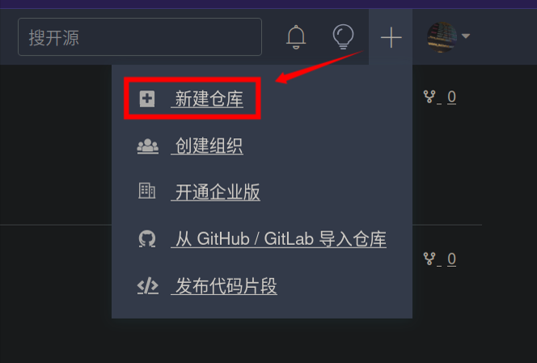

填写基本信息后进行创建（请一定和我一样，分支模型我们完全可以自己后期再添加）。

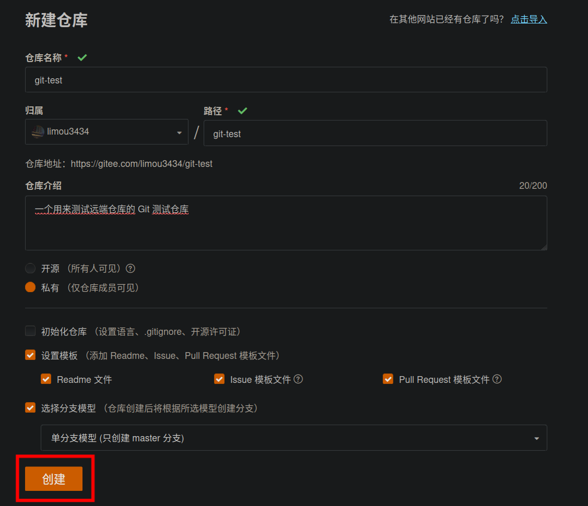

得到托管仓库主页。

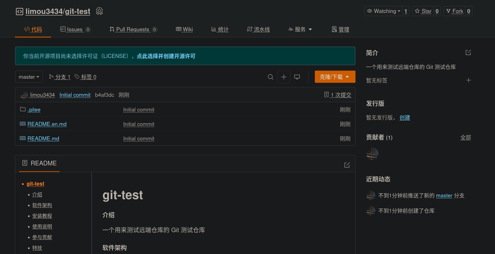

点击上面的 `克隆/下载` 按钮然后在本地从上到下执行下面两个指令。

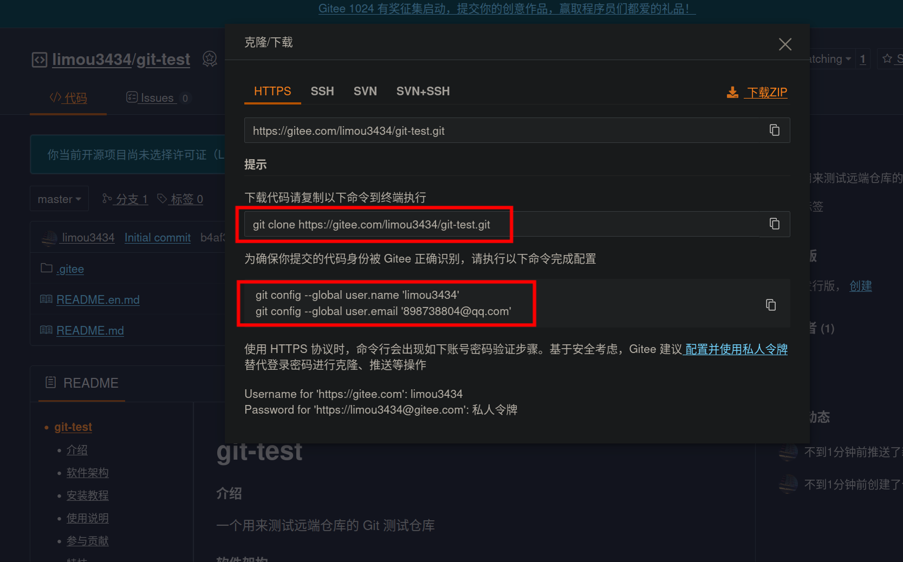

```shell
克隆仓库
$ git clone https://gitee.com/limou3434/git-test.git
正克隆到 'git-test'...
remote: Enumerating objects: 7, done.
remote: Counting objects: 100% (7/7), done.
remote: Compressing objects: 100% (7/7), done.
remote: Total 7 (delta 0), reused 0 (delta 0), pack-reused 0
接收对象中: 100% (7/7), 完成.

# 设置配置
$ git config --global user.name 'limou3434'

$ git config --global user.email '898738804@qq.com'

# 进入仓库
$ cd git-test
$ ls
README.en.md  README.md

```

## 5.3.远程仓库的克隆

### 5.3.1.http 协议

远程仓库始终还是需要克隆到本地来开发的，因此就需要 `clone` 指令，完整指令为 `git clone https协议 [重命名的名字]`，即可完成克隆，但是不能在其他本地仓库目录下进行克隆，上面我们已经使用过了。

此时克隆下来的本地仓库和远程仓库内容是完全一样的，以后我们就可以在本地机器上对项目进行修改而不影响远程仓库。

> [!WARNING]
>
> 注意：尽量保证一个项目中只有一个 `.git`，否则没有妥善处理是会出现问题的，这种问题我们后面再来补充...

### 5.3.2.SSH 协议

远程仓库除了使用 `http` 协议还可以使用 `SSH`，配合公钥来 `clone`。我们需要在远程仓库里配置公钥 `SSH key`。

1. 先在用户主目录下查看有无 `.ssh` 目录，如果有就查看下面的 `id_rsa(私钥)` 和 `id_rsa.pub(公钥)` 文件，如果已经有了就跳过这一步，如果没有就需要创建 `SSH key`

2. 使用 `ssh-keygen -t rsa -C "你的邮箱号（必须和gitee或github上的一致）"` 然后一路回车即可，暂时不需要填写其他东西

3. 使用 `cd .ssh/` 就可以看到步骤 `1` 说的两个文件，我们就得到了私钥和公钥，复制公钥的内容（一个字符都不要漏）到 `gitee` 或者 `github` 的 `SSH公钥` 选项卡中，并且可以设置公钥的名称，然后输入当前账户的密码即可

4. 如果设置了 `SSH` 协作，那么就需要分配公钥，仓库允许多个公钥的存在

5. 回到本地机器上使用 `SSH` 协议克隆

这里我在演示一次 `clione`，但是使用 `SSH` 协议进行克隆，您可以 [查看 Gitee 官方的公钥私钥教程](https://help.gitee.com/base/account/SSH%E5%85%AC%E9%92%A5%E8%AE%BE%E7%BD%AE)。

配置公钥。

```shell
使用 SSH 拉取相同的仓库
$ ssh-keygen -t rsa -C "898738804@qq.com" # -t 指定密钥类型为 RSA, -C 在密钥中添加注释
Generating public/private rsa key pair.
Enter file in which to save the key (/home/ljp/.ssh/id_rsa): 
Enter passphrase (empty for no passphrase): 
Enter same passphrase again: 
Your identification has been saved in /home/ljp/.ssh/id_rsa
Your public key has been saved in /home/ljp/.ssh/id_rsa.pub
The key fingerprint is:
SHA256:mC/EadZz8wUL7kV/0TZkuaHdqe7EfxtJBUWAiyXE9wk 898738804@qq.com
The key's randomart image is:
+---[RSA 3072]----+
|         o.  .o*+|
|          o O o+.|
|          .=o+o+O|
|     . = ..o.=o-=|
|      O S + o +..|
|       . + +.o. .|
|      . . . oo o |
|       .    ... o|
|            .. oO|
+----[SHB257]-----+

$ ls ~/.ssh/id_rsa ~/.ssh/id_rsa.pub
/home/ljp/.ssh/id_rsa  /home/ljp/.ssh/id_rsa.pub
# 这里把公钥文件的内容全部复制下来, 密钥不允许泄漏给外人

```

填写公钥。


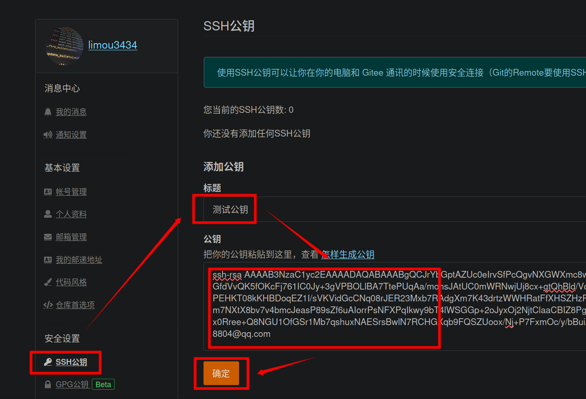

回到之前的仓库页面使用 `SSH` 进行克隆。

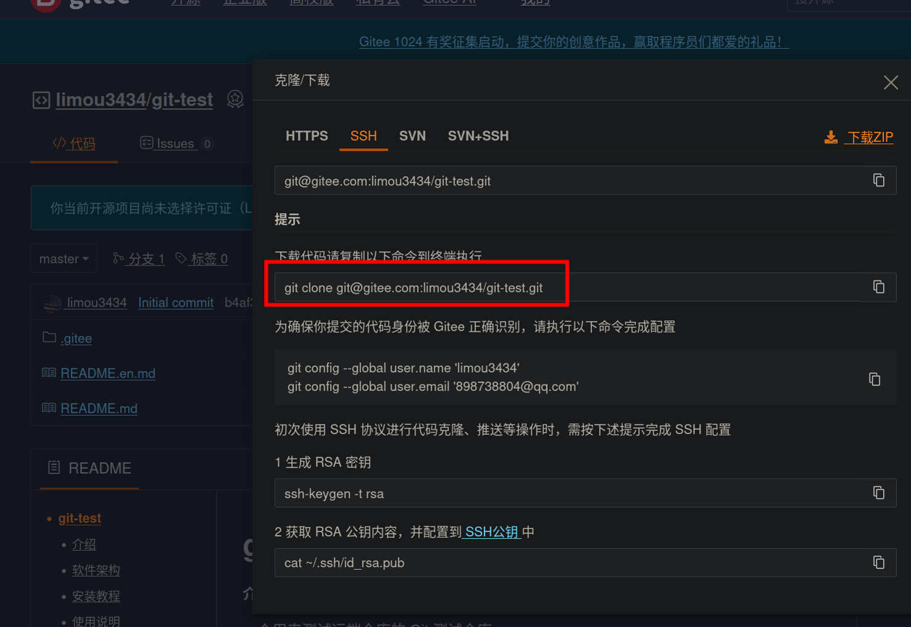

```shell
克隆仓库并且重命名
$ git clone git@gitee.com:limou3434/git-test.git git-test-ssh
正克隆到 'git-test-ssh'...
The authenticity of host 'gitee.com (180.76.198.225)' can't be established.
ED25519 key fingerprint is SHA256:+ULzij2u99B9eWYFTw1Q4ErYG/aepHLbu96PAUCoV88.
This key is not known by any other names.
Are you sure you want to continue connecting (yes/no/[fingerprint])? yes # 这里需要输入 yes 进行确认
Warning: Permanently added 'gitee.com' (ED25519) to the list of known hosts.
remote: Enumerating objects: 7, done.
remote: Counting objects: 100% (7/7), done.
remote: Compressing objects: 100% (7/7), done.
remote: Total 7 (delta 0), reused 0 (delta 0), pack-reused 0
接收对象中: 100% (7/7), 完成.
$ ls
git-test  git-test-ssh
```

> [!WARNING]
>
> 注意：由于之前我们拉取 `git-test` 到本地的 `git-test` 时已经配置了，所以这里就不再重复配置。如果前面没有配置用户和邮箱，这里就需要自己配置一下。

> [!TIP]
>
> 区别：两种协议的推送区别，等学过后面的 `push` 后再回来补充这里的知识。
>
> 如果是 `HTTP` 协议，则每次 `push` 都需要传输用户密码来进行用户校验；而如果是 `SSH` 协议，只有拥有私钥的本地机器才可以进行 `push` 推送，这个过程中会发生公钥私钥验证的过程，公钥克隆主要是为了网络传输安全考虑...

>   [!TIP]
>
>   区别：两者协议的使用场景和优势结合，等学过后面的 `push` 后再回来补充这里的知识。
>
>   既然 `SSH` 克隆这么安全？那为什么还有人使用 `HTTPS` 克隆？
>
>   - **兼容性强**：`HTTPS` 在各种网络环境中兼容性更好，尤其是在公司防火墙、学校网络等受限的环境中，`HTTPS` 通常能绕过这些限制。`SSH` 有时会因为端口（默认 `22` 端口）问题而被阻断，而 `HTTPS` 使用标准的 `443` 端口，通常不会受到限制。
>   - **免配置 SSH 密钥**：`HTTPS` 克隆不需要事先配置 `SSH` 密钥，适合临时或初次访问仓库的用户，简单输入用户名和密码就可以进行认证操作，非常便捷。
>   - **广泛支持代理**：`HTTPS` 在代理服务器上配置方便，适合在不同网络环境中下载代码，而 `SSH` 有时需要特殊配置才能支持代理连接。
>   - **安全传输**：`HTTPS` 通过 `SSL/TLS` 协议加密传输，确保下载过程中数据的完整性和保密性，防止中间人攻击和数据篡改。
>
>   不过，其实可以兼顾两者的优势，先通过 `HTTPS` 克隆仓库，再修改为仓库的远程地址为 `SSH` 即可。
>
>   ```shell
>   $ git clone https://gitee.com/limou3434/git-test.git
>   cd git-test
>   git remote set-url origin git@gitee.com:limou3434/git-test.git
>   ```
>
>   这样就将远程 `origin` 的 `URL` 从 `HTTPS` 改为 `SSH`。之后，所有的推送操作都会走 `SSH`，而不再需要 `HTTPS` 的用户名和密码认证，而是转为公钥私钥认证。

## 5.4.远程仓库的推拉

### 5.4.1.简单概括版

在使用 `clone` 后，远程仓库和本地仓库就自动有了联系，这个时候就可以直接使用 `push`（如果有权限）。我们修改好自己的本地文件后就需要使用 `push` 命令来推送代码到远端仓库。

```shell
$ git push
```

另外，如果在我们推送之前就有别的开发者在同一个分支里推送了文件，这个时候本地仓库和远程仓库是不同步的，因此我们需要使用命令 `git pull 远程仓库名(默认origin) 本地分支:远程分支` 拉取更新我们的本地仓库才能继续推送。

不过，上面是对于完全不懂 `Git` 的新手而言的，如果要彻底理解 `Git` 的远端拉取，还必须深入了解远端仓库和本地仓库、远端分支和本地分支。

> [!WARNING]
>
> 注意：这里的推拉指的是使用 `git clone` 的仓库，而不是使用 `git init` 的仓库。

### 5.4.2.深入理解版

假设我们在 `GitHub` 上已有一个远端仓库 `git-test`，这个远端仓库默认具有远端分支 `origin/master, origin/dev`。

- 我们本地的 `git` 工具克隆了一个远端仓库后，默认在本地仓库中将远端仓库重命名为 `origin` 并且指向该仓库（可使用 `git remote -v` 进行查看）
- 本地仓库就会存储远端分支为远端跟踪分支 `remotes/origin/master, remotes/origin/dev` ，并且本地仓库也会有本地分支 `master, dev`（可使用 `git branch -a` 进行查看）

因此实际上，如果没有克隆时的自动关联，也就是直接在本地使用 `git init` 初始化的本地仓库，我们是需要指定远端仓库和远端分支的。

#### 5.4.2.1.克隆得来的本地仓库

先考虑 `git clone` 时自动关联的本地仓库，则会做以下工作。

1. **git clone <远程仓库的URL>**：当您运行 `git clone <远程仓库的URL>` 时，`Git` 会从远程仓库下载所有的代码、分支和提交历史。同时，`Git` 会自动为您创建一个本地分支（例如 `master` 或 `dev`），这些本地分支会与远程仓库中的对应分支分别建立一对一的追踪关系。此外，`Git` 会将远程仓库命名为 `origin`，并在本地创建远端跟踪分支（如 `remotes/origin/master` 和 `remotes/origin/dev`）。
2. **git fetch**：使用 `git fetch` 命令时，`Git` 会从远程仓库下载最新的提交和分支信息，下载远程分支的更新到本地的远程跟踪分支（如 `remotes/origin/master`），但不会自动合并到当前分支。这样可以让你在进行合并之前查看远程分支的变化，确保合并是可控的（需要继续手动进行合并，例如处于 `master` 分支时先使用 `git fetch` 后再 `git merge origin/master`）。
3. **git pull**：当您在本地仓库中使用 `git pull` 命令时，`Git` 会先执行 `git fetch`，下载远程分支的更新到本地的远程跟踪分支（如 `remotes/origin/master`）。然后，`Git` 会将这些更新自动合并到当前活跃的本地分支中（例如 `master`），相当于执行了 `git fetch` 和 `git merge` 的组合。
4. **git push**：当您使用 `git push` 命令时，`Git` 会将您本地的更改自动推送到远程仓库的相应分支（如本地的 `master` 到 `origin/master`）。

上面这种好理解（因为和我们之前的使用没有太大区别，只不过把细节给出来了而已），因此我在这里就不过多演示...

#### 5.4.2.2.初始得来的本地仓库

再考虑 `git init` 时没有关联的本地仓库，则会做以下工作（注意此时远端 `GitHub` 上有一个创建好但是没有任何文件的空仓库）。

1. **mkdir git-test && cd git-test && git init**：当您运行 `git init` 命令时，`Git` 会在当前目录创建一个新的空 `Git` 仓库，并在该目录下生成一个 `.git` 文件夹，用于存储版本控制所需的所有信息（这也就是创建一个本地仓库）。此时，本地仓库尚未与任何远程仓库关联，您可以通过添加文件和提交更改开始工作（可使用 `git remote -v` 和 `git branch -a` 进行验证）。
2. **touch README.md && git add README.md && git commit -m "first commit"**：创建一个文件并且提交就会自动生成一个 `masert` 分支
3. **git remote add <指定远端仓在本地的命名(一般是origin)> <远程仓库的URL>**：如果您希望将本地仓库与远程仓库关联，您需要使用 `git remote add <指定远端仓在本地的命名(一般是origin)> <远程仓库的URL>` 命令手动添加远程仓库（之后可使用 `git remote -v` 查看当前的远程仓库配置）。
4. **git branch --set-upstream-to=origin/<远端分支名> <本地分支名>**：
5. **git fetch <远端仓库名> [<指定分支>]**：可以将远端仓库的所有（或部分）远端分支的所有更新下载到本地，依旧是不手动合并
6. **git pull <远端仓库名> [<指定分支>]**：可以将远端仓库的所有（或部分）远端分支的所有更新下载到本地，并且自动根据之前的关联进行合并
7. **git push <远端仓库在本地的命名> <本地分支名>:<远端分支名>**：如此才是 `push` 的完全写法

这个我们可以测试一下，旨在深刻理解 `Git` 远端概念的理解，待补充...

# 6.Git 忽略文件

在日常开发中，有些文件不应该被推送上来（例如保存了数据库密码的配置文件），但是一个一个甄别又十分低效，因此就有了忽略文件的存在。

忽略文件的名字为 `.gitignore`，内部可以写入一些特殊的代码，可以达到屏蔽某些文件的目的，内容可以自己自定义，也可以使用一些已有的模板。在内部写入：

1. 直接写文件名

2. 使用通配符 `*`

3. `!` 文件名或通配符（反向屏蔽）

可以屏蔽对应的文件，不过也可以使用 `-f` 选项强制 `add`，不过一般不建议这么做。

> [!IMPORTANT]
>
> 补充：还可以使用 `git check-ignore -v 文件名` 来查看该文件为什么被屏蔽的原因（也就是显示出在 `.gitignore` 中的相关语法行）。

> [!IMPORTANT]
>
> 补充：屏蔽已经被提交的文件。有可能需要屏蔽已经被推送的文件，这里先简单提及一下，等您学过 `push` 后再回来看这里。
>
> 1.   先将需要停止追踪的文件 ` path/to/file.txt` 加入到 `.gitignore` 中
>2.   然后使用 `git rm --cached path/to/file.txt` 把该文件从暂存区中移除，但是不删除文件
> 3.   使用 `git commit -m "Stop tracking file.txt." && git push` 继续提交和推送到远端即可
>
> 不过对于已经提交的文件，是很难彻底删除历史记录的，因为可以回推提交，这种情况下唯一安全简单的修复方案，几乎就是修改密钥。

# 7.Git 配置别名

可以使用一些配置简化命令 `git config 配置范围 alisa.别名 原有命令`，不过配置别名对于新手来说暂时不建议使用。不过如果您使用熟练，也可以可以考虑做定制化的，并且我推荐将 `pull, add, commit` 这三个指令重命名，这在个人开发时经常使用（不过其实我觉得这个还不如 `Linux` 自己的重名指令），例如下面的指令就非常好用。

```shell
组合 pull, add, commit, push 的指令
ugitpacp() {
    # 检查是否提供了提交消息
    if [ -z "$1" ]; then
    echo "Usage: git_commit_push \"commit message\""
    return 1
    fi

    # 读取提交消息
    local commit_message="$1"

    # 执行 Git 命令
    git pull && git add --all && git commit -m "$commit_message" && git push
}

```

将上述代码添加到 `~/.bashrc` 文件的最末尾（如果您用的也是 `bash` 终端的话）

# 8.Git 标签管理

`Git` 的标签有里程碑的感觉，实际上就是对某次重要的 `commit` 的一个标识（别名）例如：版本号。相对于记住难记的 `SHA-1` 值，使用标签来寻找 `commit` 是更好的选择。

1. 切换到需要打标签 `commit` 的分支上

2. 打上标签 `git tag [标签名] [某次SHA-1值(如果该选项没写就默认给当前的commit打上标签)]`

3. 查看标签 `git tag` 或者 `tree .git` 的 `refs/tags` 中查看，内部保存的是 `SHA-1` 值，注意是根据标签字母排序的，而不是时间排序

4. 如果希望给创建标签添加更加详细的描述，可以使用 `git tag -a [标签名] -m "标签详细信息" [SHA-1值]`。并且可以使用 `git show [标签名]` 来查看详细信息

5. 删除标签就是 `git tag -d [标签名]`，不过需要注意再次使用 `git push [远程仓库名] :[标签名字]`

本地 `tag` 也是可以推送到远程仓库里的，使用命令 `git push origin [标签名]` 单独推送，或者使用 `git push origin --tags` 把所有本地标签全部推送到远程仓库中。

> [!IMPORTANT]
>
> 补充：使用以下命令按时间顺序对 `Git` 标签排序。
>
> ```bash
> git tag --sort=creatordate
> ```
>
> 这将按标签的创建时间进行升序排列。如果希望逆序显示，可以加上 `-`。
>
> ```bash
> git tag --sort=-creatordate
> ```
>
> 这样，标签将按时间降序显示，最新的标签会显示在最前面。

# 9.Git 密码管理

要配置 `Git` 记住密码，可以通过以下几种方式来实现。

## 9.1.永久配置

使用 `git-credential-store` 即 `Git` 的凭证存储功能，可以将用户名和密码保存在本地文件中。

1. **配置全局存储**：执行以下命令，将凭证信息保存在本地配置文件中
   
    ```bash
    git config --global credential.helper store
    ```
    
2. **执行操作**：当你下次进行 `Git` 操作时（如 `git push`），`Git` 会提示你输入用户名和密码，并将其保存到 `~/.git-credentials` 文件中
   
    ```
    https://<username>:<password>@github.com
    ```

## 9.2.临时配置

使用 `git-credential-cache` 可以 `Git` 临时记住密码（如 `15` 分钟内），可以使用缓存方式：

1. **启用缓存**：执行以下命令，将 `Git` 的凭证保存到缓存中，默认缓存时间为 `15` 分钟
   
    ```bash
    git config --global credential.helper cache
    ```
    
2. **设置缓存时间（可选）**：如果你希望 `Git` 记住密码更长时间（例如 `1` 小时），可以指定缓存的超时时间（以秒为单位）
   
    ```bash
    git config --global credential.helper 'cache --timeout=3600'
    ```

## 9.3.密钥配置

使用 `SSH` 免密登录，也是最推荐的做法。使用 `SSH` 密钥可以避免每次输入密码，尤其适用于 GitHub、GitLab 等平台。

1. **生成 SSH 密钥**：执行以下命令生成 `SSH` 密钥，然后按照提示完成密钥生成
   
    ```bash
    ssh-keygen -t rsa -b 4096 -C "your_email@example.com"
    ```
    
2. **添加 SSH 密钥到代理**：使用以下命令启动 `SSH` 代理并添加私钥：
   
    ```bash
    eval "$(ssh-agent -s)" && ssh-add ~/.ssh/id_rsa
    ```
    
3. **将公钥添加到 Git 平台**：将生成的公钥（`~/.ssh/id_rsa.pub` 文件内容）添加到 `GitHub` 或 `GitLab` 的 `SSH` 密钥设置中。
   
4. **使用 SSH 克隆仓库**：在克隆或操作仓库时，使用 `SSH URL` 而非 `HTTPS URL`，例如：
   
    ```bash
    git clone git@github.com:username/repository.git
    ```

# 10.Git 协作开发

## 10.1.小型团队开发

### 10.1.1.多人协作一（共享分支）

1. 目标：`master` 分支下 `file.txt` 文件新增 `text_1`、`text_2` 文本。

2. 实现：由开发者 `1` 增加 `text_1`，由开发者 `2` 增加 `text_2`。这里我们可以使用两台电脑，或者使用云服务器来真实模拟两名开发者。

3. 条件：在一个分支下完成。

#### 10.1.1.1.创建远端仓库

创建一个远端仓库，该仓库默认有主分支 `master`。并且仓库内有文件 `test_code`，内容如下：

```tex
I am a code.
```

#### 10.1.1.2.创建远端分支

首先在自己的项目仓库中创建一个基于 `master` 远端分支的 `debug` 远端分支。

现在远端仓库有两个分支，一个为 `master` 远端分支，另外一个为 `debug` 远端分支。

此时对于还没有拉取的两个开发者来说，都各有一个 `master` 本地分支和一个 `origin/master` 远端分支（`git branch` 是查看本地分支，而 `git branch -r` 是查看远端分支）。

```bash
$ git branch -r
  origin/HEAD -> origin/master
  origin/master
```

而我们所有的操作基本都是在本地操作的，此时两名开发者都需要使用 `git pull` 拉取远程的仓库。

此时再次运行就可以显示远端仓库的远端分支，但是我们可以注意到并没有增加本地分支。

```bash
$ git branch -r
  origin/HEAD -> origin/master
  origin/debug
  origin/master

$ git branch
* master
```

#### 10.1.1.3.开发者 1 操作

此时肯定是不可能在本地直接切换到远端分支的，因此就需要自己创建一个 `debug` 分支，使用命令 `git checkout -b debug origin/debug`。

此时本地就有 `debug` 本地分支了，并且也切换过去了。

```bash
$ git checkout -b debug origin/debug
Switched to a new branch 'debug'
branch 'debug' set up to track 'origin/debug'.
```

这实际上就是在创建分支的同时将本地分支和远端分支建立联系/关联，可以使用 `git branch -vv` 来查看是否有联系/关联。

```bash
$ git branch -vv
* debug  SHA-1值 [origin/debug] commit内容1
  master SHA-1值 [origin/master] commit内容2
```

> [!IMPORTANT]
>
> 补充：建立联系/关联的意义是可以直接使用短命令 `git push` 和 `git pull`，而不是完整的长命令。

此时已经处于 `debug` 分支上，然后使用 `vim` 修改。


```bash
$ git branch
  debug
  master
$ vim test_code
$ git add --all
$ git commit -m "日志：我是开发者1，我来提交代码"
```

然后再进行 `push` 操作（由于有关联，因此可以直接使用）

回去查看远程仓库的内容，可以发现 `debug` 远端分支内已经发生了修改，并且领先 `master` 远端分支。


#### 10.1.1.4.开发者 2 操作

也同样需要建立联系/关联，但是这里我们演示不使用联系/关联的情况。

首先直接创建本地分支：

```bash
$ git checkout -b debug
Switched to a new branch 'debug'
```

此时就没办法直接使用短命令 `pull`：

```bash
$ git pull
There is no tracking information for the current branch.
Please specify which branch you want to merge with.
See git-pull(1) for details.

    git pull <remote> <branch>

If you wish to set tracking information for this branch you can do so with:

    git branch --set-upstream-to=origin/<branch> debug
```

可以按照提示来链接本地分支和远端分支：

```bash
$ git branch --set-upstream-to=origin/<branch> debug debug

$ git branch --set-upstream-to=origin/debug debug
branch 'debug' set up to track 'origin/debug'.
```

然后不要急着使用 `pull`，我们打开 `test_code` 写入以下内容：

```tex
I am a code.
test_2
```

然后照旧使用 `git add` 和 `git commit -m "日志：我是开发者2，我也来提交代码"`

再使用 `git push`，这个时候发现 `Git` 拒绝了该请求，这是因为发生了分支冲突。

因此必须使用 `pull` 拉取，手动解决冲突，然后再进行 `add` 和 `commit` 和 `push`。

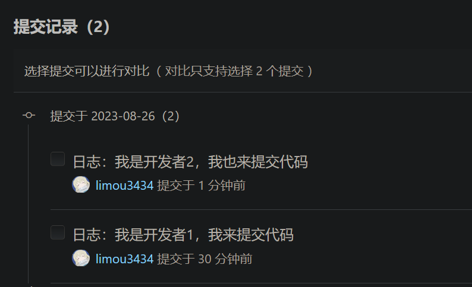

`debug` 的最后一次提交就已经是我们所要的完整代码了。

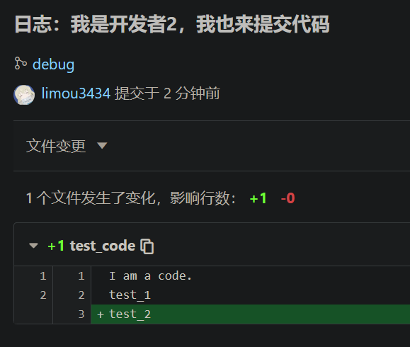

#### 10.1.1.5.合并到 master

此时 `debug` 远端分支已经准备完毕，但是 `master` 远端分支还没有修改成功。

此时有两种做法：

##### 10.1.1.5.1.做法一

一种是直接在本地合并然后 `push` 到远端仓库。

1. 首先是将 `master` 分支合并到 `debug` 分支，避免 `debug` 分支和 `master` 分支发生冲突（因为还有其他分支的存在）

2. 切换到 `master`，通过 `pull` 保持最新，然后在本地的 `debug` 上解决冲突

3. 将 `debug` 分支合并到 `master` 分支，此时 `master` 就有了修改

4. 然后进行 `push` 即可

5. 此时远端和本地 `debug` 分支就没有用了，可以在远端仓库中删除和在本地仓库使用 `git branch -d debug`

6. 最后两名开发者同时使用 `pull` 命令

##### 10.1.1.5.2.做法二

另外一种方法就是在 `gitee` 提交 `PR` 合并申请单，由管理员来做审核后来 `merge`（可以直接在远端仓库上操作，这种方式更加安全）。


### 10.1.2.多人协作二（私有分支）

目标：远程 `master` 分支下新增 `function1` 和 `function2` 文件。

1. 实现：由开发者 `1` 新增 `function1` 文件，由开发者 `2` 新增 `function2` 文件。

2. 条件：在不同分支下协作完成（每个开发者有自己的分支，或者一个分支一个功能）。

首先要明白有两种方法：

1. 创建远端分支（正式工作时推荐，可以保证一定是基于远端 `master` 上最新的代码）

2. 创建本地分支然后 `push`（基于本地 `master` 分支不一定是最新的代码）

但是我们在本次演示中使用第二种方法。

#### 10.1.2.1.开发者 1

1. `pull` 后创建基于 `master` 本地分支的 `feature-1` 本地分支，此时就没有办法使用链接了，因为我们没有在远端仓库创建远端分支，没有办法链接，因此我们现在的状态是没有办法使用短命令的。

2. 然后创建一个 `function1` 文件，内部写入内容

3. 然后使用 `add` 和 `commit` 命令

4. 由于没有链接（也无法链接，远端仓库没有远端分支），所以要使用长命令，`git push origin feature-1` 直接将本地分支推送到远端仓库，可以给远端仓库创建远端分支。

```bash
//开发者1
$ git pull

$ git checkout -b feature-1
Switched to a new branch 'feature-1'
$ git branch
* feature-1
  master

$ vim function1

$ git add --all
$ git commit -m "日志：开发者1的function1文件"
$ git push origin feature-1
```

此时就可以看到远端仓库多了一个远端分支。


#### 10.1.2.2.开发者 2

1. 此时开发者 `2` 也进行一样的工作，但是此时 `master` 本地分支不是最新的，因此就需要在 `master` 本地分支上 `pull`。

2. 剩下的工作就和开发者 `1` 是一样的

```bash
//开发者2
$ git branch
* master
$ git branch -r
  origin/HEAD -> origin/master
  origin/master

$ git pull

$ git branch
* master
$ git branch -r
  origin/HEAD -> origin/master
  origin/feature-1
  origin/master

$ git checkout -b feature-2 
Switched to a new branch 'feature-2'

$ vim function2

$ git add --all
$ git commit -m "日志：开发者2的function2文件" 
$ git push origin feature-2
```

此时就可以看到远端仓库又多了一个远端分支。


#### 10.1.2.3.合并到 master

假设这个时候有一种情况，开发者 `2` 发生意外情况，没有办法现在合并到 `master` 远端分支。

1. 此时开发者 `1` 使用 `git pull` 把开发者 `2` 创建的远端分支 `feature-2` 拉取过来（这里之所以可以直接使用短命令，是因为：a.拉取分支内的内容才需要的建立链接 b.但是拉取远端仓库内容的时候就不需要建立链接）

2. 开发者 `1` 新使用命令 `git checkout -b feature-2 origin/feature-2` 创建、链接并且切换到一个 `feature-2` 的本地分支。

3. 这个时候开发者 `1` 就拥有了开发者 `2` 的文件，可以继续帮开发者 `2` 继续开发（比如加入某些代码或删除，然后再 `add` 和 `commit`，并且直接使用短命令 `push` 即可）

4. 如果后续开发者 `2` 回来了，就需要再一次将 `feature-2` 和 `origin/feature-2` 进行链接，然后 `pull` 将开发者 `1` 帮忙的部分从远端分支拉取

```bash
//开发者1
$ git pull
$ git branch -a

* feature-1
  master
  remotes/origin/HEAD -> origin/master
  remotes/origin/feature-1
  remotes/origin/feature-2
  remotes/origin/master

$ git checkout -b feature-2 origin/feature-2
Branch feature-2 set up to track remote branch feature-2 from origin.
Switched to a new branch 'feature-2'
$ git branch -a
  feature-1

* feature-2
  master
  remotes/origin/HEAD -> origin/master
  remotes/origin/feature-1
  remotes/origin/feature-2
  remotes/origin/master

$ git vim function2

$ git add --all
$ git commit -m "日志：开发者1帮助开发者2的开发"
$ git push
```

此时远端仓库就有了推送

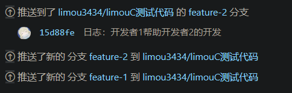

```bash
$ git branch --set-upstream-to=origin/feature-2 feature-2
$ git pull
```

此时开发者 `2` 就可以看到开发者 `1` 半自己开发的部分了。

5. 开发者 `2` 还可以继续进行自己的开发，照常使用 `add` 和 `commit` 和短命令 `push` 即可

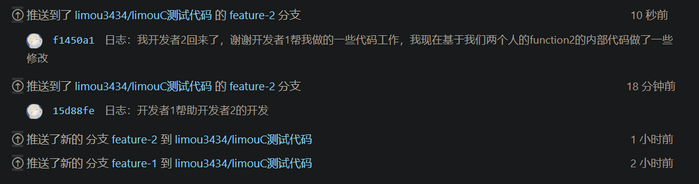

6. 现在在远端仓库中，有两个新增加的分支，并且两名开发者都准备好各自的私有分支内的代码文件，最后只需要提交 `PR` 给管理者，管理员再远程仓库上做代码审核和冲突修改和分支合并即可

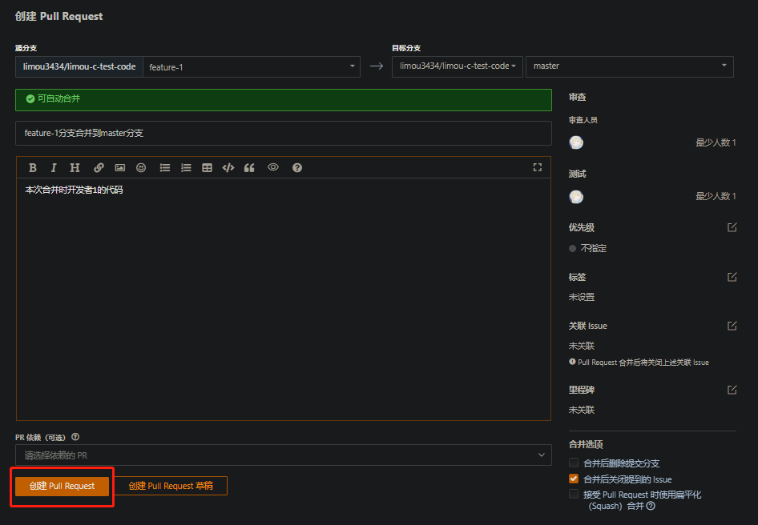

7. 此时由审查员和测试员通过审查和测试才可以正式合并进 `master`，此时就完成了合并

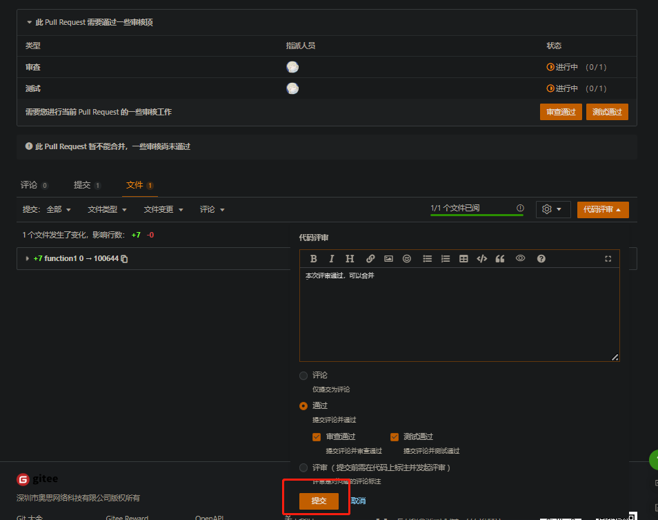


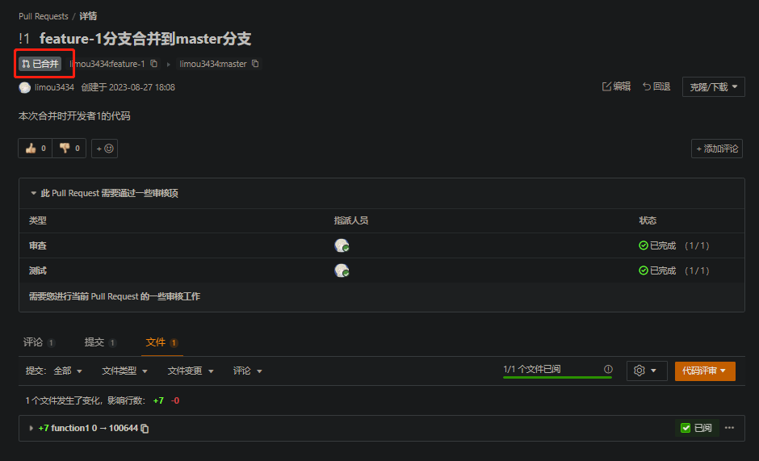

8. 此时对于开发者 `2` 来说，理论上也是可以像开发者 `1` 一样操作的，但是有可能发生冲突，因此最好是在本地将远端分支最新的 `master` 合并进来，防止冲突在 `master` 上解决，然后使用长命令 `push`（分支合并会自动 `commit`），再提交 `PR` 上去。

```bash。
$ git checkout master

$ git pull
$ git branch
  debug
  feature-2
* master

$ git checkout feature-2

$ git merge master
//然后解决冲突

$ git push origin feature-2
```

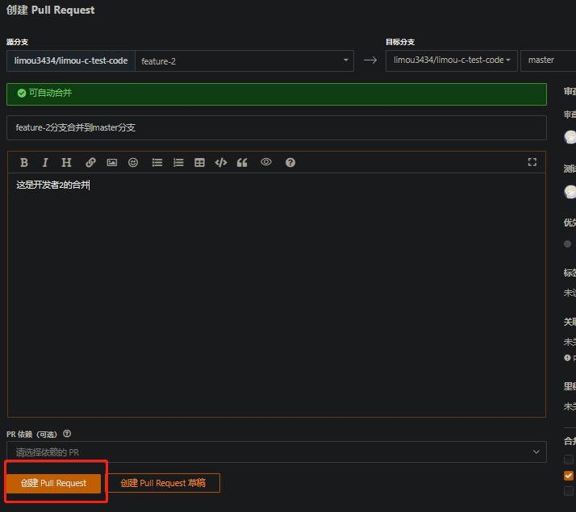


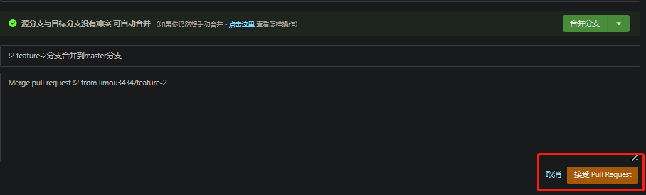

### 10.1.3.远程分支删除后...

前面开发者 `1` 和开发者 `2` 开发完后，假设开发者 `2` 因为请假次数太多被辞了（悲痛\~），这个时候管理者也把他的远端工作分支删除了，但是这个时候我们会发现一个问题：在本地使用 `git branch -a/-r` 依旧可以看到这个远端分支。


```bash
$ git branch -a
  feature-1
  feature-2
* master
  remotes/origin/HEAD -> origin/master
  remotes/origin/feature-1
  remotes/origin/feature-2
  remotes/origin/master
```

那么这么办呢？可以使用 `git remote show origin`，该命令用于显示远程仓库 `origin` 的详细信息，包括该远程仓库与本地仓库的分支关联、最新提交等。

```bash
$ git remote show origin
* remote origin
  Fetch URL: https://gitee.com/limou3434/limou-c-test-code.git
  Push  URL: https://gitee.com/limou3434/limou-c-test-code.git
  HEAD branch: master
  Remote branches:
    feature-1                     tracked
    master                        tracked
    refs/remotes/origin/feature-2 stale (use 'git remote prune' to remove)
  Local branches configured for 'git pull':
    feature-2 merges with remote feature-2
    master    merges with remote master
  Local refs configured for 'git push':
    feature-1 pushes to feature-1 (up to date)
    master    pushes to master    (up to date)
```

这里就有提示使用 `git remote prune [远端仓库名]` 去移除旧分支，即可裁剪掉显示在本地机器的旧的远端分支。

## 10.2.大型团队开发

### 10.2.1.协作模式

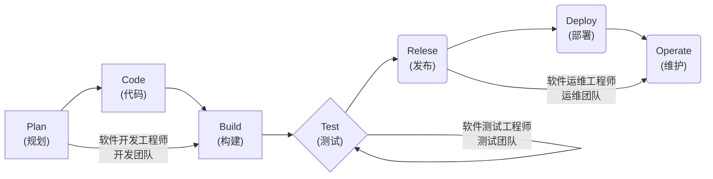
```mermaid
graph LR
A["Plan<br/>(规划)"] --> B["Code<br/>(代码)"] --> C["Build<br/>(构建)"] --> D{"Test<br/>(测试)"} --> E("Relese<br/>(发布)") --> F("Deploy<br/>(部署)") --> G("Operate<br/>(维护)")

A -->|"软件开发工程师<br/>开发团队"|C

D -->|"软件测试工程师<br/>测试团队"|D
E -->|"软件运维工程师<br/>运维团队"|G
%% 开发流程图
```

在传统的 `IT` 组织下，开发团队（`Dev`）和运维团队（`Ops`）之间的诉求会矛盾：

1. 开发团队追求变化（尤其是追求敏捷编程思想的），可能需要持续交付作为目标

2. 运维团队追求稳定，可能强调稳定且变更控制

这就会导致一道无形的”墙“被堆积起来，不利于 `IT` 价值的最大化，为了解决这一鸿沟，就需要在企业文化、开发工具、和代码实践等方面做变革——`DevOps(重视“软件开发人员”和“运维技术人员”之间沟通的文化、运动、惯例)` 出现了。通过自动化的“软件交付”和“架构变更”的流程，来使得构造、测试、发布软件可以快捷、频繁、可靠。

在 `DevOps` 开发过程中包含 `计划、编码、构建、测试、预发布、发布、运维、监控`。

而做到 `DevOps` 就极其需要类似 `Git` 这样可以快速迭代版本和维护不同版本的。

### 10.2.2.开发环境

对于开发人员来说有几个常用的环境需要了解：

1. 开发环境：是程序员专门用于日常开发的服务器，为了开发调试方便，一般打开全部错误报告和测试工具，是最基础的环境。

2. 测试环境：一个程序在测试工作不正常，那么就不可以发布到生产机上。该环境是开发环境到生产环境的过度环境。

3. 预发布环境：该环境是为避免因测试环境和线上环境的差异带来的缺陷而设立的环境。其配置等基本和生产环境一致，目的就是让正式开发的时候更有把握。所以预发布环境是你的产品质量的最后一道防线，下一步项目就要上线了。要注意预发布环境的服务器不再线上集成服务器的范围之内，是单独的一些机器。

4. 生产环境：是指正式提供对外服务的线上环境，在 `PC` 端和手机端能访问到的 `APP` 基本都是生产环境。

5. 灰度环境：有的大公司还存在灰度环境或者叫仿真环境。

6. 其他环境：...

### 10.2.3.分支规范

环境有了概念之后，`Git` 分支就会根据不同的环境进行规范设计。

一般来说：

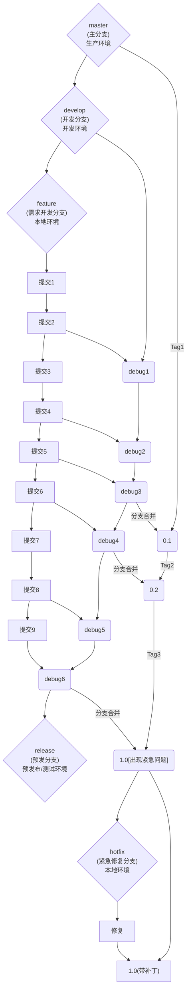
```mermaid
graph TD
ho{"hotfix<br/>(紧急修复分支)<br/>本地环境"}
re{"release<br/>(预发分支)<br/>预发布/测试环境"}
fe{"feature<br/>(需求开发分支)<br/>本地环境"}
de{"develop<br/>(开发分支)<br/>开发环境"}
ma{"master<br/>(主分支)<br/>生产环境"}

%%hotfix分支
ho --> h1["修复"]
m3 --> ho
h1 --> m4

%%release分支
d6 --> re

%%feature分支
fe --> f1["提交1"] -->f2["提交2"] -->f3["提交3"] -->f4["提交4"] -->f5["提交5"] -->f6["提交6"] -->f7["提交7"] -->f8["提交8"] -->f9["提交9"]
de -->fe
f2 --> d1
f4 --> d2
f5 --> d3
f6 --> d4
f8 --> d5
f9 --> d6

%%develop分支
de -->d1("debug1") --> d2("debug2") --> d3("debug3") --> d4("debug4") --> d5("debug5") --> d6("debug6")

d3 -->|"分支合并"|m1
d4 -->|"分支合并"|m2
d6 -->|"分支合并"|m3

%%master分支
ma -->|"Tag1"|m1("0.1") -->|"Tag2"|m2("0.2") -->|"Tag3"|m3("1.0[出现紧急问题]") --> m4["1.0(带补丁)"]
ma -->de


```

> 注意：以上只是常用的 `Git Flow` 模型，真实环境由企业而定。

#### 10.2.3.1.master 分支

1. 给分支为只读分支，并且只有一个，用于部署到正式发布环境，由合并 `release` 分支得到

2. 主分支作为稳定的唯一代码，任何情况下不允许直接在 `master` 上修改代码

3. 产品功能全部实现后，最终在 `master` 分支对外发布，另外所有在 `master` 的推送都应该打上 `tag` 记录，方便追朔（也就是发布一次就要打上标签）

4. `master` 分支不可删除

#### 10.2.3.2.develop 分支

1. `develop` 分支作为开发分支，是基于 `master` 分支创建的只读唯一分支，始终保持最新完成的 `bug` 修复后的代码，可部署到开发环境对应集群

2. 可根据需求大小程度确定是由 `feature` 分支合并，还是直接在上面开发（后者不太推荐）

#### 10.2.3.3.feature 分支

1. `feature` 分支通常都作为新功能和新特性开发分支，是以 `develop` 分支为基础创建的

2. 命名一般以 `feature/` 开头，建议的命名规范为：`feature/user_createtime_feature`

3. 新功能开发完成后，开发者需要将 `feature` 分支合并到 `develop` 分支

4. 一旦新需求发布上线后，便要将该分支删除

#### 10.2.3.4.release 分支

1. `release` 分支为预发布分支，基于本次上线所有的 `feature` 分支合并到 `develop` 分支后，再基于 `develop` 分支创建，可以部署到测试或预发布集群

2. 命名也有规范，一般 `release/` 开头，建议命名规则为：`release/version_publishtime`

3. `release` 分支主要用于提交给测试人员进行功能测试。发布提测阶段，会以 `release` 分支为基准进行提测

4. `release` 分支测试出问题，则需要回归 `develop` 分支查看是否存在此问题

5. `release` 分支属于临时分支，产品上线后可以选择删除

#### 10.2.3.5.hotfix 分支

1. `hotfix` 分支是线上出现紧急 `bug` 问题时，提交补丁时使用，又叫”补丁分支“，需要基于 `master` 分支创建 `hotfix` 分支

2. 命名 `hotfix/` 开头，建议命名规范为：`hotfix/user_createtime_hotfix`

3. 当问题修复完成后，需要合并到 `develop` 分支并推送到远程。一旦修复测试通过，就通过 `develop` 远端合并到 `master` 远端分支，并且结束后需要将其删除

还有一些其他的大企业有不同的模型。

### 10.2.4.管理实战

#### 10.2.4.1.创建账号

创建两个 `Gitee` 账号，一个为公司老板账号 `limou3434`，一个为员工账号 `Dimou3434`（绑定不同的邮箱）。

并且最好准备两个浏览器，一个登录老板账号，一登录员工账号。

最好准备一个本地机器和服务器（模拟老板和员工各自的本地环境，有其他方案替代也可以......）

#### 10.2.4.2.创建企业空间

首先我们需要创建一个企业空间，并且创建好空间内的仓库。

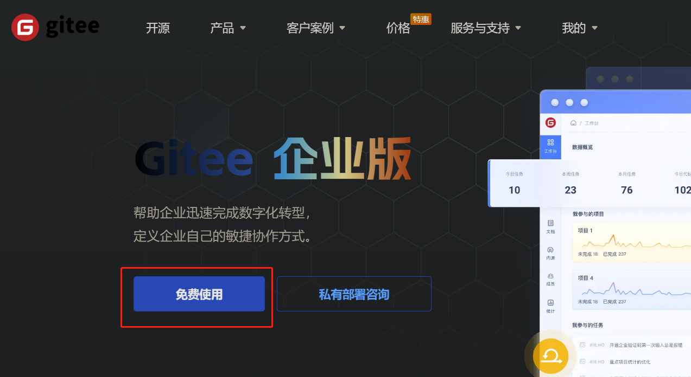


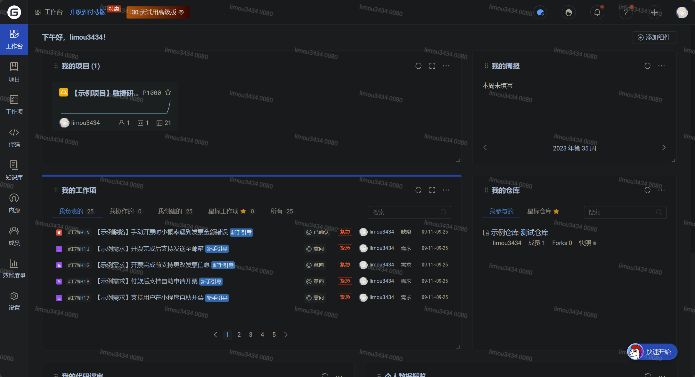

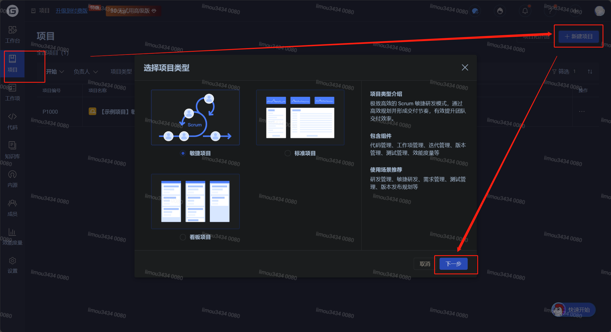


一个企业会有多个项目，在一个项目中需要多个仓库，这里我们可以先建立一个仓库。


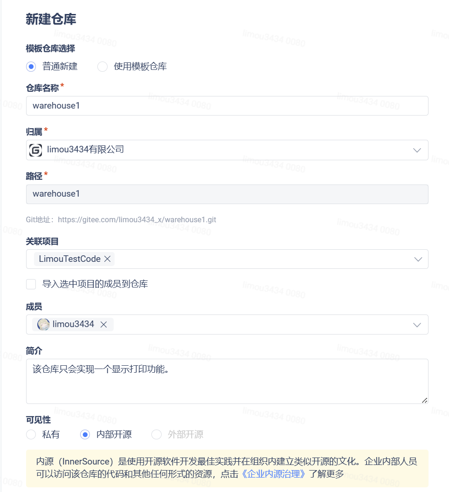


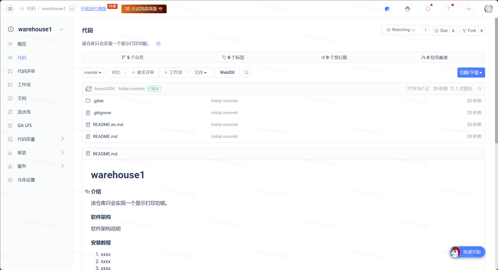

发送员工邀请链接，让一名员工进来企业空间。


另外一名员工在登录自己 `gitee` 账号后，需要打开该链接填写姓名后加入。


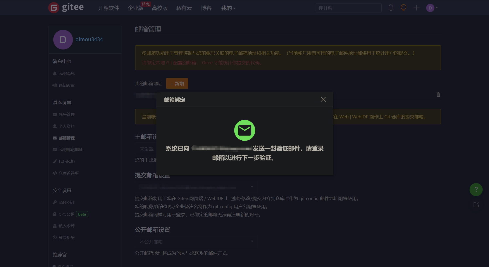

同意员工加入。

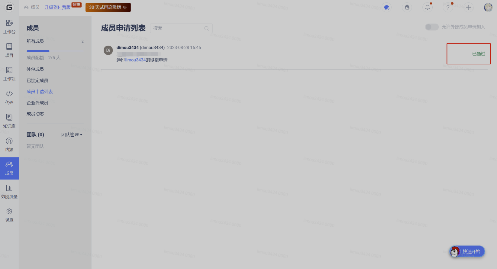

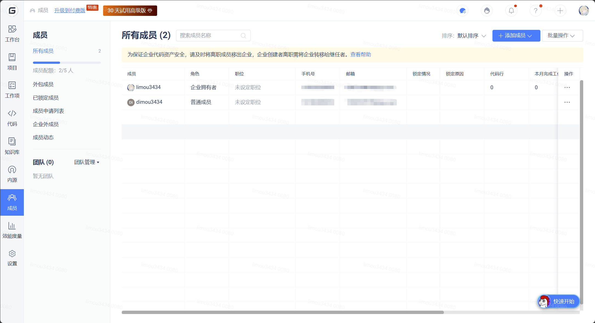

项目和仓库也需要设置成员，这样相关的成员才可以使用该仓库的部分权限。

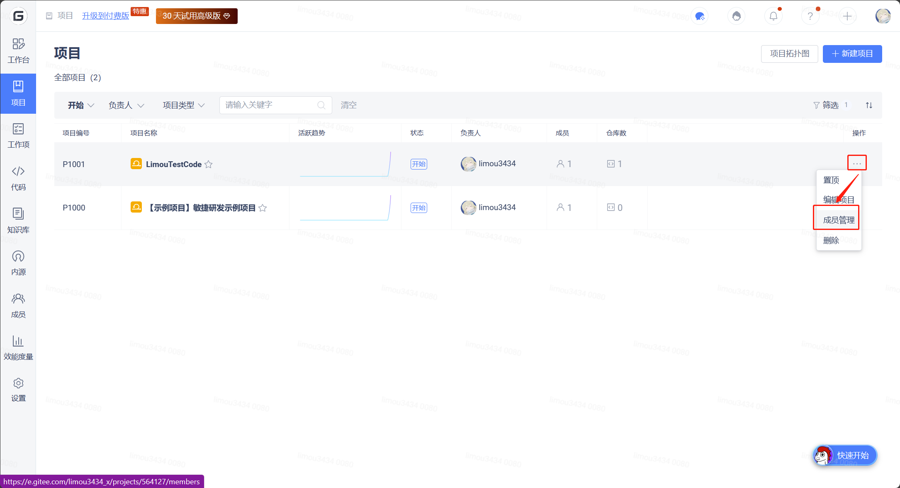


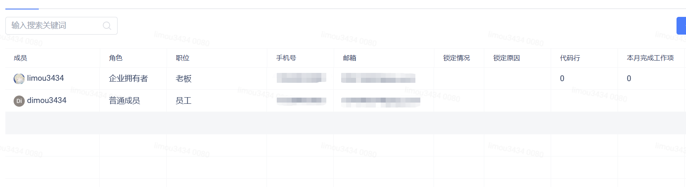

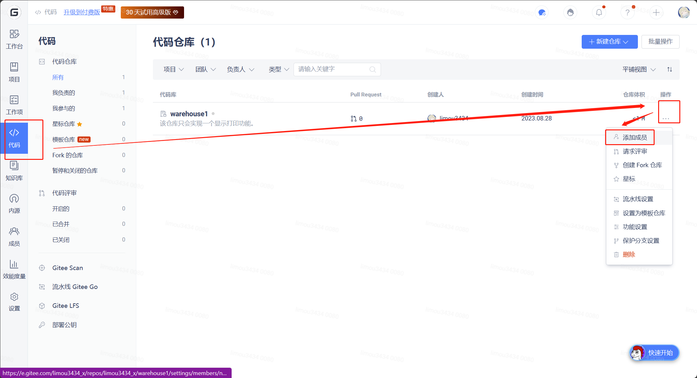


#### 10.2.4.3.分支管理

此时我们设置的库有默认有 `5` 个分支，然后拉取到本地，创建 `featrue` 本地分支后，在上面进行开发，然后关联远端分支 `featrue` 进行提交。

老板在自己的企业空间上，检查提交，检查完成后，在远端仓库，把远端分支 `featrue` 的提交合并到远端分支 `develop` 上，老板为了规范，也”装模做样“的做了一次代码审核。

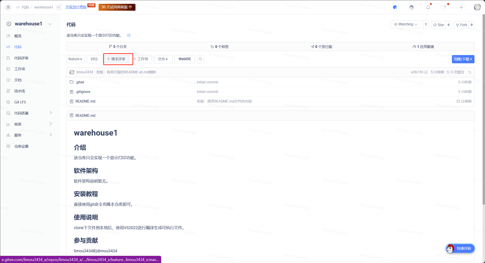


好了，老板自己审核好自己的代码后，进行了合并。

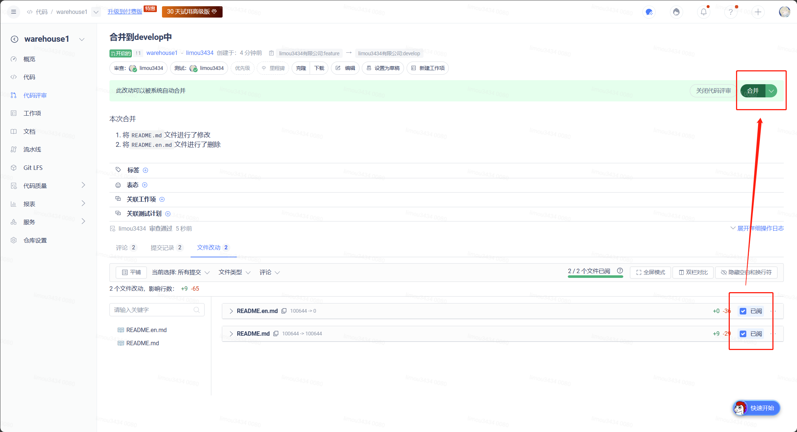

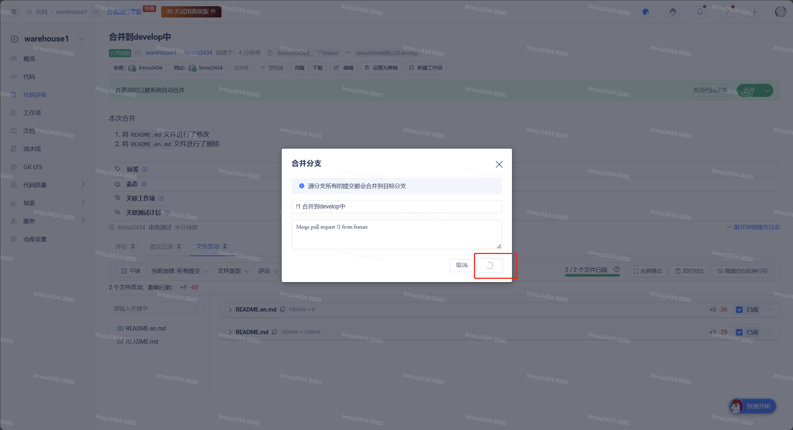


此时测试人员（假设是员工 `1`）需要测试老板的代码，那么就需要得到本地的 `release`，因此他需要先请求远端分支 `release` 是基于远端分支 `develop` 分裂出来的，因此提交了代码评审。

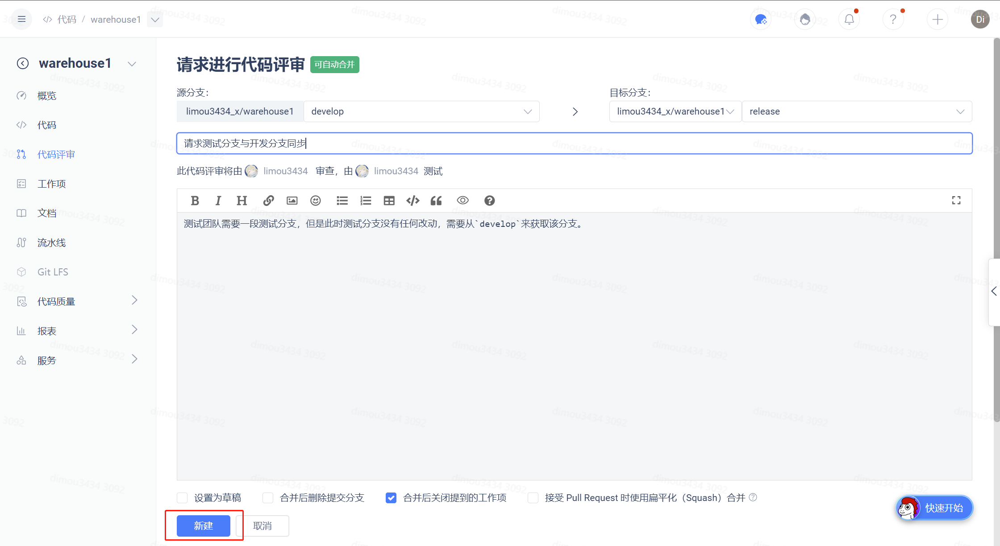


此时如果测试人员测试通过了老板的代码，那么就可以请求把 `release` 远端分支的代码和合并到 `master` 远端分支上的，员工使用 `PR` 告知老板，然后老板直接通过了该审查。


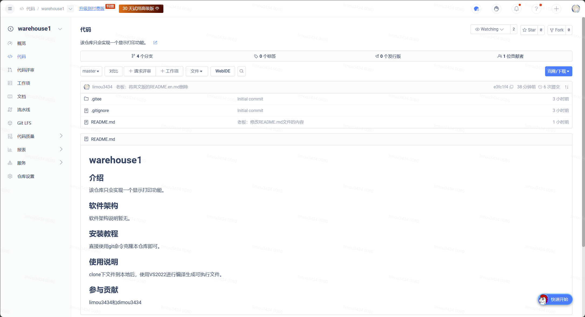

并且测试分支也被删除了。


当然，如果 `release` 远端分支出现了问题，就需要回去检查 `develop` 远端分支是否存在这个问题，如果有问题，就从 `feature` 远端分支上进行 `debug` 然后合并到 `develop` 远端分支，然后将新的 `develop` 分支合并到 `release` 远端分支，在进行测试，知道没有 `bug`。

剩下的几个分支和相关流程实际上和我们之前讲的大差不差，您可以自己试一试......

> [!WARNING]
>
> 注意：最后再强调一遍，只有适合自己团队的分支模型，而没有最完美的分支模型。

### 10.2.5.代码部署

这个可以在 `流水线` 里研究（不过在 `gitee` 上是需要付费的），相关的操作请查看 `gitee` 的 [文档](https://help.gitee.com/repository)。

# 11.Git 拓展知识

## 11.1.代码仓库原则

关于 `git` 的 `Monorepos` 和 `Multirepos` 的争论，您可以简单看一下这篇 [git 单一代码库 Monorepo](https://www.jianshu.com/p/c10d0b8c5581) 来了解一下，不过相关的企业实践我也没有太多的经历，以后有机会在进行补充...

## 11.2.代码仓库部署

实际上我们不依赖 `GitHub, Gitee` 这些代码仓库，也可以在自己部署的服务器之间进行协作，这方面可以 [查看阮一峰的最简单 Git 服务器文档](https://www.ruanyifeng.com/blog/2022/10/git-server.html)，待补充...

## 11.3.代码仓库模块

一个 `Git` 仓库通常只有一个 `.git` 文件，但是我们不得不复用一些第三方库，这些第三方库通常也是需要 `Git` 来管理的，这种情况下就有导致一个仓库中具备多个 `.git`，因此就必须设置子模块，否则就会造成错乱，待补充...

---

>   [!NOTE]
>
>   结语：...

**如果本系列文章对您有帮助，可以 [star 一下我的 limou-learn-note](https://github.com/xiaogithubooo/LimouLearnNote)，求求惹(๑＞ ＜)☆♡~**
