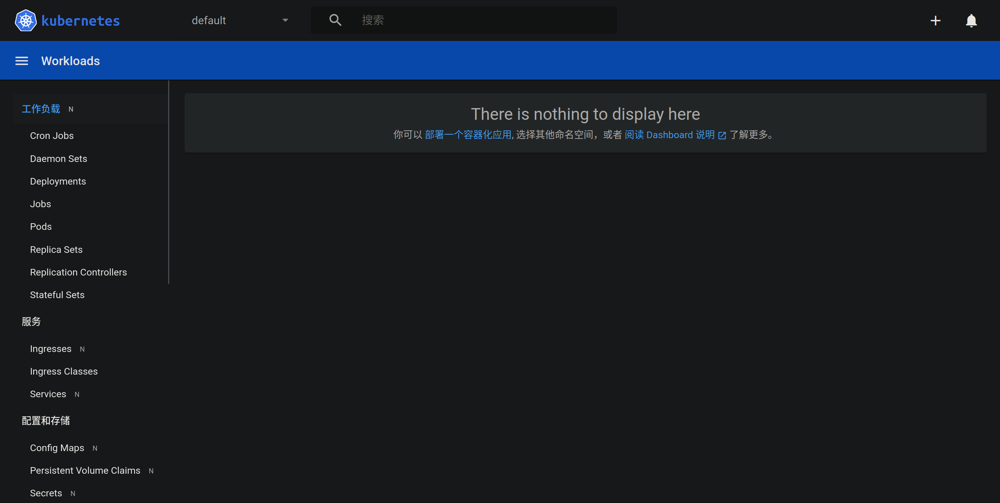
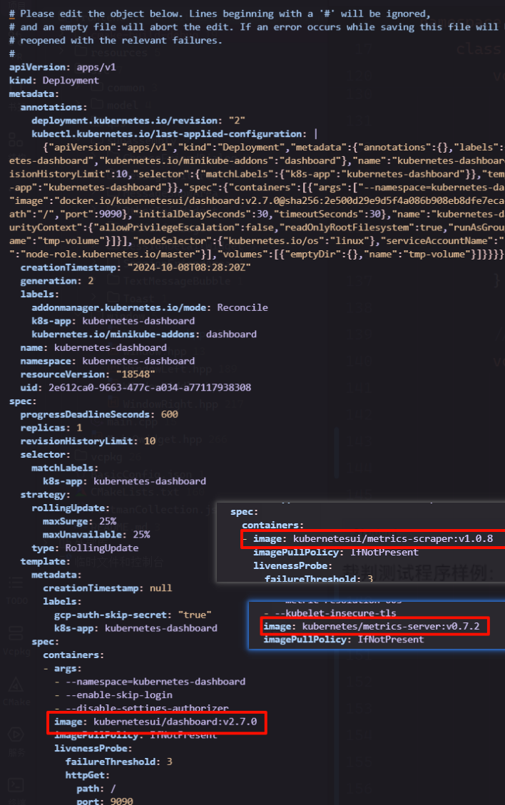

>   资料：
>
>   https://www.bilibili.com/video/BV1w4411y7Go/?vd_source=c92c89dbfcf9cc30c48086469621f35b 视频
>
>   https://minikube.sigs.k8s.io/docs/tutorials/ 教程
>
>   https://minikube.sigs.k8s.io/docs/handbook/ 手册

# 1.环境配置和软件安装

您必须先下载 `Docker` 后再来 [根据官方文档下载一些必要工具](https://kubernetes.io/docs/tasks/tools/)，统一下载后我们再来进行研究。

```shell
# 下载 kubectl 工具
sudo apt-get install -y apt-transport-https ca-certificates curl gnupg

curl -fsSL https://pkgs.k8s.io/core:/stable:/v1.31/deb/Release.key | sudo gpg --dearmor -o /etc/apt/keyrings/kubernetes-apt-keyring.gpg

sudo chmod 644 /etc/apt/keyrings/kubernetes-apt-keyring.gpg

echo 'deb [signed-by=/etc/apt/keyrings/kubernetes-apt-keyring.gpg] https://pkgs.k8s.io/core:/stable:/v1.31/deb/ /' | sudo tee /etc/apt/sources.list.d/kubernetes.list

sudo chmod 644 /etc/apt/sources.list.d/kubernetes.list

sudo apt-get update

sudo apt-get install -y kubectl

```

```shell
# 下载 minikube 集群管理工具
curl -LO https://storage.googleapis.com/minikube/releases/latest/minikube_latest_amd64.deb

sudo dpkg -i minikube_latest_amd64.deb

minikube version
minikube version: v1.34.0
commit: 210b148df93a80eb872ecbeb7e35281b3c582c61
```

```shell
# 下载 kind 集群管理工具
wget https://golang.org/dl/go1.20.linux-amd64.tar.gz

sudo tar -C /usr/local -xzf go1.20.linux-amd64.tar.gz

echo 'export PATH=$PATH:/usr/local/go/bin' >> ~/.bashrc # 看终端

source ~/.bashrc

go version

go install sigs.k8s.io/kind@v0.24.0

echo 'export PATH=$PATH:$(go env GOPATH)/bin' >> ~/.bashrc
source ~/.bashrc

kind --version
kind version 0.24.0

```

简单提及一下 `minilube` 和 `kind` 可以提供 `k8s` 集群环境（相当于集群脚手架），而 `kubectl` 负责操作和管理该 `k8s` 集群的资源。

>   补充：除此以外，还有一些别的集群脚手架，例如 `K3s、Microk8s`。

# 2.初步使用工具搭建集群

## 2.1.minilube 的初始

这里我使用 `minilube` 来学习 `k8s`。

```shell
# 使用 minilube 初始化集群
$ sudo usermod -aG docker $USER
$ newgrp docker
$ minikube start
# 实际上 minikube start  这个指令拉取了镜像文件(默认使用 Docker)
# 可以使用 sudo docker image 来查看拉取的镜像文件如下
# gcr.io/k8s-minikube/kicbase   v0.0.45   aeed0e1d4642   4 weeks ago   1.28GB
# gcr.io/k8s-minikube/kicbas 这个基础镜像内部包含了运行 k8s 的基础工具), 适用于 Minikube 的 KIC 功能(Kubernetes In Docker, 一个在 Docker 容器中运行 Kubernetes 的方法), minikube start 还会启动这个镜像为容器, 方便开发者进行集群部署, 您可以使用 sudo docker container ls 进行查看

# minikube stop # 停止集群
# minikube delete # 删除集群
# 可以配置 alias kubectl="minikube kubectl --" 提高终端体验, Minikube 自带一个 kubectl 客户端, 和 Minikube 兼容性较好, 这也是一个最佳实践

```

## 2.2.minilube 的操作

### 2.2.1.minilube 的原理

实际上在 `minilube` 中使用的 `k8s` 是装载进一个容器中运行的，而容器内部又下载了镜像文件，运行了多个子容器。因此，如果环境不支持嵌套虚拟化，则没办法运行 `minilube` 工具。

### 2.2.2.minilube 的查看

```shell
# 查看集群
$ kubectl cluster-info # 显示 Kubernetes 集群的基本信息

$ kubectl get pods --all-namespaces # 查看所有的 pod, pod 通常代表 k8s 中的一个最小调度单位(可以由一个或多个容器组成), 可以理解为一个逻辑主机, 拥有唯一的 ip 地址, 共享网络端口资源, 共享存储卷资源, 简化指令为 kubectl get pod -A
NAMESPACE     NAME                               READY   STATUS    RESTARTS      AGE
kube-system   coredns-6f6b679f8f-lsczv           1/1     Running   0             76m
kube-system   coredns-6f6b679f8f-x62pf           1/1     Running   0             76m
kube-system   etcd-minikube                      1/1     Running   0             76m
kube-system   kube-apiserver-minikube            1/1     Running   0             76m
kube-system   kube-controller-manager-minikube   1/1     Running   0             76m
kube-system   kube-proxy-82hjt                   1/1     Running   0             76m
kube-system   kube-scheduler-minikube            1/1     Running   0             76m
kube-system   storage-provisioner                1/1     Running   2 (76m ago)   76m
# 这些 pod 其实就是 gcr.io/k8s-minikube/kicbase 镜像运行为容器后中的子容器
```

### 2.2.3.minilube 的启停

```shell
# 启停容器
$ minikube pause # 暂停集群
$ minikube unpause # 启动集群
$ minikube stop # 停止集群(就相当于关闭容器的运行)

```

### 2.2.4.minilube 的插件

```shell
# 使用插件
$ minikube addons list # 浏览插件
$ minikube addons enable dashboard # 打开其中一个插件
$ minikube dashboard # 启动插件
# 这将在本地部署一个面板网站, 在浏览器中访问返回的地址即可打开该面板
```



>   补充：解决代理问题，我这里刚好有三个镜像是拉取失败的。
>
>   ```shell
>   # 解决远端镜像问题
>   # 进入 minikube ssh 终端
>   $ minikube ssh
>   
>   # 在一些国内存储库中(例如阿里云)拉取镜像文件
>   $ docker pull registry.cn-hangzhou.aliyuncs.com/google_containers/metrics-server:v0.7.2
>   $ docker tag registry.cn-hangzhou.aliyuncs.com/google_containers/metrics-server:v0.7.2 kubernetes/metrics-server:v0.7.2
>   
>   $ docker pull registry.cn-hangzhou.aliyuncs.com/google_containers/dashboard:v2.7.0
>   $ docker tag registry.cn-hangzhou.aliyuncs.com/google_containers/dashboard:v2.7.0 kubernetesui/dashboard:v2.7.0
>   
>   
>   # 修改镜像拉取策略, 优先使用本地镜像而不是拉取远端镜像
>   $ kubectl edit deployment kubernetes-dashboard -n kubernetes-dashboard
>   $ kubectl edit deployment dashboard-metrics-scraper -n kubernetes-dashboard
>   $ kubectl edit deployment metrics-server -n kube-system
>   # 如下图红框处进行修改
>   
>   ```
>
>   
>
>   ```shell
>   # 退出 检查此时的状态是否都为 runing
>   $ exit
>   
>   $ kubectl get pod -A
>   NAMESPACE              NAME                                        READY   STATUS    RESTARTS       AGE
>   kube-system            coredns-6f6b679f8f-lsczv                    1/1     Running   11 (62m ago)   6h36m
>   kube-system            coredns-6f6b679f8f-x62pf                    1/1     Running   11 (62m ago)   6h36m
>   kube-system            etcd-minikube                               1/1     Running   11 (63m ago)   6h36m
>   kube-system            kube-apiserver-minikube                     1/1     Running   11 (62m ago)   6h36m
>   kube-system            kube-controller-manager-minikube            1/1     Running   12 (63m ago)   6h36m
>   kube-system            kube-proxy-82hjt                            1/1     Running   11 (63m ago)   6h36m
>   kube-system            kube-scheduler-minikube                     1/1     Running   11 (63m ago)   6h36m
>   kube-system            metrics-server-667d84658b-k82fh             1/1     Running   0              98s
>   kube-system            storage-provisioner                         1/1     Running   20 (61m ago)   6h36m
>   kubernetes-dashboard   dashboard-metrics-scraper-6fb8867c9-cw57k   1/1     Running   0              8m17s
>   kubernetes-dashboard   kubernetes-dashboard-6b7bbd4ddc-tx7vt       1/1     Running   0              30m
>   
>   $ minikube dashboard # 非常完美运行起来...
>   🤔  正在验证 dashboard 运行情况 ...
>   🚀  正在启动代理...
>   🤔  正在验证 proxy 运行状况 ...
>   🎉  正在使用默认浏览器打开 http://127.0.0.1:33045/api/v1/namespaces/kubernetes-dashboard/services/http:kubernetes-dashboard:/proxy/ ...
>   Failed to open display
>   Warning: failed to launch javaldx - java may not function correctly
>   
>   ```
>
>   其他情况下也都可以这么进行配置...

