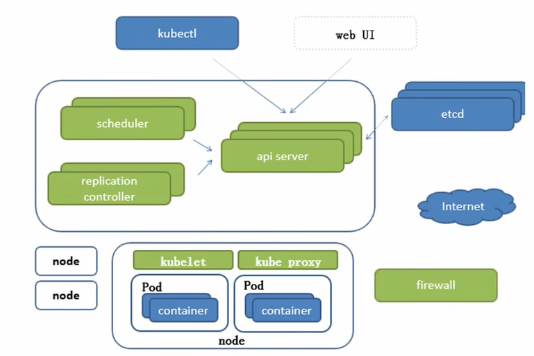

>   资料：
>
>   https://www.bilibili.com/video/BV1w4411y7Go/?vd_source=c92c89dbfcf9cc30c48086469621f35b 视频
>
>   https://minikube.sigs.k8s.io/docs/tutorials/ 教程
>
>   https://minikube.sigs.k8s.io/docs/handbook/ 手册

# 1.历史发展

集群管理（资源管理）=Apche MESOS（开源分布式管理框架，被推特使用）->Apche MESOS 平台管理 Kubernetes，可以结合使用->Docker Swarm（非常轻量，专为 docker 容器准备，但是依旧不如 k8s，功能对于企业过于局限，但是不是不好用，有一个人通过捐赠得到了一个上千万的集群，可以搜索一下）->Kubernetes（由谷歌内部的 borg 使用 go 翻写而来，本身也是轻量级，开源，弹性伸缩，自动负载均衡，支持 `IPVS`）。

待补充...

# 2.相关的环境配置和软件安装

您必须先下载 `Docker` 后再来 [根据官方文档下载一些必要工具](https://kubernetes.io/docs/tasks/tools/)，统一下载后我们再来进行研究。

```shell
# 下载 kubectl 集群管理工具
sudo apt-get install -y apt-transport-https ca-certificates curl gnupg

curl -fsSL https://pkgs.k8s.io/core:/stable:/v1.31/deb/Release.key | sudo gpg --dearmor -o /etc/apt/keyrings/kubernetes-apt-keyring.gpg

sudo chmod 644 /etc/apt/keyrings/kubernetes-apt-keyring.gpg

echo 'deb [signed-by=/etc/apt/keyrings/kubernetes-apt-keyring.gpg] https://pkgs.k8s.io/core:/stable:/v1.31/deb/ /' | sudo tee /etc/apt/sources.list.d/kubernetes.list

sudo chmod 644 /etc/apt/sources.list.d/kubernetes.list

sudo apt-get update

sudo apt-get install -y kubectl

```

```shell
# 下载 kubeadm 集群构建工具
sudo apt install -y apt-transport-https ca-certificates curl
curl -s https://packages.cloud.google.com/apt/doc/apt-key.gpg | sudo apt-key add -
cat << EOF | sudo tee /etc/apt/sources.list.d/kubernetes.list
deb https://apt.kubernetes.io/ kubernetes-xenial main
EOF

sudo apt update
sudo apt install -y kubelet kubeadm kubectl
sudo swapoff -a # 永久 sudo nano /etc/fstab 注释掉 "# /swapfile none swap sw 0 0"
sudo kubeadm init --pod-network-cidr=10.244.0.0/16
```

```shell
# 下载 minikube 集群构建工具
curl -LO https://storage.googleapis.com/minikube/releases/latest/minikube_latest_amd64.deb

sudo dpkg -i minikube_latest_amd64.deb

minikube version
minikube version: v1.34.0
commit: 210b148df93a80eb872ecbeb7e35281b3c582c61
```

```shell
# 下载 kind 集群构建工具
wget https://golang.org/dl/go1.20.linux-amd64.tar.gz

sudo tar -C /usr/local -xzf go1.20.linux-amd64.tar.gz

echo 'export PATH=$PATH:/usr/local/go/bin' >> ~/.bashrc # 看终端

source ~/.bashrc

go version

go install sigs.k8s.io/kind@v0.24.0

echo 'export PATH=$PATH:$(go env GOPATH)/bin' >> ~/.bashrc
source ~/.bashrc

kind --version
kind version 0.24.0

```

简单提及一下，`kubeadm`、`minilube`、`kind` 可以提供 `k8s` 集群环境（相当于集群脚手架），而 `kubectl` 负责操作和管理该 `k8s` 集群的资源。

>   补充：除此以外，还有一些别的集群脚手架，例如 `K3s、Microk8s`。

而还有个比较硬伤的问题，就是物理机器越多越好，我这里有 `5` 台物理机器可以供我实验，且都是服务器。

# 3.k8s 的基础使用

## 3.1.k8s 的前世今生

`k8s` 可以说是 `Borg` 的加强版本，并且使用 `Go` 进行重构而来。


上图就是 `Borg` 的设计架构图。`BorgMaster(主节点)` 通过 `scheduler(调度器)`，来进行请求分发（并且一般是有多个副本，并且最好是奇数节点，避免出现“平局”的现象），而工作的节点就是一系列的 `Borglet(工作节点)`。

而这里有三种访问 `BorgMaster(主节点)` 的主要方法：

1.   配置文件读写
2.   命令行工具读写
3.   浏览器读写

其中 `scheduler(调度器)` 不会直接访问 `Borglet(工作节点)`，而是和 `Paxos(键值对数据库)` 进行交互，`Borglet` 就会从这个 `Paxos(键值对数据库)` 取出交给自己的请求进行消费。

而 `k8s` 架构图和上述类似。

## 3.2.k8s 的组件框架



上图就是 `k8s` 的设计架构图。`scheduler(调度器)` 会把任务交给 `api server(接口服务)`，`api server(接口服务)` 再把请求写入到 `etcd` 中。`replication controller(控制器)` 则用来控制 `api server(接口服务)` 副本的数量（此时可以动态修改副本数量，并且最好也是设置奇数个）。

因此这里也有三种访问 `api server(接口服务)` 的主要方式：

-   `etcd`  分布式键值对存储系统读写
-   `kubectl` 专用命令行工具读写
-   浏览器读写

这里还可以给出关于 `etcd` 的架构图。


因此都是 `C/S` 服务开发，`Raft` 是分布式的选举算法，通过选举领导的方式来处理写入请求。而为了防止数据损坏，还配备了 `WAL` 这种日志记录机制，防止数据的意外丢失。`Entry` 记录日志中的单个条目，包含一个操作或状态变更的具体信息，代表一个对状态机的修改。`Snapshot` 是状态机在某一时刻的完整快照，包含当前所有数据的状态，可以在系统恢复时避免重放所有的 `Entries`。最后才实际存储在 `Store` 中进行持久化。

>   补充：`WAL(Write-Ahead Logging, 预写日志)`是一种用于数据持久化的日志记录机制。在写入数据库之前，首先将数据变更记录到日志中。这种机制确保了在系统崩溃或故障后，可以通过回放日志来恢复数据的完整性。
>
>   `WAL` 的主要优点包括：
>
>   1.  **数据安全性** 在数据写入数据库之前，先记录到日志中，即使发生故障，也能通过日志恢复数据
>   2.  **性能提升** 批量写入时，可以先将日志写入内存，减少磁盘 `I/O` 操作，提高性能
>   3.  **一致性** 通过日志，确保数据变更操作的顺序一致，维护数据的一致性

>   补充：现在 `Etcd` 转而使用 `v3` 以上的版本，前面的版本已经被抛弃（ `v2` 版本几乎只把数据存储在内存中，`v3` 版本增加了关于存储卷的持久化方案）...

上述的所有重要组件都可以看作是 `k8s` 的主节点，接下来我们来看我们的工作节点。一个工作节点就是一个 `Node`，多个工作节点加上主节点就是一个 `k8s` 集群。而 `Node` 内部包含 `Kubelet(CRI, 容器/运行时环境/接口, 会维护和 Docker 容器的交互和操作)` 、`Kube proxy(负责处理集群中 Pod 的网络流量, 支持 ipvs 以及多种代理模式, 默认的操作对象是 firewail, 也就是防火墙去实现 Pod 的映射, 设置 IPTables、IPVS 实现服务映射访问`、`Pods(每个 Pod 内部包含多个容器, 可以是 Docker 容器)`。

>   补充：这里的 `api server(接口服务)` 非常繁忙（控制器、调度器、命令行工具、浏览器、存储系统、容器运行时接口、网络代理都需要访问），因此每个组件也可以在本地生成一定的缓存降低 `api server(接口服务)` 的压力（这种缓存机制可以由多种方案解决，比如设置缓存有效期 `TTL`，版本号时间戳确认请求，服务器事件驱动机制...）。不过这么讲有些简单，后面还会细细讲解...

>   补充：`IPVS(IP Virtual Server)`是一个 `Linux` 内核模块，提供基于 `IP` 的负载均衡功能。它通过将多个后端服务器（如 `Pod`）绑定到一个虚拟 `IP` 地址，实现负载均衡。
>
>   主要特点包括：
>
>   1.  **高性能**：`IPVS` 在内核中实现，能够处理大量并发连接，提供更高的性能和更低的延迟。
>   2.  **多种负载均衡算法**：支持多种负载均衡算法（如轮询、最少连接、加权轮询等），可以根据不同的场景选择合适的算法。
>   3.  **集成支持**：`Kubernetes` 中的 `Kube Proxy` 可以配置为使用 `IPVS` 模式，以便更高效地管理服务流量。
>
>   通过这些功能，`IPVS` 可以在大规模的分布式系统中有效地管理流量，提高应用的可用性和可靠性。

主要组件如上，但是还有一些非常重要的插件也值得一提。

- `CoreDNS` 可以为集群中的服务（`SVC, service, 服务, 在这里也就是一个 Pod 公开为网络服务`）创建一个域名服务器 `IP` 对应的解析
- `Dashboard` 可以 `k8s` 提供关于 `B/S` 架构的支持
- `Ingress Controller` 可以实现七层代理（官方只实现了四层）
- `Fedetation` 可以提供跨集群中心多 `k8s` 统一管理功能
- `Prometheus` 可以 `k8s` 集群的日志统一分析平台

## 3.3.k8s 的资源清单

在 `Kubernetes` 中，**资源清单** 指的是用于描述 `k8s` 集群中各类资源的声明性配置文件，通常以 `YAML` 或 `JSON` 格式编写。资源清单定义了集群中工作负载（如何运行、如何进行网络配置、如何管理存储和资源调度等。常见的资源清单类型：

1. **Pod**：最小的可调度单位，包含一个或多个容器
2. **Controller**：`Pod` 的控制器，管理 `Pod` 的生命周期
3. **Service**：将一组 `Pod` 公开为网络服务，允许其他服务或用户通过固定 `IP` 访问这些 `Pod`

我们来一个一个介绍...

### 3.3.1.Pod

`Pod` 可以分为两种：

- 自主式 `Pod`，生命周期结束后没有处理策略
- 控制器 `Pod`，生命周期结束后存在处理策略

而更加准确来说，`Pod` 只要运行起来，一定有一个容器被运行起来，而如果后续 `Pod` 中加入了其他容器，就必须保证这些容器使用一些相同的资源。这种做法就需要用一个 `Pause` 父容器来做到，它就相当于其他容器的父进程，可以共享给多个容器自己管理的资源（一般共享网络、共享存储卷）。

因此默认情况下，一个 `Pod` 内部的所有容器都共享相同的资源，但是 `Pod` 和 `Pod` 。

### 3.3.2.Controller

而 `Pod` 的控制器则可以分为以下几种：

- **ReplicationController / ReplicaSet [保证数量]**
  - `ReplicationController` 是 `k8s` 早期版本使用的控制器，用于确保指定数量的 `Pod` 实例在集群中始终保持运行状态（多则删，少则增）
  - `ReplicaSet` 是 `ReplicationController` 的改进版，功能类似，但提供了更灵活的标签选择器（`selectors`，这样就可以给 `Pod` 打上标签）。它的作用也是维持某个指定数量的 `Pod` 副本（`replicas`）运行，即使某些 `Pod` 崩溃或删除，`ReplicaSet` 会创建新的 `Pod` 来确保副本数恒定（但是一般还是会要求使用二十一时四十五分`Reployment` 来自动管理，因为有可能 `ReplicaSet` 不支持 `rolling-updata, 滚动更新`）
- **Deployment**
  - `Deployment` 是一种更高级的控制器，用于管理无状态应用的部署。它通常用于管理应用的滚动更新、回滚、扩展和其他运维任务
  -  `Deployment` 会创建一个 `ReplicaSet`，再由 `ReplicaSet` 来管理 `Pod` 的副本，并由 `ReplicaSet` 提供更新和版本控制的功能（可以方便杀掉原本的 `Pod`，重新建立新标签版本的 `Pod`，如果此次滚动更新导致`bug`，也可以进行版本回滚）
-  **Horizontal Pod Autoscaler**
  - `HPA` 根据用户定义的指标（通常是指 `Pod` 的 `CPU` 使用率、内存使用率或其他自定义指标）来动态调整 `Pod` 的副本数
  - `HPA` 也是基于 `ReplicaSet` 的，如果发现 `Pod` 指标过大，就会制作 `Pod` 的副本降低容器指标，一旦利用率变过低就会回收副本，也就做到了所谓的水平拓展
- **StatefulSet**
  - 为了解决 `Docker` 这种无状态容器的一种控制器，上面提到的三种控制器都是为无状态而设计的，只有 `StatefulSet` 是为了有状态而设计的
  - 每个 `Pod` 在 `StatefulSet` 中都有一个唯一的、稳定的网络标识符（稳定网络标识），`Pod` 名称是由 `StatefulSet` 名称和一个序号（例如 `myapp-0`, `myapp-1`）组成，这使得每个 `Pod` 可以通过其稳定的 `DNS` 名称进行访问，不会因为`Pod` 被顶替就发生改变
  - 每个 `Pod` 都可以绑定一个持久卷（稳定持久化存储），即使在 `Pod` 重启或迁移的情况下，数据也能保持一致。持久卷可以为每个 `Pod` 提供独立的存储，确保应用的状态不会丢失
  - `StatefulSet` 确保 `Pods` 按顺序部署和终止（有序部署/有序拓展，有序收缩/有序删除），在扩展或缩减 `StatefulSet` 时，`Pods` 的创建和删除遵循特定顺序，这对于需要有序启动或关闭的应用（例如数据库）非常重要
- **DaemonSet**
  - `DaemonSet` 确保每一个节点内都有一个 `Pod` 副本
  - 当集群加入新的 `Node` 后，就会增加一个 `Pod` 副本
  - 当集群去除旧的 `Node` 后，就会减少一个 `Pod` 副本
  - 每个副本 `Pod` 都存在于不同的 `Node` 中，并且各自只有一个
  - 这些副本都是相同功能的，一般会提供基础设置的服务，例如 `存储daemon`、`日志daemon`、`监控daemon` 等

- `Job or Cron Job`
  - `Job` 负责批处理任务，即只执行一次的任务，保证批处理任务的一个或多个 `Pod` 成功结束
  - `Cron Job` 管理基于时间的 `Job`，即 (1) 给定时间只允许一次 (2)周期性在给定时间进行运行


> 补充：`Docker` 被称为“无状态”的主要原因是其设计理念和容器化的工作方式。尽管您可以将数据文件封装进 `Docker` 镜像中，但这并不改变 `Docker` 本身的无状态特性。
>
> 1. **容器的临时性** `Docker` 容器通常是短暂的，启动和停止相对容易。它们被设计为在需要时快速启动，而不是长期运行。因此，如果一个容器崩溃或被删除，任何未持久化的数据都将丢失。
> 2. **数据持久化** 虽然可以将数据文件放入容器中，但如果不使用数据卷，这些数据在容器删除后将丢失。`Docker` 通过引入数据卷来实现持久化存储，允许容器与宿主机的文件系统共享数据。数据卷提供了一种持久化的方式，但容器本身仍然是无状态的。
> 3. **不依赖于容器的状态** 在微服务架构中，无状态服务不依赖于任何特定的请求上下文或会话信息。这使得服务更易于扩展和管理。无状态设计的服务可以在多个实例间负载均衡，任意实例的崩溃或重启不会影响整体服务。
> 4. **影响镜像的可重用性** `Docker` 镜像是不可变的，这意味着每次创建新容器时都是从相同的镜像开始。这个特性促进了容器的可重用性和可移植性，但也意味着容器内部的任何状态或变化（例如日志文件、数据库文件）都不会持久保存。
> 5. **应用状态管理** 对于有状态应用，推荐使用外部数据库或持久化存储解决方案。这与 `Docker` 容器本身的短暂性和无状态特性相一致。使用外部存储，可以确保数据在容器重新启动或替换后仍然可用。

### 3.3.3.Service

`Service` 也被称为“服务发现”，会把一组相关的 `Pod`（同标签或者说由 `ReplicaSet` 标签管理的）提供一个被外界发现的功能，外客户端可以通过服务发现使用这些 `Pod`。

`k8s` 中的 `Pod` 一般是动态的，会随着调度、扩容、缩容等操作被创建或销毁。因此，`Pod` 的 `IP` 地址也是临时的，客户端无法直接依赖 `Pod` 的 `IP` 进行访问。`Service` 通过为一组 `Pod` 提供一个 **稳定的 IP 地址** 和 **域名**，从而让客户端不需要关心 `Pod` 的动态变化。

`Service` 会自动将请求分发给其关联的多个 `Pod`，这种负载均衡可以通过 `k8s` 的 `kube-proxy` 实现。客户端向 `Service` 发送请求，`Service` 会将请求均匀地转发给后端的多个 `Pod`。

`k8s` 网络模型默认所有的 `Pod` 都在一个可以直接连通的扁平化网络中（其实就是一个局域网中），因此我们后续需要保证这个网络假设成立。

>   补充：上面 `Pod` 这种管理也被称为“扁平化管理”，在公司中的“扁平化管理”是一种组织管理结构，它的特点是减少管理层级，强调较少的管理层次和更大的员工自主权（也是有的公司规模较小的一种委婉说辞...）。

这里我们怎么保证 `Pod` 都是在一个扁平化网络中呢？首先您要明白多个 `Pod` 不一定只在一个物理主机上，尽管可以保证物理主机们处于同一个局域网中，但是由于一个集群的不同 `Pod` 可能存放在不同的物理主机上，而 `Pod` 又需要保持在一个局域网中，这该怎么办呢？我们先来研究不同主体间的通信。


-   **Pod 内的多个容器通信**：多个 `Pod` 在一个本地网中通信（其实共享的是 `Pause` 容器的网络栈，也就是 `Pause` 容器的 `lo`，这其实还是在容器内部做本地通信，这个简单）
-   **Pod 和 Pod 间通信**：`Pod` 内多个容器在一个局域网中通信，并且保证源头和目的都是 `Pod` 的 `IP` 地址（如果是一个物理主机上的，直接通过 `Docker` 实现的虚拟网卡 `docker0` 即可完成不同 `Pod` 的通信；但是如果是不同主机上的 `Pod` 就需要进一步通过虚拟网卡 `Flannel0` 来实现，这通常需要物理主机安装一个 `Flanneld` 的守护进程，`Flannel0` 负责抓包、封装、转发 `docker0` 的请求，然后通过 `etcd` 获取得到路由表判断到底该使用 `Flanneld` 转发到物理局域网中的哪一个机器上，由不同物理机上部署的 `Flanneld` 来处理，而这就是 `Overlay Network` 的原理）
-   **Pod 向 Service 间通信**：通过各个节点的 `Iptables` 规则来做到（不过这是比较老的模式，新版本的 `k8s` 还有其他现代方案）
-   **外网访问 Pod**：依靠服务发现 `Service`

>   补充：`Flannel` 使用的是 `UDP` 来转发报文，在 `Flannerl` 内部有一个封装栈，可以封装 `UDP` 报文、`源头 Pod IP`、`目的 Pod IP` 等信息为一个新的报文转发出去，有多个物理主机中部署的 `Flanneld` 来负责相互传递和解包处理。当然这其中的消耗看上去还是有的，并且感觉不少...
>
>   `etcd` 在这里发挥了很大的作用，它必须能够做到存储管理 `Flannel` 可以分配的 `IP` 地址资源，监控每一个 `Pod` 的地址，并在内存中建立维护集群所有的 `Pod` 节点路由。
>
>   

>   补充：因此在 `k8s` 中有三种不同层次的网络，`Node 网络`、`Pod 网络`、`Service 网络`，其中真实的网络只有 `Node 网络`，也就是宿主主机们之间的局域网网络。
>
>   这样集群内的开发只需要使用 `Pod 网络`，而整个集群对应的公司服务则需要使用 `Service` 网络进行对外发布。

## 3.4.k8s 的基本操作

基本的理论知识我们有了，这里我们简单演示一下关于 `k8s` 的命令行工具

## 3.5.k8s 的存储状态

`DBMS` 和 `LVS`

## 3.6.k8s 的调度管理


## 3.7.k8s 的安全机制


## 3.8.k8s 的软件管理


## 3.9.k8s 的源码探究


# 4.初步使用工具搭建集群

## 4.1.Minilube

### 4.1.1.minilube 的初始

这里我使用 `minilube` 来学习 `k8s`。

```shell
# 使用 minilube 初始化集群
$ sudo usermod -aG docker $USER
$ newgrp docker
$ minikube start
# 实际上 minikube start  这个指令拉取了镜像文件(默认使用 Docker)
# 可以使用 sudo docker image 来查看拉取的镜像文件如下
# gcr.io/k8s-minikube/kicbase   v0.0.45   aeed0e1d4642   4 weeks ago   1.28GB
# gcr.io/k8s-minikube/kicbas 这个基础镜像内部包含了运行 k8s 的基础工具), 适用于 Minikube 的 KIC 功能(Kubernetes In Docker, 一个在 Docker 容器中运行 Kubernetes 的方法), minikube start 还会启动这个镜像为容器, 方便开发者进行集群部署, 您可以使用 sudo docker container ls 进行查看

# minikube stop # 停止集群
# minikube delete # 删除集群
# 可以配置 alias kubectl="minikube kubectl --" 提高终端体验, Minikube 自带一个 kubectl 客户端, 和 Minikube 兼容性较好, 这也是一个最佳实践

```

### 4.1.2.minilube 的操作

#### 4.1.2.1.minilube 的原理

实际上在 `minilube` 中使用的 `k8s` 是装载进一个容器中运行的，而容器内部又下载了镜像文件，运行了多个子容器。因此，如果环境不支持嵌套虚拟化，则没办法运行 `minilube` 工具。

#### 4.1.2.2.minilube 的查看

```shell
# 查看集群
$ kubectl cluster-info # 显示 Kubernetes 集群的基本信息

$ kubectl get pods --all-namespaces # 查看所有的 pod, pod 通常代表 k8s 中的一个最小调度单位(可以由一个或多个容器组成), 可以理解为一个逻辑主机, 拥有唯一的 ip 地址, 共享网络端口资源, 共享存储卷资源, 简化指令为 kubectl get pod -A
NAMESPACE     NAME                               READY   STATUS    RESTARTS      AGE
kube-system   coredns-6f6b679f8f-lsczv           1/1     Running   0             76m
kube-system   coredns-6f6b679f8f-x62pf           1/1     Running   0             76m
kube-system   etcd-minikube                      1/1     Running   0             76m
kube-system   kube-apiserver-minikube            1/1     Running   0             76m
kube-system   kube-controller-manager-minikube   1/1     Running   0             76m
kube-system   kube-proxy-82hjt                   1/1     Running   0             76m
kube-system   kube-scheduler-minikube            1/1     Running   0             76m
kube-system   storage-provisioner                1/1     Running   2 (76m ago)   76m
# 这些 pod 其实就是 gcr.io/k8s-minikube/kicbase 镜像运行为容器后中的子容器
```

#### 4.1.2.3.minilube 的启停

```shell
# 启停容器
$ minikube pause # 暂停集群
$ minikube unpause # 启动集群
$ minikube stop # 停止集群(就相当于关闭容器的运行)

```

#### 4.1.2.4.minilube 的插件

```shell
# 使用插件
$ minikube addons list # 浏览插件
$ minikube addons enable dashboard # 打开其中一个插件
$ minikube dashboard # 启动插件
# 这将在本地部署一个面板网站, 在浏览器中访问返回的地址即可打开该面板
```


>   补充：解决代理问题，我这里刚好有三个镜像是拉取失败的。
>
>   ```shell
>   # 解决远端镜像问题
>   # 进入 minikube ssh 终端
>   $ minikube ssh
>   
>   # 在一些国内存储库中(例如阿里云)拉取镜像文件
>   $ docker pull registry.cn-hangzhou.aliyuncs.com/google_containers/metrics-server:v0.7.2
>   $ docker tag registry.cn-hangzhou.aliyuncs.com/google_containers/metrics-server:v0.7.2 kubernetes/metrics-server:v0.7.2
>   
>   $ docker pull registry.cn-hangzhou.aliyuncs.com/google_containers/dashboard:v2.7.0
>   $ docker tag registry.cn-hangzhou.aliyuncs.com/google_containers/dashboard:v2.7.0 kubernetesui/dashboard:v2.7.0
>   
>   
>   # 修改镜像拉取策略, 优先使用本地镜像而不是拉取远端镜像
>   $ kubectl edit deployment kubernetes-dashboard -n kubernetes-dashboard
>   $ kubectl edit deployment dashboard-metrics-scraper -n kubernetes-dashboard
>   $ kubectl edit deployment metrics-server -n kube-system
>   # 如下图红框处进行修改
>   
>   ```
>
>   
>
>   ```shell
>   # 退出 检查此时的状态是否都为 runing
>   $ exit
>   
>   $ kubectl get pod -A
>   NAMESPACE              NAME                                        READY   STATUS    RESTARTS       AGE
>   kube-system            coredns-6f6b679f8f-lsczv                    1/1     Running   11 (62m ago)   6h36m
>   kube-system            coredns-6f6b679f8f-x62pf                    1/1     Running   11 (62m ago)   6h36m
>   kube-system            etcd-minikube                               1/1     Running   11 (63m ago)   6h36m
>   kube-system            kube-apiserver-minikube                     1/1     Running   11 (62m ago)   6h36m
>   kube-system            kube-controller-manager-minikube            1/1     Running   12 (63m ago)   6h36m
>   kube-system            kube-proxy-82hjt                            1/1     Running   11 (63m ago)   6h36m
>   kube-system            kube-scheduler-minikube                     1/1     Running   11 (63m ago)   6h36m
>   kube-system            metrics-server-667d84658b-k82fh             1/1     Running   0              98s
>   kube-system            storage-provisioner                         1/1     Running   20 (61m ago)   6h36m
>   kubernetes-dashboard   dashboard-metrics-scraper-6fb8867c9-cw57k   1/1     Running   0              8m17s
>   kubernetes-dashboard   kubernetes-dashboard-6b7bbd4ddc-tx7vt       1/1     Running   0              30m
>   
>   $ minikube dashboard # 非常完美运行起来...
>   🤔  正在验证 dashboard 运行情况 ...
>   🚀  正在启动代理...
>   🤔  正在验证 proxy 运行状况 ...
>   🎉  正在使用默认浏览器打开 http://127.0.0.1:33045/api/v1/namespaces/kubernetes-dashboard/services/http:kubernetes-dashboard:/proxy/ ...
>   Failed to open display
>   Warning: failed to launch javaldx - java may not function correctly
>   
>   ```
>
>   其他情况下也都可以这么进行配置...

## 4.2.Kind

