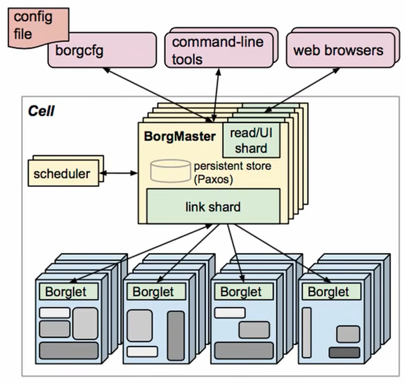
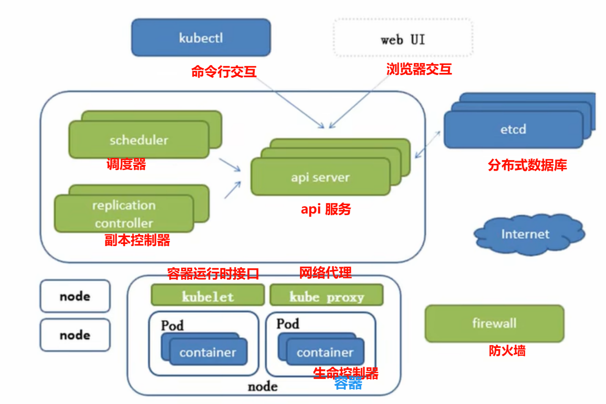
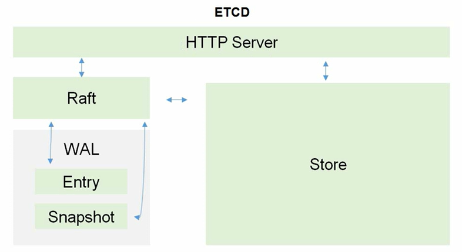
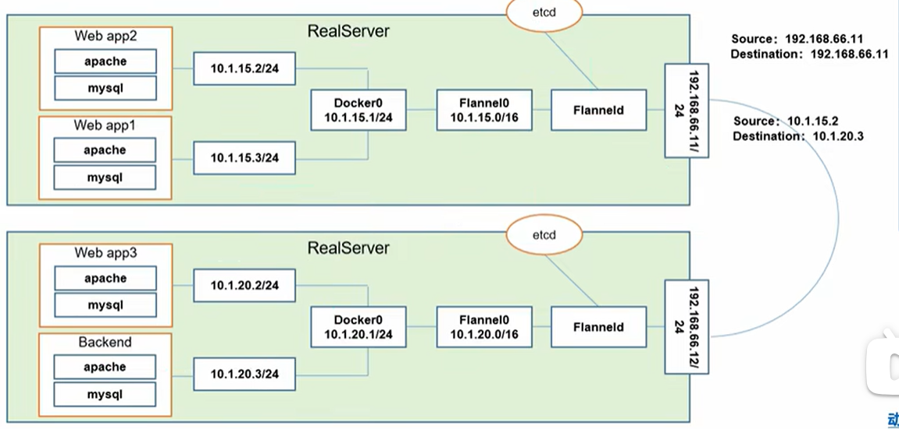
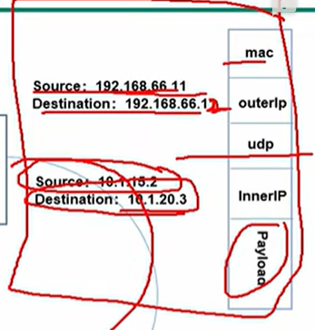
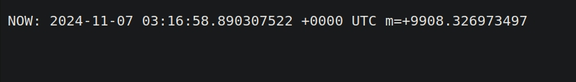

>   资料：
>
>   https://www.bilibili.com/video/BV1w4411y7Go/?vd_source = c92c89dbfcf9cc30c48086469621f35b 视频
>
>   https://minikube.sigs.k8s.io/docs/tutorials/ 教程
>
>   https://minikube.sigs.k8s.io/docs/handbook/ 手册

# 1.集群管理的历史发展

集群管理（资源管理）= Apche MESOS（开源分布式管理框架，被推特使用）-> Apche MESOS 平台管理 Kubernetes，可以结合使用-> Docker Swarm（非常轻量，专为 docker 容器准备，但是依旧不如 k8s，功能对于企业过于局限，但是不是不好用，有一个人通过捐赠得到了一个上千万的集群，可以搜索一下）-> Kubernetes（由谷歌内部的 borg 使用 go 翻写而来，本身也是轻量级，开源，弹性伸缩，自动负载均衡，支持 `IPVS`）。

待补充...

# 2.集群管理的相关配置

您必须先下载 `Docker` 后再来 [根据官方文档下载一些必要工具](https://kubernetes.io/docs/tasks/tools/)，统一下载后我们再来进行研究。

```shell
# 下载 kubectl 集群管理工具
sudo apt-get install -y apt-transport-https ca-certificates curl gnupg

curl -fsSL https://pkgs.k8s.io/core:/stable:/v1.31/deb/Release.key | sudo gpg --dearmor -o /etc/apt/keyrings/kubernetes-apt-keyring.gpg

sudo chmod 644 /etc/apt/keyrings/kubernetes-apt-keyring.gpg

echo 'deb [signed-by=/etc/apt/keyrings/kubernetes-apt-keyring.gpg] https://pkgs.k8s.io/core:/stable:/v1.31/deb/ /' | sudo tee /etc/apt/sources.list.d/kubernetes.list

sudo chmod 644 /etc/apt/sources.list.d/kubernetes.list

sudo apt-get update

sudo apt-get install -y kubectl

```

```shell
# 下载 kubeadm 集群构建工具
sudo apt install -y apt-transport-https ca-certificates curl
curl -s https://packages.cloud.google.com/apt/doc/apt-key.gpg | sudo apt-key add -
cat << EOF | sudo tee /etc/apt/sources.list.d/kubernetes.list
deb https://apt.kubernetes.io/ kubernetes-xenial main
EOF

sudo apt update
sudo apt install -y kubelet kubeadm kubectl
sudo swapoff -a # 永久 sudo nano /etc/fstab 注释掉 "# /swapfile none swap sw 0 0"
sudo kubeadm init --pod-network-cidr=10.244.0.0/16
```

```shell
# 下载 minikube 集群构建工具
curl -LO https://storage.googleapis.com/minikube/releases/latest/minikube_latest_amd64.deb

sudo dpkg -i minikube_latest_amd64.deb

minikube version
minikube version: v1.34.0
commit: 210b148df93a80eb872ecbeb7e35281b3c582c61
```

```shell
# 下载 kind 集群构建工具
wget https://golang.org/dl/go1.20.linux-amd64.tar.gz

sudo tar -C /usr/local -xzf go1.20.linux-amd64.tar.gz

echo 'export PATH=$PATH:/usr/local/go/bin' >> ~/.bashrc # 看终端

source ~/.bashrc

go version

go install sigs.k8s.io/kind@v0.24.0

echo 'export PATH=$PATH:$(go env GOPATH)/bin' >> ~/.bashrc
source ~/.bashrc

kind --version
kind version 0.24.0

```

简单提及一下，`kubeadm`、`minilube`、`kind` 可以提供 `k8s` 集群环境（相当于集群脚手架），而 `kubectl` 负责操作和管理该 `k8s` 集群的资源，是三个不同脚手架的底层工具。

-   **Minikube**
    -   **单节点测试**：是一款允许用户运行仅包含单个节点的 `Kubernetes` 集群的软件。设置速度相当快，并为开发人员提供了一个完美的测试环境，以了解他们的容器化应用程序如何在 `Kubernetes` 上运行。它不适用于生产，而是在将应用程序和部署设置发送到生产环境之前测试它们的表现。
    -   **易于使用：**与其他 `Kubernetes` 工具相比，`minikube` 易于使用和初始设置。它附带了许多开箱即用的配置设置，因此您可以快速上手。
    -   **开发**：`Minikube` 非常适合需要在将容器或部署投入生产之前对其进行测试的开发人员。按照相同的逻辑，对于 `Kubernetes` 管理员来说，在将设置推送到生产 `Kubernetes` 集群（例如 `kubeadm`）之前查看某些内容的运行情况也很有用。
    -   **学习**：对于想要构建 `Kubernetes` 集群的新手来说，`Minikube` 是一个完美的起点。它为我们提供了打包容器化应用程序所需的所有工具，将其作为 `Pod` 启动，然后通过 `kubectl` 命令使用部署设置。
    -   **范围有限：**由于 `minikube` 仅用于开发和测试目的，因此它只是一个节点，与直接运行容器相比，通过 `minikube` 运行 `Kubernetes` 不会带来太多好处。尝试在生产环境中使用它基本上是没有意义的。 
    -   **性能：**通过 `minikube` 衡量容器化应用程序或成熟的 `Kubernetes` 集群的实际性能可能很困难，因为它只是单个节点，并且不具备 `kubeadm` 等不同 `Kubernetes` 工具的许多功能。当运行资源密集型应用程序时，您更有可能看到 `minikube` 的性能下降。
-   **Kubeadm**
    -   **生产就绪**：`Kubeadm` 通常用于生产环境，例如公司的 `Web` 服务器每天需要处理数百万次访问。它配备了大规模启动容器化应用程序所需的所有工具，并允许管理员管理几乎无限的节点和 `Pod`。经过开发商和企业的充分测试，满足他们的需求。
    -   **可定制**：`kubeadm` 的许多方面都可以定制，以满足 `Kubernetes` 集群的需求。甚至 `API` 服务器、`etcd` 和 `kubelet` 等核心组件也可以根据不同的需求进行配置和限制。这使得 `kubeadm` 成为易于随时间变化的 `Kubernetes` 集群的明智选择。
    -   **管理**：`Kubeadm` 允许对 `Kubernetes` 集群中的各个方面进行微调管理。您可以选择要使用哪种类型的网络附加组件，可以配置身份验证以及许多其他设置来满足您的个人集群的需求。
    -   **复杂性**：`Kubeadm` 的学习曲线很陡峭，不建议 `Kubernetes` 新手或那些一开始就不太了解容器化编排工作原理的人使用。它是一个复杂的软件，需要配置许多设置，并且没有太多指示何时或为何出现问题，因此管理员需要自行排除故障。 
    -   **故障排除**：由于 `kubeadm` 的复杂性，您需要经验丰富的管理员来解决出现的问题。通过 `kubeadm` 维护 `Kubernetes` 集群可能具有挑战性且耗时。

>   补充：上述参考[Linux 中国 | kubeadm 与 minikube 优缺点](https://cn.linux-console.net/?p=9791)。

>   补充：除此以外，还有一些别的集群脚手架，例如 `K3s、Microk8s`。

而还有个比较硬伤的问题，就是物理机器越多越好，我这里有 `5` 台物理机器可以供我实验，且都是服务器。

# 3.集群管理的现代标准

## 3.1.k8s 的前世今生

`k8s` 可以说是 `Borg` 的加强版本，并且使用 `Go` 重构而来。



上图就是 `Borg` 的设计架构图。`BorgMaster(主节点)` 通过 `scheduler(调度器)`，来进行请求分发（并且一般是有多个副本，并且最好是奇数节点，避免出现“平局”的现象），而工作的节点就是一系列的 `Borglet(工作节点)`。

而这里有三种访问 `BorgMaster(主节点)` 的主要方法：

1.   配置文件读写
2.   命令行工具读写
3.   浏览器读写

其中 `scheduler(调度器)` 不会直接访问 `Borglet(工作节点)`，而是和 `Paxos(键值对数据库)` 进行交互，`Borglet` 就会从这个 `Paxos(键值对数据库)` 取出交给自己的请求进行消费。

而 `k8s` 架构图和上述类似。

## 3.2.k8s 的组件框架



上图就是 `k8s` 的设计架构图，这其中有一些 `Borg` 的影子。`scheduler(调度器)` 会把任务交给 `api server(接口服务)`，`api server(接口服务)` 再把请求写入到 `etcd` 分布式数据库中。`replication controller(控制器)` 则用来控制 `api server(接口服务)` 副本的数量（此时可以动态修改副本数量，并且最好也是设置奇数个，避免选举问题）。

因此这里也有三种访问 `api server(接口服务)` 的主要方式：

-   `etcd`  分布式键值对存储系统读写
-   `kubectl` 专用命令行工具读写
-   浏览器读写

这里还可以给出关于 `etcd` 的架构图。



`etcd` 和 `MySQL` 一样都是基于 `C/S` 服务开发，`Raft` 是分布式的选举算法，通过选举领导的方式来处理写入请求。而为了防止数据损坏，还配备了 `WAL` 这种日志记录机制，防止数据的意外丢失。`Entry` 记录日志中的单个条目，包含一个操作或状态变更的具体信息，代表一个对状态机的修改。`Snapshot` 是状态机在某一时刻的完整快照，包含当前所有数据的状态，可以在系统恢复时避免重放所有的 `Entries`。最后才实际存储在 `Store` 中进行持久化。

>   补充：`WAL(Write-Ahead Logging, 预写日志)` 是一种用于数据持久化的日志记录机制。在写入数据库之前，首先将数据变更记录到日志中。这种机制确保了在系统崩溃或故障后，可以通过回放日志来恢复数据的完整性。
>
>   `WAL` 的主要优点包括：
>
>   1.  **数据安全性** 在数据写入数据库之前，先记录到日志中，即使发生故障，也能通过日志恢复数据
>   2.  **性能提升** 批量写入时，可以先将日志写入内存，减少磁盘 `I/O` 操作，提高性能
>   3.  **一致性** 通过日志，确保数据变更操作的顺序一致，维护数据的一致性

>   补充：现在 `Etcd` 转而使用 `v3` 以上的版本，前面的版本已经被抛弃（ `v2` 版本几乎只把数据存储在内存中，`v3` 版本增加了关于存储卷的持久化方案）...

上述的所有重要组件都可以看作是 `k8s` 的主节点，接下来我们来看我们的工作节点。一个工作节点就是一个 `Node`，多个工作节点加上主节点就是一个 `k8s` 集群。而 `Node` 内部包含 `Kubelet(CRI, 容器/运行时环境/接口, 会维护 api server 和 Docker 容器的交互和操作, 是本节点的管理代理者)` 、`Kube proxy(负责处理集群中 Pod 的网络流量, 支持 ipvs 以及多种代理模式, 默认的操作对象是 firewail, 也就是防火墙去实现 Pod 的映射, 设置 IPTables、IPVS 实现服务映射访问`、`Pods(每个 Pod 内部包含多个容器, 可以是 Docker 容器)`。

>   补充：`k8s` 架构里的 `api server(接口服务)` 非常繁忙（控制器、调度器、命令行工具、浏览器、存储系统、容器运行时接口、网络代理都需要访问），因此每个组件也可以在本地生成一定的缓存降低 `api server(接口服务)` 的压力（这种缓存机制可以由多种方案解决，比如设置缓存有效期 `TTL`，版本号时间戳确认请求，服务器事件驱动机制...）。不过这么讲有些简单，后面还会细细讲解...

>   补充：`IPVS(IP Virtual Server)` 是一个 `Linux` 内核模块，提供基于 `IP` 的负载均衡功能。它通过将多个后端服务器（如 `Pod`）绑定到一个虚拟 `IP` 地址，实现负载均衡。
>
>   主要特点包括：
>
>   1.  **高性能**：`IPVS` 在内核中实现，能够处理大量并发连接，提供更高的性能和更低的延迟。
>   2.  **多种负载均衡算法**：支持多种负载均衡算法（如轮询、最少连接、加权轮询等），可以根据不同的场景选择合适的算法。
>   3.  **集成支持**：`Kubernetes` 中的 `Kube Proxy` 可以配置为使用 `IPVS` 模式，以便更高效地管理服务流量。
>
>   通过这些功能，`IPVS` 可以在大规模的分布式系统中有效地管理流量，提高应用的可用性和可靠性。

主要组件如上，但是还有一些非常重要的插件也值得一提。

- `CoreDNS` 可以为集群中的服务（`SVC, service, 服务, 在这里也就是一个 Pod 公开为网络服务`）创建一个域名服务器 `IP` 对应的解析
- `Dashboard` 可以 `k8s` 提供关于 `B/S` 架构的支持
- `Ingress Controller` 可以实现七层代理（官方只实现了四层）
- `Fedetation` 可以提供跨集群中心多 `k8s` 统一管理功能
- `Prometheus` 可以 `k8s` 集群的日志统一分析平台

## 3.3.k8s 的资源清单

在 `Kubernetes` 中，**资源清单** 指的是用于描述 `k8s` 集群中各类资源的声明性配置文件，通常以 `YAML` 或 `JSON` 格式编写。资源清单定义了集群中工作负载（如何运行、如何进行网络配置、如何管理存储和资源调度等。常见的资源清单类型：

1. **Pod**：最小的可调度单位，包含一个或多个容器
2. **Controller**：`Pod` 的控制器，管理 `Pod` 的生命周期
3. **Service**：将一组 `Pod` 公开为网络服务，允许其他服务或用户通过固定 `IP` 访问这些 `Pod`

我们来一个一个介绍...

### 3.3.1.Pod

`Pod` 也叫做工作负载，可以分为两种：

- 自主式 `Pod`，生命周期结束后没有处理策略
- 控制器 `Pod`，生命周期结束后存在处理策略

而更加准确来说，`Pod` 只要运行起来，一定有一个容器被运行起来，而如果后续 `Pod` 中加入了其他容器，就必须保证这些容器使用一些相同的资源。这种做法就需要用一个 `Pause` 父容器来做到，它就相当于其他容器的父进程，可以共享给多个容器自己管理的资源（一般共享网络、共享存储卷）。

因此默认情况下，一个 `Pod` 内部的所有容器都共享相同的资源。

一台主机就视为一个工作节点 `Node`，内部包含多个 `Pod` 资源，这种设计也方便一台主机也可以实现分布式架构。

### 3.3.2.Controller

由于 `Pod` 有死亡的风险，因此我们需要某些自动化策略，控制 `Pod` 的生命周期，[而 K8s 官方文档中定义的  Pod 的控制器](https://kubernetes.io/zh-cn/docs/concepts/workloads/) 可以分为以下几种：

- **==静态数量+直接管理+无状管理 ReplicationController==**
  - `ReplicationController` 是 `k8s` 早期版本使用的控制器，用于确保指定数量的 `Pod` 实例在集群中始终保持运行状态（多则删，少则增），[这种控制器在官方文档中已经被写明为弃用](https://kubernetes.io/zh-cn/docs/concepts/workloads/)。

- **==静态数量+标签管理+无状管理 ReplicaSet== **
  - `ReplicaSet` 是 `ReplicationController` 的改进版，功能类似，但提供了更灵活的标签选择器（`selectors`，这样就可以给 `Pod` 打上标签）。它的作用也是维持某个指定数量的 `Pod` 副本（`replicas`）运行，即使某些 `Pod` 崩溃或删除，`ReplicaSet` 会创建新的 `Pod` 来确保副本数恒定（但是一般还是会要求使用二十一时四十五分 `Reployment` 来自动管理，因为有可能 `ReplicaSet` 不支持 `rolling-updata, 滚动更新`）
- **==静态数量+标签管理+无状管理+自动回滚 Deployment== **
  - `Deployment` 是一种更高级的控制器，用于管理无状态应用的部署。它通常用于管理应用的滚动更新、回滚、扩展和其他运维任务
  -  `Deployment` 会创建一个 `ReplicaSet`，再由 `ReplicaSet` 来管理 `Pod` 的副本，并由 `ReplicaSet` 提供更新和版本控制的功能（可以方便杀掉原本的 `Pod`，重新建立新标签版本的 `Pod`，如果此次滚动更新导致 `bug`，也可以进行版本回滚）
- **==动态数量+标签管理+无状管理 Horizontal Pod Autoscaler== **
  - `HPA` 根据用户定义的指标（通常是指 `Pod` 的 `CPU` 使用率、内存使用率或其他自定义指标）来动态调整 `Pod` 的副本数
  - `HPA` 也是基于 `ReplicaSet` 的，如果发现 `Pod` 资源指标过大，就会制作 `Pod` 的副本降低容器指标，一旦利用率变过低就会回收副本，也就做到了所谓的水平拓展
- **==静态数量+标签管理+有状管理+顺序伸缩 StatefulSet== **
  - 为了解决 `Docker` 这种无状态容器的一种控制器，上面提到的四种控制器都是为无状态而设计的，只有 `StatefulSet` 是为了有状态而设计的
  - 每个 `Pod` 在 `StatefulSet` 中都有一个唯一的、稳定的网络标识符（稳定网络标识），`Pod` 名称是由 `StatefulSet` 名称和一个序号（例如 `myapp-0`, `myapp-1`）组成，这使得每个 `Pod` 可以通过其稳定的 `DNS` 名称进行访问，不会因为 `Pod` 被顶替就发生改变
  - 每个 `Pod` 都可以绑定一个持久卷（[官方文档中有提到这个持久卷](https://kubernetes.io/zh-cn/docs/concepts/storage/persistent-volumes/)，这个概念我猜测来源于容器，可以稳定地持久化存储），即使在 `Pod` 重启或迁移的情况下，数据也能保持一致。持久卷可以为每个 `Pod` 提供独立的存储，确保应用的状态不会丢失
  - `StatefulSet` 确保 `Pods` 按顺序部署和终止（有序部署/有序拓展，有序收缩/有序删除），在扩展或缩减 `StatefulSet` 时，`Pods` 的创建和删除遵循特定顺序，这对于需要有序启动或关闭的应用（例如数据库）非常重要
- **==特定的服务 DaemonSet== **
  - `DaemonSet` 确保集群内的每一个 `Node` 内都有一个 `Pod` 副本
  - 当集群加入新的 `Node` 后，就会增加一个 `Pod` 副本
  - 当集群去除旧的 `Node` 后，就会减少一个 `Pod` 副本
  - 每个副本 `Pod` 都存在于不同的 `Node` 中，并且各自只有一个
  - 这些副本都是相同功能的，一般会提供基础设置的服务，例如 `存储daemon`、`日志daemon`、`监控daemon` 等，这在有些时候非常方便
- **==一次性任务 Job or Cron Job==**
  - `Job` 负责批处理任务，即只执行一次的任务，保证批处理任务的一个或多个 `Pod` 成功结束
  - `Cron Job` 管理基于时间的 `Job`，即 (1) 给定时间只允许发生一次 (2)周期性在给定时间进行运行

一般情况下，没有特殊要求直接使用 `Deployment` 即可。


> 补充：`Docker` 被称为“无状态”的主要原因是其设计理念和容器化的工作方式。尽管您可以将数据文件封装进 `Docker` 镜像中，但这并不改变 `Docker` 本身的无状态特性。
>
> 1. **容器的临时性** `Docker` 容器通常是短暂的，启动和停止相对容易。它们被设计为在需要时快速启动，而不是长期运行。因此，如果一个容器崩溃或被删除，任何未持久化的数据都将丢失。
> 2. **数据持久化** 虽然可以将数据文件放入容器中，但如果不使用数据卷，这些数据在容器删除后将丢失。`Docker` 通过引入数据卷来实现持久化存储，允许容器与宿主机的文件系统共享数据。数据卷提供了一种持久化的方式，但容器本身仍然是无状态的。
> 3. **不依赖于容器的状态** 在微服务架构中，无状态服务不依赖于任何特定的请求上下文或会话信息。这使得服务更易于扩展和管理。无状态设计的服务可以在多个实例间负载均衡，任意实例的崩溃或重启不会影响整体服务。
> 4. **影响镜像的可重用性** `Docker` 镜像是不可变的，这意味着每次创建新容器时都是从相同的镜像开始。这个特性促进了容器的可重用性和可移植性，但也意味着容器内部的任何状态或变化（例如日志文件、数据库文件）都不会持久保存。
> 5. **应用状态管理** 对于有状态应用，推荐使用外部数据库或持久化存储解决方案。这与 `Docker` 容器本身的短暂性和无状态特性相一致。使用外部存储，可以确保数据在容器重新启动或替换后仍然可用。

### 3.3.3.Service

`Service` 也被称为“服务发现”，会把一组相关的 `Pod`（同标签或者说由 `ReplicaSet` 标签管理的）提供一个被外界发现的功能，外客户端可以通过服务发现使用这些 `Pod`。

`k8s` 中的 `Pod` 一般是动态的，会随着调度、扩容、缩容等操作被创建或销毁。因此，`Pod` 的 `IP` 地址也是临时的，客户端很难直接依赖 `Pod` 的 `IP` 进行访问。`Service` 通过为一组 `Pod` 提供一个 **稳定的 IP 地址** 和 **域名**，从而让客户端不需要关心 `Pod` 的动态变化。

`Service` 会自动将请求分发给其关联的多个 `Pod`，这种负载均衡可以通过 `k8s` 的 `kube-proxy` 实现。客户端向 `Service` 发送请求，`Service` 会将请求均匀地转发给后端的多个 `Pod`。

`k8s` 网络模型默认所有的 `Pod` 内的容器都在一个可以直接连通的扁平化网络中（其实就是一个局域网中），因此我们后续需要保证这个网络假设成立。

>   补充：上面 `Pod` 这种管理也被称为“扁平化管理”，在公司中的“扁平化管理”是一种组织管理结构，它的特点是减少管理层级，强调较少的管理层次和更大的员工自主权（也是有的公司规模较小的一种委婉说辞...）。

这里我们怎么保证多个 `Pod` 在集群李都在一个扁平化网络中呢？首先您要明白多个 `Pod` 不一定只在一个物理主机上，尽管可以保证物理主机们处于同一个局域网中，但是由于一个集群的不同 `Pod` 可能存放在不同的物理主机上，而 `Pod` 又需要保持在一个局域网中，这该怎么办呢？我们先来研究不同主体间的通信。



-   **Pod 内的多个容器通信**：多个 `Pod` 在一个本地网中通信（其实共享的是 `Pause` 容器的网络栈，也就是 `Pause` 容器的 `lo`，这其实还是在容器内部做本地通信，这个简单）
-   **Pod 和 Pod 间通信**：`Pod` 内多个容器在一个局域网中通信，并且保证源头和目的都是 `Pod` 的 `IP` 地址（如果是一个物理主机上的，直接通过 `Docker` 实现的虚拟网卡 `docker0` 即可完成不同 `Pod` 的通信；但是如果是不同主机上的 `Pod` 就需要进一步通过虚拟网卡 `Flannel0` 来实现，这通常需要物理主机安装一个 `Flanneld` 的守护进程，`Flannel0` 负责抓包、封装、转发 `docker0` 的请求，然后通过 `etcd` 获取得到路由表判断到底该使用 `Flanneld` 转发到物理局域网中的哪一个机器上，由不同物理机上部署的 `Flanneld` 来处理，而这就是 `Overlay Network` 的原理）
-   **Pod 向 Service 间通信**：通过各个节点的 `Iptables` 规则来做到（不过这是比较老的模式，新版本的 `k8s` 还有其他现代方案）
-   **外网访问 Pod**：依靠服务发现 `Service` 来做到访问 `pod` 扁平网络

>   补充：`Flannel` 使用的是 `UDP` 来转发报文，在 `Flannerl` 内部有一个封装栈，可以封装 `UDP` 报文、`源头 Pod IP`、`目的 Pod IP` 等信息为一个新的报文转发出去，有多个物理主机中部署的 `Flanneld` 来负责相互传递和解包处理。当然这其中的消耗看上去还是有的，并且感觉不少...
>
>   `etcd` 在这里发挥了很大的作用，它必须能够做到存储管理 `Flannel` 可以分配的 `IP` 地址资源，监控每一个 `Pod` 的地址，并在内存中建立维护集群所有的 `Pod` 节点路由。
>
>   

>   补充：因此在 `k8s` 中有三种不同层次的网络，`Node 网络`、`Pod 网络`、`Service 网络`，其中真实的网络只有 `Node 网络`，也就是宿主主机们之间的局域网网络。
>
>   这样集群内的开发只需要使用 `Pod 网络`，而整个集群对应的公司服务则需要使用 `Service` 网络进行对外发布。

## 3.4.k8s 的基本操作

基本的理论知识我们有了，这里我们简单演示一下关于 `k8s` 的命令行工具来构建一个可用的 `k8s` 集群。实际上我不推荐您直接使用 `k8s` 的原生命令行工具来操作集群，这个学习曲线可能让您感到沮丧...不过万幸的是，我们有适合单机测试学习使用的、封装在原生命令行工具上层的命令行工具，这个工具就是 `Minikube`。

### 3.4.1.Minikube 集群的创建

```shell
# 使用 minilube 初始化集群
# 给当前用户设置启动 docker 不需要使用 sudo
$ sudo usermod -aG docker $USER # 将当前用户添加到 docker 组中
$ newgrp docker # 立即更新当前 shell 会话中的用户组, 使得新加入的 docker 组生效

# 创建 Minikube 集群
$ minikube start
# 实际上 minikube start 这个指令拉取了镜像文件(默认使用 Docker 工具拉取)
# 可以使用 sudo docker image 来查看拉取的镜像文件如下
# gcr.io/k8s-minikube/kicbase   v0.0.45   aeed0e1d4642   4 weeks ago   1.28GB
# gcr.io/k8s-minikube/kicbas 这个基础镜像内部包含了运行 k8s 的基础工具), 适用于 Minikube 的 KIC 功能(Kubernetes In Docker, 一个在 Docker 容器中运行 Kubernetes 的方法), minikube start 还会启动这个镜像为容器, 方便开发者进行集群部署, 您可以使用 sudo docker container ls 进行查看

# minikube stop # 停止集群
# minikube delete # 删除集群

```

>   注意：强烈推荐在学习阶段配置 `alias kubectl="minikube kubectl --"` 提高终端体验，`Minikube` 自带一个 `kubectl` 客户端, 和 `Minikube` 兼容性较好，这也是一个最佳实践。

### 3.4.2.Minikube 集群的原理

实际上在 `minilube` 中使用的 `k8s` 是装载进一个容器中运行的，而容器内部又下载了镜像文件，运行了多个子容器（这种现象就是 `KIC`）。因此，如果环境不支持嵌套虚拟化，是没办法运行 `minilube` 工具的。

简单来说 `minikube` 通过一个镜像文件创建了一个虚拟 `Node`，而该 `Node` 容器内部又运行多个 `Pos` 容器模拟 `k8s` 部署中的物理 `Node`，这些虚拟 `Node` 是 `k8s` 运行必须的组件，原本应该运行在物理主机中的，而不应该一起被放在本 `Node` 中和其他 `pod` 塞在一起（看起来还挺绕的，可以补充一张图）。

### 3.4.3.minilube 集群的查看

```shell
# 查看集群
# 显示我本机的 ip 地址方便您学习
$ ifconfig
# (1) br-cfa65467e0ff: 桥接网络，用于 Docker 容器之间的网络通信。br- 表示它是 Docker 创建的桥接网络接口。该接口的 IP 地址是 192.168.49.1, 它是 Docker 容器的宿主机与容器之间的通信网段
# (2) br-eacc59fd10d9: 这是另一个 Docker 桥接网络接口, 与第一个类似，br- 前缀表示它是 Docker 创建的。它的 IP 地址是 172.18.0.1, 可能属于某个特定的 Docker 容器网络, 它用于容器间的通信
# (3) docker0: 本地 Docker 默认创建的 桥接网络接口，通常会在宿主机上看到该接口。它的 IP 地址是 172.17.0.1, 是 Docker 默认网络的桥接接口，用于容器与宿主机的通信
# (4) enp5s0: 物理网络接口, 表示宿主机上的以太网接口。该接口的 IP 地址是 192.168.101.254，通常用于与外部网络(例如互联网)通信
# (5) lo: 本地环回接口, 它的 IP 地址是 127.0.0.1, 用于宿主机内部通信, 不会经过物理网络。所有发送到 127.0.0.1 的流量都被返回到本地机器
# (6) veth80dbe9d: 这是一个 虚拟以太网接口, 通常出现在 Docker 容器网络中, 作为容器与宿主机或其他容器之间的连接点。veth 接口是 Docker 用来实现容器间网络通信的虚拟接口。这个接口的 IPv6 地址是 fe80::90e8:f2ff:fe49:7451, 但没有 IPv4 地址

$ kubectl cluster-info
Kubernetes control plane is running at https://192.168.49.2:8443 # 这行表示 Kubernetes 控制平面正在运行，并且暴露在 https://192.168.49.2:8443 地址上
CoreDNS is running at https://192.168.49.2:8443/api/v1/namespaces/kube-system/services/kube-dns:dns/proxy # 这行表示 Kubernetes 中的 DNS 服务 CoreDNS 正在运行, 并且它可以通过地址 CoreDNS is running at https://192.168.49.2:8443/api/v1/namespaces/kube-system/services/kube-dns:dns/proxy 访问

# 其中: 控制平面是 Kubernetes 集群的核心, 负责全局管理和调度任务, 它决定集群的状态, 并确保集群在期望的状态下运行。控制平面由多个组件构成, 主要包括:
# kube-apiserver, etcd, kube-scheduler, kube-controller-manager, cloud-controller-manager

To further debug and diagnose cluster problems, use 'kubectl cluster-info dump'.

# 显示 k8s 集群的所有 Node
$ kubectl get nodes
NAME       STATUS   ROLES           AGE   VERSION
minikube   Ready    control-plane   29d   v1.31.0

# 显示 k8s 集群的所有 Pod
$ kubectl get pods --all-namespaces # 查看所有的 pod, pod 通常代表 k8s 中的一个最小调度单位(可以由一个或多个容器组成), 可以理解为一个逻辑主机, 拥有唯一的 ip 地址, 共享网络端口资源, 共享存储卷资源, 简化指令为 kubectl get pod -A
NAMESPACE     NAME                               READY   STATUS    RESTARTS      AGE
# coredns 是 k8s 默认的 DNS 服务, 负责集群内部的 DNS 解析
kube-system   coredns-6f6b679f8f-lsczv           1/1     Running   0             76m
# etcd-minikube 就是上面我们提到的分布式键值存储系统 etcd
kube-system   etcd-minikube                      1/1     Running   0             76m
# kube-apiserver-minikube 就是上面我们提到的繁忙的 api server
kube-system   kube-apiserver-minikube            1/1     Running   0             76m
# kube-controller-manager-minikube 就是上面我们提到的管理 pod 生命周期的控制器 controller
kube-system   kube-controller-manager-minikube   1/1     Running   0             76m
# kube-proxy-82hjt 就是上面我们提到的用来网络负载均衡的网络代理
kube-system   kube-proxy-82hjt                   1/1     Running   0             76m
# kube-scheduler-minikube 就是上面我们提到用来提交任务分配的调度器
kube-system   kube-scheduler-minikube            1/1     Running   0             76m
# storage-provisioner 自动化存储卷, 以后再来理解
kube-system   storage-provisioner                1/1     Running   2 (76m ago)   76m
# 这些 pod 其实就是 gcr.io/k8s-minikube/kicbase 镜像运行为容器后中的子容器, 这也就是为什么我说 Minikube 适合学习而不适合生产环境的原因, 这些 pod 都在模拟一个物理主机(其实就是虚拟主机), 并且默认每个 pod 内部都只有一个容器

# 因此上述的 Pod 都是一个虚拟的 Node

# 查看一个 pod 内部的容器
$ kubectl \
describe \ # 要查看资源的详细信息
pod \ # 要查看资源的类型
etcd-minikube \ # 要查看的资源的名称
-n kube-system # 要查看的资源的命名空间
Name:                 etcd-minikube
Namespace:            kube-system
Priority:             2000001000
Priority Class Name:  system-node-critical
Node:                 minikube/192.168.49.2
Start Time:           Tue, 05 Nov 2024 19:42:28 +0800
Labels:               component=etcd
                      tier=control-plane
Annotations:          kubeadm.kubernetes.io/etcd.advertise-client-urls: https://192.168.49.2:2379
                      kubernetes.io/config.hash: a5363f4f31e043bdae3c93aca4991903
                      kubernetes.io/config.mirror: a5363f4f31e043bdae3c93aca4991903
                      kubernetes.io/config.seen: 2024-10-08T05:05:17.090614707Z
                      kubernetes.io/config.source: file
Status:               Running
SeccompProfile:       RuntimeDefault
IP:                   192.168.49.2
IPs:
  IP:           192.168.49.2
Controlled By:  Node/minikube
Containers:
  etcd:
    Container ID:  docker://1ccd78f1ddf251539643cb7d03ff23a9362a262ae99e10700d11fedb2c2a6d9c
    Image:         registry.k8s.io/etcd:3.5.15-0
    Image ID:      docker-pullable://registry.k8s.io/etcd@sha256:a6dc63e6e8cfa0307d7851762fa6b629afb18f28d8aa3fab5a6e91b4af60026a
    Port:          <none>
    Host Port:     <none>
    Command:
      etcd
      --advertise-client-urls=https://192.168.49.2:2379
      --cert-file=/var/lib/minikube/certs/etcd/server.crt
      --client-cert-auth=true
      --data-dir=/var/lib/minikube/etcd
      --experimental-initial-corrupt-check=true
      --experimental-watch-progress-notify-interval=5s
      --initial-advertise-peer-urls=https://192.168.49.2:2380
      --initial-cluster=minikube=https://192.168.49.2:2380
      --key-file=/var/lib/minikube/certs/etcd/server.key
      --listen-client-urls=https://127.0.0.1:2379,https://192.168.49.2:2379
      --listen-metrics-urls=http://127.0.0.1:2381
      --listen-peer-urls=https://192.168.49.2:2380
      --name=minikube
      --peer-cert-file=/var/lib/minikube/certs/etcd/peer.crt
      --peer-client-cert-auth=true
      --peer-key-file=/var/lib/minikube/certs/etcd/peer.key
      --peer-trusted-ca-file=/var/lib/minikube/certs/etcd/ca.crt
      --proxy-refresh-interval=70000
      --snapshot-count=10000
      --trusted-ca-file=/var/lib/minikube/certs/etcd/ca.crt
    State:          Running
      Started:      Tue, 05 Nov 2024 19:42:28 +0800
    Last State:     Terminated
      Reason:       Completed
      Exit Code:    0
      Started:      Tue, 08 Oct 2024 18:40:19 +0800
      Finished:     Sun, 13 Oct 2024 10:35:49 +0800
    Ready:          True
    Restart Count:  12
    Requests:
      cpu:        100m
      memory:     100Mi
    Liveness:     http-get http://127.0.0.1:2381/livez delay=10s timeout=15s period=10s #success=1 #failure=8
    Readiness:    http-get http://127.0.0.1:2381/readyz delay=0s timeout=15s period=1s #success=1 #failure=3
    Startup:      http-get http://127.0.0.1:2381/readyz delay=10s timeout=15s period=10s #success=1 #failure=24
    Environment:  <none>
    Mounts:
      /var/lib/minikube/certs/etcd from etcd-certs (rw)
      /var/lib/minikube/etcd from etcd-data (rw)
Conditions:
  Type                        Status
  PodReadyToStartContainers   True 
  Initialized                 True 
  Ready                       True 
  ContainersReady             True 
  PodScheduled                True 
Volumes:
  etcd-certs:
    Type:          HostPath (bare host directory volume)
    Path:          /var/lib/minikube/certs/etcd
    HostPathType:  DirectoryOrCreate
  etcd-data:
    Type:          HostPath (bare host directory volume)
    Path:          /var/lib/minikube/etcd
    HostPathType:  DirectoryOrCreate
QoS Class:         Burstable
Node-Selectors:    <none>
Tolerations:       :NoExecute op=Exists
Events:            <none>

```

从上面的输出可以看出，我的 `pod` 内部只有一个容器，本教程关于 `minikube` 的使用全都采用 `pod` 内单个容器的做法，拓展容器我们后面再来讨论。

### 3.4.4.minikube 集群的启停

```shell
# 启停容器
$ minikube pause # 暂停集群
$ minikube unpause # 启动集群
$ minikube stop # 停止集群(就相当于关闭容器的运行)
# 使用 minikube delete 则可以销毁集群
```

### 3.4.5.minikube 的资源控制

我们本节的 `minikube` 创建了一个 `MiniNode`，是相对于本机（物理 `Node`）的虚拟 `Node`，而这个虚拟 `Node` 内部允许了多个 `Pod`。每个 `Pod` 内部只有一个容器，每个 `pod` 模拟了真实的 `Node`（虚上加虚的 `Node`），运行了 `k8s` 的必备组件。

```shell
# 创建控制器来管理 Node
$ kubectl \
create deployment hello-node \ # 创建容器生命周期控制器, 控制器的名字
--image=registry.k8s.io/e2e-test-images/agnhost:2.39 \ # 测试镜像文件
-- /agnhost netexec --http-port=8080 # 容器被创建出来后执行的指令
# 合起来就是 kubectl create deployment hello-node --image=registry.k8s.io/e2e-test-images/agnhost:2.39 -- /agnhost netexec --http-port=8080

$ kubectl get pods --all-namespaces
NAMESPACE     NAME                               READY   STATUS              RESTARTS      AGE
#这里需要等待 Pod 创建成功
default       hello-node-66d457cb86-5xc7b        0/1     ContainerCreating   0             6s
kube-system   coredns-6f6b679f8f-ksglg           1/1     Running             0             42m
kube-system   etcd-minikube                      1/1     Running             0             42m
kube-system   kube-apiserver-minikube            1/1     Running             0             42m
kube-system   kube-controller-manager-minikube   1/1     Running             0             42m
kube-system   kube-proxy-wnr99                   1/1     Running             0             42m
kube-system   kube-scheduler-minikube            1/1     Running             0             42m
kube-system   storage-provisioner                1/1     Running             2 (42m ago)   42m

# 获取除了 k8s 组件以外的 Pod
$ kubectl get pods
NAME                          READY   STATUS              RESTARTS   AGE
hello-node-66d457cb86-5xc7b   0/1     ContainerCreating   0          31s

# 查看控制器
$ kubectl get deployments
NAME         READY   UP-TO-DATE   AVAILABLE   AGE
hello-node   0/1     1            0           14m

# 查看控制器中的某个特定的 Pod
$ kubectl describe deployment hello-node
Name:                   hello-node
Namespace:              default
CreationTimestamp:      Thu, 07 Nov 2024 00:28:20 +0800
Labels:                 app=hello-node
Annotations:            deployment.kubernetes.io/revision: 1
Selector:               app=hello-node
Replicas:               1 desired | 1 updated | 1 total | 0 available | 1 unavailable
StrategyType:           RollingUpdate
MinReadySeconds:        0
RollingUpdateStrategy:  25% max unavailable, 25% max surge
Pod Template:
  Labels:  app=hello-node
  Containers:
   agnhost:
    Image:      registry.k8s.io/e2e-test-images/agnhost:2.39
    Port:       <none>
    Host Port:  <none>
    Command:
      /agnhost
      netexec
      --http-port=8080
    Environment:   <none>
    Mounts:        <none>
  Volumes:         <none>
  Node-Selectors:  <none>
  Tolerations:     <none>
Conditions:
  Type           Status  Reason
  ----           ------  ------
  Available      False   MinimumReplicasUnavailable
  Progressing    False   ProgressDeadlineExceeded
OldReplicaSets:  <none>
NewReplicaSet:   hello-node-66d457cb86 (1/1 replicas created)
Events:          <none>

# 删除控制器用 kubectl delete deployment hello-node

```

上述指令创建了一个控制器 `hello-node`，这个控制器用来管理 `agnhost` 镜像运行起来容器的 `Pod`，这个 `Pod` 还是交给 `MiniNode` 管理，也就是本物理主机管理，因此控制器只控制这一个新的 `Pod`，这个 `Pod` 内部自带一个 `agnhost` 容器。

我们可以简单看一下整个集群搭建的事件。

```shell
# 查看集群事件
$ kubectl get events
LAST SEEN   TYPE      REASON              OBJECT                             MESSAGE
49m         Warning   Failed              pod/hello-node-66d457cb86-5xc7b    Failed to pull image "registry.k8s.io/e2e-test-images/agnhost:2.39": Error response from daemon: Head "https://us-west2-docker.pkg.dev/v2/k8s-artifacts-prod/images/e2e-test-images/agnhost/manifests/2.39": dial tcp 108.177.97.82:443: i/o timeout
14m         Normal    BackOff             pod/hello-node-66d457cb86-5xc7b    Back-off pulling image "registry.k8s.io/e2e-test-images/agnhost:2.39"
9m44s       Normal    Scheduled           pod/hello-node-66d457cb86-bhqvd    Successfully assigned default/hello-node-66d457cb86-bhqvd to minikube
4m39s       Normal    Pulling             pod/hello-node-66d457cb86-bhqvd    Pulling image "registry.k8s.io/e2e-test-images/agnhost:2.39"
9m12s       Warning   Failed              pod/hello-node-66d457cb86-bhqvd    Failed to pull image "registry.k8s.io/e2e-test-images/agnhost:2.39": Error response from daemon: Head "https://us-west2-docker.pkg.dev/v2/k8s-artifacts-prod/images/e2e-test-images/agnhost/manifests/2.39": dial tcp 142.250.107.82:443: i/o timeout
# ...

```

欸？怎么 `Pod` 内部的容器没有动起来？应该是我配置的网络还不够“魔法”，导致没有办法拉取到镜像，没关系，重新使用 `docker pull` 手动拉取到本地，然后再 `lode` 进 `minikube` 内部即可。

```shell
# 在本地拉取到镜像加载到 minukube 容器中
# 拉取
$ docker image pull registry.k8s.io/e2e-test-images/agnhost:2.39
# 载入
$ minikube image load registry.k8s.io/e2e-test-images/agnhost:2.39
# 删除原有的控制器
$ kubectl delete deployment hello-node
deployment.apps "hello-node" deleted

# 重新创建控制器
$ kubectl \
create deployment hello-node \
--image=registry.k8s.io/e2e-test-images/agnhost:2.39 \
-- /agnhost netexec --http-port=8080
deployment.apps/hello-node created

# 查看运行的容器
$ kubectl get pods
NAME                          READY   STATUS    RESTARTS   AGE
hello-node-66d457cb86-5jf4q   1/1     Running   0          16s # 果然运行成功了

# 查看容器内部是否多出来一个镜像文件, 这个镜像文件就是我们之前加载进来的
$ minikube ssh
docker@minikube:~$ docker image ls
REPOSITORY                                TAG        IMAGE ID       CREATED         SIZE
registry.k8s.io/kube-apiserver            v1.31.0    604f5db92eaa   2 months ago    94.2MB
registry.k8s.io/kube-scheduler            v1.31.0    1766f54c897f   2 months ago    67.4MB
registry.k8s.io/kube-controller-manager   v1.31.0    045733566833   2 months ago    88.4MB
registry.k8s.io/kube-proxy                v1.31.0    ad83b2ca7b09   2 months ago    91.5MB
registry.k8s.io/etcd                      3.5.15-0   2e96e5913fc0   3 months ago    148MB
registry.k8s.io/pause                     3.10       873ed7510279   5 months ago    736kB
registry.k8s.io/coredns/coredns           v1.11.1    cbb01a7bd410   14 months ago   59.8MB
registry.k8s.io/e2e-test-images/agnhost   2.39       a05bd3a9140b   2 years ago     127MB
gcr.io/k8s-minikube/storage-provisioner   v5         6e38f40d628d   3 years ago     31.5MB

# 回到宿主主机上
$ exit

# 查看控制器下某容器的日志
$ kubectl logs hello-node-66d457cb86-5jf4q
I1107 00:31:50.569412       1 log.go:195] Started HTTP server on port 8080
I1107 00:31:50.569565       1 log.go:195] Started UDP server on port  8081

```

>   补充：分解 `hello-node-66d457cb86-5jf4q` 名称。
>
>   1.  **hello-node**：这是 `Pod` 所属的 `Deployment` 控制器名称
>   2.  **66d457cb86**：这是 `ReplicaSet` 的标识符。`K8s` 会为每个 `Deployment` 创建一个 `ReplicaSet` 来确保指定数量的 `Pod` 副本在集群中运行。这个标识符是由 `Kubernetes` 自动生成的
>   3.  **5jf4q**：这是 `Pod` 的唯一标识符，它是由 `K8s` 为每个 `Pod` 自动生成的随机字符串。每个 `Pod` 都有一个这样的唯一标识符，用来区分同一 `ReplicaSet` 中的不同 `Pod`（如果控制器有多个 `Pod` 就会有不同的唯一标识符）

这样作为学习和测试的我们，就不需要提前搭建冗余的 `k8s` 组件环境，而是直接从控制器和 `Pod` 开始学习，跳过前面冗余的配置，直接步入主题。

`Deployment` 会创建一个 `ReplicaSet`，再由 `ReplicaSet` 来管理 `Pod` 的副本，并由 `ReplicaSet` 提供更新和版本控制的功能（可以方便杀掉原本的 `Pod`，重新建立新标签版本的 `Pod`，如果此次滚动更新导致 `bug`，也可以进行版本回滚）。在创建 `Deployment` 时没有显式设置副本数（`replicas`），默认情况下，`Deployment` 会管理一个 `Pod` 副本，`Pod` 内部运行的是一个容器，容器使用指定的镜像 `registry.k8s.io/e2e-test-images/agnhost:2.39`。

### 3.4.6.minikube 的服务发现

默认的 `Pod` 只能在集群内部被访问，要被外部访问只能使用服务发现，把控制器控制的 `Pod` 暴露出去。

```shell
# 创建服务发现
$ kubectl expose deployment hello-node \ # 暴露某一个控制器管理下的 Pod 中的容器集群
--type=LoadBalancer \ # 服务发现的类型为 LoadBalancer(服务可以通过公共 IP 访问)
# --name=hello-node-service # 也可以给出一个名称, 
--port=8080 # 服务发现将监听控制器下 Pod 的所有容器集群的 8080 端口
# 合起来就是 kubectl expose deployment hello-node --type=LoadBalancer --port=8080
service/hello-node exposed

# 查看服务发现
$ kubectl get services
NAME         TYPE           CLUSTER-IP      EXTERNAL-IP   PORT(S)          AGE
hello-node   LoadBalancer   10.96.175.116   <pending>     8080:30280/TCP   4m48s
kubernetes   ClusterIP      10.96.0.1       <none>        443/TCP          9h
# 删除服务发现可以使用 kubectl delete service <service-name>

# 查看 MiniNodeIp
$ minikube ip
192.168.49.2

```

>   补充：上面查看你服务发现打印的表需要稍微解释一下。
>
>   | 字段            | 含义                                                         |
>   | --------------- | ------------------------------------------------------------ |
>   | **NAME**        | 服务的名称。                                                 |
>   | **TYPE**        | 服务的类型，决定了服务的访问方式。                           |
>   | **CLUSTER-IP**  | 服务在集群内部的虚拟 `IP` 地址。服务内部的 `Pod` 可以通过这个 `IP` 地址访问服务（是由 `k8s`集群内部的服务发现和负载均衡机制分配的）。 |
>   | **EXTERNAL-IP** | 服务的外部 `IP` 地址，提供外部访问的入口。对于 `LoadBalancer` 类型的服务，外部负载均衡器会分配一个公共 `IP` 地址。 |
>   | **PORT(S)**     | 服务暴露的端口和目标端口。`8080:30280/TCP` 表示服务暴露在集群节 `Node` 点的 `30280` 端口，并将流量转发到 `Pod` 内部的 `8080` 端口。 |
>   | **AGE**         | 服务的创建时间。                                             |
>
>   **`CLUSTER-IP`** (`10.96.175.116`) 是集群内部的 `IP` 地址，只能在 `Kubernetes` 集群内部使用，而 `NodeIP` (`192.168.49.2`) 是 `Minikube` 虚拟机的 `IP` 地址，通常用于本地开发环境下访问暴露的服务，可以给宿主主机访问。
>
>   通常 `EXTERNAL-IP` 设置为有效的 `IP` 地址时，`Kubernetes` 集群中的服务就可以从外部访问。不过，在 `LoadBalancer` 类型的服务中，`EXTERNAL-IP` 是由外部负载均衡器动态分配的，而如果您看到 `<pending>` 状态，表示 `Kubernetes` 正在等待分配外部 `IP`，这通常发生在没有配置负载均衡器的情况下，这种情况是正常的。

```shell
# 访问服务发现
# 查看服务发现
$ kubectl get services
NAME         TYPE           CLUSTER-IP      EXTERNAL-IP   PORT(S)          AGE
hello-node   LoadBalancer   10.96.175.116   <pending>     8080:30280/TCP   4m48s
kubernetes   ClusterIP      10.96.0.1       <none>        443/TCP          9h

# 查看 MiniNodeIp
$ minikube ip
192.168.49.2

# 尝试直接访问
$ curl http://192.168.49.2:30280
NOW: 2024-11-07 02:57:29.079323233 +0000 UTC m=+8738.515989211%

$ curl -v http://192.168.49.2:30280
* Uses proxy env variable no_proxy == 'localhost,127.0.0.1,10.96.0.0/12,192.168.59.0/24,192.168.49.0/24,192.168.39.0/24'
*   Trying 192.168.49.2:30280...
* Connected to 192.168.49.2 (192.168.49.2) port 30280
> GET / HTTP/1.1
> Host: 192.168.49.2:30280
> User-Agent: curl/8.5.0
> Accept: */*
> 
< HTTP/1.1 200 OK
< Date: Thu, 07 Nov 2024 02:57:47 GMT
< Content-Length: 62
< Content-Type: text/plain; charset=utf-8
< 
* Connection #0 to host 192.168.49.2 left intact
NOW: 2024-11-07 02:57:47.162546466 +0000 UTC m=+8756.599212442%

```

不过，由于该 `Minikube IP` 虚拟地址通常不直接暴露给外部世界。因此，`192.168.49.2` 仅限于宿主机和虚拟机之间的通信，外部网络无法直接访问。

不过由于我们使用的是 `Ubuntu24.04LTS(Desktop)` 版本，因此使用内置的火狐浏览器就可以直接在宿主主机上访问这个地址。



至于如何实现负载均衡服务器，我们以后再说...

### 3.4.7.minikube 的配置视图

放缓一点点节奏，先来简单知道如何查看 `minikube` 集群的整体配置，这些配置不懂没关系，您只需要知道有指令可以看配置即可，注释简单看一看就可以，以后再来。

```shell
# 查看 minikube 的配置
$ kubectl config view
apiVersion: v1  # 配置文件的 API 版本，表示该配置符合 Kubernetes v1 版本的规范
clusters:  # 定义了集群的配置
- cluster:  # 集群配置的具体内容
    certificate-authority: /home/ljp/.minikube/ca.crt  # 集群的证书颁发机构的 CA 证书路径，用于验证服务器的身份
    extensions:  # 集群扩展信息
    - extension:  # 扩展的具体内容
        last-update: Wed, 06 Nov 2024 23:46:03 CST  # 最后更新时间戳
        provider: minikube.sigs.k8s.io  # 提供该扩展的提供者
        version: v1.34.0  # 扩展的版本
      name: cluster_info  # 扩展名称
    server: https://192.168.49.2:8443  # Kubernetes API Server 的地址，格式为协议 + IP 地址 + 端口（此处为 Minikube 的默认 API 地址）
  name: minikube  # 集群的名称，通常用于与多个集群进行区分

contexts:  # 定义了上下文的配置
- context:  # 上下文配置的具体内容
    cluster: minikube  # 上下文所使用的集群，指向名为 "minikube" 的集群配置
    extensions:  # 上下文扩展信息
    - extension:  # 扩展的具体内容
        last-update: Wed, 06 Nov 2024 23:46:03 CST  # 扩展的最后更新时间
        provider: minikube.sigs.k8s.io  # 提供该扩展的提供者
        version: v1.34.0  # 扩展的版本
      name: context_info  # 扩展的名称
    namespace: default  # 上下文的默认命名空间，表示当不指定命名空间时，默认使用 "default" 命名空间
    user: minikube  # 与此上下文关联的用户，指向名为 "minikube" 的用户配置
  name: minikube  # 上下文的名称，通常用于区分不同的上下文配置

current-context: minikube  # 当前使用的上下文名称，表示当前 `kubectl` 操作的上下文是 "minikube"
kind: Config  # 配置文件的类型，表示这是一个 Kubernetes 配置文件
preferences: {}  # 偏好设置，通常用于指定一些个性化的配置，当前为空

users:  # 定义了用户的配置
- name: minikube  # 用户的名称，通常用来标识不同的用户
  user:  # 用户的具体认证信息
    client-certificate: /home/ljp/.minikube/profiles/minikube/client.crt  # 用户的客户端证书路径，用于证明用户身份
    client-key: /home/ljp/.minikube/profiles/minikube/client.key  # 用户的客户端密钥路径，与证书配合用于认证用户

```

### 3.4.8.minikube 额外的插件

再介绍一些插件，我们就差不多可以开始进入更深层的使用了。

```shell
# 使用插件
$ minikube addons list # 浏览插件
|-----------------------------|----------|--------------|--------------------------------|
|         ADDON NAME          | PROFILE  |    STATUS    |           MAINTAINER           |
|-----------------------------|----------|--------------|--------------------------------|
| ambassador                  | minikube | disabled     | 3rd party (Ambassador)         |
| auto-pause                  | minikube | disabled     | minikube                       |
| cloud-spanner               | minikube | disabled     | Google                         |
| csi-hostpath-driver         | minikube | disabled     | Kubernetes                     |
| dashboard                   | minikube | disabled     | Kubernetes                     |
| default-storageclass        | minikube | enabled ✅   | Kubernetes                     |
| efk                         | minikube | disabled     | 3rd party (Elastic)            |
| freshpod                    | minikube | disabled     | Google                         |
| gcp-auth                    | minikube | disabled     | Google                         |
| gvisor                      | minikube | disabled     | minikube                       |
| headlamp                    | minikube | disabled     | 3rd party (kinvolk.io)         |
| helm-tiller                 | minikube | disabled     | 3rd party (Helm)               |
| inaccel                     | minikube | disabled     | 3rd party (InAccel             |
|                             |          |              | [info@inaccel.com])            |
| ingress                     | minikube | disabled     | Kubernetes                     |
| ingress-dns                 | minikube | disabled     | minikube                       |
| inspektor-gadget            | minikube | disabled     | 3rd party                      |
|                             |          |              | (inspektor-gadget.io)          |
| istio                       | minikube | disabled     | 3rd party (Istio)              |
| istio-provisioner           | minikube | disabled     | 3rd party (Istio)              |
| kong                        | minikube | disabled     | 3rd party (Kong HQ)            |
| kubeflow                    | minikube | disabled     | 3rd party                      |
| kubevirt                    | minikube | disabled     | 3rd party (KubeVirt)           |
| logviewer                   | minikube | disabled     | 3rd party (unknown)            |
| metallb                     | minikube | disabled     | 3rd party (MetalLB)            |
| metrics-server              | minikube | disabled     | Kubernetes                     |
| nvidia-device-plugin        | minikube | disabled     | 3rd party (NVIDIA)             |
| nvidia-driver-installer     | minikube | disabled     | 3rd party (NVIDIA)             |
| nvidia-gpu-device-plugin    | minikube | disabled     | 3rd party (NVIDIA)             |
| olm                         | minikube | disabled     | 3rd party (Operator Framework) |
| pod-security-policy         | minikube | disabled     | 3rd party (unknown)            |
| portainer                   | minikube | disabled     | 3rd party (Portainer.io)       |
| registry                    | minikube | disabled     | minikube                       |
| registry-aliases            | minikube | disabled     | 3rd party (unknown)            |
| registry-creds              | minikube | disabled     | 3rd party (UPMC Enterprises)   |
| storage-provisioner         | minikube | enabled ✅   | minikube                       |
| storage-provisioner-gluster | minikube | disabled     | 3rd party (Gluster)            |
| storage-provisioner-rancher | minikube | disabled     | 3rd party (Rancher)            |
| volcano                     | minikube | disabled     | third-party (volcano)          |
| volumesnapshots             | minikube | disabled     | Kubernetes                     |
| yakd                        | minikube | disabled     | 3rd party (marcnuri.com)       |
|-----------------------------|----------|--------------|--------------------------------|

$ minikube addons enable dashboard # 打开其中一个插件
$ minikube dashboard # 启动插件
# 这将在本地部署一个面板网站, 在浏览器中访问返回的地址即可打开该面板

```


>   补充：解决代理问题，我这里刚好有三个镜像是拉取失败的。
>
>   ```shell
>   # 解决远端镜像问题
>   # 检查集群容器是否已经启动
>   $ docker container ls
>   CONTAINER ID   IMAGE                                 COMMAND                   CREATED       STATUS          PORTS                                                                                                                                  NAMES
>   1725c0030203   gcr.io/k8s-minikube/kicbase:v0.0.45   "/usr/local/bin/entr…"   4 weeks ago   Up 49 seconds   127.0.0.1:32768->22/tcp, 127.0.0.1:32769->2376/tcp, 127.0.0.1:32770->5000/tcp, 127.0.0.1:32771->8443/tcp, 127.0.0.1:32772->32443/tcp   minikube
>   
>   # 进入 minikube ssh 终端, 也就是 minikube 容器的内部
>   $ minikube ssh # 相当于使用 exec 指令(其实也可以学我们前面用 load 指令, 不过我这里尝试直接进入到内部进行下载)
>   
>   # 如果使用 docker image ls 就可以看到有三个镜像没有被拉取下来, 下面按照您缺失的镜像文件, 依葫芦画瓢从一些国内镜像源中获取即可...
>   
>   # 在一些国内存储库中(例如阿里云)拉取镜像文件(虽然我宿主配置好了代理, 但是 minikube ssh 颞部却没有, 为方便只能使用国内镜像)
>   # 拉取 metrics-server
>   $ docker pull registry.cn-hangzhou.aliyuncs.com/google_containers/metrics-server:v0.7.2
>   $ docker tag registry.cn-hangzhou.aliyuncs.com/google_containers/metrics-server:v0.7.2 kubernetes/metrics-server:v0.7.2
>   
>   # 拉取 metrics-scraper
>   $ docker pull registry.cn-hangzhou.aliyuncs.com/google_containers/metrics-scraper:v1.0.8
>   $ docker tag registry.cn-hangzhou.aliyuncs.com/google_containers/metrics-scraper:v1.0.8 kubernetesui/metrics-scraper:v1.0.8
>   
>   # 拉取 dashboard
>   $ docker pull registry.cn-hangzhou.aliyuncs.com/google_containers/dashboard:v2.7.0
>   $ docker tag registry.cn-hangzhou.aliyuncs.com/google_containers/dashboard:v2.7.0 kubernetesui/dashboard:v2.7.0
>   
>   # 返回宿主主机
>   $ exit
>   
>   # 修改镜像拉取策略, 改配置文件中, 优先使用本地镜像而不是拉取远端镜像
>   $ kubectl edit deployment kubernetes-dashboard -n kubernetes-dashboard
>   $ kubectl edit deployment dashboard-metrics-scraper -n kubernetes-dashboard
>   $ kubectl edit deployment metrics-server -n kube-system
>   
>   # 如下图红框处进行修改...
>   
>   ```
>
>   
>
>   ```shell
>   # 退出 minikube ssh 检查此时所有的 pod 的状态是否都为 runing
>   $ exit
>   
>   $ kubectl get pod -A
>   NAMESPACE              NAME                                        READY   STATUS    RESTARTS       AGE
>   kube-system            coredns-6f6b679f8f-lsczv                    1/1     Running   11 (62m ago)   6h36m
>   kube-system            coredns-6f6b679f8f-x62pf                    1/1     Running   11 (62m ago)   6h36m
>   kube-system            etcd-minikube                               1/1     Running   11 (63m ago)   6h36m
>   kube-system            kube-apiserver-minikube                     1/1     Running   11 (62m ago)   6h36m
>   kube-system            kube-controller-manager-minikube            1/1     Running   12 (63m ago)   6h36m
>   kube-system            kube-proxy-82hjt                            1/1     Running   11 (63m ago)   6h36m
>   kube-system            kube-scheduler-minikube                     1/1     Running   11 (63m ago)   6h36m
>   kube-system            metrics-server-667d84658b-k82fh             1/1     Running   0              98s
>   kube-system            storage-provisioner                         1/1     Running   20 (61m ago)   6h36m
>   kubernetes-dashboard   dashboard-metrics-scraper-6fb8867c9-cw57k   1/1     Running   0              8m17s
>   kubernetes-dashboard   kubernetes-dashboard-6b7bbd4ddc-tx7vt       1/1     Running   0              30m
>   
>   $ minikube dashboard # 非常完美运行起来...
>   🤔  正在验证 dashboard 运行情况 ...
>   🚀  正在启动代理...
>   🤔  正在验证 proxy 运行状况 ...
>   🎉  正在使用默认浏览器打开 http://127.0.0.1:33045/api/v1/namespaces/kubernetes-dashboard/services/http:kubernetes-dashboard:/proxy/ ...
>   Failed to open display
>   Warning: failed to launch javaldx - java may not function correctly
>   
>   ```
>
>   其他情况下也都可以这么进行配置...


## 3.5.k8s 的存储状态

`DBMS` 和 `LVS`

## 3.6.k8s 的调度管理


## 3.7.k8s 的安全机制


## 3.8.k8s 的软件管理


## 3.9.k8s 的源码探究


# 4.集群管理的文档任务

https://kubernetes.io/zh-cn/docs/tasks/


