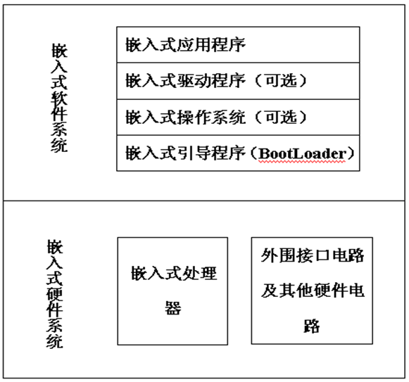
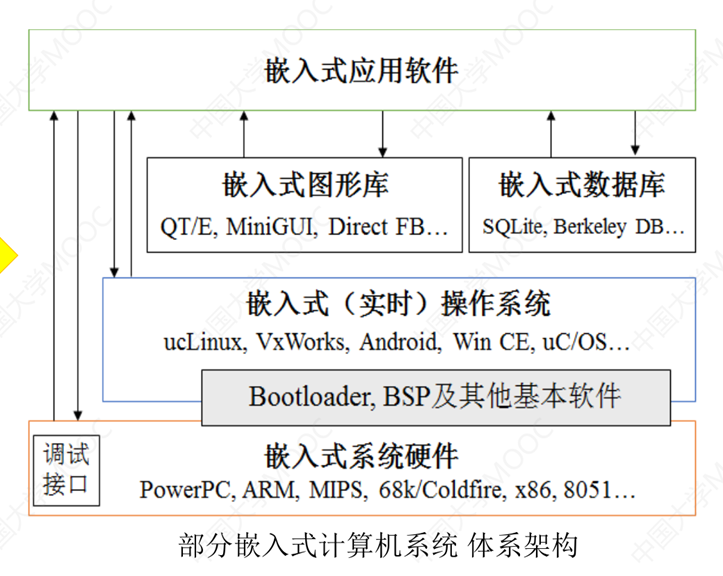
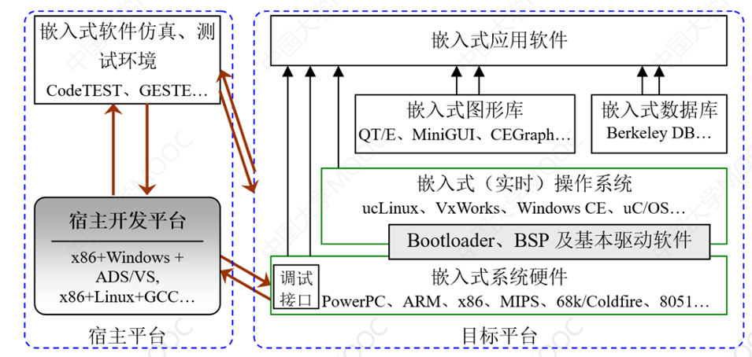

# 1.嵌入式阶段发展

1.  **第一阶段：单芯片可编程控制器系统(芯片)**
    *   **特点**：无操作系统支持，使用汇编语言直接控制，运行结束后清除内存。
    *   **性能**：系统结构和功能单一，处理效率低，存储容量小，几乎无用户接口。
2.  **第二阶段：嵌入式 CPU 与简单操作系统(芯片+简单操作系统)**
    *   **特点**：多种 `CPU`，通用性弱，系统开销小，效率高，操作系统兼容性和扩展性有限。
    *   **功能**：主要用于控制系统负载和监控应用程序运行，用户界面不够友好。
3.  **第三阶段：嵌入式操作系统(芯片+复杂操作系统)**
    *   **特点**：兼容多种微处理器，内核精小、高效，模块化和扩展性强。
    *   *： 持文件管理、多任务、网络、图形界面等，提供丰富的 `API`，简化应用程序开发。
4.  **第四阶段：嵌入式 Internet(芯片+复杂操作系统+网络)**
    *   **特点**：嵌入式系统与 `Internet(互联网)` 结合，推动技术发展。
    *   **趋势**：随着 `Internet(互联网)` 技术的发展，嵌入式设备将逐渐与 `Internet(互联网)` 连接

# 2.嵌入式的处理器
-   **嵌入式微处理器(MPU - Embedded MicroProcessor Unit)** `MPU` 是一种专为嵌入式应用设计的微处理器，由通用计算机 `CPU` 发展而来，是增强型的微处理器，通常具有较高的处理能力和灵活性。高性能，适合复杂计算和多任务处理，通常需要外部存储器和外设。

    | 处理器架构 | 制造公司     |
    | ---------- | ------------ |
    | ARM        | ARM 公司      |
    | PowerPC    | MOTOROLA 公司 |
    | 68000      | MOTOROLA 公司 |
    | MIPS       | MIPS 公司     |

-   **嵌入式微控制器(MCU - MicroController Unit)** 是一种集成了处理器、内存和外设接口...计算机主要硬件的单芯片解决方案（还可能内置 `ROM/EPROM/RAM/总线/总逻辑/定时器/Watchdong/IO/串行口...`），专为控制应用设计。低功耗、低成本，适合简单控制任务，通常具有丰富的 `I/O` 接口和内置外设。

    | 类型       | 处理器系列                              |
    | ---------- | --------------------------------------- |
    | 通用系列   | 8051, MCS251, MCS-96/196/296            |
    | 半通用系列 | 支持 I2C, CAN BUS 及众多专用 MCU 和兼容系列 |

-   **嵌入式数字信号处理器(EDSP - Embedded Digital Signal Processor)** 是一种专门用于处理数字信号的微处理器，优化了信号处理算法的执行。高效的数学运算能力，适合音频、视频和通信信号处理，通常具有专用的硬件加速器。

    | 处理器系列            | 制造公司               |
    | --------------------- | ---------------------- |
    | TMS320C2000/C5000 系列 | Texas Instruments (TI) |
    | MCS-296               | Intel                  |

-   **嵌入式片上系统(SoC - System On Chip)** `SoC` 是一种将所有必要的组件（如处理器、内存、外设等）集成在单一芯片上的解决方案，一般来说包办了手机上的所有功能。高度集成，减少了物理空间和功耗，适合智能手机、平板电脑和其他复杂设备。

    | 公司   | 高端处理器    | 中端处理器    | 低端处理器    |
    | ------ | ------------- | ------------- | ------------- |
    | 高通   | 骁龙 8 系列     | 骁龙 7 系列     |               |
    | 华为   | 海思麒麟 9 系列 | 海思麒麟 8 系列 | 海思麒麟 7 系列 |
    | 三星   | Exynos 系列    |               |               |
    | 联发科 | 天玑系列      | Helio P 系列   | MTK6 系列      |

-   **嵌入式可编程片上系统(SOPC - System On Programmable Chip)** 是一种可编程的 `SoC`，允许用户根据特定需求配置硬件功能。灵活性高，用户可以根据应用需求自定义硬件逻辑，适合快速原型开发和特定应用。

    | 处理器类型                  | 制造公司                    | 特点                                                         |
    | :-------------------------- | :-------------------------- | :----------------------------------------------------------- |
    | 嵌入式可编程片上系统 (SOPC) | Altera（现为 Intel）、Xilinx | 可编程性高，允许用户根据需求自定义硬件逻辑，适合快速原型开发和特定应用。 |

# 3.嵌入式操作系统

## 3.1.嵌入式操作系统基本功能

-   **进程调度**：管理和调度进程的执行顺序和资源分配
-   **内存管理**：管理系统内存的分配和回收（不包括虚拟内存）
-   **设备管理**：管理和控制外部设备的访问和操作
-   **文件管理**：管理文件的创建、删除、读写和存储
-   **中断管理**：处理和管理硬件和软件中断的响应
-   **系统接口**：提供 `API` 调用，供应用程序与操作系统交互

并且操作系统本身最好是可裁剪可配置、具备网络功能、实时操作系统...

## 3.2.嵌入式操作系统常见系统

| 操作系统   | 描述                                                         | 状态   |
| :--------- | :----------------------------------------------------------- | :----- |
| Linux      | 一个开源的操作系统。                                         | 现役   |
| VxWorks    | 美国 Wind River 公司于 1983 年开发，具有可靠、实时、可裁减特性。 | 现役   |
| µC/OS-II   | 免费，面向中小型嵌入式系统应用。                             | 现役   |
| WinCE      | 微软针对个人电脑以外的电脑产品研发的嵌入式操作系统，CE 为 Customer Embedded 的缩写。 | 已没落 |
| PalmOS     | Com 公司产品，在 PDA 市场占据很大份额，具有开放的操作系统 API，用户可灵活定制。 | 已没落 |
| Symbian    | 为手机设计的操作系统，前身为 Psion 的 EPOC，支持 Java 的 SmartPhone 平台。2008 年被诺基亚收购，2011 年宣布放弃，市场份额逐渐萎缩。 | 已没落 |
| µCLinux    | 源码开放的操作系统，面向没有 MMU 的硬件平台。                | 现役   |
| MontaVista | 针对嵌入式系统的 Linux 发行版，提供实时性能。                | 现役   |
| RT-Linux   | 实时 Linux 版本，适用于实时应用。                            | 现役   |
| RT-Thread  | 轻量级实时操作系统，适用于嵌入式设备。                       | 现役   |
| iOS        | 苹果公司开发的移动操作系统，专为 iPhone、iPad 和 iPod Touch 设计，具有高安全性和用户友好的界面，支持丰富的应用生态系统。 | 现役   |
| Android    | 意为“机器人”，是 Google 于 2007 年发布的基于 Linux 的开源手机操作系统，包含操作系统、中间件、用户界面和应用软件，旨在为移动终端提供开放和完整的软件平台。 | 现役   |

# 4.嵌入式开发基础

## 4.1.嵌入式系统开发结构

-   **嵌入式系统硬件**：由嵌入式处理器及各种外围电路构成；有标准、规范的硬件结构，而嵌入式系统面向领域，其硬件结构、I/O 类型与数量等都各有不同；包括，嵌入式处理器（或嵌入式微处理器、微控制器、DSP、SOC、FPGA）、多样的存储介质、复位电路、时钟电路、总线控制、丰富 I/O 接口等；
-   **嵌入式系统软件**：小规模嵌入式系统资源少、任务单一、管理简单，可不使用嵌入式操作系统，如单片机直接执行固化的嵌入式软件；复杂的嵌入式系统的内存管理、I/O 管理、任务调度等均较复杂，需要一个特殊系统软件进行管理，同时对应用软件层屏蔽底层那个键特征（嵌入式操作系统 EOS）；网络协议栈、数据库、图形库、文件系统等软件组成；
-   **嵌入式应用软件**，因系统而异；裸机软件、基于嵌入式操作系统的软件。

## 4.2.嵌入式系统开发模式

>   区分：`arm` 架构和 `x86` 架构的区别
>
>   -   **功耗效率**：`ARM` 架构设计注重低功耗，适合电池供电的移动设备。相比之下，`x86` 架构通常功耗较高，这在移动设备中会导致更快的电池耗尽。
>   -   **热管理**：`ARM` 处理器在运行时产生的热量相对较低，这使得它们更适合紧凑的移动设备设计，而 `x86` 处理器在高负载下可能会产生较高的热量，需要更复杂的散热解决方案。
>   -   **集成度**：`ARM` 架构的设计允许将多个功能集成到单一芯片上（如 `SoC`，系统级芯片），这有助于减少设备的体积和成本。`x86` 处理器通常需要更多的外部组件，增加了设计复杂性和成本。
>   -   **生态系统**：`ARM` 架构在移动设备市场上已经建立了强大的生态系统，包括操作系统（如 `Android` 和 `iOS`）、开发工具和应用程序。这种生态系统的成熟使得 ARM 成为移动设备的首选架构。
>   -   **成本**：`ARM` 处理器通常比 `x86` 处理器便宜，尤其是在大规模生产时，这使得制造商能够降低设备的整体成本。
>
>   造成上述差别的原因是：`ARM` 采用 `精简指令集计算(RISC)` 设计，强调高效的指令执行和低功耗。这种设计使得 `ARM` 处理器在执行简单任务时能够以更低的能耗和更高的效率运行。`x86` 采用 `复杂指令集计算(CISC)` 设计，支持更多的指令和功能，虽然在性能上可能更强大，但通常伴随着更高的功耗和热量。

这里我们再细细研究下 `ARM` 处理器架构，待补充...

-   1978 年，**CPU 公司**（Cambridge Processor Unit Ltd.）由克里斯·库里（Chris Curry）和赫尔曼·豪瑟（Hermann Hauser）成立，最初专注于制作赌博机等电子产品。到了 1979 年，随着业务的转型，公司更名为 **Acorn Computer Ltd**，并开始专注于家用计算机领域，开发了 Acorn System 1 等产品。随后，公司在 1981 年推出了广受欢迎的 BBC Micro，这款计算机成为英国教育领域的标志性设备，并奠定了 Acorn 在计算机历史中的重要地位。
-   1990 年，**Acorn**、**苹果** 和 **VLSI Technology** 三方合作，成立了一家名为 **Advanced RISC Machines (ARM) Ltd.** 的公司，专门负责开发和推广 Acorn 设计的低功耗、高效能的 **ARM 处理器**。ARM 处理器基于 **精简指令集计算机**（RISC）架构，与传统的复杂指令集计算机（CISC）相比，ARM 处理器具有更低的功耗和更高的效率，适合移动设备和嵌入式系统。
-   成立 ARM 公司后，ARM 架构开始广泛应用于各种设备。苹果使用 ARM 技术开发了 **Apple Newton**，虽然 Newton 本身并不成功，但 ARM 技术逐渐获得了其他厂商的青睐。随着时间推移，ARM 成为了全球处理器架构的领导者，特别是在智能手机、平板电脑和嵌入式设备中。今天，绝大多数的移动设备和许多嵌入式系统都使用 ARM 架构的处理器。
-   ARM 在 1990 年成立后，决定改变其产品策略，不再直接生产芯片，而是以授权的方式将芯片设计方案转让给其他公司，即采用“**Partnership**”开放模式。ARM 采取了 **IP（Intellectual Property，知识产权）授权** 的商业模式，通过收取一次性技术授权费用和版税提成来盈利。
    *   **1991 年**，ARM 首次将其产品授权给英国的 **GEC Plessey 半导体公司**，标志着其 IP 授权模式的开始。
    *   **1993 年**，ARM 成功将其产品授权给美国的 **Cirrus Logic** 和 **德州仪器（Texas Instruments，TI）**，进一步扩大了合作范围。
    *   **同年**，ARM 为 **诺基亚** 专门开发了 16 位定制指令集，以缩减内存空间占用，使得 ARM 处理器更加适合移动设备中的嵌入式应用。
-   **1998 年 4 月 17 日**，业务飞速发展的 **ARM 控股公司**，在 **伦敦证券交易所** 和 **纳斯达克** 同时上市，进一步扩大了公司在全球的影响力。
-   **2008 年**，**谷歌推出 Android（安卓）操作系统**，该系统基于 ARM 指令集，使得 ARM 处理器成为智能手机市场的核心。
-   **2011 年**，曾长期与英特尔（Intel）合作的微软宣布，**Windows 8 平台将支持 ARM 架构**，这是“Wintel 联盟”转向多架构支持的重要一步。
-   **2010 年 6 月**，**苹果公司** 向 ARM 董事会提出收购意向，拟以 **85 亿美元** 的价格收购 ARM 公司，但遭到 ARM 董事会的拒绝。
-   **2016 年 7 月 18 日**，日本 **软银集团** 创始人 **孙正义** 以 **243 亿英镑**（约合 309 亿美元）的价格成功收购了 ARM 集团，进一步推动了 ARM 在全球技术市场的扩展。

ARM 采用的技术：

-   **RISC 架构（精简指令集计算机）** ARM 处理器基于 **RISC**（Reduced Instruction Set Computer）架构，简化了处理器执行的指令集。RISC 架构的特点是每条指令执行时间固定、指令集小、设计简单，这使得 ARM 处理器能够在执行效率和功耗之间找到最佳平衡，非常适合移动设备和嵌入式系统。
-   **低功耗设计** ARM 的设计理念是低功耗为优先，因此处理器在执行相同任务时比传统的 CISC 架构（如 x86）耗电更少。ARM 通过降低时钟频率、优化电路设计和动态调整电源使用等技术，减少功耗，延长设备的电池寿命。
-   **Thumb 指令集** ARM 引入了 **Thumb** 指令集，它是 ARM 的一种压缩指令集，使用 16 位指令代替常规的 32 位指令，减少了内存占用，并提高了代码密度，同时保持良好的性能。这对于内存资源受限的嵌入式系统尤其有帮助。
-   **ARM TrustZone** **TrustZone** 是 ARM 的硬件安全技术，旨在为处理器提供安全环境。TrustZone 将系统划分为普通执行环境和安全执行环境，使得敏感操作（如密码存储、支付信息处理等）可以在受保护的区域内安全执行。
-   **Cortex 系列** ARM 处理器的 **Cortex** 系列是其最新一代的 CPU 内核架构，分为高性能的 Cortex-A 系列、低功耗的 Cortex-M 系列以及适中的 Cortex-R 系列，分别面向智能手机、嵌入式设备和实时处理系统。

感觉 [这个文章](https://m.elecfans.com/article/666613.html) 一般...